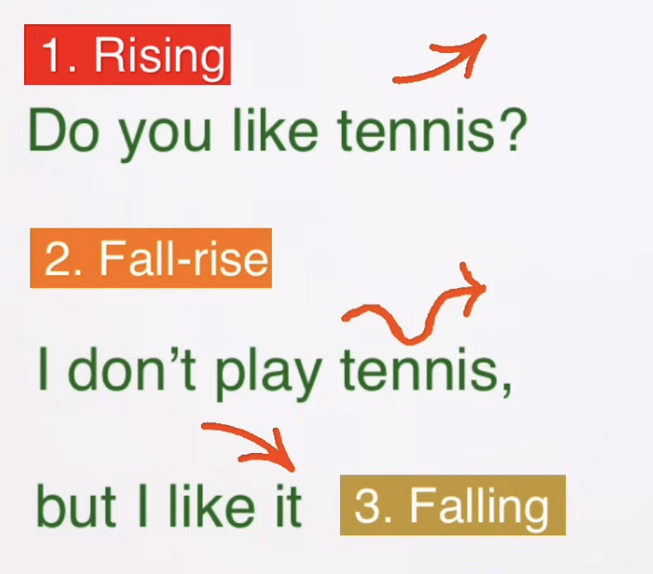
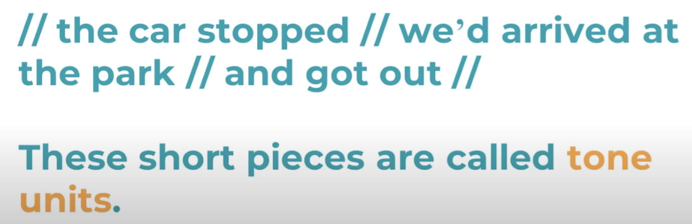

## What is intonation in English? How many types does it have?
Intonation is The Melody of spoken English.
It is the way in which your voice Rises and falls as you speak

To highlight the central point in a sentence: Raising the intonation on a certain word in a sentence.

To show the altitude of the speaker: Intonation + Facial expressions

Three main Intonation Patterns:
* Rising
  * End of Yes/No questions
    Is he sad(⬆️)？
* Fall-Rise:
  * sth is not complete, we are uncertain of sth or we still want to continue the sentence and it is not finished yet.
    I am tired(⬇️⬆️), but let’s go out and have some fun.
  * can be seperate in two words
    * An alternative questions
      Are you watching the movie(⬆️) or not(⬇️)?
      Is he sitting(⬆️) or standing(⬇️)?
    * constrast
      She is quite a good teacher(⬆️), but she is a bit old(⬇️)!
* Falling: 
  * To talk about sth will definitely happen or that is complete
  * End of WH questions
    why Do you study English(⬇️)?

## Intonation in English - English Pronunciation Lesson
* **Rising**
  * sentence not finished
    She’s a lawyer(⬆️), although she isn’t working at the moment.
  * ‘old’ information
* **Falling**
  * end of sentence 
    She’s a lawyer(⬇️).
  * ’new’ information
* **Rising-falling**
* **Falling-rising**
* Flat
* High
* Low

## A Step-by-Step Guide to Perfect British Intonation

* Open-Ended questions(while normally falling) can end on a rising tone to show surprise
  How are you(⬆️)?
* Question tags have a rising tone if it’s a real question, but a falling tone if we think we already know the answer.
  Beautiful day, isn’t it(⬇️)?
* Only Stress the content words (not the helper words)
  * Content words
    * Verbs (except auxiliary verbs)
    * Adjectives
    * Nouns
    * Adverbs
  * Helper words
    * To Be
    * To have
    * Conjunctions
    * Prepositions
    * Articles (the, a, an)
    * Pronouns
  I ~fell over~ on the ~street~ because it was ~icy~.
  I’m ~making scones~ for my ~friends~ at ~school~.
* Change the meaning with emphasis
* Lists
  * down, down, down, up
  * up, up, up, down
  change at the end to indicate no more
* Emotion
  * Positive surprise: A rising tone on the last content word
    I don’t believe(⬆️) it!
  * Negative surprise: A falling tone on the last content word
    I don’t believe(⬇️) it.
  * … (not so necessary to master)

## [Sentence Stress and Intonation in English \(The Complete Guide\)](https://www.youtube.com/watch?v=_P7_69FeqnU)
English is **Stress-timed language**.
> **Stress-timed languages** and **syllable-timed languages** refer to different types of rhythmic patterns in speech.
> * **Stress-timed language**: In stress-timed languages, **the intervals between stressed syllables tend to be roughly equal**, regardless of the number of unstressed syllables between them. This means the rhythm is determined by the stress patterns. English, German, and Russian are examples of stress-timed languages.
>   Example: In the sentence "The cat sat on the mat," the words "cat" and "mat" are stressed, and the timing between these stressed syllables is relatively equal.
> * **Syllable-timed language**: In syllable-timed languages, each syllable takes approximately the same amount of time to pronounce. This creates a more even and regular rhythm. Spanish, French, and Italian are examples of syllable-timed languages.
>   Example: In the Spanish phrase "La casa es bonita," each syllable is pronounced with equal timing, creating a steady rhythm.
Stress content word.
## [English Pronunciation - Sentence Stress and Rhythm](https://www.youtube.com/watch?v=TFkt8aRVpfg)
* Word Stress
  - Word stress refers to the emphasis placed on a specific syllable within a word. In English, each word with more than one syllable **has one syllable that is stressed** more than the others.
  - For example, in the word "computer," the stress is on the second syllable: com**PU**ter.
  - Incorrect word stress can make words difficult to understand or change their meaning. For instance, "record" as a noun (REcord) vs. "record" as a verb (reCORD).
* Sentence Stress
  - Sentence stress refers to **the emphasis placed on certain words** within a sentence. Generally, content words (nouns, main verbs, adjectives, and adverbs) are stressed more than function words (articles, prepositions, auxiliary verbs, and conjunctions).
  - For example, in the sentence "She gave him a beautiful gift," the stressed words are "gave" and "beautiful gift."
  - The pattern of sentence stress helps to convey the speaker's intent and highlights the important information in the sentence. Changing the stress can alter the meaning or focus of the sentence. For example:
    - “She gave him a **beautiful** gift" (emphasizing the beauty of the gift).
    - "She **gave** him a beautiful gift" (emphasizing the act of giving).

Sentence stress is important when you want to learn about the rhythm, that is the beat of english.

Sentence stress give rhythm to English.

Standard Sentence Stress: The timing between two constent word is the same.
eg: 
* I have SOLD my HOUSE and Moved to SPAIN.
* 1 and then a 2 and then a 3 and then a 4.

## [Intonation Patterns in English | Pronunciation | Speaking Naturally](https://www.youtube.com/watch?v=UTuKCvK0RIQ&list=PL2xSrncgBnNbkZX2HFps_7OMW6qN3VszY&index=1)
Intonation is
* Pitch of voice
  The pitch of a voice refers to how high or low a sound is. It's determined by the frequency of the sound waves produced by the vocal cords
* stress & rhythm
=> combined to produce meaning
> Intonation = pitch changes to express meaning & altitude
> pitch = low OR high (~165 to 255 hz)
> volume = loud OR quiet
* Statement: falling
* Tag Questions: ‘, isn’t it?’ or ‘, didn’t they?’ or ‘, do i?’ or ‘, right?’ …
  * rising: not quite sure, need confirmation
  * falling: Not a real question, but a statement
### Tone Unit

Tone unit are basic building blocks of spoken English.
When we hear spken English, it is heard as organized into tone units.
In a tone unit all the sounds of the words join together.
They are **linked**.
Often a tone unit sounds like one long word. 
In each of these tone units some syllables are stressed more than the others.
The last stressed syllable is called the **tonic syllable**, and usually have a falling pitch.
the CAR(⬆️) STOPPED(⬇️)

Two ways of listening
* What: content
* How: pronounciation

### pitch

In english, a higher pitch is used for informational contrast, e.g. in contrastive stress or to emphasize something.

In English, stress refers to the emphasis placed on certain syllables within words (word stress) or certain words within sentences (sentence stress).
**Stress can involve both pitch and volume**, as well as duration and vowel quality. Here's how each aspect plays a role:
* **Pitch**: Stressed syllables often have a **higher or more varied**(high and sometimes a little bit rising) pitch compared to unstressed syllables.
* **Volume**: Stressed syllables are typically louder.
* **Duration**: Stressed syllables are usually longer in duration.
* **Vowel Quality**: Stressed syllables often use full vowels, while unstressed syllables may use reduced vowels (like the schwa sound, /ə/).
⠀For example, in the word "banana":
* The second syllable "na" is stressed: ba**NA**na.
* It’s higher in pitch, louder, longer, and has a clear vowel sound.

### High Rising Terminal (HRT)
high rising terminal = rising intonation in statements
More used in some parts of the US and Australia.
No need to learn.

### The Last Lexical Item Rule (LLI)
The main stress falls on the last lexical item in a tone unit.
**Unless** the speaker wants to change the neural(=unmarked) emaning of the sentence.

**Lexical Items**: words that carry meaning, namely content words

**LLI**: the tonic syllable is the syllable carrying primary stress in the last lexical item of the tone unit.

#### Exceptions
* Old informatioin
  The best(⬆️) cake(⬇️) is chocolate(⬇️ not ⬆️) cake (original LLI).
  (cake is old information, so the last lexical item is chocolate)
* Repetition of synonyms: same as ‘Old information’ except the **repeated word** has been exchanged for a **synonym**.
* Context
  Sometimes the word doesn’t need to have been mentioned before to be considered old information because (the context tells us already = general knowledge)
  I (had to go to the pricipal)(general knowledge: a bad thing) today.
  Why? You never do anything(⬇️) bad(original LLI).
* Empty words： Words that have very low semantic content
  Examples: people, thing, things, stuff, place, that woman, this guy…
  He just does it to annoy(⬇️) people(original LLI).
  I love(⬇️) that place(original LLI).
* Contrastive stress: When we move the normal stress to change the meaning.
  * She bought the coat(⬇️). (normal case)
  * She bought(⬇️) the coat.(not steal)
  * She(⬇️) bought the coat. (not he or me)

