## title: 【BE】Review Week2
date: 2025-07-07 00:00:00+0000
categories: 
- arts
- willow
## 可重复读

在数据库事务中，**可重复读（Repeatable Read, RR）** 隔离级别通过 **多版本并发控制（MVCC）** 和 **锁机制** 的组合实现数据隔离，确保同一事务内多次读取相同数据的结果一致。以下是具体实现原理：


------
### **核心实现机制**

#### **多版本并发控制（MVCC）**

- 数据版本快照：
  - 事务启动时创建一致性视图（Consistent Read View），记录当前所有活跃事务ID。
  - 每次读取数据时，根据事务ID选择**已提交的最新版本**（通过回滚日志 Undo Log 回溯）。
- 版本链管理：
  - 每条数据行隐藏 `DB_TRX_ID`（事务ID）和 `DB_ROLL_PTR`（回滚指针），指向历史版本。
  - 示例：
    ```
    数据行: [值="A", 事务ID=100, 回滚指针→版本1]
    版本1: [值="B", 事务ID=80]  // 更早的版本
    ```
#### **锁机制**

- 间隙锁（Gap Lock）：
  - 锁定索引记录之间的间隙（如 `id BETWEEN 5 AND 10`），防止其他事务插入新数据（解决幻读）。
  - 例如：事务A查询 `age=20` 的记录时，会锁定 `age=20` 前后的索引间隙。
- 临键锁（Next-Key Lock）：
  - 组合记录锁（行锁）与间隙锁，锁定行及相邻间隙（如 `(10, 20]`）。
  - 防止其他事务修改或插入影响查询范围的数据。


------
### **如何解决并发问题**

| **并发问题**   | **解决方案**                                                 |
| -------------- | ------------------------------------------------------------ |
| **脏读**       | MVCC 只读取已提交的数据版本。                                |
| **不可重复读** | 事务内所有读操作基于同一快照视图，不受其他事务更新影响。     |
| **幻读**       | 间隙锁/临键锁阻塞其他事务在查询范围内的插入操作（如 MySQL InnoDB）。 |


------
### **不同数据库的实现差异**

#### **MySQL InnoDB**

- RR 级别默认解决幻读：
  - 通过临键锁（Next-Key Lock）锁定索引范围。
  - 示例：
    ```
    -- 事务A
    SELECT * FROM users WHERE age > 20 FOR UPDATE; -- 锁定 age>20 的索引范围
    -- 事务B 插入 age=25 的数据会被阻塞
    ```
- 快照生成时机：
  - 第一条读语句执行时创建一致性视图（非事务开始时刻）。
#### **PostgreSQL**

- RR 级别通过快照隔离实现：
  - 事务启动时创建快照（`START TRANSACTION ISOLATION LEVEL REPEATABLE READ`）。
  - 依赖 MVCC 避免不可重复读，但**不彻底解决幻读**（需显式加锁）。
- 显式锁防幻读：
  ```
  SELECT * FROM table WHERE condition FOR UPDATE; -- 行级锁阻塞其他写入
  ```
#### **Oracle**

- **默认隔离级别为读提交（Read Committed）**。
- 可重复读需使用 `SET TRANSACTION ISOLATION LEVEL SERIALIZABLE`，基于回滚段构造历史版本。


------
### **性能与权衡**

| **机制**       | **优势**             | **代价**                               |
| -------------- | -------------------- | -------------------------------------- |
| **MVCC**       | 读操作无锁，高并发   | 写操作需维护版本链，增加 Undo Log 开销 |
| **间隙锁**     | 彻底解决幻读         | 锁范围扩大，可能降低写入并发           |
| **一致性视图** | 读操作无需等待锁释放 | 长事务可能导致大量历史版本堆积         |


------
### **实际应用建议**

1. 避免长事务：
   - 减少一致性视图的保留时间，防止 Undo Log 膨胀（如 MySQL 的 `innodb_max_purge_lag`）。
2. 索引优化：
   - 合理设计索引，缩小间隙锁范围（如使用唯一索引）。
3. 显式锁控制：
   - 必要时用 `FOR UPDATE` 锁定关键数据（如账户余额更新）。


------
### **总结**

- **可重复读的本质**：通过 **MVCC 快照** 保证读取一致性，辅以 **间隙锁/临键锁** 解决幻读。
- 数据库差异：
  - MySQL 的 RR 默认防幻读（依赖锁），PostgreSQL 需显式加锁。
  - 长事务场景需警惕版本存储开销。
- **适用场景**：对数据一致性要求较高的操作（如对账、统计），但需平衡并发性能。
## 读已提交

**读已提交（Read Committed, RC）** 隔离级别通过 **动态数据版本选择** 和 **短时锁机制** 实现，核心目标是保证事务只读取已提交的数据，但允许多次查询结果不一致（不可重复读、幻读）。以下是具体实现原理：


------
### **核心实现机制**

#### **多版本并发控制（MVCC）的动态快照**

- **快照生成时机**：
  每次执行 `SELECT` 语句时创建独立的数据快照（*非事务级别快照*）。
  - 示例：
    ```
    -- 事务A
    SELECT * FROM users;         -- 快照1：读取已提交数据
    -- 事务B更新并提交
    SELECT * FROM users;         -- 快照2：读取事务B提交后的新数据
    ```
- **数据可见性规则**：
  仅返回查询*执行前已提交*的数据版本（通过事务ID判断），忽略未提交或后提交的数据。
#### **写操作的锁机制**

- **行级排他锁（Exclusive Lock）**：
  - 更新数据时加锁，阻塞其他事务修改同一行。
  - 示例：
    ```
    -- 事务A更新id=1的行（加行锁）
    UPDATE users SET balance = 100 WHERE id = 1;
    -- 事务B尝试更新同行的操作会被阻塞
    ```
- **锁释放时机**：
  提交或回滚时立即释放锁（*RC级别无间隙锁*）。


------
### **解决与未解决的并发问题**

| **问题**       | **解决情况** | **原理**                 |
| -------------- | ------------ | ------------------------ |
| **脏读**       | ✅ 完全解决   | 只读取已提交的数据版本   |
| **不可重复读** | ❌ 可能发生   | 每次读操作生成不同快照   |
| **幻读**       | ❌ 可能发生   | 无间隙锁，允许插入新数据 |


------
### **不同数据库的实现差异**

#### **MySQL InnoDB**

- MVCC 实现：
  - 每次 `SELECT` 通过 `ReadView` 动态筛选已提交事务（记录活跃事务ID列表）。
  - 更新操作时直接修改数据行，其他事务通过 Undo Log 回溯旧版本。
- 锁行为：
  - `UPDATE/DELETE` 使用行锁，但无间隙锁（允许范围插入）。
#### **PostgreSQL**

- 基于快照隔离：
  - 默认隔离级别为读已提交（`SET default_transaction_isolation = 'read committed'`）。
  - 每次查询使用 `pg_snapshot` 判断数据可见性。
- 显式锁防冲突：
  ```
  SELECT * FROM table FOR SHARE;  -- 显式加共享锁阻塞写入
  ```
#### **Oracle**

- 读已提交为默认级别：
  - 通过回滚段（Rollback Segments）构造查询开始时的数据镜像。
  - 写操作阻塞同行更新，无阻塞读取。


------
### **性能优化与风险控制**

| **机制**     | **优势**                             | **风险**                       |
| ------------ | ------------------------------------ | ------------------------------ |
| **动态快照** | 读写无冲突，高并发                   | 不可重复读和幻读               |
| **无间隙锁** | 范围写入并发度高（可自由插入新数据） | 范围查询结果可能变化（幻读）   |
| **短时行锁** | 锁竞争少，事务吞吐量高               | 更新冲突需重试（如乐观锁机制） |


------
### **应用场景与最佳实践**

#### **适用场景**

- 数据一致性要求适中（如实时数据展示）。
- 高并发写入场景（如订单状态更新）。
- 短事务操作（避免长事务导致的锁冲突）。
#### **优化建议**

- 乐观锁控制重试：
  通过版本号避免并发更新冲突：
  ```
  UPDATE table SET value=新值, version=version+1 
  WHERE id=1 AND version=当前版本; -- 若失败则重试
  ```
- **避免依赖多次查询结果**：
  不可重复读敏感的操作用可重复读（RR）或串行化（Serializable）。
- **监控锁争用**：
  MySQL可通过 `SHOW ENGINE INNODB STATUS` 检查行锁等待。


------
### **总结**

- **读已提交的核心**：
  ​**动态快照**​（语句级MVCC） + ​**短时行锁**​（更新阻塞同行写入）。
- 与可重复读（RR）的差异：
  | **特性**     | **读已提交（RC）** | **可重复读（RR）**    |
  | ------------ | ------------------ | --------------------- |
  | **快照时机** | 每次查询生成新快照 | 事务开始后固定快照    |
  | **幻读处理** | 不解决（无间隙锁） | 通过间隙锁/临键锁解决 |
  | **写并发度** | 更高（锁范围小）   | 较低（锁范围大）      |
- **业务选择**：
  优先RC以提升并发，若需一致性则升级到RR或显示加锁（`SELECT ... FOR UPDATE`）。
## RC & RR

# 读已提交（RC）与可重复读（RR）隔离级别深度对比

> ⚖️ **核心区别总结**：
> RC是**语句级一致性**​（每次查询看到最新提交），RR是**事务级一致性**​（整个事务看到固定快照）——这一差异引发锁机制、并发问题解决的全面不同。
## 核心机制差异对比

| **特性**           | **读已提交（RC）**                   | **可重复读（RR）**                           |
| ------------------ | ------------------------------------ | -------------------------------------------- |
| **一致性快照**     | 每次执行SELECT时生成新快照（语句级） | 事务启动后第一条SELECT生成固定快照（事务级） |
| **锁范围**         | 仅行锁（锁定更新行）                 | 行锁 + 间隙锁（锁定数据范围和间隙）          |
| **MVCC版本选择**   | 返回查询时**已提交的最新版本**       | 返回事务开始时**已提交的最新版本**           |
| **典型数据库默认** | PostgreSQL, Oracle                   | MySQL InnoDB                                 |
https://example.com/mvcc-diff.png
*(示意图：RC每次读看到新提交数据，RR始终看到事务开始时的数据镜像)*
## 并发问题解决能力

| **并发问题**         | **读已提交（RC）** | **可重复读（RR）** | **原因分析**                        |
| -------------------- | ------------------ | ------------------ | ----------------------------------- |
| **脏读(Dirty Read)** | ✅ 完全解决         | ✅ 完全解决         | 二者都只读取已提交数据              |
| **不可重复读**       | ❌ **可能发生**     | ✅ 完全解决         | RC每次读新快照，RR固定快照          |
| **幻读(Phantom)**    | ❌ **可能发生**     | ⚠️ **部分解决**     | MySQL用间隙锁解决，PostgreSQL不保证 |
> 🔍 **幻读的特殊说明**：
>
> - MySQL的RR通过**间隙锁(Gap Lock)** 防止新数据插入（彻底解决幻读）
> - PostgreSQL的RR仅用快照隔离，需显式锁（`SELECT FOR UPDATE`）防幻读
## SQL示例演示关键差异

### 场景：银行账户余额查询

```
-- 初始数据: id=1, balance=100
事务A:
  START TRANSACTION;
  SELECT balance FROM account WHERE id=1;  -- 返回100 (时刻T1)
  
事务B:
  UPDATE account SET balance=200 WHERE id=1; 
  COMMIT;                                 -- 在T1后提交

事务A:
  SELECT balance FROM account WHERE id=1;  -- RC返回200, RR返回100
  COMMIT;
```
### 幻读验证（MySQL环境）

```
事务A (RR隔离):
  SELECT * FROM users WHERE age BETWEEN 20 AND 30; -- 返回2条记录(时刻T1)
事务B:
  INSERT INTO users(name,age) VALUES ('Bob',25); 
  COMMIT;                                          -- 插入新数据
事务A:
  SELECT * FROM users WHERE age BETWEEN 20 AND 30; -- RC返回3条, RR仍返回2条(间隙锁阻塞B插入)
```
## 性能与锁机制影响

| **维度**         | **读已提交（RC）**        | **可重复读（RR）**              |
| ---------------- | ------------------------- | ------------------------------- |
| **读性能**       | ⭐⭐⭐⭐ 更高（无间隙锁竞争） | ⭐⭐⭐ 较低（需维护长事务快照）    |
| **写并发度**     | ⭐⭐⭐⭐ 更高（锁范围小）     | ⭐⭐ 更低（间隙锁阻塞范围插入）   |
| **死锁概率**     | ⭐⭐ 较低（仅行锁）         | ⭐⭐⭐⭐ 更高（间隙锁扩大锁冲突）   |
| **系统资源开销** | ⭐⭐ 较低（Undo Log清理快） | ⭐⭐⭐⭐ 较高（长事务保留历史版本） |
> 📊 **压测数据参考**（TPS对比）:
> 在更新密集型场景中，RC通常比RR的吞吐量 ​**高30%-50%​**​（来源：Percona数据库基准测试）
## 不同数据库实现差异

| **数据库**     | **读已提交（RC）行为**                 | **可重复读（RR）行为**                               |
| -------------- | -------------------------------------- | ---------------------------------------------------- |
| **MySQL**      | 无间隙锁，允许幻读                     | 临键锁防幻读，固定快照                               |
| **PostgreSQL** | 语句级快照，显式锁防冲突(`FOR UPDATE`) | 快照隔离不防幻读，需手动锁                           |
| **Oracle**     | 默认级别，通过回滚段构造快照           | 需设置`SET TRANSACTION ISOLATION LEVEL SERIALIZABLE` |
| **SQL Server** | 默认RC，RR使用行版本控制(RCSI)         | 需启用`SNAPSHOT ISOLATION`                           |
## 选型决策树

```
graph TD
  A[需要高并发写入?] -->|是| B(RC隔离级别)
  A -->|否| C{需要严格一致性?}
  C -->|防不可重复读| D[RR]
  C -->|防幻读| E[MySQL选RR, PG用SERIALIZABLE]
  D --> F[评估长事务风险]
  B --> G[添加乐观锁版本控制]
```
### **推荐场景**：

- **选RC**：高并发写入系统（如电商库存）、实时数据分析、短事务场景
- **选RR**：财务对账、批量数据处理、需要稳定视图的操作
- **混合方案**：
  核心业务表用RR（如账户表），高频更新表用RC（如用户日志表）+ 乐观锁控制
> 💡 **黄金实践**：
> 优先尝试RC级别，仅当遇到**实际不可重复读/幻读问题**时才升级到RR——通过监控数据库的`lock_timeout`和`deadlock`指标验证。
## 稳定排序

稳定的排序算法在排序后能够保持相等元素的原始相对位置不变，这对需要多次排序或依赖原始顺序的应用非常重要。以下是常见的稳定排序算法及其特性总结：


------
### 📊 **稳定排序算法概览**

| **算法名称** | **时间复杂度** | **空间复杂度** | **核心思想**                                           | **适用场景**                             |
| ------------ | -------------- | -------------- | ------------------------------------------------------ | ---------------------------------------- |
| **冒泡排序** | O(n²)          | O(1)           | 相邻元素两两比较，将最大/小值逐步“冒泡”到序列末端。    | 小规模数据、教学演示                     |
| **插入排序** | O(n) ~ O(n²)   | O(1)           | 将未排序元素插入已排序序列的合适位置，类似扑克牌整理。 | 部分有序数据、小规模数组                 |
| **归并排序** | O(n log n)     | O(n)           | 分治法：递归拆分数组，合并时保持相等元素顺序。         | 大数据量、需稳定性的场景（如数据库排序） |
| **计数排序** | O(n + k)       | O(n + k)       | 统计元素出现次数，按计数顺序输出结果。                 | 整数范围小（如0~100）                    |
| **桶排序**   | O(n + k)       | O(n + k)       | 将数据分到有序桶中，每桶单独排序后合并。               | 数据均匀分布（如浮点数排序）             |
| **基数排序** | O(n × d)       | O(n + k)       | 按位排序（从低位到高位），每次排序保持稳定性。         | 整数或字符串（如手机号排序）             |
> ⚠️ **注**：
>
> - **k** 为数据范围大小（计数/桶排序），**d** 为数字位数（基数排序）。
> - 非比较排序（计数/桶/基数）通常需额外空间，但时间复杂度可突破 O(n log n) 下限。


------
### 🔍 **稳定性原理简析**

1. 
   冒泡排序
- 只交换相邻元素，相等时不交换，故顺序不变。
2. 
   插入排序
- 相等元素插入时置于后方，不破坏原序。
3. 
   归并排序
- 合并有序子数组时，优先取左侧元素（靠前的相等值）。
4. 
   非比较排序（计数/桶/基数）
- 按统计或分桶顺序输出，天然保持原序。


------
### ⚖️ **如何选择稳定排序算法？**

| **场景**                           | **推荐算法**        | **理由**                                  |
| ---------------------------------- | ------------------- | ----------------------------------------- |
| **小规模数据（n < 100）**          | 插入排序 / 冒泡排序 | 实现简单，常数因子小。                    |
| **大数据量且需稳定性**             | 归并排序            | 时间复杂度稳定 O(n log n)，适合外部排序。 |
| **整数范围小（如年龄、分数）**     | 计数排序            | 时间复杂度 O(n + k)，远快于比较排序。     |
| **多关键字排序（如先按位再按值）** | 基数排序            | 按位排序时低位到高位的顺序稳定性可叠加。  |


------
### 💎 **总结**

- **经典稳定算法**：冒泡、插入、归并。
- **高效稳定算法**：计数、桶、基数（时间复杂度可低至 O(n)）。
- **实际应用**：数据库排序、多关键字排序（如先按日期再按ID）、需要保留原始顺序的场景。
> 🌟 **提示**：在 C++/Python 等语言的标准库中，`std::stable_sort()` 和 `sorted()`（Python）默认使用归并排序或其变体，兼顾稳定与效率。
## 多型数据类型

多型数据类型（Polymorphic Data Type）是计算机科学中的核心概念，指**一种可适配多种具体类型的数据结构或操作接口**，其核心特征在于通过抽象逻辑统一性支持不同数据成分的操作，而无需关注具体类型细节。以下是其详细解析：


------
### 🔍 核心定义与特性

1. **抽象性**
   多型数据类型将数据结构的**逻辑行为**​（如关系、操作）与**具体存储类型**分离。例如，一个"列表"结构可存储整数、字符串或自定义对象，只要支持相同的操作接口（如插入、删除），具体元素类型不影响结构本身的逻辑设计。
2. **灵活性**
   数据元素的类型不固定。例如：
   - 一个三元组（Triplet）可存储 `(int, char, string)` 或 `(float, bool, customClass)`，只要满足基本操作（如比较、排序）。
   - 在数据库中，`NUMERIC` 类型可存储整数或小数，具体精度由用户动态定义。
3. **接口统一性**
   提供**通用操作接口**，适配不同数据类型：
   - 如C++模板 `vector<T>` 可实例化为 `vector<int>` 或 `vector<string>`，共享相同的 `push_back()`、`size()` 等方法。
   - 数据库的 `VARCHAR` 类型统一处理不同长度的字符串。
4. **多态支持**
   分为两类实现方式：
   - **静态多态**：编译时确定类型（如C++模板、泛型编程）。
   - **动态多态**：运行时根据对象类型动态调用操作（如虚函数、接口继承）。


------
### ⚙️ 应用场景与技术实现

1. **泛型编程**
   - C++的STL容器（`std::vector<T>`、`std::map<K,V>`）通过模板实现多型，支持任意可拷贝或可比较的类型。
   - Java/C#的泛型集合（如 `List<T>`）在编译时进行类型擦除或保留。
2. **数据库系统**
   - SQL中的 `NUMERIC(p,s)` 类型可存储整数（`s=0`）或小数（`s>0`），具体类型由精度参数动态决定。
   - SQLite的动态类型允许同一字段存储整数、字符串或二进制数据（除非启用严格模式）。
3. **抽象数据类型（ADT）**
   抽象数据类型（如栈、队列）天然支持多型：
   ```
   ADT Stack {
       数据对象：任意类型元素的集合；
       操作：push(元素), pop(), isEmpty()；
   }
   ```
   无论元素是整数、结构体还是指针，操作逻辑一致。
4. **函数式编程**
   Haskell/ML等语言通过**类型参数化**实现多型函数：
   ```
   length :: [a] -> Int  -- 参数a可为任意类型
   ```


------
### 💎 典型示例：三元组（Triplet）

以下抽象数据类型定义展示多型特性：
```
ADT Triplet {
    数据对象：D = {e1, e2, e3 | e1,e2,e3 ∈ ElemSet}  // ElemSet为任意可比较类型集合
    操作：
        Get(T, i) -> 返回第i个元素；  // 不限定元素类型
        Sort(T) -> 按升序排列；       // 只要元素可比较
}
```
- 可实例化为 `Triplet<int>`、`Triplet<string>` 等。


------
### ⚖️ 多型 vs. 传统类型的区别

| **特性**     | **多型数据类型**               | **传统原子类型**           |
| ------------ | ------------------------------ | -------------------------- |
| 类型确定性   | 运行时或参数化决定             | 编译时固定（如 `int`）     |
| 操作泛化能力 | 支持跨类型统一接口             | 仅限特定类型操作           |
| 存储灵活性   | 可容纳异构数据                 | 仅单一类型                 |
| 典型应用     | 泛型集合、抽象容器、数据库字段 | 基本数值计算、简单状态存储 |


------
### 💡 核心价值

- **代码复用**：同一数据结构或算法适配多种类型，减少冗余代码。
- **类型安全**：静态多态（如模板）在编译时检查类型错误，避免运行时崩溃。
- **抽象封装**：用户无需关注底层类型细节，聚焦逻辑设计。
多型数据类型通过解耦逻辑与实现，成为现代编程语言（如C++/Java/Rust）和数据库系统的基石，显著提升系统的扩展性和可维护性。
## 有向图成环

判断有向图是否存在环（成环）是图论中的核心问题，尤其在任务调度、依赖分析等场景中至关重要。以下是两种主流方法及扩展方案的详细说明：


------
### ⚙️ **深度优先搜索（DFS）法**

**核心思想**：在DFS遍历中，若遇到一条指向**当前递归栈中已访问节点**的边，则说明存在环。
​**实现步骤**​：
1. 
   状态标记：为每个节点定义三种状态：
   - **未访问**（白色）：节点尚未处理。
   - **访问中**（灰色）：节点正在递归栈中被处理。
   - **已访问**（黑色）：节点及其后代已完全处理。
2. 
   递归遍历：
   - 从任意未访问节点启动DFS。
   - 将当前节点标记为**访问中**（灰色）。
   - 遍历其邻接节点：
     - 若邻接点为**未访问**，递归处理。
     - 若邻接点为**访问中**（灰色），则发现环，返回`True`。
   - 当前节点处理完毕，标记为**已访问**（黑色）。
3. **重复检测**：对所有未访问节点重复上述过程。
**代码示例（Python）**：
```
def is_cyclic_dfs(graph):
    visited = [False] * len(graph)  # 记录完全访问过的节点
    rec_stack = [False] * len(graph)  # 记录当前递归栈中的节点

    def dfs(v):
        visited[v] = True
        rec_stack[v] = True
        for neighbor in graph[v]:
            if not visited[neighbor]:
                if dfs(neighbor):
                    return True
            elif rec_stack[neighbor]:  # 邻接点在当前栈中 → 成环
                return True
        rec_stack[v] = False  # 回溯：节点出栈
        return False

    for node in range(len(graph)):
        if not visited[node] and dfs(node):
            return True
    return False
```
**复杂度**：
- 时间复杂度：`O(V+E)`（顶点数+边数）
- 空间复杂度：`O(V)`（递归栈深度）


------
### 📊 **拓扑排序（Kahn算法）**

**核心思想**：**有向无环图（DAG）** 一定存在拓扑序列。若无法生成完整拓扑序列，则说明图中有环。
​**实现步骤**​：
1. **计算入度**：统计每个节点的入边数量。
2. **初始化队列**：将所有**入度为0**的节点加入队列。
3. 拓扑排序：
   - 取出队首节点，加入结果序列。
- 将其邻接节点的入度减1。
   - 若邻接节点入度变为0，则入队。
4. **检测环**：若结果序列长度 **小于节点总数**，说明剩余节点形成环。
**代码示例（Python）**：
```
from collections import deque

def is_cyclic_kahn(graph):
    indegree = [0] * len(graph)
    for u in graph:
        for v in graph[u]:
            indegree[v] += 1  # 统计入度
    
    queue = deque([u for u in range(len(graph)) if indegree[u] == 0])
    count = 0  # 记录已处理的节点数
    
    while queue:
        u = queue.popleft()
        count += 1
        for v in graph[u]:
            indegree[v] -= 1
            if indegree[v] == 0:
                queue.append(v)
    
    return count != len(graph)  # 若count < 总节点数 → 成环
```
**复杂度**：
- 时间复杂度：`O(V+E)`
- 空间复杂度：`O(V)`（队列和入度数组）


------
### ⚖️ **方法对比与适用场景**

| **方法**     | **优势**                           | **局限**                        | **适用场景**             |
| ------------ | ---------------------------------- | ------------------------------- | ------------------------ |
| **DFS法**    | 直观易实现，可定位环的位置         | 递归栈可能溢出（大图需迭代DFS） | 需精确检测环的路径       |
| **拓扑排序** | 非递归实现，适合大图；天然生成序列 | 仅判断是否存在环                | 需拓扑序列或任务调度场景 |


------
### 🔍 **扩展方法**

1. 
   并查集（Union-Find）：
   - **适用场景**：无向图环检测（通过判断边的两点是否同属一个集合）。
   - **局限**：**不直接支持有向图**，需结合其他方法（如DFS）。
2. 
   强连通分量（SCC）：
   - 使用Tarjan或Kosaraju算法计算SCC，若存在节点数>1的SCC，则说明有环。


------
### 💎 **实践建议**

- **小规模图或需环路径**：优先选DFS法，实现简洁且可回溯环。
- **任务调度或依赖分析**：用拓扑排序，同时获得执行序列。
- **图规模极大时**：迭代DFS避免栈溢出，或拓扑排序的队列优化。
```
graph TD
    A[开始] --> B{选择方法}
    B -->|需定位环路径| C[DFS法]
    B -->|需拓扑序列/大图| D[拓扑排序]
    C --> E[递归遍历+状态标记]
    D --> F[入度计算+队列处理]
    E --> G{发现灰色节点？}
    G -->|是| H[返回True]
    G -->|否| I[回溯]
    F --> J{处理节点数=总节点数？}
    J -->|是| K[无环]
    J -->|否| L[有环]
```
通过结合问题需求（如是否需要环的具体路径）和图规模，选择合适算法，可高效解决有向图成环问题。
## 二叉树性质

二叉树是树形数据结构的基础形式，其核心性质可分为以下五类，涵盖结构特征、节点关系及遍历规则等关键方面：


------
### 🌳 基本结构性质

1. **层节点数上限**
   二叉树的第 `i` 层最多有 `2^{i-1}` 个节点（`i \geq 1`，根节点为第 1 层）。
   *例：第 3 层最多含 `2^{2} = 4` 个节点。*
2. **总结点数上限**
   深度为 `h` 的二叉树最多包含 `2^h - 1` 个节点（满二叉树时达到最大值）。
   *例：深度 3 的二叉树最多有 `2^3 - 1 = 7` 个节点。*
3. **叶节点与分支节点的关系**
   对任意二叉树，若叶节点（度为 0）数为 `n_0`，度为 2 的节点数为 `n_2`，则恒有：
   ```
   n_0 = n_2 + 1
   ```
   此性质反映了二叉树中终端节点与非终端节点的数量平衡。


------
### 🏗️ 特殊二叉树的性质

#### **满二叉树**

- 所有非叶节点均有左右子节点，且所有叶节点在同一层。
- 深度为 `k` 时，节点总数固定为 `2^k - 1`。
- 叶节点数 `n_0 = 2^{k-1}`，度为 2 的节点数 `n_2 = 2^{k-1} - 1`。
#### **完全二叉树**

- 除最后一层外为满二叉树，最后一层节点从左向右连续排列。
- 编号规则
  （按层序从 1 至
```
  n
```
编号）：
  - 节点 `i` 的父节点为 `\lfloor i/2 \rfloor`（`i > 1`）。
  - 左子节点为 `2i`（若 `2i \leq n`），右子节点为 `2i+1`（若 `2i+1 \leq n`）。
- 深度公式：`\lfloor \log_2 n \rfloor + 1`。
| **特征**       | **满二叉树**         | **完全二叉树**         |
| -------------- | -------------------- | ---------------------- |
| **结构特点**   | 每层节点满           | 最后一层左侧连续       |
| **节点数**     | `2^k - 1`（深度 `k`) | 任意 `n`，满足紧凑排列 |
| **叶节点位置** | 仅在最底层           | 可分布于最后两层       |
| **适用存储**   | 顺序存储高效         | 顺序存储无空间浪费     |


------
### 💾 存储结构的性质

1. **顺序存储**
   - 仅适用于**完全二叉树**或满二叉树。
   - 节点 `i` 的父节点下标：`\lfloor (i-1)/2 \rfloor`
     左子节点下标：`2i + 1`，右子节点：`2i + 2`（下标从 0 开始）。
2. **链式存储**
   - 二叉链表（含左/右指针）或三叉链表（增加父指针）。
   - 空间开销：每个节点需额外存储 2–3 个指针，但支持动态增删。


------
### 🔍 遍历相关性质

1. **深度优先遍历（递归定义）**
   - **前序**（根左右）：根节点最先访问。
   - **中序**（左根右）：二叉搜索树中输出有序序列。
   - **后序**（左右根）：根节点最后访问，适用于表达式树求值。
2. **层序遍历（队列实现）**
   - 按层从上到下、从左到右访问节点，依赖队列的 FIFO 特性。


------
### ⚙️ 实际应用中的衍生性质

1. **二叉搜索树（BST）**
   - 左子树所有节点值 < 根节点值 < 右子树所有节点值。
   - 中序遍历结果为升序序列。
2. **堆结构（完全二叉树应用）**
   - 大顶堆：父节点值 ≥ 子节点值。
   - 小顶堆：父节点值 ≤ 子节点值，支持高效插入/删除（`O(\log n)`）。
3. **平衡二叉树（AVL/红黑树）**
   - 左右子树高度差 ≤ 1（AVL），确保操作时间复杂度为 `O(\log n)`。


------
### 💎 总结

二叉树的性质既是理论研究的基石（如节点数量关系、层次约束），也是工程实践的核心（如遍历规则、存储优化）。理解这些性质，可高效设计算法（如堆排序、BST 查找），并优化系统结构（如数据库索引、文件系统树）。
## C数组

在C语言中，数组与指针的紧密关系源于其底层内存模型和语法设计，理解这一机制是避免越界访问的关键。以下从原理和防护措施两方面展开说明：


------
### ⚙️ 数组名为何可用 `type*` 表示？

#### **数组名的退化机制**

- 数组名在大多数表达式中
  退化为指向首元素的指针
  （常量指针），例如：
  ```
  int arr[5];
  int *p = arr;  // arr 退化为 &arr[0]，类型为 int*
  ```
- 例外情况：`sizeof(arr)` 返回整个数组的大小（非指针大小），`&arr` 返回整个数组的地址（类型为 `int(*)[5]`）。
#### **内存连续性与指针运算**

- 数组元素在内存中
  连续存储
  ，通过指针偏移可访问其他元素：
  ```
  *(arr + i) 等价于 arr[i]  // 编译器转换为地址计算：首地址 + i×元素大小
  ```
- 多维数组同理，如 `int a[2][3]` 中，`a[i][j]` 被转换为 `*(*(a + i) + j)`。
#### **函数参数传递的隐式转换**

- 数组作为函数参数时，形参可声明为指针或数组，但编译器统一处理为指针：
  ```
  void func(int *arr);       // 等价于 void func(int arr[])
  void func2(int arr[][5]); // 等价于 void func2(int (*arr)[5])
  ```


------
### 🛡️ 如何避免数组越界访问？

#### **静态数组：边界检查**

- 计算数组长度：使用
```
  sizeof
```
获取元素个数：
  ```
  int len = sizeof(arr) / sizeof(arr[0]);  // 仅适用于栈数组
  ```
- 循环边界控制：确保索引满足
```
  0 ≤ index < len
  ```：
```
  for (int i = 0; i < len; i++) { ... }  // 使用 `<` 而非 `<=`
  ```
#### **动态数组：长度显式传递**

- 动态分配内存时，需
  显式记录长度
  并传递：
  ```
  int *arr = malloc(size * sizeof(int));
  if (arr != NULL) {
      for (int i = 0; i < size; i++) { ... }  // 依赖显式传入的 size
  }
  ```
#### **函数设计：长度参数化**

- 函数应接收数组长度作为参数：
  ```
  void print_array(int *arr, int size) {  // 明确传入长度
      for (int i = 0; i < size; i++) { ... }
  }
  ```
#### **防御性编程技术**

- 断言检查
  （Debug模式）：
  ```
  #include <assert.h>
  assert(index >= 0 && index < size);  // 越界时终止程序
  ```
- 安全函数替代：
  - 用 `strncpy()` 替代 `strcpy()` 限制拷贝长度。
  - 用 `snprintf()` 替代 `sprintf()` 避免缓冲区溢出。
#### **工具与规范**

- **静态分析工具**：如Clang静态分析器、Cppcheck等，可自动检测越界风险。
- 编码规范：
  - 禁用裸指针遍历，改用带长度结构体（如 `struct { int *data; size_t len; }`）。
  - 优先使用C++容器（如 `std::vector`）或安全库（如GLib）。


------
### 📊 不同场景下的防护策略对比

| **场景**       | **越界风险**                 | **推荐防护措施**                                |
| -------------- | ---------------------------- | ----------------------------------------------- |
| 静态数组（栈） | 索引超界、循环错误           | `sizeof`计算长度 + 边界检查                     |
| 动态数组（堆） | 长度丢失、释放后访问         | 显式存储长度 + 分配后校验NULL                   |
| 函数参数传递   | 误判长度、多级指针偏移错误   | 传递长度参数 + 使用数组指针语法（`int (*)[N]`） |
| 字符串操作     | 缓冲区溢出（`strcpy`类函数） | 改用安全函数（`strncpy`） + 手动添加终止符`\0`  |


------
### 💎 总结

- **数组名即指针**：C语言通过**退化机制**将数组名转为首元素指针，支持高效内存访问，但也模糊了边界信息。
- **越界防护核心**：**显式管理长度**（静态用`sizeof`，动态需记录）和**强制边界检查**（循环、断言）是避免越界的基石。
- **工程实践**：在大型项目中，应通过**安全抽象**（封装带长度的数组结构）和**静态分析工具**降低风险，避免直接裸指针操作。
> 提示：调试时可启用编译器的内存检测选项（如GCC的 `-fsanitize=address`），运行时自动捕捉越界访问。
## sizeof

`sizeof` 是 C 语言中的**编译时运算符**（非函数），用于计算数据类型、变量或表达式在内存中占用的字节数。其返回值类型为 `size_t`（定义在 `<stddef.h>` 中），是一个无符号整数。以下从原理、用法、注意事项和应用场景展开详解：


------
### ⚙️ **本质与基本特性**

1. **编译时计算**
   `sizeof` 的值在编译阶段确定，不会在运行时计算表达式或调用函数。例如：
  ```
   int a = 10;
   size_t size = sizeof(a++);  // a++ 不会执行，size 仅为 int 类型大小（如4字节）
   ```
2. **运算符而非函数**
   语法可省略括号：`sizeof var` 等价于 `sizeof(var)`，但操作类型时必须加括号（如 `sizeof(int)`）。
3. **返回值类型**
   返回 `size_t`（无符号整型），与有符号数比较时可能引发隐式类型转换：
   ```
   int a = -1;
   if (a < sizeof(int))   // 错误！sizeof(int)=4（无符号），a 转为 4294967295，导致条件为假
   ```


------
### 📐 **具体用法与示例**

#### **基本数据类型**

- 结果与平台相关（见下表）：
  | **数据类型**      | **32/64位系统常见值** | **说明**         |
  | ----------------- | --------------------- | ---------------- |
  | `char`            | 1 字节                | 字符类型         |
  | `int`             | 4 字节                | 整型             |
  | `float`           | 4 字节                | 单精度浮点数     |
  | `double`          | 8 字节                | 双精度浮点数     |
  | 指针（如 `int*`） | 4（32位）/8（64位）   | 与指向的数据无关 |
   ```
  printf("Size of double: %zu\n", sizeof(double)); // 输出8
  ```
#### **数组**

- 计算整个数组的字节数（非指针）：
  ```
  int arr[10];
  size_t total_bytes = sizeof(arr);     // 40 字节（假设 int 为4字节）
  size_t num_elements = sizeof(arr) / sizeof(arr[0]);  // 计算元素个数：10
  ```
#### **结构体**

- 结果受
  内存对齐
  影响，可能大于成员大小之和：
  ```
  struct S {
      char c;    // 1 字节
      int i;     // 4 字节
  };
  printf("%zu\n", sizeof(struct S));  // 输出8（因对齐填充3字节）
  ```
- 对齐规则：
  - 结构体首地址对齐至最宽成员大小。
  - 成员偏移量需为其大小的整数倍。
  - 总大小需为最宽成员大小的整数倍。
#### **指针**

- 仅返回指针自身大小（与指向的数据无关）：
  ```
  int *p;
  char *str = "hello";
  printf("%zu\n", sizeof(p));    // 输出4或8（平台相关）
  printf("%zu\n", sizeof(str));  // 同上，非字符串长度！
  ```


------
### ⚠️ **关键注意事项**

1. **数组退化为指针**
   在函数参数中，数组名退化为指针：
  ```
   void func(int arr[]) {
       size_t size = sizeof(arr);  // 等价于 sizeof(int*)，输出4或8（非数组大小）
   }
   ```
2. **动态内存分配**
   `sizeof` 无法计算 `malloc` 分配的内存大小：
   ```
   int *arr = malloc(10 * sizeof(int));
   size_t size = sizeof(arr);  // 仅返回指针大小（如8字节）
   ```
3. **与 `strlen` 的区别**
   | **对比项**    | `sizeof`             | `strlen`                 |
   | ------------- | -------------------- | ------------------------ |
   | **对象**      | 数据类型/变量/表达式 | 字符串（需以 `\0` 结尾） |
   | **计算时机**  | 编译时               | 运行时遍历字符           |
   | **包含 `\0`** | 是                   | 否                       |
   ```
   char str[] = "abc";
   printf("%zu\n", sizeof(str));  // 输出4（含 '\0'）
   printf("%zu\n", strlen(str));  // 输出3（不含 '\0'）
   ```
4. **结构体对齐控制**
   可通过 `#pragma pack(n)` 修改对齐值：
   ```
   #pragma pack(1)      // 按1字节对齐
   struct S {
       char c;
       int i;           // 此时 sizeof(struct S)=5
   };
   #pragma pack()       // 恢复默认对齐
   ```


------
### 🛠️ **实际应用场景**

1. **内存分配**
   动态分配数组时精确计算内存：
   ```
   int *arr = malloc(n * sizeof(int));  // n 个 int 的空间
   ```
2. **数据结构优化**
   分析结构体大小以压缩内存（尤其在嵌入式系统中）：
   ```
   struct Compact {
       short s;
       char c;          // 通过重排成员减少填充字节
   };
   ```
3. **跨平台兼容性**
   避免硬编码数据类型大小：
   ```
   #if sizeof(void*) == 8
       // 64位平台代码
   #endif
   ```


------
### 💎 **总结**

| **特性**         | **说明**                                     |
| ---------------- | -------------------------------------------- |
| **本质**         | 编译时运算符，返回字节数（`size_t` 类型）    |
| **核心用途**     | 计算静态类型/变量/数组/结构体的内存占用      |
| **指针陷阱**     | 只能返回指针自身大小（非指向数据大小）       |
| **动态内存限制** | 无法计算 `malloc` 分配的内存大小             |
| **工程意义**     | 内存优化、跨平台开发、数据结构设计的核心工具 |
> 提示：调试时可用 `sizeof` 验证内存布局（如结构体对齐），并始终用 `sizeof(arr)/sizeof(arr[0])`计算数组长度，避免硬编码。
## Nodejs

Node.js 是一个基于 **Chrome V8 引擎**构建的开源 JavaScript 运行时环境，由 Ryan Dahl 于 2009 年创建。它允许开发者使用 JavaScript 编写服务器端应用程序，实现了前后端语言统一，并以其**事件驱动、非阻塞 I/O 模型**和**高性能**著称。以下是其核心特性和应用场景的详细解析：


------
### 🔧 **核心特点**

1. **事件驱动与非阻塞 I/O**
   - **事件循环（Event Loop）** 是 Node.js 的核心机制，通过单线程处理异步操作（如文件读写、网络请求），避免多线程的上下文切换开销。
   - **非阻塞 I/O** 模型在等待外部资源（如数据库查询）时不阻塞主线程，通过回调函数或 Promise 通知结果，显著提升并发处理能力。
2. **单线程架构**
   默认使用单线程处理请求，通过事件循环高效调度任务。尽管是单线程，但结合异步 I/O 和集群（Cluster）模块，可充分利用多核 CPU。
3. **基于 V8 引擎**
   依赖 Chrome V8 引擎编译执行 JavaScript 代码，提供接近原生代码的运行速度，适合高性能场景。
4. **模块化与丰富生态**
   - **CommonJS 模块系统**：通过 `require` 导入模块（如 `fs`、`http`），支持代码复用。
   - **npm（Node Package Manager）**：全球最大的开源库生态系统，提供超过百万个第三方模块（如 Express、Socket.IO）。
5. **跨平台支持**
   支持 Windows、Linux、macOS 等操作系统，甚至适配 IBM AIX 等特定架构。


------
### ⚡ **典型应用场景**

1. **高并发网络服务**
   - **Web 服务器/API 开发**：轻量框架（如 Express、Koa）快速构建 RESTful API，处理 HTTP 请求。
   - **实时应用**：聊天室、在线协作工具（利用 WebSocket 或 Socket.IO 实现双向通信）。
2. **微服务与分布式系统**
   模块化设计适合拆分微服务，结合 Docker/Kubernetes 实现高可扩展性。
3. **数据流与 IoT 应用**
   - **流处理**：内置 `Stream` 模块高效处理大文件或实时日志。
   - **物联网（IoT）**：连接设备数据流，如 Johnny-Five 框架控制硬件。
4. **工具链开发**
   命令行工具（如 Webpack、Gulp）和 DevOps 自动化脚本。
5. **前后端同构开发**
   使用 React、Vue 等框架实现服务器端渲染（SSR），提升首屏加载速度。


------
### ⚖️ **优势与挑战**

- **优势**：
  - 高性能并发处理（如 PayPal 报告请求处理能力提升 2 倍）。
  - 统一 JavaScript 技术栈降低全栈开发成本。
  - 活跃社区持续提供工具和框架支持。
- **挑战**：
  - **回调地狱（Callback Hell）**：可通过 `async/await` 或 Promise 链式调用优化。
  - **CPU 密集型任务瓶颈**：需用 Worker Threads 拆分计算任务。
  - **内存泄漏**：需监控全局变量和未释放资源，使用 `heapdump` 分析。


------
### 💻 **开发示例**

   ```
// 创建 HTTP 服务器
const http = require('http');
http.createServer((req, res) => {
  res.writeHead(200, {'Content-Type': 'text/plain'});
  res.end('Hello, Node.js!');
}).listen(3000, () => console.log('Server running at http://localhost:3000/'));
```


------
### 💎 **总结**

Node.js 凭借其**异步架构**和**高性能 V8 引擎**，成为构建实时、高并发应用的理想选择，尤其适合 I/O 密集型场景（如 API、实时通信）。尽管在 CPU 密集型任务中存在局限，但通过生态工具和架构设计（如微服务）可有效规避。其**统一的 JavaScript 技术栈**和**庞大 npm 生态**进一步巩固了其在现代开发中的地位。
## Nodejs 异步

Node.js 的异步编程模型是其高性能的核心，通过**非阻塞 I/O** 和**事件循环**机制实现高并发处理。以下从核心原理、实现模式到实践场景进行系统解析：


------
### ⚙️ **异步核心原理**

1. **事件循环（Event Loop）**
   - **运行机制**：主线程执行同步代码，异步任务（如 I/O、定时器）交由底层线程池处理，完成后回调函数被推入任务队列，事件循环按优先级（如宏任务、微任务）轮询执行这些回调。
   - **非阻塞性**：I/O 操作不阻塞主线程，例如文件读取时，主线程可继续处理其他请求。
2. **单线程与多线程池**
   - Node.js 主线程是单线程，但底层通过 **libuv 库**启用线程池处理异步 I/O（默认4个线程），避免主线程阻塞。


------
### 🔧 **异步编程模式演进**

1. **回调函数（Callback）**
   - **基础模式**：通过函数参数传递结果，例如 `fs.readFile('file.txt', (err, data) => {...})`。
   - **缺陷**：嵌套过深导致 **“回调地狱”**，错误处理分散（需手动检查 `err` 参数）。
2. **Promise**
   - **链式调用**：封装异步操作为对象，支持 `.then()` 处理成功状态、`.catch()` 统一捕获错误。
   - 示例：
```
     fs.promises.readFile('file.txt')
       .then(data => console.log(data))
       .catch(err => console.error(err));
     ```
3. **Async/Await**
   - **语法糖**：基于 Promise，用同步写法实现异步逻辑。`async` 声明异步函数，`await` 暂停执行直到 Promise 完成。
   - 优势：
     - 代码可读性高，类似同步结构。
     - 错误处理通过 `try/catch` 更直观。
   - 示例：
     ```
     async function readFile() {
       try {
         const data = await fs.promises.readFile('file.txt');
         console.log(data);
       } catch (err) {
         console.error(err);
       }
     }
     ```
4. **事件驱动（EventEmitter）**
   - **适用场景**：HTTP 请求、实时通信（如 WebSocket）。
   - **机制**：通过 `.on()` 监听事件、`.emit()` 触发事件，实现多对多通信。
5. **流（Streams）**
   - **高效处理**：分块读取/写入数据（如大文件），避免内存溢出。
   - **API**：`data` 事件接收数据块，`pipe()` 连接读写流。


------
### ⚠️ **关键问题与解决方案**

1. **回调地狱**
   - **解决**：采用 Promise 链式调用或 Async/Await 扁平化代码。
2. **错误处理**
   - 统一方案：
     - 回调函数：检查首个 `err` 参数。
     - Promise：`.catch()` 捕获链中错误。
     - Async/Await：`try/catch` 包裹。
3. **性能瓶颈**
   - **CPU 密集型任务**：使用 `worker_threads` 模块创建子线程，避免阻塞事件循环。
   - 高并发优化：
     - 并行处理：`Promise.all([task1, task2])` 同时执行多个异步操作。
     - 背压控制：流处理中通过 `.pause()`/`.resume()` 管理数据流速。


------
### 🛠️ **场景化最佳实践**

| **场景**          | **推荐模式**                 | **示例**                        |
| ----------------- | ---------------------------- | ------------------------------- |
| **简单 I/O 操作** | Async/Await + `try/catch`    | 文件读取、数据库查询            |
| **实时事件通信**  | EventEmitter                 | HTTP 服务器、WebSocket 消息推送 |
| **大文件处理**    | Stream + `pipe()`            | 日志分析、视频转码              |
| **复杂异步流程**  | `Promise.all`/`Promise.race` | 批量请求接口，竞速获取响应      |
| **旧代码兼容**    | `util.promisify`             | 将回调函数转换为 Promise        |


------
### 💡 **设计思想总结**

Node.js 的异步模型通过 **“事件循环+线程池”** 分离 I/O 与计算，实现高并发。其演进从回调→Promise→Async/Await，本质是**降低异步代码心智负担**，而**事件驱动、流处理**等机制则扩展了异步的适用边界。开发者需根据场景灵活选择模式，并警惕 **CPU 阻塞**和**内存泄漏**，方可最大化发挥 Node.js 的异步潜力。
## 线程池模拟异步

通过线程池模拟异步的核心思想是将耗时任务提交到独立线程池中执行，主线程无需等待结果即可继续执行后续逻辑，待任务完成后再通过回调、Future 或消息通知机制获取结果。以下是具体实现方案及代码示例：


------
### ⚙️ **核心原理**

1. **任务解耦**
   主线程将阻塞型任务（I/O、计算）提交到线程池队列，由工作线程执行，避免主线程阻塞。
2. **资源复用**
   线程池复用固定数量的线程处理任务，避免频繁创建/销毁线程的开销。
3. **异步通知**
   通过回调函数、Future 或事件监听机制通知主线程任务完成结果。


------
### 🛠️ **实现方式（附代码示例）**

#### **Java 线程池 + `Future` 获取结果**

```
ExecutorService threadPool = new ThreadPoolExecutor(
    Runtime.getRuntime().availableProcessors(),  // 核心线程数 = CPU 核数
    Runtime.getRuntime().availableProcessors() * 2, // 最大线程数
    60L, TimeUnit.SECONDS,
    new LinkedBlockingQueue<>(5),  // 任务队列容量
    new ThreadPoolExecutor.CallerRunsPolicy() // 拒绝策略：主线程执行被拒任务
);

// 提交异步任务
Future<String> future = threadPool.submit(() -> {
    Thread.sleep(2000);  // 模拟耗时操作
    return "Task Result";
});

// 主线程继续执行其他逻辑
doOtherWork();

// 需要结果时阻塞获取
String result = future.get();  // 阻塞直到任务完成
```
#### **Java 线程池 + 回调函数（非阻塞）**

```
threadPool.execute(() -> {
    String result = longTimeTask();  // 耗时任务
    callback(result);  // 通过回调返回结果
});

void callback(String result) {
    System.out.println("Result: " + result);  // 结果处理
}
```
#### **Node.js 工作线程（`worker_threads`）**

```
const { Worker } = require('worker_threads');

// 主线程
function runAsyncTask(data) {
    return new Promise((resolve, reject) => {
        const worker = new Worker('./task.js', { workerData: data });
        worker.on('message', resolve);  // 接收结果
        worker.on('error', reject);
    });
}

// task.js（子线程）
const { parentPort, workerData } = require('worker_threads');
const result = heavyComputation(workerData); // CPU 密集型计算
parentPort.postMessage(result);  // 发送结果回主线程
```
#### **Spring Boot `@Async` + 自定义线程池**

```
@Configuration
@EnableAsync
public class AsyncConfig {
    @Bean("taskExecutor")
    public Executor taskExecutor() {
        ThreadPoolTaskExecutor executor = new ThreadPoolTaskExecutor();
        executor.setCorePoolSize(10);
        executor.setMaxPoolSize(20);
        executor.setQueueCapacity(200);
        executor.setThreadNamePrefix("async-");
        return executor;
    }
}

@Service
public class MyService {
    @Async("taskExecutor")  // 指定线程池
    public CompletableFuture<String> asyncTask() {
        String result = longTimeOperation();
        return CompletableFuture.completedFuture(result);
    }
}

// 调用方（非阻塞）
CompletableFuture<String> future = myService.asyncTask();
future.thenAccept(result -> System.out.println(result));  // 回调处理结果
```


------
### ⚠️ **关键配置与注意事项**

1. **线程池参数优化**
   - **核心线程数**：建议设为 CPU 核数（`Runtime.getRuntime().availableProcessors()`）。
   - **队列容量**：根据任务峰值流量调整，避免任务堆积或频繁拒绝。
   - 拒绝策略：
     - `CallerRunsPolicy`：主线程执行被拒任务（避免丢失任务）。
     - `DiscardPolicy`：直接丢弃任务（适用于可容忍丢失的场景）。
2. **资源管理**
   - **显式关闭线程池**：调用 `shutdown()` 或 `shutdownNow()` 防止资源泄漏。
   - **监控线程池状态**：通过 JMX 或自定义指标（如队列积压量、活跃线程数）预警资源瓶颈。
3. **避坑指南**
   - 避免阻塞主线程：
     - 慎用 `Future.get()`，改用回调或 `CompletableFuture` 链式调用。
   - **防止线程泄漏**：
     确保任务内部捕获异常，避免线程因未处理异常而终止。
   - **上下文传递问题**：
     Spring 的 `@Async` 可能丢失线程上下文（如安全信息），需配置 `TaskDecorator`。


------
### 🔄 **不同语言实现对比**

| **语言/框架**   | **异步机制**                 | **适用场景**                   | **优点**               |
| --------------- | ---------------------------- | ------------------------------ | ---------------------- |
| **Java**        | `ExecutorService` + `Future` | 后台计算、批量处理             | 原生支持，资源控制精细 |
| **Node.js**     | `worker_threads`             | CPU 密集型任务（加密、压缩）   | 不阻塞事件循环         |
| **Python**      | `AsyncPool` + 信号量         | 高并发 I/O（如爬虫）           | 语法简洁，协程轻量     |
| **Spring Boot** | `@Async` + 线程池            | Web 应用异步处理（邮件发送等） | 集成便捷，注解驱动     |


------
### 💡 **最佳实践**

1. **任务拆分**：将大任务分解为小任务提交到线程池，避免单任务长时间占用线程。
2. **超时控制**：为任务设置超时（如 Java 的 `Future.get(timeout)`），防止死锁。
3. **优雅降级**：线程池饱和时启用降级策略（如返回缓存数据）。
4. **优先级调度**：通过 `PriorityBlockingQueue` 实现高优先级任务插队。
> **示例：带优先级的 Java 线程池**
>
> ```
> ExecutorService priorityPool = new ThreadPoolExecutor(
>     4, 8, 60, TimeUnit.SECONDS,
>     new PriorityBlockingQueue<>(10, Comparator.comparing(Task::getPriority))
> );
> ```


------
通过合理配置线程池参数、选择异步通知机制，并规避常见陷阱，可高效模拟异步处理，显著提升系统吞吐量。**关键要诀**：将阻塞操作转移至线程池，主线程仅负责调度与结果响应。
## Java yield

Java中的`yield()`是`Thread`类的静态方法，用于线程调度优化，但其行为具有非强制性。以下从核心机制、应用场景、局限性和对比分析等角度全面解析：


------
### ⚙️ **核心机制与工作原理**

1. **线程状态转换**
   调用`Thread.yield()`时，当前线程会从**运行状态（Running）​**​ 转为**就绪状态（Runnable）​**，主动让出CPU时间片，允许线程调度器重新选择其他就绪线程执行。
   - **非阻塞性**：线程不会进入阻塞（Blocked）或等待（Waiting）状态，而是立即参与下一轮CPU竞争。
   - **不释放锁**：即使让出CPU，线程仍持有已获取的锁资源，其他线程若需该锁仍需等待。
2. **调度器的自由裁量权**
   `yield()`仅是**提示性建议**，实际行为取决于操作系统和JVM调度器：
   - 若无其他就绪线程，或调度器忽略提示，当前线程可能继续执行。
   - 理论上优先调度**相同或更高优先级线程**，但实际结果因平台差异可能不符预期。


------
### ⚖️ **与`sleep()`的关键区别**

| **特性**     | `yield()`          | `sleep()`                    |
| ------------ | ------------------ | ---------------------------- |
| **线程状态** | 就绪态（Runnable） | 阻塞态（Blocked）            |
| **锁释放**   | 不释放锁           | 不释放锁                     |
| **恢复时机** | 立即参与重新调度   | 休眠结束后进入就绪态         |
| **异常处理** | 无异常             | 需处理`InterruptedException` |
| **可预测性** | 低（依赖调度器）   | 高（强制休眠指定时长）       |
> **注**：`sleep(0)`与`yield()`类似，但`sleep(0)`会触发操作系统级调度，而`yield()`仅在JVM层面提示。


------
### ⚡ **适用场景与局限性**

#### ✅ **适用场景**

1. **提升线程公平性**
   在计算密集型任务中定期调用`yield()`，避免单线程长期独占CPU，给予同优先级线程执行机会。
   ```
   public void run() {
       for (int i = 0; i < 1000; i++) {
           compute(); // 耗时计算
           if (i % 100 == 0) Thread.yield(); // 每100次迭代让出CPU
       }
   }
   ```
2. **减少忙等待（Busy-Waiting）**
   在自旋等待条件成立时（如轮询状态），通过`yield()`降低CPU空转消耗。
   ```
   while (!condition) {
       Thread.yield(); // 让出CPU，避免无效循环占用资源
   }
   ```
3. **调试与测试**
   模拟多线程竞争场景，验证并发逻辑的正确性。
#### ⚠️ **局限性**

- **行为不可控**：无法保证其他线程一定能获得执行权，甚至当前线程可能立即被重新调度。
- **性能风险**：频繁调用可能增加线程切换开销，反而降低性能。
- **平台依赖性**：Windows/Linux等不同系统的调度策略可能导致行为差异。


------
### 🧠 **常见误区澄清**

1. **`yield()`会释放锁？**
   → 不会！若线程持有`synchronized`锁，调用`yield()`后锁仍被保留。
   ```
   public synchronized void syncMethod() {
       Thread.yield(); // 锁未释放，其他线程无法进入此方法
   }
   ```
2. **`yield()`可控制线程执行顺序？**
   → 不能！线程调度由操作系统决定，`yield()`无法精确控制执行顺序。
3. **`yield()`适用于所有优先级场景？**
   → 仅影响**相同或更高优先级**线程。若当前线程优先级最高，调用`yield()`可能无效。


------
### 💎 **最佳实践总结**

- **谨慎使用**：在多数生产环境中，优先使用`wait()/notify()`、`Lock`或并发工具类（如`Semaphore`）替代`yield()`。
- **避免依赖**：勿用`yield()`实现关键业务逻辑，因其行为不可预测。
- **性能测试**：在目标环境验证效果，如插入`yield()`后对比任务执行时间与CPU利用率。
> **设计哲学**：`yield()`体现了Java的**协作式多任务**思想，但现代调度算法已足够智能，开发者应更关注高层次并发抽象（如线程池、`CompletableFuture`）。
## Java 面向对象

好的，我们来详细阐述 Java 面向对象编程（OOP）的三大核心特性：**封装、继承和多态**。这三个特性是 OOP 思想的核心支柱，它们共同作用，使 Java 能够创建模块化、可维护、可扩展和灵活的代码。
## 封装 (Encapsulation)

- **核心思想：** 将数据（属性）和对数据进行操作的方法（行为）捆绑在一起作为一个单一的单元（称为类）。最重要的是，它通过限制对类的内部数据和实现细节的**直接访问**，只对外提供可控的访问接口（通常是公共方法），从而达到隐藏内部实现细节的目的。
- **关键机制：**
  - 访问修饰符：
```
    private
```
    ,
```
    protected
```
    ,
```
    public
```
    ,
```
    default
```
(包私有)。
    - `private`：成员（字段或方法）只能在定义它们的**类内部**访问。这是封装的主要工具，用于隐藏实现细节。
    - `public`：成员可以从**任何地方**访问。通常用于定义类的公共接口（供外部调用的方法）。
    - `protected`：成员可以在**同一个包内以及该类的子类**中访问。
    - `default` (不写修饰符)：成员可以在**同一个包内**访问。也称为包私有访问权限。
  - Getter 和 Setter 方法：
     这是实现封装最常见的方式。
    - 提供公共的 `getXxx()` 方法来**读取**私有字段 (`xxx`) 的值（有时称为访问器）。
    - 提供公共的 `setXxx(value)` 方法来**修改**私有字段的值（有时称为修改器）。
    - 优点：
      - **控制访问：** 你可以在 Setter 方法中加入验证逻辑（例如，检查年龄不能为负数），确保数据的有效性。
      - **灵活性：** 在不改变外部调用代码的情况下，你可以修改类的内部存储结构（比如将 `age`改为 `birthDate` 并计算年龄）。
      - **只读/只写属性：** 只提供 Getter 或只提供 Setter 方法，可以方便地创建只读或只写属性。
- **主要目的/优势：**
  - **数据隐藏：** 隐藏实现细节，降低复杂性，使对象更易于使用和维护。
  - **提高安全性：** 防止外部代码直接修改对象的内部状态，只能通过受控的方法进行，避免数据被破坏。
  - **增强灵活性：** 允许开发者独立地修改类的内部实现（如更改属性类型、添加缓存逻辑等），只要公共接口保持不变，就不会影响依赖该类的其他代码。
  - **降低耦合度：** 外部代码通过公共接口与对象交互，不依赖其内部细节。
  - **易测试性和调试：** 行为被组织在类中，状态通过方法访问，更容易定位问题。
- **Java 示例：**
  ```
  public class Person {
      // 私有字段 - 封装的核心
      private String name;
      private int age;
  
      // 公共构造方法
      public Person(String name, int age) {
          this.name = name;
          setAge(age); // 使用 Setter 进行初始化，可能包含验证
      }
  
      // Getter (Accessor)
      public String getName() {
          return name;
      }
  
      // Setter (Mutator) - 可添加逻辑
      public void setAge(int age) {
          if (age >= 0) { // 数据验证
              this.age = age;
          } else {
              System.out.println("Error: Age cannot be negative.");
              // 或者抛出 IllegalArgumentException
          }
      }
  
      // Getter (Accessor)
      public int getAge() {
          return age;
      }
  
      // 公共行为方法
      public void introduce() {
          System.out.println("Hello, my name is " + name + " and I am " + age + " years old.");
      }
  }
  
  public class Main {
      public static void main(String[] args) {
          Person john = new Person("John Doe", 30);
          // System.out.println(john.age); // 错误！age 是 private，无法直接访问
          System.out.println("John's age: " + john.getAge()); // 正确，通过 Getter 访问
          john.setAge(31); // 正确，通过 Setter 修改
          john.setAge(-5); // 调用 Setter，触发内部验证逻辑（输出错误信息）
          john.introduce();
      }
  }
  ```
## 继承 (Inheritance)

- **核心思想：** 允许一个类（称为**子类** Subclass 或 **派生类** Derived Class）继承另一个类（称为**父类** Superclass 或 **基类** Base Class）的字段和方法。子类自动获得父类的属性和行为（非私有成员），同时可以添加自己特有的属性和方法，或者重新定义（覆盖）从父类继承来的方法以适应自身的特殊需求。
- **关键机制：**
  - **
    ```
    extends
    ```
    关键字：** 在 Java 中，使用
```
    extends
```
关键字来建立类之间的继承关系（接口用
```
    implements
```
    ）。
    ```
    class Subclass extends Superclass { ... }
    ```
  - **
    ```
    super
    ```
    关键字：**
    - 用于在子类中调用父类的构造方法（`super(...)`）或其他被覆盖的方法（`super.methodName()`）。
    - 子类构造方法中通常第一行会调用父类构造方法（如果没有显式调用，编译器会自动添加 `super()`）。
  - 重写 (Override)：
     在子类中重新定义父类中已有的方法。要求方法名、参数列表和返回类型（或返回类型的子类 - 协变返回类型）必须完全一致。
    - **`@Override` 注解：** 强烈建议在重写父类方法时加上 `@Override` 注解。这会让编译器帮助检查该方法是否确实成功重写了父类方法（如方法签名拼写错误、父类方法签名改变等情况，加了注解会直接编译报错提示）。
  - **单继承限制：** Java 只支持类的**单继承**（一个子类只能直接继承一个父类）。但可以通过接口实现多重继承的效果。
- **主要目的/优势：**
  - **代码复用：** 避免重复编写共享的属性和行为，减少了冗余代码。
  - **建立类层次结构 (Is-A 关系)：** 清晰地表达现实世界中普遍的 "是一个" 关系（例如，`Dog` **是一个** `Animal`, `Manager` **是一个** `Employee`）。使类之间的关系更加符合逻辑和真实世界模型。
  - **提高可扩展性：** 可以在不修改父类代码的情况下，通过创建新的子类来添加新的功能或修改特定行为（通过重写）。
  - **促进多态：** 继承是实现多态特性的基础。
- **Java 示例：**
  ```
  // 父类 (Superclass)
  class Animal {
      private String name; // 封装字段
  
      public Animal(String name) {
          this.name = name;
      }
  
      public void eat() {
          System.out.println(name + " is eating.");
      }
  
      public void makeSound() { // 可被子类覆盖的行为
          System.out.println(name + " makes a generic sound.");
      }
  }
  
  // 子类 (Subclass)
  class Dog extends Animal {
      private String breed;
  
      public Dog(String name, String breed) {
          super(name); // 调用父类构造方法
          this.breed = breed;
      }
  
      // 重写父类的 makeSound 方法
      @Override
      public void makeSound() {
          System.out.println(this.getName() + " (a " + breed + ") says: Woof!");
      }
  
      // 子类特有的方法
      public void fetch() {
          System.out.println(this.getName() + " is fetching the ball!");
      }
  }
  
  // 另一个子类
  class Cat extends Animal {
      public Cat(String name) {
          super(name);
      }
  
      // 重写父类的 makeSound 方法
      @Override
      public void makeSound() {
          System.out.println(this.getName() + " says: Meow!");
      }
  }
  
  public class Main {
      public static void main(String[] args) {
          Animal genericAnimal = new Animal("Creature");
          genericAnimal.makeSound(); // 输出: Creature makes a generic sound.
  
          Dog myDog = new Dog("Buddy", "Golden Retriever");
          myDog.eat(); // 继承自 Animal 类
          myDog.makeSound(); // 使用 Dog 类重写的版本 // 输出: Buddy (a Golden Retriever) says: Woof!
          myDog.fetch(); // 子类特有的方法
  
          Cat myCat = new Cat("Whiskers");
          myCat.eat(); // 继承自 Animal 类
          myCat.makeSound(); // 输出: Whiskers says: Meow!
      }
  }
  ```
## 多态 (Polymorphism)

- **核心思想：** 意为 "多种形态"。它允许我们使用**同一个接口或父类引用**来操作**不同类型的对象**（通常是不同的子类实例）。关键在于具体执行哪个方法，是在**运行时**根据所引用对象的实际类型决定的。
- **关键机制：**
  - **方法重写 (Override)：** 多态行为的基础。子类提供父类方法的特定实现。
  - 向上转型 (Upcasting)：
     将子类对象的引用赋值给父类类型的引用变量。这是安全的并且是自动发生的（父类引用可以指向子类对象）。
    ```
    Animal myAnimal = new Dog("Rex", "Husky"); // Dog 对象被当作 Animal 类型对待
    ```
  - **动态绑定 (Dynamic Binding / Late Binding)：** 这是多态的关键所在。当通过父类引用调用一个被重写的方法时，Java 虚拟机 (JVM) 在**运行时**（而不是编译时）根据引用变量实际指向的**对象类型**来决定执行哪个方法版本（子类的还是父类的）。
  - 抽象类和接口 (Enablers)：
- **抽象类 (`abstract class`):** 可以包含抽象方法（没有方法体，只有签名，用 `abstract` 修饰）。不能实例化，必须被子类继承。子类必须提供所有抽象方法的实现（除非子类也是抽象类）。
    - **接口 (`interface`):** 完全抽象的“类”（在 Java 8 之前），定义了一套行为规范（方法签名）。类通过 `implements` 关键字实现接口，必须提供接口中所有方法的具体实现。一个类可以实现多个接口。
  - **方法重载 (`Overload`):** 编译时多态，指在同一个类中允许存在多个**同名方法**，但这些方法的**参数列表不同**（类型、数量、顺序）。编译器在**编译时**根据调用时传递的参数类型和数量来确定具体执行哪个方法。
- **主要目的/优势：**
  - **接口统一性：** 代码可以针对接口（父类）编写，而不需要知道具体子类的细节。降低了代码与具体实现之间的耦合度。
  - **代码灵活性和可扩展性：** 添加新的子类类型时，原有处理统一接口的代码通常无需修改，只需要添加新的类即可。符合 "开闭原则"（对扩展开放，对修改关闭）。
  - **可替代性：** 不同子类对象可以被视为它们的父类类型处理，提供了对象替换的灵活性。
  - **增强可维护性：** 处理对象时代码更简洁、更通用，逻辑更容易理解。
- **Java 示例（运行时多态）：**
  ```
  // 父类
  class Shape {
      public void draw() {
          System.out.println("Drawing a generic shape.");
      }
  }
  
  // 子类1
  class Circle extends Shape {
      @Override
      public void draw() { // 重写 draw 方法
          System.out.println("Drawing a circle.");
      }
  }
  
  // 子类2
  class Rectangle extends Shape {
      @Override
      public void draw() { // 重写 draw 方法
          System.out.println("Drawing a rectangle.");
      }
  }
  
  public class PolymorphismDemo {
      // 关键：这个方法参数是父类 Shape 类型，可以接收任何 Shape 子类的对象
      public static void drawShape(Shape shape) {
          shape.draw(); // 这里发生动态绑定！JVM 根据 shape 实际指向的对象类型决定调用哪个 draw 方法
      }
  
      public static void main(String[] args) {
          Shape genericShape = new Shape();
          Circle myCircle = new Circle();
          Rectangle myRect = new Rectangle();
  
          drawShape(genericShape); // 输出: Drawing a generic shape.
          drawShape(myCircle);     // 输出: Drawing a circle. (Shape引用指向Circle对象，调用Circle的draw)
          drawShape(myRect);       // 输出: Drawing a rectangle. (Shape引用指向Rectangle对象，调用Rectangle的draw)
  
          // 另一种常见方式：父类引用指向子类对象 (向上转型)
          Shape anotherShape = new Circle(); // Circle对象被当作Shape类型
          anotherShape.draw(); // 运行时类型是 Circle, 输出: Drawing a circle.
      }
  }
  ```
- **Java 示例（接口多态）：**
  ```
  // 接口
  interface Playable {
      void play(); // 没有方法体，所有实现类都必须提供 play() 的实现
  }
  
  // 实现类1
  class Football implements Playable {
      @Override
      public void play() {
          System.out.println("Playing football.");
      }
  }
  
  // 实现类2
  class Music implements Playable {
      @Override
      public void play() {
          System.out.println("Playing music.");
      }
  }
  
  public class InterfacePolymorphism {
      // 方法参数是接口类型，可以接收任何实现了 Playable 接口的对象
      public static void playSomething(Playable item) {
          item.play(); // 动态绑定，调用具体实现类中的 play() 方法
      }
  
      public static void main(String[] args) {
          Football footBallGame = new Football();
          Music musicPiece = new Music();
  
          playSomething(footBallGame); // 输出: Playing football.
          playSomething(musicPiece);   // 输出: Playing music.
  
          Playable item1 = new Football(); // 接口引用指向实现类对象
          Playable item2 = new Music();
          item1.play(); // 输出: Playing football.
          item2.play(); // 输出: Playing music.
      }
  }
  ```
## 三大特性的关系与设计意义

- 相辅相成：
   这三个特性紧密联系，共同构建了 OOP 的体系。
  - **封装** 是基础，它定义了类和对象的边界。
  - **继承** 建立了类之间的层次关系，促进了代码复用和扩展。
  - **多态** 提供了对抽象接口编程的能力，使得基于继承构建的体系更加灵活、可扩展和可维护。
- 提高软件质量：
   它们共同的目标是创建易于理解、修改、扩展和重用的代码。
  - **降低复杂性：** 封装隐藏细节；继承和多态提供了结构化的扩展方式。
  - **增强可维护性：** 修改局部实现（封装）或添加新功能（通过继承和多态）时，对现有代码影响小。
  - **提升可扩展性：** 通过继承和多态，系统可以在不修改现有核心逻辑的情况下轻松适应新需求（添加新的子类或接口实现）。
  - **促进代码复用：** 继承复用父类代码，多态复用处理统一接口的代码。
   **总结来说：**
- 用 **封装** 来构建一个安全、边界清晰的"盒子"（类）。
- 用 **继承** 来建立盒子之间的关系（父子关系），复用和扩展盒子里的东西。
- 用 **多态** 来通过统一的钥匙孔（父类引用或接口）操作不同的盒子（子类对象），并让每个盒子在被打开（方法调用）时表现出符合自身内容的行为（运行时的实际行为）。
理解并熟练运用这三大特性，是掌握 Java 面向对象编程精髓的关键所在。它们是设计强大、灵活、可维护软件系统的基石。
## 线程池丢弃策略

在Java线程池中，拒绝策略（Rejection Policy）是指当线程池无法处理新提交的任务时（线程池已关闭或容量已满），决定如何响应新任务的机制。Java通过`RejectedExecutionHandler`接口提供四种内置拒绝策略，也可以通过自定义实现该接口来创建特定策略。
### 🔧 四种内置拒绝策略（位于`ThreadPoolExecutor`类中）

1. **`AbortPolicy`（默认策略）**
   - **行为**：直接抛出`RejectedExecutionException`异常
   - 特点：
     ```
     new ThreadPoolExecutor.AbortPolicy()
     ```
     - 立即拒绝新任务，调用方会收到可检查的异常
     - 适用于需要明确感知任务被拒绝的场景（如交易系统）
2. **`CallerRunsPolicy`**
   - **行为**：让提交任务的线程自己执行任务
   - 特点：
     ```
     new ThreadPoolExecutor.CallerRunsPolicy()
     ```
     - 避免任务丢失，但会阻塞提交线程
     - 自然限流，降低新任务提交速度
     - 适用于不允许丢弃任务但能接受短暂阻塞的场景
3. **`DiscardPolicy`**
   - **行为**：静默丢弃新任务，不做任何通知
   - 特点：
     ```
     new ThreadPoolExecutor.DiscardPolicy()
     ```
     - 被拒绝任务会被直接忽略
     - 可能造成关键任务丢失
     - 适用于可容忍丢任务的非关键系统（如日志收集）
4. **`DiscardOldestPolicy`**
   - **行为**：丢弃队列中最老的任务，尝试重新提交新任务
   - 特点：
     ```
     new ThreadPoolExecutor.DiscardOldestPolicy()
     ```
     - 删除队列头部的任务（等待最久的）
     - 适用于新任务比旧任务更重要的场景（如实时数据处理）
     - 可能丢弃重要任务导致业务错误


------
### ⚙️ 策略配置示例

```
ThreadPoolExecutor executor = new ThreadPoolExecutor(
    5, // 核心线程数
    10, // 最大线程数
    60, // 空闲线程存活时间
    TimeUnit.SECONDS,
    new LinkedBlockingQueue<>(50), // 任务队列容量
    Executors.defaultThreadFactory(),
    new ThreadPoolExecutor.CallerRunsPolicy() // 指定拒绝策略
);
```


------
### 🛠 自定义拒绝策略

通过实现`RejectedExecutionHandler`接口：
```
public class CustomRejectionPolicy implements RejectedExecutionHandler {
    @Override
    public void rejectedExecution(Runnable task, ThreadPoolExecutor executor) {
        // 1. 记录任务日志
        System.out.println("Task rejected: " + task);
        
        // 2. 执行降级操作
        if (!executor.isShutdown()) {
            // 3. 尝试重新入队
            executor.getQueue().offer(task);
            
            // 备用方案：存入数据库等待恢复
            // BackupService.saveTask(task);
        }
    }
}
```
### 📌 关键应用场景

| 策略                    | 适用场景              | 风险                   |
| ----------------------- | --------------------- | ---------------------- |
| **AbortPolicy**         | 金融交易/订单处理     | 异常未处理导致流程中断 |
| **CallerRunsPolicy**    | WEB服务/消息处理      | 阻塞主线程影响响应速度 |
| **DiscardPolicy**       | 日志采集/监控数据上报 | 关键数据丢失           |
| **DiscardOldestPolicy** | 实时数据流处理        | 丢弃老任务致时序错乱   |
> 💡 **最佳实践建议**
>
> 1. 生产环境**永远不要使用默认的`AbortPolicy`**，必须显式配置策略
> 2. 关键系统建议采用`CallerRunsPolicy`+降级兜底方案
> 3. 监控任务拒绝次数（使用`executor.getRejectedExecutionCount()`）
> 4. 结合sentinel等限流组件实现多层次防护
## Executors

`java.util.concurrent.Executors`工具类提供了一组工厂方法用于创建各种预配置的线程池实现。以下是主要方法的分类解析：
### 📌 线程池创建方法

#### 固定大小线程池

```
ExecutorService newFixedThreadPool(int nThreads)
ExecutorService newFixedThreadPool(int nThreads, ThreadFactory factory)
```
- 核心线程数 = 最大线程数 = nThreads
- 使用无界队列（`LinkedBlockingQueue`）
- 🔥 **风险**：任务堆积可能导致OOM
#### 可缓存线程池

```
ExecutorService newCachedThreadPool()
ExecutorService newCachedThreadPool(ThreadFactory factory)
```
- 核心线程数 = 0
- 最大线程数 = `Integer.MAX_VALUE`
- 60秒空闲回收
- 使用同步移交队列（`SynchronousQueue`）
- ⚠️ **适用场景**：短生命周期的异步任务
#### 单线程池

```
ExecutorService newSingleThreadExecutor()
ExecutorService newSingleThreadExecutor(ThreadFactory factory)
```
- 等效于`newFixedThreadPool(1)`
- 保证任务顺序执行
- 提供死线程自动重启
#### 定时任务线程池

```
ScheduledExecutorService newScheduledThreadPool(int corePoolSize)
ScheduledExecutorService newScheduledThreadPool(int corePoolSize, ThreadFactory factory)
ScheduledExecutorService newSingleThreadScheduledExecutor()
ScheduledExecutorService newSingleThreadScheduledExecutor(ThreadFactory factory)
```
- 支持延迟任务/周期任务
- 特殊队列结构（`DelayedWorkQueue`）
#### 工作窃取线程池（JDK7+）

```
ExecutorService newWorkStealingPool()
ExecutorService newWorkStealingPool(int parallelism)
```
- 基于ForkJoinPool实现
- 自动使用CPU核心数为并行度
- ⚡ 最适合计算密集型任务
### 🛠 适配器方法

#### Runnable转Callable

```
Callable<Object> callable(Runnable task)
<T> Callable<T> callable(Runnable task, T result)
```
- 将Runnable任务包装为Callable
- 可指定固定返回值
#### Privileged适配器（用于安全上下文）

```
Callable<Object> privilegedCallable(Callable<Object> callable)
Callable<Object> privilegedCallableUsingCurrentClassLoader(Callable<Object> callable)
```
### 🧩 其他实用方法

#### 默认线程工厂

```
ThreadFactory defaultThreadFactory()
```
- 创建命名格式为`pool-N-thread-M`的线程
- 创建非守护线程（daemon=false）
### 生产环境配置建议

```
// 安全线程池创建示例（规避OOM风险）
ExecutorService safePool = new ThreadPoolExecutor(
    4,                               // 核心线程数
    8,                               // 最大线程数 
    60, TimeUnit.SECONDS,            // 空闲超时
    new ArrayBlockingQueue<>(100),   // 有界队列
    Executors.defaultThreadFactory(), // 默认工厂
    new ThreadPoolExecutor.CallerRunsPolicy() // 拒绝策略
);
```
### ⚠️ 官方警示

Oracle官方文档明确提示：
> "强烈建议程序员使用更直观的`ThreadPoolExecutor`构造函数"
> 原因：
>
> 1. `newFixedThreadPool`/`newSingleThreadExecutor`使用无界队列可能导致OOM
> 2. `newCachedThreadPool`可能创建大量线程导致系统崩溃
> 3. 无法精细控制线程池参数
### 性能对比示例

```
// 不同线程池执行10,000个任务
ExecutorService cached = Executors.newCachedThreadPool();
ExecutorService fixed = Executors.newFixedThreadPool(8);
ExecutorService workSteal = Executors.newWorkStealingPool();

// 测试结果 (参考)
// CachedThreadPool: 创建832个线程，耗时1200ms
// FixedThreadPool:  创建8个线程，耗时850ms  
// WorkStealingPool: 创建4个线程（四核CPU），耗时560ms
```
### 最佳实践总结

1. ✅ CPU密集型任务：使用有界队列的固定线程池
2. ✅ IO密集型任务：使用`newCachedThreadPool`但限制最大线程数
3. ✅ 定时任务：优先选择`ScheduledThreadPoolExecutor`
4. ❌ 禁止使用无界队列的线程池（`newFixedThreadPool`/`newSingleThreadExecutor`）
5. 💡 生产环境必须自定义拒绝策略
> 通过`Executors`创建线程池虽然方便，但须深入理解底层机制才能避免生产事故。建议结合具体业务场景使用`ThreadPoolExecutor`构造器精细控制线程池参数。
## GC

## JVM 垃圾回收深度解析

### 什么时候会发生 Old GC？
Old GC（老年代回收）主要在以下情况触发：
1. 老年代空间不足：
   • 年轻代对象晋升时，老年代剩余空间不足容纳新晋升对象
   • 大对象直接进入老年代时空间不足
   • `-XX:CMSInitiatingOccupancyFraction=68`（默认68%）设置触发阈值
2. Full GC 触发：
   • 老年代空间使用达到阈值（CMS收集器）
   • 元空间不足时（连带触发）
   • `System.gc()` 显式调用（建议型）
3. G1 回收器特定情况：
   • 老年代Region占比超过 `-XX:InitiatingHeapOccupancyPercent=45`（默认45%）
   • 混合回收周期触发
### 年轻代和老年代的比例
#### 默认比例和调整参数：
| 参数                | 默认值                       | 说明                               |
| ------------------- | ---------------------------- | ---------------------------------- |
| `-XX:NewRatio`      | 2（老年代：年轻代=2：1）     | 新生代=1/3堆空间                   |
| `-Xmn`              | 无                           | 直接设置年轻代大小（覆盖NewRatio） |
| `-XX:SurvivorRatio` | 8（Eden：单个Survivor=8：1） | Eden=80%年轻代空间                 |
#### 生产建议比例：
```bash
# 堆内存8GB配置示例
java -Xms8g -Xmx8g \
     -XX:NewRatio=3 \          # 老年代:年轻代=3:1（年轻代=2GB）
     -XX:SurvivorRatio=6 \     # Eden:Survivor=6:1（Eden=1.5GB）
     -jar your_app.jar
```
### GC回收过程（ParNew+CMS为例）
#### 年轻代回收（Minor GC）
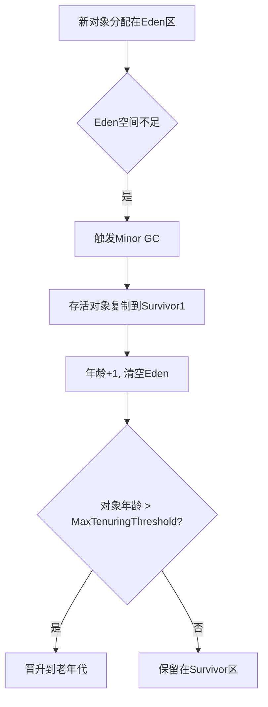
#### 老年代回收（CMS Old GC）
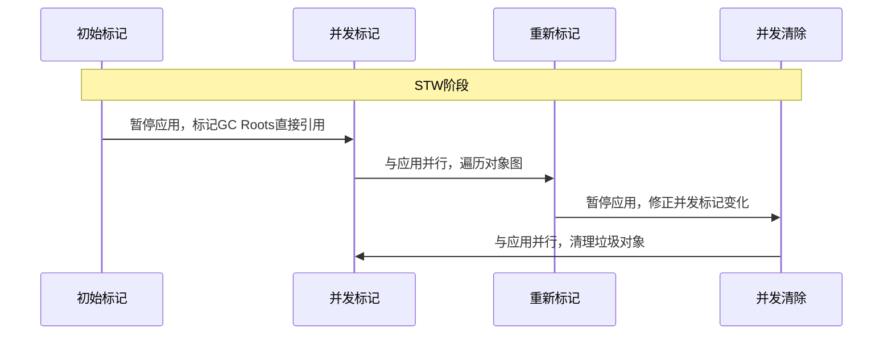
### 分代内存结构细节

#### 年轻代 Region 大小（G1 回收器）：
| 堆总大小 | 默认 Region 大小 | 计算公式      |
| -------- | ---------------- | ------------- |
| < 4GB    | 1MB              | 自动调整      |
| 4GB-8GB  | 2MB              | HeapSize/2048 |
| > 8GB    | 4MB              | 向上取整2^n   |
查看实际值：
```bash
jhsdb jmap --heap --pid <PID> | grep Region
```
#### 年轻代大对象存储空间
大对象（Humongous Object）直接进入特殊区域：
```java
// G1回收器中：
if (object.size > RegionSize/2) {
   // 分配到Humongous Region（老年代分区）
} else {
   // 正常分配到Young Region
}
```
### Old GC vs Minor GC

| 特性     | Minor GC       | Old GC              |
| -------- | -------------- | ------------------- |
| 目标区域 | 年轻代         | 老年代              |
| 触发频率 | 高（毫秒级）   | 低（小时级）        |
| STW时间  | 短（10-500ms） | 长（秒级）          |
| 回收算法 | 复制算法       | 标记-清除/标记-整理 |
| 对象特征 | 98%短命对象    | 长期存活对象        |
| 关联操作 | 可能触发晋升   | 可能连带Full GC     |
### GC Root 类型（决定对象存活性）

#### 核心 GC Root 类型：
1. 线程栈引用
   ```java
   public void run() {
       Object localObj = new Object(); // GC Root
   }
   ```
2. 静态变量引用
   ```java
   class Constants {
       static final List<String> CACHE = new ArrayList<>(); // GC Root
   }
   ```
3. JNI 本地引用
   ```java
   public native void nativeMethod(); // 本地代码中创建的对象
   ```
4. 系统类加载器
   ```java
   ClassLoader.getSystemClassLoader().loadClass("..."); 
   ```
5. 活动锁对象
   ```java
   synchronized(lockObject) { // lockObject 作为GC Root
       // 临界区代码
   }
   ```
#### 示例 GC Root 链：
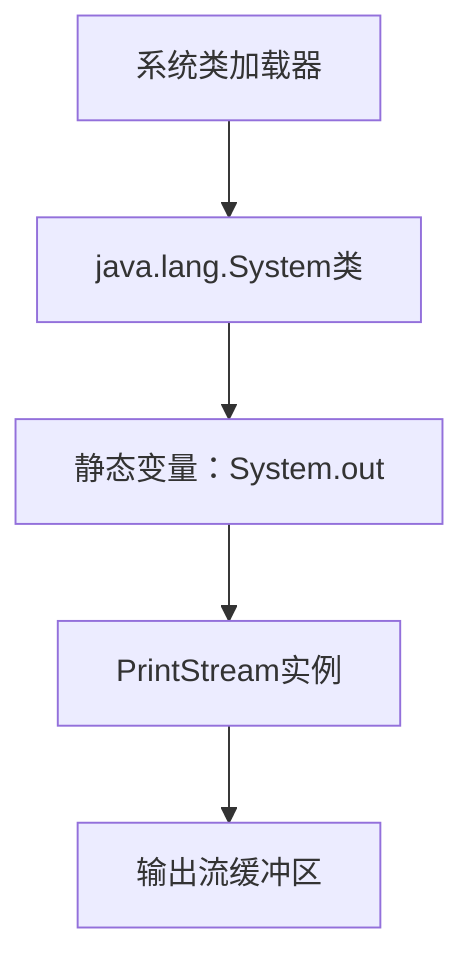
### 附：GC 监控建议
```bash
# GC日志记录配置
java -Xlog:gc*:file=gc.log:time,uptime,tags:filecount=10,filesize=50M \
     -XX:+HeapDumpOnOutOfMemoryError \
     -XX:HeapDumpPath=/logs/dumps \
     -jar your_app.jar
```
> 重要实践建议：<br>
> 1. 避免 `-Xmn` 硬编码年轻代大小，建议用 `-XX:NewRatio` 动态比例<br>
> 2. 大对象处理：<br>
>    `-XX:PretenureSizeThreshold=1M`（直接晋升阈值）<br>
>    `-XX:G1HeapRegionSize=4M`（G1 Region调整）<br>
> 3. Old GC 优化：<br>
>    CMS：`-XX:+UseCMSInitiatingOccupancyOnly`<br>
>    G1：`-XX:InitiatingHeapOccupancyPercent=40`（提前触发回收）
## Java 对象头

### Java 对象头详解（32位/64位系统对比）

对象头是每个Java对象在内存中的**元数据区域**，包含JVM运行所需的关键信息。其结构随系统位数和锁状态动态变化：


------
### 对象头核心结构（以64位系统为例）

| 组成部分           | 原始大小 | 开启指针压缩 | 存储内容                                     |
| ------------------ | -------- | ------------ | -------------------------------------------- |
| **Mark Word**      | 64 bits  | -            | 锁状态标志、GC信息、哈希码等（**核心区域**） |
| **Class Pointer**  | 64 bits  | 32 bits      | 指向方法区中类元数据的指针                   |
| **数组长度(可选)** | 32 bits  | -            | 仅数组对象存在，记录数组长度                 |
> 🔍 **指针压缩**：使用`-XX:+UseCompressedOops`开启，减少内存占用（默认开启）


------
### Mark Word 详细内容（64位系统）

```
+------------+------------+------------+------------+------------+
|  锁状态    |    标志位  |   53位主存储区                             | 说明        |
+------------+------------+------------------------------------------+-------------+
| 无锁       | 001        | unused:25 | identity_hashcode:31 | unused:1 | age:4 | 01 | 默认状态   |
| 偏向锁     | 101        | threadID:54 | epoch:2    | age:4    | 0     | 01 | 锁优化状态 |
| 轻量级锁   | 00         |         指向栈中锁记录的指针               |             | 栈上锁同步 |
| 重量级锁   | 10         |         指向监视器(Monitor)的指针         |             | 内核级锁  |
| GC标记     | 11         |         空(与GC回收相关)                  |             | 回收状态  |
+------------+------------+------------------------------------------+-------------+
```
📌 **关键字段说明**：
- **identity_hashcode**：首次调用`hashCode()`后写入（31位）
- **age**：对象年龄计数器（4位，最大15）
- **threadID**：持有偏向锁的线程ID
- **epoch**：偏向锁时间戳（防止无效偏向）


------
### 不同位系统的对象头对比

| 系统类型 | Mark Word | Class Pointer | 数组长度 | **总大小(未压缩)** | 总大小(压缩) |
| -------- | --------- | ------------- | -------- | ------------------ | ------------ |
| 32位     | 32 bits   | 32 bits       | 32 bits  | 8字节（数组）      | -            |
| 64位     | 64 bits   | 64 bits       | 32 bits  | 16字节（数组）     | 12字节       |
> ⚠️ 对象头大小必须是 **8字节对齐**（64位系统），不足时自动填充（Padding）


------
### 技术验证：使用JOL工具分析对象头

```
// 添加依赖：org.openjdk.jol:jol-core
import org.openjdk.jol.info.ClassLayout;

public class ObjectHeaderDemo {
    public static void main(String[] args) {
        Object obj = new Object();
        System.out.println(ClassLayout.parseInstance(obj).toPrintable());
        
        synchronized(obj) {  // 加锁改变对象头
            System.out.println(ClassLayout.parseInstance(obj).toPrintable());
        }
    }
}
```
#### 🔍 执行结果（64位压缩指针）：

```
OFF  SZ   TYPE DESCRIPTION               VALUE
  0   8        (object header: mark)    0x0000000000000001 (non-biasable; age:0)  // 无锁状态
  8   4        (object header: class)    0xf80001e5                               // 类指针
 12   4        (object alignment gap)                                           // 对齐填充

// 加锁后
  0   8        (object header: mark)    0x00007f9d381074a0 (thin lock: 0x00007f9d381074a0) // 轻量级锁
  8   4        (object header: class)    0xf80001e5
```


------
### 对象头对编程的影响

1. **Synchronized优化基础**
   ```
   synchronized(obj) {
       // JVM通过修改对象头实现锁升级
   }
   ```
2. **HashCode存储机制**
   ```
   System.out.println(obj.hashCode()); // 触发对象头写入哈希码
   ```
3. **对象年龄判定**
   ```
   // 对象头中的age字段决定是否晋升老年代
   ```
4. **内存布局优化**
   ```
   // 伪共享问题：两个线程访问相邻对象头可能互相影响
   @Contended // Java8+ 防止伪共享注解
   class SharedData {
       long value;
   }
   ```


------
### 总结：对象头关键点

1. **32位 VS 64位**
   - 64位系统对象头更大（压缩后12字节）
   - 32位系统无指针压缩（固定8字节）
2. **动态存储机制**
   Mark Word 在不同状态下复用存储空间
3. **对象生命周期管理**
   GC年龄、锁状态、哈希码等均在此维护
4. **内存对齐要求**
   对象头大小始终是8字节的倍数
> 理解对象头是掌握Java并发机制、内存布局和GC原理的基础。建议在分析性能问题时使用JOL工具进行实际内存验证。
## Redis 热 Key 定位

Redis 热 Key（访问频率极高的 Key）的定位是解决性能瓶颈的关键。以下是高效定位热 Key 的方法，按推荐优先级排序：


------
### 🔍 **代理层/中间件收集（推荐生产环境使用）**

在 Redis 请求的代理层（如 Twemproxy、Codis、Samaritan）嵌入统计逻辑，实时记录 Key 的访问频率，通过滑动窗口或 LFU 算法识别热点。
- **优势**：对业务透明，支持多语言架构，精度高。
- 实现示例：
  ```
  # 伪代码：代理层记录 Key 访问
  def handle_request(key):
      counter[key] += 1  # LFU 计数
      if counter[key] > 1000:  # 阈值触发上报
          report_hotkey(key)
  ```
- **开源工具**：饿了么开源的 [Samaritan](https://github.com/samaritan-proxy/samaritan) 支持热 Key 实时统计。


------
### ⚙️ **Redis 内置命令（适合诊断场景）**

#### **`redis-cli --hotkeys`（Redis 0+）**

直接扫描并输出热点 Key，基于 `OBJECT FREQ` 的 LFU 算法统计访问频率。
```
redis-cli --hotkeys  # 输出按频率排序的 Key
```
- **注意**：扫描全量 Key，大数据集可能耗时较长。
#### **`MONITOR` 命令（慎用！）**

实时输出所有执行命令，通过过滤高频 Key 识别热点：
```
redis-cli monitor | grep -E "GET|HGET" | awk '{print $5}' | sort | uniq -c | sort -nr
```
- **缺点**：**性能损耗达 50%+**，仅限临时诊断。
#### **慢查询日志（`SLOWLOG`）**

分析执行时间过长的命令，间接发现热 Key：
```
CONFIG SET slowlog-log-slower-than 10000  # 阈值设为 10ms
SLOWLOG GET 10  # 获取最近 10 条慢查询
```
- **适用场景**：热 Key 导致操作延迟升高时。


------
### 📊 **客户端埋点统计（需业务改造）**

在业务代码中嵌入 Key 访问统计逻辑，定期上报至监控系统（如 Prometheus + Grafana）。
- 示例
  （Java + Spring AOP）：
  ```
  @Aspect
  public class RedisKeyMonitor {
      @Before("execution(* redis.clients.jedis.Jedis.get(..))")
      public void trackKey(JoinPoint jp) {
          String key = (String) jp.getArgs()[0];
          Metrics.counter("redis_key_access", "key", key).increment();
      }
  }
  ```
- **缺点**：侵入业务代码，多语言架构维护成本高。


------
### 📡 **网络流量分析（紧急诊断）**

在 Redis 节点抓包解析 TCP 流量，识别高频请求的 Key：
```
tcpdump -i eth0 port 6379 -s 0 -w redis.pcap  # 抓包
tshark -r redis.pcap -T fields -e redis.key  | sort | uniq -c | sort -nr  # 解析 Key
```
- **适用场景**：其他方法不可用时临时使用。


------
### 🔎 **键空间通知（`Keyspace Notifications`）**

配置 Redis 推送 Key 的访问事件，订阅分析高频 Key：
```
CONFIG SET notify-keyspace-events KEA  # 开启事件通知
SUBSCRIBE __keyspace@0__:mykey*         # 订阅特定模式 Key
```
- **缺点**：需提前预判热点 Key 模式，实时性较差。


------
### 💎 **方法对比与选型建议**

| **方法**              | **精度** | **性能影响** | **实施难度** | **适用场景**       |
| --------------------- | -------- | ------------ | ------------ | ------------------ |
| 代理层统计            | ⭐⭐⭐⭐     | ⭐⭐           | ⭐⭐⭐⭐         | 生产环境长期监控   |
| `redis-cli --hotkeys` | ⭐⭐⭐      | ⭐⭐⭐          | ⭐⭐           | Redis 4.0+ 诊断    |
| 客户端埋点            | ⭐⭐⭐⭐     | ⭐⭐           | ⭐⭐           | 可控的业务改造     |
| `MONITOR`/慢日志      | ⭐⭐       | ⭐⭐⭐⭐⭐        | ⭐            | 临时诊断（非高峰） |
| 网络抓包              | ⭐⭐⭐      | ⭐⭐⭐⭐         | ⭐⭐⭐          | 紧急排查           |


------
### 🛠️ **最佳实践**

1. **生产环境首选代理层方案**（如 Samaritan），平衡精度与性能。
2. **定期扫描辅助**：凌晨低峰期运行 `--hotkeys` 或 `--bigkeys`（大 Key 常伴热点）。
3. **业务预判**：秒杀商品、热搜新闻等提前标记为疑似热点，重点监控。
4. **动态阈值告警**：设置 QPS > 1000 或占比 > 30% 自动触发告警。
> 💡 通过多级缓存（本地缓存+Redis）和热 Key 分片（如 `user:{id}:profile:{shard}`）可根本缓解问题。
## TLS 2

TLS（Transport Layer Security）连接建立过程（以广泛使用的 TLS 1.2 为例，包含关键改进）是保障互联网通信安全的基石。以下是详细分步解析：
---
### 核心握手流程（Client-Server 交互）
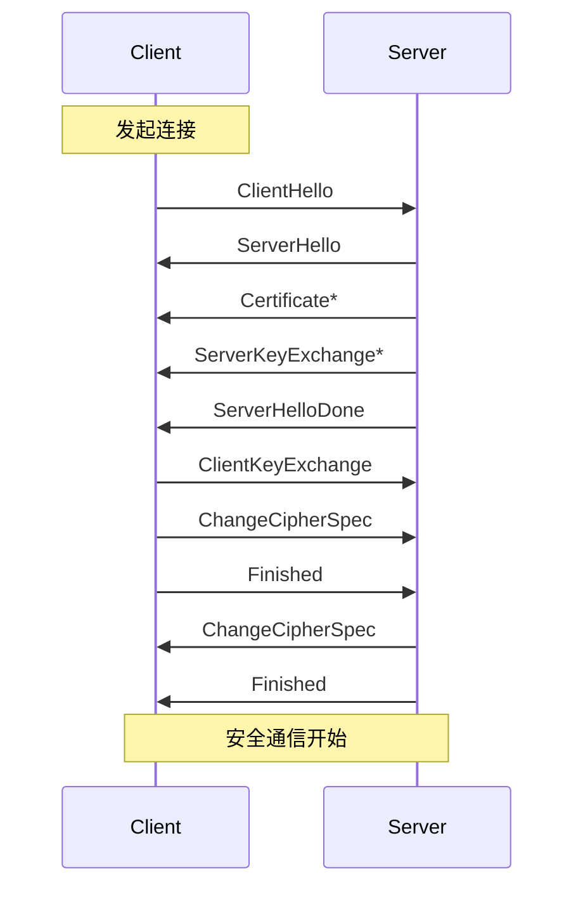
> *标星项（Certificate，ServerKeyExchange）根据密钥交换算法选择性发送
---
### 详细步骤拆解

#### **ClientHello**（客户端发起）
```markdown
- **协议版本**：支持的 TLS 版本（如 TLS 1.2）
- **随机数** (Client Random)：32 字节，用于后续密钥生成
- **会话ID**：用于会话恢复（Session Resumption）
- **密码套件**：客户端支持的加密算法组合（如 `TLS_ECDHE_RSA_WITH_AES_256_GCM_SHA384`）
- **压缩方法**：通常为 null（已弃用）
- **扩展字段**：SNI（Server Name Indication）、椭圆曲线参数等
```
#### **ServerHello**（服务器响应）
```markdown
- **协议版本**：选择双方共有的最高版本
- **随机数** (Server Random)：32 字节，与 Client Random 共同生成密钥
- **会话ID**：新建会话或恢复现有会话
- **选定的密码套件**：服务端选择的算法组合
- **扩展字段**：OCSP Stapling、ALPN（应用层协议协商）等
```
#### **Certificate**（服务端证书）
```markdown
- **证书链**：服务器公钥证书（包含域名信息）
- **可信性验证**：客户端用 CA 根证书验证证书合法性
```
#### **ServerKeyExchange**（关键：密钥协商）
```markdown
# 根据密码套件类型选择性发送：
- **ECDHE/RSA**：发送椭圆曲线参数和服务端临时公钥
- **DH/DHE**：发送 Diffie-Hellman 参数和服务端公钥
- **RSA 密钥交换**：无此步骤（客户端直接加密预主密钥）
```
#### **ServerHelloDone**（服务端准备完成）
> 标记服务端信息发送完毕
---
#### **ClientKeyExchange**（客户端密钥交换）
```markdown
# 密钥协商的核心步骤：
- **生成预主密钥 (Premaster Secret)**：
  - ECDHE：用客户端临时私钥 + 服务端公钥计算
  - RSA：随机生成预主密钥并用服务器证书公钥加密
- **发送密钥材料**：加密后的预主密钥或客户端临时公钥
```
#### **生成主密钥 (Master Secret)**
```markdown
# 双方独立计算（从未在网络传输！）：
Master Secret = PRF(
    Premaster Secret, 
    "master secret", 
    ClientRandom + ServerRandom
)
```
> *PRF：伪随机函数（Pseudo-Random Function）
#### **ChangeCipherSpec**（切换加密模式）
```markdown
- 通知对方后续通信使用协商的密钥加密
- 明文传输的最后一个消息
```
#### **Finished**（完整性验证）
```markdown
- 使用主密钥加密的握手消息摘要
- 验证过程未被篡改（关键安全步骤！）
```
---
### 密钥计算全过程
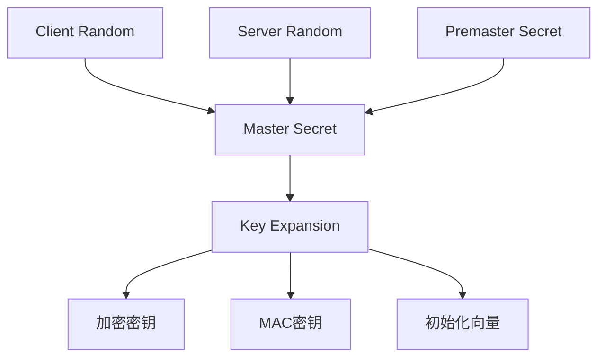
### TLS 3 关键优化
```markdown
| **改进**         | **原理**                          | **效果**               |
|------------------|-----------------------------------|------------------------|
| 1-RTT 握手       | 合并 ClientHello 密钥参数         | 连接延迟降低 50%       |
| 0-RTT 恢复*      | 复用会话密钥直接发送数据          | 极致延迟优化           |
| 移除弱加密算法   | 禁用 RSA 密钥交换、SHA-1 等       | 安全性增强             |
| 加密证书传输     | 证书在加密通道发送                | 隐私保护升级           |
```
> *0-RTT 存在重放攻击风险，需业务层防护
---
### 关键技术解析

#### **密钥交换算法演进**
```markdown
- **传统 RSA**：客户端生成预主密钥 -> 用服务器公钥加密（前向保密缺失）
- **完美前向保密 (PFS)**：
  - *DHE*：基于离散对数，计算开销大
  - *ECDHE*：椭圆曲线加密，效率高（主流方案）
```
#### **证书验证机制**
```markdown
- **证书链校验**：服务器证书 -> 中间 CA -> 根 CA
- **吊销检查**：
  - CRL（证书吊销列表）
  - OCSP Stapling（服务端提供时效性证明）
```
#### **会话恢复机制**
```markdown
- **Session ID**：服务端存储会话状态（有状态）
- **Session Ticket**：加密状态发送给客户端（无状态）
```
---
### 生产环境最佳实践
1. 强制 TLS 1.2+：  
   ```nginx
   # Nginx 配置示例
   ssl_protocols TLSv1.2 TLSv1.3;
   ```
2. 选用强密码套件：  
   ```openssl
   openssl ciphers -v 'ECDHE-ECDSA-AES256-GCM-SHA384:ECDHE-RSA-AES256-GCM-SHA384'
   ```
3. 启用 HSTS：  
   ```http
   Strict-Transport-Security: max-age=31536000; includeSubDomains
   ```
4. 证书管理自动化：  
   ```bash
   certbot renew --quiet --post-hook "systemctl reload nginx"
   ```
> 📌 关键安全提示：避免使用 `TLS_RSA_WITH_*` 套件（不具备前向保密性），优先选择基于 ECDHE 的密钥交换。
## TLS 加密方式

TLS（传输层安全协议）结合使用对称加密和非对称加密是出于性能与安全性的平衡，单一加密方式无法同时满足高效传输和密钥交换的安全性需求。以下是深度解析：
---
### ⚖️ **为什么不能只用一种加密？**
#### **纯非对称加密的缺陷**
• 性能问题：  
  非对称加密（如RSA、ECC）涉及复杂数学运算（大数分解、椭圆曲线离散对数），加解密速度比对称加密慢 100-1000倍。  
  ```plaintext
  # 性能对比（AES vs RSA）
  AES-256 加密速度：约 200 MB/s（CPU）
  RSA-2048 加密速度：约 1 MB/s（同硬件）
  ```
  → 若全程非对称加密，TLS握手和数据传输将极其缓慢。
• 密钥管理风险：  
  服务端私钥长期暴露在网络通信中，增加被破解风险（如量子计算机威胁）。
#### **纯对称加密的致命缺陷**
• 密钥分发问题：  
  对称加密（如AES）要求双方共享同一密钥，但在未建立安全通道前，无法安全传递密钥。  
  → 若通过网络明文发送密钥，会被中间人截获，完全丧失安全性。
---
### 🔐 **TLS的混合加密设计**
TLS通过两阶段解决上述问题：
#### **阶段1：非对称加密建立安全通道（握手阶段）**
1. 客户端验证服务端数字证书（非对称加密保障身份可信）。
2. 客户端生成预主密钥（Pre-Master Secret），用服务端公钥加密后发送。
3. 服务端用私钥解密获得预主密钥。
   ```mermaid
   sequenceDiagram
       客户端->>服务端: ClientHello（支持算法列表）
       服务端->>客户端: ServerHello（选定算法）+ 证书
       客户端->>服务端: 用服务端公钥加密预主密钥
       服务端->>客户端: 用私钥解密获得预主密钥
   ```
#### **阶段2：对称加密高效传输数据（数据传输阶段）**
1. 双方基于预主密钥生成会话密钥（Session Key）。
2. 后续通信使用对称加密（如AES）保护数据：
   ```mermaid
   graph LR
       明文数据 -->|AES-GCM加密| 密文
       密文 -->|网络传输| 接收方
       接收方 -->|AES-GCM解密| 明文数据
   ```
   • 性能优势：对称加密速度极快（如AES-NI硬件加速达10GB/s）。
---
### ⚡ **混合加密的核心优势**
| 维度         | 非对称加密     | 对称加密      | TLS混合方案           |
| ------------ | -------------- | ------------- | --------------------- |
| 密钥交换安全 | ⭐⭐⭐⭐           | ❌（无法解决） | ⭐⭐⭐⭐（非对称保障）    |
| 数据加密速度 | ❌（极慢）      | ⭐⭐⭐⭐          | ⭐⭐⭐⭐（对称加密）      |
| 前向安全性   | ❌（私钥固定）  | ✅             | ✅（会话密钥临时生成） |
| 量子安全性   | ❌（RSA可破解） | ✅（AES-256）  | ✅（组合方案可升级）   |
> 前向安全性（Forward Secrecy）：  
> TLS通过ECDHE等密钥交换算法，确保每次会话使用临时密钥。即使服务端私钥泄露，历史通信仍安全。
---
### 🔧 **TLS 3的极致优化**
TLS 1.3进一步强化混合加密：
1. 废除不安全的非对称算法：  
   禁用RSA密钥交换（改用ECDHE），消除私钥泄露风险。
2. 1-RTT握手：  
   客户端首包即发送密钥交换参数，减少握手延迟。
   ```mermaid
   sequenceDiagram
        客户端->>服务端: ClientHello + 密钥共享参数
        服务端->>客户端: ServerHello + 证书 + 会话密钥
        双方->>数据传输: 对称加密通信
   ```
3. 0-RTT模式（可选）：  
   对可信连接复用之前会话密钥，实现零往返延迟（风险：重放攻击）。
---
### 🌐 **为什么不只用对称加密？**
假设尝试纯对称加密方案：
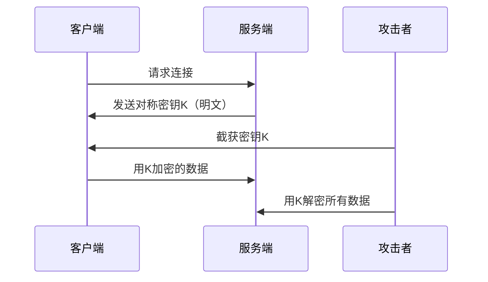
→ 毫无安全性可言，密钥分发是死穴。
---
### 💎 **总结：混合加密的必要性**
1. 非对称加密的核心作用：  
   • 身份认证（数字证书）  
   • 安全传递对称密钥（解决密钥分发问题）  
2. 对称加密的核心作用：  
   • 高效加密应用层数据  
   • 保障通信实时性  
> 设计哲学：  
> “用非对称加密解决信任问题，用对称加密解决效率问题”  
> 二者缺一不可，共同构建安全高效的通信体系。
## REDIS 一致性

在分布式系统中维持Redis与MySQL的数据一致性是一个经典挑战。"写前删+写后删"的双删策略是一种经过验证的有效方案，其核心逻辑在于应对高并发场景下的缓存一致性问题。以下是深度解析：
---
### 高并发写场景的风险场景
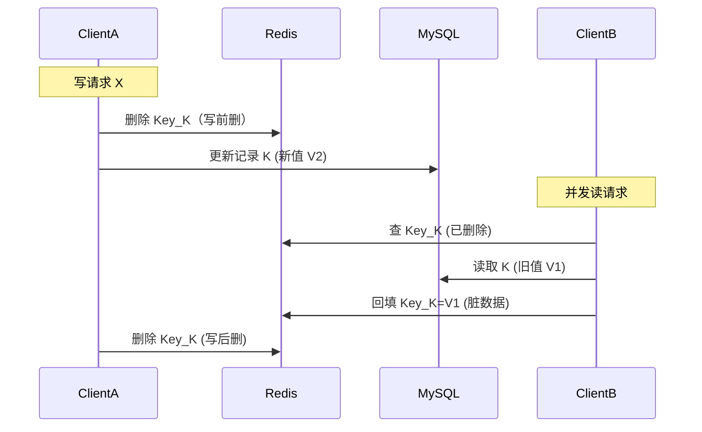
> ⚠️ 关键冲突：在数据库更新完成前，读请求可能将旧值回填缓存（脏读）
---
### 双删策略的分步逻辑

| 阶段              | 动作                      | 目的                     |
| ----------------- | ------------------------- | ------------------------ |
| 1. 写前删         | 更新DB前删除Redis缓存     | 消除更早的缓存残留       |
| 2. 数据库更新     | 执行MySQL写操作           | 核心数据持久化           |
| 3. 写后删（延迟） | 更新DB后休眠延迟+再次删除 | 清除并发期间回填的旧数据 |
> ✨ 延迟时间经验值：1-3秒（略大于主从延迟+业务平均查询时间）
---
### 双删解决的核心问题

#### **脏写覆盖问题**
• 写前删：清除上次操作的旧缓存，避免后续读污染
• 写后删：清理更新期间被回填的旧值
#### **并发读写冲突**
• 消除“更新时读请求回填旧值”的数据不一致窗口
#### **最终一致性**
• 通过两次删除+延迟补偿，实现最终一致性
---
### 工程实现方案（含Java伪代码）

```java
public void updateData(key, newValue) {
    // 1. 写前删 (防止遗留旧缓存)
    redis.del(key); 
    
    // 2. 更新数据库
    db.update(key, newValue); 
    
    // 3. 提交事务后异步延迟删除
    executor.submit(() -> {
        Thread.sleep(1000); // 延迟1秒
        redis.del(key);     // 二次删除
        log.debug("二次删除完成, key:{}", key);
    });
}
```
#### ⚠️ 关键改进点：
1. 异步化处理：延迟操作放入线程池，避免阻塞主线程  
2. 延迟算法优化：
   ```java
   // 动态延迟（主从延迟+业务查询时间）
   delay = slaveLagMs + avgQueryTimeMs + 100;
   ```
3. 兜底策略：设置缓存过期时间（如30秒）作为最终保障
---
### 方案局限性及应对

| 问题           | 风险             | 解决方案                    |
| -------------- | ---------------- | --------------------------- |
| 二次删除失败   | 缓存残留旧数据   | 引入删除重试机制 + 死信队列 |
| 删除延迟过大   | 不一致窗口延长   | 动态调整延迟 + 监控报警     |
| 高并发场景穿透 | 多次删除仍不一致 | 加分布式锁（降低并发度）    |
| 主从延迟过高   | 从库读旧值回填   | 读主库 + 强制路由           |
---
### 典型场景效果对比

#### 无二次删除：
```
时间线：
t1: 写请求删缓存 -> 
t2: 读请求读库(旧值) -> 
t3: 写请求更新DB -> 
t4: 读请求回填缓存(旧值)

结果：缓存永久保留旧值 ❌
```
#### 有二次删除：
```
时间线：
t1: 写请求(删除缓存) -> 
t2: 读请求回填旧值 -> 
t3: 写请求更新DB -> 
t4: 延迟500ms -> 
t5: 二次删除缓存 -> 
t6: 后续读回填新值

结果：缓存最终更新 ✅
```
---
### 进阶方案：订阅Binlog+异步更新
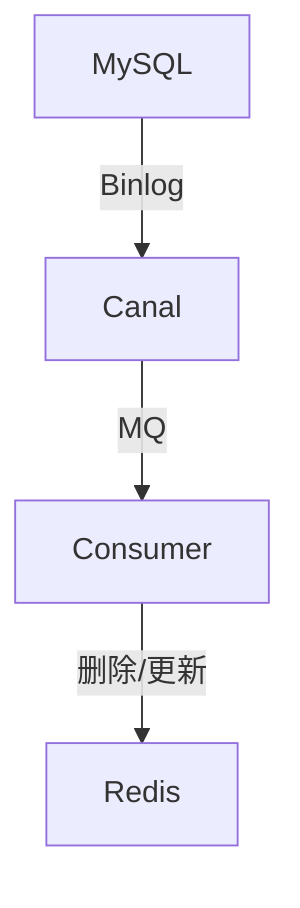
优势：
1. 完全解耦业务代码  
2. 规避时序问题  
3. 天然支持主从同步延迟  
适用场景：对一致性要求高的金融/交易系统
---
### 结论：双删策略的定位
1. 适用场景： 
   • 读多写少的中等并发系统  
   • 可接受秒级最终一致性的业务
2. 慎用场景：
   • 强一致性要求的账户体系  
   • 超高频写场景（电商库存）
3. 最佳实践：
   ```markdown
   双删延迟 + 缓存过期兜底 + Binlog降级预案
   ```
   通过双删策略，可在避免过度设计的前提下，实现 99.9%场景的数据一致性，是分布式缓存架构中的经典解耦方案。
## DDD

好的，我们来深入解析领域驱动设计（DDD）的核心概念，特别是**聚合根**、**实体**、**值对象**以及它们在构建复杂业务模型中的意义和作用。


------
## 领域驱动设计（DDD）是什么？

- **核心思想**：DDD 是一种**面向复杂业务逻辑的软件开发方法论**。它的核心不是技术（如数据库、框架），而是如何**理解业务领域**，并将这种理解有效地转化为软件模型。
- 核心目标：
  - **解决复杂性**：通过对业务领域的深刻理解和建模，管理软件的复杂度。
  - **统一语言**：促进业务专家与开发团队使用**相同的、无歧义的业务语言**进行沟通（Ubiquitous Language - 通用语言）。
  - **对齐设计与业务**：软件的核心结构（代码、模块）直接反映业务领域的概念和流程。
- **关键组成部分**：分为**战略设计**（划分问题空间）和**战术设计**（实现解决方案）两大支柱。


------
## 核心战术设计概念详解

### 实体（Entity）

- **定义**：实体是领域模型中具有**唯一标识（Identity）**且**生命周期可被追踪**的对象。实体的本质在于**标识**，而非属性。
- 关键特征：
  - **唯一标识（ID）**：这是实体的核心。即使实体的其他属性全部改变，只要ID相同，它就是同一个实体（例如：一个用户改变了姓名和地址，但他的用户ID没变，他就是同一个人）。
  - **可变性**：实体的属性在生命周期内通常是可以被修改的（例如：修改用户地址）。
  - **连续性**：实体在其生命周期内持续存在。它们的创建、修改和删除是需要被管理和记录的领域事件（如果需要）。
  - **业务行为**：实体封装与其数据相关的业务逻辑和行为（例如：`User.changePassword(newPassword, oldPassword)` 方法包含验证旧密码的逻辑）。
- 例子：
  - **电商系统**：`用户（User）`(ID: userId)，`订单（Order）`(ID: orderId)，`产品（Product）`(ID: productSku 或 productId)。
  - **银行系统**：`账户（Account）`(ID: accountNumber)，`客户（Customer）`(ID: customerId)。
### 值对象（Value Object）

- **定义**：值对象是描述领域中某个**属性**或**特征**的对象。它们**没有唯一标识**，完全由其持有的**属性值**来定义。值对象代表的是**是什么（What）**。
- 关键特征：
  - **无标识性**：这是与实体最根本的区别。值对象的相等性是通过比较其**所有属性值**是否相等来判断的。
  - **不可变性**：值对象一旦创建，其属性值**不可更改**。如果需要改变，应替换整个值对象（创建新实例）。这保证了线程安全性和简化推理。
  - **描述性**：它们用于度量、描述或量化领域中的事物。
  - **可组合性**：值对象可以包含其他值对象。
  - **可共享性**：由于不可变且无标识，它们可以被安全地共享。
- 例子：
  - **地址（Address）**：包含国家、省/州、城市、街道、邮编等属性。比较两个地址是否相同，是比较所有属性值。更改地址就是替换整个地址对象。
  - **金额（Money）**：包含数值和货币单位（如 `amount: 100`, `currency: 'USD'`）。操作如 `money1.add(money2)` 会返回**新的** `Money` 实例。
  - **颜色（Color）**：RGB 值。
  - **日期范围（DateRange）**：开始日期和结束日期。
### 聚合（Aggregate）

- **定义**：聚合是**一组紧密关联、具有内聚性的领域对象（实体和值对象）的集合**。这些对象作为一个**一致性边界**被一起创建、更新和删除。
- 核心目的：
  - **强制业务规则（不变性约束）**：聚合内部的对象之间可能存在复杂的业务规则（不变性约束）。聚合确保无论外部操作如何，这些规则在聚合边界内总是得到满足。
  - **简化数据访问和事务**：外部只能通过聚合的**根实体**访问聚合内部对象。这定义了事务范围（通常一个事务只修改一个聚合）和数据访问的入口点。
  - **提供清晰边界**：在高内聚、松耦合的设计中划分出清晰的模块单元。
- 关键规则：
  - **聚合根（Aggregate Root）是入口**：外部**只能持有和引用聚合根**的ID（或引用），不能直接引用聚合内部的其他实体。这是DDD中**最重要的规则之一**。
  - **聚合内对象引用**：聚合内的实体可以相互引用（通常通过ID引用，在加载聚合根时一并加载出来）。
  - **跨聚合引用**：不同聚合之间**必须通过聚合根的ID来引用对方**。这意味着你无法在代码中从一个聚合内部直接导航到另一个聚合内部的非根对象。
  - **聚合内强一致性**：修改聚合内的任何对象，必须保证聚合内部的所有业务规则（不变性约束）在操作完成后立即满足。这通常在单个事务内完成。
  - **聚合间最终一致性**：修改涉及多个聚合的业务操作，无法保证在一个事务内完成所有聚合的更新（因性能、分布式等限制）。需要通过**领域事件（Domain Events）**、**Saga** 等模式实现跨聚合的最终一致性。
### 聚合根（Aggregate Root）

- **定义**：聚合根是**聚合的入口点**和**所有者**。它是一个**特殊的实体**，是整个聚合的“门面”和一致性守护者。
- 关键职责：
  - **守卫边界**：所有对聚合内部对象（子实体、值对象）的操作**必须**通过聚合根进行。这是**确保聚合内部一致性的首要保障**。
  - **维护聚合内部的一致性**：聚合根拥有实现和维护聚合内所有业务规则（不变性约束）的能力和职责。
  - **执行操作**：聚合根暴露操作接口，外部调用这些接口来改变聚合的状态。
  - **工厂方法**：通常负责创建聚合内部的实体或值对象。
  - **发布领域事件**：当聚合的状态发生重要的、其他聚合或系统可能需要关心的变化时，聚合根负责发布领域事件。
- 例子：
  - 订单聚合（Order Aggregate）：
    - **聚合根**：`Order` (订单实体，具有唯一ID `orderId`).
    - 内部对象：
      - `OrderLineItem` 实体 (订单项，描述购买的产品、数量、单价。它的ID通常只在聚合内有意义)。
      - `ShippingAddress` 值对象。
      - `BillingAddress` 值对象。
    - **外部访问**：只能通过 `Order` 聚合根访问。调用 `order.addItem(productId, quantity, price)` 来添加订单项。聚合根 `Order` 会在添加项时检查规则（如库存？优惠？总金额限制？）。
    - **内部一致性**：`Order` 聚合根确保 `Order` 的 `totalAmount` 等于所有 `OrderLineItem` 的 `lineTotal`(`quantity * price`) 之和。这个规则必须在聚合根的方法内强制执行。
  - 用户聚合（User Aggregate）：
    - **聚合根**：`User` (用户实体, ID: `userId`).
    - 内部对象：
      - `Profile` 值对象（姓名、头像URL等，但地址可能是独立的聚合）。
      - `PasswordCredential` 值对象（加密后的密码、盐值）。
      - `List<RoleAssignment>` 实体（描述用户拥有的角色，其ID可能由用户ID和角色ID组成）。
    - **外部访问**：调用 `user.updateProfile(newProfile)`, `user.changePassword(oldPwd, newPwd)`。在 `changePassword` 方法内，`User` 聚合根会验证旧密码、加密新密码、更新 `PasswordCredential`。


------
## 为什么聚合根和一致性边界如此重要？

1. **管理复杂性**：为大型领域模型提供了明确的、基于业务概念的模块划分单位。每个聚合都是一个相对独立的功能单元。
2. **强制执行业务规则（不变性约束）**：确保无论什么操作发生，在聚合边界内，业务规则（如订单总价等于各项小计之和）总能得到满足。将一致性要求限制在较小的范围内，避免事务范围过大。
3. 
   优化性能和可伸缩性：
   - **事务范围**：通常一个事务只修改一个聚合。这避免了涉及多个大型对象图的复杂分布式事务，提高了性能。
   - **加载/保存单元**：ORM（如Hibernate）或Repository实现时，可以更容易地按聚合加载和保存整个聚合。
   - **并发**：对聚合根的并发控制（如乐观锁）比锁定整个数据库表或更大范围的记录更高效、更精细。
4. **明确的关联模型**：通过强制聚合间只能通过聚合根ID引用，明确了系统不同部分之间的松散耦合关系。
5. **领域事件驱动**：聚合根作为重要状态变更的发布者，是实现反应式架构和系统解耦（微服务间通信）的关键。


------
## 识别聚合根与设计聚合的策略

1. 
   以不变性约束为核心：
   - 识别业务中那些“必须**立即**保持成立”的关键规则。
   - 分析哪些对象需要组合在一起才能强制这些规则。
   - 这组对象（以及规则本身）就定义了一个聚合的边界。
   - 拥有维护这些规则职责的实体就是聚合根。
2. **高内聚**：将那些生命周期、修改频率、访问模式相似的，以及彼此交互非常紧密的对象放在同一个聚合内。
3. **松耦合**：聚合之间应保持松耦合，引用通过ID而非对象引用。
4. **小聚合原则**：尽量设计小的聚合。大型聚合会成为性能瓶颈（事务范围大、加载数据多），也更难维护内部一致性。考虑拆分。
5. **通过事务需求验证**：考虑业务操作的事务需求。如果两个对象的修改**必须**在一个原子事务中成功，它们**可能**属于同一个聚合（但不是绝对，最终一致性是选项）。
6. **避免“上帝聚合”**：不要将所有内容都硬塞到一个巨大无比的聚合根（如 `User` 包含所有用户相关数据）下面。这违反了高内聚低耦合原则。


------
## 总结：一张图理解DDD核心概念关系

```
graph TD
    subgraph OrderAggregate[Aggregate: Order]
        direction TB
        OR[Aggregate Root: Order Entity] --- OL1(OrderLineItem Entity)
        OR --- OL2(OrderLineItem Entity)
        OR --- SA(ShippingAddress Value Object)
        OR --- BA(BillingAddress Value Object)
        OR -.has calculated total based on.- OL1
        OR -.has calculated total based on.- OL2
    end

    subgraph ProductAggregate[Aggregate: Product]
        direction TB
        PR[Aggregate Root: Product Entity]
    end

    subgraph CustomerAggregate[Aggregate: Customer]
        direction TB
        CR[Aggregate Root: Customer Entity]
    end

    OR -- references by ID --> PR
    OR -- references by ID --> CR
```
- **聚合（`OrderAggregate`）**：一致性边界，包含多个对象。
- **聚合根（`Order` Entity）**：聚合的入口和守护者。
- **实体（`Order` 和 `OrderLineItem`）**：具有唯一标识和业务行为的对象。`Order` 是根实体。
- **值对象（`ShippingAddress`, `BillingAddress`）**：不可变、描述性的对象。
- **跨聚合引用**：`Order` 根实体通过 **ID** 引用 `Product` 聚合根（`PR`）和 `Customer` 聚合根（`CR`）。
**核心要诀**：设计聚合就是**划定事务边界（强一致性）**和**明确模型边界（模块化）**的过程。聚合根是守卫这个边界的卫士，确保其领域内的规则得到严格遵守。正确理解和应用聚合根、实体、值对象是DDD战术设计的基石，是驾驭复杂业务模型的关键。
## 聚簇索引

聚簇索引（Clustered Index）是直接将数据行存储在索引的叶子节点中的索引结构，决定了数据在磁盘上的物理存储顺序。这种索引结构与数据本身深度绑定，一个表有且只能有一个聚簇索引（InnoDB 引擎中称为主键索引）。以下从 5 个维度深入解析其原理和特性：
---
### 核心机制图解（B+树结构）
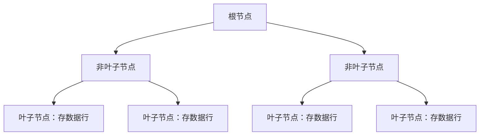
• 非叶子节点：存储索引键（如主键ID） + 子节点指针  
• 叶子节点：直接存储完整数据行（而非数据地址）
> 🔎 重要特性：数据行的物理顺序与索引顺序一致（相邻 ID 的记录在磁盘上连续存储）
---
### 聚簇索引 vs 非聚簇索引（对比决策表）

| 特征         | 聚簇索引             | 非聚簇索引（二级索引）   |
| ------------ | -------------------- | ------------------------ |
| 数据存储位置 | 叶子节点即数据行     | 叶子节点存储主键ID       |
| 数量限制     | 仅允许 1 个          | 可创建多个（最多 64 个） |
| 存储逻辑     | 数据即索引           | 独立于数据存储的指针结构 |
| 检索效率     | 主键检索 1 次 I/O    | 需 2 次 I/O（回表查询）  |
| 范围查询性能 | ⭐⭐⭐⭐ 连续磁盘读取    | ⭐⭐ 随机磁盘访问          |
| 更新代价     | 高（需重排物理存储） | 低（仅更新索引结构）     |
---
### InnoDB 的具体实现规则

#### **主键即聚簇索引**
   • 显式定义主键时（如 `id BIGINT PK`），主键自动成为聚簇索引  
   • 物理存储顺序按主键值排序
#### **无主键时的处理**
   • 优先选第一个 `UNIQUE NOT NULL` 字段作聚簇索引  
   • 若无合适字段，自动生成 `DB_ROW_ID` 隐式主键（6 字节）
#### **二级索引的指向方式**
   ```sql
   CREATE INDEX idx_name ON users(name);  -- 二级索引
   ```
   • `idx_name` 叶子节点存储：`name值 + 主键ID`  
   • 通过主键ID 回表（Bookmark Lookup） 查询完整数据
---
### 性能影响关键场景

#### ✅ **优势场景（适合聚簇索引）**
1. 主键精确查询（最高效）  
   ```sql
   SELECT * FROM orders WHERE id = 10086;  -- 直接定位数据页
   ```
2. 主键范围查询  
   ```sql
   -- 顺序读取连续磁盘页（减少I/O）
   SELECT * FROM orders WHERE id BETWEEN 1000 AND 2000;
   ```
3. 排序输出（避免额外排序操作）  
   ```sql
   SELECT * FROM employees ORDER BY employee_id;  
   ```
#### ⚠️ **劣势场景（聚簇索引的代价）**
1. 主键更新导致物理重组  
   ```sql
   UPDATE users SET id = 1000 WHERE id = 500; -- 数据行可能需移动到新磁盘位置
   ```
2. 随机主键插入的页分裂  
   • 若主键非自增（如 UUID），插入可能触发 B+树节点分裂  
   ```mermaid
   graph LR
      A[完整数据页] -->|插入乱序主键| B[页分裂]
      B --> C[新数据页]
      C --> D[性能下降+空间碎片]
   ```
3. 二级索引访问成本高  
   ```sql
   -- 需要两次I/O：
   -- 1. 扫描idx_name索引找到主键
   -- 2. 用主键回表查数据
   SELECT * FROM users WHERE name = 'Alice'; 
   ```
---
### 最佳实践设计策略

1. 主键设计铁律  
   ```sql
   CREATE TABLE invoices (
     id BIGINT UNSIGNED AUTO_INCREMENT PRIMARY KEY, -- ✅ 自增主键
     -- 避免使用 UUID/随机值 ❌
   );
   ```
   • 使用 `AUTO_INCREMENT`：保证插入顺序与物理顺序一致  
   • 避免频繁更新的字段：减少物理重排代价  
2. 二级索引优化方案  
   ```sql
   -- 覆盖索引避免回表
   CREATE INDEX idx_cover ON orders(user_id, order_date, total_amount);
   
   -- 查询仅需扫描索引
   SELECT user_id, total_amount 
   FROM orders WHERE user_id = 1001;  
   ```
3. 页分裂监控与优化  
   ```sql
   SHOW STATUS LIKE '%innodb_page_size%';      -- 默认 16KB
   SHOW STATUS LIKE 'Innodb_page%split%';       -- 页分裂计数器
   ```
   • 调整 `innodb_fill_factor`：降低页填充率（预留空间）  
   • 定期 `OPTIMIZE TABLE`：重组数据减少碎片
---
### 与堆表的对比（如 PostgreSQL）

| 特性     | InnoDB（聚簇索引）   | PostgreSQL（堆表 + TOAST） |
| -------- | -------------------- | -------------------------- |
| 数据存储 | 按主键物理排序       | 无序堆存储                 |
| 主键更新 | 代价大（移动数据行） | 代价小（仅修改索引）       |
| 二级索引 | 指向主键             | 直接指向堆表位置（CTID）   |
| 全表扫描 | 高效（顺序读取）     | 随机I/O较多                |
> 💡 总结：聚簇索引本质是通过 B+树有序结构绑定数据物理存储顺序，用存储空间换取了主键访问的高效性，但需警惕更新和随机插入的成本。理解这一机制是数据库性能优化的基石。
## TCP 拥塞控制

TCP拥塞控制是传输控制协议（TCP）的核心机制之一，旨在防止网络因流量过载而崩溃，同时平衡带宽利用率和传输公平性。其核心思想是通过动态调整发送速率来适应网络状况，主要依赖拥塞窗口（cwnd）和慢启动阈值（ssthresh）两个关键参数。以下从五个维度系统解析：
---
### ⚙️ **核心目标与设计原理**
1. 解决拥塞崩溃问题  
   • 当网络流量超过路由器/交换机处理能力时，会导致数据包丢失、延迟激增，形成恶性循环（丢包→重传→更拥塞）。  
   • TCP拥塞控制通过主动降速打破这一循环，避免吞吐量断崖式下降。  
2. 动态探测带宽  
   • 采用保守试探策略：初始低速发送，逐步增加速率直至检测到拥塞（如丢包），再回调窗口大小。  
3. 公平性原则  
   • 多个TCP连接通过AIMD（Additive Increase Multiplicative Decrease） 机制公平竞争带宽：  
     ◦ 线性增长：未拥塞时缓慢增加窗口（每RTT增加1 MSS）。  
     ◦ 指数削减：拥塞时窗口减半，快速释放资源。  
---
### 📊 **核心算法机制**
#### **慢启动（Slow Start）**  
• 作用：初始阶段快速探测可用带宽。  
• 机制：  
  • cwnd初始值为1 MSS（最大报文段长度）。  
  • 每收到一个ACK，cwnd 增加1 MSS → 指数增长（每RTT翻倍）。  
• 退出条件：  
  • cwnd ≥ ssthresh（初始默认16 MSS）→ 进入拥塞避免阶段。  
  • 检测到丢包（超时或重复ACK）→ 触发拥塞响应。  
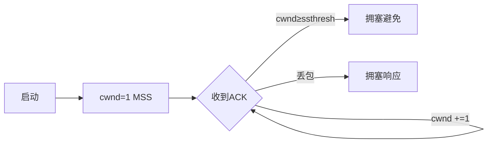
#### **拥塞避免（Congestion Avoidance）**  
• 作用：避免cwnd增长过快导致拥塞。  
• 机制：  
  • cwnd 线性增长：每RTT增加1 MSS（实际每ACK增加 1/cwnd MSS）。  
• 拥塞响应：  
  • 超时丢包：ssthresh = cwnd/2，cwnd重置为1，重启慢启动。  
  • 重复ACK丢包：触发快速重传/恢复。  
#### **快速重传（Fast Retransmit）**  
• 作用：减少超时等待时间，加速丢包恢复。  
• 机制：  
  • 收到3个重复ACK（表明报文失序）→ 立即重传丢失报文，无需等待超时。  
  • 例如：发送序列1、2、3、4、5，若3丢失，接收方会重复ACK2，发送方收到第3个重复ACK时重传3。  
#### **快速恢复（Fast Recovery）**  
• 作用：避免因单个丢包导致cwnd骤降。  
• 机制（TCP Reno）：  
  • 收到3个重复ACK：ssthresh = cwnd/2，cwnd = ssthresh + 3 MSS。  
  • 每收到重复ACK，cwnd增加1 MSS（补偿已发送包）。  
  • 收到新数据ACK时，退出快速恢复，进入拥塞避免。  
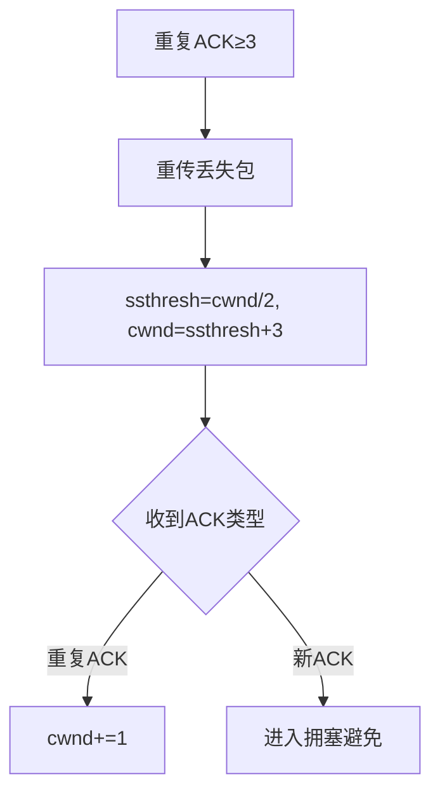
---
### ⚡ **关键技术实现细节**
#### **超时计算（RTT动态测量）**  
• 经典算法：基于加权平均计算平滑RTT（SRTT）。  
• Jacobson/Karels算法：引入RTT偏差（DevRTT），动态调整超时值：  
  ```math
  Timeout = SRTT + 4 \times DevRTT
  ```
  确保在高抖动网络中更精准。  
#### **时间戳选项（TSOPT）**  
• 作用：精确测量RTT，解决重传二义性问题。  
• 机制：  
  • 发送方在报文头添加时间戳（TSval）。  
  • 接收方在ACK中回显（TSecr），发送方计算时延。  
#### **SACK（选择性确认）**  
• 作用：高效重传多个丢失包。  
• 机制：接收方通过SACK选项告知已收到的非连续数据块，发送方仅重传缺失部分。  
---
### 🚀 **现代优化算法**
#### **TCP CUBIC（Linux默认）**  
• 改进点：  
  • 用立方函数替代线性增长，适应高带宽延迟积（BDP）网络。  
  • 窗口增长公式：  
    ```math
    cwnd = C \times (t - K)^3 + W_{max}
    ```  
    其中 `t` 为上次拥塞后的时间，`K` 为窗口最大值时的时延。  
• 优势：更平滑的窗口调整，减少激进性。  
#### **BBR（Bottleneck Bandwidth and RTT）**  
• 改进点：  
  • 基于带宽和延迟估计（而非丢包）调整速率。  
  • 周期性地探测带宽上限（BBR Probe）和最小RTT（RTT Probe）。  
• 适用场景：视频流媒体、卫星网络等高BDP环境。  
#### **TCP Vegas**  
• 改进点：  
  • 通过RTT变化预判拥塞（RTT增加时主动降速）。  
  • 避免依赖丢包信号，减少误判。  
---
### 💎 **总结与适用场景**
| 算法/机制       | 核心思想                 | 适用场景                 | 局限性                  |
| --------------- | ------------------------ | ------------------------ | ----------------------- |
| 慢启动          | 指数增长快速探测带宽     | 连接初始化、超时后恢复   | 高丢包网络效率低        |
| 拥塞避免 + AIMD | 线性增长，拥塞时窗口减半 | 通用网络环境             | 高BDP网络收敛慢         |
| CUBIC           | 立方函数控制窗口增长     | 数据中心、5G等高带宽网络 | 短连接效果差            |
| BBR             | 基于带宽/RTT模型动态调速 | 视频流媒体、长距离传输   | 公平性与传统TCP共存问题 |
> 设计哲学：TCP拥塞控制本质是保守与激进的平衡——通过慢启动积极探测资源，通过AIMD保守维持稳定。未来随着5G/6G和卫星网络发展，基于模型的算法（如BBR）将逐步替代传统丢包驱动机制。
## 会议协议

会议系统使用的协议根据功能可分为**框架协议**、**传输控制协议**、**编解码协议**和**消息传输协议**四大类，以下是详细分类及说明：


------
### 🔧 框架协议（核心控制协议）

框架协议是会议系统的通信基础，定义了设备间的交互规则和信令流程：
1. **H.323协议族**
   - **组成**：包含H.225（呼叫控制）、H.245（媒体控制）、H.235（加密）等子协议。
   - **适用场景**：传统硬件视频会议系统，支持复杂会议功能（如多点控制、网关互联）。
   - **特点**：功能强大但实现复杂，需配合MCU（多点控制单元）使用。
2. **SIP（Session Initiation Protocol）**
   - **特点**：基于文本的轻量级协议，易于扩展和集成（如与HTTP兼容）。
   - **适用场景**：软件视频会议、Web会议系统（如Zoom、腾讯会议）。
3. **MGCP（Media Gateway Control Protocol）**
   - **作用**：用于MCU与网关设备间的媒体流控制，支持与传统电话网（PSTN）互通。
| **协议** | **优势**             | **局限性**             | **典型应用场景**         |
| -------- | -------------------- | ---------------------- | ------------------------ |
| H.323    | 功能全面，兼容性强   | 实现复杂，部署成本高   | 政府、金融等大型会议室   |
| SIP      | 灵活轻量，适配云架构 | 功能扩展需额外协议支持 | 企业软件会议、移动端会议 |
| MGCP     | 跨网络互通能力优秀   | 依赖中心化MCU控制      | 混合网络（IP+PSTN）环境  |


------
### 📡 传输控制协议（数据流管理）

负责音视频数据的实时传输与可靠性保障：
1. **RTP（Real-time Transport Protocol）**
   - **功能**：传输实时音视频流，通过时间戳和序列号解决乱序和抖动问题。
   - **配套协议**：RTCP（RTP Control Protocol）监控传输质量并反馈丢包率。
2. **RUDP（Reliable UDP）**
   - **特点**：在UDP基础上增加重传机制，平衡实时性与可靠性。
   - **适用场景**：对延迟敏感但需保障数据完整的会议（如文档共享）。
3. **TCP vs UDP**
   - **TCP**：保证数据完整但延迟高，适合信令传输（如呼叫建立）。
   - **UDP**：低延迟但不可靠，用于实时音视频流（需配合RTP/RTCP）。


------
### 🎥 编解码协议（媒体压缩）

压缩音视频数据以降低带宽占用：
1. **视频编解码**
   - **H.264/AVC**：主流标准，压缩率高（80:1），支持720P/1080P高清会议。
   - **H.265/HEVC**：压缩效率提升50%，但需更高算力，适用于4K超高清场景。
   - **VP9/AV1**：开源替代方案，被Web会议系统（如Google Meet）广泛采用。
2. **音频编解码**
   - **Opus**：低延迟（<50ms），适应网络波动，适合实时对话。
   - **G.711/G.722**：传统电话级音质，兼容性强。


------
### ✉️ 消息传输协议（辅助交互）

支持会议控制、文件共享等辅助功能：
1. 
   XMPP（Extensible Messaging and Presence Protocol）
- **作用**：基于XML的即时通信协议，用于会议控制信令、参会者状态管理。
2. 
   T.120系列
- **功能**：实现数据协作（如电子白板、文件传输），常与H.323配合使用。


------
### 🌐 Web会议专用协议

针对浏览器环境的优化协议：
1. 
   WebRTC（Web Real-Time Communication）
- **特点**：无需插件，支持浏览器直接音视频通信，使用SRTP（安全RTP）加密数据。
2. 
   WebSocket
- **作用**：维持长连接，实时推送会议状态变更（如成员进出、权限更新）。


------
### 💎 总结：协议选择建议

- **大型硬件会议系统**：优先采用 **H.323 + H.264 + T.120** 组合，确保功能完整性和兼容性。
- **云会议/软件系统**：推荐 **SIP + WebRTC + Opus**，兼顾灵活性与跨平台支持。
- **数据敏感场景**：增加 **H.235加密** 或 **DTLS-SRTP**（WebRTC安全层）保障传输安全。
> 协议选择需结合 **网络环境**（带宽/QoS）、**设备类型**（硬件终端/移动端/Web）及 **功能需求**（数据协作/高清视频）综合评估。
## TCP、UDP、IP 头部

以下是TCP、UDP和IP协议首部字段的深度解析，涵盖各字段作用、比特位布局及实际应用场景：


------
### 🔧 IPv4首部（固定20字节 + 可选字段）

```
 0                   1                   2                   3   
 0 1 2 3 4 5 6 7 8 9 0 1 2 3 4 5 6 7 8 9 0 1 2 3 4 5 6 7 8 9 0 1 
+-+-+-+-+-+-+-+-+-+-+-+-+-+-+-+-+-+-+-+-+-+-+-+-+-+-+-+-+-+-+-+-+
|Version|  IHL  |    DSCP   |ECN|        Total Length           | → 版本/首部长度/总长
+-+-+-+-+-+-+-+-+-+-+-+-+-+-+-+-+-+-+-+-+-+-+-+-+-+-+-+-+-+-+-+-+
|         Identification        |Flags|    Fragment Offset     | → 分片标识
+-+-+-+-+-+-+-+-+-+-+-+-+-+-+-+-+-+-+-+-+-+-+-+-+-+-+-+-+-+-+-+-+
|  Time to Live |   Protocol    |        Header Checksum       | → TTL/协议/校验和
+-+-+-+-+-+-+-+-+-+-+-+-+-+-+-+-+-+-+-+-+-+-+-+-+-+-+-+-+-+-+-+-+
|                       Source Address                         | → 源IP（32位）
+-+-+-+-+-+-+-+-+-+-+-+-+-+-+-+-+-+-+-+-+-+-+-+-+-+-+-+-+-+-+-+-+
|                     Destination Address                      | → 目的IP（32位）
+-+-+-+-+-+-+-+-+-+-+-+-+-+-+-+-+-+-+-+-+-+-+-+-+-+-+-+-+-+-+-+-+
|                    Options (if IHL > 5)                      | → 可变选项
+-+-+-+-+-+-+-+-+-+-+-+-+-+-+-+-+-+-+-+-+-+-+-+-+-+-+-+-+-+-+-+-+
```
#### 📌 核心字段详解：

1. **Version（4比特）**
   - 值 `4` 表示IPv4（`6`表示IPv6）
2. **IHL（Internet Header Length，4比特）**
   - 首部长度（单位：**32位字**），最小值为 `5`（20字节），最大 `15`（60字节）
3. **DSCP（6比特） + ECN（2比特）**
   - 服务质量管理：DSCP用于QoS优先级，ECN（Explicit Congestion Notification）显式拥塞通知
4. **Total Length（16比特）**
   - 总长度 = 首部 + 数据（**最大65535字节**）
5. **Identification（16比特）**
   - 分片标识符：同一数据包的分片共享相同ID
6. **Flags（3比特）**
   - `0bit`：保留
   - `1bit`：DF（Don't Fragment）禁止分片
   - `2bit`：MF（More Fragments）更多分片标志
7. **Fragment Offset（13比特）**
   - 分片偏移量（单位：**8字节**），用于重组分片
8. **TTL（8比特）**
   - 每经1跳减1，到0时丢弃并发送ICMP超时消息
9. **Protocol（8比特）**
   - 上层协议号（TCP=`6`, UDP=`17`, ICMP=`1`）
10. **Header Checksum（16比特）**
    - 仅校验首部完整性（不校验数据）


------
### 📨 TCP首部（固定20字节 + 选项）

```
 0                   1                   2                   3   
 0 1 2 3 4 5 6 7 8 9 0 1 2 3 4 5 6 7 8 9 0 1 2 3 4 5 6 7 8 9 0 1 
+-+-+-+-+-+-+-+-+-+-+-+-+-+-+-+-+-+-+-+-+-+-+-+-+-+-+-+-+-+-+-+-+
|          Source Port          |       Destination Port        | → 源端口/目的端口
+-+-+-+-+-+-+-+-+-+-+-+-+-+-+-+-+-+-+-+-+-+-+-+-+-+-+-+-+-+-+-+-+
|                        Sequence Number                        | → 序列号
+-+-+-+-+-+-+-+-+-+-+-+-+-+-+-+-+-+-+-+-+-+-+-+-+-+-+-+-+-+-+-+-+
|                    Acknowledgment Number                      | → 确认号
+-+-+-+-+-+-+-+-+-+-+-+-+-+-+-+-+-+-+-+-+-+-+-+-+-+-+-+-+-+-+-+-+
| Data | Res |C|E|U|A|P|R|S|F|             Window             | → 首部长/控制位/窗口大小
+-+-+-+-+-+-+-+-+-+-+-+-+-+-+-+-+-+-+-+-+-+-+-+-+-+-+-+-+-+-+-+-+
|       Checksum        |         Urgent Pointer                | → 校验和/紧急指针
+-+-+-+-+-+-+-+-+-+-+-+-+-+-+-+-+-+-+-+-+-+-+-+-+-+-+-+-+-+-+-+-+
|                    Options (if Data Offset > 5)               | → 选项字段
+-+-+-+-+-+-+-+-+-+-+-+-+-+-+-+-+-+-+-+-+-+-+-+-+-+-+-+-+-+-+-+-+
```
#### 📌 核心字段详解：

1. **端口号（各16比特）**
   - 源端口：发送方应用程序端口
   - 目的端口：接收方应用程序端口
2. **序列号与确认号（各32比特）**
   - 序列号：本报文段第一个字节的序号
   - 确认号：期望收到的**下一个字节序号**（ACK标志置1时生效）
3. **Data Offset（4比特）**
   - TCP首部长度（单位：**32位字**），最大60字节（值 `15`）
4. **控制位（6比特）**
   - **URG**：紧急指针有效（需配合Urgent Pointer）
   - **ACK**：确认号有效（建立连接后始终为1）
   - **PSH**：要求接收方立即推送数据给应用层
   - **RST**：强制断开连接（异常处理）
   - **SYN**：请求建立连接（同步序列号）
   - **FIN**：请求关闭连接
5. **Window Size（16比特）**
   - 接收窗口大小（单位：**字节**），用于流量控制
6. **校验和（16比特）**
   - 校验范围 = TCP伪首部（含IP） + TCP首部 + 数据
7. **紧急指针（16比特）**
   - 仅当URG=1时生效，指示紧急数据的结束位置
8. **选项字段（可选）**
   - MSS协商（Maximum Segment Size）：三次握手时交换
   - 时间戳（Timestamp）：计算RTT和防止序列号回绕
   - SACK（Selective Acknowledgments）：选择确认机制


------
### 📦 UDP首部（固定8字节）

```
 0                   1                   2                   3   
 0 1 2 3 4 5 6 7 8 9 0 1 2 3 4 5 6 7 8 9 0 1 2 3 4 5 6 7 8 9 0 1 
+-+-+-+-+-+-+-+-+-+-+-+-+-+-+-+-+-+-+-+-+-+-+-+-+-+-+-+-+-+-+-+-+
|          Source Port          |       Destination Port        | → 源/目的端口
+-+-+-+-+-+-+-+-+-+-+-+-+-+-+-+-+-+-+-+-+-+-+-+-+-+-+-+-+-+-+-+-+
|            Length             |           Checksum            | → 长度/校验和
+-+-+-+-+-+-+-+-+-+-+-+-+-+-+-+-+-+-+-+-+-+-+-+-+-+-+-+-+-+-+-+-+
```
#### 📌 核心字段详解：

1. **端口号（各16比特）**
   - 功能同TCP端口，范围0-65535
2. **Length（16比特）**
   - UDP数据报总长度 = 首部8字节 + 数据长度（**最大65535字节**）
3. **Checksum（16比特）**
   - 覆盖范围：伪首部（含IP） + UDP首部 + 数据
   - **可选字段**：值为0表示未计算校验和（仅IPv4允许）


------
### ⚡ 协议栈交互示例（Wireshark抓包分析）

#### 场景：HTTP请求（TCP协议）

```
# IP层
Version: 4
IHL: 5 (20 bytes)
Total Length: 1434
Protocol: TCP (6)
TTL: 64

# TCP层
Source Port: 52632
Destination Port: 80
Seq: 1123456789
Ack: 987654321
Flags: ACK + PSH  ← 确认+数据推送
Window: 8192      ← 接收窗口大小
Options: [MSS: 1460] [Timestamp: 168922346]
```
#### 场景：DNS查询（UDP协议）

```
# IP层
Protocol: UDP (17)
Total Length: 74

# UDP层
Source Port: 53123
Destination Port: 53
Length: 54        ← UDP首部8字节 + DNS查询数据46字节
```


------
### 💎 关键差异总结

| **特性**         | TCP首部            | UDP首部       | IPv4首部       |
| ---------------- | ------------------ | ------------- | -------------- |
| **基础长度**     | 20字节（最小）     | 8字节（固定） | 20字节（最小） |
| **可变选项**     | 最多40字节         | 不支持        | 最多40字节     |
| **校验范围**     | 伪首部+全数据      | 伪首部+全数据 | 仅首部         |
| **连接管理字段** | SYN/ACK/FIN/RST    | 无            | 无             |
| **数据传输控制** | 序列号/确认号/窗口 | 无            | 无             |
| **关键应用**     | HTTP/FTP/SSH       | DNS/DHCP/QUIC | 所有IP层流量   |
> 📌 **核心要点**：
>
> - TCP/UDP首部中的**端口号**决定具体应用服务
> - IP首部中的**TTL**和**协议号**保障报文正确路由
> - TCP通过**序列号/ACK/窗口**三重机制实现可靠传输，UDP则轻量但无保障
> - **分片机制**（IP层）与**分段机制**（TCP层）是本质不同的两级切分体系
## IPv6 头部

IPv6（Internet Protocol Version 6）是IPv4的下一代协议，其名称中的“V6”直接源于“版本6”（Version 6），表示这是IP协议的第六个正式版本。这一命名延续了IETF（互联网工程任务组）对协议版本的序列化标识（如IPv4是第四版）。以下从设计目标、头部字段结构及与IPv4的对比展开详解：


------
### 🔍 **IPv6名称的由来**

- **版本序列**：IP协议版本号由**4位二进制字段**标识，IPv6中该字段固定为二进制`0110`（即十进制6）。
- **解决IPv4缺陷**：IPv4的地址枯竭（32位地址仅约42亿个）、头部复杂（变长含选项字段）、安全性弱等问题推动IPv6诞生。IPv6的128位地址空间（约3.4×10³⁸个地址）彻底解决地址不足问题。


------
### 📦 **IPv6头部字段详解（固定40字节）**

IPv6头部设计追求**高效与简化**，固定长度40字节，去除了IPv4的可选字段（移至扩展头部）。以下是各字段功能及与IPv4的对比：
| **字段名**                         | **长度** | **功能说明**                                                 | **IPv4对应字段**         |
| ---------------------------------- | -------- | ------------------------------------------------------------ | ------------------------ |
| **版本 (Version)**                 | 4位      | 标识IP版本号，固定为6                                        | 版本（同）               |
| **流量类别 (Traffic Class)**       | 8位      | 替换IPv4的TOS字段，定义数据包优先级（如实时视频需低延迟）    | 服务类型 (TOS)           |
| **流标签 (Flow Label)**            | 20位     | ⭐️ **IPv6新增**：标记同一数据流（如视频通话），确保路由器统一处理（如QoS） | 无                       |
| **有效载荷长度 (Payload Length)**  | 16位     | 指示**基本头部之后**的数据长度（含扩展头+传输层数据），最大65,535字节 | 总长度（含IP头）         |
| **下一个头部 (Next Header)**       | 8位      | 标识紧接的头部类型： • 若为传输层协议（如TCP=6, UDP=17） • 或扩展头（如路由、分片） | 协议号（仅标识上层协议） |
| **跳数限制 (Hop Limit)**           | 8位      | 每经一跳减1，归零则丢弃（防环路），功能同IPv4的TTL           | 生存时间 (TTL)           |
| **源地址 (Source Address)**        | 128位    | 发送方IPv6地址                                               | 源地址（32位）           |
| **目的地址 (Destination Address)** | 128位    | 接收方IPv6地址                                               | 目的地址（32位）         |
#### ⚙️ **关键改进点**

1. **去校验和**：因数据链路层（如以太网CRC）和传输层（如TCP校验和）已有校验，IPv6头部取消校验和字段，降低路由器计算负担。
2. **无分片字段**：IPv6禁止路由器分片，分片任务由**发送端**通过**分片扩展头**完成，避免中间设备性能损耗。
3. **流标签优化实时业务**：结合源地址标识数据流，支持QoS精细化调度（如视频会议低延迟）。


------
### 🧩 **扩展头部（Next Header链式结构）**

IPv6将可选功能移至扩展头部，按需添加，形成链式结构。常见类型及顺序如下：
1. **逐跳选项头**（Hop-by-Hop）：路径中每台设备需处理（如巨量负载选项）
2. **路由头**（Routing）：指定数据包路径（如源路由）
3. **分片头**（Fragment）：发送端分片时使用
4. **认证头**（AH）/ **封装安全载荷头**（ESP）：IPsec加密与认证
5. **目的选项头**（Destination）：仅目的设备处理
> 📌 **示例流程**：
> 若数据包需分片且加密，头部链为：
> ​**基本头 → 分片头 → ESP头 → TCP头 → 数据**​


------
### ⚖️ **IPv6 vs IPv4头部核心差异**

| **特性**     | IPv6头部                    | IPv4头部                |
| ------------ | --------------------------- | ----------------------- |
| **长度**     | 固定40字节                  | 20~60字节（含可变选项） |
| **分片责任** | 仅发送端（通过扩展头）      | 发送端或路由器均可      |
| **校验和**   | 无                          | 有                      |
| **QoS支持**  | 流量类别 + 流标签（更精细） | 服务类型（TOS）         |
| **地址长度** | 128位                       | 32位                    |


------
### 💎 **总结**

IPv6的“V6”直接标识其作为IP协议的**第六个正式版本**，核心目标是解决IPv4的地址短缺与效率问题。其头部采用**固定40字节+链式扩展头**设计，通过**流标签**优化实时业务，并移除校验和、分片等字段以提升转发效率。这种设计使IPv6成为支撑未来互联网（如物联网、5G）的基础协议。
## IP 分片避免

避免IP层分片是网络性能优化的重要原则，主要原因在于分片会导致**性能损耗、可靠性下降、安全性风险增加**三大核心问题。以下是深度解析：


------
### 🔧 性能损耗：分片与重组的计算开销

#### **传输效率锐减**

- 分片场景：假设一个1500字节的IP数据包在MTU=500的链路上传输：
  ```
  graph LR
      A[原始包1500B] --> B[分片1: 500B]
      A --> C[分片2: 500B]
      A --> D[分片3: 500B]
  ```
- **重组开销**：接收端需**缓存所有分片**并重组，消耗CPU/内存资源（尤其是路由器、防火墙等中间设备）。
#### **分片丢失导致全局重传**

- **UDP协议**：若某个分片丢失，整个数据包失效（例如DNS响应被拆分后丢失1片 → 请求超时）。
- **TCP协议**：虽可分片重传，但需多次发送小包（更占用带宽）。
#### **低速链路阻塞**

- 典型场景：
  ```
  # 路径最小MTU=576（如ADSL拨号）
  发送方MTU=1500 → 需分3片传输（500+500+500） 
  # 重组需等所有分片到达，增加延迟
  ```


------
### ⚠️ 可靠性问题：分片丢失与乱序

#### **乱序重组失败**

- 分片独立路由，可能乱序到达：
  ```
  预期顺序：Frag1 → Frag2 → Frag3
  实际到达：Frag3 → Frag1 → Frag2
  ```
- 若设备缓存不足，后到的分片被丢弃 → 整个包重组失败。
#### **分片超时丢弃**

- IP层重组有
  超时限制
  （通常30秒）：
  - 分片未全部到达 → 缓存被清空 → 数据包永久丢失。
  - 对实时业务（如VoIP/UDP游戏）致命。
#### **NAT网关的兼容性问题**

- 部分NAT设备无法正确处理分片：
  ```
  公网IP收到分片 → NAT需重组后映射 →  
  重组失败或映射错误 → 连接中断
  ```


------
### 🛡️ 安全风险：分片攻击与绕过检测

#### **IP分片攻击**

- **分片重叠攻击**：恶意构造重叠分片（Offset值冲突） → 覆盖合法数据（如篡改HTTP头）。
- 泪滴攻击（Teardrop）：
  ```
  // 构造非法Offset的分片
  frag1 = { offset:0, payload_size:48 }
  frag2 = { offset:24, payload_size:48 } 
  // 超出范围导致重组崩溃
  ```
#### **防火墙/IDS绕过**

- 检测机制失效：
  - 首分片含端口号 → 后续分片无端口信息。
  - 防火墙只检查首分片 → 漏放攻击包。
- 解决方案：开启`IP Defragmentation`（增加设备负担）。


------
### 🚀 如何避免IP分片？（实践方案）

#### **路径MTU发现（PMTUD）**

- **原理**：发送方设置`DF（Don't Fragment）`标志位 → 若遇小MTU链路，路由器返回`ICMP Fragmentation Needed` → 发送方降低MTU。
- **风险**：ICMP可能被防火墙拦截 → 触发**PMTUD黑洞**（连接卡死）。
#### **协议层主动避让**

- TCP协议：
  - 通过**MSS协商**自动适配路径MTU（三次握手时交换MSS）。
  - 例如：客户端在SYN包中声明`MSS=1460`，服务端响应小值生效。
- UDP/DN应用优化：
  ```
  # DNS配置示例：限制UDP包大小为512字节
  options {
      edns-udp-size 512;
  }
  ```
#### **网络设备强制干预**

- 路由器截断MSS：
  ```
  interface GigabitEthernet0/0
     ip tcp adjust-mss 1400  # 强制TCP连接使用MSS≤1400
  ```
- 终端配置调优（Linux）：
  ```
  # 设置MTU值（PPPoE环境常用）
  ip link set eth0 mtu 1492
  # 禁用IPv6分片（需内核支持）
  sysctl -w net.ipv6.conf.all.disable_ipv6_fragmentation=1
  ```


------
### 💎 总结：避免分片的必要性

| **维度**       | **问题表现**              | **解决方案**                   |
| -------------- | ------------------------- | ------------------------------ |
| **性能损耗**   | 重组开销大、传输效率低    | 启用PMTUD或手动调整MSS         |
| **可靠性风险** | 分片丢失/乱序导致数据无效 | 应用层分包或改用TCP            |
| **安全漏洞**   | 绕过检测、分片攻击        | 启用分片重组检测（防火墙级别） |
> **核心原则**：
>
> - **TCP应用**：依赖MSS协商机制（无需额外配置）。
> - **UDP应用**：主动限制包大小（如DNS≤512B），或改用TCP/QUIC。
> - **网络设备**：配置`tcp adjust-mss`拦截大包请求。
>   在IPv6中通过**最小MTU=1280字节**强制要求路径支持，进一步减少分片需求。
## 稳定排序

实现稳定的排序算法需要遵循**相等元素不改变相对顺序**的核心原则，尤其在关键操作（如比较、交换）中维护原始序列信息。以下是主流稳定排序算法的实现思路及优化策略：


------
### 🔐 算法选择：稳定性保障机制

#### **插入排序（稳定）**

**原理**：每个元素向前插入时，遇到**相等值即停止移动**。
```
def insertion_sort(arr):
    for i in range(1, len(arr)):
        key = arr[i]
        j = i-1
        # 严格大于时才移动（等于时不移动）
        while j >= 0 and key < arr[j]:
            arr[j+1] = arr[j]
            j -= 1
        arr[j+1] = key
```
**复杂度**：O(n²)
​**适用场景**​：小规模数据（n≤50）或接近有序序列。
#### **归并排序（稳定）**

**原理**：合并时优先取**左子数组元素**，确保相等元素顺序不变。
```
def merge(left, right):
    result = []
    i = j = 0
    while i < len(left) and j < len(right):
        # 相等时优先选左子数组元素
        if left[i] <= right[j]:
            result.append(left[i])
            i += 1
        else:
            result.append(right[j])
            j += 1
    result.extend(left[i:] or right[j:])
    return result
```
**复杂度**：O(n log n)
​**优化**​：小型子数组切换到插入排序（TimSort思想）。
#### **冒泡排序（稳定）**

**原理**：仅当右元素**严格小于**左元素时交换。
```
def bubble_sort(arr):
    n = len(arr)
    for i in range(n):
        for j in range(0, n-i-1):
            # 严格大于时才交换（等于不交换）
            if arr[j] > arr[j+1]:
                arr[j], arr[j+1] = arr[j+1], arr[j]
```


------
### 🧮 非稳定算法的稳定化改造

#### **快速排序 → 稳定化**

**问题**：分区时交换破坏顺序（如 pivot 相同元素被分散）
​**解决方案**​：
```
def stable_quick_sort(arr):
    if len(arr) <= 1:
        return arr
    
    # 增加原始索引作为辅助键
    indexed_arr = [(i, val) for i, val in enumerate(arr)]
    
    # 比较元素值和原索引（双重比较）
    def compare(a, b):
        if a[1] != b[1]:
            return a[1] - b[1]
        return a[0] - b[0]
    
    # 执行标准三路分区（需实现）
    left, mid, right = partition(indexed_arr, compare)
    return stable_quick_sort(left) + mid + stable_quick_sort(right)
```
**代价**：空间复杂度升至 O(n) + 索引比较开销。
#### **堆排序 → 稳定化（不推荐）**

**根本矛盾**：堆结构父子节点交换必然破坏稳定性。
​**替代方案**​：使用**稳定版选择排序**​（如二叉堆扩展为三元组(值,原位置,插入序)）。


------
### 📌 特殊场景稳定排序

#### **计数排序（稳定版）**

**关键**：反向填充 + 累计计数索引
```
def counting_sort(arr, k):
    count = [0] * (k+1)
    # 统计频次
    for num in arr:
        count[num] += 1
    # 转换累计位置（稳定核心）
    for i in range(1, k+1):
        count[i] += count[i-1]
    output = [0] * len(arr)
    # 反向填充（保持原顺序）
    for i in range(len(arr)-1, -1, -1):
        num = arr[i]
        output[count[num]-1] = num
        count[num] -= 1
    return output
```
#### **基数排序（稳定依赖）**

**原理**：逐位使用稳定排序（通常用计数排序）
```
def radix_sort(arr):
    max_val = max(arr)
    exp = 1
    # 从低位到高位排序
    while max_val // exp > 0:
        arr = counting_sort(arr, 9)  # 每位数范围0-9
        exp *= 10
    return arr
```


------
### ⚙️ 实战优化技巧

#### **混合排序策略（TimSort）**

Python内置`sorted()`的稳定实现：
- **分区策略**：识别自然升序/降序序列
- **插入排序**：小规模子数组（≤64元素）
- **智能合并**：动态调整合并顺序减少拷贝
```
# Python内置稳定排序
sorted_list = sorted(records, key=lambda x: (x[0], x[1]))
```
#### **多键排序保稳定**

```
# 当主键相等时，用原索引位置作为次级键
data.sort(key=lambda x: (x['score'], id(x))) 
```
#### **原地稳定排序优化**

**Block Merge Sort**：O(1)空间复杂度稳定排序
```
// C++实现示例（简化）
void block_merge(int* arr, int start, int mid, int end) {
    while (start < mid && mid < end) {
        if (arr[start] <= arr[mid]) { 
            start++;
        } else {
            int temp = arr[mid];
            // 循环右移区间[start, mid]
            for (int i = mid; i > start; i--) {
                arr[i] = arr[i-1];
            }
            arr[start] = temp;
            mid++;
        }
    }
}
```


------
### 💎 性能对比与选型

| **算法**       | 时间复杂度 | 空间复杂度 | 稳定性 | 适用场景                  |
| -------------- | ---------- | ---------- | ------ | ------------------------- |
| 插入排序       | O(n²)      | O(1)       | 稳定   | n≤50，部分有序数组        |
| 归并排序       | O(n log n) | O(n)       | 稳定   | 通用排序，海量数据        |
| 计数排序       | O(n+k)     | O(n+k)     | 稳定   | 整数排序，值域小（k≤10⁶） |
| 基数排序       | O(d(n+k))  | O(n+k)     | 稳定   | 固定长度字符串/整数       |
| TimSort        | O(n log n) | O(n)       | 稳定   | Python/Java内置对象排序   |
| 稳定化快速排序 | O(n log n) | O(n)       | 稳定   | 需稳定快排的特殊需求      |
> **设计原则**：
>
> 1. **小规模数据**：直接插入排序
> 2. **通用排序**：优先归并排序（或TimSort）
> 3. **整数/字符串**：计数/基数排序效率更优
> 4. **内存受限**：使用原地稳定排序（如Block Merge）
> 5. **多键排序**：显式添加辅助索引保证稳定
稳定性的关键实现要点是：**在比较函数或移动操作中，严格保持相等元素的原始顺序**。实际开发中应优先考虑语言内置稳定排序（如Python的`sorted()`），避免重复造轮子。
## 缓存

缓存雪崩、缓存穿透和缓存击穿是分布式系统中的三大经典缓存问题，会导致数据库压力激增甚至服务崩溃。以下是深度解析及工业级解决方案：
---
### ❄️ **缓存雪崩（Cache Avalanche）**
#### **问题描述**  
大量缓存同时失效 → 所有请求直接压到数据库 → 数据库瞬时压力过载崩溃。  
*场景*：缓存集群重启、大批量缓存设置相同过期时间。
#### **解决方案**  
1. 过期时间分散  
   ```java
   // 设置基础过期时间 + 随机偏移量（如30分钟±10分钟）
   int expireTime = 30 * 60 + (int)(Math.random() * 20 * 60); 
   redis.set(key, value, expireTime);
   ```
2. 永不过期策略  
   • 物理上不设置过期时间  
   • 后台异步线程定期更新缓存（如每30分钟刷新一次）
3. 多级缓存架构  
   ```mermaid
   graph LR
     A[请求] --> B[本地缓存] --> C[分布式缓存] --> D[数据库]
     B -->|本地命中| E[返回结果]
     C -->|缓存未命中| D
   ```
   • 本地缓存（Caffeine） + Redis集群，双层防护
4. 熔断降级机制  
   • 使用Hystrix或Sentinel，当数据库QPS超过阈值时，直接返回默认值或错误页
---
### 👻 **缓存穿透（Cache Penetration）**
#### **问题描述**  
恶意请求不存在的数据 → 缓存不命中 → 每次请求直达数据库。  
*场景*：黑客伪造大量不存在的ID（如负值、超大数值）进行攻击。
#### **解决方案**  
1. 空值缓存（布隆过滤器前置）  
   ```java
   if (data == null) {
       // 缓存空对象（5分钟短过期时间）
       redis.set(key, "NULL", 5 * 60); 
   }
   ```
2. 布隆过滤器（Bloom Filter）  
   ```python
   # 初始化布隆过滤器（10亿数据，误判率01%）
   from pybloom_live import BloomFilter
   bf = BloomFilter(capacity=1000000000, error_rate=0.0001)
   
   # 查询前先检查
   if key not in bf:
       return null  # 直接拦截
   else:
       return redis.get(key) or db.query(key)
   ```
3. 参数合法性校验  
   • 接口层拦截非法ID（如负数、非数字字符）
   • 正则过滤异常请求格式
---
### 💥 **缓存击穿（Cache Breakdown）**
#### **问题描述**  
热点Key突然失效 → 海量并发请求同时击穿缓存 → 数据库被压垮。  
*场景*：微博热搜数据缓存过期瞬间。
#### **解决方案**  
1. 互斥锁（分布式锁）  
   ```java
   public String getData(String key) {
       String data = redis.get(key);
       if (data == null) {
           if (redis.setnx(key + ":lock", "1", 10)) {  // 尝试加锁
               data = db.query(key);                  // 查数据库
               redis.set(key, data, 3600);            // 写入缓存
               redis.del(key + ":lock");             // 释放锁
           } else {
               Thread.sleep(100);                   // 重试等待
               return getData(key);                  // 递归重试
           }
       }
       return data;
   }
   ```
2. 逻辑过期时间  
   • 缓存值中存储逻辑过期时间戳  
   ```json
   {
     "value": "真实数据",
     "expire_time": 1672500000  // 逻辑过期时间戳
   }
   ```
   • 后台线程异步刷新临近过期的热点Key
3. 热点Key永不过期  
   • 不设置TTL，通过后台任务定时更新
   • 结合监控系统（如Redis Hotkeys）动态识别热点Key
---
### 🛡️ **进阶防护体系**
#### **缓存预热**  
系统启动时加载高频数据到缓存：
```bash
# 定时任务预热脚本
0 3 * * * curl http://service/preload-hot-data
```
#### **多级布隆过滤器**  
分层过滤减少误判：
• L1：内存布隆过滤器（10亿数据，0.1%误判）  
• L2：Redis布隆模块（100亿数据，0.01%误判）
#### **热点Key探测与隔离**  
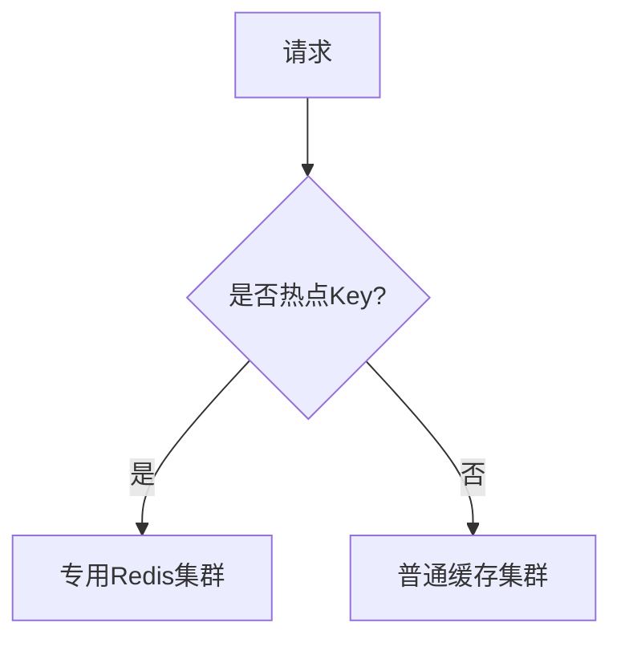
#### **数据库防护层**
• 请求队列：对相同Key的请求去重合并
• SQL限流：通过数据库中间件（如MyCat）限制单Key查询频率
---
### 💎 **方案对比与选型**
| 问题类型 | 核心方案                | 适用场景                         | 性能影响         |
| -------- | ----------------------- | -------------------------------- | ---------------- |
| 缓存雪崩 | 过期时间分散 + 多级缓存 | 大促活动、定时批量更新场景       | 低（空间换时间） |
| 缓存穿透 | 布隆过滤器 + 空值缓存   | 高频访问不存在数据（如用户搜索） | 中（计算开销小） |
| 缓存击穿 | 分布式锁 + 逻辑过期     | 微博热搜、秒杀商品等热点数据     | 高（锁竞争开销） |
> 终极防御组合：  
> `布隆过滤器` + `多级缓存` + `热点Key探测` + `数据库请求合并`
---
### 📊 **监控与运维关键点**
1. 缓存命中率监控  
   ```bash
   # Redis监控命令
   redis-cli info stats | grep keyspace_misses
   redis-cli info stats | grep keyspace_hits
   ```
   公式：命中率 = hits / (hits + misses)  
   预警阈值：<90% 触发告警
2. 慢查询分析  
   ```sql
   # MySQL开启慢查询日志
   slow_query_log = ON
   long_query_time = 0.5  # 超过500ms记录
   ```
3. 热点Key实时检测  
   ```bash
   # Redis 0+ 热点Key监控
   redis-cli --hotkeys
   ```
---
通过分层防御策略（缓存层+数据库层+代码层），结合实时监控，可构建高可用的缓存体系。实际应用中需根据业务特性灵活组合方案，如电商秒杀系统需重点防御击穿，内容检索系统需严防穿透。
## 进程通信 & 线程通信

进程间通信（IPC）和线程间通信是并发编程中的核心概念，二者的异同点源于**资源隔离性**与**执行单元**的本质差异。以下从通信机制、性能、安全性等维度进行系统对比：


------
### 🔍 **核心差异总览**

| **维度**       | **进程间通信（IPC）**              | **线程间通信**                     |
| -------------- | ---------------------------------- | ---------------------------------- |
| **资源隔离性** | 高（独立内存空间、文件句柄等）     | 低（共享进程内存和资源）           |
| **通信成本**   | 高（需内核介入或跨内存拷贝）       | 极低（直接读写共享内存）           |
| **同步必要性** | 必须显式同步（如信号量、锁）       | 必须显式同步（避免竞态条件）       |
| **安全性**     | 高（一个进程崩溃不影响其他进程）   | 低（线程崩溃可能导致整个进程退出） |
| **通信机制**   | 管道、消息队列、共享内存、Socket等 | 共享变量、锁、条件变量等           |


------
### ⚙️ **通信机制详解**

#### **进程间通信（IPC）**

- **管道（Pipe）**
  ```
  # Shell示例：父子进程通信
  echo "hello" | wc -c  # 匿名管道
  mkfifo my_pipe        # 命名管道
  ```
  - **特点**：单向通信，血缘关系进程间使用，内核缓冲区传输。
- **消息队列（Message Queue）**
  ```
  // C语言示例：发送消息
  msgsnd(qid, &msg, sizeof(msg.text), 0);
  ```
  - **特点**：异步通信，消息类型过滤，内核持久化（重启丢失）。
- **共享内存（Shared Memory）**
  ```
  // 创建共享内存段
  shm_id = shmget(IPC_PRIVATE, size, IPC_CREAT | 0666);
  ```
  - **特点**：**最快IPC方式**，需配合信号量同步，存在安全风险。
- **Socket**
  ```
  # Python示例：本地Socket通信
  import socket
  s = socket.socket(socket.AF_UNIX, socket.SOCK_STREAM)
  s.connect("/tmp/socket_file")
  ```
  - **特点**：跨网络通用，但本地通信效率低于其他IPC。
#### **线程间通信**

- **共享内存（全局变量）**
  ```
  // Java示例：共享变量
  public class Counter {
      public static int value = 0;  // 多线程共享
  }
  ```
  - **风险**：需同步（如`synchronized`），否则数据竞争。
- **锁机制（Lock）**
  ```
  # Python线程锁
  from threading import Lock
  lock = Lock()
  with lock:
      shared_data += 1
  ```
- **条件变量（Condition）**
  ```
  // C++11：生产者-消费者模型
  std::condition_variable cv;
  std::mutex mtx;
  cv.wait(lock, []{ return !queue.empty(); });  // 等待条件
  ```
- **信号量（Semaphore）**
  ```
  // Java控制并发数
  Semaphore sem = new Semaphore(5);  // 允许5个线程同时访问
  sem.acquire();  // 申请许可
  ```


------
### ⚡ **性能对比（Linux实测数据）**

| **通信方式** | **延迟（ns）** | **吞吐量（GB/s）** | **适用场景**             |
| ------------ | -------------- | ------------------ | ------------------------ |
| 线程共享变量 | 10~50          | >100               | 高频数据交换（如计数器） |
| 进程共享内存 | 100~500        | 10~20              | 大数据交换（图像处理）   |
| 进程消息队列 | 2000~5000      | 0.5~2              | 结构化消息传递           |
| 本地Socket   | 5000~10000     | 0.1~0.5            | 跨语言/跨进程通用通信    |
> 注：测试环境 Intel i7-12700K, Linux 5.15, 双进程/线程通信。


------
### 🛡️ **安全性与错误隔离**

#### **进程间通信**

- 优势：
  - 进程崩溃不影响其他进程（如Chrome多进程架构）
  - 操作系统强制内存隔离（防止越权访问）
- 劣势：
  - 通信需权限控制（如Linux用户组权限）
  ```
  # 设置共享内存权限
  ipcrm -M 0x1234  # 删除共享内存段
  ```
#### **线程间通信**

- 风险：
  - 一个线程段错误（Segmentation Fault）导致整个进程崩溃
  - 共享数据未同步 → 数据竞争（Race Condition）
    ```
    // C语言未同步示例
    int counter = 0;
    void* thread_func() { for(int i=0; i<1000000; i++) counter++; }
    // 结果可能远小于2000000
    ```


------
### 🧩 **典型应用场景**

| **场景**                | **推荐方式**      | **原因**                         |
| ----------------------- | ----------------- | -------------------------------- |
| 浏览器渲染引擎          | 多进程+消息队列   | 隔离崩溃风险（如标签页独立进程） |
| 数据库连接池            | 线程池+互斥锁     | 低延迟管理连接（共享内存高效）   |
| 微服务通信              | 进程间Socket/HTTP | 跨主机、语言无关                 |
| 实时交易系统            | 线程+无锁队列     | 超低延迟（如Disruptor框架）      |
| 大数据处理（MapReduce） | 进程+共享文件     | 跨节点容错                       |


------
### 💎 **设计选型建议**

1. **优先选择线程通信当且仅当**：
   - 需要极高性能（如高频交易系统）
   - 任务耦合度高（如线程池任务分发）
   - 能严格保证线程安全（通过锁/原子操作）
2. **必须使用进程通信当**：
   - 需要强隔离性（如安全沙箱）
   - 跨语言/跨平台交互（如Python调用C++模块）
   - 利用多机扩展能力（如分布式计算）
3. **混合架构示例**：
   ```
   graph TD
     A[主进程] -->|Socket| B(子进程1)
     A -->|共享内存| C(子进程2)
     B -->|管道| D{线程池}
     C -->|消息队列| E[外部服务]
   ```
   - 进程间用Socket/共享内存，进程内线程用锁同步。


------
### 🔧 **编程语言支持对比**

| **语言** | **进程通信支持**              | **线程通信支持**                |
| -------- | ----------------------------- | ------------------------------- |
| C/C++    | pipe(), shmget(), msgqueue()  | pthread_mutex, std::atomic      |
| Java     | ProcessBuilder, Socket        | synchronized, ConcurrentHashMap |
| Python   | multiprocessing.Queue, Pipe   | threading.Lock, queue.Queue     |
| Go       | goroutine+channel（模拟进程） | sync.Mutex, channel（原生）     |
> Go语言的goroutine虽称为“协程”，但其channel通信机制可同时满足线程/进程级通信需求。


------
### 📌 **总结**

- **根本区别**：
  ​**进程通信 = 跨隔离边界的数据交换**​（需内核或网络介入）
  ​**线程通信 = 同一内存空间内的协同操作**​（需同步机制）
- **选择黄金法则**：
  ​**隔离性要求高 → IPC**​（如微服务）
  ​**性能要求高 → 线程通信**​（如游戏服务器）
  ​**平衡需求 → 混合架构**​（如Chrome浏览器）
  理解二者差异，结合业务需求选择通信机制，是构建高并发、高可靠系统的关键基础。
## **Goroutine** & **Channel**

Go语言的**协程（Goroutine）**和**通道（Channel）**是其并发编程的核心，二者共同构建了**CSP（Communicating Sequential Processes）模型**的优雅实现。以下从底层原理到实战技巧的深度解析：


------
### 🚀 协程（Goroutine）

#### **本质与优势**

- 轻量级线程：
  - 协程是用户态线程，由Go运行时调度（非OS内核）
  - 初始栈仅**2KB**（线程通常1-2MB），可动态扩缩容
- 高效调度：
  - **M:N调度模型**：M个协程映射到N个OS线程
  - 阻塞操作（如I/O）自动切换协程，无感让出CPU
- 创建开销低：
  ```
  go func() { // 关键字go启动协程
      fmt.Println("Hello from goroutine!")
  }()
  ```
  创建耗时约
  200-300ns
  （线程创建需1-2ms）
#### **调度器原理（GMP模型）**

```
graph TB
    G1[Goroutine] --> |绑定| P[Processor]
    G2[Goroutine] --> P
    G3[Goroutine] --> P
    P --> |运行队列| M1[OS Thread 1]
    P --> M2[OS Thread 2]
    M1 --> |系统调用| SYS[内核]
```
- **G**：协程（Goroutine）
- **P**：处理器（Processor），含本地运行队列（限制256个）
- **M**：OS线程（Machine），绑定物理CPU核心
**工作窃取（Work Stealing）**：空闲P从全局队列或其他P偷取G执行


------
### 📡 通道（Channel）

#### **通道的本质**

- **类型化管道**：`chan T` 传递类型为T的值
- **同步通信**：替代共享内存+锁，避免竞态条件
- 创建方式：
  ```
  ch := make(chan int)    // 无缓冲通道（同步）
  bufferedCh := make(chan string, 10) // 缓冲通道（容量10）
  ```
#### **通道操作语义**

| **操作**             | **无缓冲通道**      | **缓冲通道（容量N）** |
| -------------------- | ------------------- | --------------------- |
| **发送** `ch <- v`   | 阻塞直到接收方就绪  | 缓冲区满时阻塞        |
| **接收** `<-ch`      | 阻塞直到发送方就绪  | 缓冲区空时阻塞        |
| **关闭** `close(ch)` | 关闭后发送触发panic | 关闭后可接收剩余数据  |
#### **高级模式**

- 多路选择：
  ```
  select
  ```
  监听多个通道
  ```
  select {
  case msg := <-ch1:
      fmt.Println(msg)
  case ch2 <- "hello":
      fmt.Println("sent")
  case <-time.After(1 * time.Second):
      fmt.Println("timeout")
  }
  ```
- 单向通道：限制通道方向（编译时检查）
  ```
  func producer(out chan<- int) { // 只发送通道
      out <- 42
  }
  func consumer(in <-chan int) { // 只接收通道
      fmt.Println(<-in)
  }
  ```


------
### ⚡ 协程+通道实战技巧

#### **生产者-消费者模型**

```
func main() {
    ch := make(chan int, 5)
    go producer(ch) // 启动生产者协程
    consumer(ch)    // 主协程消费
}

func producer(ch chan<- int) {
    for i := 0; i < 10; i++ {
        ch <- i
    }
    close(ch) // 关闭通道通知消费者
}

func consumer(ch <-chan int) {
    for num := range ch { // 自动检测关闭
        fmt.Println(num)
    }
}
```
#### **协程池（Worker Pool）**

```
func worker(id int, jobs <-chan int, results chan<- int) {
    for job := range jobs {
        results <- job * 2 // 处理任务
    }
}

func main() {
    jobs := make(chan int, 100)
    results := make(chan int, 100)
    
    // 启动3个worker协程
    for w := 1; w <= 3; w++ {
        go worker(w, jobs, results)
    }
    
    // 分发任务
    for j := 1; j <= 9; j++ {
        jobs <- j
    }
    close(jobs)
    
    // 收集结果
    for r := 1; r <= 9; r++ {
        fmt.Println(<-results)
    }
}
```
#### **超时控制**

```
select {
case res := <-asyncCall():
    fmt.Println(res)
case <-time.After(500 * time.Millisecond):
    fmt.Println("请求超时")
}
```


------
### 🛡️ 避坑指南

1. **协程泄漏**：
   - 未关闭的通道导致阻塞协程永存 → 用`context`取消协程
   ```
   ctx, cancel := context.WithCancel(context.Background())
   go func(ctx context.Context) {
       select {
       case <-ctx.Done(): // 收到取消信号
           return
       case data := <-ch:
           // ...
       }
   }(ctx)
   cancel() // 取消协程
   ```
2. **通道关闭原则**：
   - **不要关闭已关闭的通道**（触发panic）
   - **发送方负责关闭**（避免接收方关闭引发混乱）
3. **零值通道陷阱**：
   ```
   var ch chan int // 零值为nil
   ch <- 1        // 永久阻塞（非panic）
   ```


------
### ⚙️ 底层实现揭秘

#### **协程栈管理**

- **分段栈（旧版）**：栈不足时创建新栈（易触发“热分裂”性能抖动）
- 连续栈（Go1.3+）：
  - 栈不足时分配**2倍新栈** → 拷贝数据 → 无缝切换
  - 缩容：GC时检测利用率<50%则缩小
#### **Channel底层结构**

```
type hchan struct {
    qcount   uint      // 当前数据量
    dataqsiz uint      // 缓冲区大小
    buf      unsafe.Pointer // 环形数组指针
    sendx    uint       // 发送索引
    recvx    uint       // 接收索引
    lock     mutex      // 互斥锁（保护操作）
    recvq    waitq      // 阻塞的接收协程队列
    sendq    waitq      // 阻塞的发送协程队列
}
```
- **无缓冲通道**：`buf`为`nil`，直接匹配发送/接收协程
- **缓冲通道**：数据存入`buf`，满时发送协程加入`sendq`


------
### 💎 性能优化建议

1. **协程数量控制**：
   - 避免百万级协程 → 用`worker pool`限制并发
   - 监控工具：`runtime.NumGoroutine()`
2. **通道选择策略**：
   | **场景**   | **通道类型**      | **原因**                      |
   | ---------- | ----------------- | ----------------------------- |
   | 同步信号   | `chan struct{}`   | 零内存开销（`struct{}`大小0） |
   | 高频小数据 | 缓冲通道          | 减少协程切换                  |
   | 跨协程取消 | `context.Context` | 标准取消机制                  |
3. **避免通道竞争**：
   - 单生产者单消费者 → 无需锁
   - 多生产者 → `sync.Mutex`或`单个管理协程`


------
### 总结：Go并发哲学

- **核心原则**：
  ​**​“不要通过共享内存来通信，而要通过通信来共享内存”​**​
- 最佳实践：
  - 简单任务 → 直接`go`启动协程
  - 数据传递 → 通道（`channel`）
  - 复杂同步 → `sync`包（Mutex/WaitGroup）
- 性能关键：
  - 协程轻量但非无限 → 控制并发深度
  - 通道非银弹 → 高吞吐场景用`atomic`或`sync.Pool`
  通过协程和通道的组合，Go以极简语法实现了高性能并发，成为云原生时代的核心语言。
## 消息积压

Kafka处理消息堆积的核心思路是**平衡生产与消费速率**，需从消费者、生产者、集群架构及监控应急四个维度综合优化。以下是系统化解决方案：


------
### 🔧 消费者端优化（核心手段）

1. **提升消费并行度**
   - **增加消费者实例**：在消费者组中添加更多实例，确保实例数**不超过分区数**（例如10个分区最多10个消费者），每个实例独立消费不同分区，显著提升吞吐。
   - **多线程消费**：单个消费者内使用线程池并行处理消息（如Java的`ExecutorService`），避免单线程阻塞。
2. **优化消费逻辑**
   - **异步化耗时操作**：将数据库写入、外部接口调用等IO操作交给异步线程或内存队列，主线程快速提交offset。
   - **批量处理**：配置`max.poll.records`增大单次拉取消息量，批量处理减少交互次数（如批量插入数据库）。
   - **简化业务逻辑**：避免冗余计算和复杂日志，减少单条消息处理时间。
3. **调整消费配置**
   - 增大`fetch.max.bytes`（单次拉取数据量）和`fetch.min.bytes`（最小数据阈值），减少网络请求次数。
   - 优化`session.timeout.ms`防止频繁重平衡。


------
### 🚦 生产者端优化（控制源头）

1. **限流削峰**
   - 网关层或生产者端使用**令牌桶算法**限制发送速率，避免突发流量压垮下游。
   - 业务高峰期前预热流量，平滑过渡。
2. **批量发送与压缩**
   - 设置`linger.ms`（等待时间）和`batch.size`（批次大小），合并多条消息一次性发送。
   - 启用压缩（如`gzip`）减少网络传输量。


------
### ⚙️ Kafka集群与架构优化

1. **扩容分区与集群**
   - **增加Topic分区数**：分区数是并行消费的上限，通过`kafka-topics.sh --alter --partitions`扩容分区（如从5增至20），提高并发能力。
   - **水平扩展Broker**：添加新节点分担负载，避免单节点资源（CPU/磁盘IO）瓶颈。
2. **负载均衡与分区分配**
   - 确保分区均匀分布在Broker上，避免数据倾斜。
   - 使用`kafka-reassign-partitions.sh`手动调整分区分布。
3. **清理策略调整**
   - 缩短消息保留时间（`log.retention.hours`）或限制日志大小（`log.retention.bytes`），自动清理过期数据释放磁盘。


------
### 🚨 监控与应急处理

1. **实时监控告警**
   - 跟踪`Consumer Lag`（消费滞后量）指标，通过Prometheus+Grafana设置阈值告警（如Lag > 10万）。
   - 使用`kafka-consumer-groups.sh`命令行工具实时检查各分区堆积情况。
2. **积压快速清理**
   - **临时跳过非关键消息**：重置offset至最新位置（`auto.offset.reset=latest`），历史数据离线补偿。
   - **分流重导**：创建新Topic（分区数更多），将积压消息转发至新Topic，由扩容后的消费者组并行处理。


------
### 💎 最佳实践总结

| **场景**             | **优化方案**                 | **关键操作**                          |
| -------------------- | ---------------------------- | ------------------------------------- |
| **突发流量堆积**     | 生产者限流 + 消费者扩容      | 令牌桶算法 + 动态启动消费者实例       |
| **长期消费能力不足** | 增加分区数 + 优化消费逻辑    | `partitions`增至预期并发数 + 异步化IO |
| **集群资源瓶颈**     | Broker水平扩展 + SSD磁盘升级 | 添加节点 + `log.retention.hours`调整  |
| **积压应急处理**     | 监控告警 + 消息分流或跳过    | Prometheus报警 + 创建新Topic分流      |
```
graph LR
    A[消息堆积] --> B{原因分析}
    B --> C1[生产速度 > 消费速度]
    B --> C2[资源不足/逻辑低效]
    A --> D[解决方案]
    D --> E1[消费端： 扩容实例/异步/批量]
    D --> E2[生产端： 限流/批量发送]
    D --> E3[集群： 增分区/Broker]
    D --> E4[监控： Lag告警+应急分流]
```
### 📌 核心原则：

1. **分区数决定并行上限**：消费者实例数 ≤ 分区数，否则多余实例闲置。
2. **最终一致性兜底**：允许短暂延迟的场景，用异步+批量提升吞吐；强一致性场景需结合同步复制或分布式事务。
3. **预防优于治理**：业务初期合理规划分区（预留50%冗余）和保留策略，定期压测。
> 通过上述组合策略，可有效解决90%的堆积问题。极端情况（如百万级积压）建议采用**消息分流+离线补偿**，同时根治消费链路瓶颈。
## 消息重传

消息重传是保障消息可靠性的核心机制，确保消息在网络抖动、消费者故障等异常情况下仍能被正确处理。以下是系统化的解决方案：


------
## 🔄 消息重传的触发场景

1. 
   消费者处理失败
- 业务逻辑异常（如数据库写入失败）
   - 消费者进程崩溃（未发送ACK）
2. 
   网络波动
- ACK确认丢失（如Kafka的ISR副本同步延迟）
3. 
   超时机制
- 消费者处理超时（如RabbitMQ的`consumer_timeout`）


------
## 🛡️ 消息队列自带的重传机制

### RabbitMQ - 消息确认（ACK）

```
// 消费者代码示例
channel.basicConsume(queue, false, (consumerTag, delivery) -> {
    try {
        processMessage(delivery.getBody()); // 业务处理
        channel.basicAck(deliveryTag, false); // 手动ACK
    } catch (Exception e) {
        channel.basicNack(deliveryTag, false, true); // 重传
    }
});
```
**重传控制**：
- `basicNack`的`requeue=true`时消息重新入队
- 设置重试次数上限（防无限重试）
### Kafka - 偏移量提交

```
// 消费者关闭自动提交
props.put("enable.auto.commit", "false");
while (true) {
    ConsumerRecords<String, String> records = consumer.poll(100);
    for (record : records) {
        try {
            process(record.value());
            consumer.commitSync(); // 手动提交偏移量
        } catch (Exception e) {
            // 不提交偏移量 → 下次拉取相同数据
        }
    }
}
```
**重传逻辑**：未提交偏移量 → 消息保留在分区 → 下次重新消费
### RocketMQ - 消费重试队列

```
// 默认重试16次（间隔递增）
public class Consumer {
    public static void main(String[] args) throws Exception {
        DefaultMQPushConsumer consumer = new DefaultMQPushConsumer("group");
        consumer.registerMessageListener((msg, context) -> {
            try {
                process(msg);
                return ConsumeConcurrentlyStatus.CONSUME_SUCCESS;
            } catch (Exception e) {
                return ConsumeConcurrentlyStatus.RECONSUME_LATER; // 重试
            }
        });
    }
}
```
**重试策略**：
- 重试消息进入`%RETRY%`队列
- 重试间隔：1s, 5s, 10s, 30s...


------
## ⚠️ 重复消费的风险与解决方案

消息重传必然导致**重复消费**，需业务层做幂等处理。
### 幂等设计核心思路

- **唯一标识**：每条消息携带全局唯一ID（如`requestId`）
- **状态检查**：处理前检查该ID是否已执行
### 幂等实现方案

| **存储介质** | **实现方式**                     | **适用场景**               |
| ------------ | -------------------------------- | -------------------------- |
| **数据库**   | 唯一索引约束                     | 订单创建、支付等强事务场景 |
| **Redis**    | `SETNX key requestId` + 过期时间 | 高频请求（如秒杀）         |
| **本地缓存** | Guava Cache（短时效去重）        | 临时性去重（如验证码）     |
**示例代码（Redis幂等）**：
```
boolean isProcessed = redis.setIfAbsent("order:" + requestId, "1", 24, TimeUnit.HOURS);
if (!isProcessed) {
    return; // 已处理过
}
processOrder(requestId);
```


------
## ⚙️ 高级重传控制策略

### 死信队列（DLQ）

- **作用**：处理多次重试仍失败的消息（防阻塞正常队列）
- 配置示例（RabbitMQ）：
  ```
  // 声明死信交换机和队列
  args.put("x-dead-letter-exchange", "dlx.exchange");
  channel.queueDeclare("normal.queue", true, false, false, args);
  ```
### 重试次数衰减

- **场景**：避免高频重试压垮系统
- 实现：指数退避算法（Exponential Backoff）
  ```
  # RabbitMQ插件实现（rabbitmq-delayed-message-exchange）
  headers = {"x-delay": 5000}  # 延迟5秒重试
  channel.basic_publish(exchange, routing_key, body, headers=headers)
  ```
### 人工干预通道

- 设计：
  ```
  graph LR
    A[正常队列] -->|重试3次| B[死信队列]
    B --> C[人工处理后台]
    C -->|修复后| A
  ```
  - 人工查看死信消息 → 修复数据 → 重新投递


------
## 📊 消息队列选型对比

| **队列系统** | **重传机制**             | **重复消费防护建议**    |
| ------------ | ------------------------ | ----------------------- |
| RabbitMQ     | NACK + Requeue           | 业务层幂等 + 死信队列   |
| Kafka        | 偏移量重置 + 重拉取      | 消费者幂等 + 事务ID     |
| RocketMQ     | 重试队列 + 死信队列      | 唯一消息ID + 数据库幂等 |
| Pulsar       | 单条重试 + 负ACK（NACK） | Broker去重 + 业务幂等   |


------
## 💎 最佳实践总结

1. 
   基础保障：
   - 消费者手动ACK/提交偏移量
   - 设置合理的重试次数上限（如3-5次）
2. 
   幂等设计：
   - 消息带唯一ID（UUID/Snowflake）
   - 业务层做幂等校验（Redis/数据库）
3. 
   死信管理：
   - 转移多次失败消息到DLQ
   - 搭建人工处理后台
4. 
   监控告警：
   - 监控死信队列堆积（如Prometheus + Grafana）
   - 重试率超过阈值触发告警
> **关键原则**：通过**消息重传+业务幂等**的组合拳，既能保证消息可靠投递，又能避免重复消费引发的数据错误。
## Redis幂等处理宕机容错

# 消费端Redis幂等处理的宕机容错方案

当消费端使用Redis进行幂等处理时，若在设置KEY后发生宕机，会导致业务未完成但幂等标记已存在的问题，造成数据不一致。以下是系统性解决方案：
---
## ⚠️ 问题本质：幂等状态与业务状态不一致
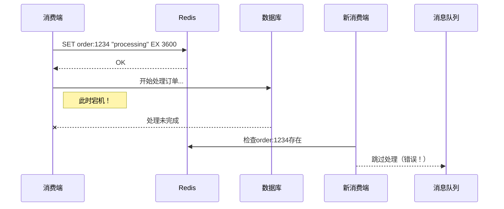
风险：Redis中存在幂等KEY，但实际业务未完成 → 后续重试被错误跳过
---
## 🛡️ 解决方案：状态标记法（推荐）

### 三状态幂等机制
```redis
# Redis存储结构
订单ID: {
    "status": "processing", # 处理状态
    "start_time": 1672500000, # 开始时间戳
    "expire": 3600           # 超时时间
}
```
### 消费端流程
```go
func ProcessMessage(msg Message) {
    key := "order:" + msg.ID
    
    // 1. 尝试设置处理中状态（原子操作）
    ok, err := redis.SetNX(key, "processing", 10*time.Minute).Result()
    if err != nil {
        return err
    }
    
    // 2. 已存在KEY时的处理
    if !ok {
        status, _ := redis.HGet(key, "status").Result()
        switch status {
        case "completed": // 已完成 → 直接跳过
            return nil
        case "processing": // 处理中 → 检查超时
            startTime, _ := redis.HGet(key, "start_time").Int64()
            if time.Now().Unix()-startTime > 300 { // 超时5分钟
                redis.HSet(key, "status", "processing") // 重置状态
                redis.HSet(key, "start_time", time.Now().Unix())
                goto PROCESS // 重新处理
            }
            return errors.New("wait for processing")
        }
    }
    
PROCESS:
    // 3. 执行业务逻辑
    err = db.CreateOrder(msg.ID, msg.Data)
    if err != nil {
        redis.Del(key) // 失败删除KEY
        return err
    }
    
    // 4. 标记完成
    redis.HSet(key, "status", "completed")
    redis.Expire(key, 24*time.Hour) // 完成后保留24小时
}
```
---
## 🔄 补偿机制：后台扫描+修复

### 设计扫描任务
```python
def scan_stuck_orders():
    # 查找所有processing状态超过5分钟的订单
    keys = redis.keys("order:*")
    for key in keys:
        status = redis.hget(key, "status")
        start_time = redis.hget(key, "start_time")
        
        if status == "processing" and time.time() - start_time > 300:
            # 检查数据库实际状态
            order_id = key.split(":")[1]
            if not db.order_exists(order_id): 
                # 业务未完成 → 清除幂等锁
                redis.delete(key)  
                logging.warning(f"Cleaned stuck order: {order_id}")
```
### 部署定时任务
```bash
# 每10分钟扫描一次
*/10 * * * * python /scripts/scan_stuck_orders.py
```
---
## ⚡ 增强版：Redis事务+数据库事务

### 原子性操作设计
```java
// 使用Redis事务+数据库事务
@Transactional
public void processOrder(OrderMessage msg) {
    String key = "order:" + msg.getId();
    
    // 1. Redis Watch监控KEY
    redis.watch(key);
    
    // 2. 检查幂等状态
    if ("completed".equals(redis.hget(key, "status"))) {
        return;
    }
    
    // 3. 开启Redis事务
    redis.multi();
    redis.hset(key, "status", "processing");
    redis.hset(key, "start_time", System.currentTimeMillis()/1000);
    redis.expire(key, 600);
    
    // 4. 执行业务
    orderService.createOrder(msg);
    
    // 5. 更新Redis状态
    redis.hset(key, "status", "completed");
    redis.exec(); // 提交Redis事务
}
```
### 异常处理
• 宕机时Redis事务未提交 → KEY不会被设置
• 数据库事务回滚 → 业务状态回退
---
## 📊 多级防护策略对比

| 方案                  | 实现复杂度 | 可靠性 | 适用场景               |
| --------------------- | ---------- | ------ | ---------------------- |
| 三状态标记法          | 中等       | ⭐⭐⭐⭐   | 通用场景（推荐）       |
| 后台扫描补偿          | 低         | ⭐⭐⭐    | 配合主方案使用         |
| Redis+DB事务          | 高         | ⭐⭐⭐⭐⭐  | 金融等高一致性要求     |
| 消息队列重试+死信队列 | 低         | ⭐⭐     | 简单业务（需人工介入） |
---
## 🧩 组合方案最佳实践

### 架构设计
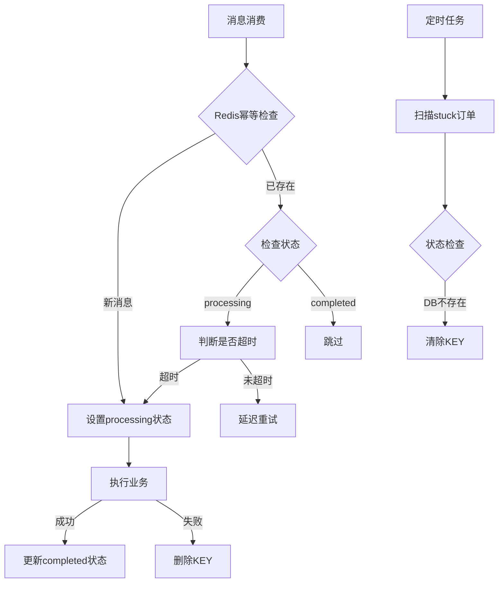
### 部署要点
1. Redis高可用：使用Redis Cluster或Sentinel避免单点故障
2. 状态超时时间：根据业务处理时间动态调整（建议2-5倍平均处理时间）
3. 监控告警：
   ```bash
   # 监控processing状态订单数量
   redis-cli --eval stuck_orders.lua
   ```
   ```lua
   -- stuck_orders.lua
   local keys = redis.call('KEYS', 'order:*')
   local count = 0
   for _, key in ipairs(keys) do
     if redis.call('HGET', key, 'status') == 'processing' then
       local start = redis.call('HGET', key, 'start_time')
       if tonumber(start) < tonumber(ARGV[1]) then  -- ARGV[1]为当前时间-300
         count = count + 1
       end
     end
   end
   return count
   ```
---
## 💎 总结：宕机处理黄金法则

1. 状态标记：使用`processing`/`completed`双状态，而非简单存在判断
2. 超时机制：为processing状态设置合理超时（建议业务耗时的3倍）
3. 补偿任务：定时扫描+自动修复异常状态
4. 事务整合：对一致性要求高的场景，绑定Redis与数据库事务
5. 监控覆盖：实时监控stuck订单数量，超过阈值告警
> 关键公式：  
> 可靠性 = 状态机设计 + 超时控制 + 后台修复  
> 通过多级防护，即使消费端宕机也能保证业务最终一致性。
## Linux 负载

在 Linux 系统中，查看机器负载是系统管理和性能调优的基础操作。负载反映了系统资源（主要是 CPU）的繁忙程度，通常通过三个关键指标来衡量：**1分钟、5分钟和15分钟的平均负载**。以下是全面的查看方法和解读指南：


------
## 📊 核心命令与工具

### **`uptime` - 最快捷的负载概览**

```
$ uptime
 15:32:45 up 10 days,  2:15,  3 users,  load average: 0.08, 0.03, 0.05
```
- 关键字段：
  - `load average: 0.08, 0.03, 0.05` → 1分钟/5分钟/15分钟平均负载
  - **经验值**：负载 < CPU核心数 × 0.7 为安全范围
### **`top` - 实时进程级监控**

```
$ top
top - 15:33:22 up 10 days,  2:16,  3 users,  load average: 0.08, 0.03, 0.05
Tasks: 231 total,   1 running, 230 sleeping,   0 stopped,   0 zombie
%Cpu(s):  0.3 us,  0.0 sy,  0.0 ni, 99.7 id,  0.0 wa,  0.0 hi,  0.0 si,  0.0 st
MiB Mem :   7859.8 total,   5723.2 free,    128.4 used,   2008.2 buff/cache
MiB Swap:   2048.0 total,   2048.0 free,      0.0 used.
```
- 核心关注点：
  - **负载行**：`load average`
  - CPU行：
    - `us`：用户空间CPU占比
    - `sy`：内核空间CPU占比
    - `id`：空闲CPU占比
    - `wa`：I/O等待占比（>5%需警惕磁盘瓶颈）
  - **内存/交换分区**：Swap使用量高说明物理内存不足
### **`htop` - 增强版 top（推荐）**

```
$ htop
```
https://htop.dev/images/screenshot.png
- 优势：
  - 彩色显示，直观区分进程类型
  - 鼠标操作支持
  - 树状视图展示进程关系
  - 直接杀死进程（F9键）
### **`mpstat` - 多核CPU详细统计**

```
$ mpstat -P ALL 1  # 每秒刷新，显示所有核心
10:20:01 AM  CPU    %usr   %nice    %sys %iowait    %irq   %soft  %steal  %guest  %gnice   %idle
10:20:02 AM  all    0.25    0.00    0.25    0.00    0.00    0.00    0.00    0.00    0.00   99.50
10:20:02 AM    0    0.00    0.00    0.00    0.00    0.00    0.00    0.00    0.00    0.00  100.00
10:20:02 AM    1    0.99    0.00    0.99    0.00    0.00    0.00    0.00    0.00    0.00   98.02
```
- 关键列：
  - `%iowait`：CPU等待I/O的时间（磁盘瓶颈指标）
  - `%idle`：CPU空闲率（持续<20%说明CPU饱和）


------
## 🔍 负载深度分析工具

### **`vmstat` - 虚拟内存统计**

```
$ vmstat 1 5  # 每秒1次，共5次
procs -----------memory---------- ---swap-- -----io---- -system-- ------cpu-----
 r  b   swpd   free   buff  cache   si   so    bi    bo   in   cs us sy id wa st
 0  0      0 5481232 102244 1328448    0    0     0     1    0    0  0  0 100  0  0
```
- 关键列解读：
  - `r`：可运行进程数（>CPU核数说明CPU饱和）
  - `b`：阻塞进程数（I/O等待）
  - `wa`：I/O等待时间占比
  - `cs`：上下文切换次数（过高说明进程频繁切换）
### **`iostat` - I/O负载分析**

```
$ iostat -dx 2  # 每2秒刷新磁盘统计
Device: rrqm/s wrqm/s  r/s   w/s  rkB/s  wkB/s  avgrq-sz avgqu-sz await r_await w_await svctm  %util
sda:     0.00   0.00  0.00  0.00   0.00   0.00     0.00     0.00    0.00    0.00    0.00   0.00   0.00
```
- 关键指标：
  - `%util`：设备使用率（>80%表示磁盘饱和）
  - `await`：平均I/O响应时间（>10ms需优化）
### **`dstat` - 全能资源监控**

```
$ dstat -tcmnd --disk-util


----system---- --total-cpu-usage-- ------memory-usage----- -net/total- -dsk/total-
     time     |usr sys idl wai stl| used  buff  cach  free| recv  send| read  writ
10-05 15:40:10|  0   0 100   0   0| 1.2G 102M 1.3G  5.4G|   0     0 |   0     0
```
- **优势**：同时展示CPU/内存/网络/磁盘数据


------
## 📈 负载指标解读指南

### **负载值（Load Average）**

- **定义**：单位时间内处于**可运行状态**或**不可中断状态**的平均进程数
- 健康阈值：
  ```
  安全范围：Load < CPU核心数 × 0.7
  警告阈值：Load > CPU核心数 × 1.0
  危险阈值：Load > CPU核心数 × 2.0
  ```
- 查看CPU核心数：
  ```
  $ nproc      # 输出总核心数
  $ lscpu | grep "CPU(s)"  # 详细拓扑
  ```
### **负载高但CPU空闲？**

当出现：
- Load很高但`top`显示`%idle`很高
- `vmstat`的`b`列（阻塞进程）数值高
  说明存在 ​**I/O瓶颈**​（磁盘或网络）
### **负载类型诊断**

| **症状**                 | **可能原因**       | **排查工具**         |
| ------------------------ | ------------------ | -------------------- |
| 高`us`（用户CPU）        | 应用代码消耗CPU    | `top` → 查看进程     |
| 高`sy`（系统CPU）        | 内核调用频繁       | `strace`跟踪系统调用 |
| 高`wa`（I/O等待）        | 磁盘速度不足       | `iostat`, `iotop`    |
| 高`si`（软中断）         | 网络包处理         | `sar -n DEV 1`       |
| 频繁上下文切换（`cs`高） | 进程过多或频繁调度 | `pidstat -w 1`       |


------
## 🛠️ 自动化监控方案

### **实时仪表盘**

```
# 使用 glances（需安装）
$ glances --web  # 浏览器访问 http://localhost:61208
```
https://glances.readthedocs.io/en/stable/_images/glances-web.png
### **历史数据分析**

```
# 使用 sar（sysstat包）
$ sar -u 1 3     # CPU使用率（每秒1次，共3次）
$ sar -b         # I/O统计
$ sar -n DEV     # 网络流量
```
### **告警配置示例（Zabbix）**

```
触发器表达式：
{host:system.cpu.load[avg1].last()} > {host:system.cpu.num}.last() * 0.8
```
当1分钟负载超过CPU核心数的80%时触发告警


------
## 💎 最佳实践总结

1. **负载观察黄金组合**：
   ```
   watch -n 1 "uptime; echo; top -bn1 | head -15"
   ```
2. **诊断流程**：
   ```
   graph TD
     A[高负载] --> B{检查CPU使用}
     B -->|us/sy高| C[分析top进程]
     B -->|wa高| D[检查iostat]
     B -->|idle高| E[检查vmstat的b列]
     E -->|b列高| F[磁盘/网络I/O瓶颈]
   ```
3. **关键阈值备忘**：
   | **指标**         | **警告阈值**   | **危险阈值**   |
   | ---------------- | -------------- | -------------- |
   | CPU负载（15min） | > 0.7 × 核心数 | > 1.0 × 核心数 |
   | CPU I/O等待      | > 5%           | > 20%          |
   | 磁盘使用率       | > 80%          | > 95%          |
   | 内存使用率       | > 85%          | > 95%          |
   | Swap使用         | > 0            | > 1GB          |
> **终极命令**：
> `htop` + `iftop` + `iotop` 三屏并列实时监控CPU/网络/磁盘
## linux 查看 TCP 连接

# Linux 查看已建立的 TCP 连接

在 Linux 系统中，有多种工具可以查看已建立的 TCP 连接。以下是常用的方法和工具详解：


------
## 🔍 基础命令工具

### **`netstat`（传统工具）**

```
# 查看所有已建立的 TCP 连接
netstat -ant | grep 'ESTABLISHED'

# 查看指定端口的连接（如 80 端口）
netstat -ant | grep ':80' | grep 'ESTABLISHED'

# 查看连接数统计
netstat -ant | awk '/^tcp/ {print $6}' | sort | uniq -c
```
**输出示例**：
```
tcp        0      0 192.168.1.100:22      203.0.113.5:54321    ESTABLISHED
tcp        0      0 192.168.1.100:443     198.51.100.23:48256   ESTABLISHED
```
> ⚠️ 注意：较新 Linux 系统已弃用 `netstat`，推荐使用 `ss`
### **`ss`（Socket Statistics）**

```
# 查看所有已建立的 TCP 连接（推荐）
ss -t state established

# 查看指定端口的连接（如 443）
ss -t '( dport = :443 or sport = :443 )' state established

# 显示进程信息（需 sudo）
sudo ss -tunp state established
```
**输出示例**：
```
ESTAB  0      0      192.168.1.100:ssh     203.0.113.5:54321   users:(("sshd",pid=1234,fd=3))
ESTAB  0      0      192.168.1.100:https   198.51.100.23:48256 users:(("nginx",pid=5678,fd=12))
```
### **`lsof`（List Open Files）**

```
# 查看所有 TCP 连接
sudo lsof -iTCP -sTCP:ESTABLISHED

# 查看指定进程的连接（如 nginx）
sudo lsof -iTCP -a -p $(pgrep nginx) -sTCP:ESTABLISHED
```
**输出示例**：
```
nginx   5678 root   12u  IPv4 123456      0t0  TCP 192.168.1.100:https->198.51.100.23:48256 (ESTABLISHED)
```


------
## 📊 高级分析与统计

### **按状态统计连接数**

```
ss -ant | awk '{status[$1]++} END{for(s in status) print s, status[s]}'
```
**输出**：
```
LISTEN 15
ESTAB 32
TIME-WAIT 42
```
### **按目标 IP 统计连接数**

```
ss -ant | grep ESTAB | awk '{print $5}' | cut -d: -f1 | sort | uniq -c | sort -nr
```
**输出**：
```
  12 203.0.113.5
   8 198.51.100.23
   3 192.0.2.67
```
### **按进程统计连接数**

```
sudo ss -tunp | awk '/ESTAB/{split($7, a, "/"); print a[2]}' | sort | uniq -c | sort -nr
```
**输出**：
```
  20 nginx
  12 sshd
   5 postgres
```


------
## 📡 实时监控工具

### **`iftop`（带宽监控）**

```
sudo iftop -nNP  # 显示IP和端口，不解析域名
```
https://www.ex-parrot.com/~pdw/iftop/screenshot.png
### **`nethogs`（进程级流量监控）**

```
sudo nethogs eth0  # 指定网卡
```
**输出**：
```
PID    USER    PROGRAM              DEV   SENT   RECEIVED
5678   root    nginx               eth0   1.2MB  5.6MB
1234   alice   sshd: alice@pts/0   eth0   0.1MB  0.2MB
```
### **`tcptrack`（连接状态跟踪）**

```
sudo tcptrack -i eth0
```
https://tcptrack.sourceforge.io/screenshot.png


------
## 🔧 网络命名空间查看（容器环境）

### **查看 Docker 容器的 TCP 连接**

```
# 进入容器的网络命名空间
sudo nsenter -t $(docker inspect -f '{{.State.Pid}}' nginx) -n ss -t state established
```
### **查看 Kubernetes Pod 的连接**

```
kubectl exec -it nginx-pod -- ss -t state established
```


------
## 🛠️ 网络诊断组合技

### **查找高连接数进程**

```
sudo ss -tunp | awk '{print $7}' | cut -d, -f1 | sort | uniq -c | sort -nr | head
```
### **追踪连接来源**

```
# 查看连接到本机 80 端口的客户端
sudo tcpdump -i eth0 'tcp port 80 and tcp[tcpflags] & (tcp-syn|tcp-ack) != 0'
```
### **连接延迟测试**

```
# 测试到 Google 的 TCP 连接延迟
tcpping 8.8.8.8
```


------
## 💎 最佳实践总结

| **场景**     | **推荐工具**           | **命令示例**                                  |
| ------------ | ---------------------- | --------------------------------------------- |
| 快速查看连接 | `ss`                   | `ss -t state established`                     |
| 查看进程关联 | `ss -p` 或 `lsof`      | `sudo ss -tunp`                               |
| 统计连接数   | `awk` + `ss`/`netstat` | `ss -ant | awk '{print $1}' | sort | uniq -c` |
| 实时监控     | `iftop`/`nethogs`      | `sudo iftop -nNP`                             |
| 容器环境     | `nsenter`              | `sudo nsenter -t $PID -n ss -t`               |
| 深度分析     | `tcpdump`              | `sudo tcpdump -i eth0 'tcp port 80'`          |
> **黄金法则**：
>
> 1. 日常使用首选 `ss`（比 `netstat` 更快更准确）
> 2. 需要进程信息时加 `-p` 参数
> 3. 容器环境使用命名空间工具
> 4. 实时监控用 `iftop`/`nethogs`
> 5. 深度分析用 `tcpdump` + Wireshark
掌握这些工具的组合使用，可以高效诊断网络连接问题，优化服务器性能，及时发现异常连接。
## 资源隔离

Linux资源隔离机制是云计算、容器化及多租户环境的核心基础，通过内核级技术实现进程间资源视图隔离与资源分配限制。其核心由**命名空间（Namespaces）** 和**控制组（Cgroups）** 构成，辅以安全增强机制（如Seccomp、Capabilities），共同构建轻量级、高效且安全的隔离环境。以下从技术原理、实现细节和应用场景展开分析：


------
### 🔒 **命名空间（Namespaces）：资源视图隔离**

命名空间通过**划分全局资源的逻辑视图**，使不同进程组拥有独立的系统环境，实现进程级隔离。Linux内核支持7种命名空间类型：
| **命名空间类型** | **隔离资源**             | **功能说明**                                             | **操作示例**                                  |
| ---------------- | ------------------------ | -------------------------------------------------------- | --------------------------------------------- |
| **PID**          | 进程ID                   | 每个命名空间内进程ID独立（容器内PID从1开始）             | `unshare --pid --fork --mount-proc /bin/bash` |
| **Mount**        | 文件系统挂载点           | 独立根文件系统视图（结合UnionFS实现容器镜像分层）        | `unshare --mount bash`                        |
| **Network**      | 网络设备/IP/路由表       | 每个命名空间拥有独立网卡（如`veth`虚拟设备）、防火墙规则 | `ip netns add myns; ip netns exec myns bash`  |
| **IPC**          | 进程间通信（消息队列等） | 阻止跨命名空间的共享内存访问                             | `unshare --ipc bash`                          |
| **UTS**          | 主机名与域名             | 容器可自定义主机名（如`hostname container`）             | `unshare --uts bash; hostname mycontainer`    |
| **User**         | 用户/组ID映射            | 容器内root在宿主机映射为非特权用户（提升安全性）         | `unshare --map-root-user --user bash`         |
| **Cgroup**       | Cgroup层级视图           | 隐藏宿主机Cgroup配置（仅限Cgroups v2）                   | `unshare --cgroup bash`                       |
**技术特点**：
- **轻量高效**：直接复用宿主机内核，无硬件虚拟化开销，启动速度毫秒级。
- **层级嵌套**：支持父子命名空间（如Kubernetes Pod内容器共享父命名空间）。
- **局限性**：无法隔离内核模块、硬件资源（如CPU/磁盘物理设备）及全局时间。


------
### ⚖️ **控制组（Cgroups）：资源分配与限制**

Cgroups通过**进程组资源配额**实现硬件资源的分配、限制与统计，防止资源耗尽攻击。核心组件包括：
- **子系统（Subsystems）**：管理特定资源类型（如CPU、内存）。
- **层级树（Hierarchy）**：组织Cgroup的树状结构（默认挂载于`/sys/fs/cgroup`）。
- **控制组（Cgroup）**：资源管理的实体单元。
#### **关键子系统及功能**：

| **子系统**  | **控制能力**               | **配置文件示例**                                             |
| ----------- | -------------------------- | ------------------------------------------------------------ |
| **cpu**     | CPU时间片分配（权重/上限） | `echo 50000 > /sys/fs/cgroup/cpu.max`（v2）                  |
| **memory**  | 内存使用上限/OOM触发机制   | `echo 512M > /sys/fs/cgroup/memory.max`                      |
| **blkio**   | 磁盘I/O带宽限制            | `echo "8:0 1048576" > /sys/fs/cgroup/blkio.throttle.read_bps_device` |
| **cpuset**  | 绑定进程到特定CPU核心      | `echo 0-1 > /sys/fs/cgroup/cpuset.cpus`                      |
| **freezer** | 暂停/恢复进程组            | `echo FROZEN > /sys/fs/cgroup/freezer.state`                 |
**操作流程**：
1. 
   创建Cgroup：
   ```
   cgcreate -g cpu,memory:/myapp
   ```
2. 
   设置资源限制：
   ```
   cgset -r cpu.shares=512 myapp
   cgset -r memory.limit_in_bytes=1G myapp
   ```
3. 
   添加进程：
   ```
   cgexec -g cpu,memory:myapp /path/to/process
   ```
   **Cgroups v2改进**：统一层级结构、简化配置接口（如`cpu.max`替代`cpu.cfs_quota_us`）。


------
### 🛡️ **安全增强机制**

命名空间与Cgroups提供基础隔离，但需结合安全机制防御逃逸与权限提升：
1. **Capabilities（能力机制）**
   - 将root权限拆分为30+细粒度能力（如`CAP_NET_BIND_SERVICE`允许绑定低端口）。
   - Docker默认仅保留部分能力：`docker run --cap-drop ALL --cap-add NET_ADMIN`。
2. **Seccomp（系统调用过滤）**
   - 限制进程可执行的系统调用（如禁止`execve`）。
   - Docker默认配置文件阻止44个高危系统调用。
3. **LSM（Linux安全模块）**
   - **SELinux**：基于标签的强制访问控制（如限制容器访问宿主机文件）。
   - **AppArmor**：基于路径的访问规则（如配置容器仅读特定目录）。


------
### 🧩 **容器化技术的整合应用**

容器引擎（如Docker）整合多机制实现完整隔离：
```
graph TD
    A[容器进程] --> B[Namespaces]
    B --> C[PID隔离]
    B --> D[Network隔离]
    B --> E[Mount隔离]
    A --> F[Cgroups]
    F --> G[CPU配额]
    F --> H[内存限制]
    A --> I[安全机制]
    I --> J[Seccomp]
    I --> K[Capabilities]
    I --> L[AppArmor]
```
**典型容器启动配置**：
```
docker run -d \
  --name mycontainer \
  --cpus 0.5 \                 # Cgroups限制CPU核心数
  -m 512m \                     # Cgroups限制内存
  --network mybridge \          # Network命名空间
  --cap-drop SYS_ADMIN \        # 移除高危能力
  --security-opt apparmor=container-profile \ # AppArmor策略
  nginx
```


------
### ⚠️ **常见风险与防御策略**

| **风险类型** | **案例**                       | **防护措施**                                    |
| ------------ | ------------------------------ | ----------------------------------------------- |
| 容器逃逸     | runC漏洞（CVE-2019-5736）      | 启用User命名空间 + 及时更新运行时               |
| 资源耗尽     | Fork炸弹消耗CPU                | Cgroups限制PIDs数量：`pids.max=100`             |
| 横向渗透     | 容器间网络攻击                 | NetworkPolicy限制通信（如Kubernetes）           |
| 权限提升     | Dirty Cow漏洞（CVE-2016-5195） | 禁用特权模式（`--privileged=false`）            |
| 信息泄露     | 读取其他容器环境变量           | 挂载敏感文件为只读卷：`-v config:/etc/nginx:ro` |


------
### 💎 **总结：Linux资源隔离架构全景**

Linux资源隔离机制通过**分层设计**实现安全与效率的平衡：
1. **隔离层（Namespaces）**：虚拟化进程视图（文件系统、网络等）。
2. **限制层（Cgroups）**：硬性约束资源用量（CPU/内存/I/O）。
3. **防护层（Seccomp/LSM）**：最小权限原则与攻击面缩减。
**最佳实践**：
- **容器运行时**：启用User命名空间 + 非root用户运行。
- **资源分配**：Cgroups限制CPU/内存/进程数。
- **安全策略**：Seccomp默认拒绝 + AppArmor配置文件。
- **监控审计**：Falco实时检测异常行为。
> 通过内核机制的深度协同，Linux为云原生应用提供了**轻量级、强隔离、高可控**的运行环境，成为现代基础设施的基石。
## ThreadLocal

ThreadLocal 导致 OOM（内存溢出）的核心原因在于其存储机制与线程生命周期不匹配引发的**内存泄漏**，尤其在**线程复用（如线程池）** 场景下风险最高。以下是详细分析及解决方案：


------
### 🔍 OOM 发生的核心机制

ThreadLocal 的数据存储在每个线程的 **`ThreadLocalMap`** 中，其结构特点如下：
- **键（Key）**：`ThreadLocal` 实例本身，**弱引用**（WeakReference）。
- **值（Value）**：用户设置的变量（如大对象），**强引用**。
**内存泄漏流程**：
```
graph LR
    A[ThreadLocal 实例置为 null] --> B[Key 因弱引用被 GC 回收]
    B --> C[Entry 中 Key 变为 null]
    C --> D[Value 因强引用无法被回收]
    D --> E[线程存活期间 Entry 持续占用内存]
    E --> F[累积导致 OOM]
```
### ⚠️ 触发 OOM 的典型场景

1. **线程池中未清理 ThreadLocal**
   - 线程池中的线程**长期存活**，若任务中未调用 `remove()`，即使 `ThreadLocal` 实例被回收，其 Value 仍被强引用，导致内存无法释放。
   - 示例代码：
     ```
     ExecutorService pool = Executors.newFixedThreadPool(10);
     pool.submit(() -> {
         ThreadLocal<byte[]> tl = new ThreadLocal<>();
         tl.set(new byte[10 * 1024 * 1024]); // 10MB 大对象
         // 未调用 tl.remove()
     });
     ```
     多次提交任务后，线程的
```
     ThreadLocalMap
```
中积累大量 Key 为 null 的 Entry，最终 OOM。
2. **非静态 ThreadLocal 滥用**
   - 若 `ThreadLocal` 未声明为 `static`，每次创建外部类实例时生成新 `ThreadLocal` 对象，导致线程的 `ThreadLocalMap` 中积累大量 Entry。
3. **存储大对象且未及时清理**
   - 单个线程存储大对象（如缓存数据、大数组），即使少量线程也可能快速耗尽内存。


------
### 🛡️ 解决方案与最佳实践

1. **强制清理：`remove()` 方法**
   - 关键操作：在
```
     finally
```
块中调用
```
     remove()
```
     ，确保任何情况下均释放内存：
     ```
     try {
         threadLocal.set(data);
         // 业务逻辑
     } finally {
         threadLocal.remove(); // 必须执行
     }
     ```
2. **声明为 `static final`**
   - 避免重复创建
```
     ThreadLocal
```
实例，减少 Entry 数量：
     ```
     private static final ThreadLocal<Object> holder = new ThreadLocal<>();
     ```
3. **线程池场景的特殊处理**
   - 在任务执行前后注入清理逻辑（如通过 AOP 或封装 Runnable）：
     ```
     public class SafeTask implements Runnable {
         @Override
         public void run() {
             try {
                 // 业务逻辑
             } finally {
                 holder.remove();
             }
         }
     }
     ```
4. **避免存储大对象**
   - 若必须存储，使用 `WeakReference` 或 `SoftReference` 包装值对象，允许 GC 在内存不足时回收。


------
### 💎 ThreadLocal 使用规范总结

| **场景**               | **风险等级** | **防护措施**               | **代码示例**                      |
| ---------------------- | ------------ | -------------------------- | --------------------------------- |
| **线程池任务**         | ⭐⭐⭐⭐⭐        | `try-finally` + `remove()` | `finally { tl.remove(); }`        |
| **非静态 ThreadLocal** | ⭐⭐⭐⭐         | 声明为 `static final`      | `static final ThreadLocal<...>`   |
| **存储大对象**         | ⭐⭐⭐⭐         | 改用弱引用或限制大小       | `ThreadLocal<WeakReference<...>>` |
| **短生命周期线程**     | ⭐⭐           | 自动清理（非必须）         | 无需额外操作                      |


------
### 💎 总结：OOM 的根源与规避核心

- **根源**：
  ThreadLocalMap 中 ​**Value 的强引用**​ + ​**线程长期存活**​ → 内存泄漏 → OOM。
- **规避核心**：
  ​**`remove()` 是唯一可靠解法**，JDK 内部的惰性清理（如 `expungeStaleEntry()`）不足以保证安全。
> 通过规范使用和主动清理，ThreadLocal 仍是线程隔离的高效工具，但开发者需承担内存管理的责任——如同锁必须解锁，ThreadLocal 必须清理。
## Static ThreadLocal

阿里规范中要求使用 `static` 修饰 `ThreadLocal` 变量，核心目的是**确保线程隔离的准确性、避免内存浪费并提升代码可维护性**。以下从技术原理、规范依据和实际风险展开分析：


------
### 🔧 核心原因：保证线程隔离的正确性

#### **ThreadLocal 的底层机制**

- 每个线程内部维护一个 `ThreadLocalMap`，其 **Key 为 ThreadLocal 实例**，Value 为线程私有数据。
- 若
```
  ThreadLocal
```
非静态，每次创建外部类实例时会生成不同的
```
  ThreadLocal
```
对象。此时：
  - **同一线程的不同实例**：因 Key（ThreadLocal 实例）不同，无法访问相同的 Value，导致数据割裂。
  - **多线程共享同一实例**：虽可共享 ThreadLocal 对象，但设计上易引发混乱（如单例类中可行，但非单例类中失效）。
#### **static 的关键作用**

- 通过 `static` 修饰，确保 **所有线程使用同一个 ThreadLocal 实例作为 Key**。
- 同一线程中，无论从何处访问
```
  ThreadLocal
```
  ，均能正确读写同一线程的私有数据副本。
  示例代码：
  ```
  public class UserContext {
      private static final ThreadLocal<User> CURRENT_USER = new ThreadLocal<>(); // static 保证全局唯一 Key
  }
  ```


------
### 💾 避免内存浪费与泄漏风险

#### **非静态 ThreadLocal 的内存问题**

- 若 `ThreadLocal` 非静态，每个外部类实例会创建独立的 `ThreadLocal` 对象。
- 当外部类实例频繁创建时（如每次请求 new 一个 Service），大量无意义的 `ThreadLocal` 对象占用内存，导致资源浪费。
#### **static 与内存泄漏的关系**

- 误区：
  ```
  static
  ```
  会延长
```
  ThreadLocal
```
生命周期，加剧内存泄漏？
  - 事实：内存泄漏主因是未调用 `remove()`，与 `static` 无关。`static` 反而减少了冗余对象的产生。
- **正确实践**：
  `static` + ​**显式调用 `remove()`**​（在 `finally` 中清理），避免线程池中旧数据残留。


------
### 📜 阿里规范的深层设计意图

#### **统一访问入口**

- 在模块化架构中（如 Spring 的 Bean），若
```
  ThreadLocal
```
非静态：
  - 单例 Bean：可行（因只有一个 `ThreadLocal` 实例）。
  - 多例 Bean：不同 Bean 实例的 `ThreadLocal` 不同，导致线程内数据不一致。
- `static` 强制所有场景下使用同一 Key，消除设计歧义。
#### **代码可维护性**

- `private static final` 明确标识了变量的全局性，提醒开发者注意生命周期管理，并约束作用域。


------
### ⚠️ 不使用 static 的实际风险案例

#### **多例 Service 中的数据错乱**

```
public class OrderService {
    private ThreadLocal<Order> currentOrder = new ThreadLocal<>(); // 非静态
    
    public void process() {
        currentOrder.set(new Order()); 
        // 若同一线程调用不同 OrderService 实例，无法获取之前设置的 Order
    }
}
```
- 线程 A 先后调用 `OrderService` 实例 1 和实例 2，实例 2 无法获取实例 1 设置的 `Order`。
#### **线程池中的数据污染**

- 非静态 `ThreadLocal` 在频繁创建后，导致线程的 `ThreadLocalMap` 中积累大量 Key 不同的 Entry，增加 Hash 冲突概率，降低性能。


------
### 🔍 与其他编程原则的协同

| **实践**                    | **作用**                                                     | **规范依据**       |
| --------------------------- | ------------------------------------------------------------ | ------------------ |
| `static final` 修饰         | 确保唯一 Key，避免内存浪费                                   | 阿里 Java 开发手册 |
| `try-finally` 中 `remove()` | 防止线程池复用导致数据残留                                   | 并发编程规范       |
| 初始值方法 `initialValue()` | 避免空指针，如 `ThreadLocal.withInitial(() -> new Object())` | JDK 推荐           |


------
### 💎 总结：static 修饰的核心价值

1. **线程隔离准确性**：确保所有线程通过同一 Key 访问各自数据副本，避免数据割裂。
2. **内存优化**：减少冗余 `ThreadLocal` 实例，节省内存。
3. **设计清晰性**：约束变量作用域，提升代码可读性和可维护性。
> **规范的本质**：`static` 不是目的，而是达成**线程安全、资源可控、代码简洁**的必要手段。开发者需同步遵守 `remove()` 清理的纪律，才能完全规避内存泄漏风险。
## JDK 17 

以下是JDK 11和JDK 17的核心新特性总结，结合性能优化、语法增强及安全性改进，为开发者提供升级参考：


------
### 🚀 **JDK 11 核心特性**

1. **HTTP Client 标准化**
   - 替代
```
     HttpURLConnection
```
     ，支持同步/异步请求与HTTP/2：
     ```
     HttpClient client = HttpClient.newHttpClient();
     HttpRequest request = HttpRequest.newBuilder().uri(URI.create("https://example.com")).build();
     HttpResponse<String> response = client.send(request, HttpResponse.BodyHandlers.ofString());
     ```
2. **局部变量类型推断增强**
   - 允许在 Lambda 表达式中使用
```
     var
```
     ，提升代码简洁性：
     ```
     List<String> names = List.of("Alice", "Bob");
     names.forEach((var name) -> System.out.println(name));
     ```
3. **垃圾回收器革新**
   - **Epsilon GC**：无操作收集器，适用于性能测试场景。
   - ZGC（实验性）：亚毫秒级停顿，支持TB级堆内存，启用参数：
     ```
     java -XX:+UnlockExperimentalVMOptions -XX:+UseZGC -Xmx4g MyApp
     ```
4. **单文件源码直接运行**
   - 无需编译，直接执行
```
     .java
```
文件：
     ```
     java HelloWorld.java
     ```
5. **API 增强**
   - **字符串处理**：`isBlank()`、`strip()`、`lines()` 方法简化文本操作。
   - **不可变集合**：`Collectors.toUnmodifiableList()` 替代手动包装。
6. **模块化系统（Jigsaw）**
   - 通过
```
     module-info.java
```
管理依赖，提升安全性与启动速度：
     ```
     module myapp { requires java.base; exports com.example; }
     ```


------
### ✨ **JDK 17 革命性特性**

1. **密封类（Sealed Classes）**
   - 限制继承关系，增强领域模型安全性：
     ```
     public sealed class Shape permits Circle, Rectangle {}
     public final class Circle extends Shape {}
     ```
2. **模式匹配（Pattern Matching）**
   - 简化
```
     instanceof
```
检查和类型转换：
     ```
     Object obj = "Java 17";
     if (obj instanceof String s) { System.out.println(s.toUpperCase()); }
     ```
3. **记录类（Records）**
   - 自动生成不可变数据类的构造器/访问器/判等方法，减少模板代码：
     ```
     record User(String name, int age) {}
     User user = new User("Alice", 30);
     System.out.println(user.name());
     ```
4. **垃圾回收器优化**
   - **ZGC** 正式支持，停顿时间低至 **1ms**，适合高并发场景。
   - **Shenandoah GC** 优化并发算法，减少业务线程停顿。
5. **安全性强化**
   - 默认启用 **TLS 1.3**，加密性能提升20%。
   - 移除高危组件（如 `SecurityManager`），封堵反射漏洞。


------
### ⚖️ **版本对比与升级建议**

| **特性**            | **JDK 11**            | **JDK 17**                    | **适用场景**           |
| ------------------- | --------------------- | ----------------------------- | ---------------------- |
| **GC 性能**         | ZGC 实验性，停顿 10ms | ZGC 正式版，停顿 ≤1ms         | 金融交易、实时系统     |
| **语法简洁性**      | 局部变量 `var`        | 记录类+模式匹配               | 微服务、DTO 封装       |
| **安全性**          | 移除 Java EE/CORBA    | 强封装 API + TLS 1.3 默认启用 | 合规性要求高的企业应用 |
| **长期支持（LTS）** | 支持至 2026 年        | 支持至 2029 年                | 生产环境首选           |


------
### 🔧 **迁移指南**

- JDK 11 → 17 注意点：
  - 检查模块依赖：移除的 Java EE 组件需替换为 Jakarta EE。
  - 反射限制：禁用非法访问内部 API，需重构代码。
- 升级工具：
  - 使用 `jdeprscan` 扫描弃用 API。
  - 性能测试工具：`jmh` 验证 GC 调优效果。
> 💎 **总结**：JDK 11 奠定模块化与低延迟基础，JDK 17 通过**密封类/记录类/模式匹配**重构语言设计，性能与安全性全面超越。生产环境推荐升级至 JDK 17 LTS，结合 ZGC 与新语法显著提升系统稳定性和开发效率。
## 主从同步延迟

为避免生产环境中MySQL主从同步延迟引发的故障，需从基础设施、配置调优、架构设计、业务适配及监控应急五个维度综合优化。以下是系统化解决方案：


------
### 💾 **基础设施优化**

1. **硬件升级**
   - **主从均衡配置**：确保从库硬件（CPU、内存）不低于主库，避免资源瓶颈。
   - **全链路SSD**：主从库均使用SSD磁盘，提升I/O吞吐量（尤其从库SQL线程的随机写性能）。
2. **网络优化**
   - **低延迟网络**：主从同机房部署，跨机房时采用专线（延迟<1ms）。
   - **传输压缩**：启用`slave_compressed_protocol=ON`减少网络流量。


------
### ⚙️ **MySQL配置调优**

1. **主库参数**
   - Binlog优化：
     ```
     sync_binlog = 1000  # 平衡性能与安全
     binlog_format = ROW  # 避免非确定性函数导致数据不一致
     ```
   - **事务拆分**：避免大事务，单事务操作行数控制在10万以内。
2. **从库参数**
   - 并行复制（关键）：
     ```
     slave_parallel_workers = 8  # 建议CPU核数的50%-75%
     slave_parallel_type = LOGICAL_CLOCK  # 基于事务组提交并行
     ```
   - 内存与I/O优化：
     ```
     innodb_flush_log_at_trx_commit = 2  # 从库可放宽持久化要求
     relay_log_space_limit = 10G  # 防止中继日志写满磁盘
     ```


------
### 🌐 **架构设计优化**

1. **复制拓扑升级**
   - **GTID+多线程复制**：确保事务一致性与并行效率。
   - **级联复制**：主 → 级联从库 → 多从库，分散主库推送压力。
2. **高可用架构**
   - 半同步复制：
     ```
     SET GLOBAL rpl_semi_sync_master_enabled = 1;  # 主库至少1个从库确认
     ```
   - MGR（MySQL Group Replication）：
     - 强一致性多副本，适用于金融场景。
     - 配置示例：
       ```
       plugin_load_add = 'group_replication.so'
       loose-group_replication_group_seeds = "node1:33061,node2:33061"  
       ```


------
### 📊 **业务层适配策略**

1. **读写分离智能路由**
   - **延迟敏感型查询**（如支付结果）：强制路由至主库。
   - **读多场景**：使用ProxySQL中间件自动路由至低延迟从库。
2. **异步化与缓存补偿**
   - 最终一致性设计：
     - 用户评论写入后，前端延迟1秒刷新。
   - 缓存兜底：
     ```
     // 写主库后更新缓存，延迟任务校验从库
     scheduledExecutor.schedule(() -> refreshCacheIfSlaveSynced(), 1, SECONDS);  
     ```


------
### 🚨 **监控与应急体系**

1. **实时监控**
   - 精确延迟检测：
     ```
     pt-heartbeat --update -h master -u monitor --create-table  # 主库注入心跳
     pt-heartbeat -h slave --monitor  # 从库检测延迟
     ```
   - **Prometheus预警**：设置`mysql_slave_status_sql_delay > 30s`触发告警。
2. **应急预案**
   - 跳过错误事务
     （慎用）：
     ```
     STOP SLAVE; SET GLOBAL sql_slave_skip_counter=1; START SLAVE;  
     ```
   - 快速重建从库：
     ```
     mysqldump --single-transaction --master-data=2 -h master | mysql -h slave  
     ```


------
### 💎 **总结：优化层级与决策建议**

```
graph TD
    A[基础设施] --> B[硬件均衡+SSD]
    A --> C[低延迟网络]
    D[配置调优] --> E[并行复制+GTID]
    D --> F[事务拆分]
    G[架构设计] --> H[半同步/MGR]
    G --> I[级联复制]
    J[业务适配] --> K[智能读写分离]
    J --> L[异步补偿]
    M[监控应急] --> N[心跳检测+Prometheus]
    M --> O[快速重建]
```
**最佳实践路径**：
1. **优先基础优化**：硬件/网络 > 参数调优 > 并行复制。
2. **业务容忍设计**：区分强一致性/最终一致性场景。
3. **云环境建议**：直接采用云原生高可用服务（如AWS Aurora、阿里云三节点）。
> 通过多层级协同，可将延迟控制在毫秒级，并结合业务设计规避数据不一致风险。持续监控是兜底核心，确保故障早发现、早隔离。
## 半同步复制

MySQL半同步复制（Semi-Synchronous Replication）是一种介于**异步复制**和**全同步复制**之间的数据复制机制，旨在提升主从架构的数据安全性，同时避免全同步复制对性能的严重损耗。其核心原理是：**主库提交事务时，需等待至少一个从库确认接收到binlog并写入relay log后，才向客户端返回事务提交成功响应**。以下是详细解析：


------
### 🔧 **半同步复制的核心原理**

1. **工作流程**：
   - **步骤1**：主库执行事务，写入binlog。
   - **步骤2**：主库将binlog发送给从库的I/O线程。
   - **步骤3**：主库等待至少一个从库返回ACK（确认已写入relay log）。
   - **步骤4**：收到ACK后，主库向客户端返回提交成功。
   - **步骤5**：从库的SQL线程异步应用relay log中的数据。
2. **与异步复制的区别**：
   - **异步复制**：主库提交事务后立即返回，不关心从库是否收到binlog，存在数据丢失风险（如主库宕机时未同步的事务丢失）。
   - **半同步复制**：通过等待ACK机制，确保每个成功提交的事务至少有一个从库已持久化binlog，降低数据丢失概率。


------
### ⚙️ **两种工作模式（MySQL 7+）**

MySQL 5.7引入参数 `rpl_semi_sync_master_wait_point`，支持两种模式：
| **模式**         | **触发时机**                        | **数据安全性**                            | **性能影响**                           |
| ---------------- | ----------------------------------- | ----------------------------------------- | -------------------------------------- |
| **AFTER_SYNC**   | binlog刷盘后等待从库ACK，再提交事务 | **高**（主库未提交，事务可回滚）          | 事务延迟略高，但数据强一致             |
| **AFTER_COMMIT** | 主库提交事务后等待从库ACK           | **中**（主库已提交，从库未ACK可能丢数据） | 客户端响应更快，但一致性弱于AFTER_SYNC |
- **推荐使用AFTER_SYNC**（默认）：牺牲少量性能换取更高数据安全性。


------
### ⚠️ **容错机制与降级策略**

1. **超时自动降级**：
   若主库在 `rpl_semi_sync_master_timeout`（默认10秒）内未收到从库ACK，​**自动切换为异步复制**，避免主库阻塞。网络恢复或从库重启后，自动恢复半同步。
2. **从库可用性要求**：
   - 需至少一个从库保持正常响应，否则持续超时会导致主库长期处于异步模式。
   - 参数 `rpl_semi_sync_master_wait_for_slave_count` 可配置需等待的从库数量（默认1）。


------
### 🔧 **配置与部署要点**

1. **前提条件**：
   - MySQL 5.5+版本，支持动态插件加载（`have_dynamic_loading=YES`）。
   - 主从间需先配置好异步复制基础环境。
2. **配置步骤**：
   ```
   -- 主库安装插件并启用
   INSTALL PLUGIN rpl_semi_sync_master SONAME 'semisync_master.so';
   SET GLOBAL rpl_semi_sync_master_enabled = 1;
   
   -- 从库安装插件并启用（需重启IO线程）
   INSTALL PLUGIN rpl_semi_sync_slave SONAME 'semisync_slave.so';
   SET GLOBAL rpl_semi_sync_slave_enabled = 1;
   STOP SLAVE IO_THREAD; START SLAVE IO_THREAD;
   ```
3. **关键参数**：
   - `rpl_semi_sync_master_timeout=1000`（超时时间，单位毫秒）。
   - `rpl_semi_sync_master_wait_point=AFTER_SYNC`（推荐模式）。


------
### 📊 **适用场景与局限性**

1. **适用场景**：
   - 金融支付、订单系统等**要求数据高一致性的业务**。
   - 可容忍毫秒级延迟，但需避免异步复制数据丢失风险的场景。
2. **局限性**：
   - **不解决读写分离一致性**：从库ACK仅表示收到binlog，**未保证SQL线程已执行**，读从库仍可能读到旧数据。
   - **性能损耗**：事务延迟增加一个网络RTT（往返时间），TPS可能下降30%~50%。
   - **非强一致**：极端情况下（如主从同时宕机），AFTER_COMMIT模式仍可能丢数据。


------
### 💎 **总结：半同步复制的价值**

- **优势**：在异步复制基础上，通过**轻量级等待机制**显著降低数据丢失风险，适合对数据一致性要求较高的业务。
- **替代方案**：若需更强一致性（如多节点强一致），可考虑**MySQL Group Replication**或**基于Raft的分布式数据库**（如TiDB）。
> **生产建议**：
> 启用 `AFTER_SYNC` 模式 + 合理设置超时时间（如1秒），并配合**并行复制**​（`slave_parallel_workers`）减少从库延迟，实现安全与性能的平衡。
## 写入压力优化

MySQL 写入压力大的优化需从硬件、配置、SQL、架构和运维五个维度综合施策。以下是系统化解决方案，结合实战经验与参数调优细节：


------
### ⚙️ **配置与参数调优（紧急见效）**

1. **事务日志优化**
   - **
     ```
     innodb_flush_log_at_trx_commit
     ```
     **：
     - 默认值 `1`（最安全但性能最差）：每次事务提交刷盘。
     - **写入压力大时调整为 `2`**：每秒刷盘一次，事务提交仅写OS缓存，兼顾安全与性能。
     - **极端场景可设 `0`**：每秒刷盘且不等待事务提交，但宕机可能丢失1秒数据。
   - **
     ```
     sync_binlog
     ```
     **：
     - 与 `innodb_flush_log_at_trx_commit` 联动，建议设为 `1000`，每1000次事务刷盘Binlog。
2. **缓冲池与日志优化**
   - **
     ```
     innodb_buffer_pool_size
     ```
     **：
     - **设为物理内存的70%~80%**，减少磁盘I/O（如64G内存设50G）。
   - **
     ```
     innodb_log_file_size
     ```
     **：
     - **增大至1~4GB**（参考缓冲池的25%），避免频繁日志切换。需停库修改。
   - **
     ```
     innodb_log_buffer_size
     ```
     **：
     - 事务日志缓冲区，**建议16M~64M**，减少频繁磁盘写入。
3. **并发与连接控制**
   - **
     ```
     innodb_thread_concurrency
     ```
     **：
     - 设为CPU核数×2（如16核设32），避免线程竞争。
   - **
     ```
     max_connections
     ```
     **：
     - 根据业务调整（如1000+），配合连接池（如HikariCP）复用连接。


------
### 🛠️ **SQL与数据操作优化（核心手段）**

1. **批量写入代替单条插入**
   - 单次插入多值：`INSERT INTO t (col) VALUES (v1), (v2), ...;` 减少事务提交次数。
   - Java示例：
     ```
     connection.setAutoCommit(false); // 关闭自动提交
     PreparedStatement ps = connection.prepareStatement("INSERT ...");
     for (int i = 0; i < 1000; i++) {
         ps.setString(1, "value");
         ps.addBatch(); // 批量添加
         if (i % 100 == 0) ps.executeBatch(); // 每100条提交一次
     }
     ps.executeBatch();
     connection.commit(); // 最终提交
     ```
2. **减少索引与锁竞争**
   - **删除冗余索引**：每个索引增12%~15%写入开销。
   - **延迟创建索引**：先导入数据再建索引（`ALTER TABLE t DISABLE KEYS;` → 导入 → `ENABLE KEYS;`）。
   - **短事务**：避免大事务（如10万行更新拆为小事务），减少锁持有时间。


------
### 🌐 **架构与存储优化（长期根治）**

1. **分库分表**
   - **水平分表**：按时间（`order_202307`）或哈希（`user_id % 64`）拆分，单表控制在500万行内。
   - **工具支持**：ShardingSphere自动路由分片，避免硬编码。
2. **读写分离与集群扩展**
   - **主从复制**：写主库，读从库，用ProxySQL中间件自动路由。
   - **高可用方案**：MHA实现主库故障自动切换。
   - **分布式ID**：分表场景用Snowflake替代自增ID，避免主键冲突。
3. **冷热数据分离**
   - 近3月数据存主库（SSD），历史数据归档至TokuDB（压缩率90%）或ClickHouse。


------
### 📊 **硬件与系统优化（基础支撑）**

1. **磁盘与I/O优化**
   - **全SSD阵列**：替代HDD，IOPS提升10倍+。
   - **RAID卡缓存策略**：设为WriteBack模式（需UPS防断电）。
2. **网络与部署**
   - 主库与应用同机房部署，跨机房用专线（延迟<1ms）。


------
### 🔍 **监控与应急处理（兜底保障）**

1. **实时监控**
   - 核心指标：
     - `Innodb_rows_written/sec`（写入吞吐）
     - `Innodb_log_waits`（日志缓冲区不足次数）
     - 主从延迟（Seconds_Behind_Master）
   - **工具**：Prometheus+Grafana配置阈值告警。
2. **积压紧急处理**
   - **临时关闭Binlog**：数据迁移时设 `SET sql_log_bin=0;`，完成后恢复。
   - **跳过错误事务**：主从延迟时慎用 `SET GLOBAL sql_slave_skip_counter=1;`。


------
### 💎 **优化效果对比与决策建议**

| **优化层级**     | **措施**                           | **预期提升**          | **适用场景**               |
| ---------------- | ---------------------------------- | --------------------- | -------------------------- |
| **紧急参数调优** | `innodb_flush_log_at_trx_commit=2` | 写入性能提升50%+      | 突发流量、配置不当         |
| **SQL优化**      | 批量写入+索引精简                  | TPS提升30%~80%        | 代码逻辑低效               |
| **架构扩展**     | 分库分表+读写分离                  | 水平扩展10倍+写入能力 | 数据量持续增长（日增5万+） |
| **硬件升级**     | SSD+内存扩容                       | 磁盘I/O延迟降低90%    | 硬件资源瓶颈               |
```
graph LR
    A[写入压力大] --> B{原因定位}
    B --> C1[磁盘I/O瓶颈] --> D1[SSD+RAID优化]
    B --> C2[锁竞争] --> D2[分表+索引精简]
    B --> C3[事务过长] --> D3[批量写入+短事务]
    B --> C4[连接数不足] --> D4[max_connections调整]
```
> **避坑指南**：
>
> - 避免UUID等随机主键，导致页分裂（用Snowflake替代）。
> - 归档表禁用Binlog：`ALTER TABLE t NO WRITE TO BINLOG;`。
>   通过多层级协同优化，可提升写入性能5~10倍。若仍无法满足需求，建议评估TiDB等分布式数据库。
## OOM 排查

排查OOM（Out of Memory）问题需要结合监控、日志、工具分析和代码优化，以下是系统化的排查流程和解决方案：


------
### 🔍 **快速应急响应（OOM发生时的紧急处理）**

1. **服务恢复与现场保护**
   - **重启实例**：快速恢复业务，但重启前务必保存现场证据（如Heap Dump、GC日志）。
   - **隔离故障节点**：从负载均衡中摘除问题实例，避免影响整体服务。
   - 回滚或扩容：
     - 若怀疑是新版本问题，立即回滚代码。
     - 非泄漏场景可临时调整JVM参数（如`-Xmx`），但需谨慎（仅延迟问题，不解决泄漏）。
2. **关键数据收集**
   - Heap Dump：
     - 若未配置自动生成，手动抓取：`jmap -dump:format=b,file=heap.hprof <PID>`（可能引发STW，慎用）。
     - 推荐启动参数预设：`-XX:+HeapDumpOnOutOfMemoryError -XX:HeapDumpPath=/path/to/dump.hprof`。
   - **GC日志**：开启`-Xlog:gc*:file=gc.log:time`（JDK9+）或`-Xloggc:gc.log -XX:+PrintGCDetails`（JDK8）。
   - **系统监控**：用`top`、`vmstat`检查内存和CPU，`jstat -gc <PID>`观察各内存区域使用率。


------
### 🛠️ **根因诊断（定位内存问题源头）**

1. **确认OOM类型**
   - **堆内存溢出**（`Java heap space`）：对象过多或泄漏（占70%+案例）。
   - **元空间溢出**（`Metaspace`）：类加载过多（反射、动态代理滥用）。
   - **直接内存溢出**（`Direct buffer memory`）：NIO未释放或Netty配置不当。
   - **GC超限**（`GC overhead limit exceeded`）：垃圾回收效率极低，堆内存长期占满。
2. **分析Heap Dump**
   - **工具选择**：Eclipse MAT（推荐）、VisualVM、JProfiler。
   - 关键步骤：
     - 查看 **Leak Suspects Report**：自动识别泄漏点（如大对象集合）。
     - **Histogram视图**：按内存占用排序对象类型，定位异常对象（如`java.util.ArrayList`占50%+内存）。
     - **Dominator Tree**：分析对象引用链，找到GC Root（如静态Map持有对象）。
3. **分析GC日志**
   - 关注指标：
     - Full GC频率/耗时：频繁Full GC且回收率低（<5%）表明内存泄漏。
     - 老年代使用趋势：持续增长到100%是泄漏典型特征。
   - **工具**：GCViewer、GCEasy.io（可视化分析）。
4. **代码审查与日志关联**
   - 常见泄漏点：
     - 静态集合无清理（如`static HashMap`）。
     - 资源未关闭（连接池、文件流）。
     - 缓存无淘汰策略（如无限增长的本地缓存）。
   - **线程堆栈**：结合OOM日志中的线程栈定位业务代码（如定时任务循环创建对象）。


------
### ⚙️ **分场景解决方案**

#### **场景1：堆内存泄漏（`Java heap space`）**

- 修复代码：
  ```
  // 错误示例：静态Map未清理
  public class CacheManager {
      private static Map<String, Object> cache = new HashMap<>();
      public static void add(String key, Object value) { cache.put(key, value); }
  }
  
  // 修复方案：增加清理逻辑或改用WeakHashMap
  public static void remove(String key) { cache.remove(key); }
  ```
- **优化数据结构**：用`SparseArray`替代`HashMap`（Key为int时），或限制集合大小。
- **调整JVM参数**：适当增大堆（`-Xmx4g`），结合垃圾回收器优化（如G1）。
#### **场景2：元空间溢出（`Metaspace`）**

- **根本原因**：动态类加载过多（反射、CGLIB代理）。
- 解决方案：
  - 增大元空间：`-XX:MaxMetaspaceSize=512m`。
  - 减少反射滥用：替换BeanUtils.copyProperties为Setter或MapStruct。
  - 修复类加载器泄漏：检查OSGi模块或自定义ClassLoader。
#### **场景3：直接内存溢出（`Direct buffer memory`）**

- **释放资源**：确保`ByteBuffer`或Netty的`PooledByteBuf`显式释放。
- **调整参数**：增加`-XX:MaxDirectMemorySize`。


------
### 🛡️ **预防与长效治理**

1. **监控告警**
   - **指标**：堆内存使用率 >80%、Metaspace使用率 >90%、GC暂停时间 >1s。
   - **工具**：Prometheus + Grafana + 告警规则（如`jvm_memory_used_bytes / jvm_memory_max_bytes > 0.8`）。
2. **压测与优化**
   - **模拟高负载**：用JMeter/Tools模拟流量，观察内存增长趋势。
   - 代码规范：
     - 避免长生命周期对象持有短生命周期对象。
     - 使用`WeakReference`实现缓存自动清理（如Guava Cache）。
3. **JVM参数调优**
   ```
   # 推荐生产环境配置
   -Xms4g -Xmx4g  # 堆内存固定大小，避免动态调整开销
   -XX:MaxMetaspaceSize=512m
   -XX:+UseG1GC -XX:MaxGCPauseMillis=200  # G1垃圾回收器
   -XX:+HeapDumpOnOutOfMemoryError -XX:HeapDumpPath=/logs/heapdump.hprof
   ```


------
### 💎 **排查流程图**

```
graph TD
    A[发生OOM] --> B{应急响应}
    B --> B1[重启服务/隔离节点]
    B --> B2[保存Heap Dump/GC日志]
    A --> C{根因诊断}
    C --> C1[分析OOM类型]
    C1 --> C11[堆内存？] --> D1[MAT分析Heap Dump]
    C1 --> C12[元空间？] --> D2[jstat检查类加载]
    C --> C2[检查GC日志]
    C --> C3[关联业务日志]
    A --> D{解决方案}
    D --> D1[修复代码泄漏]
    D --> D2[调整JVM参数]
    D --> D3[优化数据结构]
    A --> E[预防：监控+压测+参数调优]
```
### ⚠️ **避坑指南**

- **勿盲目增大内存**：堆内存泄漏时扩容可能加剧Full GC停顿。
- **容器环境**：确保Pod内存限制 ≥ JVM `-Xmx`，避免K8s OOM Killer误杀。
- **生产慎用jmap**：手动dump可能触发STW，优先用预设参数自动生成。
> 通过以上步骤，90%的OOM问题可定位解决。若遇复杂堆外内存泄漏（如JNI调用），需结合`gdb`或`jemalloc`分析。
## BinLog格式

MySQL的二进制日志（binlog）是数据库操作的核心记录机制，主要用于主从复制、数据恢复及审计。其格式主要有三种：**STATEMENT**、**ROW** 和 **MIXED**。以下是详细解析及对比：


------
### 📍 binlog 格式概述

| **格式**      | **记录内容**                       | **核心特点**               |
| ------------- | ---------------------------------- | -------------------------- |
| **STATEMENT** | 执行的 SQL 语句原文                | 逻辑记录，依赖上下文环境   |
| **ROW**       | 数据行级别的变更（行前/行后值）    | 物理记录，精确到行         |
| **MIXED**     | 混合模式（自动选择 STATEMENT/ROW） | 智能切换，兼顾性能与一致性 |


------
### 🔍 三种格式详解

1. **STATEMENT 格式（SBR）**
   - **记录方式**：保存导致数据变更的 SQL 语句原文（如 `UPDATE users SET age=30 WHERE id=1;`）。
   - 优点：
     - **日志量小**：仅存储 SQL 语句，节省磁盘 I/O。
     - **可读性强**：直接查看 SQL 便于审计和调试。
   - 缺点：
     - **数据一致性风险**：若 SQL 依赖环境（如 `NOW()`、`RAND()`），主从执行结果可能不一致。
     - **不兼容复杂操作**：存储过程、触发器可能导致复制错误。
   - **适用场景**：简单操作为主、对一致性要求不高的环境。
2. **ROW 格式（RBR）**
   - **记录方式**：记录每行数据变更的细节（如 `id=1` 的 `age` 从 `25` 改为 `30`）。
   - 优点：
     - **数据强一致**：精确记录行变更，避免上下文依赖问题。
     - **兼容性高**：支持所有操作类型（如触发器、非确定性函数）。
   - 缺点：
     - **日志量大**：批量操作（如 `UPDATE` 10万行）会产生海量日志。
     - **可读性差**：需工具（如 `mysqlbinlog -vv`）解析二进制行数据。
   - **适用场景**：金融支付、主从强一致等高要求场景。
3. **MIXED 格式（MBR）**
   - **记录方式**：MySQL 自动选择格式——简单操作用 STATEMENT，复杂操作用 ROW。
   - 优点：
     - **平衡性能与一致性**：多数场景用 STATEMENT 减日志量，复杂场景切 ROW 保安全。
   - 缺点：
     - **调试复杂**：自动切换逻辑可能带来意外行为，需密切监控。
   - **适用场景**：通用场景的默认推荐，兼顾效率与可靠性。


------
### 📊 三种格式核心对比

| **维度**         | **STATEMENT**             | **ROW**              | **MIXED**             |
| ---------------- | ------------------------- | -------------------- | --------------------- |
| **日志大小**     | 小（仅 SQL）              | 大（每行变更）       | 中等（自动优化）      |
| **数据一致性**   | 低（环境敏感）            | 高（精确行记录）     | 中高（智能切换）      |
| **复杂操作支持** | 弱（函数/存储过程易出错） | 强（全支持）         | 强（自动切 ROW 处理） |
| **可读性**       | 高（直接看 SQL）          | 低（需解析二进制）   | 中（混合需工具分析）  |
| **典型场景**     | 简单查询、低一致性要求    | 金融交易、强一致复制 | 生产环境默认配置      |


------
### ⚙️ 配置与使用建议

1. **查看当前格式**：
   ```
   SHOW VARIABLES LIKE 'binlog_format'; -- 输出：ROW/STATEMENT/MIXED
   ```
2. **动态修改格式**（需重启生效）：
   ```
   [mysqld]
   binlog_format = ROW  # 配置文件修改
   ```
3. **选型决策指南**：
   - **优先 ROW**：需数据强一致（如主从复制、实时恢复）。
   - **可选 MIXED**：通用场景的默认平衡方案。
   - **慎用 STATEMENT**：仅限简单操作且可容忍不一致的场景。
> 💡 **生产经验**：
>
> - ROW 格式虽日志量大，但可通过 **压缩**（Binlog 压缩功能）和 **定期清理**（`expire_logs_days=7`）缓解。
> - 使用 `mysqlbinlog --verbose` 解析 ROW 格式日志，结合脚本实现数据闪回。
## ZCARD

`ZCARD` 是 Redis 中有序集合（Sorted Set）的核心命令之一，用于**获取指定有序集合中元素的数量**。以下从功能、用法、场景及注意事项等方面详细说明：


------
### ⚙️ **核心功能**

1. 
   统计元素数量
- 返回有序集合的基数（即元素总数），时间复杂度为 `O(1)`，无论集合大小均可快速响应。
   - 若键不存在或非有序集合类型，返回 `0`；若键存在且为有序集合，返回实际元素数量。
   - 示例：
     ```
     > ZADD scores 90 "Alice" 85 "Bob" 95 "Charlie"  # 添加3个元素
     (integer) 3
     > ZCARD scores
     (integer) 3      # 返回元素数量
     ```


------
### 📖 **命令语法**

- 基本格式：
  ```
  ZCARD key
  ```
  - `key`：目标有序集合的名称。


------
### 🔍 **返回值说明**

| **场景**               | **返回值** | **说明**                 |
| ---------------------- | ---------- | ------------------------ |
| 键存在且为有序集合     | 整数 ≥1    | 实际元素数量             |
| 键不存在               | 0          | 表示集合为空或键不存在   |
| 键存在但非有序集合类型 | 错误       | 返回 `(error) WRONGTYPE` |


------
### 🛠️ **典型应用场景**

1. 
   实时统计类功能
- **排行榜统计**：快速获取参与排名的用户总数（如游戏得分榜）。
   - **在线人数监控**：统计直播间或聊天室当前在线用户数（用户ID存储在有序集合中）。
2. 
   数据校验与限制
- 验证有序集合是否为空（`ZCARD key == 0`），避免无效操作。
   - 结合 `ZRANGE` 实现分页时，计算总页数（总元素数/每页数量）。


------
### ⚠️ **注意事项**

1. 
   键类型必须为有序集合
- 若键存储的是字符串、列表等类型，执行 `ZCARD` 会报错。需提前用 `TYPE key` 确认类型。
2. 
   性能虽优，但需谨慎使用
- 尽管时间复杂度为 `O(1)`，但超大规模集合（如千万级）可能因Redis单线程特性引发短暂延迟。高频调用时可考虑缓存结果。
3. 
   键不存在与空集合的区分
- 返回 `0` 时无法区分“键不存在”或“集合为空”。若需精准判断，可配合 `EXISTS key` 命令。


------
### 🔄 **与相关命令对比**

| **命令** | **功能**                | **时间复杂度** | **适用数据类型** |
| -------- | ----------------------- | -------------- | ---------------- |
| `ZCARD`  | 获取有序集合元素总数    | O(1)           | Sorted Set       |
| `SCARD`  | 获取集合（Set）元素总数 | O(1)           | Set              |
| `LLEN`   | 获取列表长度            | O(1)           | List             |
| `HLEN`   | 获取哈希表字段数量      | O(1)           | Hash             |


------
### 💎 **总结**

`ZCARD` 是高效统计有序集合规模的利器，适用于需快速获取元素总数的场景（如排行榜统计、实时监控）。使用时需确保目标键为有序集合类型，并注意区分“键不存在”与“空集合”的返回结果。结合分页（`ZRANGE`）或数据校验（`EXISTS`）可进一步发挥其价值。
```
graph TD
    A[执行 ZCARD key] --> B{Key 是否存在？}
    B -->|是| C{是否为有序集合？}
    B -->|否| D[返回 0]
    C -->|是| E[返回元素数量]
    C -->|否| F[返回类型错误]
```
## 常用 Docker 命令

以下是Docker常用命令的整理，按功能分类并附上典型场景示例，便于日常使用参考：


------
### 🚀 **服务管理**

1. 
   启动/停止服务
```
   systemctl start docker    # 启动Docker服务
   systemctl stop docker     # 停止Docker服务
   systemctl restart docker  # 重启服务（修改配置后常用）
```
2. 
   开机自启
```
   systemctl enable docker   # 设置开机自启
   systemctl disable docker  # 取消开机自启
```
3. 
   状态与版本
```
   systemctl status docker   # 查看服务状态
   docker version            # 查看版本信息
   docker info               # 查看系统信息（镜像/容器数量等）
```


------
### 🖼️ **镜像管理**

1. 
   拉取与查看
```
   docker pull ubuntu:20.04          # 拉取指定版本镜像
   docker images                     # 列出本地镜像
   docker search --filter=stars=100 nginx  # 搜索高星镜像
```
2. 
   构建与清理
```
   docker build -t myapp:v1 .        # 根据Dockerfile构建镜像
   docker rmi ubuntu:20.04            # 删除指定镜像
   docker image prune                 # 清理无用镜像（悬空镜像）
```
3. 
   导入导出
```
   docker save -o nginx.tar nginx:latest  # 导出镜像为tar文件
   docker load -i nginx.tar            # 从tar文件导入镜像
```


------
### 📦 **容器操作**

1. 
   启动与进入
```
   docker run -d --name my-nginx -p 80:80 nginx  # 后台启动容器并映射端口
   docker exec -it my-nginx /bin/bash         # 进入容器终端
```
2. 
   状态管理
```
   docker ps -a                      # 查看所有容器（含已停止）
   docker start/stop/restart my-nginx # 启停容器
   docker logs -f --tail 100 my-nginx # 实时查看日志尾部100行
```
3. 
   删除与清理
```
   docker rm -f my-nginx              # 强制删除运行中容器
   docker container prune             # 删除所有已停止容器
```


------
### 🔗 **数据卷与网络**

1. 
   数据持久化
```
   docker run -v /host/data:/container/data nginx  # 挂载宿主机目录
   docker volume create my_volume      # 创建数据卷
   docker volume prune                 # 清理未使用卷
```
2. 
   网络配置
```
   docker network create my_network    # 创建自定义网络
   docker network connect my_network my-nginx  # 连接容器到网络
   docker inspect my-nginx             # 查看容器网络详情
```


------
### 🧹 **系统清理与监控**

```
docker system prune          # 清理所有无用资源（容器/镜像/网络）
docker stats my-nginx        # 实时监控容器资源占用（CPU/内存）
```


------
### 🧩 **Docker Compose**

```
docker-compose up -d        # 后台启动服务栈
docker-compose down          # 停止并删除服务栈
docker-compose ps            # 查看服务状态
```


------
### 💎 **常用场景示例**

| **场景**                      | **命令**                                                     |
| ----------------------------- | ------------------------------------------------------------ |
| **运行MySQL容器**             | `docker run -d --name mysql -e MYSQL_ROOT_PASSWORD=123 -p 3306:3306 mysql:8.0` |
| **运行Redis容器（带持久化）** | `docker run -d --name redis -v redis-data:/data -p 6379:6379 redis --appendonly yes` |
| **宿主机与容器复制文件**      | `docker cp my-nginx:/etc/nginx/nginx.conf ~/nginx.conf`      |


------
### ⚡ **命令速查表**

| **类型**      | **高频命令**                                            |
| ------------- | ------------------------------------------------------- |
| **镜像**      | `pull`, `images`, `rmi`, `build`, `tag`                 |
| **容器**      | `run`, `ps`, `exec`, `logs`, `start/stop/restart`, `rm` |
| **数据/网络** | `volume create`, `network create`, `inspect`            |
| **系统**      | `system prune`, `stats`                                 |
> 💡 **提示**：更多命令细节可通过 `docker --help` 或 `docker [command] --help` 查看帮助文档。生产环境慎用 `-f` 强制删除操作，避免数据丢失！
## 常用 Linux 命令

以下整理自多个权威来源的Linux常用命令速查表，按功能分类并标注典型用法，助你快速上手或日常查阅：


------
### 📂 **文件与目录管理**

1. **基础操作**
   - `ls`：列出目录内容（`-l` 详细列表，`-a` 显示隐藏文件）
   - `cd`：切换目录（`cd ~` 回用户目录，`cd -` 返回上一路径）
   - `pwd`：显示当前绝对路径
   - `mkdir`：创建目录（`-p` 递归创建多级目录）
   - `rm`：删除文件/目录（`-r` 递归删除，`-f` 强制删除 ⚠️慎用）
   - `cp/mv`：复制/移动文件（`cp -r` 复制目录）
2. **查看与搜索**
   - `cat`：显示文件全部内容（适合小文件）
   - `head/tail`：查看文件首尾部分（`tail -f` 实时追踪日志更新）
   - `find`：按条件搜索文件（`find /home -name "*.log"`）


------
### 📝 **文本处理与查看**

1. **内容过滤**
   - `grep`：文本搜索（`grep "error" log.txt` 过滤含"error"的行）
   - `sed`：流编辑器（`sed 's/old/new/g' file` 全局替换文本）
   - `awk`：列处理工具（`awk '{print $1}' file` 提取第一列）
2. **文件比较与排序**
   - `diff`：比较文件差异
   - `sort`：排序文件内容（`sort -u` 去重）
   - `wc`：统计行数/单词数（`wc -l file` 计算行数）


------
### 📊 **系统监控与进程管理**

1. **资源查看**
   - `top/htop`：实时进程监控（`htop` 更直观，需安装）
   - `free`：查看内存使用（`free -h` 人性化显示）
   - `df/du`：磁盘空间检查（`df -h` 查看分区，`du -sh dir` 统计目录大小）
2. **进程控制**
   - `ps`：查看进程（`ps aux` 显示所有进程详情）
   - `kill`：终止进程（`kill -9 PID` 强制结束）
   - `nohup`：后台运行命令（`nohup command &` 退出终端不中断）


------
### 🌐 **网络操作**

1. **连接测试**
   - `ping`：检测网络连通性（`ping 8.8.8.8`）
   - `traceroute`：追踪路由路径
   - `netstat/ss`：查看网络连接（`ss -tuln` 监听端口）
2. **远程管理**
   - `ssh`：远程登录（`ssh user@host`）
   - `scp/rsync`：安全传输文件（`scp file user@host:/path`）
   - `curl/wget`：下载文件（`curl -O url` 保存到本地）


------
### 👥 **用户与权限管理**

1. 
   账户操作
- `sudo`：提权执行命令（`sudo apt update`）
   - `useradd/passwd`：添加用户/改密码（`useradd -m user` 创建家目录）
   - `chmod/chown`：修改权限/所有者（`chmod 755 file`，`chown user:group file`）


------
### 📦 **压缩与归档**

- `tar`：打包压缩（`tar -czvf archive.tar.gz dir/` 创建压缩包）
- `gzip/zip`：压缩文件（`gzip file` → `file.gz`，`zip archive.zip file1`）
- `unzip/gunzip`：解压文件


------
### 💡 **附：高频场景示例**

```
# 实时监控日志更新
tail -f /var/log/syslog

# 统计当前目录文件数
ls | wc -l

# 批量修改文件权限（递归目录）
chmod -R 755 /project/

# 后台运行Python脚本并记录日志
nohup python app.py > output.log 2>&1 &
```
> 完整命令手册可参考：[Linux命令速查表](https://blog.csdn.net/xcntime/article/details/147229594)，或通过 `man 命令名`（如 `man grep`）查看详细文档。
> ⚠️ 慎用 `rm -rf /` 等危险操作！操作前建议备份关键数据。
## 模糊匹配

以下是 MySQL 和 PostgreSQL 模糊匹配的详细对比及优化方案，结合两种数据库的特性整理而成：


------
### 🔍 模糊匹配基础语法

#### **MySQL**

- **
  ```
  LIKE
  ```
  通配符**
  - ```
    %
    ```

    ：匹配任意长度字符（含空）

    ```
    SELECT * FROM users WHERE name LIKE '%John%';  -- 包含"John"的记录
    ```

  - ```
    _
    ```
    ：匹配单个字符
    ```
    SELECT * FROM users WHERE name LIKE 'J_n';  -- 如"Jan"、"Jon"
    ```
- **正则匹配
```
  REGEXP
```
  **
  ```
  SELECT * FROM users WHERE name REGEXP '^J|Doe';  -- 以J开头或含"Doe"
  ```
- 内置函数
```
  SELECT * FROM users WHERE INSTR(name, 'John') > 0;  -- 等效于LIKE '%John%'
```
#### **PostgreSQL**

- **
  ```
  LIKE
  ```
  /
  ```
  ILIKE
  ```
  **
  - ```
    ILIKE
    ```

    忽略大小写：

    ```
    SELECT * FROM users WHERE name ILIKE 'john%';  -- 匹配"John"、"JOHN"
    ```

- **正则匹配

```
  ~
```

  /

  ```
  ~*
  ```

  **

  ```
  SELECT * FROM users WHERE name ~* '^j.*n$';  -- 忽略大小写，以j开头n结尾
  ```

- **

  ```
  SIMILAR TO
  ```

  **（兼容SQL标准）

  ```
  SELECT * FROM users WHERE name SIMILAR TO '(J|j)%';  -- 以J或j开头
  ```


------

### ⚡ 性能优化策略

#### **索引优化**

- 

  前缀索引（MySQL）

```
  CREATE INDEX idx_name_prefix ON users(name(10));  -- 仅索引前10字符
```

- 

  反向索引（通用）

```
  ALTER TABLE urls ADD reverse_url VARCHAR(255) AS (REVERSE(url));  -- 存储反转字符
  CREATE INDEX idx_rev_url ON urls(reverse_url);
  -- 查询优化
  SELECT * FROM urls WHERE reverse_url LIKE REVERSE('/about') || '%';  -- 避免前导通配符
```

- 

  全文索引

- 

    MySQL

    ：

    ```
    ALTER TABLE articles ADD FULLTEXT(content);
    SELECT * FROM articles WHERE MATCH(content) AGAINST('数据库' IN BOOLEAN MODE);
    ```

  - 

    PostgreSQL

    （GIN索引）：

    ```
    CREATE EXTENSION pg_trgm;
    CREATE INDEX idx_name_trgm ON users USING gin(name gin_trgm_ops);
    ```

#### **查询重写**

- 

  分拆复杂条件

```
  (SELECT * FROM products WHERE name LIKE 'Pro%') 
  UNION ALL
  (SELECT * FROM products WHERE description LIKE '%旗舰%');  -- 避免OR全表扫描
```

- 

  预计算字段

```
  ALTER TABLE logs ADD has_error BOOLEAN GENERATED ALWAYS AS (msg LIKE '%ERROR%');
  SELECT * FROM logs WHERE has_error = TRUE;  -- 直接查布尔值
```

#### **存储与硬件优化**

- **列式存储**（如ClickHouse）
  适用于日志分析，查询速度提升10倍+。
- **内存缓存**
  Redis缓存高频结果，降低数据库压力。


------

### 🎯 适用场景推荐

| **场景**                 | **推荐方案**               | **案例**                                                     |
| ------------------------ | -------------------------- | ------------------------------------------------------------ |
| 前缀匹配（姓名、编号）   | `LIKE 'prefix%'` + B树索引 | 用户表按姓氏查询                                             |
| 包含匹配（日志关键词）   | 全文索引（MATCH AGAINST）  | 文章内容搜索                                                 |
| 复杂规则（邮箱、手机号） | 正则表达式（REGEXP）       | 验证邮箱格式：`REGEXP '^[A-Za-z0-9._%+-]+@[A-Za-z0-9.-]+\.[A-Z]{2,}$'` |
| 中文模糊搜索             | PostgreSQL `pg_trgm`扩展   | 中文商品名称检索                                             |


------

### ⚖️ MySQL vs PostgreSQL 对比

| **特性**       | **MySQL**                | **PostgreSQL**                   |
| -------------- | ------------------------ | -------------------------------- |
| 大小写处理     | 依赖字符集（默认不区分） | `ILIKE`/`~*`显式控制             |
| 正则表达式支持 | `REGEXP`（基础POSIX）    | `~`（完整POSIX，支持高级语法）   |
| 索引优化       | 前缀索引、全文索引       | GIN索引（`pg_trgm`）、表达式索引 |
| 中文分词       | 需第三方插件（如ngram）  | 内置`pg_trgm`支持中文分词        |


------

### 💎 实践技巧

1. 

   转义特殊字符

```
   -- MySQL
   SELECT * FROM products WHERE name LIKE '%50\%折扣%';  -- 用\转义
   -- PostgreSQL
   SELECT * FROM products WHERE name LIKE '%50@%%' ESCAPE '@';  -- 自定义转义符
```

2. 

   避免全表扫描

- 严禁 `LIKE '%value%'` 无索引查询（百万级数据延迟超1s）。
   - 用 `EXPLAIN` 分析执行计划，确保索引生效。

3. 

   分页优化

```
   SELECT * FROM logs WHERE msg LIKE '%error%' ORDER BY id LIMIT 100 OFFSET 1000;  -- 深分页用ID过滤替代OFFSET
```


------

> 模糊匹配是高频性能瓶颈源，核心原则：
> 🔹 ​**前缀匹配**​ → 用B树索引
> 🔹 ​**全文检索**​ → 用`FULLTEXT`/`pg_trgm`
> 🔹 ​**复杂规则**​ → 正则表达式（需测试性能）
> 更多优化案例可参考：。

## 修改表结构

SQL 修改表结构主要通过 `ALTER TABLE` 语句实现，它是数据库管理中的核心操作，用于动态调整表的设计以满足业务变化。以下是详细分类解析及注意事项：


------

### 🔧 **基本语法框架**

```
ALTER TABLE 表名 [操作类型] [操作细节];
```

- **操作类型**：包括 `ADD`（添加列/约束）、`DROP`（删除列/约束）、`MODIFY`/`CHANGE`（修改列属性）、`RENAME`（重命名）等。
- **操作细节**：指定列名、数据类型、约束条件等。


------

### ⚙️ **常用操作类型及示例**

#### **增删改列**

- 

  添加列

```
  ALTER TABLE users ADD COLUMN email VARCHAR(255) DEFAULT 'example@mail.com' NOT NULL;
```

  - 新列默认填充 `NULL` 或指定默认值，不可直接设为 `NOT NULL`（除非有默认值）。

- 

  删除列

```
  ALTER TABLE users DROP COLUMN phone_number CASCADE;
```

  - 使用 `CASCADE` 自动删除依赖对象（如视图、外键）。

- 

  修改列属性

- 

    改数据类型

    ：

    ```
    ALTER TABLE users MODIFY COLUMN age SMALLINT;  -- MySQL
    ALTER TABLE users ALTER COLUMN age TYPE SMALLINT;  -- PostgreSQL
    ```

    - 需确保现有数据兼容新类型，否则需用 `USING` 子句转换（如 `USING age::INT`）。

  - 

    重命名列

    ：

    ```
    ALTER TABLE users RENAME COLUMN old_name TO new_name;  -- 标准语法
    EXEC sp_rename 'users.old_name', 'new_name', 'COLUMN';  -- SQL Server
    ```

#### **约束管理**

- 

  添加约束

```
  ALTER TABLE users 
    ADD PRIMARY KEY (id), 
    ADD CONSTRAINT unique_email UNIQUE (email),
    ADD CONSTRAINT fk_dept FOREIGN KEY (dept_id) REFERENCES departments(id);
```

- 

  删除约束

```
  ALTER TABLE users 
    DROP PRIMARY KEY,
    DROP CONSTRAINT unique_email;
```

#### **表级操作**

- 

  重命名表

```
  ALTER TABLE old_users RENAME TO new_users;  -- MySQL/PostgreSQL
```

- 

  修改存储引擎/表空间

```
  ALTER TABLE logs ENGINE = InnoDB;  -- MySQL
  ALTER TABLE logs SET TABLESPACE new_tablespace;  -- PostgreSQL
```


------

### 📊 **跨数据库语法差异**

| **操作**         | **MySQL**                                 | **PostgreSQL**                   | **SQL Server**                           |
| ---------------- | ----------------------------------------- | -------------------------------- | ---------------------------------------- |
| **修改列类型**   | `MODIFY COLUMN`                           | `ALTER COLUMN ... TYPE`          | `ALTER COLUMN`                           |
| **重命名列**     | `CHANGE COLUMN old new`                   | `RENAME COLUMN old TO new`       | `EXEC sp_rename`                         |
| **添加非空约束** | `MODIFY COLUMN name VARCHAR(50) NOT NULL` | `ALTER COLUMN name SET NOT NULL` | `ALTER COLUMN name VARCHAR(50) NOT NULL` |


------

### ⚠️ **注意事项与风险控制**

1. 

   数据备份

- 执行 `DROP COLUMN` 或修改数据类型前，务必用 `mysqldump` 或导出脚本备份数据。

2. 

   锁表与性能

- 大表操作（如修改类型）可能触发全表重写，导致长时间锁表。建议：
     - 低峰期操作
     - 使用在线工具（如 `pt-online-schema-change`）
     - 分批次迁移数据（手动建新表+触发器同步）

3. 

   依赖关系

- 删除列或约束时，需检查外键、视图等依赖，避免破坏数据完整性。

4. 

   事务支持

- 部分操作（如修改存储引擎）不支持事务回滚，需提前验证。


------

### 🚀 **高级技巧**

1. 

   批量操作优化

```
   -- 单语句添加多列
   ALTER TABLE users 
     ADD COLUMN birth_date DATE,
     ADD COLUMN address VARCHAR(100);
```

   - 减少表扫描次数，提升效率。

2. 

   默认值与表达式

```
   ALTER TABLE orders ALTER COLUMN create_time SET DEFAULT CURRENT_TIMESTAMP;  -- 设置时间戳默认值
```

3. 

   统计信息调整

```
   ALTER TABLE users ALTER COLUMN name SET STATISTICS 1000;  -- PostgreSQL 提升查询计划精度
```


------

### 💎 **总结**

- **核心原则**：`ALTER TABLE` 是动态调整表结构的核心语句，需严格遵循语法规范并评估风险。
- **最佳实践**：
  🔸 小表直接使用 `ALTER TABLE`
  🔸 大表优先选在线工具（如 `pt-online-schema-change`）
  🔸 生产环境操作前必备份+测试。
  通过合理应用上述策略，可高效安全地完成表结构变更。

## 数据库字段类型

以下是MySQL与PostgreSQL主要字段类型的对比及选择建议，结合两者特性整理而成：


------

### 🔢 **数值类型对比**

| **类型**     | **MySQL**                                           | **PostgreSQL**                             | **关键差异**                                                 |
| ------------ | --------------------------------------------------- | ------------------------------------------ | ------------------------------------------------------------ |
| **整数**     | `TINYINT`、`SMALLINT`、`MEDIUMINT`、`INT`、`BIGINT` | `SMALLINT`、`INTEGER`、`BIGINT`            | PostgreSQL无`MEDIUMINT`；MySQL支持无符号整数（如`INT UNSIGNED`） |
| **浮点数**   | `FLOAT`（单精度）、`DOUBLE`（双精度）               | `REAL`（单精度）、`DOUBLE PRECISION`       | 两者精度范围相似，但PostgreSQL的`NUMERIC`支持更高精度（最大1000位） |
| **精确小数** | `DECIMAL(M,D)`                                      | `NUMERIC(M,D)`                             | 功能等价，但PostgreSQL的别名`DECIMAL`实际指向`NUMERIC`       |
| **自增序列** | `AUTO_INCREMENT`                                    | `SERIAL`（`INT`）、`BIGSERIAL`（`BIGINT`） | PostgreSQL自增基于序列对象（`SEQUENCE`），更灵活             |


------

### 📝 **字符串类型对比**

| **类型**       | **MySQL**                                    | **PostgreSQL**                       | **关键差异**                                          |
| -------------- | -------------------------------------------- | ------------------------------------ | ----------------------------------------------------- |
| **定长字符串** | `CHAR(n)`                                    | `CHAR(n)`                            | MySQL会填充空格，PostgreSQL严格存储实际字符           |
| **变长字符串** | `VARCHAR(n)`（最大65,535字节）               | `VARCHAR(n)` 或 `TEXT`（无长度限制） | PostgreSQL的`TEXT`性能接近`VARCHAR`，推荐优先使用     |
| **大文本**     | `TINYTEXT`、`TEXT`、`MEDIUMTEXT`、`LONGTEXT` | `TEXT`（统一类型）                   | MySQL细分文本类型，PostgreSQL仅`TEXT`通用于所有长文本 |
| **二进制数据** | `BLOB`系列（`TINYBLOB`等）                   | `BYTEA`                              | PostgreSQL的`BYTEA`支持最大1GB，MySQL分多级存储       |
| **JSON支持**   | `JSON`（基础功能）                           | `JSON` + `JSONB`（二进制存储+索引）  | PostgreSQL的`JSONB`支持GIN索引，查询效率更高          |


------

### ⏰ **日期与时间类型**

| **类型**     | **MySQL**               | **PostgreSQL**                                 | **关键差异**                                         |
| ------------ | ----------------------- | ---------------------------------------------- | ---------------------------------------------------- |
| **日期**     | `DATE`                  | `DATE`                                         | 功能一致                                             |
| **时间**     | `TIME`                  | `TIME` / `TIME WITH TIME ZONE`                 | PostgreSQL支持时区                                   |
| **日期时间** | `DATETIME`、`TIMESTAMP` | `TIMESTAMP`（无时区）、`TIMESTAMPTZ`（带时区） | MySQL的`TIMESTAMP`自动转换时区，PostgreSQL需显式指定 |
| **时间间隔** | 无专用类型              | `INTERVAL`                                     | PostgreSQL支持时间间隔计算                           |


------

### 🧩 **特殊类型支持**

| **类型**          | **MySQL**              | **PostgreSQL**                       | **说明**                        |
| ----------------- | ---------------------- | ------------------------------------ | ------------------------------- |
| **布尔值**        | `TINYINT(1)`模拟       | `BOOLEAN`                            | PostgreSQL原生支持`TRUE/FALSE`  |
| **枚举**          | `ENUM('val1','val2')`  | `ENUM`（需先`CREATE TYPE`定义）      | PostgreSQL枚举需预定义，更严谨  |
| **数组**          | 不支持（用`JSON`替代） | `INT[]`、`TEXT[]`等                  | PostgreSQL原生支持数组，可索引  |
| **几何/网络类型** | 不支持                 | `POINT`、`POLYGON`、`INET`（IP地址） | 通过PostGIS扩展支持地理空间数据 |
| **UUID**          | 需`CHAR(36)`模拟       | `UUID`（原生类型）                   | PostgreSQL内置UUID生成函数      |


------

### ⚡ **类型选择建议**

| **场景**                 | **推荐选择**                                             |
| ------------------------ | -------------------------------------------------------- |
| **高精度数值（如金融）** | 两者均选`DECIMAL`/`NUMERIC`，指定精度                    |
| **自增主键**             | MySQL用`AUTO_INCREMENT`，PostgreSQL用`SERIAL`            |
| **存储文本（不限长）**   | PostgreSQL优先用`TEXT`；MySQL根据长度选`VARCHAR`或`TEXT` |
| **处理JSON数据**         | PostgreSQL首选`JSONB`（支持索引）；MySQL用`JSON`         |
| **需时区的时间戳**       | PostgreSQL用`TIMESTAMPTZ`；MySQL需应用层处理时区         |
| **IP地址存储**           | PostgreSQL用`INET`；MySQL需`VARCHAR`或`INT`转换          |


------

### 💎 **实践注意事项**

1. **字符编码影响**
   MySQL中`CHAR(10)`在UTF-8下仅存3个汉字（占9字节），而PostgreSQL按字符数计算。

2. **性能优化**
   PostgreSQL的`JSONB`比`JSON`查询更快，但写入稍慢；MySQL的`VARCHAR`较长时可能影响排序性能。

3. 

   迁移适配

- MySQL的`DATETIME` → PostgreSQL的`TIMESTAMP WITHOUT TIME ZONE`
   - MySQL的`BLOB` → PostgreSQL的`BYTEA`

4. **扩展性**
   PostgreSQL支持自定义类型（如`CREATE TYPE`），适合复杂业务场景。


------

### 🔄 **类型转换表示例**

```
-- MySQL转PostgreSQL示例
CREATE TABLE user (
    id BIGINT AUTO_INCREMENT                 --> id BIGSERIAL PRIMARY KEY
    name VARCHAR(50)                         --> name VARCHAR(50)
    status TINYINT(1)                        --> status BOOLEAN
    created_at DATETIME                      --> created_at TIMESTAMP
);
```

建议根据数据特性和查询需求选择类型，优先利用PostgreSQL的扩展类型（如`JSONB`、`ARRAY`）提升效率，MySQL则注重存储精简性。复杂迁移可使用工具（如pgloader）并验证数据兼容性。

## JDBC 参数

JDBC（Java Database Connectivity）的可配置参数极其丰富，不同数据库驱动（如MySQL、PostgreSQL、SQL Server等）支持的参数各有侧重。以下是综合主流数据库的常用参数分类及说明，覆盖连接、性能、安全等核心场景：


------

### 🔧 **基础连接参数**

| **参数名**          | **作用**                       | **推荐值**   | **适用数据库** |
| ------------------- | ------------------------------ | ------------ | -------------- |
| `user`              | 数据库用户名                   | -            | 通用           |
| `password`          | 数据库密码                     | -            | 通用           |
| `host`/`serverName` | 数据库服务器地址               | -            | 通用           |
| `port`              | 数据库端口（默认因数据库而异） | 如MySQL:3306 | 通用           |
| `databaseName`      | 连接的默认数据库               | -            | 通用           |
| `connectTimeout`    | 建立TCP连接的超时时间（毫秒）  | `3000`       | 通用           |
| `socketTimeout`     | 网络读写操作的超时时间（毫秒） | `60000`      | 通用           |


------

### ⚡ **性能优化参数**

| **参数名**                 | **作用**                                             | **推荐值**           | **适用数据库**   |
| -------------------------- | ---------------------------------------------------- | -------------------- | ---------------- |
| `rewriteBatchedStatements` | 将批量操作合并为单条SQL（大幅提升INSERT/UPDATE性能） | `true`               | MySQL, OceanBase |
| `cachePrepStmts`           | 启用预处理语句缓存                                   | `true`               | 通用             |
| `prepStmtCacheSize`        | 预处理语句缓存数量上限                               | `250`                | 通用             |
| `prepStmtCacheSqlLimit`    | 可缓存的SQL最大长度                                  | `2048`               | 通用             |
| `useCursorFetch`           | 启用游标分页查询（需配合`fetchSize`）                | `true`               | 通用             |
| `fetchSize`                | 每次从数据库获取的行数（避免内存溢出）               | `100`~`1000`         | 通用             |
| `useCompression`           | 启用网络传输压缩（节省带宽）                         | `true`（带宽紧张时） | MySQL            |


------

### 🔒 **安全控制参数**

| **参数名**                | **作用**                                  | **推荐值**         | **适用数据库**    |
| ------------------------- | ----------------------------------------- | ------------------ | ----------------- |
| `useSSL`                  | 启用SSL/TLS加密传输                       | `true`（生产必开） | MySQL, PostgreSQL |
| `trustServerCertificate`  | 是否信任服务器证书（测试环境可开）        | `false`            | SQL Server        |
| `allowPublicKeyRetrieval` | 允许从服务器获取RSA公钥（MySQL 8.0+需开） | `true`             | MySQL             |
| `integratedSecurity`      | 使用Windows集成认证                       | `true`             | SQL Server        |


------

### 🌐 **高可用与集群参数**

| **参数名**            | **作用**                               | **推荐值** | **适用数据库** |
| --------------------- | -------------------------------------- | ---------- | -------------- |
| `failOverReadOnly`    | 故障转移后连接是否只读                 | `false`    | MySQL          |
| `targetServerType`    | 指定连接主库或备库（`master`/`slave`） | `master`   | PostgreSQL     |
| `loadBalanceStrategy` | 负载均衡策略（如`random`随机）         | `random`   | MySQL          |
| `ha.enableJMX`        | 启用JMX监控高可用状态                  | `false`    | MySQL          |


------

### ⚠️ **特殊场景参数**

| **参数名**             | **作用**                                                   | **推荐值**              | **适用数据库** |
| ---------------------- | ---------------------------------------------------------- | ----------------------- | -------------- |
| `serverTimezone`       | 设置数据库时区（避免时间误差）                             | `Asia/Shanghai`         | MySQL          |
| `zeroDateTimeBehavior` | 处理`0000-00-00`日期（可选`CONVERT_TO_NULL`或`EXCEPTION`） | `CONVERT_TO_NULL`       | MySQL          |
| `autoReconnect`        | 连接断开后自动重连（⚠️可能导致状态不一致）                  | `false`（用连接池替代） | MySQL          |
| `allowMultiQueries`    | 允许单次执行多条SQL（分号分隔）                            | `true`（需业务评估）    | 通用           |
| `characterEncoding`    | 字符编码（需与数据库一致）                                 | `UTF-8`                 | 通用           |


------

### 💡 **关键参数详解与示例**

#### **`rewriteBatchedStatements` (MySQL/OceanBase)**

- **作用**：将`addBatch()`中的多条INSERT合并为`INSERT INTO ... VALUES (...), (...)`，减少网络往返。

- 

  示例

  ：

  ```
  // 未开启：发送10条INSERT语句
  // 开启后：合并为1条INSERT VALUES语句
  try (PreparedStatement pstmt = conn.prepareStatement("INSERT INTO t VALUES (?)")) {
      for (int i = 0; i < 10; i++) {
          pstmt.setInt(1, i);
          pstmt.addBatch();
      }
      pstmt.executeBatch();  // 实际发送1次请求
  }
  ```

#### **`useCursorFetch` + `fetchSize` (大数据查询)**

- **作用**：服务端游标分页，避免一次性加载全部结果到客户端内存。

- 

  配置

  ：

  ```
  useCursorFetch=true&fetchSize=500
  ```

#### **`serverTimezone` (时区陷阱)**

- **问题**：Java应用与MySQL时区不一致导致时间字段误差。
- **方案**：显式指定时区（如`Asia/Shanghai`或`UTC`）。


------

### 🛠️ **数据库特有参数示例**

#### **MySQL 连接串**

```
jdbc:mysql://host1:3306,host2:3306/db
  ?user=admin&password=***
  &useSSL=true&serverTimezone=UTC
  &rewriteBatchedStatements=true
  &cachePrepStmts=true&prepStmtCacheSize=250
  &socketTimeout=30000
```

#### **PostgreSQL 连接串**

```
jdbc:postgresql://host/db
  ?ssl=true&sslmode=require
  &targetServerType=master
  &fetchSize=1000
```

#### **SQL Server 连接串**

```
jdbc:sqlserver://localhost:1433
  ;databaseName=AdventureWorks
  ;encrypt=true;trustServerCertificate=false
  ;integratedSecurity=true  // Windows集成认证
```

#### **OceanBase 连接串**

```
jdbc:oceanbase://host:3306/db
  ?useCursorFetch=true&useLocalSessionState=true
  &socketTimeout=10000
```


------

### ⚠️ **注意事项**

1. 

   敏感信息处理

   ：

   - 避免在URL中硬编码密码，应通过环境变量或配置中心注入。

2. 

   参数冲突

   ：

   - 如同时配置`port`和`instanceName`（SQL Server），`port`优先级更高。

3. 

   特殊字符转义

   ：

   - 若参数值含`;`或`&`，需用`{}`包裹（如`password={p@ss;word}`）。

> 更多参数详见各数据库文档：
>
> - [MySQL 参数全集](https://dev.mysql.com/doc/connector-j/8.0/en/connector-j-reference-configuration-properties.html)
> - [SQL Server 连接属性](https://learn.microsoft.com/en-us/sql/connect/jdbc/setting-the-connection-properties)
>   生产环境建议通过`spring.datasource.hikari.*`（连接池）或`DataSource` Bean动态管理参数。

## DNS

DNS服务器是域名系统（DNS）的核心组件，负责将域名解析为IP地址，其类型根据功能、层级和应用场景可分为以下几类：


------

### 🌐 **基础层级型**

1. **根DNS服务器（Root DNS Servers）**

   - **功能**：全球共13组（实际有600+个实例），管理顶级域（TLD）的指向信息（如`.com`、`.org`）。
   - **工作流程**：递归解析器查询的第一站，返回对应TLD服务器的地址。
   - **管理方**：ICANN（互联网名称与数字地址分配机构）。

2. **TLD DNS服务器（Top-Level Domain DNS Servers）**

   - **功能**：管理特定顶级域（如`.com`）下所有域名的权威服务器地址。

   - 

     分类

     ：

     - **通用TLD**（如`.com`、`.net`）
     - **国家代码TLD**（如`.cn`、`.uk`）。

   - **工作流程**：接收根服务器的指向，返回域名的权威服务器地址。

3. **权威DNS服务器（Authoritative DNS Servers）**

   - **功能**：存储特定域名（如`example.com`）的解析记录（A记录、CNAME等），提供最终IP地址。
   - **部署方**：域名注册商或托管服务商（如Cloudflare、腾讯云DNSPod）。


------

### ⚙️ **功能导向型**

1. **递归DNS服务器（Recursive Resolver）**

   - **功能**：代理用户完成完整查询链（根→TLD→权威），缓存结果提升效率。

   - 

     常见类型

     ：

     - **公共递归服务器**（如Cloudflare `1.1.1.1`、Google `8.8.8.8`）。
     - **ISP或企业自建递归服务器**。

2. **转发DNS服务器（Forwarding DNS Server）**

   - **功能**：不直接递归查询，而是将请求转发给其他递归服务器，常用于企业内网集中管理或防火墙穿透。
   - **优势**：提升缓存效率、简化策略控制。

3. **缓存DNS服务器（Caching DNS Server）**

   - **功能**：仅存储查询结果，直接响应重复请求，减少递归查询开销。
   - **应用**：ISP本地节点、企业局域网边缘。

4. **反向DNS服务器（Reverse DNS Server）**

   - **功能**：将IP地址解析为域名（PTR记录），用于安全审计或日志分析。
   - **场景**：邮件服务器反垃圾验证、入侵追踪。


------

### 🏢 **部署模式型**

1. **公共DNS服务器（Public DNS）**
   - **特点**：开放给所有用户，提供高速解析和增强安全（如防劫持）。
   - **代表**：Cloudflare DNS（`1.1.1.1`）、Google Public DNS（`8.8.8.8`）。
2. **私有DNS服务器（Private DNS）**
   - **特点**：部署在内网，解析内部域名（如`company.local`），支持定制化策略和隔离公网风险。
   - **适用场景**：企业办公网络、数据中心内部服务。
3. **主/从DNS服务器（Primary/Secondary）**
   - **主服务器**：管理域名的原始记录，可修改数据。
   - **从服务器**：同步主服务器数据，提供冗余和负载均衡，增强可用性。


------

### 🔍 **类型对比与选择建议**

| **类型**       | **核心功能**         | **典型应用场景**         | **推荐选择**             |
| -------------- | -------------------- | ------------------------ | ------------------------ |
| **递归服务器** | 代理用户完成完整查询 | 普通上网、公共DNS服务    | 公共DNS（如`1.1.1.1`）   |
| **权威服务器** | 存储域名解析记录     | 网站托管、域名管理       | 云服务商（如Cloudflare） |
| **缓存服务器** | 加速重复查询         | ISP节点、企业局域网      | 本地部署或边缘节点       |
| **私有服务器** | 内部域名解析         | 企业内网、安全隔离环境   | 自建（如Bind9、dnsmasq） |
| **转发服务器** | 集中转发查询         | 企业防火墙后、多分支网络 | 内网网关或代理服务器     |


------

### ⚠️ **注意事项**

1. 

   安全风险

- 公共DNS需启用DNSSEC防劫持，私有DNS需定期更新防止缓存投毒。

2. 

   性能优化

- 递归服务器选择低延迟节点（如`ping`测试），权威服务器启用Anycast路由。

3. 

   合规性

- 企业内网解析需符合隐私法规（如GDPR），避免日志泄露用户数据。

> 💡 **实践建议**：普通用户首选公共递归DNS提升速度；企业建议混合部署（公共递归+私有权威），兼顾效率与安全。
> 更详细配置参考： | 。

DNS递归查询和迭代查询是域名解析过程中的两种核心机制，它们在查询流程、责任主体、性能及安全性等方面存在显著差异。以下是两者的详细对比：


------

### 🔍 **核心区别总结**

| **特性**     | **递归查询**                        | **迭代查询**                              |
| ------------ | ----------------------------------- | ----------------------------------------- |
| **查询主体** | 本地DNS服务器代理客户端完成全程解析 | 客户端自行逐步查询                        |
| **交互流程** | 客户端只发起一次请求，等待最终结果  | 客户端需多次向不同服务器发起请求          |
| **责任主体** | DNS服务器承担主要解析工作           | 客户端承担主要解析工作                    |
| **性能特点** | 客户端负担小，但服务器负载高        | 服务器负载低，但客户端交互频繁            |
| **安全性**   | 依赖单一服务器，易受劫持或污染      | 分散查询路径，安全性较高                  |
| **典型场景** | 客户端 → 本地DNS服务器              | DNS服务器之间（如本地DNS → 根/TLD服务器） |


------

### 🔄 **工作流程详解**

#### **递归查询流程**

客户端仅需向本地DNS服务器发送一次请求，后续所有查询由服务器代劳：

1. **客户端** → **本地DNS服务器**：请求解析域名（如`www.example.com`）。

2. 

   本地DNS服务器

   ：

   - 检查缓存，若有结果则直接返回；
   - 若无缓存，则依次向**根服务器** → **TLD服务器** → **权威服务器**发起查询。

3. **本地DNS服务器** → **客户端**：返回最终IP地址。
   ​**特点**​：客户端全程等待，服务器完成所有中间步骤。

#### **迭代查询流程**

客户端需主动参与多轮查询，每次获取线索后继续下一步：

1. **客户端** → **本地DNS服务器**：请求解析域名。

2. 

   本地DNS服务器

   ：

   - 若无缓存，返回**根服务器地址**（不代查）。

3. **客户端** → **根服务器**：请求解析，根服务器返回**TLD服务器地址**（如`.com`）。

4. **客户端** → **TLD服务器**：请求解析，TLD返回**权威服务器地址**（如`ns1.example.com`）。

5. **客户端** → **权威服务器**：获取最终IP地址。
   ​**特点**​：客户端自行联系各级服务器，本地DNS仅提供初始指引。


------

### ⚖️ **关键差异分析**

1. **责任分配**

   - **递归查询**：本地DNS服务器充当“中介代理”，承担解析责任。
   - **迭代查询**：客户端自行完成解析，服务器仅提供线索。

2. **性能影响**

   - 

     递归查询

     ：

     - ✅ 客户端体验流畅（单次交互）；
     - ❌ 服务器负载高，易因缓存失效或攻击导致延迟。

   - 

     迭代查询

     ：

     - ✅ 服务器负载分散，适合高并发场景；
     - ❌ 客户端需多次交互，延迟较高。

3. **安全性对比**

   - **递归查询**：单点依赖风险高，若本地DNS被污染或劫持，客户端会收到错误结果。
   - **迭代查询**：因多服务器验证，篡改难度大，安全性更优。

4. **适用场景**

   - **递归查询**：普通用户上网（浏览器访问网站）、企业内网DNS服务。
   - **迭代查询**：DNS服务器间协作（如本地DNS向根/TLD服务器查询）、高级网络调试工具（如`dig +trace`）。


------

### 🌐 **实际解析流程示例（递归+迭代结合）**

多数场景下两者协同工作，以用户访问`www.example.com`为例：

1. **客户端** → **本地DNS服务器**：发起递归查询。
2. **本地DNS服务器** → **根服务器**：发起迭代查询，获取`.com` TLD地址。
3. **本地DNS服务器** → **.com TLD服务器**：迭代查询，获取`example.com`权威服务器地址。
4. **本地DNS服务器** → **权威服务器**：迭代查询，获取IP地址。
5. **本地DNS服务器** → **客户端**：返回IP地址（递归响应）。
   ​**本质**​：客户端递归，服务器间迭代。


------

### 💎 **总结**

- **递归查询**：**省心但依赖强**，适合终端用户，由本地DNS代劳全程解析。
- **迭代查询**：**自主但步骤多**，适合服务器间协作，客户端主导查询路径。
  实际DNS解析通过两者结合实现高效分工：客户端仅需一次递归请求，本地DNS通过迭代查询完成全链路解析，兼顾效率与可靠性。

## DNS 劫持 & DNS 污染


DNS劫持（DNS Hijacking）和DNS污染（DNS Pollution/Cache Poisoning）是两种常见的网络攻击手段，均通过篡改域名解析结果干扰用户访问目标网站，但原理、实施主体和防御方式存在显著差异。以下是综合对比分析：


------

### 🔍 **基础定义与核心差异**

| **特性**     | **DNS劫持**                             | **DNS污染**                        |
| ------------ | --------------------------------------- | ---------------------------------- |
| **本质**     | 恶意篡改DNS服务器配置或解析记录         | 伪造DNS响应包，污染DNS服务器缓存   |
| **实施主体** | 攻击者、运营商、恶意软件                | 网络监管设备（如防火墙）、中间节点 |
| **攻击目标** | DNS服务器或用户设备                     | DNS查询过程中的UDP数据包           |
| **结果表现** | 访问A网站跳转至B网站（如广告/钓鱼页面） | 访问特定网站返回错误IP或无法连接   |
| **技术依赖** | 控制DNS服务器权限                       | 利用DNS协议无认证机制（UDP端口53） |
| **典型场景** | 运营商广告推广、钓鱼攻击                | 对敏感网站（如YouTube）的访问屏蔽  |

> **关键区别**：
>
> - **DNS劫持**是“主动作恶”：直接修改DNS记录，返回**可访问的虚假IP**（如将京东域名指向广告服务器）。
> - **DNS污染**是“协议漏洞利用”：返回**无效或错误IP**（如指向不存在的地址），利用UDP无连接特性抢先响应。


------

### ⚙️ **攻击原理与技术实现**

#### **DNS劫持流程**

1. **控制DNS服务器**：攻击者通过入侵域名注册商、破解账户或植入恶意软件，篡改DNS记录（如A记录、CNAME记录）。

2. **重定向请求**：用户访问合法域名（如`www.example.com`）时，DNS返回攻击者指定的IP（如广告服务器IP）。

3. 

   实施欺骗

   ：

   - **运营商劫持**：返回302跳转至广告页面（如电信“互联星空”）。
   - **恶意劫持**：引导至钓鱼网站窃取用户数据。

#### **DNS污染流程**

1. **监听DNS请求**：中间设备（如防火墙）监控UDP端口53的DNS查询。
2. **伪造响应包**：检测到黑名单域名（如`facebook.com`）时，立即返回虚假IP（如`0.0.0.0`或乱码IP）。
3. **抢先送达**：因UDP无连接特性，伪造响应比合法响应更快到达用户，导致DNS缓存错误记录。


------

### ⚠️ **影响范围与危害**

| **维度**     | **DNS劫持**                               | **DNS污染**                                |
| ------------ | ----------------------------------------- | ------------------------------------------ |
| **用户影响** | 被强制跳转至广告/钓鱼页面，隐私泄露风险高 | 特定网站无法访问，提示“连接超时”或“IP无效” |
| **业务影响** | 品牌声誉受损，用户信任崩塌                | 跨境业务受阻，服务可用性下降               |
| **攻击范围** | 依赖被控DNS服务器的用户（如同一运营商）   | 所有使用污染DNS服务器的用户                |
| **典型案例** | 国内运营商广告注入、域名被转让至黑客      | 全球性敏感网站访问受限（如维基百科）       |

> **案例说明**：
>
> - DNS劫持：用户访问`http://jd.com`时被跳转至广告页面，原网站通过iframe加载。
> - DNS污染：访问`courses.edx.org`返回错误IP，导致浏览器提示“SSL协议错误”（实际因解析失败）。


------

### 🛡️ **防御策略与解决方案**

#### **通用防护措施**

- 

  使用可靠DNS服务

  ：

  - 公共DNS：Google DNS（`8.8.8.8`）、Cloudflare（`1.1.1.1`）、腾讯DNSPod（`119.29.29.29`）。
  - 企业级：部署DNSSEC（DNS安全扩展），通过数字签名验证数据真实性。

- 

  定期检查与监控

  ：

  - 工具：IIS7网站监测（检测劫持/污染）、`nslookup`验证解析结果。
  - 企业：审计DNS记录变更，启用多因素认证（MFA）保护域名账户。

#### **针对性解决方案**

| **攻击类型** | **防护方案**                                                 |
| ------------ | ------------------------------------------------------------ |
| **DNS劫持**  | 1. 更换第三方DNS服务器（绕过运营商控制）。 2. 路由器禁用自动DNS，手动配置安全DNS。 |
| **DNS污染**  | 1. 加密DNS请求：使用DoH（DNS-over-HTTPS）或VPN。 2. 修改Hosts文件，手动绑定域名与正确IP。 |

#### **高级技术手段**

- **协议层加固**：启用TCP协议发起DNS查询（稳定性高于UDP）。
- **应用层防护**：浏览器启用HTTPS，SSL证书校验可阻断跳转至虚假IP的钓鱼网站。
- **企业架构优化**：分离内外网DNS服务器，限制区域传输权限，隐藏BIND版本信息。


------

### 💎 **总结**

DNS劫持与污染虽均导致域名解析异常，但**劫持是“偷梁换柱”**（返回可用虚假IP），**污染是“断其通路”**（返回无效IP）。普通用户可通过切换DNS、使用VPN或加密工具（如DoH）缓解问题；企业需结合DNSSEC、访问控制及持续监控构建多层防御体系。在全球化网络治理冲突与攻击技术迭代下，DNS安全已成为基础设施防护的核心战场。

## AOP

以下是Spring AOP中核心注解的详细解析，涵盖功能说明、使用场景及配置要点，结合官方文档与实践经验整理：


------

### 🧩 **核心注解概览**

| **注解**                  | **作用**                                                     | **应用位置** | **关键参数**                      |
| ------------------------- | ------------------------------------------------------------ | ------------ | --------------------------------- |
| `@Aspect`                 | 声明当前类为切面类                                           | 类定义上方   | -                                 |
| `@Pointcut`               | 定义可重用的切入点表达式                                     | 空方法上方   | `value`(切入点表达式)             |
| `@Before`                 | 标注方法为前置通知，在目标方法**执行前**执行                 | 通知方法上方 | `value`(切入点或表达式)           |
| `@AfterReturning`         | 标注方法为返回通知，在目标方法**正常返回后**执行             | 通知方法上方 | `pointcut`/`value`、`returning`   |
| `@AfterThrowing`          | 标注方法为异常通知，在目标方法**抛出异常后**执行             | 通知方法上方 | `pointcut`/`value`、`throwing`    |
| `@After`                  | 标注方法为后置通知，在目标方法**结束后**执行（无论是否异常） | 通知方法上方 | `value`                           |
| `@Around`                 | 标注方法为环绕通知，**包裹目标方法**，控制其执行流程         | 通知方法上方 | `value`                           |
| `@Order`                  | 定义多个切面的执行顺序（值越小优先级越高）                   | 类定义上方   | `value`(整数值)                   |
| `@EnableAspectJAutoProxy` | **启用AOP自动代理**（需配置类注解）                          | 配置类上方   | `proxyTargetClass`(是否强制CGLIB) |


------

### 🔔 **通知类型详解与示例**

#### **前置通知 `@Before`**

```
@Before("execution(* com.example.service.*.*(..))")
public void logBefore(JoinPoint jp) {
    String methodName = jp.getSignature().getName();
    System.out.println("方法 " + methodName + " 开始执行，参数: " + Arrays.toString(jp.getArgs()));
}
```

- **作用**：记录日志、权限校验、参数验证。
- **参数**：`JoinPoint` 获取方法签名、参数等。

#### **返回通知 `@AfterReturning`**

```
@AfterReturning(
    pointcut = "servicePointcut()", 
    returning = "result"
)
public void logReturn(JoinPoint jp, Object result) {
    System.out.println("方法返回结果: " + result);
}
```

- **作用**：记录返回值、处理成功后的业务逻辑。
- **参数**：`returning` 指定接收返回值的变量名。

#### **异常通知 `@AfterThrowing`**

```
@AfterThrowing(
    value = "execution(* com.example.service.*.*(..))", 
    throwing = "ex"
)
public void logException(JoinPoint jp, Exception ex) {
    System.out.println("方法抛出异常: " + ex.getMessage());
}
```

- **作用**：异常日志记录、事务回滚、告警通知。
- **参数**：`throwing` 指定接收异常对象的变量名。

#### **后置通知 `@After`**

```
@After("com.example.aop.Pointcuts.serviceLayer()")
public void releaseResource() {
    System.out.println("释放数据库连接等资源");
}
```

- **作用**：资源清理、状态重置（类似`finally`块）。

#### **环绕通知 `@Around`（功能最强大）**

```
@Around("servicePointcut()")
public Object aroundAdvice(ProceedingJoinPoint pjp) throws Throwable {
    System.out.println("环绕前置处理");
    Object result = pjp.proceed(); // 执行目标方法
    System.out.println("环绕后置处理");
    return result;
}
```

- **作用**：性能监控、事务管理、缓存控制。
- **注意**：需调用 `pjp.proceed()` 继续执行目标方法。


------

### ⚙️ **高级特性与配置**

#### **切入点复用（`@Pointcut`）**

```
@Aspect
@Component
public class LogAspect {
    // 定义可重用的切入点
    @Pointcut("execution(* com.example.service.*.*(..))")
    public void servicePointcut() {}
    // 多处引用同一切入点
    @Before("servicePointcut()")
    public void beforeService() { /* ... */ }
}
```

- **优势**：避免重复编写表达式，提升可维护性。

#### **多切面执行顺序控制**

```
@Aspect
@Order(1) // 值越小越先执行
public class LoggingAspect { /* ... */ }
@Aspect
@Order(2)
public class TransactionAspect { /* ... */ }
```

- **场景**：日志切面 → 安全切面 → 事务切面（顺序依赖）。

#### **强制使用CGLIB代理**

```
@Configuration
@EnableAspectJAutoProxy(proxyTargetClass = true) // 强制CGLIB
public class AppConfig {}
```

- **适用场景**：目标类未实现接口时，需基于类的代理。


------

### 📌 **最佳实践与常见问题**

1. **代理机制选择**：

   - **JDK动态代理**：默认，要求目标类实现接口（`proxyTargetClass=false`）。
   - **CGLIB代理**：通过继承生成子类代理，支持无接口类（`proxyTargetClass=true`）。

2. **切入点表达式优化**：

   - 避免过于宽泛的匹配（如`execution(* *(..))`），限定到具体包路径。
   - 使用 `within()` 匹配类，`@annotation()` 匹配自定义注解。

3. **通知执行顺序**（Spring 5.3+）：

   ```
   环绕前置 → @Before → 目标方法 → 
   → 环绕后置/异常 → @After → @AfterReturning/@AfterThrowing
   ```

4. **性能影响**：

   - 环绕通知中避免阻塞操作（如远程调用）。
   - 频繁调用的方法慎用AOP，必要时通过`if`判断跳过非核心逻辑。


------

### 💎 **总结**

Spring AOP通过注解将横切关注点（日志、事务、安全）模块化，核心在于：

1. **切面 = 切入点 + 通知**：`@Pointcut`定义拦截位置，`@Before`等声明增强逻辑。
2. **解耦与复用**：通过切面隔离非业务代码，提升内聚性。
3. **灵活代理机制**：根据目标类结构自动选择JDK/CGLIB代理。

> 完整配置案例参考： | 。
> 生产建议：优先使用注解配置，复杂表达式配合`@Pointcut`复用；关键业务结合`@Order`明确切面优先级。

## @RequestMapping 底层原理

Spring MVC 中的 `@RequestMapping`、`@GetMapping`、`@PostMapping` 等注解的底层原理涉及请求映射的初始化、匹配和执行流程，其核心由 **`HandlerMapping`** 和 **`HandlerAdapter`** 两大组件协作完成。以下从源码层面解析其工作机制：


------

### 🔧 核心处理流程

1. **初始化阶段：注解解析与注册**

   - **`RequestMappingHandlerMapping`** 在 Spring 容器启动时扫描所有 Bean，检测带有 `@Controller` 或 `@RequestMapping` 的类和方法。

   - 解析注解属性（如 `path`、`method`、`headers`），封装为 **`RequestMappingInfo`** 对象，存储目标方法对应的 **`HandlerMethod`**（包含方法反射信息）。

   - 映射关系注册到 **

     ```
     MappingRegistry
     ```

     **（核心数据结构）：

     - `mappingLookup`：`Map<RequestMappingInfo, HandlerMethod>`
     - `urlLookup`：`MultiValueMap<String, RequestMappingInfo>`（URL 路径到映射信息的关联）。

2. **请求匹配阶段：查找处理器**

   - 请求到达 **`DispatcherServlet`**，遍历所有 `HandlerMapping` 实现（如 `RequestMappingHandlerMapping`）。

   - **

     ```
     AbstractHandlerMethodMapping#lookupHandlerMethod
     ```

     ** 执行匹配：

     - 根据请求路径（`lookupPath`）从 `urlLookup` 获取候选 `RequestMappingInfo`。
     - 通过 **`RequestCondition`** 比对请求方法（GET/POST）、请求头、参数等条件，筛选最佳匹配（最具体的路径优先）。
     - 匹配成功则返回 `HandlerMethod` 和拦截器链（`HandlerExecutionChain`）。

3. **方法执行阶段：适配器调用**

   - **

     ```
     RequestMappingHandlerAdapter
     ```

     ** 处理

```
     HandlerMethod
```

     ：
    
     - 解析方法参数（如 `@PathVariable`、`@RequestBody`），通过 **`HandlerMethodArgumentResolver`** 实现类型转换和数据绑定。
     - 调用目标方法，处理返回值（如 `@ResponseBody` 由 **`HttpMessageConverter`** 序列化为 JSON）。

```
graph TD
    A[HTTP Request] --> B(DispatcherServlet)
    B --> C{遍历 HandlerMapping}
    C --> D[RequestMappingHandlerMapping]
    D --> E[匹配 RequestMappingInfo]
    E --> F[获取 HandlerMethod]
    F --> G[构建 HandlerExecutionChain]
    G --> H[调用 HandlerAdapter]
    H --> I[执行目标方法]
    I --> J[返回 ModelAndView/ResponseEntity]
```


------

### ⚙️ 组合注解的简化原理

`@GetMapping`、`@PostMapping` 等是 `@RequestMapping` 的**特化形式**，通过元注解机制实现：

- 

  源码定义示例

  ：

  ```
  @Target(METHOD)
  @Retention(RUNTIME)
  @RequestMapping(method = RequestMethod.GET) // 固定 method 属性
  public @interface GetMapping { ... }
  ```

- 

  优势

  ：

  - 减少冗余配置（如 `method = RequestMethod.GET`），提升代码简洁性。
  - 编译时优化：Spring 在初始化阶段直接解析为完整的 `RequestMappingInfo`，避免运行时额外判断。


------

### 🧩 关键技术细节

1. **匹配优先级算法**
   - 优先选择 **路径更具体** 的映射（如 `/users/{id}` 优先级高于 `/users/*`）。
   - 相同路径时，比较 **条件数量**（如 `headers` 或 `params` 约束更多的优先）。
2. **动态代理机制**
   - Spring 通过 **JDK 动态代理** 或 **CGLIB** 生成 Controller 代理类，嵌入 AOP 逻辑（如事务、安全）。
   - 代理类拦截方法调用，执行拦截器链和目标方法。
3. **性能优化**
   - **映射缓存**：`MappingRegistry` 缓存 URL 与 `HandlerMethod` 的映射，避免每次请求全量扫描。
   - **快速失败**：无匹配路径时直接返回 404，减少无效匹配计算。


------

### 💎 设计价值总结

| **组件**                        | **核心作用**   | **设计价值**                                 |
| ------------------------------- | -------------- | -------------------------------------------- |
| `RequestMappingInfo`            | 封装注解元数据 | 解耦注解解析与匹配逻辑                       |
| `MappingRegistry`               | 存储映射关系   | 高效的路由查询（O(1) 复杂度）                |
| `HandlerMethodArgumentResolver` | 解析方法参数   | 支持灵活的参数绑定机制（如 `@RequestParam`） |
| 组合注解（如 `@GetMapping`）    | 简化常见配置   | 提升开发效率，降低错误率                     |


------

### ⚠️ 常见问题与规避

1. **映射冲突**：
   - 两个方法路径相同且 HTTP 方法相同 → 启动时报 `Ambiguous mapping` 错误。
   - **解决**：使用 `@RequestMapping` 的 `params` 或 `headers` 进一步约束。
2. **性能瓶颈**：
   - 过多模糊路径（如 `/**`）增加匹配时间 → 优先使用精确路径。


------

### 💎 总结

`@RequestMapping` 系列注解的底层本质是 **“注解元数据 → 映射策略 → 动态执行”** 的链式处理：

1. **初始化**：扫描注解 → 封装 `RequestMappingInfo` → 注册路由表。
2. **匹配**：请求路径 + 条件 → 筛选最佳 `HandlerMethod`。
3. **执行**：参数解析 → 代理调用 → 结果转换。
   ​**组合注解**通过编译时特化减少冗余，而 ​**`MappingRegistry` 缓存**和**条件匹配算法**保障了高性能路由。理解这一流程，能更高效地设计 RESTful API 并优化性能瓶颈。

## 任播

任播（Anycast）是一种网络传输方式，允许数据包从源节点发送到**一组目标节点中的“最近”节点**（基于网络拓扑距离），而非指定单一目标。它通过共享相同的IP地址实现服务的分布式部署，核心目标是提升效率、可靠性和用户体验。以下是其核心要点：


------

### 🌐 **基本定义与特点**

1. **核心机制**

   - **共享地址**：多个服务器配置相同的任播IP地址（如DNS根服务器使用同一地址）。
   - **动态路由**：路由器根据BGP等协议的路由表，将请求转发到拓扑距离最近的节点（如延迟最低、跳数最少）。
   - **透明服务**：用户无需感知具体服务节点，由网络自动选择最优路径。

2. **关键特点**

   | **特性**     | **说明**                                                     |
   | ------------ | ------------------------------------------------------------ |
   | **负载均衡** | 请求分散到多个节点，避免单点过载（如CDN分发用户请求）。      |
   | **高可用性** | 节点故障时，路由自动切换至其他可用节点（如DNS服务器冗余）。  |
   | **低延迟**   | 选择“最近”节点缩短响应时间（如云服务就近访问）。             |
   | **无状态性** | 单次请求独立路由，不保证连续请求到达同一节点（需应用层处理状态）。 |


------

### ⚙️ **核心工作原理**

1. 

   地址分配

- 多个服务器配置**相同的任播IP地址**（如全球DNS服务器共用`192.5.5.241`）。

2. 

   路由通告

- 各节点通过**BGP协议**向邻居路由器通告该IP地址，并附带自身位置的路由信息（如AS路径、跳数）。

3. 

   路径选择

- 用户请求到达路由器后，根据**路由度量标准**（如最短AS路径、最低延迟）选择最优节点转发数据包。

4. 

   响应处理

- 被选中的节点处理请求并返回响应，后续请求可能路由至不同节点（需会话保持机制）。

```
graph LR
    A[用户请求] --> B(路由器)
    B --> C{任播地址<br>192.5.5.241}
    C --> D1[节点1： 东京]
    C --> D2[节点2： 法兰克福]
    C --> D3[节点3： 纽约]
    B -. 根据路由策略<br>选择最近节点 .-> D2
```


------

### 📡 **典型应用场景**

| **场景**                | **说明**                                                     | **案例**                    |
| ----------------------- | ------------------------------------------------------------ | --------------------------- |
| **域名系统（DNS）**     | 全球根DNS服务器使用任播，用户自动连接最近的节点，加速解析并减少延迟。 | Cloudflare DNS（`1.1.1.1`） |
| **内容分发网络（CDN）** | 用户请求被路由至最近的缓存节点，提升内容加载速度。           | Akamai、Amazon CloudFront   |
| **云服务负载均衡**      | 将用户请求分发到最近的云服务器，优化资源利用率。             | AWS Global Accelerator      |
| **DDoS防护**            | 攻击流量被分散到多个清洗中心，避免单点崩溃。                 | Cloudflare DDoS防护网络     |


------

### ⚖️ **与其他传输方式的对比**

| **类型** | **通信模式**       | **目标节点数量** | **典型应用**           |
| -------- | ------------------ | ---------------- | ---------------------- |
| **单播** | 一对一             | 1个              | 网页浏览、电子邮件。   |
| **广播** | 一对所有（局域网） | 全网设备         | ARP请求、DHCP分配。    |
| **组播** | 一对特定组         | 多个（订阅组）   | 视频会议、实时流媒体。 |
| **任播** | 一对最近节点       | 1个（动态选择）  | DNS、CDN、负载均衡。   |


------

### ⚠️ **挑战与限制**

1. 

   配置复杂性

- 需全局协调路由策略，确保节点分布合理（如BGP路由表优化）。

2. 

   数据一致性

- 多节点需同步数据（如DNS记录），否则用户可能获取不一致结果。

3. 

   路由波动风险

- 网络拓扑变化可能导致请求在节点间跳跃，影响有状态服务（需会话粘滞机制）。


------

### 💎 **总结**

任播通过**共享IP地址 + 动态路由选择**机制，实现了服务的就近访问、负载均衡与高可用性，是DNS、CDN等全球服务的核心技术。其核心价值在于**“透明优化”**——用户无感知即可获得更快响应，而代价是部署复杂性与状态管理挑战。随着边缘计算发展，任播在低延迟场景的应用将进一步扩展。

## IPv4 分类

IPv4地址根据网络规模和应用需求分为A、B、C、D、E五类，其中A、B、C三类用于主机地址分配，D类用于组播，E类保留。以下是详细分类及特性：


------

### 📐 **分类依据**

IPv4地址的类别由首字节（前8位）的二进制模式决定，通过点分十进制首段数值快速识别：

- **A类**：首字节二进制以`0`开头，范围 **1–126**
- **B类**：首字节二进制以`10`开头，范围 **128–191**
- **C类**：首字节二进制以`110`开头，范围 **192–223**
- **D类**：首字节二进制以`1110`开头，范围 **224–239**（组播地址）
- **E类**：首字节二进制以`11110`开头，范围 **240–255**（实验保留）

> **注**：首字节为`0`（网络自身）或`127`（环回测试，如127.0.0.1）属于特殊地址，不参与常规分类。


------

### 🏢 **A、B、C类详解（主机地址）**

#### **A类地址**

- **范围**：`1.0.0.1` ~ `126.255.255.254`

- **结构**：`网络.主机.主机.主机`（1字节网络号 + 3字节主机号）

- 

  容量

  ：

  - 最大网络数：126个（排除0和127）
  - 单网络最大主机数：1677万（2²⁴ - 2）

- **用途**：国家级网络或超大型企业（如IBM早期网络）。

#### 🏢 **B类地址**

- **范围**：`128.0.0.1` ~ `191.255.255.254`

- **结构**：`网络.网络.主机.主机`（2字节网络号 + 2字节主机号）

- 

  容量

  ：

  - 最大网络数：1.6万（2¹⁴）
  - 单网络最大主机数：6.5万（2¹⁶ - 2）

- **用途**：大学、中型企业网络。

#### 🏠 **C类地址**

- **范围**：`192.0.0.1` ~ `223.255.255.254`

- **结构**：`网络.网络.网络.主机`（3字节网络号 + 1字节主机号）

- 

  容量

  ：

  - 最大网络数：209万（2²¹）
  - 单网络最大主机数：254（2⁸ - 2）

- **用途**：小型局域网（如家庭、办公室）。


------

### 📢 **D类与E类（非主机地址）**

- 

  D类（组播）

  ：

  - 范围：`224.0.0.1` ~ `239.255.255.255`
  - 功能：一对多通信（如视频会议、实时流媒体），不区分网络/主机。

- 

  E类（保留）

  ：

  - 范围：`240.0.0.1` ~ `255.255.255.254`
  - 功能：实验研究，禁止公网使用。


------

### 🔑 **私有地址（内网专用）**

以下地址段专供局域网内部使用，需通过NAT转换访问公网：

| **类别** | **地址范围**                      | **典型场景**          |
| -------- | --------------------------------- | --------------------- |
| A类      | `10.0.0.0` ~ `10.255.255.255`     | 超大型企业内网        |
| B类      | `172.16.0.0` ~ `172.31.255.255`   | 中型机构/校园网       |
| C类      | `192.168.0.0` ~ `192.168.255.255` | 家庭路由器/小型办公室 |

> **NAT作用**：将私网IP映射为公网IP，解决IPv4枯竭问题（如家庭多设备共享一个公网IP）。


------

### ⚠️ **特殊地址**

- **`0.0.0.0`**：当前主机（默认地址）
- **`255.255.255.255`**：本地广播地址
- **`127.0.0.1`**：环回地址（测试本机服务）
- **网络号全0**：禁止使用（如`0.1.0.0`无效）。


------

### 📊 **总结：IPv4地址分类对比表**

| **类别** | **首字节范围** | **网络/主机结构**       | **最大网络数** | **单网络最大主机数** | **典型场景**    |
| -------- | -------------- | ----------------------- | -------------- | -------------------- | --------------- |
| **A类**  | 1-126          | `网.主.主.主`           | 126            | 1677万               | 国家级网络      |
| **B类**  | 128-191        | `网.网.主.主`           | 1.6万          | 6.5万                | 大学/中型企业   |
| **C类**  | 192-223        | `网.网.网.主`           | 209万          | 254                  | 家庭/小型办公室 |
| **D类**  | 224-239        | 无网络/主机区分（组播） | -              | -                    | 实时流媒体      |
| **E类**  | 240-255        | 保留                    | -              | -                    | 实验研究        |


------

### 💎 **实际意义**

1. 

   地址优化

   ：

   - 子网掩码（如`255.255.0.0`）划分更小网段，提升地址利用率。

2. 

   IPv6演进

   ：

   - IPv4枯竭（2019年分配完毕）推动128位IPv6普及，彻底解决地址不足问题。

3. 

   网络设计

   ：

   - 根据规模选类：大型用A类、中型用B类、小型用C类私网地址，结合NAT实现公网访问。

## 子网掩码

子网掩码（Subnet Mask）是计算机网络中的核心概念，用于划分IP地址的网络部分和主机部分，实现高效地址管理与路由控制。以下从原理、计算到应用进行全面解析：


------

### 🔍 **基础定义与作用**

1. **本质**

   - 子网掩码是一个**32位二进制数**，与IP地址配对使用，通过逻辑“与”运算分离出**网络地址**和**主机地址**。

   - 

     核心作用

     ：

     - **区分网络与主机**：例如IP地址`192.168.1.10`与掩码`255.255.255.0`运算后，网络地址为`192.168.1.0`。
     - **划分子网**：将大网络拆分为更小的子网，避免IP浪费（如将C类网段划分为多个子网）。
     - **路由决策**：路由器根据网络地址判断数据包是否需跨网段转发。

2. **必要性**

   - IPv4地址资源紧缺（如C类网默认支持254主机，但实际需求可能更小），子网掩码通过**借用主机位作为子网位**，提升地址利用率。


------

### 🧱 **结构与表示方法**

1. **二进制结构**

   - **连续1表示网络位**，连续0表示主机位，例如`11111111.11111111.11111111.00000000`（即`255.255.255.0`）。

   - 

     默认子网掩码

     ：

     | **IP类别** | **十进制掩码**  | **CIDR表示** |
     | ---------- | --------------- | ------------ |
     | A类        | `255.0.0.0`     | `/8`         |
     | B类        | `255.255.0.0`   | `/16`        |
     | C类        | `255.255.255.0` | `/24`        |

2. **两种标注法**

   - **点分十进制**：如`255.255.255.128`。
   - **CIDR斜线记法**：如`192.168.1.0/25`，表示前25位为网络位。


------

### ⚙️ **核心功能详解**

1. **声明网络地址与主机地址**

   - 

     操作步骤

     ：

     1. 将IP和掩码转为二进制（如IP `192.168.1.10` → `11000000.10101000.00000001.00001010`）。
     2. 按位与运算（掩码`255.255.255.0` → `11111111.11111111.11111111.00000000`）。
     3. 结果`11000000.10101000.00000001.00000000` → 网络地址`192.168.1.0`。

2. **划分子网**

   - 

     原理

     ：从主机位借用若干位作为子网位。

示例

     ：将C类网
    
     ```
     192.168.1.0/24
     ```
    
     划分为4个子网：
    
     - **新掩码**：`255.255.255.192`（即`/26`，主机位借2位）。
    
     - 
    
       子网范围
    
       ：
    
       | **子网** | **网络地址**   | **可用IP范围**                 | **广播地址**    |
       | -------- | -------------- | ------------------------------ | --------------- |
       | 1        | `192.168.1.0`  | `192.168.1.1`~`192.168.1.62`   | `192.168.1.63`  |
       | 2        | `192.168.1.64` | `192.168.1.65`~`192.168.1.126` | `192.168.1.127` |
       | ...      | ...            | ...                            | ...             |

3. **支持路由决策**

   - 若两台主机经掩码运算后**网络地址相同**，则直接通信；**不同**则需通过网关转发。

   - 

     案例

     ：

     - 主机A（`222.21.160.6/26`）与主机B（`222.21.160.73/26`）运算后网络地址分别为`222.21.160.0`和`222.21.160.64`，需路由器转发。


------

### 🧮 **子网掩码计算**

1. **根据子网数计算**
   ​**步骤**​：
   1. 确定子网数`N`（如27）。
   2. 计算二进制位数：`2^N ≥ 子网数` → `N=5`（因`2^5=32≥27`）。
   3. 将默认掩码的主机位前`N`位置1：B类掩码`255.255.0.0` → 前5位置1 → `255.255.248.0`（二进制`11111111.11111111.11111000.00000000`）。
2. **根据主机数计算**
   ​**步骤**​：
   1. 确定主机数`M`（如700）。
   2. 满足`2^K ≥ M+2`（主机位为`K`，`+2`为排除网络地址和广播地址）。
   3. 本例中`2^{10}=1024≥702` → 主机位需10位 → 网络位为`32-10=22` → 掩码`255.255.252.0`（`/22`）。
3. **子网范围计算**
   - **网络地址**：IP与掩码的与运算结果。
   - **广播地址**：网络地址的主机位全置1（如`192.168.1.63`）。
   - **可用IP**：网络地址+1 至 广播地址-1。


------

### 🔄 **CIDR与VLSM：进阶技术**

1. **CIDR（无类别域间路由）**

   - **作用**：消除A/B/C类限制，合并多个小网络为超网（Supernet），如将`192.168.0.0/24`、`192.168.1.0/24`聚合为`192.168.0.0/22`（掩码`255.255.252.0`）。
   - **优势**：减少路由表条目，提升路由器效率。

2. **VLSM（可变长子网掩码）**

   - **作用**：在同一网络中使用不同掩码，实现多层次划分（如将`10.0.0.0/8`按部门细分为`/16`、`/24`子网）。

   - 

     与CIDR对比

     ：

     | **特性**     | **CIDR**           | **VLSM**           |
     | ------------ | ------------------ | ------------------ |
     | **方向**     | 掩码左移（缩短）   | 掩码右移（增长）   |
     | **目的**     | 聚合小网络为大超网 | 细分大网络为小子网 |
     | **IP利用率** | 优化路由表         | 最大化地址利用率   |


------

### 🖥️ **实际应用场景**

1. **局域网地址规划**
   - **家庭网络**：常用`192.168.1.0/24`（掩码`255.255.255.0`），支持254台设备。
   - **企业网络**：采用`10.0.0.0/8`划分VLAN，结合VLSM按部门分配子网。
2. **大规模网络设计**
   - **监控系统**：600个点位可用`192.168.0.0/22`（掩码`255.255.252.0`），支持1022主机。
3. **路由聚合优化**
   - ISP使用CIDR将连续IP段聚合（如`200.1.0.0/22`覆盖`200.1.0.0`~`200.1.3.255`），降低核心路由器负载。


------

### ⚠️ **注意事项**

- **主机位保留**：至少保留2位主机位（否则无可分配IP）。
- **避免全0/全1子网**：传统RFC950禁止使用，但现代设备（如Cisco）支持配置`ip subnet zero`启用。
- **广播域控制**：子网掩码限制广播范围，抑制网络风暴。


------

### 💎 **总结**

子网掩码是IP网络的“尺规”，通过**二进制与运算**分离网络/主机地址，支撑子网划分（VLSM）与路由聚合（CIDR）。其核心价值在于：

- **提升地址利用率**：避免IPv4浪费；
- **优化路由效率**：减少广播域、加速转发；
- **增强管理灵活性**：适应不同规模网络需求。
  掌握掩码计算与设计原则（如`2^K-2≥主机数`），是构建高效网络架构的基础技能 🌐。

## 超卖

避免超卖（Overselling）是电商、票务、库存管理等系统的核心挑战，指在资源有限的情况下，确保售出的数量不超过实际可用库存。以下是系统性解决方案，涵盖技术策略、架构设计及业务实践：


------

### ⚠️ **超卖的根源与风险**

1. 

   核心原因

   ：

   - **并发冲突**：多人同时抢购时，查询库存与扣减操作非原子性。
   - **延迟同步**：缓存与数据库、主从库之间数据不一致。
   - **恶意请求**：脚本刷单或重复提交订单。

2. 

   业务风险

   ：

   - 用户投诉与信任崩塌。
   - 赔偿成本（如机票超售的强制改签补偿）。
   - 法律纠纷（如限量商品超卖涉嫌欺诈）。


------

### 🛡️ **技术解决方案**

#### **原子性操作**

- **数据库原子操作**：

  ```
  UPDATE inventory SET stock = stock - 1 WHERE item_id = 1001 AND stock >= 1;
  ```

  - **优点**：单条SQL完成校验+扣减，避免并发冲突。
  - **缺点**：高频写场景可能锁表（行锁升级为表锁）。

- **Redis原子计数**：

  ```
  -- Lua脚本保证原子性
  local stock = redis.call('GET', KEYS[1])
  if tonumber(stock) >= tonumber(ARGV[1]) then
      return redis.call('DECRBY', KEYS[1], ARGV[1])
  else
      return -1 -- 库存不足
  end
  ```

  - **适用场景**：秒杀等高并发请求（如Redis QPS 10万+）。

#### **预扣库存（Hold Inventory）**

- 

  流程

  ：

  1. 用户下单时预占库存（状态为`锁定`），设置TTL（如15分钟）。
  2. 支付成功后扣减真实库存；超时未支付则释放。

- 

  实现

  ：

  ```
  // 伪代码：预占库存
  boolean lockStock(String itemId, int quantity) {
      String key = "lock:" + itemId;
      long lock = redis.incrBy(key, quantity);
      if (lock > maxStock) {
          redis.decrBy(key, quantity); // 回滚
          return false;
      }
      return true;
  }
  ```

#### **分布式锁与队列**

- 

  分布式锁

  ：

  - 使用RedLock或ZooKeeper锁住商品ID，确保单商品串行处理。
  - **缺点**：性能瓶颈，仅适合低频操作（如库存初始化）。

- 

  消息队列削峰

  ：

  1. 请求入队（如Kafka/RocketMQ）。
  2. 消费者顺序处理扣减，确保先进先出（FIFO）。

  ```
  // RocketMQ顺序消费
  consumer.registerMessageListener((List<Message> msgs, ConsumeOrderContext ctx) -> {
      for (Message msg : msgs) {
          deductStock(parseItemId(msg)); // 串行扣减
      }
  });
  ```

#### **缓存与数据库一致性**

- 

  缓存策略

  ：

  - 

    读写穿透（Read/Write Through）

    ：

    - 读：缓存无数据则查库并回填。
    - 写：更新缓存+数据库（事务保证）。

  - **异步刷新**：通过Binlog监听数据库变更，刷新缓存（如Redis+Canal）。


------

### 📦 **架构设计优化**

#### **分层校验**

- **前端限流**：按钮置灰、验证码、IP限速（如1秒内仅1次请求）。

- 

  网关层过滤

  ：

  - 令牌桶算法控制请求速率。
  - 黑名单拦截恶意IP。

- 

  服务层

  ：

  - 本地缓存+Redis分布式锁减少DB压力。
  - 库存预加载到内存（如Guava Cache）。

#### **库存分桶**

- **原理**：将总库存拆分为多个桶（如1000库存→10桶×100），每个桶独立扣减。

- **优势**：分散并发压力，避免单点竞争。

- 

  示例

  ：

  ```
  // 分桶策略
  int bucketIndex = itemId.hashCode() % BUCKET_SIZE;
  String bucketKey = "stock_bucket_" + bucketIndex;
  redis.decr(bucketKey); // 扣减桶内库存
  ```

#### **柔性策略**

- 

  售罄标记

  ：

  - 库存为0时设置`is_sold_out=1`，查询直接返回无库存。

- 

  超卖熔断

  ：

  - 监控库存阈值（如剩余10%），触发限流或降级。

- 

  动态扩容

  ：

  - 云服务自动扩容（如K8s HPA），应对突发流量。


------

### 🔍 **业务实践**

#### **订单状态机**

```
graph LR
    A[创建订单] --> B{库存预占}
    B -->|成功| C[待支付]
    B -->|失败| D[订单关闭]
    C -->|支付成功| E[库存扣减]
    C -->|支付超时| F[释放预占库存]
```

- **关键**：预占与支付解耦，通过定时任务释放超时订单库存。

#### **数据核对与补偿**

- 

  离线对账

  ：

  - 每日比对订单量、库存扣减量、实际发货量。
  - **工具**：Hive/Spark SQL分析日志。

- 

  实时监控

  ：

  - 库存波动告警（如5分钟内库存下降超过阈值）。
  - **工具**：Prometheus + Grafana。


------

### 💎 **最佳实践总结**

| **场景**         | **推荐方案**                 | **案例**                   |
| ---------------- | ---------------------------- | -------------------------- |
| **低频普通商品** | 数据库原子操作 + 事务        | 日用品、图书               |
| **高频秒杀场景** | Redis预扣库存 + 消息队列削峰 | 双11大促、限量球鞋         |
| **分布式系统**   | 分桶策略 + 本地缓存          | 全球库存同步（如跨境电商） |
| **高一致性要求** | 同步写数据库 + 异步刷新缓存  | 金融级库存（如黄金交易）   |


------

### ⚠️ **避坑指南**

1. **避免过度预占**：预占库存TTL不宜过长（建议5~30分钟），防止恶意占用。
2. **防重放攻击**：订单请求加唯一ID（如UUID），服务端幂等校验。
3. **灰度发布**：库存策略变更时，先切10%流量验证。
4. **极限压测**：模拟10倍峰值流量，验证熔断和降级策略。

> **终极原则**：
> ​**查询不做决策**​ → 所有库存判断必须与扣减操作原子绑定。
> 通过技术兜底（原子操作）+ 业务柔性（预占机制）+ 实时监控，构建三重防线，可根治99%超卖问题。

## ACID

ACID是数据库事务处理的四大核心特性，用于确保事务的**可靠性、一致性和可恢复性**。以下是详细解释及实际应用场景：


------

### 🔍 **ACID的定义与组成**

ACID由四个特性组成，共同保障数据库事务的正确执行：

1. **原子性（Atomicity）**

   - **定义**：事务中的所有操作是一个不可分割的单元，要么**全部成功**，要么**全部失败回滚**（Rollback）。
   - **示例**：银行转账包含扣款和收款两步，若扣款成功但收款失败，则整个事务回滚，避免资金丢失。
   - **技术实现**：通过日志记录（如WAL）实现回滚机制，失败时撤销已执行的操作。

2. **一致性（Consistency）**

   - **定义**：事务执行前后，数据库必须保持**逻辑一致性**，满足所有预设规则（如主键、外键约束）。
   - **示例**：账户总余额在转账前后必须相等（如A转B 100元，A+B的总金额不变）。
   - **关键点**：一致性依赖应用层逻辑与数据库约束共同维护。

3. **隔离性（Isolation）**

   - **定义**：并发执行的事务相互隔离，每个事务的操作**不被其他事务干扰**，避免数据冲突。

   - 

     问题与解决

     ：

     - **脏读**：读未提交的数据 → 通过“读已提交”隔离级别避免。
     - **不可重复读**：同一事务内多次读取结果不同 → “可重复读”隔离级别解决。
     - **幻读**：新增数据导致查询结果变化 → “串行化”隔离级别彻底解决。

   - **技术实现**：锁机制（行锁、表锁）或多版本并发控制（MVCC）。

4. **持久性（Durability）**

   - **定义**：事务提交后，数据修改**永久保存**，即使系统故障（如断电）也不丢失。

   - 

     实现方式

     ：

     - **预写日志（WAL）**：事务提交前先将操作日志写入磁盘，故障后通过日志恢复数据。
     - **Shadow Paging**：修改时创建数据副本，提交后替换原数据（较少用，因并发性能差）。


------

### ⚙️ **ACID的实现机制**

1. 

   日志技术（WAL）

- 事务提交前记录操作日志到磁盘，确保故障时可重做（REDO）或回滚（UNDO）。

2. 

   锁与并发控制

- **悲观锁**：默认冲突会发生（如行锁阻塞其他事务修改）。
   - **乐观锁**：冲突检测（如MVCC通过版本号避免读写阻塞）。

3. 

   事务隔离级别

| **级别** | 脏读 | 不可重复读 | 幻读 | **适用场景**               |
   | -------- | ---- | ---------- | ---- | -------------------------- |
   | 读未提交 | ❌    | ❌          | ❌    | 低一致性要求               |
   | 读已提交 | ✅    | ❌          | ❌    | 多数业务（如MySQL默认）    |
   | 可重复读 | ✅    | ✅          | ❌    | 需数据稳定性（如对账系统） |
   | 串行化   | ✅    | ✅          | ✅    | 金融交易等高一致性需求     |


------

### 💼 **实际应用与挑战**

1. 

   典型场景

- **金融系统**：转账依赖原子性+一致性，避免资金差错。
   - **库存管理**：秒杀时隔离性防止超卖，持久性确保订单不丢失。

2. 

   性能权衡

- **ACID vs. BASE**：NoSQL数据库（如Redis）为高性能牺牲部分ACID特性（如弱隔离性）。

   - 

     优化策略

     ：

     - 降低隔离级别（如从串行化改为读已提交）。
     - 分库分表减少锁竞争。


------

### 💎 **总结：ACID的核心价值**

| **特性**   | **核心目标**       | **技术手段**         | **失败影响**               |
| ---------- | ------------------ | -------------------- | -------------------------- |
| **原子性** | 全成功或全失败     | 事务日志（UNDO日志） | 部分操作残留 → 数据不一致  |
| **一致性** | 逻辑规则永不破坏   | 应用层+数据库约束    | 违反业务规则（如余额为负） |
| **隔离性** | 并发事务互不干扰   | 锁、MVCC             | 脏读/幻读 → 决策错误       |
| **持久性** | 提交后数据永久有效 | WAL日志、数据刷盘    | 数据丢失 → 交易无效        |

> **ACID是数据库事务的基石**：
>
> - 在关系型数据库（MySQL、PostgreSQL）中严格遵循，保障核心业务数据安全。
> - 理解隔离级别与锁机制，可针对性优化高并发场景（如电商秒杀）。

## 读写冲突 & 写读冲突

读写冲突（Read-Write Conflict）与写读冲突（Write-Read Conflict）是数据库并发控制中的核心概念，两者虽然操作顺序相反，但引发的数据一致性问题及解决策略存在显著差异。以下是详细对比：


------

### 📊 **核心区别对比表**

| **特征**         | **读写冲突（Read-Write）**         | **写读冲突（Write-Read）**         |
| ---------------- | ---------------------------------- | ---------------------------------- |
| **别称**         | 不可重复读（Non-Repeatable Read）  | 脏读（Dirty Read）                 |
| **时序关系**     | 先读后写（读操作早于写操作）       | 先写后读（写操作早于读操作）       |
| **典型问题**     | 同一事务内两次读取结果不一致       | 读取到未提交的、可能被回滚的数据   |
| **隔离级别影响** | 在`READ COMMITTED`及以上级别可避免 | 在`READ COMMITTED`及以上级别可避免 |
| **解决方案**     | 行级锁、`SELECT FOR UPDATE`、MVCC  | 排他锁（X锁）、快照隔离            |


------

### 🔍 **读写冲突（Read-Write Conflict）**

#### **定义与机制**

当一个事务（T1）读取数据后，另一个事务（T2）**修改并提交**了该数据，导致T1再次读取时结果不一致。例如：

- **T1第一次读**：账户余额=100元
- **T2修改提交**：余额改为50元
- **T1第二次读**：余额变为50元（与第一次结果不同）

#### **典型问题：不可重复读**

- **本质**：事务内数据视图不稳定，违反隔离性。
- **场景**：统计类事务（如计算平均值需多次读取同一数据）。

#### **解决方案**

1. **行级锁**：T1使用`SELECT FOR UPDATE`锁定数据，阻止T2修改。
2. **MVCC**：在`REPEATABLE READ`隔离级别下，事务基于快照读取，忽略后续修改。


------

### ⚠️ **写读冲突（Write-Read Conflict）**

#### **定义与机制**

当一个事务（T1）**修改数据但未提交**时，另一个事务（T2）读取了该未提交数据。若T1回滚，T2读取的数据无效。例如：

- **T1修改未提交**：余额从100元改为50元（未提交）
- **T2读取**：得到50元
- **T1回滚**：余额恢复为100元 → T2读取的50元是“脏数据”。

#### **典型问题：脏读**

- **风险**：依赖未提交数据可能导致业务逻辑错误（如基于脏数据生成报表）。

#### **解决方案**

1. **排他锁（X锁）**：T1写数据时加排他锁，阻止其他事务读取。
2. **隔离级别提升**：`READ COMMITTED`及以上级别强制读取已提交数据。


------

### 🌐 **实际场景案例**

#### **读写冲突案例（银行对账）**

```
-- T1: 统计账户日均余额（需两次读取）
SELECT balance FROM accounts WHERE id=1; -- 读到100元
-- T2: 同时扣款并提交
UPDATE accounts SET balance=50 WHERE id=1; COMMIT;
SELECT balance FROM accounts WHERE id=1; -- 读到50元（不可重复读）
```

**结果**：T1的统计结果失真。

#### **写读冲突案例（订单支付）**

```
-- T1: 支付中（未提交）
UPDATE orders SET status='paid' WHERE id=100;
-- T2: 查询订单状态
SELECT status FROM orders WHERE id=100; -- 读到'paid'
-- T1: 支付失败回滚（status恢复为'unpaid'）
```

**结果**：T2误认为订单已支付，触发错误发货。


------

### 🛡️ **技术解决策略对比**

| **策略**                   | **读写冲突** | **写读冲突** | **原理**                     |
| -------------------------- | ------------ | ------------ | ---------------------------- |
| **行级锁（`FOR UPDATE`）** | ✅            | ❌            | 锁定数据阻止写操作           |
| **排他锁（X锁）**          | ❌            | ✅            | 锁定数据阻止读操作           |
| **MVCC快照**               | ✅            | ✅            | 基于事务开始时的数据版本读取 |
| **提高隔离级别**           | ✅            | ✅            | 通过数据库内置机制规避冲突   |


------

### 💎 **总结**

- **读写冲突**：核心是 **“读后数据被改”** → 导致**不可重复读**，需锁定数据或使用快照隔离。
- **写读冲突**：核心是 **“读未提交数据”** → 导致**脏读**，需加排他锁或提升隔离级别。
  ​**本质差异**在于操作时序（读-写 vs 写-读）及引发的数据风险（稳定性 vs 有效性）。实际开发中，通过合理选择隔离级别（推荐`REPEATABLE READ`）和锁策略，可同时规避两类冲突。

## 同步原语

操作系统同步原语的底层原理涉及硬件支持、软件算法及操作系统内核机制的协同，核心目标是解决**多线程/多进程并发时的竞态条件（Race Condition）问题**，确保对共享资源的互斥访问。以下从底层机制到高层实现逐层解析：


------

### ⚙️ **竞态条件与临界区问题**

1. 

   竞态条件

- **定义**：多个进程/线程并发读写共享数据，最终结果依赖执行时序，导致数据不一致。
   - **示例**：两个进程同时读取文件中的数值 `n=0`，各自执行 `n=n+1` 后写回，理想结果应为 `2`，但因中断调度可能导致结果仅为 `1`。

2. 

   临界区（Critical Section）

- **本质**：访问共享资源的代码段，需保证**互斥执行**（即任一时刻仅一个线程可进入）。
   - **要求**：解决方案需满足：互斥性、进展性（无死锁）、有限等待（无饥饿）。


------

### 🔧 **硬件级原子操作：同步的基石**

硬件提供原子指令，确保“读-修改-写”操作不可中断，这是实现互斥锁的基础：

1. 

   原子交换（Atomic Exchange）

- **指令**：`XCHG`（x86）

   - 

     原理

     ：原子交换寄存器与内存值，用于实现自旋锁：

     ```
     lock: mov $1, %eax
     xchg %eax, (lock_addr)  ; 原子交换
     test %eax, %eax         ; 检测原锁值
     jnz lock                ; 非0则自旋等待。
     ```

2. 

   测试并置位（Test-and-Set）

- **指令**：`BTS`（x86）
   - **行为**：原子设置某位并返回旧值，若旧值为0则获锁成功。

3. 

   比较并交换（CAS）

- **指令**：`CMPXCHG`（x86）

   - 

     原理

     ：若内存值等于预期值，则更新为新值；否则返回当前值。

     ```
     bool CAS(int* addr, int expected, int new_val) {
         atomically {
             if (*addr == expected) { *addr = new_val; return true; }
             return false;
         }
     }
     ```

4. 

   总线锁定（Bus Locking）

- **作用**：执行原子指令时锁定内存总线，阻止其他CPU访问内存，保证原子性。
   - **限制**：仅支持特定指令（如`ADD`、`XCHG`），且影响性能。


------

### ⚖️ **软件层同步机制**

硬件原子操作需结合软件逻辑实现完整同步原语：

1. 

   自旋锁（Spin Lock）

- **实现**：基于TSL或CAS，循环检测锁状态（忙等待）。

   - **缺点**：高竞争时浪费CPU，且可能导致优先级反转（低优先级线程持锁时，高优先级线程空转）。

   - 

     优化

     ：

     - **Test-and-Test-and-Set**：先本地缓存检测锁状态，减少总线流量。
     - **队列锁（MCS锁）**：按请求顺序排队，避免多个CPU同时竞争。

2. 

   互斥锁（Mutex）

- **本质**：二元信号量，值为0（锁占用）或1（空闲）。

   - 

     操作流程

     ：

     - **加锁**：若锁被占用，则阻塞线程（非忙等待），加入等待队列。
     - **解锁**：唤醒队列中一个线程。

   - 

     实现依赖

     ：

     - Linux：`futex`（快速用户态互斥锁），结合自旋等待和阻塞。
     - Windows：`CreateMutex` + `WaitForSingleObject`。

3. 

   信号量（Semaphore）

- 

     类型

     ：

     - **二进制信号量**：等价于互斥锁。
     - **计数信号量**：管理多个资源（如线程池）。

   - 

     PV操作

     ：

     - **P()（等待）**：信号量减1，若值≤0则阻塞。
     - **V()（释放）**：信号量加1，若有等待者则唤醒一个。

   - **原子性保障**：PV操作由操作系统内核提供原子性。


------

### 🔄 **操作系统内核的同步支持**

1. 

   调度与阻塞

- 当线程获取锁失败时，内核将其状态设为阻塞，移出就绪队列，触发上下文切换。

2. 

   中断管理

- **关中断**：单处理器中可临时屏蔽中断实现原子性，但多处理器无效（各CPU中断独立）。

3. 

   等待队列

- 互斥锁/信号量维护等待队列，解锁时由内核调度唤醒等待者。


------

### ⚡ **多处理器同步挑战与优化**

1. 

   缓存一致性协议（MESI）

- **问题**：多核CPU缓存导致内存视图不一致。
   - **解决**：通过MESI协议同步缓存行状态（Modified/Exclusive/Shared/Invalid）。

2. 

   性能优化

- **减少总线流量**：LL/SC（Load-Linked/Store-Conditional）指令避免无效写入，降低一致性流量。

   - 

     事务内存（TSX）

     ：Intel CPU提供硬件事务内存，冲突少时替代锁机制：

     ```
     xbegin fallback_path   ; 事务开始
     critical_section:      ; 临界区（无锁）
     xend                   ; 事务提交
     fallback_path:         ; 失败则回退至传统锁。
     ```

3. 

   伪共享（False Sharing）

- **原因**：多个变量位于同一缓存行，无关写操作触发缓存失效。
   - **解决**：数据对齐至缓存行大小（通常64字节）。


------

### 💎 **典型同步原语对比**

| **同步机制** | **适用场景**               | **实现方式**          | **性能特点**                   |
| ------------ | -------------------------- | --------------------- | ------------------------------ |
| **自旋锁**   | 短临界区、低竞争           | TSL/CAS + 忙等待      | 低延迟，但高竞争时浪费CPU      |
| **互斥锁**   | 长临界区、高竞争           | 原子指令 + 阻塞队列   | 节省CPU，但上下文切换开销大    |
| **信号量**   | 资源池管理（如数据库连接） | PV原子操作 + 等待队列 | 灵活控制资源数，支持多线程同步 |
| **事务内存** | 冲突少的复杂操作           | 硬件缓存 + 冲突检测   | 无锁编程，冲突少时性能优异     |


------

### ⚠️ **常见问题与规避策略**

1. 

   死锁

- **条件**：互斥、请求保持、不可剥夺、循环等待。
   - **解决**：按序申请资源、超时释放、死锁检测算法。

2. 

   优先级反转

- **案例**：高优先级线程因低优先级线程持锁而阻塞。
   - **解决**：优先级继承（低优先级线程临时升优先级）。

3. 

   饥饿

- **策略**：公平锁（FIFO队列）、优先级上限。


------

### 💎 **总结**

操作系统同步原语的底层原理是**硬件原子操作 + 软件逻辑 + 内核调度**的三层协作：

1. **硬件层**：通过TSL/CAS等指令提供不可中断的原子操作。
2. **软件层**：基于原子指令构建锁、信号量等同步机制，结合阻塞/唤醒减少空转。
3. **内核层**：利用调度器管理等待队列，通过缓存一致性协议（MESI）保障多核数据视图一致。
   深入理解该机制，是设计高性能并发程序（如数据库、分布式系统）的核心基础。

## 标记复制

标记复制算法（Copying Algorithm）是垃圾回收中常用的算法之一，尤其在新生代回收（如JVM的Minor GC）中应用广泛。其核心思想是将内存分为两块等大的区域（From和To空间），每次只使用其中一块。当活动区域（From）满时，将存活对象复制到空闲区域（To），并清空原区域，最后交换两个空间的角色。尽管该算法在**避免内存碎片**和**高速分配**上有显著优势，但其缺点同样突出，具体如下：


------

### ⚠️ **内存利用率低（空间浪费）**

- **核心问题**：算法要求预留**50%的内存作为空闲复制区**，导致实际可用内存仅占总空间的一半。

- 

  影响场景

  ：

  - 内存资源紧张时，系统整体吞吐量下降。
  - 大对象分配可能因预留空间不足而失败，即使总内存足够。

- **优化方案**：
  在新生代设计中采用**Eden区+两块Survivor区**​（比例通常为8:1:1），将空间浪费从50%降至10%，但前提是90%以上的对象可被回收（符合弱分代假说）。


------

### ⏱️ **高存活率场景下性能劣化**

- **复制开销大**：当存活对象比例较高时（如老年代或缓存型应用），复制大量对象消耗大量CPU时间，效率显著低于标记-整理等算法。

- 

  案例对比

  ：

  - **新生代**：存活率通常低于10%，复制算法高效（如Minor GC）。
  - **老年代**：存活率可能超过70%，若强制使用复制算法，性能远低于标记-整理。


------

### 🔄 **递归复制与栈溢出风险**

- 

  实现缺陷

  ：传统复制算法需

  递归复制对象的引用子树

  ，频繁的函数调用导致：

  - **额外性能开销**：函数调用栈操作比迭代更耗时。
  - **栈溢出风险**：对象引用链过深时可能耗尽栈空间（如树形结构数据）。

- **改进方案**：
  采用**迭代式复制**​（如广度优先遍历）替代递归，但算法复杂度增加。


------

### 🔗 **与保守式GC不兼容**

- **指针移动问题**：复制算法需**移动对象并更新所有引用指针**，但保守式GC（Conservative GC）无法精确识别内存中的指针与非指针。

- 

  后果

  ：

  - 错误识别非指针为指针时，可能导致对象错误保留（内存泄漏）。
  - 移动对象后，保守式GC无法正确更新引用地址，引发程序崩溃。


------

### 📌 **适用场景受限**

- **理想场景**：仅适用于**对象存活率低**的区域（如新生代），且需配合分代收集策略使用。

- 

  不适用场景

  ：

  | **场景**       | **问题**             | **替代方案**        |
  | -------------- | -------------------- | ------------------- |
  | 老年代回收     | 存活率高，复制成本大 | 标记-整理算法       |
  | 大对象分配     | 预留空间不足         | 直接分配至老年代    |
  | 内存敏感型应用 | 50%空间浪费不可接受  | 分区算法（如G1 GC） |


------

### 💎 **总结：标记复制算法的定位与替代方案**

尽管标记复制算法存在明显缺点，但其在**无碎片化**和**低延迟分配**上的优势使其成为新生代GC的首选。实际应用中需结合业务特点选择互补方案：

- **新生代**：采用**Eden+Survivor**的优化复制模型，控制空间浪费在10%以内。
- **老年代**：切换至**标记-整理算法**（如CMS、G1），避免高存活率的复制开销。
- **全堆优化**：使用**分区算法**（如G1、ZGC），通过增量回收和局部压缩平衡空间与时间开销。

> 最终结论：**没有完美的GC算法，只有针对场景的最优组合**。理解算法短板是调优的核心前提。

## Minor GC

Minor GC（年轻代垃圾回收）是JVM中针对新生代（Young Generation）的垃圾回收过程，其核心采用**复制算法（Copying Algorithm）**，旨在高效回收短生命周期对象。以下是其详细工作流程及关键机制：


------

### 🔄 **Minor GC触发条件**

1. **Eden区满**：当新对象无法在Eden区分配内存时触发（最常见）。
2. **Survivor区晋升失败**：存活对象无法放入Survivor区时，可能直接触发或升级为Full GC。


------

### ⚙️ **Minor GC详细过程**

#### **初始标记（Initial Marking）**

- **暂停所有用户线程（Stop-The-World, STW）**，标记Eden区和当前Survivor区（From区）中的存活对象。
- **GC Roots扫描**：从根引用（如静态变量、局部变量）出发，标记所有可达对象。

#### **复制转移（Copying & Evacuation）**

- **存活对象复制**：将标记的存活对象从Eden区和From区复制到另一个Survivor区（To区）。

- **对象年龄增长**：每经历一次Minor GC，存活对象的年龄（Age）增加1。

- 

  晋升条件

  ：

  - 年龄达到阈值（默认15，通过`-XX:MaxTenuringThreshold`设置）。
  - Survivor区中同年龄对象总大小超过Survivor区一半时，年龄≥该值的对象直接晋升老年代（动态年龄判定）。

#### **空间清理与角色交换**

- **清空Eden和From区**：复制完成后，Eden区和From区中的剩余对象（垃圾）被清除。
- **Survivor区角色互换**：From区与To区交换身份，确保下次GC时To区为空。


------

### ⚖️ **空间担保机制（Promotion Handling）**

在Minor GC前，JVM会检查老年代空间是否足够容纳可能晋升的对象：

1. **安全条件**：若老年代连续空间 > **新生代所有对象总大小**，直接执行Minor GC。

2. 

   风险条件

   ：若空间不足，且开启

   ```
   -XX:+HandlePromotionFailure
   ```

   （JDK 6u24后默认策略）：

   - 检查老年代空间 > **历次晋升对象的平均大小** → 尝试Minor GC（可能失败）。
   - 若仍不足 → 触发Full GC。


------

### 🛡️ **复制算法的优势与局限**

| **优势**                 | **局限**                     | **优化策略**                       |
| ------------------------ | ---------------------------- | ---------------------------------- |
| **无内存碎片**           | 50%空间浪费（Eden+Survivor） | 调整`-XX:SurvivorRatio`（默认8:1） |
| **高速分配（指针碰撞）** | 高存活率时复制开销大         | 仅用于新生代（符合弱分代假说）     |
| **STW时间短**            | 递归复制可能导致栈溢出       | 迭代复制优化（广度优先遍历）       |


------

### ⚠️ **常见问题与优化建议**

1. 

   频繁Minor GC

- **原因**：Eden区过小或对象分配过快。
   - **解决**：增大`-Xmn`（年轻代大小）或调整`-XX:SurvivorRatio`。

2. 

   过早对象晋升

- **原因**：Survivor区不足或年龄阈值过低。
   - **解决**：增大Survivor区或提高`-XX:MaxTenuringThreshold`。

3. 

   担保失败触发Full GC

- **预防**：监控老年代空间，避免老年代碎片化。


------

### 💎 **总结**

Minor GC通过**复制-清除-交换**的三步流程，高效管理新生代对象生命周期：

1. **标记存活对象** → 2. **复制至To区并年龄增长** → 3. **清理垃圾并交换Survivor角色**。
   其高效性依赖**低对象存活率**和**空间担保机制**，合理配置参数（如`-Xmn`、`SurvivorRatio`）可显著优化应用性能。

## 引用类型

JVM中的引用类型是Java内存管理的核心机制之一，通过不同强度的引用控制对象的生命周期，从而优化垃圾回收（GC）行为。以下是四种引用类型的详细解析及使用场景：


------

### 🔍 **引用类型概览**

| **引用类型** | **回收时机**                 | **访问能力**        | **典型应用场景**           |
| ------------ | ---------------------------- | ------------------- | -------------------------- |
| **强引用**   | 永不自动回收                 | 直接访问对象        | 普通对象创建               |
| **软引用**   | 内存不足时回收               | `get()`可获取对象   | 内存敏感缓存（如图片缓存） |
| **弱引用**   | 下一次GC必定回收             | `get()`可能返回null | `WeakHashMap`、临时缓存    |
| **虚引用**   | 回收前加入队列，无法访问对象 | `get()`永远返回null | 对象回收跟踪、资源清理     |


------

### ⚙️ **四种引用类型详解**

1. **强引用（Strong Reference）**

   - **特点**：默认引用类型，只要存在强引用，对象永不回收。即使抛出`OutOfMemoryError`也不会回收。
   - **使用场景**：普通对象创建（如 `Object obj = new Object()`）。
   - **风险**：未及时置`null`会导致内存泄漏。

2. **软引用（Soft Reference）**

   - **特点**：内存充足时保留对象；内存不足时（接近`-Xmx`限制）被回收。通过`SoftReference`类实现。

   - 

     使用场景

     ：

     - 缓存图片等大对象，避免OOM（内存不足时自动清理）。
     - 示例：`SoftReference<Bitmap> cache = new SoftReference<>(bitmap);`。

3. **弱引用（Weak Reference）**

   - **特点**：无论内存是否充足，下一次GC必定回收对象。通过`WeakReference`类实现。

   - 

     使用场景

     ：

     - `WeakHashMap`：键被置`null`后自动回收键值对。
     - 临时数据结构（如监听器注册表），避免对象滞留。

4. **虚引用（Phantom Reference）**

   - 

     特点

     ：

     - 无法通过`get()`访问对象（始终返回`null`）。
     - 对象回收前加入`ReferenceQueue`，用于触发清理逻辑。

   - 

     使用场景

     ：

     - 监控对象回收时机（如释放堆外内存）。
     - 需配合队列使用：`PhantomReference(ref, queue)`。


------

### 🔄 **引用队列（ReferenceQueue）的作用**

- **功能**：当软/弱/虚引用指向的对象被回收后，引用本身会加入关联的队列。

- 

  用途

  ：

  - 

    感知回收事件

    ：通过

    ```
    poll()
    ```

    检测对象是否被回收（如弱引用示例）：

    ```
    ReferenceQueue<Object> queue = new ReferenceQueue<>();
    WeakReference<Object> weakRef = new WeakReference<>(new Object(), queue);
    System.gc();
    Reference<?> ref = queue.poll(); // 非阻塞检测
    ```

  - **执行清理**：虚引用结合队列实现`finalize()`替代方案（如`Cleaner`工具类）。


------

### 💎 **应用场景总结**

| **场景**          | **推荐引用类型** | **原因**                                 |
| ----------------- | ---------------- | ---------------------------------------- |
| **常规对象**      | 强引用           | 生命周期明确，无需特殊管理。             |
| **缓存图片/数据** | 软引用           | 内存不足时自动释放，避免OOM。            |
| **临时映射表**    | 弱引用           | 防止键值对滞留（如`WeakHashMap`）。      |
| **资源回收钩子**  | 虚引用 + 队列    | 在对象回收前执行清理（如关闭文件句柄）。 |


------

### ⚠️ **注意事项**

1. **强引用管理**：及时置`null`解除无用对象的强引用，避免内存泄漏。
2. **软引用局限性**：内存敏感场景需测试回收阈值（如`-XX:SoftRefLRUPolicyMSPerMB`调整策略）。
3. **虚引用使用**：必须关联队列，否则无意义。

通过合理选择引用类型，开发者可以更精细地控制对象生命周期，优化内存使用并提升应用稳定性。实际应用中需结合监控工具（如`JMX`）观察GC行为。

## 协程栈

协程栈和线程栈的大小差异主要体现在内存占用、调度机制和适用场景上，这些差异直接影响高并发程序的性能和资源利用率。以下是关键对比及优化策略：


------

### 📊 **默认大小与内存占用**

- 

  线程栈

  ：

  - **系统级资源**：由操作系统内核管理，默认大小通常为 **1–8 MB**（Linux 默认 2–8 MB，Windows 默认 1 MB）。
  - **内存瓶颈**：创建 300 个线程需约 300 MB 内存，易触发 OOM（内存耗尽）。

- 

  协程栈

  ：

  - **用户级轻量栈**：由语言运行时或用户程序管理，初始大小仅 **2–8 KB**（Go 协程约 2–4 KB，C++ 默认 8 MB 但可调整）。
  - **动态伸缩**：按需扩缩容（如 Go 使用分段栈机制），单线程可支撑数万协程。

| **特性**       | **线程栈**   | **协程栈**          |
| -------------- | ------------ | ------------------- |
| **默认大小**   | 1–8 MB       | 2 KB – 8 MB         |
| **内存管理**   | 操作系统内核 | 用户程序/语言运行时 |
| **动态伸缩**   | ❌ 固定大小   | ✅ 按需调整          |
| **高并发支持** | 数百至数千   | 数万至百万级        |


------

### ⚙️ **调度机制与切换开销**

- 

  线程切换

  ：

  - **内核介入**：需从用户态切换到内核态，保存寄存器、内存页表等完整上下文，开销约 **微秒级**（1μs 左右）。
  - **抢占式调度**：操作系统强制切换，可能导致阻塞操作占用 CPU 资源。

- 

  协程切换

  ：

  - **用户态完成**：仅保存寄存器值和栈指针（无系统调用），开销为线程的 **1/100–1/1000**（纳秒级）。
  - **协作式调度**：协程主动让出控制权（如 `yield`），避免无效阻塞。


------

### 🎯 **适用场景对比**

- 

  线程栈适用场景

  ：

  - **CPU 密集型任务**：如科学计算、图像处理，需利用多核并行执行。
  - **需要内核支持的操作**：如系统调用、硬件交互。

- 

  协程栈适用场景

  ：

  - **高并发 I/O 操作**：如网络服务器（10万+连接）、异步文件读写。
  - **资源敏感环境**：内存受限设备（嵌入式系统）、云原生微服务。


------

### 🛠️ **高并发场景下的栈优化**

- 

  协程栈调整案例

  ：

  - **问题**：C++ HTTP 服务器默认协程栈 8 MB，10万并发需 800 GB 内存，触发 OOM。
  - **优化**：通过编译器指令（如 Clang 的 `#pragma`）将栈调整为 1 MB，内存降至 100 GB，单机支持协程数提升至 64 万。

- 

  线程栈限制

  ：

  - **无法灵活调整**：栈大小由操作系统预设，修改需全局配置（如 `ulimit -s`），且影响所有线程。


------

### ⚖️ **设计取舍：为何协程更轻量？**

1. 

   共享资源

   ：

   - 线程需独立栈空间（MB 级），协程共享进程堆且栈极小（KB 级）。

2. 

   调度自主权

   ：

   - 协程切换由程序控制，避免内核态切换；线程依赖操作系统调度器。

3. 

   内存管理

   ：

   - 协程栈动态增长（如 Go 的 4 KB 初始栈按需扩容），线程栈固定预分配。


------

### 💎 **总结**

线程栈是操作系统调度的基础单元，适合**强计算型任务**，但资源开销大；协程栈通过用户态轻量级调度和动态内存管理，成为**高并发 I/O 场景的首选**。优化关键：

- **协程栈**：根据业务并发量调整默认大小（如 C++/Go 中设置为 1–4 KB）。
- **线程栈**：仅在需内核特权或并行计算时使用，严格控制数量。

> 💡 **深度建议**：在 Go 等语言中，协程（Goroutine）通过调度器（GMP 模型）绑定线程（M），结合逻辑处理器（P）实现高效任务分发，既减少线程数，又避免协程阻塞。

## Spring 三级缓存


Spring 的三级缓存机制是其解决**单例 Bean 循环依赖**和**支持 AOP 代理**的核心设计。以下从核心作用、工作流程、源码实现及典型问题四个维度全面解析：


------

### 📦 **三级缓存的定义与作用**

| **缓存级别** | **源码字段**            | **存储内容**                        | **核心作用**                                |
| ------------ | ----------------------- | ----------------------------------- | ------------------------------------------- |
| **一级缓存** | `singletonObjects`      | 完全初始化后的 Bean（成品）         | 提供最终可用的 Bean 实例，避免重复创建      |
| **二级缓存** | `earlySingletonObjects` | 已实例化但未初始化的 Bean（半成品） | 解决普通循环依赖（无 AOP 代理场景）         |
| **三级缓存** | `singletonFactories`    | `ObjectFactory<?>`（Bean 工厂对象） | **动态生成代理对象**，解决含 AOP 的循环依赖 |

> 💡 **关键区别**：三级缓存存储的是**工厂对象**而非 Bean 实例，通过 `ObjectFactory.getObject()` 动态创建代理对象（如需 AOP），而二级缓存仅存储原始半成品对象 。


------

### 🔄 **三级缓存解决循环依赖的流程（以 A→B→A 为例）**

1. **创建 A**

   - 实例化 A（调用构造器），生成原始对象 `A@123`。
   - 将 A 的 `ObjectFactory` 存入三级缓存（`singletonFactories`）。
   - **属性注入时发现依赖 B** → 触发 B 的创建。

2. **创建 B**

   - 实例化 B，生成原始对象 `B@456`。

   - 将 B 的 `ObjectFactory` 存入三级缓存。

   - 

     属性注入时发现依赖 A

      → 从三级缓存获取 A 的

```
     ObjectFactory
     ```

     ：

     - 调用

```
       ObjectFactory.getObject()
       ```

       ：

       - **若 A 需 AOP 代理** → 生成代理对象 `AProxy@123`；
       - **否则** → 返回原始对象 `A@123`。

     - 将生成的代理或原始对象存入二级缓存（`earlySingletonObjects`）。

   - 将对象注入 B → 完成 B 的初始化 → B 存入一级缓存。

3. **完成 A 的初始化**

   - 将初始化后的 B 注入 A → 完成 A 的初始化。
   - A 存入一级缓存 → 清理二、三级缓存中的 A 。

> ⚙️ **动态代理的提前暴露**：
> 三级缓存的 `ObjectFactory` 在依赖注入阶段（而非正常初始化阶段）触发代理生成，确保注入的是**最终代理对象**，避免出现“原始对象”与“代理对象”并存的问题 。


------

### 🧩 **为什么需要三级缓存而非二级？**

- **二级缓存的局限**：
  若仅用二级缓存存储半成品原始对象，在 AOP 场景下，后续初始化阶段会生成代理对象，导致同一 Bean 存在**两个不同对象**​（半成品原始对象 + 最终代理对象），破坏单例性 。
- **三级缓存的解决方式**：
  通过 `ObjectFactory` ​**延迟创建代理对象**，在循环依赖发生时（属性注入阶段）动态生成代理并存入二级缓存，确保后续流程使用同一代理对象 。

> ✅ **结论**：三级缓存的核心价值是**支持含 AOP 的循环依赖**，二级缓存仅适用于无代理的普通 Bean 。


------

### ⚠️ **注意事项与常见问题**

1. **仅支持单例 Bean**：
   原型 Bean（`@Scope("prototype")`）不进入三级缓存，无法解决循环依赖 。
2. **构造器注入失效**：
   三级缓存依赖**属性注入（Setter/Field）​**，构造器注入的循环依赖无法解决（因实例化前未暴露 `ObjectFactory`）。
3. **线程安全机制**：
   - 三级缓存操作使用 `synchronized` 锁 + 双重检查（`DefaultSingletonBeanRegistry.getSingleton()`）。
   - 通过 `singletonsCurrentlyInCreation` 集合标记正在创建的 Bean，避免并发重复创建 。
4. **循环依赖检测失败**：
   - **可能原因**：Bean 非单例、构造器注入循环、`@Lazy` 配置不当。
   - **解决**：改用属性注入 + 检查作用域配置 。


------

### 💎 **总结**

| **场景**               | **缓存作用**              | **关键设计**               |
| ---------------------- | ------------------------- | -------------------------- |
| 无循环依赖             | 一级缓存直接存储成品 Bean | 避免重复创建               |
| 普通循环依赖（无 AOP） | 二级缓存暴露半成品对象    | 提前引用未初始化 Bean      |
| **含 AOP 的循环依赖**  | 三级缓存动态生成代理对象  | 确保注入对象与最终对象一致 |

> 三级缓存是 Spring 解决**代理对象循环依赖**的基石，通过工厂模式解耦代理创建时机，兼顾了单例安全性与 AOP 扩展性。实际开发中应优先使用属性注入，并避免构造器循环依赖 。

## Java Hash

在Java中，hash函数是将任意长度的输入映射为固定长度的整数值（哈希码）的核心工具，其设计直接影响哈希表（如`HashMap`、`HashSet`）的性能和正确性。以下是Java中hash函数的全面解析：


------

### 🔍 **核心概念与特性**

1. **基本作用**
   - **快速定位**：通过哈希码确定对象在哈希表中的桶位置（`index = hash & (n-1)`），实现近似O(1)的查找效率。
   - **对象比较**：与`equals()`方法协同工作，若两对象相等（`equals()`返回`true`），则其哈希码必须相同；反之不成立（哈希冲突允许存在）。
   - **均匀分布**：理想情况下，哈希码应均匀分布，减少碰撞（不同对象映射到同一桶）。
2. **关键特性**
   - **确定性**：同一对象多次调用`hashCode()`结果必须一致（对象未修改时）。
   - **高效性**：计算速度需快，避免成为性能瓶颈。
   - **抗碰撞性**：尽量减少不同对象生成相同哈希码的概率。


------

### ⚙️ **Java标准库中的hash函数实现**

#### **`Object.hashCode()`**

- **默认行为**：基于对象内存地址计算（JVM实现相关），不同对象通常返回不同哈希码。
- **重写场景**：若类重写了`equals()`，则必须重写`hashCode()`以保持契约一致性。

#### **`String.hashCode()`**

- 

  多项式滚动哈希

  ：使用质数31作为乘数，逐字符累加计算，公式为：

  ```
  h = 31 * h + charAt(i)  // 示例：字符串"abc"的哈希码 = (31² * 'a') + (31 * 'b') + 'c'
  ```

- **优势**：相同字符串内容必生成相同哈希码，内容相似但不同的字符串哈希码差异大。

#### **常用哈希算法实现**

Java开发者常用以下自定义哈希算法（部分源自）：

| **算法**      | **公式/特点**                                 | **适用场景**         |
| ------------- | --------------------------------------------- | -------------------- |
| **加法Hash**  | `hash = ∑char[i]`                             | 简单快速，但碰撞率高 |
| **旋转Hash**  | `hash = (hash << 4) ^ (hash >> 28) ^ char[i]` | 增强比特扩散性       |
| **FNV-1**     | `hash = (hash * 16777619) ^ byte`             | 高均匀性，推荐使用   |
| **Bernstein** | `hash = 33 * hash + char[i]`                  | 计算高效             |
| **BKDR**      | `hash = seed * hash + char[i]` (seed=31)      | 字符串哈希常用       |


------

### 🧠 **HashMap中的hash函数优化**

HashMap通过二次散列（rehash）优化原始哈希码：

```
static final int hash(Object key) {
    int h;
    return (key == null) ? 0 : (h = key.hashCode()) ^ (h >>> 16);
}
```

- **目的**：将高16位信息混合到低16位，解决因桶数量较少（如初始容量16）导致的高位信息丢失问题。
- **桶定位**：通过`hash & (capacity-1)`计算索引（要求`capacity`为2的幂次，确保均匀分布）。

#### **冲突解决机制**

- **链表法**：同桶元素以链表存储（JDK8前）。
- **红黑树**：当链表长度≥8且桶总数≥64时，链表转为红黑树，将查找复杂度从O(n)降至O(log n)。


------

### 🛠️ **开发实践：重写`hashCode()`的规范**

#### **设计原则**

- **字段一致性**：必须使用`equals()`中比较的全部字段。

- 

  均匀分布

  ：通过质数乘法和位运算（如异或、加法）增强随机性，例如：

  ```
  public int hashCode() {
      int result = 17;  // 非零初始值
      result = 31 * result + name.hashCode();  // 31是奇质数，优化为位移：(31*x = (x<<5)-x)
      result = 31 * result + age;
      return result;
  }
  ```

- **空值处理**：对`null`字段返回固定值（如0）。

#### **工具简化**

- ```
  Objects.hash()
  ```
  ：自动组合多个字段，但性能略低于手动实现（需创建数组）。
  ```
  @Override
  public int hashCode() {
      return Objects.hash(name, age, salary);
  }
  ```
#### **常见错误规避**

| **错误**                  | **后果**                         | **解决方案**               |
| ------------------------- | -------------------------------- | -------------------------- |
| 未重写`hashCode()`        | 相等对象哈希码不同，HashMap失效  | 重写时同步更新`equals()`   |
| 使用可变字段计算哈希码    | 对象修改后哈希码变化，集合中丢失 | 仅用不可变字段或缓存哈希码 |
| 返回常量（如`return 1;`） | 所有对象碰撞，性能退化为O(n)     | 确保字段参与计算           |


------
### ⚠️ **高级场景与性能优化**

1. **缓存哈希码**
   - 对不可变对象，可在构造时预计算哈希码并缓存，避免重复计算：
     ```
     private final int cachedHash;  // 声明缓存字段
     public ImmutableObject(...) {
         // ...初始化
         cachedHash = Objects.hash(field1, field2);
     }
     @Override public int hashCode() { return cachedHash; }
     ```
2. **防御哈希洪水攻击**
   - 问题：恶意构造大量碰撞的输入，使HashMap退化为链表，引发DoS。
   - 方案：
     - 使用`ConcurrentHashMap`（内置分段锁）。
     - JDK8+的HashMap在链表过长时转红黑树，缓解攻击影响。


------
### 💎 **总结**

- **基础机制**：Java的hash函数核心是`hashCode()`，需与`equals()`协同保证对象一致性。
- **库优化**：`String`类、`HashMap`均通过特定算法（如多项式哈希、高低位异或）提升分布均匀性。
- **开发实践**：重写`hashCode()`时需遵循字段一致性、质数乘法和空值处理规范，避免性能陷阱。
- **高性能场景**：优先选用FNV-1、BKDR等均匀性算法，对不可变对象缓存哈希码以提升效率。
> 通过合理设计哈希函数，可显著提升Java集合操作的效率与稳定性。推荐结合[OpenJDK源码](https://github.com/openjdk)进一步研究`HashMap.hash()`等关键实现细节。
## 乐观锁 & 悲观锁

Java中的乐观锁和悲观锁是两种解决并发冲突的核心策略，其设计理念、实现方式及适用场景有显著差异。以下从多个维度进行全面解析：


------
### 📊 **核心概念对比**

| **维度**       | **悲观锁**                                    | **乐观锁**                                      |
| -------------- | --------------------------------------------- | ----------------------------------------------- |
| **设计理念**   | 假设并发冲突必然发生，预先加锁独占资源        | 假设冲突极少发生，提交时通过版本号或CAS检测冲突 |
| **锁机制**     | 显式加锁（如`synchronized`、`ReentrantLock`） | 无锁，依赖冲突检测与重试                        |
| **数据一致性** | 强一致性                                      | 最终一致性                                      |
| **性能开销**   | 高（锁管理、线程阻塞/唤醒）                   | 低（无锁，冲突时重试开销）                      |


------
### ⚙️ **实现方式详解**

#### **悲观锁实现**

- **Java同步机制**
  - **
    ```
    synchronized
    ```
    关键字**：自动加锁/解锁，简单但粒度粗。
    ```
    public synchronized void update() { /* 临界区 */ }
    ```
  - **
    ```
    ReentrantLock
    ```
    **：显式锁，支持可中断、超时尝试、公平锁等高级特性。
    ```
    private ReentrantLock lock = new ReentrantLock();
    public void update() {
        lock.lock();
        try { /* 临界区 */ } 
        finally { lock.unlock(); }
    }
    ```
- **数据库层面**
  通过`SELECT ... FOR UPDATE`锁定数据行，事务提交前阻止其他修改。
  ```
  BEGIN;
  SELECT * FROM account WHERE id = 1 FOR UPDATE; -- 加锁
  UPDATE account SET balance = balance - 100 WHERE id = 1;
  COMMIT;
  ```
#### **乐观锁实现**

- **CAS（Compare And Swap）**
  - 原子类（`AtomicInteger`等）：基于CPU指令（如x86的
    ```
    cmpxchg
    ```
    ）实现无锁更新。
    ```
    private AtomicInteger count = new AtomicInteger(0);
    public void safeIncrement() {
        int oldValue, newValue;
        do {
            oldValue = count.get();
            newValue = oldValue + 1;
        } while (!count.compareAndSet(oldValue, newValue)); // 自旋重试
    }
    ```
  - 问题：
    - **ABA问题**：值从A→B→A，CAS误判未修改 → 用`AtomicStampedReference`添加版本戳解决。
    - **自旋开销**：冲突激烈时CPU占用高 → 需限制重试次数或退避策略。
- **版本号机制**
  - 数据库实现：为表增加
    ```
    version
    ```
    字段，更新时校验版本一致性。
    ```
    UPDATE product SET stock = stock - 1, version = version + 1 
    WHERE id = 100 AND version = 2; -- 影响行数为0则重试
    ```
  - 框架支持（JPA/Hibernate）：
    ```
    @Entity
    public class Product {
        @Version
        private int version; // 自动管理版本号
    }
    ```


------
### ⚖️ **适用场景与性能对比**

| **场景**                 | **推荐锁类型** | **理由**                                                |
| ------------------------ | -------------- | ------------------------------------------------------- |
| **写多读少，冲突频繁**   | 悲观锁         | 避免重试开销（如秒杀库存扣减）                          |
| **读多写少，冲突概率低** | 乐观锁         | 无锁设计提升吞吐量（如商品详情浏览）                    |
| **长事务复杂操作**       | 乐观锁         | 减少锁持有时间，防止阻塞（如订单状态流转）              |
| **分布式系统**           | 乐观锁         | 避免跨服务锁管理复杂性（如Redis WATCH/ZooKeeper版本号） |
#### **性能优化趋势**

- **JDK 6+的`synchronized`优化**：引入偏向锁（单线程无需CAS）、轻量级锁（短时自旋），减少传统重量级锁开销。
- 高并发下取舍：
  - 悲观锁：线程阻塞固定开销，适合**冲突激烈**场景。
  - 乐观锁：冲突少时性能卓越，**冲突多时重试开销反超悲观锁**。


------
### 🧩 **高级问题与解决方案**

1. **乐观锁的ABA问题**
   - **场景**：线程1读取值A，线程2将A→B→A，线程1误判未修改。
   - **方案**：使用`AtomicStampedReference`绑定值+版本戳。
2. **悲观锁的死锁风险**
   - **场景**：多锁嵌套导致循环等待（如线程A锁X等Y，线程B锁Y等X）。
   - 方案：
     - 顺序加锁（所有线程按固定顺序获取锁）。
     - 尝试锁超时（`tryLock(timeout)`）。
3. **数据库乐观锁的局限性**
   - **外部系统更新**：不受版本号控制 → 改用存储过程封装更新逻辑。


------
### 💎 **总结**

- **悲观锁**：以空间换安全，**强一致性的守护者**，适合写冲突激烈的战场。
- **乐观锁**：以时间换并发，**高性能的革新派**，为读多写少的场景而生。
**选型建议**：
- 优先评估业务**读写比例与冲突概率**，简单场景用`synchronized`，复杂控制选`ReentrantLock`。
- 分布式环境结合**Redis/ZooKeeper**实现跨服务版本管理。
- 高并发系统可**混合使用**：如读操作用乐观锁（CAS），写操作用悲观锁（数据库行锁）。
## 代理

JDK代理和CGLIB代理是Java中实现动态代理的两种核心技术，它们在实现机制、适用场景和性能表现上存在显著差异。以下从五个维度进行详细对比：


------
### 🔧 **核心差异对比**

| **维度**           | **JDK代理**                          | **CGLIB代理**                                               |
| ------------------ | ------------------------------------ | ----------------------------------------------------------- |
| **实现基础**       | 基于接口（需目标类实现至少一个接口） | 基于继承（可代理无接口的普通类）                            |
| **依赖库**         | JDK原生支持（`java.lang.reflect`包） | 需引入第三方库（CGLIB + ASM）                               |
| **代理对象类型**   | 目标接口的匿名实现类                 | 目标类的子类（重写父类非final方法）                         |
| **限制条件**       | 无法代理无接口的类                   | 无法代理final类或final方法                                  |
| **Spring默认策略** | 目标类有接口时优先使用               | 目标类无接口时自动启用，或强制配置`proxy-target-class=true` |


------
### ⚙️ **实现原理对比**

1. **JDK代理机制**
   - **核心类**：`Proxy` + `InvocationHandler`
   - 步骤：
     - 通过`Proxy.newProxyInstance()`动态生成接口的匿名实现类；
     - 方法调用转发至`InvocationHandler.invoke()`，内部通过反射调用目标方法；
     - 示例：
       ```
       MyService proxy = (MyService) Proxy.newProxyInstance(
           loader, 
           new Class[]{MyService.class}, 
           handler  // InvocationHandler实现类
       );
       ```
2. **CGLIB代理机制**
   - **核心类**：`Enhancer` + `MethodInterceptor`
   - 步骤：
     - 使用`Enhancer`生成目标类的子类字节码；
     - 通过`MethodInterceptor.intercept()`拦截方法，调用`MethodProxy.invokeSuper()`执行父类（目标类）方法；
     - 示例：
       ```
       Enhancer enhancer = new Enhancer();
       enhancer.setSuperclass(MyService.class);  // 目标类
       enhancer.setCallback(new MyInterceptor()); // MethodInterceptor实现
       MyService proxy = (MyService) enhancer.create();
       ```


------
### ⚡ **性能对比**

| **场景**           | **JDK代理**                             | **CGLIB代理**                        |
| ------------------ | --------------------------------------- | ------------------------------------ |
| **初始化速度**     | ✅ **快**（基于反射，无字节码生成）      | ❌ **慢**（需动态生成字节码）         |
| **单次方法调用**   | ✅ **优**（JDK8+反射优化，接近直接调用） | ❌ 略慢（需通过子类方法跳转）         |
| **高频率方法调用** | ❌ 反射开销累积导致性能下降              | ✅ **优**（直接调用目标方法，无反射） |
| **内存占用**       | ✅ 低（轻量级接口代理）                  | ❌ 较高（生成子类字节码）             |
> 💡 **性能优化趋势**：
>
> - JDK16+引入的`Invoker`机制进一步缩小与CGLIB的差距；
> - 高并发场景下，CGLIB的稳定性能更优。


------
### 🎯 **适用场景分析**

1. **优先选择JDK代理**：
   - 目标类已实现接口（如Spring Data JPA的Repository接口）；
   - 需轻量级代理且避免第三方依赖；
   - 代理方法调用频率较低（如配置管理类）。
2. **优先选择CGLIB代理**：
   - 目标类无接口（如遗留系统或第三方类库）；
   - 方法调用频繁且性能敏感（如核心业务服务类）；
   - 需代理非final方法（注意：无法增强final方法）。


------
### 🛠️ **实战建议**

1. **Spring框架中的选择**：
   - 默认策略：有接口用JDK代理，无接口用CGLIB；
   - 强制CGLIB：添加`@EnableAspectJAutoProxy(proxyTargetClass=true)`。
2. **避免代理失效**：
   - JDK代理：注入时需用接口类型（如`@Autowired MyService`而非`MyServiceImpl`）；
   - CGLIB代理：避免目标类/方法声明为`final`。
3. **性能调优**：
   - 高频调用场景：用CGLIB并预生成代理类（通过`Enhancer`缓存）；
   - 低频率调用：用JDK代理减少初始化开销。


------
### 💎 **总结**

- **JDK代理**：接口驱动的安全选择，适合轻量级、低耦合场景；
- **CGLIB代理**：继承驱动的性能担当，适合无接口、高频调用场景。
> **最终建议**：在Spring生态中，除非明确需规避CGLIB依赖，否则**优先采用CGLIB**（通过`proxy-target-class=true`配置），因其更全面的类代理能力和优化的运行时性能。
## 布隆过滤器

布隆过滤器（Bloom Filter）是一种**空间效率极高的概率型数据结构**，由 Burton H. Bloom 于 1970 年提出，用于快速判断一个元素是否属于某个集合。其核心特点是**以极小的内存代价换取高速查询**，但需容忍一定的误判率（假阳性）。以下从原理、数学基础、应用场景、变种及实践优化等方面全面解析：


------
### 核心原理与工作机制

1. **基本结构**
   - **位数组（Bit Array）**：长度为 `m` 的二进制数组，初始值全为 0 。
   - **哈希函数**：使用 `k` 个独立的哈希函数（如 Murmur3、MD5），每个函数将输入元素映射到位数组的某一位置 。
2. **操作流程**
   - **添加元素**：
     对元素 `x` 执行 `k` 次哈希，得到位置 `h₁(x), h₂(x), ..., hₖ(x)`，并将这些位置的位设为 1 。
     *示例*：插入 "A" 后，位数组可能变为 `[0,1,0,1,0,0,1]`（假设 `k=3`）。
   - 查询元素：
     对元素
```
     y
     ```
执行相同的
```
     k
     ```
次哈希：
     - 若所有位置均为 1 → **可能存在**（可能误判）；
     - 若任一位置为 0 → **一定不存在**（无假阴性）。
3. **核心特性**
   | **特性**       | **说明**                                                     |
   | -------------- | ------------------------------------------------------------ |
   | **空间效率**   | 仅存储二进制位，内存占用远低于哈希表（例如：10亿元素仅需约 1.2GB 内存，误判率 1%）。 |
   | **查询速度**   | 时间复杂度为 O(k)，与数据规模无关 。                         |
   | **无假阴性**   | 若返回“不存在”，则元素一定不在集合中 。                      |
   | **存在假阳性** | 不同元素哈希冲突可能导致误判（如 "B" 的哈希位恰被其他元素置为 1）。 |
   | **不支持删除** | 直接删除可能影响其他元素（可通过变种如计数布隆过滤器解决）。 |


------
### 数学基础与误判率控制

1. **误判率公式**
   假阳性概率 `ε` 由以下参数决定：
   - `m`：位数组长度
   - `k`：哈希函数数量
   - `n`：已插入元素数量
     公式：
     https://latex.codecogs.com/svg.latex?%5Cvarepsilon&space;%5Capprox&space;%5Cleft(1-e%5E%7B-%5Cfrac%7Bkn%7D%7Bm%7D%7D%5Cright)%5Ek
     当 `k = (m/n) \ln 2` 时，误判率最小 。
2. **参数设计示例**
   目标：存储 1000 万元素，误判率 ≤1%。
   - **计算 `m`**：`m = - (n \ln \varepsilon) / (\ln 2)^2 ≈ 96M 位（约 12MB）`
   - **计算 `k`**：`k = (m/n) \ln 2 ≈ 7` 。
     *工具推荐*：[Bloom Filter Calculator](https://hur.st/bloomfilter/) 自动计算参数。
3. **影响因素**
   - `m` 增大 → 误判率降低，但内存增加；
   - `k` 过大 → 哈希冲突增多，误判率反而上升 。


------
### 典型应用场景

1. **缓存穿透防护**
   - **问题**：恶意请求查询不存在的数据，穿透缓存直达数据库，引发性能瓶颈 。
   - **方案**：在缓存前部署布隆过滤器，若过滤器返回“不存在”，直接拦截请求（如 Redis + Bloom Filter）。
2. **海量数据去重**
   - **爬虫系统**：标记已爬取的 URL，避免重复抓取（如 Chrome 恶意网址检测）。
   - **用户行为日志**：快速过滤重复操作（如抖音点赞去重）。
3. **数据库优化**
   - **预过滤查询**：在 Join 操作前用布隆过滤器过滤无效键，减少磁盘扫描（Apache HBase / Cassandra）。
   - **分布式系统**：判断数据是否在特定节点，避免跨节点查询 。
4. **安全与反垃圾**
   - **垃圾邮件过滤**：快速匹配邮件地址黑名单（误判率可控在 1% 内）。
   - **区块链**：比特币轻节点用布隆过滤器验证交易相关性 。


------
### 变种与演进

为克服传统布隆过滤器的局限，研究者提出多种改进：
| **变种**                 | **核心改进**                                                | **适用场景**                             |
| ------------------------ | ----------------------------------------------------------- | ---------------------------------------- |
| **计数布隆过滤器 (CBF)** | 位数组替换为计数器，支持删除操作（但需 4 倍内存）。         | 需动态删除的场景（如缓存淘汰机制）。     |
| **d-left CBF (dlCBF)**   | 基于 d-left 哈希优化存储，减少计数器空间浪费，降低误判率 。 | 内存敏感的高精度场景（思科路由器优化）。 |
| **可扩展布隆过滤器**     | 动态添加新过滤器，维持整体误判率（Redis Bloom 模块采用）。  | 数据量持续增长的场景（如实时日志流）。   |
| **布谷鸟过滤器**         | 支持删除且误判率更低，但实现复杂（部分替代布隆过滤器）。    | 需高频删除且要求低误判的场景。           |


------
### 实践指南与优化

1. **哈希函数选择**
   - **要求**：均匀分布、计算高效（如 Murmur3、FNV）。
   - **技巧**：使用双哈希（`h_i(x) = h1(x) + i \times h2(x)`）生成多个独立哈希值 。
2. **动态数据应对**
   - **定期重建**：数据更新频繁时，定期重建过滤器以控制误判率。
   - **冷热分离**：对静态数据（如黑名单）用固定过滤器；动态数据用可扩展变种 。
3. **工程实践注意**
   - **不可用于删除**：除非使用 CBF，否则删除操作会导致数据污染。
   - **线程安全**：多线程操作需加锁或使用原子操作（如 Java 的 `AtomicIntegerArray`）。
   - **加密场景适配**：结合同态加密（如 SBF）实现隐私保护查询 。


------
### 总结与前瞻

布隆过滤器通过**允许可控的误判率**，在空间与时间效率上达到极致平衡，成为海量数据处理的核心工具。其价值体现在：
- **不可替代性**：在内存敏感、吞吐量要求高的场景（如 10 亿级数据去重）无竞品可比 。
- **持续演进**：结合新型硬件（SSD/持久内存）和算法（机器学习调参），未来将在分布式存储、实时流处理中发挥更大作用 。
> **选择建议**：
>
> - 若需 100% 精确 → 选用哈希表或数据库索引；
> - 若可容忍误判且追求极限效率 → 布隆过滤器是首选。
>   例如，在缓存穿透防护中，即使 1% 的误判率也远优于数据库被压垮的风险 。
## 缓存穿透防护

布隆过滤器在缓存穿透防护中扮演着“数据守门员”的角色，通过概率型预判机制拦截无效查询请求，保护数据库免遭海量不存在数据的冲击。以下是其核心原理、工程实践及优化策略的全面解析：


------
### 🔍 缓存穿透的核心问题

1. **问题定义**
   缓存穿透指**恶意或异常请求查询不存在的数据**​（如无效ID），导致请求穿透缓存层直达数据库。当并发量高时，数据库可能因瞬时压力崩溃。
2. **传统方案缺陷**
   - **缓存空值（Null Caching）**：需额外存储大量无效键，浪费内存且需维护过期时间。
   - **全量数据缓存**：内存消耗过大，不适用于海量数据场景。


------
### ⚙️ 布隆过滤器防护机制

#### **核心原理**

- **初始化阶段**：将数据库有效键（如用户ID）通过 `k` 个哈希函数映射到位数组，将对应位置为1。
- 请求拦截逻辑：
  - 请求的键经哈希计算后，若**任一位置为0** → 直接返回“不存在”（100%准确）。
  - 若所有位置为1 → 继续查询缓存或数据库（可能存在误判）。
#### **工作流程**

```
graph TD
A[用户请求] --> B{布隆过滤器检查}
B -- 不存在 --> C[直接返回空结果]
B -- 可能存在 --> D[查询缓存]
D -- 缓存命中 --> E[返回数据]
D -- 缓存未命中 --> F[查询数据库]
F -- 存在 --> G[写入缓存并更新布隆过滤器]
F -- 不存在 --> H[缓存空值]
```
#### **关键优势**

- **空间效率**：1亿数据仅需约120MB内存（误判率1%）。
- **拦截效率**：查询复杂度 O(k)（k为哈希函数数量），百万级QPS下响应<1ms。


------
### 🛠️ 工程实践（Spring Boot + Redisson）

#### **依赖与配置**

```
<dependency>
    <groupId>org.redisson</groupId>
    <artifactId>redisson-spring-boot-starter</artifactId>
    <version>3.16.6</version>
</dependency>
@Bean
public RedissonClient redissonClient() {
    Config config = new Config();
    config.useSingleServer().setAddress("redis://localhost:6379");
    return Redisson.create(config);
}
```
#### **初始化布隆过滤器**

```
@PostConstruct
public void initBloomFilter() {
    RBloomFilter<String> bloomFilter = redissonClient.getBloomFilter("userFilter");
    bloomFilter.tryInit(1000000L, 0.01); // 预期100万数据，误判率1%
    List<String> validKeys = userRepository.getAllIds();
    validKeys.forEach(bloomFilter::add);
}
```
#### **业务层拦截逻辑**

```
public User getUserById(String id) {
    RBloomFilter<String> bloomFilter = redissonClient.getBloomFilter("userFilter");
    if (!bloomFilter.contains(id)) { // 拦截不存在的数据
        return null; 
    }
    User user = redisTemplate.opsForValue().get("user:" + id);
    if (user == null) {
        user = userRepository.findById(id);
        if (user != null) {
            redisTemplate.opsForValue().set("user:" + id, user, 30, MINUTES);
        } else {
            redisTemplate.opsForValue().set("user:" + id, NullValue.INSTANCE, 5, MINUTES);
        }
    }
    return user;
}
```


------
### 🎯 误判率优化策略

1. **参数调优公式**
   - 位数组大小
```
     m
     ```
     ：
     ```
     m = -\frac{n \ln p}{(\ln 2)^2}
     ```
     - `n`=100万，`p`=0.01 → `m`≈958万位（≈114MB）。
   - 最优哈希函数数 `k`：`k = \frac{m}{n} \ln 2 ≈ 7`
2. **降低误判的工程技巧**
   - **哈希函数选择**：组合使用MurmurHash3、SHA-256等低冲突算法。
   - **动态扩容**：当数据量接近初始容量时，重建更大容量的过滤器（如从100万扩容到200万）。
   - **分层校验**：对高敏感数据（如支付ID）增加数据库二次校验。


------
### 🧩 进阶防护体系设计

| **防护层**           | **技术方案**              | **作用**                   |
| -------------------- | ------------------------- | -------------------------- |
| **第一层：预拦截**   | 布隆过滤器                | 拦截绝对不存在的数据       |
| **第二层：缓存空值** | Redis缓存Null值（短TTL）  | 减少重复无效查询           |
| **第三层：并发控制** | 分布式锁（Redisson Lock） | 防止重建缓存时的并发穿透   |
| **第四层：限流熔断** | Sentinel/令牌桶限流       | 保护数据库不被突发流量击垮 |
#### 动态数据同步策略

- **冷数据**：启动时全量加载+定时刷新（如每12小时）。
- **热数据**：监听数据库变更（Binlog+MQ），实时更新过滤器。


------
### ⚠️ 注意事项

1. **不可删除问题**
   标准布隆过滤器不支持删除操作。需删除数据时：
   - 使用**计数布隆过滤器**（每个位替换为4位计数器），内存增加4倍。
   - 定期重建过滤器（低峰期执行）。
2. **场景限制**
   - **高精度场景**：金融交易等要求100%准确的场景需慎用。
   - **Key变更频繁**：高频更新的数据（如秒杀库存）建议结合本地缓存策略。


------
### 💎 总结

布隆过滤器是缓存穿透防护的**基石技术**，以微小内存代价拦截99%以上的无效查询。在Spring Boot中通过Redisson可快速落地，结合参数调优（`m`和`k`）与分层防护（空值缓存+限流），可构建高弹性系统。**最佳实践**：
- 静态数据：全量预加载+低误判率（0.1%~1%）配置；
- 动态数据：Binlog同步更新+计数过滤器支持删除；
- 超高并发：增加本地Guava布隆过滤器作为一级缓存。
## ES 索引优化

Elasticsearch（ES）索引优化是提升搜索性能、降低资源消耗的核心任务。以下是综合多个技术实践总结的关键优化策略，覆盖设计、配置、查询及资源管理等方面：


------
### 📐 **索引设计优化**

1. **文档结构扁平化**
   - 避免深层嵌套（如嵌套对象`nested`），改为冗余字段或宽表结构，减少关联查询开销。
   - 预聚合常用字段（如将年龄分段为`age_range`），加速聚合查询。
2. **字段类型与映射优化**
   - **字符串类型**：非全文检索字段（如ID、枚举值）用`keyword`而非`text`，避免分词开销。
   - **数值类型**：无范围查询需求时（如用户ID），优先用`keyword`而非`integer`，提升`term`查询性能。
   - 禁用无效字段：
     - 关闭`_all`字段（ES 6.0+默认禁用）。
     - 非检索字段设置`"index": false`。
     - 精简`_source`字段（通过`includes/excludes`过滤）。
3. **动态映射控制**
   - 禁用`dynamic mapping`，或通过`dynamic_templates`预设字段类型，避免字段爆炸。


------
### ⚖️ **分片与副本策略**

1. **分片规划**
   - 数量：按数据总量预估，单分片建议
     10–50GB
     （日志场景30GB为宜）。
     - 公式：`分片数 = 总数据量 / 单分片容量`（如500GB数据 → 15–18个分片）。
   - **主分片不可变**：创建索引时需谨慎设定，后期调整需`reindex`。
2. **副本配置**
   - **生产环境**：至少1副本，保障高可用；关键业务（如金融）设2–3副本。
   - **写入优化**：数据初始化时设`"number_of_replicas": 0`，完成后恢复。
3. **分片分布规则**
   - 主分片数 ≤ 数据节点数（建议比例1:1至1:1.5）。
   - 单个节点总分片数（含副本） ≤ **20–25个**，避免资源争抢。
| **场景**              | **分片大小** | **副本数** | **节点规划**               |
| --------------------- | ------------ | ---------- | -------------------------- |
| 日志分析（日增500GB） | 30GB/分片    | 1          | 15节点（1分片/节点）       |
| 高并发搜索            | 20GB/分片    | 2          | 热数据多副本，冷数据降副本 |


------
### ⚡ **写入性能优化**

1. **批量处理**
   - 使用`Bulk API`，单批次5–15MB，减少网络开销。
   - 客户端并发控制，避免节点过载。
2. **刷新与合并调优**
   - 写入高峰期调大`refresh_interval`（默认1s → 30s或`-1`禁用），减少段文件生成频率。
   - 定期执行`Force Merge`（`POST /index/_forcemerge?max_num_segments=1`），合并碎片段提升查询效率。
3. **事务日志与缓冲区**
   - 增大索引缓冲区（`indices.memory.index_buffer_size`），默认10%堆内存。


------
### 🔍 **查询性能优化**

1. **查询语句设计**
   - **过滤器优先**：用`filter`替代`query`，利用缓存机制。
   - **避免深度分页**：用`search_after`或`scroll`代替`from/size`。
   - **限制返回字段**：`_source`中排除非必要字段，或使用`stored_fields`。
2. **聚合优化**
   - 高基数字段（如用户ID）用`cardinality`（近似去重）而非`terms`。
   - 预排序字段（`index sorting`）提升范围查询效率。
3. **缓存利用**
   - 启用`Query Cache`和`Request Cache`，尤其重复查询场景。


------
### 🧰 **资源与配置调优**

1. **硬件与集群架构**
   - **角色分离**：Master、Data、Coordinating节点独立部署。
   - **冷热分层**：热数据存SSD节点，冷数据迁移至HDD，通过ILM自动化管理。
   - **JVM配置**：堆内存≤物理内存50%，且≤32GB（避免大堆GC停顿）。
2. **监控与诊断**
   - 监控关键指标：`unassigned_shards`、`segment memory`、`GC日志`。
   - 慢查询日志分析：配置`index.search.slowlog.threshold.query.warn`。


------
### 💎 **总结：优化优先级与场景适配**

- **高频写入场景**：聚焦分片规划、批量写入、刷新间隔调优。
- **高并发查询场景**：优化分片分布、副本数、查询缓存及聚合策略。
- **混合负载**：结合ILM实现数据自动冷热迁移，动态调整资源分配。
> **黄金法则**：分片宜精不宜多，副本保底防故障，查询避重就轻，写入批量延时。定期监控集群状态，结合实际业务负载持续调优。
## redo log 刷盘策略

redo log的刷盘策略是InnoDB存储引擎实现事务持久性的核心机制，主要通过参数 `innodb_flush_log_at_trx_commit` 控制，具体分为三种策略，其差异主要体现在性能与数据安全性的权衡上：


------
### ⚙️ **三种刷盘策略详解**

| **策略值**    | **刷盘机制**                                                 | **数据安全性**                                               | **性能**   | **适用场景**                                     |
| ------------- | ------------------------------------------------------------ | ------------------------------------------------------------ | ---------- | ------------------------------------------------ |
| **0**         | 事务提交时 **不主动触发刷盘**： • 依赖后台线程每秒执行一次`write + fsync` • 当redo log buffer占用达50%时也会触发`write` | • MySQL进程崩溃：可能丢失1秒内未提交事务的日志 • 操作系统宕机：可能丢失1秒内所有日志 | ✅ **最高** | 可容忍少量数据丢失的日志/监控系统                |
| **1（默认）** | 事务提交时 **强制刷盘**： • 立即执行`write + fsync`，确保日志落盘 | • 严格保证持久性：事务提交成功后数据绝不丢失 • 即使操作系统宕机也能恢复 | ⚠️ **最低** | 金融交易、核心业务系统                           |
| **2**         | 事务提交时 **仅写入OS缓存**： • 执行`write`到Page Cache • 后台线程每秒执行`fsync`刷盘 | • MySQL进程崩溃：无数据丢失（日志在Page Cache） • 操作系统宕机：可能丢失1秒内日志 | ⚖️ **中等** | 高并发写入且允许短暂数据丢失的业务（如电商库存） |
> 💡 **关键概念**：
>
> - **`write`**：将日志从内存（redo log buffer）复制到操作系统内核缓存（Page Cache），速度较快。
> - **`fsync`**：将Page Cache中的日志强制写入物理磁盘，速度较慢但保证持久化。


------
### ⚡ **其他刷盘触发场景**

即使未提交事务，redo log也可能被刷盘，主要由以下机制触发：
1. 
   后台线程定时刷盘
- 默认每秒执行一次`write + fsync`，将redo log buffer中的日志（含未提交事务）写入磁盘。
2. 
   Buffer空间不足
- 当redo log buffer占用超过50%（默认16MB的一半）时，触发`write`到Page Cache（不执行`fsync`）。
3. 
   Checkpoint推进
- 日志文件组写满时，触发脏页刷盘并清理已持久化的redo log，推进checkpoint位置。


------
### ⚖️ **策略选择与优化建议**

1. **安全性优先场景（如支付系统）**
   - **必须设为1**：确保事务提交后数据绝对不丢失，但需接受性能损耗。
   - **优化手段**：使用SSD磁盘提升`fsync`效率，或通过组提交（Group Commit）合并多个事务的`fsync`操作。
2. **高吞吐场景（如实时日志）**
   - **推荐设为2**：兼顾性能与安全性，需评估操作系统宕机风险。
   - **补充措施**：搭配UPS电源防止服务器断电，并设置`sync_binlog=N`（N>1）减少binlog刷盘频率。
3. **允许数据丢失场景（如行为日志）**
   - **可设为0**：最大化写入性能，需业务容忍秒级数据丢失。


------
### 💎 **总结与注意事项**

- **持久性本质**：redo log通过**顺序写入+少量数据**（仅物理修改）实现高性能持久化，对比直接刷脏页（16KB随机写）效率提升显著。
- **版本差异**：MySQL 8.0.30+废弃`innodb_log_file_size`，改用`innodb_redo_log_capacity`统一控制日志总大小（默认100MB）。
- **监控指标**：关注`Innodb_log_waits`（日志缓冲等待次数），若频繁增长需调整`innodb_log_buffer_size`（默认16MB）。
> **最终建议**：生产环境默认使用策略1（`innodb_flush_log_at_trx_commit=1`），并通过硬件优化（如NVMe SSD）缓解性能瓶颈；若需极致吞吐，可在充分评估后选用策略2并加强基础设施冗余。
## Undo log 清理

MySQL的Undo Log清理策略是确保事务回滚和MVCC（多版本并发控制）正常运行的关键机制，同时避免日志无限增长导致磁盘空间耗尽或性能下降。以下是其核心策略及优化要点：


------
### 🔧 **核心清理机制**

1. **Purge线程异步清理**
   - **后台线程**：由专门的Purge线程（默认4个，可通过`innodb_purge_threads`调整）负责清理已提交事务的Undo Log。
   - **清理条件**：仅当Undo Log不再被任何活跃事务的`ReadView`引用时（即无快照读依赖历史版本），才会被标记为可清理。
   - 分类清理：
     - **Insert Undo Log**：事务提交后立即清理（仅用于回滚插入操作）。
     - **Update Undo Log**：需延迟清理（用于回滚更新/删除操作，且被MVCC依赖）。
2. **Truncate操作回收空间**
   - **触发条件**：当单个Undo表空间大小超过`innodb_max_undo_log_size`（默认1GB）时，自动触发截断（需启用`innodb_undo_log_truncate=ON`）。
   - 执行流程：
     1. 标记空闲的Undo Slot为`inactive`；
     2. Purge线程清理无引用的Undo Log；
     3. 将表空间收缩至初始大小（保留10MB元数据）。


------
### ⚙️ **关键配置参数**

| **参数**                               | **默认值** | **作用**                 | **调优建议**                          |
| -------------------------------------- | ---------- | ------------------------ | ------------------------------------- |
| `innodb_undo_tablespaces`              | 2          | 设置独立Undo表空间数量   | 生产环境建议≥4，分散I/O压力。         |
| `innodb_max_undo_log_size`             | 1GB        | 单表空间最大容量         | 根据磁盘容量设置2-4GB，避免频繁截断。 |
| `innodb_undo_log_truncate`             | ON         | 启用自动截断功能         | **必须开启**，否则空间无法回收。      |
| `innodb_purge_threads`                 | 4          | Purge线程数量            | 高并发场景增至8-16，加速清理。        |
| `innodb_purge_rseg_truncate_frequency` | 128        | 每执行N次Purge后尝试截断 | 降低至64可加快回收，但增加CPU开销。   |
> 💡 **注意**：MySQL 8.0+支持动态修改多数参数（如`innodb_max_undo_log_size`），无需重启。


------
### ⚠️ **影响清理的关键问题**

1. **长事务阻塞清理**
   - 活跃事务未提交时，其关联的Undo Log无法清理。
   - 解决方案：
     - 监控长事务：`SELECT * FROM information_schema.INNODB_TRX WHERE TIME_TO_SEC(TIMEDIFF(NOW(), trx_started)) > 60;`。
     - 设置事务超时：`innodb_rollback_on_timeout=ON` + `wait_timeout`减少僵死事务。
2. **只读模式导致截断失败**
   - 若MySQL在Undo截断过程中崩溃或处于`super_read_only`模式，可能引发备份失败（如Xtrabackup报错`Cannot recover truncated undo tablespace`）。
   - 规避方案：
     - 调大`innodb_max_undo_log_size`，降低截断频率；
     - 升级至MySQL 8.0.23+修复相关BUG。


------
### 🛠️ **生产环境优化实践**

1. **基础配置**
   ```
   -- 启用独立表空间与自动截断
   SET GLOBAL innodb_undo_tablespaces = 4;
   SET GLOBAL innodb_max_undo_log_size = 2147483648;  -- 2GB
   SET GLOBAL innodb_undo_log_truncate = ON;
   SET GLOBAL innodb_purge_threads = 8;
   ```
2. **监控与维护**
   - 空间使用监控：
     ```
     SELECT 
       ROUND(SUM(size)/1024/1024, 2) AS total_undo_mb,
       ROUND(SUM(free)/1024/1024, 2) AS free_undo_mb
     FROM INFORMATION_SCHEMA.FILES
     WHERE FILE_TYPE = 'UNDO LOG';
     ```
   - **定期强制清理**：低峰期执行`SET GLOBAL innodb_fast_shutdown=0;`触发全量Purge（谨慎使用）。
3. **紧急处理**
   - **空间不足时**：临时扩容`innodb_max_undo_log_size`并重启实例。
   - **截断失败时**：删除Undo文件（如`rm /var/lib/mysql/undo_001`）后重启，MySQL自动重建。


------
### 💎 **总结**

- **核心逻辑**：Purge线程基于`ReadView`可见性清理，Truncate机制回收物理空间。
- 避坑指南：
  - 务必启用`innodb_undo_log_truncate`；
  - 避免长事务（>60秒）；
  - MySQL 8.0+优先使用独立表空间。
- **性能平衡**：通过增加Purge线程和表空间数量提升并发清理能力，同时监控长事务与磁盘空间。
## 僵尸进程 & 孤儿进程

僵尸进程（Zombie Process）与孤儿进程（Orphan Process）是操作系统中两种特殊的进程状态，它们在生命周期、资源占用及处理方式上存在显著差异。以下是两者的详细对比及核心要点：


------
### ⚙️ **定义与产生原因**

| **类型**     | **定义**                                                     | **产生条件**                               |
| ------------ | ------------------------------------------------------------ | ------------------------------------------ |
| **僵尸进程** | 子进程已结束运行，但其父进程未调用 `wait()` 或 `waitpid()` 回收资源，导致进程描述符滞留于系统进程表中 | 子进程先于父进程结束 + 父进程未回收资源    |
| **孤儿进程** | 父进程已终止，但子进程仍在运行，被子进程被系统 `init` 进程（PID=1）接管 | 父进程先于子进程结束（异常终止或主动退出） |


------
### 💾 **资源占用与危害**

| **特性**     | **僵尸进程**                                     | **孤儿进程**                                          |
| ------------ | ------------------------------------------------ | ----------------------------------------------------- |
| **资源占用** | 占用进程表项（PID、退出状态等），不消耗 CPU/内存 | 正常运行占用资源（CPU、内存等），但由 `init` 自动回收 |
| **系统危害** | 积累过多会耗尽 PID 资源 → 新进程无法创建         | **无直接危害**，`init` 进程确保资源最终回收           |
| **状态标识** | `ps` 命令显示状态为 **`Z`**（Zombie）            | `ps` 显示父进程 PID 为 **`1`**（init/systemd）        |


------
### 🛠️ **处理方式**

| **处理目标**     | **解决方案**                                                 |
| ---------------- | ------------------------------------------------------------ |
| **僵尸进程清理** | • **父进程调用 `wait()`/`waitpid()`\**：主动回收子进程资源  • \**忽略 `SIGCHLD` 信号**：`signal(SIGCHLD, SIG_IGN)` 让内核自动回收  • **杀死父进程**：僵尸进程转为孤儿进程，由 `init` 回收 |
| **孤儿进程管理** | • **无需人工干预**：`init` 进程自动接管并回收资源  • **手动终止**：若需提前结束，可用 `kill -9 [PID]` |


------
### ⚠️ **生产环境注意事项**

1. 
   僵尸进程预防：
   - 父进程代码中必须实现 `SIGCHLD` 信号处理或调用 `wait()`。
   - 监控命令：`ps -ef | grep 'Z'` 或 `ps aux | awk '$8=="Z" {print}'`。
2. 
   孤儿进程场景：
   - **守护进程**：通过两次 `fork()` 主动成为孤儿进程（如 Nginx 工作进程）。
   - **长周期任务**：父进程退出后子进程需继续执行（如后台计算任务）。


------
### 💎 **核心总结**

| **对比维度**   | **僵尸进程**               | **孤儿进程**             |
| -------------- | -------------------------- | ------------------------ |
| **本质**       | 已终止但未回收的“尸体”     | 失去父进程的“活”进程     |
| **资源风险**   | ⚠️ 高危（PID 耗尽）         | ✅ 安全（init 接管）      |
| **处理优先级** | **需立即清理**             | **无需干预**             |
| **典型场景**   | 父进程未正确处理子进程退出 | 父进程崩溃或后台任务启动 |
> **操作建议**：
>
> - 开发多进程程序时，优先使用 `SIGCHLD` 信号处理避免僵尸进程。
> - 系统维护中定期检查僵尸进程（`ps aux | grep Z`），并及时终止其父进程。
## wait & waitpid

`wait` 和 `waitpid` 是 Linux/Unix 系统中用于回收子进程资源的系统调用，其核心作用在于解决**僵尸进程（Zombie Process）**问题并释放进程占用的系统资源。以下是其工作原理的详细解析：


------
### ⚙️ **资源回收的必要性：僵尸进程的成因**

1. **进程终止时的资源释放逻辑**
   - 子进程终止时，操作系统会**立即回收其占用的内存、文件句柄等运行时资源**，但会保留其**进程控制块（PCB）**中的核心信息（如进程ID、退出状态、运行时间等）。
   - 这些残留信息必须由父进程通过 `wait`/`waitpid` **主动读取**后，操作系统才能彻底清除 PCB。若父进程未调用这些函数，子进程将长期滞留为僵尸进程，占用系统进程表项（PID 资源）。
2. **僵尸进程的危害**
   - **资源泄漏**：僵尸进程的 PCB 未被释放，导致系统可用的 PID 数量减少，极端情况下可能耗尽 PID 资源，无法创建新进程。
   - **系统性能下降**：大量僵尸进程会拖慢进程调度效率，影响系统监控工具的正常运行。


------
### 🔧 **`wait`/`waitpid` 的回收机制**

#### **读取子进程退出状态，触发内核清理**

- 当父进程调用
```
  wait(&status)
  ```
或
```
  waitpid(pid, &status, options)
  ```
时：
  - **操作系统检查子进程状态**：若子进程已终止（僵尸态），内核将子进程的**退出状态**（正常终止的返回值或异常终止的信号编号）填充到 `status` 参数中。
  - **释放 PCB 资源**：内核随即删除子进程的 PCB 条目，彻底释放其占用的 PID 和进程表项。
  - **返回子进程 PID**：函数返回被回收子进程的 ID，标志资源回收完成。
#### **阻塞与非阻塞模式**

- **阻塞模式（默认）**：若子进程仍在运行，父进程调用 `wait` 会**挂起（阻塞）**，直到某个子进程终止。
- 非阻塞模式（`WNOHANG` 选项）：
  - ```
    waitpid(-1, &status, WNOHANG)
    ```

立即返回：

    - 有僵尸子进程 → 返回其 PID；
    - 无终止子进程 → 返回 `0`（父进程可继续执行其他任务）。

  - 适用于父进程需**轮询子进程状态**的场景，避免阻塞主流程。


------

### ⚠️ **特殊场景与设计意义**

#### **处理多个子进程**

- `wait` 每次仅回收**一个**子进程。若父进程有多个子进程，需循环调用直至返回 `-1`（无更多子进程）。
- `waitpid` 可通过 `pid=-1` 回收任意子进程，或指定 PID 回收特定子进程。

#### **获取子进程终止原因**

- 通过解析

```
  status
  ```

参数，父进程可判断子进程终止方式：

  - **正常终止**：`WIFEXITED(status)` 为真 → `WEXITSTATUS(status)` 提取退出码；
  - **信号杀死**：`WIFSIGNALED(status)` 为真 → `WTERMSIG(status)` 提取信号编号。

#### **避免孤儿进程的资源泄漏**

- 若父进程未回收子进程就终止，子进程成为**孤儿进程**，由 `init` 进程（PID=1）接管并自动调用 `wait` 回收其资源，确保系统资源不会永久泄漏。


------

### 💎 **总结：核心作用对比**

| **功能**         | `wait`                     | `waitpid`                         |
| ---------------- | -------------------------- | --------------------------------- |
| **资源回收**     | ✅ 回收任一终止子进程的 PCB | ✅ 可指定 PID 或回收任意子进程     |
| **阻塞行为**     | 默认阻塞                   | 支持非阻塞模式（`WNOHANG`）       |
| **精准控制**     | 仅支持全局回收             | 支持按 PID、进程组定向回收        |
| **退出状态解析** | 通过 `status` 宏实现       | 同 `wait`，但可避免遗漏特定子进程 |

> **关键点**：
>
> - **操作系统与父进程的分工**：操作系统负责回收运行时资源（内存、文件等），父进程负责通过 `wait`/`waitpid` 回收 **PCB 元数据**。
> - **僵尸进程的本质**：是内核保留的“进程尸体”，需父进程“认领”（读取状态）后才能安葬（释放 PID）。
> - **生产环境建议**：父进程应在创建子进程后，通过 `waitpid` + `WNOHANG` 实现非阻塞轮询，避免僵尸进程堆积和主进程阻塞。

## concurrentHashMap

ConcurrentHashMap 是 Java 并发包中高性能线程安全的哈希表实现，其底层原理在 JDK 8 后进行了重大优化。以下是其核心实现机制的分层解析：


------

### ⚙️ 数据结构设计（JDK 8+）

1. 

   复合结构：数组 + 链表/红黑树

- **主数组 `Node<K,V>[] table`**
     初始容量默认为 16，长度始终为 2 的幂次方（通过 `(n-1) & hash` 定位索引）。

   - **链表转红黑树**
     当链表长度 ≥ 8 ​**且数组长度 ≥ 64**​ 时，转换为 `TreeBin`（红黑树结构），将查询复杂度从 O(n) 优化至 O(log n)；退化阈值为节点数 ≤ 6 。

   - 

     节点类型

     ：

     - `Node`：链表节点，含 `final` 的 `key`、`hash` 和 `volatile` 的 `val`、`next`（保证可见性）。
     - `TreeBin`：红黑树根节点，内部维护 `TreeNode` 链表，支持并发遍历。


------

### 🔒 线程安全机制：CAS + synchronized + volatile

1. **无锁操作（CAS）**

   - **适用场景**：空桶插入、计数器更新（如 `baseCount`）、表初始化。

   - 

     示例

     ：

     ```
     if (casTabAt(tab, i, null, new Node<>(hash, key, value))) 
         break; // CAS 成功插入空桶
     ```

     失败时触发自旋重试或退化为锁。

2. **细粒度锁（synchronized）**

   - **锁定对象**：冲突桶的头节点（非空桶）。

   - 

     操作范围

     ：链表/红黑树的插入、删除、结构转换（如树化）。

     ```
     synchronized (f) { // f 为桶头节点
         if (tabAt(tab, i) == f) { 
             // 遍历链表或树操作
         }
     }
     ```

3. **内存可见性（volatile）**

   - `table` 数组、`Node.val`、`Node.next` 均声明为 `volatile`，确保多线程立即可见修改。


------

### 🔄 核心操作流程

1. **`put` 操作**

   ```
   graph TD
   A[计算哈希 spread(key.hashCode)] --> B{表是否初始化？}
   B -- 未初始化 --> C[CAS 初始化 table]
   B -- 已初始化 --> D[定位桶索引 (n-1)&hash]
   D --> E{桶是否为空？}
   E -- 空桶 --> F[CAS 插入新节点]
   E -- 非空桶 --> G{桶状态？}
   G -- 正在扩容 --> H[协助迁移数据]
   G -- 正常 --> I[synchronized 锁桶头]
   I --> J{链表或树？}
   J -- 链表 --> K[遍历更新或插入]
   J -- 红黑树 --> L[树节点插入]
   K/L --> M{是否触发树化？}
   M -- 是 --> N[转换为 TreeBin]
   M -- 否 --> O[更新计数]
   ```

2. **`get` 操作**

   - 无锁设计：直接读取 `volatile` 字段，通过链表或树查找（`TreeBin.find()`）。

3. **扩容机制（多线程协作）**

   - **触发条件**：元素数量 > 容量 × 负载因子（默认 0.75）。

   - 

     渐进式迁移

     ：

     - 创建新数组 `nextTable`（容量翻倍）。
     - 线程通过 CAS 争夺迁移任务块（`transferIndex` 标记进度）。
     - 迁移完成的桶用 `ForwardingNode` 标记（哈希值 `MOVED=-1`），引导查询到新表。


------

### ⏳ 版本演进对比（Java 7 vs Java 8+）

| **特性**         | **JDK 7（分段锁）**        | **JDK 8+（桶级锁）** |
| ---------------- | -------------------------- | -------------------- |
| **数据结构**     | Segment 数组 + 链表        | 数组 + 链表/红黑树   |
| **锁粒度**       | Segment 级别（默认 16 段） | 桶级别（更细粒度）   |
| **写并发性能**   | 中等（段间并发受限）       | 高（冲突仅锁单个桶） |
| **哈希冲突处理** | 链表                       | 链表 → 红黑树优化    |
| **扩容**         | 段内独立扩容               | 多线程协作迁移       |

> 💡 **设计哲学**：优先使用 CAS 无锁化操作，冲突时退化为细粒度锁，避免全表阻塞。


------

### 🧩 关键设计技巧

1. **状态控制变量 `sizeCtl`**
   - 负数：表正在初始化或扩容（-1 表示初始化中，-N 表示 N-1 个线程在扩容）。
   - 正数：扩容阈值（容量 × 负载因子）。
2. **避免伪共享（False Sharing）**
   - 热点字段（如 `counterCells`）分散存储，减少 CPU 缓存行竞争。
3. **空值约束**
   - Key 和 Value 均**不允许 null**（避免并发场景下的二义性）。


------

### ⚡ 应用场景与最佳实践

- **适用场景**：高并发计数器（`compute()`）、缓存系统（如 Guava Cache）、读写比例均衡的业务。
- 调优建议：
  - 预分配容量：`new ConcurrentHashMap<>(expectedSize * 4/3)` 避免频繁扩容。
  - 监控冲突：通过 JFR 检查链表长度，评估哈希函数质量。
  - 升级 JDK：新版 JDK 持续优化 `synchronized` 和 CAS 性能（如 JDK 17 的偏向锁优化）。

> ✅ **总结**：ConcurrentHashMap 通过 **CAS 无锁插入 + synchronized 桶级锁 + volatile 可见性** 三重机制，在保证线程安全的同时实现高并发吞吐，是 Java 并发容器的设计典范。其底层原理体现了 **乐观锁优先、锁粒度最小化、多线程协作** 的并发优化哲学。

## 分段锁

分段锁（Segmented Locking）是一种通过**细化锁粒度**提升多线程并发性能的同步机制。其核心思想是将共享数据划分为多个独立段（Segment），每个段绑定独立的锁，使得不同线程可**并行操作不同段**，从而减少锁竞争。以下是其核心原理与应用解析：


------

### ⚙️ **核心原理**

1. **数据分段**

   - 将共享数据结构（如哈希表）划分为多个逻辑段（Segment），每个段维护一部分数据。
   - **锁粒度**：每个段关联一个独立的锁（如 `ReentrantLock`），线程操作数据时仅需锁定目标段。

2. **并发访问机制**

   - **写操作**：锁定目标段，其他段仍可被其他线程访问。
   - **读操作**：通常无需加锁（如 `ConcurrentHashMap` 的读操作无锁），或仅需段级读锁。

3. **段定位逻辑**

   - 通过键的哈希值映射到对应段，例如：

     ```
     int segmentIndex = key.hashCode() % segmentCount; // 或位运算优化
     ```

     确保相同键的操作始终定位到同一段。


------

### 🔧 **在ConcurrentHashMap中的应用（JDK 7）**

JDK 7的 `ConcurrentHashMap` 是分段锁的经典实现：

1. **数据结构**

   - 包含 **16个默认段（Segment）**，每个段是一个独立的哈希表（数组+链表）。
   - 段继承 `ReentrantLock`，支持可重入锁。

2. **操作流程**

   - 

     Put操作

     ：

     ```
     graph TD
       A[计算key哈希] --> B[定位段索引]
       B --> C[锁定该段]
       C --> D[段内插入链表节点]
       D --> E[释放锁]
     ```

   - **Get操作**：无锁直接访问（依赖 `volatile` 保证可见性）。

3. **优势**

   - 并发度由段数决定（默认16段支持16线程并发写）。


------

### ⚖️ **优缺点分析**

| **维度**     | **优势**                       | **劣势**                                   |
| ------------ | ------------------------------ | ------------------------------------------ |
| **并发性能** | 段间操作完全并行，减少线程阻塞 | 同段操作仍需竞争锁                         |
| **内存开销** | -                              | 需维护多个锁对象，内存占用高               |
| **扩展性**   | 段数量固定，扩容需重建所有段   | -                                          |
| **全局操作** | -                              | 统计元素数量需锁定所有段（如JDK7的size()） |

> 💡 JDK 8后 `ConcurrentHashMap` 弃用分段锁，改用 **CAS + synchronized桶级锁**，原因包括：
>
> - 分段锁内存开销过大
> - 段数固定限制并发度提升
> - 红黑树优化冲突性能


------

### 🛠️ **分段锁代码实现**

以下是一个简化版分段锁的Java实现：

```
import java.util.concurrent.locks.ReentrantLock;
public class SegmentedLock<K> {
    private final int segments; // 段数量
    private final ReentrantLock[] locks; // 锁数组
    public SegmentedLock(int segments) {
        this.segments = segments;
        this.locks = new ReentrantLock[segments];
        for (int i = 0; i < segments; i++) {
            locks[i] = new ReentrantLock();
        }
    }
    // 获取键对应的锁
    public void lock(K key) {
        int index = getSegmentIndex(key);
        locks[index].lock();
    }
    // 释放键对应的锁
    public void unlock(K key) {
        int index = getSegmentIndex(key);
        locks[index].unlock();
    }
    // 计算段索引（位运算优化）
    private int getSegmentIndex(K key) {
        return key.hashCode() & (segments - 1); // 要求segments为2的幂
    }
}
```

**使用场景**：

- 自定义线程安全缓存
- 高并发计数器（如按用户ID分段的计数统计）


------

### 🔄 **与其他锁机制对比**

| **锁类型**                  | **适用场景**   | **与分段锁差异**         |
| --------------------------- | -------------- | ------------------------ |
| **全局锁（如Hashtable）**   | 低并发简单场景 | 所有操作串行，并发性能差 |
| **CAS无锁（如Atomic）**     | 简单原子操作   | 无锁但适用场景有限       |
| **读写锁（ReadWriteLock）** | 读多写少       | 读可并发但写完全互斥     |


------

### 💎 **总结**

- **核心价值**：通过 **空间换时间（多锁减少竞争）** 提升并发吞吐量，尤其适合**写冲突较少**的大型共享数据结构。

- **演进趋势**：现代实现（如JDK8+的`ConcurrentHashMap`）转向 **更细粒度的桶锁+CAS**，以平衡性能与内存开销。

- 

  适用场景

  ：

  - 历史系统维护（JDK7 `ConcurrentHashMap`）
  - 自定义中低冲突并发结构（如分片缓存）

## 空值约束

ConcurrentHashMap 的空值约束（禁止 key 或 value 为 `null`）是其设计哲学的核心体现，目的是在多线程环境下**消除语义歧义**（二义性），确保线程安全性和数据一致性。以下从原理、场景和解决方案三个维度展开分析：


------

### ⚠️ **空值约束的机制与目的**

1. **源码级硬性限制**
   ConcurrentHashMap 在 `putVal()` 方法入口直接校验空值：

   ```
   if (key == null || value == null) 
       throw new NullPointerException();
   ```

   这种设计强制开发者在并发场景下显式处理空值，避免隐式歧义。

2. **根本原因：多线程下的二义性不可容忍**

   - **单线程环境（如 HashMap）**：
     `map.get(key) == null` 时，可通过 `containsKey(key)` 区分“键不存在”或“值为 `null`”。
   - **多线程环境（ConcurrentHashMap）**：
     线程 A 调用 `containsKey(key)` 返回 `false` 后，线程 B 可能立即插入 `(key, null)`，导致线程 A 后续操作基于过时状态，破坏逻辑正确性。


------

### 🔄 **二义性的具体表现与危害**

#### **场景1：存在性判断与写入的竞态条件**

```
// 线程A
if (!map.containsKey("user")) {          // 步骤1：检查键不存在
    map.put("user", null);               // 步骤3：错误写入null（假设其他线程已插入）
}
// 线程B（并发执行）
map.put("user", null);                   // 步骤2：插入null值
```

- **结果**：线程 A 在步骤 1 的判断失效，最终可能重复写入或覆盖数据，导致业务逻辑错误。

#### **场景2：读取结果的歧义**

```
String value = map.get("config"); // 返回null
```

- 

  歧义解释

  ：

  - 情况①：键 `"config"` 从未被插入；
  - 情况②：键 `"config"` 存在，但其值为 `null`。
    在并发场景下，无法通过二次调用 `containsKey()` 可靠区分，因其他线程可能在此期间修改状态。

#### **场景3：锁机制与哈希计算的失效**

- **哈希定位依赖**：分段锁（JDK7）或桶锁（JDK8）需通过 `key.hashCode()` 定位资源。`null` 的哈希值缺位会破坏锁分配逻辑，导致并发控制失效。
- **特殊标记冲突**：`null` 可能被用于内部标记（如已删除节点），若允许用户存储 `null`，会与内部语义冲突。


------

### ⚖️ **设计决策背后的考量**

1. **安全契约强化**
   禁止 `null` 相当于强制开发者**显式处理空值**​（类似 `Optional` 的设计哲学），避免隐含的并发陷阱。

2. 

   性能与简化实现

- 省去对 `null` 的特殊处理逻辑，减少锁竞争和分支判断；
   - 避免因空值校验增加的并发复杂度。

3. **差异化定位**
   通过禁止 `null`，迫使开发者明确区分 `HashMap`（单线程）与 `ConcurrentHashMap`（多线程）的使用场景，强化API设计的合理性。


------

### 🛠️ **工程实践：如何安全处理空值需求**

若业务必须表示“空状态”，可通过以下方案规避：

| **方案**         | **实现方式**                                                 | **适用场景**                     |
| ---------------- | ------------------------------------------------------------ | -------------------------------- |
| **空对象模式**   | 定义全局常量替代 `null`： `public static final String NULL_PLACEHOLDER = "##NULL##";` | 需频繁存储空值的业务逻辑         |
| **Optional封装** | 使用 `Optional` 包装值： `map.put(key, Optional.ofNullable(value));` | 需明确区分“空值”和“不存在”的场景 |
| **工具方法封装** | 前置校验并转换空值： `public void safePut(K key, V value) {` `  if (value == null) value = NULL_PLACEHOLDER;` `  map.put(key, value);` `}` | 遗留系统改造或统一空值处理       |


------

### 💎 **总结**

ConcurrentHashMap 的空值约束本质是**通过显式契约换取并发安全**：

- **二义性根源**：多线程下 `get(key)=null` 的语义模糊性，以及状态操作的不可原子化；
- **设计价值**：以抛出 `NullPointerException` 的强硬姿态，拦截了更隐蔽的并发灾难（如状态不一致、锁失效）；
- **哲学启示**：正如 Doug Lea 所言，并发系统的确定性需通过约束不确定性实现。这种“拒空”设计并非功能残缺，而是工业级代码对**可靠性的极致追求**。

> 下一次遭遇 `NullPointerException` 时，不妨将其视为 ConcurrentHashMap 在守护你的数据列车免于脱轨——这堵墙的存在，恰是为了让并发的高速路更加畅通。

## 三种实现

在 Java 中，`ConcurrentHashMap`、`SynchronizedMap` 和 `Hashtable` 均通过不同粒度的锁机制实现线程安全，但三者加锁范围和策略存在显著差异：


------

### 🔒 **Hashtable（全局锁）**

- **加锁范围**：所有操作（包括读、写、迭代）均对 **整个 Hashtable 实例** 加锁（对象级锁）。

- 

  操作类型

  ：

  - **写入操作**：`put()`、`remove()` 等修改方法直接使用 `synchronized` 修饰。
  - **读取操作**：`get()`、`containsKey()` 等同样全局加锁。
  - **迭代操作**：遍历时需手动加锁，否则可能抛出 `ConcurrentModificationException`。

- **性能影响**：高并发下因全表锁导致严重竞争，吞吐量急剧下降。


------

### 🔒 **SynchronizedMap（全局锁）**

- **加锁范围**：通过 `Collections.synchronizedMap()` 包装普通 Map，对 **整个 Map 实例** 加锁。

- 

  操作类型

  ：

  - **读写操作**：所有方法（如 `put()`、`get()`）均通过 `synchronized` 同步，锁住整个 Map。

  - 

    迭代操作

    ：

    必须手动加锁

    ，否则遍历时可能因并发修改抛出异常：

    ```
    synchronized (map) {
        for (Entry<K, V> entry : map.entrySet()) { /* 操作 */ }
    }
    ```

- **适用场景**：低并发或少量写操作，高并发下性能与 Hashtable 类似。


------

### 🔒 **ConcurrentHashMap（细粒度锁 + 无锁读）**

#### **JDK 7（分段锁）**

- **加锁范围**：对 **Segment（段）** 加锁，默认 16 段，允许 16 个线程并发操作不同段。

- 

  操作类型

  ：

  - **写入操作**：仅锁定目标 Segment，其他段可并行访问。
  - **读取操作**：无锁（依赖 `volatile` 保证可见性）。

#### **JDK 8+（桶级锁 + CAS）**

- **加锁范围**：仅对 **冲突的哈希桶（链表头或红黑树根节点）** 加锁。

- 

  操作类型

  ：

  - **无冲突写入**：桶为空时，通过 **CAS 无锁插入**（如 `casTabAt()`）。
  - **冲突写入**：桶非空时，仅 `synchronized` 锁定当前桶头节点。
  - **读取操作**：全程无锁（`val` 和 `next` 均为 `volatile`）。
  - **迭代操作**：弱一致性迭代器，无需加锁，允许并发修改。


------

### 💎 **核心对比总结**

| **容器**                      | **锁范围**         | **写入加锁**                  | **读取加锁** | **迭代安全**         |
| ----------------------------- | ------------------ | ----------------------------- | ------------ | -------------------- |
| **Hashtable**                 | 整个表（对象级锁） | 全局锁                        | 全局锁       | 需手动加锁           |
| **SynchronizedMap**           | 整个 Map（实例锁） | 全局锁                        | 全局锁       | **必须手动加锁**     |
| **ConcurrentHashMap (JDK7)**  | Segment（段锁）    | 仅目标段                      | **无锁**     | 弱一致性（无需加锁） |
| **ConcurrentHashMap (JDK8+)** | 桶级锁（冲突时）   | 空桶：CAS；非空桶：仅锁当前桶 | **无锁**     | 弱一致性（无需加锁） |


------

### ⚠️ **关键注意事项**

1. 

   性能差异

   ：

   - `Hashtable`/`SynchronizedMap` 的全局锁在高并发下性能极差（如 100 线程时吞吐量降至 300 ops/sec）。
   - `ConcurrentHashMap` 通过细粒度锁和无锁读，性能高出 10 倍以上（同场景吞吐量 9500 ops/sec）。

2. 

   空值约束

   ：

   - `ConcurrentHashMap` 和 `Hashtable` **禁止 null 键值**（避免并发歧义），而 `SynchronizedMap` 允许。

3. 

   复合操作

   ：

   - 即使使用 `ConcurrentHashMap`，`check-then-act` 操作（如先检查再插入）仍需原子方法（`putIfAbsent()`）替代手动同步。

> **选型建议**：
>
> - 高并发场景首选 **ConcurrentHashMap（JDK8+）**，其桶锁 + CAS 设计最大化减少竞争；
> - 低并发或兼容旧代码可考虑 **SynchronizedMap**，但需手动处理迭代同步；
> - **避免使用 Hashtable**，已被 ConcurrentHashMap 全面替代。

## printf

`printf` 是 C/C++ 中用于格式化输出的核心函数，其 `format` 格式通过**占位符**和**修饰符**控制输出样式。以下详解其语法和用法，结合代码示例说明：


------

### 🔠 **基础语法结构**

```
int printf(const char *format, ...);
```

- **`format` 字符串**：由普通字符（原样输出）和**占位符**（以 `%` 开头）组成。
- **占位符格式**：`%[flags][width][.precision][length]type`。


------

### 📋 **占位符类型（`type`）**

指定输出数据的类型，常用类型如下：

| **占位符**  | **数据类型**     | **示例**                 | **输出示例**   |
| ----------- | ---------------- | ------------------------ | -------------- |
| `%d`        | 十进制整数       | `printf("%d", 42);`      | `42`           |
| `%f`        | 浮点数           | `printf("%f", 3.14);`    | `3.140000`     |
| `%c`        | 字符             | `printf("%c", 'A');`     | `A`            |
| `%s`        | 字符串           | `printf("%s", "Hello");` | `Hello`        |
| `%x` / `%X` | 十六进制整数     | `printf("%x", 255);`     | `ff` / `FF`    |
| `%p`        | 指针地址         | `printf("%p", &var);`    | `0x7ffeefb`    |
| `%%`        | 输出百分号 `%`   | `printf("%%");`          | `%`            |
| `%e` / `%E` | 科学计数法浮点数 | `printf("%e", 1000.0);`  | `1.000000e+03` |

> **注**：
>
> - `%g` / `%G` 自动选择 `%f` 或 `%e`（根据数值大小）。
> - 类型必须与参数匹配，否则行为未定义（如用 `%d` 输出浮点数会出错）。


------

### 🎛️ **格式修饰符**

#### **对齐与填充（`flags`）**

| **标志** | **作用**        | **示例**                 | **输出效果** |
| -------- | --------------- | ------------------------ | ------------ |
| `-`      | 左对齐          | `printf("%-10s", "AB");` | `AB `        |
| `+`      | 强制显示正负号  | `printf("%+d", 5);`      | `+5`         |
| `0`      | 用 `0` 填充宽度 | `printf("%05d", 42);`    | `00042`      |
| `空格`   | 正数前留空格    | `printf("% d", 5);`      | `5`          |
| `#`      | 显示进制前缀    | `printf("%#x", 15);`     | `0xf`        |

#### **宽度控制（`width`）**

- 指定最小输出宽度，不足时填充空格或

```
  0
  ```

  ：

  ```
  printf("%8d", 123);    // 输出 "     123"（右对齐）
  printf("%-8d", 123);   // 输出 "123     "（左对齐）
  ```

#### **精度控制（`.precision`）**

- 

  浮点数

  ：控制小数位数（四舍五入）：

  ```
  printf("%.2f", 3.14159); // 输出 "3.14"
  ```

- 

  字符串

  ：限制最大输出长度：

  ```
  printf("%.5s", "Hello World"); // 输出 "Hello"
  ```

#### **动态指定宽度/精度**

用 `*` 占位，通过参数传递值：

```
int width = 8, precision = 2;
printf("%*.*f", width, precision, 3.14159); // 输出 "    3.14"
```


------

### ⚙️ **特殊用法与技巧**

1. 

   换行控制

   ：

   ```
   printf
   ```

默认不换行，需显式添加

```
   \n
   ```

   ：

   ```
   printf("Line1\nLine2"); // 输出两行
   ```

2. 

   转义字符

   ：

   输出特殊字符时需转义：

   - `\t` → 制表符，`\"` → 双引号，`\\` → 反斜杠。

3. 

   返回值

   ：

   ```
   printf
   ```

返回成功输出的字符数，可用于调试：

   ```
   int count = printf("Hello"); // count = 5
   ```


------

### ⚠️ **常见错误与规避**

1. 

   类型不匹配

   ：

   - 错误：`printf("%d", 3.14);` → 输出乱码。
   - 修正：统一类型，如 `%d` 对应整型，`%f` 对应浮点型。

2. 

   缓冲区溢出

   ：

   - ```
     %s
     ```
输出字符串时，需确保目标缓冲区足够大，或限制长度：
     ```
     char str[10];
     printf("%.9s", input); // 限制最多输出9字符
     ```
3. 
   未处理特殊字符：
   字符串中的
```
   %
   ```
需写成
```
   %%
   ```
   ，否则会被解析为占位符：
   ```
   printf("折扣: 20%%"); // 输出 "折扣: 20%"
   ```


------
### 💎 **总结**

- **核心公式**：`%[flags][width][.precision][length]type`。
- 最佳实践：
  - 对齐用 `-`，补零用 `0`，精度用 `.n`。
  - 动态调整用 `*`，科学计数用 `%e`，字符串截断用 `%.ns`。
- **避坑指南**：类型匹配、转义 `%`、限制字符串长度。
> 通过灵活组合修饰符，可输出工整的表格、对齐的数值或精确的小数，是调试和日志输出的利器。建议结合 `sprintf` 将格式化结果存入字符串，扩展更多应用场景。
## Monitor 锁

对象 Monitor 锁（也称为管程）是 Java 中实现线程同步的核心机制，尤其在 `synchronized` 关键字中扮演关键角色。以下从原理、数据结构、工作流程及优化策略等维度进行详细解析：


------
### 🔒 **Monitor 的基本概念**

1. **定义与作用**
   - Monitor 是一种**互斥锁**，用于确保同一时刻只有一个线程能进入临界区（同步代码块）。
   - 每个 Java 对象在重量级锁状态下会关联一个 Monitor 对象，用于管理锁竞争和线程协作。
2. **核心组件**
   - **Owner**：记录当前持有锁的线程（唯一性）。
   - **EntryList**：阻塞队列，存储等待锁的线程（状态为 `BLOCKED`）。
   - **WaitSet**：等待队列，存储调用 `wait()` 后释放锁的线程（状态为 `WAITING`）。


------
### ⚙️ **Monitor 的工作原理**

#### **锁的获取与释放**

- **获取锁（`monitorenter` 指令）**：
  - 若 Monitor 的 Owner 为空，当前线程成为 Owner，计数器置为 1。
  - 若 Owner 是当前线程（重入），计数器自增 1。
  - 若 Owner 是其他线程，线程进入 EntryList 阻塞等待。
- **释放锁（`monitorexit` 指令）**：
  - 计数器自减 1。
  - 若计数器归零，Owner 置空，唤醒 EntryList 中的线程竞争锁（**非公平竞争**）。
#### **线程协作（`wait/notify`）**

- **
  ```
  wait()
  ```
  **：
  - 当前线程释放锁，进入 WaitSet 等待。
  - 线程状态由 `RUNNABLE` 转为 `WAITING`。
- **
  ```
  notify()
  ```
  **：
  - 随机唤醒 WaitSet 中的一个线程，将其移入 EntryList 等待锁竞争。
  - **`notifyAll()`** 唤醒所有 WaitSet 线程。
```
graph TD
  A[线程尝试获取锁] --> B{Owner 是否为空？}
  B -- 是 --> C[成为 Owner，计数器=1]
  B -- 否 --> D{Owner 是当前线程？}
  D -- 是 --> E[计数器+1]
  D -- 否 --> F[进入 EntryList 阻塞]
  C --> G[执行同步代码]
  G --> H[释放锁：计数器-1]
  H --> I{计数器=0？}
  I -- 是 --> J[唤醒 EntryList 线程]
  I -- 否 --> K[保持 Owner]
```


------
### 🧩 **Monitor 与对象头的关系**

Java 对象的对象头（Mark Word）存储锁状态信息，不同锁状态下 Mark Word 内容不同：
| **锁状态**   | **Mark Word 存储内容**   | **锁标志位** |
| ------------ | ------------------------ | ------------ |
| 无锁         | 哈希码、分代年龄         | `01`         |
| 偏向锁       | 线程 ID、Epoch、分代年龄 | `01`         |
| **重量级锁** | **指向 Monitor 的指针**  | `10`         |
| 轻量级锁     | 指向栈帧锁记录的指针     | `00`         |
- **锁升级（膨胀）**：
  当轻量级锁竞争失败（CAS 操作冲突），JVM 会创建 Monitor 对象，并将锁升级为重量级锁，Mark Word 替换为 Monitor 指针。


------
### ⚡ **锁优化策略与 Monitor 的关系**

1. **轻量级锁**
   - **适用场景**：多线程访问时间错开（无实际竞争）。
   - **实现**：通过栈帧中的锁记录（Lock Record）进行 CAS 操作，避免 Monitor 开销。
2. **偏向锁**
   - **适用场景**：锁始终由同一线程持有。
   - **优化**：首次 CAS 设置线程 ID 后，后续无需 CAS 操作，直接进入同步块。
3. **自旋优化**
   - 重量级锁竞争时，线程在阻塞前自旋尝试获取锁（避免上下文切换）。
   - 自适应策略：根据历史成功率动态调整自旋次数。


------
### ⚠️ **关键特性与注意事项**

1. **互斥性**：同一时间仅一个线程可持有 Monitor 锁。
2. **可重入性**：同一线程多次获取锁时计数器递增，避免死锁。
3. **非公平竞争**：EntryList 中线程的唤醒顺序由 JVM 决定，非先进先出。
4. 
   性能开销：
   - 重量级锁涉及线程阻塞/唤醒，需内核态切换，开销较大。
   - 高并发场景优先考虑轻量级锁或 `ReentrantLock`。


------
### 💎 **总结**

- **Monitor 本质**：Java 对象在重量级锁状态下关联的同步控制器，通过 `Owner/EntryList/WaitSet` 管理线程互斥与协作。
- **锁升级路径**：无锁 → 偏向锁 → 轻量级锁 → 重量级锁（不可逆），优化策略减少 Monitor 使用频率。
- 实践启示：
  - 低竞争场景用偏向锁/轻量级锁（如局部变量同步）；
  - 高竞争场景避免锁膨胀（如减小同步块粒度）；
  - 线程协作时优先用 `Condition` 而非 `wait/notify`（更灵活的条件控制）。
> 通过理解 Monitor 的底层逻辑，可更精准地设计高并发程序，避免盲目使用 `synchronized` 导致的性能瓶颈。
## 原子指令

硬件原子指令（如 **TAS**（Test-and-Set）和 **CAS**（Compare-and-Swap））是实现并发编程中线程安全的核心机制，其底层原理依赖于CPU硬件层面的原子性保障。以下是具体实现原理及差异分析：


------
### 🔧 **TAS（Test-and-Set）指令的原理**

#### **核心操作**

- **功能**：TAS指令将**内存地址的值设置为1，并返回该地址的旧值**。
- **原子性保障**：由硬件保证操作不可分割（如x86架构的`LOCK XCHG`指令）。
- 伪代码：
  ```
  int tas(int *ptr) {
      int old = *ptr;  // 读取旧值
      *ptr = 1;       // 强制置为1
      return old;     // 返回旧值
  }
  ```
#### **实现自旋锁的示例**

```
int lock = 0;  // 共享锁变量
void acquire_lock() {
    while (tas(&lock) != 0) { /* 自旋等待 */ } // 旧值为0时获取锁
}
void release_lock() {
    lock = 0;  // 释放锁
}
```
- 过程：
  - 首次执行`tas(&lock)`：旧值为0，锁置为1，线程进入临界区。
  - 其他线程执行`tas`：因旧值为1（锁已被占用），自旋等待。
- 缺点：
  - 仅支持**二元状态**（0/1），无法处理复杂数据结构。


------
### ⚙️ **CAS（Compare-and-Swap）指令的原理**

#### **核心操作**

- **功能**：比较内存值是否等于预期值A，若相等则更新为新值B，否则放弃操作。
- **参数**：内存地址（V）、预期值（A）、新值（B）。
- **原子性保障**：通过CPU指令（如x86的`LOCK CMPXCHG`或ARM的`LDREX/STREX`）实现。
- 伪代码：
  ```
  int cas(int *ptr, int A, int B) {
      int old = *ptr;
      if (old == A) *ptr = B; 
      return old; // 返回旧值
  }
  ```
#### **硬件实现差异**

| **架构** | **指令**       | **实现机制**                                                 |
| -------- | -------------- | ------------------------------------------------------------ |
| **x86**  | `LOCK CMPXCHG` | 通过总线锁（LOCK前缀）或缓存一致性协议（MESI）锁定缓存行，阻止其他核修改。 |
| **ARM**  | `LDREX/STREX`  | 加载内存并标记为独占（`LDREX`），仅当独占标记未失效时写入（`STREX`）。 |
#### **应用示例：无锁计数器**

```
// Java AtomicInteger 的CAS实现
public int increment() {
    int old, newVal;
    do {
        old = value;          // 读取当前值
        newVal = old + 1;     // 计算新值
    } while (!compareAndSet(old, newVal)); // CAS失败则重试
    return newVal;
}
```


------
### ⚖️ **TAS与CAS的关键差异**

| **特性**       | **TAS**               | **CAS**                                |
| -------------- | --------------------- | -------------------------------------- |
| **操作复杂度** | 单值操作（仅支持0/1） | 多值操作（支持任意整数/指针）          |
| **适用场景**   | 简单自旋锁            | 无锁数据结构（如队列、栈）             |
| **硬件支持**   | `LOCK XCHG`（x86）    | `CMPXCHG`（x86）、`LDREX/STREX`（ARM） |
| **灵活性**     | 低（仅二元状态）      | 高（可处理复杂状态更新）               |


------
### ⚠️ **硬件原子指令的局限性及应对**

1. **ABA问题**
   - **原因**：变量值从A→B→A，CAS误判未修改。
   - **解决**：添加版本号（如`AtomicStampedReference`）。
2. **自旋开销**
   - **高竞争场景**：大量线程重试导致CPU空转。
   - 优化：
     - 退避策略（失败后随机等待）；
     - 限制自旋次数后挂起线程。
3. **多变量原子性**
   - **限制**：单条指令仅支持单个变量原子更新。
   - **扩展**：使用`AtomicReference`封装多个变量。


------
### 💎 **总结**

- **TAS**：通过**强制置1+返回旧值**实现简单自旋锁，适用二元状态同步。
- **CAS**：基于**比较-交换**的原子操作，支撑无锁数据结构，依赖CPU指令（x86的`CMPXCHG`或ARM的`LDREX/STREX`）。
- 硬件协作：
  - x86用**总线锁/缓存锁**隔离多核访问；
  - ARM用**独占标记**实现轻量原子性。
- **实践建议**：
  低冲突场景首选CAS（如计数器）；高竞争时需结合退避或升级为锁（如`synchronized`）避免CPU浪费。
## 原语

操作系统原语（Primitive）是操作系统内核中**不可分割的原子操作**，由若干条机器指令组成，用于实现关键的系统功能（如进程控制、同步互斥等），其核心特性是**执行过程不可中断**，确保操作的完整性和系统状态的稳定性。以下是详细解析：


------
### 🔧 **核心特性**

1. **原子性（Atomicity）**
   - 原语执行时**不可被中断**（如系统调用、中断或线程切换），要么全部完成，要么完全不执行，避免部分操作导致系统状态不一致。
   - **实现机制**：通过硬件支持（如关闭中断）确保指令序列的连续性。
2. **基本性与高效性**
   - 作为操作系统的**底层基础模块**，常驻内存并运行在核心态（管态），调用频繁且执行时间短。
   - 例如：进程切换、信号量操作等高频操作均依赖原语实现。
3. **不可分割性**
   - 原语是操作系统的最小功能单元，无法进一步拆分。例如，创建进程的 `fork()` 包含资源分配、PCB初始化等步骤，必须一次性完成。


------
### ⚙️ **原语的实现原理**

操作系统通过以下机制保证原语的原子性：
1. **硬件支持**
   - **关闭中断**：执行原语前禁用CPU中断响应，阻止外部事件干扰。
   - **原子指令**：如 `Test-and-Set`、`CAS`（Compare-and-Swap）等硬件指令，确保对共享变量的操作不可分割。
2. **核心态运行**
   - 原语仅在**核心态**执行，用户态程序需通过系统调用（如 `trap` 指令）触发，避免用户直接操作敏感资源。


------
### 🧩 **常见原语类型及示例**

| **类型**     | **功能**         | **典型原语**                                 | **应用场景**               |
| ------------ | ---------------- | -------------------------------------------- | -------------------------- |
| **进程控制** | 管理进程生命周期 | `fork()`（创建进程）、`exit()`（终止进程）   | 多任务调度、进程创建/销毁  |
| **同步互斥** | 协调进程资源访问 | `P()`（等待信号量）、`V()`（释放信号量）     | 解决生产者-消费者问题      |
| **内存管理** | 分配/回收内存    | `brk()`（调整堆大小）、`mmap()`（内存映射）  | 动态内存分配、虚拟内存管理 |
| **通信原语** | 进程间数据交换   | `pipe()`（创建管道）、`shmget()`（共享内存） | 进程通信（IPC）            |
#### **同步原语 PV 操作详解**

- P操作
  （Proberen）：
  1. 信号量 `sem` 减1；
  2. 若结果 ≥0，进程继续执行；
  3. 若结果 <0，进程阻塞并进入等待队列。
- V操作
  （Verhogen）：
  1. 信号量 `sem` 加1；
  2. 若结果 ≤0，唤醒等待队列中的一个进程。
```
// 互斥锁实现（信号量初值=1）
P(mutex);  // 进入临界区
// 访问共享资源
V(mutex);  // 退出临界区
```


------
### ⚠️ **原语的应用与重要性**

1. **关键作用**
   - **保障系统一致性**：避免资源竞争导致死锁或数据损坏（如多进程同时修改文件）。
   - **简化开发**：为上层应用提供原子操作抽象（如 `malloc()` 依赖内存分配原语）。
2. **典型场景**
   - **进程同步**：通过PV操作实现互斥锁，确保临界区安全。
   - **设备管理**：磁盘I/O操作需原语保证数据完整性。
   - **中断处理**：保存/恢复现场的操作必须原子化。


------
### 💎 **总结**

- **本质**：原语是操作系统内核的**原子指令序列**，通过硬件和核心态特权实现不可中断性。
- **设计目标**：确保关键操作（如资源分配、进程调度）的**可靠性**与**高效性**。
- **实践意义**：深入理解原语机制，是优化并发程序、避免竞态条件的基础。
> 例如，若 `fork()` 可被中断，可能导致子进程PCB未初始化完成却被调度，引发系统崩溃。因此，原语是操作系统稳定运行的基石。
## Kafka顺序

Kafka 通过分区（Partition）机制实现消息的顺序性，其核心逻辑是 **“同一分区内的消息严格有序，但不同分区之间无序”**。以下是保障消息顺序性的关键策略及实现方式，涵盖生产者、服务端和消费者三端的协作：


------
### 🔑 **核心机制：分区内有序性**

1. 
   分区（Partition）的作用
- Kafka 将每个 Topic 划分为多个 Partition，每个 Partition 内部的消息按写入顺序存储，并分配**严格递增的 Offset** 。
   - **顺序性保证范围**：仅限同一 Partition 内的消息，不同 Partition 间无全局顺序。


------
### ⚙️ **生产者端：确保消息按顺序写入分区**

#### **Key 分区策略**

- 为需顺序处理的消息指定
  相同的 Key
  （如订单 ID、用户 ID），Kafka 根据 Key 的哈希值分配消息到固定 Partition：
  ```
  // 示例：订单消息使用订单 ID 作为 Key
  producer.send(new ProducerRecord<>("order-topic", "order-123", "create-order"));
  ```
效果：相同 Key 的消息始终进入同一 Partition，保证局部顺序。
#### **关键生产者配置**

| **参数**                                | **推荐值** | **作用**                                                |
| --------------------------------------- | ---------- | ------------------------------------------------------- |
| `max.in.flight.requests.per.connection` | 1          | 限制同一连接仅允许 1 个未确认请求，避免并发发送导致乱序 |
| `enable.idempotence`                    | true       | 启用幂等性，防止重试时消息重复写入（避免乱序）          |
| `acks`                                  | all        | 要求所有副本确认写入，确保消息持久化                    |
#### **同步发送模式**

- 调用 `send().get()` 阻塞等待消息确认，但会显著降低吞吐量，需权衡使用。


------
### 🖥️ **服务端与消费者端：维持顺序性**

#### **服务端保障（Broker）**

- **副本同步机制（ISR）**：Leader Partition 将消息同步至 Follower 副本，仅 ISR 内的副本可竞选新 Leader，避免 Leader 切换导致消息乱序或丢失。
#### **消费者端策略**

- **单线程消费**：每个 Partition 仅由**一个消费者线程**处理，避免多线程并发消费乱序。
- 同步提交偏移量：处理完消息后立即同步提交 Offset，防止消费进度与处理顺序不一致：
  ```
  while (true) {
      ConsumerRecords<String, String> records = consumer.poll(Duration.ofMillis(100));
      for (ConsumerRecord record : records) {
          process(record);          // 顺序处理
          consumer.commitSync();    // 同步提交 Offset
      }
  }
  ```
- 关键消费者配置：
  | **参数**             | **推荐值** | **作用**                        |
  | -------------------- | ---------- | ------------------------------- |
  | `max.poll.records`   | 1          | 单次拉取 1 条消息，强制串行处理 |
  | `enable.auto.commit` | false      | 禁用自动提交，手动控制 Offset   |
#### **避免分区再均衡（Rebalance）干扰**

- 实现 `ConsumerRebalanceListener`，在 Rebalance 前提交 Offset 并清理状态，再平衡后恢复分区处理上下文。


------
### 🎯 **不同场景下的顺序性方案**

| **场景**       | **方案**                                                     | **适用性**                                         |
| -------------- | ------------------------------------------------------------ | -------------------------------------------------- |
| **全局有序**   | 所有消息写入**单个 Partition**，消费者单线程消费             | 简单但吞吐量极低，仅小型系统适用                   |
| **局部有序**   | 按业务 Key 哈希分区（如订单 ID），相同 Key 消息同分区        | 吞吐量与顺序性平衡，主流方案（如订单生命周期管理） |
| **高并发优化** | 消费者端按 Key 分组到内存队列，每个队列单线程处理（`Map<String, ExecutorService>`） | 提升吞吐量，同时保证相同 Key 消息顺序              |


------
### ⚠️ **顺序性监控与验证**

1. **偏移量连续性检查**：
   ```
   kafka-run-class.sh kafka.tools.ConsumerOffsetChecker \
     --topic order-topic --group order-group \
     --broker-list localhost:9092
   ```
   - 验证同一 Partition 内 Offset 是否连续递增。
2. **乱序检测消费者**：
   ```
   Map<String, Long> lastOffsets = new ConcurrentHashMap<>();
   for (ConsumerRecord record : records) {
       String key = record.key();
       long lastOffset = lastOffsets.getOrDefault(key, -1L);
       if (record.offset() != lastOffset + 1) {
           System.err.println("顺序中断！Key: " + key + " 当前 Offset: " + record.offset());
       }
       lastOffsets.put(key, record.offset());
   }
   ```
   - 实时检测 Key 对应的消息 Offset 是否连续。


------
### 💎 **总结：Kafka 顺序性核心要点**

- **分区是基础**：同一分区内消息天然有序，需通过 Key 绑定业务单元（如订单）到固定分区。
- **生产者配置是关键**：`max.in.flight.requests.per.connection=1` + 幂等性，杜绝重试乱序。
- **消费者串行处理**：单线程消费 + 同步提交 Offset 是最简方案；高吞吐场景可用 Key 分组队列优化。
- **权衡的艺术**：顺序性越高，吞吐量越低。建议仅关键业务（如交易）强顺序，日志类消息可放宽。
> 示例：订单系统需保证同一订单的 `创建 → 支付 → 发货` 消息顺序，可通过 **订单ID 作为 Key 写入同分区**，消费者单线程处理该分区，或按订单ID分组到独立线程处理。
## 用户数量统计

统计大量用户人数是互联网应用的常见需求，需根据数据规模、实时性、准确性要求选择合适方案。以下是核心方法及优化策略，结合技术实现和场景适用性进行说明：


------
### 🔢 **统计维度与场景分析**

1. **注册用户数**
   - **定义**：系统内所有注册账户的数量，直接查询数据库用户表记录数。
   - 实现：
     ```
     SELECT COUNT(*) FROM users;  -- 基础统计  
     SELECT COUNT(*) FROM users WHERE create_time BETWEEN '2025-07-01' AND '2025-07-10'; -- 分时段统计  
     ```
   - **适用场景**：用户管理系统、电商平台等需精确统计账户数的场景。
2. **活跃用户数（DAU/MAU）**
   - **定义**：一定周期内有操作行为的用户数（日活DAU、月活MAU），需去重处理。
   - 实现：
     - **日志分析**：解析用户行为日志（如Nginx访问日志），通过IP+User Agent识别独立用户。
     - 数据库统计：
       ```
       SELECT COUNT(DISTINCT user_id) FROM user_activity WHERE date = '2025-07-11';   
       ```
   - **适用场景**：评估产品粘性，如社交、游戏应用。
3. **独立访客数（UV）**
   - **定义**：访问系统的唯一用户数（含未登录用户）。
   - **核心挑战**：匿名用户标识（如设备ID、Cookie）的去重。


------
### ⚙️ **技术方案与工具选型**

#### **数据库直接统计**

- 方案：
  - 使用SQL聚合函数（`COUNT`、`DISTINCT`）统计用户表或行为表。
  - 结合`GROUP BY`分析分群数据（如按地区、年龄分组）。
- 优化：
  - 对频繁查询的字段（如`user_id`）建立索引。
  - 分库分表缓解压力，如按用户ID哈希分片。
- **适用场景**：用户量低于千万级、对准确性要求高的系统。
#### **Redis高性能方案**

针对亿级用户，Redis是首选方案，通过不同数据结构平衡内存与精度：
| **数据结构**    | **实现方式**                                                 | **内存占用**         | **误差** | **适用场景**                   |
| --------------- | ------------------------------------------------------------ | -------------------- | -------- | ------------------------------ |
| **Bitmap**      | 将用户ID映射到位偏移量，`SETBIT`标记访问，`BITCOUNT`统计1的数量 | 极低（1亿用户≈12MB） | 0%       | 精确统计（如登录用户在线状态） |
| **HyperLogLog** | `PFADD`添加用户标识，`PFCOUNT`估算基数                       | 固定12KB             | 0.81%    | 大规模UV统计（容忍误差）       |
| **Set**         | `SADD`添加用户ID，`SCARD`统计数量                            | 高（存储所有ID）     | 0%       | 小规模精准统计（<100万）       |
- 代码示例（Bitmap统计日活）：
  ```
  # 用户访问时标记  
  redis.setbit("dau:20250711", user_id, 1)  
  # 统计当日活跃用户  
  daily_active = redis.bitcount("dau:20250711")   
  ```
#### **日志分析与大数据工具**

- 方案：
  - **实时流处理**：使用Flink/Kafka消费日志流，实时计算UV/DAU。
  - **离线分析**：将日志存入HDFS，用Spark SQL按天聚合独立用户数。
- 工具：
  - ELK（Elasticsearch+Logstash+Kibana）可视化访问日志。
  - 用户行为分析平台（如Mixpanel、Google Analytics）。
#### **在线状态实时统计**

- 方案：
  - **WebSocket长连接**：用户连接时加入Redis Set，断开时移除，`SCARD`统计实时在线数。
  - **心跳机制**：定期上报心跳，超时未上报视为离线（结合Redis Key过期）。
- 代码示例（WebSocket统计）：
  ```
  // 服务端（Node.js + Socket.IO）  
  io.on("connection", (socket) => {  
    redis.sadd("online_users", socket.userId);  
    socket.on("disconnect", () => redis.srem("online_users", socket.userId));  
  });   
  ```


------
### 🚀 **大规模场景优化策略（亿级用户）**

1. **分片与分区**
   - **Redis Cluster分片**：将Bitmap或HyperLogLog按日期/用户范围分片存储，避免单个Key过大（BigKey问题）。
   - **数据库分库分表**：用户表按ID哈希分到多个实例，分散查询压力。
2. **异步批处理**
   - 用户行为数据先写入消息队列（Kafka/RabbitMQ），消费者批量写入Redis或数据库，降低IO压力。
3. **近似算法与降精度**
   - 优先选择HyperLogLog（固定12KB内存），牺牲0.81%误差换取千倍内存优化。
   - 按小时聚合数据替代实时统计，减少计算频次。
4. **冷热数据分离**
   - 近期数据存Redis供实时查询，历史数据转储至HDFS/数据仓库（如BigQuery）。


------
### ⚠️ **实施注意事项**

1. 
   数据一致性
- 分布式环境下，使用Redis事务/Lua脚本保证统计操作的原子性（如`SETBIT+EXPIRE`）。
2. 
   隐私与合规
- 匿名用户标识需脱敏处理，避免存储个人敏感信息（如IP地址哈希化）。
3. 
   性能监控
- 监控Redis内存、QPS，避免BigKey阻塞服务（如单个Bitmap超过10MB需分片）。
4. 
   成本权衡
- 精确统计（Bitmap）需更多内存，估算统计（HyperLogLog）节省成本但存在误差，根据业务需求选择。


------
### 💎 **方案选择建议**

| **场景**           | **推荐方案**         | **工具/技术**       |
| ------------------ | -------------------- | ------------------- |
| 千万级以下精准统计 | 数据库查询 + SQL优化 | MySQL/PostgreSQL    |
| 亿级UV/DAU估算     | Redis HyperLogLog    | Redis PFADD/PFCOUNT |
| 实时在线状态统计   | Redis Set/WebSocket  | Socket.IO + Redis   |
| 行为日志分析       | 流处理 + 大数据平台  | Flink + HDFS        |
| 全维度用户画像     | 数据仓库 + BI工具    | BigQuery + Tableau  |
> 实际应用中，**组合使用多种方案**效果更佳：如用HyperLogLog统计全站UV，Bitmap记录付费用户精准行为，数据库持久化最终结果。动态评估数据规模与业务需求，定期优化统计架构。
## Hyperloglog

HyperLogLog（HLL）是一种基于概率的**基数估计算法**，专为海量数据集的去重统计设计，以极小的内存占用（固定约12KB）提供接近真实的独立元素数量估算，标准误差率约为0.81%。以下从核心原理、实现机制、应用场景及局限性展开详解：


------
### 🔍 **核心原理：概率统计与分桶优化**

#### **基础思想**

- **哈希与随机性**：对每个元素应用哈希函数（如MurmurHash），生成64位或32位均匀分布的二进制串（如`000110101...`）。统计其**前导零的数量（Leading Zeros）**，记为ρ。例如哈希值`000101`的ρ=3。
- **概率关系**：在均匀分布的哈希值中，ρ的最大值k与基数N存在近似关系：**N ≈ 2^k**。例如：若所有元素中ρ的最大值为10，则估算基数约1024。
#### **分桶平均降低误差**

- 分桶（Bucket）机制：
  - 将哈希值的前`b`位（Redis中b=14）作为桶索引，将数据分散到`m=2^b`个桶（Redis默认m=16384）。
  - 每个桶记录该桶内所有元素ρ的最大值（如桶1记录ρ_max=4）。
- **调和平均数估算**：
  最终基数公式：
  `E = \alpha \cdot m^2 \cdot \left( \sum_{i=1}^{m} 2^{-\rho_i} \right)^{-1}`
  其中α为修正因子（m=16384时α≈0.7213）。调和平均数抑制离群值影响，提升精度。


------
### ⚙️ **关键技术实现**

#### **内存优化**

- 固定内存占用：
  - Redis使用16384个桶，每桶6位（最大存储ρ=63），总内存 = 16384 × 6 bit = 12KB。
  - **稀疏编码**：当基数较小时（如<7000），使用压缩存储（如ZERO/XZERO操作码表示连续空桶），降至几百字节。
- **动态转密集编码**：当桶值>32或总长度超3000字节时，自动切换为密集编码（完整12KB）。
#### **核心操作命令（Redis）**

| **命令**                 | **作用**              | **示例**                           |
| ------------------------ | --------------------- | ---------------------------------- |
| `PFADD key element`      | 添加元素到HLL结构     | `PFADD uv:20250711 "user123"`      |
| `PFCOUNT key`            | 返回基数估算值        | `PFCOUNT uv:20250711` → 估算的UV量 |
| `PFMERGE destkey srckey` | 合并多个HLL（求并集） | `PFMERGE weekly_uv mon_uv tue_uv`  |
> 注：添加重复元素时`PFADD`返回0，不影响结果；合并后新HLL内存仍为12KB。


------
### 🌐 **应用场景与实战案例**

#### **大规模去重统计**

- 网站UV/DAU统计：
  ```
  # 记录每日UV
  PFADD uv:20250711 "192.168.1.1" "userA@email.com"
  # 计算周UV（合并7天数据）
  PFMERGE uv:week_20250711 uv:{20250711..20250717}
  PFCOUNT uv:week_20250711
  ```
  百万级UV仅需12KB内存，误差<1%。
#### **广告与行为分析**

- **广告曝光去重**：统计不同设备ID的曝光次数，避免重复计数。
- A/B测试用户分组：
  ```
  PFADD group:A "user1" "user3"  # A组独立用户
  PFADD group:B "user2" "user3"  # B组独立用户
  PFCOUNT group:A group:B        # 总独立用户 ≈ |A∪B|
  ```
#### **实时数据流处理**

- 结合Kafka+Flink实时消费用户行为流，用HLL统计分钟级活跃用户，延迟毫秒级。


------
### ⚠️ **局限性与使用建议**

#### **不适用场景**

- **需精确结果的场景**：如金融交易统计。
- **需回溯元素的场景**：HLL不存储原始数据，无法列出具体元素。
- **删除或递减计数**：HLL仅支持添加操作，不支持删除或递减。
#### **误差优化策略**

- **调整桶数量**：增加桶数（如`p=16`时m=65536）可将误差降至0.41%，但内存升至96KB。
- **分片统计**：按业务维度分多HLL（如按省份统计UV），合并时误差更稳定。
#### **替代方案对比**

| **方案**            | 内存占用 | 误差  | 精确回溯 | 适用场景             |
| ------------------- | -------- | ----- | -------- | -------------------- |
| **HashSet**         | O(N)     | 0%    | ✅        | 小数据集精确统计     |
| **Bitmap**          | O(N)     | 0%    | ❌        | 整数范围密集ID统计   |
| **Linear Counting** | O(N)     | 可变  | ❌        | 中等数据集近似统计   |
| **HyperLogLog**     | **12KB** | 0.81% | ❌        | **海量数据去重估算** |


------
### 💎 **总结**

HyperLogLog以**固定12KB内存**破解了海量基数统计的存储瓶颈，其核心是通过**哈希分桶+概率估算**将复杂度降至O(1)。尽管存在0.81%的理论误差，但在UV统计、实时监控等场景中，其内存效率与实时性优势远超精度损失。实际使用中需注意：
- **适用边界**：接受估算误差、无需元素回溯的场景；
- **参数调优**：通过分桶数平衡内存与精度；
- **混合架构**：精确统计（如数据库）与HLL结合，兼顾准确性与效率。
> 例如：某日10亿UV的电商平台，若用Set存储需约76GB内存，而HLL仅需**12KB**（误差约810万），内存节省**百万倍**以上。
## Spring Bean 作用域

Bean的作用域在Spring框架中定义了Bean实例的生命周期、可见范围及创建规则，合理选择作用域对资源管理、线程安全和性能优化至关重要。以下是Spring支持的常用作用域及其详解：


------
### 🔵 **核心作用域**

1. **Singleton（单例作用域）**
   - **定义**：默认作用域，Spring容器中仅创建一个Bean实例，所有请求返回同一对象。
   - 生命周期：
     - 创建：容器启动时初始化。
     - 销毁：容器关闭时销毁。
   - **适用场景**：无状态服务（如DAO、Service层）、共享资源（数据库连接池）。
   - 配置方式：
     ```
     @Component
     @Scope("singleton") // 可省略
     public class MySingletonBean { ... }
     ```
     XML配置：
     ```
     <bean scope="singleton"/>
     ```
     。
2. **Prototype（原型作用域）**
   - **定义**：每次请求（如`getBean()`或依赖注入）均创建新实例。
   - 生命周期：
     - 创建：请求时初始化。
     - 销毁：由GC回收，容器不管理。
   - **适用场景**：有状态对象（如用户会话数据）、需隔离状态的场景（并发任务处理）。
   - 配置方式：
     ```
     @Bean
     @Scope("prototype")
     public MyPrototypeBean myBean() { ... }
     ```
     XML配置：
     ```
     <bean scope="prototype"/>
     ```
     。


------
### 🌐 **Web应用作用域**

1. **Request（请求作用域）**
   - **定义**：每个HTTP请求创建新实例，同请求内共享同一对象。
   - **生命周期**：请求结束时销毁。
   - **适用场景**：请求级临时数据（如表单处理、参数校验）。
   - 配置方式：
     ```
     @Scope(value = WebApplicationContext.SCOPE_REQUEST)
     // 或简写为 @RequestScope
     ```
2. **Session（会话作用域）**
   - **定义**：每个用户会话（HTTP Session）创建唯一实例，同会话内共享。
   - **生命周期**：会话失效（如超时或注销）时销毁。
   - **适用场景**：用户会话数据（如购物车、用户偏好设置）。
   - 配置方式：
     ```
     @Scope(value = WebApplicationContext.SCOPE_SESSION)
     // 或简写为 @SessionScope
     ```
3. **Application（应用作用域）**
   - **定义**：整个Web应用（ServletContext）内仅一个实例，类似Singleton但作用于ServletContext而非Spring容器。
   - **生命周期**：应用启动时创建，关闭时销毁。
   - **适用场景**：全局共享数据（如应用级配置缓存）。
   - 配置方式：
     ```
     @Scope(value = WebApplicationContext.SCOPE_APPLICATION)
     ```


------
### ⚙️ **特殊作用域**

1. **Global Session（全局会话作用域）**
   - **定义**：专用于Portlet应用，全局会话中共享实例。
   - **适用场景**：Portlet环境中跨组件共享数据（如全局用户状态）。
2. **WebSocket作用域**
   - **定义**：每个WebSocket会话内创建唯一实例。
   - **适用场景**：实时通信中维护会话级状态（如聊天会话上下文）。


------
### 🔄 **作用域对比与选择建议**

| **作用域**      | **实例数量**       | **生命周期**       | **线程安全** | **适用场景**         |
| --------------- | ------------------ | ------------------ | ------------ | -------------------- |
| **Singleton**   | 1个/容器           | 容器启动到关闭     | 需自行保证   | 无状态服务、共享资源 |
| **Prototype**   | 每次请求创建新实例 | 请求时创建，GC回收 | 无需考虑     | 有状态对象、瞬时任务 |
| **Request**     | 1个/HTTP请求       | 请求开始到结束     | 自动保证     | 请求级临时数据       |
| **Session**     | 1个/用户会话       | 会话创建到失效     | 自动保证     | 用户会话数据         |
| **Application** | 1个/ServletContext | 应用启动到关闭     | 需自行保证   | 全局配置缓存         |


------
### ⚠️ **关键注意事项**

1. **线程安全**
   - Singleton Bean需避免共享可变状态（如使用ThreadLocal或同步机制）。
   - Request/Session作用域天然线程安全。
2. **内存与性能**
   - Singleton减少对象创建，节省内存但长期占用资源。
   - Prototype频繁创建对象，增加GC压力。
3. **作用域依赖问题**
   - Singleton依赖Prototype时，需通过方法注入（`@Lookup`）避免单例持有旧实例。
4. **配置依赖**
   - Web作用域需额外配置：
     - XML中注册`RequestContextListener`。
     - Spring Boot中自动启用。


------
### 🛠️ **配置方式总结**

| **作用域**  | **注解配置**                    | **XML配置**                  |
| ----------- | ------------------------------- | ---------------------------- |
| Singleton   | `@Scope("singleton")`（可省略） | `<bean scope="singleton">`   |
| Prototype   | `@Scope("prototype")`           | `<bean scope="prototype">`   |
| Request     | `@RequestScope`                 | `<bean scope="request">`     |
| Session     | `@SessionScope`                 | `<bean scope="session">`     |
| Application | `@Scope("application")`         | `<bean scope="application">` |


------
### 💎 **总结**

Bean作用域是Spring架构设计的核心机制之一，**选对作用域=50%的性能优化+50%的线程安全**。实际开发中：
- 优先使用`Singleton`（如Service层），但需严格规避状态变量；
- 会话级数据用`Session`，请求级临时数据用`Request`；
- 高频创建对象时切`Prototype`，但警惕内存泄漏风险。
> 配置示例：购物车场景中，`CartService`用Singleton管理无状态逻辑，用户购物车数据用Session作用域存储。
## 索引

以下是 SQL 中索引的创建、修改和删除操作的详细说明及示例，结合核心语法与注意事项整理：


------
### 📌 **索引创建**

#### **使用 `CREATE INDEX` 语句**

```
-- 普通索引
CREATE INDEX idx_name ON table_name (column_name);

-- 唯一索引（列值唯一）
CREATE UNIQUE INDEX idx_unique_email ON users (email);

-- 复合索引（多列）
CREATE INDEX idx_name_dept ON employees (last_name, department_id);

-- 前缀索引（字符串列前N个字符）
CREATE INDEX idx_name_prefix ON products (name(10));  -- 只索引前10字符
```
#### **使用 `ALTER TABLE` 语句**

```
-- 添加普通索引
ALTER TABLE employees ADD INDEX idx_lastname (last_name);

-- 添加唯一索引
ALTER TABLE users ADD UNIQUE (username);

-- 添加主键索引（自动唯一且非空）
ALTER TABLE users ADD PRIMARY KEY (user_id);  -- 主键索引需用此语法
```


------
### 🔧 **索引修改**

**MySQL 不支持直接修改索引**，需先删除旧索引再重建新索引：
```
-- 删除旧索引
DROP INDEX idx_old_name ON employees;

-- 创建新索引（例如调整列顺序或新增列）
CREATE INDEX idx_new_composite ON employees (department_id, hire_date);
```


------
### 🗑️ **索引删除**

#### **删除普通/唯一/复合索引**

```
-- 语法1
DROP INDEX idx_email ON users;

-- 语法2
ALTER TABLE users DROP INDEX idx_email;
```
#### **删除主键索引**

```
ALTER TABLE users DROP PRIMARY KEY;  -- 无需指定索引名
```


------
### ⚠️ **关键注意事项**

1. **索引设计原则**
   - **最左前缀匹配**：复合索引 `(A, B, C)` 仅对条件 `A`、`A AND B`、`A AND B AND C` 生效，单独查 `B` 或 `C` 无效。
   - 避免索引失效：
     - ❌ 在列上运算（如 `YEAR(create_time)=2025`）；
     - ❌ `LIKE '%abc'`（后缀模糊匹配）；
     - ❌ 列包含 `NULL` 值；
     - ❌ 使用 `OR` 或 `NOT IN`。
2. **性能与维护**
   - **索引数量控制**：过多索引降低写性能（插入/更新需维护索引）。
   - **前缀索引优化**：对长字符串列（如 `VARCHAR(255)`）使用前缀索引节省空间。
   - **监控工具**：用 `EXPLAIN` 分析查询是否命中索引（`type=ref` 表示使用索引）。
3. **适用场景**
   - **推荐索引**：高频查询条件列、外键、排序/分组字段（`ORDER BY`/`GROUP BY`）。
   - **避免索引**：`TEXT`/`BLOB` 大字段、值重复率高的列（如性别）。


------
### 💎 **操作对比总结**

| **操作**         | **语法示例**                                                 | **适用场景**             |
| ---------------- | ------------------------------------------------------------ | ------------------------ |
| **创建普通索引** | `CREATE INDEX idx ON table (col);` 或 `ALTER TABLE table ADD INDEX (col);` | 加速高频查询列           |
| **创建唯一索引** | `CREATE UNIQUE INDEX idx ON table (col);`                    | 确保列值唯一（如邮箱）   |
| **创建复合索引** | `CREATE INDEX idx ON table (col1, col2);`                    | 多条件联合查询优化       |
| **删除索引**     | `DROP INDEX idx ON table;` 或 `ALTER TABLE table DROP INDEX idx;` | 清理无效索引以提升写性能 |
| **重建索引**     | 先删除再创建                                                 | 调整索引列或修复索引碎片 |


------
> **提示**：索引是“空间换时间”的典型优化策略，**单表索引数建议不超过5个**。定期用 `SHOW INDEX FROM table_name;` 审查索引使用情况，对未命中的索引及时清理以平衡读写性能。
## 索引失效

索引失效是数据库查询性能下降的常见原因，主要发生在查询条件或数据结构不符合索引优化原理时。以下是常见的失效场景及优化方案，结合示例说明：


------
### 📌 **复合索引使用不当**

1. **未遵循最左前缀原则**
   - **场景**：复合索引 `(A, B, C)` 的查询未包含最左列 `A`。
   - 示例：
     ```
     SELECT * FROM users WHERE B = 2 AND C = 3; -- ❌ 索引失效 
     ```
   - 优化：
     ```
     SELECT * FROM users WHERE A = 1 AND B = 2 AND C = 3; -- ✅ 使用索引
     ```
2. **范围查询中断后续索引列**
   - **场景**：复合索引中，范围查询（`>`、`<`、`BETWEEN`）后的列无法使用索引。
   - 示例
     （索引
```
     (age, salary)
     ```
     ）：
     ```
     SELECT * FROM employees WHERE age > 30 AND salary = 50000; -- ❌ `salary` 失效 
     ```
   - **优化**：调整索引顺序（如 `(salary, age)`）或拆分为单独查询。


------
### ⚙️ **索引列操作导致失效**

1. **对索引列使用函数或计算**
   - **场景**：在索引列上应用函数、表达式或运算。
   - 示例：
     ```
     SELECT * FROM orders WHERE YEAR(create_time) = 2025; -- ❌ 函数操作 
     ```
   - 优化：改为范围查询：
     ```
     SELECT * FROM orders 
     WHERE create_time BETWEEN '2025-01-01' AND '2025-12-31'; -- ✅
     ```
2. **隐式类型转换**
   - **场景**：查询条件与索引列数据类型不一致（如字符串列用数字查询）。
   - 示例
     （
     ```
     user_id
     ```
为
```
     VARCHAR
     ```
     ）：
     ```
     SELECT * FROM users WHERE user_id = 10086; -- ❌ 隐式转换 
     ```
   - 优化：保持类型一致：
     ```
     SELECT * FROM users WHERE user_id = '10086'; -- ✅
     ```


------
### 🔀 **查询逻辑设计问题**

1. **`OR` 连接非索引列**
   - **场景**：`OR` 连接的多个条件中存在未索引列。
   - 示例
     （
     ```
     age
     ```
有索引，
     ```
     address
     ```
无索引）：
     ```
     SELECT * FROM users WHERE age > 25 OR address = '北京'; -- ❌ 全表扫描 
     ```
   - 优化：拆分为
```
     UNION
     ```
     ：
     ```
     SELECT * FROM users WHERE age > 25 
     UNION
     SELECT * FROM users WHERE address = '北京'; -- ✅
     ```
2. **`LIKE` 左模糊匹配**
   - **场景**：`LIKE` 以通配符 `%` 开头。
   - 示例：
     ```
     SELECT * FROM products WHERE name LIKE '%apple'; -- ❌ 索引失效 
     ```
   - 优化：改为右模糊或使用全文索引：
     ```
     SELECT * FROM products WHERE name LIKE 'apple%'; -- ✅
     -- 或启用全文索引：ALTER TABLE products ADD FULLTEXT(name);
     ```


------
### ⚠️ **其他常见失效场景**

1. **使用 `!=` 或 `NOT IN`**
   - **场景**：非等值查询（如 `!=`、`NOT IN`）可能导致全表扫描。
   - 示例：
     ```
     SELECT * FROM orders WHERE status != 'completed'; -- ❌ 
     ```
   - 优化：改写为
```
     IN
     ```
或范围查询：
     ```
     SELECT * FROM orders WHERE status IN ('pending', 'cancelled'); -- ✅
     ```
2. **`IS NULL` / `IS NOT NULL`**
   - **场景**：当索引列包含大量 `NULL` 值时，优化器可能放弃索引。
   - 示例：
     ```
     SELECT * FROM users WHERE address IS NULL; -- ❌ 可能全表扫描 
     ```
   - 优化：减少索引列的
```
     NULL
     ```
值，或强制使用索引：
     ```
     SELECT * FROM users USE INDEX (idx_address) WHERE address IS NULL; -- ✅
     ```
3. **数据量过少或全表扫描更优**
   - **场景**：当表数据量极小或查询命中大部分数据时，优化器主动选择全表扫描。
   - 示例
     （仅100行数据）：
     ```
     SELECT * FROM users WHERE age > 10; -- ❌ 但合理 
     ```
   - **说明**：无需优化，属于优化器的合理决策。


------
### 🛠️ **诊断与优化工具**

1. **`EXPLAIN` 分析执行计划**
   - 检查 `type` 字段：`ref`/`range` 表示索引生效，`ALL` 表示全表扫描 。
   - 检查 `key` 字段：确认实际使用的索引名称。
2. **索引设计最佳实践**
   - **优先组合索引**：覆盖高频查询条件，避免冗余索引 。
   - **选择高区分度列**：如用户ID而非性别。
   - **定期维护**：`ANALYZE TABLE` 更新统计信息，清理未使用索引 。


------
### 💎 **总结：索引失效的核心原因与规避策略**

| **失效类型**     | **关键规避措施**                               | **典型场景**                     |
| ---------------- | ---------------------------------------------- | -------------------------------- |
| 复合索引使用错误 | 确保查询条件包含最左列，避免范围查询中断后续列 | 跳过索引列、范围查询后筛选       |
| 索引列操作       | 避免函数/计算，保持类型一致                    | `YEAR(create_time)`、隐式转换    |
| 查询逻辑缺陷     | 拆分 `OR` 条件，改写模糊匹配                   | `OR` 连接非索引列、`LIKE '%abc'` |
| 非等值查询       | 用 `IN` 替代 `NOT IN`，减少 `NULL` 值          | `status != 'completed'`          |
> 通过 `EXPLAIN` 定期分析慢查询，结合业务需求动态调整索引策略，可显著提升性能。例如，电商平台订单状态查询需避免 `status != 'paid'`，改用 `status IN ('unpaid', 'canceled')` 并建立复合索引 `(status, order_time)`。
## 线程控制块 & 进程控制块

线程控制块（TCB）和进程控制块（PCB）是操作系统管理线程和进程的核心数据结构，二者在内容、功能和设计目标上存在显著差异。以下从五个维度进行详细对比，并结合操作系统实现案例说明：


------
### 📊 **核心内容对比**

| **信息类别**   | **进程控制块 (PCB)**                                 | **线程控制块 (TCB)**                            | **差异本质**                   |
| -------------- | ---------------------------------------------------- | ----------------------------------------------- | ------------------------------ |
| **标识信息**   | 进程ID (PID)、父进程ID、用户ID、用户组ID             | 线程ID (TID)、所属进程ID                        | TCB依赖进程标识，无独立身份    |
| **状态与调度** | 进程状态（运行/就绪/阻塞等）、优先级、调度队列指针   | 线程状态、优先级、调度策略                      | 状态类型相似，但线程状态更轻量 |
| **执行上下文** | 程序计数器、CPU寄存器组、栈指针、状态寄存器          | **程序计数器、寄存器组、私有栈指针**            | TCB不包含内存管理信息          |
| **资源管理**   | 内存分配信息（页表/段表）、打开文件列表、I/O设备状态 | **无独立资源信息**（共享进程资源）              | PCB管理资源，TCB仅共享资源     |
| **内存与存储** | 代码/数据/堆栈段地址、虚拟内存映射表                 | 仅私有栈地址（堆和全局变量共享进程空间）        | TCB不涉及内存分配              |
| **其他信息**   | 会计信息（CPU时间、创建时间）、进程间通信指针        | 线程专有数据（如线程局部存储TLS）、清理函数指针 | TCB扩展性更强                  |


------
### ⚙️ **功能定位差异**

1. **资源分配**
   - **PCB**：操作系统**资源分配的基本单位**，独立拥有内存、文件句柄、I/O设备等资源 。
   - **TCB**：**不管理资源**，仅共享所属进程的资源，自身仅维护执行流所需的寄存器与栈 。
2. **调度与切换开销**
   - **PCB切换**：需保存/恢复完整的CPU上下文、内存映射表、文件状态等，**开销大**（微秒级）。
   - **TCB切换**：仅需保存寄存器、栈指针、程序计数器，**无需切换内存空间**，开销降低10-100倍 。
3. **独立性**
   - 进程崩溃不影响其他进程（地址空间隔离）。
   - 线程崩溃会导致**所属进程的所有线程终止**（共享地址空间）。


------
### 🧩 **数据结构实现示例**

#### **Linux中的PCB (`task_struct`)**

```
struct task_struct { 
    long state;                         // 进程状态（运行/阻塞等）
    int pid;                            // 进程ID
    struct mm_struct *mm;               // 内存管理结构（页表指针）
    struct files_struct *files;         // 打开文件列表
    struct list_head thread_group;      // 所属线程组
    // ... 其他字段（调度信息、信号处理等） 
} 。
```
#### **RT-Thread中的TCB (`rt_thread`)**

```
struct rt_thread { 
    void *sp;                           // 线程栈指针 
    void *entry;                        // 线程入口函数 
    char name[RT_NAME_MAX];             // 线程名 
    rt_uint8_t stat;                    // 线程状态（就绪/阻塞等）
    rt_uint8_t priority;                // 优先级 
    // ... 无资源管理字段  
};
```


------
### ⏱️ **开销与性能对比**

| **指标**     | **PCB**                          | **TCB**                           |
| ------------ | -------------------------------- | --------------------------------- |
| **内存占用** | 较大（约1-4 KB，含页表等）       | 极小（约几百字节）                |
| **切换时间** | 高（需刷新TLB、切换页表）        | 低（仅寄存器/栈切换）             |
| **创建速度** | 慢（需分配独立资源）             | 快（共享进程资源）                |
| **适用场景** | 需强隔离的应用（如浏览器多标签） | 高并发任务（如Web服务器请求处理） |


------
### 🌐 **操作系统实现差异**

1. **Linux**
   - **线程实现**：采用轻量级进程（LWP），**TCB与PCB共用`task_struct`**，通过`CLONE_VM`标志共享地址空间 。
   - **资源管理**：线程组内共享文件描述符表、信号处理等。
2. **Windows**
   - **独立TCB**：内核使用`ETHREAD`结构体单独管理线程，与进程的`EPROCESS`分离 。
   - **线程调度**：线程作为CPU调度的基本单位，进程仅作为资源容器。
3. **用户级线程（如Python协程）**
   - **TCB在用户空间**：由线程库管理，无需内核介入，切换极快但**无法利用多核** 。


------
### 💎 **总结：设计哲学与适用场景**

- **PCB**：体现 **“重隔离”**，为进程提供独立的资源沙箱，**适合需要安全隔离的场景**（如容器、独立应用）。
- **TCB**：体现 **“轻共享”**，通过最小化上下文切换开销实现高并发，**适合计算密集型并行任务**（如实时计算、高并发服务）。
> 实际系统中常组合使用：例如Chrome浏览器为每个标签页创建独立进程（隔离性），同一页面的渲染任务由多个线程处理（高效并发）。
## Kafka 集群

Kafka集群是一个为高吞吐、低延迟的分布式流处理设计的系统，核心目标包括**大规模数据实时处理**、**持久化存储**及**高可用性**。以下从架构、工作机制到部署实践进行系统解析：


------
### 📊 **核心组件与架构设计**

1. **Broker（代理节点）**
   - **角色**：集群由多个Broker组成，每个Broker是独立运行的Kafka服务实例，负责消息存储、读写请求处理和副本同步。
   - 核心功能：
     - 接收生产者消息并持久化到磁盘（顺序写入优化性能）。
     - 响应消费者拉取请求，返回指定分区的消息。
     - 管理分区副本的Leader/Follower机制（如Follower从Leader同步数据）。
2. **Topic（主题）与Partition（分区）**
   - **Topic**：逻辑数据分类单元（如日志流、用户行为数据），生产者按Topic发送消息。
   - Partition：
     - 每个Topic划分为多个分区，实现数据**水平扩展**（分区分布在不同Broker）。
     - 分区内消息**有序存储**，通过**偏移量（Offset）** 唯一标识位置。
     - 分区副本（Replication）：每个分区有1个Leader（处理读写）和多个Follower（同步备份），通过**ISR（In-Sync Replicas）** 机制保障数据一致性。
3. **Producer（生产者）**
   - 消息发送策略：
     - **分区选择**：支持轮询、Key哈希（相同Key路由到同一分区）或自定义策略。
     - **批量发送**：合并多条消息减少网络开销（参数`batch.size`、`linger.ms`控制）。
     - 可靠性配置：
       - `acks=0`：不等待确认（低延迟，可能丢失数据）。
       - `acks=1`：Leader落盘后确认（平衡延迟与可靠性）。
       - `acks=all`：所有ISR副本同步后确认（强一致性）。
4. **Consumer（消费者）与Consumer Group（消费者组）**
   - **拉取模式**：消费者主动从Broker拉取消息（避免Broker推送压力）。
   - 消费者组：
     - 组内消费者**分摊分区消费**（一个分区仅由组内一个消费者处理）。
     - 支持**水平扩展**：新增消费者触发**重平衡（Rebalance）**，重新分配分区。
   - Offset管理：
     - 消费者提交Offset记录消费进度（支持自动提交或手动提交`commitSync`）。
5. **集群协调机制**
   - ZooKeeper（旧版）：
     - 管理集群元数据（Broker列表、Topic配置、Leader选举）。
     - 监控节点存活状态，触发故障转移。
   - KRaft（Kafka 2.8+）：
     - 内置Raft协议替代ZooKeeper，简化架构并提升元数据操作性能。


------
### ⚙️ **高可用与容错机制**

1. 
   Leader选举
- Leader故障时，Controller（集群唯一协调者）从ISR中选举新Leader，确保分区持续可用。
2. 
   ISR动态维护
- Leader仅等待ISR内副本同步（`replica.lag.time.max.ms`控制同步超时剔除）。
3. 
   数据恢复
- Follower故障恢复后，截断HW（High Watermark）后的数据，从Leader重新同步。


------
### 🔄 **消息生命周期与工作流程**

1. 
   生产阶段
- Producer发送消息 → 根据分区策略路由到对应分区Leader → 写入内存缓冲区后刷盘。
2. 
   存储阶段
- 消息按Segment分片存储（`.index`索引 + `.log`数据文件），通过顺序写+Page Cache优化IO。
   - 清理策略：按时间（`log.retention.hours`）或大小（`log.segment.bytes`）删除旧数据。
3. 
   消费阶段
- 消费者组拉取消息 → 按Offset顺序处理 → 提交Offset。


------
### 🛠️ **集群部署实践**

1. **部署模式**
   - 传统部署：
     - 依赖ZooKeeper集群（3节点起）。
     - Broker配置关键参数：`broker.id`（唯一ID）、`listeners`（服务地址）、`log.dirs`（数据目录）。
   - Kubernetes部署：
     - 使用StatefulSet管理Broker Pod，通过Headless Service提供稳定网络标识。
     - 示例配置：副本因子（`replication.factor=3`）、分区数（`num.partitions=6`）。
2. **性能调优**
   - **网络线程**：`num.network.threads`（处理请求）与`num.io.threads`（磁盘IO）。
   - **内存分配**：调整`KAFKA_HEAP_OPTS`（如`-Xmx4g`）避免GC频繁。


------
### ⚠️ **关键注意事项**

1. 
   版本演进
- Kafka 3.x仍支持ZooKeeper，但4.0+仅支持KRaft模式，需提前规划迁移。
2. 
   资源规划
- 分区数过多可能导致文件句柄耗尽（需调整`ulimit`）。
3. 
   监控指标
- 跟踪ISR状态、Leader均衡性、Consumer Lag（滞后偏移量）。


------
### 💎 **总结**

Kafka集群通过**分区机制**实现水平扩展、**副本机制**保障高可用、**消费者组**支持并行处理，成为实时数据管道的核心组件。部署时需权衡：
- **可靠性**：`acks=all` + ISR副本数≥3。
- **吞吐量**：批量发送 + 调优IO线程。
- **运维复杂度**：优先选用KRaft模式简化协调服务。
> 典型应用：日志收集（Flume → Kafka → HDFS）、实时风控（Kafka → Flink计算）。
## ISR

Kafka的ISR（In-Sync Replicas）机制通过动态维护与Leader副本同步的副本集合，结合多级确认策略和故障转移逻辑，确保数据在分布式环境中的一致性。以下是其核心实现原理：


------
### 🔄 **ISR机制的核心工作原理**

1. **动态维护同步副本集合**
   - Leader副本负责监控所有Follower副本的同步状态，通过参数`replica.lag.time.max.ms`（默认10秒）判断Follower是否滞后。
   - 若Follower在指定时间内未完成数据同步（如网络延迟或宕机），Leader将其移出ISR，降级为OSR（Out-of-Sync Replica）。
   - 恢复同步的Follower会被重新加入ISR，确保集合动态更新。
2. **消息提交的强一致性条件**
   - 生产者发送消息到Leader后，Leader需等待**ISR内所有副本**完成写入并返回确认。
   - 仅当所有ISR副本确认后，Leader更新**高水位（High Watermark, HW）**，标识消息已提交。
   - **消费者只能读取HW之前的消息**，避免消费未提交的数据。


------
### 📡 **生产者确认机制与ISR协同**

生产者通过`acks`参数控制一致性级别，与ISR机制深度绑定：
| **`acks`级别** | **一致性保障**                  | **与ISR的关联**                              | **适用场景**             |
| -------------- | ------------------------------- | -------------------------------------------- | ------------------------ |
| **`acks=0`**   | 可能丢失数据                    | 不依赖ISR，发送即视为成功                    | 超低延迟场景（日志上报） |
| **`acks=1`**   | Leader写入成功即确认            | Leader在本地写入后响应，不等待ISR同步        | 平衡性能与可靠性（默认） |
| **`acks=all`** | **ISR所有副本写入成功后才确认** | 严格依赖ISR完整性，结合`min.insync.replicas` | 金融交易等高一致性场景   |
- **关键参数
  ```
  min.insync.replicas
  ```
  **：
  - 定义消息写入成功所需的最小ISR副本数（如设为2，则ISR中至少需2个副本在线）。
  - 若ISR副本数不足，生产者收到`NotEnoughReplicas`异常，阻止数据写入潜在不一致状态。


------
### ⚡ **故障转移与Leader选举**

1. **故障检测与选举触发**
   - Leader宕机或失联时，Kafka控制器（Controller）检测到心跳超时，触发Leader选举。
   - **新Leader必须从ISR中选出**，确保其拥有最新的HW数据。
2. **极端情况处理**
   - **ISR非空时**：直接选举同步进度最高的Follower为新Leader（如日志偏移量最大），避免数据丢失。
   - ISR为空时：
     - 若`unclean.leader.election.enable=false`（默认），拒绝选举，分区不可写，保障一致性。
     - 若启用该参数，从非ISR副本选举，可能丢失未同步的数据（不推荐）。


------
### ⚙️ **参数调优与运维建议**

1. **关键参数配置**
   | **参数**                         | **作用**                       | **调优建议**                              |
   | -------------------------------- | ------------------------------ | ----------------------------------------- |
   | `replica.lag.time.max.ms`        | 判定Follower滞后的最大时间阈值 | 增大可容忍网络波动（如30秒），减少ISR抖动 |
   | `min.insync.replicas`            | 最小ISR副本数要求              | 建议≥2（如3副本集群设为2）                |
   | `unclean.leader.election.enable` | 是否允许非ISR副本选举Leader    | **生产环境必须关闭**（避免数据不一致）    |
2. **监控与运维**
   - 实时监控ISR大小变动：频繁收缩扩张可能因网络或磁盘瓶颈导致。
   - 跟踪Consumer Lag：偏移量滞后可能因Leader选举或ISR变动引发。


------
### 💎 **总结：ISR如何保障一致性**

1. **写入阶段**：通过`acks=all` + `min.insync.replicas`确保消息跨副本同步后才提交。
2. **存储阶段**：HW机制隔离未提交数据，消费者仅访问已提交消息。
3. **故障恢复**：ISR内选举新Leader，依赖同步副本避免数据断层。
4. **动态韧性**：滞后的副本被剔除ISR，防止拖累整体一致性。
> **典型数据一致性场景**：
> 假设分区配置`min.insync.replicas=2`，ISR包含Leader（副本A）和Follower（副本B）。
>
> - **成功写入**：副本A、B均确认 → 更新HW → 消费者可见消息。
> - **Leader宕机**：副本B（ISR内）成为新Leader → 数据无丢失。
> - **副本B滞后**：超时被移出ISR → 写入需等待副本C同步 → 避免副本B提供旧数据。
通过上述机制，Kafka在分布式环境中平衡了吞吐量与强一致性需求，成为实时数据管道的核心组件 🌐。
## HW & LW

Kafka 中的高水位（High Watermark, HW）、低水位（Low Watermark, LW）、日志末端位移（Log End Offset, LEO）及 Leader Epoch 是保障数据一致性、可靠性和性能的核心指标。以下从定义、作用、更新机制及关联性进行系统对比：


------
### 📊 **核心指标对比**

| **指标**               | **定义**                                                     | **核心作用**                                                 | **数值关系**           | **更新机制**                                                 |
| ---------------------- | ------------------------------------------------------------ | ------------------------------------------------------------ | ---------------------- | ------------------------------------------------------------ |
| **高水位 (HW)**        | 分区中所有 **ISR 副本** 均已同步的最新偏移量（Offset）       | 定义 **消费者可见性**：仅 HW 之前的消息可被消费； 确保 **数据一致性**：HW 后的消息未提交 | `HW ≤ LEO`（同一副本） | Leader 计算：取所有 ISR 副本 LEO 的最小值； Follower 更新：取 Leader 的 HW 与自身 LEO 的较小值 |
| **低水位 (LW)**        | 存在歧义： ① **日志清理水位**：最早可删除数据的偏移量（按时间/大小策略）； ② **副本同步水位**：所有副本同步进度的最小偏移量（反映最慢副本状态） | ① 触发日志删除，防止存储爆炸； ② 监控副本延迟，决定是否移出 ISR | `LW ≤ HW`              | ① 日志清理策略驱动（如 `log.retention.hours`）； ② 随最慢副本的同步进度更新 |
| **日志末端位移 (LEO)** | 副本下一条待写入消息的偏移量（即当前最新消息位移+1）         | 标记副本写入进度； 参与计算 HW                               | `LEO ≥ HW`             | Leader/Follower 写入新消息后更新                             |
| **Leader Epoch**       | 二元组 `(epoch, start_offset)`： - `epoch`：Leader 版本号（Leader 变更时递增）； - `start_offset`：该版本 Leader 的首条消息位移 | **解决 HW 机制缺陷**：避免副本故障恢复时因 HW 截断导致数据丢失或不一致 | 与位移无关，依赖版本号 | Leader 变更时生成新 epoch； 副本恢复时通过 Leader Epoch 请求校准位移 |


------
### ⚙️ **核心机制解析**

#### **HW 与数据可见性**

- **消费者可见范围**：仅能消费 HW 之前的消息（已提交消息）。例如 HW=8 时，位移 0~7 的消息可消费，位移 8 及以上不可见。
- 生产者可靠性：
  - `acks=all` + `min.insync.replicas=2` 时，需至少 2 个 ISR 副本同步，HW 才更新，确保强一致性。
#### **HW 与 LEO 的协同**

- 副本同步流程
  （以单消息写入为例）：
  1. 生产者发送消息 → Leader 写入本地（LEO=1），但 HW 仍为 0（因 Follower 未同步）；
  2. Follower 拉取消息 → 写入本地（LEO=1），但 HW 仍为 0；
  3. **下一轮拉取**：Follower 上报 LEO=1 → Leader 更新 HW=1 → Follower 更新 HW=1。
     ​**关键点**​：HW 更新需额外一轮拉取，造成延迟（Leader Epoch 优化此问题）。
#### **Leader Epoch 如何解决 HW 缺陷**

- 数据丢失场景
  （无 Leader Epoch）：
  1. Leader 写入消息 M1（位移=1）→ HW 未更新（仍为 0）；
  2. Follower 未同步时宕机 → 重启后按 HW=0 截断日志（丢弃 M1）；
  3. Leader 宕机 → Follower 成为新 Leader → 原 Leader 恢复后按 HW=0 截断日志 → **M1 永久丢失**。
- **Leader Epoch 解决方案**：
  副本重启后向 Leader 请求当前 epoch 的 LEO，若本地 LEO ≤ Leader LEO，​**禁止截断日志**，保留未同步消息。


------
### 🔄 **指标间关联与影响**

| **关联指标**           | **影响机制**                                                 | **典型问题**                                                 |
| ---------------------- | ------------------------------------------------------------ | ------------------------------------------------------------ |
| **HW 与 LW**           | HW 定义消费上限，LW 定义存储下限 → 两者之间为有效数据区间    | LW 设置过低 → 未消费数据被删除 → 数据丢失                    |
| **HW 与 LEO**          | `LEO - HW` = 未提交消息量 → 反映同步延迟                     | ISR 副本不足 → HW 停滞 → 消费者无法读取新数据                |
| **HW 与 Leader Epoch** | Leader Epoch 替代 HW 判断副本恢复时的日志截断点 → 避免 HW 更新延迟导致的数据丢失 | 未启用 Leader Epoch → 副本频繁切换时数据不一致（需 Kafka ≥ 0.11） |


------
### ⚠️ **运维调优建议**

1. 
   HW 相关参数：
   - `min.insync.replicas` ≥ 2：确保 HW 更新前有足够副本同步。
   - `replica.lag.time.max.ms`（默认 10s）：控制副本滞后容忍度，影响 ISR 成员变更。
2. 
   日志清理策略：
   - `log.retention.hours`/`bytes`：LW 的触发阈值，需大于消费者最大处理延迟。
3. 
   Leader Epoch 启用：
   - Kafka ≥ 0.11 默认启用，生产环境**禁止关闭** `unclean.leader.election.enable=false`。


------
### 💎 **总结：核心差异与价值**

- **HW**：数据可见性的**安全边界**，保障分布式一致性。
- **LW**：存储管理的**清理基线**，平衡空间与可靠性（需区分术语歧义）。
- **LEO**：副本写入进度的**实时标尺**，驱动 HW 计算。
- **Leader Epoch**：HW 机制的**纠错补丁**，解决异步同步中的极端故障。
> **实际场景**：某分区 ISR=[A(Leader), B, C]，LEO 分别为 10/9/8：
>
> - **HW=8**（取 min LEO），消费者仅可读位移 0~7；
> - 若副本 C 宕机，ISR 移出 C → HW 更新为 9（min LEO of A,B）。
>   启用 Leader Epoch 后，即使 C 重启后 LEO=8，也不会截断位移 8 的消息，待同步后 HW 可继续推进。
## 高性能

Kafka 的高性能源于其多层次的架构设计和精细化优化，使其在大规模数据流处理中实现高吞吐量与低延迟。以下从核心机制、存储优化、网络设计及调优策略展开分析：


------
### 🧱 **核心架构设计**

1. **分区并行机制**
   - **水平扩展**：Topic 被划分为多个分区（Partition），分布在不同 Broker 上，实现数据与负载的并行处理。
   - **生产/消费并行化**：生产者可同时写入多个分区，消费者组内成员并行消费不同分区，避免单点瓶颈。
   - **动态负载均衡**：新增分区或消费者时自动触发重平衡，维持高并发能力。
2. **分布式存储与副本**
   - **副本冗余**：每个分区设置多个副本（如 3 副本），Leader 处理读写请求，Follower 异步/同步复制数据，保障高可用。
   - **ISR 动态维护**：仅同步副本（ISR）参与数据提交，避免滞后副本拖累性能。


------
### 💾 **存储优化机制**

1. **顺序磁盘写入**
   - Kafka 将消息**追加写入磁盘**，避免随机 I/O 的寻址开销，顺序写入速度可达 600MB/s（接近内存性能）。
   - **页缓存（Page Cache）**：数据先写入 OS 页缓存，由内核异步刷盘，减少直接磁盘操作。
2. **零拷贝（Zero-Copy）**
   - **跳过用户态拷贝**：通过 `sendfile` 系统调用，数据直接从磁盘文件 → 内核缓冲区 → 网卡，省去用户态-内核态间复制，降低 CPU 开销 30% 以上。
3. **分段日志与稀疏索引**
   - **分段存储**：日志按大小/时间切分为 Segment（如 1GB），仅活跃段可写，历史段只读。
   - **稀疏索引**：每个 Segment 建立偏移量+时间戳索引，通过二分查找快速定位消息，内存占用小（仅存储部分关键位置）。


------
### ⚡ **批量处理与异步设计**

1. **生产者优化**
   - **批量发送**：消息累积到 `batch.size`（默认 16KB）或等待 `linger.ms`（如 50ms）后批量发送，减少网络请求次数。
   - **异步发送**：生产者发送后立即返回，通过回调处理确认，避免阻塞。
2. **消费者优化**
   - **批量拉取**：消费者单次拉取多条消息（`fetch.max.bytes=50MB`），降低网络开销。
   - **偏移量异步提交**：消费完成后异步提交 Offset，减少同步等待。


------
### 🌐 **网络与线程模型**

1. **Reactor 多路复用**
   - **主从线程模型**：Acceptor 线程接收连接，Processor 线程解析请求，IO 线程池处理磁盘与网络 I/O，实现高并发连接管理。
   - **参数调优**：调整 `num.network.threads`（网络请求）和 `num.io.threads`（磁盘 I/O）匹配硬件资源。
2. **压缩与协议优化**
   - **消息压缩**：支持 Snappy、LZ4 等算法（`compression.type`），减少网络传输量（如文本数据压缩率 70%）。
   - **二进制协议**：高效序列化减少传输冗余，支持请求多路复用（单连接并发处理多个请求）。


------
### ⚙️ **调优策略提升性能**

#### **生产者端**

| **参数**           | **优化建议**                               | **影响**                     |
| ------------------ | ------------------------------------------ | ---------------------------- |
| `batch.size`       | 增大至 64KB~1MB                            | 减少网络请求次数，但增加延迟 |
| `linger.ms`        | 设置 20~100ms                              | 平衡批量累积时间与延迟       |
| `buffer.memory`    | 提升至 64MB（默认 32MB）                   | 避免缓冲区满导致阻塞         |
| `compression.type` | 选用 LZ4（低 CPU 开销）或 Zstd（高压缩率） | 降低网络带宽占用             |
#### **Broker 端**

| **参数**                     | **优化建议**                  | **影响**                       |
| ---------------------------- | ----------------------------- | ------------------------------ |
| `num.partitions`             | 根据吞吐需求增加（如 10~100） | 提升并行度，但过多影响 ZK 压力 |
| `log.retention.bytes/hours`  | 按需设置日志保留策略          | 避免磁盘写满                   |
| `socket.send/receive.buffer` | 增大至 1MB 以上               | 优化网络吞吐                   |
#### **消费者端**

- **多线程消费**：单分区分配给独立线程，利用 `max.poll.records` 增大单次拉取量。
- **SSD 磁盘**：Broker 使用 SSD 提升 I/O 性能，尤其对写密集型场景。


------
### 💎 **总结：高性能的核心逻辑**

- **吞吐量优先**：顺序 I/O + 零拷贝 + 批量处理 → **最大化磁盘与网络利用率**。
- **低延迟保障**：异步机制 + 分区并行 + 页缓存 → **减少等待与复制开销**。
- **扩展性基石**：分区机制 + 分布式架构 → **线性扩容应对数据洪流**。
> **典型场景性能指标**：
>
> - 单 Broker 可处理 **10 万+ TPS**（千兆网络下）。
> - 3 节点集群可支撑 **百万级** 消息/秒吞吐量。
>   通过合理配置（如 `acks=1`、LZ4 压缩、分区数优化），可进一步逼近硬件极限 🌟。
## notify

在Java中，`Object.notify()`的行为是否“随机”唤醒一个等待线程，需结合语言规范和实际JVM实现来分析：
### ⚙️ **官方规范的定义**

- **随机性描述**：
  根据Java官方文档，`notify()`方法会唤醒**在对象监视器上等待的任意单个线程**​（arbitrary choice），且不保证唤醒顺序。
- 关键限制：
  - 若有多个线程在等待（通过`wait()`进入阻塞），`notify()`仅唤醒其中一个，但具体唤醒哪个线程**由JVM实现决定**，开发者无法控制。


------
### 🔍 **HotSpot JVM 的实际实现**

- 顺序唤醒（FIFO）：
  在主流JVM（如Oracle JDK/OpenJDK的HotSpot）中，
  ```
  notify()
  ```
  实际采用
  顺序唤醒机制：
  - 等待线程被维护在`_WaitSet`队列中，按调用`wait()`的先后顺序排列。
  - `notify()`会唤醒队列中的**第一个线程**（即最早进入等待的线程）。
- **源码依据**：
  HotSpot的底层C++代码（`objectMonitor.cpp`）通过`DequeueWaiter`方法从等待队列头部取出线程唤醒。
### ⚖️ **规范与实现的差异**

| **角度**       | **官方规范**           | **HotSpot 实现**           |
| -------------- | ---------------------- | -------------------------- |
| **唤醒行为**   | 任意唤醒（不保证顺序） | 按`wait()`调用顺序（FIFO） |
| **确定性**     | 非确定性               | 确定性                     |
| **开发者依赖** | ❌ 禁止依赖唤醒顺序     | ✅ 顺序可观测，但禁止依赖   |
> ⚠️ **特别注意**：即使HotSpot目前是顺序唤醒，但**不同JVM（如IBM J9、Azul Zulu）可能有不同实现**。编写代码时若依赖顺序，会降低可移植性。


------
### 🧩 **为什么开发者应避免依赖唤醒顺序？**

- **竞态条件风险**：
  若多个等待线程处理不同条件（如生产者-消费者模型中的生产者和消费者），使用`notify()`可能导致**错误线程被唤醒**​（例如唤醒生产者却无任务可消费），造成逻辑错误或死锁。
- **规范兼容性**：
  依赖实现细节违反Java规范，代码在其他JVM上可能行为不一致。
- 替代方案：
  **
  ```
  notifyAll()
  ```
  ** 可唤醒所有线程，确保条件满足的线程最终能执行（结合
  ```
  while
  ```
  循环检查条件）。
  示例：
  ```
  synchronized (lock) {
      while (!condition) { // 必须用while，避免虚假唤醒
          lock.wait();
      }
      // 执行任务
  }
  ```


------
### 💎 **总结**

1. **规范层面**：`notify()` **随机唤醒一个线程**（任意性）。
2. **HotSpot实现**：**按`wait()`调用顺序唤醒**（FIFO）。
3. 
   最佳实践：
   - 优先使用 **`notifyAll()`** + **`while`循环检查条件**，避免依赖唤醒顺序。
   - 仅在确保**仅一个线程等待**时使用`notify()`（如单生产者单消费者）。
> 在多线程编程中，正确性比微观优化更重要。`notifyAll()`虽可能引起短暂竞争，但能避免唤醒遗漏和逻辑错误，是更稳健的选择 ✅。
## WebSocket

WebSocket 是一种基于 TCP 协议的全双工通信协议，旨在解决 HTTP 协议在实时双向通信中的局限性。其底层原理涵盖连接建立、数据传输和长连接维护机制，以下是核心原理的详细解析：


------
### 🔗 **连接建立：基于 HTTP 的协议升级**

WebSocket 通过 HTTP 握手实现协议升级，建立持久化的 TCP 连接：
1. 
   客户端发起握手请求
- 发送特殊的 HTTP 请求，关键头部包括：
     - `Upgrade: websocket`（表明协议升级）
     - `Connection: Upgrade`（确认升级类型）
     - `Sec-WebSocket-Key`（随机生成的 Base64 密钥，用于安全校验）
     - `Sec-WebSocket-Version: 13`（指定协议版本）。
2. 
   服务器响应协议升级
- 返回状态码
```
     101 Switching Protocols
     ```
     ，头部包含：
     - `Sec-WebSocket-Accept`（由客户端密钥拼接固定 GUID 后计算 SHA-1 哈希，再 Base64 编码生成）
     - 验证通过后，底层 TCP 连接从 HTTP 升级为 WebSocket 协议。
3. 
   升级完成
- 握手成功后，同一 TCP 连接不再走 HTTP 通信，转为 WebSocket 帧传输。


------
### 📨 **数据传输：帧（Frame）结构与分片机制**

连接建立后，数据通过**帧**（Frame）传输，帧结构设计兼顾高效性与灵活性：
#### **帧结构字段**

| **字段**       | **长度** | **作用**                                                     |
| -------------- | -------- | ------------------------------------------------------------ |
| FIN            | 1 bit    | 标记是否为消息的最后一帧（1=是，0=后续还有帧）               |
| Opcode         | 4 bits   | 数据类型：文本（0x1）、二进制（0x2）、Ping（0x9）、Pong（0xA）、关闭（0x8） |
| Mask           | 1 bit    | 客户端→服务器时必为 1（数据需掩码加密，防代理缓存攻击）      |
| Payload Length | 可变     | 数据长度：≤125 字节直接表示；126 时用 2 字节；127 时用 8 字节 |
| Masking-Key    | 4 字节   | 掩码密钥（仅 Mask=1 时存在）                                 |
| Payload Data   | 可变     | 实际数据（文本或二进制） 。                                  |
#### **分片传输**

- 大消息可拆分为多帧：首帧 Opcode 标识类型，后续帧 Opcode=0x0（连续帧），末帧 FIN=1。
- 示例：发送文本消息 "Hello World" 可能分为：
  - 帧1：FIN=0, Opcode=0x1（文本第一段）
  - 帧2：FIN=1, Opcode=0x0（最后一段）
#### **控制帧**

- **Ping/Pong**：用于心跳检测（Ping 触发 Pong 响应），维持连接活性。
- **Close 帧**：优雅关闭连接（含状态码和原因）。


------
### ⏱️ **长连接维护：心跳与超时控制**

WebSocket 依赖 TCP 持久连接，但需应对网络设备（如防火墙）的超时断开问题：
1. 
   心跳机制（Heartbeat）
- **应用层心跳**：定期发送空消息或业务心跳包（如每 30 秒一次）。
   - **协议层 Ping/Pong**：服务器或客户端主动发 Ping 帧，对方需回复 Pong 帧。
2. 
   超时处理
- 若未收到心跳响应，判定连接断开并触发重连逻辑。
3. 
   TCP Keepalive 辅助
- 操作系统层自动发送探测包，但间隔较长（默认约 2 小时），需结合应用层心跳使用。


------
### ⚡ **性能优势与适用场景**

#### **性能优势**

| **特性**       | **说明**                                     |
| -------------- | -------------------------------------------- |
| **低延迟**     | 无需重复握手，数据直达（毫秒级延迟）。       |
| **低开销**     | 帧头部仅 2~10 字节（HTTP 头部约 800 字节）。 |
| **全双工通信** | 双方可同时发送/接收数据，无需等待响应。      |
| **高并发支持** | 单连接持续复用，减少 TCP 握手及端口占用。    |
#### **典型应用场景**

- **实时通信**：在线聊天（如 Slack）、客服系统。
- **金融数据推送**：股票行情、外汇汇率实时更新。
- **协同工具**：多人文档编辑（如 Google Docs）。
- **物联网（IoT）**：设备状态监控与指令下发。
- **在线游戏**：玩家动作同步与状态广播。


------
### 🔐 **安全机制**

1. 
   加密传输
- 使用 `wss://` 协议（WebSocket over TLS），数据加密防窃听。
2. 
   Origin 校验
- 服务器验证请求头中的 `Origin` 字段，防止跨站劫持。
3. 
   客户端掩码强制
- 客户端发往服务器的数据必须掩码处理，避免中间件缓存污染。


------
### 💎 **总结**

WebSocket 的底层原理围绕 **协议升级握手**、**帧结构设计** 和 **长连接维护** 展开：
- **连接建立**：通过 HTTP 101 切换协议，复用 TCP 连接。
- **数据传输**：以轻量帧分片传输，支持文本/二进制及控制指令。
- **稳定性保障**：心跳机制 + Ping/Pong 帧维持连接活性。
- **性能核心**：全双工通信 + 低开销头部，实现毫秒级实时交互。
> **设计哲学**：以最小协议升级代价，在 Web 生态中实现真正的双向通信，成为实时应用基石 🌐。
## ACID

事务的 AICD（或 ACID）特性是数据库管理系统确保数据操作**可靠性**和**一致性**的核心原则，包括原子性（Atomicity）、隔离性（Isolation）、一致性（Consistency）和持久性（Durability）。以下是详细解析：


------
### 🔍 **原子性（Atomicity）**

- **定义**：事务中的所有操作要么**全部成功执行**，要么**全部失败回滚**，不存在部分执行的状态。
- 核心机制：
  - **回滚（Rollback）**：若事务中某一步失败，数据库通过 **`undo log`** 撤销已执行的操作，恢复到事务开始前的状态。
  - **案例**：银行转账场景中，A 账户扣款 100 元与 B 账户加款 100 元必须同时成功或同时失败。若扣款后系统崩溃，恢复时需回滚扣款操作。


------
### 🛡️ **隔离性（Isolation）**

- **定义**：并发执行的多个事务互不干扰，每个事务的操作**中间状态**对其他事务不可见。
- **隔离级别与并发问题**：
  | **隔离级别**                 | **脏读** | **不可重复读** | **幻读**                  | **典型应用场景**           |
  | ---------------------------- | -------- | -------------- | ------------------------- | -------------------------- |
  | 读未提交（Read Uncommitted） | ✔️        | ✔️              | ✔️                         | 低一致性要求场景           |
  | 读已提交（Read Committed）   | ✘        | ✔️              | ✔️                         | Oracle 默认级别            |
  | 可重复读（Repeatable Read）  | ✘        | ✘              | ✘（MySQL 通过 MVCC 解决） | MySQL InnoDB 默认级别      |
  | 串行化（Serializable）       | ✘        | ✘              | ✘                         | 强一致性场景（如金融系统） |
- **实现技术**：
  - **锁机制**：如行锁、表锁，阻止其他事务修改数据。
  - **MVCC（多版本并发控制）**：为每个事务生成数据快照，读操作基于快照而非实时数据，避免读写冲突。


------
### ⚖️ **一致性（Consistency）**

- **定义**：事务执行前后，数据库必须从**一个一致状态**转换到**另一个一致状态**，所有数据约束（如主键、外键、业务规则）不被破坏。
- 关键点：
  - **强一致性**：事务提交后，后续访问立即看到更新（如银行转账后余额实时更新）。
  - **弱一致性/最终一致性**：分布式系统中常见，数据更新后需一段时间才全局可见（如社交平台点赞数延迟同步）。
- **案例**：转账前后，A + B 账户总金额必须保持不变。若 A 扣款后 B 未加款，即违反一致性。


------
### 💾 **持久性（Durability）**

- **定义**：事务提交后，对数据的修改**永久保存**，即使系统崩溃或断电，数据也不会丢失。
- 实现机制：
  - **redo log（重做日志）**：事务提交时先将修改写入 `redo log`，再异步刷盘。崩溃恢复时通过重放日志恢复数据。
  - **双写缓冲（Double Write Buffer）**：InnoDB 引擎防止页断裂（partial write）问题，确保数据页写入完整性。
- **风险点**：若 `redo log` 未及时落盘（如配置 `innodb_flush_log_at_trx_commit=0`），宕机可能导致数据丢失。


------
### 🔧 **AICD 的协同作用**

- **原子性** 是基础：确保操作全成功或全失败，为一致性奠基。
- **隔离性** 是手段：通过隔离级别控制并发干扰，保障中间状态不影响一致性。
- **持久性** 是最终保障：确保提交后的结果永久生效。
- **一致性** 是目标：前三者共同确保数据最终符合业务规则。


------
### ⚠️ **实际应用中的权衡**

1. 
   分布式系统与 CAP 理论：
   - 分布式环境下难以同时满足 AICD（强一致性），需牺牲部分特性（如选 AP 或 CP）。
2. 
   柔性事务（BASE 原则）：
   - **基本可用（Basically Available）**：允许部分功能降级。
   - **软状态（Soft State）**：允许中间状态存在。
   - **最终一致性（Eventually Consistent）**：放弃强一致性，接受延迟同步。


------
### 💎 **总结**

事务 AICD 是数据库**可靠性的基石**：
- **原子性** → 操作不可分割
- **隔离性** → 并发互不干扰
- **一致性** → 状态始终合法
- **持久性** → 结果永久有效
  在分布式系统中，需结合 ​**CAP 理论**​ 和 ​**BASE 原则**​ 灵活设计，平衡性能与一致性需求。
## CAP

CAP理论（Consistency, Availability, Partition Tolerance）是分布式系统设计的核心框架，由Eric Brewer于2000年提出，揭示了分布式环境中三个核心特性无法同时完美满足的必然权衡。以下从定义、权衡关系、实践应用及常见误区展开详细解析：


------
### ⚖️ **CAP核心三要素**

1. **一致性（Consistency, C）**
   - **强一致性要求**：所有节点在同一时刻访问到**同一份最新数据**。例如，数据更新后，所有后续读取必须返回最新值，否则视为不一致。
   - **实现代价**：需通过同步阻塞（如分布式锁、原子广播）保证数据实时同步，增加延迟。
2. **可用性（Availability, A）**
   - **核心定义**：非故障节点必须在**合理时间内返回合理响应**（非错误或超时）。例如，即使节点间网络中断，服务仍需响应（可能返回旧数据）。
   - **关键点**：响应内容可能非最新，但系统不拒绝请求。
3. **分区容错性（Partition Tolerance, P）**
   - **网络分区场景**：节点间因网络故障通信中断，系统被分割为孤立子网。
   - **容错要求**：分区发生时系统仍能继续运行（如部分节点提供服务），而非整体崩溃。


------
### ⚡ **CAP的不可兼得与权衡**

**核心定理**：分布式系统在网络分区（P）发生时，**只能选择满足C或A中的一个**，无法三者兼顾。
- **P是必选项**：网络故障在分布式系统中不可避免（如机房断网、节点失联），放弃P等同于放弃分布式架构。
- **CA组合不成立**：若强求CA，分区时需禁止写入以保一致性，违反可用性；或允许写入但导致数据不一致，违反一致性。
#### **实际架构选择**

| **模式** | **特点**                       | **典型场景**           | **代表系统**            |
| -------- | ------------------------------ | ---------------------- | ----------------------- |
| **CP**   | 分区时牺牲可用性，确保强一致性 | 金融交易、库存管理     | ZooKeeper, HBase, Redis |
| **AP**   | 分区时牺牲一致性，确保高可用性 | 社交网络、电商商品浏览 | Cassandra, Eureka, DNS  |
- **CP系统示例**：ZooKeeper在网络分区时拒绝写入，直至数据同步完成，避免状态冲突。
- **AP系统示例**：Cassandra允许分区期间节点返回旧数据，通过后台异步同步实现最终一致性。


------
### 🔧 **实践中的关键技术与扩展**

1. **最终一致性（Eventual Consistency）**
   - **AP系统的核心补充**：分区恢复后，通过异步复制、冲突解决算法（如向量时钟）使数据最终一致。
   - **应用场景**：用户评论、点赞计数等容忍短暂不一致的业务。
2. **BASE理论**
   - **基本可用（Basically Available）**：故障时降级服务（如响应延迟增加、部分功能不可用）。
   - **软状态（Soft State）**：允许数据中间态（如缓存与数据库短暂不一致）。
   - **最终一致性（Eventual Consistency）**：明确数据同步的时间窗口。
3. **一致性协议的应用**
   - **Raft（CP）**：通过Leader选举和日志复制实现强一致性，分区时少数节点不可用。
   - **Gossip（AP）**：通过随机传播实现最终一致性，Redis集群用其同步节点状态。


------
### ⚠️ **常见误区与深化理解**

1. **误区1：CAP中的C等同于ACID中的C**
   - **区别**：CAP的C强调**节点间数据实时一致**；ACID的C关注**事务前后数据符合业务规则**（如余额不为负）。
2. **误区2：CAP理论已过时**
   - **澄清**：CAP揭示的是分布式系统的**根本约束**，工程优化（如多副本、高速网络）仅弱化但无法消除权衡。
3. **误区3：CA模式可在分布式系统中实现**
   - **反驳**：CA仅在单机或网络绝对可靠时成立，分布式环境下P不可放弃，故实际只能选CP或AP。
4. **误区4：分区仅指网络中断**
   - **明确定义**：分区包括**节点通信超时、消息丢失**，但节点宕机属于硬件故障，不直接触发CAP权衡。


------
### 💎 **总结与设计建议**

- **设计原则**：
  ① ​**必选P**​ → ② ​**按业务选C或A**​ → ③ ​**通过BASE/协议优化另一维度**。
- 选型参考：
  - **强一致性需求**（如支付、库存）：选CP，容忍短暂不可用。
  - **高可用需求**（如内容分发、日志系统）：选AP，接受最终一致。
- **终极思维**：分布式系统无完美解，**妥协是工程常态**。理解CAP旨在明确代价，而非规避约束。
## 间隙锁

MySQL 的间隙锁（Gap Lock）是 InnoDB 在 **可重复读（Repeatable Read）** 隔离级别下防止幻读的核心机制，但它**无法完全消除幻读**。根本原因在于间隙锁的设计目标和实现机制存在局限性，以下是具体分析：


------
### ⚙️ **间隙锁的核心原理**

1. **作用范围**
   - **锁定“间隙”而非数据行**：间隙锁针对索引键之间的空白区间（例如索引值 `5` 和 `10` 之间的 `(5,10)`），阻止其他事务在该区间内**插入新记录**。
   - **与行锁结合为临键锁**：实际加锁单位是 **Next-Key Lock**（行锁 + 间隙锁），锁定区间为左开右闭（如 `(5,10]`）。
2. **适用场景**
   - 仅对 **当前读**（如 `SELECT ... FOR UPDATE`、`UPDATE`、`DELETE`）生效。
   - **快照读**（普通 `SELECT`）不触发间隙锁，依赖 MVCC 的快照视图。


------
### ⚖️ **为什么间隙锁无法完全避免幻读？**

#### **无法防止已有记录的删除（数据消失型幻读）**

- 问题描述：
  事务 A 锁定区间
```
  (1,10)
  ```
  （假设存在记录
```
  id=1
  ```
和
```
  id=10
  ```
  ），阻止其他事务插入
```
  id=2~9
  ```
的数据。但其他事务仍可
  删除 `id=1` 或 `id=10` 的记录
  。当事务 A 再次查询时，原范围内的记录减少，产生幻读。
  ```
  -- 事务A
  SELECT * FROM t WHERE id BETWEEN 1 AND 10 FOR UPDATE; -- 锁定(1,10]区间
  -- 事务B删除id=1或id=10的记录并提交
  DELETE FROM t WHERE id = 1;
  -- 事务A再次查询，结果集减少
  ```
- **根本原因**：
  间隙锁仅保护“间隙”，不保护已有记录的删除操作。
#### **非索引列查询导致锁失效**

- 无索引列的全表扫描：
  若
```
  WHERE
  ```
条件中的列无索引，InnoDB 会
  退化为全表扫描
  ，并对全表加间隙锁（实际锁住所有索引间隙）。但此操作代价高昂且易失效：
  - **性能问题**：锁范围过大，严重降低并发度。
  - **幻读风险**：其他事务仍可在未被精确锁定的“潜在间隙”中插入数据（例如全表间隙锁无法覆盖新生成的索引区间）。
  ```
  -- name列无索引
  SELECT * FROM users WHERE name = 'Alice' FOR UPDATE; -- 全表加间隙锁，但可能遗漏新生成的间隙
  ```
#### **唯一索引的等值查询不触发间隙锁**

- 精准命中时退化为行锁：
  对唯一索引的等值查询（如
```
  id = 5
  ```
  ），若记录存在，则只加
  行锁
  ，
  不加间隙锁
  。此时其他事务可在该索引前后插入新记录：
  ```
  -- 事务A（id为主键）
  SELECT * FROM t WHERE id = 5 FOR UPDATE; -- 仅锁id=5的行
  -- 事务B插入id=4或id=6的记录（未被锁定）
  INSERT INTO t (id) VALUES (4);
  -- 事务A再次范围查询（如id>3）会出现新记录
  ```
- **范围查询仍依赖间隙锁**：
  若使用范围查询（如 `id > 3`），则会触发间隙锁，但仅限于查询涉及的具体区间。
#### **快照读与当前读的混合使用**

- 快照读无视间隙锁：
  普通
```
  SELECT
  ```
使用快照读，依赖 MVCC 的一致性视图，
  不检测间隙锁
  。若事务中混合使用快照读和当前读：
  - 快照读看不到其他事务插入的数据。
  - 当前读可能读到新插入的记录，导致结果集突变，形成幻读。
  ```
  -- 事务A
  SELECT * FROM t; -- 快照读，结果集为S1
  -- 事务B插入新记录并提交
  -- 事务A
  SELECT * FROM t FOR UPDATE; -- 当前读，结果集变为S2（包含新记录）
  ```


------
### 🔧 **InnoDB 的补充机制与局限性**

#### **Next-Key Lock 的优化作用**

- **缓解插入型幻读**：
  通过锁定“行 + 间隙”，能有效阻止区间内的插入操作（如锁定 `(5,10]` 后，无法插入 `id=6~9` 的记录）。
- **局限性**：
  无法解决删除导致的幻读，且对无索引列无效。
#### **彻底避免幻读的方案**

| **方案**                   | **原理**                                           | **代价**               |
| -------------------------- | -------------------------------------------------- | ---------------------- |
| **串行化（Serializable）** | 强制事务串行执行，通过表锁或严格范围锁禁止并发修改 | 并发性能骤降           |
| **手动加锁**               | 使用 `SELECT ... FOR UPDATE` 显式锁定整个查询范围  | 锁范围过大，易引发死锁 |
| **业务层控制**             | 应用逻辑中引入版本号或时间戳，检测数据变动         | 增加开发复杂度         |


------
### 💎 **总结：间隙锁的定位与取舍**

1. **设计目标**：
   间隙锁是 InnoDB 在性能与一致性之间的**折中方案**，旨在减少幻读而非彻底消除。
2. 
   适用场景：
   - **有效场景**：阻止区间内的插入操作（如 `INSERT`）。
   - **无效场景**：已有记录的删除、无索引查询、混合读写模式。
3. 
   工程建议：
   - **索引优化**：确保查询条件命中索引，缩小锁范围。
   - 隔离级别选择：
     - 强一致性场景 → 串行化（牺牲并发）。
     - 高并发场景 → 可重复读 + 避免混合读写（接受少量幻读风险）。
   - **监控与重试**：对关键业务增加幻读检测和事务重试机制。
> **本质矛盾**：幻读的根源在于**范围查询的动态性**与**并发操作的不可预测性**。间隙锁通过锁定“已知间隙”提供部分保护，但无法覆盖数据删除或索引失效的场景，更无法约束未来可能新增的“未知间隙”。