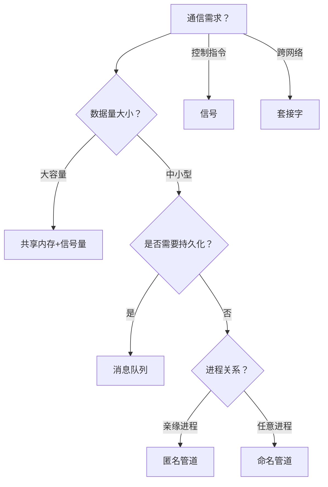

## Linux & Win

Linux内核与Windows内核在设计哲学、架构实现及生态定位上存在本质差异，以下从七个维度进行深度对比：


------
### 🧱 **内核架构**

- **Linux（宏内核/Monolithic Kernel）**
  所有核心功能（进程调度、内存管理、文件系统、驱动等）均在内核态运行，模块高度集成。优势是性能高效（系统调用无上下文切换），但模块耦合度高，单个驱动崩溃可能引发全系统故障（Kernel Panic）。
  支持动态加载模块（LKM），如设备驱动可热插拔，但核心功能不可卸载。
- **Windows（混合内核/Hybrid Kernel）**
  融合微内核与宏内核特性：核心服务（线程调度、中断）在内核态，非核心服务（部分驱动、文件系统）可在用户态运行。通过硬件抽象层（HAL）屏蔽硬件差异，增强移植性。
  ​**特殊设计**​：GUI渲染（win32k.sys）直接集成在内核，以提升图形性能，但也成为安全漏洞高发区。


------
### 🔓 **开源模式与开发生态**

- **Linux**
  GPL协议开源，全球开发者协作贡献，代码可见性高（2025年超3000万行）。技术迭代快（如引入Rust重构内存安全模块），但社区决策需协调多方意见，维护成本高。
- **Windows**
  闭源商业产品，由微软集中开发。需兼容历史API（如OS/2子系统）和硬件，隐性复杂度高。近年逐步引入Rust重构安全模块（如Pluton芯片驱动），但整体迭代受商业策略制约。


------
### ⚙️ **进程与调度机制**

- **Linux**
  采用**完全公平调度器（CFS）​**，基于时间片分配CPU资源，优先保障高吞吐量，适合服务器高并发场景。
  进程创建依赖`fork()`机制，复制父进程上下文，效率较低但灵活性高。
- **Windows**
  使用**多级反馈队列**，动态提升交互式进程优先级，优化桌面响应速度。线程与进程区分明确，线程为最小调度单位。


------
### 📂 **文件系统与存储**

- **Linux**
  通过**虚拟文件系统（VFS）​**​ 抽象层支持Ext4/XFS/Btrfs等多种文件系统，扩展性强。权限模型基于用户/组，简单高效。
- **Windows**
  依赖**NTFS**为核心，支持ACL权限控制（精细到用户级）。数据压缩、加密等高级功能集成度高，但跨平台兼容性弱。


------
### 🔒 **安全机制**

- **Linux**
  依赖模块化安全框架（如SELinux、AppArmor），通过命名空间和控制组（cgroups）实现容器隔离。开源特性使漏洞修复速度快。
- Windows
  因广泛性更易受攻击，内置多层防护：
  - 会话隔离（Session Separation）
  - 内核地址空间随机化（KASLR）
  - 控制流防护（CFG）
    闭源环境要求严格驱动签名（WHQL认证），但历史漏洞多与内核级GUI设计相关。


------
### 💻 **硬件兼容性**

- **Linux**
  驱动依赖社区支持，新兴硬件适配可能延迟。但模块化架构允许自定义裁剪，适用于嵌入式设备（如树莓派）。
- **Windows**
  通过HAL层统一硬件接口，预置驱动覆盖广，即插即用体验优。但对闭源硬件的依赖性更强。


------
### 📊 **性能与应用场景**

| **场景**       | **Linux优势**                         | **Windows优势**               |
| -------------- | ------------------------------------- | ----------------------------- |
| **服务器/云**  | 轻量进程、高并发吞吐（90%公有云份额） | 兼容商业软件（如SQL Server）  |
| **桌面/游戏**  | 命令行高效管理                        | DirectX图形支持、游戏生态完善 |
| **嵌入式/IoT** | 内核可裁剪（最小仅数百KB）            | 需较高硬件资源                |


------
### 💎 **总结**

- **Linux**：胜在**开放生态、高定制性、服务器性能**，适合开发者、云计算及嵌入式场景。
- **Windows**：强于**商业兼容性、桌面交互、企业级支持**，为普通用户和专业软件提供无缝体验。
  两者差异本质是**设计目标的取舍**​：Linux追求效率与控制力，Windows专注用户体验与商业闭环。
## CPU执行指令

CPU执行程序的过程是一个精密的硬件协作过程，核心围绕**取指-解码-执行周期（Fetch-Decode-Execute Cycle）**展开，同时涉及分支处理、中断响应和优化技术。以下是详细解析：


------
### 🔄 **CPU执行程序的基本流程**

#### **取指阶段（Fetch）**

CPU根据**程序计数器（PC）**存储的地址，从内存中读取下一条指令：
- 步骤：
  - PC将指令地址送入**内存地址寄存器（MAR）**，通过地址总线发送到内存；
  - 内存返回指令数据到**内存数据寄存器（MDR）**，再存入**指令寄存器（IR）**；
  - PC自动递增，指向下一条指令地址。
- **关键组件**：PC、MAR、MDR、IR。若指令在**指令缓存（ICache）**中，则直接读取，避免访问主存延迟。
#### **解码阶段（Decode）**

控制单元（CU）解析IR中的指令，确定操作类型和操作数来源：
- **操作码（Opcode）**：识别运算类型（如加法、跳转）；
- **操作数（Operand）**：定位数据位置（寄存器、内存地址或立即数）；
- **示例**：指令`ADD R1, R2`解码后，CU通知ALU准备加法，并读取寄存器R1、R2的值。
#### **执行阶段（Execute）**

算术逻辑单元（ALU）执行具体操作：
- **运算类指令**：ALU进行算术/逻辑运算（如`ADD`），结果暂存或写入寄存器；
- **访存指令**：若需读写内存，**地址生成单元（AGU）**计算物理地址，通过数据缓存（DCache）访问主存；
- **跳转指令**：更新PC为目标地址（如`JMP`指令）。
#### **写回阶段（Writeback）**

将执行结果存储到目标位置：
- **寄存器操作**：结果直接写入寄存器文件（如`ADD`的结果存入R1）；
- **内存操作**：数据经MDR写入主存（如`STA`指令）。


------
### ⚙️ **指令周期的扩展处理**

#### **分支与跳转处理**

- **条件分支**（如`if-else`）：根据状态寄存器（FLAGS）的标志位（如零标志ZF）决定是否跳转；
- **地址计算**：相对寻址时，PC = 当前PC + 偏移量；直接寻址时，PC = 目标地址。
#### **中断与异常处理**

当发生硬件中断（如键盘输入）或异常（如除零错误）：
- **保存现场**：将PC和寄存器状态压入栈；
- **跳转**：PC指向中断服务程序入口；
- **恢复**：中断结束后从栈中恢复原状态。


------
### ⚡ **现代CPU的优化技术**

为提高效率，CPU采用以下技术：
| **技术**                 | **原理**                                                   | **作用**                           |
| ------------------------ | ---------------------------------------------------------- | ---------------------------------- |
| **流水线（Pipelining）** | 将指令分解为多阶段（取指、解码、执行等），并行处理不同指令 | 提升吞吐率，如5级流水线效率提升4倍 |
| **分支预测**             | 预判分支走向，提前加载指令（预测错误时丢弃预取指令）       | 减少因等待分支结果导致的流水线停顿 |
| **多级缓存**             | L1/L2缓存存储高频指令和数据，减少访问主存延迟              | 加速数据读取，降低内存访问瓶颈     |


------
### 💻 **实例演示：执行`ADD (R0), R1`指令**

假设指令功能：`(内存地址R0的值) + R1 → 存入R0`：
1. **取指**：PC指向指令地址 → 读取指令到IR，PC+1；
2. **解码**：CU识别为加法，需访问内存（R0为地址）和寄存器R1；
3. 
   间址周期
   （额外阶段）：
   - 从R0取出内存地址 → 送入MAR → 读取内存数据到MDR → 暂存到ALU输入寄存器；
4. **执行**：ALU计算`(MDR) + R1`；
5. **写回**：结果写回R0指向的内存地址（需再次访存）。


------
### 💎 **总结**

CPU执行程序的核心是**取指-解码-执行-写回**的循环，通过PC引导指令流，CU协调各组件（ALU、寄存器、缓存），结合流水线、分支预测等技术优化效率。中断和分支处理扩展了周期的灵活性，而缓存机制大幅降低内存延迟。理解这一过程是掌握计算机体系结构的基础。
## 中断

中断确实是操作系统从用户态（User Mode）进入内核态（Kernel Mode）的**主要方式之一**，但并非唯一途径。以下是完整解析：


------
### ⚙️ **中断与用户态/内核态切换的关系**

1. **中断是触发切换的常见机制**
   当用户态程序运行时，若发生**硬件中断**​（如键盘输入、时钟信号）或**内部异常**​（如除零错误），CPU会暂停当前用户态程序，保存其上下文（如程序计数器、寄存器状态），并跳转至内核预设的中断处理程序。此时CPU权限从用户态（低特权级，如Ring 3）切换至内核态（高特权级，如Ring 0）。
2. **中断处理全程在内核态执行**
   中断服务程序（ISR）属于操作系统内核代码，需在内核态访问硬件资源（如设备寄存器）和内核数据结构。例如，网卡数据到达时，中断触发后内核直接处理数据包解析。


------
### 🔄 **其他进入内核态的途径**

中断并非唯一方式，还有两种核心机制：
1. **系统调用（System Call）**
   - 用户程序**主动触发**软中断（如Linux的`int 0x80`或`syscall`指令），陷入内核以请求服务（如文件读写）。
   - 本质是**同步的软件中断**，由程序预先安排，需通过中断机制进入内核。
2. **内部异常（Exception）**
   - 用户程序执行时发生**错误或特殊事件**（如缺页异常、非法指令），CPU自动切换到内核态处理。
   - 例如：访问无效内存地址时，触发缺页异常，内核接管并尝试修复。


------
### 📊 **中断场景的细分与内核态关联**

| **中断类型**       | **是否进入内核态** | **典型场景**             | **说明**                         |
| ------------------ | ------------------ | ------------------------ | -------------------------------- |
| **硬件中断**       | 是                 | 键盘输入、磁盘I/O完成    | 外部设备触发，强制CPU响应        |
| **内部异常**       | 是                 | 除零错误、内存越界       | CPU执行指令时检测到错误          |
| **系统调用**       | 是                 | 调用`open()`读写文件     | 程序主动请求内核服务             |
| **内核态发生中断** | 否                 | 内核线程处理中响应新中断 | 已在内核态，仅保存当前内核上下文 |
> 💡 **关键点**：
>
> - 用户态到内核态的切换**必须依赖中断机制**（硬件中断、异常或软中断）。
> - 若中断发生在**内核态运行时**（如内核线程处理设备驱动），CPU保持内核态，仅压栈当前状态后执行新ISR。


------
### ⚠️ **注意事项**

1. **中断不等同于状态切换**
   中断是**事件通知机制**，内核态切换是**权限变更结果**。例如，内核线程被中断时，权限状态不变。
2. **切换代价较高**
   用户态→内核态需保存完整寄存器上下文（约数百CPU周期），频繁切换可能成为性能瓶颈。
3. **中断屏蔽的影响**
   内核态可屏蔽部分中断（如关闭本地CPU中断），此时即使发生中断请求，CPU也不会响应，避免嵌套中断导致栈溢出。


------
### 💎 **总结**

- **中断是进入内核态的核心途径之一**，与系统调用、异常共同构成权限切换的三大触发器。
- 中断的本质是**事件驱动的强制控制流转移**，而内核态是处理这些事件的**安全执行环境**。
- 理解中断与权限切换的关系，是掌握操作系统调度、设备驱动及实时系统设计的关键基础。
## 软中断

以下是硬中断（Hardware Interrupt）与软中断（Software Interrupt）的详细对比解析，综合其定义、工作原理、特性差异及应用场景：


------
### 🧩 **核心概念**

1. **硬中断**
   - **定义**：由外部硬件设备（如网卡、键盘、磁盘）通过物理电信号触发，要求CPU立即响应的事件。
   - **触发机制**：设备通过中断控制器（如APIC）向CPU发送中断请求（IRQ），CPU暂停当前任务跳转至中断服务程序（ISR）。
   - **典型场景**：网络数据到达、键盘输入、定时器超时。
2. **软中断**
   - **定义**：由内核或程序主动触发的异步事件，用于延迟执行耗时任务，无需硬件参与。
   - **触发机制**：通过软件指令（如Linux中的`raise_softirq()`）标记待处理任务，内核在适当时机（如硬中断结束后）调度执行。
   - **典型场景**：网络协议栈处理（如TCP/IP拆包）、定时器回调、内存管理。


------
### ⚙️ **工作原理对比**

#### **硬中断处理流程**

1. **中断请求**：硬件设备发送IRQ信号至中断控制器。
2. **中断响应**：CPU保存当前状态（寄存器、程序计数器），关闭中断响应。
3. **执行ISR**：跳转至预设的中断服务程序，快速读取设备状态并清除中断标志。
4. **触发下半部**：若需复杂处理，ISR标记软中断后立即退出。
5. **恢复现场**：CPU恢复被中断的任务。
#### **软中断处理流程**

1. **标记中断**：硬中断或内核代码调用软中断触发函数（如`tasklet_schedule()`）。
2. 
   延迟执行：内核在以下时机检查并执行软中断：
   - 硬中断返回前
   - 内核调度周期中
   - 显式调用`do_softirq()`。
3. **并发处理**：同类型软中断在单CPU上串行，但不同类型可在多CPU上并行。


------
### 📊 **核心特性对比**

| **特性**       | **硬中断**                  | **软中断**                     |
| -------------- | --------------------------- | ------------------------------ |
| **触发源**     | 外部硬件设备（物理信号）    | 内核或程序指令（软件触发）     |
| **响应实时性** | 纳秒级，必须立即响应        | 微秒~毫秒级，可延迟处理        |
| **执行上下文** | 中断上下文（不可阻塞/睡眠） | 内核上下文（不可睡眠，可调度） |
| **优先级**     | 最高，可抢占所有任务        | 低于硬中断，高于普通进程       |
| **中断屏蔽**   | 可屏蔽（除NMI外）           | 不可屏蔽                       |
| **多核并发**   | 通常绑定单CPU处理           | 支持多CPU并行执行              |


------
### 🛠️ **设计目的与典型应用**

#### **硬中断的核心作用**

- **紧急事件处理**：确保硬件事件零丢失（如网卡数据包溢出前读取缓存）。
- **实时性保障**：满足传感器、工业控制等毫秒级响应需求。
#### **软中断的核心作用**

- **分解耗时任务**：将硬中断中的复杂操作（如网络协议栈解析）延迟执行，避免阻塞系统。
- **异步任务调度**：实现高并发处理（如Linux中多CPU共同处理网络包）。
#### **经典应用案例**

- **网络收包**：
  硬中断：网卡触发IRQ，CPU快速拷贝数据至内核缓存。
  软中断：触发`NET_RX`处理IP分片、TCP重组等。
- **定时器**：
  硬中断：时钟芯片周期性触发IRQ更新系统时间。
  软中断：执行超时回调（如内核调度器`tick`）。


------
### ⚡ **性能优化技巧**

1. **硬中断优化**
   - **缩短ISR**：仅保留关键操作（如读状态寄存器），其余移交软中断。
   - **中断亲和性**：绑定中断到特定CPU（`/proc/irq/IRQ/smp_affinity`），避免核间切换开销。
   - **MSI-X多队列**：为高速网卡启用多队列中断，分散负载至多CPU。
2. **软中断优化**
   - **负载均衡**：监控`/proc/softirqs`，避免单CPU过载（如调整网络中断亲和性）。
   - **避免长循环**：拆分大任务（如分批次处理数据包），防止阻塞其他软中断。


------
### 💎 **总结**

- **硬中断**是硬件与CPU交互的“紧急通道”，**实时性强但不可阻塞**，需快速响应；
- **软中断**是内核任务调度的“延迟队列”，**吞吐量高但可延迟**，用于复杂操作；
  两者通过**上半部/下半部机制**协同（如Linux的`request_irq()` + `tasklet`），在保证实时性的同时提升系统并发能力。理解其差异及协作逻辑，是优化高负载系统（如云服务器、嵌入式设备）的关键基础。
## 中断屏蔽

中断屏蔽（Interrupt Masking）是计算机系统中用于**临时阻止CPU响应特定类型中断请求的机制**，其核心目的是确保关键任务（如临界区操作、硬件寄存器修改等）的原子性和数据一致性。以下从工作原理、类型、应用场景及注意事项展开详解：


------
### ⚙️ **工作原理**

中断屏蔽通过**修改CPU或中断控制器的状态寄存器**实现，分为两个层面：
1. **硬件屏蔽**
   - **中断使能标志位**：CPU的标志寄存器（如x86的EFLAGS）包含中断使能位（IF）。执行`CLI`指令清除IF位，禁止响应所有可屏蔽中断；`STI`指令恢复中断。
   - **中断控制器屏蔽**：中断控制器（如8259A、APIC）为每个中断源设置屏蔽位。通过写中断屏蔽寄存器（IMR），可单独屏蔽特定设备的中断（如屏蔽键盘中断但允许网卡中断）。
2. **软件屏蔽**
   操作系统提供API控制中断，例如Linux内核的：
   - `local_irq_disable()`：禁用当前CPU所有中断。
   - `local_irq_save(flags)`：保存当前中断状态后禁用中断，执行后通过`local_irq_restore(flags)`恢复原状态。


------
### 📊 **中断类型与屏蔽范围**

| **可屏蔽中断**   | 是             | 键盘输入、网卡数据包   | 延迟响应，中断请求暂存 |
| ---------------- | -------------- | ---------------------- | ---------------------- |
| **不可屏蔽中断** | 否             | 电源故障、硬件致命错误 | 必须立即处理，屏蔽无效 |
| **软件中断**     | 部分           | 系统调用、定时器回调   | 内核可延迟调度执行     |
| **中断类型**     | **是否可屏蔽** | **典型例子**           | **屏蔽影响**           |
> 💡 不可屏蔽中断（NMI）通常用于系统级紧急事件（如内存校验错误），CPU必须无条件响应。


------
### 🛠️ **核心应用场景**

1. **保护临界区资源**
   修改共享数据结构（如全局链表、计数器）时，屏蔽中断防止其他任务或中断服务程序（ISR）介入，避免数据竞争。例如，多线程环境中更新共享内存前需禁用中断。
2. **硬件操作原子性**
   设备驱动程序中，配置硬件寄存器（如设置网卡工作模式）需确保操作不被打断，否则可能导致设备状态错误。
3. **防止中断嵌套过深**
   高负载场景下，频繁中断嵌套可能导致栈溢出。屏蔽中断可限制嵌套层数，提升系统稳定性（如实时系统）。
4. **优化实时任务性能**
   实时操作系统（RTOS）中，屏蔽低优先级中断可确保高优先级任务独占CPU（如工业控制中的电机调速）。


------
### ⚠️ **注意事项与风险**

1. **屏蔽时间需极短**
   中断屏蔽期间，系统无法响应外部事件。若时间过长（如>100μs），可能导致：
   - **中断丢失**：设备缓冲区溢出（如网卡丢包）。
   - **实时性下降**：定时器中断延迟影响任务调度。
2. **死锁风险**
   在屏蔽中断时尝试获取锁（如自旋锁），若锁已被其他CPU持有且等待中断唤醒，将导致死锁。
3. **多核系统的复杂性**
   单核屏蔽中断仅影响当前CPU，多核系统中需结合自旋锁等机制保护跨核共享资源。
4. **替代方案优先**
   现代系统更推荐使用细粒度锁（如互斥锁、信号量）或原子操作替代中断屏蔽，减少对系统响应的影响。


------
### 💻 **代码示例（Linux内核）**

```
#include <linux/interrupt.h>

void critical_task(void) {
    unsigned long flags;
    // 保存当前中断状态并禁用中断
    local_irq_save(flags);

    // 临界区操作（如修改全局变量）
    shared_data += 1;

    // 恢复中断状态
    local_irq_restore(flags);
}
```


------
### 💎 **总结**

中断屏蔽是底层系统开发的“双刃剑”：
- **价值**：为关键操作提供原子性保障，尤其在驱动开发与实时系统中不可或缺。
- **风险**：滥用会导致响应延迟、死锁等问题，需严格限制使用范围与时长。
  ​**设计原则**​：优先使用高阶同步机制（如锁），仅在硬件操作或极短临界区中谨慎使用屏蔽。
## 进程间通信

进程间通信（Inter-Process Communication, IPC）是操作系统提供的核心机制，用于实现不同进程之间的**数据交换、资源共享与行为协同**。由于进程具有独立性（每个进程拥有独立的虚拟地址空间和资源），直接交互会破坏隔离性，因此需通过操作系统提供的标准化IPC机制实现安全通信。以下从**核心目的、六类主流机制、技术对比及选型建议**展开详解：

### ⚙️ **进程间通信的核心目的**
1. **数据传输**  
   - 进程A需将数据发送给进程B（如Shell命令 `cat file.txt | grep "hello"` 中管道传递数据）。
2. **资源共享**  
   - 多个进程共享硬件（如打印机）或软件资源（如内存数据），需协调访问。
3. **事件通知**  
   - 进程需告知其他进程状态变化（如子进程终止时通过信号通知父进程）。
4. **进程控制**  
   - 控制进程的执行（如调试器拦截目标进程的异常）。
> **本质**：通过**操作系统提供的公共内存区域**（如内核缓冲区、共享内存段）打破进程隔离，实现数据交互。
---
### 📡 **六类主流IPC机制详解**
#### **管道（Pipe）**  
- **匿名管道**  
  - **原理**：内核维护的**单向内存缓冲区**（无磁盘文件），通过 `pipe()` 系统调用创建，返回读/写端文件描述符。  
  - **特点**：  
    - 仅限**父子或兄弟进程**使用（通过继承文件描述符访问）。  
    - 半双工通信，需双向通信时需创建两个管道。  
    - 自带同步机制：写满阻塞、读空等待。  
  - **示例**：  
    ```c
    int fd[2]; pipe(fd);  // 创建管道
    if (fork() == 0) {    // 子进程写
        close(fd[0]); write(fd[1], "data", 4);
    } else {              // 父进程读
        close(fd[1]); read(fd[0], buf, 4);
    }
    ```
- **命名管道（FIFO）**  
  - **原理**：在文件系统创建**具名管道文件**（如 `mkfifo /tmp/myfifo`），无关进程通过路径名打开。  
  - **特点**：  
    - 支持**任意进程间通信**，突破血缘限制。  
    - 仍为半双工，需双向通信时使用两个FIFO。
#### **消息队列（Message Queue）**  
- **原理**：内核维护的**消息链表**，进程通过唯一标识符（`key`）访问队列，消息包含类型和数据体。  
- **特点**：  
  - 支持**异步通信**与**随机读取**（按消息类型非FIFO）。  
  - 消息持久化至显式删除（内核重启或调用 `msgctl(IPC_RMID)`）。  
  - 适合传递**结构化数据**（如命令包）。  
- **系统调用**：  
  - `msgget()` 创建/获取队列，`msgsnd()` 发送，`msgrcv()` 接收。  
#### **共享内存（Shared Memory）**  
- **原理**：将**同一物理内存页**映射到多个进程的虚拟地址空间，进程直接读写内存无需内核拷贝。  
- **特点**：  
  - **速度最快**（无数据复制开销），适合**大容量数据共享**（如视频帧）。  
  - **无内置同步**：需搭配信号量/互斥锁防数据竞争。  
- **使用步骤**：  
  1. `shmget()` 创建共享内存段  
  2. `shmat()` 映射到进程地址空间  
  3. 读写操作（需同步）  
  4. `shmdt()` 解除映射。  

#### **信号量（Semaphore）**  
- **作用**：**资源计数器**，解决进程同步与互斥问题（非传递数据）。  
- **核心操作**：  
  - **P操作**（`semop`减1）：申请资源，若信号量≤0则阻塞。  
  - **V操作**（`semop`加1）：释放资源，唤醒等待进程。  
- **类型**：  
  - **二元信号量**：实现互斥锁（初始值1）。  
  - **计数信号量**：控制资源池（如数据库连接数）。  
- **系统调用**：`semget()` 创建，`semctl()` 初始化，`semop()` 执行PV。
#### **信号（Signal）**  
- **原理**：软件层**中断通知**（如 `SIGKILL` 终止进程），进程通过信号处理函数响应。  
- **特点**：  
  - 传递**控制指令**而非数据（如 `SIGUSR1` 自定义事件）。  
  - 异步处理，需考虑函数可重入性（Reentrant）。
#### **套接字（Socket）**  
- **原理**：**网络通信接口**，支持跨主机进程通信（如TCP/UDP协议）。  
- **特点**：  
  - 适用分布式系统（如微服务间RPC调用）。  
  - 开销较大（需协议栈处理），本地通信可用Unix Domain Socket加速。
---
### ⚖️ **IPC机制对比与选型建议**
| **机制**     | **数据传输方式** | **速度** | **同步要求** | **适用场景**                       |
| ------------ | ---------------- | -------- | ------------ | ---------------------------------- |
| 匿名管道     | 字节流（单向）   | 快       | 自带同步     | 父子进程简单数据流（如Shell管道）  |
| 命名管道     | 字节流（单向）   | 快       | 自带同步     | 任意进程流式数据                   |
| 消息队列     | 结构化消息       | 中       | 需显式同步   | 异步任务调度（如订单处理）         |
| **共享内存** | **直接内存访问** | **极快** | **需强同步** | **高频大数据交换（如数据库缓存）** |
| 信号量       | 无（仅计数器）   | 快       | 原子操作     | 资源访问互斥（如共享内存锁）       |
| 信号         | 控制指令         | 快       | 异步处理     | 进程生命周期管理（如终止通知）     |
| 套接字       | 字节流/数据报    | 慢       | 协议依赖     | 跨网络通信（如Web服务）            |
**选型决策树**：  

---
### ⚠️ **关键问题与解决方案**
1. **同步问题**  
   - **共享内存/消息队列**需搭配信号量或互斥锁，避免竞态条件（如生产者-消费者模型）。  
2. **性能瓶颈**  
   - 优先选共享内存（零拷贝），避免管道/消息队列的内存复制开销。  
3. **消息丢失**  
   - 消息队列启用持久化（如RabbitMQ的磁盘存储），消费者确认机制（ACK）。  
4. **跨平台兼容**  
   - 优先POSIX标准IPC（如POSIX消息队列），而非System V。
---
### 💎 **总结**  
进程间通信是操作系统协调多进程的基石，**选型需综合考量数据特征、性能要求及进程关系**：  
- **高频数据交换** → 共享内存（配合信号量）  
- **结构化任务调度** → 消息队列  
- **简单进程协作** → 管道  
- **分布式系统** → 套接字  
- **资源互斥** → 信号量  
理解各机制原理及适用边界，是构建高效、稳定并发系统的关键。
## 管道 vs 共享内存

在跨进程通信（IPC）中，管道（Pipe）和共享内存（Shared Memory）是两种核心机制，其设计理念、性能特性和适用场景存在显著差异。以下从五个维度进行深度对比：


------
### 🔧 **通信模型与数据流**

| **特性**       | **管道**                         | **共享内存**                           |
| -------------- | -------------------------------- | -------------------------------------- |
| **通信方向**   | 单向（半双工），双向需两个管道   | 双向，进程可同时读写同一内存区域       |
| **数据流控制** | 内核自动管理缓冲区，支持阻塞同步 | 无内置流控，需用户实现同步（如信号量） |
| **数据可见性** | 写入后需读取才能获取数据         | 写入后立即可见，无延迟                 |
> **关键区别**：
> 管道是**流式通信**​（类似文件读写），数据按顺序传输；共享内存是**直接内存映射**，数据零拷贝直达。


------
### ⚡ **性能与效率**

| **指标**       | **管道**                   | **共享内存**                   |
| -------------- | -------------------------- | ------------------------------ |
| **数据拷贝**   | 两次拷贝（用户→内核→用户） | **零拷贝**（直接访问物理内存） |
| **传输速度**   | 较慢（受内核缓冲区限制）   | **最快**（接近内存访问速度）   |
| **吞吐量上限** | 默认64KB（可配置）         | 仅受物理内存大小限制           |
> **实验数据**：
> 传输1GB数据时，共享内存比管道快**5-10倍**，尤其在大数据场景优势显著。


------
### ⚙️ **生命周期与资源管理**

| **方面**         | **管道**                             | **共享内存**                             |
| ---------------- | ------------------------------------ | ---------------------------------------- |
| **创建方式**     | `pipe()`（匿名）或`mkfifo()`（命名） | `shmget()`创建，`shmat()`挂接            |
| **生命周期**     | 随进程结束自动销毁                   | **随内核持续**，需显式删除（`shmctl()`） |
| **资源泄漏风险** | 低（自动回收）                       | 高（需手动释放，否则永久占用）           |
> **典型问题**：
> 共享内存若未调用`shmdt()`和`shmctl()`，会导致内存泄漏，需通过`ipcs`命令查看并手动清理。


------
### 🔒 **同步机制**

| **机制**     | **管道**                                                 | **共享内存**                            |
| ------------ | -------------------------------------------------------- | --------------------------------------- |
| **内置同步** | ✅ 通过内核缓冲区阻塞实现流量控制（如写满阻塞、读空等待） | ❌ 无同步，需用户实现互斥（如信号量/锁） |
| **原子性**   | 小数据写入（< `PIPE_BUF`，通常4KB）保证原子性            | 依赖用户实现的锁机制                    |
| **死锁风险** | 低（内核管理）                                           | 高（同步逻辑错误易导致死锁）            |
> **示例场景**：
> 共享内存中多进程同时修改变量时，未加锁可能导致数据竞争（Data Race）。


------
### 🖥️ **适用场景**

| **场景**             | **推荐机制** | **原因**                                       |
| -------------------- | ------------ | ---------------------------------------------- |
| **父子进程简单通信** | 匿名管道     | 轻量、自动同步（如`shell`命令`|`）             |
| **跨主机通信**       | 命名管道     | 支持网络环境（如`\\ComputerName\pipe\MyPipe`） |
| **高频大数据交换**   | 共享内存     | 零拷贝提升性能（如数据库缓冲池、实时视频处理） |
| **需持久化数据共享** | 共享内存     | 生命周期独立于进程（如长期运行的监控服务）     |
| **强一致性要求场景** | 管道         | 内置流控降低复杂度（如日志收集）               |


------
### 💎 **总结：核心差异与选择建议**

1. **设计哲学**
   
   - **管道**：模拟文件I/O，由**内核托管数据流**，简化用户操作但牺牲性能；
   - **共享内存**：**绕过内核直接共享物理页**，高效但需用户管理同步。
2. **选型决策树**
   ```
   graph TD
     A[需高性能大数据传输?] -- 是 --> B[共享内存+同步机制]
     A -- 否 --> C{进程是否有亲缘?}
     C -- 是 --> D[匿名管道]
     C -- 否 --> E{需跨主机?}
     E -- 是 --> F[命名管道]
     E -- 否 --> G[共享内存或命名管道]
   ```
3. **典型陷阱**
   - 共享内存未同步 → **数据损坏**（如银行转账余额错误）；
   - 管道传输大文件 → **性能瓶颈**（频繁内核切换）。
> **终极建议**：
>
> - **简单消息传递**：优先管道（如父子进程指令控制）；
> - **高性能数据交换**：必选共享内存（如金融交易系统），但务必配套信号量/锁。
## 管道 vs 消息队列

在跨进程通信（IPC）中，管道（Pipe）和消息队列（Message Queue）是两种核心机制，其设计目标、实现方式和适用场景存在显著差异。以下是基于技术特性的深度对比：


------
### 🔧 **通信模型与数据流**

| **特性**     | **管道**                       | **消息队列**                       |
| ------------ | ------------------------------ | ---------------------------------- |
| **方向性**   | 半双工（单向），双向需两个管道 | 全双工（双向），支持多对多通信     |
| **数据格式** | 无格式字节流，需应用层解析边界 | 结构化消息，含类型标识（如优先级） |
| **流控机制** | 内核自动阻塞（缓冲区满/空）    | 无内置流控，需用户同步（如信号量） |
> **关键差异**：
> 管道是**流式传输**​（类似文件I/O），而消息队列是**消息分片传输**​（支持优先级与选择性接收）。


------
### ⚡ **性能与资源开销**

| **指标**       | **管道**                    | **消息队列**                  |
| -------------- | --------------------------- | ----------------------------- |
| **数据拷贝**   | 两次拷贝（用户→内核→用户）  | 两次拷贝（用户↔内核队列）     |
| **吞吐量上限** | 缓冲区小（默认4KB），易阻塞 | 消息更大（默认8KB），队列更长 |
| **延迟**       | 低（内核直接管理）          | 较高（需维护消息链表）        |
> **实验结论**：
> 管道适合**小数据实时传输**，消息队列在**大消息异步处理**时更高效（如任务分发系统）。


------
### ⚙️ **生命周期与可靠性**

| **特性**         | **管道**                     | **消息队列**                         |
| ---------------- | ---------------------------- | ------------------------------------ |
| **生命周期**     | 随进程终止销毁（匿名管道）   | **内核持久化**，需显式删除           |
| **可靠性**       | 低：进程退出可能导致数据丢失 | 高：支持消息持久化（系统崩溃可恢复） |
| **资源泄漏风险** | 低（自动回收）               | 高（未删除的队列永久占用内存）       |
> **典型问题**：
> 消息队列需调用`msgctl(IPC_RMID)`主动销毁，否则可能耗尽系统资源。


------
### 🔒 **同步与并发控制**

| **机制**       | **管道**                               | **消息队列**                  |
| -------------- | -------------------------------------- | ----------------------------- |
| **内置同步**   | ✅ 读写阻塞自动同步                     | ❌ 需用户实现锁（如信号量）    |
| **原子性**     | 小数据（≤4KB）写入原子保证             | 单条消息原子写入              |
| **多进程支持** | 匿名管道仅限亲缘进程，命名管道可跨进程 | 无关进程可通过Key访问同一队列 |
> **风险提示**：
> 共享消息队列时，未同步可能导致**消息覆盖**或**重复消费**​（如支付系统金额错误）。


------
### 🖥️ **适用场景对比**

| **场景**                 | **推荐机制**       | **原因**                                       |
| ------------------------ | ------------------ | ---------------------------------------------- |
| **父子进程简单指令控制** | 匿名管道           | 轻量、自动同步（`shell`命令 `                  |
| **无关进程持久化通信**   | 命名管道或消息队列 | 命名管道适合流式数据，消息队列适合结构化消息   |
| **高可靠异步任务分发**   | 消息队列           | 持久化+优先级（如订单系统按紧急度处理）        |
| **实时日志收集**         | 管道               | 低延迟+流式特性（如`tail -f                    |
| **微服务解耦**           | 消息队列           | 生产者/消费者分离，避免阻塞（如Kafka底层机制） |


------
### 💎 **总结：核心差异与选型建议**

1. **本质区别**
   - **管道**：模拟文件I/O，**内核托管数据流**，牺牲灵活性换简单性；
   - **消息队列**：**结构化消息存储**，以复杂度换取可靠性与功能扩展性。
2. **选型决策树**
   ```
   graph TD
     A[需持久化/可靠性？] -- 是 --> B[消息队列]
     A -- 否 --> C{数据规模？}
     C -- 小数据+实时 --> D[管道]
     C -- 大数据+异步 --> E[消息队列]
     D --> F{进程关系？}
     F -- 亲缘进程 --> G[匿名管道]
     F -- 无关进程 --> H[命名管道]
   ```
3. **避坑指南**
   - 管道传输大文件 → **性能瓶颈**（频繁内核切换+缓冲区满阻塞）；
   - 消息队列未同步 → **并发冲突**（如库存超卖）。
> **终极建议**：
>
> - **简单流式通信** → 管道（父子进程指令控制、日志流）；
> - **复杂业务解耦** → 消息队列（微服务、订单系统），**务必配套信号量/锁**。
## 协程和线程

以下是协程与线程的深度对比分析，涵盖调度机制、资源开销、并发模型、适用场景等核心维度，结合技术实现原理与性能数据说明差异：


------
### ⚙️ **调度机制与控制权**

| **维度**       | **线程**                                       | **协程**                                       |
| -------------- | ---------------------------------------------- | ---------------------------------------------- |
| **调度主体**   | 操作系统内核（内核态）                         | 用户程序（用户态）                             |
| **调度方式**   | 抢占式（时间片用完或被高优先级线程中断）       | 协作式（需主动让出执行权，如 `await`/`yield`） |
| **切换开销**   | 高（需保存寄存器、堆栈指针等，涉及内核态切换） | 极低（仅保存少量寄存器，无内核切换）           |
| **控制灵活性** | 低（开发者无法干预内核调度）                   | 高（开发者可自定义调度策略）                   |
> **关键区别**：
> 线程切换是**强制性的系统行为**​（如时间片耗尽），而协程切换是**程序主动控制的协作行为**，避免了不必要的上下文保存。


------
### 📊 **资源消耗与扩展性**

| **维度**          | **线程**                       | **协程**                        |
| ----------------- | ------------------------------ | ------------------------------- |
| **内存占用**      | 高（默认栈空间 1–8 MB/线程）   | 极低（初始栈约 2 KB，动态增长） |
| **创建上限**      | 有限（数百至数千，受内核限制） | 极高（单线程可支撑数万协程）    |
| **创建/销毁开销** | 高（需内核分配资源）           | 极低（用户态内存操作）          |
**实验数据**：
- 创建 10,000 个线程需约 10 GB 内存（按 1MB/线程），而 10,000 个协程仅需 20–50 MB。
- 协程切换速度比线程快 10–100 倍（微秒级 vs 毫秒级）。


------
### 🔄 **并发模型与执行效率**

| **维度**     | **线程**                               | **协程**                                    |
| ------------ | -------------------------------------- | ------------------------------------------- |
| **并行能力** | ✅ 支持多核并行（线程可分布到不同核心） | ❌ 单线程内串行（需结合多线程/进程实现并行） |
| **阻塞处理** | 线程阻塞导致 CPU 闲置（等待 I/O 时）   | 协程挂起后线程可执行其他任务（零等待）      |
| **同步机制** | 需锁/信号量（易死锁）                  | 无需锁（单线程内串行执行）                  |
> **典型案例**：
>
> - **高并发 Web 服务器**：10,000 个连接需 10,000 个线程（资源耗尽） vs 单线程 + 10,000 个协程（内存 <100 MB）。
> - **I/O 密集型任务**：协程通过非阻塞 I/O 将 CPU 利用率从 20%（线程模型）提升至 80%+。


------
### 🧩 **编程复杂度与适用场景**

| **维度**     | **线程**                                | **协程**                                   |
| ------------ | --------------------------------------- | ------------------------------------------ |
| **代码结构** | 回调嵌套复杂（回调地狱）                | 同步风格写异步代码（`async/await` 更直观） |
| **调试难度** | 高（竞态条件、死锁难复现）              | 低（单线程顺序执行，逻辑清晰）             |
| **典型场景** | CPU 密集型（科学计算、图像处理）        | I/O 密集型（网络服务、爬虫）               |
| **混合方案** | 多线程 + 协程（如：每线程运行多个协程） | -                                          |
> **选型决策树**：
>
> ```
> graph TD
>   A[任务类型?] --> B{I/O 密集型?}
>   B --> |是| C[协程]
>   B --> |否| D{CPU 密集型?}
>   D --> |是| E[多线程/多进程]
>   D --> |混合型| F[多线程 + 协程]
> ```


------
### ⚠️ **局限性对比**

| **维度**         | **线程**                                 | **协程**                                      |
| ---------------- | ---------------------------------------- | --------------------------------------------- |
| **系统依赖**     | 跨平台一致性差（不同 OS 线程实现差异大） | 依赖语言/框架支持（如 Python 需 `asyncio`）   |
| **多核利用**     | ✅ 天然支持                               | ❌ 需结合多进程（如 Python `multiprocessing`） |
| **阻塞操作影响** | 单个阻塞拖累整个进程                     | 未正确挂起的阻塞操作会冻结所有协程            |


------
### 💎 **总结：核心差异与选型建议**

1. **本质区别**：
   - **线程**是**操作系统调度的最小单元**，适合利用多核并行处理 CPU 密集型任务，但资源开销大、编程复杂。
   - **协程**是**用户态轻量级调度单元**，通过协作式切换实现高并发 I/O 处理，资源利用率高且代码简洁，但无法直接并行。
2. **黄金准则**：
   - **高并发 + I/O 密集** → 协程（如微服务、实时爬虫）。
   - **多核计算 + CPU 密集** → 多线程/进程（如数值模拟、图像渲染）。
   - **混合负载** → 多线程 + 协程（如 Web 服务器用线程池处理计算，协程处理请求）。
3. **避坑指南**：
   - 避免在协程中执行未异步化的阻塞调用（如同步 I/O）。
   - 线程间共享数据时**必须加锁**，协程单线程内无需锁但需确保及时挂起。
## PCB

进程控制块（Process Control Block, PCB）是操作系统管理进程的核心数据结构，也是进程存在的**唯一标识**。它记录了操作系统用于描述进程状态、控制进程运行所需的全部信息，贯穿进程的整个生命周期（创建→运行→终止）。以下从功能、内容、存储及组织方式四个维度展开详解：


------
### ⚙️ **PCB的核心功能**

1. **进程存在的唯一标志**
   系统通过PCB感知进程的存在，创建进程即创建PCB，销毁进程即回收PCB。
2. **资源分配与调度的依据**
   为进程分配CPU、内存等资源，并基于PCB中的状态和优先级进行调度决策。
3. **中断与恢复的现场保存**
   进程被中断时，CPU寄存器状态存入PCB；恢复执行时从中断点继续运行。
4. **实现进程间同步与通信**
   存储信号量、消息队列指针等同步通信机制。


------
### 📊 **PCB的详细内容**

PCB包含四大类信息，具体如下：
| **信息类别**          | **核心内容**                                                 | **作用与示例**                                               |
| --------------------- | ------------------------------------------------------------ | ------------------------------------------------------------ |
| **1. 进程标识信息**   | - **内部标识符（PID）**：系统分配的唯一数字标识 - **外部标识符**：用户可读的名称（如"计算进程"） - **父/子进程标识符**：描述进程家族关系 | 唯一标识进程，支持进程树管理（如`pstree`命令）               |
| **2. 处理机状态信息** | - **程序计数器（PC）**：下一条指令地址 - **CPU寄存器**：通用寄存器、栈指针、状态寄存器等 - **用户栈指针**：用户级函数调用栈位置 | 保存中断现场，确保恢复执行时上下文完整（如函数调用栈、变量值） |
| **3. 进程调度信息**   | - **进程状态**：运行（Running）、就绪（Ready）、阻塞（Blocked）等 - **优先级**：决定CPU分配顺序 - **调度统计**：已等待/执行时间总和 - **阻塞原因**：等待I/O完成或资源释放 | 支撑调度算法（如时间片轮转、优先级抢占），优化CPU利用率      |
| **4. 进程控制信息**   | - **程序/数据地址**：代码段和数据段的内存位置 - **同步机制**：信号量、互斥锁、消息队列指针 - **资源清单**：已分配资源（内存页表、I/O设备） - **链接指针**：指向同状态队列的下一个PCB | 管理资源分配（如内存页表）、实现进程同步（生产者-消费者模型）、组织PCB队列（就绪队列/阻塞队列） |


------
### 💾 **PCB的存储位置与特性**

1. **内核空间存储**
   PCB存储在操作系统内核的专用内存区域（32位Linux中占1GB内核空间），所有进程共享此区域，但每个PCB独立。
2. **常驻内存**
   因频繁被调度程序、中断处理程序访问，PCB必须常驻内存以提升访问效率。
3. **动态更新**
   进程状态变化时（如阻塞→就绪），PCB内容实时更新以反映最新状态。


------
### 🔗 **PCB的组织方式**

为高效管理大量PCB，操作系统采用三种组织策略：
| **组织方式** | **原理**                                                     | **适用场景**                    | **优缺点**                               |
| ------------ | ------------------------------------------------------------ | ------------------------------- | ---------------------------------------- |
| **线性表**   | 所有PCB连续存放于内存数组，通过索引访问                      | 进程数少的嵌入式系统            | ✅ 简单高效；❌ 查找需遍历全表，扩展性差   |
| **链接队列** | 同状态PCB组成队列（如就绪队列、阻塞队列），通过PCB中的链接指针连接 | 通用操作系统（如Linux/Windows） | ✅ 快速状态切换；❌ 队列维护需额外指针空间 |
| **索引表**   | 按状态建立索引表（如就绪索引表），表中记录同类PCB地址        | 中大型系统需快速分类访问        | ✅ 分类检索快；❌ 需额外索引表空间         |
> **注**：Linux采用链接队列（`task_struct`双向链表），通过`next_task`/`prev_task`指针连接。


------
### ⚠️ **关键注意事项**

1. 
   PCB与进程生命周期绑定
- 创建进程：分配PCB → 初始化状态为“新建” → 加入就绪队列。
   - 终止进程：释放PCB → 回收资源 → 从队列移除。
2. **状态转换依赖PCB更新**
   例如进程阻塞时：保存寄存器状态到PCB → 修改状态为阻塞 → 加入对应阻塞队列。
3. **避免资源泄漏**
   未正确销毁PCB会导致内存泄漏（如僵尸进程残留PCB）。


------
### 💎 **总结：PCB的核心价值**

PCB是操作系统的“进程管理数据库”，其核心价值在于：
1. **抽象进程实体**：将程序转化为可调度、可控制的执行单元。
2. **保障并发可控**：通过状态记录与同步机制，确保多进程安全并发。
3. **优化资源利用**：基于调度信息动态分配CPU，减少空闲等待。
```
graph LR
  A[创建进程] --> B[分配PCB]
  B --> C[初始化状态/资源]
  C --> D[加入就绪队列]
  D --> E[调度执行]
  E --> F{状态变更}
  F -->|阻塞| G[保存现场→阻塞队列]
  F -->|时间片耗尽| H[保存现场→就绪队列]
  G --> I[事件完成→就绪队列]
  H --> E
  F -->|终止| J[释放PCB/资源]
```
理解PCB的组成与运作机制，是掌握进程管理、并发控制及操作系统内核设计的基础。
## TCB

线程控制块（Thread Control Block, TCB）是操作系统管理线程的核心数据结构，记录了线程执行所需的所有关键信息，贯穿其生命周期（创建→运行→终止）。以下从组成、功能、存储与操作系统实现四个维度展开详解：


------
### ⚙️ **TCB的核心组成**

TCB包含线程标识、执行状态、资源指针和调度信息四大类内容：
| **类别**              | **具体内容**                                                 | **作用**                                                     |
| --------------------- | ------------------------------------------------------------ | ------------------------------------------------------------ |
| **1. 线程标识信息**   | - **线程ID（TID）**：唯一标识符 - **所属进程ID（PID）**：绑定父进程资源 | 区分不同线程，支持进程内线程管理（如资源继承、信号传递）     |
| **2. 执行状态信息**   | - **程序计数器（PC）**：下一条指令地址 - **寄存器状态**：通用寄存器、栈指针、状态寄存器 - **线程状态**：运行（Running）、就绪（Ready）、阻塞（Blocked）等 | 保存中断现场，确保恢复执行时上下文完整（如函数调用栈、变量值） |
| **3. 资源管理信息**   | - **用户栈指针**：存储局部变量和函数调用链 - **内核栈指针**：系统调用/中断处理时使用 - **线程局部存储（TLS）**：私有数据区 | 隔离线程执行环境，避免栈冲突；支持线程私有变量（如线程安全计数器） |
| **4. 调度控制信息**   | - **优先级**：决定CPU分配顺序 - **时间片**：剩余可执行时间 - **阻塞原因**：等待I/O或信号量 | 支撑调度算法（如优先级抢占、时间片轮转），优化CPU利用率      |
| **5. 同步与队列指针** | - **就绪队列指针**：双向链表链接同优先级线程 - **阻塞队列指针**：链接等待同一资源的线程 | 组织线程队列，实现高效状态切换（如阻塞→就绪时快速入队）      |
> **注**：TCB大小通常为数百字节至几KB，远小于进程的PCB（MB级）。


------
### 🔄 **TCB的核心功能**

1. 
   线程调度基础
- 操作系统通过TCB中的状态、优先级和时间片决定线程执行顺序。
   - 例如：高优先级线程的TCB被优先加载至CPU执行。
2. 
   上下文切换支撑
- 线程切换时，当前寄存器状态保存至TCB，下一线程的TCB状态加载至CPU。
   - 切换开销仅微秒级（进程切换需毫秒级）。
3. 
   资源隔离与共享
- 独有资源：栈、寄存器、TLS（通过TCB管理）。
   - 共享资源：进程的代码段、堆内存、文件描述符（通过PID关联）。
4. 
   生命周期管理
- 创建时分配TCB并初始化栈/寄存器；终止时回收TCB及私有资源。


------
### 💾 **TCB的存储与组织方式**

1. **内核空间存储**
   TCB存储在操作系统内核的专用内存区（如Linux的`task_struct`常驻内核内存），频繁被调度器访问。
2. 
   高效组织策略
| **方式**       | **原理**                            | **应用场景**       |
   | -------------- | ----------------------------------- | ------------------ |
   | **双向链表**   | 同状态TCB通过指针链接（如就绪队列） | Linux/RT-Thread    |
   | **优先级位图** | 按优先级分组，位图标记非空队列      | 实时系统（如RTOS） |
   | **索引表**     | 哈希表加速TID查找                   | 大型系统           |


------
### 🖥️ **操作系统中的具体实现**

1. 
   Linux：`task_struct`结构体
- 统一描述进程/线程，通过`clone()`创建线程时共享地址空间。
   - 关键字段：`pid`（线程ID）、`stack`（栈指针）、`thread_cpu_context`（寄存器状态）。
2. 
   RT-Thread：`rt_thread`结构体
- 专为嵌入式设计，精简TCB（无MMU支持）：
     ```
     struct rt_thread {  
         void *sp;                 // 栈指针  
         void (*entry)(void *);    // 入口函数  
         rt_uint8_t priority;      // 优先级  
         rt_uint8_t stat;           // 状态  
         rt_uint8_t stack[];        // 线程栈  
     };  
     ```
3. 
   通用调度器指针
- `tx_thread_execute_ptr`：指向当前执行线程的TCB（如就绪队列最高优先级线程）。


------
### ⚠️ **关键注意事项**

1. 
   阻塞与唤醒机制
- 线程等待I/O时，TCB状态置为阻塞，并移入对应资源等待队列。
   - 事件完成时，通过队列指针快速唤醒线程（状态→就绪）。
2. 
   优先级反转风险
- 高优先级线程等待低优先级线程占用的资源时，需优先级继承协议（记录在TCB）。
3. 
   栈溢出防护
- TCB监控栈指针越界（如Linux内核栈添加`canary`值）。


------
### 💎 **总结：TCB的核心价值**

TCB是线程的“**神经中枢**”，其价值在于：
1. **轻量并发**：通过共享进程资源+独立执行上下文，实现高并发（万级线程）。
2. **高效调度**：纳秒级上下文切换支撑实时响应（如工业控制）。
3. **资源可控**：隔离栈/TLS保障安全，共享堆/代码提升效率。
```
graph LR  
  A[创建线程] --> B[分配TCB]  
  B --> C[初始化栈/寄存器]  
  C --> D[加入就绪队列]  
  D --> E{调度执行}  
  E -->|时间片耗尽| F[保存状态→就绪队列]  
  E -->|等待I/O| G[保存状态→阻塞队列]  
  G --> H[事件完成→就绪队列]  
  F --> E  
  E -->|终止| I[回收TCB/栈]  
```
理解TCB的组成与运作机制，是掌握多线程编程、性能调优及操作系统内核设计的基础。
## CFS 调度

Linux的CFS（Completely Fair Scheduler，完全公平调度器）是内核用于普通进程的核心调度算法，其核心目标是在多任务环境下模拟“理想多任务CPU”的公平性。以下从设计思想、核心机制、实现细节到优化策略展开详解：


------
### ⚙️ **核心设计思想**

CFS试图在真实硬件上模拟一个**理想的多任务CPU**：
- **理想模型**：若存在`n`个进程，每个进程应精确获得`1/n`的物理CPU算力，实现并行执行。
- **现实挑战**：真实CPU一次仅运行一个进程，需通过时间片轮转模拟公平性。
- 公平定义：
  - 同优先级进程获得**等量CPU时间**；
  - 高优先级进程获得**更多CPU时间**，但需避免低优先级进程饥饿。
> **关键创新**：引入**虚拟运行时间（vruntime）** 量化进程的“CPU欠账”，取代传统固定时间片。


------
### ⏱️ **核心机制：虚拟运行时间（vruntime）**

#### **vruntime的计算**

- 公式：
  ```
  vruntime = 实际运行时间 × 基准权重 / 进程权重
  ```
  - **基准权重**：`nice=0`的进程权重（`NICE_0_LOAD=1024`）。
  - 进程权重：由
    ```
    nice
    ```
    值映射（见下表）：
    | `nice`值 | 权重  | CPU时间增减 |
    | -------- | ----- | ----------- |
    | -20      | 88761 | +100%       |
    | 0        | 1024  | 基准值      |
    | +19      | 15    | -90%        |
    > 示例：两个`nice=0`的进程权重均为1024，各获50% CPU；若`nice=0`与`nice=1`（权重820），则分得55.6%和44.4% CPU时间。
#### **vruntime的作用**

- **调度决策**：始终选择**vruntime最小**的进程执行（红黑树最左节点）。
- **优先级实现**：高优先级进程权重高 → **vruntime增长慢** → 更易被选中。


------
### 🌳 **数据结构：红黑树与运行队列**

#### **红黑树（RBTree）**

- **键值**：进程的`vruntime - cfs_rq.min_vruntime`（防溢出）。
- 组织方式：
  - 左子节点存储最小vruntime进程；
  - 插入/删除复杂度`O(log n)`，缓存最左节点实现`O(1)`调度。
- **范围**：仅包含**就绪态进程**（运行中/阻塞进程不在其中）。
#### **运行队列（cfs_rq）**

```
struct cfs_rq {  
    struct rb_root_cached tasks_timeline; // 红黑树根节点  
    struct sched_entity *curr;          // 当前运行进程  
    u64 min_vruntime;                   // 最小vruntime基准  
    unsigned int nr_running;            // 就绪进程数  
};  
```
- **每CPU核心独立队列**：避免全局竞争。


------
### 🔄 **调度流程与关键操作**

#### **调度周期（Target Latency）**

- 动态调整：
  - 默认周期：`6ms`（当就绪进程数`≤8`）；
  - 扩展规则：进程数`>8`时，周期 = 进程数 × `0.75ms`。
- **目标**：保证所有进程至少运行一次，同时限制上下文切换频率。
#### **进程调度流程**

```
graph TD  
    A[时钟中断触发] --> B[更新当前进程vruntime]  
    B --> C{检查红黑树根节点}  
    C -->|当前vruntime > 最小vruntime + 阈值| D[标记需抢占]  
    D --> E[当前进程放回红黑树]  
    E --> F[选择最左节点为新进程]  
    F --> G[上下文切换]  
```
- **抢占条件**：当前进程vruntime超过最小vruntime一定阈值（避免过度切换）。
#### **特殊场景处理**

- **新进程创建**：`vruntime`初始化为`cfs_rq.min_vruntime`，避免老进程饥饿。
- **唤醒进程**：补偿`vruntime`，防止频繁休眠进程处于劣势。
- **多核负载均衡**：定期迁移进程，平衡各CPU队列的`min_vruntime`。


------
### ⚡ **高级特性与优化**

#### **组调度（CGroup支持）**

- **抽象层级**：进程组作为独立**调度实体**（`task_group`），拥有自己的`cfs_rq`和权重。
- 资源隔离：组内进程共享组权重（如
  ```
  cpu.shares=1024
  ```
  ），组间按权重分配CPU。
  > 示例：`组A`权重1024，`组B`权重512 → `组A`获66% CPU，`组B`获33% CPU。
#### **性能优化策略**

- **快速路径**：无更高优先级进程时直接返回当前进程，跳过红黑树查找。
- **延迟统计更新**：非关键数据（如负载）延迟计算，减少中断开销。
- **实时进程支持**：实时进程（`SCHED_FIFO/RR`）优先于普通进程，通过优先级隔离保障低延迟。


------
### ⚠️ **挑战与解决方案**

1. 
   vruntime溢出：
   - **问题**：`vruntime`类型为`u64`，溢出导致排序错误。
   - **方案**：红黑树键值使用`vruntime - min_vruntime`（差值在`s64`范围内）。
2. 
   多核同步开销：
   - **锁优化**：每CPU独立队列 + 无锁读路径（如缓存最左节点）。
3. 
   交互式响应：
   - **补偿机制**：休眠进程唤醒后优先执行，通过`vruntime`回溯实现。


------
### 💎 **总结：CFS的核心价值**

CFS通过**虚拟时间量化公平**、**红黑树高效调度**、**动态周期适应负载**，实现了：
1. **绝对公平性**：同优先级进程CPU时间均等；
2. **优先级差异化**：高优先级进程获更多资源但不饥饿低优先级；
3. **扩展性**：从嵌入式设备到服务器级硬件均适用。
> **与O(1)调度器对比**：
>
> | **特性**       | O(1)调度器               | CFS                  |
> | -------------- | ------------------------ | -------------------- |
> | **公平性**     | 依赖复杂启发式（易误判） | 数学模型保障精确公平 |
> | **数据结构**   | 优先级数组               | 红黑树               |
> | **时间复杂度** | O(1)选择                 | O(1)选择（缓存优化） |
CFS的哲学是**用简单模型解决复杂问题**，其设计已成为现代操作系统调度的典范。
## 银行家算法

### 银行家算法详解

银行家算法（Banker's Algorithm）是操作系统中用于**避免死锁**的核心算法，由艾兹格·迪杰斯特拉（Edsger Dijkstra）于1965年提出，灵感源于银行借贷策略。其核心思想是通过动态模拟资源分配过程，确保系统始终处于**安全状态**，从而避免进程因资源竞争陷入死锁。


------
#### 核心概念与数据结构

1. **资源与进程**
   - **资源**：系统内有限的硬件或软件资源（如CPU时间片、内存、打印机等）。
   - **进程**：资源的使用单位，需在运行前声明对每类资源的**最大需求**，并动态申请资源。
2. **关键数据结构**
   | **数据结构**   | **描述**                                                     |
   | -------------- | ------------------------------------------------------------ |
   | **Available**  | 长度为m的向量，表示每类资源的可用数量（例如，`Available = [3,2,2]`）。 |
   | **Max**        | n×m矩阵，记录每个进程对每类资源的**最大需求**（例如，进程P0需最多7单位A资源）。 |
   | **Allocation** | n×m矩阵，表示每个进程**已分配**的资源量（例如，`Allocation[P0][A]=0`）。 |
   | **Need**       | n×m矩阵，由`Need[i][j] = Max[i][j] - Allocation[i][j]`计算，表示进程还需的资源量。 |


------
#### 算法流程与步骤

银行家算法分为两个核心部分：**资源请求处理**和**安全性检查**。
1. **资源请求处理**
   当进程`Pi`提出资源请求`Request[i]`时，系统执行以下步骤：
   - 合法性检查：
     - 若`Request[i] > Need[i]`，拒绝请求（非法请求）。
     - 若`Request[i] > Available`，进程需等待。
   - 模拟分配：
     假设分配资源，更新临时数据：
     ```
     Available' = Available - Request[i]
     Allocation'[i] += Request[i]
     Need'[i] -= Request[i]
     ```
   - **安全性检查**：调用安全性算法判断系统是否仍安全（见下文）。
2. **安全性检查算法**
   通过遍历进程与资源，验证是否存在**安全序列**​（所有进程可顺序完成）：
   - 初始化：
     - `Work = Available`（当前可用资源）。
     - `Finish = [False, ..., False]`（标记进程是否完成）。
   - **寻找可执行进程**：
     查找满足`Finish[i] == False`且`Need[i] ≤ Work`的进程`Pi`。
   - **模拟进程完成**：
     若找到，更新`Work += Allocation[i]`，标记`Finish[i] = True`。
   - **循环与判定**：
     重复直到所有进程标记为完成（安全）或无进程可执行（不安全）。


------
#### 示例与场景分析

**示例**：假设系统有3类资源（A=10, B=5, C=7），5个进程（P0-P4），初始分配如下表：
| 进程 | Allocation (A,B,C) | Max (A,B,C) | Need (A,B,C) |
| ---- | ------------------ | ----------- | ------------ |
| P0   | 0,1,0              | 7,5,3       | 7,4,3        |
| P1   | 2,0,0              | 3,2,2       | 1,2,2        |
| P2   | 3,0,2              | 9,0,2       | 6,0,0        |
| P3   | 2,1,1              | 2,2,2       | 0,1,1        |
| P4   | 0,0,2              | 4,3,3       | 4,3,1        |
**安全性检查流程**：
1. 初始`Work = [3,3,2]`，`Finish = [False, ..., False]`。
2. 找到P1（Need=[1,2,2] ≤ Work=[3,3,2]），分配后`Work += [2,0,0] → [5,3,2]`。
3. 接着找到P3（Need=[0,1,1] ≤ Work），分配后`Work += [2,1,1] → [7,4,3]`。
4. 依次完成P4、P0、P2，最终得到安全序列`P1→P3→P4→P0→P2`。


------
#### 优缺点与适用场景

1. **优点**：
   - **有效避免死锁**：通过预判资源分配是否安全，避免系统进入不安全状态。
   - **资源利用率高**：动态分配策略减少资源空闲。
2. **缺点**：
   - **需预知最大需求**：实际系统中进程需求可能动态变化，难以准确预测。
   - **复杂度高**：时间与空间复杂度为O(mn)，资源类型多时性能下降。
3. **应用场景**：
   - **操作系统资源管理**：如Linux内核调度。
   - **数据库并发控制**：事务资源分配与死锁预防。
   - **云计算与分布式系统**：虚拟机资源调度与网络带宽分配。


------
#### 算法实现与代码片段

以Python为例，安全性检查的核心代码逻辑如下：
```
def is_safe(self, request, process_id):
    # 检查请求合法性
    if any(request[i] > self.need[process_id][i] for i in range(self.m)):
        return False
    if any(request[i] > self.available[i] for i in range(self.m)):
        return False
    # 模拟分配资源
    temp_available = self.available.copy()
    temp_allocation = [row.copy() for row in self.allocation]
    temp_need = [row.copy() for row in self.need]
    # 更新临时数据
    for i in range(self.m):
        temp_available[i] -= request[i]
        temp_allocation[process_id][i] += request[i]
        temp_need[process_id][i] -= request[i]
    # 安全性检查循环
    finish = [False] * self.n
    safe_sequence = []
    while len(safe_sequence) < self.n:
        found = False
        for p in range(self.n):
            if not finish[p] and all(temp_need[p][j] <= temp_available[j] for j in range(self.m)):
                for j in range(self.m):
                    temp_available[j] += temp_allocation[p][j]
                finish[p] = True
                safe_sequence.append(p)
                found = True
                break
        if not found:
            return False, []
    return True, safe_sequence
```


------
#### 总结

银行家算法通过**资源预分配模拟**和**安全状态检测**，在多进程环境中实现了高效的死锁避免。尽管其实用性受限于动态资源需求和复杂度，但其核心思想在操作系统、数据库及分布式系统等领域仍具有重要价值。
## 内存管理

内存管理是操作系统的核心功能之一，负责高效分配、使用和回收计算机的物理内存（RAM）资源，确保多任务环境下进程的稳定运行与资源隔离。其核心目标包括**内存分配、回收、保护与共享**，以下从技术演进、核心机制与实现策略展开详解：


------
### 内存管理的技术演进

1. **原始内存管理（单任务时代）**
   - **特点**：直接操作物理内存，无隔离机制，采用首次适应（First Fit）、最佳适应（Best Fit）等简单分配算法。
   - **问题**：进程可随意访问内核数据，无权限控制，物理内存限制导致并发能力低。
2. **分段管理（第二代）**
   - **改进**：引入硬件支持的**段基址与段限长**，划分代码段（只读可执行）、数据段（读写），并设置特权级（内核/用户模式）实现隔离。
   - **局限**：物理内存不足时需程序员手动分模块加载（Overlay Manager），开发复杂。
3. **分页虚拟内存（现代主流）**
   - 核心机制：
     - **虚拟地址空间**：每个进程拥有独立虚拟地址空间（用户空间+共享内核空间），通过MMU硬件和页表实现虚拟→物理地址转换。
     - **缺页异常**：访问未映射的虚拟地址时触发，由内核分配物理页框并建立映射。
     - **页面置换**：物理内存不足时，将不活跃页面换出到磁盘（Swap区），腾出空间。
   - 优势：
     - 进程隔离性强，避免越界访问；
     - 支持大程序小内存运行（按需加载）；
     - 物理内存利用率高。


------
### 内存管理的核心功能与机制

#### **内存分配策略**

- 分区管理：
  | 类型         | 原理                                           | 问题                 |
  | ------------ | ---------------------------------------------- | -------------------- |
  | 固定分区     | 预划分大小相等的内存区，每个分区装一个进程     | 内碎片（未用满）     |
  | 可变分区     | 按进程需求动态划分分区                         | 外碎片（空闲区间隙） |
  | 可重定位分区 | 移动进程分区合并碎片（需硬件重定位寄存器支持） | 移动开销大           |
- 分配算法：
  - **首次适应**：从空闲链首部找到第一个满足大小的分区（速度快，易产生碎片）。
  - **最佳适应**：选择最小满足需求的空闲区（减少碎片，但易产生微小不可用碎片）。
  - **伙伴系统**：将内存按2的幂次分块，合并时仅相邻同大小块可合并（Linux物理内存管理基础）。
#### **内存回收与碎片处理**

- **回收时机**：进程终止或主动释放内存（如`free()`）。
- 碎片解决：
  - **压缩技术**：移动进程合并空闲区（需暂停进程）。
  - **分页机制**：物理内存按固定页划分，进程内存离散存储，减少外碎片。
#### **内存保护机制**

- **硬件辅助**：界限寄存器检查地址越界，触发中断。
- 权限控制：
  - 用户态进程不可访问内核空间；
  - 只读代码段禁止写入（如`.text`段）。
#### **内存共享技术**

- **共享内存**：多个进程映射同一物理页，直接读写（最快IPC方式，需同步机制）。
- 写时复制（Copy-on-Write, COW）：
  - 进程共享只读页，尝试写入时触发页错误，内核复制新页供修改（节省内存，如`fork()`子进程）。
- **内存映射文件**：文件直接映射到进程虚拟空间，访问如内存数组（如`mmap()`）。


------
### 高级优化与挑战

1. **虚拟内存扩展技术**
   - **PAE（物理地址扩展）**：32位系统通过页表扩展支持超过4GB物理内存（如x86的36位地址）。
   - **交换空间（Swap）**：磁盘空间模拟内存，换出匿名页（Anonymous Pages）缓解内存压力。
2. **性能优化策略**
   - **Slab分配器**：针对内核小对象（如`task_struct`）预分配缓存，减少碎片和分配延迟。
   - **工作集模型**：根据进程局部性原理，保留活跃页面在内存，降低缺页率。
3. **抖动（Thrashing）与应对**
   - **现象**：进程频繁缺页，CPU忙于调页导致利用率骤降。
   - 解决方案：
     - 局部置换策略（防止进程间资源争夺）；
     - 控制并发进程数（负载控制）；
     - 预留内存页保障关键进程。


------
### 应用场景与实例

- **数据库系统**：共享内存缓存查询数据，COW优化事务日志。
- **浏览器多进程架构**：渲染进程隔离运行，分页机制保障崩溃不影响主进程。
- **实时系统**：禁用交换空间，确保关键任务内存驻留。
```
graph LR
    A[进程申请内存] --> B{物理内存充足？}
    B -->|是| C[直接分配物理页]
    B -->|否| D[触发页面置换]
    D --> E[选择淘汰页面]
    E --> F{页面类型？}
    F -->|File Backed| G[若脏页写回文件后丢弃]
    F -->|Anonymous| H[写入Swap交换区]
    G & H --> I[释放物理页]
    I --> C
```
> **内存管理的核心价值**：通过虚拟化、隔离与动态调度，将有限的物理内存转化为安全、高效、弹性的多任务运行环境。理解其机制是优化程序性能（如减少缺页异常）和设计高并发系统的基石。
## 内存管理方式

常见内存管理方式是操作系统的核心机制，用于高效分配、隔离和优化物理内存资源。根据技术演进和实现原理，可分为以下五类：


------
### ⚙️ **连续分配管理方式**

1. **单一连续分配**
   - **原理**：内存分为系统区（OS专用）和用户区（单进程独占），适用于单任务系统（如DOS）。
   - **特点**：无内存保护，进程崩溃可能导致系统瘫痪；内存利用率低（用户区剩余空间浪费）。
2. **固定分区分配**
   - **原理**：预划分多个**固定大小**的分区，每个分区装入一个进程。
   - 问题：
     - **内部碎片**：分区未用满的空间无法被其他进程使用（如4KB分区仅用3KB）。
     - **并发限制**：分区数量固定，限制多任务并发能力。
3. **动态分区分配**
   - **原理**：按进程需求**动态划分**分区大小，分配时搜索空闲内存块。
   - 分配算法：
     | 算法         | 策略                               | 缺点           |
     | ------------ | ---------------------------------- | -------------- |
     | **首次适应** | 从内存低址顺序查找首个满足的空闲块 | 易产生外部碎片 |
     | **最佳适应** | 选择最小满足需求的空闲块           | 残留微小碎片   |
     | **最坏适应** | 选择最大空闲块分配                 | 大块内存被分割 |
   - **问题**：**外部碎片**（分散的小空闲块无法合并为大块），需定期**内存紧缩**（移动进程合并碎片）。


------
### 🧩 **非连续分配管理方式**

1. **分页管理**
   - 原理：
     - 内存与进程地址空间划分为**固定大小页**（如4KB）。
     - 页表映射**虚拟页号→物理页框号**，支持离散存储。
   - 优点：
     - **无外部碎片**（页大小固定）。
     - 支持大程序运行（按需加载页面）。
   - **缺点**：**内部碎片**（最后一页未用满）；页表占用内存（需多级页表优化）。
2. **分段管理**
   - **原理**：按**程序逻辑**划分段（代码段、数据段、堆栈段），每段独立分配。
   - 特点：
     - **无内部碎片**（段大小可变）。
     - 支持**内存保护**（段限长寄存器防越界）。
     - **逻辑友好**：程序员可直接操作逻辑段。
   - **问题**：**外部碎片**（段长度不一，换入换出产生碎片）；段表查找开销大。
3. **段页式管理**
   - **原理**：**分段 + 分页**结合。进程先分段，每段再分页。
   - **流程**：
     虚拟地址 = `[段号S, 页号P, 页内偏移W]` → 查段表得页表始址 → 查页表得物理页框 → 拼接物理地址。
   - 优势：
     - 兼具分段逻辑性 & 分页无外碎片特性。
     - 现代操作系统主流方案（如Linux）。
   - **代价**：地址转换需两次查表（段表→页表），需TLB加速。


------
### 💾 **虚拟内存管理**

1. **核心机制**：
   - **按需加载**：仅将活跃页面载入内存，其余存于磁盘（Swap空间）。
   - **页面置换**：内存不足时，置换不活跃页面（如LRU算法）。
   - **缺页中断**：访问未加载页时触发，由OS调入页面并更新页表。
2. **优势**：
   - **扩展内存容量**：程序可使用 > 物理内存的虚拟空间（如32位系统支持4GB虚拟空间）。
   - **进程隔离**：各进程独立地址空间，防越界访问。
   - **共享内存**：多进程映射同一物理页（如共享库代码）。
3. **问题**：
   - **访问延迟**：缺页时磁盘I/O开销大（SSD可缓解）。
   - **抖动（Thrashing）**：频繁置换页面导致CPU利用率骤降。


------
### ⚡ **高级优化策略**

1. **伙伴系统（Buddy System）**
   - **场景**：Linux物理内存大块分配（如1MB以上）。
   - 原理：
     - 内存按2的幂次分块（如1、2、4...1024页）。
     - 分配时找最小满足块，若无则分裂更大块；释放时合并相邻空闲块成更大块。
   - **优点**：减少外部碎片，分配速度快（O(1)）。
2. **Slab分配器**
   - **场景**：内核小对象频繁分配（如`task_struct`、文件描述符）。
   - 原理：
     - 预分配**对象缓存池**（Slab），直接从池中分配/回收对象。
     - 避免反复初始化开销，减少小内存碎片。


------
### 📊 **对比与演进趋势**

| **管理方式** | **核心思想**      | **碎片问题**     | **适用场景**          |
| ------------ | ----------------- | ---------------- | --------------------- |
| 固定分区     | 静态预划分        | 内部碎片严重     | 早期批处理系统        |
| 动态分区     | 按需动态划分      | 外部碎片需紧缩   | 中型多任务系统        |
| 分页管理     | 固定页离散存储    | 内部碎片（页内） | 通用系统（x86/Linux） |
| 分段管理     | 逻辑段连续存储    | 外部碎片         | 需强隔离的系统        |
| **段页式**   | 段内分页          | 仅内部碎片       | **现代OS标准方案**    |
| **虚拟内存** | 物理内存+磁盘扩展 | 置换开销         | 大型程序/多任务       |
**演进趋势**：
1. **硬件加速**：MMU集成TLB缓存页表，减少查表延迟。
2. **新型存储介质**：持久内存（PMEM）替代部分磁盘交换，降低缺页开销。
3. **安全强化**：内存加密（如Intel SGX）、硬件隔离（如ARM TrustZone）。


------
### 💎 总结

内存管理从**连续分配**到**非连续分页/分段**，再到**虚拟内存+段页式**的演进，核心目标是：
1. **提升利用率**：减少碎片，按需分配（分页、虚拟内存）。
2. **增强隔离性**：段保护、页权限控制（读/写/执行）。
3. **优化性能**：TLB、Slab缓存、伙伴系统降低管理开销。
   实际系统（如Linux）采用**多层策略**​：伙伴系统管大块物理内存 → Slab分配小对象 → 页表+TLB实现虚拟地址映射 → Swap机制扩展内存容量，形成高效完整的解决方案。
## 伙伴系统

伙伴系统（Buddy System）是操作系统内核中用于管理物理内存分配的核心算法，通过减少内存碎片、高效合并空闲块来优化大块连续内存的分配。以下是其详细原理、实现及特点：


------
### ⚙️ **核心原理**

1. **内存块组织**
   - 固定大小分块：将物理内存划分为大小均为
     2的幂次方
      的块（如1、2、4、8……1024页），每个块称为一个“阶”（Order）。例如：
     - Order=0 → 1页（4KB）
     - Order=10 → 1024页（4MB）。
   - **伙伴关系（Buddy）**：两个**大小相同**且**物理地址连续**的块互为伙伴。例如，地址0x1000-0x1FFF和0x2000-0x2FFF是Order=1（8KB）的伙伴。
2. **分配与释放机制**
   - 分配流程：
     - 当请求大小为 `2^n` 的内存时，从Order=n的链表查找空闲块。
     - 若未找到，则向上查找更高阶链表（如Order=n+1），将其分割为两个伙伴块：一块分配，另一块加入低阶链表。
     - 递归分割直至满足请求（示例：请求256KB → 若无Order=8块，则分割512KB块）。
   - 释放流程：
     - 释放内存块后，检查其伙伴块是否空闲：
       - 若空闲，则合并为更大的块（如两个Order=0块合并为Order=1块）。
       - 递归合并直至无法继续。


------
### 🧠 **Linux内核中的实现**

1. **数据结构**
   - **`free_area[]`数组**：Linux的`struct zone`中定义11个（`MAX_ORDER=11`）`free_area`链表，每个链表存储对应阶的空闲块。
   - 迁移类型优化：为减少碎片，Linux将空闲块按
     页框移动性
     分类管理：
     - `MIGRATE_UNMOVABLE`（不可移动，如内核数据结构）
     - `MIGRATE_MOVABLE`（可移动，如用户进程页）
     - 其他类型（如`MIGRATE_RECLAIMABLE`）。
     ```
     struct free_area {
         struct list_head free_list[MIGRATE_TYPES];  // 不同迁移类型的链表
         unsigned long nr_free;                      // 空闲块数量
     };
     ```
2. **分配与释放流程**
   - **分配入口**：`__alloc_pages()`函数根据请求阶数搜索`free_area`链表。
   - **释放逻辑**：`free_pages()`释放页框，触发伙伴合并。
   - **CPU高速缓存（pcplist）**：对单页（Order=0）请求，优先从每CPU缓存分配，避免全局锁竞争。


------
### ⚖️ **优缺点分析**

| **优点**                                                     | **缺点**                                                     |
| ------------------------------------------------------------ | ------------------------------------------------------------ |
| ✅ **减少外部碎片**：通过合并伙伴块保持大块连续内存。         | ❌ **内部碎片**：分配块可能大于实际需求（如请求257KB需分配512KB）。 |
| ✅ **高效合并与分割**：分割/合并操作仅需链表调整，复杂度O(1)。 | ❌ **灵活性不足**：仅支持2的幂次方大小，小内存分配需依赖Slab分配器。 |
| ✅ **低管理开销**：链表结构简单，无需复杂查找算法。           | ❌ **合并延迟**：伙伴必须完全空闲才能合并，可能暂存碎片。     |


------
### 🔄 **与其他内存管理机制的关系**

1. 
   Slab分配器：解决伙伴系统的
   内部碎片问题
   ，专门管理内核小对象（如
   ```
   task_struct
   ```
   ）。
   - Slab从伙伴系统获取大块内存（如Order=3的8页），再细分为对象缓存池。
   - 优势：避免频繁调用伙伴系统，减少小对象分配的开销。
2. **页表机制**：伙伴系统管理的物理页框通过**多级页表**映射到进程虚拟地址空间（如x86_64采用四级页表）。


------
### 💻 **应用场景**

1. 
   大块连续内存分配：
   - 内核驱动申请DMA缓冲区（需物理连续内存）。
   - 文件系统缓存（如ext4的日志缓冲区）。
2. **嵌入式系统**：资源受限设备需高效管理有限物理内存。
3. **云计算**：虚拟机监控器（Hypervisor）分配客户机物理内存。


------
### 💎 **总结**

伙伴系统通过**幂次分块、伙伴合并、链表管理**三大核心设计，在保证高效分配的同时显著减少外部碎片。尽管存在内部碎片和灵活性限制，其作为Linux物理内存管理的基石，与Slab分配器、页表机制协同构建了多层内存管理体系。实际开发中，需根据需求选择合适的内存分配层级：大块连续内存用伙伴系统，小对象用Slab，用户进程内存则通过`malloc()`→ 伙伴系统 → 页表映射实现。
## SLAB

SLAB 是 Linux 内核中一种高效的小对象内存分配机制，由 Jeff Bonwick 在 Solaris 系统中首创，后被 Linux 采用。它通过预分配和对象缓存策略解决传统内存分配器的碎片和性能问题，尤其适用于频繁分配/释放固定大小对象的场景（如进程描述符、文件句柄等）。以下是其核心原理与技术细节：


------
### 🧠 **核心设计思想**

1. **基于对象的管理**
   - 将**相同类型的内核对象**（如 `task_struct`、`inode`）归为一类，由独立的 `kmem_cache` 缓存管理。
   - 每个缓存仅处理固定大小的对象，避免内存对齐浪费和碎片问题。
2. **三级结构体系**
   - **缓存（Cache）**：
     通过 `kmem_cache_create()` 创建，包含对象大小、对齐方式等元数据，并通过链表（`slabs_full`、`slabs_partial`、`slabs_free`）管理关联的 Slab。
   - Slab：
     由 1 个或多个连续物理页组成，被划分为多个大小相等的对象（Object）。每个 Slab 有三种状态：
     - **Full**：所有对象已分配 → 加入 `slabs_full` 链表。
     - **Partial**：部分对象空闲 → 加入 `slabs_partial` 链表。
     - **Empty**：所有对象空闲 → 加入 `slabs_free` 链表，可释放回系统。
   - **对象（Object）**：
     Slab 内分配的最小单元，大小由缓存类型决定（如 32 字节、64 字节）。


------
### ⚙️ **工作流程**

#### **对象分配流程**

1. 
   优先从 Partial Slab 分配：
   - 查找 `slabs_partial` 链表中的 Slab，通过 **`freelist` 指针**（空闲对象链表）获取空闲对象。
2. 
   若无 Partial Slab，使用 Empty Slab：
   - 从 `slabs_free` 取一个 Slab，分配对象后标记为 Partial，移入 `slabs_partial`。
3. 
   无可用 Slab 时申请新内存：
   - 调用伙伴系统（Buddy System）分配新物理页，构建新 Slab 并初始化对象。
#### **对象释放流程**

1. 对象释放后，其所在 Slab 状态更新：
   - 若从 **Full → Partial**：移入 `slabs_partial` 链表。
   - 若从 **Partial → Empty**：移入 `slabs_free` 链表，当系统内存紧张时，释放物理页回伙伴系统。


------
### 🔧 **关键技术优化**

1. **缓存着色（Cache Coloring）**
   - **问题**：CPU 缓存行（Cache Line）的**伪共享**（False Sharing）导致性能下降。
   - **解决**：通过偏移 Slab 内对象的起始地址，使不同 Slab 的对象映射到不同的缓存行。
   - **效果**：减少缓存行冲突，提升访问速度。
2. **空闲对象管理**
   - **`freelist` 链表**：
     每个 Slab 使用指针数组或位图维护空闲对象链，分配时直接弹出链表头，时间复杂度 O(1)。
   - 示例：
     ```
     struct slab {
         void *s_mem;       // 指向第一个对象
         void **freelist;    // 指向空闲对象链表
     };
     ```
3. **NUMA 架构支持**
   - 每个内存节点（Node）维护独立的 Slab 链表（`struct kmem_cache_node`），减少跨节点访问延迟。


------
### ⚖️ **优势与局限性**

| **优势**                                                     | **局限性**                                                 |
| ------------------------------------------------------------ | ---------------------------------------------------------- |
| ✅ **零碎片化**：对象大小固定，无外部碎片；内部碎片可控。     | ❌ **元数据开销大**：链表管理和 Slab 状态跟踪占用额外内存。 |
| ✅ **分配/释放高效**：从空闲链表直接操作，无需搜索内存块。    | ❌ **灵活性不足**：仅适合固定大小对象，变长对象需其他机制。 |
| ✅ **避免重复初始化**：释放的对象保留在缓存中，下次分配无需初始化。 | ❌ **维护复杂**：多级链表和状态转换增加代码复杂度。         |


------
### 🌐 **应用场景**

1. 
   操作系统内核：
   - 管理高频小对象（如 `task_struct`、`file` 结构体）。
2. 
   高性能服务器：
   - Nginx 使用类 Slab 机制（**分级 Slot 策略**）管理共享内存，按 8B/16B/32B 等 2 的幂次划分 Slot，采用 **BESTFIT 策略**分配最小满足块。
3. 
   高并发编程：
   - Rust 等语言实现**无锁 Slab 分配器**，通过原子操作（如 CAS）替代锁，提升多线程性能。


------
### 🔄 **演进：SLUB 与 SLOB**

1. 
   SLUB（Unqueued Slab）：
   - **改进**：简化 Slab 的链表结构，每 CPU 维护本地缓存（`kmem_cache_cpu`），并通过全局 Partial 链表平衡节点间内存。
   - **地位**：Linux 默认分配器（取代 SLAB）。
2. 
   SLOB（Simple List Of Blocks）：
   - **设计**：极简的单链表管理，适用于资源受限的嵌入式设备。


------
### 💻 **Linux 中的操作接口**

```
// 1. 创建缓存
struct kmem_cache *my_cache = kmem_cache_create(
    "my_obj",       // 缓存名称
    sizeof(my_obj), // 对象大小
    0,              // 对齐偏移
    SLAB_HWCACHE_ALIGN, // 硬件缓存对齐
    NULL            // 构造函数
);

// 2. 分配对象
my_obj *obj = kmem_cache_alloc(my_cache, GFP_KERNEL);

// 3. 释放对象
kmem_cache_free(my_cache, obj);

// 4. 销毁缓存
kmem_cache_destroy(my_cache);
```


------
### 💎 **总结**

SLAB 分配器通过**对象缓存预分配**、**三级状态管理**和**零碎片策略**，成为内核小对象分配的基石。尽管因元数据开销和复杂性被 SLUB 逐步取代，其设计思想仍深刻影响着现代内存管理（如用户态无锁 Slab）。理解 SLAB 的机制与优化（如缓存着色、NUMA 支持），是优化高频内存操作的关键。
## glibc

`glibc`（**GNU C Library**）是 **Linux 系统中最底层的 C 标准库实现**，由 GNU 项目开发并遵循 LGPL 许可协议发布。它作为操作系统与应用程序之间的核心桥梁，封装了 Linux 内核的系统调用，并为上层程序提供标准化的 C 语言函数接口。以下是其核心要点：


------
### ⚙️ **基本定义与核心角色**

1. **Linux 的基石**
   glibc 是几乎所有 Linux 应用程序的**运行依赖基础**，提供内存管理（如 `malloc`/`free`）、文件操作（如 `fopen`）、进程控制（如 `fork`）、字符串处理等核心功能。
   - **系统调用封装**：将内核的底层接口（如文件读写、网络通信）转化为开发者友好的标准函数（如 `read()`、`write()`）。
   - **动态链接支持**：通过 `/lib/ld-linux.so` 动态加载共享库，实现代码复用。
2. **标准兼容性**
   严格遵循 ANSI C、ISO C、POSIX 等标准，确保跨平台程序的可移植性。


------
### 🧠 **主要功能特性**

1. **核心功能模块**
   | **模块**     | **功能**                                 | **示例函数**                       |
   | ------------ | ---------------------------------------- | ---------------------------------- |
   | **内存管理** | 动态内存分配与回收                       | `malloc()`, `free()`               |
   | **线程支持** | 多线程编程（POSIX 线程库 `pthread`）     | `pthread_create()`, `mutex_lock()` |
   | **国际化**   | 多语言字符集转换（如 UTF-8）、本地化格式 | `iconv()`, `setlocale()`           |
   | **网络通信** | Socket 编程接口                          | `socket()`, `connect()`            |
   | **数学运算** | 数学函数库                               | `sin()`, `sqrt()`                  |
2. **安全与性能优化**
   - **FORTIFY_SOURCE**：检测缓冲区溢出等安全问题（glibc ≥2.5）。
   - **ptmalloc2 分配器**：优化多线程环境的内存分配效率（glibc ≥2.4）。
   - **NPTL 线程库**：替代旧版 `pthread`，提升线程性能 65%-300%（glibc ≥2.2）。


------
### 🔄 **版本演进与重要特性**

| **版本**       | **发布时间** | **关键特性**                                             |
| -------------- | ------------ | -------------------------------------------------------- |
| **glibc 1.0**  | 1992         | 基础 C 库功能（无多线程支持）                            |
| **glibc 2.0**  | 1996         | 引入多线程（`pthread`）、国际化（Locale）                |
| **glibc 2.2**  | 2000         | NPTL 线程库、IPv6 支持、符号版本控制                     |
| **glibc 2.4**  | 2006         | `ptmalloc2` 内存分配器、`posix_spawn` 进程创建           |
| **glibc 2.25** | 2017         | ASLR 增强（地址随机化）、字符串处理优化（`strlen` 提速） |
> 💡 **最新版本**：glibc 2.38（2023年后）持续优化性能并支持新硬件架构（如 ARMv9）。


------
### 📂 **在 Linux 系统中的位置**

1. **文件结构**
   - **动态库**：`/lib/libc.so.6`（主库文件）。
   - **头文件**：`/usr/include/stdio.h`、`stdlib.h` 等。
   - **启动文件**：`crt1.o`（程序入口 `_start`）、`crti.o`（初始化全局构造）。
2. **与工具链的关系**
   - **依赖组件**：`gcc`（编译器）和 `binutils`（链接器 `ld`）依赖 glibc 提供运行时支持。
   - **编译指令**：使用 glibc 时需链接 `-lc`（如 `gcc hello.c -o hello -lc`）。


------
### ⚠️ **安装与兼容性**

1. **安装方式**
   - 包管理器
     （推荐）：
     ```
     # Debian/Ubuntu
     sudo apt install libc6
     # CentOS/RHEL
     sudo yum install glibc
     ```
   - **源码编译**（复杂）：需解决依赖问题（如 `build-essential`），适用于特定版本需求。
2. **兼容性问题**
   - **版本锁定**：高版本 glibc 编译的程序可能无法在低版本系统运行（需符号向后兼容或静态链接）。
   - **多版本共存**：可通过安装到 `/usr/local/lib` 避免覆盖系统库。


------
### 💎 **总结**

> glibc 是 **Linux 生态的基石**，通过标准化接口屏蔽内核复杂性，支撑了从底层系统工具（如 `bash`）到上层应用（如 Nginx、MySQL）的全栈运行。其演进史（从基础 C 库到支持多线程、安全加固）映射了 Linux 系统的发展脉络。开发者需关注版本特性与兼容性，以优化程序性能和可移植性。
## malloc

`ptmalloc`、`tcmalloc` 和 `jemalloc` 都是 `malloc` 函数的不同实现，分别由不同团队开发，目标均是优化动态内存分配的性能、碎片控制和多线程扩展性。它们在架构设计、锁机制、碎片控制及适用场景上有显著差异，以下从核心维度展开对比：


------
### ⚙️ **架构设计与多线程优化**

| **分配器**                | **核心架构**                                                 | **锁机制与线程优化**                                         |
| ------------------------- | ------------------------------------------------------------ | ------------------------------------------------------------ |
| **ptmalloc** (glibc 默认) | 基于 **分配区（Arena）**：主分配区（`brk`） + 动态分配区（`mmap`），通过环形链表管理。 | 每个分配区一把全局锁，线程需竞争锁访问分配区。分配区数量有限（`CPU核数×2 + 1`），高并发下锁竞争严重。 |
| **tcmalloc** (Google)     | **三级缓存**： 1. `ThreadCache`（线程本地） 2. `CentralCache`（中央共享） 3. `PageHeap`（全局页管理）。 | 小对象（≤256KB）无锁分配（`ThreadCache`）；大对象通过 `CentralCache` 自旋锁分配，高冲突时可能引发CPU飙升。 |
| **jemalloc** (Facebook)   | **分区（Arena） + 块（Chunk）**： - 每个线程绑定独立 Arena - Chunk（默认4MB）分割为 Run（小对象组）和 Region（大对象）。 | Arena 独享锁，减少竞争。支持 **线程缓存（TCache）** 和 **延迟合并**，进一步降低锁开销。 |
> 💡 **多线程性能排序**：`jemalloc` ≥ `tcmalloc` > `ptmalloc`
> 实测多线程分配小对象时，`jemalloc/tcmalloc` 比 `ptmalloc` 快 ​**20%~30%​**。


------
### 🧩 **内存碎片控制策略**

| **分配器**   | **碎片控制机制**                                             | **典型问题**                                                 |
| ------------ | ------------------------------------------------------------ | ------------------------------------------------------------ |
| **ptmalloc** | - 分箱管理（Fast bins/Small bins/Large bins） - 合并依赖相邻块释放顺序 | **外部碎片严重**：释放非连续内存时，`top chunk` 以下内存无法回收（需相邻块全释放）。 |
| **tcmalloc** | - Span 连续页管理 + 伙伴系统合并 - 小对象按 Size Class 对齐  | 内部碎片较少，但 **自旋锁冲突** 可能间接引发碎片堆积（如高并发大对象分配）。 |
| **jemalloc** | - Slab 分配 + **红黑树管理 Run** - **延迟合并（Deferred Coalescing）** | 碎片率最低（Facebook 实测降低 **40%**），适合长周期服务。    |
> ⚠️ 案例：某服务替换 `ptmalloc` 为 `jemalloc` 后，**OOM 消失且内存占用下降 30%**。


------
### ⚡ **性能场景对比**

#### **小对象分配（≤256KB）**

- **`tcmalloc`**：线程本地缓存（`ThreadCache`）实现 **无锁分配**，速度最快。
- **`jemalloc`**：TCache + 低锁竞争，性能接近 `tcmalloc`。
- **`ptmalloc`**：需竞争分配区锁，延迟显著。
#### **大对象分配（>256KB）**

- **`tcmalloc`**：`PageHeap` 全局锁可能成瓶颈（如推荐系统高峰期的CPU暴增问题）。
- **`jemalloc`**：直接映射到独立 Arena，锁粒度更细。
- **`ptmalloc`**：大对象走 `mmap`，释放即归还系统，但频繁分配易碎片化。
#### **混合负载（大小对象 + 多线程）**

- **`jemalloc`** 综合最优：碎片少 + 低锁竞争 + 可扩展性。
- **`tcmalloc`** 小对象优势大，但大对象锁风险高。
- **`ptmalloc`** 仅适合低并发通用程序。


------
### 🛠️ **适用场景推荐**

| **场景**                 | **推荐分配器** | **原因**                    |
| ------------------------ | -------------- | --------------------------- |
| 通用 Linux 程序          | `ptmalloc`     | 无需额外依赖，兼容性好      |
| Go/Chrome/中等并发服务   | `tcmalloc`     | 小对象无锁分配优势显著      |
| 高并发服务器（Redis/DB） | `jemalloc`     | 碎片控制 + 多线程扩展性最优 |
| 嵌入式/资源受限设备      | `jemalloc`     | 低碎片延长运行周期          |
> 📌 **关键案例**：
>
> - 微信看一看用 `tcmalloc` 替换 `ptmalloc` 后出现 **CPU 指数暴增**，换用 `jemalloc` 恢复稳定。
> - Redis 默认使用 `jemalloc` 避免长运行碎片。


------
### 💎 **总结：核心差异全景图**

| **维度**     | **ptmalloc**       | **tcmalloc**             | **jemalloc**             |
| ------------ | ------------------ | ------------------------ | ------------------------ |
| **设计目标** | 通用平衡           | 低延迟小对象分配         | 高并发+低碎片            |
| **锁机制**   | 全局锁（Arena级）  | 小对象无锁，大对象自旋锁 | 细粒度锁（Arena+TCache） |
| **碎片控制** | 弱（依赖释放顺序） | 中（Span合并）           | 强（延迟合并+Slab）      |
| **适用负载** | 低并发常规应用     | 中小对象密集型           | 高并发混合负载           |
| **典型案例** | Linux 默认运行时   | Golang/Chrome            | Redis/Facebook服务器     |
> ℹ️ **演进趋势**：
>
> - `ptmalloc` 从 glibc 2.26 引入 **tcache** 优化线程缓存，但未解决根本锁问题。
> - `jemalloc` 在云原生和实时系统中渗透率持续提升（如 Rust 默认支持）。
建议根据实际场景选择：
- **求稳且少依赖** → `ptmalloc`
- **极致小对象性能** → `tcmalloc`（警惕大对象锁）
- **高并发+长周期服务** → **`jemalloc`**（首选）
## 动态内存管理

`brk` 和 `mmap` 是 Linux 系统中用于动态内存管理的两个核心系统调用，分别针对不同场景优化内存分配策略。以下是两者的详细解析：


------
### ⚙️ **brk 系统调用**

#### **核心功能**

通过调整 **程序断点（Program Break）** 的位置（即堆顶指针 `brk`）来扩展或收缩进程的堆空间。
- **扩展堆**：向上移动 `brk` 指针，增加虚拟地址空间（物理内存延迟分配至首次访问时）。
- **收缩堆**：向下移动 `brk` 指针，释放虚拟地址空间（物理内存由内核延迟回收）。
#### **工作流程**

1. 
   分配流程：
   - 调用 `brk(new_addr)` 或封装函数 `sbrk(increment)` 扩展堆顶。
   - 内核更新 `vm_area_struct` 结构，标记新虚拟地址范围可访问。
   - 首次访问新内存时触发缺页中断，分配物理页并初始化为零。
2. 
   释放流程：
   - 仅当释放高位内存（靠近堆顶）时，调用 `brk` 下移指针才真正释放虚拟空间。
   - 低位空闲内存无法直接回收，需等待后续分配覆盖。
#### **特点与限制**

| **优点**                         | **缺点**                                 |
| -------------------------------- | ---------------------------------------- |
| ✅ 系统调用开销小（轻量级操作）   | ❌ 只能释放堆顶内存，低位释放导致外部碎片 |
| ✅ 适合小块内存（<128KB）频繁分配 | ❌ 连续分配，大块请求易失败（碎片累积）   |
| ✅ 无文件关联（私有匿名内存）     | ❌ 堆空间扩展上限受进程地址空间限制       |


------
### 🗺️ **mmap 系统调用**

#### **核心功能**

在进程虚拟地址空间中创建**独立的内存映射区域**，支持文件映射与匿名映射。
- **文件映射**：将磁盘文件映射到内存，读写同步至文件（如数据库文件加载）。
- **匿名映射**：分配与文件无关的内存，常用于大块内存分配或进程间共享内存。
#### **工作流程**

1. 
   创建映射：
   ```
   void *ptr = mmap(NULL, size, PROT_READ | PROT_WRITE, MAP_PRIVATE | MAP_ANONYMOUS, -1, 0);  
   ```
   - 内核在进程地址空间（如栈与共享库之间）分配新区域。
   - 建立虚拟页到物理页（或文件页缓存）的映射关系。
2. 
   解除映射：
   - `munmap(ptr, size)` 立即释放虚拟空间并解除物理页映射。
#### **特点与分类**

| **映射类型** | **特点**                                                     |
| ------------ | ------------------------------------------------------------ |
| **文件映射** | 读写内存同步至磁盘文件（`MAP_SHARED`）或私有副本（`MAP_PRIVATE`） |
| **匿名映射** | 初始化为零，不与文件关联（`MAP_ANONYMOUS`）                  |
| **共享映射** | 多进程共享同一物理内存（进程间通信）                         |
| **私有映射** | 写操作触发写时复制（Copy-on-Write），进程独享修改            |
| **优点**                       | **缺点**                         |
| ------------------------------ | -------------------------------- |
| ✅ 大块内存（≥128KB）分配无碎片 | ❌ 系统调用开销大（需建映射结构） |
| ✅ 内存可独立释放（`munmap`）   | ❌ 地址空间碎片化（大量映射时）   |
| ✅ 支持高效文件I/O与进程通信    | ❌ 同步问题（多进程共享需锁机制） |


------
### ⚖️ **brk 与 mmap 的对比**

| **维度**         | **brk**                        | **mmap**                     |
| ---------------- | ------------------------------ | ---------------------------- |
| **内存位置**     | 堆区（`.bss` 段上方连续扩展）  | 独立区域（栈与共享库之间）   |
| **分配粒度**     | 页（4KB）为单位扩展            | 按需分配独立虚拟块           |
| **释放机制**     | 仅堆顶释放，低位内存碎片化     | 任意位置独立释放（`munmap`） |
| **适用场景**     | 高频小块内存分配（<128KB）     | 大块内存、文件I/O、进程通信  |
| **物理内存分配** | 首次访问时延迟分配（缺页中断） | 映射建立时分配或延迟分配     |


------
### 🛠️ **实际应用策略**

#### **malloc 的分配策略**

- **小块内存（<128KB）**：优先通过 `brk` 扩展堆分配，减少系统调用开销。
- 大块内存（≥128KB）：使用
```
  mmap
```
匿名映射，避免堆碎片。
  > 📌 **例**：`malloc(256KB)` 触发 `mmap`，分配独立于堆的 256KB 区域。
#### **性能优化场景**

1. 
   文件读写加速：
   - 文件映射（`mmap`）避免 `read/write` 系统调用与数据拷贝，直接操作页缓存。
   ```
   char *data = mmap(NULL, file_size, PROT_READ, MAP_SHARED, fd, 0);  
   printf("%c", data[0]);  // 直接访问文件内容  
   ```
2. 
   进程间通信（IPC）：
   - 共享文件映射（`MAP_SHARED`）或匿名映射（`MAP_ANONYMOUS | MAP_SHARED`）实现高效数据共享。
3. 
   内存分配器设计：
   - **ptmalloc（glibc）**：混合使用 `brk`（小对象）与 `mmap`（大对象）平衡性能与碎片。


------
### 💎 **总结**

- **`brk`**：轻量级堆扩展，**适合高频小块内存分配**，但外部碎片问题显著。
- **`mmap`**：灵活独立映射，**解决大块内存、文件I/O与进程通信需求**，开销较大但无碎片。
  两者共同构成 Linux 动态内存管理的基石，由 `malloc` 等库函数智能调用，优化应用性能与资源利用率。
## 堆

内存中的堆（Heap）和数据结构中的堆（Heap）**不是同一个概念**，尽管名称相同，但两者在本质、功能和应用场景上完全不同。以下是详细对比分析：


------
### 🧠 **核心定义与本质区别**

| **维度**     | **内存中的堆**                                       | **数据结构中的堆**                           |
| ------------ | ---------------------------------------------------- | -------------------------------------------- |
| **本质**     | **操作系统管理的动态内存区域**                       | **一种特殊的树形数据结构**（完全二叉树）     |
| **核心功能** | 支持程序运行时动态申请/释放内存（如 `malloc`/`new`） | 高效获取最大值或最小值（如优先队列、堆排序） |
| **命名来源** | 源于“杂乱堆放”的物理特性（非结构化内存块）           | 源于数据组织的“堆叠”逻辑（树形结构）         |


------
### 💻 **内存中的堆（Heap Memory）**

#### **特点与用途**

1. 
   动态分配：
   - 程序在运行时通过 `malloc`（C）、`new`（C++/Java）等函数手动申请内存，通过 `free` 或 `delete` 释放。
   - 生命周期由程序员或垃圾回收器（如Java的GC）管理。
2. 
   碎片化问题：
   - 内存块非连续分配，频繁申请释放易产生外部碎片，降低内存利用率。
3. 
   全局共享性：
   - 多线程可访问同一堆内存，需同步机制（如锁）避免冲突。
4. 
   典型场景：
   - 存储大小不确定的数据（如动态数组、对象实例）。
#### **内存布局示例**

```
进程地址空间
├── 代码区
├── 全局数据区
├── **堆区**（向上扩展，动态分配）
├── ...（共享库等）
└── 栈区（向下扩展，自动管理）
```


------
### 🌳 **数据结构中的堆（Heap Data Structure）**

#### **特点与用途**

1. 
   完全二叉树性质：
   - 逻辑上是树形结构，物理存储通常用**数组实现**（利用父子节点索引关系：父节点 `i`，左子节点 `2i+1`，右子节点 `2i+2`）。
2. 
   堆序性：
   - **最大堆**：父节点值 ≥ 子节点值（根节点为最大值）。
   - **最小堆**：父节点值 ≤ 子节点值（根节点为最小值）。
3. 
   高效操作：
   - 插入（`push`）、删除堆顶（`pop`）时间复杂度为 **O(log n)**。
   - 获取极值（`top`）时间复杂度为 **O(1)**。
4. 
   典型应用：
   - 优先队列（如Dijkstra算法）、堆排序、Top-K问题。
#### **堆操作示例（最小堆）**

```
数组存储: [1, 3, 2, 6, 4, 5]
逻辑结构:
        1
      /   \
     3     2
    / \   /
   6   4 5
```


------
### ⚖️ **关键区别对比表**

| **维度**       | **内存中的堆**                       | **数据结构中的堆**                 |
| -------------- | ------------------------------------ | ---------------------------------- |
| **管理方式**   | 需手动分配释放或GC自动回收           | 通过算法维护堆序性（如插入后上浮） |
| **内存布局**   | 非连续地址空间，碎片化               | 连续数组存储，无外部碎片           |
| **性能关注点** | 分配速度、碎片控制、线程安全         | 插入/删除效率、极值访问速度        |
| **应用目标**   | 提供动态内存资源                     | 优化数据操作（排序、优先级调度）   |
| **语言关联**   | 所有支持动态内存的语言（C/C++/Java） | 算法与数据结构通用实现             |


------
### 💎 **总结**

- **内存堆**：是操作系统中**动态内存管理的物理区域**，核心解决“程序如何灵活使用内存”的问题。
- **数据结构堆**：是算法设计中**高效管理有序数据的抽象工具**，核心解决“如何快速获取极值”的问题。
两者名称相同纯属历史巧合（均源于“堆积”的意象），但本质截然不同。理解这一区别有助于避免混淆，尤其在讨论内存管理（如内存泄漏）和算法优化（如堆排序）时精准定位问题。
## MMU


MMU（Memory Management Unit，内存管理单元）是计算机硬件中的核心组件，负责管理CPU的内存访问请求，实现虚拟内存、内存隔离和保护等功能。以下是其详细解析：


------
### 🧠 **MMU的核心功能**

1. **地址转换（虚拟→物理）**
   - **虚拟内存支持**：为每个进程提供独立的虚拟地址空间（32位系统通常为4GB），使其“认为”独占连续内存，而实际物理内存可能分散或不连续。
   - **分页机制**：将虚拟地址空间划分为固定大小的**页**（通常4KB），物理内存划分为相同大小的**页帧**。MMU通过页表（Page Table）维护映射关系，将虚拟页号（VPN）转换为物理帧号（PFN）。
   - **示例**：进程A和进程B均可使用虚拟地址`0x400000`，但MMU将其映射到不同的物理地址，实现隔离。
2. **内存保护**
   - **权限控制**：通过页表项（PTE）设置读写执行权限（如代码段只读、数据段可写）。若进程越权访问（如写入只读页），MMU触发异常（如段错误）。
   - **进程隔离**：防止进程篡改内核或其他进程的内存，提升系统稳定性。
3. **缓存与性能优化**
   - **TLB加速**：TLB（Translation Lookaside Buffer）缓存近期地址映射，减少页表查询延迟。TLB未命中时，需查页表并更新TLB。
   - **缓存策略控制**：管理CPU高速缓存（如设置页的缓存策略：写回/写透）。


------
### ⚙️ **MMU的工作流程**

1. **地址转换步骤**
   1. CPU生成虚拟地址（VA）→ MMU接收请求。
   2. **TLB查询**：若TLB命中，直接获取物理地址（PA）；若未命中，进入页表遍历。
   3. 
      页表遍历
      （以4级页表为例）：
      - 从CR3寄存器（x86）或TTBR寄存器（ARM）获取顶级页表基址。
      - 按虚拟地址分段索引多级页表（如PGD→PUD→PMD→PTE）。
      - 从PTE中提取物理帧号（PFN），结合页内偏移（VA低12位）生成PA。
   4. 访问物理内存，返回数据至CPU。
2. **缺页处理**
   - 若页表项标记“不存在”，触发缺页异常（Page Fault）。
   - 操作系统分配物理页，加载数据（从磁盘或共享内存），更新页表，重试指令。


------
### 🌐 **MMU在不同架构的实现差异**

| **架构** | **核心特点**                                                 | **典型应用**                   |
| -------- | ------------------------------------------------------------ | ------------------------------ |
| **x86**  | 保留段机制（Segment Register），虚拟地址需经段基址偏移；支持4K/2M/4M分页；TLB分离指令/数据缓存。 | 桌面/服务器（如Linux/Windows） |
| **ARM**  | 无段机制，纯分页；引入**域（Domain）**概念（16个域，独立权限控制）；TLB统一管理。 | 嵌入式系统（如手机、IoT设备）  |
> 💡 **示例对比**：
>
> - x86中，虚拟地址需通过段寄存器（如CS/DS）计算线性地址，再分页转换。
> - ARM中，虚拟地址直接分页转换，域权限控制简化多任务隔离。


------
### 🛡️ **MMU的关键价值**

1. **虚拟内存扩展**
   - 允许程序使用超过物理内存的空间，通过页面置换（如LRU算法）将不活跃页换出到磁盘，需时再换入。
   - **案例**：16MB程序在4MB内存机器上运行，依赖MMU动态加载页面。
2. **多任务与安全性**
   - **进程隔离**：各进程拥有独立地址空间，避免相互干扰（如浏览器崩溃不影响游戏进程）。
   - **堆栈保护**：线程堆栈间插入空洞页，防止栈溢出破坏相邻内存。
3. **内存共享与效率**
   - **写时复制（Copy-On-Write）**：fork子进程时共享父进程页表，仅当修改时复制物理页，减少开销。
   - **页共享**：多个进程映射同一物理页（如共享库），节省内存。


------
### ⚠️ **MMU的局限与优化**

1. **性能开销**
   - 页表遍历（尤其多级）增加延迟，TLB未命中时显著。
   - **优化**：大页（2M/1G）减少TLB条目，或使用PCID（Process Context ID）避免跨进程TLB刷新。
2. **嵌入式场景适配**
   - 无MMU系统（如MCU）可运行RTOS（实时操作系统），但缺乏内存保护，需开发者手动管理。
   - **替代方案**：MPU（内存保护单元）提供简单区域保护，适合资源受限设备。


------
### 💎 **总结**

MMU是现代操作系统的基石，通过**地址转换**、**权限控制**和**虚拟内存**三大机制，实现了多任务隔离、安全防护与资源扩展。其核心价值在于：
> 🔒 **安全隔离**：硬件级内存保护，杜绝越权访问；
> 💾 ​**资源虚拟化**​：突破物理内存限制，支持大型应用；
> ⚡ ​**性能平衡**​：TLB缓存+分页机制优化访问效率。
**演进趋势**：从x86段页式到ARM域控分页，MMU持续适配异构计算（如GPU虚拟化），未来将深化与OS协作，提升跨设备内存管理效能。
## 地址

以下是操作系统中地址类别的详细分类与说明，涵盖其定义、转换机制及实际应用场景：


------
### 🧠 **物理地址（Physical Address）**

- **定义**：
  物理地址是内存硬件（RAM）上的实际位置，直接对应内存芯片的物理单元，由CPU通过地址总线访问。
- 特点：
  - **唯一性**：每个物理地址对应唯一的存储单元。
  - **硬件直接访问**：由内存控制器管理，用户态程序无法直接操作。
- 应用场景：
  - 内核与驱动开发（如DMA操作需连续物理内存）。
  - 硬件寄存器映射（如内存映射I/O）。


------
### 🌐 **虚拟地址（Virtual Address / 线性地址）**

- **定义**：
  操作系统为每个进程分配的独立地址空间，通过MMU（内存管理单元）映射到物理地址。
- 特点：
  - **进程隔离**：每个进程拥有4GB（32位系统）独立空间，互不干扰。
  - **按需分页**：支持页面置换（如Swap机制），扩展可用内存。
- 转换机制：
  虚拟地址 → 
  页表查询
  （页目录索引 + 页表索引） → 物理地址。
  ```
  例：虚拟地址0xB8000000 → 页目录索引0x2E0 → 页表索引0x000 → 物理页基址 + 偏移量
  ```
- 操作系统差异：
  - **Linux**：用户空间（0x00000000-0xBFFFFFFF），内核空间（0xC0000000-0xFFFFFFFF）。
  - **Windows**：用户空间（低2GB），内核空间（高2GB）。


------
### 🔢 **逻辑地址（Logical Address）**

- **定义**：
  程序代码中使用的地址，由段选择符（Segment Selector）和段内偏移量（Offset）组成。
- 特点：
  - **分段机制依赖**：x86架构中需通过段寄存器（如CS、DS）转换为线性地址。
  - **Linux简化处理**：段基址常设为0，逻辑地址直接等价于线性地址。
- **转换流程**：
  ​**逻辑地址**​ → 分段单元（段基址 + 偏移） → ​**线性地址**​ → 分页单元 → ​**物理地址**。


------
### ⚙️ **内核地址类别**

#### **内核逻辑地址（Kernel Logical Address）**

- **定义**：
  内核空间中直接映射到物理地址的连续区域（如`kmalloc`分配的内存）。
- 特点：
  - **固定偏移映射**：物理地址 = 虚拟地址 - 固定偏移（如32位系统为`0xC0000000`）。
  - **高效访问**：适用于频繁操作的内核数据（如页表、进程描述符）。
#### **内核虚拟地址（Kernel Virtual Address）**

- **定义**：
  内核空间中非连续映射的地址（如`vmalloc`分配的内存或高端内存映射）。
- 特点：
  - **动态映射**：通过`kmap()`临时建立映射，访问后需释放。
  - **支持大内存**：解决32位系统ZONE_HIGHMEM（>896MB）无法直接访问的问题。


------
### 👥 **用户虚拟地址（User Virtual Address）**

- **定义**：
  用户态程序使用的地址空间（如`malloc`返回的指针）。
- 特点：
  - **进程私有**：相同虚拟地址在不同进程映射不同物理页。
  - **缺页处理**：首次访问时触发缺页中断，由OS加载数据到物理内存。


------
### 🔌 **总线地址（Bus Address）**

- **定义**：
  外设（如PCI设备）通过总线访问内存时使用的地址。
- 特点：
  - **IOMMU重映射**：设备DMA操作时，IOMMU将总线地址转换为物理地址。
  - **解决碎片问题**：将分散的物理内存映射为设备可见的连续总线地址。


------
### 💎 **地址转换机制对比**

| **地址类型**         | **生成方**  | **转换机制**               | **核心作用**       |
| -------------------- | ----------- | -------------------------- | ------------------ |
| 逻辑地址             | 程序指令    | 分段单元 → 线性地址        | 兼容分段硬件架构   |
| 虚拟地址（线性地址） | MMU输入     | 页表（多级索引）→ 物理地址 | 进程隔离与内存扩展 |
| 物理地址             | MMU输出     | 无需转换                   | 硬件直接访问       |
| 总线地址             | 外设DMA引擎 | IOMMU重映射 → 物理地址     | 设备访问连续内存   |


------
### 🛠️ **实际应用示例**

1. **用户程序内存分配**
   ```
   int *ptr = malloc(sizeof(int));  // 返回用户虚拟地址
   *ptr = 42;                       // 首次访问触发缺页中断
   ```
   - 虚拟地址经页表转换为物理地址，若页面未加载则从磁盘Swap调入。
2. **内核驱动开发**
   ```
   void *vaddr = kmalloc(4096, GFP_KERNEL);  // 返回内核逻辑地址
   unsigned long paddr = virt_to_phys(vaddr); // 转换为物理地址
   ```
   - 物理地址用于DMA传输，确保设备访问连续内存。
3. **高端内存访问**
   ```
   struct page *high_page = alloc_page(GFP_HIGHUSER);  
   void *kva = kmap(high_page);     // 建立临时内核虚拟映射
   *(int *)kva = 100;               // 通过kva访问
   kunmap(high_page);                // 解除映射
   ```
   - 解决32位系统无法直接访问>896MB物理内存的问题。


------
### ⚠️ **常见问题与优化**

1. **地址转换性能**
   - **TLB缓存**：加速虚拟→物理地址转换，减少页表查询开销。
   - **大页（Huge Page）**：减少TLB Miss（如2MB页替代4KB页）。
2. **内存碎片问题**
   - **内部碎片**：分页机制中未使用的页内空间（如4KB页仅用3KB）。
   - **外部碎片**：分段机制中零散空闲内存，需紧缩（Compaction）解决。
3. **安全与隔离**
   - **页表权限位**：控制读/写/执行权限（如代码段只读）。
   - **KASLR**：内核地址空间随机化，防止攻击者定位关键函数。


------
### 💎 **总结**

操作系统的地址管理是多层抽象与硬件协作的典范：
- **底层硬件**：物理地址、总线地址直接对应硬件资源。
- **中间层抽象**：逻辑地址兼容分段，虚拟地址实现分页与隔离。
- **上层应用**：用户/内核虚拟地址提供安全灵活的编程接口。
  ​**核心价值**​：通过虚拟化（Virtualization）与映射（Mapping）平衡性能、安全与资源利用率，支撑现代多任务操作系统高效运行。
## 文件系统

文件系统是操作系统中负责管理和组织存储设备（如磁盘、SSD、U盘等）上数据的核心机制，它定义了数据的命名、存储结构、访问方式及保护策略。以下从多个维度展开详细介绍：


------
### 📁 **核心功能与组成**

1. **数据组织与命名**
   - **层级结构**：采用树状目录（如Windows文件夹/Linux路径）管理文件，支持分类存储。
   - **命名规则**：规定文件名长度、合法字符（如Linux支持255字符，NTFS支持Unicode）。
2. **存储管理**
   - 空间分配：通过以下方式管理磁盘块：
     - **顺序分配**：文件连续存储，简单但易碎片化。
     - **链接分配**：文件块分散存储，通过指针链接（如FAT表的链式结构）。
     - **索引分配**：集中记录块地址（如ext4的inode索引）。
   - **碎片处理**：动态回收空闲块，减少外部碎片。
3. **元数据管理**
   - **inode（索引节点）**：记录文件大小、权限、时间戳、数据块位置等元信息（Linux一切皆文件的核心）。
   - **目录项（dentry）**：内存中缓存文件名与inode的映射关系，加速目录查询。
4. **安全与可靠性**
   - **权限控制**：通过ACL（访问控制列表）或Capability机制限制用户读写权限。
   - **日志功能**：记录操作日志（如ext3/NTFS），崩溃后可快速恢复一致性。
   - **数据校验**：ZFS/Btrfs支持校验和，自动修复损坏数据。
5. **扩展功能**
   - **快照**：Btrfs/ZFS支持瞬间冻结文件状态，便于备份。
   - **压缩/去重**：ZFS/Btrfs可压缩数据或删除重复块，节省空间。


------
### 🖥️ **常见文件系统类型及对比**

#### **本地文件系统**

| **类型**        | **特点**                                       | **适用场景**                  |
| --------------- | ---------------------------------------------- | ----------------------------- |
| **NTFS**        | Windows默认，支持ACL、加密、日志；单文件≤256TB | Windows系统盘/重要数据存储    |
| **ext4**        | 日志功能、延迟分配优化性能；单文件≤16TB        | Linux通用存储（如Ubuntu默认） |
| **XFS**         | 高性能（EB级大文件）、高并发I/O；在线扩容      | 数据库/虚拟机/海量数据处理    |
| **APFS**        | 苹果专属，优化闪存、支持快照与加密             | macOS/iOS设备                 |
| **FAT32/exFAT** | 轻量无日志，跨平台兼容；FAT32单文件≤4GB        | U盘/SD卡等移动设备            |
#### **专用文件系统**

- **Btrfs/ZFS**：支持写时复制（COW）、快照、RAID集成，适合企业级存储与备份。
- **F2FS**：为闪存优化，减少写入放大，延长SSD寿命（Android /data分区常用）。
- **tmpfs**：基于内存，读写极速但断电丢失，用于Linux临时目录（/tmp）。
#### **网络/分布式文件系统**

| **类型**   | **特点**                            |
| ---------- | ----------------------------------- |
| **NFS**    | Unix/Linux原生共享协议，简单易用    |
| **CephFS** | 基于RADOS集群，强一致性，适合云存储 |
| **HDFS**   | Hadoop生态核心，高吞吐大文件处理    |


------
### ⚙️ **技术实现细节**

1. **磁盘结构分层**
   - **超级块**：存储文件系统全局信息（如块大小、inode总数）。
   - **inode区**：持久化存储文件元数据。
   - **数据块区**：实际存储文件内容（默认4KB块）。
2. **虚拟文件系统（VFS）**
   Linux内核的抽象层，为ext4/XFS/NFS等提供统一接口，用户进程通过`open()/read()`等系统调用操作文件，无需关注底层差异。
3. **性能优化机制**
   - **缓存**：页缓存（Page Cache）加速热点数据读取。
   - **延迟分配**：ext4/XFS推迟数据块分配，减少碎片并提升连续写入。
   - **日志写入**：先记录日志再写数据，崩溃后避免全盘扫描。


------
### ⚠️ **典型问题与解决方案**

1. **文件系统损坏**
   - **成因**：断电、硬件故障、驱动错误。
   - **修复**：`fsck`（Linux）/`chkdsk`（Windows）扫描并恢复一致性。
2. **存储限制**
   - FAT32的4GB文件限制 → 升级exFAT/NTFS。
   - ext3最大16TB分区 → 升级ext4/XFS。
3. **I/O性能瓶颈**
   - 机械硬盘 → 换SSD并使用F2FS。
   - 高并发场景 → 选用XFS或分布式文件系统。


------
### 💎 **总结**

文件系统是连接物理存储与用户应用的桥梁：
- **基础能力**：通过树形目录、inode元数据、权限控制实现数据有序管理；
- **高级特性**：日志/快照/压缩等提升可靠性及效率；
- 场景适配：
  - 移动设备选exFAT/F2FS💾，
  - 企业存储用ZFS/Btrfs🏢，
  - 跨平台共享依赖NFS/SMB🌐。
  **核心价值**：在安全性、性能与存储效率间取得平衡，为用户提供透明化、持久化的数据管理服务。
## 物理存储

文件系统与实际物理存储之间的映射是一个多层级的抽象过程，涉及逻辑地址转换、元数据管理、硬件协作等机制。以下是其核心映射原理的详细解析：


------
### ⚙️ **映射的核心层次与流程**

#### **用户操作层 → 文件系统层**

- **文件路径解析**：用户通过系统调用（如`open()`）操作文件时，文件系统根据路径逐级解析目录项（`dentry`），找到目标文件的元数据（如`inode`）。
- 逻辑块映射：文件系统将文件划分为
  逻辑块
  （如4KB），并通过元数据（如ext4的
  ```
  inode
  ```
  索引或NTFS的
  主文件表MFT
  ）记录逻辑块的位置。
  - **示例**：ext4的`inode`存储文件属性和数据块指针，支持直接指针、间接指针或扩展块（extent）映射连续物理区域。
#### **文件系统层 → 块设备层**

- 逻辑块 → 设备逻辑地址（LBA）：
  - 文件系统将逻辑块转换为**逻辑块地址（LBA）**，提交给块设备层（如磁盘或LVM逻辑卷）。
  - LVM的映射：若使用逻辑卷管理（LVM），LBA需进一步映射：
    ```
    文件系统LBA → 逻辑卷LBA → 物理卷LBA → 磁盘物理扇区
    ```
    LVM通过物理卷（PV）、卷组（VG）、逻辑卷（LV）分层管理，支持动态扩展和快照。
#### **块设备层 → 物理存储层**

- RAID与条带化：
  - RAID控制器将LBA映射到多块磁盘的物理扇区。例如：
    - **RAID 5**：数据条带化分布，校验轮转存储（如数据块D1/D2/D3分布在磁盘1/2/3，校验块P在磁盘4）。
    - 物理扇区计算：磁盘控制器将LBA转换为柱面（C）、磁头（H）、扇区（S）三维地址：
      ```
      \text{LBA} = (C \times \text{HPC} + H) \times \text{SPT} + S - 1
      ```
      （HPC：每柱面磁头数；SPT：每磁道扇区数）。


------
### 🗂️ **关键数据结构与映射机制**

| **结构**             | **作用**                                            | **映射示例**                                    |
| -------------------- | --------------------------------------------------- | ----------------------------------------------- |
| **inode**            | 存储文件元数据和数据块指针（ext4）或MFT记录（NTFS） | ext4的inode直接指向数据块或扩展块（连续块序列） |
| **超级块**           | 记录文件系统全局信息（如块大小、inode总数）         | 挂载时加载，用于校验文件系统完整性              |
| **目录项（dentry）** | 缓存文件名与inode的映射，加速路径解析               | `/home/user.txt` → inode编号                    |
| **LVM元数据**        | 管理物理卷、卷组、逻辑卷的映射关系                  | 逻辑卷`/dev/my_vg/my_lv` → 物理卷`/dev/sda1`    |


------
### 🔧 **性能优化与容错机制**

1. **连续性与碎片控制**
   - **旋转磁盘**：逻辑地址顺序性保证物理扇区连续（减少磁头寻道），RAID条带化提升并发I/O。
   - **SSD优化**：F2FS文件系统采用日志结构（LFS），数据按段写入，减少擦写次数。
2. **缓存加速**
   - **页缓存（Page Cache）**：缓存热点文件数据，减少磁盘访问。
   - **目录项缓存**：加速路径解析（如`/usr/bin`的dentry常驻内存）。
3. **容错与恢复**
   - **日志机制**：ext3/NTFS记录操作日志，崩溃后快速恢复一致性。
   - **写时复制（CoW）**：Btrfs/ZFS修改数据前复制副本，避免写入中断导致损坏。


------
### 🌐 **虚拟文件系统（VFS）的桥梁作用**

VFS作为内核抽象层，屏蔽不同文件系统（ext4/NTFS/NFS）的差异：
1. **统一接口**：提供`open()`、`read()`等标准API，应用程序无需适配底层文件系统。
2. **数据结构转换**：将VFS的`inode`、`dentry`转换为具体文件系统的元数据（如NTFS的MFT条目）。
3. **混合挂载支持**：同时挂载ext4（本地）、NTFS（U盘）、NFS（网络存储），通过VFS统一访问。


------
### ⚠️ **典型问题与解决方案**

| **问题**               | **原因**                             | **解决方案**                               |
| ---------------------- | ------------------------------------ | ------------------------------------------ |
| **碎片化导致性能下降** | 文件块分散存储，机械磁盘寻道延迟增加 | 碎片整理工具（如Windows磁盘优化）或改用SSD |
| **文件系统损坏**       | 断电/硬件故障导致元数据不一致        | `fsck`（Linux）/`chkdsk`（Windows）修复    |
| **单文件大小限制**     | FAT32不支持>4GB文件                  | 升级为exFAT/NTFS/ext4                      |


------
### 💎 **总结**

文件系统到物理存储的映射是**多层抽象与硬件协作**的结果：
- **逻辑层**：用户文件 → 文件系统逻辑块 → LBA地址；
- **物理层**：LBA → RAID条带 → 磁盘扇区（C/H/S）。
  ​**核心价值**​：通过VFS统一接口、元数据管理（inode/MFT）、连续性与缓存优化，在**性能**、**可靠性**与**扩展性**间取得平衡，实现透明化的数据存储访问。
## RAID

RAID（Redundant Array of Independent Disks，独立磁盘冗余阵列）是一种将多个物理硬盘组合成单一逻辑存储单元的技术，旨在提升性能、增强数据可靠性或兼顾两者。以下是其核心要点解析：


------
### 🔧 **核心目标与原理**

1. **性能提升**
   - **并行读写**：通过条带化（Striping）技术将数据分割成块，分散存储到多个磁盘，并行操作显著提升I/O速度。
   - **示例**：RAID 0中，文件被拆分为子块存入不同磁盘，读取时并行操作，速度提升近N倍（N为磁盘数）。
2. **数据冗余与容错**
   - **镜像（Mirroring）**：RAID 1将相同数据写入两块硬盘，一块故障时另一块可继续工作。
   - **奇偶校验（Parity）**：RAID 5/6通过分布式奇偶校验数据，允许单盘（RAID 5）或双盘（RAID 6）故障后恢复数据。
3. **成本与容量平衡**
   - 早期目标是用廉价小盘替代昂贵大盘，现更注重平衡性能、安全性与存储成本。


------
### 🗂️ **主流RAID级别及特性**

| **级别**    | **最少磁盘数** | **容量利用率** | **容错能力**         | **性能特点**                           | **适用场景**               |
| ----------- | -------------- | -------------- | -------------------- | -------------------------------------- | -------------------------- |
| **RAID 0**  | 2              | 100%           | 无（任一盘故障全损） | 读写性能极高                           | 临时数据处理、视频编辑     |
| **RAID 1**  | 2              | 50%            | 允许1盘故障          | 读性能高，写性能略低                   | 关键系统（如数据库、金融） |
| **RAID 5**  | 3              | (N-1)/N        | 允许1盘故障          | 读性能高，写性能中等（需计算奇偶校验） | 企业文件存储、虚拟化       |
| **RAID 6**  | 4              | (N-2)/N        | 允许2盘同时故障      | 读性能高，写性能较低（双重校验）       | 高可靠性需求（如医疗数据） |
| **RAID 10** | 4              | 50%            | 允许组内1盘故障/组   | 读写性能均衡                           | 高性能数据库、金融交易系统 |
> **注**：
>
> - **RAID 10**：先镜像再条带化（RAID 1+0），比RAID 01（先条带后镜像）更安全。
> - **混合RAID**：如RAID 50/60，结合多组RAID 5/6再条带化，适合超大规模存储。


------
### ⚙️ **实现方式：硬件 vs 软件**

1. **硬件RAID**
   - **原理**：通过专用RAID卡（含独立CPU、缓存）管理磁盘阵列，不占用主机资源。
   - **优势**：支持热插拔、启动分区、高性能（尤其RAID 5/6）；适合企业服务器。
   - **缺点**：成本高，兼容性依赖控制器品牌。
2. **软件RAID**
   - **原理**：由操作系统驱动管理（如Windows磁盘管理、Linux mdadm），依赖主机CPU。
   - **优势**：零硬件成本，配置灵活；适合个人或低负载场景。
   - **缺点**：CPU占用高（奇偶校验计算），不支持热插拔，启动限制多（仅RAID 1可启动）。


------
### 🏢 **典型应用场景**

1. 
   高性能计算：
   - **RAID 0**：用于渲染农场、科研计算，需高速读写但可接受数据丢失风险。
2. 
   企业关键业务：
   - **RAID 10/RAID 6**：数据库、ERP系统，兼顾性能与容错。
3. 
   低成本冗余：
   - **Matrix RAID**（英特尔技术）：两块硬盘分区实现RAID 0（系统盘）和RAID 1（数据备份），性价比高。
4. 
   大规模冷存储：
   - **RAID 5/6**：归档数据中心，优化存储成本与可靠性。


------
### ⚠️ **注意事项**

1. **RAID ≠ 备份**：仅防硬件故障，不防误删、病毒或全盘故障，需额外备份方案。
2. **重建风险**：大容量RAID 5/6重建耗时数天，期间二次故障风险高，建议用RAID 6或热备盘。
3. **SSD适配**：传统RAID优化机械盘，SSD需专用方案（如F2FS+RAID，避免写放大）。


------
### 💎 **总结**

RAID是存储系统的核心冗余架构，通过**条带化提速**、**镜像/校验保安全**，在性能与可靠性间动态平衡。选型需关注：
> 🔹 **需求优先级**：速度（RAID 0） > 安全（RAID 1/10） > 均衡（RAID 5/6）；
> 🔹 ​**实现方式**​：企业级选硬件RAID，个人用户可试软件方案；
> 🔹 ​**未来趋势**​：SSD优化与分布式存储（如Ceph）正逐步扩展RAID的应用边界。
## IO模型

I/O（输入/输出）模型是操作系统处理数据读写操作的核心机制，尤其在网络编程和高并发场景中至关重要。不同的I/O模型通过优化等待时间和资源利用率，平衡性能、开发复杂度与系统开销。以下是五种主要I/O模型的详细解析：


------
### ⚙️ **阻塞I/O（Blocking I/O）**

**核心机制**：用户线程发起I/O请求后，全程阻塞等待操作完成（包括**数据准备**和**数据复制**两个阶段）。
​**特点**​：
- **同步阻塞**：线程在`recv()`或`write()`调用中被挂起，直到数据完全就绪。
- **简单易用**：编程模型直观，适合低并发场景（如单线程处理少量连接）。
- **资源浪费**：高并发时线程阻塞导致CPU闲置，需为每个连接创建独立线程，内存和上下文切换开销大。
  ​**代码示例**​：
```
data = socket.recv(1024)  # 线程阻塞直到数据到达
process_data(data)
```


------
### 🔄 **非阻塞I/O（Non-blocking I/O）**

**核心机制**：用户线程发起I/O请求后立即返回，通过**轮询**检查数据是否就绪。仅数据复制阶段阻塞。
​**特点**​：
- **同步非阻塞**：数据未就绪时返回错误（如`EWOULDBLOCK`），线程可执行其他任务。
- **CPU开销大**：频繁轮询消耗大量CPU资源。
- **适用场景**：连接数较少且数据量小的实时系统。
  ​**实现方式**​：
- 使用`fcntl(fd, F_SETFL, O_NONBLOCK)`设置非阻塞标志。
  ​**代码示例**​：
```
while True:
    try:
        data = socket.recv(1024)  # 立即返回
        break
    except BlockingIOError:
        do_other_tasks()  # 轮询间隙执行其他任务
```


------
### 🧩 **I/O多路复用（I/O Multiplexing）**

**核心机制**：**单线程**通过`select`/`poll`/`epoll`**监听多个I/O流**，当任一流就绪时通知线程处理。
​**特点**​：
- **同步非阻塞**：线程阻塞在`select()`调用上，但可同时管理多个连接。
- **高并发支持**：避免为每个连接创建线程，减少资源消耗（如Web服务器处理10K+连接）。
- **复杂度高**：需管理事件注册与分发逻辑。
  ​**实现对比**​：
  | ​**机制**​ | ​**特点**​ | ​**适用场景**​ |
  |----------|------------------------------------------|---------------------|
  | `select` | 支持跨平台，但FD数量限制（通常1024） | 低并发兼容性要求高 |
  | `poll` | 无FD数量限制，但仍需遍历所有FD | 中等并发 |
  | `epoll` | 事件驱动，仅通知就绪FD，性能最优（Linux）| 高并发（如Nginx） |
  ​**代码示例（Java NIO）​**​：
```
Selector selector = Selector.open();
channel.register(selector, SelectionKey.OP_READ);
while (true) {
    selector.select();  // 阻塞直到有事件就绪
    Set<SelectionKey> keys = selector.selectedKeys();
    for (SelectionKey key : keys) {
        if (key.isReadable()) {
            readData(key.channel());  // 处理数据
        }
    }
}
```


------
### 📶 **信号驱动I/O（Signal-Driven I/O）**

**核心机制**：注册信号处理函数（如`SIGIO`），内核在**数据准备就绪**时发送信号通知线程，线程再发起I/O操作。
​**特点**​：

- **半异步**：数据准备阶段非阻塞，但数据复制阶段仍需线程主动调用`recv()`。
- 局限性：
  - 信号处理复杂，易引入竞态条件。
  - 对TCP支持不佳（信号触发频繁且无具体事件信息）。
- **适用场景**：UDP数据报接收（如DNS服务器）。


------
### ⚡ **异步I/O（Asynchronous I/O, AIO）**

**核心机制**：线程发起I/O请求（如`aio_read()`）后**立即返回**，内核负责**完成所有操作（数据准备+复制）**，并通过回调或事件通知结果。
​**特点**​：
- **真正非阻塞**：全程无阻塞，线程无需参与I/O过程。
- **高性能**：适合高并发、低延迟场景（如数据库、云存储）。
- **实现复杂**：需操作系统支持（Linux的`io_uring`/Windows的`IOCP`）。
  ​**框架示例**​：
  | ​**框架**​ | ​**语言**​ | ​**特点**​ |
  |----------------|----------|------------------------------|
  | `Node.js` | JavaScript | 事件驱动+单线程非阻塞 |
  | `Boost.Asio` | C++ | 跨平台，支持网络和文件I/O |
  | `libuv` | 跨平台 | Node.js底层库，支持多核 |


------
### 💎 **对比总结**

下表概括五种模型的核心差异：
| **模型**        | **数据准备阶段**   | **数据复制阶段** | **线程状态**     | **典型应用**          |
| --------------- | ------------------ | ---------------- | ---------------- | --------------------- |
| **阻塞I/O**     | 阻塞               | 阻塞             | 全程阻塞         | 简单客户端程序        |
| **非阻塞I/O**   | 轮询               | 阻塞             | 轮询时非阻塞     | 低并发实时系统        |
| **I/O多路复用** | 阻塞于`select()`   | 阻塞             | 事件等待时阻塞   | 高并发服务器（Nginx） |
| **信号驱动I/O** | 非阻塞（信号通知） | 阻塞             | 信号处理外非阻塞 | UDP服务               |
| **异步I/O**     | 非阻塞             | 非阻塞           | 全程非阻塞       | 高性能后端系统        |
> **关键概念澄清**：
>
> - **同步 vs 异步**：关注**线程是否需要等待I/O完成**。
> - **阻塞 vs 非阻塞**：关注**线程在等待时的状态**（挂起或继续执行）。


------
### 🛠️ **选型建议**

1. **低并发简单应用**：阻塞I/O（开发简单）。
2. **中等并发实时系统**：非阻塞I/O（需控制轮询频率）。
3. 
   高并发网络服务：
   - Linux：`epoll`（I/O多路复用）。
   - 跨平台：异步I/O框架（如`libuv`）。
4. **极致性能需求**：异步I/O（如金融交易系统）。


------
### 💡 **演进趋势**

- **硬件协同**：DPDK（用户态网络驱动）绕过内核协议栈，进一步降低延迟。
- **统一接口**：Linux `io_uring` 提供统一异步I/O框架，支持文件、网络操作。
- **混合模型**：结合协程（如Go的`goroutine`）与I/O多路复用，简化异步编程。
通过理解这些模型的机制与适用场景，开发者可针对需求选择最优方案，平衡性能、资源与开发效率。
## 水平触发 & 边缘触发

以下是水平触发（Level Triggered, LT）和边缘触发（Edge Triggered, ET）的详细对比，结合其核心机制、适用场景及实际应用差异：


------
### 🔌 **核心机制对比**

| **特性**         | **水平触发（LT）**                                           | **边缘触发（ET）**                                           |
| ---------------- | ------------------------------------------------------------ | ------------------------------------------------------------ |
| **触发条件**     | 只要文件描述符（fd）处于就绪状态（如缓冲区有数据），持续通知 | 仅在 fd 状态**变化时**通知一次（如从无数据变为有数据）       |
| **通知行为**     | 反复提醒，直到事件被完全处理（类似快递员持续敲门）           | 只提醒一次，错过则需等待下次状态变化（类似快递员敲一次门即离开） |
| **数据处理要求** | 可分批处理数据（如读取部分数据后暂停，下次仍会收到通知）     | **必须一次性处理完所有数据**（循环读写直到返回 `EAGAIN`）    |
| **默认模式**     | epoll 的默认模式                                             | 需显式设置 `EPOLLET` 标志启用                                |


------
### ⚙️ **处理方式与复杂度**

1. **编程模型**
   - LT：逻辑简单，适合阻塞或非阻塞 I/O。开发者无需担心事件遗漏，未处理完的数据会持续触发通知。
     ```
     // LT 模式示例：读取部分数据后，下次 epoll_wait 仍会通知
     n = read(fd, buf, BUF_SIZE); // 未读完全部数据也无妨
     ```
   - ET：
     必须使用非阻塞 I/O
     ，且需循环读写直至返回
```
     EAGAIN
```
或
```
     EWOULDBLOCK
```
     ，否则会丢失后续数据。
     ```
     // ET 模式示例：必须循环读取直到无数据
     while ((n = read(fd, buf, BUF_SIZE)) > 0) {
         process_data(buf, n);
         if (n < BUF_SIZE || errno == EAGAIN) break; // 确保完全处理
     }
     ```
2. **资源消耗**
   - **LT**：可能因频繁通知导致多余的系统调用（如未及时处理数据时反复触发），CPU 开销较高。
   - **ET**：减少无效通知，适合高并发场景（如10万+连接），但代码复杂度高，易因处理不当引发 Bug。


------
### ⚡ **性能与适用场景**

| **场景**               | **LT 的适用性**                | **ET 的适用性**                    |
| ---------------------- | ------------------------------ | ---------------------------------- |
| **高并发网络服务器**   | 一般（频繁通知可能成为瓶颈）   | ✅ 更优（减少通知次数，提升吞吐量） |
| **简单应用/阻塞 I/O**  | ✅ 简单易用（如 FTP 服务器）    | 不推荐（需非阻塞 I/O 支持）        |
| **实时性要求高的系统** | 延迟可能较高（需等待多次通知） | ✅ 响应更快（状态变化立即触发）     |
| **资源敏感型设备**     | 慎用（CPU 占用高）             | ✅ 更高效（如嵌入式设备）           |


------
### 🛡️ **典型问题与解决**

1. **事件遗漏（ET）**
   - **问题**：未完全读取数据时，后续无新数据到来则事件永久丢失。
   - **解决**：始终使用非阻塞 I/O + 循环读写至 `EAGAIN`。
2. **冗余通知（LT）**
   - **问题**：大量 fd 长期就绪时，频繁唤醒 `epoll_wait` 浪费 CPU。
   - **优化**：及时移除已处理的 fd 或改用 ET 模式。


------
### 💎 **总结：如何选择？**

| **维度**     | **水平触发（LT）**             | **边缘触发（ET）**               |
| ------------ | ------------------------------ | -------------------------------- |
| **核心优势** | 简单可靠，容错性强             | 高性能，节省资源                 |
| **适用场景** | 低并发、阻塞 I/O、开发效率优先 | 高并发、非阻塞 I/O、极致性能需求 |
| **开发建议** | 新手友好，维护成本低           | 需经验，确保事件完全处理         |
> 💡 **决策建议**：
>
> - 选 **LT**：快速开发、连接数少、允许适度资源浪费的场景（如企业内部工具）。
> - 选 **ET**：高性能服务器（如 Nginx）、海量连接（如实时通信系统），且团队能驾驭复杂代码。
通过合理选择触发模式，可在性能与开发效率间取得最佳平衡⚖️。实际开发中，LT 更通用，ET 更极致，但两者并非互斥——混合使用（如监听套接字用 LT，数据传输用 ET）也是一种策略。
## Epoll & poll

以下是 Epoll 与 Poll 的核心对比，结合底层机制、性能表现、适用场景及实际应用差异：


------
### 🔧 **核心机制与设计差异**

| **特性**       | **Poll**                                            | **Epoll**                                                |
| -------------- | --------------------------------------------------- | -------------------------------------------------------- |
| **工作方式**   | 轮询扫描：每次调用需遍历所有监控的 fd，检查就绪状态 | 事件驱动：通过回调通知就绪事件，仅返回活跃 fd            |
| **数据结构**   | 用户空间数组（每次调用需全量传递）                  | 内核维护红黑树（存储注册 fd） + 就绪链表（存储活跃 fd）  |
| **接口复杂度** | 单函数 `poll(fds, nfds, timeout)`                   | 三函数：`epoll_create` + `epoll_ctl` + `epoll_wait`      |
| **触发模式**   | 仅支持水平触发（LT）：未处理事件持续通知            | 支持水平触发（LT）和边缘触发（ET），后者仅状态变化时通知 |
> **示例代码差异**：
>
> - Poll 需每次传递完整 fd 数组：
>
>   ```
>  struct pollfd fds[1000]; 
>   poll(fds, 1000, -1);  // 内核线性扫描所有 fd
>  ```
>   
> - Epoll 注册一次即可：
> 
>   ```
>epoll_ctl(epfd, EPOLL_CTL_ADD, fd, &ev);  // 注册到内核红黑树
>   epoll_wait(epfd, events, 10, -1);         // 仅返回就绪事件
>```


------
### ⚡ **性能与可扩展性对比**

| **场景**             | **Poll**                               | **Epoll**                                       |
| -------------------- | -------------------------------------- | ----------------------------------------------- |
| **少量 fd（<1000）** | 性能接近 Epoll（遍历开销小）           | 优势不明显（回调机制引入额外开销）              |
| **大量 fd（>10K）**  | 性能骤降：O(n) 遍历所有 fd，CPU 占用高 | 高效稳定：O(1) 获取就绪事件，仅与活跃 fd 数相关 |
| **高活跃连接**       | 性能尚可（需遍历但无回调开销）         | 可能劣于 Poll（频繁回调增加 CPU 负载）          |
| **内存与 CPU 开销**  | 高：每次全量数据拷贝 + 线性扫描        | 低：注册一次 + 共享内存减少拷贝                 |
**典型性能数据**（监控 10,000 fd，其中 100 活跃）：
- **Poll**：每次传递 10,000 fd，内核扫描全部；
- **Epoll**：仅返回 100 个活跃 fd，内核直接访问就绪队列。


------
### 🌐 **适用场景与平台支持**

| **维度**         | **Poll**                   | **Epoll**                             |
| ---------------- | -------------------------- | ------------------------------------- |
| **高并发服务器** | 不适用：万级连接时性能崩溃 | ✅ 首选：如 Nginx、Redis（Linux 环境） |
| **跨平台需求**   | ✅ 支持 Windows/Unix/macOS  | ❌ 仅限 Linux                          |
| **简单阻塞 I/O** | ✅ 易实现（如嵌入式设备）   | 需非阻塞 I/O + 事件循环，复杂度高     |
| **实时性要求**   | 延迟较高（需遍历所有 fd）  | ✅ 响应更快（事件即时触发）            |


------
### ⚠️ **关键问题与使用建议**

1. **事件遗漏（Epoll ET 模式）**
   - 必须循环读写直到 `EAGAIN`，否则丢失后续数据。
   - 解决：
     ```
     while (read(fd, buf, size) > 0);  // 非阻塞读取至无数据
     ```
2. **冗余遍历（Poll）**
   - 大量空闲 fd 导致无效 CPU 消耗。
   - **优化**：仅监控活跃连接或改用 Epoll。
3. **平台兼容性**
   - 跨平台开发优先选 Poll，Linux 高性能选 Epoll。


------
### 💎 **总结：选择策略**

| **场景**                    | **推荐方案**     | **原因**                 |
| --------------------------- | ---------------- | ------------------------ |
| Linux 高并发（>1K 连接）    | Epoll（ET 模式） | 极致性能，减少无效遍历   |
| 跨平台/中等并发（<1K 连接） | Poll             | 兼容性好，实现简单       |
| 高活跃短连接                | Poll             | 避免 Epoll 频繁回调开销  |
| 资源敏感型设备（嵌入式）    | Poll             | 轻量级，无需复杂事件管理 |
> **决策口诀**：
>
> - **Epoll**：Linux + 海量连接 + 长连接 + 低活跃度。
> - **Poll**：跨平台 + 低并发 + 高活跃度 + 开发效率优先。
通过合理选择模型，可显著提升系统吞吐量和响应速度，同时避免资源浪费。实际应用中，混合使用（如监听套接字用 Poll，数据传输用 Epoll）也是一种灵活策略。
## Reactor & Proactor

Reactor和Proactor是两种主流的**高并发I/O处理模式**，分别基于同步I/O多路复用和异步I/O实现。它们在事件处理机制、性能特性和适用场景上有显著差异，以下是核心对比：


------
### 🔧 **核心机制与工作流程对比**

| **维度**         | **Reactor模式**                                          | **Proactor模式**                                             |
| ---------------- | -------------------------------------------------------- | ------------------------------------------------------------ |
| **I/O模型**      | 同步非阻塞（如`epoll`/`select`）                         | 异步I/O（如Windows IOCP/Linux `io_uring`）                   |
| **事件触发时机** | I/O**就绪时**通知（如socket可读/可写）                   | I/O**完成后**通知（如数据已读入缓冲区）                      |
| **操作执行者**   | 应用程序**主动执行I/O操作**（如`read`/`write`）          | 操作系统**完成I/O操作**，应用仅处理结果                      |
| **典型流程**     | 1. 注册事件 → 2. 监听就绪 → 3. 应用执行I/O → 4. 处理数据 | 1. 发起异步I/O → 2. OS执行I/O → 3. 完成后通知 → 4. 应用处理数据 |
> **示例**：
>
> - **Reactor读数据**：`epoll_wait`通知socket可读 → 应用调用`read`读取数据 → 处理数据。
> - **Proactor读数据**：应用调用`aio_read` → OS读取数据到缓冲区 → 通知应用 → 应用直接处理数据。


------
### ⚖️ **性能与资源消耗对比**

| **维度**     | **Reactor**                           | **Proactor**                        |
| ------------ | ------------------------------------- | ----------------------------------- |
| **CPU开销**  | 较高：应用需执行I/O操作，高频系统调用 | 较低：OS完成I/O，减少上下文切换     |
| **吞吐量**   | 受限于应用I/O处理速度                 | 更高：OS并行处理I/O，适合大规模数据 |
| **延迟**     | 较高：需等待应用处理I/O               | 更低：I/O与计算重叠                 |
| **线程模型** | 多依赖线程池（如主从Reactor）         | 单线程即可高效处理                  |


------
### 🛠️ **实现复杂度与适用场景**

| **维度**     | **Reactor**                                                  | **Proactor**                                                 |
| ------------ | ------------------------------------------------------------ | ------------------------------------------------------------ |
| **实现难度** | 较低：基于成熟同步I/O库（如`epoll`）                         | 较高：需OS异步I/O支持，逻辑复杂                              |
| **OS依赖**   | 跨平台（Linux/Unix/Windows）                                 | 依赖特定OS（如Windows IOCP）                                 |
| **适用场景** | - 短连接、高并发（如Web服务器）  - Linux环境主流选择（如Nginx/Redis） | - 长连接、大数据量（如文件传输/视频流）  - Windows高性能服务（如IIS） |
| **典型框架** | Netty（Java）、Twisted（Python）                             | Boost.Asio（C++）、IOCP（Windows）                           |


------
### ⚠️ **关键问题与解决方案**

| **问题**     | **Reactor**                            | **Proactor**                         |
| ------------ | -------------------------------------- | ------------------------------------ |
| **阻塞风险** | I/O操作阻塞线程（需非阻塞调用+线程池） | 无阻塞风险（OS异步执行）             |
| **模拟兼容** | -                                      | 同步I/O模拟：主线程代执行I/O，伪异步 |
| **开发陷阱** | 需处理事件遗漏（ET模式）和资源竞争     | 回调地狱（需异步编程模型如协程）     |


------
### 💎 **总结：选型建议**

| **场景**               | **推荐模式**     | **原因**                    |
| ---------------------- | ---------------- | --------------------------- |
| **Linux高并发Web服务** | Reactor          | 成熟生态（epoll），开发简单 |
| **Windows高性能后端**  | Proactor（IOCP） | 原生异步支持，吞吐量高      |
| **跨平台框架**         | Reactor          | 兼容性强（如Netty）         |
| **大数据流处理**       | Proactor         | I/O与计算解耦，延迟低       |
> **决策核心**：
>
> - 选 **Reactor**：优先开发效率、跨平台、Linux环境。
> - 选 **Proactor**：追求极限性能、OS支持异步I/O、避免I/O阻塞。
>   ​**趋势**​：Linux `io_uring`正弥合两者差距，提供统一异步方案。