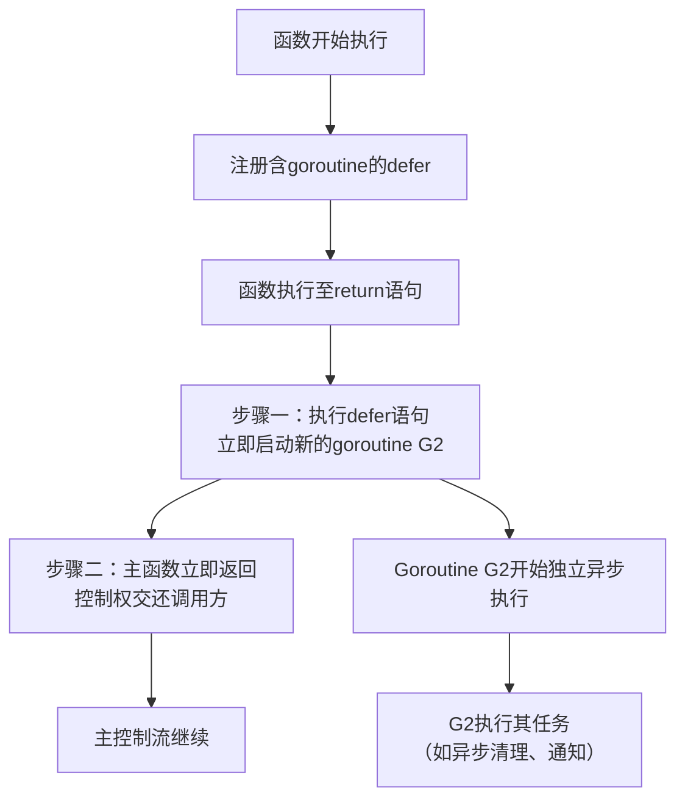
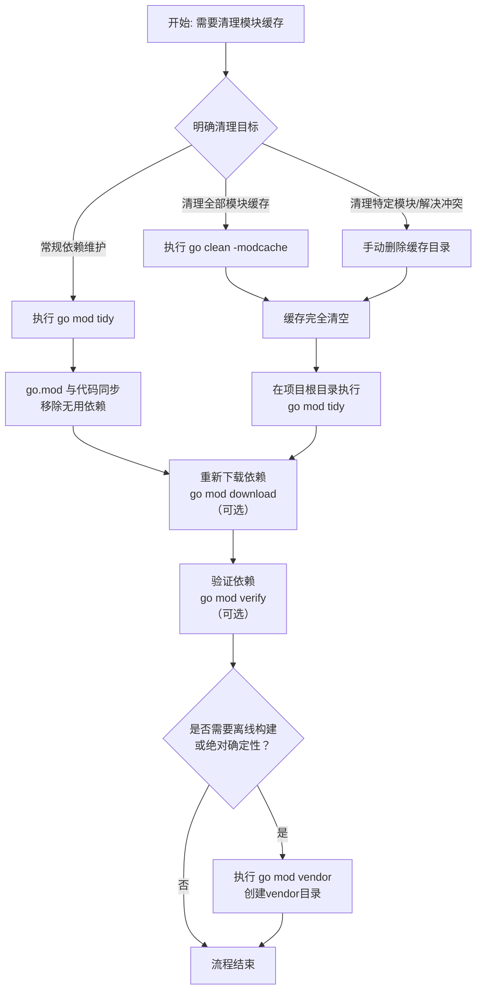
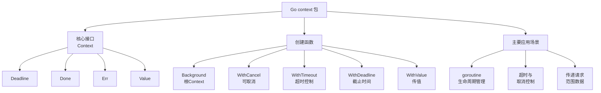

## make

Go 语言中的 `make` 是一个内置函数，专门用于初始化并返回切片（slice）、映射（map）和通道（channel）这三种引用类型。与另一个内存分配函数 `new` 不同，`make` 不仅会分配内存，还会根据类型特性进行相应的初始化，确保创建的对象可以立即安全使用 。

下面这个表格汇总了 `make` 函数的核心信息，帮助你快速把握要点。

| 特性 | 说明 |
| :--- | :--- |
| **功能** | 为 slice、map、channel 分配内存并进行**初始化**，使其处于可用状态 。 |
| **返回值** | 返回**类型本身**（T），而不是指针 。 |
| **适用类型** | 仅适用于 slice、map 和 channel 三种内置引用类型 。 |

### 🔧 具体用法与参数

`make` 函数根据初始化类型的不同，参数和含义也有所区别。

#### **1. 初始化切片（Slice）**

语法为 `make([]T, len, cap)` 。
-   `T`：切片元素的类型。
-   `len`：切片的当前**长度**（即可访问的元素个数）。创建后，切片中的前 `len` 个元素会被初始化为元素类型的零值 。
-   `cap`：切片的**容量**（即底层数组可容纳的元素总数）。这是一个可选参数，如果省略，则默认与 `len` 相等 。容量必须大于等于长度 。

```go
// 创建一个长度为3，容量为5的int切片
s1 := make([]int, 3, 5)
fmt.Println(len(s1)) // 3
fmt.Println(cap(s1)) // 5
fmt.Println(s1)      // [0 0 0]

// 创建一个长度和容量均为2的string切片
s2 := make([]string, 2)
fmt.Println(len(s2), cap(s2)) // 2, 2
```
**性能提示**：如果能够预估切片最终的大小，在创建时指定一个足够的容量可以有效避免在后续使用 `append` 时发生多次扩容，从而提升性能 。

#### **2. 初始化映射（Map）**

语法为 `make(map[KeyType]ValueType, cap)` 。
-   `KeyType`：键的类型。
-   `ValueType`：值的类型。
-   `cap`：映射的**初始容量**提示。这是一个可选参数，Go 运行时会根据此值分配大致足够的内存空间 。

```go
// 创建一个初始容量为10的 string->int 映射
m1 := make(map[string]int, 10)
fmt.Println(len(m1)) // 0，初始为空

// 创建一个使用默认容量的映射
m2 := make(map[int]string)
```
**重要区别**：必须使用 `make` 或字面量初始化映射后才能添加键值对。直接声明的 `nil` 映射（如 `var m map[string]int`）无法添加元素，尝试操作会引发运行时恐慌（panic）。

#### **3. 初始化通道（Channel）**

语法为 `make(chan T, cap)` 。
-   `T`：通道中传输数据的类型。
-   `cap`：通道的**缓冲区大小**。这是一个可选参数，默认为0，即创建无缓冲通道 。

```go
// 创建一个无缓冲的int通道
ch1 := make(chan int)
// 创建一个缓冲区大小为5的string通道
ch2 := make(chan string, 5)
```
-   **无缓冲通道** (`cap=0`)：发送和接收操作必须同时准备好才能完成，否则会阻塞，用于同步通信 。
-   **有缓冲通道** (`cap>0`)：发送操作在缓冲区未满时立即完成，接收操作在缓冲区非空时立即完成，用于异步通信 。

### ⚖️ make 与 new 的区别

`make` 和 `new` 是 Go 语言中两个用于内存分配的内置函数，但它们有着根本的不同：

| 特性 | `make` | `new` |
| :--- | :--- | :--- |
| **作用对象** | 仅用于 slice, map, channel  | 可用于任意类型（如 int, struct 等）  |
| **返回值** | **类型本身** (T)  | **指向类型的指针** (*T)  |
| **初始化行为** | **分配内存并完成初始化**，使对象立即可用  | **仅分配内存并将内存置为零值**，不进行进一步的初始化  |

下面的代码示例清晰地展示了两者的区别：
```go
// 使用 new 处理切片：返回一个指向 nil 切片的指针
sPtr := new([]int)     // sPtr 的类型是 *[]int
fmt.Println(*sPtr == nil) // 输出: true

// 使用 make 处理切片：返回一个已初始化的、可用的切片
s := make([]int, 3)    // s 的类型是 []int
fmt.Println(s == nil)    // 输出: false

// 对于映射，错误地使用 new 会导致问题
var nilMapPtr := new(map[string]int) // 返回 *map[string]int，指向一个 nil map
// (*nilMapPtr)["key"] = 1           // 这会导致 panic，因为 nil map 未初始化

readyToUseMap := make(map[string]int) // 返回已初始化的 map
readyToUseMap["key"] = 1             // 正确
```
简单来说，**`new(T)` 返回的是 `*T`（指针），而 `make(T, ...)` 返回的是 `T`（初始化后的值）** 。对于 slice、map 和 channel，你应该始终使用 `make` 。

### 💡 实际应用场景

-   **预分配切片容量**：在处理大量数据时，如果知道切片的大致大小，使用 `make` 预分配容量可以避免切片在 `append` 过程中多次扩容，从而提升性能 。
    ```go
    // 预分配容量，避免频繁扩容
    data := make([]int, 0, 10000)
    for i := 0; i < 10000; i++ {
        data = append(data, i)
    }
    ```
-   **为映射设置初始容量**：对于大型映射，在创建时提供一个初始容量提示可以减少哈希表在增长过程中重组（rehash）的次数，优化性能 。
    ```go
    // 为已知大小的映射预分配空间
    cache := make(map[string]int, 1000)
    ```
-   **控制通道的并发行为**：使用带缓冲的通道可以实现异步通信，缓冲大小可以控制并发协程的协调能力 。
    ```go
    // 使用有缓冲通道限制并发数
    sem := make(chan struct{}, 3) // 最多允许3个并发
    ```

### ⚠️ 关键注意事项

1.  **必须初始化后使用**：对于 slice、map 和 channel，必须使用 `make`（或字面量）初始化后才能进行赋值、发送/接收等操作。直接使用未初始化的（nil）变量会导致运行时错误 。
2.  **容量与性能**：合理指定切片和映射的容量可以提升程序效率，但过大的初始容量可能会浪费内存。需要在时间和空间上做出权衡 。
3.  **通道缓冲区选择**：无缓冲通道用于强同步通信，有缓冲通道则用于解耦发送和接收的速度差异。根据通信需求选择合适的通道类型 。

希望这份详细的介绍能帮助你彻底掌握 Go 语言中的 `make` 函数。如果你对某个特定类型（如切片、映射或通道）的用法有更深入的问题，我很乐意继续探讨。

## slice

在 Go 语言中，遍历切片（slice）是一项非常常见的操作。下面为你详细介绍几种主要的方法、使用技巧以及一些重要的注意事项。

### 🔍 切片遍历的基本方式

遍历切片主要有两种基本方法，它们各有特点。

| 遍历方式 | 语法 | 是否需要索引 | 是否直接修改元素 |
| :--- | :--- | :--- | :--- |
| **`for` 循环** | `for i := 0; i < len(slice); i++ { ... }` | 需要 | 是（通过 `slice[i]`） |
| **`for-range` 循环** | `for index, value := range slice { ... }` | 可选 | 否（`value` 是副本） |

-   **传统的 `for` 循环**：通过索引直接访问元素。当你需要在循环中通过索引修改切片元素的值时，必须使用这种方法，因为你可以直接使用 `slice[i] = newValue` 进行赋值。
-   **`for-range` 循环**：这是更现代、更简洁的写法。它会返回两个值：当前元素的**索引**和该索引处元素的**副本**。这种方式不需要手动管理索引，不易出错。

### 💡 使用技巧与场景

掌握了基本方法后，下面这些技巧能让你的代码更高效和简洁。

-   **使用空白标识符**：在 `for-range` 循环中，如果你不需要索引或值，可以使用下划线 `_` 来忽略它，避免编译错误。
    ```go
    // 只关心值，忽略索引
    for _, value := range mySlice {
        fmt.Println(value)
    }
    // 只关心索引，忽略值
    for index := range mySlice {
        fmt.Println(index)
    }
    ```

-   **遍历多维切片**：多维切片（如 `[][]int`）的遍历需要嵌套循环。
    ```go
    twoDimSlice := [][]int{{1, 2}, {3, 4, 5}}
    for rowIndex, row := range twoDimSlice {
        for colIndex, value := range row {
            fmt.Printf("slice[%d][%d] = %d\n", rowIndex, colIndex, value)
        }
    }
    ```

-   **提升性能的小技巧**：如果你在循环中只需要索引，而不需要元素的值，那么只接收索引（`for i := range slice`）会比同时接收索引和值（`for i, v := range slice`）在性能上有一点点优势，因为它避免了对值的拷贝。

### ⚠️ 重要注意事项

在遍历切片时，有一些关键点需要特别注意，以避免常见的错误。

1.  **`range` 返回的是副本**：在 `for index, value := range slice` 中，`value` 是切片元素的一个**副本**，而不是原始元素的引用。因此，修改 `value` 不会改变切片中原始元素的值。要修改原始元素，必须通过索引 `slice[index]` 来进行。
    ```go
    numbers := []int{1, 2, 3}
    for i, v := range numbers {
        v = v * 2 // 这只会修改副本 v，切片中的元素不变
        numbers[i] = numbers[i] * 2 // 这样才能真正修改切片元素
    }
    fmt.Println(numbers) // 输出：[2 4 6]
    ```

2.  **避免在遍历时修改切片长度**：在遍历过程中，如果使用 `append` 等操作改变了切片的长度（即追加元素可能导致扩容），可能会产生非预期的结果。循环的次数在开始遍历时就已经确定了。

3.  **遍历 `nil` 切片是安全的**：遍历一个未初始化的 `nil` 切片不会导致错误，循环体内的代码一次也不会执行。

### 💎 总结与选择

-   当你**需要根据索引修改元素**时，使用传统的 `for` 循环。
-   当你**只需要读取元素**，或者进行不依赖索引的操作时，使用 `for-range` 循环，它更简洁、安全。
-   使用 `_` 来忽略不需要的返回值，使代码更清晰。

希望这些详细的解释和示例能帮助你更好地掌握 Go 语言中切片的遍历！如果你对特定场景下的用法有更多疑问，我很乐意继续讨论。

## 二维 slice

在 Go 语言中，当你使用一层 `for ... range` 遍历一个二维切片（即 `[][]T`）时，每次迭代返回的**第一个值是当前行的索引（int 类型），第二个值则是当前那一维切片（即 `[]T`）的副本**。这里的关键在于，你得到的是该一维切片的一个**副本**，但这个副本本身包含了指向底层数组的指针。

为了让你快速抓住要点和区别，我准备了下面这个表格。

| 特性 | 一维切片的副本 (例如 `row`) | 备注 |
| :--- | :--- | :--- |
| **本质** | 当前行（一个 `[]T` 类型的一维切片）的**值副本** | 切片本身是值复制的。 |
| **包含内容** | 包含指向**原始二维切片同一行底层数组**的指针、长度和容量信息 | 副本和原始行共享同一块底层数据存储空间。 |
| **对元素修改** | **直接影响**原始二维切片中的元素（例如 `row[i] = newValue`） | 因为通过指针修改了共享的底层数组。 |
| **对切片结构修改 (如 `append`)** | **不影响**原始二维切片中对应行的长度和指向 | 对副本进行 `append` 会操作一个新的切片头，与原行脱钩。 |

### 🔍 深入理解与示例

简单来说，你可以把切片理解成一个包含三个字段的结构体：一个指向底层数组起始位置的指针、一个长度（len）和一个容量（cap）。当使用一层 `range` 遍历二维切片时，Go 会创建这个结构体的一个副本给你。所以，**副本和原始行指向同一块底层数组**，但切片头（即这个结构体本身）是独立的。

这意味着：
*   **修改副本切片中的元素值（例如 `row[i] = newValue`）会直接改变原始二维切片中的数据**，因为它们共享同一块底层数组。
*   但是，如果你对获取到的这个副本切片本身进行结构性修改，比如使用 `append` 函数，这**不会影响**到原始二维切片中对应行的结构。因为 `append` 操作的是副本切片头，其长度的变化或指向的新底层数组都与原始行无关了。

看看下面的代码示例，这会更加直观：

```go
package main

import "fmt"

func main() {
    // 创建一个二维切片
    twoD := [][]int{
        {1, 2, 3},
        {4, 5, 6},
    }
    fmt.Println("原始二维切片:", twoD) // 输出: [[1 2 3] [4 5 6]]

    // 使用一层 range 遍历
    for i, row := range twoD {
        fmt.Printf("第 %d 行遍历: row 副本内容: %v, 指针指向相同底层数组，", i, row)
        // 通过副本修改元素值，会影响原始二维切片
        if i == 0 && len(row) > 0 {
            row[0] = 99
            fmt.Printf("修改 row[0] 为 99 后，原始二维切片: %v\n", twoD) // 输出: [[99 2 3] [4 5 6]]
        }

        // 对副本 row 进行 append 操作
        newRow := append(row, 777)
        fmt.Printf("append 后副本 newRow: %v, ", newRow)
        fmt.Printf("但原始二维切片第 %d 行未变: %v\n", i, twoD[i]) // 原始行不变
        // 要让原始二维切片反映新增的元素，必须直接操作原始行
        // twoD[i] = append(twoD[i], 888) // 这样才会改变原始结构
    }

    // 遍历后再次查看，只有通过副本修改元素值影响了原始数据
    fmt.Println("最终原始二维切片:", twoD) // 输出: [[99 2 3] [4 5 6]]
}
```

### 💎 总结与最佳实践

-   当你使用 `for _, row := range twoD` 进行一层遍历时，你得到的是每一行一维切片的**副本**，但这个副本与原始行共享底层数据数组。
-   基于此，**直接修改 `row` 中元素的值会改变原始数据**。若需**改变切片的结构（如增加、删除元素）并希望此改变反映到原始二维切片中**，则**必须通过索引直接操作原始行**，例如 `twoD[i] = append(twoD[i], newValue)`。

希望这个解释能帮助你更好地理解 Go 语言中二维切片与 `range` 遍历的机制。

## 逆序遍历

在 Go 语言中，逆序遍历切片有多种方法，你可以根据具体场景选择最合适的一种。下表对比了常见的实现方式及其特点。

| 方法 | 核心思路 | 优点 | 缺点 | 适用场景 |
| :--- | :--- | :--- | :--- | :--- |
| **倒序索引循环** | 从 `len(slice)-1` 循环至 `0` | 逻辑清晰，性能最佳，可修改元素 | 代码稍多 | **最常用**，尤其需要修改元素或追求性能时 |
| **正序索引计算** | 从 `0` 循环至 `len(slice)-1`，通过计算得到逆序索引 | 循环变量正序增长 | 每次循环需计算索引，不直观 | 较少，特定逻辑需求 |
| **`sort.Slice` 反转** | 利用排序函数，自定义比较规则为 `i > j` | 代码简洁，一行代码实现 | 依赖排序包，性能有开销，**会修改原切片** | 代码简洁优先，且同意修改原切片时 |

下面是每种方法的详细说明和代码示例。

### 🔁 倒序索引循环

这是最直接、最常用的方法。循环从切片的最后一个元素（索引为 `len(slice)-1`）开始，递减至第一个元素（索引为 `0`）。

```go
package main

import "fmt"

func main() {
    nums := []int{10, 20, 30, 40, 50}
    
    // 从最高索引遍历到0
    for i := len(nums) - 1; i >= 0; i-- {
        fmt.Printf("索引 %d 的值是: %d\n", i, nums[i])
    }
}
```

这种方法允许你通过 `nums[i]` 直接访问并修改原始切片中的元素。

### 🔢 正序索引计算

这种方法在正序循环内通过计算得到逆序的索引。循环变量 `i` 从 `0` 开始，逆序索引通过 `j = len(slice) - i - 1` 计算得出。

```go
package main

import "fmt"

func main() {
    nums := []int{10, 20, 30, 40, 50}
    
    for i := range nums {
        j := len(nums) - i - 1 // 计算逆序索引
        fmt.Printf("顺序索引 %d -> 逆序索引 %d, 值: %d\n", i, j, nums[j])
    }
}
```

### ⚖️ 使用 `sort.Slice` 反转

这种方法利用了 `sort` 包，通过提供一个自定义的比较函数 `func(i, j int) bool { return i > j }` 来将整个切片反转。**需要注意的是，这会直接修改原始切片**。

```go
package main

import (
    "fmt"
    "sort"
)

func main() {
    nums := []int{10, 20, 30, 40, 50}
    
    sort.Slice(nums, func(i, j int) bool {
        return i > j // 定义排序规则为索引大的在前，实现反转
    })
    
    fmt.Println("反转后的切片:", nums) // 输出: [50 40 30 20 10]
    
    // 此时如果继续遍历 nums，将是逆序后的结果
    for i, v := range nums {
        fmt.Printf("索引%d: %d\n", i, v)
    }
}
```

### 💡 重要注意事项

- **修改元素**：若需在逆序遍历时修改元素，推荐使用**倒序索引循环**，因为它能通过索引直接修改原切片值。
- **性能考量**：对于大型切片，**倒序索引循环**通常是最高效的方法。`sort.Slice` 方法由于内部是完整的排序操作，会有额外的性能开销。
- **结构体切片**：遍历结构体切片时，如果使用 `for range`，`value` 是结构体的副本。修改副本不会影响原切片，此时应通过索引 `slice[i]` 来修改。

希望这些详细的解释和示例能帮助你彻底掌握 Go 语言中切片的逆序遍历。如果你有任何疑问，欢迎继续提问！

## map 遍历

在 Go 语言中，遍历 map 主要通过 `for range` 循环实现。由于 map 是无序的，其遍历顺序具有不确定性。下面这个表格汇总了主要的遍历方式和关键特性。

| 遍历方式 | 语法示例 | 适用场景 |
| :--- | :--- | :--- |
| **遍历键和值** | `for key, value := range myMap` | 需要同时访问键和值 |
| **只遍历键** | `for key := range myMap` | 只需要键，不关心值 |
| **只遍历值** | `for _, value := range myMap` | 只需要值，不关心键 |

### 🔄 基本遍历方法

-   **遍历键和值**：这是最常用的方式，每次迭代会返回当前元素的键和值。
    ```go
    personAge := map[string]int{"Alice": 30, "Bob": 25, "Carol": 27}
    for name, age := range personAge {
        fmt.Printf("%s is %d years old\n", name, age)
    }
    ```

-   **只遍历键**：如果只需要处理键，可以省略值变量。
    ```go
    for name := range personAge {
        fmt.Println("Name:", name)
    }
    ```

-   **只遍历值**：使用下划线 `_` 忽略键，只遍历值。
    ```go
    for _, age := range personAge {
        fmt.Println("Age:", age)
    }
    ```

### ⚠️ 重要特性与注意事项

1.  **无序性**：Go 语言中 map 的遍历顺序是**随机**的，这是由其哈希表的实现机制决定的。每次运行程序，输出的顺序都可能不同。设计者特意这样做是为了防止开发者依赖不可靠的遍历顺序。

2.  **遍历时操作元素**
    -   **删除元素**：可以在 `range` 循环内使用 `delete` 函数删除当前正在遍历的元素，这是安全的。
        ```go
        for key := range myMap {
            if someCondition(key) {
                delete(myMap, key) // 安全删除当前键
            }
        }
        ```
    -   **添加元素**：**严禁**在遍历过程中向 map 添加新元素（如 `myMap["newKey"] = value`），这会导致运行时错误（panic）。

3.  **并发安全**：Go 的 map 是**非并发安全**的。在多个 goroutine 同时进行读写（包括一边遍历一边写入）会触发数据竞争，导致程序不稳定。在并发场景下，必须使用同步机制（如 `sync.Mutex`）或使用专为并发设计的 `sync.Map`。

### 🧩 进阶技巧

-   **按顺序遍历**：如果业务需要固定的顺序，可以先将键提取到切片中，对切片排序，然后按照排序后的键顺序来遍历 map。
    ```go
    import "sort"
    
    var m = map[string]int{"banana": 2, "apple": 1, "orange": 3}
    
    // 1. 提取所有键到切片
    keys := make([]string, 0, len(m))
    for k := range m {
        keys = append(keys, k)
    }
    
    // 2. 对键的切片进行排序
    sort.Strings(keys)
    
    // 3. 按排序后的键顺序遍历 map
    for _, k := range keys {
        fmt.Println(k, m[k])
    }
    ```

希望这份详细的指南能帮助你全面掌握 Go 语言中 map 的遍历！如果你对特定场景下的用法有更多疑问，我很乐意继续探讨。

## set

在 Go 语言中，虽然没有内置的 Set 类型，但利用其强大的 `map` 可以非常优雅地实现 Set 的功能。其核心原理是利用 `map` 键的唯一性来保证 Set 元素的去重。

下面这个表格汇总了两种主流的实现方式及其特点，帮助你快速做出选择。

| 实现方式 | 核心思路 | 优点 | 缺点 | 推荐场景 |
| :--- | :--- | :--- | :--- | :--- |
| **`map[T]struct{}`** | 值类型使用空结构体 `struct{}` | **极致的内存效率**，`struct{}` 不占内存 | 语法稍显怪异 | **生产环境首选**，尤其关注性能时 |
| **`map[T]bool`** | 值类型使用布尔值 `bool` | 代码直观，`true` 表示存在 | 每个元素需存储一个布尔值（通常为1字节） | 快速原型、小数据集或更注重可读性时 |

### 🔧 具体实现方案

#### 1. 基于 `map[T]struct{}`（推荐）

这是**最常用且符合 Go 语言习惯**的实现方式，因为它最大限度地节省了内存。

```go
// 定义一个通用的 Set 类型，T 必须是可比较的类型 (comparable)
type Set[T comparable] struct {
    items map[T]struct{}
}

// 创建并返回一个新的 Set
func NewSet *Set[T] {
    return &Set[T]{
        items: make(map[T]struct{}),
    }
}

// 添加元素到集合
func (s *Set[T]) Add(item T) {
    s.items[item] = struct{}{} // 使用空结构体实例
}

// 从集合中移除元素
func (s *Set[T]) Remove(item T) {
    delete(s.items, item)
}

// 检查元素是否在集合中
func (s *Set[T]) Contains(item T) bool {
    _, exists := s.items[item]
    return exists
}

// 获取集合中元素的数量
func (s *Set[T]) Size() int {
    return len(s.items)
}
```

**使用示例：**

```go
func main() {
    stringSet := NewSet
    stringSet.Add("apple")
    stringSet.Add("banana")
    stringSet.Add("apple") // 重复添加无效

    fmt.Println(stringSet.Contains("apple")) // 输出: true
    fmt.Println(stringSet.Size())            // 输出: 2

    // 遍历集合
    for item := range stringSet.items {
        fmt.Println(item)
    }
}
```

#### 2. 基于 `map[T]bool`

这种方式代码更直观，更容易理解，但会有微小的内存开销。

```go
type Set[T comparable] struct {
    items map[T]bool
}

func NewSet *Set[T] {
    return &Set[T]{
        items: make(map[T]bool),
    }
}

func (s *Set[T]) Add(item T) {
    s.items[item] = true
}

func (s *Set[T]) Contains(item T) bool {
    return s.items[item]
}

// Remove, Size 等方法与第一种方式类似
```

### 🔄 遍历与集合操作

创建 Set 后，你可以像遍历普通 map 一样遍历它，并且可以实现丰富的集合运算。

-   **遍历集合**：直接使用 `for range` 循环遍历 Set 底层 map 的键。
    ```go
    for item := range s.items {
        // 处理每个 item
    }
    ```

-   **集合运算**：可以轻松实现交集、并集、差集等。
    ```go
    // 求交集：元素同时存在于集合 A 和 B
    func (s *Set[T]) Intersection(other *Set[T]) *Set[T] {
        result := NewSet
        for item := range s.items {
            if other.Contains(item) {
                result.Add(item)
            }
        }
        return result
    }

    // 求并集：元素存在于集合 A 或 B
    func (s *Set[T]) Union(other *Set[T]) *Set[T] {
        result := NewSet
        for item := range s.items {
            result.Add(item)
        }
        for item := range other.items {
            result.Add(item)
        }
        return result
    }
    ```

### ⚠️ 关键注意事项

-   **类型安全**：上面的例子使用了 **泛型（Go 1.18+）**，这确保了 Set 的类型安全。如果你使用的 Go 版本较低，可能需要使用 `map[interface{}]struct{}`，但会失去类型安全，需要借助类型断言。
-   **并发访问**：基于 `map` 的 Set 在**并发读写时是不安全的**。如果需要在多个 goroutine 中并发使用，必须通过同步机制（如 `sync.RWMutex`）来保护。
-   **替代方案**：除了 `map`，理论上也可以用切片（Slice）实现 Set，但查找、删除元素的效率很低（时间复杂度为 O(n)），**一般不推荐**，除非数据量极小或需要保持插入顺序。

### 💎 总结

在 Go 中创建 Set，最优雅、高效的方式是**使用泛型结合 `map[T]struct{}`**。它实现了类型安全、内存高效和操作高效。对于需要并发访问的场景，记得添加适当的锁机制。

希望这些详细的解释和示例能帮助你顺利地在 Go 项目中使用 Set。如果你对特定场景下的实现有更多疑问，我很乐意继续探讨。

## go map function

Go 语言中的 `map` 是一种非常实用的内置数据结构，它提供了一系列操作函数和方法。虽然它本身没有太多传统意义上的“函数”，但其核心操作通过内置函数和语法实现。下面这个表格汇总了主要的操作方式。

| 操作类别 | 函数/语法 | 说明 |
| :--- | :--- | :--- |
| **创建 Map** | `make(map[KeyType]ValueType)` | 初始化一个空的 map |
| | `make(map[KeyType]ValueType, cap)` | 初始化 map 并可提示初始容量 |
| | `map[KeyType]ValueType{k1: v1, k2: v2}` | 使用字面量声明并初始化 map |
| **添加 & 更新** | `map[key] = value` | 添加新键值对或更新现有键对应的值 |
| **访问元素** | `value := map[key]` | 获取指定键的值，键不存在则返回值类型的零值 |
| **检查存在性** | `value, ok := map[key]` | 获取值的同时检查键是否存在（ok 为布尔值） |
| **删除元素** | `delete(map, key)` | 从 map 中删除指定的键值对 |
| **获取长度** | `len(map)` | 返回当前 map 中键值对的数量 |
| **遍历元素** | `for key, value := range map` | 使用 `for-range` 循环遍历 map 中的所有键值对 |

### 💡 重要操作详解与注意事项

掌握上述基本操作后，了解以下细节和注意事项能让你更得心应手地使用 map。

1.  **map 必须初始化后使用**
    使用 `var` 声明的 map 变量初始值为 `nil`。向 `nil` map 写入数据会引发运行时恐慌（panic）。务必使用 `make` 或字面量进行初始化后再操作。
    ```go
    var nilMap map[string]int // 此时 nilMap 为 nil
    // nilMap["key"] = 1      // 运行时错误：向 nil map 赋值

    initializedMap := make(map[string]int) // 正确的初始化
    initializedMap["key"] = 1             // 正确
    ```

2.  **灵活检查键的存在性**
    使用 `value, ok := map[key]` 语法可以安全地检查键是否存在。即使键不存在，也不会引发错误，只是 `ok` 值为 `false`。
    ```go
    m := map[string]int{"apple": 5}
    if value, exists := m["banana"]; exists {
        fmt.Println("香蕉的数量是:", value)
    } else {
        fmt.Println("找不到香蕉。") // 这行会被执行
    }
    ```

3.  **理解 map 的引用类型特性**
    map 是引用类型。当将一个 map 赋值给一个新变量或作为参数传递给函数时，它们指向同一块底层数据。因此，对其中一个的修改会影响到另一个。
    ```go
    m1 := map[string]int{"a": 1}
    m2 := m1
    m2["a"] = 100
    fmt.Println(m1["a"]) // 输出 100，因为 m1 和 m2 共享底层数据
    ```

4.  **map 的非线程安全性**
    Go 的内置 map 是**非线程安全**的。当多个 goroutine 并发地对同一个 map 进行读写操作时，会导致未定义行为或程序崩溃。在并发场景下，必须使用同步机制，如 `sync.Mutex` 或使用专为并发设计的 `sync.Map`。
    ```go
    // 错误示例：在并发情况下直接读写普通 map 是危险的
    // 需要使用 sync.Mutex 对操作进行加锁，或者使用 sync.Map
    ```

5.  **map 的遍历是无序的**
    map 的遍历顺序是不确定的，每次运行都可能不同。这是由其哈希表的实现机制决定的。如果需要有序遍历，可以先将键排序，然后按排序后的键顺序访问值。
    ```go
    m := map[string]int{"zoo": 3, "apple": 1, "banana": 2}
    keys := make([]string, 0, len(m))
    for k := range m {
        keys = append(keys, k)
    }
    sort.Strings(keys) // 对键进行排序
    for _, k := range keys { // 按排序后的键顺序遍历
        fmt.Println(k, m[k])
    }
    ```

### 💎 总结

Go 语言为 map 提供的操作集简洁而强大，核心在于几个内置函数和语法。关键在于理解 `make` 初始化、`map[key]` 的访问特性、`delete` 的删除操作，以及 `for-range` 的遍历方式。同时，务必牢记 map 的引用类型特性和在并发环境下的非线程安全性，这是正确使用 map 的要点。

希望这些信息能帮助你更好地掌握 Go 语言中 map 的使用！

## slice

在 Go 语言中，创建带若干初始值的切片有多种灵活的方式。下表汇总了最常用的几种方法及其核心特点，方便你快速选择。

| 创建方法 | 语法示例 | 特点与说明 |
| :--- | :--- | :--- |
| **直接初始化（切片字面量）** | `s := []int{1, 2, 3}` | **最常用、最直观**。直接在大括号 `{}` 中列出所有初始值。 |
| **使用 `make` 函数** | `s := make([]int, 3)` | 创建指定长度和容量的切片，元素初始为类型的**零值**（如int是0，string是""）。适合需要预分配特定大小空间的情况。 |
| **从数组或切片生成** | `s := array[0:3]` 或 `newSlice := oldSlice[0:3]` | 通过“切割”现有数组或切片来创建新切片。新切片与源数组/切片**共享底层内存**，一方的修改会影响另一方。 |

### 🔧 具体方法与示例

下面详细说明每种方法，并附上代码示例。

#### 1. 直接初始化（切片字面量）
这是最直接的方式，语法清晰易懂。
```go
// 创建并初始化一个整数切片
numbers := []int{10, 20, 30, 40, 50}

// 创建并初始化一个字符串切片
fruits := []string{"apple", "banana", "orange"}

fmt.Println(numbers) // 输出: [10 20 30 40 50]
fmt.Println(fruits) // 输出: [apple banana orange]
```
这种方式下，切片的**长度（len）和容量（cap）在创建时就等于初始值的个数**。

#### 2. 使用 `make` 函数
当你需要预先分配特定大小的切片，但初始值暂时为零值，或者你计划稍后通过索引逐个赋值时，可以使用 `make` 函数。
```go
// 创建一个长度为5的字符串切片，初始值为5个空字符串，容量也为5
s1 := make([]string, 5)

// 创建一个长度为3，容量为10的整数切片，初始值为3个0
s2 := make([]int, 3, 10)

fmt.Println(s1) // 输出: [    ] (5个空字符串)
fmt.Println(s2) // 输出: [0 0 0]
```
`make([]T, length, capacity)` 中的 `capacity`（容量）参数是可选的。如果省略，则容量等于长度。容量代表了切片底层数组可以容纳的最大元素个数，在预先知道切片会增长很大时，指定一个较大的容量可以避免后续频繁扩容（使用 `append` 时），从而提升性能。

#### 3. 从数组或现有切片生成
这种方法基于一个已存在的数组或切片来创建新切片，新切片与原数组或原切片共享底层数组。
```go
// 有一个现有数组
originalArray := [5]int{15, 25, 35, 45, 55}

// 从数组创建切片（索引1到3，包含1，不包含3）
sliceFromArray := originalArray[1:3]
fmt.Printf("从数组创建的切片: %v, 长度: %d, 容量: %d\n", sliceFromArray, len(sliceFromArray), cap(sliceFromArray))
// 输出: 从数组创建的切片: [25 35], 长度: 2, 容量: 4

// 有一个现有切片
originalSlice := []int{100, 200, 300, 400}

// 从切片创建新切片
newSlice := originalSlice[:2] // 取前两个元素
fmt.Printf("从切片创建的新切片: %v\n", newSlice) // 输出: 从切片创建的新切片: [100 200]
```
**重要提示**：通过这种方式创建的切片与原始数据共享底层数组。修改新切片中的元素，原始数组或切片中对应的元素也会改变。
```go
originalArray := [3]int{1, 2, 3}
sharedSlice := originalArray[:]
sharedSlice[0] = 99
fmt.Println("修改新切片后，原数组变为:", originalArray) // 输出: [99 2 3]
```

### 💡 如何选择创建方式

-   **需要明确的初始值**：优先使用**直接初始化（切片字面量）**，例如 `s := []int{1, 2, 3}`。
-   **需要预定切片大小，初始值暂不重要（后续通过索引赋值或使用 `append`）**：使用 **`make` 函数**，并可合理预分配容量以优化性能，例如 `s := make([]string, 0, 100)` 创建一个初始长度为0但容量为100的切片。
-   **需要引用现有数组或切片的一部分，且希望共享底层数据**：使用**从数组或切片生成**的方式，例如 `newSlice := oldArray[1:4]`。

### 🔄 动态添加元素

无论以何种方式创建，都可以使用内置的 `append` 函数向切片动态添加元素。当添加新元素导致切片长度超过其容量时，Go 运行时会自动为切片扩容（通常会重新分配一块更大的底层数组）。
```go
// 从一个初始切片开始
mySlice := []int{1, 2, 3}
fmt.Printf("初始: %v, len=%d, cap=%d\n", mySlice, len(mySlice), cap(mySlice))

// 使用 append 添加一个元素
mySlice = append(mySlice, 4)
fmt.Printf("添加一个元素后: %v, len=%d, cap=%d\n", mySlice, len(mySlice), cap(mySlice))

// 使用 append 添加多个元素
mySlice = append(mySlice, 5, 6, 7)
fmt.Printf("添加多个元素后: %v, len=%d, cap=%d\n", mySlice, len(mySlice), cap(mySlice))
```

希望这些详细的解释和示例能帮助你掌握在 Go 语言中创建带值切片的方法！如果你对某个特定用法有更深入的疑问，我很乐意继续探讨。

## while

在 Go 语言中，并没有像其他一些编程语言（如 C、Java 或 Python）中那样的独立 `while` 关键字或语句。Go 的设计哲学强调简洁，因此它统一使用 `for` 关键字来实现所有类型的循环，包括其他语言中常见的 `while` 循环和 `do-while` 循环的功能 。

下面这个表格清晰地展示了如何使用 `for` 关键字来实现不同类型的循环逻辑。

| 循环类型 | Go 中的实现方式 | 简要说明与代码示例 |
| :--- | :--- | :--- |
| **条件循环 (如同 `while`)** | `for condition { ... }` | 只要条件 `condition` 为真，循环就会继续 。 <br> `i := 0` <br> `for i < 5 { ... i++ }` |
| **无限循环 (如同 `while(true)`)** | `for { ... }` | 这是一个无限循环，通常需要在内部使用 `break` 语句来退出 。 <br> `for { ... if condition { break } }` |
| **至少执行一次 (模拟 `do-while`)** | `for { ... if condition { break } }` | 循环体至少执行一次，然后再判断退出条件 。 <br> `for { ... if i >= 10 { break } }` |

### 🔍 详细用法与示例

**1. 实现条件循环（标准 while 循环）**

这是最常见的场景，你只需要在 `for` 关键字后面跟上循环条件即可。

```go
package main
import "fmt"

func main() {
    count := 1
    // 当 count 小于等于 5 时循环
    for count <= 5 {
        fmt.Printf("这是第 %d 次循环。\n", count)
        count++ // 改变循环变量，避免无限循环
    }
}
```

**2. 实现无限循环并在内部控制退出**

当你需要创建一个不知道具体循环次数，但会在特定条件满足时退出的循环时，这种方式非常有用。

```go
package main
import (
    "fmt"
    "math/rand"
    "time"
)

func main() {
    rand.Seed(time.Now().UnixNano())
    target := rand.Intn(10) + 1 // 生成1-10的随机数
    guess := 0

    for { // 没有设置条件，构成无限循环
        fmt.Print("猜一个1-10之间的数字: ")
        fmt.Scanln(&guess)
        
        if guess == target {
            fmt.Println("恭喜你，猜对了！")
            break // 使用 break 退出循环
        } else if guess < target {
            fmt.Println("猜小了！")
        } else {
            fmt.Println("猜大了！")
        }
    }
}
```

**3. 模拟 do-while 循环（至少执行一次）**

Go 语言没有直接的 `do-while` 语法，但可以通过上述无限循环的模式，将退出条件判断放在循环体末尾来实现相同的效果。

```go
package main
import "fmt"

func main() {
    i := 1
    // 模拟 do-while：循环体至少执行一次
    for {
        fmt.Printf("执行第 %d 次。\n", i)
        i++
        if i > 3 { // 条件判断在循环体执行之后
            break
        }
    }
}
```

### 💡 设计哲学与使用建议

-   **为何这样设计？** Go 语言通过单一的 `for` 关键字统一了循环结构，这使得语法更加简洁和一致，减少了程序员在不同循环关键字之间做选择的心智负担 。
-   **核心注意事项**：在使用 `for { ... }` 进行无限循环时，**务必确保循环体内有明确的退出条件**（如 `break` 语句），否则程序将陷入真正的死循环 。

希望这些解释和示例能帮助你很好地理解和使用 Go 语言中实现循环的方式。如果你对特定场景下的循环用法有更多疑问，我们可以继续探讨。

## struct

在 Go 语言中，`struct` 和 `new` 分别是用于构建复杂数据结构和进行内存分配的重要工具。下面这个表格可以帮助你快速把握它们的核心特性和区别。

| 特性 | 结构体 (struct) | new 关键字 |
| :--- | :--- | :--- |
| **本质** | 一种**复合数据类型**，用于将多个不同类型的字段组合成一个逻辑整体  | 一个内置函数，用于**分配内存**并返回指向该类型零值的指针  |
| **主要功能** | 封装数据，描述实体（如用户、订单），是 Go 中实现面向对象编程的基石  | 为类型分配零值内存，避免未初始化指针，确保内存安全  |
| **返回值** | 结构体类型本身 (`T`) 或它的指针 (`*T`)，取决于初始化方式 | 始终是指向类型的指针 (`*T`)  |
| **初始化方式** | 字面量初始化（如 `Person{Name: "Alice"}`）、`var` 声明、`new` 函数等  | `new(T)`，返回一个已分配内存的 `*T` |

### 🔑 深入理解 Struct

结构体是你的程序中对现实世界实体进行建模的核心工具。

#### **定义与初始化**

定义结构体使用 `type` 和 `struct` 关键字 。

```go
type Person struct {
    Name string
    Age  int
}
```

初始化结构体有多种方式，每种都有其适用场景：
*   **字面量初始化**：最常用且直观的方式 。
    ```go
    // 指定字段名初始化，顺序可变，推荐使用
    p1 := Person{Name: "Alice", Age: 30}
    // 按字段声明顺序初始化，必须初始化所有字段，且顺序不可变
    p2 := Person{"Bob", 25}
    ```
*   **使用 `new` 关键字**：分配内存并返回指针，所有字段被初始化为零值 。
    ```go
    pPtr := new(Person) // pPtr 类型为 *Person
    fmt.Println(pPtr.Name) // 输出空字符串 ""
    fmt.Println(pPtr.Age)  // 输出 0
    ```
*   **取地址实例化**：与字面量初始化结合，直接获得结构体指针，功能上类似于 `new` 但更灵活 。
    ```go
    pPtr := &Person{Name: "Charlie", Age: 28}
    ```

#### **高级特性与用法**

1.  **匿名字段（嵌入）**：通过嵌入一个结构体类型，可以直接访问其字段和方法，这是 Go 实现组合（Composition）的主要方式 。
    ```go
    type Address struct {
        City string
    }
    type Employee struct {
        Person  // 匿名字段，嵌入 Person 结构体
        Address // 匿名字段，嵌入 Address 结构体
        Company string
    }
    func main() {
        emp := Employee{}
        emp.Name = "Alice"   // 直接访问 Person 的字段
        emp.City = "Beijing" // 直接访问 Address 的字段
        fmt.Printf("%+v\n", emp) // 输出: {Person:{Name:Alice Age:0} Address:{City:Beijing} Company:}
    }
    ```

2.  **结构体标签**：结构体字段后面的反引号字符串，用于存储元数据，常见于 JSON 序列化/反序列化、数据库 ORM 映射等场景 。
    ```go
    type User struct {
        ID   int    `json:"user_id" db:"id"`
        Name string `json:"username" db:"name"`
    }
    ```

3.  **方法接收者**：可以为结构体定义方法，方法接收者可以是值类型或指针类型 。
    ```go
    // 值接收者，操作结构体副本，不会影响原实例
    func (p Person) Greet() string {
        return fmt.Sprintf("Hello, I'm %s", p.Name)
    }
    // 指针接收者，可修改原实例，避免大结构体的拷贝开销
    func (p *Person) SetAge(newAge int) {
        p.Age = newAge
    }
    ```

### 📍 深入理解 new 关键字

`new` 是 Go 语言中的一个内置函数，用于为指定类型分配内存 。

#### **功能与适用场景**

`new(T)` 的核心行为是：
*   为类型 `T` 分配一块内存空间。
*   将这块内存初始化为 `T` 的**零值**。
*   返回指向这块内存的**指针**（类型为 `*T`) 。

它主要适用于以下场景：
*   **需要指针但无需复杂初始化时**：当你只需要一个指向类型零值的指针时 。
    ```go
    func createIntPointer() *int {
        return new(int) // 返回一个指向 0 的指针
    }
    ```
*   **与反射等机制配合时** 。

#### **与 `&T{}` 的比较及注意事项**

对于结构体，`new` 和 `&T{}` 都能得到结构体指针，但通常更推荐使用 `&T{}`，因为它可以在创建时就初始化字段，代码意图更清晰 。

```go
p1 := new(Person)      // 返回 &Person{Name: "", Age: 0}
p2 := &Person{Name: "Alice"} // 返回 &Person{Name: "Alice", Age: 0}
```

**特别注意**：对于切片（slice）、映射（map）和通道（channel）这三种引用类型，应使用 `make` 关键字来初始化，而不是 `new`。因为 `new` 只会返回一个指向 `nil` 的指针，而 `make` 会完成底层数据结构的初始化 。

```go
// 错误示例
s := new([]int) // s 是一个指向 nil 切片的指针
*s = make([]int, 10) // 需要额外一步初始化

// 正确做法
s := make([]int, 10) // 直接创建并初始化一个长度为10的切片
```

### 💎 总结与选择

-   **`struct`** 是你的**数据蓝图**，用于定义和组织数据。当需要表示一个具有多个属性的实体时，就应使用结构体 。
-   **`new`** 是一个**内存分配器**，专门用于获取类型的零值指针。在大多数需要结构体指针的情况下，更推荐使用 `&T{}` 这种形式，因为它兼具分配内存和初始化字段的能力 。

希望这些详细的解释能帮助你更好地理解和使用 Go 语言中的结构体和 `new` 关键字！

## 垃圾回收机制

您观察得非常准确，Go 语言在语法特性上（如拥有显式指针）确实与 C++ 有相似之处，但在内存管理的核心机制上，它采用了与 Java 类似的自动垃圾回收，这使得它的生命周期管理哲学更接近现代托管语言。为了帮助您快速把握全貌，下面这个表格清晰地对比了三者的核心差异。

| 特性维度 | C++ | Go | Java |
| :--- | :--- | :--- | :--- |
| **对象内存布局** | **栈/堆上直接存储对象**，指针可指向任意地址 | 可在**栈上存储值对象**，也可在**堆上分配并通过指针引用** | 除基本类型外，**几乎所有对象都在堆上分配，由引用（一种受限指针）指向** |
| **生命周期决定** | **程序员手动管理**（`new`/`delete`, `malloc`/`free`） | **编译器逃逸分析 + 运行时垃圾回收 (GC)** 自动管理 | **运行时垃圾回收 (GC)** 自动管理 |
| **核心管理机制** | RAII（资源获取即初始化）、智能指针 | **并发三色标记清除 GC** | **分代收集 GC**（多种算法，如 G1, ZGC） |
| **核心优势** | 极致性能、确定性释放、精细控制 | 开发效率高、并发友好、内存安全 | 开发简单、跨平台、久经考验 |
| **主要挑战** | 内存泄漏、悬垂指针等高复杂度 | GC 带来的延迟（STW）和开销 | GC 停顿时间（STW）、调优复杂度高 |

### 🔑 核心机制解析

接下来，我们深入探讨 Go 语言实现自动内存管理的几个关键机制。

1.  **逃逸分析：分配位置的决策者**
    这是 Go 能够兼具灵活性和安全性的基石。编译器在编译阶段会执行“逃逸分析”，通过静态分析来判断一个局部变量的生命周期是否会超出其所在函数的作用域。
    *   **未逃逸**：如果变量仅在函数内部使用，它将被分配在**栈**上。函数调用结束时，栈帧弹出，内存自动且瞬时地被回收，效率极高。
    *   **已逃逸**：如果变量的地址被返回、存入全局变量或传递给其他函数，导致其生命周期延长，它就会被分配到**堆**上。堆上的对象正是 Go 垃圾回收器主要管理的目标。

2.  **三色标记清除：垃圾回收的执行者**
    Go 的垃圾回收器采用并发的**三色标记清除算法**。其工作流程可简要概括为：
    *   **标记阶段**：垃圾回收器会从“根对象”（如全局变量、当前所有 goroutine 的栈变量）开始，遍历所有可达的对象，并将其标记为“存活”。这个过程通过白色、灰色、黑色三种颜色来追踪进度，并且大部分工作是与用户程序并发执行的，以尽量减少程序停顿（Stop-The-World, STW）。
    *   **清除阶段**：在标记完成后，所有未被标记为“存活”的白色对象将被认定为垃圾，回收器会清扫这些内存并将其归还给程序，以便后续分配使用。

### 💎 总结与选择

-   **追求极致性能、底层控制和不介意手动管理复杂性**：选择 **C++**。
-   **追求开发效率、并发安全和高性能网络服务**：选择 **Go**。
-   **构建大型、复杂、跨平台的企业级应用，并有成熟的生态系统和工具链支持**：选择 **Java**。

希望这份详细的对比能帮助您透彻地理解 Go 语言在内存管理上的独特设计。如果您对某个特定细节感兴趣，我们可以继续深入探讨。

## 指针访问

在 Go 语言中，指针允许你直接与内存地址交互，从而高效地访问和修改变量的值。下面这个表格汇总了指针的核心操作，帮助你快速把握要点。

| 核心操作 | 操作符 | 功能说明 | 简单代码示例 |
| :--- | :--- | :--- | :--- |
| **获取地址** | `&` | 获取变量在内存中的地址。 | `ptr := &variable` |
| **解引用** | `*` | 获取指针所指向的内存地址中存储的值。 | `value := *ptr` |
| **通过指针赋值** | `*` | 向指针所指向的内存地址写入新值。 | `*ptr = newValue` |

### 🔑 基本操作与语法

-   **声明指针**：使用 `*Type` 的语法来声明一个指向特定类型的指针。未初始化的指针默认值为 `nil` 。
    ```go
    var ptr *int // 声明一个指向 int 类型的指针 ptr，当前为 nil
    ```

-   **取地址与解引用**：通过 `&` 操作符获取变量的内存地址并赋值给指针。通过 `*` 操作符可以读取或修改指针指向的变量的值 。
    ```go
    num := 42
    ptr := &num    // ptr 现在保存了变量 num 的内存地址
    fmt.Println(*ptr) // 通过 ptr 读取 num 的值，输出 42
    *ptr = 100     // 通过 ptr 修改 num 的值
    fmt.Println(num)  // 输出 100，原始变量已被修改
    ```

### 🚀 主要应用场景

1.  **函数参数传递（修改外部变量）**
    Go 语言的函数参数是**按值传递**的，这意味着函数内部接收到的是参数的一个副本。如果你希望在函数内部修改外部变量的值，就需要传递该变量的指针 。
    ```go
    func increment(x *int) {
        *x = *x + 1 // 直接修改 x 指向的变量
    }

    func main() {
        count := 10
        increment(&count) // 传递 count 的地址
        fmt.Println(count) // 输出 11
    }
    ```

2.  **避免大结构体的拷贝开销**
    当需要向函数传递一个大型的结构体时，如果直接传递值，会产生整个结构体的拷贝成本。传递结构体的指针则只拷贝一个内存地址，效率更高 。
    ```go
    type LargeStruct struct {
        // ... 很多字段
    }

    func processLargeStruct(s *LargeStruct) {
        // 通过指针操作结构体，避免整体拷贝
    }
    ```

3.  **在方法中修改接收者**
    为结构体定义方法时，如果需要在方法内部修改结构体实例的数据，应该使用指针接收者 。
    ```go
    type Person struct {
        Name string
        Age  int
    }

    // 使用指针接收者，才能修改实例的 Age 字段
    func (p *Person) HaveBirthday() {
        p.Age++ // 这行代码才能实际修改调用该方法的 Person 实例
    }
    ```

### ⚠️ 重要注意事项

-   **空指针（Nil Pointer）**：声明但未初始化的指针值为 `nil`。尝试对 `nil` 指针进行解引用操作会导致运行时恐慌（panic）。在解引用前，最好检查指针是否为 `nil`。
    ```go
    var p *int
    if p != nil {
        fmt.Println(*p) // 安全的解引用
    } else {
        fmt.Println("指针为 nil，不能解引用")
    }
    ```

-   **Go 指针的限制**：与 C/C++ 不同，**Go 的指针不支持算术运算**（如 `p++` 来移动地址）。这一设计大大增强了程序的安全性和内存安全性。

-   **无需手动释放内存**：与需要手动管理内存的 C/C++ 不同，Go 拥有强大的**垃圾回收（GC）机制**。你不需要也不能手动释放通过 `new` 关键字或取地址操作创建的指针所指向的内存，GC 会自动回收不再使用的内存 。

### 💡 示例：修改结构体字段

这是一个综合示例，展示了如何使用指针修改结构体字段 ：
```go
type Product struct {
    Name  string
    Price float64
    Stock int
}

// 通过指针修改库存
func updateStock(prod *Product, newStock int) {
    prod.Stock = newStock // 直接修改原结构体的字段
}

func main() {
    laptop := Product{Name: "Laptop", Price: 999.99, Stock: 10}
    fmt.Printf("更新前库存: %d\n", laptop.Stock) // 输出: 更新前库存: 10

    updateStock(&laptop, 5) // 传递结构体的地址
    fmt.Printf("更新后库存: %d\n", laptop.Stock) // 输出: 更新后库存: 5
}
```

希望这份详细的指南能帮助你掌握 Go 语言中指针的访问和操作！如果你对某个特定用法有更深入的疑问，我们可以继续探讨。

## 返回多值

在 Go 语言中，函数返回多个值是一项核心特性，它极大地简化了错误处理和数据返回的逻辑。下面这个表格汇总了实现多返回值的主要方式。

| 特性 | 语法示例 | 适用场景与说明 |
| :--- | :--- | :--- |
| **匿名多返回值** | `func foo() (int, string) { return 1, "hello" }` | 通用场景，返回值意义明确时使用。 |
| **命名返回值** | `func foo() (a int, b string) { a=1; b="hello"; return }` | 函数逻辑复杂时，提升可读性；支持“裸返回”（`return`）。 |
| **错误处理模式** | `func foo() (result int, err error) { ... }` | **行业标准**：通常最后一个返回值是 `error` 类型，成功时为 `nil` 。 |
| **忽略返回值** | `value, _ := foo()` | 使用下划线 `_` 忽略不需要的返回值 。 |

### 🔑 关键细节与用法

#### 1. 命名返回值与“裸返回”

当您为返回值命名后，它们在函数体内部就如同已声明的变量，可以直接进行赋值。使用 `return` 语句而不显式指定变量（即“裸返回”）时，会自动返回这些已命名的返回值变量当前的值 。

```go
// 命名返回值允许在函数体内直接操作返回变量，并使用裸返回（return）
func calc(x, y int) (sum int, product int) {
    sum = x + y    // 直接为命名的返回值变量 sum 赋值
    product = x * y // 直接为命名的返回值变量 product 赋值
    return          // 裸返回：自动返回已命名的变量 sum 和 product
}
```
**注意**：虽然命名返回值和裸返回能让代码更简洁，但在较长的函数中，可能会降低可读性，因为难以一眼看清实际返回的值。需酌情使用。

#### 2. 类型简写

当多个连续参数或返回值的类型相同时，可以合并类型声明，使代码更紧凑 。
```go
// 参数 x, y 类型相同，可合并声明；命名返回值 r1, r2 类型相同，也可合并
func example(x, y int) (r1, r2 int) {
    // 函数体
}
```

### 🚀 主要应用场景

多返回值特性最经典和重要的应用在于错误处理 。Go 语言倾向于使用显式的错误返回值而非异常机制。

```go
func safeDivide(a, b float64) (float64, error) {
    if b == 0 {
        // 当出现错误时，返回类型零值和一个非空的 error
        return 0, fmt.Errorf("division by zero")
    }
    // 成功时返回结果和 nil
    return a / b, nil
}

// 调用时的标准模式
result, err := safeDivide(10, 0)
if err != nil { // 检查错误是否发生
    fmt.Println("出错：", err)
    return
}
fmt.Println("结果：", result)
```

除了错误处理，多返回值也天然适用于需要返回多个相关数据值的场景，例如从一个函数中同时获取商和余数，或者交换两个变量的值等 。

### ⚠️ 重要规则

-   **所有返回值必须被处理**：Go 编译器要求函数的所有返回值必须在所有代码路径上都有返回 。
-   **返回值数量必须匹配**：函数签名中声明的返回值类型和数量，必须与 `return` 语句实际返回的值完全匹配。
-   **可忽略不需要的返回值**：使用下划线 `_` 可以忽略不需要的返回值，这是一个良好的编程习惯，可以使意图更明确 。

### 💡 总结

Go 语言的多返回值机制，特别是其与错误处理的紧密结合，使得代码逻辑清晰、安全。掌握匿名返回、命名返回以及正确的错误处理模式，是编写符合 Go 语言风格的高质量代码的关键 。

希望这些详细的解释和示例能帮助你更好地理解和使用 Go 语言中的多返回值特性！

## rune

在 Go 语言中，并非所有字符都用 `byte` 表示。`byte` 类型适用于 ASCII 字符，而处理包括中文在内的 Unicode 字符则需要使用 `rune` 类型。下面这个表格能帮你快速了解它们的核心区别。

| 特性 | `byte` (uint8 的别名) | `rune` (int32 的别名) |
| :--- | :--- | :--- |
| **本质与大小** | 8 位，1 个字节 | 32 位，4 个字节 |
| **编码支持** | ASCII 字符 | UTF-8 字符，Unicode 码点 |
| **适用场景** | 英文文本，底层字节操作 | 中文、日文等复合字符 |
| **表示示例** | `var c byte = 'A'` | `var c rune = '中'` |

### 🔡 使用 `rune` 表示中文字符

在 Go 语言中，中文字符通常使用 **`rune`** 类型来表示。`rune` 是 `int32` 的别名，代表一个 Unicode 码点，能够处理包括中文在内的任何 Unicode 字符。

-   **直接表示**：最直接的方式是用单引号将中文字符括起来赋值给 `rune` 类型变量。
    ```go
    var ch rune = '中'
    fmt.Printf("字符: %c, Unicode码点: %d\n", ch, ch) // 输出：字符: 中, Unicode码点: 20013
    ```

-   **使用 Unicode 码点**：你也可以使用字符的 Unicode 码点（十六进制形式）来表示。
    ```go
    var ch1 rune = '\u4E2D' // '中' 的 Unicode 码点是 U+4E2D
    var ch2 rune = '\U00004E2D' // 使用8位十六进制表示时用 \U
    fmt.Printf("%c, %c\n", ch1, ch2) // 输出：中, 中
    ```

### 🔄 字符串遍历与操作

字符串在 Go 语言底层是字节序列。当字符串包含中文时，一个中文字符在 UTF-8 编码下通常占用**3个字节**。因此，直接通过索引访问字符串得到的是**字节**，而非完整的字符。

-   **使用 `range` 遍历**：`for range` 循环会自动按 `rune` 字符进行解码，每次迭代返回字符的起始索引和 `rune` 值。
    ```go
    s := "Go语言"
    for index, char := range s {
        fmt.Printf("索引:%d, 字符:%c, Unicode值:%d\n", index, char, char)
    }
    ```
    输出：
    ```
    索引:0, 字符:G, Unicode值:71
    索引:1, 字符:o, Unicode值:111
    索引:2, 字符:语, Unicode值:35821
    索引:5, 字符:言, Unicode值:35328
    ```
    注意中文字符的索引是不连续的，因为它们占用了多个字节。

-   **通过切片获取字符**：可以直接对字符串进行切片操作来获取中文字符。
    ```go
    s := "语言"
    fmt.Println(s[0:3]) // 输出"语"，因为"语"这个字符由3个字节表示，从索引0开始，到索引3（不包含）
    fmt.Println(s[3:6]) // 输出"言"
    ```
    这种方法需要知道每个中文字符的确切字节边界。

-   **转换为 `[]rune` 切片**：将字符串转换为 `[]rune` 切片后，每个元素就是一个完整的 Unicode 字符（如一个汉字）。这样可以安全地按索引访问或修改特定位置的字符。
    ```go
    s := "语言"
    runeSlice := []rune(s)
    fmt.Printf("第一个字符: %c\n", runeSlice[0]) // 输出：第一个字符: 语
    fmt.Printf("第二个字符: %c\n", runeSlice[1]) // 输出：第二个字符: 言

    // 修改字符（字符串本身不可变，但 rune 切片可修改）
    runeSlice[0] = '狗'
    newStr := string(runeSlice)
    fmt.Println(newStr) // 输出：狗言
    ```

### ⚠️ 重要注意事项

-   **字符串是不可变的**：Go 语言中的字符串是只读的字节序列，不能直接通过索引修改其中的某个字符。要修改字符串中的字符（尤其是中文字符），通常需先将其转换为 `[]rune` 或 `[]byte` 类型，修改后再转换回 `string` 类型，此过程会分配新内存。
-   **`len` 函数返回的是字节长度**：对字符串使用 `len()` 函数得到的是字节数，而非字符数。要获取字符串的字符数量，可先将字符串转换为 `[]rune` 切片后求其长度：`len([]rune(s))`。
-   **根据需求选择类型**：若处理纯英文文本或进行底层字节操作，可使用 `byte`；若处理包含中文等多字节字符的文本，应使用 `rune` 以确保正确性。

### 💎 总结

在 Go 语言中：
-   处理 **ASCII 字符**（如英文字母）时，可使用 `byte`。
-   处理**中文字符**或其他 Unicode 字符时，需使用 `rune`。
-   遍历含中文的字符串，优先使用 `for range` 循环。
-   按字符位置访问或修改时，可先将字符串转为 `[]rune` 类型。

希望这些解释能帮助你更好地在 Go 语言中处理字符！如果你还有其他问题，欢迎提出。

## string function
Go 语言为处理文本提供了强大的工具集，标准库中的 `strings` 包尤其重要。下面这个表格汇总了最常用的字符串函数，方便你快速查阅。

| 函数类别 | 经典函数 | 主要功能 |
| :--- | :--- | :--- |
| **字符串查询与检查** | `Contains`, `Count`, `Index`, `LastIndex` | 检查子串存在、计数、查找位置 。 |
| **字符串修改与转换** | `ToUpper`, `ToLower`, `Replace`, `TrimSpace`, `Trim` | 大小写转换、替换、修剪空白或特定字符 。 |
| **字符串分割与组合** | `Split`, `Join`, `Fields` | 分割字符串为切片，或将字符串切片合并 。 |
| **前缀与后缀检查** | `HasPrefix`, `HasSuffix` | 判断字符串是否以特定子串开头或结尾 。 |
| **类型转换** | `Itoa`, `Atoi` (`strconv`包) | 整数与字符串间的转换 。 |

### 🔍 字符串查询与检查

这类函数帮助你了解字符串的内容。

-   **判断包含与计数**：使用 `strings.Contains(s, substr string) bool` 可以快速检查字符串 `s` 中是否包含子串 `substr` 。使用 `strings.Count(s, substr string) int` 能统计子串 `substr` 在 `s` 中**非重叠**出现的次数 。
-   **查找位置**：`strings.Index(s, substr string) int` 和 `strings.LastIndex(s, substr string) int` 分别返回子串在字符串中**第一次**和**最后一次**出现的索引位置，如果未找到则返回 `-1` 。

### ✂️ 字符串修改与转换

Go 中的字符串是不可变的（immutable），这些函数会**返回修改后的新字符串**，而不会改变原字符串。

-   **大小写转换**：`strings.ToUpper(s string) string` 和 `strings.ToLower(s string) string` 可以将字符串中的所有字母统一转换为大写或小写 。
-   **字符串替换**：`strings.Replace(s, old, new string, n int) string` 用于替换字符串。参数 `n` 指定替换次数，如果设为 `-1`，则会替换所有匹配项 。`strings.ReplaceAll(s, old, new string)` 是 `Replace` 中 `n` 为 `-1` 的便捷版本 。
-   **修剪字符**：`strings.TrimSpace(s string) string` 用于移除字符串开头和结尾的所有空白字符（如空格、制表符、换行符） 。`strings.Trim(s, cutset string)`、`TrimLeft` 和 `TrimRight` 则用于移除字符串两端指定的字符集合 。

### 🧩 字符串分割与组合

处理结构化文本（如CSV）时，分割和组合操作非常有用。

-   **分割字符串**：`strings.Split(s, sep string) []string` 根据分隔符 `sep` 将字符串 `s` 分割成一个字符串切片 。如果只想按空格分割，`strings.Fields(s string) []string` 会更方便，它会按空白字符分割并忽略多余的空格 。
-   **组合字符串**：`strings.Join(elems []string, sep string) string` 是 `Split` 的逆操作，它用一个分隔符 `sep` 将一个字符串切片连接成一个单独的字符串 。这种方式通常比使用 `+` 号进行字符串拼接效率更高。

### 📌 前缀、后缀与类型转换

-   **检查开头和结尾**：`strings.HasPrefix(s, prefix string) bool` 和 `strings.HasSuffix(s, suffix string) bool` 可以轻松判断一个字符串是否以特定的前缀开头或后缀结尾 。
-   **整数与字符串转换**：整数和字符串的转换通过 `strconv` 包实现。`strconv.Atoi(s string) (int, error)` 将字符串转换为整数，需要处理错误 。`strconv.Itoa(i int) string` 将整数转换为字符串 。

### 💡 进阶用法与性能

-   **高效构建字符串**：在循环中大量拼接字符串时，使用 `+` 运算符效率较低。推荐使用 `strings.Builder`，它能高效地构建字符串 。
    ```go
    var builder strings.Builder
    builder.WriteString("Hello")
    builder.WriteString(" ")
    builder.WriteString("World")
    result := builder.String() // "Hello World"
    ```
-   **处理中文等Unicode字符**：Go 源代码使用UTF-8编码，字符串底层也是UTF-8编码的字节序列 。使用 `for range` 循环遍历字符串时，会自动按 Unicode 字符（`rune`）进行解码，即便其中包含中文也能正确处理 。内置的 `len()` 函数返回的是字符串的**字节数** 。要得到字符（`rune`）的数量，可以使用 `utf8.RuneCountInString()` 函数 。

希望这份指南能帮助你更好地掌握 Go 语言的字符串操作。如果你对某个函数或特定场景有更深入的问题，我很乐意继续探讨。

## sub string

在 Go 语言中处理字符串子串，方法是多样且灵活的。你可以根据是否需要按字节或字符操作，以及是否需要查找子串位置来选择不同的方式。为了帮你快速概览，下面这个表格汇总了核心的方法。

| 操作类型 | 关键方法/技巧 | 核心要点 | 典型适用场景 |
| :--- | :--- | :--- | :--- |
| **直接切片** | `s[start:end]` | 基于**字节索引**，效率极高。但直接用于含中文等多字节字符的字符串会乱码。 | 处理纯 ASCII 文本（如英文） |
| **转换为 `[]rune` 后切片** | `string([]rune(s)[start:end])` | 基于**字符索引**，可安全处理中文等 Unicode 字符。会分配新内存，有性能开销。 | 需要按字符位置截取含中文的字符串 |
| **查找子串位置后切片** | `strings.Index()`, `strings.LastIndex()` | 先定位特定分隔符或子串的字节位置，再配合切片截取。 | 按特定标记（如逗号、空格）截取 |
| **使用 `strings.Split` 分割** | `strings.Split(s, sep)` | 按分隔符将字符串分割成切片，然后按索引访问目标部分。 | 提取路径、域名等结构化字段 |
| **使用 `strings.Trim` 系列函数** | `strings.TrimPrefix()`, `strings.TrimSuffix()` | 移除字符串**开头或结尾**指定的字符集。 | 清理字符串前后多余的特定字符（如空格、标点） |

### 🔧 方法与示例详解

下面我们详细看看这些方法的具体使用。

#### **1. 直接切片与字符安全处理**

最基础的子串截取方式是使用切片语法 `s[start:end]`。需要注意的是，Go 中的字符串是只读的字节切片，**索引是基于字节的**。这对于纯 ASCII 字符串（如英文）没有问题：

```go
s := "Hello, World!"
sub := s[7:12] // 截取 "World"
fmt.Println(sub)
```

但当字符串中包含中文等 UTF-8 编码的多字节字符时，直接切片可能导致乱码，因为一个中文字符可能由 2-4 个字节组成。例如，`"我是中国人"[0:2]` 的输出是乱码，因为它只截取了第一个中文字符的部分字节。

**安全处理中文（按字符截取）**：需要先将字符串转换为 `[]rune` 类型（每个 `rune` 代表一个 Unicode 码点，即一个完整的字符），进行切片操作后再转回 `string`：

```go
s := "我是中国人"
runeSlice := []rune(s)      // 将字符串转换为 rune 切片
substring := string(runeSlice[2:5]) // 基于字符安全截取，输出"中国人"
fmt.Println(substring)
```
这种方法可以确保像中文这样的多字节字符被正确截取。

#### **2. 查找子串位置后切片**

`strings.Index(s, substr)` 函数可以返回子串 `substr` 在字符串 `s` 中**第一次出现**的起始字节索引（从 0 开始计数）。如果未找到，则返回 -1。结合切片操作，可以灵活截取：

```go
s := "Hello, World! Welcome to Go."
// 查找第一个逗号的位置
commaIndex := strings.Index(s, ",")
if commaIndex != -1 {
    // 截取逗号之前的部分
    partBefore := s[:commaIndex] // "Hello"
    // 截取逗号之后的部分（跳过逗号本身）
    partAfter := s[commaIndex+1:] // " World! Welcome to Go."
    fmt.Println(partBefore, partAfter)
}
```

`strings.LastIndex(s, substr)` 函数则返回子串**最后一次出现**的位置。这在处理有重复结构的字符串时非常有用。

#### **3. 使用 `strings.Split` 分割字符串**

`strings.Split(s, sep)` 函数根据指定的分隔符 `sep` 将字符串 `s` 分割成一个字符串切片。然后你可以通过切片索引直接访问你需要的部分：

```go
email := "user@example.com"
parts := strings.Split(email, "@")
if len(parts) == 2 {
    username := parts[0] // "user"
    domain := parts[1]   // "example.com"
    fmt.Println(username, domain)
}
```

#### **4. 修剪特定字符**

`strings.TrimSpace(s)` 用于移除字符串**开头和结尾的所有空白字符**（包括空格、制表符、换行符等）。`strings.Trim(s, cutset)` 则用于移除字符串**开头和结尾**出现在 `cutset` 字符集合中的任何字符。

```go
s1 := "   Hello, World!   \n"
trimmed := strings.TrimSpace(s1) // 结果为 "Hello, World!"

s2 := "!!!Hello, World!!!" 
trimmed2 := strings.Trim(s2, "!") // 结果为 "Hello, World"
```

此外，`strings.TrimPrefix(s, prefix)` 和 `strings.TrimSuffix(s, suffix)` 可以更精确地移除指定的前缀或后缀字符串，且仅在匹配时才移除。

### 💡 如何选择合适的方法

选择哪种方法取决于你的具体需求：

-   处理**纯英文**文本，且知道**精确字节位置**：使用**直接切片**，效率最高。
-   处理**含中文**的文本，需要按**字符位置**截取：先将字符串转换为 `[]rune`，再切片。
-   需要根据**特定子串或分隔符**（如逗号、`@`符号）来截取：使用 `strings.Index`, `strings.LastIndex` 或 `strings.Split`。
-   只想**移除字符串首尾的特定字符**（如空格、标点）：使用 `strings.Trim` 系列函数。

希望这些解释和示例能帮助你在 Go 语言中高效地处理字符串子串！如果你在处理特定字符串时遇到具体问题，我很乐意和你一起探讨。

## slice sort

在 Go 语言中，对切片进行排序主要依靠标准库中的 `sort` 包。它提供了开箱即用的基础类型排序功能，也支持高度自定义的排序方式。为了让你能快速选择合适的方法，我先用一个表格来汇总核心的排序方法及其适用场景：

| 排序方法 | 适用场景 | 关键函数/接口 | 特点 |
| :--- | :--- | :--- | :--- |
| **直接调用排序函数** | 对 `[]int`, `[]float64`, `[]string` 等基础类型切片进行**升序**排序。 | `sort.Ints`, `sort.Float64s`, `sort.Strings` | 最简单直接，一行代码搞定。 |
| **使用 `sort.Reverse`** | 对基础类型切片进行**降序**排序。 | `sort.Sort(sort.Reverse(sort.IntSlice(...)))` | 利用组合实现逆序，无需重写逻辑。 |
| **使用 `sort.Slice`** | 对结构体切片、或需要复杂排序规则（如多字段排序）的切片进行排序。 | `sort.Slice(slice, func(i, j int) bool {…})` | 灵活，通过匿名函数定义比较规则。代码紧凑。 |
| **使用 `sort.SliceStable`** | 同上，但要求排序是**稳定**的（相等元素的原始顺序被保留）。 | `sort.SliceStable` | 在 `sort.Slice` 的基础上保证稳定性。 |
| **实现 `sort.Interface`** | 需要可重用的、复杂的自定义排序类型，或对非标准类型（如 `int32`）排序。 | 实现 `Len()`, `Less(i, j int) bool`, `Swap(i, j int)` 三个方法。 | 最灵活，代码可复用，适合封装为通用功能。 |

下面我们详细看看每种方法的具体用法。

### 🔢 基础类型切片排序

对于整数（`[]int`）、浮点数（`[]float64`）和字符串（`[]string`）切片，`sort` 包提供了最直接的函数。

```go
package main
import (
	"fmt"
	"sort"
)

func main() {
	// 整型切片排序
	intSlice := []int{5, 2, 8, 1, 9, 3}
	sort.Ints(intSlice) // 升序
	fmt.Println("整型升序:", intSlice) // 输出: [1 2 3 5 8 9]

	// 浮点型切片排序
	floatSlice := []float64{3.14, 1.618, 2.718, 0.577}
	sort.Float64s(floatSlice) // 升序
	fmt.Println("浮点型升序:", floatSlice) // 输出: [0.577 1.618 2.718 3.14]

	// 字符串切片排序（按字典序）
	stringSlice := []string{"banana", "apple", "cherry", "date"}
	sort.Strings(stringSlice) // 升序
	fmt.Println("字符串升序:", stringSlice) // 输出: [apple banana cherry date]
}
```
**实现降序排序**也很简单，可以使用 `sort.Reverse` 来包装一个已定义顺序的切片类型。
```go
intSlice := []int{5, 2, 8, 1, 9, 3}
// 使用 sort.Reverse 实现降序
sort.Sort(sort.Reverse(sort.IntSlice(intSlice)))
fmt.Println("整型降序:", intSlice) // 输出: [9 8 5 3 2 1]
```

### 🧑💻 自定义排序：结构体切片

当需要排序的切片元素是结构体，或者排序规则更复杂时，可以使用 `sort.Slice` 函数，通过提供一个比较函数（通常是一个匿名函数）来定义排序规则。

```go
package main
import (
	"fmt"
	"sort"
)

type Person struct {
	Name string
	Age  int
}

func main() {
	people := []Person{
		{"Alice", 30},
		{"Bob", 25},
		{"Charlie", 35},
	}

	// 按 Age 字段升序排序
	sort.Slice(people, func(i, j int) bool {
		return people[i].Age < people[j].Age
	})
	fmt.Println("按年龄升序:", people) // 输出: [{Bob 25} {Alice 30} {Charlie 35}]

	// 按 Name 字段降序排序
	sort.Slice(people, func(i, j int) bool {
		return people[i].Name > people[j].Name
	})
	fmt.Println("按姓名降序:", people) // 输出: [{Charlie 35} {Bob 25} {Alice 30}]
}
```

如果需要**多条件排序**，可以在比较函数中实现。
```go
// 例如：先按 Age 降序，如果 Age 相同再按 Name 升序
people = []Person{
	{"Alice", 30},
	{"Bob", 25},
	{"Charlie", 30},
}
sort.Slice(people, func(i, j int) bool {
	if people[i].Age == people[j].Age {
		return people[i].Name < people[j].Name // Age相同时，按Name升序
	}
	return people[i].Age > people[j].Age // Age降序
})
fmt.Println("多条件排序:", people) // 输出: [{Charlie 30} {Alice 30} {Bob 25}]
```

### 🔒 稳定排序

默认的 `sort.Slice` 排序是**不稳定的**，这意味着相等元素的原始顺序在排序后可能会被打乱。如果需要保持相等元素的原始顺序，应使用 `sort.SliceStable`，其用法与 `sort.Slice` 完全相同。
```go
// 使用稳定排序，保证相同年龄的人其原始顺序不变
sort.SliceStable(people, func(i, j int) bool {
	return people[i].Age < people[j].Age
})
```

### 📐 实现 sort.Interface 接口

对于需要高度复用或更复杂控制的自定义类型，可以实现 `sort.Interface` 接口。该接口包含三个方法：`Len()`, `Less(i, j int) bool`, `Swap(i, j int)`。

```go
package main
import (
	"fmt"
	"sort"
)

// 自定义一个类型
type ByAge []Person

// 实现 sort.Interface 接口
func (a ByAge) Len() int           { return len(a) }
func (a ByAge) Swap(i, j int)      { a[i], a[j] = a[j], a[i] }
func (a ByAge) Less(i, j int) bool { return a[i].Age < a[j].Age }

func main() {
	people := []Person{
		{"Alice", 30},
		{"Bob", 25},
		{"Charlie", 35},
	}
	sort.Sort(ByAge(people))
	fmt.Println("通过接口排序:", people) // 输出: [{Bob 25} {Alice 30} {Charlie 35}]
}
```
这种方式将排序逻辑与数据类型绑定，更适合封装和复用。

### 💡 实用技巧与注意事项

1.  **检查是否已排序**：可以使用 `sort.IntsAreSorted`, `sort.Float64sAreSorted`, `sort.StringsAreSorted` 函数来检查相应类型的切片是否已经是升序排序。
2.  **排序后查找**：对于已排序的切片，可以使用 `sort.SearchInts`, `sort.SearchFloat64s`, `sort.SearchStrings` 或通用的 `sort.Search` 函数进行高效的二分查找。
3.  **性能考量**：Go 的 `sort` 包在底层会根据数据规模和数据特征（如是否部分有序）智能地混合使用快速排序、堆排序、插入排序等算法，因此通常能提供不错的性能。在大多数情况下，你不需要担心排序算法本身的性能。

希望这份详细的指南能帮助你在 Go 语言中轻松应对各种切片排序需求！如果你对特定场景下的排序有更多疑问，我们可以继续探讨。

## package
Go 语言中的包（Package）是其模块化编程的核心，它能帮你更好地组织代码、实现封装和促进复用。下面这张表格汇总了包的核心知识要点，帮你快速建立整体认识。

| 核心概念 | 关键要点 | 说明与示例 |
| :--- | :--- | :--- |
| **包的本质** | 代码的**基本组织单位**，对应文件系统中的一个**目录**。 | 一个目录下的所有 `.go` 文件必须属于同一个包。 |
| **核心作用** | **代码组织、封装隔离、代码复用、命名空间管理** | 将相关代码集合在一起，通过可见性规则控制访问。 |
| **包命名规则** | 全小写，简短有意义；通常与**目录名一致**。 | 如 `fmt`, `net/http`。包 `main` 是程序入口。 |
| **可见性规则** | **首字母大写**的标识符（变量、函数、类型等）可被包外访问。 | `func PublicFunc() {}` （可导出）；`func privateFunc() {}` （仅包内可用）。 |

### 📦 包的类型与项目结构

了解核心概念后，我们来看看包有哪些类型以及在现代Go项目中如何组织它们。

#### **包的主要类型**

-   **可执行包**：包名必须是 `main`，并且包含一个 `main()` 函数作为程序入口。编译后会生成独立的可执行文件。
-   **库包**：不包含 `main()` 函数，提供可重用的功能给其他包导入使用。编译后生成归档文件（`.a`）。标准库（如 `fmt`, `os`）和第三方库都属于此类。
-   **内部包**：一种特殊的库包，其路径中包含 `internal` 目录。这类包只能被其**父目录及其子目录**中的包导入，外部项目无法访问，用于隐藏项目内部实现细节。
-   **测试包**：包名以 `_test` 结尾，包含测试代码，仅在运行测试时编译和执行。

#### **现代项目结构推荐**

在现代 Go 项目（使用 Go Modules）中，通常会采用类似下面的结构，这有助于保持清晰的代码组织：

```
myproject/
├── go.mod           # 模块定义文件，核心
├── go.sum           # 依赖校验文件
├── cmd/             # （可选）存放多个可执行程序
│   └── myapp/
│       └── main.go  # package main
├── internal/        # 内部包，项目私有代码
│   ├── auth/        # 如认证逻辑
│   └── database/    # 如数据库操作封装
├── pkg/             # （可选）对外公开的库代码，可供其他项目导入
│   ├── api/         # 如API客户端
│   └── models/      # 如数据模型
└── web/             # （可选）非Go资源，如前端文件
```

### 🔒 包的可见性控制

Go 语言通过一种非常简单而有效的规则来控制包中标识符（变量、函数、类型、结构体字段等）的可见性：

-   **首字母大写**：标识符是**公开的**，可以被其他包导入后访问。
-   **首字母小写**：标识符是**私有的**，只能在定义它的当前包内部使用。

```go
// 文件：pkg/mylib/mylib.go
package mylib

// PublicFunction 是一个公开函数，其他包可以调用
func PublicFunction() string {
    return "I am public"
}

// privateFunction 是一个私有函数，只能在mylib包内使用
func privateFunction() string {
    return "I am private"
}

// PublicStruct 是一个公开的结构体
type PublicStruct struct {
    ExportedField   string // 公开字段
    privateField    string // 私有字段
}
```

### 📥 包的导入与使用

要在代码中使用其他包的功能，需要使用 `import` 关键字。

#### **基本导入方式**

```go
// 单行导入
import "fmt"
import "math"

// 分组导入（更常用）
import (
    "fmt"
    "math"
)

// 使用包
func main() {
    fmt.Println("Hello, World!")
    result := math.Sqrt(16)
}
```

#### **特殊的导入方式**

-   **别名导入**：解决包名冲突或简化长包名。
    ```go
    import (
        f "fmt"           // 为fmt包起别名f
        m "math"          // 为math包起别名m
    )
    func main() {
        f.Println(m.Pi)   // 使用别名调用
    }
    ```
-   **点导入**：直接使用包内标识符而无需包名前缀，需谨慎使用，易引起命名冲突。
    ```go
    import . "fmt"
    func main() {
        Println("Hello!") // 无需写 fmt.Println
    }
    ```
-   **匿名导入**：仅执行包的 `init()` 函数进行初始化，而不直接使用包中的功能。常见于数据库驱动注册等场景。
    ```go
    import _ "github.com/go-sql-driver/mysql" // 只执行init函数，注册MySQL驱动
    ```

### 🔄 包的初始化

每个包可以包含多个 `init()` 函数，这些函数会在包被导入时自动执行，且**先于 `main()` 函数**执行。

```go
// 文件：pkg/config/config.go
package config

import "fmt"

var AppName string

func init() {
    fmt.Println("Config package initializing...")
    AppName = "My Awesome App"
}

// 文件：cmd/myapp/main.go
package main

import (
    "fmt"
    "myproject/pkg/config" // 导入config包，会触发其init函数执行
)

func main() {
    fmt.Println("Main function starting...")
    fmt.Println("App Name:", config.AppName)
}
```
**输出顺序**：
```
Config package initializing...
Main function starting...
App Name: My Awesome App
```

多个 `init()` 函数在同一个包内按顺序执行。对于存在依赖关系的包，Go 会遵循依赖关系图，从最底层的包开始初始化，确保依赖包先于当前包初始化完成。

### 💡 包设计的最佳实践

1.  **高内聚，低耦合**：让每个包只专注于一个明确的功能领域。避免创建无所不包的“上帝包”。
2.  **按业务领域而非技术层划分**：推荐按 `user/`, `order/`, `payment/` 等业务模块组织包，而不是按 `controller/`, `service/`, `model/` 这样的技术层次。
3.  **谨慎设计公开API**：只将真正需要被外部使用的标识符设为公开（首字母大写），隐藏内部实现细节。
4.  **避免循环导入**：Go 编译器不允许包 A 导入包 B，同时包 B 又导入包 A。如果出现循环依赖，通常意味着代码结构需要调整，可以考虑将公共部分提取到第三个包中。
5.  **使用有意义的包名**：包名应简短、清晰，并能准确反映其功能。
6.  **为包提供文档**：在包声明前添加注释，说明包的用途和使用方法。
    ```go
    // Package mathutils provides basic mathematical utility functions.
    // It includes operations for addition, subtraction, and more.
    package mathutils
    ```

希望这份详细的介绍能帮助你扎实地掌握 Go 语言中包的结构和使用！如果你对某个特定方面还有疑问，我们可以继续深入探讨。

## struct 面向对象

Go语言中的`struct`确实支持面向对象编程的三大特性：封装、继承和多态，但实现方式与传统面向对象语言（如Java或C++）有所不同。下面这个表格能帮你快速抓住核心要点。

| 特性 | Go中的实现方式 | 关键机制 |
| :--- | :--- | :--- |
| **封装** | 结构体 + 方法 + 首字母大小写控制访问权限 | 字段/方法名**首字母大写**为公开（可导出），**首字母小写**为私有（包内访问） |
| **继承** | 通过**结构体组合（嵌入）** 而非传统类继承 | 在一个结构体中**匿名嵌入**另一个结构体，从而获得其字段和方法 |
| **多态** | 通过**接口（interface）** 实现 | 不同类型实现**同一接口**的方法，即可被当作该接口类型统一处理 |

### 🔒 封装：控制访问权限

在Go中，封装通过标识符首字母的大小写来实现。
-   **公开成员**：首字母大写的字段和方法可以被包外部的代码访问。
-   **私有成员**：首字母小写的字段和方法只能在定义它们的包内部访问。

这种方式通常与"工厂函数"（类似构造函数）和Get/Set方法配合使用，以确保对数据的访问是受控的。

```go
// person.go (在 package model 中)
type person struct { // 结构体名小写，包外不能直接创建
    Name string // 公开字段
    age  int    // 私有字段
}

// 工厂函数，用于在包外创建 person 实例
func NewPerson(name string) *person {
    return &person{Name: name}
}

// 私有字段的Set方法，可加入验证逻辑
func (p *person) SetAge(newAge int) {
    if newAge > 0 && newAge < 150 {
        p.age = newAge
    }
}

// 私有字段的Get方法
func (p *person) GetAge() int {
    return p.age
}
```

### 🔗 继承：通过组合实现

Go语言没有`extends`关键字，而是通过**结构体组合**来模拟继承关系。具体做法是在一个结构体中**匿名嵌入**另一个结构体。这样，外部结构体就"继承"了内部结构体的所有字段和方法。

```go
type Animal struct {
    Name string
}

func (a *Animal) Move() {
    fmt.Println(a.Name, "is moving")
}

// Dog 结构体嵌入了 Animal，相当于继承了 Animal 的字段和方法
type Dog struct {
    Animal  // 匿名嵌入
    Breed  string
}

func main() {
    d := Dog{
        Animal: Animal{Name: "Buddy"},
        Breed:  "Labrador",
    }
    d.Move() // 可以直接调用"父类"Animal的方法
}
```

如果子类需要修改"父类"的行为，可以重新定义同名方法，这类似于其他语言中的**方法重写**。此时，若想调用被覆盖的父类方法，可以通过嵌入的结构体名显式访问，例如`d.Animal.Move()`。

### 🎭 多态：借助接口实现

多态在Go中主要通过**接口**来体现。接口定义了一组方法签名，任何类型只要实现了接口中的所有方法，就隐式地满足了该接口。这意味着不同的结构体可以实现同一个接口，但每个结构体可以提供自己独特的方法实现。

```go
// 定义一个Speaker接口
type Speaker interface {
    Speak() string
}

// Dog 类型实现 Speaker 接口
type Dog struct{ Name string }
func (d Dog) Speak() string { return d.Name + " says Woof!" }

// Cat 类型也实现 Speaker 接口
type Cat struct{ Name string }
func (c Cat) Speak() string { return c.Name + " says Meow!" }

// 函数接受Speaker接口类型参数，体现多态
func Introduce(s Speaker) {
    fmt.Println(s.Speak())
}

func main() {
    animals := []Speaker{Dog{"Buddy"}, Cat{"Kitty"}}
    for _, a := range animals {
        Introduce(a) // 同一函数，不同行为
    }
}
```

### 💡 核心特点与优势

Go语言这种面向对象实现方式有其独特优势：
-   **简洁安全**：通过首字母大小写控制权限，语法简单且能有效保护数据。
-   **灵活组合**：组合优于继承的理念使代码结构更灵活，避免了复杂的继承树。
-   **解耦高效**：接口是隐式实现的，类型不需要显式声明实现了某个接口，降低了代码耦合度，更易于测试和扩展。

### ⚠️ 注意事项

-   **嵌入结构体的字段和方法访问**：嵌入结构体的字段和方法（无论大小写）对外部结构体都是直接可访问的。但通过外部结构体实例访问这些字段和方法时，如果外部结构体有同名字段或方法，编译器会采用**就近原则**。
-   **多继承问题**：一个结构体可以嵌入多个匿名结构体（模拟多继承）。但如果这些嵌入结构体有同名字段或方法，访问时必须**显式指定嵌入结构体的名字**以避免歧义。

希望这些解释能帮助你理解Go语言中结构体是如何实现面向对象特性的。

## interface

在 Go 语言中，结构体（struct）实现接口（interface）的方式非常简洁优雅。下面这个表格清晰地展示了实现接口的核心步骤和关键要点。

| 核心概念 | 说明 |
| :--- | :--- |
| **实现方式** | 结构体只需**实现接口中定义的所有方法**，即被视为实现了该接口，无需显式声明（如 `implements` 关键字）。 |
| **关键机制** | Go 语言的 **"鸭子类型"** 机制：如果某个类型的行为（方法集合）与接口定义的行为完全一致，那么它就可以被当作该接口类型使用。 |
| **赋值检查** | 当将结构体实例（如 `Dog{"Buddy"}`）赋值给接口变量（如 `Speaker` 类型变量）时，Go 编译器会在**编译期**进行严格检查，确保结构体已实现接口的所有方法。 |

### 🔧 实现接口的详细步骤

要让一个结构体实现某个接口，只需完成以下两步：

1.  **定义接口**：接口是一组方法签名的集合。
    ```go
    type Speaker interface {
        Speak() string // 接口要求实现一个返回字符串的Speak方法
    }
    ```

2.  **结构体实现接口方法**：结构体通过定义与接口方法签名完全一致的方法（包括方法名、参数列表和返回值列表）来实现接口。
    ```go
    // 定义Dog结构体
    type Dog struct {
        Name string
    }
    // 为Dog实现Speak方法，使其满足Speaker接口
    func (d Dog) Speak() string {
        return d.Name + " says Woof!"
    }

    // 定义Cat结构体
    type Cat struct {
        Name string
    }
    // 为Cat实现Speak方法，使其满足Speaker接口
    func (c Cat) Speak() string {
        return c.Name + " says Meow!"
    }
    ```

只要 `Dog` 和 `Cat` 结构体都完整实现了 `Speaker` 接口要求的 `Speak() string` 方法，它们就隐式地实现了 `Speaker` 接口。

### ✅ 如何保证 `[]Speaker{Dog{"Buddy"}, Cat{"Kitty"}}` 的正确性

你给出的代码 `[]Speaker{Dog{"Buddy"}, Cat{"Kitty"}}` 能够正确创建并初始化的关键在于 **Go 编译器在编译时的静态检查**。

*   **编译时类型检查**：当编译器遇到 `Dog{"Buddy"}` 被放入 `Speaker` 类型的切片时，它会立即检查 `Dog` 结构体是否实现了 `Speaker` 接口要求的所有方法（即 `Speak() string`）。
*   **错误反馈**：如果 `Dog` 或 `Cat` 结构体**没有实现** `Speaker` 接口的某个方法，或者实现的方法签名（参数、返回值）不匹配，编译器会**直接报错**，提示类似 `Dog does not implement Speaker (missing Speak method)` 的错误信息，代码将无法通过编译。
*   **安全性**：这种机制保证了在代码运行之前，所有类型到接口的赋值都是类型安全的，避免了运行时才发现类型不匹配的错误。

因此，只要你的代码能成功编译，就完全可以信任 `[]Speaker{Dog{"Buddy"}, Cat{"Kitty"}}` 这个切片中的每个元素都确实是一个有效的 `Speaker`。

### 💡 验证与最佳实践

为了在开发过程中更早地发现潜在问题，可以采用一些验证技巧和最佳实践。

1.  **编译时验证技巧**：在代码中可以使用一个特殊的变量声明方式来强制验证某个类型是否实现了特定接口。如果类型没有实现接口的所有方法，这行代码会导致编译错误。
    ```go
    // 在包内放置这行代码，用于编译时验证Dog是否实现了Speaker接口
    var _ Speaker = (*Dog)(nil) // 如果Dog未实现Speaker，编译将失败
    ```

2.  **接口设计原则**：尽量定义**小而精**的接口（例如只包含1-3个方法）。这样的接口更容易被实现和组合，也更符合Go语言的设计哲学。著名的 `io.Reader` 和 `io.Writer` 接口就是极佳的例子，它们都只包含一个方法。

3.  **使用接口作为函数参数**：将函数参数声明为接口类型（而非具体结构体类型），可以使函数更加通用和灵活，能够处理任何实现了该接口的类型。这也是多态性的体现。
    ```go
    // 这个函数可以接受任何实现了Speaker接口的类型
    func Introduce(s Speaker) {
        fmt.Println(s.Speak())
    }
    ```

### 💎 总结

总而言之，Go语言通过其独特的**隐式接口机制**和**编译时的严格类型检查**，优雅地保证了 `[]Speaker{Dog{"Buddy"}, Cat{"Kitty"}}` 这类用法的正确性与安全性。你只需要确保你的结构体实现了接口所规定的所有方法，剩下的工作Go编译器会为你妥善处理。

希望这些解释能帮助你更好地理解Go语言中接口的实现机制！

## go.mod

Go 语言中的 `go.mod` 和 `go.sum` 文件是 **Go Modules** 依赖管理系统的核心。它们共同协作，确保你的项目依赖关系明确，并且构建过程安全、可重复。

下面这个表格能帮你快速把握它们的核心区别与联系。

| 特性 | `go.mod` (模块清单) | `go.sum` (校验锁文件) |
| :--- | :--- | :--- |
| **核心作用** | 定义**模块信息**和**直接依赖**的版本 | 记录**所有依赖**（包括间接依赖）的**密码学哈希值**，确保完整性 |
| **内容性质** | **声明式**：开发者关心和主动维护的依赖清单 | **自动生成**：由工具自动维护的完整性校验数据 |
| **管理重点** | **要什么**（依赖哪些包及其版本） | **是不是**（下载的包内容是否与预期完全一致） |
| **类比** | 购物清单 | 收货时的防伪验证码 |

### 🔧 详解 `go.mod`：你的项目模块清单

`go.mod` 文件是 Go Modules 的基石，它清晰地定义了你的项目模块和其直接依赖。

#### **文件结构解析**

一个典型的 `go.mod` 文件结构如下，包含了几个关键指令：

```go
module github.com/yourusername/yourproject  // [1] 模块路径声明

go 1.21                                       // [2] Go 版本指示器

require (                                     // [3] 依赖声明区块
    github.com/gin-gonic/gin v1.9.0
    github.com/stretchr/testify v1.8.0 // indirect
)

replace github.com/old/package => ./local/package  // [4] 依赖替换（常用于本地调试）
```

*   **`module`**：声明模块的**唯一路径**，通常是代码仓库的地址。这是模块的标识符。
*   **`go`**：指定项目期望的 **Go 语言最低版本**。这主要是一个标识，用于保证兼容性。
*   **`require`**：列出项目所需的**直接依赖**及其**版本**。`// indirect` 注释表示该依赖是间接引入的（即你的依赖的依赖）。
*   **`replace`**：用于将某个依赖**替换**为另一个路径或版本，在**本地开发**或**临时修复**第三方库时极其有用。
*   **`exclude`**（较少使用）：用于**排除**某个依赖的特定问题版本，防止被引入。

#### **常用命令**

这些命令帮助你操作 `go.mod` 文件：
*   `go mod init <module-path>`：**初始化**一个新模块，创建 `go.mod` 文件。
*   `go get <package>@<version>`：**添加**、**升级**或**降级**一个依赖。
*   `go mod tidy`：**同步** `go.mod` 文件与你的项目源码。它会添加未被记录但实际使用的依赖，并移除那些已不再使用的依赖。这是维护依赖整洁的**最重要命令**。

### 🔒 详解 `go.sum`：你的依赖完整性守护者

`go.sum` 文件是 Go 语言在安全方面的一个深思熟虑的设计，它通过密码学哈希值来保证项目所有依赖包的完整性，防止使用被篡改的依赖。

#### **文件内容与生成机制**

`go.sum` 文件由多行记录组成，每条记录包含三部分：`模块路径`、`版本` 和 `哈希值`。例如：
```
github.com/gin-gonic/gin v1.9.0 h1:4c2OJ6SsRdEfTCVr+7oQ2Hcx6h1Z2aCEBzgqrnkA2sA=
github.com/gin-gonic/gin v1.9.0/go.mod h1:W2KTZctlEAclIXUIc5Bv6M0Z1g6rGXMW1/7+5+5u9g4=
```
值得注意的是，**一个依赖版本通常对应两条记录**：第一条是**整个模块.zip文件的哈希**，第二条是**该依赖本身的 `go.mod` 文件的哈希**。这确保了依赖本身及其依赖关系的双重安全。

当你首次运行 `go get`、`go mod tidy` 或 `go build` 等命令时，Go 工具链会**自动生成** `go.sum` 文件。它会从模块代理服务器下载依赖，计算其哈希值，并与官方的校验和数据库（默认是 `sum.golang.org`）进行比对，验证无误后才会将其记录到 `go.sum` 文件中。

#### **校验流程：构建时的安全关卡**

在每次构建（`go build`、`go test` 等）时，Go 命令都会执行以下校验步骤：
1.  读取 `go.mod` 文件，确定需要哪些依赖。
2.  从本地缓存或网络获取这些依赖。
3.  计算获取到的依赖包的哈希值。
4.  将计算出的哈希值与 `go.sum` 文件中对应的记录进行比对。
5.  如果**哈希值完全匹配**，构建继续。
6.  如果**任何一个哈希值不匹配**，Go 命令会**立即拒绝构建**，并报告错误，从而有效防止潜在的供应链攻击。

### 💡 实际工作流与最佳实践

1.  **初始化项目**：在项目根目录执行 `go mod init <module-name>`。
2.  **日常开发**：在代码中 `import` 包后，运行 `go mod tidy` 自动下载依赖并更新 `go.mod`/`go.sum`。
3.  **团队协作**：**务必将 `go.mod` 和 `go.sum` 文件一同提交到版本控制系统（如 Git）**。`go.sum` 记录了所有依赖的“数字指纹”，是保证团队所有成员及CI/CD环境构建一致性的关键。
4.  **处理私有仓库**：对于无法通过公共校验和数据库验证的私有模块，可以通过设置 `GOPRIVATE` 环境变量（如 `GOPRIVATE=*.company.com,github.com/yourorg/*`）来告诉 Go 工具跳过对这些模块的校验和检查。

### 💎 总结

简单来说，你可以这样理解二者的分工：
*   **`go.mod`** 是你手写的、人类可读的**依赖清单**，告诉你项目“需要什么”。
*   **`go.sum`** 是机器生成的、确保安全的**校验锁文件**，保证你得到的依赖“正是你所需要的”，分毫未改。

它们共同构成了 Go 语言现代、可靠且安全的依赖管理体系的基石。希望这份详细的解释能帮助你更好地理解和使用它们！如果你对某个特定命令或场景有更深入的疑问，我很乐意继续探讨。

## 匿名函数
在 Go 语言中，匿名函数是一种强大且灵活的特性。下面我将为你详细介绍它的定义方式，并解释它和闭包的关系。

### 🔧 匿名函数的定义方式

在 Go 中，匿名函数就是没有名字的函数，可以直接定义和使用。主要有两种定义和调用方式：

| 定义方式 | 语法示例 | 特点与说明 |
| :--- | :--- | :--- |
| **赋值给变量** | `add := func(x, y int) int { return x + y }` | 将匿名函数保存到一个变量中，可以**多次调用**。 |
| **立即执行** | `func(x, y int) int { return x + y }(10, 20)` | 在定义后立即通过 `()` 调用，**只能执行一次**。 |

**1. 赋值给变量，实现多次调用**
这种方式定义的匿名函数可以被重复使用，非常灵活。
```go
package main
import "fmt"

func main() {
    // 将匿名函数赋值给变量 add
    add := func(x, y int) int {
        return x + y
    }
    
    // 通过变量名多次调用匿名函数
    result1 := add(1, 2)
    result2 := add(3, 4)
    fmt.Println(result1, result2) // 输出: 3 7
}
```

**2. 定义后立即执行**
适用于只需执行一次的临时任务，定义后直接传入参数调用。
```go
package main
import "fmt"

func main() {
    // 定义匿名函数并立即执行，结果赋值给 result
    result := func(x, y int) int {
        return x * y
    }(5, 6) // 定义后直接传入参数 (5, 6)
    
    fmt.Println(result) // 输出: 30
}
```

### 🔗 匿名函数与闭包的关系

这是一个非常重要的概念：**在 Go 语言中，所有的匿名函数都是闭包**。

闭包（Closure）是指一个函数（通常是匿名函数）和其相关的引用环境（即该函数能够访问的外部作用域中的变量）组合而成的实体。当一个匿名函数**捕获**了其外部作用域的变量时，它就形成了一个闭包。

下面的例子清晰地展示了匿名函数如何作为闭包工作：
```go
package main
import "fmt"

// adder 函数返回一个匿名函数（闭包）
func adder() func(int) int {
    sum := 0 // sum 是 adder 函数内的局部变量
    
    // 返回的匿名函数捕获了外部变量 sum，形成闭包
    return func(x int) int {
        sum += x // 匿名函数内部可以访问和修改外部的 sum 变量
        return sum
    }
}

func main() {
    myAdder := adder() // myAdder 现在是一个闭包函数，它"记住"了 sum
    fmt.Println(myAdder(1))  // 输出: 1 (0+1)
    fmt.Println(myAdder(2))  // 输出: 3 (1+2)
    fmt.Println(myAdder(5))  // 输出: 8 (3+5)
    
    // 创建一个新的闭包，它有自己独立的 sum 变量
    newAdder := adder()
    fmt.Println(newAdder(100)) // 输出: 100 (0+100)，与 myAdder 互不影响
}
```
在这个例子中，匿名函数 `func(x int) int` 和它捕获的外部变量 `sum` 共同构成了一个闭包。每次调用 `myAdder` 时，它操作的 `sum` 变量是同一个，其状态在多次调用间得以保持。

### 💡 核心要点与常见用法

-   **匿名函数是“一等公民”**：在 Go 中，函数可以像整数、字符串一样被赋值给变量、作为参数传递给其他函数，或者作为函数的返回值。匿名函数是体现这一特性的重要方式。
-   **作为回调函数**：匿名函数常用于将自定义行为传递给其他函数，例如在遍历集合时。
    ```go
    numbers := []int{1, 2, 3}
    // 将匿名函数作为参数传递给 visit 函数
    visit(numbers, func(value int) {
        fmt.Println(value)
    })
    ```
-   **实现状态封装**：如上面的 `adder` 函数所示，闭包能够将数据（变量 `sum`）和行为（匿名函数）封装在一起，实现类似"私有变量"的效果。

### ⚠️ 使用闭包时的注意事项

在循环中使用匿名函数（闭包）时，需要特别注意变量捕获的问题。直接捕获循环变量的索引或值可能会得到非预期的结果，因为闭包捕获的是变量的**引用**，而不是每次循环时的值快照。

**有问题的写法：**
```go
for i := 0; i < 3; i++ {
    go func() {
        fmt.Println(i) // 很可能打印出三个 3，因为 i 最终变成了 3
    }()
}
```

**正确的写法（通过参数传递值）：**
```go
for i := 0; i < 3; i++ {
    go func(x int) { // 将 i 的值通过参数 x 传入，创建副本
        fmt.Println(x) // 打印 0, 1, 2
    }(i) // 将当前循环的 i 值作为参数传递
}
```

### 💎 总结

-   **定义**：Go 中的匿名函数是通过 `func` 关键字直接定义、没有函数名的函数。
-   **与闭包的关系**：**所有的匿名函数都是闭包**。当匿名函数捕获了其定义范围外的变量时，它就成为了一個携带状态的闭包。
-   **核心价值**：匿名函数提供了极大的灵活性，允许你在需要的地方直接定义行为，非常适合实现回调、临时任务和封装状态。

希望这些详细的解释和示例能帮助你彻底理解 Go 语言中的匿名函数和闭包！

## 变量捕获

在 Go 语言中，闭包捕获外部变量的方式非常明确：**所有变量都是按引用捕获的**。这意味着闭包内部操作的是外部变量本身的内存地址，而不是其值的副本。

### 🔧 捕获机制与“值捕获”效果

虽然 Go 只有引用捕获这一种机制，但你可以通过一些编程技巧来模拟“值捕获”的效果，确保闭包使用变量在定义时的状态。

| 捕获方式 | 机制 | 效果 | 适用场景 |
| :--- | :--- | :--- | :--- |
| **引用捕获 (Go默认)** | 闭包直接获取变量的内存地址。操作的是原变量。 | 闭包内外对变量的修改相互可见。 | 需要**在闭包内修改外部变量**，或**保持状态同步**时。 |
| **参数传递 (模拟值捕获)** | 将变量作为参数传递给闭包，创建值的副本。 | 闭包使用定义时的变量值，与原变量脱钩。 | **循环中创建闭包**或需要**快照**变量某一时刻的状态时。 |
| **局部变量遮蔽 (模拟值捕获)** | 在闭包外部创建新的局部变量并赋值，然后捕获新变量。 | 效果同参数传递，为每个闭包创建独立的状态。 | 循环中创建闭包，或需要更精细地控制捕获时机时。 |

#### **1. 引用捕获（默认行为）**

这是 Go 闭包的标准行为。闭包捕获的是变量的引用，因此闭包内部对变量的修改会影响外部，反之亦然。

```go
package main
import "fmt"

func main() {
    x := 10
    closure := func() {
        x++ // 修改的是外部变量 x 本身
        fmt.Println("Inside closure:", x)
    }

    fmt.Println("Before closure:", x) // 输出: Before closure: 10
    closure()                         // 输出: Inside closure: 11
    fmt.Println("After closure:", x)  // 输出: After closure: 11
}
```

#### **2. 参数传递（实现值捕获效果）**

通过在定义闭包时**将外部变量作为参数传入**，Go 会创建该参数的一个副本。闭包内部操作的是这个副本，与原变量无关。

```go
package main
import "fmt"

func main() {
    x := 10
    // 通过参数传递，闭包内部使用变量 x 的副本
    closure := func(x int) func() {
        return func() {
            x++ // 修改的是参数 x 的副本，不影响外部的 x
            fmt.Println("Inside closure:", x)
        }
    }(x) // 立即调用，并将当前 x 的值 (10) 传入

    fmt.Println("Before closure:", x) // 输出: Before closure: 10
    closure()                         // 输出: Inside closure: 11
    fmt.Println("After closure:", x)  // 输出: After closure: 10 (外部 x 未改变)
}
```

这种方法在**循环中创建闭包**时至关重要，可以避免所有闭包共享同一个循环变量最终值的问题。

#### **3. 局部变量遮蔽（实现值捕获效果）**

在每次循环迭代或需要捕获的位置，**创建一个新的局部变量**来保存当前值，然后闭包捕获这个新变量。

```go
package main
import "fmt"

func main() {
    var funcs []func()
    
    for i := 0; i < 3; i++ {
        j := i // 每次迭代都创建一个新的局部变量 j，捕获 i 的当前值
        funcs = append(funcs, func() {
            fmt.Println(j) // 输出 0, 1, 2
        })
    }
    
    for _, f := range funcs {
        f()
    }
}
```

### 💡 实践技巧与常见场景

理解这些机制后，关键在于正确应用。

-   **循环中闭包的经典问题与解决**：在循环中直接创建闭包并使用循环变量时，所有闭包会共享循环变量最终的值。使用参数传递或局部变量遮蔽可以解决这个问题。
-   **引用捕获的优势**：引用捕获机制使得闭包非常适合用于**封装状态**，例如实现计数器、生成器或缓存等。

### ⚠️ 注意事项

-   **并发安全**：当多个闭包或协程**并发地访问和修改**同一个捕获的变量时，会引发数据竞争。必须使用同步机制（如互斥锁 `sync.Mutex` 或原子操作 `sync/atomic`）来保证安全。
-   **内存考虑**：被闭包引用的变量会**逃逸到堆**上分配内存，其生命周期会延长至与闭包本身一样长。如果闭包长时间存在（如全局变量），可能导致内存无法及时回收，需要注意。

### 💎 总结

Go 语言中闭包对变量的捕获**默认且只能是按引用进行**。虽然无法改变这一语言机制，但你可以通过**参数传递**或**局部变量遮蔽**这两种编程技巧，在需要时实现类似值捕获的效果，获得当前变量的快照。

希望这些解释能帮助你更好地理解和使用 Go 的闭包！如果你对特定场景下的应用有更多疑问，我们可以继续探讨。

## go routine
Goroutine 是 Go 语言并发编程的核心，它是一种轻量级的执行线程，由 Go 运行时（runtime）管理。下面这个表格汇总了 Goroutine 与传统线程的核心区别，帮你快速抓住重点。

| 特性 | Goroutine | 传统线程 |
| :--- | :--- | :--- |
| **内存占用** | 初始栈约 **2KB**，可动态扩容  | 通常 **1MB** 或更多，固定大小  |
| **创建与销毁** | 开销极小，由 **Go runtime 在用户态管理**  | 开销大，需与操作系统内核交互  |
| **切换开销** | 只需保存 **3个寄存器**，约 **200纳秒**  | 需保存大量寄存器，约 **1000-1500纳秒**  |
| **调度模型** | **M:N 模型**（M个Goroutine映射到N个系统线程） | **1:1 模型**（一个线程对应一个内核线程）或 M:1 模型  |

### 🔧 GMP 调度模型

Go 语言通过 GMP 模型实现高效的 Goroutine 调度，这是其高并发能力的基石 。

-   **G (Goroutine)**：就是用户编写的并发任务代码本身，包含了需要执行的函数、上下文和栈信息。
-   **P (Processor)**：代表一个逻辑处理器，负责管理与调度 Goroutine。P 的数量默认等于 CPU 的逻辑核心数，可通过 `runtime.GOMAXPROCS()` 设置 。每个 P 维护一个**本地运行队列 (LRQ)**。
-   **M (Machine)**：对应一个操作系统线程，是真正执行计算的实体。M 必须绑定一个 P 才能运行 G 中的代码 。

调度器通过 **工作窃取 (Work Stealing)** 和 **移交 (Hand Off)** 等策略保持高效 。例如，当一个 Goroutine 阻塞于系统调用时，调度器会将当前 P 与 M 解绑，让空闲的 M 接管这个 P 继续执行队列中的其他 G，从而避免整个线程被阻塞，充分利用 CPU 。

### 🚀 如何使用 Goroutine

使用 Goroutine 非常简单，只需在普通函数或匿名函数调用前加上 `go` 关键字即可 。

```go
// 1. 使用普通函数创建 Goroutine
go myFunction(arg1, arg2)

// 2. 使用匿名函数创建 Goroutine
go func(param string) {
    // 函数体
    fmt.Println(param)
}("立即传入参数")
```

由于主 Goroutine（`main` 函数）结束时程序会退出，所有未执行完的 Goroutine 也会被终止，因此需要进行同步。推荐使用 `sync.WaitGroup` 。

```go
package main

import (
    "fmt"
    "sync"
)

func main() {
    var wg sync.WaitGroup

    wg.Add(2) // 设置需要等待的 Goroutine 数量

    go func() {
        defer wg.Done() // 当前 Goroutine 执行完毕，计数器减1
        fmt.Println("Goroutine 1 执行")
    }()

    go func() {
        defer wg.Done()
        fmt.Println("Goroutine 2 执行")
    }()

    wg.Wait() // 阻塞，直到计数器归零
    fmt.Println("所有 Goroutine 执行完毕")
}
```

### ⚠️ 注意事项与最佳实践

1.  **Goroutine 泄漏**：如果 Goroutine 因为阻塞（如等待一个永远不会被关闭的 channel）或死循环而无法退出，就会发生泄漏 。长期运行的程序需特别注意。
2.  **数据竞争与同步**：多个 Goroutine 访问共享数据时，必须使用同步机制，如 Channel 或 `sync` 包中的 Mutex（互斥锁） 。
3.  **控制并发量**：无限制地创建 Goroutine 可能导致资源耗尽。对于大量任务，通常使用 **工作池 (Worker Pool)** 模式或**有缓冲的 Channel** 来控制并发数量。
4.  **利用 Context 进行控制**：对于需要取消、超时或传递请求相关值的并发操作，使用 `context` 包是 Go 语言的标准做法。

### 💡 主要应用场景

-   **高并发网络服务**：每个网络连接由一个 Goroutine 处理，轻松应对海量请求 。
-   **并行计算与数据处理**：将大任务分解，由多个 Goroutine 并行处理，提升计算速度 。
-   **异步 I/O 操作**：进行文件读写、数据库查询等阻塞操作时，使用 Goroutine 可避免程序停滞，提高响应能力 。

### 💎 总结

Goroutine 以其轻量、高效和简捷的语法，成为 Go 语言强大并发能力的核心。理解其背后的 GMP 调度模型以及掌握 Channel 和同步原语的正确使用，是编写高效、可靠并发程序的关键。

希望这些信息能帮助你更好地理解和使用 Goroutine！如果你对特定的并发模式或 Channel 的用法有更深入的疑问，我们可以继续探讨。

## defer
在 Go 语言中，`defer` 关键字用于**延迟执行**一个函数或方法调用，直到包含它的当前函数执行完毕（无论是正常返回，还是发生了 panic）之前才会执行。这个机制非常实用，下面这个表格能帮你快速抓住它的核心要点。

| 核心特性 | 说明 |
| :--- | :--- |
| **执行时机** | 在包含它的函数**返回前**执行，即使函数发生 **panic** 也会执行 。 |
| **执行顺序** | **后进先出**，即多个 `defer` 语句会像栈一样，最后被声明的 `defer` 最先执行 。 |
| **参数求值** | `defer` 语句中的参数会在**声明时**就被立即求值并固定下来，而非在执行时求值 。 |
| **主要用途** | 资源清理（如关闭文件、释放锁）、错误恢复、性能测量等 。 |

### 🔧 核心机制详解

了解了基本概念后，我们来看看 `defer` 的一些关键机制是如何工作的。

#### **执行顺序与时机**

`defer` 语句的执行顺序是后进先出（LIFO）。这保证了资源释放的顺序是合理的，例如，先获取的资源后释放 。它的执行时机是在 `return` 语句**之后**，但又在函数真正返回给调用者**之前** 。

```go
func main() {
    defer fmt.Println("defer 1")
    defer fmt.Println("defer 2")
    fmt.Println("main function")
}
// 输出:
// main function
// defer 2
// defer 1
```

#### **参数立即求值**

这是一个非常重要的特性：`defer` 语句中的参数值在**声明 `defer` 的那一刻就已经被确定并拷贝**了，后续对变量的修改不会影响 `defer` 函数执行时的值 。

```go
func main() {
    x := 10
    defer fmt.Println("Deferred x:", x) // 此时 x 的值是 10，所以这里固定输出 10
    x = 20
    fmt.Println("Normal x:", x) // 输出 20
}
// 输出:
// Normal x: 20
// Deferred x: 10
```

### 💡 主要应用场景

`defer` 在实际编程中主要有以下几个经典用途：

1.  **资源释放**
    这是 `defer` 最常用的场景，可以确保打开的文件、数据库连接、网络连接等资源在使用后一定被关闭，无论函数中间有多少分支和返回点 。
    ```go
    func readFile(filename string) error {
        f, err := os.Open(filename)
        if err != nil {
            return err
        }
        defer f.Close() // 确保文件被关闭
        // ... 处理文件内容
        return nil
    }
    ```

2.  **锁的释放**
    与资源释放类似，`defer` 能确保锁在函数结束时被释放，避免死锁 。
    ```go
    var mu sync.Mutex
    func criticalSection() {
        mu.Lock()
        defer mu.Unlock() // 确保锁被释放
        // ... 临界区代码
    }
    ```

3.  **捕获 Panic 和恢复**
    `defer` 结合内建的 `recover` 函数，可以捕获和处理 Go 程序中的 panic，防止程序直接崩溃，实现优雅的错误恢复 。
    ```go
    func protect() {
        defer func() {
            if r := recover(); r != nil {
                fmt.Println("Recovered from panic:", r)
            }
        }()
        // 可能引发 panic 的代码
        panic("something went wrong")
    }
    ```

4.  **记录函数执行时间**
    在函数开始时记录时间，并通过 `defer` 在函数结束时计算并输出执行耗时，常用于性能分析 。
    ```go
    func slowOperation() {
        start := time.Now()
        defer func() {
            fmt.Printf("Operation took %v\n", time.Since(start))
        }()
        // ... 执行耗时操作
    }
    ```

### ⚠️ 注意事项与技巧

使用 `defer` 时，有几个关键的细节需要特别注意：

-   **循环中的 `defer`**：在循环体内使用 `defer` 要格外小心。如果循环次数很多，`defer` 调用会不断堆积，直到函数结束时才执行，可能导致资源迟迟无法释放或内存消耗过大。对于这种情况，可以考虑将循环体内的逻辑封装成一个函数，或者在循环内直接完成资源释放 。

-   **修改返回值**：`defer` 可以修改函数的**命名返回值**。因为 `defer` 在 `return` 赋值之后、函数返回之前执行，所以有机会对返回值进行最后修改 。
    ```go
    func example() (result int) {
        defer func() { result++ }() // 将返回值 result 从 0 修改为 1
        return 0
    }
    ```

-   **闭包与变量捕获**：当 `defer` 后跟一个匿名函数（闭包）时，该闭包会捕获其外部作用域的变量。此时它操作的是变量的引用，而不是声明时的值快照。这常与循环变量结合时导致陷阱 。可以通过将变量作为参数传递给匿名函数来固定值。
    ```go
    for i := 0; i < 3; i++ {
        defer func(n int) { fmt.Println(n) }(i) // 输出 2, 1, 0。参数 n 在每次迭代时立即求值。
        // 错误写法：defer func() { fmt.Println(i) }() // 可能全部输出 3
    }
    ```

希望这些解释能帮助你更好地理解和使用 Go 语言中非常实用的 `defer` 关键字！

## panic

Go 语言中的 `recover` 是一个内置函数，它专门用于从 **panic**（一种导致程序崩溃的严重错误）中恢复，是 Go 错误处理机制中的重要安全网。下面这个表格汇总了它的核心特性，帮你快速把握要点。

| 核心特性 | 说明 |
| :--- | :--- |
| **核心功能** | 捕获 **panic**，停止其传播，使程序恢复正常执行流程 。 |
| **调用限制** | **必须在 `defer` 函数中直接调用**才有效，否则总是返回 `nil` 。 |
| **返回值** | 当发生 panic 时，返回传递给 `panic()` 的值（类型为 `interface{}`）；若无 panic，返回 `nil` 。 |
| **作用范围** | 只能捕获并恢复**同一个 goroutine** 中发生的 panic，无法处理其他 goroutine 的 panic 。 |

### 🔧 工作机制与必要条件

`recover` 的工作机制与 `panic` 和 `defer` 紧密相连。当发生 panic 时，Go 程序会中止正常执行，转而去执行当前函数中所有已注册的 `defer` 函数。`recover` 正是利用了这个时机来捕获 panic 信息 。

其生效必须满足几个关键条件：
1.  **必须在 `defer` 中调用**：这是最基本的要求。因为只有 `defer` 函数能在 panic 发生后依然得到执行 。
2.  **必须在 `defer` 函数中直接调用**：这意味着 `recover()` 必须出现在 `defer` 关键字后面的那个函数体内，而不能被嵌套在多层函数调用中 。例如：
    ```go
    // 正确：在 defer 的匿名函数中直接调用
    defer func() {
        if r := recover(); r != nil {
            fmt.Println("Recovered:", r)
        }
    }()

    // 错误：recover 被嵌套在 anotherFunction 内部，无效
    defer anotherFunction() 
    func anotherFunction() {
        if r := recover(); r != nil { // 这将无法捕获到 panic
            // ... 
        }
    }
    ```

### 🚀 典型应用场景

`recover` 的主要价值在于防止局部故障导致整个程序崩溃，尤其在以下场景：

1.  **保护服务器进程**：在 Web 服务器或常驻服务中，为每个请求或任务的处理函数添加 `recover`，可以确保即使某个请求处理出错，服务器整体依然能继续服务其他请求 。
    ```go
    func handleRequest(w http.ResponseWriter, r *http.Request) {
        defer func() {
            if r := recover(); r != nil {
                log.Printf("Recovered from panic in request: %v", r)
                http.Error(w, "Internal Server Error", 500)
            }
        }()
        // 主要的业务处理逻辑
    }
    ```

2.  **保护并发任务（Goroutine）**：为每个新启动的 goroutine 设置 `recover`，可以避免因为一个 goroutine 的 panic 导致整个程序退出 。
    ```go
    func safeGoRoutine() {
        defer func() {
            if r := recover(); r != nil {
                log.Printf("Goroutine recovered: %v", r)
            }
        }()
        // 该 goroutine 的主要任务
    }
    ```

3.  **资源清理**：在函数中申请了资源（如打开文件、连接数据库），即使内部发生 panic，也能在 `defer` 中确保资源被正确释放 。
    ```go
    func processFile(filename string) {
        file, err := os.Open(filename)
        if err != nil {
            return
        }
        defer file.Close() // 确保文件关闭

        defer func() {
            if r := recover(); r != nil {
                log.Printf("Process file panic, but file is closed: %v", r)
            }
        }()
        // 处理文件，可能发生 panic
    }
    ```

### ⚠️ 注意事项与最佳实践

虽然 `recover` 很强大，但需谨慎使用，以下是一些关键点：

-   **不要滥用 `recover`**：**`recover` 不是常规错误处理的替代品**。可预期的错误应始终通过返回 `error` 值来处理。`recover` 应仅用于处理不可预见的、严重的异常情况 。
-   **记录捕获的 panic**：成功 `recover` 后，务必记录下 panic 的值和上下文信息，以便后续排查问题 。
-   **理解恢复后的执行流程**：`recover` 捕获 panic 后，程序将从发生 panic 的函数的 `defer` 函数之后继续执行，而**不会回到 panic 发生点继续执行**。当前函数会正常返回 。
-   **性能考量**：`panic`/`recover` 机制比普通的错误返回有更高的性能开销，因此不应用于控制正常业务流程 。

### 💎 总结

总而言之，Go 语言的 `recover` 机制是程序健壮性的重要保障。它通过与 `defer` 的配合，为处理不可预见的严重错误提供了一条“优雅降级”的路径。正确理解其**使用限制**和**适用场景**，能够帮助开发者构建出更加稳定可靠的应用程序。

希望这些详细的解释能帮助你更好地掌握 Go 语言中的 `recover` 函数！


## 错误体系

Go 语言的错误处理机制以其简洁和实用的设计哲学而闻名。它强调将错误作为普通的**值**来显式处理，而不是引入复杂的异常机制。这套体系围绕 `error` 接口构建，并提供了丰富的工具和模式来应对各种场景。

为了让你快速建立整体认知，下面这个表格梳理了 Go 错误体系的核心组件及其关系。

| 核心组件/概念 | 角色与职责 | 关键工具/语法 |
| :--- | :--- | :--- |
| **`error` 接口** | 错误的**统一抽象**。任何实现了 `Error() string` 方法的类型都是一个错误。 | `type error interface { Error() string }` |
| **错误创建** | 生成错误值，可包含静态或动态信息。 | `errors.New`, `fmt.Errorf` |
| **错误检查** | 判断是否发生错误及错误的具体类型或内容。 | `err != nil`, `errors.Is`, `errors.As` |
| **错误包装** | 将底层错误包裹在更上层的上下文信息中，形成错误链，便于追踪。 | `fmt.Errorf` 配合 `%w` 动词 |
| **`panic` / `recover`** | 处理真正的**异常**情况（如不可恢复的程序错误），而非普通的可预期错误。 | `panic()`, `recover()` (仅在 `defer` 函数中有效) |

### 🔰 Error 接口：一切的基石

Go 语言通过一个非常简洁的内置 `error` 接口来统一表示错误。这使得错误处理变得一致且可预测。

```go
// error 接口的定义
type error interface {
    Error() string
}
```

任何实现了 `Error() string` 方法的类型都可以被当作错误使用。标准库和用户自定义的错误类型都遵循这个约定。

### 🛠️ 错误的创建与初步检查

#### 创建错误

-   **简单静态错误**：使用 `errors.New` 创建包含固定信息的错误，适合预定义的错误哨兵（Sentinel Errors），如 `io.EOF`。
    ```go
    import "errors"
    var ErrDivisionByZero = errors.New("division by zero")
    ```
-   **动态格式错误**：使用 `fmt.Errorf` 创建包含运行时信息的错误。
    ```go
    func openFile(filename string) error {
        if filename == "" {
            return fmt.Errorf("filename cannot be empty")
        }
        // ... 尝试打开文件
        return fmt.Errorf("failed to open file: %s", filename)
    }
    ```

#### 基础检查

最基本的错误检查就是判断返回值是否不为 `nil`。
```go
result, err := someFunction()
if err != nil {
    // 处理错误
    log.Printf("An error occurred: %v", err)
    return err // 或将错误返回给上层调用者
}
// 继续正常逻辑
```

### 🔗 错误包装与链式追溯

Go 1.13 引入了错误包装机制，这是处理错误链的关键特性。

#### 包装错误

使用 `fmt.Errorf` 和 `%w` 动词将底层错误包裹起来，添加上下文信息，而不丢失原始错误。
```go
func readConfig() error {
    data, err := os.ReadFile("config.json")
    if err != nil {
        // 包装错误，提供更多上下文
        return fmt.Errorf("read config failed: %w", err)
    }
    // ... 解析配置
    return nil
}
```

#### 检查链式错误

对于被包装过的错误，简单的 `==` 比较可能失效，需要使用 `errors.Is` 和 `errors.As` 进行精准判断。

-   **`errors.Is`**：检查错误链中是否包含某个特定的目标错误。
    ```go
    if errors.Is(err, os.ErrNotExist) {
        fmt.Println("The file does not exist.")
    }
    ```

-   **`errors.As`**：将错误链中的错误提取为特定类型，以便访问其详细信息。
    ```go
    var pathErr *os.PathError
    if errors.As(err, &pathErr) {
        fmt.Printf("Operation: %s, Path: %s\n", pathErr.Op, pathErr.Path)
    }
    ```

### 📐 自定义错误类型

对于复杂的应用，可以定义自己的错误类型来承载更丰富的结构化信息。

```go
// 自定义错误类型
type MyError struct {
    Code    int    // 错误码
    Message string // 错误消息
    Cause   error  // 根本原因
}

// 实现 error 接口
func (e *MyError) Error() string {
    if e.Cause != nil {
        return fmt.Sprintf("[%d] %s (caused by: %v)", e.Code, e.Message, e.Cause)
    }
    return fmt.Sprintf("[%d] %s", e.Code, e.Message)
}

// 使用自定义错误
func process(userID string) error {
    if userID == "" {
        return &MyError{Code: 400, Message: "userID is required"}
    }
    // ... 处理逻辑
    return nil
}
```

### 🚨 Panic 和 Recover：处理真正的异常

`panic` 和 `recover` 用于处理程序无法继续执行的严重错误（如空指针解引用、数组越界等），而不是用来处理常规的业务错误。

-   **`panic`**：会立即终止当前函数的执行，并开始逐层执行已注册的 `defer` 函数，最后程序崩溃并打印堆栈跟踪。
    ```go
    func riskyOperation() {
        if someCriticalCondition {
            panic("something went terribly wrong")
        }
    }
    ```

-   **`recover`**：是一个内置函数，用于“捕获” `panic`，使程序恢复执行。**关键点在于，`recover` 只有在 `defer` 函数中调用才有效**。
    ```go
    func safeOperation() {
        defer func() {
            if r := recover(); r != nil {
                // 从这里开始，程序从panic中恢复，可以记录日志或进行其他清理工作
                log.Printf("Recovered from panic: %v", r)
            }
        }()
        riskyOperation() // 如果这里发生panic，会被上面的recover捕获
        fmt.Println("This will print if the panic was recovered.")
    }
    ```

### 💡 最佳实践与总结

1.  **显式处理错误**：不要忽略函数返回的错误值，这是 Go 语言错误处理的核心原则。
2.  **错误信息要清晰**：错误信息应包含足够的上下文，例如操作类型、资源标识等，便于定位问题。
3.  **合理使用包装**：使用错误包装来构建清晰的错误链，但避免过度包装导致信息冗余。
4.  **区分错误与异常**：将可预期的、业务逻辑上的问题作为普通的 `error` 处理；将程序逻辑错误、不可恢复的严重问题留给 `panic`，并谨慎使用 `recover` 进行捕获。

总而言之，Go 语言的错误体系鼓励开发者**正面处理错误**。通过 `error` 接口、错误包装和自定义类型，它提供了一套强大而灵活的工具，帮助你构建出更加健壮和可维护的应用程序。

希望这份详细的介绍能帮助你更好地掌握 Go 语言的错误处理！如果你对某个特定场景下的错误处理有更多疑问，我们可以继续探讨。

## IIFE

在 Go 语言中，匿名函数是**可以立即调用**的，这通常被称为“立即调用函数表达式”（IIFE）。您提到的“不能自调用”，可能是指匿名函数在**定义时直接引用自身**进行递归调用会比较困难，因为它没有名字。下面这个表格能帮您快速了解匿名函数的调用方式以及实现“自调用”（递归）的关键点。

| 特性 | 说明 |
| :--- | :--- |
| **立即调用 (IIFE)** | **支持**。在定义后直接加上 `()` 并传入参数即可执行，格式为 `func(...){...}(实际参数)`。 |
| **通过变量调用** | **支持**。将匿名函数赋值给一个变量，然后通过该变量名调用。 |
| **实现递归 (“自调用”)** | **有挑战，但可实现**。由于匿名函数没有名字，无法在内部直接通过名称调用自己。需要通过**技巧**实现，例如使用 `var` 声明函数变量。 |

### 🔁 匿名函数的调用方式

在 Go 中，匿名函数主要有两种调用方式，它们都非常直接。

1.  **立即调用 (IIFE)**
    这种方式定义的匿名函数在声明后会立刻执行一次，无法再次调用。非常适合执行一些一次性的初始化任务。
    ```go
    package main
    import "fmt"
    func main() {
        // 定义匿名函数并立即执行，输出 "Hello, World!"
        func(msg string) {
            fmt.Println(msg)
        }("Hello, World!") // 定义后直接传入参数调用
    }
    ```

2.  **赋值给变量后调用**
    这是更常用的方式。将匿名函数赋值给一个变量后，你就可以像使用普通函数一样，通过这个变量名多次调用它。
    ```go
    package main
    import "fmt"
    func main() {
        // 将匿名函数赋值给变量 greet
        greet := func(msg string) {
            fmt.Println(msg)
        }
        // 通过变量名多次调用
        greet("Hello")
        greet("Go")
    }
    ```

### 🔄 如何实现“自调用”（递归）

所谓的“自调用”其实就是递归。对于有名字的函数，递归很简单，因为函数在内部可以直接调用自己的名字。但匿名函数没有名字，所以需要一些技巧。

核心思路是：**先声明一个函数变量，然后在匿名函数内部通过这个变量来调用自身**。

```go
package main
import "fmt"
func main() {
    // 1. 声明一个函数变量，稍后赋值
    var factorial func(int) int

    // 2. 将匿名函数赋值给 factorial
    // 此匿名函数通过外部的 factorial 变量实现自我调用
    factorial = func(n int) int {
        if n <= 1 {
            return 1
        }
        // 在内部通过变量 factorial 调用自身
        return n * factorial(n-1)
    }

    // 3. 调用
    fmt.Println(factorial(5)) // 输出: 120
}
```
这种方式之所以可行，是因为 Go 的闭包机制允许匿名函数捕获其外部作用域的变量（这里是 `factorial`），即使这个变量是函数本身。需要注意的是，必须**先声明变量**，否则在匿名函数体内就无法引用到 `factorial`。

### 💡 总结

所以，Go 语言中的匿名函数在**常规调用**上（立即调用或赋值后调用）没有任何问题。其所谓的“不能自调用”的挑战，特指的是实现**递归**时需要借助**变量声明和闭包**的机制来绕过“无名”的限制。

希望这个解释能帮助您更好地理解 Go 语言中匿名函数的行为！

## 不存在的值

在 Go 语言中，访问 map 中不存在的键时，其返回值取决于 map 中值（value）的类型。它确实会返回该类型的**零值**，例如对于 `int` 类型就是 `0`。但直接使用这个返回值可能会产生歧义，因此 Go 提供了更可靠的检查方法。

下面这个表格能帮你快速了解不同值类型的情况以及正确的处理方式。

| 值类型 | 访问不存在的键时的返回值 | 说明 |
| :--- | :--- | :--- |
| `int` (及所有整数类型) | `0` | 数值类型的零值 |
| `float32`, `float64` | `0.0` | 浮点数的零值 |
| `string` | `""` (空字符串) | 字符串的零值 |
| `bool` | `false` | 布尔型的零值 |
| 指针、接口、切片、map 等 | `nil` | 这些引用类型的零值 |

### 🔍 如何准确判断键是否存在

直接使用返回的零值来判断键是否存在是不可靠的，因为你无法区分这个零值到底是键本身对应的值，还是因为键不存在而返回的默认值。为此，Go 语言在访问 map 时提供了**双返回值**的语法，这是判断键是否存在的标准做法。

语法如下：
```go
value, exists := yourMap[key]
```
*   `value`：键对应的值，如果键不存在，则为值类型的零值。
*   `exists`：一个布尔值，如果键存在于 map 中，则为 `true`；否则为 `false`。

**推荐的使用方式**是：
```go
// 假设有一个 map: scores := map[string]int{"Alice": 95, "Bob": 85}

score, found := scores["Charlie"]
if found {
    fmt.Printf("Charlie 的分数是: %d\n", score)
} else {
    fmt.Println("map 中不存在键 'Charlie'。")
}
```
或者，更简洁的写法是直接将检查合并到 `if` 语句中：
```go
if score, found := scores["Charlie"]; found {
    fmt.Printf("Charlie 的分数是: %d\n", score)
} else {
    fmt.Println("map 中不存在键 'Charlie'。")
}
```

### ⚠️ 注意事项

1.  **nil map 与空 map 的区别**：一个未初始化的 map（即 `nil` map）不能向其添加键值对，尝试操作会导致运行时 panic。但无论是 `nil` map 还是已初始化的空 map，当访问不存在的键时，都会返回值类型的零值。
    ```go
    var nilMap map[string]int // 这是一个 nil map
    emptyMap := make(map[string]int) // 这是一个已初始化的空 map

    fmt.Println(nilMap["anykey"]) // 输出 0，但此map为nil
    fmt.Println(emptyMap["anykey"]) // 输出 0，此map为空

    // nilMap["newkey"] = 1 // 这行代码会引发 panic
    emptyMap["newkey"] = 1 // 这是安全的
    ```

2.  **设计哲学**：Go 语言这种返回零值的设计，在某些场景下可以让代码更简洁。例如，在统计字符频率时，可以直接 `counts[char]++`，即使 `char` 首次出现，`counts[char]` 也会返回 `0`，然后自增为 `1`。但在需要明确知道键是否存在的场景，务必使用双返回值检查。

### 💎 核心要点总结

-   访问不存在的键会返回值类型的**零值**，对于 `int` 就是 `0`。
-   单纯依赖返回值是否为**零值**来判断键是否存在是**不可靠**的。
-   始终使用 `value, exists := yourMap[key]` 的语法来准确判断。
-   确保你的 map 已经使用 `make` 或字面量初始化，而非 `nil`，才能安全地进行写入操作。

希望这些解释能帮助你更安全地使用 Go 语言的 map！如果你对 map 的其他操作还有疑问，我们可以继续探讨。

## slice 扩增

在 Go 语言中，动态添加 slice 元素主要通过内置的 `append` 函数实现。下面这个表格汇总了核心方法和关键要点，帮你快速掌握。

| 核心方法 | 关键语法 | 适用场景与说明 |
| :--- | :--- | :--- |
| **`append` 函数** | `newSlice = append(slice, elem1, elem2, ...)` | **最常用**，用于向切片末尾追加一个或多个元素。返回新切片，需用原变量接收 。 |
| **`...` 操作符** | `newSlice = append(slice, anotherSlice...)` | 用于将**整个切片**的元素追加到另一个切片末尾 。 |
| **预分配容量** | `s := make([]T, initialLen, capacity)` | 已知元素大致数量时，**预分配足够容量**可避免频繁扩容，提升性能 。 |

### 🔧 使用 `append` 动态添加元素

`append` 是 Go 语言中为切片动态添加元素的**标准方式**。它会处理底层的内存分配和扩容。

#### **基本用法**

向切片追加元素后，`append` 会返回一个包含新元素的新切片，你必须用这个返回值（通常赋值给原变量）来更新切片 。

```go
package main
import "fmt"

func main() {
    // 初始切片
    slice := []int{1, 2, 3}
    fmt.Printf("初始: %v, len=%d, cap=%d\n", slice, len(slice), cap(slice))

    // 追加一个元素
    slice = append(slice, 4)
    fmt.Printf("追加一个元素后: %v, len=%d, cap=%d\n", slice, len(slice), cap(slice))

    // 一次性追加多个元素
    slice = append(slice, 5, 6, 7)
    fmt.Printf("追加多个元素后: %v, len=%d, cap=%d\n", slice, len(slice), cap(slice))
}
```

#### **追加另一个切片**

使用 `...` 操作符可以将一个切片的所有元素“解包”后追加到另一个切片 。

```go
func main() {
    slice1 := []string{"刘备", "关羽", "张飞"}
    slice2 := []string{"赵云", "诸葛亮"}

    // 将 slice2 的所有元素追加到 slice1
    slice1 = append(slice1, slice2...)
    fmt.Println(slice1) // 输出: [刘备 关羽 张飞 赵云 诸葛亮]
}
```

#### **切片扩容机制**

当切片底层数组的**容量（cap）不足以容纳新元素**时，`append` 函数会自动触发扩容 ：
*   Go 运行时会分配一个**更大的底层数组**。
*   将原有元素**复制**到新数组。
*   将新元素追加到新数组。
*   返回指向新数组的切片。

常见的扩容策略是，当容量较小时，新容量通常会**翻倍**；当容量较大时，增长因子会减小，例如每次增加 1/4 左右，以减少内存浪费 。

```go
func main() {
    var s []int
    for i := 0; i < 10; i++ {
        // 每次追加前打印长度和容量，观察扩容时机
        fmt.Printf("len=%d cap=%d\n", len(s), cap(s))
        s = append(s, i)
    }
}
```

### 💡 性能优化建议

频繁的扩容会导致内存重新分配和数据复制，影响性能。如果事先知道切片大致要存储多少元素，**预分配容量**是提升性能的有效手段 。

```go
// 不佳：未预分配，可能多次扩容
var slice []int
for i := 0; i < 1000; i++ {
    slice = append(slice, i)
}

// 推荐：预分配足够容量，避免中间扩容
slice := make([]int, 0, 1000) // 长度为0，容量为1000
for i := 0; i < 1000; i++ {
    slice = append(slice, i)
}
```

### ⚠️ 重要注意事项

1.  **必须接收返回值**：`append` 函数**不会修改原切片**，而是返回一个新的切片。必须将返回值赋给变量（通常是原变量）才能使用更新后的切片 。
2.  **理解切片共享底层数组**：多个切片可能共享同一个底层数组。使用 `append` 操作其中一个切片时，如果未触发扩容，可能会影响到其他共享数组的切片 。如果需要独立修改，应使用 `copy` 函数进行深拷贝 。
3.  **零值切片可用**：即使是一个未初始化的 `nil` 切片，也可以直接使用 `append` 向其添加元素，Go 会自动为其分配底层数组 。

### 💎 总结

在 Go 语言中，`append` 函数是动态管理切片元素的利器。掌握其基本用法、理解扩容机制，并善用容量预分配，就能高效地使用切片。

希望这些信息能帮助你更好地使用 Go 语言的切片！如果你对切片的其他操作，比如删除元素或切割切片也感兴趣，我们可以继续探讨。

## sync.Mutex
在 Go 语言的并发编程中，`sync.Mutex`（互斥锁）是保护共享资源、防止数据竞争的核心工具。它确保了在同一时刻只有一个 goroutine 可以访问临界区代码。

### 🔒 核心概念与使用

`sync.Mutex` 通过两个基本方法 `Lock()` 和 `Unlock()` 来保护临界区。它的零值就是一个未锁定的互斥锁，可以直接使用，无需特殊初始化 。

**基本用法示例**：
```go
package main
import (
    "fmt"
    "sync"
)

var counter int
var mu sync.Mutex // 声明一个互斥锁

func increment(wg *sync.WaitGroup) {
    defer wg.Done()
    mu.Lock()         // 加锁，进入临界区
    defer mu.Unlock() // 使用defer确保函数退出时解锁，这是一个好习惯
    counter++         // 临界区：安全地修改共享资源
}

func main() {
    var wg sync.WaitGroup
    for i := 0; i < 1000; i++ {
        wg.Add(1)
        go increment(&wg)
    }
    wg.Wait()
    fmt.Println("Final counter:", counter) // 输出：Final counter: 1000
}
```
在上面的例子中，`Mutex` 保证了即使有1000个goroutine并发执行，`counter` 也能被正确地累加，最终得到预期结果1000 。

### ⚙️ 内部工作原理

`sync.Mutex` 结构简单，但内部状态机为了平衡性能与公平性，设计得颇为精巧 。

*   **数据结构**：它仅包含两个字段：`state`（一个32位的整数，用于表示锁的状态）和 `sema`（一个信号量，用于goroutine的阻塞和唤醒队列）。
*   **状态编码**：`state` 的低三位分别表示锁是否已被持有 (`mutexLocked`)、是否有goroutine被唤醒 (`mutexWoken`)，以及是否处于饥饿模式 (`mutexStarving`)。剩余的高位用于统计等待锁的goroutine数量 。

`Mutex` 在内部通过两种模式运作，以在性能与公平性之间取得平衡 ：

| 模式 | 机制 | 目标 |
| :--- | :--- | :--- |
| **正常模式** | 新来的goroutine会先尝试几次**自旋**，若失败则加入FIFO等待队列。锁被释放时，队首的goroutine会被唤醒，但它需要与**新到来且正在CPU上运行**的goroutine竞争，新来的goroutine通常更有优势。 | **优先保证性能** |
| **饥饿模式** | 当一个等待者等待时间**超过1毫秒**，锁会进入此模式。在此模式下，**新来的goroutine直接排队**，不自旋。锁被释放时直接交给队首的goroutine。 | **优先保证公平性**，防止长时间饥饿 |

当等待队列为空或某个goroutine的等待时间短于1毫秒时，锁会从饥饿模式切换回正常模式 。

### 🛠️ 进阶方法与特性

除了基本的 `Lock` 和 `Unlock`，`sync.Mutex` 还提供了其他方法并有一些重要特性需要注意。

*   **`TryLock()` 方法**：从 Go 1.18 开始，`Mutex` 提供了 `TryLock()` 方法。它会**尝试非阻塞地获取锁**，如果成功则返回 `true`，如果锁已被占用则立即返回 `false`。这适用于“尝试获取锁，失败则先去干别的事情”的场景 。
    ```go
    if mu.TryLock() {
        defer mu.Unlock()
        // 成功获取锁，处理共享资源
    } else {
        // 没拿到锁，先执行其他不依赖此锁的任务
    }
    ```
*   **不可重入性**：Go 的 `Mutex` **不是可重入锁**。这意味着**同一个goroutine不能再次获取它已经持有的锁**，否则会导致死锁 。
    ```go
    func deadlockExample() {
        mu.Lock()
        defer mu.Unlock()
        // 在同一个goroutine内再次尝试加锁，会导致死锁！
        mu.Lock() // 程序将在此处永远阻塞
        defer mu.Unlock()
    }
    ```
*   **跨goroutine释放锁**：锁的持有和释放与具体的goroutine无关。一个goroutine可以加锁，由另一个goroutine解锁，但**这是一种非常不推荐的做法**，极易破坏程序逻辑，应严格遵循“谁持有，谁释放”的原则 。

### ⚠️ 重要注意事项与最佳实践

1.  **使用 `defer` 解锁**：在调用 `Lock()` 之后立即使用 `defer mu.Unlock()` 是避免忘记释放锁导致死锁的最有效方法 。当然，在逻辑复杂需要提前解锁时，可以不使用 `defer`，但务必谨慎。
2.  **禁止复制**：**`sync.Mutex` 在首次使用后绝对不能复制**。复制一个已使用的Mutex会导致不可预知的行为。可以使用 `go vet` 工具来检测此类问题 。
3.  **解锁未锁定的Mutex**：对一个未处于锁定状态的Mutex调用 `Unlock()` 会引发运行时 panic 。
4.  **权衡锁粒度**：锁的粒度（即锁保护的代码范围）需要仔细设计。粒度过粗会降低并发性能；粒度过细会增加复杂性和死锁风险 。

### 💎 总结

`sync.Mutex` 是Go语言并发编程的基石。理解其两种工作模式（正常模式与饥饿模式）以及不可重入等特性，对于编写正确且高效的高并发程序至关重要。牢记“加锁后立即安排解锁”和“禁止复制”等原则，可以有效规避常见的陷阱。

希望这份详细的介绍能帮助你透彻理解 `sync.Mutex`。如果你对特定场景下的锁应用还有疑问，我们可以继续探讨。

## slice 深浅拷贝

在 Go 语言中，从一个切片创建另一个切片（切片复制）有多种方法，主要分为**浅拷贝**和**深拷贝**两种方式。下面这个表格能帮你快速了解它们之间的核心区别和选择依据。

| 特性 | 浅拷贝 (Shallow Copy) | 深拷贝 (Deep Copy) |
| :--- | :--- | :--- |
| **底层数组** | 新老切片**共享**同一个底层数组 | 新切片拥有**独立**的底层数组 |
| **修改影响** | 修改新切片会影响原切片，反之亦然 | 修改新切片**不会影响**原切片 |
| **内存效率** | 高，不复制数据 | 低，需要复制全部数据 |
| **实现方式** | 直接赋值、切片表达式 | `copy()` 函数、`append()` 函数 |
| **适用场景** | 只读操作、临时视图、内存敏感 | 需要独立修改、数据安全隔离 |

### 🔧 具体实现方法

#### 1. 浅拷贝：共享底层数组

浅拷贝创建的新切片与原切片指向同一块底层内存，任何修改都会相互影响。

**实现方式：**
- **直接赋值**：`newSlice := oldSlice`
- **切片表达式**：`newSlice := oldSlice[start:end]`

```go
package main
import "fmt"

func main() {
    // 原切片
    original := []int{1, 2, 3, 4, 5}
    
    // 浅拷贝 - 直接赋值
    shallowCopy1 := original
    shallowCopy1[0] = 100
    
    // 浅拷贝 - 切片表达式
    shallowCopy2 := original[1:4] // 截取索引1到3的元素
    shallowCopy2[0] = 200
    
    fmt.Println("原切片:", original)       // 输出: [100 200 3 4 5]
    fmt.Println("浅拷贝1:", shallowCopy1) // 输出: [100 200 3 4 5]
    fmt.Println("浅拷贝2:", shallowCopy2) // 输出: [200 3 4]
}
```

从输出可以看到，通过浅拷贝创建的切片修改元素时，原切片和其他浅拷贝切片的值也跟着改变了，这是因为它们共享底层数组。

#### 2. 深拷贝：创建独立副本

深拷贝会创建全新的底层数组，复制原切片的所有元素，新切片与原切片完全独立。

**实现方式：**
- **使用 `copy()` 函数**（最常用）
- **使用 `append()` 函数**

```go
package main
import "fmt"

func main() {
    // 原切片
    original := []int{1, 2, 3, 4, 5}
    
    // 方法1: 使用copy()函数（推荐）
    deepCopy1 := make([]int, len(original))
    copy(deepCopy1, original)
    deepCopy1[0] = 100
    
    // 方法2: 使用append()函数
    deepCopy2 := append([]int{}, original...)
    deepCopy2[1] = 200
    
    fmt.Println("原切片:", original)    // 输出: [1 2 3 4 5]
    fmt.Println("深拷贝1:", deepCopy1) // 输出: [100 2 3 4 5]
    fmt.Println("深拷贝2:", deepCopy2) // 输出: [1 200 3 4 5]
}
```

使用深拷贝后，修改新切片不会影响原切片，因为它们有各自独立的底层数组。

### ⚠️ 重要注意事项

1. **`copy()` 函数的复制规则**
   `copy(dst, src)` 函数实际复制的元素数量取决于两个切片长度的最小值：
   ```go
   s1 := []int{1, 2, 3, 4}
   s2 := []int{5, 6, 7}
   
   copy(s1, s2) // 只复制3个元素（min(len(s1), len(s2)) = 3）
   fmt.Println(s1) // 输出: [5, 6, 7, 4]
   ```

2. **多维切片的拷贝问题**
   对于多维切片（如`[][]int`），标准的深拷贝方法只能实现第一层的深拷贝，内层切片仍然是浅拷贝：
   ```go
   // 二维切片拷贝
   matrix1 := [][]int{{1, 2}, {3, 4}}
   matrix2 := make([][]int, len(matrix1))
   
   // 错误方式：内层仍是浅拷贝
   copy(matrix2, matrix1)
   matrix2[0][0] = 100
   fmt.Println(matrix1) // 输出: [[100 2] [3 4]]
   
   // 正确方式：完全深拷贝
   matrix3 := make([][]int, len(matrix1))
   for i := range matrix1 {
       matrix3[i] = make([]int, len(matrix1[i]))
       copy(matrix3[i], matrix1[i]) // 每层都深拷贝
   }
   matrix3[0][0] = 200
   fmt.Println(matrix1) // 输出: [[100 2] [3 4]]（不受影响）
   ```

3. **性能与内存考量**
   - **浅拷贝**适合只读操作或内存敏感场景
   - **深拷贝**适合需要独立修改数据的场景，但会有内存和性能开销

### 💡 实用技巧

1. **部分拷贝**：可以结合切片表达式和`copy()`函数实现部分元素的深拷贝：
   ```go
   source := []int{1, 2, 3, 4, 5}
   partialCopy := make([]int, 3) // 只拷贝3个元素
   copy(partialCopy, source[1:]) // 从索引1开始拷贝
   fmt.Println(partialCopy) // 输出: [2, 3, 4]
   ```

2. **预分配容量**：如果知道切片的大致大小，预分配容量可以提高性能：
   ```go
   // 预分配容量，避免后续append时频繁扩容
   newSlice := make([]int, 0, len(original))
   newSlice = append(newSlice, original...)
   ```

### 💎 总结

在选择切片复制方法时，关键要考虑是否需要独立修改数据：
- 如果只是**读取**数据或允许**共享修改**，使用**浅拷贝**（直接赋值或切片表达式）
- 如果需要**独立修改**且不影响原数据，使用**深拷贝**（`copy()`函数或`append()`函数）

对于多维切片，要特别注意内层切片的拷贝问题，需要逐层进行深拷贝才能实现完全独立。

希望这些解释和示例能帮助你在实际编程中正确地进行切片复制操作！

## INT_MAX


在 Go 语言中获取整型的最大值（类似 C 语言中的 `INT_MAX`），主要有两种方法：一种是利用 `math` 包中的预定义常量，另一种是通过位运算手动计算。这两种方法各有特点，下面的表格能帮你快速了解如何选择。

| 方法 | 适用场景 | 优点 | 注意事项 |
| :--- | :--- | :--- | :--- |
| **使用 `math` 包常量** | 需要获取**特定大小**（如 `int64`）整型的明确最大值。 | 直接、清晰，**类型安全**。 | 常量针对的是具体类型（如 `int64`），与平台无关。直接用于 `int` 类型需转换。 |
| **使用位运算计算** | 需要获取当前编译平台下**原生 `int` 类型**的最大值。 | 自动适应不同平台（32位/64位），**灵活**。 | 代码稍复杂，需理解位运算原理。 |

### 🔢 使用 `math` 包常量

`math` 包为特定大小的整数类型提供了最大最小值常量，例如 `math.MaxInt64`、`math.MinInt64`、`math.MaxInt32` 等。这是最直接和推荐的方法。

```go
package main

import (
    "fmt"
    "math"
)

func main() {
    // 获取 int64 类型的最大值
    fmt.Println("int64 最大值:", math.MaxInt64)  // 输出: 9223372036854775807
    
    // 如果你需要的是 int 类型的最大值，需要进行类型转换
    // 因为 int 的大小取决于平台（32位或64位）
    maxInt := int(math.MaxInt64) // 在64位系统上，这就是int的最大值
    fmt.Println("int 最大值（在64位系统上）:", maxInt)
    
    // 对于32位整数，使用 MaxInt32
    fmt.Println("int32 最大值:", math.MaxInt32) // 输出: 2147483647
}
```
这种方法非常直观，但要注意 `math` 包提供的是像 `MaxInt64` 这样**固定大小类型**的常量。如果你的变量是 `int` 类型（其大小随平台变化），直接使用 `math.MaxInt64` 在 64 位系统上没问题，但在 32 位系统上，`int(math.MaxInt64)` 会因值溢出而导致错误。

### 🔧 使用位运算计算 `int` 最大值

如果你需要的是当前编译环境下**原生 `int` 类型**的最大值，可以使用位运算。这种方法能自动适应平台差异。

其原理是：
1.  将 `uint(0)` 的所有位取反（`^`操作），得到一个所有位都是 `1` 的 `uint` 值，这就是 `uint` 类型的最大值。
2.  将这个值**右移一位**（`>> 1`），相当于将有符号整数的符号位（最高位）置为 `0`，其余位为 `1`，这就是 `int` 类型的最大值。

```go
package main

import "fmt"

func main() {
    // 计算当前平台下 int 的最大值
    const MaxInt = int(^uint(0) >> 1)
    
    fmt.Println("当前平台下 int 的最大值是:", MaxInt)
    
    // 可以同时计算最小值
    const MinInt = -MaxInt - 1
    fmt.Println("当前平台下 int 的最小值是:", MinInt)
}
```
这种方法能保证你得到的 `MaxInt` 常量始终与当前程序运行的平台（32位或64位）上的 `int` 类型范围一致。

### 💡 实用技巧与注意事项

1.  **初始化最小值变量**：在需要寻找切片中最小值的场景，常见的做法是将初始值设为理论上的最大值。
    ```go
    numbers := []int{5, 2, 8, 1, 9}
    minVal := MaxInt // 初始化为最大值，确保第一个元素一定比它小
    
    for _, num := range numbers {
        if num < minVal {
            minVal = num
        }
    }
    fmt.Println("切片中的最小值是:", minVal)
    ```
2.  **类型安全**：明确你需要的整数类型。如果程序逻辑依赖特定大小的整数（如处理二进制协议），请始终使用 `int32`、`int64` 等显式类型以及 `math` 包中对应的常量（如 `math.MaxInt32`）。如果只是需要一个大整数容器，且大小随平台即可，则使用 `int` 和位运算方法。
3.  **无符号整数的最大值**：获取 `uint` 的最大值更简单，直接使用 `const MaxUint = ^uint(0)` 即可。

### 💎 总结

-   需要**特定大小**（如 `int64`）的整型最大值时，使用 **`math` 包常量**（如 `math.MaxInt64`）。
-   需要获取当前平台**原生 `int` 类型**的最大值时，使用**位运算**方法 `int(^uint(0) >> 1)`。

希望这些解释能帮助你在 Go 程序中准确地获取和使用整型的最大值！如果你对特定类型的最小值或者其他整数类型的范围有更多疑问，我们可以继续探讨。

## chan

在 Go 语言中，通道（channel）的默认方向是**双向的**，这意味着一个普通的通道既可以用于发送数据，也可以用于接收数据。

下面这个表格清晰地展示了通道不同方向的关键信息。

| 通道类型 | 语法 | 操作权限 | 常见声明方式 |
| :--- | :--- | :--- | :--- |
| **双向通道 (默认)** | `chan T` | 既可发送，也可接收 | `ch := make(chan int)` |
| **只写通道** | `chan<- T` | 只能发送数据 | 通常由双向通道转换而来 |
| **只读通道** | `<-chan T` | 只能接收数据 | 通常由双向通道转换而来 |

### 🔧 语法详解与用途

-   **默认情况**：当你使用 `ch := make(chan int)` 语句创建一个通道时，你得到的就是一个双向通道。你可以在同一个 goroutine 中向它发送数据（`ch <- data`）也从它那里接收数据（`data := <-ch`）。
-   **单向通道的意义**：单向通道的主要价值在于**代码约束和安全性**。通过在函数签名中明确参数是只读（`<-chan T`）还是只写（`chan<- T`）通道，你可以：
    -   **提高代码清晰度**：明确告知函数调用者，该函数将如何操作这个通道。
    -   **增强类型安全**：编译器会阻止函数内进行非法的通道操作（例如，尝试向一个声明为只读的参数发送数据会导致编译错误），从而避免潜在的运行时错误。
-   **类型转换规则**：一个非常重要的规则是，**双向通道可以隐式转换为单向通道，但反过来不行**。这使得你可以将一个双向通道传递给一个只接受单向通道参数的函数，这在实际编程中非常常用。

### 💡 实际应用示例

下面是一个典型的生产者-消费者模型，它清晰地展示了如何使用单向通道来约束函数的行为，使代码职责更清晰、更安全。

```go
package main

import "fmt"

// producer 参数是一个只写通道，该函数只能向其中发送数据
func producer(out chan<- int) {
    for i := 0; i < 5; i++ {
        out <- i // 发送数据
    }
    close(out) // 关闭通道。注意：只能关闭通道的发送端，且不应关闭接收端。
}

// consumer 参数是一个只读通道，该函数只能从其中接收数据
func consumer(in <-chan int) {
    for num := range in { // 从通道循环接收数据，直到通道被关闭
        fmt.Println("Received:", num)
    }
}

func main() {
    // 在main函数中创建一个双向通道
    ch := make(chan int)

    go producer(ch) // 将双向通道ch传递给只写参数，相当于转换为只写通道
    consumer(ch)    // 将同一个双向通道传递给只读参数，相当于转换为只读通道

    fmt.Println("Done")
}
```

### ⚠️ 重要注意事项

-   **关闭通道**：只有发送者才能关闭通道，用来告知接收者不会有新的数据发送过来了。尝试向一个已关闭的通道发送数据会引发 panic，但从已关闭的通道接收数据会安全地接收到已发送数据的剩余部分，之后会收到该类型的零值。**一个重要限制是：不能关闭一个只读通道**。
-   **通道创建**：虽然可以直接声明一个单向通道变量（如 `var ch1 chan<- int`），但通常我们更常见的做法是创建双向通道，然后在函数间传递时利用Go语言的赋值兼容性，将其作为单向通道使用。

希望这些解释能帮助你透彻地理解 Go 语言中通道的方向特性！

## chan 消费

在 Go 语言中，对于一个已经创建好的 channel（通道），其中的**每个数据项默认只能被一个消费者成功接收和消费一次**。这是 channel 内部实现的队列语义所决定的，它保证了数据在多个 goroutine 之间传递时的**唯一性消费**。

为了更清晰地理解不同类型的“多次消费”场景，下表进行了总结：

| 消费模式 | 核心机制 | 数据是否被复制 | 适用场景 |
| :--- | :--- | :--- | :--- |
| **竞争消费** | 多个消费者监听**同一个 channel**，每条消息随机被一个消费者获取。 | 否，每条消息仅被一个消费者处理。 | 任务分发，实现负载均衡。 |
| **广播消费 (Fan-out)** | 生产者将每条消息**复制**并发送到**多个 channel**，每个 channel 可被单独或一组消费者处理。 | 是，同一条消息会发送多次。 | 同一消息需被多个独立消费者同时处理，如事件通知。 |

### 🔄 竞争消费：单个消息，单一消费者

在这种模式下，多个消费者 goroutine 从**同一个无缓冲（或带缓冲）的 channel** 中接收数据。当生产者放入一个数据后，Go 运行时会保证**只有一个消费者**能成功接收到该数据。

```go
package main
import (
    "fmt"
    "time"
)

func main() {
    // 创建一个无缓冲的channel
    jobChan := make(chan int)

    // 启动三个消费者
    for i := 1; i <= 3; i++ {
        go func(consumerID int) {
            for job := range jobChan { // 循环从channel接收，直到channel被关闭
                fmt.Printf("消费者 %d 处理了任务: %d\n", consumerID, job)
            }
            fmt.Printf("消费者 %d 结束工作\n", consumerID)
        }(i)
    }

    // 生产者发送5个任务
    for j := 1; j <= 5; j++ {
        jobChan <- j
        time.Sleep(100 * time.Millisecond) // 模拟任务产生间隔
    }
    close(jobChan) // 关闭channel，通知所有消费者任务结束

    time.Sleep(time.Second) // 等待消费者打印完毕
}
```
运行上述代码，你会看到5个任务被随机分配给了3个消费者，但每个任务只被处理了一次。这种方式非常适合**工作池或任务分发**的场景。

### 📢 广播消费 (Fan-out)：单个消息，多个消费者

如果业务上需要同一条消息被**多个独立的消费者**同时处理（例如，一个用户下单事件需要同时触发库存更新、发送通知、记录日志），则需要采用 **Fan-out 模式**。

其核心是创建一个**中间代理**（通常也是一个 goroutine），它从源 channel 读取数据，然后将其**复制并发送到多个独立的 channel** 中。每个消费者监听属于自己的那个 channel，从而实现消息的广播。

```go
package main
import (
    "fmt"
    "sync"
)

// fanOut 函数将输入通道 in 的消息广播给多个输出通道
func fanOut(in <-chan int, numOut int) []<-chan int {
    // 创建一组输出通道
    outs := make([]chan int, numOut)
    for i := range outs {
        outs[i] = make(chan int) // 每个输出通道都是无缓冲的
    }

    // 启动一个goroutine作为广播器
    go func() {
        defer func() { // 当输入通道关闭后，关闭所有输出通道
            for _, out := range outs {
                close(out)
            }
        }()

        for data := range in { // 从源channel读取数据
            // 将数据同时发送到每一个输出通道
            for _, out := range outs {
                out <- data
            }
        }
    }()

    // 将双向通道切片转换为只读通道切片后返回
    result := make([]<-chan int, numOut)
    for i, out := range outs {
        result[i] = out
    }
    return result
}

func main() {
    source := make(chan int)
    var wg sync.WaitGroup

    // 创建3个消费者，每个消费者拥有自己的channel
    outChans := fanOut(source, 3)

    // 为每个输出通道启动一个消费者
    for consumerID, ch := range outChans {
        wg.Add(1)
        go func(id int, jobs <-chan int) {
            defer wg.Done()
            for job := range jobs {
                fmt.Printf("消费者 %d 处理了任务: %d\n", id, job)
            }
            fmt.Printf("消费者 %d 结束工作\n", id)
        }(consumerID+1, ch)
    }

    // 生产者发送数据
    go func() {
        for j := 1; j <= 5; j++ {
            source <- j
        }
        close(source) // 关闭源通道，触发广播器关闭所有输出通道
    }()

    wg.Wait() // 等待所有消费者处理完毕
    fmt.Println("所有任务处理完毕")
}
```
在这个例子中，每条消息都会同时被三个消费者处理，实现了真正的“多次消费”。

### ⚠️ 实践注意事项

1.  **通道关闭策略**：关闭一个已关闭的 channel 会引发 panic。**关闭操作应该由生产者执行**，并且最好只执行一次。在 Fan-out 模式中，通常由广播器在源 channel 关闭后，安全地关闭所有输出 channel。
2.  **消费者协同**：使用 `sync.WaitGroup` 或 `context.Context` 来同步多个消费者的生命周期，确保主 goroutine 能等待所有工作完成。
3.  **避免泄露**：务必确保在不再需要 channel 时，有机制（通常是关闭它）能通知接收方 goroutine 正常退出，防止 goroutine 泄漏。

希望这些解释和示例能帮助你根据实际需求，在 Go 语言中正确地实现不同的消费模式。

## Go Context
In Go, `context.Context` is a crucial package that provides a standard way to carry deadline, cancellation signals, and request-scoped values across API boundaries and between processes.

**Key Purposes and Features:**

1. **Cancellation Propagation**: It enables cancelling operations and propagating cancellation signals through call chains.
2. **Deadline Management**: It allows setting deadlines for operations, which helps prevent resource leaks from hanging requests.
3. **Request-scoped Values**: It provides a mechanism to pass values associated with a specific request through different layers of an application.

**Core Methods:**

* `context.Background()`: Creates an empty context with no deadline, cancellation, or values. It's typically used as the root context for request-based applications.
* `context.WithCancel(parent)`: Returns a derived context and a cancel function. Calling the cancel function signals cancellation to the context and all its children.
* `context.WithDeadline(parent, deadline)`: Creates a context that is automatically cancelled when the specified deadline is reached.
* `context.WithTimeout(parent, timeout)`: Similar to `WithDeadline`, but specifies a duration instead of an absolute time.
* `context.WithValue(parent, key, value)`: Associates a key-value pair with a context.
* `ctx.Done()`: Returns a channel that is closed when the context is cancelled or its deadline is reached.
* `ctx.Err()`: Returns an error indicating why the context was cancelled.
* `ctx.Value(key)`: Retrieves the value associated with a key from the context.

**Common Usage Patterns:**

1. **API Requests**: It's used to manage HTTP request lifecycles, enabling timeout control and cancellation.
2. **Database Operations**: It allows cancelling long-running database queries when a request is abandoned.
3. **Distributed Systems**: It helps propagate cancellation signals across service boundaries.
4. **Background Tasks**: It can be used to manage the lifecycle of background goroutines.

**Best Practices:**

* The context should generally be the first parameter in function signatures.
* You should never store the context in a struct type, as it's intended to flow through function calls.
* Values stored in contexts should be scoped to the request and not used for passing optional parameters.
* You should always check for context cancellation and handle it gracefully.

In the code you're working with, the `FuncCacheCtx` function is creating a context with a function-level cache attached to it, which is a common pattern for request-scoped caching.
        
## Type Assertion


          
The expression `v.(*DataLoader)` in Go is a **type assertion**. It's used to check and convert an interface value to a specific concrete type.

### Type Assertion Explained

In Go, a type assertion provides access to the underlying concrete value of an interface.

The syntax is:
```go
value, ok := expression.(Type)
```

### Breaking Down `v.(*DataLoader)`

* `v`: An interface value that might contain a `*DataLoader` type
* `.`: The assertion operator
* `(*DataLoader)`: The specific pointer type we're trying to assert
* `loader, ok`: The variables that store the result of the assertion
  * `loader`: Will hold the actual `*DataLoader` value if the assertion succeeds
  * `ok`: A boolean that will be `true` if the assertion succeeds, `false` if it fails

### How It Works

1. It checks if the underlying type of the interface value `v` is `*DataLoader`
2. If the assertion succeeds:
   * `loader` is set to the underlying value (as type `*DataLoader`)
   * `ok` is set to `true`
3. If the assertion fails:
   * `loader` is set to the zero value of `*DataLoader` (nil)
   * `ok` is set to `false`

### Purpose and Usage

This is typically used when:

1. You have an interface value and need to access methods or fields specific to a concrete type
2. You need to verify the type of an interface value before using it
3. You're working with empty interfaces (`interface{}`) that can hold any type

### Example Scenario

In the context of the `func_cache.go` file, `v` is likely a value retrieved from a cache that was stored as an interface type. The code is checking if this cached value is actually a `*DataLoader` before proceeding to use it.

This safe type assertion pattern (using the `ok` boolean) is preferred in Go as it avoids panics that would occur if you used the non-safe version `v.(*DataLoader)` without the comma-ok idiom when the assertion fails.
      

## PO & BO


          
You're on the right track. While not exclusive to GORM, the terms **PO** and **BO** are very common in applications that use an ORM like GORM and follow a layered architecture.

Here’s what they mean:

* **PO (Persistent Object)**: This is an object that directly corresponds to a table in your database. It's a plain data structure whose fields map one-to-one with the columns of the table. Its primary responsibility is to carry data to and from the database. In the context of your code, `info.batch` (which is of type `*model.VoucherBatch`) is the PO. It's the raw representation of the data as it was fetched from the `voucher_batch` table in the database.

* **BO (Business Object)**: This object represents a concept in your business domain. It's what your service or business logic layer works with. A BO might be composed of data from one or more POs, and it often contains business logic and rules. It's a richer, more abstract representation of the data that is tailored for business operations, not for database storage.

### In the Context of Your Code

The line you highlighted is a perfect example of this pattern:

```go
batchAggregationFromVoucherBatch := batch_switch.BatchPoToBo(info.batch, info.ctx)
```

* **`info.batch`**: This is the **PO**, the `VoucherBatch` object retrieved directly from the database.
* **`BatchPoToBo`**: This function's name literally means "Batch Persistent Object to Business Object." It's a converter or a mapper.
* **`batchAggregationFromVoucherBatch`**: This is the resulting **BO**. It's a `BatchAggregation` object, a more complex structure that represents the promotion batch in a way that's useful for the business logic (and for constructing the final API response). It aggregates data from the `VoucherBatch` PO and potentially other sources into a single, coherent business-level entity.

In short, this line of code is transforming the raw database data (PO) into a structured, business-savvy object (BO) that the rest of the application can work with. This separation is a good practice because it decouples your business logic from your database schema, making the code cleaner and easier to maintain.

## Go defer

在Go语言的`defer`语句中启动新的goroutine，是一种将**延迟执行**与**并发执行**结合的编程模式。它通常用于在函数返回后，异步地执行一些清理、通知或后续处理任务，**不会阻塞**当前函数的返回。

为了让你快速把握这种模式的核心机制，下面这张图清晰地展示了其执行流程，特别是与普通`defer`的区别。



从上图可以看出，包含goroutine的`defer`其核心特点在于：**`defer`语句本身（即启动goroutine这个动作）会在函数返回前瞬间执行，但它所启动的新goroutine则会脱离主函数的控制流，独立且异步地运行**。这意味着主函数不会被这个新的goroutine阻塞。

### 🔍 关键细节与注意事项

理解基本流程后，以下几点能帮助你避免常见的陷阱：

1.  **变量捕获与执行时机**
    在`defer`语句中启动goroutine时，需要特别注意变量的捕获时机。传递给`defer`的普通函数的参数在`defer`语句注册时就会被**立即求值**。而如果goroutine内的闭包引用的是外部变量，那么它访问的是这个变量在**goroutine实际运行时**的值。例如：
    ```go
    func example() {
        x := 1
        defer func(a int) { 
            go fmt.Println("参数在defer注册时捕获:", a) // 输出 1
        }(x)
        defer func() { 
            go fmt.Println("闭包引用外部变量:", x) // 输出 2（因为x在函数返回前被修改了）
        }()
        x = 2
    }
    ```

2.  **错误与Panic的隔离处理**
    在新的goroutine中执行的代码如果发生panic，**必须在该goroutine内部使用`recover`进行捕获**，否则会导致整个程序崩溃。主函数中的`defer`和`recover`无法捕获其他goroutine的panic。
    ```go
    func safeAsyncTask() {
        defer func() {
            go func() {
                defer func() { // 必须在新的goroutine内部捕获panic
                    if r := recover(); r != nil {
                        log.Println("异步任务内恐慌被恢复:", r)
                    }
                }()
                // ... 可能引发panic的操作 ...
            }()
        }()
    }
    ```

3.  **同步问题**
    虽然主函数不会阻塞，但你需要确保新启动的goroutine有合适的生命周期管理，避免出现“goroutine泄露”。如果主程序（或父goroutine）退出，所有未执行完毕的子goroutine也会被直接终止。

### 💡 典型使用场景

这种模式在一些特定场景下非常有用：

*   **异步清理资源**：当某些资源的清理工作比较耗时（如上传日志、断开远程连接），并且不要求立即完成时，可以异步执行以避免阻塞主流程。
*   **执行后续回调或通知**：函数主要任务完成后，可以立即返回结果，同时通过goroutine异步通知其他系统或记录详细日志。
*   **延迟执行非关键任务**：有些任务（如数据备份、统计分析）对当前请求的响应不是必须的，可以放入新的goroutine中延迟处理。

### 💎 总结

总而言之，在`defer`中启动goroutine是一种**非阻塞**的异步操作模式。函数会正常返回，而新的逻辑将在后台并发执行。使用时务必注意**变量捕获的时机**、**在新goroutine内部处理panic**，并做好**并发同步**，防止goroutine泄露。

希望这个解释能帮助你更好地理解这种模式。如果你有具体的应用场景，我们可以继续深入探讨。

## defer sequence

在 Go 语言中，多个 `defer` 语句的执行顺序遵循**后进先出（LIFO）** 的原则。这意味着在同一个函数中，最后被注册的 `defer` 语句会最先执行，而最先被注册的则会最后执行。

下面的表格快速总结了其核心规则和一个关键细节。

| 特性 | 描述 | 示例 |
| :--- | :--- | :--- |
| **核心执行顺序** | **后进先出 (LIFO)**：最后一个声明的 `defer` 最先执行，第一个声明的 `defer` 最后执行。 | `defer 1` -> `defer 2` -> `defer 3` 的输出顺序是：`3` -> `2` -> `1`。 |
| **参数求值时机** | **立即求值**：`defer` 语句中的函数参数会在**声明 `defer` 的时刻**就被计算，而不是在函数返回执行的时候。 | 若 `i` 的初始值为 1，声明 `defer fmt.Println(i)` 后即使 `i` 变为 2，最终输出的仍是 `1`。 |

### 🔢 执行流程详解

你可以把 `defer` 的执行过程想象成一个栈（stack）的操作：

1.  **入栈**：当代码执行到 `defer` 语句时，这个延迟调用会被压入一个专门的栈中。
2.  **出栈**：当包含它的函数即将返回（执行 `return` 语句后）或发生 `panic` 时，Go 运行时开始从这个栈中按顺序弹出延迟调用并执行。

由于栈是后进先出的数据结构，所以最后入栈的 `defer` 会最先出栈执行。

例如，在下面的代码中：
```go
func main() {
    defer fmt.Println("First defer")
    defer fmt.Println("Second defer")
    defer fmt.Println("Third defer")
    fmt.Println("Hello, World!")
}
```
输出结果为：
```
Hello, World!
Third defer
Second defer
First defer
```

### ⚠️ 关键细节：参数求值时机

这是一个非常重要的细节，也是容易出错的地方。**`defer` 后面的函数的参数值，会在 `defer` 语句声明的时候就被确定下来并求值，而不是等到函数返回后执行时才求值**。

```go
func main() {
    i := 1
    defer fmt.Println("defer value:", i) // 此时 i 的值为 1，所以这里记录的是 1
    i = 2
    fmt.Println("normal value:", i)
}
```
输出：
```
normal value: 2
defer value: 1
```
即使变量 `i` 在后续被修改为 2，`defer` 语句输出的仍然是它声明时捕获的值 `1`。

如果你希望延迟函数执行时获取到变量最终的值，可以使用**匿名函数闭包**的方式，因为闭包捕获的是变量的引用：
```go
func main() {
    i := 1
    defer func() {
        fmt.Println("defer value (closure):", i) // 闭包引用的是外部变量 i 本身
    }()
    i = 2
    fmt.Println("normal value:", i)
}
```
输出：
```
normal value: 2
defer value (closure): 2
```

### 💡 实践与避坑

-   **主要用途**：`defer` 常用于确保资源被释放，如关闭文件、解锁互斥锁、关闭数据库连接等。由于它无论如何都会在函数返回前执行，能有效避免资源泄漏。
-   **循环中的陷阱**：在循环中使用 `defer` 要特别小心。如果每次循环都打开一个需要关闭的资源（如文件），并在循环体内使用 `defer` 关闭，这些 `defer` 调用会在整个函数退出时才统一执行，而不是每次循环结束时执行。如果循环次数很多，可能导致资源（如文件描述符）被大量占用。更安全的做法是将循环体的操作封装成一个独立的函数，在这个独立函数中使用 `defer`。

希望这个解释能帮助你清晰地理解 Go 语言中多个 `defer` 语句的执行顺序。如果你对某个特定场景有疑问，我们可以继续探讨。

## go.mod version

简单来说，`go.mod` 文件中的 `go` 指令指定的版本是项目所需 Go 语言的 **最低版本**，而不是一个必须严格匹配的“唯一值”。

下面这个表格能帮你快速理解在不同情况下，Go 工具链会如何行动。

| 情况描述 | Go 工具链的行为 |
| :--- | :--- |
| **本地 Go 版本 ≥ `go` 指令版本** | 使用本地工具链直接编译，一切正常。 |
| **本地 Go 版本 < `go` 指令版本** | **默认行为 (`GOTOOLCHAIN=auto`)**：自动下载并使用符合要求的更高版本工具链。 |
| **依赖项要求的 Go 版本 > 主模块的 `go` 指令版本** | 会选择所有依赖项中要求的最高版本作为实际所需的最低版本。如果本地工具链不满足此版本，将触发错误或自动下载。 |

### 🔍 深入理解版本选择机制

**Go 1.21 的重要变革**

在 Go 1.21 之前，`go` 指令更像是一个“建议”。旧版本的 Go 工具链会尝试编译要求新版本的代码，这可能导致两种糟糕的情况：一是出现令人困惑的编译错误；二是更危险的“静默成功”——代码能编译通过，但因依赖了新版本中才修复的问题或特性，运行时行为可能异常。

从 Go 1.21 开始，`go` 指令的语义被强化为一项**强制性规则**，它声明了构建该模块所需的 **最低 Go 语言版本**。这一变革，结合引入的自动工具链管理机制，极大地增强了构建行为的确定性和开发者体验。

**`GOTOOLCHAIN` 环境变量**

你可以通过设置 `GOTOOLCHAIN` 环境变量来精细控制工具链的选择行为。例如：
*   `GOTOOLCHAIN=local`：强制只使用本地安装的工具链，如果版本不满足则报错。
*   `GOTOOLCHAIN=go1.21.5+auto`：优先尝试使用 `go1.21.5`，如果它不满足模块要求，则自动切换到符合条件的更新版本。

### 💡 实践建议

1.  **如何设置 `go` 指令版本**：建议将其设置为你的项目在开发过程中实际所使用的最低 Go 版本。例如，如果你在开发时使用了 Go 1.21 引入的新特性，那么 `go.mod` 中的版本就应设置为 `go 1.21`。不需要也不应该指定补丁版本（即 `go 1.21.0` 是不允许的，格式为 `major.minor`）。
2.  **处理版本冲突**：当你的一个依赖项模块要求的 Go 版本高于你的主模块时，构建系统会选择所有依赖项中要求的最高版本作为实际所需的最低版本。这是为了保证所有依赖项都能被正确编译。因此，保持依赖项的更新并关注其所需版本是一个好习惯。
3.  **关于 `toolchain` 指令**：在 `go.mod` 文件中，除了 `go` 指令，你可能会看到一个可选的 `toolchain` 指令。它可以建议一个更具体的工具链版本，但通常不需要手动设置。在模块构建时，如果没有显式指定 `toolchain` 指令，Go 模块会使用一个隐式的默认值，通常与 `go` 指令行中的 Go 版本相关。

### 💎 总结

总而言之，`go.mod` 中的 `go` 版本是一个**最低要求**。你的项目可以使用任何不低于此版本的 Go 工具链来编译。Go 1.21 及之后版本提供的智能工具链管理机制，会在必要时自动为你获取合适的 Go 版本，从而在保证兼容性的前提下，让开发者能更顺畅地工作。

希望这个解释能帮助你更好地理解 Go 的模块版本管理。如果你在具体操作中遇到其他情况，我们可以继续探讨。

## 排序

在 Go 语言中，对自定义类型排序主要有两种清晰的方式：便捷的 `sort.Slice` 函数和灵活的 `sort.Interface` 接口。下表对比了它们的主要特点，帮助你快速选择。

| 特性 | `sort.Slice` 函数 | 实现 `sort.Interface` 接口 |
| :--- | :--- | :--- |
| **适用场景** | 一次性排序，逻辑简单 | 排序逻辑需**复用**或**封装** |
| **代码量** | 较少，无需定义新类型 | 较多，需为切片类型定义三个方法 |
| **灵活性** | 通过匿名函数直接指定比较规则 | 可定义多种排序规则（如 `ByAge`, `ByName`） |
| **推荐场景** | 大多数日常需求，快速实现 | 复杂排序（如多级排序）、需要稳定排序或代码复用 |

### 1. 🔧 实现 sort.Interface 接口

这是最经典的方式，通过为你自定义的切片类型实现 `Len()`, `Less(i, j int) bool`, 和 `Swap(i, j int)` 这三个方法，来定义排序规则。

```go
package main

import (
	"fmt"
	"sort"
)

// 1. 定义自定义类型
type Person struct {
	Name string
	Age  int
}

// 2. 为自定义类型定义一个切片类型，并实现 sort.Interface 接口
type ByAge []Person

func (a ByAge) Len() int           { return len(a) }
func (a ByAge) Swap(i, j int)      { a[i], a[j] = a[j], a[i] }
func (a ByAge) Less(i, j int) bool { return a[i].Age < a[j].Age } // 按年龄升序

func main() {
	people := []Person{
		{"Alice", 30},
		{"Bob", 25},
		{"Charlie", 35},
	}

    // 3. 进行排序
	sort.Sort(ByAge(people)) 
	fmt.Println(people) // 输出: [{Bob 25} {Alice 30} {Charlie 35}]
}
```

这种方式非常适合**排序逻辑需要复用**的场景。你可以定义多种排序规则，比如再定义一个 `ByName` 来实现按姓名排序。

### 2. 🚀 使用 sort.Slice 函数（更简洁）

对于 Go 1.8 及以上版本，如果排序逻辑不复杂或只需一次性使用，`sort.Slice` 是更简洁的选择。它只需一个切片和一个比较函数。

```go
package main

import (
	"fmt"
	"sort"
)

type Person struct {
	Name string
	Age  int
}

func main() {
	people := []Person{
		{"Alice", 30},
		{"Bob", 25},
		{"Charlie", 35},
	}

	// 使用 sort.Slice，通过匿名函数指定规则（按年龄升序）
	sort.Slice(people, func(i, j int) bool {
		return people[i].Age < people[j].Age
	})
	fmt.Println(people) // 输出: [{Bob 25} {Alice 30} {Charlie 35}]

	// 轻松实现降序排序
	sort.Slice(people, func(i, j int) bool {
		return people[i].Age > people[j].Age
	})
	fmt.Println(people) // 输出: [{Charlie 35} {Alice 30} {Bob 25}]
}
```

### 3. ⚙️ 处理复杂排序场景

#### **多级排序（多条件排序）**

当首要排序条件相同时，可能需要按次要条件排序。这在 `Less` 方法或 `sort.Slice` 的比较函数中处理逻辑一致。

```go
// 例如，先按姓名升序，姓名相同再按年龄降序
sort.Slice(people, func(i, j int) bool {
	if people[i].Name != people[j].Name {
		return people[i].Name < people[j].Name // 姓名不同，按姓名升序
	}
	return people[i].Age > people[j].Age // 姓名相同，按年龄降序
})
```

#### **稳定排序**

Go 的 `sort` 包提供了稳定排序函数 `sort.Stable`，它在排序后能保持相等元素的原始顺序。用法上和 `sort.Sort` 一样。

```go
// 假设我们已经实现了 ByAge 类型及其方法
sort.Stable(ByAge(people)) // 进行稳定排序
```

### 💎 总结与选择

-   对于**大多数日常场景**，特别是快速实现一次性排序，推荐使用 **`sort.Slice`**，它非常简洁。
-   当排序逻辑**复杂**、需要**多条件排序**、**稳定排序**，或者你希望**代码逻辑更清晰、易于复用**时，建议通过定义新类型并**实现 `sort.Interface` 接口**的方式。

希望这些解释和示例能帮助你更好地在 Go 语言中对自定义类型进行排序！如果你有特定的数据结构或排序需求，我们可以进一步讨论。

## var

在 Go 语言中，使用 `var` 声明的变量会被自动赋予一个**初始值（零值）**，但这个初始值是否为 `nil` 取决于变量的具体类型。

下面的表格清晰地展示了不同类型变量在使用 `var` 声明后的初始值。

| 变量类型                               | 初始值（零值）                                                                 |
| :------------------------------------- | :----------------------------------------------------------------------------- |
| 数值类型（`int`, `float64` 等）       | `0` 或 `0.0`                                 |
| 布尔类型（`bool`）                     | `false`                                     |
| 字符串类型（`string`）                 | 空字符串 `""`                               |
| **指针、切片、map、channel、函数、接口** | **`nil`**                                   |
| 结构体等聚合类型                         | 其每个字段或元素对应类型的零值                                     |

### 🔍 各类型初始值详解

-   **基本类型**：像 `int`、`float64`、`bool` 这些基本类型，它们的零值是对应的“空”或“零”状态，例如数字的 `0`、布尔的 `false`，而不是 `nil`。
-   **引用类型**：对于指针、切片（slice）、映射（map）、通道（channel）、函数（function）和接口（interface）这些类型，它们的零值才是 `nil`。这表示它们尚未指向任何具体的内存地址或值。
-   **结构体**：如果声明一个结构体变量，其零值是每个字段各自类型的零值组合。例如，一个包含 `int` 和 `string` 字段的结构体，其零值就是 `{0, ""}`。

### 💡 判断变量是否为 nil

你可以通过将变量与 `nil` 进行比较来判断其是否已被初始化（例如，判断一个切片是否已分配内存）。

```go
var slice []int
if slice == nil {
    fmt.Println("slice is nil") // 这行会被执行
}

var ptr *int
if ptr == nil {
    fmt.Println("ptr is nil") // 这行会被执行
}

var m map[string]int
if m == nil {
    fmt.Println("m is nil") // 这行会被执行
}
```

### 💎 总结

总而言之，在 Go 语言中，使用 `var` 声明的变量**一定会被初始化**，但其初始值是否为 `nil` 取决于变量的类型。只有指针、切片、map、channel、函数和接口这些引用类型的零值才是 `nil`，而基本类型（如整型、字符串等）则有它们各自类型对应的零值。

希望这个解释能帮助你更好地理解 Go 语言的变量初始化机制！

## go mod cache

在 Go 语言开发中，管理和清理模块缓存是保持项目依赖健康的常见操作。下面的流程图总结了完整的操作流程和不同场景下的决策路径，你可以先通过它快速了解全貌。



下面我们来详细看看每个步骤的具体做法和注意事项。

### 🔧 核心命令与操作步骤

#### **1. 清理整个模块缓存**

最直接有效的方法是使用 `go clean` 命令：
```bash
go clean -modcache
```
这个命令会清空 `$GOPATH/pkg/mod` 目录（或 `GOMODCACHE` 环境变量指向的目录）下的所有已下载模块。下次构建项目时，Go 会重新下载所需的全部依赖。

**请注意**：此操作会删除所有项目的所有模块缓存，因此后续的首次构建可能需要更长时间。

#### **2. 清理并重新下载项目依赖**

通常，清理缓存后会与 `go mod tidy` 命令配合使用，以确保项目依赖的准确性。
```bash
# 在项目根目录下执行
go mod tidy
```
`go mod tidy` 命令会做两件事：
*   **下载缺失的模块**：根据你代码中的 `import` 语句，下载 `go.mod` 中缺失的依赖。
*   **移除无用模块**：删除 `go.mod` 文件中那些你的代码并未实际引用的依赖。

对于更复杂的依赖问题（如某个特定模块的版本哈希冲突或缓存损坏），你可能需要先清理缓存再执行整理。
```bash
go clean -modcache
go mod tidy
```

#### **3. 可选：验证与离线构建**

*   **验证依赖完整性**：使用 `go mod verify` 命令可以检查缓存中的依赖模块是否自下载以来未被修改，确保其完整性。
    ```bash
    go mod verify
    ```
*   **使用 Vendor 目录（用于离线构建或确保绝对确定性）**：执行 `go mod vendor` 会将项目所需的全部依赖包复制到项目根目录下的 `vendor` 文件夹中。之后，可以使用 `go build -mod=vendor` 命令优先基于 `vendor` 目录进行构建，这完全绕过了模块缓存，特别适用于离线环境或对构建确定性有极高要求的场景。
    ```bash
    go mod vendor
    go build -mod=vendor
    ```

### 💡 实用场景与建议

了解何时以及为何要进行清理，能帮助你更好地管理依赖：

*   **依赖版本更新后内容未更新**：如果你更新了某个依赖的标签（tag），但内容似乎还是旧的，清理缓存可以强制 Go 工具链重新获取最新内容。
*   **遇到模块相关的奇怪错误**：例如 "zip: not a valid zip file" 或 "cannot find module providing package" 等错误，有时是由于缓存损坏或网络问题导致下载不完整引起的，清理缓存往往是有效的解决步骤。
*   **释放磁盘空间**：模块缓存可能会占用大量磁盘空间，定期清理有助于释放存储。
*   **在CI/CD流水线中**：为了确保构建环境的纯净和一致性，在每次构建前清理缓存是常见做法。

### 💎 总结与核心要点

总的来说，管理 Go 模块依赖的核心命令组合是：
```bash
go clean -modcache && go mod tidy
```

关键在于理解其**权衡**：清理缓存能解决某些疑难杂症并释放空间，但会牺牲下一次构建的速度，因为所有依赖需要重新下载。对于日常开发，除非遇到问题或需要释放空间，通常不必频繁清理整个模块缓存。多数情况下，使用 `go mod tidy` 来维护 `go.mod` 文件的准确性已经足够。

希望这些信息能帮助你有效地管理你的 Go 模块依赖！如果你在操作过程中遇到更具体的问题，可以随时提出。

## Atoi

在 Go 语言中，将字符串转换为整数通常使用 `strconv.Atoi` 函数。虽然你的输入 "go stoi" 可能受到了 C++ 中 `std::stoi` 函数的影响，但 Go 语言中的对应函数是 `strconv.Atoi`。

### 🔤 基本用法

`strconv.Atoi` 函数的签名如下：
```go
func Atoi(s string) (int, error)
```
它接收一个字符串参数 `s`，并返回两个值：转换后的整数值和一个错误信息。如果转换成功，错误信息为 `nil`。

基础使用示例：
```go
package main

import (
    "fmt"
    "strconv"
)

func main() {
    str := "12345"
    num, err := strconv.Atoi(str)
    if err != nil {
        fmt.Println("转换失败:", err)
        return
    }
    fmt.Printf("转换成功，整数为：%d\n", num) // 输出：转换成功，整数为：12345
}
```

### ⚠️ 错误处理

由于 `strconv.Atoi` 可能转换失败（例如字符串包含非数字字符），**必须检查返回的错误**。
```go
str := "abc123"
num, err := strconv.Atoi(str)
if err != nil {
    fmt.Println("转换失败，错误信息：", err) // 例如输出：strconv.Atoi: parsing "abc123": invalid syntax
    return
}
fmt.Println("转换结果:", num)
```

### 💡 其他转换函数

`strconv` 包还提供了其他相关的转换函数：
-   对于更精确的进制控制（如十进制、十六进制），可以使用 `strconv.ParseInt`。
-   若需将字符串转换为浮点数，应使用 `strconv.ParseFloat`。

### 📝 注意事项

-   `strconv.Atoi` 本质上是对 `strconv.ParseInt(s, 10, 0)` 的封装，按十进制解析并尝试推断为 `int` 类型。
-   确保处理可能出现的错误，以保证程序的健壮性。

希望这些信息能帮助你顺利地在 Go 语言中进行字符串到整数的转换。

## context

Go 语言中的 `context` 包是处理并发控制、超时、取消信号以及跨 API 边界传递请求范围数据的关键工具。下面这张图概括了 `context` 包的核心类型、创建方式、信号传递机制以及主要应用场景，帮助你快速建立整体认知。



下面我们来详细探讨 Context 接口、创建方式、应用场景及最佳实践。

### 🔄 Context 接口详解

`context.Context` 是一个接口，定义了四个核心方法，用于管理上下文的状态和数据：

-   **`Deadline()`**: 返回上下文被自动取消的截止时间。如果未设置截止时间，则第二个返回值为 `false`。
-   **`Done()`**: 返回一个只读的 `<-chan struct{}`。当上下文被取消或超时时，该通道会被关闭，以发出信号。在 `select` 语句中监听此通道是响应取消信号的常见方式。
-   **`Err()`**: 返回上下文被取消的原因。如果 `Done` 通道尚未关闭，返回 `nil`；如果上下文被取消，返回 `context.Canceled`；如果超时，返回 `context.DeadlineExceeded`。
-   **`Value(key interface{}) interface{}`**: 根据指定的键查找上下文关联的值。主要用于在 API 边界或进程间安全地传递请求范围的元数据。

### 🏗️ 创建 Context 的四种方式

Go 提供了四种主要的函数来创建不同类型的上下文：

1.  **`context.Background()`**
    返回一个空的、非 nil 的上下文，通常用作**根上下文**，是整个上下文树的起点。它不会被取消，没有截止时间，也不携带值。一般在 `main` 函数或测试中使用。

2.  **`context.WithCancel(parent Context)`**
    基于父上下文创建一个新的可取消的子上下文，并返回该上下文和一个取消函数 `cancelFunc`。调用 `cancelFunc` 会**手动取消**该上下文及其派生的所有子上下文。适用于需要主动中断操作的场景。

3.  **`context.WithTimeout(parent Context, timeout time.Duration)`**
    创建一个具有**超时**控制的子上下文。它接受一个相对时间（如 `2 * time.Second`），超过该时长，上下文会自动取消。其底层通常调用 `WithDeadline`。适用于需要为操作设置最大执行时间的场景，如网络请求。

4.  **`context.WithDeadline(parent Context, d time.Time)`**
    与 `WithTimeout` 类似，但指定的是一个绝对的**截止时间点**。当系统时间到达这个时间点时，上下文会自动取消。

5.  **`context.WithValue(parent Context, key, val interface{})`**
    创建一个携带键值对的子上下文，用于在多个 goroutine 或函数调用之间传递**请求范围的数据**（如请求 ID、用户认证信息）。使用时，键应具有唯一性，通常建议使用自定义类型而非基本类型（如 `string`）以避免包冲突。

### ⚡ 主要应用场景

1.  **控制 Goroutine 生命周期**
    通过将同一个可取消的上下文（由 `WithCancel`, `WithTimeout`, `WithDeadline` 创建）传递给多个 goroutine，可以在需要时（如主任务完成、发生错误或请求被客户端中止）通过取消该上下文，来**同时通知所有关联的 goroutine 退出**，有效避免 goroutine 泄漏。

2.  **实现超时与取消控制**
    这是 Context 的核心应用之一。通过 `WithTimeout` 或 `WithDeadline` 设置超时或截止时间，可以确保某些操作（如数据库查询、RPC 调用）不会无限期阻塞。当超时或截止时间到达，或上游发出取消信号时，相关操作能被及时终止，释放资源。

3.  **传递请求范围数据**
    使用 `WithValue` 可以在处理链中安全地传递与单个请求相关的数据，如跟踪 ID、用户身份信息等。这些数据在请求的整个生命周期内有效，并且在不同处理层之间传递时能保持一致性。

### ⚠️ 使用陷阱与最佳实践

1.  **始终检查 `ctx.Done()`**
    在任何可能阻塞的操作用，务必使用 `select` 语句监听 `ctx.Done()` 通道，以便及时响应取消信号，优雅地停止当前工作并释放资源。

2.  **使用 `defer cancel()`**
    调用 `WithCancel`, `WithTimeout`, `WithDeadline` 后，**立即使用 `defer cancel()`** 是良好实践。这能确保在任何路径下（包括发生 panic 或提前返回）取消函数都会被调用，释放上下文关联的资源。

3.  **避免在结构体中存储 Context**
    Context 应作为函数的**第一个参数显式传递**，通常命名为 `ctx`。不要将其存储在结构体字段中，这会使数据流变得不清晰，并可能引发难以调试的问题。

4.  **谨慎使用 `WithValue`**
    `WithValue` 应仅用于传递**进程间或 API 边界间的请求范围数据**，避免滥用其传递函数参数或可选参数。键应使用自定义类型以防止冲突，存储的数据应是不可变的，并且避免存储过大对象。

5.  **不要传递 nil Context**
    如果函数允许接收 Context 参数，调用时不应传递 `nil`。如果不确定使用哪个上下文，可以使用 `context.TODO()` 作为占位符。

### 💎 总结

Go 的 `context` 包通过提供统一的接口来传递取消信号、管理超时和处理请求范围的数据，是实现健壮、可维护并发编程的基石。理解其核心概念、熟练掌握其创建方式和应用场景，并遵循最佳实践，将帮助你构建出更清晰、更可靠的 Go 应用程序。

希望这些信息能帮助你更好地理解和使用 Go 的 context 包。如果你在具体实践中遇到其他疑问，欢迎随时提出。

## context 加 value

在 Go 语言中，使用 `context.WithValue` 函数可以向 context 中添加键值对，实现在多个 goroutine 或函数调用之间安全地传递请求范围的数据。

### 🔑 基本语法与示例

`context.WithValue` 函数会基于一个父 context 创建一个新的 context，并在其中存储一个键值对。其基本用法如下：

```go
package main

import (
    "context"
    "fmt"
)

func main() {
    // 1. 首先获取一个基础 Context，例如 Background
    baseCtx := context.Background()
    
    // 2. 使用 WithValue 添加键值对，它会返回一个新的 Context
    // 语法: context.WithValue(parentContext, key, value)
    ctx := context.WithValue(baseCtx, "username", "Alice")
    
    // 3. 在新的函数或 goroutine 中，使用 Value(key) 方法检索值
    // Value 方法返回 interface{}，通常需要类型断言
    if username, ok := ctx.Value("username").(string); ok {
        fmt.Println("Username:", username) // 输出: Username: Alice
    } else {
        fmt.Println("Key not found or type assertion failed")
    }
}
```

### ⚙️ 添加多个值与链式调用

如果需要传递多个值，可以链式调用 `context.WithValue`。每次调用都会基于上一次的 context 创建一个新的 context，其中包含所有已添加的键值对。

```go
// 链式添加多个键值对
ctx := context.Background()
ctx = context.WithValue(ctx, "requestID", "req-123")
ctx = context.WithValue(ctx, "userID", 456)
ctx = context.WithValue(ctx, "sessionToken", "abc123def")

// 可以分别取出这些值
requestID := ctx.Value("requestID")
userID := ctx.Value("userID")
token := ctx.Value("sessionToken")
```

### 💡 键的最佳实践：避免冲突

为了确保不同包之间使用的键不会发生冲突，**强烈建议使用自定义的、非导出的类型作为键**，而不是直接使用 `string` 或 `int` 这样的基本类型。

```go
// 定义一个专用于作Key的非导出类型，这是最佳实践
type contextKey string

// 为不同的值定义常量键
const (
    requestIDKey contextKey = "requestID"
    userIDKey    contextKey = "userID"
)

func main() {
    ctx := context.Background()
    // 使用自定义类型常量作为键，有效避免包间键冲突
    ctx = context.WithValue(ctx, requestIDKey, "req-123")
    ctx = context.WithValue(ctx, userIDKey, 456)
    
    // 取值时也使用相同的键
    id := ctx.Value(requestIDKey)
    fmt.Println(id)
}
```

### 🚀 在 HTTP 请求中的典型应用

在 Web 开发中，常通过中间件（Middleware）将请求范围的数据（如请求 ID、用户身份）注入 context，然后在后续的处理函数中获取。

```go
package main

import (
    "context"
    "net/http"
)

// 定义一个键类型
type contextKey string

const requestIDKey contextKey = "requestID"

// 中间件：从请求头提取请求ID并存入Context
func requestIDMiddleware(next http.Handler) http.Handler {
    return http.HandlerFunc(func(w http.ResponseWriter, r *http.Request) {
        // 从请求头获取请求ID，如果没有则生成一个
        reqID := r.Header.Get("X-Request-ID")
        if reqID == "" {
            reqID = "generated-unique-id"
        }
        
        // 将请求ID存储到当前请求的Context中
        ctx := context.WithValue(r.Context(), requestIDKey, reqID)
        
        // 使用新的Context创建新的请求对象，并传递给下一个处理器
        r = r.WithContext(ctx)
        next.ServeHTTP(w, r)
    })
}

// 业务处理函数：从Context中获取请求ID
func helloHandler(w http.ResponseWriter, r *http.Request) {
    // 从请求的Context中获取值
    reqID := r.Context().Value(requestIDKey)
    w.Write([]byte("Request ID: " + reqID.(string)))
}

func main() {
    mux := http.NewServeMux()
    mux.Handle("/", requestIDMiddleware(http.HandlerFunc(helloHandler)))
    http.ListenAndServe(":8080", mux)
}
```

### ⚠️ 重要注意事项

1.  **Context 是不可变的（Immutable）**：每次调用 `WithValue` 都会返回一个全新的 context 对象，不会修改原始的父 context。这保证了其在并发环境下的线程安全。
2.  **仅传递请求范围的数据**：Context 设计用于传递在单个请求或任务流程中需要的元数据（如跟踪ID、用户认证令牌），**不应**将其作为传递函数所有参数的工具，也不适合存储大量数据或复杂对象。
3.  **数据类型断言**：`ctx.Value(key)` 返回的类型是 `interface{}`，在使用其值前，**必须进行类型断言**到期望的具体类型，并检查是否成功。
4.  **避免存储可变数据**：如果确实需要在 context 中存储复杂数据（如 map），并可能在后续修改，建议采用写时复制（Copy-On-Write）策略，创建数据的副本再进行修改，以避免潜在的并发问题。

### 💎 核心要点总结

向 Go 的 context 中添加值，核心是使用 `context.WithValue` 函数。关键在于遵循最佳实践：**使用自定义类型键避免冲突、仅传递必要的请求范围数据、并始终记得对取出的值进行类型断言**。这样就能安全、清晰地在函数调用链或 goroutine 之间共享数据了。

希望这些信息能帮助你更好地使用 Go 的 context 来传递值。

## context 读 value

在 Go 语言中，从 `context.Context` 中读取存储的值并判断其是否存在，关键在于理解其设计机制并采用安全的处理方式。下面这张表格清晰地展示了其核心方法和注意事项。

| 操作 | 核心方法 | 关键点 |
| :--- | :--- | :--- |
| **读取值** | `value := ctx.Value(key)` | 返回 `interface{}`，需进行**类型断言**才能使用。 |
| **判断值是否存在** | 检查 `ctx.Value(key) != nil` | 值为 `nil` 可能表示键不存在，**也可能表示该键对应的值本身就是 `nil`**。 |

### 🔍 如何安全地读取与判断

直接使用 `ctx.Value(key)` 会得到一个 `interface{}` 类型的值。为了安全地使用它，你需要进行类型断言，并妥善处理值可能不存在的情况。

```go
func main() {
    // 1. 定义特定的键类型（良好实践，避免包间键名冲突）
    type contextKey string
    const requestIDKey contextKey = "requestID"

    // 2. 创建一个包含值的上下文
    ctx := context.Background()
    ctx = context.WithValue(ctx, requestIDKey, "req-123456")

    // 3. 安全地读取与判断
    valueInterface := ctx.Value(requestIDKey)
    if valueInterface != nil {
        // 类型断言，确保值是我们期望的string类型
        if requestID, ok := valueInterface.(string); ok {
            fmt.Printf("找到requestID: %s\n", requestID)
        } else {
            fmt.Println("键存在，但值的类型不是string")
        }
    } else {
        fmt.Println("在上下文链中未找到该键")
    }
}
```

**要点解析**：
*   **键的设计**：建议使用自定义的非导出类型（如 `type contextKey string`）作为键，而不是直接使用基础类型 `string`。这可以有效避免不同包在不知情的情况下使用了相同的字符串键，导致值被意外覆盖或读取。
*   **`nil` 的歧义性**：`ctx.Value(key)` 返回 `nil` 有两种可能：一是键不存在于整个上下文链中；二是键存在，但它关联的值就是 `nil`。在大多数情况下，我们可以将 `nil` 视为“未找到”来处理，但需要心中有数。

### ⚙️ 理解查找过程

`context` 包的取值过程是一个**递归向上的链式查找**。当你调用 `ctx.Value(key)` 时：
1.  检查当前上下文节点（如 `valueCtx`）是否存储了此 `key`。如果匹配，则立即返回其关联的值。
2.  如果不匹配，则向父上下文（`parent Context`）继续查找。
3.  此过程持续进行，直到找到匹配的键，或者到达链条顶端的 `emptyCtx`（如 `context.Background()`），此时返回 `nil`。

这种机制意味着，**子上下文可以看到父上下文设置的值，但父上下文无法读取子上下文设置的值**。

### ⚠️ 注意事项与性能

*   **性能特点**：由于查找是线性遍历链表，时间复杂度为 O(n)，其中 n 是上下文链的长度。在性能敏感的代码路径中，应避免创建过深的上下文链或频繁查询。
*   **并发安全**：`context.Context` 是不可变的（immutable），因此是并发安全的，可以安全地在多个 goroutine 之间传递。

### 💡 高级技巧（谨慎使用）

标准库没有提供直接获取上下文中所有键值对的方法。社区探索了一些非标准方法，例如通过反射（`reflect`）或非安全指针（`unsafe`）来遍历内部结构，但这些方法**高度依赖于Go内部的、未公开的实现细节**，可移植性差，且在新版本Go中可能失效，**强烈不推荐在生产环境中使用**。

### 💎 核心要点总结

在 Go 中读取 `context` 的值，请始终牢记以下安全步骤：
1.  **使用 `ctx.Value(key)` 进行读取**。
2.  **对返回的 `interface{}` 进行类型断言**后才能使用。
3.  **将返回值是否为 `nil` 作为主要的“是否存在”的判断依据**，但要理解其歧义性。
4.  **为键使用自定义类型**，这是一种良好的实践，可以避免命名冲突。

希望这些解释能帮助您更安全有效地使用 Go context 来传递数据。

## 数据传递

在 Go 语言中，`context.Context` 是**可以**用于在调用者（caller）与被调用者（callee，即下游函数）之间传递数据的，但这有非常明确的**适用边界和最佳实践**。它的设计初衷是传递**请求范围**的元数据，而非作为通用的函数参数替代品。

为了让你快速把握核心要点，下表清晰地对比了适用与不适用的场景。

| 适用场景 ✅ | 不适用场景 ❌ |
| :--- | :--- |
| **请求链路追踪**：TraceID、SpanID  | **函数的可选参数**：应作为显式参数传递 |
| **用户认证信息**：认证令牌、用户ID  | **函数的必需参数**：应作为显式参数传递 |
| **流程控制元数据**：灰度发布标记、审计信息  | **大型可变数据**：Context 值应是不可变的，且避免存储大对象  |
| **调试信息**：日志标签、请求ID  | **在函数内部修改值**：Context 中的值应是只读的  |

### 🔧 如何正确使用 Context 传值

正确使用 Context 传递数据，需要遵循特定的模式和约定。

#### 1. 定义键类型
为了避免包之间键名冲突的潜在风险，**强烈建议使用自定义的非导出类型**作为键，而不是直接使用 `string` 等基础类型 。

```go
// 正确定义键的方式
type privateKeyType string

const (
    traceIDKey privateKeyType = "traceID"
    userIDKey  privateKeyType = "userID"
)
```

#### 2. 安全的存值与取值
存取值时，应利用类型安全的方式，并始终检查类型断言是否成功。

```go
// 存值：包装一个新的 Context
func setTraceID(ctx context.Context, traceID string) context.Context {
    return context.WithValue(ctx, traceIDKey, traceID)
}

// 取值：安全的类型断言
func getTraceID(ctx context.Context) (string, bool) {
    id, ok := ctx.Value(traceIDKey).(string)
    return id, ok
}
```

### ⚠️ 重要限制与核心原则

理解 Context 传值机制的内在限制，是正确使用它的关键。

-   **单向数据流**：数据流是**单向**的，只能从调用者传递给被调用者。父 Context **无法访问**子 Context 通过 `WithValue` 设置的新键值对 。每个 `WithValue` 调用都是基于父 Context 创建一个新的、包含额外键值对的子 Context。
-   **值应为不可变**：一旦将值存入 Context，应将其视为**只读**的。任何修改都应通过创建新的 Context 实例来完成，这确保了在并发环境下的数据安全 。
-   **性能考虑**：`WithValue` 的内部实现是链式查找（类似于链表）。如果存储了大量数据或嵌套过深，可能会对性能产生轻微影响。因此，它不适合高频调用的核心逻辑 。

### 💡 最佳实践总结

总而言之，在 Go 中判断是否使用 Context 传递数据，请遵循以下原则：

-   **核心用途**：Context 传递数据的首要场景是**管理请求的生命周期**（如取消、超时）。数据传递是为此核心功能服务的辅助特性。
-   **数据性质**：所传递的数据应是**请求范围的、进程内只读的元数据**，例如用于链路追踪的 ID、用于认证的令牌等 。
-   **函数设计**：如果一个数据是函数完成其逻辑所**必需**的，那么它应该作为函数的**显式参数**传入，而不是通过 Context “隐形”传递。Context 应该用于传递那些“锦上添花”的、跨越多个 API 边界的控制信息或辅助信息 。

简单来说，**将 `context.Context` 视为一个请求的“行李牌”，上面挂载的是在整个请求处理链路中都需要用到的、描述请求本身信息的“行李”（元数据），而不是用来传递具体“工具”（业务参数）的工具箱。**

希望这些解释能帮助你更清晰地理解 Go context 在数据传递中的角色！

## Context.Done

。Go 语言中 `context.Context` 接口的 `Done()` 方法是一个核心机制，用于在并发编程中接收取消信号。下面这张表格总结了 `Done()` 方法的关键特性，帮助你快速建立整体认知。

| 特性维度         | 说明                                                                 |
| :--------------- | :------------------------------------------------------------------- |
| **方法签名**     | `Done() <-chan struct{}`                                             |
| **返回值**       | 一个**只读**的通道（`<-chan struct{}`）                              |
| **核心作用**     | 传递取消、超时或截止日期已到的信号                                     |
| **信号触发方式** | 通道被**关闭**（而非写入数据）                                         |
| **常见返回值**   | `context.Canceled`（手动取消）或 `context.DeadlineExceeded`（超时） |

### 🔍 工作原理与使用模式

`Done()` 方法返回一个通道（Channel），其核心机制在于：**当这个通道被关闭时，它会变为可读**，但读取到的是通道类型的零值（对于 `struct{}` 类型，就是 `struct{}{}`）。这种设计非常巧妙，因为它不需要通过向通道发送数据来通知，仅通过关闭通道这一操作就能广播给所有监听者，且是线程安全的。

典型的使用模式是在一个 `select` 语句中监听 `ctx.Done()` 通道，从而能够及时响应外部取消信号。

```go
package main

import (
    "context"
    "fmt"
    "time"
)

func longRunningTask(ctx context.Context) {
    for {
        // 在每次循环迭代中，检查上下文是否被取消
        select {
        case <-ctx.Done(): // 当ctx.Done()通道被关闭时，此case会被触发
            fmt.Printf("任务被取消，原因: %v\n", ctx.Err())
            return // 及时退出协程
        default:
            // 这里是正常的任务逻辑
            fmt.Println("正在执行任务...")
            time.Sleep(500 * time.Millisecond)
        }
    }
}

func main() {
    // 创建一个带有超时控制的上下文（3秒后超时）
    ctx, cancel := context.WithTimeout(context.Background(), 3*time.Second)
    defer cancel() // 良好的习惯是使用defer确保cancel函数被调用

    go longRunningTask(ctx)

    // 主程序等待一段时间，以便观察协程的行为
    time.Sleep(5 * time.Second)
    fmt.Println("主程序退出。")
}
```

### ⚙️ 与其他Context方法的协作

`Done()` 方法通常与 `Context` 接口的其他方法协同工作：

-   **`Err()` 方法**：一旦 `Done()` 通道被关闭，你就应该调用 `Err()` 方法来获取上下文结束的具体原因。它可能返回 `context.Canceled`（表示被显式取消）、`context.DeadlineExceeded`（表示超时或到达截止时间），或者在上下文还未被取消时返回 `nil`。
-   **`Deadline()` 方法**：该方法返回一个预设的截止时间（如果设置了的话）。当到达这个截止时间时，`Done()` 通道也会被自动关闭。

### 💡 主要应用场景

`Done()` 方法设计的初衷就是为了解决以下几个常见的并发控制问题：

1.  **超时控制**：为诸如网络请求、数据库查询等可能长时间运行的操作设置一个最大执行时间。如果操作在指定时间内未完成，可以通过超时自动取消，避免长时间阻塞和资源浪费。
2.  **取消传播**：当父操作（例如处理一个用户HTTP请求）被取消或需要提前结束时，能够通过Context树将取消信号一路向下传递给所有相关的子协程（比如正在进行的多个数据库查询），实现级联取消，确保资源得到及时释放。
3.  **协作式中断**：允许 Goroutine 在不再需要其结果时，能够被外部安全地通知退出，而不是放任其继续执行浪费资源。

### ⚠️ 重要注意事项与最佳实践

在使用 `Done()` 方法时，需要注意以下几点：

-   **通道关闭而非写入**：`Done()` 通道是通过**关闭**来发送信号，而不是向里面写入某个值。这是一个需要理解的关键区别。
-   **多次调用行为一致**：对同一个Context实例多次调用 `Done()` 方法，返回的是同一个通道。
-   **及时检查与退出**：在你的协程中，**必须定期检查 `ctx.Done()`**，尤其是在循环或可能长时间阻塞的操作中。如果忽略了检查，协程将无法响应取消请求，从而导致所谓的"协程泄漏"。
-   **调用 Cancel 函数**：对于通过 `WithCancel`, `WithTimeout`, `WithDeadline` 创建的Context，一旦操作完成或不再需要，**务必调用返回的 `cancel` 函数**（通常使用 `defer cancel()` 是一个好习惯），以确保底层资源能被及时释放。

### 💎 总结

Go 的 `Context.Done()` 方法提供了一种标准、优雅且线程安全的机制，用于在并发执行的Goroutine之间传播取消信号。通过监听一个在需要取消时会关闭的通道，并结合 `select` 语句，可以有效地实现超时控制、级联取消和协作式中断，从而编写出更健壮、更可控的并发程序。

希望这些信息能帮助你更好地理解和使用 Go 语言中的 `Context.Done()` 方法！

## 取消 Context

在 Go 语言中，`context.Context` 会在几种特定情况下被取消，这是一种在多个 goroutine 之间传播取消信号的核心机制。了解这些时机对于编写健壮的并发程序至关重要。

下面的表格快速总结了四种主要的取消场景及其触发条件。

| 取消场景 | 触发条件 | 常见用途 |
| :--- | :--- | :--- |
| **主动取消** | 调用 `WithCancel` 返回的 `cancel` 函数。 | 手动控制一组关联操作的停止，例如用户中断请求或主任务已完成。 |
| **超时取消** | 使用 `WithTimeout` 设置的相对时间耗尽。 | 为网络请求、数据库查询等操作设置最大执行时间，防止长时间阻塞。 |
| **截止时间到达** | 使用 `WithDeadline` 设置的绝对时间点到达。 | 适用于需要在某个具体时间点（如每天午夜）前完成的任务。 |
| **父上下文取消** | 父级 `Context` 因任何原因被取消。 | 实现级联取消，确保当父操作（如 HTTP 请求处理）停止时，所有子操作也随之停止。 |

### 🔍 如何感知取消

一旦 `Context` 被取消，你可以通过以下两种主要方式感知到：

1.  **监听 `Done()` 通道**：这是最常用的方法。`ctx.Done()` 返回一个通道（channel），当 `Context` 被取消时，该通道会被关闭。通常结合 `select` 语句使用，使得 goroutine 可以同时处理正常工作和取消信号。
    ```go
    func worker(ctx context.Context) {
        for {
            select {
            case <-ctx.Done(): // 通道被关闭，表示收到取消信号
                fmt.Println("工作线程收到取消信号，正在退出...")
                return
            default:
                // 正常的业务逻辑
                fmt.Println("工作中...")
                time.Sleep(time.Second)
            }
        }
    }
    ```

2.  **检查 `Err()` 方法**：在 `Context` 被取消后，调用 `ctx.Err()` 会返回一个非 `nil` 的错误，说明取消的原因。通常有两种：
    *   `context.Canceled`：表示 `Context` 被手动取消。
    *   `context.DeadlineExceeded`：表示 `Context` 因超时或到达截止时间而被取消。

### ⚠️ 重要特性与最佳实践

在使用 Context 的取消机制时，需要注意以下几点：

-   **不可变性**：`Context` 是不可变的。当你使用 `WithCancel`、`WithTimeout` 或 `WithValue` 等函数时，并不是修改原有的 `Context`，而是基于它创建了一个新的子 `Context`。这保证了并发安全。
-   **级联取消**：这是 Context 的一个关键特性。**父 Context 的取消会自动传播到所有由其派生的子 Context**。这意味着，如果你取消了一个顶层的请求 Context，所有在这个请求中启动的 goroutine 都会收到取消信号，这能有效防止 goroutine 泄漏。但反过来，子 Context 的取消不会影响父 Context。
-   **务必调用 Cancel 函数**：对于通过 `WithCancel`、`WithTimeout`、`WithDeadline` 创建的可取消 Context，**务必使用 `defer cancel()` 来确保在函数退出时释放相关资源**，这是一个非常重要的好习惯。即使 Context 因超时自动取消，手动调用 `cancel` 函数也是安全的，并且可以更快地释放资源。

希望这些解释能帮助你更清晰地理解 Go 语言中 Context 的取消机制。如果你对某个特定场景有更深入的疑问，我们可以继续探讨。

## nil map 读取

在 Go 语言中，从一个值为 `nil` 的 map 中读取数据是**安全**的，不会引发 panic（运行时错误）。但你需要理解其具体行为，这与其他一些操作（如写入）有显著区别。

### 🔍 读取行为详解

当你尝试从一个 `nil` map 中读取值时，会发生以下情况：

| 操作类型 | 行为与结果 |
| :--- | :--- |
| **直接取值** | 返回该 map **值类型的零值**。例如，对于 `map[string]int`，会返回 `0`；对于 `map[string]string`，会返回空字符串 `""` 。 |
| **使用逗号ok语法** | 语法形如 `value, ok := nilMap["key"]`。此时，`ok` 的值会为 `false`，表明该键在 map 中不存在，`value` 同样为值类型的零值 。 |
| **求长度（len）** | 使用 `len(nilMap)` 会返回 `0` 。 |
| **使用range遍历** | 使用 `for range` 循环遍历一个 `nil` map 是安全的，不会引发 panic，但**不会执行循环体**，因为其中没有元素可供遍历 。 |
| **删除元素（delete）** | 使用 `delete` 函数删除 `nil` map 中的元素**不会引发 panic**，但也不会有任何效果 。 |

### ⚠️ 重要区别：读取 vs. 写入

理解 `nil` map 的**可读但不可写**的特性至关重要，这也是新手最容易出错的地方。

-   **✅ 安全操作（读取类）**：上述的取值、判断存在性、求长度、遍历、删除元素都是安全的。
-   **❌ 危险操作（写入类）**：任何尝试向 `nil` map **写入或修改**数据的操作，例如 `nilMap["key"] = "value"`，都会立即引发 **panic**（运行时错误），错误信息为 `assignment to entry in nil map` 。

### 💡 如何安全使用 map

为了避免潜在的错误，请遵循以下最佳实践：

1.  **始终初始化**
    在使用 map 之前，务必使用 `make` 函数或字面量进行初始化 。
    ```go
    // 正确的初始化方式
    safeMap1 := make(map[string]int)
    safeMap2 := map[string]int{} // 字面量初始化，同样不是nil

    // 错误的方式：声明后未初始化，此时myMap为nil
    var myMap map[string]int
    ```

2.  **防御性编程**
    如果你接收到一个可能为 `nil` 的 map 参数并计划修改它，在写入前先进行检查 。
    ```go
    func processMap(m map[string]int) {
        if m == nil {
            m = make(map[string]int) // 如果为nil，则立即初始化
        }
        m["key"] = 123 // 现在可以安全写入
    }
    ```

3.  **区分 nil map 与 空 map**
    -   **nil map**：完全未初始化的 map，`m == nil` 为 `true`。可读不可写。
    -   **空 map**：已初始化但没有任何元素的 map，例如 `m := make(map[string]int)` 或 `m := map[string]int{}`。此时 `m == nil` 为 `false`。可读可写。

### 💎 核心要点总结

总而言之，从 Go 语言的 `nil` map 中读取值是安全的，它会像空 map 一样返回值类型的零值。然而，**绝对不要向一个 `nil` map 写入数据**。最安全的做法是养成习惯：**在使用 map 前，永远先使用 `make` 进行初始化**。

希望这些解释能帮助你更安全地使用 Go 语言的 map！

## delete

在 Go 语言中，删除 map 元素主要依靠内置的 `delete` 函数。下面这个表格汇总了核心方法和注意事项，帮你快速掌握要点。

| 特性 | 描述 |
| :--- | :--- |
| **基本语法** | `delete(mapName, key)` |
| **键不存在** | 操作安全，无副作用 |
| **清空所有元素** | 1. 遍历删除每个键<br>2. 重新初始化 `mapName = make(map[keyType]valueType)` |
| **并发安全** | Map 非并发安全。并发操作需加锁（如 `sync.Mutex`）或使用 `sync.Map` |

### 🔎 删除操作详解

**删除单个元素**直接使用 `delete` 函数：
```go
m := map[string]int{"apple": 5, "banana": 3}
delete(m, "apple") // 删除键为 "apple" 的键值对
```
尝试删除不存在的键是安全的，`delete` 函数不会引发错误，map 也不会发生变化。

**清空所有元素**有两种常用方法：
1.  **遍历删除**：使用 `for range` 循环逐个删除。
    ```go
    for k := range m {
        delete(m, k)
    }
    ```
2.  **重新初始化**：直接创建一个新的空 map，原 map 会被垃圾回收器回收。这种方式通常更快。
    ```go
    m = make(map[string]int) // m 变为空的 map
    ```

### ⚠️ 重要提醒

-   **并发操作需同步**：Go 的 map 非并发安全。多个 goroutine 同时读写（包括删除）map 可能导致竞态条件。并发场景下务必使用同步机制，如互斥锁 (`sync.Mutex`) 或专为并发设计的 `sync.Map`。
-   **选择合适的清空方式**：如果需要清空整个 map，根据场景选择方法。对元素数量多的 map，重新初始化通常比遍历删除效率更高。

### 💎 简单总结

在 Go 中删除 map 元素，记住使用 `delete` 函数，它安全且直接。清空所有元素可遍历删除或重新初始化 map。在并发环境中操作 map，务必做好同步控制。

希望这些信息能帮助你更好地操作 Go 的 map。如果你有关于特定使用场景的具体问题，我很乐意提供更进一步的建议。

## 数组删除元素

在 Go 语言中，从数组（Array）中“删除”元素，本质上是通过创建一个不包含该元素的新数组来实现的，因为数组的长度在定义后是**不可改变**的。不过，在实际编码中，我们更常使用功能更灵活的**切片（Slice）** 来操作。下面这个表格汇总了不同场景下的核心方法，帮你快速做出选择。

| 目标数据结构 | 核心方法 | 适用场景 | 是否保持顺序 | 时间复杂度 |
| :--- | :--- | :--- | :--- | :--- |
| **数组 (Array)** | 创建新数组并复制元素 | 必须使用数组且元素数量固定的场景 | 是 | O(n) |
| **切片 (Slice)** | **截断法** (`append` 和切片操作) | **最常用**，需要保持元素顺序 | 是 | O(n) |
| **切片 (Slice)** | **交换截断法** (与末尾元素交换) | 不关心元素顺序，追求高性能 | 否 | **O(1)** |
| **切片 (Slice)** | **移位法/过滤法** (遍历并收集所需元素) | 需要删除多个满足条件的元素 | 是 | O(n) |

### 🔧 数组的删除操作

由于数组长度不可变，删除元素需要创建一个新的、长度减一的数组，然后将需要保留的元素复制过去。

```go
package main
import "fmt"
func main() {
    // 原始数组
    arr := [5]int{1, 2, 3, 4, 5}
    indexToDelete := 2 // 要删除的索引

    // 创建一个新数组
    var newArr [4]int

    // 复制删除点之前的元素
    copy(newArr[:indexToDelete], arr[:indexToDelete])
    // 复制删除点之后的元素
    copy(newArr[indexToDelete:], arr[indexToDelete+1:])

    fmt.Println(newArr) // 输出: [1 2 4 5]
}
```

这种方法比较繁琐，因此在实际开发中，如果数据需要频繁增删，更推荐使用切片。

### 🚀 切片的删除操作（更常用）

切片是对数组的抽象，提供更灵活的操作。以下是几种核心方法：

1.  **使用 `append` 和切片操作（截断法）**
    这是最常用的方法，适用于需要**保持元素顺序**的场景。
    ```go
    package main
    import "fmt"
    func main() {
        slice := []int{1, 2, 3, 4, 5}
        index := 2 // 要删除的索引

        // 将索引之前和之后的切片连接起来
        slice = append(slice[:index], slice[index+1:]...)
        fmt.Println(slice) // 输出: [1 2 4 5]
    }
    ```

2.  **交换后截断（交换截断法）**
    如果**不关心元素顺序**，这是一种性能更高的方法（时间复杂度 O(1)）。
    ```go
    package main
    import "fmt"
    func main() {
        slice := []string{"apple", "banana", "cherry", "date"}
        index := 1 // 要删除"banana"

        // 将待删除元素与最后一个元素交换
        lastIndex := len(slice) - 1
        slice[index] = slice[lastIndex]
        // 截断切片（丢弃最后一个元素）
        slice = slice[:lastIndex]
        fmt.Println(slice) // 输出: [apple date cherry]
    }
    ```

3.  **使用循环过滤（移位法/过滤法）**
    当需要根据条件删除多个元素时，遍历切片并收集符合条件的元素到一个新切片中。
    ```go
    package main
    import "fmt"
    func main() {
        slice := []int{1, 2, 3, 4, 2, 5}
        valueToDelete := 2

        var newSlice []int
        for _, v := range slice {
            if v != valueToDelete {
                newSlice = append(newSlice, v) // 只收集不需要删除的值
            }
        }
        fmt.Println(newSlice) // 输出: [1 3 4 5]
    }
    ```

### ⚠️ 注意事项与进阶技巧

-   **内存管理与垃圾回收**：对于包含指针、切片、映射等**引用类型**的切片，在使用“交换截断法”时，建议在截断后将原末尾位置设置为 `nil`（`slice[len(slice)-1] = nil`），这有助于垃圾回收器及时回收不再使用的对象，避免内存泄漏。
-   **索引越界检查**：在删除元素前，务必检查指定的索引是否在有效范围内（`index >= 0 && index < len(slice)`），否则会导致运行时 panic。
-   **多元素删除的性能优化**：当需要根据一个很大的ID列表来删除切片中的多个元素时，可以先将ID列表放入一个 `map[int]bool`，然后将切片元素与 map 进行比对。这样可以将时间复杂度从 O(n*m) 优化到近 O(n+m)，显著提升大数据量下的性能。

### 💎 总结

在 Go 中处理集合元素删除时，优先考虑使用**切片**。选择哪种方法取决于你的具体需求：
*   **大多数情况**下，使用 `append` 结合切片操作的**截断法**是最直接的选择。
*   当**不要求保持顺序且追求极致性能**时，**交换截断法**是最优解。
*   需要**根据条件删除多个元素**时，采用**循环过滤**创建新切片的方式更清晰。
*   仅在必须使用固定长度的**数组**时，才采用创建新数组并复制的方法。

希望这些解释和示例能帮助你根据具体场景选择合适的方法。如果你能分享更多关于你计划处理的数据特点，或许我可以给出更具体的建议。

## go 不支持默认参数

在 Go 语言中，函数**不支持**在声明时直接为参数设置默认值。这是 Go 语言设计上的一种**有意为之的简洁性选择**，旨在保证代码的清晰度和可维护性。不过，社区形成了几种惯用的设计模式来达到类似的效果。

下面这个表格可以帮助你快速了解这些替代方案的核心特点。

| 方法 | 核心思想 | 适用场景 | 优点 | 缺点 |
| :--- | :--- | :--- | :--- | :--- |
| **结构体包装 (Struct)** | 将函数参数封装到一个结构体中，利用结构体字段的零值或初始化逻辑模拟默认值。 | 参数数量多、关联性强，或配置项复杂时。 | 结构清晰，易于扩展和文档化。 | 需要额外定义结构体，对于简单函数稍显繁琐。 |
| **可变参数 (Variadic)** | 使用 `...T` 语法接收可变数量的参数，在函数内部判断参数长度并设置默认值。 | 可选参数数量少（通常1-2个），且类型相同时。 | 函数签名简洁。 | 可读性稍差，参数过多时代码难以维护。 |
| **函数式选项 (Functional Options)** | 使用一系列选项函数来配置目标对象，是社区中最受推崇的模式。 | 需要高度灵活和可扩展的配置，常见于库或框架的构造函数。 | 功能强大、配置灵活、代码可读性高，符合Go风格。 | 概念相对复杂，需要理解闭包。 |

### 🔧 替代方案详解

#### 1. 结构体包装法

定义一个结构体来承载所有可能的参数，在函数内部检查并设置字段的默认值。

```go
type Config struct {
    Host    string
    Port    int
    Timeout int
}

// 设置默认值
func NewConfig() *Config {
    return &Config{
        Host:    "localhost",
        Port:    8080,
        Timeout: 30,
    }
}

func Connect(cfg *Config) {
    if cfg.Host == "" {
        cfg.Host = "localhost"
    }
    if cfg.Port == 0 {
        cfg.Port = 8080
    }
    // ... 处理其他字段
    fmt.Printf("连接到 %s:%d (超时: %d秒)\n", cfg.Host, cfg.Port, cfg.Timeout)
}

// 调用示例
func main() {
    Connect(&Config{Host: "example.com"}) // 使用部分默认值
    Connect(NewConfig())                   // 全部使用默认值
}
```

#### 2. 可变参数法

适用于可选参数数量较少且逻辑简单的场景。

```go
func Greet(name string, greetings ...string) {
    greeting := "Hello" // 默认问候语
    if len(greetings) > 0 {
        greeting = greetings[0]
    }
    fmt.Printf("%s, %s!\n", greeting, name)
}

// 调用示例
func main() {
    Greet("Alice")           // 输出: Hello, Alice!
    Greet("Bob", "Hi")       // 输出: Hi, Bob!
}
```

#### 3. 函数式选项模式

这是社区中最推崇的一种方式，它通过一系列返回选项函数的函数来配置目标对象，非常灵活且优雅。

```go
type Server struct {
    Addr string
    Port int
}

type Option func(*Server)

func WithAddr(addr string) Option {
    return func(s *Server) {
        s.Addr = addr
    }
}

func WithPort(port int) Option {
    return func(s *Server) {
        s.Port = port
    }
}

func NewServer(opts ...Option) *Server {
    s := &Server{
        Addr: "0.0.0.0", // 默认地址
        Port: 80,        // 默认端口
    }
    for _, opt := range opts {
        opt(s)
    }
    return s
}

// 调用示例
func main() {
    defaultServer := NewServer()                           // 全部使用默认值
    customServer := NewServer(WithAddr("127.0.0.1"), WithPort(9090)) // 自定义配置
}
```

### 💡 设计哲学与选择建议

Go 语言选择不支持默认参数，是其设计哲学 **“显式优于隐式”** 的体现。这种方式强制要求调用者明确传递所有参数，使得代码的意图更加清晰，减少了因隐藏的默认值而引发的错误，尤其是在阅读他人代码或维护大型项目时，这种显式性带来了显著的好处。

在选择上述替代方案时，可以参考以下建议：
*   对于参数较少（1-2个）且简单的函数，可以考虑使用**可变参数**。
*   当参数数量较多、或它们共同构成一个配置项时，使用**结构体包装**法非常合适。
*   当你正在设计一个需要高度灵活性和可扩展性的库或模块时，**函数式选项模式**是最佳选择，尽管它需要更多的模板代码。

希望这些解释和示例能帮助你理解如何在 Go 语言中有效地处理默认参数的需求！如果你对某种模式有更深入的疑问，我们可以继续探讨。

## 函数重载

在 Go 语言中，**并不支持**传统意义上的函数重载（即在同一作用域内定义多个同名但参数类型或数量不同的函数）。这是 Go 语言设计上的一项**有意为之的选择**，旨在保持语言的简洁性和代码的清晰度。

不过，社区形成了几种惯用的设计模式来达到类似的效果。下面这个表格汇总了这些替代方案的核心特点，帮助你快速了解如何在实际编码中应对相关问题。

| 方法 | 核心思想 | 适用场景 | 优点 | 缺点 |
| :--- | :--- | :--- | :--- | :--- |
| **使用不同函数名** | 为功能相似但参数不同的函数赋予描述性的唯一名称。 | 参数类型或组合差异明显时。 | 代码意图**极其清晰**，编译时类型安全。 | API 列表可能会变长。 |
| **使用可变参数 (`...T`)** | 函数可接受同类型的零个或多个参数。 | 参数数量不定，但类型相同。 | 处理可变数量参数非常**灵活**。 | 仅限于同一类型；失去编译时类型检查（当使用 `...interface{}` 时）。 |
| **使用接口 (`interface{}`)** | 函数接受空接口，在运行时通过类型断言或类型切换确定具体类型。 | 需要处理不同类型且无法预知所有可能类型时。 | **灵活性极高**，可处理各种类型。 | **完全失去编译时类型安全**，运行时错误风险增加，性能有开销。 |
| **使用泛型 (`Go 1.18+`)** | 使用类型参数编写可处理多种类型的函数，具体类型在编译时确定。 | 操作逻辑相同，只是操作的数据类型不同（如求最大值、排序）。 | **保持类型安全**，代码复用性高，性能良好。 | 语法相对复杂，不适合行为逻辑随类型变化巨大的情况。 |

### 🔧 替代方案详解

下面我们通过具体代码示例来进一步了解这些常用的替代方案。

#### 1. 使用不同的函数名
这是最直接、最符合 Go 语言风格的做法。通过函数名清晰表达意图和差异。
```go
// 计算整型切片和
func SumInts(numbers []int) int {
    total := 0
    for _, num := range numbers {
        total += num
    }
    return total
}

// 计算浮点型切片和
func SumFloats(numbers []float64) float64 {
    total := 0.0
    for _, num := range numbers {
        total += num
    }
    return total
}
```

#### 2. 使用可变参数 (`...T`)
适用于参数数量可变，但类型一致的场景。
```go
// 拼接多个字符串
func Concat(sep string, parts ...string) string {
    result := ""
    for i, part := range parts {
        if i > 0 {
            result += sep
        }
        result += part
    }
    return result
}

// 调用示例
Concat("-", "a", "b", "c") // 输出 "a-b-c"
Concat(", ")               // 输出空字符串
```

#### 3. 使用接口 (`interface{}`) 与类型判断
当需要处理未知类型时，可使用空接口 `interface{}` 接收任何值，然后通过类型断言或类型开关在运行时检查类型。
```go
func PrintValue(v interface{}) {
    switch val := v.(type) {
    case int:
        fmt.Printf("这是一个整数: %d\n", val)
    case string:
        fmt.Printf("这是一个字符串: '%s'\n", val)
    default:
        fmt.Printf("未知类型: %T\n", val)
    }
}
```
**注意**：这种方式会绕过编译器的类型检查，如果处理不当可能导致运行时错误。

#### 4. 使用泛型 (`Go 1.18+`)
Go 1.18 引入的泛型是处理“逻辑相同，类型不同”问题的现代解决方案。它能在编译期保证类型安全。
```go
// 使用泛型约束，限制T只能是int或float64等数值类型
type Number interface {
    int | float64
}

func SumGenericsnums []T T {
    var total T
    for _, num := range nums {
        total += num
    }
    return total
}

// 调用示例
intSum := SumGenerics([]int{1, 2, 3})          // 类型 T 被推断为 int
floatSum := SumGenerics([]float64{1.1, 2.2})  // 类型 T 被推断为 float64
```

### 💡 为结构体配置使用“功能选项模式”

对于需要多个可选参数的情况（例如初始化一个结构体），Go 社区推崇“功能选项模式”，这使得配置代码非常清晰且易于扩展。
```go
type Config struct {
    Addr string
    Port int
    Timeout time.Duration
}

type Option func(*Config)

func WithAddr(addr string) Option {
    return func(c *Config) { c.Addr = addr }
}

func WithPort(port int) Option {
    return func(c *Config) { c.Port = port }
}

func NewConfig(opts ...Option) *Config {
    cfg := &Config{
        Addr:    "localhost", // 默认值
        Port:    8080,        // 默认值
        Timeout: 10 * time.Second,
    }
    for _, opt := range opts {
        opt(cfg) // 应用每个选项函数
    }
    return cfg
}

// 调用示例：清晰且灵活
serverCfg := NewConfig(WithAddr("127.0.0.1"), WithPort(9000))
```

### 💎 总结

虽然 Go 语言不支持传统的函数重载，但其提供的**唯一命名约定、可变参数、接口、泛型以及功能选项模式**等特性，让我们能够以符合 Go 语言哲学的方式（**显式优于隐式**）来优雅地解决类似问题。在选择方案时，可以遵循以下原则：
*   追求**清晰和安全**时，优先考虑**不同函数名**或**泛型**。
*   需要**灵活性**且能接受运行时类型检查时，考虑**接口**。
*   处理**数量不定的参数**时，使用**可变参数**。
*   进行**复杂配置**时，采用**功能选项模式**。

希望这些解释和示例能帮助你更好地在 Go 语言中处理需要“函数重载”的场景。

## 不可变 struct

在 Go 语言中创建不可变结构体（Immutable Struct）主要通过**封装**和**约定**来实现。下面这个表格总结了核心的实现方法，帮助你快速掌握要点。

| 实现方法 | 核心机制 | 关键代码示例 | 主要优点 |
| :--- | :--- | :--- | :--- |
| **字段非导出** | 结构体字段名小写开头，限制包外访问 | `type Config struct { value int }` | 强制通过规定接口操作，防止随意修改 |
| **提供读取方法** | 为每个需要访问的字段提供 Getter 方法 | `func (c Config) GetValue() int { return c.value }` | 提供受控的只读访问途径 |
| **使用值接收器** | 方法使用值接收器而非指针接收器 | `func (c Config) GetValue() int` | 防止方法内部修改接收器本身 |
| **工厂函数初始化** | 通过函数返回初始化后的实例 | `func NewConfig(v int) Config { return Config{value: v} }` | 集中控制初始化逻辑，确保正确性 |

### 🔧 实现步骤详解

#### 1. 声明结构体与非导出字段
使用小写字母开头的字段名，使其在包外不可访问（非导出），这是实现不可变性的基础。
```go
package mypackage

// ImmutableStruct 是一个不可变结构体
type ImmutableStruct struct {
    id      int       // 非导出字段，包外不可访问
    name    string    // 非导出字段
    created time.Time // 非导出字段
}
```

#### 2. 提供读取器方法
为需要外部访问的非导出字段提供对应的 Getter 方法。这些方法应使用**值接收器**，以确保它们不会修改原始结构体实例。
```go
// 使用值接收器的方法，确保不会修改结构体实例本身
func (is ImmutableStruct) ID() int {
    return is.id
}

func (is ImmutableStruct) Name() string {
    return is.name
}

func (is ImmutableStruct) Created() time.Time {
    return is.created
}
```

#### 3. 提供工厂函数
提供一个导出的工厂函数（如 `NewXxx`）来创建结构体实例。这通常是包外创建实例的唯一方式，便于集中初始化逻辑和验证。
```go
// NewImmutableStruct 是创建 ImmutableStruct 实例的工厂函数
func NewImmutableStruct(id int, name string) ImmutableStruct {
    return ImmutableStruct{
        id:      id,
        name:    name,
        created: time.Now(), // 初始化时设置创建时间
    }
}
```

### 💡 使用示例与模式扩展

#### 基本使用
```go
package main

import (
    "fmt"
    "mypackage" // 导入定义不可变结构体的包
)

func main() {
    // 通过工厂函数创建实例
    myStruct := mypackage.NewImmutableStruct(1, "My Config")
    
    // 可以安全地读取字段值
    fmt.Printf("ID: %d, Name: %s\n", myStruct.ID(), myStruct.Name())
    
    // 以下操作会导致编译错误，因为字段是私有的且没有Setter方法
    // myStruct.id = 100 // 编译错误
    // myStruct.name = "New Name" // 编译错误
}
```

#### 处理引用类型字段
如果结构体包含切片、映射或指针等引用类型字段，需要特别小心以确保真正的不可变性。Getter 方法应返回这些字段的副本，而非原引用。
```go
type SecureConfig struct {
    settings map[string]string
    dataSlice []int
}

func (sc SecureConfig) Settings() map[string]string {
    // 返回映射的深拷贝
    settingsCopy := make(map[string]string)
    for k, v := range sc.settings {
        settingsCopy[k] = v
    }
    return settingsCopy
}

func (sc SecureConfig) DataSlice() []int {
    // 返回切片的副本
    sliceCopy := make([]int, len(sc.dataSlice))
    copy(sliceCopy, sc.dataSlice)
    return sliceCopy
}
```

### ⚠️ 重要注意事项

-   **引用类型的陷阱**：这是实现不可变性时最常见的陷阱。如果结构体包含切片、映射、通道或指针，必须确保在 Getter 方法中返回的是**深度拷贝**，而不是原始引用。否则，外部代码仍然可以通过持有的引用修改底层数据。
-   **“不可变”是设计约定**：Go 语言本身没有 `final` 或 `const` 这样的关键字来从编译器层面强制保证结构体的不可变性。不可变性是通过将字段设为非导出、不提供 Setter 方法等**设计约定**来实现的。开发者需要遵守这一约定，不要在定义该结构体的包内编写直接修改非导出字段的代码。
-   **性能权衡**：对于包含大型切片或映射的结构体，每次 Getter 调用都进行深拷贝可能会带来性能开销。在设计时需要根据实际情况（数据大小、访问频率、对不变性的严格要求程度）进行权衡。

### 💎 核心要点总结

在 Go 中创建不可变结构体，核心在于利用包的封装特性：**将结构体字段设为非导出**，然后**通过值接收器方法提供只读访问**，并**谨慎处理引用类型字段**。这种方式虽然不像一些语言有内置的不可变类型支持，但通过良好的设计约定，完全可以实现有效的不可变数据结构，从而增强程序的可靠性和可维护性。

希望这些信息能帮助你更好地在 Go 项目中设计和应用不可变结构体。

## map 不存在键

是的，在 Go 语言中，从一个 map 读取不存在的键时，确实会**返回该 map 值类型的零值**，并且**不会引发错误或导致程序 panic**。

### 🔍 核心行为与安全访问

当你尝试访问一个 map 中不存在的键时，Go 会安全地返回该值类型的零值。例如，如果 map 的值类型是 `int`，则返回 `0`；如果是 `string`，则返回空字符串 `""`。

```go
m := map[string]int{"age": 19}
fmt.Println(m["nonexistent"]) // 输出：0
```

虽然这种方式是安全的，但有时你需要明确区分“键不存在”和“键存在但值恰好为零值”这两种情况。这时可以使用**双返回值赋值**（俗称 "comma ok" 语法）来精确判断：

```go
value, exists := m["nonexistent"]
if exists {
    fmt.Printf("键存在，值为: %d\n", value)
} else {
    fmt.Println("键不存在") // 这行会被执行
}
```

### ⚠️ 特殊情况与注意事项

-   **nil map 的读取**：即使 map 本身是 `nil`（例如通过 `var m map[string]int` 声明但未初始化），读取操作也是安全的，同样会返回值类型的零值。但请注意，向 `nil` map **写入**数据（如 `m["key"] = value`）会导致运行时 panic。
-   **值类型为接口**：如果 map 的值类型是 `interface{}`，当访问不存在的键时，返回的零值是 `nil`。
-   **修改操作的陷阱**：直接基于不存在的键进行运算（如 `m["newKey"]++`）在语法上是有效的，因为这相当于 `m["newKey"] = 0 + 1`。但如果你本意是只对已存在的键进行操作，就需要先用 "comma ok" 语法检查键是否存在。

### 💡 实践建议

在实际编码中，养成使用 `value, ok := map[key]` 这种双返回值形式的习惯，可以让你更清晰、安全地处理键可能不存在的情况，避免因零值与实际值混淆而导致的逻辑错误。

希望这些解释能帮助你更好地使用 Go 的 map！如果还有其他疑问，欢迎随时提出。

## map 初始化

在 Go 语言中，`make(map[int]int)` 和 `map[int]int{}` 都用于创建空的 map，它们在实际使用中**功能完全相同**，都可以安全地进行读写。不过，它们在语法形式和使用场景上存在一些细微差别。下面这个表格清晰地展示了它们的核心区别。

| 特性 | `make(map[int]int)` | `map[int]int{}` |
| :--- | :--- | :--- |
| **语法形式** | 内置函数调用 | 字面量（Literal）语法 |
| **核心用途** | 创建空 map 或**预分配容量** | 创建空 map 或**直接初始化键值对** |
| **容量预分配** | ✅ **支持** (`make(map[int]int, 100)`) | ❌ 不支持 |
| **初始化键值对** | ❌ 不支持 | ✅ **支持** (`map[int]int{1: 100, 2: 200}`) |
| **代码风格倾向** | 更明确地表达“创建”动作 | 更简洁，尤其在初始化数据时 |

### 🔧 使用场景深度解析

#### 1. 创建空 Map

当你的目标是创建一个不包含任何元素的空 map 时，两者在功能上是**完全等效**的。它们都会初始化一个非 `nil` 的 map，可以立即用于存储键值对。

```go
// 方式一：使用 make 函数
m1 := make(map[int]int)
m1[1] = 10 // 安全

// 方式二：使用字面量
m2 := map[int]int{}
m2[1] = 10 // 安全

fmt.Println(m1[1]) // 输出: 10
fmt.Println(m2[1]) // 输出: 10
```

**选择建议**：在这种情况下，选择哪一种更多是个人或团队的**代码风格偏好**。`make` 在语义上更清晰地表达了“创建”这个动作，而字面量形式则更为简洁。

#### 2. 需要预分配容量时

这是两者最关键的**功能差异**。`make` 函数允许你传入第二个参数来指定 map 的**初始容量**，这在性能优化场景下非常重要。

```go
// 预先告知 Go 运行时，这个 map 大约会存储 1000 个元素
largeMap := make(map[int]string, 1000)

for i := 0; i < 1000; i++ {
    largeMap[i] = fmt.Sprintf("value%d", i)
}
```

**为什么这很重要**？Map 在底层通常是基于哈希表实现的。当元素数量不断增加，导致哈希冲突加剧时，Go 运行时需要进行扩容操作（重新分配更大的内存空间并迁移所有现有元素）。如果你能**大致预估** map 最终会包含的元素数量，使用 `make` 进行容量预分配可以**有效减少甚至避免扩容操作**，从而提升程序性能。而字面量方式 `{}` 无法实现这种优化。

#### 3. 初始化包含数据的 Map

如果你在创建 map 的同时就希望它包含一些初始键值对，那么**必须使用字面量语法**，这是最直观和简洁的方式。

```go
// 使用字面量在创建时初始化数据
config := map[string]bool{
    "debug":    true,
    "logging":  false,
    "featureX": true,
}
// make 函数无法实现此功能
// config := make(map[string]bool{"debug": true}) // 这是错误的语法
```

### 💡 核心要点与常见误区

1.  **与 nil map 的区别**：无论是 `make` 还是字面量 `{}` 创建的都是**已初始化的空 map**。这与只声明不初始化的 `var m map[int]int`（它是一个 `nil` map）有本质区别。**向 `nil` map 写入数据会导致运行时 panic**。
2.  **性能考量**：对于大多数场景，特别是 map 体积不大或无法预估容量时，两种方式性能差异微乎其微。容量预分配的优势主要体现在**元素数量很大且可预测**的情况下。
3.  **并发安全**：需要特别注意，无论是哪种方式创建的 map，Go 语言内建的 map 都**不是并发安全**的。在多个 goroutine 同时读写时，必须使用互斥锁（如 `sync.Mutex`）或使用并发安全的 `sync.Map` 来保护。

### 💎 总结

总而言之，`make(map[int]int)` 和 `map[int]int{}` 在创建空 map 时是等价的，你可以根据代码风格选择。

-   若需在创建时**指定初始容量以优化性能**，请选用 **`make(map[int]int, capacity)`**。
-   若需在创建时**直接填入初始键值对**，请选用**字面量 `map[int]int{...}`**。

希望这个解释能帮助你根据具体场景做出最合适的选择。

## 匿名字段

这是一个 Go 语言中的结构体定义，它巧妙地运用了**嵌套**和**组合**的设计模式，通常用于业务逻辑层，作为连接数据持久层（如数据库表对应的结构）和前端的模型。

下面这个表格详细解释了结构体中每个字段的含义和作用。

| 字段名称 | 类型 | 说明 |
| :--- | :--- | :--- |
| **`*BytepayPromotionBaseOperationPO`** | 结构体指针（匿名字段） | **核心数据载体**。通常指向一个与数据库表直接映射的底层结构体（PO）。通过匿名嵌入，`BO` 结构体可以直接访问和操作 `PO` 中的所有字段和方法，实现了数据的“继承”。 |
| **`ChargeAmountDetail`** | 结构体指针 | **业务扩展字段**。用于承载不属于核心实体、但业务逻辑需要的复杂信息。使用指针可以节省内存（当该字段为 `nil` 时不会分配内存），并区分该信息是“未设置”还是“空值”。 |
| **`Ext`** | `map[string]interface{}` | **动态元数据容器**。用于存储结构化的、可变的扩展信息。键值对的形式非常适合存储如 API 响应中的 `ext_info` 或一些不固定的业务参数。 |

### 🔧 各字段详解与使用场景

#### 1. 匿名字段：实现组合与字段提升
`*BytepayPromotionBaseOperationPO` 是一个**匿名字段**（也称为嵌入字段）。这是 Go 语言实现**组合（Composition）** 的一种重要方式。

*   **字段提升**：嵌入后，`BytepayPromotionBaseOperationPO` 的所有字段和方法会被“提升”到外层的 `BytepayPromotionBaseOperationBO` 中。这意味着你可以直接通过 `bo` 实例访问 `PO` 中的字段，例如 `bo.FieldFromPO`，而无需写成 `bo.BytepayPromotionBaseOperationPO.FieldFromPO`。这极大地简化了代码 。
*   **“is-a”关系**：这种设计表示 `BytepayPromotionBaseOperationBO` **是一个** `BytepayPromotionBaseOperationPO`，并在此基础上进行了功能扩展。它继承了底层数据模型的所有特性，并增加了业务逻辑所需的额外字段。

#### 2. 指针字段：优化内存与表示可选性
`ChargeAmountDetail` 字段被定义为指针类型（`*ChargeAmountDetail`），这通常有以下几个考量：

*   **可选性**：如果某个 `BO` 实例不需要 `ChargeAmountDetail` 信息，可以将此字段设置为 `nil`。这比使用一个空的 `ChargeAmountDetail` 结构体更能清晰地表示“该信息不存在”。
*   **避免拷贝**：在函数传参或赋值时，传递指针（一个内存地址）比拷贝整个 `ChargeAmountDetail` 结构体更高效，尤其是在该结构体本身较大时。
*   **内存共享**：允许不同的 `BO` 实例安全地指向同一个 `ChargeAmountDetail` 实例。

**重要提示**：在使用指针字段前，必须确保它已经指向一个有效的内存地址（即已经初始化），否则对其进行操作会引发运行时 panic 。安全的做法是在创建 `BO` 实例时，通过 `new` 或 `&` 操作符为其分配内存。
```go
// 正确的初始化示例
bo := &BytepayPromotionBaseOperationBO{
    BytepayPromotionBaseOperationPO: &BytepayPromotionBaseOperationPO{...},
    ChargeAmountDetail: &ChargeAmountDetail{...}, // 为指针字段分配内存
    Ext: make(map[string]interface{}),
}
```

#### 3. Map 字段：存储动态扩展信息
`Ext` 字段的类型是 `map[string]interface{}`，这是一个非常灵活的设计，常用于存储不确定结构或未来可能变化的扩展信息。

*   **灵活性**：`interface{}` 类型可以容纳任何类型的值，使得这个 Map 可以存储字符串、数字、布尔值、甚至其他结构体等。
*   **常见用途**：通常用于存放 API 中的扩展字段（`ext_info`）、插件配置、业务自定义属性等。

**关键注意事项**：和指针字段一样，Map 在使用前**必须初始化**。直接向一个 `nil` map 写入数据会导致 `assignment to entry in nil map` 的运行时错误 。初始化方法如下：
```go
// 方法1：使用make函数
bo.Ext = make(map[string]interface{})
bo.Ext["key"] = "value"

// 方法2：使用字面量
bo.Ext = map[string]interface{}{
    "key": "value",
}
```

### 💡 整体设计与最佳实践

这个 `BytepayPromotionBaseOperationBO` 结构体的设计体现了清晰的分层架构：

1.  **数据基础**：通过嵌套 `*BytepayPromotionBaseOperationPO`，它稳固地建立在底层数据模型之上。
2.  **业务扩展**：通过 `ChargeAmountDetail` 和 `Ext`，它具备了承载复杂业务逻辑和动态信息的能力。
3.  **职责分离**：这种 `BO`（Business Object）模式很好地分离了数据访问层（PO/DO）和业务逻辑层（BO），使得代码更易于维护和测试。

在实际使用时，一个完整的初始化示例可能如下所示：
```go
// 假设这是基础的促销数据模型
promoPO := &BytepayPromotionBaseOperationPO{
    ID:     1001,
    Name:  "双十一大促",
    Status: "ACTIVE",
}

// 创建并初始化业务对象
promoBO := &BytepayPromotionBaseOperationBO{
    BytepayPromotionBaseOperationPO: promoPO, // 嵌入基础数据
    ChargeAmountDetail: &ChargeAmountDetail{ // 初始化业务明细
        OriginalAmount: 10000,
        DiscountAmount: 2000,
    },
    Ext: map[string]interface{}{ // 初始化扩展信息
        "icon_url": "https://example.com/icon.png",
        "rule_desc": "满100减20",
    },
}

// 得益于字段提升，可以直接访问PO中的字段
fmt.Printf("促销活动: %s (ID: %d)\n", promoBO.Name, promoBO.ID)
```

### ⚠️ 使用时的注意事项

*   **初始化是关键**：务必确保所有指针类型的字段（如 `ChargeAmountDetail`）和引用类型的字段（如 `Ext` map）在使用前已经被正确初始化，以避免运行时 panic。
*   **类型安全**：`Ext` 字段中的 `interface{}` 类型在取出使用时，需要进行类型断言（`value, ok := extMap["key"].(ExpectedType)`），这个过程需要小心处理，否则也可能引发 panic。

希望这份详细的解释能帮助你更好地理解这个结构体及其设计意图。


## time str layout

。在 Go 语言中，`time.Format` 方法的 `layout` 参数采用了一种独特而巧妙的设计。它不像其他语言那样使用 `Y-m-d H:i:s` 之类的占位符，而是基于一个特定的**参考时间**来定义格式。

这个参考时间是：**2006 年 1 月 2 日下午 3 点 04 分 05 秒**（在美国山地时区 MST）。选择这个时间点是因为其数字序列 `1, 2, 3, 4, 5, 6, 7`（分别对应月、日、时、分、秒、年）具有很好的顺序性和记忆性。

### 🔢 布局字符详解

下面这个表格详细说明了 `layout` 字符串中每个部分与参考时间的对应关系：

| **布局字符** | **参考时间对应值** | **含义与说明** |
| :--- | :--- | :--- |
| `2006` | 2006 | 表示**年份（4位数）**。这是完整的年份表示。 |
| `06` | 06 | 表示**年份（2位数）**。是年份的缩写形式。 |
| `01` | 01 (1月) | 表示**月份（数字，始终两位数）**。如果月份是1-9月，前面会补零。 |
| `1` | 1 (1月) | 表示**月份（数字，不补零）**。对于1-9月，显示为单个数字。 |
| `Jan` | Jan | 表示**月份的英文缩写**（三个字母）。 |
| `January` | January | 表示**月份的英文全称**。 |
| `02` | 02 (2号) | 表示**日期（数字，始终两位数）**。如果日期是1-9号，前面会补零。 |
| `2` | 2 (2号) | 表示**日期（数字，不补零）**。对于1-9号，显示为单个数字。 |
| `_2` | _2 | 表示**日期（数字，对于单数日期前加空格）**。用于保持固定宽度对齐。 |
| `15` | 15 (下午3点) | 表示**小时（24小时制，两位数）**。 |
| `03` | 03 | 表示**小时（12小时制，两位数，补零）**。 |
| `3` | 3 | 表示**小时（12小时制，不补零）**。 |
| `04` | 04 | 表示**分钟（两位数，补零）**。 |
| `5` | 5 | 表示**秒（不补零）**。 |
| `05` | 05 | 表示**秒（两位数，补零）**。 |
| `PM` 或 `pm` | PM | 表示**上午/下午的大写或小写**。需要与12小时制的小时一起使用。 |
| `MST` | MST | 表示**时区的缩写**（例如 MST 表示山地标准时间）。 |
| `-0700` | -0700 | 表示**时区相对于UTC的偏移量**。`-07:00` 表示格式中包含冒号。 |
| `Z0700` | Z0700 | 类似上，但如果时区是UTC，则用`Z`表示。 |
| `.000` | - | 表示**毫秒**。通常使用 `.000`、`.999` 等，数字个数表示精度。 |
| `.000000` | - | 表示**微秒**。 |
| `.000000000` | - | 表示**纳秒**。 |

### 💡 核心设计思想与记忆口诀

这种设计的关键在于，**你需要通过拼写参考时间 `Mon Jan 2 15:04:05 MST 2006` 的特定格式来定义你想要的输出格式**。Go 的 `time` 包会识别你提供的布局字符串中的每个“部分”（在源码中称为 `chunk`，如 `2006`, `01`, `PM`等），然后根据这些部分将时间对象格式化成对应的字符串。

为了方便记忆，可以记住这个口诀：**“2006 1 2 3 4 5”**，它对应着 **年、月、日、时、分、秒**。更具体一点的记忆法是：**“1月2日下午3点4分5秒2006年”**，或者其数字序列 **“01/02 03:04:05 2006”**。

### 🛠️ 常用布局示例

下面是一些常见的布局字符串示例及其输出效果：

| 布局字符串 (Layout) | 示例输出 | 说明 |
| :--- | :--- | :--- |
| `"2006-01-02 15:04:05"` | `2025-12-16 14:30:00` | 标准日期时间格式，最常用。 |
| `"2006-01-02"` | `2025-12-16` | 仅日期。 |
| `"15:04:05"` | `14:30:00` | 仅时间（24小时制）。 |
| `"01/02/2006"` | `12/16/2025` | 美国常见的月/日/年格式。 |
| `"02 Jan 2006"` | `16 Dec 2025` | 包含英文月份缩写的格式。 |
| `"Mon, 02 Jan 2006 15:04:05 MST"` | `Tue, 16 Dec 2025 14:30:00 CST` | 类似于 RFC 1123 格式。 |
| `"2006-01-02T15:04:05Z07:00"` | `2025-12-16T14:30:00+08:00` | ISO 8601 / RFC 3339 格式。 |
| `"3:04PM"` | `2:30PM` | 12小时制时间（使用预定义常量 `time.Kitchen`）。 |

你也可以直接使用 Go 标准库中预定义的一些常用布局常量，例如 `time.RFC3339`, `time.ANSIC`, `time.Stamp` 等。

### ⚠️ 注意事项

1.  **固定参考点**：布局的有效性完全依赖于对固定参考时间的正确映射。如果你写错了顺序（例如误用 `MM` 表示月份），将无法得到正确结果。
2.  **解析与格式化一致**：当使用 `time.Parse` 函数将字符串解析为 `time.Time` 对象时，必须使用与生成该字符串时完全相同的布局。否则解析会失败。
3.  **时区处理**：如果布局字符串中包含时区信息（如 `MST`, `-0700`），格式化和解析时会考虑时区。若未指定，通常使用本地时区或 UTC。

虽然 Go 的这种时间格式化方式初看可能不太直观，但一旦熟悉了参考时间的概念，就能非常灵活地定义任何需要的日期时间格式，并且保证了类型安全。

## map nil value

在 Go 语言中，设置 map 某个 key 的值为 `nil` 是否安全以及会产生什么后果，**完全取决于该 map 的 value 本身的类型**。下面的表格清晰地展示了针对不同 value 类型的关键操作及其结果，帮你快速把握核心区别。

| Value 类型 | 设置 `m[key] = nil` 操作 | 后续读取 `value := m[key]` | 后续使用此 value 的风险 |
| :--- | :--- | :--- | :--- |
| **指针类型** (如 `*int`) | ✅ **允许** | 得到 `nil` | 解引用该指针（如 `*value`）会导致 **panic** |
| **切片** (`[]int`) | ✅ **允许** | 得到一个 `nil` 切片 | 多数操作安全（如 `len`, `append`），但**索引访问**会 panic |
| **Map** (`map[k]v`) | ✅ **允许** | 得到一个 `nil` map | 读取安全，但**写入**（如 `value["k2"]=v`）会导致 **panic** |
| **函数** (`func()`) | ✅ **允许** | 得到一个 `nil` 函数 | **调用**该函数（`value()`）会导致 **panic** |
| **接口** (`interface{}`) | ✅ **允许** | 得到一个 `nil` 接口 | 任何方法调用都会导致 **panic** |
| **通道** (`chan int`) | ✅ **允许** | 得到一个 `nil` 通道 | **发送**、**接收**会永久**阻塞**，**关闭**会 **panic** |
| **基本类型** (如 `int`, `string`) | ❌ **编译错误** | - | - |

### 🔍 不同情况详解

#### 1. Value 为引用类型（指针、切片、Map 等）

当 map 的 value 是引用类型（指针、切片、map、函数、通道、接口）时，将这些 value 设置为 `nil` 是**完全合法**的操作。这通常用于表示“该值不存在”或“未初始化”的特殊状态。

```go
m := make(map[string]*int)
m["ptr"] = nil // 将指针类型的value设置为nil

m2 := make(map[string][]int)
m2["slice"] = nil // 将切片类型的value设置为nil

m3 := make(map[string]map[string]int)
m3["innerMap"] = nil // 将map类型的value设置为nil
```
**风险**：后续使用时，如果直接操作这些 `nil` 值，而忽略了检查，就会引发运行时 panic。
```go
// 错误示例：未检查nil直接使用
if m["ptr"] != nil { // 正确的做法是先检查是否为nil
    fmt.Println(*m["ptr"]) // 如果m["ptr"]是nil，解引用会panic
}
```

#### 2. Value 为基本类型（int, string 等）

如果 map 的 value 是基本类型（如 `int`, `string`, `float64` 等），则**不能**将其设置为 `nil`，这会在编译时就报错。因为基本类型的零值是其相应的默认值（如 `0`、`""`、`false`），而不是 `nil`。

```go
m := make(map[string]int)
// m["key"] = nil // 编译错误：cannot use nil as type int in assignment
m["key"] = 0 // 正确做法：使用零值代替nil的概念
```

### ⚠️ 如何安全地处理 nil 值

为了避免 panic，在从 map 中取出值后，尤其是当你预期它可能为 `nil` 时，**务必进行 nil 检查**。

```go
// 安全的做法：先检查，后使用
if value := m["key"]; value != nil {
    // 确认value不是nil后再进行操作
    *value = 10 // 对于指针
    // 或者 value() 对于函数
    // 或者 value["subKey"] = 1 对于map
} else {
    // 处理值为nil的情况，例如进行初始化或记录日志
    fmt.Println("value is nil, skipping...")
}
```

### 💡 实践建议

1.  **区分“键不存在”与“值为 nil”**：
    *   **键不存在**：使用 `value, ok := m[key]` 检查，`ok` 为 `false`。
    *   **值为 nil**：键存在，但对应的 value 是 `nil`。需要单独判断 `value == nil`。

2.  **考虑使用零值替代 nil**：对于基本类型，直接使用其零值（`0`、`""` 等）。对于结构体，可以考虑使用一个空的实例而不是 nil，这可以简化逻辑，避免繁琐的 nil 检查。

3.  **初始化优于设置 nil**：很多时候，与其将一个 value 设为 `nil`，不如在需要时初始化为一个有效的空值（例如，使用 `make` 初始化一个空的切片或 map），这样可以避免后续的 nil 检查，使代码更健壮。

### 💎 总结

总而言之，在 Go 中设置 map 某个 key 的值为 `nil` 本身是允许的（对于引用类型），但关键在于**后续如何使用**。直接使用一个 `nil` 的引用类型 value 进行某些操作（如解引用指针、调用函数、写入 map 等）会导致运行时 panic。最安全的做法是养成习惯：**在从 map 中取出值后，如果该值可能是 `nil` 且你计划使用它，请务必先进行 nil 检查**。

希望这个解释能帮助你避免潜在的运行时错误！

## time calculation

在 Go 语言中，从 `time.Time` 类型的时间点减去若干秒，最核心的方法是使用 `Add` 方法并传入负的时间间隔。你可以通过下面的表格快速了解不同需求下的实现方式。

| 场景 | 核心方法 | 示例代码 |
| :--- | :--- | :--- |
| **基础操作** | 使用 `Add` 方法并传入负的 `time.Duration` | `pastTime := someTime.Add(-5 * time.Second)` |
| **从当前时间减去** | 结合 `time.Now()` 和 `Add` 方法 | `tenSecAgo := time.Now().Add(-10 * time.Second)` |
| **处理复杂计算** | 使用 `AddDate` 进行年、月、日的加减 | `newTime := someTime.AddDate(0, 0, -1) // 减一天` |

### ⏱️ 基础操作：使用 `Add` 方法

Go 语言中时间的基础加减法操作依赖于 `Add` 方法。虽然它的名字是“增加”，但通过传入负值，同样可以实现“减去”的效果。

```go
package main

import (
    "fmt"
    "time"
)

func main() {
    // 假设有一个特定的时间点
    baseTime := time.Date(2024, 10, 5, 12, 0, 0, 0, time.UTC)
    fmt.Println("基准时间:", baseTime)

    // 减去 30 秒
    newTime := baseTime.Add(-30 * time.Second)
    fmt.Println("减去30秒后:", newTime)
}
```

### 🕐 从当前时间减去秒数

最常见的场景是基于当前时间进行计算。这时可以链式调用 `time.Now()` 和 `Add` 方法。

```go
package main

import (
    "fmt"
    "time"
)

func main() {
    now := time.Now()
    fmt.Println("当前时间:", now)

    // 减去 15 秒
    fifteenSecAgo := now.Add(-15 * time.Second)
    fmt.Println("15秒前的时间:", fifteenSecAgo)
}
```

### 💡 更多实用技巧

1.  **计算时间差**
    如果你想计算两个时间点之间具体相差多少秒，可以使用 `Sub` 方法，它会返回一个 `time.Duration` 类型的值。
    ```go
    start := time.Now()
    time.Sleep(2 * time.Second) // 模拟一个耗时操作
    end := time.Now()

    duration := end.Sub(start) // 计算时间差
    fmt.Printf("操作耗时: %.0f 秒\n", duration.Seconds())
    ```

2.  **使用 `time.Since` 简化计算**
    如果你的起始时间是过去的一个时间点，想计算它距离现在过了多久，使用 `time.Since` 函数更为简洁，它是 `time.Now().Sub(t)` 的简写形式。
    ```go
    startTime := time.Date(2024, 10, 5, 10, 0, 0, 0, time.UTC)
    elapsed := time.Since(startTime)
    fmt.Printf("距离起始时间已过去: %.0f 分钟\n", elapsed.Minutes())
    ```

3.  **处理更复杂的时间单位**
    `time.Duration` 类型内置了各种时间单位常量，使得复杂的加减运算变得直观。
    ```go
    futureTime := time.Now().Add(2*time.Hour + 30*time.Minute - 15*time.Second)
    fmt.Println("2小时30分15秒后的未来时间:", futureTime)
    ```

### ⚠️ 重要注意事项

-   **不变性**：`time.Time` 类型是**不可变**的。每次调用 `Add`、`AddDate` 等方法时，都会返回一个**全新的** `time.Time` 实例，原始的时间值并不会被改变。请确保使用变量接收返回值。
-   **性能考量**：对于需要频繁进行时间调整的循环或高性能场景，建议在循环外部提前计算好 `time.Duration`，以避免在循环内重复计算。
-   **时区问题**：在进行时间计算时，尤其是涉及跨天、跨月、跨年时，结果可能会受到时区影响。使用 `time.LoadLocation` 正确加载时区可以有效处理这类问题。

希望这些解释和示例能帮助你更好地在 Go 语言中处理时间计算。如果你有更具体的应用场景，我们可以继续深入探讨。

## int & int64

在 Go 语言中，`int` 和 `int64` 是两种常用的整数类型，它们之间的核心区别在于**平台相关性与固定大小**。下面这个表格清晰地展示了它们的主要差异。

| 特性 | `int` | `int64` |
| :--- | :--- | :--- |
| **大小与范围** | **平台相关**：在32位系统为32位，在64位系统为64位 | **固定64位**：恒定为64位（8字节） |
| **内存占用** | 32位系统：4字节；64位系统：8字节 | 固定8字节 |
| **表示范围** | 依赖平台：32位系统同`int32`，64位系统同`int64` | 固定：-9223372036854775808 到 9223372036854775807 |
| **主要用途** | 通用场景：循环计数、数组索引等 | 需精确控制大小的场景：二进制数据、网络协议、跨平台应用 |
| **类型关系** | 与 `int32`/`int64` 是**不同类型**，需显式转换 | 与 `int` 是**不同类型**，需显式转换 |

### 🔧 类型转换

由于 `int` 和 `int64` 在 Go 语言中被视为不同的类型，你需要进行**显式类型转换**才能在同一表达式中使用它们。Go 语言不允许在它们之间进行隐式转换。

```go
var i int = 42
var i64 int64 = 100

// 错误示例：不能直接操作不同类型
// sum := i + i64 // 编译错误

// 正确做法：显式类型转换
sum1 := int64(i) + i64 // 将int转换为int64后再相加
sum2 := i + int(i64)   // 将int64转换为int后再相加

// 使用strconv.ParseInt解析字符串时，它固定返回int64
str := "12345"
parsedValue, err := strconv.ParseInt(str, 10, 64) // 返回的是int64
if err == nil {
    convertedInt := int(parsedValue) // 通常需要转换回int以便使用
}
```

### 💡 如何选择：`int` 还是 `int64`？

在选择使用 `int` 还是 `int64` 时，可以考虑以下实践建议：

-   **优先使用 `int` 的情况**：
    -   大多数通用编程场景，如循环计数器、切片或数组的索引。
    -   当代码性能很重要，并且你希望利用当前平台的自然字长时。
    -   代码不需要在不同位数的平台间保持严格的整数大小一致性。

-   **必须使用 `int64` 的情况**：
    -   处理二进制文件、网络协议或外部数据格式时，需要确保整数大小是固定的。
    -   表示时间戳（尤其是2038年之后）或需要处理超过32位整数范围的巨大数值时。
    -   进行跨平台编程，必须保证在所有系统上行为一致时。

### ⚠️ 转换注意事项

在进行类型转换时，有一个重要的风险需要注意：当把一个 `int64` 类型的值转换为 `int` 时，如果该值超出了当前平台下 `int` 类型能表示的范围（例如，在32位系统上，`int64` 的最大值远大于 `int32` 的最大值），转换结果将是**不可预测**的，通常会发生**截断**，导致数据丢失，而编译器不会报错。因此，在转换前进行范围检查是一个好习惯。

```go
var bigInt64 int64 = 1 << 40 // 一个很大的数

// 安全的转换：先检查范围
if bigInt64 <= math.MaxInt && bigInt64 >= math.MinInt {
    safeInt := int(bigInt64)
    // 使用 safeInt...
} else {
    // 处理超出范围的情况
}
```

### 💎 核心要点总结

简单来说，`int` 是 Go 语言中的“通用”整数类型，其大小随编译平台变化，适用于大多数日常场景。`int64` 是“精确”的64位整数类型，大小固定，适用于需要明确控制整数大小的场景。它们属于不同的类型，需要通过显式转换才能一起工作，转换时需要注意可能的数据溢出风险。

希望这些解释能帮助你更清晰地理解和使用 Go 语言中的整数类型。

## ParseInLocation

Go 语言中的 `time.ParseInLocation` 函数用于将时间字符串解析为指定时区的 `time.Time` 对象。当你需要精确控制时区，避免因系统设置导致时间解读错误时，这个函数尤其有用。

### ⏳ 函数概述

`time.ParseInLocation` 的函数签名如下：
```go
func ParseInLocation(layout, value string, loc *time.Location) (Time, error)
```
它接受三个参数：
- `layout`：描述时间字符串格式的模板，必须使用 Go 的参考时间 `"2006-01-02 15:04:05"` 来定义。
- `value`：待解析的时间字符串，其格式必须与 `layout` 参数严格匹配。
- `loc`：指向 `time.Location` 的指针，指定解析后的时间所属的时区。

函数执行成功则返回解析得到的 `Time` 对象及其时区信息，失败则返回错误。

### 🔄 与 `time.Parse` 的核心区别

`time.ParseInLocation` 与 `time.Parse` 的主要区别在于对时区信息的处理方式：
- **当时区信息缺失时**：`time.Parse` 会将时间解释为 UTC 时间。而 `time.ParseInLocation` 会将返回值的 Location 设置为 `loc` 参数指定的时区。
- **当时区信息存在时**：`time.Parse` 会尝试匹配本地时区。`time.ParseInLocation` 则会去匹配 `loc` 参数。

### 🛠️ 参数与基础用法

**1. 加载时区**
使用 `time.LoadLocation` 加载时区，例如：
```go
loc, err := time.LoadLocation("Asia/Shanghai") // 加载上海时区
if err != nil {
    // 处理错误，例如时区名称不存在
}
```
常见的时区名称包括 `"UTC"`、`"Local"`（系统本地时区）、`"America/New_York"` 以及 `"Asia/Shanghai"` 等。使用 `time.Local` 可以方便地使用系统本地时区。

**2. 定义时间格式布局**
布局字符串必须基于 Go 的参考时间 `Mon Jan 2 15:04:05 MST 2006`。例如：
```go
const (
    layoutDate     = "2006-01-02"
    layoutDateTime = "2006-01-02 15:04:05"
)
```

**3. 完整解析示例**
```go
package main
import (
    "fmt"
    "time"
)
func main() {
    timeStr := "2022-01-01 12:00:00"
    layout := "2006-01-02 15:04:05"
    loc, err := time.LoadLocation("Asia/Shanghai")
    if err != nil {
        fmt.Println("加载时区失败:", err)
        return
    }
    t, err := time.ParseInLocation(layout, timeStr, loc)
    if err != nil {
        fmt.Println("解析时间失败:", err)
        return
    }
    fmt.Println("解析后的时间:", t) // 输出：2022-01-01 12:00:00 +0800 CST
}
```

### ⚠️ 常见问题与技巧

1.  **时区加载失败**：如果时区名称不存在（如 `"Invalid/Timezone"`），`time.LoadLocation` 会返回错误，例如 `unknown time zone Invalid/Timezone`。
2.  **时间格式不匹配**：如果时间字符串与布局不匹配（例如时间字符串为 `"20210601 12:30:00"`，布局为 `"2006-01-02 15:04:05"`），解析会失败并返回错误，提示无法解析。
3.  **使用预定义布局**：Go 的 `time` 包提供了一些预定义的布局常量，如 `time.RFC3339`，可以直接使用。
4.  **错误处理**：务必检查 `ParseInLocation` 返回的错误，并根据需要进行处理，例如记录日志或返回默认值。

### 💎 核心要点

`time.ParseInLocation` 函数通过明确指定时区，提供了对时间解析过程的精确控制。关键在于使用正确的参考时间格式布局和有效的时区信息，并妥善处理可能出现的错误。

希望这些信息能帮助你更好地理解和使用 `time.ParseInLocation`。如果你有更具体的应用场景，我们可以继续探讨。

## switch case
是的，在 Go 语言的 `switch` 语句中，**默认情况下不需要**，也**不应该**使用 `break` 语句。这是 Go 语言在设计上有意为之的特性，它让代码更简洁，并避免了其他类 C 语言中因忘记写 `break` 而导致的意外“穿透”错误 。

下面这个表格清晰地展示了 Go 语言 `switch` 语句的核心工作机制。

| 特性 | 说明 | 对比类C语言（如Java/C++） |
| :--- | :--- | :--- |
| **自动中断** | 默认行为：执行完一个 `case` 后自动退出整个 `switch`，不会继续检查后续 `case`。 | 需要显式写 `break` 来退出，否则会继续执行后面所有 `case` 的代码（穿透）。 |
| **设计哲学** | 更安全、简洁，避免因遗漏 `break` 产生的错误。 | 提供更灵活的控制，但容易因疏忽出错。 |
| **可控穿透** | 使用 `fallthrough` 关键字可显式要求继续执行下一个 `case` 的代码块。 | 无此关键字，穿透是默认行为。 |

### 🔧 默认行为与可控穿透

Go 语言通过 **`fallthrough`** 关键字为你提供了“穿透”的控制权。当你在一个 `case` 代码块的末尾明确使用 `fallthrough` 时，程序会**继续执行紧接着的下一个 `case` 中的代码块**，而**不会**去判断下一个 `case` 的条件是否成立 。

```go
value := 10
switch value {
case 10:
    fmt.Println("值是 10")
    fallthrough // 显式要求继续执行下一个 case
case 20:
    fmt.Println("执行了 20 的代码块") // 这行也会被执行
case 30:
    fmt.Println("值是 30")
default:
    fmt.Println("默认情况")
}
```
输出结果将是：
```
值是 10
执行了 20 的代码块
```
需要注意的是，`fallthrough` 必须是 `case` 代码块中的最后一条语句，且它只穿透一层 。

### 💡 使用技巧与场景

-   **多条件匹配**：一个 `case` 可以跟上多个用逗号分隔的值，用于匹配多种情况，逻辑上相当于“或” 。
    ```go
    day := "Tuesday"
    switch day {
    case "Monday", "Tuesday", "Wednesday", "Thursday", "Friday":
        fmt.Println("工作日")
    case "Saturday", "Sunday":
        fmt.Println("周末")
    default:
        fmt.Println("未知日期")
    }
    ```

-   **无表达式的 Switch**：可以省略 `switch` 后的表达式，此时每个 `case` 条件都应是布尔表达式，功能上类似于 `if-else` 链，但有时写起来更清晰 。
    ```go
    score := 85
    switch {
    case score >= 90:
        fmt.Println("优秀")
    case score >= 80:
        fmt.Println("良好")
    case score >= 60:
        fmt.Println("及格")
    default:
        fmt.Println("不及格")
    }
    ```

-   **类型判断**：特殊的 `switch` 用法，用于判断接口变量的实际类型 。
    ```go
    var i interface{} = 10.5
    switch v := i.(type) {
    case int:
        fmt.Printf("它是整数: %d\n", v)
    case float64:
        fmt.Printf("它是浮点数: %f\n", v) // 这行会被执行
    case string:
        fmt.Printf("它是字符串: %s\n", v)
    default:
        fmt.Println("未知类型")
    }
    ```

### 💎 总结

总而言之，Go 语言中的 `switch` 语句设计巧妙，**默认自动中断**的特性使得代码更简洁安全。当你确实需要“穿透”执行时，可以使用 **`fallthrough`** 关键字来显式控制。这种设计减少了错误，也保留了灵活性。

希望这些解释能帮助你更好地理解和使用 Go 语言的 `switch` 语句！

## Unsafe.Pointer
这里的“本地缓存需要用 unsafe.Pointer”，通常不是“语言规定必须用”，而是某些高性能实现为了做到**高并发下的无锁读 / 低开销原子更新**，不得不用到 `unsafe.Pointer` 这一层。可以从几个角度理解：

1. **配合同步原语做无锁读（atomic + 指针）**
   - Go 的原子操作对指针的支持主要是 `sync/atomic` 里的 `atomic.LoadPointer/StorePointer`、`atomic.Pointer[T]` 等，这些底层本质都是围绕 `unsafe.Pointer` 实现的。
   - 典型的本地缓存实现会用“读无锁、写复制+原子替换”的模式：读线程通过 `atomic.LoadPointer` 读到当前缓存结构（通常是 map 或 struct 的指针），写线程构造新版本后用 `atomic.StorePointer` 一次性替换，这样读路径完全不加锁，性能非常好。
   - 要想把“任意类型的缓存结构”挂在同一套原子操作上，就需要一个可以承载“任意指针类型”的桥梁，这个角色正是 `unsafe.Pointer`。

2. **突破类型系统的指针限制，做“任意类型”的原子替换**
   - 普通的 `*T` 只能表示一种具体类型的指针，类型不同就不能互相赋值、也不能直接喂给某些原子 API；而 `unsafe.Pointer` 是“通用指针”，任何 `*T` 都能先转成 `unsafe.Pointer`，再从 `unsafe.Pointer` 转回别的 `*U`。
   - 一些本地缓存实现希望用统一的结构保存不同 value 类型（甚至用接口抽象不方便或有额外开销），就会内部用 `unsafe.Pointer` 搭配类型信息/泛型，完成无锁结构的读写。

3. **减少额外装箱 / 接口开销**
   - 如果缓存底层全部用 `interface{}` 存 value，再通过类型断言拿出来，频繁的装箱/解箱、逃逸到堆，会带来一定的 GC 压力和性能损失。
   - 使用 `unsafe.Pointer` 存放实际结构体指针，可以做到“结构体指针原样存，原样取”，避免多余的 interface 层，适合对延迟很敏感的热点本地缓存。

4. **并不是所有本地缓存都应该用 unsafe.Pointer**
   - 这只是“追求极致性能的实现手段”之一，而不是必须条件。很多场景直接用 `sync.RWMutex + map`、`sync.Map`、或现成第三方缓存库就足够了，可读性和安全性更好。
   - 一旦用 `unsafe.Pointer`：需要自己保证
     - 原子读写的对象生命周期足够长，不会被 GC 提前回收；
     - 不做越界指针算术、不跨对象；
     - 不在不同表达式中把 `uintptr` 中间结果存变量再转回指针等“官方明确禁止”的用法。

所以，如果你看到某个本地缓存实现里到处是 `unsafe.Pointer` + `atomic.LoadPointer/StorePointer`，通常是在用 **“不可变结构 + 原子指针切换”** 的模式来换取读路径几乎零开销，这是为什么它“需要”用到 `unsafe.Pointer`——从语言机制角度是可选的，但从该实现的性能目标和并发模型来看几乎是必选的。

