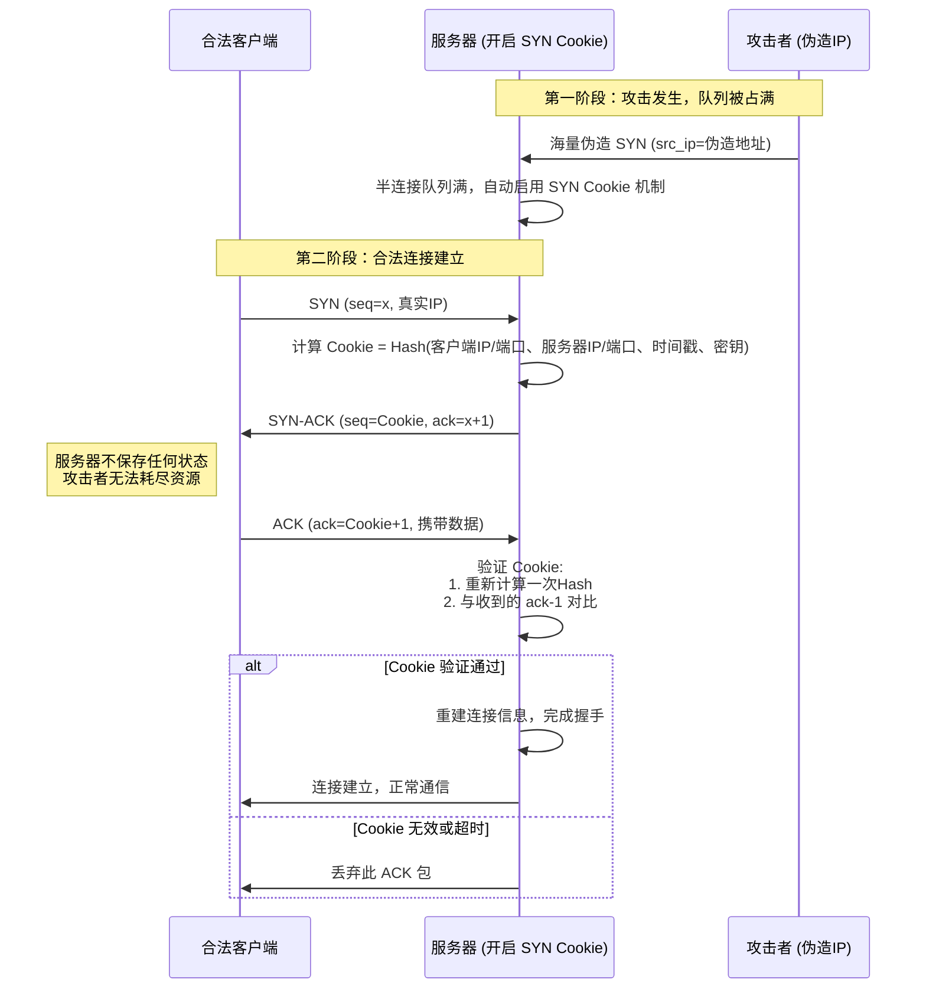
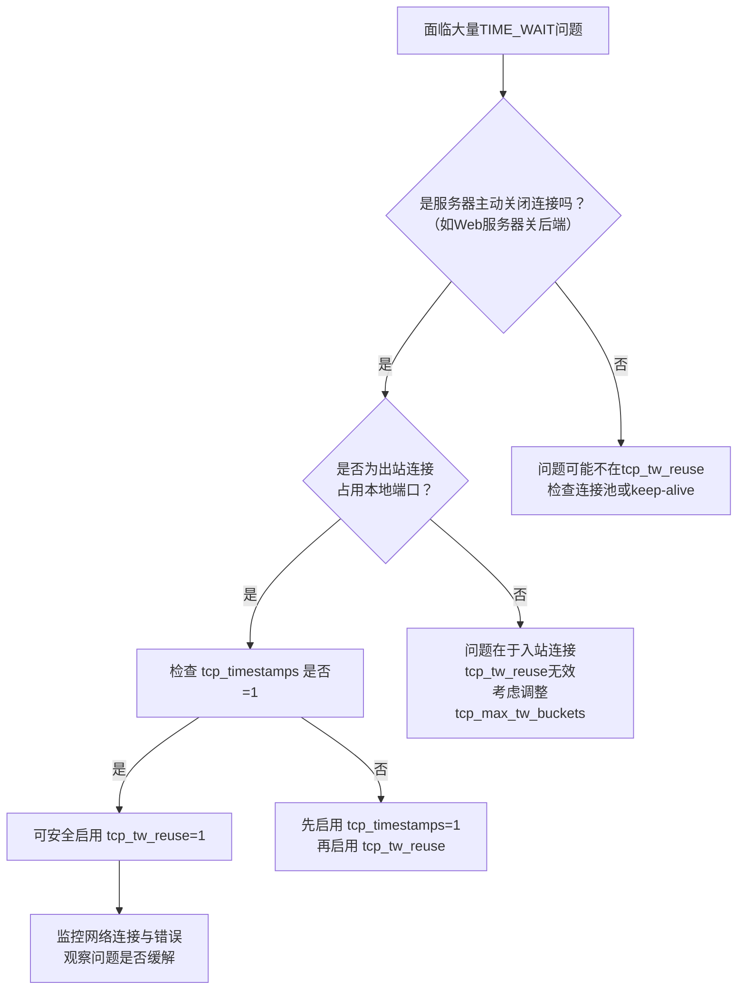
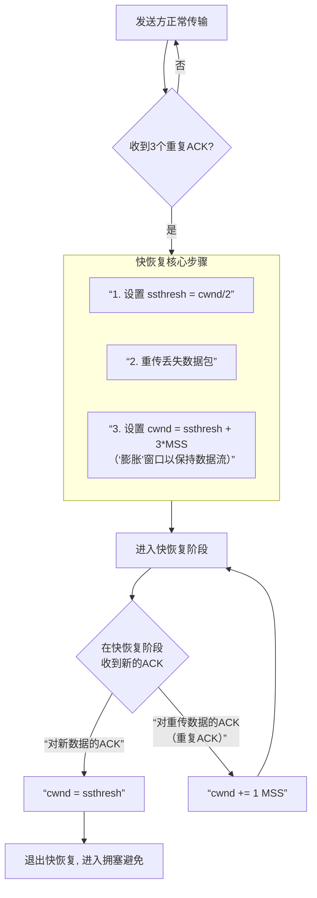

## 证书链
证书链采用分层结构（Root CA → 中间CA → 网站证书）绝非“自找麻烦”，而是为了在**安全性、灵活性和可管理性**之间取得至关重要的平衡。如果Root CA直接为每个网站颁发证书，反而会带来巨大的风险和不便。

核心原因如下：

1. **保护根证书的安全（最关键原因）**
    - **根证书**：是信任体系的终极基石，其私钥必须被**极度严格地保护**，通常存储在离线、物理隔离的硬件中，几乎从不直接使用。
    - 如果Root CA直接签发数百万张网站证书，其私钥就必须频繁在线使用，暴露在网络中的风险呈指数级增长。一旦根证书私钥泄露或受损，**整个信任体系将彻底崩溃**，所有由其签发的证书会立即失效，导致全球性的安全灾难。

2. **风险隔离与限制影响范围**
    - 引入**中间CA**相当于在根证书和终端证书之间设置了“防火墙”和“缓冲层”。
    - 如果某个中间CA的私钥因为日常频繁使用而不幸泄露或被吊销，只需撤销该中间CA即可。受影响的仅限于由该中间CA签发的证书，**根证书和其他中间CA不受影响**，整个PKI体系依然稳固。

3. **实现灵活的运营与管理**
    - 一个Root CA可以授权多个**中间CA**，每个中间CA可以服务于不同的**地区、品牌、业务类型或安全策略**（例如，不同强度的加密算法、不同的验证等级DV/OV/EV）。
    - 这使得证书的签发、管理和吊销策略可以更精细、更灵活，而不需要动辄修改根证书的策略。

4. **便于吊销和更新**
    - 证书和中间CA都有有效期，需要定期更新。中间CA的更新（重新签发）是常规操作，不影响根证书的长期稳定。如果所有证书都直接由根签发，更新流程将变得异常笨重。

**简单比喻：**
这就像一家大型银行。
- **根证书**：相当于银行的**总行金库钥匙**，被深藏在最安全的地方，绝不能轻易动用。
- **中间CA**：相当于各个**分行或业务部门的印章**，它们由总行授权，用于处理日常的客户业务（签发证书）。
- **网站证书**：相当于发给客户的**存单或合同**，上面盖的是分行的章。

如果每个客户的存单都要总行金库钥匙来盖印，那么银行根本无法运营，且钥匙一旦丢失，全行崩溃。而如果某个分行的印章出了问题，只需查封该分行，总行和其他分行照常运转。

**总结来说，证书链的分层设计是一种“牺牲部分简洁性，换取绝对安全性和可扩展性”的经典工程智慧。它确保了互联网SSL/TLS信任体系既能大规模应用，又能保持核心的稳健与安全。**

## 中间人攻击
您的理解非常准确。您描述的场景正是典型的“中间人攻击”（MITM）。**答案是：校园网、公司内网等环境，不仅可能存在，而且正是这类“受控中间人攻击”的高发场景。**

### 为什么校园网/内网更容易存在此问题？

这与“假基站”的非法攻击不同，内网的管理员**有能力且有时会合法部署**这种中间人代理，通常出于内容过滤、流量监控或安全审计等目的。其实现方式正是您描述的原理：

1. **强制安装根证书**：网络管理员会要求所有接入内网的设备**安装并信任一个由内网管理机构自己签发的“根证书”**。
2. **实施中间人拦截**：当您访问任何HTTPS网站（如百度、谷歌、网银）时，您的流量会先经过内网的代理服务器。
3. **动态签发证书**：代理服务器会**实时伪造一个**针对您访问的目标网站的证书，并用其内置的根证书私钥进行签名。
4. **完成双向握手**：由于您的设备已经信任了内网的根证书，因此会接受这个伪造的证书，从而与代理服务器成功建立TLS连接。同时，代理服务器再与真正的目标网站建立另一个TLS连接。至此，代理服务器成为了“中间人”，可以解密、查看并可能修改您的所有明文通信数据。

### 作为用户，如何识别和避免信息泄露？

核心原则是：**永远不要忽略浏览器的安全警告，并谨慎对待要求安装证书的请求。**

以下是具体的自保步骤：

1. **警惕并拒绝安装不明根证书（最关键的一步）**
    - 当连接校园网/公司网时，如果登录页面或网络提示要求您下载并安装一个“安全证书”、“根证书”或“CA证书”才能上网，**必须高度警惕**。一旦安装并信任此证书，该机构就能对您的HTTPS流量进行解密监控。
    - **应对方法**：除非您完全理解并接受其后果（例如在公司办公设备上），否则在个人设备上**不应安装**。如果必须安装才能上网，请使用后续方法保护敏感信息。

2. **绝对不要忽略浏览器证书警告**
    - 如果您**没有**安装过内网的根证书，但访问常见网站（如百度、淘宝）时，浏览器突然弹出“您的连接不是私密连接”、“证书无效”或“证书颁发者不受信任”等全屏红色警告，这极可能意味着您正在遭受主动的中间人攻击（可能是网络设备故障，也可能是恶意攻击）。
    - **应对方法**：**立即停止访问，不要点击“继续前往网站（不安全）”**。切勿在该页面输入任何密码、银行卡等敏感信息。

3. **敏感操作使用移动数据网络/VPN**
    - 当需要在校园网等环境中进行登录邮箱、网银转账、重要账号操作时，最安全的方法是**切换至手机的4G/5G移动数据网络**，完全避开本地网络环境。
    - 使用可信的**商业VPN服务**（需自行订阅）也是一个选择，它会在您的设备和目标网站之间建立加密隧道，即使内网代理也无法解密其内部内容。

4. **学会检查网站证书详情**
    - 您可以点击浏览器地址栏的锁图标，查看证书详情。重点检查：
        - **证书是否由公认的公共CA颁发**（如DigiCert, Let‘s Encrypt, Sectigo等），而不是一个陌生的、内网机构的名称。
        - **证书中的域名**：是否与您正在访问的网站完全一致。

5. **使用端到端加密的应用**
    - 对于即时通讯，使用像**Signal、WhatsApp**或开启“私密聊天”的Telegram等应用，它们采用端到端加密。这意味着消息仅在您和好友的设备上解密，即使流量被中间人截获，也无法破译内容。

**总结**：内网环境由于管理权限集中，确实存在实施HTTPS中间人监控的技术条件。作为用户，您的**第一道也是最重要的防线就是浏览器证书警告**，绝不绕过；第二是**谨慎安装根证书**；第三是对敏感操作**切换至可信网络**。通过这些方法，您可以最大程度地保护自己的信息不被泄漏。

## HTTP2 stream / message / frame

好的，这是一个非常核心的问题。HTTP/2 的高性能正是建立在 **Stream（流）、Message（消息）和 Frame（帧）** 这套精巧的二进制分层模型之上的。它们彻底改变了 HTTP/1.x 基于文本行交换数据的方式。

下面为您详细解析这三个核心概念及其协作关系。

### 核心概念分层

我们可以用一个生动的比喻来理解：想象一条**高速公路（HTTP/2 连接）**。

1. **Frame（帧） - 最小的“运输车辆”**
    * **定义**：HTTP/2 通信的最小单位。所有通信都以帧的形式进行。每个帧都有一个固定的**9字节头部**，其中包含其所属的 Stream ID、帧类型、标志位和长度等信息，后面跟着长度可变的载荷。
    * **类型**：有多种类型的帧，各司其职：
        * `HEADERS` 帧：携带 HTTP 头部。
        * `DATA` 帧：携带实际的请求或响应体。
        * `SETTINGS`、`WINDOW_UPDATE`、`PRIORITY`、`RST_STREAM` 等：用于连接管理、流量控制、优先级和流控制。
    * **关键**：帧是**二进制格式**的，计算机可以高效解析，这与 HTTP/1.x 的文本格式有天壤之别。

2. **Message（消息） - 逻辑上完整的“货物”**
    * **定义**：一个逻辑上的 HTTP 消息，对应 HTTP/1.x 中的一个**请求**或一个**响应**。
    * **组成**：一个消息由一个或多个帧**序列**构成。例如，一个 `POST` 请求消息通常由一个 `HEADERS` 帧（包含请求方法和头信息）和后面跟着的一个或多个 `DATA` 帧（包含请求体）组成。

3. **Stream（流） - 承载“货物”的“独立车道”**
    * **定义**：在 HTTP/2 连接内建立的**双向虚拟通道**，用于承载一对请求和响应消息。每个流都有一个唯一的整数 ID。
    * **特性**：
        * **多路复用**：一个连接上可以同时存在多个**并发的、交错的**流。这是解决 HTTP/1.x 队头阻塞的关键。
        * **独立性**：流在逻辑上是独立的。一个流的阻塞或终止（如 `RST_STREAM`）不会影响其他流。
        * **优先级**：流可以分配优先级和依赖关系，指导服务器优先处理重要资源。

### 三者关系与协作流程

**关系总结：一个连接（Connection）包含多个流（Stream），一个流承载一个或多个消息（Message），一个消息由一个或多个帧（Frame）组成。**

**一次完整请求-响应的流程示例：**

假设浏览器需要同时请求一个 HTML 页面 (`stream 1`) 和一个 CSS 文件 (`stream 3`)。

1. **建立连接**：客户端与服务器首先建立 TCP/TLS 连接，并协商升级到 HTTP/2。
2. **创建流并发送请求消息**：
    * 客户端在连接上打开 `stream 1`，发送一个由 `HEADERS` 帧（包含 `GET /index.html` 等信息）组成的**请求消息**。
    * 几乎同时，客户端打开 `stream 3`，发送另一个由 `HEADERS` 帧（包含 `GET /style.css`）组成的**请求消息**。
3. **多路复用与帧交错**：
    * 这些 `HEADERS` 帧被切割成二进制数据，**交错地**发送到同一个 TCP 连接上。服务器端可以根据帧头中的 `Stream ID` 正确地将它们重组到各自的流中。
4. **服务器处理与响应**：
    * 服务器可能先处理完 `style.css`。它会通过 `stream 3` 发回一个**响应消息**：先是一个 `HEADERS` 帧（包含 `200 OK` 状态码），后跟多个 `DATA` 帧（包含 CSS 文件内容）。
    * 同时，`index.html` 还在处理中。稍后，服务器通过 `stream 1` 发回其**响应消息**。
5. **客户端重组**：
    * 客户端收到交错到达的各类帧，根据 `Stream ID` 将它们分别归属到 `stream 1` 和 `stream 3`，并按照顺序将每个流中的帧重组为完整的 `HEADERS` 消息和 `DATA` 消息，最终交付给浏览器渲染引擎。

### 与 HTTP/1.x 的核心对比与优势

| 特性 | HTTP/1.1 | HTTP/2 |
| :--- | :--- | :--- |
| **基础单位** | 基于文本的“行”和“块”。 | **二进制帧**。 |
| **并发模型** | 多个 TCP 连接（域名分片）或管道化（有队头阻塞）。 | **单连接多路复用流**，彻底解决应用层队头阻塞。 |
| **头部传输** | 纯文本，每次请求重复发送。 | 使用 **HPACK 算法压缩**，且复用之前发送的头部字段，极大减少开销。 |
| **服务器推送** | 无法主动推送。 | 服务器可主动通过新建流向客户端推送资源。 |
| **优先级** | 有限支持（依赖浏览器调度）。 | 帧可携带优先级信息，指导服务器资源分配。 |

**总结来说，HTTP/2 通过引入“流”的概念实现了真正的多路复用，而“帧”作为统一的二进制载体使得这种复用变得高效可控，“消息”则保持了与 HTTP 语义的兼容。这套机制在单个连接上实现了并发、有序、可优先级的通信，是 HTTP/2 性能飞跃的基石。** 后续的 HTTP/3 将这一思路更进一步，用基于 UDP 的 QUIC 协议替代 TCP，在传输层也解决了队头阻塞问题。

## Quic
这是一个非常好的问题，也是理解现代网络协议栈的关键。简单直接的答案是：

**QUIC 是一个位于应用层和传输层之间的“融合层”协议，但官方定义和普遍共识将其归类为传输层协议。**

下面为您详细解释这种看似矛盾的说法：

### 1. 为什么说 QUIC 是传输层协议？

从**功能定位**和**协议栈位置**来看，QUIC 完全扮演了传输层的角色，旨在替代 TCP：

* **核心职责**：它直接建立在 UDP 之上，为应用程序提供**可靠的、有序的、拥塞控制的、安全的**数据流传输服务。这正是传输层协议的核心任务。
* **对应用层的接口**：应用程序（如 HTTP/3）使用 QUIC 的方式与使用 TCP 类似，都是通过 socket API 建立连接、发送和接收数据流。QUIC 对上层应用隐藏了所有复杂的传输细节。
* **官方定义**：互联网工程任务组（IETF）标准化的 **QUIC（RFC 9000）** 明确将其定义为一种传输协议。

### 2. 为什么又感觉它像应用层协议？

因为 QUIC 做了一个革命性的设计：**它将传统上分属于不同层的功能深度集成在了一起**。

| 传统 TCP/TLS/HTTP 栈 | **QUIC 协议** |
| :--- | :--- |
| **传输层 (TCP)**：负责可靠性、流量控制、拥塞控制。 | **集所有功能于一身**：在单个协议包中，同时处理了传输控制和安全加密。 |
| **安全层 (TLS)**：在 TCP 连接之上，通过额外握手建立加密。 | |
| **应用层 (HTTP/2)**：在安全的 TLS 通道上，实现多路复用（Stream）等语义。 | **内置了多路复用**：QUIC 原生支持多个独立的、有序的字节流（Stream），解决了 TCP 的队头阻塞问题。这个功能传统上是由 HTTP/2 在应用层实现的。 |

**关键集成点**：
* **加密不可分**：QUIC 将 TLS 1.3 加密直接整合到协议核心中。**所有 QUIC 头部和载荷在传输时默认就是加密的**（除了极少数用于建立连接的初始包）。这意味着中间设备（如路由器、防火墙）无法像解析 TCP 头部那样看到连接状态，从而提供了更好的隐私和抗干扰能力。
* **握手合一**：QUIC 将传输层握手（建立连接）和安全层握手（密钥协商）合并为 **1-RTT（首次连接）或 0-RTT（重连）** 的过程，极大降低了延迟。而 TCP + TLS 需要先后进行两次握手。

### 总结与类比

您可以这样理解：
* **传统的 TCP** 像一辆**普通货车**，负责把货物（数据）从A点可靠运到B点。如果需要安全运输，你得额外雇一个**押运员（TLS）** 坐在货车上。如果需要同时运多批小货，你还要自己设计一套**分箱规则（HTTP/2 的 Stream）**。
* **QUIC** 则像一辆**高度集成的装甲运钞车**。它出厂时就自带**装甲（加密）**，车厢内部天然设计了**多个独立的保险柜（多路复用 Stream）**，并且将发动、锁门、安排路线等所有操作流程合并成了一个更快的启动流程。它对外提供的核心服务仍然是“运输”，但它的内置功能已经远超一辆基础货车。

**结论**：从网络分层的经典模型看，QUIC 是一个**功能高度增强的、加密原生的新一代传输层协议**。它通过打破严格的层级界限，将安全、可靠传输和多路复用深度结合，从而在性能、安全性和灵活性上全面超越了“TCP + TLS”的传统组合。HTTP/3 就是运行在 QUIC 这个传输协议之上的应用层协议。

## 连接迁移
QUIC 的连接迁移是其革命性特性之一，它完美解决了移动互联网场景下的一个核心痛点：**当设备网络环境变化时（如从 Wi-Fi 切换到蜂窝网络），如何保持现有网络连接不断开，实现无缝漫游。**

下面为您详细解析其原理、过程和价值。

### 一、核心问题：TCP 的局限性

在 TCP 协议中，一个连接由 **四元组** 唯一标识：
`(源IP地址, 源端口, 目的IP地址, 目的端口)`

当你的手机从公司 Wi-Fi（IP 1）切换到移动数据（IP 2）时，四元组中的源IP发生了变化。对于服务器和中间网络设备（如NAT、防火墙）而言，使用新IP发来的数据包属于一个**全新的连接**，原有的 TCP 连接会因收不到应答而超时中断。这会导致正在进行的视频会议卡顿、游戏掉线、文件下载失败，必须重新连接。

### 二、QUIC 的解决方案：连接标识符

QUIC 打破了连接与四元组的强绑定。它引入了一个全局唯一的 **连接ID**。连接建立时，客户端和服务器会协商一组连接ID，用于唯一标识该连接。

* **连接ID** 是一个长度可变的字段，包含在 QUIC 数据包的头部。
* 即使客户端的网络地址（IP和端口）发生变化，只要它能在数据包中携带正确的**目标连接ID**，服务器就能识别出这是同一个逻辑连接，从而继续处理。

### 三、连接迁移的详细过程

假设一个 QUIC 连接已在 Wi-Fi（地址A）上建立，此时设备移动，网络切换至5G（地址B）。

1. **探测与路径验证**
    * 客户端使用新地址B向服务器发送数据包时，会使用一个新的**连接ID**（例如，之前协商备用的一个），以帮助服务器区分来自不同路径的数据。
    * 服务器收到来自新地址B、带有新连接ID的数据包后，不会立即将其与旧连接关联。为了防御地址欺骗攻击，QUIC 要求进行**路径验证**。
    * 服务器会向这个新地址B发送一个 **PATH_CHALLENGE** 帧（包含一个随机数）。
    * 客户端必须从同一地址B用 **PATH_RESPONSE** 帧（携带相同的随机数）进行回复。

2. **连接迁移确认**
    * 服务器验证 `PATH_RESPONSE` 成功后，便确认客户端确实拥有新地址B。此时，服务器正式将连接的主要通信路径从地址A更新为地址B。
    * 后续的通信将主要在新路径（地址B）上进行。旧路径（地址A）可能暂时保留，以备不时之需。

3. **应用层无感知**
    * 在整个迁移过程中，**上层的应用逻辑（如 HTTP/3 流）完全不受影响**。所有已打开的流、正在传输的数据、加密上下文、拥塞控制状态都得以保持。
    * 对于应用来说，连接从未中断，只是发生了一次轻微的延迟抖动。

### 四、关键优势与价值

| 特性 | TCP | QUIC |
| :--- | :--- | :--- |
| **连接标识** | 依赖四元组（IP:Port） | 依赖连接ID，与IP解耦 |
| **网络切换** | 连接必然中断，需重连 | **连接保持，无缝迁移** |
| **用户体验** | 视频卡顿、游戏掉线、重登录 | 通话不中断、游戏不掉线、下载继续 |
| **NAT 重生** | 移动网络 NAT 超时后连接失效 | 连接ID不变，可重新关联 |

**核心价值体现：**
1. **对用户**：在乘坐地铁、穿梭于不同建筑时，后台音乐播放、视频通话、云同步等服务的连续性得到极大提升。
2. **对开发者**：无需在应用层实现复杂的心跳、重连和状态同步逻辑，QUIC 在传输层原生提供了稳定连接。
3. **对协议本身**：实现了真正的“连接即会话”，使连接成为一个在设备上持久存在的逻辑实体，而非绑死在某个网络端口上。

### 五、总结

QUIC 的连接迁移，本质上是将连接标识从**网络层地址**提升到了**传输层协议字段**。通过**连接ID**和**路径验证**机制，它智能地识别并验证网络路径的变化，在确保安全的前提下，将活跃连接平滑地迁移到新路径上。

这不仅是性能优化，更是架构理念的飞跃：它让网络连接第一次真正跟上了移动设备的步伐，为无处不在的稳定互联网服务奠定了基石。HTTP/3 正是构建在这一强大传输能力之上的应用层协议。

## SYN Cookie 
**SYN Cookie** 是一种用于抵御 **SYN洪水攻击** 的网络安全防御技术，由**Daniel J. Bernstein**在1996年提出。其核心思想是：**在TCP三次握手过程中，服务器不再为未完成的连接（半开连接）分配任何内存资源，而是通过一种加密算法生成一个“凭证”发送给客户端，仅在客户端合法返回时才正式建立连接。**

要完全理解它，我们需要从它要解决的问题说起。

---

### 一、问题起源：TCP三次握手与SYN洪水攻击

1. **正常握手**：
    * **客户端** 发送 `SYN` 包（我要连接）。
    * **服务器** 收到后，在内存中创建一个 **传输控制块** 来记录这个“半开连接”，然后回复 `SYN-ACK` 包（我收到了，同意连接）。
    * **客户端** 最后回复 `ACK` 包（好的，连接建立）。

2. **SYN洪水攻击**：
    * 攻击者**伪造大量虚假的IP地址**，向服务器发送海量的 `SYN` 包。
    * 服务器为每一个 `SYN` 都创建连接记录，并等待第三个 `ACK` 包。
    * 由于客户端的IP是伪造的，`ACK` 包永远不会到来。这些“半开连接”会占用服务器的内存队列（**半连接队列**），直到超时（通常30秒到2分钟）才被清除。
    * 当海量伪造的 `SYN` 迅速填满这个队列后，**服务器就无法再响应任何新的合法连接请求**，导致服务拒绝。

---

### 二、SYN Cookie 的工作原理

SYN Cookie 的精妙之处在于，**服务器在回复 `SYN-ACK` 时，不保存任何连接状态**。它把连接信息加密后编码在 `SYN-ACK` 包的**初始序列号** 中，这个序列号就是“Cookie”。

**工作流程如下**：



**关键步骤解析**：

1. **Cookie生成（当服务器半连接队列满或主动启用时）**：
    * 服务器收到 `SYN` 包后，**并不在内存中创建连接记录**。
    * 它使用一个只有自己知道的**密钥**，对以下信息进行哈希计算（如SHA1、MD5）：
        * 客户端IP和端口
        * 服务器IP和端口
        * 一个缓慢递增的时间戳（如每64秒增加1）
    * 将哈希值的一部分（例如前24位），结合一些基本的连接参数（如MSS值），编码成一个32位的数字，这个数字就作为 `SYN-ACK` 包的**初始序列号** 发回给客户端。这就是 **SYN Cookie**。

2. **客户端响应**：
    * 合法的客户端会按照TCP协议，回复一个 `ACK` 包，其中的**确认号** 等于收到的**序列号+1**。也就是说，这个 `ACK` 包会把服务器发来的Cookie值（加1后）原样带回来。

3. **连接重建与验证**：
    * 服务器收到 `ACK` 包后，从中提取出 `确认号-1`，得到之前发出的Cookie值。
    * 服务器用相同的算法，根据当前看到的客户端IP、端口和时间戳，**重新计算一次哈希值**。
    * **将重新计算的值与客户端返回的Cookie值进行比对**：
        * **如果匹配**：说明这是一个合法的、未被伪造的ACK（因为伪造者无法知道密钥和算法，也无法在Cookie过期前返回正确值）。服务器此时**才正式分配内存，创建完整的连接**，握手完成。
        * **如果不匹配或超时**：直接丢弃此ACK包，对服务器无任何资源消耗。

---

### 三、SYN Cookie 的优缺点

| 优点 | 缺点 |
| :--- | :--- |
| **1. 完全无状态防御**：不消耗服务器内存，从根本上免疫了半连接队列耗尽的攻击。 | **1. 丢失TCP选项信息**：在初始SYN-ACK中，无法协商诸如**窗口缩放因子、SACK选择性确认、时间戳**等高级TCP选项，因为这些信息无法编码进有限的Cookie中。这可能导致连接性能下降。 |
| **2. 配置简单，效果显著**：通常是内核的一个可配置选项，启用后能有效抵御大规模SYN洪水。 | **2. 密码学计算开销**：每个连接需要两次哈希计算（生成和验证），在极高连接请求时增加CPU负担。 |
| **3. 对客户端透明**：合法客户端无需任何修改。 | **3. 严格的超时机制**：Cookie通常有时间戳，如果客户端ACK回复太慢（如网络延迟高），连接会被拒绝。 |

---

### 四、实际应用

* **Linux系统**：通过 `net.ipv4.tcp_syncookies` 内核参数控制。
    * `=0`：关闭。
    * `=1`：仅在半连接队列满时启用（推荐）。
    * `=2`：无条件启用。
* **现代操作系统**：如FreeBSD、Windows Server等均有类似实现。
* **最佳实践**：通常作为**最后一道防线**。首先应通过**调大半连接队列大小**、**缩短SYN超时时间**、**结合防火墙或DDoS清洗设备**等方式来缓解攻击，在资源耗尽时由SYN Cookie提供最后的保护。

**总结来说，SYN Cookie是一种“先尝后买”的智能防御机制。** 它让服务器在握手完成前不投入任何成本，通过一个加密的“收据”来验证客户端的真实性，从而优雅地解决了资源耗尽型攻击的难题，是网络安全中“零信任”思想的早期杰出实践。

## tcp_tw_reuse
`net.ipv4.tcp_tw_reuse` 是一个 **Linux 内核网络参数**，用于**优化 TCP 连接的 TIME_WAIT 状态处理**，允许内核在安全的前提下，**复用处于 TIME_WAIT 状态的套接字（端口）来发起新的出站连接**。

要深入理解它，必须从它要解决的 **TIME_WAIT 状态** 说起。

---

### 一、核心问题：为什么需要 TIME_WAIT？

当 TCP 连接**主动关闭**的一方（先发送 FIN 包的一方）收到对端的 FIN-ACK 后，会进入 **TIME_WAIT** 状态。这个状态会持续 **2MSL** 的时间（MSL 是报文最大生存时间，在 Linux 中通常为 60 秒，所以 TIME_WAIT 大约持续 120 秒）。

**TIME_WAIT 存在的两个核心目的：**
1. **可靠地终止连接**：确保最后一个 ACK 报文能到达对端。如果 ACK 丢失，对端会重发 FIN，此时处于 TIME_WAIT 状态的本机可以重新回应 ACK。
2. **让旧连接的“迷途报文”在网络中消逝**：防止具有相同四元组（源IP、源端口、目的IP、目的端口）的**新连接**，收到属于上一个**旧连接**的延迟报文，造成数据混乱。

**TIME_WAIT 带来的副作用：**
对于高并发的短连接服务器（如 Web 服务器、API 网关），如果它们**主动关闭**了大量连接，会导致服务器上积累大量处于 TIME_WAIT 状态的连接。每个 TIME_WAIT 连接都占用着一个本地端口。当可用端口耗尽时，**新的出站连接将无法建立**，出现 `Cannot assign requested address` 错误。

---

### 二、`tcp_tw_reuse` 的工作原理：如何安全地复用？

`tcp_tw_reuse` 的默认值通常是 `0`（禁用）。当设置为 `1` 时，它允许内核在**发起新的出站连接**时，复用处于 TIME_WAIT 状态的套接字。

**它的安全复用依赖于一个关键技术：TCP 时间戳选项**。

**工作流程与安全验证：**
1. **前提条件**：必须启用 `net.ipv4.tcp_timestamps = 1`（现代 Linux 默认开启）。时间戳为每个 TCP 报文提供了一个单调递增的序列。
2. **复用决策**：当内核需要创建一个新的出站连接（`connect` 系统调用），而所有可用端口都处于 TIME_WAIT 状态时，它会检查 `tcp_tw_reuse` 设置。
3. **关键的安全检查**：内核会对比 **“旧连接（TIME_WAIT 状态）最后收到报文的时间戳”** 和 **“新连接将要发送的初始序列号（ISN）对应的时间戳”**。
    * 规则是：**新连接的时间戳必须严格大于旧连接最后收到报文的时间戳**。
4. **这个检查的意义**：
    * 如果新连接的时间戳更大，说明从旧连接结束到现在，时间已经向前推进了足够多（至少 1 个时钟滴答）。
    * 这极大地降低了**旧连接的延迟报文**干扰新连接的可能性，因为那个延迟报文的时间戳必然小于新连接的时间戳，内核可以轻易识别并丢弃它。

**简单来说，`tcp_tw_reuse` 的逻辑是：** “如果时间已经过去了一小段，那么上一个连接的‘幽灵报文’应该已经消失了，我可以安全地重复使用这个端口。”

---

### 三、重要特性与限制

| 特性 | 说明 |
| :--- | :--- |
| **作用方向** | **仅对出站连接有效**（即 `connect` 方）。对于入站连接（`accept`），TIME_WAIT 状态的处理由 `tcp_tw_recycle`（已废弃）或连接重用逻辑控制。 |
| **依赖选项** | **必须启用 `tcp_timestamps`**。没有时间戳，就无法进行安全判断，该参数无效。 |
| **与 `tcp_tw_recycle` 的区别** | **切勿混淆！** `tcp_tw_recycle` 更激进，它允许快速回收 TIME_WAIT 连接，但基于时间戳的 PAWS 机制在 NAT 环境下会导致严重问题，**在 Linux 4.12+ 内核中已被移除。`tcp_tw_reuse` 是更安全的选择。** |
| **适用场景** | 主要适用于**需要频繁创建大量出站短连接**的客户端或中间件（如爬虫、微服务客户端、代理服务器）。 |

---

### 四、如何设置与验证

1. **查看当前设置**：
    ```bash
    sysctl net.ipv4.tcp_tw_reuse
    cat /proc/sys/net/ipv4/tcp_tw_reuse
    ```

2. **临时启用**：
    ```bash
    sysctl -w net.ipv4.tcp_tw_reuse=1
    ```

3. **永久启用**：编辑 `/etc/sysctl.conf`，添加：
    ```conf
    net.ipv4.tcp_tw_reuse = 1
    ```
    然后执行 `sysctl -p` 生效。

4. **验证时间戳是否开启**（必须）：
    ```bash
    sysctl net.ipv4.tcp_timestamps # 确保为 1
    ```

---

### 五、决策流程图：是否应该启用？



### 六、总结与最佳实践

* **`tcp_tw_reuse` 是什么**：一个**出站连接**的 TIME_WAIT 端口**安全复用**优化。
* **核心机制**：依赖 **TCP 时间戳** 来确保新连接的报文序列比任何旧连接的延迟报文都“更新”，从而避免数据混淆。
* **主要用途**：解决高并发短连接场景下，客户端或发起端因端口耗尽而无法建立新连接的问题。
* **重要前提**：必须与 `net.ipv4.tcp_timestamps = 1` **同时启用**。
* **注意事项**：
    * 对于服务器处理**入站连接**的 TIME_WAIT 问题，此参数无效。应优化服务架构，避免服务器主动关闭连接（让客户端主动关），或使用连接池、长连接。
    * 在复杂的 NAT 网络环境中，时间戳机制理论上仍存在极低概率的冲突风险，但实践中 `tcp_tw_reuse` 被广泛认为是安全可靠的。

**最终建议**：如果你的应用是**大量短连的客户端**（例如，一个需要频繁调用其他服务的微服务实例），并且遇到了端口不足的错误，在确保 `tcp_timestamps` 开启的前提下，启用 `tcp_tw_reuse` 是一个标准且有效的优化手段。对于服务器角色，应优先考虑架构优化。

## tcp_timestamps

不是的，这是一个常见的误解。**TCP 序列号（seq）和时间戳是两个完全独立、共存的字段。**

当 `net.ipv4.tcp_timestamps = 1` 时，TCP 在通信时会**启用一个名为“时间戳”的 TCP 选项**，但它**不会改变序列号（seq）本身的含义和生成规则**。

### 核心区别

| 特性 | TCP 序列号 | TCP 时间戳选项 |
| :--- | :--- | :--- |
| **本质** | TCP 报文段的**核心、必选字段**，存在于**标准 TCP 头**中。 | TCP 的一个**可选扩展字段**，在标准 TCP 头之后，如果启用则携带。 |
| **作用** | **保证数据的可靠、有序传输**。用于确认哪些数据已被接收、数据包的顺序排列、以及检测重复包。 | **1. 更精确计算 RTT**；<br>**2. 防止序列号回绕**；<br>**3. 为 `tcp_tw_reuse` 等机制提供安全判断依据**。 |
| **生成规则** | 由内核根据复杂算法生成一个**随机初始值**，之后随数据字节数递增。 | 取自系统启动后单调递增的时钟（通常基于 `jiffies` 或更精确的时钟源）。 |
| **在报文中的位置** | TCP 头部的固定位置。 | TCP 头部之后的“选项”部分。 |

### 工作流程详解

当 `tcp_timestamps` 启用后，一个 TCP 报文的构造如下：

1. **生成标准 TCP 头**：
    * 内核照常生成 **32 位的序列号**。例如，初始序列号是 `ISN = 123456789`。
    * 这个 `seq` 用于标识该报文段中第一个数据字节的编号。

2. **添加时间戳选项**：
    * **在 TCP 头的“选项”字段中，附加两个 32 位的值**：
        * **TSval（时间戳值）**：发送方放入的当前时钟值。
        * **TSecr（时间戳回显）**：通常用于回显对方最近收到的一个 `TSval`。在握手阶段，第一个 `SYN` 包的 `TSecr` 为 0。

3. **报文示例**：
    * **客户端发送 `SYN`**：
        * `seq = 客户端随机生成的 ISN`
        * `TSval = 客户端的当前时间戳 T_cli`
        * `TSecr = 0`
    * **服务器回复 `SYN-ACK`**：
        * `seq = 服务器随机生成的 ISN`
        * `ack = 客户端的 seq + 1`
        * `TSval = 服务器的当前时间戳 T_srv`
        * `TSecr = T_cli` （回显客户端的时间戳）
    * **客户端发送 `ACK` 及数据**：
        * `seq = 客户端 ISN + 1`
        * `ack = 服务器 ISN + 1`
        * `TSval = 客户端新的时间戳 T_cli_new`
        * `TSecr = T_srv` （回显服务器的时间戳）

### 为什么需要时间戳？

1. **精确的 RTT 测量**：通过回显机制，可以精确计算每个 `ACK` 的往返时间，而不受重传或延迟确认的影响。
2. **防止序列号回绕**：在高速网络（如 10GbE+）中，32 位的序列号可能很快被用完并“回绕”到小值。时间戳提供了一个更长的上下文，帮助区分新旧数据包。
3. **支持 `tcp_tw_reuse`**：正如上一个问题所解释的，`tcp_tw_reuse` 依赖时间戳来判断新连接的报文是否比旧连接的“幽灵报文”更新，从而决定能否安全复用端口。**它比较的是时间戳 `TSval`，而不是序列号 `seq`。**

### 总结

**`net.ipv4.tcp_timestamps = 1` 并不会让 seq 变成时间戳。**
它是在标准的 TCP 通信之上，**额外附加了一个时间戳选项**。序列号（seq）仍然独立地、按照其原有规则工作，负责数据传输的可靠性。而时间戳作为一个辅助工具，负责性能优化和连接管理安全。

简单来说：**序列号是“数据本身的身份证号”，时间戳是“数据发送时刻的邮戳”**。两者各司其职，共同工作。

## Nagle
**Nagle算法**是一种由**John Nagle**在1984年提出的TCP拥塞控制算法，旨在**减少网络中微小数据包的数量**，提高网络传输效率。其核心思想是：**通过延迟发送小数据包，将它们合并成更大的数据块一次性发送**。

### 一、产生背景：小数据包问题
在交互式应用（如Telnet、SSH）中，用户每次击键都会产生一个数据包。这些数据包可能只有**1字节的有效载荷**，却要加上40字节的TCP/IP头部（20字节TCP头 + 20字节IP头），导致**网络利用率极低**，并可能引发网络拥塞。这种现象被称为“**微小报文段问题**”。

### 二、算法核心规则
Nagle算法的规则非常简单，可以用一句话概括：
> **当发送方有未确认的已发数据时，后续的小数据（小于MSS）必须等待，直到收到ACK或累积到足够大的数据块。**

具体决策流程如下：
1. 如果发送缓冲区中**有尚未被确认的数据**（即已发送但未收到ACK），并且**待发送的数据量小于一个MSS**，则发送方会**延迟发送**，继续等待更多数据到来。
2. 一旦收到之前数据的**ACK**，发送方就会立即将缓冲区中的所有数据（无论大小）发送出去。
3. 如果发送方**没有未确认的数据**，那么即使数据量很小，也可以**立即发送**。

### 三、工作示例
假设MSS为1460字节，客户端依次发送以下数据：
1. 发送 `"H"`（1字节）→ 没有未确认数据，**立即发送**。
2. 发送 `"e"`（1字节）→ 此时“H”的ACK尚未返回，有未确认数据且新数据小，**延迟发送**。
3. 发送 `"l"`（1字节）→ 继续延迟。
4. 收到“H”的ACK → 立即将缓冲区中的 `"el"`（2字节）一起发送。
5. 发送 `"l"`（1字节）→ 没有未确认数据，立即发送。

**效果**：原本需要发送4个独立数据包，合并后只需3个，减少了网络负担。

### 四、与“延迟ACK”的致命交互
Nagle算法常与TCP的另一个优化机制 **“延迟ACK”** 产生负面交互，导致显著的通信延迟：
* **延迟ACK**：接收方为了减少ACK数量，不会对每个数据包立即回复ACK，而是：
    * 等待最多**200-500毫秒**，看是否有数据要捎带ACK一起回复。
    * 或者每收到**2个完整的数据包**才回复一个ACK。
* **交互死锁**：
    1. 发送方发出一个小数据包（如查询请求）。
    2. 接收方启用延迟ACK，等待200毫秒或自己的数据来捎带ACK。
    3. 发送方因未收到ACK，根据Nagle算法，必须等待ACK才能发送下一个数据包。
    4. 双方互相等待，造成**最高达500毫秒的人为延迟**。

这种延迟对实时性要求高的应用（如在线游戏、远程桌面、金融交易）是灾难性的。

### 五、优缺点对比

| 优点 | 缺点 |
| :--- | :--- |
| **显著减少网络中小数据包的数量**，降低网络拥塞风险。 | **增加数据传输的延迟**，尤其是与延迟ACK结合时。 |
| **提高网络带宽利用率**，减少协议头部开销。 | **降低实时应用的响应速度**，影响用户体验。 |
| **减轻接收方的处理压力**（更少的数据包意味着更少的中断）。 | **可能导致缓冲区阻塞**，影响后续数据的及时发送。 |
| **算法简单，实现开销小**。 | **在现代高速网络中，其收益可能小于代价**。 |

### 六、适用与禁用场景

**适用场景**：
* **高延迟、低带宽的网络**（如早期的广域网、卫星链路）。
* **批量数据传输**，且对实时性要求不高的应用（如文件传输）。
* **嵌入式系统或资源受限环境**，需要减少处理开销。

**必须禁用的场景**：
* **实时交互应用**：在线游戏（FPS、MOBA）、远程桌面（RDP、VNC）、音视频通话。
* **低延迟交易系统**：金融高频交易、实时竞价。
* **使用“写-写-读”模式的应用**：如X Window系统、某些数据库协议，其中多个小写操作需要立即发出以触发服务器响应。

### 七、如何禁用Nagle算法
在套接字编程中，通过设置 **`TCP_NODELAY`** 选项来禁用Nagle算法。

**C语言示例**：
```c
int flag = 1; // 1表示禁用Nagle算法
setsockopt(sock, IPPROTO_TCP, TCP_NODELAY, (char *)&flag, sizeof(int));
```

**Linux系统全局调整**（不推荐，通常应用层控制）：
```bash
# 查看当前设置
sysctl net.ipv4.tcp_no_delay
# 临时启用（禁用Nagle）
sysctl -w net.ipv4.tcp_no_delay=1
```

### 八、现代替代与相关技术
1. **TCP_CORK**：更激进的合并算法。它像“瓶塞”一样阻塞数据，直到应用程序明确“拔掉塞子”（取消CORK选项），然后将所有累积数据一次性发送。适用于HTTP服务器发送头部和主体时合并。
2. **MSG_MORE**：标志：在`send()`调用中提示内核还有更多数据要发送，允许内核适当合并。
3. **自动优化**：现代TCP实现（如Linux）在某些场景下会自动优化，例如当`TCP_NODELAY`设置后，对于连续的小写操作可能进行适当合并。

### 总结
Nagle算法是**网络效率与传输延迟之间的经典权衡**。在带宽稀缺、延迟不敏感的环境中，它是宝贵的优化手段；但在当今低延迟、高带宽的网络环境中，尤其是对于交互式应用，它往往成为**需要被禁用的性能障碍**。理解其原理和影响，根据应用特点明智地选择启用或禁用，是网络编程和系统调优的基本功。

## 快恢复

**TCP 快恢复**是 TCP 拥塞控制算法中的一个核心改进阶段，它与 **快重传** 机制协同工作，旨在**更高效、更温和地从数据包丢失中恢复，避免连接吞吐量出现断崖式下跌**。

要理解快恢复，必须将其置于经典的 TCP 拥塞控制框架中，并与旧有的行为进行对比。

---

### 一、背景：没有快恢复时的问题

在原始的 **TCP Tahoe** 算法中，一旦发生数据包丢失（无论是超时还是收到3个重复ACK），拥塞控制会采取非常保守的策略：
1. 将 **拥塞窗口** 重置为 **1个MSS**。
2. 重新进入 **慢启动** 阶段。

**这种方式的缺陷**：当网络只是发生**轻微拥塞或随机丢包**（而非严重拥塞）时，这种“一刀切”的激进回退会导致网络利用率瞬间暴跌，吞吐量呈锯齿状剧烈震荡，恢复速度缓慢。

快恢复的核心理念是：**通过重复ACK来检测的丢包，通常只是单个数据包丢失，网络尚有传输能力。因此，不应过度反应，而应适度调整窗口并保持数据流。**

---

### 二、快恢复的工作原理

快恢复并非独立算法，而是 **“快重传 + 快恢复”** 组合流程的后半部分。其完整流程如下：



**流程详解**：

1. **触发条件**：发送方连续收到 **3个重复的ACK**。这表明：
    * 有一个数据包可能丢失了。
    * 后续的数据包已经到达接收方，网络管道并未完全中断。

2. **执行快重传**：发送方**立即重传**那个被认为丢失的数据包，而不必等待重传定时器超时。

3. **进入快恢复阶段并调整窗口**：
    * **`ssthresh = cwnd / 2`**：将慢启动阈值设置为当前拥塞窗口的一半，为后续恢复设定一个安全基线。
    * **`cwnd = ssthresh + 3 * MSS`**：这是快恢复的**关键操作**。将拥塞窗口设置为新的阈值加上“3个数据包”。这里的“3”代表网络中已离开但未被确认的数据包数量（即触发了快重传的那3个重复ACK对应的数据）。**“膨胀”窗口的目的是确保在等待重传确认期间，发送方可以继续发送新的数据包，保持管道充盈。**

4. **快恢复阶段内的行为**：
    * 每当收到一个**重复的ACK**，说明又有一个数据包离开了网络到达了接收方，发送方就将 `cwnd` 增加 1个MSS，并**立即发送一个新数据包**（如果允许）。这保持了数据流。
    * 当收到一个**对新数据的ACK**（即确认了重传包及之后的所有数据），表明丢失的数据包已被成功修复，发送方将 `cwnd` 设置为 `ssthresh`，然后**退出快恢复阶段，进入拥塞避免阶段**。

---

### 三、与传统恢复（TCP Tahoe）的对比

| 特性 | **传统恢复（TCP Tahoe）** | **快恢复（TCP Reno及以后）** |
| :--- | :--- | :--- |
| **触发后动作** | 无论何种丢包，`cwnd` 直接降为 **1 MSS**。 | 仅对超时丢包降为1；对重复ACK丢包，`cwnd` 降至 **`ssthresh + 3*MSS`**。 |
| **恢复速度** | 慢。必须从慢启动重新开始，指数增长至 `ssthresh`。 | 快。直接进入拥塞避免阶段，线性增长。 |
| **网络利用率** | 丢包后利用率骤降，产生锯齿状吞吐量。 | 丢包后仍能保持较高吞吐量，曲线更平滑。 |
| **哲学** | 保守。任何丢包都视为严重拥塞。 | 优化。区分丢包类型，对单个包丢失反应温和。 |

---

### 四、快恢复的意义与局限性

**意义**：
1. **显著提升性能**：在发生随机丢包时，避免了不必要的慢启动，大幅提高了TCP连接的平均吞吐量。
2. **更智能的拥塞响应**：标志着TCP拥塞控制从“粗暴”走向“精细”，能够更好地区分网络拥塞程度。
3. **现代TCP的基石**：它是后续更先进算法（如 **TCP NewReno**、**SACK**、**CUBIC**）的基础。

**局限性**：
1. **多个数据包丢失时的低效**：标准的快恢复（如TCP Reno）在一个RTT内只能修复一个丢失的数据包。如果同一窗口内有多个包丢失，可能导致多次进入快恢复或最终超时，性能下降。**TCP NewReno** 对此进行了改进。
2. **依赖重复ACK**：对于尾部丢包（窗口末尾的包丢失）或缓冲区极大导致无法产生3个重复ACK的情况，快恢复无法触发，仍需依赖超时重传。

### 五、在现代系统中的体现
* **Linux 默认拥塞控制算法**（如 `cubic`）完整包含了快恢复机制。
* 可以通过 `ss -i` 命令查看连接的拥塞控制状态。
* 在Wireshark等抓包工具中，可以观察到重复ACK、快速重传以及后续窗口调整的过程。

**总结来说，TCP快恢复是网络协议设计中的一个经典优化。** 它通过“快速重传”及时修补丢包，并通过“温和的窗口调整”取代“激进的窗口重置”，使得TCP连接能够在遭遇轻微拥塞时，像一名经验丰富的司机那样“点刹”而非“急刹”，从而在保持网络稳定性的前提下，最大限度地提升了传输效率。

## IPv6 无状态自动配置
您描述的是 IPv6 的 **“无状态地址自动配置”** 核心特性。它允许网络设备**仅通过接收路由器广播的信息，就自主生成一个全局可路由的IP地址**，完全无需 DHCP 服务器的参与。

其实现依赖于 IPv6 协议栈的三大核心机制协同工作：

### 一、实现自动配置的三大步骤

**第1步：路由器发现与获取网络前缀**
1. 主机启动后，首先会生成一个 **“链路本地地址”**（格式为 `fe80::/10` + 接口标识符）。该地址仅用于同一物理链路上的通信。
2. 主机向**所有路由器**组播地址（`ff02::2`）发送 **“路由器请求”** 报文。
3. 链路上的路由器会定期或响应请求，向**所有节点**组播地址（`ff02::1`）发送 **“路由器通告”** 报文。该报文中包含最关键的信息：**网络前缀**（例如 `2001:db8:abcd::/64`）和其他配置参数。

**第2步：自主生成全球单播地址**
主机收到路由器通告后，将执行一个简单的“拼接”操作：
```
全球单播地址 = 64位网络前缀 + 64位接口标识符
```
**接口标识符的生成主要有两种方式：**
* **基于 EUI-64**：将网卡的 48 位 MAC 地址转换为 64 位格式（在中间插入 `FFFE`）。
* **隐私扩展（默认）**：为了防追踪，现代系统（如 Windows、Linux、iOS）会**随机生成**一个临时接口标识符，并定期更换。

**第3步：重复地址检测**
在正式使用新生成的地址前，主机会通过 **NDP 的“邻居请求”** 报文在链路上询问：“这个地址有人用吗？” 如果收到响应，则说明地址冲突，需要重新生成；如果没有响应，主机就将该地址分配给自己的接口。

---

### 二、无状态自动配置 vs. 有状态自动配置（DHCPv6）

IPv6 设计了两种地址配置模式，您提到的“无需DHCP”属于前者：

| 特性 | **无状态地址自动配置** | **有状态自动配置** |
| :--- | :--- | :--- |
| **核心机制** | 主机根据**路由器通告的前缀**自主生成地址。 | 依赖 **DHCPv6 服务器** 统一分配和管理地址。 |
| **地址管理** | **无状态**。路由器不记录哪个地址分配给了哪台主机。 | **有状态**。DHCPv6服务器维护地址租约状态。 |
| **获取的信息** | **IP地址、默认网关、网络参数**（如MTU、跳数限制）。 | **IP地址、DNS服务器、域名等所有网络配置**。 |
| **适用场景** | 对管理要求简单、注重即插即用的网络（如家庭、小型办公）。 | 需要集中管理、审计、或分配DNS等额外信息的网络（如企业、校园）。 |

**在实际网络中，两者常结合使用（称为“无状态DHCPv6”）**：主机通过SLAAC获取IP地址和网关，同时通过DHCPv6服务器获取DNS服务器地址等其他配置信息。

---

### 三、与 IPv4 “自动配置” 的本质区别

您可能联想到 IPv4 的 `169.254.0.0/16`（APIPA）地址，但两者有根本不同：

| 特性 | **IPv6 无状态自动配置** | **IPv4 链路本地地址** |
| :--- | :--- | :--- |
| **地址类型** | 可生成**全局可路由的公网地址**。 | 仅是**链路本地地址**，无法被路由器转发。 |
| **功能性** | 可实现完整的互联网访问。 | 仅能在同一网段内通信，无法上网。 |
| **机制** | 基于与路由器的标准协议交互。 | 是DHCP失败后的备用方案，基于冲突检测。 |

### 四、优势与注意事项

**优势：**
* **即插即用**：设备接入网络即可自动获得地址，极大简化部署。
* **高可靠性**：不依赖单一服务器，网络更健壮。
* **易于管理**：只需管理路由器前缀，即可管理整个网络地址。
* **支持移动性**：设备在不同网络间移动时，能快速生成新地址。

**注意事项：**
* **隐私考虑**：基于MAC地址的EUI-64格式会暴露硬件标识，因此**隐私扩展已成为主流和默认选项**。
* **无状态性**：网络管理员无法在路由器上直接看到IP地址与主机的精确对应关系（需结合其他工具）。
* **需配合其他服务**：SLAAC本身不分配DNS，需通过路由器通告或DHCPv6补充。

### 总结
IPv6 的“无状态地址自动配置”是一项精心设计的基础协议功能。它通过 **路由器通告网络前缀** + **主机自主生成接口标识符** + **重复地址检测** 这一套组合机制，实现了真正意义上的“即插即用”联网。这不仅是IPv6地址海量化的自然结果，也代表了网络设计向更分布式、更健壮方向的演进。

## Ipv6 ::
这是一个非常好的问题，它触及了IPv6地址表示法的核心设计。简单来说，**这个规则是为了确保地址缩写的结果是唯一且明确的**。如果允许出现多次“::”，将会导致地址解析产生歧义，无法确定原始地址。

我们可以用一个类比来理解：**“::” 就像一个省略号（…），它代表“这里省略了一串连续的0”。如果一篇文章里出现多个省略号，你就无法确定每个省略号到底省略了多少内容。**

---

### 详细解释

#### 1. “::” 的本质：零压缩符
在IPv6的文本表示法中，为了书写方便，允许对地址中**连续的一个或多个16位全0段**进行压缩。
* `0000` 可以缩写为一个 `0`。
* **更重要的规则**：**连续多个全0段可以缩写为双冒号 `::`**。

例如，地址 `2001:0db8:0000:0000:0000:0000:1428:57ab` 可以缩写为：
`2001:db8::1428:57ab`
这里的 `::` 代表了中间那 **4个连续的 `0000` 段**。

#### 2. 为什么只能出现一次？—— 歧义问题
如果允许出现两次或更多次 `::`，计算机（或人）将无法确定每个 `::` 到底压缩了多少个0段。

**假设规则允许（但实际上不允许）：**
我们有一个合法的完整地址：`2001:0db8:0000:0000:feed:0000:0000:57ab`

* **可能的缩写1**：`2001:db8::feed::57ab`
    * 第一个 `::` 可能压缩了 **2个0段**（位置3和4）。
    * 第二个 `::` 可能压缩了 **2个0段**（位置6和7）。
    * 还原后：`2001:db8:0000:0000:feed:0000:0000:57ab` ✅

* **可能的缩写2**：`2001:db8::feed::57ab`
    * 第一个 `::` 可能压缩了 **3个0段**（位置3,4,5）。
    * 第二个 `::` 可能压缩了 **1个0段**（位置7）。
    * 还原后：`2001:db8:0000:0000:0000:feed:0000:57ab` ❌（这变成了一个完全不同的地址！）

**你看，同一个缩写形式 `2001:db8::feed::57ab` 可以对应多个原始地址，这造成了无法解决的歧义。** 因此，协议标准（RFC 4291）明确规定：**零压缩（即使用“::”）在一个地址中只能使用一次**。

#### 3. 正确的压缩示例与常见错误

| 状态 | 示例地址 | 说明 |
| :--- | :--- | :--- |
| **完整地址** | `2001:0db8:0000:0000:feed:0000:0000:57ab` | 原始格式，共8段。 |
| **合法缩写** | `2001:db8::feed:0:0:57ab` | 只使用一次 `::`，压缩了第3、4段。 |
| **合法缩写** | `2001:db8:0:0:feed::57ab` | 只使用一次 `::`，压缩了第6、7段。 |
| **非法缩写** | `2001:db8::feed::57ab` | **错误！** 使用了两次 `::`，会产生歧义。 |

#### 4. 与IPv4点分十进制表示法的对比
这正好体现了IPv6与IPv4设计哲学的不同：
* **IPv4**：`192.168.001.001` 可以明确地写成 `192.168.1.1`，因为每个点之间的数字是独立的十进制数，省略前导零不会产生歧义。
* **IPv6**：它本质上是**一个128位的二进制数**，用冒号分成8个**16位的块**来显示。`::` 是对整个“块”的省略，而不是块内数字的省略。因此，必须通过严格的规则来保证从文本到二进制数的映射是**一一对应**的。

### 总结
**一个IPv6地址中只允许出现一次“::”，这是一个强制性的语法规则，其根本目的是为了保证地址压缩的“可逆性”和“唯一性”。** 它消除了解析时的歧义，确保无论谁在何处看到这个缩写地址，都能准确地还原出唯一的128位二进制原始地址。这是IPv6地址格式设计严谨性的体现。

## NAT
好的，这是一个关于网络核心技术的详细解释。NAT（网络地址转换）是连接私有网络与公共互联网的基石技术。

### 一、NAT 是什么？为什么需要它？

**NAT** 是一种在IP数据包通过路由器或防火墙时，修改其**源IP地址**或**目的IP地址**（通常也包括端口号）的技术。它主要扮演两个关键角色：

1. **地址转换器**：将内部网络使用的私有IP地址，转换为可以在互联网上路由的公网IP地址。
2. **连接共享器**：允许多个内网设备共享一个或少数几个公网IP地址访问互联网。

**其诞生的核心驱动力是：IPv4地址枯竭。** 如果没有NAT，互联网上的每一台设备（手机、电脑、智能家电）都需要一个全球唯一的公网IPv4地址，这早已无法满足需求。NAT与 **RFC 1918 定义的私有IP地址** 配合，完美解决了这个问题。

---

### 二、NAT 的核心工作原理：端口映射

NAT最核心、最常用的形式是 **PAT** 或 **NAPT**。其精髓在于不仅转换IP地址，还转换**传输层端口号**，从而用一个公网IP区分成千上万个内网连接。

**关键概念：**
* **内部本地地址**：设备在内网中使用的私有IP（如 `192.168.1.100`）。
* **内部全局地址**：NAT设备（如路由器）拥有的公网IP（如 `203.0.113.10`）。
* **NAT转换表**：NAT设备维护的一张动态表，记录了 `内网IP:端口 <-> 公网IP:端口` 的映射关系。

**工作流程（以家用路由器为例）：**

```mermaid
flowchart TD
    A[“内网PC (192.168.1.100:54321)<br>访问网页”] --> B[“数据包到达路由器<br>源: 192.168.1.100:54321<br>目的: 93.184.216.34:80”]

    B --> C{“查询NAT表<br>是否有该连接的映射?”}
    C -- 否 --> D[“创建新映射并分配公网端口<br>例如: 203.0.113.10:60001”]
    D --> E[“修改数据包源地址<br>源: 203.0.113.10:60001<br>目的: 93.184.216.34:80”]
    C -- 是 --> F[“使用表中已有的映射”]
    F --> E

    E --> G[“转发数据包至互联网”]

    G --> H[“服务器回复数据包<br>源: 93.184.216.34:80<br>目的: 203.0.113.10:60001”]

    H --> I[“路由器收到回复<br>根据目的IP:端口(60001)查询NAT表”]
    I --> J[“找到映射: 60001 -> 192.168.1.100:54321”]
    J --> K[“修改数据包目的地址<br>源: 93.184.216.34:80<br>目的: 192.168.1.100:54321”]
    K --> L[“转发数据包至内网PC”]
```

**过程解读：**
1. **出向数据包（内 -> 外）**：路由器检查NAT表，若没有该会话的映射，则**动态创建一条**，为这个连接分配一个唯一的公网端口（如 `60001`），然后修改数据包源地址为公网IP和该端口，再转发出去。
2. **NAT表记录**：表中新增一条：`192.168.1.100:54321 <-> 203.0.113.10:60001`。
3. **入向数据包（外 -> 内）**：当服务器的回复到达路由器（目的地址为 `203.0.113.10:60001`），路由器查询NAT表，发现端口 `60001` 对应内网主机 `192.168.1.100:54321`，于是修改数据包目的地址，将其转发给正确的内网设备。

---

### 三、NAT 的主要类型

| 类型 | 描述 | 典型应用场景 |
| :--- | :--- | :--- |
| **静态NAT** | 一对一固定映射。将一个私有IP永久映射到一个公网IP。 | 内网需要对外提供服务的服务器（如Web、邮件服务器）。需要在路由器上设置“端口转发”或“DMZ主机”。 |
| **动态NAT** | 多对多动态映射。从一个公网IP池中，为发起连接的内网IP动态分配一个公网IP。**连接结束后，该公网IP释放回池中。** | 企业内网，设备数量少于或等于公网IP池大小。现在已较少使用。 |
| **PAT/NAPT** | **多对一/多对少动态映射（最常用）**。所有内网设备共享一个（或少数几个）公网IP，通过**不同的端口号**来区分不同连接。这是家用路由器、移动网络和绝大多数企业网络的默认模式。 | **几乎所有家庭、小型办公室和移动数据网络。** |

---

### 四、一个完整的数据包转换示例

假设内网主机 `192.168.1.100` 要访问百度服务器 `220.181.38.148` 的80端口。

**1. 出站请求（内网主机 -> NAT路由器 -> 公网）：**
* **原始数据包（内网发出）：**
    * 源IP: `192.168.1.100` | 源端口: `1024`
    * 目的IP: `220.181.38.148` | 目的端口: `80`
* **经过NAT转换后（路由器发出）：**
    * 源IP: `203.0.113.10` (公网IP) | 源端口: `50000` (路由器新分配的端口)
    * 目的IP: `220.181.38.148` | 目的端口: `80`
* **NAT表新增记录：**
    * 协议: TCP | 内网: `192.168.1.100:1024` | 公网: `203.0.113.10:50000` | 外部: `220.181.38.148:80`

**2. 入站响应（公网 -> NAT路由器 -> 内网主机）：**
* **百度回复的数据包（到达路由器）：**
    * 源IP: `220.181.38.148` | 源端口: `80`
    * 目的IP: `203.0.113.10` | 目的端口: `50000`
* **路由器查询NAT表：** 发现 `50000` 端口对应内网的 `192.168.1.100:1024`。
* **经过NAT反向转换后（路由器转发给内网）：**
    * 源IP: `220.181.38.148` | 源端口: `80`
    * 目的IP: `192.168.1.100` | 目的端口: `1024`

---

### 五、NAT 的优缺点

**优点：**
1. **极大缓解IPv4地址短缺**：这是其最根本的贡献。
2. **一定的安全隐蔽性**：内网设备不直接暴露在公网，外部主机无法主动发起对内网设备的连接（除非配置了端口转发），提供了类似防火墙的基础保护。
3. **网络规划灵活性**：内网可以使用任意的私有IP段，无需担心与外部网络冲突。

**缺点与挑战：**
1. **破坏端到端连接**：NAT修改了IP包头，违背了互联网最初“端到端透明”的设计原则，是许多P2P应用（如视频通话、文件共享、在线游戏联机）的障碍。需要 **STUN、TURN、ICE** 等穿透技术来解决。
2. **增加复杂度与单点故障**：NAT设备必须维护所有连接的状态（转换表），成为网络性能和可靠性的瓶颈。设备故障会导致所有连接中断。
3. **某些协议不兼容**：一些将IP地址或端口信息嵌入到数据载荷中的协议（如FTP的主动模式、SIP等），需要NAT设备进行特殊的 **ALG** 识别和修改才能正常工作。
4. **追踪与日志困难**：当多个用户共享一个公网IP时，一旦发生网络攻击或违法行为，溯源到具体内网主机会更加困难。

### 六、NAT 在 IPv6 时代的前景

IPv6拥有海量地址，其设计目标是让每个设备都拥有公网地址，从而**消除对NAT的依赖**，回归端到端连接。因此，在纯IPv6环境中，理论上不再需要NAT来节省地址。

然而，由于过渡期、安全策略和网络管理习惯等原因，IPv6中仍然存在 **NAT66** 和 **NPTv6** 等技术，但它们的目的更多是网络边界隐藏和地址独立性，而非地址转换。**从长远看，NAT作为解决地址短缺的核心技术，其重要性将随着IPv6的普及而逐渐降低。**

## IGMP
好的，这是一个关于网络组播核心协议的详细解释。IGMP是IP组播在局域网内得以实现的关键。

### 一、IGMP 是什么？为什么需要它？

**IGMP** 是 **Internet组管理协议**。它运行在**主机（接收者）** 与其**直连的路由器**之间，用于建立和维护**组播组成员关系**。

**核心价值：解决“一对多”高效通信问题**
想象一个场景：公司内有一场全员视频直播。数据发送方式有三种：
1. **单播**：服务器向每个员工单独发送一份数据流。1000个员工就发送1000份，极大浪费服务器和网络带宽。
2. **广播**：服务器向整个网络广播数据。所有设备（包括打印机、不看的电脑）都会收到并处理，造成不必要的干扰和安全隐患，且广播无法跨越路由器。
3. **组播**：服务器只发送**一份**数据流。只有**明确表示“我想看”** 的员工设备才会收到。IGMP就是让员工设备向网络路由器“举手报名”的协议。

**因此，IGMP的作用是：** 让路由器知道，在它直连的局域网里，**有哪些主机对哪些组播组（用组播IP地址表示，如 `224.0.1.100`）感兴趣**。路由器据此决定是否需要将收到的组播数据包转发到这个局域网。

---

### 二、IGMP 的基本工作模型与关键角色

在一个局域网中，IGMP涉及两类角色：
* **IGMP查询器**：通常由**局域网内的一台路由器**扮演（通过协议选举产生）。它周期性地向整个子网发送 **“成员资格查询”** 消息，询问“有没有人想听组播？”
* **IGMP成员**：想要接收特定组播流的主机。它们会向查询器发送 **“成员资格报告”** 消息，声明“我想加入这个组”。

**核心工作机制流程：**

1. **主机加入组播组**：
    * 当主机上的应用程序（如VLC播放器打开一个组播流）希望加入一个组播组（例如 `239.1.2.3`）时，主机的IP协议栈会**立即**向该**组播组地址**发送一个 **IGMP成员报告**。注意，报告的目的地址就是组播组地址本身（如 `239.1.2.3`）。
    * **报告抑制机制**：局域网内其他也想加入同一组的主机，听到这个报告后，会**抑制自己相同的报告**，避免网络泛洪。路由器收到一个报告，就知道本网段内至少有一个成员。

2. **路由器维护成员关系**：
    * IGMP查询器会定期（默认每125秒）向 **“所有主机”组播地址**（`224.0.0.1`）发送**普遍组查询**，询问“本网段内，有没有人还在听任何组播？”
    * 仍在监听的主机会为每个它加入的组播组启动一个随机计时器。计时器超时后，向该组播组地址发送报告。同样，报告抑制机制会减少冗余流量。
    * 路由器为每个接口维护一个**组播组列表**，记录该接口下有哪些组有成员。如果某个组在多次查询后都无人报告，路由器则认为该组在本网段已无成员，停止向该网段转发该组的数据。

3. **主机离开组播组**：
    * 当主机不再想接收某个组播流时，它会向 **“所有路由器”组播地址**（`224.0.0.2`）发送一个 **IGMP离开组消息**。
    * 路由器收到离开消息后，会立即向该组播组地址发送 **“特定组查询”**，询问“还有谁在听这个组？” 如果规定时间内没有收到任何报告，路由器才将该组从列表中删除。

---

### 三、IGMP 的主要版本与演进

| 特性 | **IGMPv1** | **IGMPv2** | **IGMPv3** |
| :--- | :--- | :--- | :--- |
| **RFC标准** | RFC 1112 | RFC 2236 | RFC 3376 |
| **离开机制** | **无明确的离开消息**。主机静默离开，路由器依赖查询超时（默认3分钟）才发现，延迟高。 | **增加了明确的离开组消息**。大大缩短了离开延迟，节约网络带宽。 | 沿用v2的离开机制。 |
| **查询器选举** | **依赖上层组播路由协议**（如PIM）指定。 | **内置选举机制**。所有路由器监听查询，IP地址最小的成为查询器。 | 沿用v2的选举机制。 |
| **报告目标地址** | 发往组播组地址。 | 发往组播组地址。 | 发往组播组地址。 |
| **核心增强** | 基础成员管理。 | 优化了离开过程。 | **支持“源过滤”**。主机可以指定**只接收来自特定源**的组播流，或**排除特定源**。这是为**SSM**模型服务的关键特性。 |
| **当前状态** | 已过时。 | **目前最广泛部署的版本**。 | 现代系统和应用（如IPTV、视频会议）逐渐支持，是未来方向。 |

**版本兼容性**：通常向下兼容。运行IGMPv3的路由器可以处理v1/v2主机的报告。

---

### 四、IGMP Snooping：二层交换机的优化

IGMP报文本身是三层协议，但它在二层是以组播MAC地址传播的。普通交换机会将组播数据帧**泛洪**到所有端口，依然浪费带宽。

**IGMP Snooping** 是运行在**二层交换机**上的功能。交换机会“窥探”主机和路由器之间交换的IGMP报文，并据此**在二层维护一个组播转发表**。
* 当交换机收到组播数据帧时，它只将其**转发给有组成员（或连接着查询器路由器）的端口**，而不是所有端口。
* **作用**：极大地减少了局域网内不必要的组播流量，是构建高效组播网络的关键二层技术。

---

### 五、实际应用场景

1. **网络电视/视频直播**：IPTV服务使用组播将数百个电视频道分发给用户。用户换台即相当于发送IGMP加入/离开消息。
2. **视频会议与网络广播**：企业内部的全员大会、在线教育直播。
3. **金融信息分发**：实时股价、交易数据向大量终端推送。
4. **软件分发与系统更新**：同时向大量PC推送更新包。
5. 游戏和元宇宙：大规模多人在线场景中的状态同步。

### 六、总结与注意事项

**总结**：
IGMP是**主机与直连路由器之间**的“组播签到簿”协议。它通过**查询-报告**机制，让路由器动态感知本地网段内的组播成员，从而实现**组播数据在数据链路层的精准投递**，是IP组播体系的基础。

**注意事项**：
* **局域协议**：IGMP只管理路由器直连的局域网。跨网段的组播路由需要 **PIM-SM、PIM-DM** 等组播路由协议。
* **与组播路由的关系**：IGMP是“边缘”成员管理，组播路由协议是“骨干”路径构建，两者协同工作。
* **安全考虑**：恶意主机可以发送大量IGMP加入报告，导致路由器转发不必要的组播流，造成流量攻击。需要配置 **IGMP限速** 或 **端口安全** 策略。

简单来说，**IGMP让路由器知道“该把组播包扔给谁”，而IGMP Snooping让交换机知道“该把组播帧从哪个口扔出去”**，两者共同确保了组播流量在网络中的高效、精准传输。

## TCP/UDP 端口范围
TCP 和 UDP 的端口号范围完全相同，都是 **0 到 65535**。这个范围是由 TCP/IP 协议栈的底层设计决定的。

### 一、端口号范围详解

**1. 总范围：0 - 65535**
这是因为在 TCP 和 UDP 的报文头部中，用于标识“端口”的字段长度都是 **16 位（2个字节）**。一个 16 位的无符号整数能表示的最大值是 2^16 - 1 = 65535，最小值是 0。

**2. 三个官方分类（由 IANA 管理）**
为了方便管理和使用，这 65536 个端口被划分为三个区间：

| 类别 | 端口范围 | 说明 | 典型示例 |
| :--- | :--- | :--- | :--- |
| **知名端口** | **0 - 1023** | 由 IANA 统一分配和控制，用于全球公认的、广泛使用的系统级服务。在 Unix/Linux 系统中，通常只有**特权进程（如 root）** 才能绑定这些端口。 | HTTP: 80, HTTPS: 443, SSH: 22, FTP: 21, DNS: 53 |
| **注册端口** | **1024 - 49151** | 由 IANA 登记和记录，但不由其严格控制。通常分配给用户或公司注册的应用程序和服务。普通用户进程可以绑定。 | MySQL: 3306, Redis: 6379, Oracle: 1521, 许多游戏和商业软件使用此范围。 |
| **动态/私有/临时端口** | **49152 - 65535** | IANA 不进行任何分配，完全由操作系统动态分配给客户端程序，用于临时通信。客户端发起连接时，操作系统会从此范围随机选取一个未使用的端口作为**源端口**。 | 当你用浏览器访问网页时，浏览器本地使用的端口就来自此范围。 |

**注意**：端口号 0 在协议中具有特殊含义，通常保留不用或用于请求系统自动分配端口，因此实际“可用”的端口通常从 1 开始算起。

---

### 二、为什么要做这样的范围限制？

这种划分并非随意为之，而是出于技术、管理和安全等多方面的综合考量。

**1. 根本原因：协议设计的物理限制**
这是最底层的原因。TCP（RFC 793）和 UDP（RFC 768）协议在设计时，其报文头中的端口字段就被定义为 **16 位**。这直接决定了端口号的理论上限是 65535。任何试图超越此范围的“端口”都无法在标准 TCP/UDP 数据包中表示。

**2. 管理需求：建立全球统一的服务标识**
互联网需要一套“通用电话簿”。如果没有统一分配：
* **服务冲突**：两个不同的关键服务（如 Web 服务器和邮件服务器）可能都试图使用“80”端口，导致冲突和混乱。
* **客户端困惑**：客户端将不知道通过哪个端口访问特定服务。
因此，IANA 将 **0-1023** 的“知名端口”进行集中分配，确保了全球范围内基础网络服务的一致性。

**3. 安全考虑：保护核心服务**
将 **0-1023** 端口设为“特权端口”（在类Unix系统中，绑定这些端口需要 root 权限），是一个重要的安全机制。这可以防止普通用户恶意启动伪造的系统服务（例如，在 22 端口启动一个假的 SSH 服务来窃取密码），从而保护了关键基础设施的安全。

**4. 避免冲突与实现高效分配**
* **静态与动态分离**：将固定分配给服务的端口（0-49151）与临时使用的端口（49152-65535）分开，极大地减少了端口冲突的可能性。
* **客户端端口池**：操作系统为客户端连接预留了充足的动态端口（约 16000 个），足以应对单个主机同时发起的大量外出连接。当客户端断开连接后，这些端口经过短暂等待（TIME_WAIT状态）会重新回到池中，供后续连接使用。

**5. 历史与演进**
早期的系统（如 BSD）曾使用 **1024-5000** 作为临时端口范围。随着网络应用对并发连接数的需求激增，这个范围显得捉襟见肘。现代操作系统（如 Windows、Linux、macOS）都已遵循 IANA 的建议，将临时端口范围默认调整为 **49152-65535**，以提供更大的连接容量。

### 总结
TCP/UDP 端口号的 **0-65535** 范围是协议设计的硬性规定。而将其细分为 **知名端口、注册端口、动态端口** 三个区间，则是一套精妙的“社会治理”方案：
* **技术层面**：它由 16 位二进制字段的物理极限所框定。
* **管理层面**：它通过 IANA 的集中登记和分配，建立了全球互联网服务的“标准目录”。
* **安全层面**：它通过特权端口机制，保护了关键系统服务的安全。
* **实践层面**：它清晰地区分了“服务监听端口”和“客户端临时端口”，实现了高效、无冲突的端口资源管理。

这套体系是互联网能够有序、可靠运行数十年的重要基石之一。

## localhost, 127.0.0.1, 0.0.0.0
这三个概念是网络编程和系统配置中的基石，但含义和用途截然不同。简单来说：
* **`127.0.0.1`** 是一个**具体的IP地址**，代表“本机”。
* **`localhost`** 是一个**主机名**，通常被解析为 `127.0.0.1`。
* **`0.0.0.0`** 是一个**特殊的IP地址**，代表“所有网络接口”或“任意地址”。

下表详细对比了三者的核心区别：

| 对比维度 | **`127.0.0.1`** | **`localhost`** | **`0.0.0.0`** |
| :--- | :--- | :--- | :--- |
| **本质** | **一个具体的IPv4地址**，属于回环地址块 `127.0.0.0/8` 中最常用的一员。 | **一个主机名**（域名），通过操作系统的 `hosts` 文件进行解析。 | **一个特殊的IPv4地址**，不是指代某个具体设备。 |
| **所属范畴** | 网络层（IP地址）。 | 应用层/表示层（主机名）。 | 网络层（特殊IP地址）。 |
| **解析/指向** | 固定的回环地址，由网络协议栈实现，数据包不会离开本机。 | 默认情况下，在系统的 `hosts` 文件中被映射到 `127.0.0.1`（IPv4）和 `::1`（IPv6）。**此映射可以被修改**。 | 不解析为任何具体设备，它是一个通配符。 |
| **主要用途** | **本机进程间通信**。用于访问运行在本机上的网络服务。 | **方便记忆的本机别名**。作用和 `127.0.0.1` 基本相同，但更友好。 | **1. 服务器绑定**：监听所有可用的网络接口。<br>**2. 路由表**：表示默认路由或网络地址。 |
| **网络可达性** | **仅限本机内部**。发送到该地址的数据包会被协议栈直接送回本机的应用层，**绝不会经过物理网卡**。 | 取决于其解析的地址（默认是 `127.0.0.1`），因此也**仅限本机**。 | **1. 绑定监听时**：可通过本机所有IP地址（包括公网、内网、回环地址）访问。<br>**2. 作为目标地址时**：无效，通常不被使用。 |
| **安全性** | 很高。外部网络无法直接访问，适合仅限本机访问的管理服务或测试环境。 | 同 `127.0.0.1`。 | **需谨慎**。若服务绑定到 `0.0.0.0`，则暴露在所有网络接口上，可能被外部访问，必须配合防火墙等安全措施。 |
| **典型使用场景** | `curl http://127.0.0.1:8080` <br> `ping 127.0.0.1` | 浏览器访问 `http://localhost` <br> 数据库连接字符串中使用 `localhost` | **服务器配置**：<br>`nginx` 监听 `0.0.0.0:80`<br>`docker run -p 0.0.0.0:8080:80 ...` |
| **注意事项** | 整个 `127.x.x.x` 网段都是回环地址，但通常只用 `127.0.0.1`。 | 如果 `hosts` 文件被篡改（如被恶意软件修改），`localhost` 可能指向一个恶意服务器，造成安全风险。 | **不是“广播地址”**。广播地址通常是子网的最后一个地址（如 `192.168.1.255`）。 |

---

### 深入解析与常见误区

#### 1. `localhost` 与 `127.0.0.1` 真的是完全一样的吗？
**在绝大多数默认情况下，是的**。但它们存在一个关键区别：`localhost` 是一个**可被重定向的符号**。
* 你可以在 `hosts` 文件中将 `localhost` 指向任何IP地址（例如 `192.168.1.100`）。
* 而 `127.0.0.1` 是协议栈定义的固定回环地址，其行为由操作系统内核保证，无法被普通配置改变。
* **结论**：在依赖严格本机通信的场景（如安全测试），使用 `127.0.0.1` 更可靠。

#### 2. `0.0.0.0` 的两种核心用法
**A. 服务器绑定（最常见）**
当你在启动一个服务（如Web服务器、数据库）时，指定监听地址为 `0.0.0.0`，意味着：
* 它既可以通过本机的回环地址 `127.0.0.1` 访问。
* 也可以通过本机的内网IP（如 `192.168.1.10`）访问。
* 还可以通过本机的公网IP（如果有）访问。
* **示例**：`python -m http.server 8000 --bind 0.0.0.0` 后，你可以在同一网络的其他机器上通过 `http://[你的内网IP]:8000` 访问该服务。

**B. 路由表中的默认网关**
在路由表中，目标网络为 `0.0.0.0`，掩码为 `0.0.0.0` 的路由条目被称为 **“默认路由”**。它表示“所有未匹配到更具体路由的数据包，都发往这个网关”。
* **示例**：`0.0.0.0/0 via 192.168.1.1` 表示所有流量都交给路由器 `192.168.1.1` 处理。

#### 3. IPv6 的对应物
* **`localhost`** 在支持IPv6的系统上，通常同时解析到 `127.0.0.1` (IPv4) 和 **`::1`** (IPv6回环地址)。
* **`0.0.0.0`** 在IPv6中的等价物是 **`::`**（全零地址）。服务器绑定 `::` 意味着监听所有IPv6接口。

### 总结与使用建议
| 场景 | 推荐选择 | 原因 |
| :--- | :--- | :--- |
| **本地开发、测试、调试** | `127.0.0.1` 或 `localhost` | 确保服务仅本机可访问，安全且隔离。 |
| **生产环境服务器配置** | **`0.0.0.0`**（或IPv6的 `::`） | 使服务能够通过所有网络接口被访问，包括外部请求。**务必配置防火墙！** |
| **需要严格确保本机通信时** | **`127.0.0.1`** | 避免因 `hosts` 文件被篡改而导致的潜在风险。 |
| **在代码中指定绑定地址** | 根据需求选择：<br>- 仅本机：`127.0.0.1`<br>- 对外服务：`0.0.0.0` | 明确意图，避免服务意外暴露或无法访问。 |

简单记忆：**`127.0.0.1` 和 `localhost` 是“向内”的，用于关起门来自己和自己说话；`0.0.0.0` 是“向外”的，用于打开大门接受所有来客。**