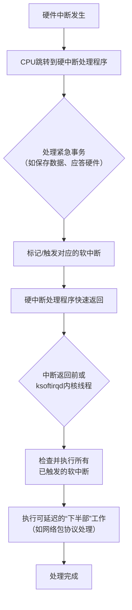
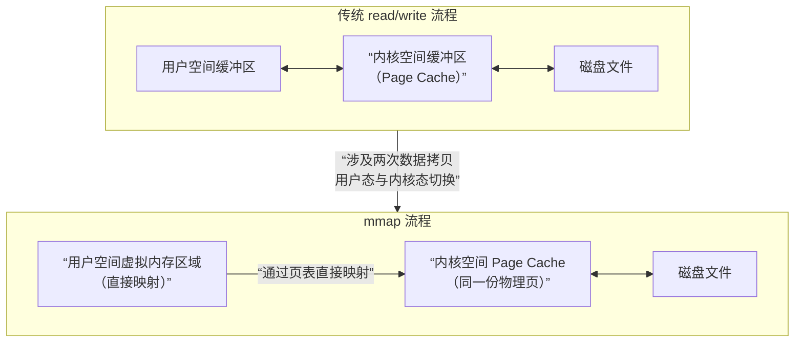

## CPU Cache
CPU Cache 的内存映射方法，决定了**主内存中的某个数据块可以被放置到CPU缓存的哪个位置**。这是缓存设计的核心，直接决定了缓存的**查找速度、硬件成本、命中率和冲突率**。

其根本目的是解决 **“海量主存”** 与 **“小巧缓存”** 之间的地址对应关系，以实现快速查找。

主要有三种基本映射方法：**直接映射、全相联映射和组相联映射**。现代CPU几乎全部使用**组相联映射**及其变种。

### 一、核心概念与地址划分
在理解映射前，需先了解CPU访问缓存时地址的组成。一个内存地址通常被划分为三部分：

| 地址部分 | 作用 | 类比解释 |
| :--- | :--- | :--- |
| **Tag（标签）** | **唯一标识**。用于比较，确认缓存行中的数据是否就是CPU要访问的内存数据。 | 商品的**完整唯一编号**。 |
| **Index（索引）** | **定位**。直接指出这个数据可能存放在缓存中的哪个组（Set）或哪一行（Cache Line）。 | 超市货架的**排号**。根据它你能快速走到对应的货架排。 |
| **Offset（偏移）** | **定位**。在找到缓存行后，指出所需数据在该缓存行（一个数据块）内的具体字节位置。 | 货架上具体商品的**位置**（从左数第几个）。 |

**缓存行** 是缓存与内存交换数据的最小单位，通常为64字节。

---

### 二、三种核心映射方法详解

#### 1. 直接映射
**原理**：主存中的每个数据块**只能**被放到缓存中**唯一一个特定位置**。
* **映射公式**：`缓存行位置 = （内存块地址） MOD （缓存总行数）`
* **工作流程**：
    1. 用地址的 **Index** 位直接找到缓存中唯一对应的那一行。
    2. 比较该行缓存中存储的 **Tag** 与地址中的 **Tag** 是否一致。
    3. 若一致且有效，则**命中**，再根据 **Offset** 读取数据；若不一致，则**缺失**，必须从内存加载新数据**替换**掉该位置的旧数据。

* **优点**：
    * **硬件简单，查找速度极快**。只需一次地址索引和一次Tag比较。
    * **成本最低**。
* **缺点**：
    * **冲突缺失高**。如果程序频繁交替访问两个索引号相同但Tag不同的内存地址（即地址对缓存行数取模后结果相同），它们会不断互相驱逐，导致缓存抖动，即使缓存其他部分空闲也无济于事。
* **类比**：停车场每个车位（缓存行）只允许特定车牌号（内存地址）的车辆停放。如果两辆符合条件的车都要停，即使其他车位空着，它们也只能抢这一个车位。

#### 2. 全相联映射
**原理**：主存中的任何一个数据块**可以**被放置到缓存中的**任意一个空闲行**。
* **工作流程**：
    1. 地址中**没有Index位**，只有Tag和Offset。
    2. 需要将地址中的 **Tag** 与**缓存中所有行的Tag**同时进行比较。
    3. 如果任何一行的Tag匹配且有效，则**命中**；否则**缺失**。缺失时，可以选择任意一个空闲行或根据策略（如LRU）选择一个行进行替换。
* **优点**：
    * **冲突缺失最低**，缓存空间利用率最高。只要缓存有空位，新数据就能放入。
* **缺点**：
    * **硬件成本高，速度慢**。需要大量的比较器进行并行Tag匹配（称为“相联查找”），当缓存容量大时难以实现，功耗也高。
* **类比**：停车场没有固定车位，任何车可以停在任何空位。但找车时，必须逐个检查所有车位上的车牌（Tag）。

#### 3. 组相联映射（现代CPU的普遍选择）
**原理**：**直接映射和全相联映射的折中**。将缓存分成若干大小相同的**组**，每个组内有若干行（称为N路组相联）。
* **映射公式**：`缓存组号 = （内存块地址） MOD （缓存总组数）`
* **工作流程**：
    1. 用地址的 **Index** 位找到对应的**组**。
    2. 将该组内**所有行**的Tag与地址Tag进行**并行比较**（组内是全相联的）。
    3. 若组内某行匹配，则**命中**；否则**缺失**。缺失时，在该组内根据替换策略选择一行进行替换。
* **优点**：
    * 平衡了性能与成本。通过设置不同的“路数”（N），可以灵活调节：
        * **N=1**：即直接映射。
        * **N=缓存总行数**：即全相联映射。
        * **通常N=4, 8, 12, 16**：在可接受的硬件复杂度下，显著降低了直接映射的冲突问题。
* **缺点**：
    * 硬件复杂度高于直接映射，但远低于全相联。
* **类比**：停车场分为多个区（组），每区有N个车位。你的车只能停在指定的那个区，但可以在该区内任意一个空车位停放。找车时，只需在该区内查找。

---

### 三、方法对比与总结

| 特性 | 直接映射 | 组相联映射 | 全相联映射 |
| :--- | :--- | :--- | :--- |
| **映射灵活度** | 最低（1路） | 中等（N路） | 最高（所有行为一组） |
| **查找速度** | **最快**（一次索引+一次比较） | 较快（一次索引+N路比较） | 最慢（所有行同时比较） |
| **硬件成本** | **最低** | 中等 | **最高** |
| **冲突缺失** | **最高** | 较低 | **最低** |
| **典型应用** | 早期CPU，某些TLB或专用缓存 | **现代CPU的L1/L2/L3 Cache** | 小容量、对冲突极其敏感的缓存，如TLB |

### 四、现代CPU的实际应用
现代CPU（如Intel/AMD的x86、Arm Cortex系列）的各级缓存普遍采用**组相联映射**：
* **L1 Cache**：通常为**8路组相联**，追求极速访问。
* **L2 Cache**：通常为**8路或16路组相联**，平衡容量和速度。
* **L3 Cache (LLC)**：通常为**16路或更高路数组相联**（甚至采用更复杂的“非一致性”哈希算法来分散冲突），追求高命中率。

**补充关键点**：
1. **替换策略**：当缓存缺失且组内无空闲行时，需决定替换哪一行。常用策略有：**LRU**、伪LRU、随机等。
2. **写策略**：当CPU要写入数据时，如何处理缓存和内存的一致性。主要有**写直达**和**写回**两种。

**结论**：CPU缓存的内存映射方法是在**硬件成本、访问速度、命中率**之间进行精密权衡的艺术。组相联映射以其优秀的平衡性，成为现代CPU缓存架构的绝对主流，直接支撑着处理器的高效运行。

## MESI
好的，我来为您详细介绍多核CPU缓存一致性的MESI协议。

MESI协议是维护多核处理器中缓存数据一致性最经典、最核心的协议之一。它的名字来源于协议定义的四种缓存行状态的首字母：**M**odified（修改）、**E**xclusive（独占）、**S**hared（共享）和**I**nvalid（无效）。

### 一、为什么需要MESI协议？

在多核CPU系统中，每个核心都有自己的高速缓存，用于加速数据访问。当多个核心需要读写同一块主内存数据时，就会带来缓存一致性问题：
* **问题1：** 核心A修改了自己缓存中的数据，但核心B的缓存中还是旧值，导致数据不一致。
* **问题2：** 多个核心同时读取同一数据时，如何高效地在它们之间共享，避免每次都访问慢速的主内存。

MESI协议通过定义缓存行的状态和一套状态转换规则，在硬件层面自动解决了这些问题，确保所有核心看到的内存视图是一致的。

### 二、MESI的四种核心状态

每个缓存行（Cache Line）都会处于以下四种状态之一，并通过“嗅探”总线上的通信来协同工作：

1. **Modified（修改，M）**
    * **含义**：该缓存行中的数据已被当前核心修改过，与主内存中的数据**不一致**，且该数据**只存在于**当前核心的缓存中。
    * **责任**：拥有该状态的核心在将来需要“驱逐”此缓存行时，**有责任**将其写回主内存。
    * **类比**：你从图书馆（主内存）借了一本唯一的书（缓存行），并在书上做了笔记（修改）。现在这本书只有你有，且和图书馆里的原版不同。

2. **Exclusive（独占，E）**
    * **含义**：该缓存行中的数据与主内存中的数据**完全一致**，且该数据**只存在于**当前核心的缓存中。
    * **特权**：核心可以随时“安静地”将其状态转为 **M**（修改），而无需通知其他核心，因为知道自己是唯一持有者。
    * **类比**：你从图书馆借了一本唯一的书，原封不动（与主存一致），且没有其他人借走。

3. **Shared（共享，S）**
    * **含义**：该缓存行中的数据与主内存中的数据**一致**，并且**可能存在于**其他一个或多个核心的缓存中。
    * **限制**：核心不能直接修改处于S状态的数据。若要修改，必须先通过总线通信，使其他所有持有该缓存行的核心将其状态置为 **I**（无效）。
    * **类比**：你和几个朋友同时从图书馆复印了同一本书的副本，大家手里的内容都和原书一样。

4. **Invalid（无效，I）**
    * **含义**：该缓存行中的数据是**过期、无效**的，不能使用。核心需要该数据时必须从总线或主内存重新获取。
    * **触发**：当其他核心修改了该数据（发出“无效化”通知）时，本地缓存行就会被标记为I。
    * **类比**：你发现你复印的那本书，原书已经被别人修改了，你的复印件因此作废。

### 三、状态转换与核心操作

状态的转换由核心的**本地读写操作**和**嗅探到的总线事件**共同驱动。以下是关键转换的简化说明：

| 触发事件 | 初始状态 | 最终状态 | 总线操作与说明 |
| :--- | :--- | :--- | :--- |
| **核心读数据** | I（无效） | **S** 或 **E** | 发起“读”请求。若其他核心有副本，则进入**S**；若没有，则进入**E**。 |
| **核心写数据** | I（无效） | **M** | 发起“读并请求独占”操作，获取数据后直接修改，状态为**M**。 |
| **核心写数据** | S（共享） | **M** | 发起“无效化”广播，使其他核心的副本失效（变I），然后本地状态转为**M**。 |
| **核心写数据** | E（独占） | **M** | **无需总线通信**，直接修改，状态转为M。这是E状态的优势。 |
| **嗅探到读请求** | M（修改） | S（共享） | 必须将修改的数据写回主内存（或交给请求者），然后状态转为S，与请求者共享。 |
| **嗅探到写请求** | S/E（共享/独占）| I（无效） | 收到其他核心的“无效化”通知，将本地副本标记为I。 |
| **嗅探到读请求** | S/E（共享/独占）| 状态不变 | 只是共享数据，状态保持S或E。 |

### 四、总结与扩展

MESI协议通过精细的状态设计，在**保证一致性**的前提下，**最大化地减少了不必要的总线通信和内存访问**。例如，E状态允许核心在独占时无通信写入，S状态允许多个核心高效共享只读数据。

现代CPU的缓存一致性协议（如Intel的MESIF、AMD的MOESI）都是在MESI基础上进行的优化和扩展，以应对更复杂的多核、多插槽系统。但理解MESI是掌握所有缓存一致性思想的基石。

## Linux CFS
Linux CFS（完全公平调度器）选择红黑树而非堆，是基于其调度模型和内核实际需求做出的最优权衡。核心好处在于：**红黑树能为CFS需要频繁执行的“查找、插入、删除任意节点”这一核心操作组合，提供整体更优且稳定的O(log n)时间复杂度。**

以下是详细的对比与原因分析：

### 一、核心需求：CFS的操作模式
CFS的核心是维护所有可运行任务的**虚拟运行时间（vruntime）**，并始终选择**vruntime最小的任务**（即最欠CPU的任务）来运行。这涉及到几种关键操作：
1. **快速选取最小值**：每次调度时，都需要找到当前vruntime最小的任务。
2. **频繁插入**：任务被唤醒、新建或从睡眠状态恢复时，需要以其当前vruntime插入到数据结构中。
3. **频繁删除**：任务进入睡眠、退出或被迁移时，需要从数据结构中删除。
4. **高效的“重新插入”**：任务被调度运行一个时间片后，其vruntime增加，需要**先删除、再重新插入**到新的位置。这是CFS最频繁的操作路径。

### 二、红黑树 vs. 堆：为何红黑树更匹配

| 操作 | **最小堆（二叉堆）** | **红黑树（自平衡二叉搜索树）** | **对CFS的意义** |
| :--- | :--- | :--- | :--- |
| **选取最小值** | **O(1)**，直接取根节点。 | **O(log n)**，需要找到最左叶子节点。 | **堆胜出**。但CFS通过缓存“最左节点”（`rb_leftmost`）将红黑树的此项操作也优化为**O(1)**，完全抵消了堆的优势。 |
| **插入节点** | O(log n)，需要从底向上堆化。 | O(log n)，插入后可能需旋转调整。 | **平手**。两者复杂度相同。 |
| **删除任意节点** | **性能瓶颈**。需要先**O(n)**查找节点（除非有额外结构），然后与末尾节点交换再堆化，整体复杂且不稳定。 | **O(log n)**，标准操作。能高效定位并删除树中任意已知节点。 | **红黑树完胜**。这是最关键的优势。CFS中任务睡眠、退出、迁移时，需要从树中任意位置删除，红黑树对此支持完美。 |
| **删除后重新插入** | 非常低效。需要先执行昂贵的“删除任意节点”，再执行一次插入。 | 高效。标准的“删除+插入”组合，每个操作都是稳定的O(log n)。 | **红黑树完胜**。这是CFS最频繁的操作，红黑树的性能优势在此被放大。 |
| **遍历有序序列** | 不支持。堆不是为有序遍历设计的。 | 天然支持中序遍历，能得到有序序列。 | **红黑树胜出**。便于调试、监控和实现一些需要遍历的任务组调度逻辑。 |

### 三、总结：红黑树的综合优势

1. **对“删除任意节点”的卓越支持**：这是决定性因素。堆擅长删除根节点，但CFS需要删除的节点遍布整个数据结构。红黑树为此提供了高效且可预测的性能。
2. **整体操作的平衡性**：红黑树在**插入、删除、查找**上都提供了稳定的**O(log n)** 性能，没有明显短板。而堆在“删除非根节点”上存在短板。
3. **最坏情况下的有保障性能**：红黑树是严格自平衡的，能保证最坏情况下的树高度和操作复杂度。这对于操作系统内核的**实时性和确定性**至关重要。
4. **通过缓存优化弥补短板**：CFS通过缓存指向最左节点（最小vruntime）的指针，将调度器选取下一个任务的**核心操作优化到了O(1)**，完美弥补了红黑树在此项上理论复杂度高于堆的缺点。

**结论**：虽然最小堆在“取最小”这一单项上看似更直接，但CFS的完整工作负载是一个**混合操作**场景，尤其是频繁的、随机的删除与再插入。红黑树为这一混合场景提供了**整体最优、最稳定**的性能表现，因此成为了CFS实现其“完全公平”理念的完美数据结构基础。

## Linux 运行队列

Linux CFS（完全公平调度器）选择红黑树而非堆，是基于其调度模型和内核实际需求做出的最优权衡。核心好处在于：**红黑树能为CFS需要频繁执行的“查找、插入、删除任意节点”这一核心操作组合，提供整体更优且稳定的O(log n)时间复杂度。**

以下是详细的对比与原因分析：

### 一、核心需求：CFS的操作模式
CFS的核心是维护所有可运行任务的**虚拟运行时间（vruntime）**，并始终选择**vruntime最小的任务**（即最欠CPU的任务）来运行。这涉及到几种关键操作：
1. **快速选取最小值**：每次调度时，都需要找到当前vruntime最小的任务。
2. **频繁插入**：任务被唤醒、新建或从睡眠状态恢复时，需要以其当前vruntime插入到数据结构中。
3. **频繁删除**：任务进入睡眠、退出或被迁移时，需要从数据结构中删除。
4. **高效的“重新插入”**：任务被调度运行一个时间片后，其vruntime增加，需要**先删除、再重新插入**到新的位置。这是CFS最频繁的操作路径。

### 二、红黑树 vs. 堆：为何红黑树更匹配

| 操作 | **最小堆（二叉堆）** | **红黑树（自平衡二叉搜索树）** | **对CFS的意义** |
| :--- | :--- | :--- | :--- |
| **选取最小值** | **O(1)**，直接取根节点。 | **O(log n)**，需要找到最左叶子节点。 | **堆胜出**。但CFS通过缓存“最左节点”（`rb_leftmost`）将红黑树的此项操作也优化为**O(1)**，完全抵消了堆的优势。 |
| **插入节点** | O(log n)，需要从底向上堆化。 | O(log n)，插入后可能需旋转调整。 | **平手**。两者复杂度相同。 |
| **删除任意节点** | **性能瓶颈**。需要先**O(n)**查找节点（除非有额外结构），然后与末尾节点交换再堆化，整体复杂且不稳定。 | **O(log n)**，标准操作。能高效定位并删除树中任意已知节点。 | **红黑树完胜**。这是最关键的优势。CFS中任务睡眠、退出、迁移时，需要从树中任意位置删除，红黑树对此支持完美。 |
| **删除后重新插入** | 非常低效。需要先执行昂贵的“删除任意节点”，再执行一次插入。 | 高效。标准的“删除+插入”组合，每个操作都是稳定的O(log n)。 | **红黑树完胜**。这是CFS最频繁的操作，红黑树的性能优势在此被放大。 |
| **遍历有序序列** | 不支持。堆不是为有序遍历设计的。 | 天然支持中序遍历，能得到有序序列。 | **红黑树胜出**。便于调试、监控和实现一些需要遍历的任务组调度逻辑。 |

### 三、总结：红黑树的综合优势

1. **对“删除任意节点”的卓越支持**：这是决定性因素。堆擅长删除根节点，但CFS需要删除的节点遍布整个数据结构。红黑树为此提供了高效且可预测的性能。
2. **整体操作的平衡性**：红黑树在**插入、删除、查找**上都提供了稳定的**O(log n)** 性能，没有明显短板。而堆在“删除非根节点”上存在短板。
3. **最坏情况下的有保障性能**：红黑树是严格自平衡的，能保证最坏情况下的树高度和操作复杂度。这对于操作系统内核的**实时性和确定性**至关重要。
4. **通过缓存优化弥补短板**：CFS通过缓存指向最左节点（最小vruntime）的指针，将调度器选取下一个任务的**核心操作优化到了O(1)**，完美弥补了红黑树在此项上理论复杂度高于堆的缺点。

**结论**：虽然最小堆在“取最小”这一单项上看似更直接，但CFS的完整工作负载是一个**混合操作**场景，尤其是频繁的、随机的删除与再插入。红黑树为这一混合场景提供了**整体最优、最稳定**的性能表现，因此成为了CFS实现其“完全公平”理念的完美数据结构基础。

## bitmap
在 Linux 调度器的实时运行队列（`rt_rq`）中，**优先级位图**是实现**快速查找最高非空优先级**的关键数据结构，它通过**空间换时间**的方式，将 O(n) 的查找操作优化为 O(1) 的常数时间操作。

### 核心机制：两层索引结构

实时调度器将 0-99 这 100 个实时优先级划分为多个**优先级数组**，每个优先级对应一个任务链表。为了快速找到当前有就绪任务的最高优先级，它采用了两层索引结构：

1. **位图（Bitmap）**：一个二进制位数组，每个位对应一个优先级
2. **多级位索引**：通常使用 2-5 级位图进行快速查找

### 具体实现：以两级位图为例

以 Linux 内核的实际实现为例，实时优先级位图通常采用两级结构：

#### 第一级：优先级组位图
将 100 个优先级划分为若干组（如 32 个优先级为一组）：
- 第 0 组：优先级 0-31
- 第 1 组：优先级 32-63
- 第 2 组：优先级 64-95
- 第 3 组：优先级 96-99（仅 4 个）

每个组对应一个**位**，这个位表示：
- **1**：该组内至少有一个优先级有就绪任务
- **0**：该组内所有优先级都没有就绪任务

#### 第二级：优先级位图
每个优先级组内部，为每个优先级维护一个位：
- **1**：该优先级有就绪任务
- **0**：该优先级没有就绪任务

### 快速查找算法

当需要找到最高非空优先级时，调度器执行以下两步：

**第一步：查找非空组**
```c
// 伪代码示例
int find_highest_priority() {
    // 1. 在第一级位图中找到第一个为1的位（从高位向低位查找）
    // 假设优先级0是最高，但在位图中通常位0对应优先级0
    // 实际上，位图中位0对应优先级0，位1对应优先级1...
    
    // 2. 找到第一个非空组
    int group_idx = find_first_set_bit(group_bitmap);
    // 这可以通过 CPU 指令 __builtin_clz (计算前导零) 高效实现
    
    // 3. 在该组的优先级位图中找到第一个为1的位
    int priority_in_group = find_first_set_bit(priority_bitmap[group_idx]);
    
    // 4. 计算最终优先级
    return group_idx * 32 + priority_in_group;
}
```

**实际查找方向**：
需要注意的是，实时调度中**数值越小，优先级越高**（0 最高，99 最低）。但在位图中，通常：
- 位 0 对应优先级 0
- 位 1 对应优先级 1
- 以此类推...

因此，查找最高优先级（最小数值）实际上是**从低位向高位**查找第一个为 1 的位。

### 硬件加速：利用 CPU 指令

现代 CPU 提供了专门的指令来加速位图操作：

1. **`ffs()`** (Find First Set)：找到最低位为 1 的位置
2. **`fls()`** (Find Last Set)：找到最高位为 1 的位置
3. **`__builtin_clz()`** (Count Leading Zeros)：计算前导零的数量
4. **`__builtin_ctz()`** (Count Trailing Zeros)：计算尾随零的数量

对于实时优先级查找，通常使用 **`ffs()` 或 `__builtin_ctz()`** 来找到第一个为 1 的位。

**示例**：
```c
// 假设我们有一个 32 位的位图
unsigned long bitmap = 0x00080800;  // 二进制: ... 0000 1000 0000 1000 0000 0000

// 使用 ffs() 找到第一个为 1 的位
int first_bit = ffs(bitmap) - 1;  // 返回 11（位11是第一个为1的位）

// 这对应优先级 11
```

### 操作与维护

位图在任务状态变化时需要更新：

1. **任务入队时**：
   ```c
   // 设置对应优先级的位
   bitmap |= (1UL << priority);
   
   // 如果这是该优先级的第一个任务，还需要设置组位图
   if (priority_list[priority].empty()) {
       group_bitmap |= (1UL << (priority / 32));
   }
   ```

2. **任务出队时**：
   ```c
   // 从链表中移除任务
   remove_task_from_list(priority, task);
   
   // 如果该优先级链表变空，清除位
   if (priority_list[priority].empty()) {
       bitmap &= ~(1UL << priority);
       
       // 如果整个组都空了，清除组位
       if (is_group_empty(group_of(priority))) {
           group_bitmap &= ~(1UL << (priority / 32));
       }
   }
   ```

### 性能对比

| 方法 | 时间复杂度 | 100 个优先级的平均比较次数 |
|------|-----------|---------------------------|
| **线性扫描** | O(n) | 50 次（平均需要检查一半优先级） |
| **位图查找** | **O(1)** | **1-2 次位操作** |

### 实际内核实现

在 Linux 内核中，实时调度器使用 `struct rt_prio_array` 结构：
```c
struct rt_prio_array {
    DECLARE_BITMAP(bitmap, MAX_RT_PRIO);  // 100 位的位图
    struct list_head queue[MAX_RT_PRIO];  // 100 个优先级链表
};
```

查找最高优先级的代码简化如下：
```c
static int sched_find_first_bit(const unsigned long *b)
{
    // 如果 0-31 位有任务
    if (b[0] != 0)
        return __ffs(b[0]);
    // 如果 32-63 位有任务
    if (b[1] != 0)
        return __ffs(b[1]) + 32;
    // 如果 64-95 位有任务
    if (b[2] != 0)
        return __ffs(b[2]) + 64;
    // 最后 4 位
    return __ffs(b[3]) + 96;
}
```

### 总结优势

1. **常数时间复杂度**：无论有多少个优先级，查找操作都是 O(1)
2. **硬件友好**：利用 CPU 的位操作指令，非常高效
3. **内存紧凑**：100 个优先级只需要 100 位（约 13 字节）的位图
4. **更新快速**：任务入队/出队时只需要简单的位设置/清除操作

这种位图机制是实时调度器能够**在微秒级时间内做出调度决策**的关键，确保了实时任务响应的**低延迟性和确定性**。

## 软中断
好的，软中断是Linux内核中用于处理**可延迟中断**、在**中断上下文**中执行**下半部**工作的核心机制。它是内核实现高性能网络、存储、调度等子系统的基石。

下图清晰地展示了软中断在中断处理流程中的定位与核心逻辑：


下面是对上图流程的详细解读：

### 一、核心概念与设计动机

**1. 什么是软中断？**
软中断是一种在**内核态**、在**中断上下文**中执行的、由内核自身在特定时机触发的中断。它**不是**由硬件产生的，而是由软件（内核代码）通过调用 `raise_softirq()` 等函数触发的。

**2. 为什么需要软中断？—— “上半部”与“下半部”**
这是理解软中断的关键。当一个硬件中断（硬中断）发生时：
* **上半部**：指硬中断处理程序。它需要**立即执行**最紧急的工作（如读取网卡数据到缓冲区），然后**快速返回**。它在执行时，会**关闭同级或更低优先级的中断**，因此必须极其简短。
* **下半部**：指那些**重要但不紧急**的后续处理工作（如解析网络包、交给协议栈）。如果把这些工作也放在上半部做，会导致中断关闭时间过长，影响系统实时性和响应能力。

**软中断就是实现“下半部”的主要机制之一**。它允许内核将耗时的工作推迟，在**一个更安全、宽松的时机**（中断开启的状态下）批量处理。

### 二、工作机制与特性

**1. 执行时机**
软中断不会立即执行。它被触发后，内核会在以下**两个主要时机**进行检查和执行：
* **从中断处理程序返回时**：这是最常见、延迟最小的执行路径。
* **由 `ksoftirqd` 内核线程处理**：如果软中断在短时间内被大量触发（例如高速网络收包），内核会唤醒每CPU的 `ksoftirqd` 线程来协助处理，防止用户态进程被“饿死”。

**2. 类型与静态分配**
Linux内核预定义了10种软中断类型（枚举 `softirq_vec`），每种类型有唯一的处理函数。它们是静态编译进内核的，不能动态增加。主要类型包括：
```c
enum {
    HI_SOFTIRQ=0,      // 高优先级tasklet
    TIMER_SOFTIRQ,     // 定时器下半部
    NET_TX_SOFTIRQ,    // 网络数据包发送
    NET_RX_SOFTIRQ,    // 网络数据包接收
    BLOCK_SOFTIRQ,     // 块设备
    IRQ_POLL_SOFTIRQ,
    TASKLET_SOFTIRQ,   // 普通tasklet
    SCHED_SOFTIRQ,     // 调度器
    HRTIMER_SOFTIRQ,
    RCU_SOFTIRQ,       // RCU锁处理
    NR_SOFTIRQS
};
```

**3. 每CPU特性**
每个CPU核心都有自己独立的软中断触发状态位图（`softirq_pending`）和处理逻辑。这意味着：
* **无锁并发**：每个CPU处理自己的软中断，无需加锁。
* **缓存友好**：数据本地化，提高缓存命中率。
* **真正并行**：多核系统上，不同CPU可以同时处理相同类型的软中断。

### 三、与相关机制的区别

| 特性 | **软中断** | **硬中断** | **Tasklet** | **工作队列** |
| :--- | :--- | :--- | :--- | :--- |
| **触发源** | 软件（内核） | 硬件 | 软件（基于软中断） | 软件 |
| **执行上下文** | **中断上下文** | 中断上下文 | **中断上下文** | **进程上下文** |
| **可抢占/调度** | 否，不可睡眠 | 否，不可睡眠 | 否，不可睡眠 | **是，可以睡眠** |
| **并发性** | **同一类型可在不同CPU上同时运行** | 依赖中断控制器 | **同一tasklet不能在不同CPU上同时运行** | 无限制（由线程调度决定） |
| **执行时机** | 中断返回时或`ksoftirqd`线程 | 硬件中断发生时 | 基于软中断（`TASKLET_SOFTIRQ`） | 由内核工作线程调度 |
| **开销** | 小 | 小 | 很小 | 较大（涉及线程调度） |
| **适用场景** | 高性能、对延迟敏感的下半部（如网络） | 紧急的硬件响应 | 需要串行访问的中断下半部 | 需要睡眠或执行时间很长的任务 |

**简单关系**：Tasklet是基于软中断（`TASKLET_SOFTIRQ` 和 `HI_SOFTIRQ`）实现的，提供了更简单的串行化接口。工作队列则是完全不同的机制，它在进程上下文中运行，可以睡眠。

### 四、典型应用

1. **网络子系统**：`NET_TX_SOFTIRQ` 和 `NET_RX_SOFTIRQ` 是网络吞吐量的关键。网卡硬中断只负责将数据包DMA到内存并触发软中断，繁重的协议栈处理（IP、TCP解包等）都在软中断中完成。
2. **块设备层**：`BLOCK_SOFTIRQ` 处理块设备的请求完成通知。
3. **定时器**：`TIMER_SOFTIRQ` 执行定时器的回调函数。
4. **调度器**：`SCHED_SOFTIRQ` 用于负载均衡和调度时钟处理。
5. **RCU**：`RCU_SOFTIRQ` 处理RCU回调。

### 五、监控与调优

* **查看统计信息**：`cat /proc/softirqs` 可以查看每个CPU上各类软中断的触发次数。网络流量大时，`NET_RX` 的计数会快速增长。
* **性能问题**：如果某个CPU的 `ksoftirqd` 线程（如 `ksoftirqd/0`）长期占用高CPU，通常意味着该CPU正在处理大量软中断（可能是网络或存储I/O瓶颈），需要考虑中断亲和性（`smp_affinity`）或RPS/RFS将负载分担到多个CPU。

### 总结

软中断是Linux内核为平衡**中断响应速度**和**系统吞吐量**而设计的高性能“下半部”机制。它通过**每CPU、无锁、在中断上下文中异步执行**的方式，高效处理网络、定时器、调度等关键路径上的延迟敏感任务，是Linux实现高并发、低延迟IO的核心基础设施。理解软中断是分析Linux内核网络和存储性能的必备知识。

## 段、页、段页式

好的，这是一个关于内存管理方案的经典问题。段式、页式和段页式是计算机系统中三种主要的内存管理方式，它们各有特点，分别适用于不同的场景和硬件发展阶段。

下图从宏观上展示了这三种管理方式的演进逻辑与核心差异：
```mermaid
flowchart TD
    A[内存管理核心目标<br>高效、安全、易用] --> B{“如何组织程序与内存?”}
    
    B --> C[“段式管理<br>按程序逻辑模块划分”]
    C --> C1[“优点: 符合直觉、易共享保护<br>缺点: 外部碎片、内存利用率低”]
    
    B --> D[“页式管理<br>按固定物理大小划分”]
    D --> D1[“优点: 无外部碎片、管理高效<br>缺点: 一维地址、共享保护不直观”]
    
    B --> E[“段页式管理<br>先分段， 段内再分页”]
    E --> E1[“优点: 结合两者优势<br>缺点: 地址转换复杂、开销大”]
    
    C1 & D1 --> F[“现代通用系统选择:<br>段页式(硬件支持)或纯页式”]
```

下面是对这三种管理方式的详细对比分析。

### 一、核心思想与映射方式

| 维度 | **段式管理** | **页式管理** | **段页式管理** |
| :--- | :--- | :--- | :--- |
| **核心思想** | **按逻辑单元划分**。将程序和数据按逻辑意义（如代码段、数据段、堆栈段）划分为大小不等的“段”。 | **按固定大小划分**。将进程地址空间和物理内存都划分为固定大小的“页”，建立页映射。 | **先分段，再分页**。在段式管理的基础上，将每个段再划分为固定大小的页。 |
| **地址空间** | **二维地址**：`(段号, 段内偏移)`。程序员或编译器需要显式或隐式指定段。 | **一维地址**：单一线性地址。由硬件或系统自动划分为`(页号, 页内偏移)`。 | **二维地址**：`(段号, 段内地址)`，其中段内地址又被硬件解释为`(段内页号, 页内偏移)`。 |
| **映射单位** | **变长的段**。每个段长度不同，由程序逻辑决定。 | **定长的页**。页大小固定，由硬件决定（如4KB）。 | **段内定长的页**。段是逻辑单位，页是物理分配单位。 |
| **物理内存分配** | **连续分配**。为整个段分配一块连续的物理内存区域。 | **离散分配**。进程的页可以分散存放在物理内存的任何页框（帧）中。 | **离散分配**。段本身不连续，段内的页也是离散存放的。 |
| **管理数据结构** | **段表**。每个条目记录：段基址、段长、保护位等。 | **页表**。每个条目记录：页框号、有效位、保护位等。 | **段表 + 每个段一个页表**。段表指向该段的页表基址，页表管理该段内的页。 |

### 二、地址转换过程

**1. 段式管理**
```
逻辑地址: (段号s, 段内偏移d)
1. 用段号s作为索引查找段表，获取段基址base和段长limit。
2. 检查偏移d是否小于段长limit，若越界则触发段错误。
3. 物理地址 = 段基址base + 偏移d。
```

**2. 页式管理**
```
逻辑地址: (虚拟页号p, 页内偏移d)
1. 用页号p作为索引查找页表，获取页框号f。
2. 检查页表项有效位，若无效则触发缺页异常。
3. 物理地址 = (页框号f × 页大小) + 偏移d。
```

**3. 段页式管理**
```
逻辑地址: (段号s, 段内地址addr)
1. 用段号s查找段表，获取该段的页表基址。
2. 将段内地址addr拆分为(段内页号p, 页内偏移d)。
3. 用页表基址和页号p查找页表，获取页框号f。
4. 物理地址 = (页框号f × 页大小) + 偏移d。
```
**注意**：现代x86系统虽然硬件支持段页式，但操作系统（如Linux）通过将段基址设为0、段限设为最大，实际上“绕过”了分段，给上层提供了一个纯分页的视图。

### 三、优点与缺点深度对比

| 管理方式 | **优点** | **缺点** |
| :--- | :--- | :--- |
| **段式管理** | 1. **符合程序逻辑**：便于程序员理解和编译器组织代码。<br>2. **易于共享和保护**：以逻辑段为单位设置读写执行权限，共享库（如代码段）容易实现。<br>3. **动态增长**：堆栈段等可以动态伸缩。 | 1. **外部碎片**：内存中会产生大量不连续的小空闲区，难以利用，需紧凑处理，开销大。<br>2. **内存利用率低**：分配连续空间，可能因找不到足够大的空闲区而失败，即使总空闲足够。<br>3. **交换效率低**：整个段换入换出，即使只使用其中一小部分。 |
| **页式管理** | 1. **无外部碎片**：物理内存按页框分配，任何空闲页框都可使用。<br>2. **内存利用率高**：支持离散分配，充分利用内存。<br>3. **管理高效**：固定大小，分配、回收、交换算法简单。<br>4. **适合虚拟内存**：以页为单位的换入换出高效。 | 1. **存在内部碎片**：最后一页可能用不满，平均产生半页浪费。<br>2. **共享和保护不够直观**：页是物理划分，与程序逻辑无关，共享代码/数据需映射相同页框，管理复杂。<br>3. **页表可能很大**：需采用多级页表、倒排页表等机制优化。 |
| **段页式管理** | 1. **结合两者优点**：既拥有段的逻辑清晰、易共享保护特性，又拥有页的物理管理高效、无外部碎片的特性。<br>2. **适合复杂系统**：能很好地支持现代操作系统的复杂需求。 | 1. **地址转换复杂，开销大**：需要两次或多次查表（段表、页表），虽可用TLB加速，但仍比纯页式复杂。<br>2. **软件和硬件设计复杂**：需要操作系统和硬件协同支持。 |

### 四、典型应用与历史背景

| 管理方式 | **典型硬件/系统** | **应用背景与评价** |
| :--- | :--- | :--- |
| **段式管理** | Intel 8086/286，早期操作系统 | **x86的历史包袱**。8086用段寄存器实现寻址超过64KB。286引入保护模式，分段用于内存保护。它反映了早期计算机**程序逻辑与内存物理组织紧密耦合**的思想。 |
| **页式管理** | 大多数现代处理器（ARM, RISC-V, x86的页式部分），Unix/Linux内核核心视图 | **现代操作系统的基石**。它实现了**物理内存的抽象和虚拟化**，使得进程拥有统一的、连续的虚拟地址空间，是虚拟内存技术实现的基础。Linux虽在x86上使用段页式硬件，但通过“平坦模型”弱化了段。 |
| **段页式管理** | Intel x86保护模式（自386起），IBM System/38，早期IBM AS/400 | **硬件对兼容性的妥协与功能增强**。x86为了兼容旧的段式架构，同时引入强大的分页功能，形成了硬件层面的段页式。它提供了最大的灵活性，但增加了复杂度。**现代操作系统在x86上主要使用其分页功能**。 |

### 五、总结与演进趋势

| 对比项 | **段式管理** | **页式管理** | **段页式管理** |
| :--- | :--- | :--- | :--- |
| **本质** | **逻辑视角**的管理 | **物理视角**的管理 | **逻辑+物理**的混合管理 |
| **碎片问题** | 外部碎片严重 | 仅有内部碎片 | 仅有内部碎片 |
| **性能开销** | 中等（一次查表，但需紧凑） | 低（一次查表，TLB高效） | 高（两次查表） |
| **系统复杂度** | 简单 | 中等 | 复杂 |
| **现代地位** | **基本被淘汰**（作为独立方案） | **绝对主流**（几乎所有通用OS的核心） | **x86硬件事实标准**，但被OS“隐藏” |

**结论与趋势**：
1. **页式管理是现代通用操作系统的绝对核心**。它完美地解决了内存高效利用和虚拟内存的问题。
2. **段式管理作为一种独立方案已过时**，但其**按逻辑组织与保护**的思想被高级语言、编译器和操作系统以其他形式继承（如ELF文件格式中的节、内存权限保护）。
3. **段页式管理是x86架构的历史产物**。它为兼容性而存在，现代操作系统（如Linux、Windows）通过将段设为覆盖整个地址空间，**实质上将其“退化”为纯页式管理**，只为利用硬件提供的特权级保护等少量功能。
4. **新兴架构（如ARM、RISC-V）已抛弃硬件分段**，直接采用纯页式或类似的“域”、“保护环”机制，设计更加简洁高效。

因此，在学习时，应**深入理解页式管理**，它是理解现代操作系统内存管理的钥匙；了解段式管理有助于理解历史和一些概念起源；而段页式管理则主要是为了理解和应对x86架构的特殊性。

## 段基址

这是一个非常深刻的问题，触及了x86-64架构设计的核心。答案是：**不会导致物理地址重合，因为“段”在64位模式下的作用和意义已经发生了根本性改变。物理地址的隔离与映射，已经完全交由功能强大得多的分页机制来负责。**

下面详细解释为什么不会重合，以及64位模式下分段机制的真实状态。

### 一、核心结论：段的作用已从“地址转换”变为“属性与权限标识”

在32位保护模式下，段的核心作用是参与**地址转换**（逻辑地址→线性地址）和提供**基础保护**。
在64位模式下，段的核心作用转变为**定义执行环境的属性**和**提供少数特定功能**。地址转换和内存保护的重任几乎全部移交给了**分页机制**。

### 二、64位模式下段的“强制为0”意味着什么？

当Intel说“大多数段的基地址被强制为0”时，指的是以下段描述符的基地址字段在加载时被硬件忽略并视为0：
- **代码段（CS）**
- **数据段（DS）**
- **堆栈段（SS）**
- **附加数据段（ES）**

**带来的直接效果是**：对于这些段，`逻辑地址（段选择子:偏移量） = 线性地址（虚拟地址）`。分段机制在**地址计算层面变得完全透明**。

### 三、既然基址都是0，如何区分和隔离？

答案是：**通过分页机制，而不是分段机制。**

| 对比项 | **32位模式（分段有效）** | **64位模式（分段弱化）** |
| :--- | :--- | :--- |
| **地址空间隔离** | 段基址+段界限定义线性地址范围，不同段指向不同区域。 | **页表**为每个进程定义独立的虚拟地址空间。代码、数据、堆栈是同一虚拟地址空间中的不同区域，由页表映射到不同物理页。 |
| **内存保护** | 段描述符中的类型（Type）和描述符特权级（DPL）提供读写执行保护。 | **页表项（PTE）** 中的权限位（U/S用户/管理，R/W读写，XD禁止执行）提供更精细的页级保护。段描述符的权限检查依然存在，但已是次要防线。 |
| **共享与私有** | 通过将不同进程的段描述符指向相同的基址/界限来实现共享内存。 | 通过将不同进程的**页表项**映射到相同的**物理页框（Frame）** 来实现共享内存（如共享库）。 |

**举例说明**：
一个进程的代码（位于虚拟地址 `0x400000`）和数据（位于虚拟地址 `0x7ffde000`）：
- 在64位模式下，无论CS还是DS，基址都是0。CPU用CS访问 `0x400000`，用DS访问 `0x7ffde000`。
- 这两个虚拟地址通过进程的**页表**被映射到两个完全不同的物理页框（例如 `物理页框1024` 和 `物理页框8192`）。
- **页表**：确保了代码页被标记为“可执行、可读”，而数据页被标记为“可读写、不可执行”，实现了保护。

**因此，物理地址不会重合，因为重合与否取决于页表映射，而页表映射对于代码和数据区域是完全独立的。**

### 四、段描述符在64位模式下的剩余价值

虽然基址固定为0，但段描述符的其他字段仍然至关重要：

1. **类型字段**：标识段是代码段还是数据段，以及可读、可写、可执行等属性。CPU在访问时仍会检查这些属性（例如，不能向代码段写入）。
2. **描述符特权级**：定义当前特权级（CPL），是CPU判断当前处于内核态（0）还是用户态（3）的关键依据。
3. **L位**：这是64位模式的关键标志。当代码段描述符的L位=1时，CPU进入64位模式；D位（默认操作数大小）被忽略。
4. **DPL和L位共同作用**：决定了CPU是运行在64位用户模式还是64位内核模式。

### 五、两个重要的例外：FS和GS寄存器

这是理解现代系统如何利用“残存”分段功能的关键。**FS和GS段的基地址在64位模式下不是0，并且可以动态配置。**

- **用途**：主要用于提供高效的**线性地址计算基址**。
- **典型应用**：
    - **线程局部存储**：操作系统将每个线程的TLS区域基址加载到FS或GS中。线程访问自己的数据时，可以使用像 `[fs:0x10]` 这样的指令，硬件会自动加上FS的基址，高效地计算出该线程私有变量的线性地址。Windows和Linux都广泛使用此机制。
    - **操作系统内部数据**：Linux内核用GS来指向每CPU数据区域，使得内核代码可以快速访问当前CPU的私有数据。

**在这里，FS/GS的基址非零，但它们的作用更像一个“快速基址指针”，而不是传统意义上的内存隔离段。其最终访问的物理地址，仍然需要经过页表转换。**

### 六、总结与类比

可以将64位模式下的内存管理想象成一栋大楼：

- **分段机制（大部分）**：就像是大楼的**门牌号系统规则**。现在规则很简单：所有房间的“楼层基址”都算作0层，房间号`301`就是3楼1号房（虚拟地址）。DS、CS只是告诉你进的是“储物间”还是“阅览室”（属性），但不影响房间号计算。
- **分页机制**：就像是每个访客（进程）手里拿的**独一无二的“楼层映射手册”**。这本手册（页表）定义了“3楼1号房”到底对应到物理世界的哪一栋楼的哪一层（物理地址）。不同访客的手册，可以将相同的门牌号映射到完全不同的物理房间。
- **FS/GS段**：像是给特定访客发的一个**快捷电梯卡**。刷卡（使用FS前缀）后，电梯直接送你到某个专用楼层（例如，线程的私有储物层），省去了你查手册计算的时间。

**所以，回到最初的问题**：段基址强制为0，只是取消了分段在地址转换上的作用，将所有地址置于一个统一的64位线性地址空间中。而在这个广阔的虚拟地址空间里，**代码、数据、堆栈等不同“段”所对应的虚拟地址区域，通过强大的分页机制，被映射到互不重合的物理内存上，并施加了精确的保护**。这正是现代操作系统所期望的、简洁而强大的内存模型。

## mmap

好的，MMAP（Memory-Map，内存映射）是Linux/Unix系统中一项强大且核心的机制。它允许程序将文件或设备直接映射到进程的虚拟地址空间，从而像访问内存一样访问文件数据，这彻底改变了文件I/O的方式。

下图直观地展示了传统`read/write`与`mmap`两种文件访问方式的根本区别：


下面是对MMAP的全面介绍。

### 一、核心概念与原理

**1. 是什么？**
`mmap()` 是一个系统调用，其功能是：**在调用进程的虚拟地址空间中创建一个新的内存映射**。这个映射可以将一个文件（或设备）的一部分内容直接关联到一段内存区域，也可以创建一段匿名内存（与文件无关）。

**2. 核心原理：利用虚拟内存和页缓存**
* **虚拟内存**：每个进程都有独立的虚拟地址空间。`mmap` 在该空间中划出一段区域，并声明其“背后”的数据来源（一个文件）。
* **页缓存**：内核将最近访问的磁盘文件块缓存在物理内存中，称为页缓存。
* **映射**：`mmap` 并不立即将文件内容全部读入内存。它只是建立进程虚拟地址空间中的某段**虚拟页**与内核**页缓存**中对应文件块的**页表映射关系**。
* **按需调页**：当进程首次访问该内存区域的某个地址时，CPU触发**缺页异常**。内核的异常处理程序会：
    a. 检查所需数据是否已在页缓存中。
    b. 如果不在，则从磁盘读取相应文件块到页缓存。
    c. 修改进程的页表，将发生访问的虚拟页映射到存放文件数据的物理页框。
    d. 进程从异常返回，重新执行访问指令，此时就能像访问普通内存一样直接读取文件数据。

### 二、系统调用与关键参数

```c
#include <sys/mman.h>
void *mmap(void *addr, size_t length, int prot, int flags, int fd, off_t offset);
```

* **`addr`**: 建议的映射起始地址（通常设为`NULL`，由内核决定）。
* **`length`**: 映射区域的长度。
* **`prot`**: 内存保护权限，位组合：
    * `PROT_READ`: 页可读。
    * `PROT_WRITE`: 页可写。
    * `PROT_EXEC`: 页可执行。
    * `PROT_NONE`: 页不可访问。
* **`flags`**: 控制映射行为的核心标志，位组合：
    * `MAP_SHARED`: **共享映射**。对映射内存的修改会写回文件，其他映射同一文件的进程可见。
    * `MAP_PRIVATE`: **私有映射**。写操作会触发**写时复制**，修改不会影响原文件或其他进程。
    * `MAP_ANONYMOUS`: **匿名映射**。映射区域不与任何文件关联，初始化为全零。用于分配大块内存（如`malloc`的大内存分配）或进程间共享内存。
    * `MAP_FIXED`: 强制使用`addr`作为起始地址（危险，通常不用）。
    * `MAP_POPULATE`: 立即预读文件内容，建立映射（可能造成阻塞）。
* **`fd`**: 要映射的文件描述符。对于匿名映射（`MAP_ANONYMOUS`），设为-1。
* **`offset`**: 文件映射起始偏移量，必须是内存页大小的整数倍（如4096）。
* **返回值**: 成功时返回映射区域的起始地址，失败返回`MAP_FAILED`。

**解除映射**：
```c
int munmap(void *addr, size_t length); // 解除映射，区域访问会触发段错误
```
**同步到磁盘**：
```c
int msync(void *addr, size_t length, int flags); // 将映射内存的修改显式刷回文件
```

### 三、主要用途与场景

**1. 高性能文件I/O（替代read/write）**
* **场景**：需要随机、频繁访问大文件（如数据库文件、大型科学计算数据）。
* **优势**：
    * **减少数据拷贝**：避免`read`/`write`在用户缓冲区和内核缓冲区之间的拷贝。
    * **减少系统调用**：访问数据就是内存操作，无需反复调用`read`/`write`。
    * **智能缓存**：自动利用内核页缓存和缺页机制，访问模式具有局部性时效率极高。

**2. 进程间通信**
* **场景**：需要共享大量数据的进程。
* **方法**：
    * **基于文件**：多个进程`mmap`同一个文件（使用`MAP_SHARED`），对该内存区域的读写对所有进程立即可见。
    * **匿名共享内存**：父子进程或无关进程可以使用`MAP_ANONYMOUS | MAP_SHARED`创建一块与文件无关的共享内存区域。这是POSIX共享内存（`shm_open` + `mmap`）的基础。

**3. 动态内存分配**
* **场景**：`malloc`在申请大块内存（例如超过`MMAP_THRESHOLD`，通常128KB）时，会使用`mmap`创建私有匿名映射来分配，释放时用`munmap`直接归还给系统。

**4. 加载动态链接库**
* **场景**：程序启动时加载`.so`共享库。
* **原理**：系统将库文件（如`libc.so`）的代码段、数据段通过`mmap`映射到进程地址空间，实现高效的代码共享。

### 四、优点与缺点

| 优点 | 缺点 |
| :--- | :--- |
| **1. 高性能**：避免了用户态与内核态间的数据拷贝，尤其对大文件随机访问优势明显。 | **1. 内存开销**：映射区域长度必须是页大小的整数倍，小文件可能浪费内存。频繁映射/解除映射小文件不划算。 |
| **2. 简化编程**：对映射内存的操作就是指针操作，比`read`/`write`/`lseek`的组合更直观。 | **2. 地址空间占用**：32位系统地址空间有限（4GB），大量大文件映射可能导致虚拟地址空间碎片化或耗尽。 |
| **3. 零拷贝基础**：是`sendfile`、`splice`等零拷贝技术的基础。网络传输文件时，内核可以直接从页缓存发送数据，无需拷贝到用户空间。 | **3. 错误处理复杂**：访问映射内存如触发`SIGSEGV`或`SIGBUS`（例如文件被截断），需用信号处理器处理，比检查`read`返回值复杂。 |
| **4. 高效的进程间共享**：共享映射提供了高效的IPC方式，无需管道、消息队列等拷贝开销。 | **4. 数据一致性**：`MAP_SHARED`的写回时机由内核决定（脏页回写）。需要强制刷盘时，必须调用`msync`，增加了复杂度。 |
| **5. 延迟加载**：按需调页，首次访问才加载数据，启动快，内存使用高效。 | **5. 文件大小限制**：映射区域不能超过文件大小。要扩展文件，必须先`ftruncate`扩展文件，再重新`mmap`或访问新区域触发缺页。 |

### 五、一个简单示例：使用mmap读取文件

```c
#include <sys/mman.h>
#include <sys/stat.h>
#include <fcntl.h>
#include <stdio.h>
#include <unistd.h>
#include <string.h>

int main() {
    int fd = open("example.txt", O_RDONLY);
    if (fd == -1) { perror("open"); return 1; }

    struct stat sb;
    if (fstat(fd, &sb) == -1) { perror("fstat"); close(fd); return 1; }

    // 将整个文件映射到内存
    char *mapped = mmap(NULL, sb.st_size, PROT_READ, MAP_PRIVATE, fd, 0);
    if (mapped == MAP_FAILED) { perror("mmap"); close(fd); return 1; }

    // 现在可以像访问数组一样访问文件内容
    printf("File size: %ld bytes\n", sb.st_size);
    printf("First 100 bytes: %.*s\n", 100, mapped);

    // 解除映射并关闭文件
    munmap(mapped, sb.st_size);
    close(fd);
    return 0;
}
```

### 六、总结

`mmap` 是连接**文件系统**与**虚拟内存系统**的桥梁。它将文件抽象为一段内存，使得文件I/O从“系统调用驱动”变为“内存访问驱动”，在特定场景下能带来显著的性能提升和编程便利。

**何时使用mmap？**
* 需要**随机访问**大文件。
* 需要对文件内容进行复杂的**指针操作**或数据结构解析（如数据库）。
* 需要在**多个进程间共享大量数据**。
* 实现**零拷贝**网络文件传输。

**何时使用传统read/write？**
* 顺序读写流式数据。
* 处理大量小文件。
* 需要非常明确的错误返回和I/O控制。
* 在32位系统上处理可能超过地址空间的大文件。

理解`mmap`是深入理解Linux系统编程、高性能服务开发和数据库实现的关键之一。

## malloc
这是一个非常好的问题，直击内存分配机制的核心。简单直接的答案是：

**不，`malloc` 使用的 `mmap` 是匿名映射，不映射任何文件。它创建的是与文件无关的、初始化为零的内存区域。**

### 详细解释

当 `malloc` 通过 `mmap` 分配内存时，它使用的是 **`MAP_ANONYMOUS` 标志**，这表示创建的映射不与任何文件关联，而是创建纯粹的、匿名的新内存区域。

#### 1. `malloc` 的内存分配策略
`malloc` 的实现通常使用两种主要机制来获取内存：

| 分配方式 | 适用大小 | 内存来源 |
|---------|---------|---------|
| **`brk`/`sbrk` 系统调用** | 小内存块（通常 < 128KB） | 扩展程序的堆（heap）段 |
| **`mmap` 系统调用** | 大内存块（通常 ≥ 128KB） | 创建独立的匿名内存映射 |

`malloc` 的阈值（通常是 128KB）是动态可调的，可以通过 `mallopt` 函数或环境变量 `M_MMAP_THRESHOLD` 调整。

#### 2. 匿名 `mmap` 的实际调用
当 `malloc` 决定使用 `mmap` 时，它会这样调用：
```c
void *ptr = mmap(NULL, size, PROT_READ | PROT_WRITE, 
                 MAP_PRIVATE | MAP_ANONYMOUS, -1, 0);
```

关键参数解释：
- **`MAP_ANONYMOUS`**：表示这是一个匿名映射，不与任何文件关联
- **`fd = -1`**：因为不映射文件，文件描述符设为 -1
- **`offset = 0`**：无意义，设为 0
- **`MAP_PRIVATE`**：私有映射，写操作会触发写时复制（对匿名映射来说，这主要影响 `fork` 时的行为）

#### 3. 匿名映射与文件映射的本质区别

| 特性 | **匿名映射** | **文件映射** |
|------|-------------|-------------|
| **数据来源** | 初始为全零，之后由交换空间支持 | 磁盘上的文件，由页缓存支持 |
| **持久性** | 进程结束即消失 | 可持久化到磁盘文件 |
| **共享性** | 通常不共享（除非用于进程间通信） | 可在进程间共享同一文件 |
| **`malloc` 使用** | 是，用于分配大内存 | 否 |

#### 4. 匿名映射的内存来源
匿名映射创建的内存区域：
1. **初始状态**：所有页都被初始化为零（这是由内核保证的）
2. **物理内存分配**：采用**按需调页**策略
   - 首次访问时触发缺页异常
   - 内核分配物理页框并用零填充
3. **交换支持**：当系统内存紧张时，这些页可以被换出到交换分区

#### 5. 示例验证
```c
#include <stdlib.h>
#include <stdio.h>
#include <unistd.h>

int main() {
    // 分配一个大内存块（超过 MMAP_THRESHOLD）
    size_t large_size = 256 * 1024;  // 256KB
    void *ptr = malloc(large_size);
    
    if (!ptr) {
        perror("malloc failed");
        return 1;
    }
    
    // 在Linux上，我们可以查看 /proc/[pid]/maps 来验证
    printf("进程ID: %d\n", getpid());
    printf("分配的地址: %p\n", ptr);
    printf("\n运行以下命令查看映射:\n");
    printf("cat /proc/%d/maps | grep -A2 -B2 %p\n", 
           getpid(), (void*)((long)ptr & ~(0xFFF)));
    
    // 暂停以便查看
    printf("\n按回车键继续...\n");
    getchar();
    
    free(ptr);
    return 0;
}
```

运行这个程序，在另一个终端查看映射：
```bash
$ cat /proc/[pid]/maps | grep -A2 -B2 [地址前缀]
```

你会看到类似这样的输出：
```
7f9a5a000000-7f9a5a020000 rw-p 00000000 00:00 0 
```
关键点：
- **`rw-p`**：可读写，私有映射
- **`00000000`**：偏移量为0
- **`00:00`**：设备主次编号为0:0，表示匿名映射
- **`0`**：inode为0，表示没有关联的文件

#### 6. 为什么 `malloc` 对大小块内存使用不同策略？

| 分配方式 | 优点 | 缺点 |
|---------|------|------|
| **`brk`（堆分配）** | 1. 速度快，只需调整堆指针<br>2. 缓存局部性好<br>3. 适合频繁分配释放的小块内存 | 1. 内存碎片问题<br>2. 大块内存可能导致堆扩展过多<br>3. 释放的内存不一定立即归还系统 |
| **`mmap`（匿名映射）** | 1. 分配的大内存可以直接用 `munmap` 归还系统<br>2. 每个大块内存独立，减少碎片<br>3. 可以与系统交换机制更好集成 | 1. 每次分配都是系统调用，开销较大<br>2. 可能破坏缓存局部性<br>3. 每个映射需要额外的内核元数据 |

#### 7. 相关的系统调用和函数
除了 `malloc`，其他内存分配函数也使用类似机制：

```c
// 直接分配匿名内存页
void *mem = mmap(NULL, size, PROT_READ|PROT_WRITE, 
                 MAP_PRIVATE|MAP_ANONYMOUS, -1, 0);

// POSIX共享内存（进程间通信）
int shm_fd = shm_open("/myshm", O_CREAT|O_RDWR, 0666);
ftruncate(shm_fd, size);
void *ptr = mmap(NULL, size, PROT_READ|PROT_WRITE, MAP_SHARED, shm_fd, 0);

// 分配对齐的内存
void *aligned_alloc(size_t alignment, size_t size);
posix_memalign(void **memptr, size_t alignment, size_t size);
```

### 总结

1. **`malloc` 通过 `mmap` 分配的内存是匿名映射，不与任何文件关联**。
2. 这种匿名映射创建的是初始化为零的新内存区域，由内核的页分配器和交换机制支持。
3. `malloc` 对大小块内存采用不同策略：小块用堆（`brk`），大块用匿名 `mmap`，这是性能与碎片管理的权衡。
4. 匿名 `mmap` 不仅用于 `malloc`，还用于进程间共享内存、分配大页内存等多种场景。

理解这一点很重要，因为它帮助我们区分文件I/O的内存映射和纯粹的内存分配，这两种用途虽然使用相同的系统调用，但其目的、行为和内核处理方式都有显著不同。

## swap

好的，Swap（交换）机制是操作系统虚拟内存系统的核心组件之一。它通过将物理内存中暂时不用的数据“交换”到磁盘上的专用空间，从而在物理内存紧张时腾出空间，维持系统的多任务处理和内存超量使用能力。

下图清晰地展示了Swap机制的核心工作流程与关键决策点：
```mermaid
flowchart TD
    A[进程访问虚拟页] --> B{“页表项有效?<br>(在物理内存)”}
    B -- 是 --> C[正常访问]
    B -- 否/触发缺页异常 --> D{“页面在Swap中?”}
    D -- 否 --> E[“分配新物理页<br>(文件映射/匿名零页)”]
    D -- 是 --> F[“触发‘换入’<br>Major Page Fault”]
    F --> G[“选择牺牲页<br>(根据页面置换算法)”]
    G --> H{“牺牲页是脏页?”}
    H -- 是 --> I[“执行‘换出’<br>写入Swap空间”]
    H -- 否 --> J[“直接丢弃或缓存”]
    I & J --> K[“将目标页从Swap读入<br>腾出的物理页”]
    K --> L[更新页表， 标记为有效]
    L --> C
```

下面是对Swap机制的全面介绍。

### 一、核心概念与目的

**1. 是什么？**
Swap机制是操作系统将**物理内存（RAM）** 中不活跃的页（内存页）临时移动到磁盘上的**交换空间（Swap Space）**，并在需要时再移回内存的过程。磁盘上的交换空间可以是独立的分区（`/dev/sdXN`）或文件（`swapfile`）。

**2. 为什么需要Swap？**
* **内存超量使用**：允许系统运行总内存需求大于物理内存的程序总和。当物理内存耗尽时，可将不活跃的页换出，为活跃的页腾出空间。
* **应对内存压力峰值**：平滑处理突发的、短暂的内存需求高峰，避免系统因“内存耗尽”而直接杀死进程（OOM Killer被触发）。
* **休眠支持**：实现系统休眠到磁盘。系统将整个内存映像保存到交换空间，关机后下次启动时可恢复。
* **隔离效应**：即使有大量空闲内存，将极少使用的页面换出，可以保持更多的物理内存用于磁盘缓存，从而可能提升整体性能。

### 二、工作原理：换出与换入

**1. 换出**
当内核需要释放物理内存时（例如，分配新页时发现空闲页不足），它会：
* **选择牺牲页**：使用**页面置换算法**（如Linux的LRU近似算法）选择一个或多个“最近最少使用”且干净的页面。
* **写入Swap**：如果该页是**脏页**（被修改过），内核将其内容写入交换空间，并在该进程的页表项和内核数据结构中记录该页现在位于交换区的哪个位置。
* **释放物理页**：将该物理页框标记为空闲，并放入空闲页列表。
* **更新页表**：将进程页表中对应项的“有效位”清零，表示该页不在内存，并存储交换位置信息。

**2. 换入**
当进程试图访问一个已被换出的页面时：
* **触发缺页异常**：CPU访问一个“无效”的页表项，触发缺页异常。
* **识别页面位置**：内核检查缺页地址，发现该页位于交换空间。
* **分配物理页**：内核分配一个新的空闲物理页框。
* **从Swap读取**：根据记录的位置，从交换空间读取页内容到新分配的物理页框。
* **更新页表**：修改进程的页表项，使其指向新的物理页框，并标记为有效。
* **恢复执行**：进程从异常点恢复执行，此时可以正常访问该页。

### 三、Swap空间的管理

**1. Swap空间类型**
| 类型 | 创建命令 | 特点 | 适用场景 |
| :--- | :--- | :--- | :--- |
| **Swap分区** | `fdisk`/`gdisk`创建，`mkswap`初始化 | 性能稍好，无文件系统开销。 | 传统方式，系统安装时规划。 |
| **Swap文件** | `fallocate`/`dd`创建文件，`mkswap`初始化 | 灵活，无需调整磁盘分区，可动态调整大小。 | 云环境、虚拟化、后期扩容。 |

**2. 关键命令**
```bash
# 查看Swap使用情况
swapon --show        # 显示活跃的swap空间
free -h              # 查看内存和Swap总量及使用量
cat /proc/swaps      # 查看swap分区/文件信息

# 创建并启用Swap文件（以4G为例）
sudo fallocate -l 4G /swapfile  # 创建文件
sudo chmod 600 /swapfile        # 设置权限
sudo mkswap /swapfile           # 格式化为swap
sudo swapon /swapfile           # 立即启用
# 永久生效：将 `/swapfile none swap sw 0 0` 写入 `/etc/fstab`

# 禁用Swap文件
sudo swapoff /swapfile
sudo rm /swapfile

# 调整Swappiness (0-100)
cat /proc/sys/vm/swappiness     # 查看当前值（默认通常60）
sudo sysctl vm.swappiness=10    # 临时修改
# 永久修改：将 `vm.swappiness=10` 写入 `/etc/sysctl.conf`
```

**3. Swappiness 参数**
* **定义**：一个从0到100的内核参数，控制内核在内存压力下**倾向于使用Swap的程度**，而不是丢弃页缓存或触发OOM。
* **如何工作**：
    * **高值（如60）**：内核更积极地使用Swap，即使物理内存还有不少空闲，也可能开始换出不活跃的匿名页。
    * **低值（如10）**：内核尽量避免使用Swap，倾向于通过回收页缓存来释放内存，直到内存压力非常大。
* **调优建议**：
    * **数据库服务器/高性能计算**：倾向于设置较低的值（如1-10），因为Swap导致的性能抖动不可接受。
    * **桌面系统/通用服务器**：默认值60通常是一个平衡点。
    * **内存非常充裕的系统**：可以设为很低，甚至为0（但注意，为0并不完全禁止Swap，在极端内存压力下仍会触发）。

### 四、Swap的性能影响与权衡

**优点**
1. **增加可用内存容量**：允许运行更多或更大的应用程序。
2. **系统稳定性**：避免在内存使用达到100%时立即崩溃或触发OOM Killer。
3. **内存溢出缓冲**：为处理内存泄漏或不可预测的内存需求提供缓冲时间。

**缺点（性能成本）**
1. **速度极慢**：磁盘（即使是SSD）的访问速度比RAM慢几个数量级。换入操作（从磁盘读）会导致进程**卡顿**，换出操作（写磁盘）会消耗I/O带宽。
2. **增加CPU开销**：处理缺页异常、执行置换算法、管理Swap缓存都需要CPU时间。
3. **磁盘磨损**：对SSD进行频繁的Swap读写会消耗其写入寿命。

**性能指标监控**
```bash
# 使用 vmstat 查看系统级Swap活动
vmstat 1
# 关注 si (swap in, 换入， kB/s) 和 so (swap out, 换出， kB/s) 两列。
# 持续非零的 si/so 表示系统正在频繁交换，性能已受严重影响。

# 使用 sar 查看历史
sar -W 1  # 每秒报告换页统计

# 查看进程级Swap使用
top # 查看 `VIRT`, `RES`, `SHR`, `SWAP` 列
cat /proc/[pid]/status | grep VmSwap # 查看指定进程的Swap使用
```

### 五、现代系统中的Swap：最佳实践与争议

**1. “是否应该禁用Swap？”**
* **传统观点**：在拥有海量内存的服务器上，可以禁用Swap以避免不可预测的性能抖动。
* **现代观点（尤其对于Linux）**：**不建议完全禁用**。原因如下：
    * **内存压力释放阀**：即使内存很大，某些 bug 或配置错误也可能导致瞬间内存需求暴增。Swap提供了一个安全阀，让管理员有时间干预，而不是直接被OOM Killer杀死关键进程。
    * **休眠支持**：需要休眠功能的系统必须启用Swap。
    * **内核行为**：一些内核机制（如kswapd）的设计假设Swap存在，完全禁用可能导致次优的内存回收行为。
* **折中方案**：**保留少量Swap**（如1-2GB），并将`vm.swappiness`设置为一个非常低的值（如1-10）。这样Swap主要作为安全网，在绝大多数情况下不会被使用。

**2. Swap与SSD**
* **优点**：SSD的随机读写速度远高于HDD，使得Swap操作的延迟大幅降低，性能影响变得相对可接受。
* **缺点**：频繁写入会消耗SSD的TBW（总写入字节数）。需要权衡系统稳定性与硬件寿命。
* **建议**：如果使用SSD作为系统盘，可以配置Swap。可以考虑使用**NVMe SSD**，其延迟更低。

**3. Swap与容器/虚拟化**
* 在容器环境中，Swap的使用可能变得复杂。例如，Docker默认会启用容器的Swap限制（与内存限制成比例）。Kubernetes也需要仔细配置Swap策略。
* 虚拟化中，Guest OS的Swap是在宿主机的虚拟磁盘上进行的，性能更差。通常建议为虚拟机分配充足的内存，并谨慎配置Guest内的Swap。

### 六、总结

Swap是操作系统内存管理的**最后一道防线**和**缓冲垫**。它的核心价值在于**用性能换取稳定性和容量**。

**关键要点**：
1. **工作原理**：基于页面置换算法，在内存和磁盘间移动不活跃的页。
2. **性能标志**：监控 `si`/`so`，持续交换是性能问题的明确信号。
3. **配置核心**：`swappiness` 参数控制Swap使用的积极性。
4. **现代实践**：**倾向于保留少量Swap**（尤其是在使用SSD时），并将其配置为低积极性模式，将其主要作为应对内存溢出和支撑休眠的安全网，而非主要的“内存扩展”手段。
5. **决策公式**：对于生产服务器，决策逻辑通常是：**确保物理内存满足工作集需求 -> 配置少量Swap作为安全网 -> 将swappiness调低 -> 密切监控Swap活动**。如果Swap被频繁使用，首要解决方案是**增加物理内存**或**优化应用程序内存使用**，而不是调整Swap参数。

## kswapd
好的，`kswapd` 是 Linux 内核中负责**后台页面回收**的核心守护线程（内核线程）。它是虚拟内存系统保持响应和高效的关键，其核心使命是：**在系统内存压力尚可接受时，提前、异步地回收内存页，以避免进程在申请内存时陷入耗时的同步“直接回收”，从而保障系统性能平滑。**

下图清晰地展示了 `kswapd` 与直接回收在内存压力下的协同工作流程与决策逻辑：
```mermaid
flowchart TD
    A[进程尝试分配物理页] --> B{“检查空闲页是否 ≥ 高水位线<br>(high watermark)”}
    B -- 是， 内存充足 --> C[快速分配成功]
    B -- 否， 内存压力出现 --> D{“空闲页 ≤ 低水位线<br>(low watermark)?”}
    D -- 否， 介于高低水位线之间 --> E[“唤醒 kswapd<br>（后台异步回收）”]
    E --> F[kswapd 开始扫描并回收页面]
    F --> G[“回收后， 空闲页 ≥ 高水位线?”]
    G -- 是 --> H[kswapd 进入休眠]
    G -- 否 --> F
    D -- 是， 内存严重不足 --> I[“触发直接回收<br>（同步阻塞回收）”]
    I --> J[分配进程在分配上下文中<br>同步执行回收]
    J --> K[“回收足够页面后，<br>尝试分配”]
    K --> L{分配成功?}
    L -- 是 --> M[进程继续]
    L -- 否 --> N[“触发 OOM Killer<br>选择进程终止”]
```

下面是对 `kswapd` 的全面介绍。

### 一、角色与设计目标

**1. 核心问题**
当物理内存不足时，内核需要回收一些页面（包括干净页、脏页、匿名页）来腾出空间。如果这个回收工作总是在**进程申请内存的临界路径上同步进行**（称为“直接回收”），会导致申请内存的进程被阻塞，造成明显的性能抖动和延迟上升。

**2. `kswapd` 的解决方案**
`kswapd` 作为一个**后台守护线程**，持续监控系统内存水位。当内存开始紧张但还未耗尽时，它就被唤醒，**在后台异步、渐进地回收页面**，努力将空闲内存维持在一个健康的水位之上。这样，当进程申请内存时，有很大概率能立即分配到，无需等待回收。

**简单比喻**：`kswapd` 就像酒店的客房服务员。她的工作不是在客人站在前台要求入住时（直接回收），才匆忙去打扫房间。而是持续巡视，当看到有房间退房（页面被释放），就立即打扫干净，让房间随时处于可入住状态，从而保证客人能快速入住。

### 二、工作原理：水位线与触发

`kswapd` 的行为由一组**内存水位线** 控制，这些水位线为每个内存区域（`zone`）单独计算。

| 水位线 | 名称 | 描述 |
| :--- | :--- | :--- |
| **`high`** | 高水位线 | 理想状态。空闲页高于此线表示内存充足，`kswapd` 休眠。 |
| **`low`** | 低水位线 | 警戒线。当空闲页低于此线，`kswapd` 被唤醒并开始回收。 |
| **`min`** | 最低水位线 | 紧急线。空闲页低于此线时，**直接回收**被触发。申请内存的进程将同步参与回收。 |

**工作流程**：
1. **监控**：内核在分配页面时，会检查对应内存区域（`zone`）的空闲页是否低于 `low` 水位线。
2. **唤醒**：如果是，则唤醒该 `zone` 对应的 `kswapd` 线程。
3. **回收**：`kswapd` 开始扫描并尝试回收页面（详见下文）。
4. **目标**：`kswapd` 会持续回收，直到该 `zone` 的空闲页数量达到 `high` 水位线。
5. **休眠**：达到目标后，`kswapd` 再次进入休眠。

### 三、页面回收策略与LRU链表

`kswapd` 回收页面的核心依据是 **LRU（最近最少使用）算法**。内核为每个内存区域维护一组LRU链表，将页面按类型和活跃程度分类：

```
LRU链表主要分为两大类：
1. 匿名页LRU (LRU_INACTIVE_ANON, LRU_ACTIVE_ANON)
2. 文件页LRU (LRU_INACTIVE_FILE, LRU_ACTIVE_FILE)
```
* **活跃链表**：存放最近被访问过的页面。
* **非活跃链表**：存放近期未被访问的页面，是 `kswapd` 回收的主要候选对象。

**`kswapd` 的扫描回收过程**：
1. **双向扫描**：`kswapd` 会按比例同时扫描匿名页LRU和文件页LRU。
2. **页面老化**：在扫描过程中，它会将长时间未被访问的“活跃”页面降级为“非活跃”页面。
3. **优先回收文件页**：因为文件页有后备存储（磁盘上的文件），回收时若为干净页可直接丢弃，脏页可写回磁盘，代价相对较低。匿名页没有后备存储，回收时必须先写入交换空间（Swap），代价更高。
4. **选择牺牲页**：最终，`kswapd` 从**非活跃链表**的尾部选取页面进行回收。链表尾部即“最近最少使用”的页面。
5. **回收操作**：
    * **文件页**：若为脏页，先写回磁盘，然后从页缓存中移除，释放物理页框。
    * **匿名页**：若为脏页，先写入交换分区，然后从进程页表中解除映射，释放物理页框。

### 四、`kswapd` 与直接回收的对比

这是理解 `kswapd` 价值的关键。

| 特性 | **`kswapd`（后台回收）** | **直接回收** |
| :--- | :--- | :--- |
| **触发时机** | 空闲内存 ≤ `low` 水位线 | 空闲内存 ≤ `min` 水位线，或 `kswapd` 回收速度跟不上分配速度 |
| **执行上下文** | 独立的内核线程，异步执行 | 在**申请内存的进程上下文**中同步执行 |
| **对性能影响** | 轻微、渐进。利用系统相对空闲的I/O带宽。 | **严重、阻塞性**。导致申请内存的进程停顿，延迟急剧增加。 |
| **目标** | 预防性维护，将内存提升到 `high` 水位线 | 紧急抢救，立即获取足够页面以满足当前分配请求 |
| **侵略性** | 相对温和，按需回收 | 非常激进，可能进行大量回收以快速满足需求 |

### 五、相关参数与调优

`kswapd` 的行为可以通过 `/proc/sys/vm/` 下的参数进行调优：

* **`vm.swappiness`**：控制回收**匿名页**与**文件页**的倾向。
    * 值越高（最大100），越倾向于回收匿名页（即使用Swap）。
    * 值越低（最小0），越倾向于回收文件页（即丢弃页缓存）。
    * 默认值通常为60。数据库服务器常设为较低值（如1-10）以避免Swap抖动。

* **`vm.vfs_cache_pressure`**：控制内核回收用于VFS（虚拟文件系统）的**目录项和inode缓存**的倾向。
    * 默认值100。增大该值会使内核更积极地回收这些缓存。

* **`vm.min_free_kbytes`**：**这是最重要的参数之一**。它决定了内存区域（`zone`）的 `min` 水位线绝对值，并间接决定了 `low` 和 `high` 水位线（通常是 `min` 的倍数）。
    * 设置过小：`kswapd` 启动太晚，容易触发直接回收，导致卡顿。
    * 设置过大：过多内存被预留为“不可用”，浪费内存。
    * 通常由内核自动计算，但在大内存系统（>64GB）上，自动计算的值可能偏小，需要手动增加。

### 六、监控与诊断

1. **查看 `kswapd` 活动**：
    ```bash
    # 查看 vmstat 的 `si`（换入）和 `so`（换出）列
    vmstat 1
    # 如果 so 持续非零，说明 kswapd 正在积极地将匿名页换出到Swap。
    # 查看 `ps` 命令中的 `kswapd` 线程CPU占用
    ps aux | grep kswap
    ```

2. **查看内存水位线和回收统计**：
    ```bash
    # 查看每个 zone 的详细水位线及扫描情况
    cat /proc/zoneinfo | grep -A 5 -B 5 Node
    # 查看页面扫描和回收事件
    grep -E 'pgscan|pgsteal|pgfree' /proc/vmstat
    # pgscan_kswapd: kswapd 扫描的页面数
    # pgsteal_kswapd: kswapd 实际回收的页面数
    # pgscan_direct: 直接回收扫描的页面数
    # pgsteal_direct: 直接回收回收的页面数
    ```
    **理想情况**：`pgscan_kswapd` 和 `pgsteal_kswapd` 的值应远高于 `pgscan_direct` 和 `pgsteal_direct`。如果直接回收的数值很高，说明 `kswapd` 来不及回收，系统正经历严重的内存压力。

### 七、总结

`kswapd` 是 Linux 内存管理的**智能预调系统**和**缓冲器**。它的核心价值在于：
* **平滑性能**：通过后台异步回收，避免了同步直接回收带来的性能突刺。
* **提高响应速度**：努力维持空闲内存池，让内存分配请求能快速得到满足。
* **合理选择牺牲者**：基于LRU算法，优先回收最不活跃的页面，尤其是回收代价较低的文件页。

一个健康运行的系统，其内存回收工作应主要由 `kswapd` 在后台安静地完成。如果系统频繁触发直接回收，或 `kswapd` 持续高CPU运行，这通常是**物理内存不足**或**应用程序内存使用模式有问题**的明确信号，此时增加物理内存或优化应用代码才是根本解决之道。