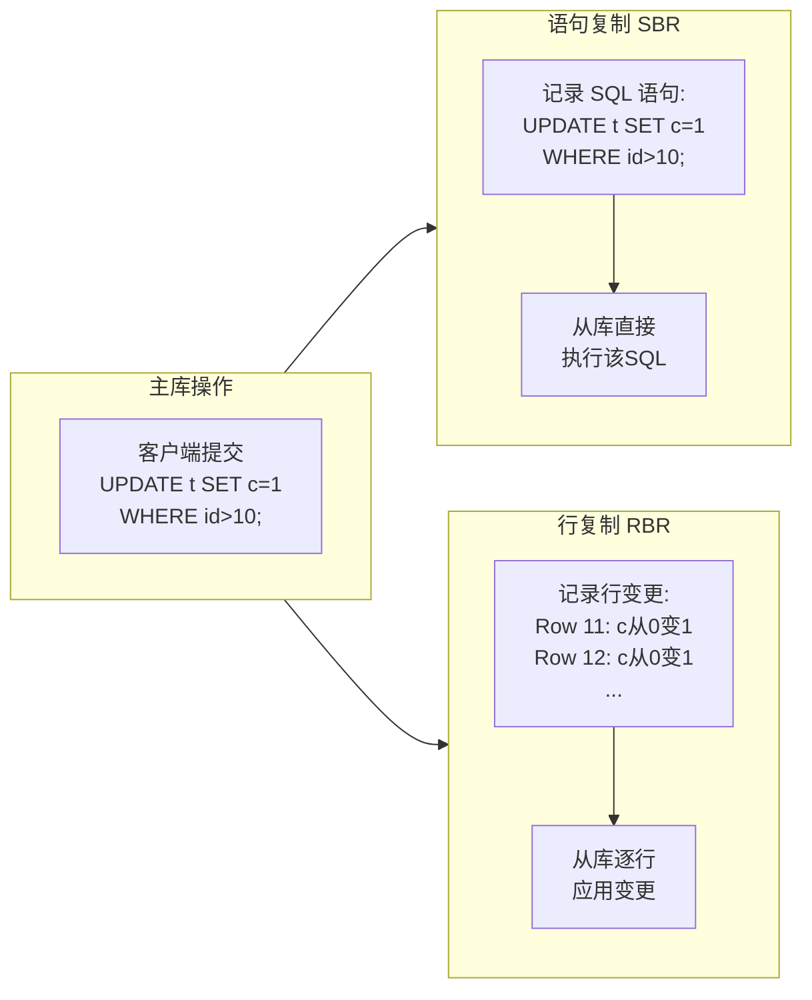
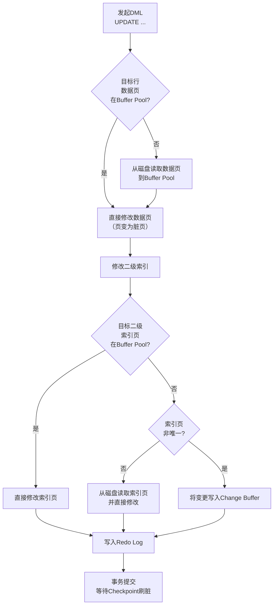
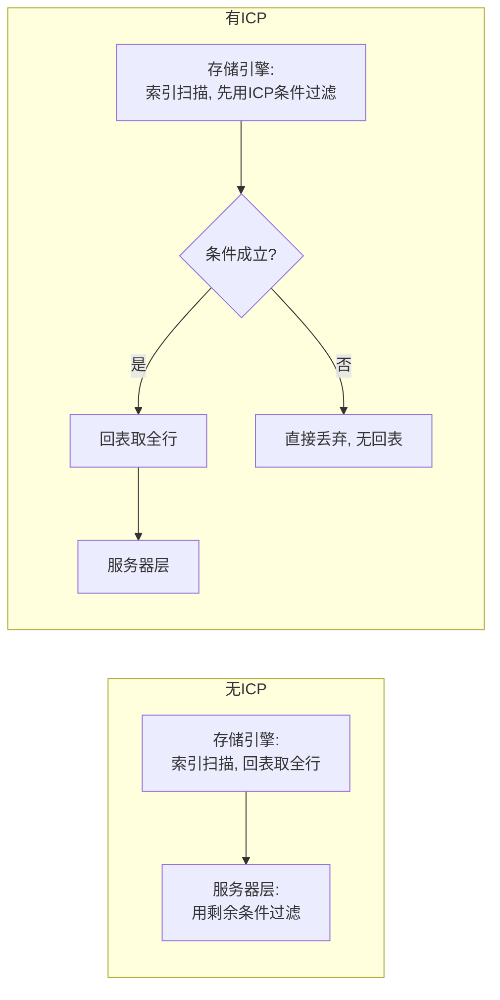
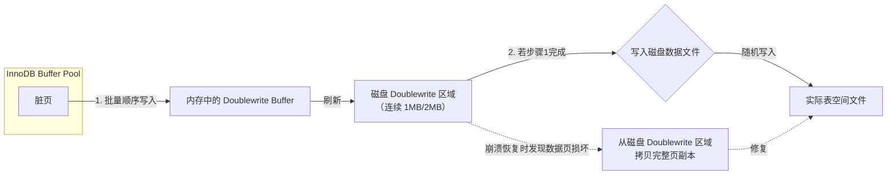

## 数据库缓存

数据库缓存机制是提升系统性能、降低数据库负载的核心手段。它贯穿于数据库内核、应用层和分布式架构，下面从内部缓存、外部缓存、核心算法、一致性问题及不同数据库实现这几个层面，为你详细拆解。

---

### 一、缓存的本质与分层

数据库缓存的目标是：**用更快的存储介质暂存热点数据，减少对慢速磁盘的访问**。从位置看，缓存可以分为三个层级：

1.  **数据库内部缓存**（如缓冲池、查询缓存、日志缓存）：由数据库引擎自动管理，对应用透明。
2.  **操作系统/文件系统缓存**：数据库依赖操作系统的页缓存来加速文件I/O，但数据库自身缓存通常能提供更精细的控制。
3.  **外部分布式缓存**（如 Redis、Memcached）：应用层主动管理，跨实例共享，是架构中独立的缓存层。

下面先深入最关键的内部缓存机制。

---

### 二、数据库内部缓存机制详解

这是数据库性能的基石，以 MySQL InnoDB 引擎和 Oracle 为主要例子。

#### 1. 缓冲池（Buffer Pool）—— 数据的核心缓存

缓冲池是数据库管理磁盘数据页（Page）的内存区域。几乎所有数据读写操作都要经过它。

-   **工作原理**：
    -   **读操作**：查询时，先检查目标数据页是否在缓冲池中。若命中，直接读取返回；若未命中，则从磁盘读取整个数据页（通常16KB）加载到缓冲池，再返回数据。
    -   **写操作**：修改数据时，不会直接写磁盘，而是先修改缓冲池中的页，将其标记为“脏页”。后台会通过`检查点`机制将脏页异步刷回磁盘。这就是“写时复制”思想的体现，极大提高写入并发。
-   **管理结构（以InnoDB为例）**：
    -   **LRU链表**：管理所有缓存的页。采用变种LRU算法，将链表分为“热区”（Young）和“冷区”（Old）。新读入的页先插入冷区头部，只有在一定时间后再次被访问才会移到热区，防止全表扫描一次性扫光缓存。
    -   **Free链表**：记录空闲可用的页。
    -   **Flush链表**：按脏页修改时间的顺序链接所有脏页，便于刷盘线程工作。
-   **配置核心**：`innodb_buffer_pool_size`，通常设置为物理内存的50%~80%。

#### 2. 变更缓冲（Change Buffer）—— 二级索引的写缓存

这是InnoDB特有的缓存。当对非唯一二级索引进行插入、更新、删除时，如果对应的索引页不在缓冲池中，操作会先暂存到变更缓冲，而不是立刻从磁盘读取索引页。当后续有读操作需要该索引页，或后台合并时，才将缓存的变更应用到磁盘页。

-   **收益**：将多次随机I/O合并为一次顺序I/O，大量节省写操作延迟。

#### 3. 查询缓存（Query Cache）—— 已淘汰的经典

MySQL 5.7及之前版本有全局的查询缓存。它直接缓存`SELECT语句及其完整结果集`。命中规则苛刻：SQL语句必须完全一致（包括空格、大小写），且任何涉及的表数据一旦变更，整个缓存就会全部失效。

-   **致命缺陷**：在高并发更新场景下，维护缓存的全局锁会成为严重的性能瓶颈。**MySQL 8.0已彻底移除该功能**。

#### 4. 其他重要内部缓存

-   **日志缓存（Log Buffer）**：存储即将写入 Redo Log 的日志记录，大小由`innodb_log_buffer_size`控制。事务提交时，日志会先写入这里，再按策略（如每次提交即刷盘）写入磁盘Redo Log文件，保证持久性。
-   **字典/元数据缓存**：缓存表定义、视图结构、存储过程等元数据，避免反复解析数据字典。
-   **结果集缓存（Result Cache）**：Oracle、SQL Server有此功能。它直接缓存查询结果，当查询涉及的表数据未变时，直接返回缓存结果，绕过了优化的解析和执行过程。Oracle需用`/*+ RESULT_CACHE */`提示启用。

---

### 三、缓存淘汰策略

当内存满时，如何选择淘汰页面？核心算法有：

-   **LRU（最近最少使用）**：淘汰最久未被访问的页。大多数数据库使用其变种，如上文的冷热分区LRU。
-   **LFU（最不经常使用）**：淘汰访问频率最低的页，可以避免偶发大批量操作污染缓存，但实现更复杂。Redis就支持LFU淘汰策略。
-   **CLOCK（时钟）**：一种近似LRU的环形链表算法，为每个页设访问标志位，指针循环扫描。PostgreSQL的共享缓冲池管理就基于CLOCK算法的变种。
-   **MRU（最近最常使用）**：适用于特定场景，比如全表扫描时，这些数据属于“用完即弃”，不应占据LRU头部，因此InnoDB的冷区就类似MRU思想，直接将这类页淘汰。

---

### 四、缓存一致性与应用层架构模式

当引入外部缓存（如Redis）后，如何保证缓存数据与数据库一致，是架构核心难点。

#### 常用模式

-   **Cache-Aside（旁路缓存）**：应用最广。
    -   **读**：先查缓存，命中返回；未命中则查数据库，写回缓存后返回。
    -   **写**：先更新数据库，成功后，**删除（或更新）缓存**。
-   **Read/Write Through（读写穿透）**：数据库本身不直接交互，缓存层代理读写。读写时，缓存层负责与数据库同步。对应用更友好，但实现复杂。
-   **Write Behind（写回）**：应用只写缓存，缓存层异步批量写回数据库。写入速度极快，但有数据丢失风险。

#### 关键的一致性问题和解决

以Cache-Aside模式下的“删缓存”为例，存在一致性陷阱：

-   **先删缓存，后更新数据库**：删除缓存后、更新数据库前的瞬间，另一请求可能查到旧数据并写入缓存，导致缓存长期是脏数据。
-   **先更新数据库，后删缓存**：推荐方式。异常发生在：缓存删除失败。解决是引入**重试机制**或使用**Canal等工具订阅数据库Binlog，进行异步删除/更新缓存**。
-   **延迟双删**：写操作时，先删除缓存 → 更新数据库 → 休眠一小段时间 → 再次删除缓存。用于二次清理可能在数据库主从复制延迟期间写入的脏数据。

---

### 五、不同数据库的缓存机制对比

#### 1. MySQL（InnoDB）
-   **核心**：Buffer Pool（基于冷热分区的LRU）。
-   **写缓存**：Change Buffer。
-   **日志缓存**：Log Buffer。
-   **查询缓存**：已移除，建议用外部Redis替代。

#### 2. PostgreSQL
-   **核心**：`shared_buffers`，进程共享的缓冲池，采用改进的CLOCK扫描算法。
-   **特色**：没有查询缓存，但高度依赖操作系统页缓存。数据从`shared_buffers`驱逐后，往往还在OS缓存中，形成双级缓存效果。
-   **应用层缓存**：常配合Redis或使用物化视图缓存复杂查询结果。

#### 3. Oracle
-   **体系庞大**：数据库缓冲区缓存（Buffer Cache）管理数据块，采用LRU全扫描与TOUCH计数相结合的策略。
-   **共享池**：缓存SQL解析树和执行计划（库缓存）及数据字典。
-   **保留池与回收池**：为不同大小的对象分配不同特性的缓存池。
-   **结果缓存**：内置的SQL结果集缓存和PL/SQL函数结果缓存。

#### 4. Microsoft SQL Server
-   **缓冲池**：统一管理数据页和索引页，基于改进的LRU-K算法（访问频率+时间）。
-   **计划缓存**：存储查询执行计划，避免重复编译。
-   **完整的结果集缓存**：在内存优化表中或通过`RESULT_SET_CACHING`特性启用。

#### 5. Redis —— 本身就是缓存
-   **数据结构**：不仅仅是键值对，支持丰富数据结构的直接缓存。
-   **淘汰策略**：八种策略（noeviction， allkeys-lru， volatile-lfu等），灵活应对不同业务。
-   **持久化**：RDB和AOF，既可作为缓存也可作为数据库。

---

### 六、经典缓存问题与解决方案（外部缓存层）

在应用与数据库之间使用Redis时，三大问题：

1.  **缓存穿透**：查询不存在的数据，请求直接穿透到数据库。
    -   **方案**：布隆过滤器过滤不存在的数据；或将空值也缓存，设置短过期时间。
2.  **缓存击穿**：热点数据key过期，大量并发请求同时打到数据库。
    -   **方案**：互斥锁更新缓存（只让一个线程回源）；或逻辑过期，后台线程异步刷新。
3.  **缓存雪崩**：大量key在同一时间过期，或Redis服务宕机。
    -   **方案**：key的过期时间加随机值；高可用架构（Redis Sentinel/Cluster）；限流降级；多级缓存（本地 + 远程）。

---

### 七、现代趋势与实践建议

-   **多级缓存架构**：客户端本地缓存（Caffeine） -> 远端Redis集群 -> 数据库缓冲池。每一层都过滤掉大部分请求。
-   **穿透与失效驱动的缓存更新**：使用Canal监听数据库Binlog，由消息驱动异步更新缓存，解耦应用逻辑，提高最终一致性。
-   **智能预热**：在大促或流量高峰前，对热点数据做离线分析并预先加载到缓存。
-   **切勿过度依赖查询缓存**：现代高并发OLTP场景，MySQL 8.0移除查询缓存是正确方向，完全应由更专业的外部缓存层（如Redis）替代，实现读写分离和细粒度控制。

数据库缓存机制是一个从微观内存页管理到宏观分布式架构的体系，合理利用内部缓存是数据库性能调优的基础，而巧妙设计外部缓存层则是构建高并发、高可用系统的关键。

## 查询缓存

数据库的缓存机制是一个从上到下、从内到外的多层次体系，在保证数据一致性的前提下，通过多级缓存和不同策略来应对特定问题，是保证系统性能的关键。下面我将从缓存类型、关键技术、异常场景和架构模式这几个层面来详细拆解。

### 📊 核心缓存类型与机制对比

数据库系统在内部设计了多种针对性极强的缓存，它们在目标、粒度和生命周期上均有不同。

| 缓存类型 | 核心目标 | 存储粒度 | 生命周期 | 典型应用（数据库） |
| :--- | :--- | :--- | :--- | :--- |
| **查询结果缓存** | 直接返回整个查询的结果集，避免重复执行开销最大的部分。 | 查询语句及其**完整结果集** | 复杂，通常随依赖的基表数据变更而主动失效。 | Oracle Result Cache, AnalyticDB Query Cache |
| **执行计划缓存** | 避免对结构相似的SQL语句进行重复的解析与优化（软解析）。 | 预编译的**查询计划(Query Plan)** | 基于LRU淘汰，或因统计信息更新、Schema变更而失效。 | Oracle Library Cache, SQL Server Plan Cache |
| **数据页缓存** | 缓存磁盘上的数据页，减少物理I/O，所有读写操作的核心枢纽。 | **数据页(Page)**<br>(如MySQL默认16KB) | 持久化、跨会话。脏页由Checkpoint机制刷盘。 | **几乎所有数据库**: MySQL InnoDB Buffer Pool, Oracle Buffer Cache, PostgreSQL Shared Buffers |
| **日志缓存** | 缓存事务日志（如Redo Log），将多次写操作合并为一次顺序I/O。 | **日志记录(Log Record)** | 极短，一旦事务提交或缓冲区满，就会被刷入磁盘日志文件。 | MySQL InnoDB Log Buffer, Oracle Redo Log Buffer |

### 🔍 深入查询结果缓存

在所有缓存类型中，**查询结果缓存 (Query Result Cache)** 最为直观，但它的实现充满了挑战。

*   **工作原理**：当一个查询开启并命中结果缓存时，数据库会进行精确匹配。它将收到的SQL语句（或标准化后的哈希值）作为Key，在缓存中查找Value（即上次执行的结果集）。一旦匹配成功，则直接从内存返回结果，从而跳过了解析、优化、执行等所有后续步骤，获得最快响应。

*   **缓存的命中与失效**
    *   **如何命中**：命中的关键是SQL文本的精确匹配。任何细微的文本差异（空格、大小写、注释）都可能导致缓存无法命中。Oracle在这一点上更智能，它使用标准化后的SQL文本进行匹配，因此对空白和大小写不敏感。
    *   **如何失效**：绝大多数数据库都采用**被动失效**机制。一旦查询所依赖的基表发生了任何数据修改（INSERT, UPDATE, DELETE），相关的查询结果缓存就会全部被标记为失效或被立即清除。
    > 这意味着，即使你只修改了亿级数据表中的一行，与该表相关的所有查询结果缓存也会瞬间全部失效。

*   **MySQL为何放弃Query Cache？**
    MySQL 8.0彻底移除了查询缓存功能，这源于其设计的根本缺陷：
    1.  **致命瓶颈**：关键在于**全局锁**。任何对缓存的访问和失效操作，都需要持有该锁。在高并发写操作下，锁的激烈争用会成为整个系统的性能瓶颈。
    2.  **粗放的失效机制**：其**表级失效**的策略导致大量有效缓存被“误伤”，内存中充满了很快就会被清理的无效数据。
    3.  **严格的匹配规则**：查询必须逐字节匹配，实用性大打折扣。

### ⚙️ 缓存淘汰算法：当内存写满时

当缓存空间告急时，淘汰算法决定哪些数据被移除以腾出空间。核心算法对比如下：

| 算法 (Algorithm) | 核心思想 (Core Idea) | 优点 (Pros) | 缺点 (Cons) |
| :--- | :--- | :--- | :--- |
| **LRU**<br>最近最少使用 | 淘汰**最久未被访问**的数据。 | 实现简单，符合局部性原理，应用最广泛。 | 易被偶发的大规模扫描操作污染，将热数据挤出。 |
| **LFU**<br>最不经常使用 | 淘汰**访问频率最低**的数据。 | 能更好地保留长期的热点数据，抗扫描污染能力强。 | 实现开销大，且对访问模式变化反应迟钝，旧热点难以淘汰。 |
| **ARC**<br>自适应缓存替换 | 同时跟踪LRU和LFU，**动态调整**淘汰策略。 | 命中率高，能自适应不同的访问模式，无需手动调参。 | 实现复杂，内存开销比LRU和LFU都要高。 |
| **MRU**<br>最近最常使用 | 淘汰**最近刚被访问**的数据。 | 适用于处理“数据被处理后很少再被访问”的场景，如全表扫描。 | 通用性差，不适合大部分读多写少的业务场景。 |

> 数据库常采用LRU的改进版。例如，Oracle的Buffer Cache将LRU链表分为**热端**和**冷端**，通过“Touch Count”（触控计数）避免频繁移动链表带来的锁开销。MySQL InnoDB的Buffer Pool同样使用了类似的**冷热分离LRU**算法，有效防止了全表扫描污染缓存。

### 📋 查询缓存 vs. 数据页缓存

为了清晰地理解这两种核心缓存，这里做一个对比：

*   **粒度不同**：查询缓存是**结果集**级别，颗粒度粗；数据页缓存是**数据块**级别，颗粒度细。
*   **复用对象**：查询缓存面向特定的、完全匹配的SQL查询；数据页缓存则对所有需要该数据页的操作透明，复用面更广。
*   **关键开销**：查询缓存基于SQL文本的哈希计算和匹配；数据页缓存基于磁盘I/O操作。
*   **更新影响**：查询缓存对数据更新极度敏感，全表失效；数据页缓存则只会将对应的数据页标记为脏页，影响非常小。

### 🚨 缓存应用三大难题

在实际应用中，不当的缓存策略可能引发严重问题：

1.  **缓存穿透 (Cache Penetration)**
    *   **现象**：查询一个数据库中**根本不存在**的数据，导致请求直接穿过缓存，每次都必须访问数据库。
    *   **解决方案**：
        *   **布隆过滤器 (Bloom Filter)**：使用布隆过滤器预先过滤掉大部分不存在的key请求。
        *   **缓存空对象**：将“不存在”的结果也进行缓存，并设置一个较短的过期时间。

2.  **缓存击穿 (Cache Breakdown)**
    *   **现象**：一个**热点数据**的key在缓存中过期，瞬间大量并发请求直接涌向数据库，造成巨大压力。
    *   **解决方案**：
        *   **互斥锁 (Mutex)**：在缓存失效时，只允许一个请求去加载数据库并重建缓存，其余请求等待。
        *   **逻辑过期**：缓存数据本身永不过期，由一个后台线程异步负责刷新。

3.  **缓存雪崩 (Cache Avalanche)**
    *   **现象**：**大量**缓存的key在同一时间点过期，所有请求瞬间全部打到数据库上，可能导致系统瘫痪。
    *   **解决方案**：
        *   **随机化过期时间**：在设置过期时间时，增加一个随机值，避免批量key同时过期。
        *   **高可用缓存集群**：使用如Redis Cluster等方案，避免单点故障。

### 🏗️ 外部缓存层的架构模式

当数据库内部缓存不足以支撑业务时，需要引入外部缓存层（如Redis）。常见的业务系统读写缓存模式有以下三种：

1.  **Cache Aside (旁路缓存)**
    *   **读**：先读缓存，命中即返回；未命中则读数据库，然后写入缓存。
    *   **写**：**先更新数据库，再删除缓存**（或使其失效）。
    *   **特点**：最常见的模式，由应用层直接控制缓存和数据库。

2.  **Read/Write Through (读写穿透)**
    *   **读**：缓存层自身负责从数据库加载数据，对应用透明。
    *   **写**：应用只写缓存，缓存层同步更新数据库。
    *   **特点**：简化了应用逻辑，但对缓存层的实现要求较高。

3.  **Write Behind Caching (异步缓存写入)**
    *   **写**：应用只写缓存，缓存**异步、批量**地写入数据库。
    *   **特点**：写入性能极高，但存在数据丢失的风险，适用于对一致性要求不高的场景。

### 💡 优化与实践建议

*   **缓存预热 (Cache Preheating)**：在系统启动或流量低谷时，手动或通过脚本将热点数据主动加载到缓存中，避免“冷启动”带来的性能抖动。
*   **监控与调优**：在MySQL中可使用`SHOW ENGINE INNODB STATUS\G`，在Oracle中可使用`V$RESULT_CACHE_OBJECTS`等视图来监控缓存的命中率和运行状况。
*   **避免过度设计**：不是所有查询都适合缓存。例如，对于实时性要求极高或数据变更频繁的场景，缓存带来的收益可能不足以抵消其复杂性。

## read committed & repeatable read

你问的这个问题很关键，它实际上是在对比 **MySQL InnoDB 的两种事务隔离级别：可重复读（REPEATABLE READ，RR）和读已提交（READ COMMITTED，RC）**。因为“不可重复读”是 RC 级别允许出现的现象，而 RR 级别会防止它。

这两种隔离级别的性能差异，主要源于它们为实现不同的一致性保证，采取了截然不同的**锁机制**和 **MVCC 快照策略**。下面是核心差异。

---

### 1. 锁机制的差异：这是性能差异的根本

这是两者最大的性能分水岭。

-   **可重复读（RR）下存在间隙锁（Gap Lock）**
    -   为防止**幻读**（同一个事务内两次范围查询结果不同），RR 会使用 **Next-Key Lock = 记录锁 + 间隙锁**。间隙锁会锁定索引记录之间的间隙，阻止其他事务在这个间隙中插入数据。
    -   **性能影响**：锁范围更大，更容易发生事务间的锁等待和死锁，尤其是在高并发插入、或对非唯一索引频繁操作时。例如，在一个范围更新语句中，会锁住很大的一个区间，导致纯插入操作也可能被阻塞。

-   **读已提交（RC）下禁用间隙锁**
    -   RC 级别只需要防止脏读，不需要防止不可重复读和幻读。因此，它**默认不使用间隙锁**（除了外键检查和唯一键冲突检测等特殊情况），只锁定查询命中的**具体行记录**。
    -   **性能影响**：锁的粒度更小，锁冲突概率大大降低，并发插入和修改的性能显著优于 RR。这是 RC 级别在高并发 OLTP 场景下性能更优的最直接原因。

### 2. MVCC 快照读机制的差异

这一项更多影响长事务下的空间与回收性能，而非直接的查询吞吐量。

-   **可重复读（RR）使用事务级快照**
    -   一个事务内，**所有快照读共享同一个 ReadView**（即在第一次快照读时创建）。这意味着，事务始终看到的是事务启动时的数据版本。
    -   **性能影响**：如果一个 RR 事务持续很长时间，那么即使其他事务已经提交了很多新数据，这个长事务的 ReadView 仍然需要访问那些被修改前的旧版本。这会导致 **undo log（回滚日志）无法被 purge 线程及时清理**。结果就是 undo log 膨胀，占用磁盘空间，并可能拖慢该表的查询性能（因为需要在很长的版本链上回溯）。

-   **读已提交（RC）使用语句级快照**
    -   事务内**每次执行快照读都会生成一个新的 ReadView**。
    -   **性能影响**：每次都生成新快照，意味着读操作本身有极微小的一点额外开销，但**几乎可以忽略不计**。最大的好处是，它不会长时间“拖拽”旧版本数据，undo log 能得到及时清理，系统更健康。因此，在存在长事务的系统中，RC 级别能有效避免 undo log 堆积带来的性能退化。

### 3. 一个影响更新性能的特殊优化：半一致性读

这是 RC 级别独有的一个性能加速点。

-   **RC 下的半一致性读（Semi-Consistent Read）**
    -   当一个 `UPDATE` 语句扫描到某行，发现该行已被其他事务加了排他锁，在 RC 级别下，它会先检查该行的当前已提交版本是否满足 `WHERE` 条件。
    -   **如果满足**：等待锁释放。
    -   **如果不满足**：直接跳过该行，继续扫描下一行，避免无谓的锁等待。
-   **RR 下则没有此优化**。一旦遇到被锁定的行，它必须阻塞等待，直到锁释放后才能判断该行是否匹配。这在并发更新的混合负载中，会让 RC 级别的更新性能明显更优。

### 4. 主从复制的潜在间接影响

虽然严格来说不是直接性能差异，但会直接影响架构的兼容性和选择。

-   MySQL 的**基于语句的复制（Statement-Based）** 在 RC 级别下存在较多不确定性（如 `UPDATE/DELETE` 带有 `LIMIT` 可能导致主从数据不一致），因此 **RC 级别必须配合行级复制（Row-Based）** 使用。
-   而在 RR 级别下，两种复制格式都可以安全使用。在 MySQL 5.7 之前，默认是语句复制，所以 RR 是必需的默认隔离级别。现在默认的 ROW 格式让 RC 成为了更主流的选择，也在客观上推动了 MySQL 整体性能的提升。

---

### 结论：应该怎么选？

-   **从纯粹的性能和并发度看，读已提交（RC）几乎全面优于可重复读（RR）。**
    -   锁范围更小，锁冲突和死锁更少。
    -   配合行级复制，是主流的“黄金搭档”。
    -   能及时清理 undo log，对长事务系统更友好。
    -   **大多数互联网业务、高并发的 OLTP 系统，都推荐使用 RC 级别。**

-   **可重复读（RR）的优势在于一致性更“直觉”。**
    -   事务内读到的数据始终不变，对开发者思维负担小。
    -   如果你的应用逻辑强依赖事务内数据的完全一致（例如生成复杂的财务对账报表，且使用不可重复读的读会导致计算错误），或者还有旧系统迁移遗留问题，那么保持默认的 RR 也有其合理性。

如果需要，我可以进一步解释 RC 级别下避免死锁的一些具体实践。

## ROW & STATEMENT

语句复制（SBR）和行复制（RBR）是MySQL的两种核心复制模式，RBR默认不记录原始的SQL文本。

### ⚙️ 工作机制对比

下面的流程图直观地展示了两种模式在主库和从库上的不同执行路径：



其核心区别在于：

*   **语句复制 (SBR)**：记录和执行的是**SQL语句**本身。主库执行的SQL会被忠实地写入二进制日志，从库再执行完全相同的SQL。
*   **行复制 (RBR)**：记录和应用的是每一**行数据的变化**。主库只将数据变更的具体内容（如前镜像和后镜像）记录到日志中，从库直接应用这些行级变更。

**⚠️ 关键行为差异：触发器**
这是理解两种模式行为差异的绝佳例子。
*   **使用RBR**：主库上的触发器会正常执行，但**从库上不会再次执行**。主库触发器对数据行造成的变更，会作为行事件被复制到从库并应用。
*   **使用SBR**：主库执行的SQL语句会被复制，因此，**从库在重放该语句时会再次触发并执行**本地的触发器。如果从库上不存在对应的触发器或触发器逻辑有差异，就会导致主从数据不一致。

---

### ⚖️ 优缺点深度对比

除了机制的差异，两者的优缺点也直接决定了适用场景。

| 特性 | 语句复制 (SBR) | 行复制 (RBR) |
| :--- | :--- | :--- |
| **日志大小** | **较小**。对于影响大量行的操作（如批量`UPDATE`），只记录一行语句，能显著节省日志存储和备份恢复时间。 | **可能非常大**。因为要记录每一行的变更，日志量会急剧膨胀。 |
| **数据一致性** | **存在风险**。对于`UUID()`、`NOW()`这类非确定性函数，以及含有`LIMIT`但无`ORDER BY`的语句，难以保证主从数据完全一致。 | **高度一致**。直接复制行的最终变更结果，几乎在所有场景下都能保证数据准确无误，是目前保证数据一致性的首选。 |
| **对确定性函数的依赖** | **强依赖**。要求复制环境中的所有函数必须是确定的，并给开发和运维带来约束。 | **不依赖**。只复制函数执行后的结果，对函数本身是否确定无要求。 |
| **复制效率** | **高效**。对于批量操作，主库和从库都只需执行一次语句，效率高。 | **可能较低**。批量操作在从库上会被分解为大量行级操作，可能导致更高的负载和延迟。 |
| **可审计性** | **易于审计**。二进制日志包含了所有修改数据的SQL语句，便于追踪问题和分析。 | **难以直接审计**。日志记录的是行级变更，在MySQL 5.6.2之前无法直接看到SQL，现在可通过参数(`binlog_rows_query_log_events`)记录原始SQL。 |
| **锁行为** | 可能需要更多的行级锁（如`INSERT ... SELECT`）或锁住更多行。 | 对于InnoDB表，`UPDATE`/`DELETE`的锁定行数更少。 |

---

### 🎯 如何选择与最佳实践

选择哪种复制模式，取决于你的具体业务需求。强烈建议优先考虑基于行的复制（RBR），因为它是公认保证数据一致性的最佳选择，也是现代MySQL版本的默认设置。它几乎是所有需要高数据一致性场景的唯一推荐选项，能从根本上解决使用`LIMIT`、`ORDER BY`、非确定性函数等带来的潜在数据不一致风险。

对于现有业务，如果要从SBR迁移到RBR，需要充分评估因日志量暴涨带来的磁盘、I/O和网络压力。虽然混合模式（Mixed）可以作为一个临时过渡或备选方案，它在大部分时候使用SBR，仅在遇到非确定性语句时自动切换为RBR，但混合模式仍存在一致性问题，不推荐作为长期方案。

#### 🔧 RBR下的特殊配置建议
在使用RBR时，建议开启 `binlog_rows_query_log_events` 参数，它会在二进制日志中额外记录原始的SQL语句。虽然这会略微增加日志量，但能完美解决RBR模式下日志可读性差、无法进行SQL审计的问题。

---

### 📝 总结
简单来说，除了特殊的审计需求或对日志大小极为严苛的环境，基于行的复制（RBR）凭借其无与伦比的数据一致性，是现代MySQL主从复制的不二之选。

## MDL

MDL（Metadata Lock，元数据锁）是MySQL 5.5引入的一种表级锁，由系统自动管理。它的核心作用是**保护表的元数据（即表结构定义）的一致性**，防止并发的DML（数据操作，如增删改查）和DDL（结构变更，如加字段）操作相互干扰，从而导致数据错乱。

你可以想象一张表的“说明书”，上面写着有哪些字段、是什么类型。MDL锁就是确保在有人“看书”（DML）时，没人能改动这份“说明书”（DDL）。

### ⚙️ MDL锁机制详解

MDL锁主要分为读锁和写锁，其设计遵循特定的并发规则。

| 特性 | MDL读锁 (共享锁) | MDL写锁 (排他锁) |
| :--- | :--- | :--- |
| **触发操作** | 日常的CRUD操作，如 `SELECT`, `INSERT`, `UPDATE`, `DELETE` | 表结构变更操作，如 `ALTER TABLE`, `CREATE INDEX`, `DROP TABLE` |
| **锁兼容性** | **读锁之间共享**：多个线程可同时对一张表执行CRUD操作 | **写锁之间互斥**：一个DDL会阻塞其他DDL。**读写互斥**：DDL会阻塞所有CRUD操作 |
| **加锁与释放** | 在语句执行开始时自动加锁，**在事务提交（COMMIT）或回滚（ROLLBACK）后才释放** | 同左 |

### 🌪️ 故障场景：`Waiting for table metadata lock`

`Waiting for table metadata lock` 状态，是MySQL中一个著名的锁等待状态。当一个会话出现此状态时，意味着**它不仅会阻塞持有锁的长事务，还会像一堵墙一样，阻塞之后所有对该表的访问请求**。

#### 故障场景模拟

下面是一个典型的故障模拟，展示了MDL写锁如何引发连锁阻塞：

| 时间线 | 会话 A (一条普通的 `SELECT` 查询) | 会话 B (一个 `ALTER TABLE` 操作) | 会话 C (另一个无辜的新查询) | 状态说明 |
| :--- | :--- | :--- | :--- | :--- |
| **T1** | `BEGIN;`<br>`SELECT * FROM orders;` | - | - | **会话A**开始一个长事务，获取并持有表的**MDL读锁**，迟迟未提交。 |
| **T2** | 事务进行中…… | `ALTER TABLE orders ADD COLUMN ...;` | - | **会话B**执行DDL，需要获取**MDL写锁**。由于和会话A的读锁互斥，它进入**等待**状态。 |
| **T3** | 事务仍在进行中…… | `Waiting for table metadata lock` | `SELECT * FROM orders;` | **会话C**尝试执行一个新的查询。但由于MDL锁的“公平队列”机制，它必须排在**等待写锁的会话B后面**，也被阻塞。 |
| **T4** | 事务提交，释放读锁。 | 获取写锁，执行DDL。 | 等待中，直到DDL完成。 | 连环阻塞形成，直到**会话A**提交事务，整个链条才会解开。 |

### 🚀 如何避免与处理

要避免这类严重故障，可以采取以下措施：

1.  **首要原则：避免长事务**：这是最根本的解决方案。及时提交事务，避免在事务中执行非数据库操作（如调用外部API、处理本地文件等），以尽快释放MDL锁。

2.  **故障排查与定位**：
    *   **监控等待状态**：通过 `SHOW PROCESSLIST;` 查看是否存在大量 `Waiting for table metadata lock` 状态的线程。
    *   **利用监控表**：在MySQL 8.0中，`performance_schema.metadata_locks` 表功能强大，可以帮助你定位谁持锁、谁等锁，从而迅速找到元凶线程。

3.  **安全替代工具**：
    *   **`pt-online-schema-change` (pt-osc)**：Percona Toolkit中的王牌工具，通过在后台创建影子表并进行数据拷贝，最后在短暂的写锁窗口下完成原子切换，是生产环境执行DDL的推荐方式。
    *   **`gh-ost`**：GitHub开源的在线DDL工具，同样采用无触发器设计，是 `pt-osc` 的有力竞争者。

4.  **调整等待超时**：通过设置 `lock_wait_timeout` 参数，可以限制MDL锁的等待时长，避免无限期阻塞。

5.  **利用优化功能**：一些云数据库厂商（如阿里云PolarDB-X）提供了抢占式MDL锁优化，能在DDL等待超时时主动断开阻塞它的长事务，自动解围。

## 意向锁

意向锁是 InnoDB 存储引擎中一种**表级锁**，它和 MDL 完全不在一个层次。它的主要作用是**协调行锁和表锁之间的关系**，让两者可以高效共存。

### 🎯 核心作用：表锁和行锁的“红绿灯”

InnoDB 的核心并发控制是行级锁，但像 `LOCK TABLES ... WRITE` 或 `ALTER TABLE` 这类操作需要加表级锁。

这就产生了一个问题：当事务 A 要锁住全表时，它如何快速知道事务 B 或 C 是否持有某一行的锁？如果没有意向锁，它只能去遍历整个表的所有行锁，这非常低效。

意向锁就像一个**路口的红绿灯信号**，让表锁能一眼看到全局状态，而不用去检查每一辆车（行锁）。

### ⚙️ 工作流程：过两道关卡

事务在操作数据时，需要过两道“关卡”：

1.  **先申明意图（加意向锁）**
    *   一个事务想加行锁（比如 `SELECT ... FOR UPDATE`），会先在**表级别**加一个**意向共享锁（IS）**，宣告“我准备读一些行”。
    *   一个事务想加排他锁（比如 `UPDATE`），会先在**表级别**加一个**意向排他锁（IX）**，宣告“我准备修改一些行”。

2.  **再执行操作（加行锁）**
    *   意向锁成功获得后，事务再**在具体的行上**加上 S 锁（共享锁）或 X 锁（排他锁）。

当一个事务（如 `ALTER TABLE`）想加表级 X 锁时，它只需要看一眼表上的“信号灯”。如果发现有 IX 锁，就知道有事务正在修改行，于是它必须等待。这比去检查数万行锁快得多。

### 🤝 意向锁的兼容性

意向锁之间是**完全兼容**的，它们只在表锁层面设卡。

| 锁类型 | 意向共享锁 (IS) | 意向排他锁 (IX) |
| :--- | :--- | :--- |
| **意向共享锁 (IS)** | ✅ 兼容 | ✅ 兼容 |
| **意向排他锁 (IX)** | ✅ 兼容 | ✅ 兼容 |

**真正的冲突点在表锁**。意向锁就是用来和表锁博弈的：

| 请求的表锁 \ 已有的意向锁 | 意向共享锁 (IS) | 意向排他锁 (IX) |
| :--- | :--- | :--- |
| **表级共享锁 (S)** | ✅ 兼容 | ❌ 冲突 |
| **表级排他锁 (X)** | ❌ 冲突 | ❌ 冲突 |

这个表解释了：表级 S 锁（如 `LOCK TABLES t READ`）可以与持有 IS 锁的行级读事务共存；但任何表级排他操作（如表级 X 锁），都必须等待所有 IS/IX 锁释放，也就是等待所有活跃的读写事务结束。

### 🆚 与 MDL 锁的直观对比

你刚了解了 MDL 锁，它们容易混淆，但本质不同：

| 特性 | 意向锁 (Intention Lock) | MDL 锁 (Metadata Lock) |
| :--- | :--- | :--- |
| **所属层次** | **InnoDB 存储引擎层**，是事务锁 | **MySQL Server 层**，是全局锁 |
| **保护对象** | **数据行**的一致性，协调行锁与表锁 | **表结构定义（元数据）**的一致性 |
| **粒度与类型** | 只有 IS 和 IX 两种，是表级意向 | 有多种类型，如 MDL_SHARED_READ, MDL_EXCLUSIVE |
| **用户感知** | 几乎透明，可通过 `SHOW ENGINE INNODB STATUS` 查看 | 故障时感知明显，如 “Waiting for table metadata lock” |
| **自动性** | 完全自动，加行锁前必定先加意向锁 | 完全自动，DML/DDL 操作时自动加/放 |

简单总结：**MDL 保护表结构，意向锁为数据行的表级操作提供高效判断。**

### 🧩 特殊情况：意向锁会导致死锁吗？

意向锁本身不会直接导致死锁，但它会参与死锁的形成。典型场景是：一个事务先获得 IX 锁并修改了数据行，另一个事务想获取表级 S 锁（如 `LOCK TABLES t READ`），被 IX 阻塞。随后，第一个事务又需要申请新的锁，就可能形成循环等待导致死锁。

如果你需要排查这类问题，我可以再具体介绍分析 InnoDB 死锁日志的方法。

## S & IX

这个问题非常核心，直指**锁语义冲突**的本质。

简单说，S 锁和 IX 锁之所以冲突，是因为 **S 锁要求整个表完全没有修改，而 IX 锁恰恰宣告了表里“正在进行修改”。** 这两者从根本上互斥。

下面我们拆解一下为什么它们不能共存。

### 1. 从锁的“声明”看冲突

-   **表级 S 锁的声明**：我想要**整个表**共享读取。在我持有锁期间，**不允许任何人在表上做任何修改**。我需要看到的是一个完全静止、一致的快照（或者至少保证没有并发的写入）。
-   **IX 锁的声明**：我（某个事务）打算或已经在**这个表中的某些行上持有了排他（X）锁**，也就是**我正在进行修改操作**。

当一个事务试图加表级 S 锁时，它会检查表上的意向锁。如果发现了 IX 锁，就相当于知道：“已经有人在改这个表里的数据了”。这直接违背了 S 锁“不许有任何修改”的根本要求，所以 S 锁必须等待。

### 2. 从数据一致性角度看冲突

我们可以想象一个具体的例子，假如 S 锁和 IX 锁**可以**共存，会发生什么：

1.  **事务 A** 对一张订单表加了 **表级 S 锁**，想执行一个需要长时间运行的报表查询，希望在此期间**整个表的数据不被修改**。
2.  同时，**事务 B** 想修改其中一行订单的状态，它先成功获取了 **IX 锁**（因为假设兼容），然后在那一行加了 **X 锁**，并完成了修改提交。

这会直接导致**事务 A 的报表查询出现不可重复读甚至幻读**。它第一次读到订单状态是“待支付”，第二次再读可能就变成了“已支付”。表级 S 锁的本意就是要阻止这种情况，提供一个完全一致的读视图，但现在被 IX 锁破坏了。

因此，S 锁必须和任何修改意图（IX）互斥，才能保证其语义成立。

### 3. 对比：为什么 IS 锁可以和 S 锁兼容？

这能帮助你更清晰地理解“意图”的差异：

-   **IS 锁的声明**：我打算或已经在某些行上持有了**共享（S）锁**。我只想读某些行，**保证这些行不被别人改就行**，我不会主动去改数据。
-   **S 锁的声明**：我要**整个表**都不能被改。

这两个声明没有矛盾。多个事务可以同时共享读整个表，或者有些事务读全表，有些只读部分行。它们都是只读操作，所以 IS 锁和 S 锁完全兼容。

### 总结

冲突的根源在于 **IX 锁代表了“表中存在修改操作”**，而 **S 锁代表了“表中不允许任何修改”**。这是一个零和博弈，无法共存。

可以用一个比方来帮助记忆：

-   **表级 S 锁**：图书馆闭馆盘点的管理员，要求全场不得喧哗和移动书籍。
-   **IX 锁**：一个在馆内某书架上修改书页内容的读者的意图声明。
-   **冲突**：只要馆内有一个读者正在（或打算）改书（IX锁），管理员就无法宣布“全场静默、无修改”（S锁），必须等所有修改意图结束。

希望这个解释让你对锁的互斥逻辑有更清晰的理解。如果你还想了解 InnoDB 中同样微妙的 AUTO-INC 锁或临键锁，我可以接着介绍。

## 行级锁

是的，在 InnoDB 中，**行级锁是加在索引记录上的**。具体说就是：**对于有聚簇索引的表，行锁就加在聚簇索引的叶子节点（即数据行所在的索引记录）上**。

下面分几种情况详细解释，让你对整个锁的实现原理一目了然。

### 1. 核心原则：锁加在索引上

InnoDB 的行级锁并不是直接锁住磁盘上的某一行数据，也不是通过内存中的行 ID 来锁定，而是通过**在索引记录上加锁**来实现的。这个索引可以是：

-   **聚簇索引 (Clustered Index)**：存放的是完整的数据行。
-   **二级索引 (Secondary Index)**：存放的是索引键和对应的主键值。

所以，当你说“对某一行加锁”时，实际上就是对**聚簇索引中的那条记录**加锁。

### 2. 不同查询场景下的加锁对象

#### 场景一：通过聚簇索引直接定位行

-   **查询**: `SELECT * FROM t WHERE id = 10 FOR UPDATE;` (id 是主键)
-   **加锁位置**: 直接在主键索引上，对 `id=10` 这条**聚簇索引记录**加排他锁（X锁）。这是最直接的情况，锁就加在存放这行数据的索引记录上。

#### 场景二：通过二级索引定位行

这是最容易产生疑惑的地方，请看一个具体例子：

-   **表结构**: `t(id INT PRIMARY KEY, name VARCHAR(20), KEY idx_name(name))`
-   **查询**: `SELECT * FROM t WHERE name = 'Alice' FOR UPDATE;`

加锁分为两步，会锁住两个索引上的记录：

1.  **在二级索引上**: 对 `idx_name` 索引中 `name='Alice'` 的**二级索引记录**加排他锁。
2.  **在聚簇索引上**: 根据二级索引中查到的 `id` 值，**回表**到聚簇索引，再对对应的**聚簇索引记录**加排他锁。

**为什么两个索引都要锁？**
这是为了**彻底阻止其他事务通过不同路径访问同一行数据**。

-   如果只锁二级索引，其他事务依然可以通过主键直接修改该行，导致数据不一致。
-   如果只锁聚簇索引，其他事务可以通过 `name='Alice'` 的索引扫描修改数据（例如 `UPDATE t SET name='Bob' WHERE name='Alice'`），在可重复读级别下可能破坏隔离性。

#### 场景三：全表扫描（无可用索引）

-   **查询**: `SELECT * FROM t WHERE non_index_col = 'x' FOR UPDATE;`
-   **加锁位置**: 由于 `non_index_col` 没有索引，MySQL 必须进行全表扫描。这时，**主键索引上所有被扫描到的记录都会被加锁**。在可重复读隔离级别下，还会加上大量间隙锁，甚至可能锁住全表。

这从侧面印证了：锁是加在索引上的。没有索引时，只能粗暴地遍历并锁定聚簇索引的所有记录。

### 3. 如果表没有显式的主键呢？

InnoDB 必定会创建一个聚簇索引：

-   有主键用主键。
-   没有主键，用第一个唯一非空索引。
-   都没有，InnoDB 会**自动生成一个隐藏的 6 字节的 `ROW_ID` 作为聚簇索引**。

在这种情况下，行锁就加在这个**隐藏的聚簇索引记录**上。对用户完全透明，但机制不变。

### 4. 一条容易混淆的“锁”概念

有时你会看到 `FOR UPDATE` 在二级索引列上锁定了一个**间隙（Gap）**，例如防止其他事务插入 `name='Alice'` 的新记录。这个**间隙锁是加在二级索引上的**，而不是直接加在聚簇索引上。

但聚簇索引上也会相应地加记录锁和间隙锁，以维护一致性。永远记住：**行锁的载体是索引，而聚簇索引是锁定数据行的最终锚点。**

---

**简单总结成一句话：InnoDB 的行级锁通过索引实现，对数据行的锁定最终都落在聚簇索引的记录上。**

## 自适应 Hash 索引

自适应哈希索引（Adaptive Hash Index，下文简称 AHI）是 InnoDB 存储引擎内置的一项“智能”性能优化特性。

*   **定义**：它是一种完全在**内存**中构建，**自动管理**的哈希索引，旨在加速特定的查询模式，让 InnoDB 在处理某些负载时表现得像一个内存数据库。
*   **核心理念**：当数据完全在内存中时，哈希索引的 O(1) 查找效率极高。AHI 正是自动捕捉这个机会，为热点数据建立哈希索引，且此过程对用户完全透明。

你可以把它想象成一个“内挂加速器”。当引擎发现有人反复走同一条复杂的路线去访问相同的数据页时，就会自动生成一个“快捷方式”（AHI），下次就能直接到达。

### ⚙️ AHI工作原理

AHI的构建是一个精密的自动决策过程，可以概括为“智能追踪，按需构建”，主要包含以下步骤：

1.  **自动监控**：InnoDB 会持续监控对B+树索引的查询模式。
2.  **触发构建**：其算法会判断为某些热点数据创建哈希索引的收益是否大于维护成本。如果判断为“是”，则自动触发构建。
3.  **逐步构建**：InnoDB 只会为高频访问的索引页建立哈希索引，通常需要一个索引被连续访问多次，比如17次后，系统才会启动分析。
4.  **动态调整**：AHI 会随访问模式的变化，自动创建新的哈希索引，并淘汰不再使用的旧索引。

技术上，AHI可以理解为一个“**索引的索引**”，它把频繁使用的索引键值作为哈希Key，直接映射到缓冲池中对应数据页的指针上，从而跳过了B+树的查找路径。

### 🚀 性能优势与适用场景

*   **极速等值查询**：AHI 将 B+树 O(log N) 的查找复杂度优化到接近 O(1)，在 `=` 或 `IN` 等精确匹配查询中性能提升显著。
*   **热点数据加速**：数据集中在内存且被频繁访问时，AHI 非常有效，这也是它的理想工作场景。
*   **降低CPU负载**：尤其当 B+树层级较深时，它能跳过遍历，节省CPU。

基于这些特点，AHI的**最佳应用场景**如下：

*   **大量单行记录查询**：如用户中心或Passport服务的查询。
*   **高频等值查询（JOIN / IN）**：尤其对于 `IN` 包含大量值的查询，优势非常明显。
*   **联合索引**：当查询条件始终遵循最左前缀匹配原则时，能够高效利用 AHI。
*   **只读或读密集场景**：它在这种负载下的提速效果尤为突出。

在典型的OLTP场景中，AHI的查询效率通常能占主导，如果AHI查找占比远超50%，说明它工作良好。虽然主要是针对等值查询，但对 `SELECT * FROM t WHERE a > 100 LIMIT 1` 这类SQL，也能加速索引首条记录的定位，从而优化查询。

### ⚠️ 代价、限制与潜在风险

*   **内存资源消耗**：这是 AHI 最主要的**代价**。AHI 完全在 InnoDB Buffer Pool 中构建，会挤占用于缓存数据页的空间。
*   **高并发性能瓶颈**：在MySQL 5.7以前，AHI结构由单一闩锁保护，在高并发下（如多个表做JOIN）可能成为严重性能瓶颈。
*   **功能局限性**：AHI **仅支持等值查询**，对于范围查询、`LIKE`模糊查询或`ORDER BY`排序等操作通常无效。
*   **维护与误判风险**：在写入频繁的场景，维护 AHI 会产生开销。此外，自动启用机制也可能误判，为不合适的负载创建 AHI，此时反而会降低性能。

### 🛠️ 配置与管理

AHI 的配置相对简单，但理解其机制至关重要。

*   **开启/关闭**：由系统变量 `innodb_adaptive_hash_index` 控制，**默认开启（ON）**。您可以在运行时动态修改，但应结合监控谨慎决策。
*   **分区优化**：为避免高并发的闩锁争用，MySQL 5.7引入了分区特性，通过 `innodb_adaptive_hash_index_parts` 变量将 AHI 分成多个独立分区。
    *   **默认值**为 `8`，最大值为 `512`。
    *   **调优建议**：在高并发场景，建议逐步增加。对于 `innodb_buffer_pool_size` 超过 32GB 的环境，可以设置为 `16` 以缓解竞争。

### 🔍 如何监控与调优决策

通过监控关键指标，您可以判断 AHI 对系统的影响，从而做出正确的调优决策。

**1. 查看 AHI 整体状态**
您可以通过以下SQL快速检查，获取哈希表使用情况等信息：
```sql
SHOW ENGINE INNODB STATUS\G
```


**2. 核心监控指标**
使用以下SQL分析查询模式：
```sql
SELECT VARIABLE_VALUE FROM performance_schema.global_status 
WHERE VARIABLE_NAME IN ('Innodb_hash_searches', 'Innodb_non_hash_searches');
```


*   **关键判断**：若 `AHI_ratio = Innodb_hash_searches / (Innodb_hash_searches + Innodb_non_hash_searches)` 的比值：
    *   **稳定高于 0.7**，说明 AHI 效果显著。
    *   **低于 0.2**，则可能没有帮助，甚至可考虑关闭。
    *   **注意**：此指标代表查询尝试使用 AHI 的比例，而非命中率。

**3. 诊断争用（Semaphore Waits）**
在 `SHOW ENGINE INNODB STATUS` 的输出中查看 `SEMAPHORES` 部分。如果大量线程在等待名为 `btr0sea.c` 创建的锁，说明 AHI 引发了闩锁争用，此时应考虑增加分区数或关闭它。

### 💎 总结与最佳实践

AHI 是一个强大的自动优化工具，但并非普适的万能药。

1.  **默认开启，监控优先**：对于大多数系统，保持默认开启是好的起点。先在业务低峰期做好性能基线记录。
2.  **读多写少是它的最佳舞台**：如果应用主要是等值查询，AHI 会发挥最大价值；在写入密集的场景，则需警惕其维护开销。
3.  **对症下药解决瓶颈**：遇到性能问题，应先通过监控确认根源是 `btr0sea.c` 闩锁争用，再决定是增加分区还是关闭 AHI。
4.  **使用基准测试做决策**：由于不同业务负载差异巨大，最可靠的判断方法是，在启用和禁用 AHI 的状态下分别进行压力测试，让数据说话。

## redo log loop

Redo log 之所以设计成环形写入，根源在于它 **“固定容量，循环复用”** 的物理结构。它存在的唯一目的就是崩溃恢复，不需要无限增长，因此可以用固定空间换来极致的写入性能。

下面为你详细拆解。

### 🔄 为什么是环形写入？

你可以把 Redo log 想象成一个**环形的“跑步记录仪”**，空间固定，只能不断地向后记录，记录满了就回到开头覆盖最早的内容。

这样设计有两个核心原因：

1.  **空间固定，无需动态扩容**
    Redo log 文件的总大小由 `innodb_log_file_size` 和 `innodb_log_files_in_group` 两个参数决定，是预先在磁盘上分配好的一组固定大小文件（如 ib_logfile0, ib_logfile1）。逻辑上，它们首尾相连，形成一个闭环。

2.  **顺序写入，性能极致**
    磁盘最快的写入方式就是顺序写。环形结构让 Redo log 的写入可以理解为在一个连续的空间里一直前进，只有在回到开头时才做一次“定位”，完美避开了随机 I/O。

写入位置由 **LSN (Log Sequence Number，日志序列号)** 标记，它是一个不断递增的全局数字。但文件的物理空间是固定的，所以 LSN 需要通过取模运算，映射到环形空间的具体字节偏移上。这就好比：虽然里程表在永无止境地跳转，但记录仪的纸带只有一条，用完最后一格就得回到第一格，擦掉旧内容写新内容。

---

### ⏳ 会保留到什么时候？

Redo log 记录不能被随意覆盖，因为它承担着崩溃恢复的重任。它覆盖的底线是：**对应的脏页必须已经安全刷入磁盘。**

这个过程由 **Checkpoint (检查点)** 机制精准控制，简单概括就是：**脏页不落地，日志不能弃。**

-   **触发覆盖的机制**：InnoDB 会不断将内存缓冲池中的脏页刷新回磁盘上的数据文件。刷盘成功后，就可以将这些数据页对应生成的 Redo log 标记为“可覆盖”了。这个标记操作就是 Checkpoint。
-   **Checkpoint 推进**：Checkpoint LSN 是一个指针，指向第一个尚未刷盘的脏页所对应的 Redo log 位置。所有位于 Checkpoint LSN 之前的日志，就属于已完成使命、可以被新日志安全覆盖的部分。
-   **环形写入的生死线**：当 Redo log 写满一圈，即将覆盖到 Checkpoint LSN 时，这意味着“记录仪没空白了，但还有旧记录没转换成最终数据”。此时，写入操作会**被迫暂停并等待**，直到脏页刷盘，Checkpoint 前移，腾出足够的安全空间。

所以，Redo log 的保留时间并非某个固定秒数，而是**从生成开始，直到对应脏页被写入磁盘之间的这段时间**。

---

### ⚠️ 核心配置与关键风险

#### 1. 关键参数
-   **`innodb_log_file_size`**：单个 Redo log 文件大小。大的文件能容纳更多增量日志，让 Checkpoint 有更宽松的推进时间，减少刷脏压力，但会延长崩溃恢复时间。
-   **`innodb_log_files_in_group`**：文件组个数。和单个文件大小一起决定了 Redo log 的总环形空间。

#### 2. 致命风险：Checkpoint 推进受阻
当出现大量并发写入，或刷脏页速度过慢时，Redo log 生成速度远高于 Checkpoint 推进速度。一旦环形空间写满，所有写事务都会完全阻塞，直到腾出空间。这时在 `SHOW ENGINE INNODB STATUS` 中会看到大量 `log writer waiting for checkpoints` 的告警。

#### 3. 与 Binlog 的区别
这一点容易混淆，简要对比如下：

| 对比维度 | Redo Log | Binlog |
| :--- | :--- | :--- |
| **产生层** | InnoDB 存储引擎层 | MySQL Server 层 |
| **记录内容** | 物理级别的“某页某偏移做了何改动” | 逻辑级别的“执行的 SQL 语句或行变更” |
| **写入方式** | **环形写入**，空间固定，循环覆盖 | **追加写入**，文件不断滚动增长 |
| **核心作用** | 崩溃恢复，保证事务持久性 | 主从复制、数据备份恢复 |

---

### 💡 直观的总结比喻

想象一个**白板擦写**的过程：

-   Redo log 就是这块**固定大小的白板**，你不断地按顺序在上面记笔记（写入日志）。
-   Checkpoint 就是你定期把笔记内容整理成正式文档（刷脏页）。整理完一部分，就可以擦掉白板上对应的笔记，腾出新空间。
-   如果你记得太快，把整块白板都写满了，却还没来得及整理成文档，那就只能停下来，先把最早的一部分内容整理完、擦干净，才能继续往上写。这就是写日志被迫等待刷脏页。

这个机制保证了即使突然断电，白板上的笔记（Redo log）还在，重启后可以凭借它把没整理成正式文档的笔记恢复出来，确保数据不丢失。而一旦整理成正式文档（脏页落地），白板上的那部分笔记就没用了，可以被擦除覆盖。

## change buffer

Change Buffer 可视为 InnoDB 用于**延迟写（write-deferred）的缓存机制**。与 Redo Log 先记录日志、后刷新数据的方式不同，Change Buffer 的核心是**尽可能推迟将非唯一的二级索引页从磁盘读入内存**。它的核心思想是“避免”磁盘读取，而非常见的“加速”磁盘写入。

### 🎯 为什么需要 Change Buffer？

在理解其机制前，可先看看它解决的问题。对数据库进行写操作（如 INSERT）时，除了修改数据本身（聚簇索引），往往还需同步更新所有相关的二级索引（如 `name` 列的索引）。

*   **直接更新**：如果相关的二级索引页恰好在内存（Buffer Pool）中，直接修改即可，高效快捷。
*   **Change Buffer**：如果相关的二级索引页**不在内存中**，且其列上**没有唯一性约束**，InnoDB 就会将这次更改操作暂存到 Change Buffer 中，而不是立即从磁盘读取该索引页。这会带来潜在的性能陷阱：它会**将 DML 操作的 I/O 成本推迟到后续查询中**。当后续有 SELECT 需要访问该二级索引页时，系统才被迫将其读入内存，并应用积压的变更（Merge）。若写入量大且查询稀疏，可能导致某次查询延迟异常。

这带来一个显著的好处：**将多次随机磁盘 I/O 转化为批量顺序处理**。二级索引的非唯一、非聚集特性，导致数据插入位置随机，易引发大量随机 I/O。Change Buffer 能将多次对同一索引页的修改合并为一次物理写入，这对于**机械硬盘（HDD）** 负载有大幅提升，官方数据显示高并发写入场景下性能可提升5-10倍。但当后续SELECT触发 Merge 时，该查询会因“清理缓存”而感受到延迟。

### ⚙️ Change Buffer 的内部机制

1.  **数据结构**：
    *   Change Buffer 在内存中占据 Buffer Pool 的一部分（默认最大为 25%）。
    *   在磁盘上，它作为系统表空间（`ibdata1`）的一部分持久化存储，以保证在服务器关闭或崩溃时数据不丢失。
    *   其内部采用 **B+树** 结构进行高效组织。

2.  **工作流程**：
    *   **缓存操作**：当对非唯一二级索引执行 INSERT, UPDATE 或 DELETE，且目标索引页不在 Buffer Pool 时，该操作会被记录为一个 `ibuf entry` 存入 Change Buffer。
    *   **合并 (Merge)**：缓存的更改在下一次因读取请求导致相关页被加载到 Buffer Pool 时，会被应用到该页上，完成合并。此外，当系统空闲、Change Buffer 空间不足或数据库正常关闭时，后台线程也会主动进行合并。对应的数据页在完全合并后才可见。

3.  **限制条件**：
    *   **唯一索引**：由于 INSERT 和部分 UPDATE 必须立即检查唯一性约束，无法被缓存。
    *   **索引类型**：仅适用于非唯一的普通二级索引。聚簇索引、全文索引和空间索引均不支持。
    *   **其他操作**：可能导致索引页分裂（SMO）的操作也无法被缓存。

### ⚖️ 性能与适用场景

| 方面 | 优势与最佳场景 | 代价与潜在问题 |
| :--- | :--- | :--- |
| **优势** | **大幅减少随机I/O**：将昂贵的随机磁盘读取转化为批量顺序操作。 | |
| **场景** | **写密集型应用**：有大量 DML 活动的系统。<br>**机械硬盘（HDD）**：随机 I/O 性能差，收益最明显。<br>**工作集大**：当数据和索引远大于 Buffer Pool 时效果显著。 | **高频点查**：高并发插入后立即点查，Merge 延迟不可控。<br>**高频更新小表**：Buffer Pool 能装下，Change Buffer 多了一层写入+合并开销，收益有限。<br>**固态硬盘（SSD）**：随机读性能高，收益相对缩小，但依然存在。 |
| **代价** | | **增加恢复时间**：崩溃恢复时，需重放 Change Buffer 中的变更，若积压过多会显著拖慢启动。<br>**额外内存与I/O**：占用Buffer Pool空间，大量未合并变更会引发后台I/O操作，影响性能。<br>**数据不一致的错觉**：在 READ UNCOMMITTED 等低隔离级别下，查询可能读到未合并的旧索引状态，但最终一致性有保障。 |
| **不适用** | | **唯一索引**：必须立即检查唯一性，无法使用缓冲。<br>**包含降序列的索引**：MySQL 不支持对包含降序列的二级索引进行缓冲。 |

### 🛠️ 配置与监控

1.  **关键参数配置**：
    *   **`innodb_change_buffering`**：控制缓存的 DML 操作类型。`all`（默认）表示缓存插入、删除标记和清理删除操作。可根据场景设置为 `inserts`, `deletes`, `changes`, `none` 等。
    *   **`innodb_change_buffer_max_size`**：配置 Change Buffer 在 Buffer Pool 中的最大占比。默认 **25**（即 25%），最大可设置为 **50**。设置过高会挤压数据缓存，过低则限制写缓冲能力。

2.  **监控指标**：
    *   **查看整体状态**：执行 `SHOW ENGINE INNODB STATUS\G`，查看 `INSERT BUFFER AND ADAPTIVE HASH INDEX` 部分。重点关注：
        *   `size`：当前使用的页数。
        *   `free list len`：空闲列表长度。
        *   `seg size`：分配的段大小。
        *   `merges`：已发生的合并次数。
    *   **状态变量**：`SHOW STATUS LIKE 'Innodb_ibuf_merges%';`，查看不同类型操作的合并次数。
    *   **性能模式**：通过 `innodb_monitor_enable` 启用相关监控模块，获取更细粒度的指标。

### 💎 总结

Change Buffer 与 Redo Log 协同构成了 MySQL 的写优化双引擎。两者结合使用的完整过程如下：



*   **Redo Log**：保障写入的**持久性**，确保已提交事务的数据不丢失。
*   **Change Buffer**：优化写入的**性能**，通过延迟随机读取来提升吞吐量。

它们共同构成了 InnoDB 高性能写入的关键，一个确保数据安全，一个提升写入效率。

## group by

在标准 SQL 中，`GROUP BY` 之后的 `SELECT` 能出现什么字段，遵循一条核心的**“函数依赖”原则**。通俗地讲：

> `SELECT` 中的非聚合列，**必须同时出现在 `GROUP BY` 中**。

### 1. 标准规则：只有这三样可以 SELECT

**① `GROUP BY` 子句里列出的字段**  
因为这些字段的值在分组内是唯一的，可以明确输出。  
例：`GROUP BY city_id` → `SELECT city_id` ✅

**② 聚合函数的参数**  
聚合函数（`COUNT`, `SUM`, `AVG`, `MAX`, `MIN` 等）会把组内多行压缩成一个值，自然可以输出。  
例：`SELECT city_id, COUNT(*)` ✅

**③ 完全函数依赖于 `GROUP BY` 列的字段**  
若 `a` 是主键或唯一列，且 `GROUP BY a`，则 `b` 函数依赖于 `a`（一个 `a` 对应唯一 `b`），标准 SQL 允许 `SELECT b`。不过，**MySQL 即便在严格模式下也暂不完全支持这种推导**（除非 `b` 是 `a` 所在表的字段且 `a` 是主键，在 MySQL 8.0+ 有一定支持，但实践中仍推荐写清楚）。

**除此之外，一切非聚合且不在 `GROUP BY` 中的列，都会被标准 SQL 拒绝。**

### 2. MySQL 的特殊性：`ONLY_FULL_GROUP_BY` 模式

MySQL 通过 `sql_mode` 中的 `ONLY_FULL_GROUP_BY` 控制这一行为。

| 模式 | 行为 | 风险 |
| :--- | :--- | :--- |
| **开启** `ONLY_FULL_GROUP_BY`（MySQL 5.7.5+ **默认**） | 严格遵守标准：`SELECT` 列要么在 `GROUP BY` 中，要么在聚合函数内，否则**直接报错**。 | 无风险，符合预期。 |
| **关闭** `ONLY_FULL_GROUP_BY` | 允许 `SELECT` 中出现任意非聚合列。**MySQL 会从组内任意挑选一行返回该列的值，结果不确定。** | **高。** 查询结果随执行计划、数据物理顺序而变，是常见的“静默数据错误”根源。 |

**强烈建议始终开启 `ONLY_FULL_GROUP_BY`**，避免写出不可靠的 SQL。

### 3. 常见错误案例与正确写法

假设表 `orders`：`id`, `city_id`, `amount`, `customer`。

-   **错误**：
    ```sql
    SELECT city_id, customer, SUM(amount)
    FROM orders
    GROUP BY city_id;
    ```
    `customer` 不在 `GROUP BY` 中，也未使用聚合。标准 SQL / 严格模式会报错。

-   **正确（需明确业务含义）**：
    -   若想要每个城市所有客户：`SELECT city_id, GROUP_CONCAT(customer), SUM(amount) ...`
    -   若想要每个城市每个客户的汇总：`SELECT city_id, customer, SUM(amount) ... GROUP BY city_id, customer`
    -   若只想要每个城市的总额：直接去掉 `customer` 即可。

### 4. 关于 `GROUP BY` 别名的使用

在 `GROUP BY` 中**不允许引用 `SELECT` 中的别名**（标准 SQL 及大部分数据库），但 `ORDER BY` 可以。例：

```sql
-- 错误
SELECT city_id AS c, SUM(amount) AS total
FROM orders
GROUP BY c;

-- 正确
SELECT city_id AS c, SUM(amount) AS total
FROM orders
GROUP BY city_id
ORDER BY c;
```

MySQL 在部分版本中扩展支持 `GROUP BY` 使用别名，但强烈不推荐，这会影响 SQL 的可移植性。

### 5. 总结与最佳实践

**`GROUP BY` 后 `SELECT` 能写什么？**

-   **必须**：`GROUP BY` 中出现的列。
-   **必须**：聚合函数包裹的列。
-   **严禁**：既不在 `GROUP BY` 里，也不在聚合函数里的裸列（严格模式直接报错，这是理想的保护）。
-   **唯一例外**：当某个非聚合列与 `GROUP BY` 列存在**严格的函数依赖**（如主键关联），标准 SQL 允许，但 MySQL 支持有限，建议仍显式包含到 `GROUP BY` 中以保证可读性。

**一个简单的自我检查清单：**
拿到一条分组查询，逐个看 `SELECT` 的列：

-   这个列在 `GROUP BY` 后吗？ → 可以。
-   这个列外面套了聚合函数吗？ → 可以。
-   都不满足？ → **删掉它或修正 SQL 逻辑**。

始终在 MySQL 中保持 `ONLY_FULL_GROUP_BY` 开启，能从根本上避免这类问题。

## 索引下推

**索引下推（Index Condition Pushdown，简称 ICP）** 是 MySQL 5.6 开始引入的一项优化技术。它的核心目的是：**在二级索引扫描的过程中，直接利用索引中的字段对查询条件进行过滤，从而减少不必要的回表操作。**

---

### 一、解决的问题：没有 ICP 之前

传统的查询执行流程分为两步，由 MySQL 服务器层和存储引擎层（如 InnoDB）配合完成：

1.  **存储引擎**：根据索引（通常是二级索引）定位到符合条件的记录主键，然后**立即回表**（访问聚簇索引）取出完整的行数据。
2.  **服务器层**：拿到完整的行数据后，再根据 `WHERE` 子句中那些**无法在索引中直接判断的条件**进行二次过滤。

这个流程存在明显的浪费：如果有很多行因为索引外的条件被最终过滤掉，那它们前期所做的回表 I/O 就全都白费了。

索引下推正是要**把一部分服务器层的过滤任务提前下推到存储引擎层**，让引擎在扫描索引时就直接判断和过滤。

---

### 二、工作原理

ICP 将 `WHERE` 子句中的条件分为两类：

-   **索引条件（Index Key / Range Condition）**：能够用于界定索引扫描范围的条件，例如 `=`, `>`, `<`, `LIKE 'abc%'` 等前导模糊。
-   **索引下推条件（Index Filter / ICP Condition）**：不能用于界定扫描范围，但**所涉及的列完全包含在同一个二级索引中**的条件。这些条件就是可以被“下推”的部分。

启用 ICP 后，执行过程变为：

1.  **存储引擎**使用索引键确定扫描范围，逐条遍历索引记录。
2.  对于每一条索引记录，**先直接在索引中检查 ICP 条件**。
    -   如果条件成立，则保留该记录的主键，进行回表获取完整行。
    -   如果条件**不成立**，则直接丢弃这条索引记录，**完全不会回表**。
3.  **服务器层**最终只收到那些已经通过 ICP 过滤的行。

**用图表示就是：**



---

### 三、一个具体的例子

假设有一张用户表 `user`，建有联合索引 `idx_name_age (name, age)`。

**查询 SQL：**
```sql
SELECT * FROM user
WHERE name LIKE '王%' AND age = 25;
```

-   `name LIKE '王%'` 是**索引键条件**，可以界定扫描范围（所有姓王的用户）。
-   `age = 25` 是精确匹配，但因为 `LIKE` 把范围锁死了，传统方式无法在索引中利用 `age` 来收缩范围，所以它属于**索引下推条件**。

**无 ICP 的执行过程：**

1.  存储引擎遍历 `idx_name_age` 索引，找到所有 `name` 以“王”开头的索引记录（假设有 100 条）。
2.  对每一条，都拿着主键回表，从聚簇索引中取出完整行数据（共 100 次回表）。
3.  将 100 行全部返回给服务器层。
4.  服务器层逐行检查 `age = 25`，最终保留 10 行，丢弃 90 行。

**有 ICP 的执行过程：**

1.  存储引擎同样遍历 `idx_name_age` 索引，找到那 100 条姓王的记录。
2.  对于每一条，**索引中本身就含有 `age` 的值**，存储引擎会直接检查 `age = 25`。
    -   如果 `age` 不是 25，则直接跳过，根本不会回表。
    -   如果 `age` 是 25，才进行回表，取出完整行。
3.  最终只有 10 行需要回表，并返回给服务器层。

在这个例子中，ICP 将回表次数从 100 次降低到了 10 次，节省了 90% 的随机 I/O。

---

### 四、如何判断使用了索引下推

在 `EXPLAIN` 输出的 `Extra` 列中，会显示 **`Using index condition`**。

```sql
EXPLAIN SELECT * FROM user WHERE name LIKE '王%' AND age = 25;
-- Extra: Using index condition
```

注意区分它与覆盖索引（`Using index`）：

-   **`Using index`**：查询不需要回表，因为需要的所有列都已在二级索引中。此时甚至不需要 ICP 来减少回表，因为根本没有回表。
-   **`Using index condition`**：发生了回表，但引擎在索引中提前用 ICP 条件过滤了部分行，减少了回表量。

---

### 五、ICP 能下推的条件

并非所有 `WHERE` 条件都可以下推，必须满足以下要求：

1.  **只能用于二级索引**。聚簇索引的扫描本身就是在全表数据上，没有“回表”一说，因此不需要 ICP。
2.  **下推的条件所涉及的列，必须全都包含在同一索引中**。如果条件中有索引外的列，引擎无法在索引层面判断，该条件就无法下推。
3.  **条件表达式不能过于复杂**。通常不能包含子查询、存储过程调用、不确定性函数等。
4.  **查询类型** 适用于 `range`, `ref`, `eq_ref`, `ref_or_null` 等访问类型。
5.  **支持引擎** 目前 InnoDB 和 MyISAM 都支持。

**无法下推的典型情况：**

-   查询条件中引用了不在当前索引中的列。
-   条件中使用了 `NOT IN`, `OR` 等复杂逻辑（某些情况下可能不能下推，视优化器判断）。
-   查询本身就是覆盖索引扫描（此时没有回表，ICP 没有发挥空间，Extra 会显示 `Using index` 而不是 `Using index condition`）。

---

### 六、优势与局限性

**优势：**

-   **大幅减少回表 I/O**：这是最大的收益，尤其当联合索引的前导列过滤性不好，而后续列过滤性强时。
-   **减少网络/内存开销**：服务器层与存储引擎之间的行数据传递变少。
-   **对应用透明**：无需修改 SQL 即可享受优化。

**局限性：**

-   只在需要回表的场景才能发挥作用。
-   对单表全表扫描或聚簇索引扫描无效。
-   如果大部分数据都符合 ICP 条件（即过滤性很差），收益就不明显。

---

### 七、相关控制参数

ICP 由优化器开关 `optimizer_switch` 中的 `index_condition_pushdown` 控制，默认为打开。

```sql
-- 查看状态
SELECT @@optimizer_switch;

-- 关闭 ICP（仅限测试或特殊调优）
SET optimizer_switch='index_condition_pushdown=off';

-- 重新开启
SET optimizer_switch='index_condition_pushdown=on';
```

在生产环境中，一般保持默认开启即可。

---

索引下推是一个非常实用的优化，它巧妙地把二级索引中“多余的列”利用了起来，在避免回表的层面上做文章，和覆盖索引一样，目标都是**让 I/O 尽可能少发生**。

## get_json_object

`get_json_object` 是处理半结构化 JSON 数据的核心函数。它允许你通过一个**路径表达式（JSONPath）**，从一个 JSON 字符串中精准地提取出所需的部分。

---

### ⚙️ 基本介绍

`get_json_object` 的设计哲学是“精准点射”，它非常适合从复杂的 JSON 文档中提取少量特定字段的场景。

### 📖 语法与参数

所有主流大数据平台上的函数签名基本一致：

```sql
get_json_object(json_string, path)
```

*   **`json_string`**: 一个包含有效 JSON 格式的 STRING 类型表达式。
*   **`path`**: 一个 STRING 字面量，必须包含格式正确的 JSONPath 表达式，用于指定要提取的内容。
*   **返回值**: 返回一个 STRING 类型的值。如果指定的路径不存在，或者 `json_string` 格式非法，则返回 `NULL`。

### 🧭 路径表达式 (Path Expression)

路径表达式的语法是掌握此函数的关键，遵循一套简洁的导航规则。路径通常以 `$` 开头表示 JSON 的**根节点**，然后通过以下操作符来遍历：

| 操作符 | 描述 | 示例路径 | 示例返回值 |
| :--- | :--- | :--- | :--- |
| `.key` | 访问 JSON 对象中名为 `key` 的字段 | `$.name` | `"John"` |
| `[n]` | 访问 JSON 数组中索引为 `n` 的元素（索引从0开始） | `$.items[0]` | `"first_item"` |
| `[*]` | 通配符，匹配数组中的所有元素 | `$.items[*].id` | `[1, 2, 3]` |

> **⚠️ 注意事项**
> *   **大小写敏感性**：点记法 (`.key`) 访问字段时**不区分大小写**；而中括号记法 (`['key']`) **区分大小写**。若需精确匹配字段名，建议使用中括号记法 `$['Name']`。
> *   **特殊字符**：当字段名包含点号(.)或空格等特殊字符时，只能使用中括号记法，如 `$["first name"]` 或 `$['complex.key']`。
> *   **数组限制**：此函数不支持正则表达式语法，也不支持递归路径 (如 `$..foo`)。

### ✍️ 实战示例

假设我们有一个 JSON 字符串：`'{"store":{"fruit":[{"type":"apple","price":8},{"type":"pear","price":9}],"bicycle":{"price":19.95}},"owner":"amy"}'`。

以下是一些常见操作的 SQL 示例：

```sql
-- 1. 提取顶层字段
-- 返回值: "amy"
SELECT get_json_object(json_col, '$.owner');

-- 2. 提取嵌套对象中的字段
-- 返回值: "19.95"
SELECT get_json_object(json_col, '$.store.bicycle.price');

-- 3. 通过索引访问数组元素
-- 获取第一个水果对象: 返回值: '{"type":"apple","price":8}'
SELECT get_json_object(json_col, '$.store.fruit[0]');

-- 4. 访问不存在的路径
-- 返回值: NULL
SELECT get_json_object(json_col, '$.no_such_key');
```

### 📊 性能与对比：`get_json_object` vs. `json_tuple`

在实际开发中，另一个常用的 JSON 解析函数是 `json_tuple`。

| 特性 | `get_json_object` | `json_tuple` |
| :--- | :--- | :--- |
| **适用场景** | **提取单个或少量字段**，非常灵活。 | **一次性提取多个字段**，效率更高。 |
| **性能** | 每调用一次，函数会解析一次整个 JSON 字符串。 | 函数只解析一次 JSON 字符串，然后从中获取所有指定的字段。 |
| **返回值** | 返回 `STRING` 类型。 | 返回一个元组 (Tuple)，包含所有请求的字段值。 |
| **语法示例** | `SELECT get_json_object(col, '$.field1')` | `SELECT json_tuple(col, 'field1', 'field2')` |

> **选型建议**
> 当需要从同一个 JSON 字符串中提取**超过2-3个字段**时，强烈推荐使用 `json_tuple`，这可以显著减少计算开销，提升查询性能。

### 🚨 常见问题与避坑指南

*   **函数返回 NULL**
    *   **JSON 格式问题**：确保 `json_string` 是合法的 JSON。JSON 中的键和字符串值需用双引号 `"` 包裹，而非单引号。
    *   **路径不匹配**：检查路径表达式是否准确（包括大小写），并确认目标字段是否存在。
    *   **参数问题**：确认 `json_string` 参数本身不为 `NULL`，否则会直接返回 `NULL`。
*   **`get_json_object` vs. `from_json`**
    *   `get_json_object` 把 JSON 当字符串处理，灵活性高但存在重复解析的性能开销。
    *   `from_json` 函数（Spark/MaxCompute 支持）能将 JSON 字符串一次性解析为内置结构体(Struct)，后续访问字段如同操作普通列，性能更佳，是批量处理时的优选。

### 💎 总结

*   **核心理念**：按路径从 JSON 字符串中精准提取值。
*   **性能法则**：取少数几个字段用 `get_json_object`；取多个字段应优先用 `json_tuple`。
*   **注意事项**：注意区分路径大小写，处理特殊字符时使用中括号。


## json 解析

除了你之前了解的 `get_json_object` 这类特定语法，现代 SQL (如 MySQL, PostgreSQL) 提供了更原生的 `->` 和 `->>` 等运算符来处理 JSON。

### ⚙️ 核心方法概述与对比

不同数据库的实现哲学和性能差异很大。一个关键分水岭在于**JSON数据存储类型**：原生二进制类型（如MySQL的`JSON`列，或PostgreSQL的`jsonb`）在读写时需序列化和反序列化，而文本类型（如PostgreSQL的`json`或SQLite）则直接操作文本，避免了转换开销。以下对比了主流数据库的核心解析方式：

| 数据库 | 主要解析方式 | 核心机制与特点 | 性能关键点 (原生二进制) |
| :--- | :--- | :--- | :--- |
| **MySQL** | 原生`JSON`列<br>运算符: `->`, `->>`<br>函数: `JSON_EXTRACT` | **原生二进制存储与解析**。`->`返回JSON对象，`->>`返回文本。 | 访问时需反序列化，频繁访问大JSON字段会产生可观开销。 |
| **PostgreSQL** | `json` / `jsonb` 类型<br>丰富的**运算符和函数** | **极致的文本解析**。支持`->`, `->>`, `#>`等多种运算符，并支持`jsonpath`表达式。 | 和MySQL类似，`jsonb`类型在访问时也需解析。 |
| **SQL Server** | 函数: `JSON_VALUE`, `JSON_QUERY`<br>行集函数: `OPENJSON` | **函数驱动**。没有专用的JSON数据类型，通常将JSON存在`NVARCHAR`列，通过函数解析。 | N/A (文本存储) |
| **Oracle** | 函数: `JSON_VALUE`, `JSON_QUERY`<br>函数: `JSON_TABLE` | **函数驱动**。其`JSON_TABLE`功能非常强大，能将复杂JSON直接映射为关系表。 | 和MySQL/PostgreSQL类似。 |
| **SQLite** | **内建函数库** (30+个) | **文本解析**。以普通文本存储JSON，通过庞大、高效的函数库进行解析和操作。 | N/A (文本存储) |

**核心优化策略**：
*   **虚拟列 + 索引**：MySQL、Oracle等支持基于JSON字段的路径表达式创建**虚拟列**，并对该列建立索引。这是加速高频、固定路径查询最有效的方法。
*   **覆盖索引**：如果查询的JSON路径结果包含在索引的虚拟列中，查询即可实现覆盖索引，无需回表，性能极佳。

### 💡 跨数据库通用标准：SQL/JSON

为避免厂商锁定，国际标准 **SQL/JSON** 定义了一套统一接口，主流数据库均在跟进支持。核心函数包括：
*   `JSON_VALUE`: 提取标量值（字符串、数字等）。
*   `JSON_QUERY`: 提取JSON对象或数组。
*   `JSON_EXISTS`: 检查某个路径是否存在。
*   `JSON_TABLE`: 将JSON数据直接转换为关系型表格。
*   `JSON_MODIFY`: 更新JSON文档中的值。

使用这些标准函数能让你的SQL代码在各数据库间更具可移植性。

### 📌 各数据库特色详解

#### 1. MySQL

*   **灵活的路径提取 (`->` / `->>`)**：
    ```sql
    -- 假设 users 表的 profile 列 (JSON类型) 值为: {"name": "Alice", "details": {"city": "New York"}}
    SELECT profile->'$.name',        -- 返回 "Alice" (保留JSON引号)
           profile->>'$.name'        -- 返回 Alice (去除引号的文本)
    FROM users;
    ```

*   **强大的 `JSON_TABLE`**：该函数是处理复杂JSON数组的利器，能**将非结构化数据直接转换为结构化的关系表**。这是所有数据库中处理JSON数组的最高效方式。
    ```sql
    -- 假设 orders 表的 items 列 (JSON类型) 值为: [{"product_id": 1, "qty": 2}, {"product_id": 2, "qty": 3}]
    SELECT jt.*
    FROM orders,
    JSON_TABLE(orders.items, '$[*]' COLUMNS (
        product_id INT PATH '$.product_id',
        qty INT PATH '$.qty'
    )) AS jt;
    ```

#### 2. PostgreSQL
提供`json` (文本存储) 和 `jsonb` (二进制存储，支持索引，推荐) 两种数据类型。丰富的运算符是其最大特色。
```sql
-- 假设 data 列 (jsonb类型) 值为: {"tags": ["tech", "database"], "author": {"name": "Bob"}}
SELECT data->'tags',             -- 提取JSON数组: ["tech", "database"]
       data->'tags'->>0,         -- 提取数组第一个元素文本: tech
       data#>'{author,name}'     -- 按路径提取JSON值: "Bob"
FROM posts;
```

#### 3. SQL Server
*   `JSON_VALUE`**与 `JSON_QUERY`**：
    ```sql
    -- 假设 json_col 是一个 NVARCHAR 列，值为: {"info": {"address": {"city": "Seattle"}}}
    SELECT JSON_VALUE(json_col, '$.info.address.city'),  -- 返回标量: Seattle
           JSON_QUERY(json_col, '$.info')                -- 返回对象: {"address": {"city":"Seattle"}}
    FROM my_table;
    ```

*   `OPENJSON`**：数据转换中心**
    它可以将JSON文本转换为行集，常用于将JSON数组直接转换为关系表。
    ```sql
    -- 解析一个JSON数组
    SELECT *
    FROM OPENJSON(N'[{"id":1,"name":"Alice"},{"id":2,"name":"Bob"}]')
    WITH (id INT, name NVARCHAR(50));
    ```

#### 4. Oracle Database
Oracle的JSON函数体系同样完善，`JSON_TABLE`功能尤为强大。
```sql
-- 假设 jcol 列包含值: {"sensors": [{"type":"temp", "reading":25}, {"type":"humidity", "reading":60}]}
SELECT jt.*
FROM my_table,
JSON_TABLE(jcol, '$.sensors[*]' COLUMNS (
    sensor_type VARCHAR2(20) PATH '$.type',
    reading NUMBER PATH '$.reading'
)) jt;
```

#### 5. SQLite
SQLite以其轻量内建著称，但JSON支持毫不逊色。
```sql
-- 假设 config 列 (TEXT类型) 存储: {"volume": 80, "mode": "dark"}
SELECT json_extract(config, '$.volume') FROM settings; -- 提取值
SELECT json_set(config, '$.volume', 90) FROM settings; -- 修改值
SELECT json_valid(config) FROM settings; -- 验证JSON格式
```

### 📊 函数/运算符速查表

| 功能/操作 | **MySQL** | **PostgreSQL** | **SQL Server** | **Oracle DB** | **SQLite** |
| :--- | :--- | :--- | :--- | :--- | :--- |
| **提取** | `->`, `->>`<br>`JSON_EXTRACT()` | `->`, `->>`<br>`#>`<br>`json_extract_path()` | `JSON_VALUE()`<br>`JSON_QUERY()` | `JSON_VALUE()`<br>`JSON_QUERY()` | `json_extract()` |
| **查询** | `JSON_CONTAINS()`<br>`JSON_SEARCH()` | `@>` 等运算符<br>SQL/JSON path | `JSON_PATH_EXISTS()` | `JSON_EXISTS()` | `json_each()`<br>`json_tree()` |
| **创建** | `JSON_OBJECT()`<br>`JSON_ARRAY()` | `json_build_object()`<br>`jsonb_build_array()` | `JSON_OBJECT()`<br>`JSON_ARRAY()` | `JSON_OBJECT()`<br>`JSON_ARRAY()` | `json_object()`<br>`json_array()` |
| **修改** | `JSON_SET()`<br>`JSON_REMOVE()` | `jsonb_set()`<br>`jsonb_insert()` | `JSON_MODIFY()` | `JSON_TRANSFORM()` | `json_set()`<br>`json_insert()` |
| **验证** | `JSON_VALID()` | `json_valid()` 或 类型约束 | `ISJSON()` | `IS JSON` 约束 | `json_valid()` |
| **聚合** | `JSON_ARRAYAGG()`<br>`JSON_OBJECTAGG()` | `json_agg()`<br>`jsonb_object_agg()` | `JSON_ARRAYAGG()`<br>`JSON_OBJECTAGG()` | `JSON_ARRAYAGG()`<br>`JSON_OBJECTAGG()` | `json_group_array()`<br>`json_group_object()` |
| **表值** | `JSON_TABLE()` | `json_to_recordset()`<br>`jsonb_to_recordset()` | `OPENJSON()` | `JSON_TABLE()` | `json_each()`<br>`json_tree()` |

**总结**：虽然各数据库的具体函数名和语法有差异，但核心思想一致。对于追求通用性的项目，可优先采用`JSON_VALUE`, `JSON_QUERY`, `JSON_TABLE`等标准SQL/JSON函数。而在特定数据库下，则应充分利用其特色功能（如MySQL/PostgreSQL的`->`运算符），可以获得更好的开发体验和性能。

## B， B+, B* 树

B 树、B+ 树和 B\* 树同属**多路平衡查找树**，核心目标都是通过减少树的高度来降低磁盘 I/O 次数。它们的区别主要体现在**数据存储位置**、**叶子节点结构**和**节点分裂策略**上。

下面从结构、性能和应用场景三个维度进行详细对比。

---

### 1. 结构对比总览

| 特性 | B 树 (B-Tree) | B+ 树 (B+Tree) | B\* 树 (B\*Tree) |
| :--- | :--- | :--- | :--- |
| **数据存储** | **所有节点**都存数据（key + value / 记录指针） | 只有**叶子节点**存数据，非叶子节点只存 key 和子节点指针 | 同 B+ 树，只有**叶子节点**存数据 |
| **叶子节点结构** | 每个叶子节点独立，无额外链接 | 所有叶子节点通过**双向链表**相连，形成一个有序链表 | 同 B+ 树，叶子节点之间有链表相连 |
| **非叶子节点结构** | 存 key + 数据 + 子节点指针 | 只存 **key + 子节点指针**，不存数据 | 同 B+ 树，但非叶子节点之间**也有链表指针** |
| **空间利用率** | 一般，节点分裂时遵守 50% 最小填充原则 | 一般，同 B 树，分裂时节点至少保持半满 | **更高**，要求节点至少保持 **2/3 满**，空间利用率可超 90% |
| **单点查询效率** | 可能更快（数据可能在高层节点直接命中） | 较稳定，必须查到叶子节点 | 较稳定，必须查到叶子节点 |
| **范围查询效率** | **较差**，需中序遍历，可能在不同层级间跳跃 | **极高**，直接沿叶子链表顺序扫描即可 | **极高**，同 B+ 树 |
| **插入/删除开销** | 节点分裂/合并较频繁 | 同 B 树 | 分裂更少（优先尝试与兄弟节点重新平衡） |

---

### 2. B 树详解

B 树是多路搜索树的原始形态，所有节点地位平等。

-   **数据全节点分布**：每个节点既存储索引键，也存储对应的数据记录（或数据指针）。这就意味着，在根节点或中间节点可能就命中了目标数据，无需一路搜索到叶子。
-   **查询性能不稳定**：最好情况 O(1) 在根节点直接命中，最坏情况 O(logN) 到叶子节点。对于范围查询（如 `WHERE id BETWEEN 10 AND 100`），由于数据分散在所有节点中，需要通过中序遍历在各个层级之间来回跳跃，涉及大量随机 I/O，效率很差。
-   **适用于文件系统**：早期的一些文件系统（如 NTFS）会使用 B 树，因为当时对范围扫描的需求不如数据库高。

---

### 3. B+ 树详解（MySQL InnoDB 的选择）

B+ 树是 B 树的“索引强化版”，为磁盘和范围查询而生。

-   **数据只存叶子层**：非叶子节点不存储数据，只存储索引键和子节点指针。这使得一个索引页能容纳的键值数量（出度）大幅增加，树的高度**变得更矮**，从而减少了磁盘 I/O 次数。
-   **叶子节点形成有序双向链表**：这是 B+ 树最精巧的设计。所有叶子节点通过指针按顺序串联。
    -   **高效范围查询**：定位到起始键后，直接沿链表顺序扫描，完全是顺序 I/O，性能极高。这是数据库索引采用 B+ 树的**核心原因**。
    -   **全表扫描友好**：`SELECT * FROM t` 只需找到最左叶子节点，然后顺序扫描链表即可。
-   **查询性能稳定**：任何数据都必须从根搜索到叶子节点，所有查询的时间复杂度都稳定在 O(logN)。
-   **数据库实现映射**：InnoDB 的聚簇索引叶子节点直接存储**完整数据行**；二级索引叶子节点存储**主键值**（回表用的就是这个值）。

---

### 4. B\* 树详解（B+ 树的优化变体）

B\* 树是 B+ 树的进一步优化版本，核心目标是**提升空间利用率并减少节点分裂次数**。

-   **更高的填充率**：B 树和 B+ 树在节点分裂时，只要求新老节点各保留至少一半的数据（50%填充率）。B\* 树则要求节点必须保持 **2/3 满**。当一个节点溢出时，它不会立刻分裂成两个节点，而是先尝试将部分数据**迁移给相邻的兄弟节点**（如果兄弟节点还有空间）。只有当兄弟节点也满了，才分裂成三个节点，各占 2/3。这使得空间利用率提升到 90% 以上。
-   **非叶子节点链表**：非叶子节点之间也增加了链表指针，以支持更高效的节点间重平衡操作，但实现复杂度也因此上升。
-   **应用场景有限**：B\* 树实现复杂，且写入性能有额外开销。它较少作为数据库的默认索引结构，在一些对空间利用率有极致要求的文件系统中可能用到。

---

### 5. 核心问题总结

**为什么 InnoDB 选 B+ 树，而不是 B 树？**

1.  **范围查询效率是本质原因**：B+ 树的叶子链表将 O(K + logN) 的随机 I/O 范围查询（K 为范围长度），优化为 O(logN + K) 的顺序 I/O，性能有天壤之别。
2.  **磁盘 I/O 更少**：B+ 树非叶子节点不存数据，出度更大，树更矮，单点查询的 I/O 次数也更稳定且更少。
3.  **B\* 树的权衡**：B\* 虽节省空间、减少分裂，但实现复杂，维护成本高。对于频繁写入的数据库，B+ 树的半满分裂已经足够平衡空间与时间，引入 B\* 的边际收益不大。

一句话总结：**B+ 树通过“数据下移、叶子成链”两个设计，完美解决了 B 树在磁盘 I/O 场景下范围查询的根本缺陷，因此成为数据库索引的绝对主流。**

## B+，AVL, 红黑树

数据在磁盘上的读写和内存中的读写完全是两个世界。  
内存访问是纳秒级的，可以接受一次次地顺着指针跳转；磁盘访问是毫秒级的，且每次读写都以一个**固定大小的页**为最小单位。  
这个物理差异，直接决定了 B+ 树比 AVL 树、红黑树更适合磁盘存储。

### 1. 树高决定 I/O 次数，B+ 树是最矮的

AVL 树和红黑树都是**二叉树**，每个节点只存一个数据记录和两个子节点指针。  
当数据量达到千万级别时，二叉树的高度会达到 23～30 层左右。  
每一次顺着指针向下走一步，都极大概率落在不同的磁盘页上，意味着**一次查询就需要 20 多次随机磁盘 I/O**，这在生产环境中是完全无法接受的。

B+ 树是多路搜索树，每个节点可以存储几十到上千个索引键和子节点指针。  
在 InnoDB 中，一个 16KB 的页可以存放约 1200 个索引键，三层 B+ 树就能索引数千万行数据。  
这意味着一次查询只需要 **2～4 次磁盘 I/O**（根节点常驻内存后更少），把磁盘访问次数压到了最低。

### 2. 节点大小与磁盘页精确匹配

AVL/红黑树的节点通常只有几十字节，远小于磁盘页的大小（如 4KB 或 16KB）。  
每次磁盘读取一个节点，加载进来的大部分空间都是无用的，浪费了宝贵的 I/O 带宽。

B+ 树的设计天生和页绑定：**一个节点就是一个磁盘页**。  
磁盘一次 I/O 读出一个完整页，而这一整页里紧凑地存放了几十上百个索引键，可以完全被利用起来。  
读进内存后，再在页内通过二分查找快速定位，把磁盘顺序读和内存计算的优势结合到了极致。

### 3. 局部性与范围查询的天壤之别

数据库不仅有单点查询，还有大量的范围查询和全表扫描。  
B+ 树的所有叶子节点通过**双向链表**首尾相连。  
范围查询时，找到起始键后，沿链表顺序读取叶子节点，全都是顺序 I/O，性能极高。

而 AVL/红黑树在范围查询时，必须进行中序遍历，在不同节点间随机跳跃，产生的全是随机 I/O，数据量稍大就不可用。

### 4. 非叶子节点的“瘦身”进一步放大优势

B+ 树还有一个关键设计：**非叶子节点只存索引键，不存数据**。  
这使得一个非叶子节点能容纳的键数量达到最大，分支因子极高，树的高度进一步被压缩。  
AVL/红黑树无论内外节点，数据和子节点指针混在一起，树高没法降下来，磁盘 I/O 数量自然降不下来。

### 5. 磁盘预读与缓存友好

操作系统和磁盘本身都有预读机制：顺序读取时，会提前把后续的页加载到缓存。  
B+ 树的叶子链表和同级节点扫描，都能充分利用这种预读机制。  
而红黑树那样的随机跳转则完全无法触发预读，缓存命中率极低。

总结起来，B+ 树的“矮”、“页对齐”、“叶子成链”三个设计，都是针对磁盘机械特性所做的精准优化。这不是在算法复杂度上对平衡二叉树的胜出，而是在**系统工程层面，对磁盘物理约束的完美适配**。

## 深度分页

深度分页是一个典型的性能陷阱。当 `LIMIT offset, size` 中的 `offset` 变得巨大（比如数十万甚至百万）时，查询会突然变得非常慢。这背后的原因，以及如何从根本上解决，是我们要讨论的重点。

---

### 一、为什么深度分页会慢？

MySQL 执行 `SELECT ... FROM t LIMIT 1000000, 20` 时，并不能直接跳过前面 100 万行。在 InnoDB 中，它通常需要：

1.  根据索引扫描出前 **1,000,020 行**数据。
2.  **丢弃**前面的 1,000,000 行，只保留最后 20 行返回。

如果查询需要的数据不在索引中（覆盖索引），每扫描一行还得进行一次**回表**操作。这就意味着，为了取 20 条数据，可能要扫描上百万行并回表上百万次，大量的随机 I/O 导致了严重的性能问题。

---

### 二、五种主流解决方案

下面这些方案各有适用场景，核心思路都是**避免扫描并丢弃大量数据行**。

#### 1. 延迟关联（Deferred Join）

这是处理深度分页最经典的 SQL 优化手段，尤其适合必须用 `OFFSET` 的场景。

**原理**：把“取主键”和“取数据”拆开。先在索引上快速定位目标页的主键 ID，然后再用这些 ID 去取完整数据。这样，大量的扫描只发生在体积更小、更容易被覆盖的索引上，回表只发生在最终的少量结果集上。

```sql
-- 原始慢查询
SELECT * FROM users WHERE status = 1 ORDER BY created_at LIMIT 1000000, 20;

-- 优化后：延迟关联
SELECT * FROM users
INNER JOIN (
    SELECT id FROM users
    WHERE status = 1
    ORDER BY created_at
    LIMIT 1000000, 20
) AS tmp ON users.id = tmp.id;
```

**要点**：子查询中 `SELECT id` 只走索引即可，无需回表，速度会快很多。

**优点**：仍然是基于偏移量的分页，对前端接口基本透明。
**缺点**：`OFFSET` 很大时，子查询仍需扫描大量索引行，只是避开了回表的 I/O 开销。当 `OFFSET` 到了千万级别，这个方案也会变慢。

#### 2. 游标分页（Cursor / Keyset Pagination）

这是性能最好的分页方式，被 Twitter、Facebook 等广泛采用。它能完全消除 `OFFSET`。

**原理**：不再使用页码和偏移量，而是记录上一页最后一条数据的排序字段值（通常是主键 `id`）。下一页直接从这个值之后开始查询。

```sql
-- 第一页
SELECT * FROM users ORDER BY id LIMIT 20;
-- 假设返回的最后一条 id = 100

-- 第二页（下一页）
SELECT * FROM users WHERE id > 100 ORDER BY id LIMIT 20;
```

**优点**：无论翻到多少页，每次查询都只需扫描固定的 20 行，性能极其稳定，能充分利用索引。

**缺点**：
-   **无法跳页**：前端只能提供“上一页/下一页”按钮，无法直接跳到第 100 页。
-   **排序字段通常需要是唯一的**：如果按时间排序且有大量相同时间的数据，可能会丢数据或重复，此时需要结合唯一主键作为第二排序条件（`ORDER BY create_time, id`）。

#### 3. 子查询 + 范围取主键

一种利用 `OFFSET` 但试图缩小回表范围的方法。

```sql
-- 先用 LIMIT offset, size 取出一个主键范围
SELECT * FROM users
WHERE id >= (
    SELECT id FROM users ORDER BY id LIMIT 1000000, 1
)
ORDER BY id LIMIT 20;
```

这个方法的效率和延迟关联差不多，但可读性稍差，且需要保证排序字段和主键的顺序是严格一致的。

#### 4. 覆盖索引

如果能保证查询所需的列全部包含在一个索引中，那么即使使用 `LIMIT offset, size`，扫描也是纯索引扫描，不再需要回表，性能会得到极大提升。

```sql
-- 假设为 (status, created_at, id) 建立了联合索引
SELECT id, status, created_at FROM users
WHERE status = 1
ORDER BY created_at
LIMIT 1000000, 20;
-- 如果这个联合索引覆盖了所有要查的列，则无需回表
```

**局限**：只适用于查询列很少的情况，对于 `SELECT *` 或需要很多字段的业务不适用。

#### 5. 业务与架构层优化

当数据量巨大时，纯 SQL 优化可能仍有瓶颈，需要从更高维度解决：

-   **限制分页深度**：产品上不允许跳转到超过 100 页之后。百度、谷歌等搜索引擎也采用了类似策略。
-   **使用搜索引擎**：对于全文搜索、复杂排序和深度分页需求，将数据同步到 Elasticsearch。ES 为分布式深度分页做了专门优化（`search_after`）。
-   **缓存热点页**：如果前几页访问最频繁，可以把这些页的结果缓存到 Redis 中，直接返回。
-   **离线预计算**：对于报表类场景，可以定时将分页数据跑出来存储到一张结果表，用户直接查这张小表。

---

### 三、方案对比与选型建议

| 方案 | 翻页体验 | 性能（深度翻页） | 实现复杂度 | 推荐场景 |
| :--- | :--- | :--- | :--- | :--- |
| **游标分页** | 仅上下页 | ★★★★★（最优） | 中等 | 信息流、APP 无限滚动、API 接口 |
| **延迟关联** | 支持跳页 | ★★★★ | 低 | 传统分页、后台管理系统 |
| **覆盖索引** | 支持跳页 | ★★★★ | 低（需调整索引） | 查询列固定的简单业务 |
| **业务限制/ES** | 受限制 | ★★★★★ | 高 | 大数据量、复杂搜索场景 |

**一句话选型指南：**

-   **C 端产品（App、小程序）**：优选**游标分页**，体验和性能最佳。
-   **B 端后台管理系统**：若必须支持跳页，可用**延迟关联**缓解，并建议配合**限制最大页码**。
-   **海量数据搜索**：直接使用 **Elasticsearch**，不要用 MySQL 做深度翻页。

深度分页的本质是“无效扫描”，所有优化都围绕“如何让 MySQL 少读数据”来展开。根据你的业务场景，选择最适合的一两种方案组合使用，就能有效解决这个问题。

## join using

`JOIN ... USING` 是 SQL 中一种简洁的连接语法，专门用于处理**两个表中同名字段**的等值连接。相比通用的 `ON` 子句，它能让 SQL 更简洁，并自动对重复列做合并处理。

---

### 1. 语法与基本行为

```sql
SELECT ...
FROM 表1
JOIN 表2 USING (列1, 列2, ...);
```

-   **等值连接**：它等效于对 `USING` 中指定的每一个列，都生成一个 `表1.列 = 表2.列` 的条件，并且这些条件之间是 `AND` 关系。
-   **列合并**：这是 `USING` 最大的特点。在 `SELECT *` 或直接引用这些列时，结果集中**只会出现一次**这个同名列，而不是像 `ON` 那样分别出现 `表1.列` 和 `表2.列`。

---

### 2. 与 `ON` 的核心区别

| 特性 | `JOIN ... USING` | `JOIN ... ON` |
| :--- | :--- | :--- |
| **连接条件** | 只能是**同名列**的等值比较 | 可以是任意布尔表达式（`=`, `<`, `>`, `AND`, `OR` 等） |
| **列名要求** | 两个表中**必须存在相同的列名** | 列名可以不同，自由指定 |
| **结果集中的重复列** | 连接列**自动合并为一列**，只出现一次 | 保留两边的列，`SELECT *` 会看到两个名称不同（或相同）的列 |
| **表前缀引用** | 在 `USING` 中的列，查询其他部分**不能**用表前缀限定（如 `a.col`），会报错 | 必须用表前缀来消除歧义 |
| **适用场景** | 外键与主键名称一致时的快捷写法 | 列名不同、非等值连接、复杂条件 |

---

### 3. 与 `NATURAL JOIN` 的区别

-   `NATURAL JOIN` 会自动查找**所有**同名同类型的列，并用它们做等值连接，完全无法手动指定。
-   `USING` 则允许你**明确指定**用哪几个同名列进行连接，更加可控，避免了新增列破坏原有查询逻辑的风险。

**实践建议**：生产环境中应**避免使用 `NATURAL JOIN`**，优先选择 `USING` 或 `ON`，以保证查询结果的稳定性。

---

### 4. 实战示例

假设有两张表：

```sql
-- orders 表
order_id | customer_id | amount
---------|-------------|-------
       1 |          10 |   100

-- customers 表
customer_id | name  | city
------------|-------|--------
         10 | Alice | Beijing
```

**使用 `USING`：**

```sql
SELECT *
FROM orders
JOIN customers USING (customer_id);
```

结果集中，`customer_id` 只会出现一次：

```
customer_id | order_id | amount | name  | city
------------|----------|--------|-------|--------
         10 |        1 |    100 | Alice | Beijing
```

**对比 `ON`：**

```sql
SELECT *
FROM orders o
JOIN customers c ON o.customer_id = c.customer_id;
```

此时 `customer_id` 会出现两次（除非手动指定 `SELECT` 列清单）。

---

### 5. 重要注意事项

#### ① 不能使用表前缀

在 `USING` 中出现的列，如果使用表别名或表名限定，MySQL 会直接报错（SQL 标准也是这样要求）。

```sql
-- ❌ 错误：不能对 USING 列加表前缀
SELECT o.customer_id
FROM orders o
JOIN customers c USING (customer_id);
-- 报错：Column 'customer_id' in field list is ambiguous
```

正确做法是直接使用列名：

```sql
SELECT customer_id, o.order_id, c.name
FROM orders o
JOIN customers c USING (customer_id);
```

#### ② 与 `WHERE` / `ORDER BY` 同理

在 `WHERE`、`ORDER BY`、`GROUP BY` 等子句中引用这些列时，同样**不能加表前缀**。

#### ③ 多表连接时尤其简洁

当多表拥有统一的主外键命名（比如都叫 `id`、`user_id`），`USING` 可以让非常复杂的连接变得异常清爽：

```sql
SELECT *
FROM orders
JOIN customers USING (customer_id)
JOIN products USING (product_id)
JOIN categories USING (category_id);
```

不用反复写 `ON a.x = b.x AND b.y = c.y`，也不会在 `SELECT *` 时带出一大堆重复列。

#### ④ 适用于所有连接类型

`USING` 可以与 `INNER JOIN`、`LEFT JOIN`、`RIGHT JOIN` 等任意连接类型搭配使用，行为完全一致，都是等值合并。

---

### 6. 使用建议

-   **设计表时**：如果保持主键和外键名称一致（例如都用 `user_id` 而不是主表叫 `id`、从表叫 `user_id`），那么 `JOIN ... USING` 会非常顺手，查询时可以少写很多重复列名。
-   **代码可读性**：对于典型的等值连接，`USING` 比 `ON` 语义更直接：一眼就知道是用同名字段连接，并且能预见结果集里不会出现重复列。
-   **迁移注意**：不是所有数据库都支持 `USING`（大部分主流关系型数据库都支持，包括 MySQL、PostgreSQL、Oracle 等），但如果你是 MySQL 环境，完全可以用它来简化日常开发。

## RR Read View

是的，**可重复读的 Read View 是通过 MVCC 机制实现的**。更准确地说，Read View 是 InnoDB 在多版本并发控制（MVCC）下，用来判断数据行可见性的核心数据结构。

---

### 1. MVCC 如何支撑 Read View

-   **多版本的数据**：InnoDB 中，每次更新一行数据时，旧版本不会立刻被覆盖，而是作为 **undo log** 保存下来，并形成一条版本链。每条记录上都有隐藏列 `DB_TRX_ID`（最近修改它的事务 ID）和 `DB_ROLL_PTR`（指向 undo log 的指针）。
-   **Read View 的作用**：当一个事务执行快照读（普通 `SELECT`）时，InnoDB 会创建一个 **Read View**。这个视图记录了“当前活跃的事务列表”等元信息。当扫描到某行数据时，就用 Read View 里的规则，根据该行的 `DB_TRX_ID` 判断这个版本对当前事务是否可见，从而选择正确的历史版本（沿 undo 版本链回溯）。
-   **所以**：**Read View 就是 MVCC 的“可见性判断器”**。没有 MVCC 保留的多个历史版本，Read View 就无从选择；没有 Read View，MVCC 也无法确定该读哪个版本。

---

### 2. 可重复读下 Read View 的特殊行为

Read View 的创建时机直接决定了事务的隔离行为。InnoDB 在可重复读和读已提交下的唯一区别，就是**何时生成 Read View**：

-   **可重复读**：事务中**第一个快照读**语句执行时生成一个 Read View，然后**整个事务期间一直复用这个视图**。因此，即使其他事务提交了修改，本事务后续的查询仍然看到和第一次查询一致的数据，达到“可重复读”。
-   **读已提交**：**每次快照读**都会生成一个新的 Read View。因此它能读到其他事务已提交的最新版本，出现“不可重复读”。

**举例说明**：
假设事务 A（隔离级别 RR）启动后执行了两次相同的查询，中间事务 B 提交了更新：
-   A 第一次查询时生成 Read View（例如此时 B 还是活跃未提交的，B 的修改对 A 不可见）。
-   A 第二次查询时**不会**重新生成 Read View，仍用第一次的视图，因此仍看不到 B 的修改，读到的数据与第一次完全一致。
如果隔离级别是 RC，第二次查询会生成新 Read View，此时 B 已提交，就能看到 B 的修改。

---

### 3. 总结

-   **“可重复读”现象的实现**：依赖 MVCC + 事务级复用的 Read View。
-   **Read View 本身**：是 MVCC 中用于可见性判断的运行时结构，它利用行记录上的 `DB_TRX_ID` 和 undo 版本链来决定当前事务应该看到哪个版本的数据。
-   **所以**：你的问题答案是肯定的——可重复读下的 Read View 就是 MVCC 的直接体现，两者是目的与手段的关系。

## next-key lock

**Next-Key Lock（临键锁）** 是 InnoDB 在 **可重复读** 隔离级别下，用来防止**幻读**的一种核心锁机制。它是**记录锁（Record Lock）和间隙锁（Gap Lock）的组合**，锁定的不仅仅是某一行，还包括该行前面的“间隙”。

---

### 1. 为什么需要 Next-Key Lock？

假设没有间隙锁，只用记录锁，会出现这样的幻读问题：

-   事务 A：`SELECT * FROM t WHERE id > 10 FOR UPDATE;` —— 锁定 `id=15, 20` 等已存在的行。
-   事务 B：`INSERT INTO t (id) VALUES (12);` —— 因为 `id=12` 这行还不存在，没有记录锁，可以插入成功。
-   事务 A 再次执行同一个查询，就会发现多了一行 `id=12`，发生了幻读。

Next-Key Lock 通过**同时锁定索引记录之间的间隙**，阻止其他事务在这些间隙中插入新记录，从而避免了幻读。

---

### 2. Next-Key Lock 的锁定范围：左开右闭区间

InnoDB 的每个索引记录都会附带一个 next-key lock，锁定范围是：

```
( 前一条索引记录的值 , 当前索引记录的值 ]
```

**假设有如下索引记录：10, 20, 30**

此时 InnoDB 会隐式地在这些记录上形成 next-key lock：

-   `(-∞, 10]`
-   `(10, 20]`
-   `(20, 30]`
-   `(30, +∞)` （最后一个记录之后的间隙，上界为正无穷）

如果一条 SQL 扫描到了索引记录 10 和 20，那么 **Next-Key Lock 会同时锁住它们前面的间隙**，最终锁住的区间可能是 `(-∞, 10]` 和 `(10, 20]`。其他事务就**无法在 10 之前、10 到 20 之间插入新记录，也无法修改或删除 10 和 20**。

---

### 3. 加锁规则与退化场景

Next-Key Lock 并不是在所有情况下都保持完整的“记录锁+间隙锁”形态，它会根据 **查询类型、索引类型、是否命中记录** 自动退化为更轻量级的锁。

**核心退化规则：**

| 场景 | 加锁结果 | 锁范围 |
| :--- | :--- | :--- |
| **等值查询，命中唯一索引** | **退化为记录锁** | 只锁住命中的那一条聚簇索引记录 |
| **等值查询，命中非唯一索引，且值存在** | **Next-Key Lock + 间隙锁** | 锁定扫描到的非唯一索引记录及其间隙；并在最后一个匹配记录之后加间隙锁 |
| **等值查询，值不存在** | **间隙锁** | 锁定查找到的第一个比目标大的记录前的间隙，即“应该在的位置”的间隙 |
| **范围查询 (`>`, `<` 等)** | **完整的 Next-Key Lock** | 锁定扫描到的所有记录及其前方的间隙，以及第一个不满足条件的记录前的间隙 |

这些规则在 **可重复读 + 未使用覆盖索引** 的情况下适用。如果使用了覆盖索引且只对索引加锁，聚簇索引上可能不加锁。

---

### 4. 具体示例（假设表结构：`id` 主键, `age` 非唯一索引）

表中现有数据：`age` 索引上有记录 10, 20, 30。

#### 场景 1：等值查询，命中唯一索引
```sql
SELECT * FROM t WHERE id = 20 FOR UPDATE;
```
-   `id` 是唯一主键，等值且命中。
-   **锁退化**：只在主键索引的 `id=20` 这条记录上加**记录锁**，没有间隙锁。

#### 场景 2：等值查询，命中非唯一索引（值存在）
```sql
SELECT * FROM t WHERE age = 20 FOR UPDATE;
```
-   `age` 非唯一，假设存在 `age=20` 的多条记录。
-   对扫描到的所有 `age=20` 的二级索引记录加 **Next-Key Lock**（即记录锁 + 间隙锁）。
-   同时，在第一个不匹配的索引记录（即 `age=30`）前会加一个**间隙锁**，锁定区间 `(20, 30)`。
-   对应的聚簇索引记录上也会加记录锁。

#### 场景 3：等值查询，值不存在
```sql
SELECT * FROM t WHERE age = 25 FOR UPDATE;
```
-   `age=25` 不存在。扫描会停在第一个大于 25 的记录 `age=30` 上。
-   **只加间隙锁**：锁定 `(20, 30)` 这个间隙。其他事务无法插入 `age=25`（或任何 `20<age<30` 的值），但 `age=20` 和 `age=30` 本身不受影响。

#### 场景 4：范围查询
```sql
SELECT * FROM t WHERE age > 20 FOR UPDATE;
```
-   扫描到 `age=20`（或者直接定位到 20 的下一条）、`age=30`。
-   Next-Key Lock 会锁定 `(20, 30]` 和 `(30, +∞)` 区间。
-   如果查询是 `WHERE age >= 20`，还会锁定 `20` 所在的区间 `(10, 20]`，实现完整覆盖。

---

### 5. 关闭 Next-Key Lock 的方法

-   **降低隔离级别**：将隔离级别设置为 **读已提交**。RC 级别下，InnoDB 会**禁用间隙锁**，Next-Key Lock 自然也就不存在了。
-   **显式关闭间隙锁**：MySQL 8.0 提供了 `innodb_gap_locks_disable` 参数（动态），设为 `ON` 可以全局禁用间隙锁。这在某些读写分离、主从复制的场景可能用到，但需非常谨慎。

---

### 6. 监控与问题排查

当出现死锁或锁等待时，可通过以下命令查看 Next-Key Lock 的具体情况：

-   **`SHOW ENGINE INNODB STATUS\G`**：在 `LATEST DETECTED DEADLOCK` 或 `TRANSACTIONS` 部分，会看到类似 `lock_mode X`（记录锁）、`lock_mode X locks gap before rec`（间隙锁）、`lock_mode X locks rec but not gap`（记录锁）等信息。
-   **`performance_schema.data_locks`**：MySQL 8.0 引入的锁监控表，可直接查询 `LOCK_MODE` 和 `LOCK_DATA`，定位具体的锁区间。

---

### 7. 总结

-   **Next-Key Lock = 记录锁 + 间隙锁**，锁定左开右闭区间。
-   **核心作用**：在 RR 级别下**防止幻读**。
-   **会智能退化**：等值唯一命中退化为记录锁，等值不命中退化为间隙锁，范围查询保持完整。
-   **代价**：锁范围更大，高并发插入时容易发生锁冲突和死锁。如果是高并发的 OLTP 场景且业务不需要防幻读，可以考虑切换到 **RC 隔离级别**，彻底避免间隙锁带来的竞争。

## 幻读

临键锁是 InnoDB 在可重复读隔离级别下**防止幻读的核心武器，但它并不能自动避免所有的幻读**。能否解决，取决于 SQL 语句类型和你是否配合了正确的锁。

---

### ✅ 它能：彻底堵死“当前读”的幻读

对于 `SELECT ... FOR UPDATE` 或 `UPDATE` / `DELETE` 这类**锁定读**，临键锁可以绝对防止幻读。它通过锁定“记录 + 前间隙”的左开右闭区间，让其他事务既不能修改已存在的记录，也无法在间隙中插入新数据。插入操作会因拿不到间隙上的插入意向锁而阻塞，从而保证同一事务内多次范围查询的结果完全一致。

### ❌ 它不能：管不了“快照读”

对于普通的 `SELECT`（快照读），**临键锁完全不起作用**。快照读靠的是 MVCC 的 ReadView，不加任何锁。

-   **临键锁存在**：事务 A 用 `SELECT ... FOR UPDATE` 锁定了 `id > 10` 的范围。
-   **幻读发生**：事务 B 插入 `id=12` 后提交。事务 A 再执行普通 `SELECT * WHERE id > 10`，**它会读到 `id=12`**，因为普通 `SELECT` 无视锁，直接基于 MVCC 读最新版本。
-   **关键规则**：同一事务内，快照读和锁定读混用时，快照读并不能借用锁定读已经加好的锁。除非你将隔离级别提升到 `SERIALIZABLE`，那时普通 `SELECT` 也会被隐式转换为锁定读。

### ⚠️ 更隐蔽的陷阱：更新操作导致的“幻影”

即使全用锁定读，也存在一种特殊的“幻读”现象：

1.  事务 A 用 `SELECT ... FOR UPDATE WHERE c > 10` 查询，返回 `c=15, 20`。
2.  事务 B 插入 `c=11` 并提交（假设索引列 `c` 不是唯一索引）。
3.  事务 A 看不到 `c=11`，因为临键锁阻止了插入。但它随后执行 `UPDATE t SET c = 11 WHERE c = 20`，将 `c=20` 改成了 `c=11`。
4.  事务 A 再次执行 `SELECT ... FOR UPDATE WHERE c > 10`，结果里出现了 **两行 `c=11`**。它在第一次查询时并不存在，却因为修改操作而“凭空出现”。

这严格来说算幻读，但它是通过修改已有数据产生的，插入操作本身已被临键锁堵死。

### 🔍 什么条件下临键锁会“漏风”？

1.  **查询值命中索引的唯一等值条件**：此时临键锁会**退化为记录锁**，不再锁间隙，幻读风险完全消除。
2.  **查询值在索引上不存在**：等值查询未命中时，临键锁会**退化为间隙锁**，只锁间隙，但该间隙依然能阻止插入，只是不锁记录。
3.  **隔离级别太低**：在读已提交隔离级别下，间隙锁被禁用，临键锁自然也就没有用武之地。

### 💎 总结

临键锁能完美避免**“当前读”下的插入型幻读**，但它管不了**快照读**，也防不住**因更新操作导致的特殊幻读**，且在特定条件（如唯一索引等值命中）下会主动退化。要真正理解幻读，必须区分快照读和当前读，并意识到隔离级别和操作类型对锁行为的深刻影响。


你的困惑非常合理，关键点在于：**那个阻塞的 `INSERT` 最终并没有成功，事务 B 是超时回滚或被手动回滚了**。而“两行 `c=11`”的出现，完完全全是**事务 A 自己“制造”出来的**。

这个案例描述的是，即使在临键锁的严密保护下，通过“修改现有行”也能产生类似幻读的诡异现象。

---

### 为什么说事务 B 的插入最终没有成功？

在这个场景设定里，事务 B 执行 `INSERT c=11` 时，会遇到事务 A 持有的临键锁而进入**阻塞等待**。通常有以下几种结局：

1.  **锁超时回滚**：InnoDB 默认的锁等待超时时间为 50 秒，超时后事务 B 会自动回滚。
2.  **死锁回滚**：事务 B 可能会与其他事务形成死锁，被 InnoDB 检测到后强制回滚。
3.  **手动回滚**：人为取消或回滚了事务 B。

总之，**事务 B 的 `c=11` 这一行，自始至终都没有被成功插入到表中**。

---

### 那么，两行 `c=11` 是如何“凭空出现”的？

这两行 `c=11` 完全是**事务 A 自己通过 UPDATE 语句产生的**。推演如下：

1.  **初始状态**：表中有 `c=15` 和 `c=20` 这两行数据。

2.  **事务 A 第一次查询**：
    ```sql
    SELECT * FROM t WHERE c > 10 FOR UPDATE;
    ```
    返回结果：`c=15, 20`。同时，临键锁会锁住 `(10, 15]`, `(15, 20]`, `(20, +∞)` 这些区间，阻止其他事务插入 `c > 10` 的新数据。

3.  **事务 A 执行了关键的 UPDATE**：
    ```sql
    UPDATE t SET c = 11 WHERE c = 20;
    ```
    这个操作是合法的，因为它没有新增行，只是**把表中已经存在的一行（`c=20`）的 `c` 值修改为了 `11`**。

4.  **幻读出现**：
    事务 A 再次执行 `SELECT ... FOR UPDATE WHERE c > 10`，此时它看到的结果是：
    -   `c=11` —— 就是它刚刚自己改的那一行。
    -   `c=15` —— 原来就有的那一行。
    -   因此，结果里出现了 **`c=11`（由 `c=20` 修改而来）和 `c=15`**。原来的 `c=20` 消失了。

    这里所说的“两行 `c=11`”可能是一种**便于理解的简化表达**，想表达的意思是“看到了之前不存在的 `c=11`”，并与可能存在的其他 `c=11` 形成了重复。更严谨的说法是，事务 A 看到了第一次查询时并不存在的键值 `c=11`。

---

### 这个案例的结论是什么？

这个案例想强调一个非常隐蔽的风险：

> **临键锁能完美防止“插入”操作导致的幻读，但无法防止通过“修改”现有行的索引列而导致的幻读。**

事务 A 自己把一行数据的索引值从 `20` 改成了 `11`，相当于亲手“制造”了一个会出现在自己后续查询结果里的新数据。这种由修改导致的数据变化，临键锁是管不了的，因为它的设计初衷就是**阻止插入新行，而不是阻止修改现有行（除非修改导致唯一索引冲突）**。

## serializable

MySQL 的串行化（SERIALIZABLE）隔离级别，核心实现策略非常直接：**在可重复读的基础上，把普通 `SELECT` 也变成了加锁的当前读**。

也就是说，InnoDB 的串行化并没有另起炉灶，而是复用了可重复读的 MVCC 和锁机制，然后加上了一条关键规则。

### 1. 核心机制：普通 `SELECT` 隐式加锁

这是串行化和可重复读之间唯一的，也是最关键的差异。

-   **在可重复读级别下**：普通 `SELECT` 是快照读，不加锁，通过 Read View 读到事务开始时的数据版本，不会阻塞其他事务的写操作。
-   **在串行化级别下**：普通 `SELECT` 会被自动转换为 `SELECT ... FOR SHARE`（即 `SELECT ... LOCK IN SHARE MODE`），也就是当前读。这意味着它会为所有扫描到的行加上**共享临键锁**。

这样一来，事务A一旦读到了一批数据，它就持有了这些行和间隙的共享锁。事务B若想修改这些行或插入新数据，就会被阻塞，必须等待事务A提交释放锁。这就强制形成了一个“读-等待”的关系，让并发事务实际上串行化地执行读写冲突操作。

### 2. 这个机制生效的前提：`autocommit=0`

理解这一点至关重要。隐式转换只发生在**显式开启的事务**中。

-   **在显式事务中（如 `BEGIN; SELECT ...;`）**：`SELECT` 会被隐式转换为当前读，持有共享锁直到事务提交。
-   **在自动提交模式下（`autocommit=1`）**：每个语句都是一个独立事务，执行完即提交释放锁。此时一个孤立的 `SELECT` 即便转换为 `FOR SHARE`，因为瞬间完成，其锁效果几乎可以忽略，行为上和快照读区别不大。

所以，要真正体会到串行化的严格锁效果，必须在显式事务块中进行操作。

### 3. 它是如何解决所有并发问题的？

-   **防止脏读**：要求读到已提交数据，这是基础。
-   **防止不可重复读/幻读**：普通 `SELECT` 变成了当前读并加共享临键锁，这锁定了扫描范围内的“记录”和“间隙”，其他事务无法修改或插入，自然就消除了这两类问题。这本质上就是把可重复读级别下用来防幻读的 `FOR UPDATE` 策略，推广到了所有普通 `SELECT`。

### 4. 补充知识：PostgreSQL 的完全不同的思路

作为对比，PostgreSQL 实现串行化的方式截然不同，它使用**可串行化快照隔离（SSI）**技术。

-   **不加锁**：在 PostgreSQL 的串行化级别下，`SELECT` 仍然是快照读，不加锁。
-   **冲突检测与回滚**：它允许事务乐观地并发执行。事务提交时，系统会检查是否存在“串行化冲突”，比如两个事务以不同顺序读写相同数据。如果检测到可能导致不一致的冲突，就会直接**回滚**其中一个事务，而不是让它们阻塞等待。
-   **优势**：对于读多写少的场景，这种无锁方式并发度更高，没有锁等待开销。

### 5. 总结与代价

-   **MySQL InnoDB 的实现**：串行化级别 = 可重复读 + 普通 `SELECT` 加共享临键锁。
-   **核心代价**：并发性能显著下降。不仅写操作之间会互相阻塞，读写操作之间也会因为锁而阻塞，死锁发生的概率也增加了。
-   **适用场景**：只适合对数据一致性要求极为严苛，且能够接受极低并发性能的场景。对于绝大多数应用，可重复读配合显式的悲观锁（`FOR UPDATE`）或乐观锁，足以满足需求，也能提供更好的并发能力。

## varchar(n)

`VARCHAR(n)` 中的 `n`，在 MySQL 中代表的是**最大允许存储的字符数**，而不是字节数。它就像一个“约束阈值”和“能力上限”开关，影响着存储、索引、内存等多个方面。

以下是它具体影响的几个关键点：

**1. 存储层：长度前缀与最大行大小**
-   **长度前缀开销**：VARCHAR 需要额外的字节来记录实际数据长度。
    -   当最大可能字节数 ≤ 255 时，用 **1 字节**记录。
    -   当最大可能字节数 > 255 时，用 **2 字节**记录。
    -   这个“最大可能字节数”是由 `n` 和字符集共同决定的。例如，`utf8mb4` 下一个字符最多占 4 字节，那么 `VARCHAR(64)` 最大字节数为 256，就会占用 2 字节前缀。
-   **行大小限制**：MySQL 单行最大限制为 65535 字节。`n` 过大（如 `utf8mb4` 下的 `VARCHAR(16383)`）会接近此上限，与其他列组合可能导致建表失败。

**2. 索引层：前缀索引限制**
这是 `n` 最直接的影响点。InnoDB 索引键的最大长度默认是 **3072 字节**（某些行格式或旧版本为 767 字节）。
-   若对一个 `utf8mb4` 的 `VARCHAR(768)` 列建索引，其最大字节数达 3072，刚好卡在极限。
-   若定义为 `VARCHAR(1000)`，最大字节数 4000 会超出限制，此时系统会报错，或强制你必须使用**前缀索引**（如 `KEY(col(768))`），只索引前 768 个字符（字节数由前缀字符数决定）。
-   对于唯一索引，如果实际存储的字符串字节数超过限制，会导致插入失败。

**3. 性能与内存：隐式转换的内存分配**
这是很多性能问题的隐藏源头。当 MySQL 在内部处理查询时（如排序、临时表），可能会按 `n` 的定义大小来分配内存，而不是实际数据大小。
-   **临时表转换**：如果查询需要用到内存临时表，`VARCHAR` 会被当作 `CHAR` 处理。这意味着引擎会按 `n * 字符集最大字节数` 来分配固定空间。一个 `VARCHAR(2000)` 就会为每行分配庞大的空间，可能导致内存临时表迅速占满，被迫转为磁盘临时表，性能骤降。
-   **排序缓冲区**：类似地，排序操作也可能按定义的“最坏情况”来估算内存需求，`n` 越大，预估越不经济。

**4. 数据层：约束与截断**
-   `n` 是最直接的输入约束。在严格 SQL 模式下，试图插入超过 `n` 个字符的数据会直接报错并失败。
-   在非严格模式下，则会自动截断并发出警告，可能导致数据意外丢失。

**总结与建议**
`n` 并不仅仅是一个“容量标号”，它还：
-   控制着索引是否能够完整建立，**避免为无需的长列建立主键索引**。
-   直接关联内部内存分配，**避免随意设置过大的值**，像 `VARCHAR(2000)` 这种定义应谨慎评估其实际最长需求。
-   与字符集联动，**总是结合字符集来估算最大字节数**。

合理设置 `n` 的核心准则是：**按需分配，留足但不浪费**。即根据业务场景最大可能长度来定义，而不是偷懒一律设为 `255` 或一个极大的数。

## 65535

MySQL 中单行最大 65,535 字节的限制，并非来自某一个组件的单一设计，而是**上层 SQL 层**与**下层 InnoDB 存储引擎层**双重约束的结果。

我们先来区分这两个维度：

*   **MySQL Server 层限制**：65535 字节，这是对一行数据**定义**的硬性限制。一个表中所有非 `TEXT`/`BLOB` 列的长度总和不得超过此值。
*   **InnoDB 存储引擎层限制**：约 8000 字节，这是对一行数据**物理存储**的软性限制。InnoDB 默认以 16KB 的页存储数据，为保证页内能容纳至少两行数据，单行大小必须略小于页的一半（即 < 8126 字节）。

下面重点分析 SQL 层 65535 字节这个限制的来龙去脉。

### 🎯 核心原因：`2^16` 的历史选择

这个限制源于早期数据库系统普遍采用 **16 位（2 字节）无符号整数（`uint16`）** 来记录和表示数据行的长度。

*   **历史的选择**：在 MySQL 诞生和发展的早期，16 位是一个自然且高效的选择，足以满足当时绝大多数应用场景，也平衡了内存占用与计算开销。
*   **数据佐证**：实际的限制 `65535 = 2^16 - 1`，这完美地印证了它是 16 位无符号整数能表示的最大值。

### ⚙️ 内部机制：长度前缀与开销

为了理解为什么不能用满 65535 字节，需要了解“长度前缀”的机制。

1.  **变长字段的长度前缀**：对于 `VARCHAR` 等变长字段，MySQL 需要记录数据的实际长度。当列可能的最大字节数 ≤ 255 时，使用 1 字节记录；超过 255 则使用 2 字节记录。这部分开销会直接计入 65535 字节的总配额。

2.  **`NULL` 值的位图开销**：允许 `NULL` 的列也会占用额外的存储位来标记其状态。

这解释了为何 `VARCHAR(65535)` 的表无法成功创建：
```sql
# 此语句会失败，因为 65535 字节数据 + 2 字节长度前缀 > 65535 字节限制
CREATE TABLE test (a VARCHAR(65535)) CHARSET=latin1;
```
要创建成功，必须为“长度前缀”等开销预留空间，例如使用 `VARCHAR(65532)`。

### 📏 双重限制的协同工作

MySQL Server 层的 `65535` 字节和 InnoDB 层的 `8126` 字节这两个限制并不矛盾，而是协同工作：

1.  **建表时（DDL）**：MySQL Server 层根据列定义计算总长度，若超限则拒绝创建。
2.  **运行时（DML）**：即使通过建表检查，若某行实际数据超过 InnoDB 页大小限制（约 8KB），InnoDB 会启用**行溢出（Row Overflow）机制**，将过大的 `VARCHAR` 等列数据自动存储到独立的页外存储页，而行本身只保留一个 20 字节的指针。

`TEXT` 和 `BLOB` 类型则不同，它们在行内只占用 9 到 12 个字节的指针，数据体本身存放在其他地方，因此在计算 65535 字节行大小限制时贡献极小。

### 💎 总结

*   **历史与内部机制共同作用**：`2^16` 的历史选择为 MySQL 设定了 `65535` 字节的理论上限，而行内用于记录长度、`NULL` 标记等元数据的“内部开销”，使得实际可用的数据长度需要小于这个值。
*   **双重限制是关键保障**：`65535` 字节（Server 层）和 `~8126` 字节（InnoDB 层）共同构成了一道严密的防护网。前者在架构层面设定了绝对的容量上限，后者则在物理层面保证了存取效率。
*   **对实践的指导**：这一机制解释了为什么不要滥用 `VARCHAR(65535)`，以及大字段优先使用 `TEXT`/`BLOB` 的合理性。

理解了这个限制背后的历史渊源和设计考量，能帮你更深入地把握 MySQL 的存储逻辑，在设计数据库时做出更合理的决策。

## 两行数据

这是一个直击 InnoDB 存储引擎底层设计的极好问题。

**核心原因是：这是保证 B+ 树索引能正常运作、数据能安全恢复的最低下限。** 如果一页只能装下一行数据，InnoDB 的 B+ 树结构和崩溃恢复机制会面临灾难性的失败。

具体来说，有以下几个绝对不能违反的硬性约束：

---

### 1. B+ 树页分裂的逻辑要求

这是最直接的限制。B+ 树的节点（即一个数据页）在满员时需要进行**页分裂**，将原有数据一分为二。

-   **分裂过程**：引擎必须找到页内一个中间位置，提取出一个“分裂点”，把数据平摊到新旧两个页中，并在父节点中插入新的索引条目。
-   **一行撑满的风险**：假设一个页大小为 16KB，如果允许一行数据就占去 15.9KB，这个页将**无法找到一个合法的分裂点**。因为在 `(一行数据, 一行数据)` 之间，已经没有空间容纳任何额外的记录来完成分裂。这会导致 B+ 树结构被破坏，插入操作完全失败。
-   **结论**：必须保证页内至少有两行，B+ 树才能在逻辑上正常运行分裂、合并等算法。

---

### 2. 崩溃恢复的原子性边界

这涉及到 InnoDB 在微观层面的“物理恢复”机制，是更深层的原因。

-   **InnoDB 的“双写”保护**：为了防止 16KB 的数据页在写入磁盘时只写了一半（即“断页”），InnoDB 使用了双写机制。在恢复时，可能会利用**页内已有的旧数据结合 Redo Log**来重新构造出一个一致的页。
-   **原子操作边界**：InnoDB 的恢复逻辑设计上，页级别的修改必须是独立的。如果一页只有一行，更新该行时，需要先将旧版本（Undo Log 的前镜像）和 Redo 记录持久化。
-   **致命死锁循环**：假设某页（16KB）只存了一行 15.8KB 的数据。当你要修改这行数据时，InnoDB 需要把**旧版本的行数据**写入 Undo Log。但在更新完成前，**这个巨大的旧版本也必须先暂存在同一个 16KB 的页里**。如果旧版本 + 新版本的数据 > 16KB，页面会直接溢出，并且由于没有第二行可以“挤出”到其他页，会导致原子操作失败。因此，必须保证页内有足够的空间来短暂容纳一行数据的**至少两个版本**（新旧交替）。

---

### 3. 避免无限分裂与空间碎片

-   **页内最小空间**：如果一行数据略大于页的一半（比如 8.1KB），插入两行后页就满了。此时再插入第三行，必须分裂。分裂后，一个页装一行，另一个页装两行，**装单行的那一页利用率立刻 < 50%**。
-   **维护灾难**：如果经常访问到这些“一行一页”的节点，InnoDB 需要频繁地进行分裂和合并操作，产生大量随机 I/O 和维护开销。强制至少容纳两行，可以让 B+ 树维持一个相对健康的填充因子和分裂频率。

---

### 4. 逻辑一致性的终极防线

在 InnoDB 的规则里，**每条记录都有隐式的 DB_TRX_ID 和 DB_ROLL_PTR 等系统列，以及指向该记录在页内偏移量的记录头**。

-   **双向链表需求**：页内的记录通过一个微型的双向链表（`next_record` 指针）连接。如果只有一行数据，页内就没有“第二条记录”来形成闭环的双向链表结构，这会破坏 InnoDB 的行锁定和 MVCC 版本链在页内的遍历逻辑。

---

### 💎 直观总结：如果允许一行撑满一页会怎样？

```text
// 灾难模拟：假设强行插入一行 15.9KB 的数据占满整个 16KB 页

[B+ 树页分裂]
-> 分裂算法直接报错。因为无法在两个 15.9KB 的行间找到中间点。
-> B+ 树逻辑永久损坏。

[崩溃恢复]
-> 恢复时无法应用 Redo Log。因为要更新这行，必须先读取旧版本到页内。
-> 旧版本 15.9KB + 新版本头部信息 > 16KB，页面空间不足，恢复失败。

[并发死锁]
-> 两个事务同时修改同一行，是同一页内的唯一行。
-> MVCC 版本链无法在页内操作，需要跨页存储 Undo，导致自引用锁死锁。
```

所以，**预留至少两行的空间，是 InnoDB 为了防止 B+ 树分裂失败、保障 MVCC 版本链运作以及确保原子恢复能够成功的一条物理红线。** 这是一个牺牲了极小空间（< 1KB），但换取了整体架构稳固的精妙权衡。

## 数据库范式

数据库范式是一套用于设计关系数据库表结构的准则，其核心目标是**减少数据冗余，消除更新异常（插入异常、删除异常、修改异常）**。范式之间逐层递进，高一级的范式总是满足低一级的所有要求。

下面从第一范式到第五范式逐一详解，并结合典型场景说明。

---

### 前置概念：函数依赖

在理解范式之前，必须明确**函数依赖**：如果给定属性 X 的值，就能唯一确定属性 Y 的值，则称 **Y 函数依赖于 X**，记作 `X → Y`。比如学号 → 姓名。其中：

-   **完全函数依赖**：X 是最小的决定因素，去掉 X 的任何一个部分都无法推导出 Y。
-   **部分函数依赖**：X 是复合主键，Y 只依赖于 X 的一部分。
-   **传递函数依赖**：X → Y，Y → Z，则 X → Z 是传递依赖（且 Y 不是候选键）。

---

### 1. 第一范式 (1NF) —— 原子性

**规则**：每一列都必须是**不可再分的原子值**，不允许出现“表中嵌套表”或“一列存多个值”。

**违反案例**：
| 学生ID | 姓名 | 选课 |
|--------|------|-----------------|
| 1 | 张三 | 数学, 物理, 英语 |

“选课”列包含多个值，不满足原子性。

**修正后符合 1NF**：
| 学生ID | 姓名 | 选课 |
|--------|------|------|
| 1 | 张三 | 数学 |
| 1 | 张三 | 物理 |
| 1 | 张三 | 英语 |

1NF 是关系模型的基础，所有关系数据库的表都满足 1NF。

---

### 2. 第二范式 (2NF) —— 消除部分依赖

**规则**：在满足 1NF 的基础上，**所有非主属性必须完全函数依赖于候选键**，不能存在部分依赖。这通常针对**复合主键**的表，如果主键是单列且满足 1NF，往往自动满足 2NF。

**违反案例**：
选课成绩表：复合主键 (学号, 课程号)

| 学号 | 课程号 | 成绩 | 学生姓名 |
|------|--------|------|----------|
| 1 | C01 | 90 | 张三 |
| 1 | C02 | 85 | 张三 |

-   (学号, 课程号) → 成绩 （完全依赖）
-   (学号, 课程号) → 学生姓名 （部分依赖：学生姓名只依赖于学号，不依赖于课程号）

**问题**：如果学生还没选课，无法插入其姓名；删除所有选课记录会丢失学生信息。

**修正**：拆分为两个表。
-   学生表 (学号, 学生姓名)
-   成绩表 (学号, 课程号, 成绩)

---

### 3. 第三范式 (3NF) —— 消除传递依赖

**规则**：满足 2NF，且**所有非主属性都直接依赖于候选键**，不能通过其他非主属性间接依赖。

**违反案例**：
学生信息表：主键 (学号)

| 学号 | 姓名 | 系编号 | 系名称 |
|------|------|--------|-----------|
| 1 | 张三 | D01 | 计算机系 |

-   学号 → 系编号 → 系名称 （传递依赖：系名称不直接依赖于学号，而是依赖于系编号）

**问题**：修改系名称需更新多行；没有学生时无法新建系。

**修正**：拆分为两个表。
-   学生表 (学号, 姓名, 系编号)   -- 系编号是外键
-   系表 (系编号, 系名称)

---

### 4. 巴斯-科德范式 (BCNF) —— 强化 3NF

**规则**：满足 3NF，且**每一个函数依赖的决定因素都必须是候选键**。3NF 允许某些“主属性对候选键的部分/传递依赖”存在，BCNF 则完全禁止。

**违反案例**：
假设有选课信息表 (学生, 教师, 课程)，语义为：
-   每门课程只有一位教师，但一位教师可以教多门课程。
-   候选键可以是 (学生, 课程) 或 (学生, 教师)。

| 学生 | 教师 | 课程 |
|------|------|------|
| 张三 | 李老师 | 数学 |
| 张三 | 王老师 | 物理 |

依赖：课程 → 教师。这里“课程”不是候选键（因为学生+课程才是候选键），所以违反了 BCNF（决定因素不是候选键）。

**问题**：如果李老师不教课了，删除张三的记录会丢失“数学由李老师教”的信息。

**修正**：拆分为两个表。
-   教师课程表 (课程, 教师)     -- 课程是候选键
-   学生选课表 (学生, 课程)

BCNF 是大多数数据库设计的目标，它基本上消除了因函数依赖导致的冗余。

---

### 5. 第四范式 (4NF) —— 消除多值依赖

**规则**：满足 BCNF，且**不能存在非平凡的多值依赖**。多值依赖是指：对于属性 A 的一个值，属性 B 存在一组值与之关联，且与属性 C 无关。

**违反案例**：
学生技能-语言表：一个学生可能掌握多种技能和多种语言，二者相互独立。

| 学生 | 技能 | 语言 |
|------|------|------|
| 张三 | 编程 | 英语 |
| 张三 | 绘画 | 法语 |
| 张三 | 编程 | 法语 |
| 张三 | 绘画 | 英语 |

这里存在多值依赖：学生 →→ 技能，学生 →→ 语言。为了存储所有组合，必须用笛卡尔积填充，冗余严重。

**修正**：拆分为两个表。
-   学生技能表 (学生, 技能)
-   学生语言表 (学生, 语言)

---

### 6. 第五范式 (5NF) —— 消除连接依赖

**规则**：满足 4NF，且**不能存在连接依赖**。如果一个关系可以通过它分解成的若干关系的自然连接还原，且这种分解是必需的（不存在冗余的多值依赖或函数依赖），那么它就违背 5NF，必须继续分解，否则无法避免数据冗余。

**典型场景**：三个实体两两多对多。
假设有供应商 (S)，零件 (P)，项目 (J) 三元关系：一个供应商可为多个项目供应多种零件。语义约束：如果供应商 s 能供应零件 p，且供应商 s 为项目 j 供货，且零件 p 用于项目 j，则 s 必须为 j 供应 p。

原始表 SPJ (供应商, 零件, 项目) 包含了大量组合。为了满足连接依赖，必须拆分为三个二元表：

-   SP (供应商, 零件)
-   PJ (零件, 项目)
-   JS (项目, 供应商)

这样通过任意两个表的自然连接可以得到原始表。若不拆分，则插入/删除时必须维护三者一致性，极易异常。5NF 也叫 **投影-连接范式**，它消除了由连接依赖造成的冗余。

---

### 7. 更高范式概览

-   **域键范式 (DKNF)**：要求表上的所有约束都是“域约束”和“键约束”的逻辑结果。达到 DKNF 的表基本杜绝了所有插入/删除异常，但实际中很难达到。
-   **第六范式 (6NF)**：用于处理时态数据或包含大量空值的关系，是 5NF 的进一步分解，可消除空值问题。

实际工程中，绝大多数 OLTP 系统设计到 **BCNF 或 4NF** 即可，过度规范化会带来过多的表连接，影响查询性能，必要时需要反规范化。

---

### 范式速查总结

| 范式 | 核心规则 | 消除的异常 |
| :--- | :--- | :--- |
| **1NF** | 列不可再分，原子性 | 基本结构问题 |
| **2NF** | 非主属性完全依赖于候选键（消除部分依赖） | 插入/删除异常（部分依赖导致） |
| **3NF** | 非主属性直接依赖于候选键（消除传递依赖） | 插入/删除/修改异常（传递依赖导致） |
| **BCNF** | 所有决定因素都是候选键 | 主属性导致的部分/传递依赖异常 |
| **4NF** | 消除多值依赖 | 多值依赖造成的冗余插入/删除 |
| **5NF** | 消除连接依赖 | 连接依赖造成的组合冗余 |

满足高级范式总是隐式满足所有低级范式。合理运用范式是数据建模的基础技能。

## 数据库设计

数据库设计是一个从现实世界需求，逐步转化为计算机中高效、稳定的数据存储方案的过程。它通常分为**需求分析、概念结构设计、逻辑结构设计、物理结构设计、实施与维护**六个阶段，遵循从抽象到具体、从逻辑到物理的原则。

---

### 1. 需求分析阶段
这是设计的基石，目标是**搞清楚用户到底需要什么**。

-   **核心任务**：通过跟客户、业务人员、技术团队交流，了解业务流程、信息需求、数据边界和安全约束。
-   **产出物**：数据字典、数据流图、业务规则说明。比如整理出“一个学生可以选多门课，一门课可以被多个学生选”这样的规则。
-   **要点**：这个阶段决定了最终系统的正确性。如果需求搞错了，后面的设计再好也没用。

---

### 2. 概念结构设计阶段
这是将需求抽象为**概念模型**的阶段，完全独立于任何具体的数据库系统。

-   **核心任务**：识别出系统中的核心实体、每个实体的属性、实体之间的联系。
-   **工具方法**：最常用的是**E-R图（实体-联系图）**。
    -   **实体**：用矩形表示，如“学生”、“课程”。
    -   **属性**：用椭圆表示，如“姓名”、“学号”。
    -   **联系**：用菱形表示，标明1:1、1:N或M:N的关系，如学生和课程之间的“选修”就是M:N联系。
-   **产出物**：一个清晰的E-R模型。
-   **要点**：这个阶段着重语义表达，不考虑存储细节。它也是和业务人员沟通的最佳桥梁。

---

### 3. 逻辑结构设计阶段
这是核心转换步骤，**把概念模型转换为特定数据库支持的逻辑数据模型**。

-   **核心任务**：
    1.  **模型转换**：将E-R图转换为关系、层次或网状模型（关系数据库就是二维表）。
    2.  **关系规范化**：用范式理论（1NF、2NF、3NF、BCNF等）分析这些表，消除数据冗余和更新异常。
    3.  **模式优化**：对某些高频查询进行**逆规范化**处理，用少量冗余提升性能。
-   **产出物**：精确的表结构定义，包括所有表、字段、主键、外键。
-   **要点**：需要在规范化和性能之间权衡。规范化越高，数据冗余越少，但查询可能变慢；逆规范化则相反。

---

### 4. 物理结构设计阶段
这是**为逻辑模型选定在物理存储设备上的最佳实现方案**。

-   **核心任务**：
    1.  **存储结构设计**：为表选择合适的存储引擎（如InnoDB、MyISAM）、行格式等。
    2.  **索引策略**：根据查询需求，决定哪些列建立索引，以及索引类型（B+树、Hash、聚簇/非聚簇索引）。
    3.  **分区与分片**：对超大表进行水平或垂直分片，或使用数据库分区。
    4.  **其他配置**：调整内存缓冲池、日志文件大小等硬件相关参数。
-   **产出物**：完整的物理DDL（数据定义语言）脚本，包含索引、分区、存储参数。
-   **要点**：这个阶段直接决定系统的性能、存储效率。

---

### 5. 数据库实施阶段
将设计蓝图变为现实，并投入使用。

-   **核心任务**：
    1.  **编写DDL代码**：在数据库中执行建库、建表、建索引的脚本。
    2.  **数据迁移与装载**：将旧系统数据或初始数据导入新库。
    3.  **功能测试**：编写应用代码来连接数据库，进行CRUD操作，验证是否满足需求。
-   **产出物**：一个可运行的数据库及配套应用模块。
-   **要点**：需严格测试完整性约束、触发器、存储过程等逻辑。

---

### 6. 数据库运行与维护阶段
数据库上线后，长期持续的过程。

-   **核心任务**：
    1.  **性能监控与优化**：分析慢查询日志，动态调整索引和参数。
    2.  **备份与恢复**：定期全量/增量备份，定期进行恢复演练。
    3.  **安全管理**：管理用户权限、数据加密、审计日志。
    4.  **版本升级与扩容**：应对业务增长进行硬件或架构上的调整。
-   **要点**：设计再完美，也离不开持续的运维保障。

---

这六个阶段环环相扣。需求分析为蓝图，概念设计是抽象草图，逻辑设计是技术图纸，物理设计是施工细节，实施是建造过程，运维则是长期的管理。正确理解并执行每个阶段，才能设计出稳健高效的数据库系统。

## sum() over()
`SUM() OVER` 是 SQL 中的**窗口函数**。它可以在不合并行的情况下，计算分组内的和、累计和或移动和，为每一行保留明细的同时，附加上聚合结果。

---

### 与普通 `SUM() + GROUP BY` 的区别

这是理解窗口函数效果的关键：

-   **普通聚合**：`SELECT dept, SUM(salary) FROM emp GROUP BY dept;`  
    返回每个部门的工资总和，**行数减少**，只能看到聚合值，看不到员工明细。

-   **窗口函数**：`SELECT name, dept, salary, SUM(salary) OVER(PARTITION BY dept) FROM emp;`  
    返回**所有行**，每一行后面都带上它所在部门的工资总和。

---

### 三种主要效果

假设有表 `orders`：
```
id | cust | amount
1  | A    | 100
2  | A    | 200
3  | B    | 150
4  | B    | 50
5  | C    | 300
```

#### ① 全量求和：`SUM() OVER()`
不加任何子句，计算整个结果集的总和，每一行都显示这个总值。

```sql
SELECT cust, amount, SUM(amount) OVER() AS total_amount
FROM orders;
```
结果：
```
cust | amount | total_amount
A    | 100    | 800
A    | 200    | 800
B    | 150    | 800
B    | 50     | 800
C    | 300    | 800
```

#### ② 分组求和：`PARTITION BY`
按指定字段分组求和，类似 `GROUP BY` 的效果，但保留所有明细行。

```sql
SELECT cust, amount, SUM(amount) OVER(PARTITION BY cust) AS cust_total
FROM orders;
```
结果：
```
cust | amount | cust_total
A    | 100    | 300
A    | 200    | 300
B    | 150    | 200
B    | 50     | 200
C    | 300    | 300
```

#### ③ 累计求和：`ORDER BY`
这是最体现窗口函数优势的效果。按排序字段从第一行累加到当前行。

```sql
SELECT id, cust, amount, SUM(amount) OVER(ORDER BY id) AS running_total
FROM orders;
```
结果：
```
id | cust | amount | running_total
1  | A    | 100    | 100
2  | A    | 200    | 300
3  | B    | 150    | 450
4  | B    | 50     | 500
5  | C    | 300    | 800
```
如果不指定排序规则，默认的累计范围是从分区首行到当前行。

---

### 高级控制：自定义窗口帧

通过 `ROWS BETWEEN ... AND ...` 可以定义更灵活的窗口范围，例如计算**滚动和**。

-   **滚动 3 行（当前行+前两行）**：
    ```sql
    SUM(amount) OVER(ORDER BY id ROWS BETWEEN 2 PRECEDING AND CURRENT ROW)
    ```
    效果：每行的值 = 本行 + 前两行的 `amount` 之和。

-   **移动平均** 可借助窗口帧和 `AVG()` 函数实现：
    ```sql
    AVG(amount) OVER(ORDER BY id ROWS BETWEEN 2 PRECEDING AND CURRENT ROW)
    ```

-   **不常用但有用**：`RANGE BETWEEN ... AND ...` 基于值范围，如同一天、同一数值等，而非物理行数。

---

### 常见应用场景

-   **计算占比**：`SUM(amount) OVER(PARTITION BY dept)` 配合 `amount / 部门总额` 求每个员工的薪资占部门比例。
-   **累计值**：按时间排序计算累计销售额、累计用户数。
-   **排行/排序**：结合 `ROW_NUMBER()`、`RANK()` 等，窗口函数都是同一体系。
-   **同列多次不同窗口**：可以在一个查询中对同一列做全局合计、分组合计、累计合计，各用不同 `OVER` 子句。

---

### 总结

`SUM() OVER` 的核心效果就是 **“在不缩减行数的情况下，为每一行附加一个基于窗口计算的聚合值”**。它的灵活窗口定义让累计分析、分组占比和移动平均等复杂需求变得简单高效，是数据分析中不可或缺的工具。

## 联合索引

**会的，索引会生效，而且 `a` 和 `b` 都能利用到联合索引。**

你不用担心 `WHERE` 子句里 `b` 写在 `a` 前面，MySQL 优化器会自动调整条件的顺序，使执行计划和 `WHERE a = x AND b > xxx` 完全一样。

下面具体看一下联合索引 `(a, b, c)` 在这种场景下的工作方式。

### 1. 最左前缀原则下的生效范围

联合索引的“生效”遵循最左前缀原则：
-   **能用到的部分**：从索引的最左列开始，直到遇到第一个范围条件为止。
-   **你的查询**：条件中有 `a` 的等值查询和 `b` 的范围查询。
    -   `a = x` 是等值条件，能满足最左列。
    -   `b > xxx` 是紧接着 `a` 的范围条件，因此也能用到索引。
    -   **`c` 无法用到索引**，因为在范围条件 `b > xxx` 之后，索引列的连续性就断了。

### 2. 索引具体怎么工作？

以联合索引 `(a, b, c)` 为例，数据在索引中先按 `a` 排序，`a` 相同再按 `b` 排序，`b` 相同再按 `c` 排序。

当执行 `WHERE a = x AND b > xxx` 时，过程如下：
1.  **快速定位**：根据 `a = x`，直接定位到索引中所有 `a` 值为 `x` 的连续区域。
2.  **范围扫描**：在这个区域内，由于数据已按 `b` 排序，系统能迅速找到 `b > xxx` 的起始位置，然后向后扫描，直到数据结束。
3.  **无需回表（部分情况）**：如果查询的列都在这个索引中，就形成了覆盖索引，连回表都省了，效率极高。

假设有查询：
```sql
SELECT a, b FROM t WHERE b > 3 AND a = 1;
```
这个查询完全可以用 `(a,b,c)` 索引完成，且是覆盖索引，性能很好。

### 3. 需要警惕的反面例子

一旦跳过最左列 `a`，索引就会失效或大打折扣：

-   **完全跳过 `a`**
    ```sql
    WHERE b > xxx
    ```
    因为没用到最左列，无法利用索引排序特性，会退化为全表扫描。

-   **跳过 `b` 直接用 `c`**
    ```sql
    WHERE a = x AND c > xxx
    ```
    此时只有 `a = x` 能用到索引，`c` 是第三列，中间跳过了 `b`，所以 `c > xxx` 不能用于范围扫描。索引只负责筛选 `a = x` 的行，然后逐行过滤 `c`。

### 💡 总结
-   **你的查询 `WHERE b > xxx AND a = x` 能生效**，`a` 用于等值定位，`b` 用于范围扫描。
-   **第三列 `c` 无法用到索引**，如果需要用到 `c` 的排序或筛选，可以考虑调整索引为 `(a, b)` 或 `(a, c)`，但这要根据你的其他查询权衡。
-   **建议用 `EXPLAIN` 验证**，关注 `key_len` 和 `rows` 列，能清晰看到索引用了多少，扫描了多少行。

## 无索引 group by

当在没有任何合适索引的列上执行 `GROUP BY` 时，MySQL **无法直接利用索引的有序性来分组**，只能退而求其次，通过 **临时表 + 全表扫描（+ 可能的文件排序）** 来完成聚合。这正是慢查询的常见元凶之一。

---

### 1. 内部执行流程

假设有一张没有在 `city` 列上建索引的表，执行：
```sql
SELECT city, COUNT(*) FROM users GROUP BY city;
```

MySQL 内部会这样处理：

1.  **全表扫描**  
    逐行扫描整个 `users` 表，没有 WHERE 条件时就是全表扫描。

2.  **建立临时表**  
    在内存中创建一个临时表，表结构只包含 `city` 和 `COUNT(*)`。  
    每扫描到一行数据，就以 `city` 值作为键在临时表中查找：
    -   **找到**：将对应的计数加 1。
    -   **未找到**：插入一条新记录，计数置为 1。

3.  **处理临时表溢出**  
    当临时表大小超过 `tmp_table_size` 或 `max_heap_table_size` 的限制时，MySQL 会自动将内存中的临时表转换为**磁盘临时表**（InnoDB 或 MyISAM），此时读写性能会骤降。

4.  **结果排序**  
    默认情况下，`GROUP BY` 会按分组字段**隐式排序**（与 `ORDER BY city` 效果相同）。如果无法利用索引，这一步会触发 **filesort（文件排序）**，进一步加重负担。  
    > MySQL 8.0 起，`GROUP BY` 不再强制隐式排序，但很多旧版本或特定场景下仍然存在。

**因此，`EXPLAIN` 的 Extra 列会出现标志性的：**  
`Using temporary; Using filesort`  
这通常是性能瓶颈的信号。

---

### 2. 为什么没有索引就这么慢？

-   **必须全量扫描**：索引可以帮我们直接定位到某一段数据并有序读取，但没有索引就只能把所有行都读一遍。
-   **临时表可能落盘**：如果分组数量非常大（如按用户ID分组），内存装不下临时表，就会写入磁盘，带来巨大的 I/O 开销。
-   **排序是额外负担**：如果你只是想聚合，并不关心顺序，那么强制排序就是在白白浪费资源。

---

### 3. 如何优化

#### ① 创建合适的索引（首选方案）
为 `GROUP BY` 列加上索引，特别是**覆盖索引**，效果立竿见影。
```sql
ALTER TABLE users ADD INDEX idx_city (city);
```
有了索引，MySQL 可以直接遍历索引叶子节点，天然就是按 `city` 有序的，分分钟完成分组，**无需临时表，也无需排序**。  
`EXPLAIN` 的 Extra 会显示 `Using index`（覆盖索引）或 `Using index for group-by`（松散索引扫描）。

#### ② 如果顺序不重要，用 `ORDER BY NULL`
在某些版本中，显式告诉 MySQL 不用排序，可以省去 filesort。
```sql
SELECT city, COUNT(*) FROM users GROUP BY city ORDER BY NULL;
```
但要注意，MySQL 8.0 已经默认不排序了，此技巧仅对低版本有效。

#### ③ 优化临时表配置
如果分组不可避免，可以适当增大内存临时表的上限（如 `tmp_table_size`），减少落盘概率。但这只是缓解，并非根治。

---

### 4. 总结

| 有无索引 | 内部机制 | EXPLAIN Extra | 性能 |
| :--- | :--- | :--- | :--- |
| **无索引** | 全表扫描 → 内存/磁盘临时表 → 可能 filesort | `Using temporary; Using filesort` | **很差**，数据量大时尤为明显 |
| **有索引** | 利用索引有序性直接分组，无需临时表 | `Using index` / `Using index for group-by` | **很高**，扫描行数少，无需额外空间 |

一句话：**无索引的 `GROUP BY` 是让数据库全量搬砖、临时建工地再统计的笨办法，能通过加索引解决就绝不要裸奔。**

## 数据库事务
数据库事务在请求锁而被阻塞时，**默认行为是等待**，而不是直接取消。它会一直等待，直到锁可用、等待超时或者发生死锁。

下面以 MySQL InnoDB 为例详细说明。

---

### 1. 默认行为：排队等待

当一条语句（如 `UPDATE`）请求某行或某个间隙的锁，而该锁正被其他事务持有时，InnoDB 会将该请求放入一个**锁等待队列**。

-   **等待过程**：请求的事务会进入挂起状态，不会立即报错。一旦持有锁的事务提交或回滚，锁被释放，InnoDB 会唤醒队列中的下一个等待者，让它获得锁并继续执行。
-   **这就是典型的“等待后加锁”**。

---

### 2. 锁等待超时：`innodb_lock_wait_timeout`

等待不是无限期的。InnoDB 有一个参数 `innodb_lock_wait_timeout`，用于设定锁等待的最长时间，**默认值是 50 秒**。

-   **超时后的行为**：一旦等待时间超过这个阈值，InnoDB 会**回滚当前语句**（不是整个事务），并返回错误：
    ```
    ERROR 1205 (HY000): Lock wait timeout exceeded; try restarting transaction
    ```
-   **注意**：这只会回滚最后一条被阻塞的 SQL 语句，**事务并没有被回滚**，之前执行的其他语句依然有效，需要你根据应用逻辑决定是提交还是回滚整个事务。

所以，完整的答案是：**阻塞后会等待，超时后取消当前语句。**

---

### 3. 死锁：立即检测并回滚

如果等待导致死锁（两个或多个事务互相等待对方持有的锁），InnoDB 会立即干预，**不会等到超时**。

-   **检测机制**：InnoDB 有一个死锁检测算法（通常通过等待图检测）。一旦发现死锁，它会选择一个事务（通常是持有锁最少、undo 代价最小的事务）作为“牺牲品”。
-   **行为**：直接回滚那个牺牲品事务的**当前语句**（或整个事务，取决于参数），并返回错误：
    ```
    ERROR 1213 (40001): Deadlock found when trying to get lock; try restarting transaction
    ```
-   被回滚的事务释放锁，另一个事务可以继续执行。

**死锁属于“直接取消（回滚）”的场景，不会等待超时。**

---

### 4. 主动控制等待行为：`NOWAIT` 和 `SKIP LOCKED`

从 MySQL 8.0 开始，你可以显式控制遇到锁时的行为，而不用被动等待或超时。

#### ① `NOWAIT`：不等待，立即报错
在 `SELECT ... FOR UPDATE` 或 `SELECT ... FOR SHARE` 语句末尾加上 `NOWAIT`，如果请求的行已经被锁，语句会**立即返回错误**，不进行任何等待。
```sql
SELECT * FROM t WHERE id = 1 FOR UPDATE NOWAIT;
-- 如果 id=1 被锁，马上报错：Statement aborted because lock(s) could not be acquired immediately and NOWAIT is set.
```
这适用于高并发场景下，你不想花时间等待，希望应用层快速重试或其他处理的场景。

#### ② `SKIP LOCKED`：跳过已锁定的行
使用 `SKIP LOCKED`，语句会跳过那些已经被其他事务锁定的行，只返回未被锁定的行。
```sql
SELECT * FROM t WHERE status = 'pending' FOR UPDATE SKIP LOCKED;
-- 只锁定并返回当前未被锁定的 pending 行，已被锁定的行直接跳过。
```
这非常适合**任务队列**等场景，多个消费者可以并发获取并处理不同的任务，互不阻塞。

---

### 5. 总结

| 场景 | 行为 | 控制方式 |
| :--- | :--- | :--- |
| **默认锁等待** | 阻塞等待，直到锁被释放 | 无 |
| **等待超时** | 等待 `innodb_lock_wait_timeout` 秒后，回滚当前语句并报错 | 调整参数（默认50秒） |
| **死锁** | 立即检测并回滚某个事务的语句/整个事务 | 死锁检测自动触发 |
| **使用 `NOWAIT`** | 遇到锁立即报错，不等待 | 语句级显式声明 |
| **使用 `SKIP LOCKED`** | 跳过被锁定的行，只处理可用行 | 语句级显式声明 |

所以，回到你的问题：**默认是先等待后加锁，超时或死锁才会取消；你也可以通过 `NOWAIT` 让它直接取消，或者通过 `SKIP LOCKED` 让它跳过锁继续处理。**

## default binlog_format
从 MySQL 5.7.7 开始，`binlog_format` 默认值由 `STATEMENT` 改为 `ROW`，这一改变主要是为了**保证主从复制的数据一致性**，同时顺应现代硬件和架构的需求。具体原因如下：

---

### 1. 语句复制（SBR）存在先天的一致性缺陷

基于语句的复制记录的是执行的 SQL 文本，这就要求 SQL 语句在主从库上**必须是确定性的、可重现的**。然而，很多常见场景会导致主从数据不一致：

-   **非确定性函数**：如 `NOW()`、`UUID()`、`RAND()`、`SYSDATE()` 等，在主从库上执行时间点不同，结果也不同。
-   **无 `ORDER BY` 的 `LIMIT`**：`DELETE/UPDATE ... LIMIT N` 在主从库上如果未指定排序，可能操作不同行。
-   **触发器、存储过程、用户变量**：如果包含非确定性操作或依赖环境变量，很容易导致数据漂移。
-   **复杂 SQL**：如 `INSERT ... SELECT`、`LOAD DATA` 等在 SBR 下必须确保完全可重现，对数据库施加了诸多限制（如必须加 `ORDER BY`）。

这些问题使得 SBR 在很多场景下都需要 DBA 额外小心，稍有不慎就会产生难以察觉的数据不一致。

---

### 2. 行复制（RBR）天然保证一致性

基于行的复制记录的是**每一行数据的实际变更**（前后镜像），而不是操作它的 SQL 语句。这带来了根本性的优势：

-   **确定性无关**：任何函数、存储过程、触发器的执行结果，最终都落实到具体行的变化，复制的是这些变化，所以主从数据永远一致。
-   **安全性最高**：无需担心 `LIMIT` 无排序、`INSERT ... SELECT` 等带来的不确定性，大大降低了复制出错的概率。
-   **无需额外限制**：SBR 下许多需要特殊处理的操作（如包含 `AUTO_INCREMENT` 的语句、一些 DDL），RBR 都可以安全地复制。

---

### 3. RBR 在性能和可控性上已足够优秀

过去担忧 RBR 的日志量过大和性能问题，在现代硬件和优化下已基本解决：

-   **日志量可控**：MySQL 引入了 `binlog_row_image` 参数（默认为 `FULL`，可设为 `MINIMAL`），只记录实际变更的列，大幅减少日志体积。
-   **性能有保障**：虽然批量操作的日志量可能比 SBR 大，但避免了在主库上需加更多锁来保证语句可重现性（如 `INSERT ... SELECT` 的 `LOCK IN SHARE MODE`），反而可能提升并发性能。
-   **解析与审计能力增强**：结合 `mysqlbinlog -v` 和 `binlog_rows_query_log_events` 参数，RBR 的日志同样可以溯源到原始 SQL，具备了 SBR 的可读性优势。

---

### 4. 推动 GTID 和新一代复制架构的普及

MySQL 5.7 还大力推广 **GTID（全局事务标识）**，而 GTID 天然需要基于行的复制才能发挥最佳效果。将 `ROW` 设为默认，促使更多用户直接采用 GTID + ROW 的最佳实践，简化复制拓扑管理，实现更健壮的故障切换。

---

### 5. 历史趋势与行业共识

几乎所有主流数据库（如 PostgreSQL、Oracle、SQL Server）的日志复制机制本质上都是基于行的（记录 WAL 或类似机制中的物理/逻辑行变更）。MySQL 的这一改变，也是**向业界标准靠拢**，减少了因语句的不确定性带来的运维负担。

---

### 总结

| 维度 | STATEMENT（SBR） | ROW（RBR） |
| :--- | :--- | :--- |
| **数据一致性** | 风险高，需严格限制 SQL 写法 | **绝对一致** |
| **日志量** | 通常较小 | 可控制，配合 MINIMAL 非常高效 |
| **可审计性** | 直接可见 SQL | 需借助工具解析，但已支持记录原始 SQL |
| **功能限制** | 对 UDF、触发器、不确定函数等限制多 | **几乎无限制** |
| **现代架构适配** | 不利于 GTID 和并行复制 | **天然支持** |

因此，从 MySQL 5.7.7 开始改为 `ROW`，是一次**从安全性、现代化和行业共识出发的必然选择**。

## Doublewrite Buffer

**Doublewrite Buffer（双写缓冲区）** 是 InnoDB 存储引擎中一个关键的**数据安全机制**，它的存在只有一个目的：**防止因部分写失效（Partial Page Write / Torn Page）导致的数据页损坏**。

---

### 1. 要解决的灾难：部分写失效

InnoDB 的页大小通常是 16KB，但操作系统或磁盘硬件执行写入操作时的原子单位往往更小（如 512 字节或 4KB）。

-   **设想一个场景**：当 InnoDB 正在把内存中一个 16KB 的脏页刷入磁盘的数据文件时，服务器突然断电。
-   **结果**：这个 16KB 的页可能只有前 4KB 写入了磁盘，后面的 12KB 还是旧数据。这个页就变成了一个损坏的“不完整页”。
-   **为什么 Redo Log 救不了它**：Redo Log 重放的前提是数据页本身是**物理完整**的。Redo Log 记录的是“在某个页的某个偏移量写入某些内容”这样的物理变更，它无法修复一个因部分写入而损坏的页。一旦页头校验和不匹配，InnoDB 会拒绝启动或报错，这个损坏页上的数据就可能永久丢失。

---

### 2. Doublewrite Buffer 的工作流程

Doublewrite Buffer 提供了一个原子写的保障方案，它分为两个步骤，用图表示就是：



详细解释：

1.  **第一步：批量顺序写入 Doublewrite 区域**
    -   在脏页刷盘之前，InnoDB 先将一批脏页（最多 128 个页，即 2MB）通过**一次顺序写入**，写入到共享表空间（`ibdata1`）中一个专门的连续存储区域（Doublewrite Buffer）。在 MySQL 8.0.20 之后，也可以写到独立的 `.dblwr` 文件中。
    -   **顺序写速度极快**，且因为是一次性写入，要么全写完，要么全都没写。如果在这次顺序写的过程中崩溃，数据文件中的原始页仍然是完好无损的，后续可以通过 Redo Log 重新恢复那些未刷盘的脏页。

2.  **第二步：随机写入实际数据文件**
    -   Doublewrite 区域写入成功后，InnoDB 再将这批脏页分别写入它们各自在表空间文件中的实际位置（随机写入）。
    -   如果在这次**随机写入**过程中崩溃，某些数据页可能只写了一半，导致部分写失效。但这并不可怕，因为我们已经有一个完整的页副本在 Doublewrite 区域了。

3.  **崩溃恢复时如何修复**
    -   重启时，InnoDB 会检查数据页的校验和。如果发现某个页损坏了（页完整，但内容是部分写入的），它就会去 Doublewrite 区域找到该页的完整、未损坏的副本，将其拷贝回该页的实际位置。
    -   然后，再应用 Redo Log，将该页更新到最新的状态。

这样，通过“先写一份连续副本，再写实际位置”的两阶段方式，Doublewrite 用最小的顺序写开销，换来了任意时间点都能恢复出一个物理完整的数据页的能力。

---

### 3. Doublewrite 的存储与演化

-   **传统存储**：位于系统表空间 `ibdata1` 中，默认大小 2MB。
-   **MySQL 8.0.20+ 独立存储**：引入独立的 `.dblwr` 文件，默认存放在 `datadir` 下的 `#innodb_doublewrite` 目录中，由多个文件组成。这样做的好处是减少对 `ibdata1` 的 I/O 争用，并可配置双写文件数量、存储位置等。
    -   相关参数：
        -   `innodb_doublewrite`：控制双写开关，`ON`、`OFF`、`DETECT_AND_RECOVER`（仅恢复时使用双写，写入时不使用）、`DETECT_ONLY`（仅检测，不恢复）。
        -   `innodb_doublewrite_files`：双写文件数量，默认 2。
        -   `innodb_doublewrite_dir`：双写文件存放目录。
        -   `innodb_doublewrite_batch_size`：批处理大小。

---

### 4. 性能考量

-   **开销**：双写引入了一次额外的顺序写 I/O，在写入密集型负载下，大约会带来 **10%~15%** 左右的性能开销（取决于具体负载）。
-   **收益**：数据安全的基石。几乎没有任何 DBA 愿意为了这点性能提升而冒险关闭双写，除非使用有原子写能力的存储设备。
-   **优化**：如果你的底层文件系统（如某些 SAN、Fusion-io）或 SSD（支持原子写）能保证 16KB 页的原子写入，可以通过关闭 Doublewrite 来消除这部分开销，同时保证安全。但必须经过严格测试验证。

---

### 5. 监控

通过以下命令可以查看 Doublewrite 的使用情况：

```sql
SHOW GLOBAL STATUS LIKE 'innodb_dblwr%';
```

关键指标：
-   `Innodb_dblwr_pages_written`：已写入双写区域的页数。
-   `Innodb_dblwr_writes`：已发起的双写写入次数。
-   计算每次写入平均页数：`pages_written / writes`，可以判断合并写入的效率。

---

### 6. 总结

Doublewrite Buffer 是 InnoDB 抵抗**部分写失效**的守护神，它用一份廉价的顺序写副本，彻底解决了原子写不支持情况下的页损坏难题。除非你在硬件或文件系统层面获得了 16KB 原子写入的保证，否则永远不要关闭它。

## force index

`FORCE INDEX` 是 MySQL 中一种**强制优化器使用指定索引**的 Hint（提示）。它的核心作用是：当优化器选择的执行计划不理想时，由开发者介入，直接指定查询必须使用某个或某几个索引。

---

### 1. 语法

`FORCE INDEX` 用在 `FROM` 子句之后，可以作用在基表上，也可以作用在 `JOIN` 的表上。

```sql
-- 单表
SELECT * FROM table_name FORCE INDEX (index_name) WHERE ...;

-- 多表 JOIN
SELECT * FROM t1
JOIN t2 FORCE INDEX (idx_t2) ON t1.id = t2.t1_id
WHERE ...;
```

-   `FORCE INDEX` 后面括号内是索引名。
-   可以指定多个索引：`FORCE INDEX (idx1, idx2)`，优化器会在这些索引中选择。
-   用于 `JOIN` 时，可以指定 `FORCE INDEX FOR JOIN`，也可以指定 `FORCE INDEX FOR ORDER BY` 或 `FORCE INDEX FOR GROUP BY`，分别影响不同阶段的索引使用。不指定默认影响所有阶段。

---

### 2. 与 `USE INDEX`、`IGNORE INDEX` 的区别

这三个 Hint 都是对优化器的“建议”或“强制”，但程度不同：

| Hint | 效果 | 限制 |
| :--- | :--- | :--- |
| **`USE INDEX`** | **建议**优化器优先考虑列出的索引，但优化器仍可能根据统计信息选择其他索引。 | 优化器有权忽略。 |
| **`FORCE INDEX`** | **强制**优化器**只能**使用列出的索引进行全表扫描或索引扫描。但优化器仍然可以选择**全表扫描**，只要它认为全表扫描比使用这些索引代价更低。 | 无法强制禁止全表扫描（除非你提供足够优化的索引）。 |
| **`IGNORE INDEX`** | 告诉优化器**忽略**某些索引，不允许在查询中使用它们。 | 优化器仍可使用其他未列出的索引，或选择全表扫描。 |

-   `FORCE INDEX` 相较于 `USE INDEX`，**删除了不使用任何指定索引的可能性**，但**保留了选择全表扫描的权利**。如果所有指定索引看起来都非常糟糕（例如访问全表 90% 的行），优化器仍可能放弃索引，选择全表扫描。
-   `FORCE INDEX` 只是强制使用索引，但无法强制使用哪一个具体的索引扫描类型（range、ref 等），也无法强制使用索引覆盖的 Index Merge。

**如果你需要完全禁止全表扫描，仅仅 `FORCE INDEX` 不够，还需配合其他条件**（例如一个高效的索引查询条件）。

---

### 3. 工作原理

当查询中指定 `FORCE INDEX` 时，MySQL 优化器的执行计划生成受到限制：

1.  **候选索引集缩小**：原本所有可能的索引都在考虑范围内，现在只有 `FORCE INDEX` 指定的索引进入候选集。
2.  **成本评估依然执行**：优化器仍会根据表的统计信息（数据量、区分度、索引大小等）评估使用这些索引的代价。
3.  **极端情况仍可能走全表扫描**：如果指定索引的代价远超全表扫描（比如扫描的行数非常多），优化器可能会放弃所有索引，选择全表扫描。这时 `FORCE INDEX` 会失败，仍然看到 `type: ALL`。

因此，实际执行计划可用 `EXPLAIN` 验证。

---

### 4. 适用场景

`FORCE INDEX` 通常只在优化器误判时使用，例如：

-   **统计信息不准确**：表的统计信息（自动或手动收集）不准确，导致优化器错误地估计了索引的过滤效果。例如一个冷门索引被误选，或一个高区分度索引被忽略。
-   **数据倾斜严重**：某列的值分布极不均匀，优化器的均匀分布假设失败，使用某个索引实际上能更快地找到少量数据。
-   **复杂查询优化器选择错误**：多表 JOIN、子查询、派生表等复杂场景下，优化器可能选择非常糟糕的驱动表顺序或索引。
-   **为了获得稳定的执行计划**：在性能关键的 SQL 中，为了防止统计信息变化导致执行计划抖动，可以加 `FORCE INDEX` 固定索引，但需配合定期维护。
-   **特定的排序或分组需求**：如果你需要利用某个联合索引的排序，但优化器却选用了另一个产生 filesort 的索引，可以用 `FORCE INDEX` 强制使用能覆盖排序的索引。

---

### 5. 潜在风险与注意事项

使用 `FORCE INDEX` 是**最后手段**，因为：

1.  **过度约束优化器**：索引结构、数据分布发生变化后，被强制使用的索引可能变得异常低效，导致查询性能暴跌。
2.  **阻碍优化器新特性**：MySQL 升级后优化器可能更智能，能够自动选择更好的索引，但 `FORCE INDEX` 阻止了这种自动优化。
3.  **索引被删除导致报错**：如果指定的索引后来被删除或重命名，SQL 会直接报错。
4.  **无法强制禁止全表扫描**：如前所述，优化器仍可能走全表扫描，这并非一个完全的“强制”。
5.  **对开发者的误导**：可能掩盖了真正的性能问题，比如缺失合适的复合索引。

**更好的替代方案**：
-   先尝试修复统计信息：执行 `ANALYZE TABLE` 或调整 `innodb_stats_persistent` 等相关参数。
-   创建更合适的索引。
-   用 `USE INDEX` 先尝试建议。
-   调整查询的写法（如使用 `STRAIGHT_JOIN` 固定连接顺序），有时能更自然地引导优化器选择好的索引。
-   只在上述方法都无效时，才考虑临时使用 `FORCE INDEX`，并做好文档和监控记录，定期评估是否可以移除。

---

### 6. 使用示例

假设有表 `orders`，有索引 `idx_create_time (create_time)` 和 `idx_user_id (user_id)`。

```sql
-- 原本优化器选择了 idx_user_id，但实际用 idx_create_time 过滤后行数更少，
-- 可能是统计信息不准确导致。我们强制使用 idx_create_time
SELECT * FROM orders FORCE INDEX (idx_create_time)
WHERE user_id = 1234 AND create_time > '2025-01-01';

-- 多表连接时强制某个表使用索引
SELECT o.*, u.name
FROM orders o
JOIN users u FORCE INDEX (PRIMARY) ON o.user_id = u.id
WHERE o.amount > 100;

-- 指定用于 ORDER BY 的索引，避免 filesort
SELECT * FROM orders
FORCE INDEX FOR ORDER BY (idx_create_time)
ORDER BY create_time DESC
LIMIT 10;
```

**验证执行计划**：
```sql
EXPLAIN SELECT * FROM orders FORCE INDEX (idx_create_time) WHERE ...;
```
查看 `key` 列是否为 `idx_create_time`，`type` 是否为理想类型。如果仍然看到 `ALL`，说明优化器认为索引太差，需要进一步调优。

---

### 7. 总结

`FORCE INDEX` 是一把双刃剑：在关键时刻能扭转错误执行计划，拯救性能，但滥用会导致系统脆弱、维护困难。

**最佳实践**：
-   先诊断根因（统计信息、索引设计、SQL 写法）。
-   优先使用更温和的手段（`ANALYZE TABLE`、调整查询）。
-   确需使用时，**在 SQL 注释中记录原因和验证人**，并设置定期检查任务，确认执行计划是否仍然最优。
-   随着数据和版本的迭代，持续评估是否需要移除 `FORCE INDEX`。

