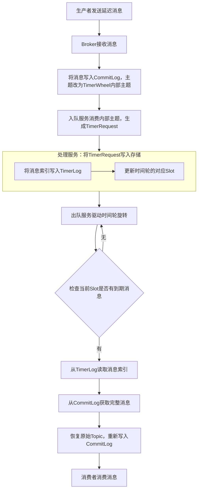

## RocketMQ 延迟队列

RocketMQ延迟队列的实现主要分为两个版本：**4.x版本**基于固定的延迟等级机制，而**5.0及以上版本**则引入了更灵活的时间轮算法，支持任意时间精度的延迟消息。

### 📜 4.x版本：固定延迟等级机制

在RocketMQ 4.x版本中，延迟队列的实现相对简单，通过一组固定的预设时间等级来完成。

*   **核心等级**：开源版本默认提供了18个固定延迟等级，例如：1s, 5s, 10s, 30s, 1m, 2m, ..., 2h。生产者在发送消息时，需要通过 `setDelayTimeLevel(level)` 方法指定延迟等级，而不是具体的延迟时间。
*   **工作流程**：
    1.  **消息存储**：生产者发送携带延迟等级的消息至Broker。Broker收到后，会先将消息的原始主题（Topic）和队列（Queue）信息备份到消息属性中。然后，将消息的主题统一替换为内部的 `SCHEDULE_TOPIC_XXXX`，并根据延迟等级计算出对应的队列ID（`queueId = delayLevel - 1`），最后将消息写入`CommitLog`和`ConsumeQueue`。
    2.  **定时调度**：Broker在启动时会为每个延迟等级创建一个独立的定时任务（`DeliverDelayedMessageTimerTask`）。这些任务会固定扫描各自对应的 `SCHEDULE_TOPIC_XXXX` 队列。
    3.  **消息投递**：定时任务扫描消息时，会通过消息`Tag`字段存储的投递时间戳与当前时间进行比较。如果当前时间已经达到或超过了投递时间，任务就会从消息属性中恢复其原始的主题和队列，并将消息重新写入 `CommitLog`。此时，消息对消费者可见，消费者即可正常消费该消息。
*   **优缺点**：优点是实现简单，性能较好。但缺点也很明显：仅支持18种固定延迟时间，最长只有2小时，无法满足灵活的“任意时间延迟”需求。

### 🔄 5.0+版本：时间轮算法

RocketMQ 5.0 引入了时间轮算法，从根本上解决了4.x版本不够灵活的问题，实现了任意时间的延迟消息。

*   **核心组件**：5.0 版本主要通过两个核心组件协同工作：
    *   **TimerWheel (时间轮)**：一个环形的数组结构，将时间划分为许多细小的时间格（Slot），例如每个Slot代表1秒。时间轮上有一个指针，按固定频率（如每秒）向前移动，指向当前时刻。到达指针位置的Slot，就代表该时间点上的所有定时任务到期了。
    *   **TimerLog (定时消息日志)**：一个追加写（Append Only）的日志文件，用来持久化存储延迟消息的索引，而不是存储消息本身。TimerLog中每条记录都指向消息在`CommitLog`中的物理位置，解决了`TimerWheel`内存存储不持久化的问题。
*   **工作流程**：5.0版本在后台启动了几个核心服务来处理延迟消息。
    1.  **入队服务**：专门负责消费 `rmq_sys_wheel_timer` 这个内部主题，将投递到这里的延迟消息读取出来，并封装成`TimerRequest`对象。
    2.  **处理服务**：消费`TimerRequest`对象后，计算出其目标延迟时间（`delayedTime`），并将该消息的元数据索引追加写入`TimerLog`中，同时将索引位置更新到`TimerWheel`的对应Slot里。
    3.  **出队服务**：会驱动`TimerWheel`的指针向前推进。当指针转动到某个Slot时，就会根据该Slot里记录的`TimerLog`索引位置，找到所有到期的消息。
    4.  **投递服务**：找到到期的消息索引后，从`CommitLog`中还原完整的消息内容。如果消息已到期，则修改其主题为原始主题，并重新写入`CommitLog`，使其对消费者可见。

    `TimerWheel`和`TimerLog`之间的整体协作流程大致如下：



### 🆚 对比总结

| 特性 | 4.x 版本 | 5.x 版本 |
| :--- | :--- | :--- |
| **延迟精度** | 固定级别 (18级) | 任意时间，默认秒级 |
| **最长延迟** | 2小时 (可配置) | 最长7天 (可配置) |
| **核心实现** | `SCHEDULE_TOPIC_XXXX` + 定时任务 | `TimerWheel` + `TimerLog` |
| **灵活性** | 低，仅支持预设值 | 高，支持任意毫秒级延迟 |

RocketMQ从4.x到5.x的演进，是对延迟消息能力的重大升级，使其能够更好地适应复杂多变的业务场景。**不过需要留意，社区开源版和阿里云商业版在延迟消息的最大时长、高可用等方面可能还有进一步的差异**，在生产环境中使用时建议结合具体版本进行确认。

## Kafka 事务

在Kafka中，分布式事务一致性主要通过**幂等性（Idempotence）**、**事务机制（Transactions）** 和 **Exactly Once语义** 这一套组合拳来保证。它们的核心目标是在“消费-处理-生产”的流式场景下，实现端到端的精确一次（End-to-End Exactly Once）处理。

Kafka的事务并非传统的关系型数据库事务，它更多地是作为一个**流处理系统**，来保证多个主题（Topic）和分区（Partition）间的读写操作具有原子性。

### 🛡️ 基石一：生产者幂等性 (Idempotence)

这是Kafka事务的基础，主要解决由生产者重试导致的消息重复问题，但它只能保证**单个分区内**、**单次会话**中的消息不重复。

*   **核心机制**：开启幂等性后，Kafka会为每个生产者分配一个唯一的 **生产ID (PID)**，并为它发送的每条消息分配一个递增的 **序列号（Sequence Number）**。
*   **工作原理**：当Broker接收到消息时，会检查该PID的序列号。如果新消息的序列号比Broker期待的下一个序列号大1，则接受；否则，就认为发生了重复或乱序，并拒绝该消息。

### 🧠 基石二：事务机制 (Transactions)

事务机制在幂等性的基础上，解决了“**跨分区**”以及“**消费-生产**”模式下的原子性问题。

#### 1. 核心角色

*   **事务生产者**：发送事务消息的客户端，必须配置唯一的 `transactional.id` 来标识自身。
*   **事务协调器（Transaction Coordinator）**：运行在Broker端的“总指挥”，负责管理事务的状态，协调两阶段提交流程。
*   **事务日志（`__transaction_state`）**：Kafka内部的特殊主题，事务协调器用它来持久化存储所有事务的状态，是事务恢复的“账本”。

#### 2. 两阶段提交 (2PC) 流程

Kafka采用了轻量级的两阶段提交协议：

**第一阶段：准备阶段**

1.  **初始化**：生产者通过 `initTransactions()` 向事务协调器注册自己的 `transactional.id`，协调器会为它分配一个PID。
2.  **开始事务**：生产者调用 `beginTransaction()` 标记事务的开始。
3.  **生产与标记**：生产者发送消息，Broker接收后并不会让消费者立即看到，而是标记为“未提交”（Uncommitted）状态，同时对消费者不可见。
4.  **发起结束**：当所有业务消息发送完毕，生产者调用 `commitTransaction()` 发起结束请求。
5.  **记录决定**：事务协调器收到请求后，在事务日志 `__transaction_state` 中记录 **`PREPARE_COMMIT`**。这一步是“不归路”，表明一旦写入，事务必将完成。

**第二阶段：执行与收尾**

1.  **广播提交指令**：事务协调器找出该事务涉及的所有分区，向每个分区的Leader Broker发送 **`COMMIT` 标记（Commit Marker）**，表明这些“未提交”数据可以被放行了。
2.  **完成事务**：待所有参与分区的Broker成功写入`COMMIT`标记后，事务协调器在事务日志中再记录一条 `COMPLETE_COMMIT` 状态，表示事务彻底结束。

> 如果调用的是 `abortTransaction()`，协调器则会向所有分区发送 **`ABORT` 标记（Abort Marker）**，告知Broker丢弃相关的“未提交”消息。

### 🛡️ 基石三：消费端隔离级别

Kafka通过消费端的 `isolation.level` 配置，来保证事务的隔离性，避免消费者读到“脏数据”。

*   **`read_uncommitted`**：默认值。消费者能读取所有消息，无论事务是否提交。可能导致读到最终被回滚的数据，不推荐在事务场景使用。
*   **`read_committed`**：**事务场景的标准配置**。消费者只读取属于**已提交事务**的消息，并且只读取到**最后稳定偏移量（LSO, Last Stable Offset）** 位置，在事务提交或回滚前，会被“未提交”的消息阻塞。

### 👑 殊途同归：Kafka与RocketMQ事务的区别

为了让你更清晰地理解，这里对比一下 **Kafka事务** 和之前讨论过的 **RocketMQ事务**：

| 对比维度 | ✅ Kafka 事务 | ✅ RocketMQ 事务 |
| :--- | :--- | :--- |
| **核心目标** | 解决**流处理场景**下，跨分区/主题的原子性写入与消费，保证Exactly Once语义。 | 解决**微服务场景**下，**本地事务（如数据库操作）与发送消息**之间的原子性问题。 |
| **核心机制** | **两阶段提交（2PC）** + **事务协调器** + **`__transaction_state` 日志**。 | **两阶段提交 + 半消息** + **事务回查**（解决二阶段失败问题）。 |
| **解决问题** | 原子性写入。 | 消息与本地事务的一致性。 |

### 💎 总结

Kafka通过幂等性、事务机制和消费者隔离级别这三大基石，构建了一套强大的分布式事务一致性解决方案。这套方案虽然在灵活性和性能上有所取舍（如事务协调器引入额外开销），但它有力地支撑了Kafka在现代大数据流处理领域的核心地位，保证了跨主题、跨分区的数据处理具备高度的可靠性和一致性。

## 分布式事务

分布式事务的解决方案有多种，各有侧重。下面从**强一致性**到**最终一致性**，对主流的几种方案进行详细总结对比。

---

### 1. 2PC（两阶段提交）

#### 原理

- **角色**：事务协调者（Coordinator）+ 多个参与者（Participant，即资源管理器，如数据库）。
- **流程**：
  1. **准备阶段（Voting）**：协调者向所有参与者发送 `prepare` 请求，参与者执行本地事务但不提交，并写入 undo/redo 日志，然后返回“就绪”或“失败”。
  2. **提交/回滚阶段（Commit/Abort）**：若所有参与者都返回“就绪”，协调者发送 `commit` 请求，参与者正式提交；若有任一参与者失败或超时，协调者发送 `rollback` 请求，所有参与者回滚。

#### 优缺点

- **优点**：原理简单，实现相对容易，能保证强一致性（ACID）。
- **缺点**：
  - **同步阻塞**：参与者锁定资源直到第二阶段结束，影响吞吐。
  - **单点故障**：协调者挂掉会导致所有参与者无法决议。
  - **脑裂风险**：在协调者发送 `commit` 后网络分区，部分参与者可能未收到 `commit`，导致数据不一致。

#### 适用场景

- 对一致性要求极高、并发低、事务执行时间短的系统（如金融核心账务）。

---

### 2. 3PC（三阶段提交）

#### 原理

在2PC基础上增加一个 **CanCommit** 阶段，并引入超时机制，减少阻塞范围。

1. **CanCommit**：协调者询问参与者是否可以执行事务（仅检查状态，不锁资源）。
2. **PreCommit**：所有参与者同意后，协调者发送 `preCommit`，参与者执行本地事务但不提交，并写入日志。
3. **DoCommit**：协调者发送 `doCommit` 或 `abort`，参与者最终提交或回滚。

#### 优缺点

- **优点**：降低了阻塞范围（在 CanCommit 阶段无锁），参与者有超时机制，能自行 commit（如果收到 preCommit 后超时未收到 doCommit，则默认提交）。
- **缺点**：仍然可能不一致（例如网络分区导致部分参与者收到 preCommit 后自行提交，而其他参与者回滚）。
- **复杂度高**，性能比2PC还差。

#### 适用场景

- 理论价值大于实践，实际生产中很少使用。

---

### 3. TCC（Try-Confirm-Cancel）

#### 原理

将事务拆分为三个阶段，每个阶段由业务代码实现，属于**业务层**的分布式事务。

- **Try**：预留资源（如冻结库存、预增余额）。
- **Confirm**：确认执行，将预留的资源真正生效（扣减冻结库存、增加余额）。
- **Cancel**：回滚，释放预留的资源。

#### 优缺点

- **优点**：
  - 性能较好，不长期锁定资源。
  - 最终一致性，可控性强。
- **缺点**：
  - 对业务侵入大，每个参与者需要实现 Try/Confirm/Cancel 三个接口。
  - 需要考虑幂等性、空回滚、悬挂等问题。
  - 开发成本高。

#### 适用场景

- 高并发、短事务、对一致性要求较高的业务（如支付、扣库存）。

---

### 4. 本地消息表

#### 原理

- 在业务数据库（与本地业务操作在同一数据库）中创建一张“消息表”。
- 业务操作和消息状态更新放在同一个本地事务中完成。
- 定时任务扫描消息表，将未发送的消息投递到 MQ，并由消费方处理；消费方处理成功后回写确认。

#### 优缺点

- **优点**：可靠性高（依赖本地事务+MQ重试），实现简单。
- **缺点**：
  - 需要额外维护消息表，与业务表耦合。
  - 轮询扫描可能带来延迟和数据库压力。
  - 消息发送和消费需要幂等设计。

#### 适用场景

- 企业内部系统，对最终一致性可接受，且不想引入复杂框架的场景。

---

### 5. 事务消息（RocketMQ / Kafka）

#### 原理

以 RocketMQ 为例：

1. 发送 **半消息**（对消费者不可见）。
2. 执行本地事务。
3. 根据本地事务结果，向 MQ 发送 `commit` 或 `rollback`。
4. 若未收到二次确认或网络异常，MQ 会**回查**业务方本地事务状态，最终决定提交或回滚。

#### 优缺点

- **优点**：
  - 无业务表侵入（相比本地消息表）。
  - 解耦性好，性能较高。
  - 通过回查机制保证最终一致性。
- **缺点**：
  - 要求消息队列支持事务消息（如 RocketMQ，Kafka 的 `exactly once` 也可实现类似效果但场景不同）。
  - 消费者需要处理幂等。

#### 适用场景

- 微服务架构中，一个服务需要可靠通知另一个服务，且对实时性有一定要求的场景。

---

### 6. Saga

#### 原理

将一个长事务拆分为多个本地短事务，每个本地事务有对应的**补偿事务**。有两种协调模式：

- **协同式**：事件驱动，每个服务完成后发布事件，触发下一个服务，失败时反向发布补偿事件。
- **编排器模式**：由一个 Saga 协调器集中决策，按序调用服务，失败时调用逆序补偿。

#### 优缺点

- **优点**：
  - 适合**长事务**、跨多服务、高并发场景。
  - 不长期锁定资源，每个服务只在自己的本地事务中锁数据。
- **缺点**：
  - 实现复杂，需要为每个步骤定义补偿逻辑。
  - 缺乏隔离性，可能产生脏读（中间结果对其他事务可见），需要业务层处理。

#### 适用场景

- 长流程业务（如旅游预订、订单履行）、微服务架构。

---

### 7. 最大努力通知

#### 原理

- 发起方完成本地事务后，不断尝试通知接收方（如通过 MQ + 重试）。
- 如果多次失败，可以记录失败日志，由人工介入或定时任务继续通知。
- 通常不保证最终一致性，只保证“尽力而为”，接收方要提供幂等接口。

#### 优缺点

- **优点**：非常简单，成本低。
- **缺点**：一致性保证最弱，可能数据不一致。

#### 适用场景

- 非关键业务（如积分通知、日志同步），对数据一致性要求极低的场景。

---

#### 📊 综合对比表

| 方案 | 一致性级别 | 是否阻塞 | 业务侵入 | 性能 | 实现复杂度 | 典型应用 |
|------|------------|----------|----------|------|-------------|----------|
| **2PC** | 强一致 | 阻塞 | 低 | 低 | 中 | 数据库跨库事务 |
| **3PC** | 强一致（理论上） | 较低 | 低 | 更低 | 高 | 极少用 |
| **TCC** | 最终一致 | 短时阻塞 | 高 | 高 | 高 | 支付、扣库存 |
| **本地消息表** | 最终一致 | 不阻塞 | 中 | 中 | 中 | 传统异步可靠通知 |
| **事务消息** | 最终一致 | 不阻塞 | 低 | 高 | 中 | 微服务数据同步 |
| **Saga** | 最终一致 | 不阻塞 | 高 | 高 | 高 | 长流程业务 |
| **最大努力通知** | 弱一致 | 不阻塞 | 低 | 很高 | 低 | 非关键通知 |

---

#### 💡 如何选择？

- **需要强一致性且并发低** → 2PC（但注意性能代价）。
- **高并发、短事务、可接受最终一致性** → TCC 或 事务消息。
- **已有 RocketMQ 且不想实现补偿逻辑** → 事务消息。
- **长事务、跨多个服务** → Saga。
- **简单可靠、不依赖额外 MQ 特性** → 本地消息表。
- **极低成本、一致性要求极低** → 最大努力通知。

实际生产中最常用的是 **TCC**、**事务消息** 和 **Saga**，它们能在性能和一致性之间取得较好的平衡。

## SAGA

**Saga 模式本身不强制要求使用消息队列（MQ）**，但在实际落地中，尤其是采用**事件协同（Choreography）** 方式时，**借助 MQ 是实现异步、可靠、解耦的推荐做法**。

---

### 两种 Saga 协调方式与 MQ 的关系

#### 1. 事件协同（Choreography）

- **原理**：每个服务执行完本地事务后，**发布一个事件**到 MQ。下游服务订阅该事件，被触发执行自己的本地事务。如果某个服务失败，它会发布补偿事件，由相关服务订阅并执行补偿逻辑。
- **是否依赖 MQ**：**非常依赖**。MQ 提供了异步、可靠、广播的事件传递能力，使服务间完全解耦。不用 MQ（例如用 HTTP 回调）也能实现，但会引入强依赖、重试复杂、难以保证“至少一次”投递等问题。
- **典型框架**：基于 EventBus、RocketMQ、Kafka、RabbitMQ 等。

#### 2. 编排器（Orchestrator）

- **原理**：一个中央的 **Saga 编排器**（一个服务）以命令方式依次调用各个参与者。编排器维护当前 Saga 的状态，并根据返回值决定下一步（调用正向服务或反向补偿）。
- **是否依赖 MQ**：**不必须**。编排器可以直接通过 **RPC（如 HTTP、Dubbo、gRPC）** 同步调用参与者。此时 MQ 不是核心组件。但若要求高可用、异步回调，编排器也可以改用 MQ 进行命令发送和结果接收。
- **典型框架**：Seata（Saga 模式）、Axon Framework。

---

### 为什么事件协同模式更倾向使用 MQ？

| 能力 | 直接用 RPC/HTTP | 借助 MQ |
|------|----------------|---------|
| **解耦** | 服务之间需要知道对方的地址、端点 | 服务只依赖 Topic/Queue，完全解耦 |
| **重试与可靠性** | 调用方自行实现重试、熔断、超时 | MQ 提供持久化、重投、死信队列 |
| **广播** | 调用方需要逐个调用所有下游（硬编码） | 一个事件可被多个消费者并行处理 |
| **流量削峰** | 无 | 天然支持 |
| **可观测性** | 需要埋点 | 可利用 MQ 自带的消息轨迹 |

---

### 总结

- **不是必须**：Saga 是一种模式，可以用纯 RPC 实现编排器，也可以用 HTTP 回调实现事件协同。
- **实践中常用 MQ**：尤其在**事件协同**模式下，MQ 是首选的底层通信基础设施，能大幅降低实现难度并提升系统可靠性。
- **一句话答案**：**Saga 不依赖 MQ，但借助 MQ 实现的 Saga（特别是事件协同风格）更健壮、更解耦，是行业主流做法**。

## Seata

Seata（Simple Extensible Autonomous Transaction Architecture）是阿里巴巴开源的一站式分布式事务解决方案。它的设计目标很明确：在微服务架构下，以高性能和对业务低侵入的方式，解决分布式事务带来的数据一致性问题。

### 🧭 整体架构与核心角色

Seata的设计核心是“一个中心，三个角色”：

*   **TC (Transaction Coordinator) - 事务协调者**：独立的服务端（Seata-Server），是全局事务的大脑，负责管理和协调全局事务与分支事务的状态，并驱动整个事务的提交或回滚。
*   **TM (Transaction Manager) - 事务管理器**：嵌入在发起分布式事务的客户端应用中，负责开启、提交或回滚一个全局事务。
*   **RM (Resource Manager) - 资源管理器**：嵌入在参与分布式事务的各个微服务应用中，负责管理分支事务的执行，并向TC注册分支事务、汇报状态。

### 🚀 四大模式全解析

Seata的核心是其支持的四种事务模式，它们为不同场景提供了多样化的选择：

*   **AT (Auto Transaction) 模式 - 自动补偿**
    *   **适用场景**：大多数基于标准关系型数据库的分布式事务，追求高性能和对业务代码低侵入。
    *   **工作流程**：
        1.  **一阶段（执行业务SQL）**：RM拦截业务SQL，在更新数据前，保存数据快照（前镜像）到 `UNDO_LOG` 表；然后执行更新，并保存数据更新后的快照（后镜像）。之后立即提交本地事务，释放锁和数据库连接。
        2.  **二阶段（决定提交或回滚）**：
            *   **事务提交**：TC通知RM事务成功，RM只需一步完成，异步删除一阶段记录的 `UNDO_LOG` 日志即可。
            *   **事务回滚**：若任一分支失败，TC通知所有RM回滚。RM根据 `UNDO_LOG` 中的“前镜像”生成反向SQL，更新回原始状态。
*   **XA (eXtended Architecture) 模式 - 强一致性**
    *   **适用场景**：对数据一致性有**强一致性要求**的传统金融或核心业务系统，并且其数据库支持XA协议。
    *   **工作流程**：利用数据库原生支持的XA协议实现**强一致性**。一阶段执行SQL后不提交，而是进入"`prepare`"（预提交）状态并锁定资源，直到TC二阶段广播`commit`才正式释放资源。
*   **TCC (Try-Confirm-Cancel) 模式 - 手动编码**
    *   **适用场景**：对性能有极致要求、需要**精确控制**资源锁定，或操作不涉及数据库的核心金融、支付场景。
    *   **工作流程**：
        1.  **Try**: 检查和预留资源（如：钱包扣减100元时，在`Try`阶段先"冻结"100元）。
        2.  **Confirm**: 执行真正的业务逻辑（使用预留的资源，如：将"冻结"的100元正式扣除）。
        3.  **Cancel**: 执行补偿，释放`Try`阶段预留的资源（如：解冻100元）。
*   **Saga 模式 - 长事务**
    *   **适用场景**：业务流程长、步骤多，涉及多个服务，且允许**最终一致性**的复杂场景（如旅行预订、大型订单流程）。
    *   **工作流程**：将大事务拆分为若干串行的本地事务，依次执行其正向服务。一旦某步骤失败，就会触发从失败点开始的逆序执行其对应的**补偿服务**。

#### ⚖️ 四大模式对比总结

| 模式 | 一致性 | 业务侵入 | 性能 | 优点 | 缺点 |
| :--- | :--- | :--- | :--- | :--- | :--- |
| **AT** | 最终一致性 | **低** | 高 | 无业务侵入，自动补偿，适合大部分场景 | 依赖数据库，需要`undo_log`表 |
| **XA** | **强一致性** | **低** | 低 | 标准的数据库级强一致性协议 | 资源锁定时间长，性能瓶颈，并发低 |
| **TCC** | 最终一致性 | **高** | 高 | 不依赖数据库，高性能，可精准控制 | 需实现`Try/Confirm/Cancel`，开发成本高 |
| **Saga** | 最终一致性 | 中 | 高 | 适合长流程事务，高吞吐 | 需为每个服务实现补偿逻辑，不保证隔离性，业务复杂 |

### 🏗️ 如何选择模式？

你可以根据项目的具体需求，参考以下建议进行选择：

*   **📈 追求高性能 & 低代码侵入** -> **AT模式**
*   **🔒 要求强数据一致性** -> **XA模式**
*   **🎯 精准资源控制或性能极致优化** -> **TCC模式**
*   **⏳ 业务步骤多、流程长** -> **Saga模式**

### 🔧 实战：部署一个高可用TC集群

要让Seata在生产环境稳定运行，TC服务端（Seata Server）的高可用部署是核心。

Seata的高可用部署支持多种主流注册中心，如Nacos、Eureka、Etcd等。典型步骤包括：

1.  **准备数据库**：为TC单独准备一个数据库（如MySQL）。TC需要在这个数据库中创建三张表：`global_table`（存储全局事务信息）、`branch_table`（存储分支事务信息）和`lock_table`（存储全局锁信息）。
2.  **配置TC服务**：修改Seata Server的配置文件（如`application.yml`），将事务存储模式设为`db`，并配置好数据库连接。同时，配置注册中心类型（如`nacos`），以便TC可以注册到服务中心。
3.  **集群部署**：准备多台服务器，重复上述步骤。关键在于将**所有TC节点的数据库配置指向同一个数据库**，这样它们就能共享事务状态，形成一个逻辑上的集群。
4.  **客户端集成**：在每个微服务（客户端）的配置文件中，通过`seata.tx-service-group`（事务分组）配置来指定使用的Seata集群。通过动态调整配置中心的映射关系，可以实现主备集群的切换，完成**异地容灾**。

## CAP

CAP 理论是分布式系统设计的基石，它揭示了一个根本性的权衡：一个分布式系统在**网络分区（Partition）发生时**，只能在**强一致性（Consistency）** 和**高可用性（Availability）** 之间二选一。

需要特别强调的是，CAP 讨论的前提是系统发生了网络分区。如果网络一切正常，系统可以同时拥有强一致性和高可用性。

---

### 1. CAP 三个属性的定义

#### C：一致性 (Consistency)

这里的“一致性”特指**强一致性**或**线性一致性**。它要求：

-   对于任何客户端的读操作，总能读到**最近一次写操作的结果**。
-   所有节点在同一时刻看到的数据都**完全一样**。

这就像去银行柜台办业务，只有一个窗口和一本账本，每个人看到的都是最新余额。

#### A：可用性 (Availability)

它要求：

-   对于任何**非故障节点**收到的合法请求，系统**必须能在合理时间内返回一个非错误的响应**，不能超时或报错。

这意味着只要节点没坏，就必须提供服务，哪怕它暂时和主节点断开连接、拿不到最新数据。

#### P：分区容错性 (Partition Tolerance)

它要求：

-   当系统内部节点之间的网络发生故障，导致消息丢失、延迟或被完全阻断（即“网络分区”）时，整个系统**仍能继续对外提供服务**。

这是 CAP 理论的**前提**。在分布式系统中，网络分区是不可避免的（交换机故障、网线松动、网络拥塞都可能引发），因此 **P 是分布式系统的必选项**。我们实际上是在 C 和 A 之间做权衡。

---

### 2. 为什么不能三者兼得？

当网络分区发生时，系统分裂为两个无法通信的部分（如 Part1 和 Part2），一个写入请求发到了 Part1。此时系统面临两个选择：

-   **选择一致性 (C)，放弃可用性 (A)**：禁止 Part2 继续提供服务，直到网络恢复、数据同步完成。这样 Part2 的节点因无法回应请求而违反了“可用性”，但保证了任何时候读取都是最新数据。
-   **选择可用性 (A)，放弃强一致性 (C)**：允许 Part2 继续响应读写请求，但 Part2 返回的可能是旧数据。待网络恢复后，再通过后台机制修复数据冲突。这保证了系统始终可用，但牺牲了“强一致性”，最终只能达到“最终一致性”。

**因此，在网络分区下，CP 和 AP 是互斥的。**

---

### 3. CP 与 AP 的选择及典型产品

#### CP 系统 (牺牲可用性)

-   **场景**：对数据一致性要求极高，宁愿短暂不可用也不能读到错误数据。例如电商的订单、支付、库存扣减系统。
-   **表现**：发生分区时，少数派节点会被拒绝服务，直到网络恢复。
-   **代表产品**：ZooKeeper、Etcd，以及 HBase、MongoDB（特定配置下）。

#### AP 系统 (牺牲强一致性)

-   **场景**：允许系统出现短暂不一致，但必须始终可用。例如社交媒体的点赞数、商品评价、内容发布。
-   **表现**：分区时，各节点继续接受写入，系统进入最终一致性状态。
-   **代表产品**：Cassandra、DynamoDB、CouchDB，以及 Eureka（强调服务发现可用性）。

> **注意**：MySQL 主从复制默认是**异步复制**，发生主从切换时可能导致数据丢失，因此偏向 AP。通过设置**全同步复制**，可以变成 CP 系统。

---

### 4. 常见误区澄清

-   **“放弃 P，选择 CA”**：这在分布式系统中是个伪命题。P 是网络的固有属性，不是可选项。系统要么是 CP，要么是 AP，不存在永远 CA 的分布式系统。单体应用（如单机 MySQL）才是 CA 系统。
-   **CAP 是动态选择，而非静态标签**：一个系统可能同时提供 CP 和 AP 的能力，让业务在每次请求时动态选择。例如，Amazon DynamoDB 允许为每个请求指定 `ConsistentRead`（CP）还是默认的最终一致性读（AP）。

---

### 5. CAP 与 ACID、BASE 的关系

-   **ACID**：是传统关系型数据库对事务的保证（原子性、一致性、隔离性、持久性），侧重单机强一致性。
-   **BASE**：**基本可用、软状态、最终一致性**，是 AP 系统在实践中的设计哲学，是对 CAP 理论中 A 和最终一致性的具体落地。
-   **关系**：CP 系统通常更贴近 ACID 的强一致性要求；AP 系统则是 BASE 哲学的体现。分布式事务（如 2PC）实现 CP，柔性事务（如 Saga）则偏向 BASE/AP。

---

### 6. 现代分布式数据库的实践

现代数据库（如 Spanner、TiDB、CockroachDB）通过精巧的设计，在满足 P 的前提下，将 C 和 A 的权衡做到了极致：

-   **Google Spanner**：通过 `TrueTime` 技术（使用原子钟和 GPS 实现全局精确时钟）实现外部一致的分布式事务，是强 CP 系统，同时可用性高达 99.999%。
-   **Paxos/Raft 共识协议**：这些协议保证在网络分区下，只有多数派节点能提供服务。如果客户端只和多数派通信，系统就是 CP 且**看似可用**；如果客户端连接到了少数派，则少数派拒绝服务（体现为 CP）。它通过快速选举和多数派机制，将不可用时间压缩到极短。

**总结**：CAP 理论帮我们认清分布式系统的根本局限——网络分区时，必须在一致性和可用性间取舍。这个决策由业务需求决定，不存在完美的解决方案，只有适合的权衡。

## BASE

BASE 理论是对分布式系统事务一致性的一种重要描述，它源于 eBay 等大型互联网公司的实践总结，是对 **ACID**（原子性、一致性、隔离性、持久性）在分布式环境下的一种权衡和延伸。BASE 的核心思想是：**在分布式系统中，无法同时满足强一致性和高可用性，因此可以适当放弃即时一致性，换取系统整体的可用性和弹性**。

---

### BASE 全称与含义

BASE 是三个英文短语的缩写：

- **B**asically **A**vailable —— 基本可用  
- **S**oft state —— 软状态  
- **E**ventually consistent —— 最终一致性

---

#### 1. 基本可用（Basically Available）

指分布式系统在出现故障或不可预知的情况时，**依然能够对外提供服务**，但可能**牺牲部分功能或性能**。

**典型表现**：

- **响应时间变长**：例如原本 10ms 返回结果，故障时可能延长到 100ms 甚至 1s。
- **功能降级**：例如电商大促高峰期，关闭“订单详情中的物流轨迹实时查询”功能，改为基础信息展示。
- **限流/熔断**：当系统压力过大时，对部分请求直接返回“繁忙”提示，保证核心功能可用。

**与 ACID 中的可用性区别**：  
ACID 追求“在任何时刻都绝对一致”，一旦发生分区或故障可能完全不可用；而 BASE 允许在异常时降级，但要求系统整体仍能响应大部分请求。

---

#### 2. 软状态（Soft State）

指**系统的状态允许存在一个中间状态**，这个中间状态不会影响系统的整体可用性，且数据在不同副本之间可能暂时不一致。

**典型表现**：

- 数据复制存在延迟：主从同步过程中，从库的数据落后于主库，此时查询从库可能拿到旧数据。
- 分布式事务处理中：在事务最终提交或回滚前，某些节点可能已经应用了部分变更（例如 Saga 模式的中间结果）。

**软状态的价值**：  
它承认了分布式系统中数据同步需要时间，允许系统在“最终一致”前处于一种模糊状态。这与 ACID 要求的“强一致性”（事务执行后必须立即全局一致）形成鲜明对比。

---

#### 3. 最终一致性（Eventually Consistent）

这是 BASE 理论的最终目标：**系统在经过一段时间的同步后，所有副本的数据将达到一致**。在达到最终一致之前，允许不同节点看到的数据不同。

**最终一致性的不同强度**（从强到弱）：

- **因果一致性**：如果两个操作有因果关系，则所有节点看到它们的顺序必须一致。
- **会话一致性**：在同一个会话中，用户能读到自己写入的最新值。
- **单调读一致性**：一旦读到某个值，后续不会读到更旧的值。
- **单调写一致性**：来自同一个客户端的写操作必须按顺序在所有副本上执行。
- **最终一致性（最弱）**：只保证经过一段“不确定时间”后数据会一致，不保证任何实时顺序。

**典型例子**：

- DNS 域名解析：更新一条记录后，全球解析器不会立刻全部生效，但最终（几分钟到几小时）都会更新。
- 社交平台的点赞数：不同用户看到的点赞数可能短暂不一致，但最终会趋于相同。

---

### BASE 与 ACID 对比

| 维度 | ACID | BASE |
|------|------|------|
| **核心目标** | 强一致性 | 最终一致性 |
| **设计思想** | 隔离、持久、原子 | 基本可用、软状态、最终一致 |
| **适用场景** | 传统金融、银行账务、ERP | 互联网应用、电商、社交、日志 |
| **对分区容错的容忍** | 通常牺牲可用性（CP 模型） | 优先保证可用性（AP 模型） |
| **数据一致性窗口** | 事务提交后立即全局一致 | 允许不一致窗口存在 |
| **性能与扩展性** | 较低，通常单机或强同步复制 | 高，易于水平扩展 |
| **实现示例** | 关系型数据库（MySQL） + 分布式事务（XA） | NoSQL（Cassandra、DynamoDB）、消息队列最终一致性方案 |

---

### BASE 理论的根源：CAP 定理

BASE 理论的提出与 CAP 定理密切相关。  
CAP 定理指出：分布式系统在 **C（一致性）**、**A（可用性）**、**P（分区容错性）** 三者中最多同时满足两个。由于网络分区（P）在分布式系统中必然存在，所以系统必须在 C 和 A 之间做选择：

- 选择 **CP**（放弃可用性）：例如传统 Zookeeper、HBase 在某些场景下。
- 选择 **AP**（放弃强一致性）：例如 Cassandra、Riak，以及很多互联网业务。

**BASE 理论就是 AP 系统在实践中的设计准则**：  
放弃强一致性（C），接受软状态和最终一致性，以此换取高可用（A）和分区容错（P）。

---

### BASE 的典型应用场景

1. **电商系统**  
   - 下单扣库存：允许先创建订单（基本可用），之后异步扣减库存。若库存不足，由售后或订单取消逻辑补偿。用户可能短暂看到“订单已生成，库存待确认”的软状态。

2. **社交网络**  
   - 点赞、评论数：允许不同节点显示的计数不同，后台通过异步消息或定时任务最终校准。

3. **分布式缓存**  
   - Redis 集群在发生网络分区时，可能不同节点数据不一致，但最终会通过同步机制趋于一致。

4. **消息队列的最终一致性**  
   - RocketMQ 事务消息、Kafka 幂等+事务，都遵循“先软状态（半消息），最终 commit/rollback”的 BASE 思想。

5. **日志与监控系统**  
   - 允许少量日志丢失或重复，但要求系统持续写入和查询可用。

---

### BASE 理论的意义与局限

#### 意义

- 指导了**大规模互联网系统**的设计方向，使得系统在极端流量和网络故障下仍能保持核心功能。
- 推动了**最终一致性**概念在 NoSQL、消息队列、微服务治理中的标准化。
- 明确了**一致性与可用性的工程权衡**，避免设计师盲目追求强一致性而牺牲扩展性。

#### 局限

- **不是银弹**：某些场景（支付、余额扣减、库存预占）仍然需要强一致性，此时 BASE 不适用。
- **实现复杂度高**：最终一致性要求业务代码能够处理中间状态、重试、幂等、补偿等逻辑，增加了开发成本。
- **需要业务容忍度**：如果业务无法接受暂时的不一致（如敏感数据授权），BASE 方案就不可行。

---

### 总结

BASE 理论是现代分布式系统设计的**实用哲学**，它告诉我们：

> 在高可用和大规模分布式环境下，放弃即时强一致性，允许软状态，追求最终一致性，往往可以获得更好的整体系统表现。

理解 BASE 理论，有助于合理选择分布式事务方案（如 TCC、Saga、事务消息），并为系统架构中的一致性与可用性决策提供理论依据。

## 分布式事务

并不是只有微服务才会遇到分布式事务问题。虽然微服务架构让这个问题变得非常普遍，但**分布式事务的本质是跨多个独立资源的事务一致性**，这个“资源”既可以是不同服务，也可以是同一个服务内的不同数据库，甚至可以是数据库和消息队列。

下面我们来拆解一下，除了微服务，还有哪些典型场景会面临分布式事务的挑战。

---

### 传统单体架构中的分布式事务场景

即使在传统的单体应用中，也常常需要跨独立资源保持数据一致。

-   **跨多个数据库实例**：这是最典型的情况。比如业务发展导致一个数据库实例无法承载，于是按业务垂直拆分，订单数据在订单库，用户数据在用户库。当一个操作需要同时写入这两个库时，就必须用分布式事务来保证一致性，即使这只是一个单体应用。

-   **数据库与消息队列之间**：一个非常经典的场景是，一个本地事务同时涉及数据库写入和发送消息。例如，用户注册后要在数据库插入新用户，同时在消息队列中发送“欢迎邮件”。必须确保“插入用户”和“发送消息”这两个操作要么都成功，要么都失败，否则就可能出现用户注册成功却收不到邮件，或反之的情况。这同样是一个分布式事务问题。

-   **使用共享数据库的多个独立应用**：在没有服务治理框架的早期架构中，可能出现多个独立的Web应用共享同一个数据库。一个应用触发写操作后，其后续结果可能涉及另一个应用的独立逻辑处理，这里的跨应用数据一致性也需要分布式事务或其变通方案来解决。

-   **传统SOA架构**：在微服务流行之前的SOA架构，同样是将不同功能拆分为独立服务。因此，一个跨服务的业务调用（如从订单服务调用库存服务）天然就是分布式事务，这和微服务面临的问题本质相同。

---

### 问题的本质：分布式计算的普遍挑战

所以我们看到，分布式事务并非微服务的“专利”，而是**分布式计算架构固有的、普遍的数据一致性问题**。

它的根本原因在于，多个独立、自治的资源管理器（如不同的数据库、消息中间件）无法依靠各自本地的ACID事务来保证全局操作的原子性。这主要是因为：

1.  **网络分区**：网络总是不可靠的，通信失败、超时、断连时有发生。
2.  **部分失败**：一个全局操作可能一部分成功了，另一部分失败了，系统处于不一致的中间状态。
3.  **时钟偏移**：分布式系统中各服务器的时间不完全同步，给事件排序和判断超时带来麻烦。

这些问题的复杂性，早在微服务流行之前的分布式数据库、分布式计算论文中就已经被深入探讨和论证过了。

---

### 为什么常常和微服务关联？

那么，为什么大家一提到分布式事务，就立刻想到微服务呢？主要有两个原因：

1.  **它让问题暴露得更普遍**：微服务架构倡导“每个服务一个数据库”，数据被打散在各个独立的、通过网络通信的服务中。这让过去的“隐式”分布式问题，变成了架构设计中一个“显式”的、必须直面的问题。

2.  **它让解决方案更集中**：微服务架构往往是云原生技术栈的一部分，因此业界更多地在讨论专门为微服务设计的分布式事务解决方案（如Seata, DTM等），这无形中也加强了二者的关联。

总之，**微服务让分布式事务问题高度集中和显式化了，但绝不是它的唯一来源。**

**总结一下**：只要是你的业务操作需要跨越**多个独立的、支持本地ACID事务的资源**来保证原子性，你就面临分布式事务问题。这些独立资源可以是：

-   不同微服务背后的数据库
-   同一个单体应用连接的多个数据库
-   一个数据库和一个消息队列
-   任何需要通过网络通信来协调的两方或多方独立系统

因此，无论你是否采用微服务架构，只要你的系统设计涉及上述模式，就需要考虑分布式事务的解决方案。

## 分布式数据库

**使用分布式数据库并不等同于必然需要面对复杂的分布式事务问题，其核心取决于数据库的架构设计。** 许多现代分布式数据库正是为了“屏蔽分布式细节”而生的，它们通过内核级的创新，极大地减轻甚至消除了开发者的负担。

下面，我们来具体看一下不同架构的差异。

### 🏗️ 三种架构，三种透明程度

不同架构对分布式事务的处理能力和对用户的屏蔽程度有云泥之别。

| 架构类型 | 代表产品 | 核心机制与实现 | 对用户的透明程度 | 性能与应用场景 |
| :--- | :--- | :--- | :--- | :--- |
| **原生分布式数据库 (NewSQL/Distributed SQL)** | OceanBase, TiDB, CockroachDB, Spanner | 内核原生支持，通过2PC + 全局MVCC + Paxos/Raft共识算法 + TSO实现。所有节点对等，共同管理事务。 | **极高** (完全透明)，用户像使用单机数据库一样使用，ACID保证由数据库内核提供。 | **高**，理论上有额外的网络往返和协调开销，但经过深度优化，性能很高。可扩展性强，适用于金融级、电商等需要强一致性的核心系统。 |
| **云原生分布式数据库** | Amazon Aurora, PolarDB, TDSQL | 采用**计算存储分离**架构，数据在共享存储层（多副本强同步），计算层无状态。事务逻辑集中在计算层处理，简化了分布式协调。 | **高** (高度透明)，通常与MySQL/PostgreSQL高度兼容，通过默认主键拆分等策略，用户基本无需关注。 | **高**，共享存储架构减少了数据移动开销，性能好。弹性伸缩能力强，兼容性佳，适用于云端海量数据场景。 |
| **分库分表中间件** | ShardingSphere, Mycat | 应用或中间件层介入，通常基于**改进的XA 2PC协议、TCC或Saga模式**。事务由独立的协调者管理，整体可靠性受中间件制约。 | **低** (需大量改造)，应用代码需感知分片键，并进行改造以接入事务管理器和编写补偿逻辑，对应用侵入性强。 | **一般**，中间件成为额外的网络开销和潜在瓶颈，且在高并发下有性能损耗。适用于无法替换数据库、通过改造实现扩展的遗留系统。 |

### ⚙️ 它是如何屏蔽分布式细节的？

现代原生分布式数据库（如NewSQL）通过以下关键技术，将复杂性封装在数据库内部：

*   **全局时间戳（TSO, Timestamp Oracle）**：就像给整个集群一个统一的“时钟”，所有事务都会被分配一个全局唯一且递增的时间戳，使得各节点能就事务的先后顺序达成一致。例如，Google Spanner通过高精度的`TrueTime`技术来实现这一能力。
*   **分布式MVCC（多版本并发控制）**：这是单机MVCC的分布式升级版。通过保留数据的多个版本，结合全局时间戳，让读操作可以无锁地访问一个一致的数据快照，从而大大提升读写并发性能。
*   **共识算法（Paxos/Raft）**：这是分布式系统的基石。它确保了数据在多个副本间保持强一致性，同时实现了故障自动转移。只要多数派节点存活，系统就能正常工作，且不丢数据。阿里云的PolarDB-X和华为云的GaussDB都采用了类似机制来保证金融级高可用。
*   **透明全局索引**：它解决了数据被分散到不同节点后，如何高效查询的难题。数据库会自动维护一个全局的索引结构，将查询路由到正确的节点，对应用完全透明。

### 🚨 用户仍可能感知的场景

尽管原生分布式数据库已做到高度透明，但在某些边缘或极端情况下，用户仍可能“感知”到底层分布式的存在：

*   **跨节点查询的性能**：虽然数据库能执行跨节点`JOIN`，但它的性能通常不如所有数据都在一个节点上。当`EXPLAIN`结果出现`distributed join`或`scatter`时，便是一个需要留意的信号。
*   **全局唯一序列的抖动**：在高并发下，跨多节点的唯一ID生成（如AUTO_INCREMENT）可能会有性能抖动，因为需要全局协调以避免冲突。
*   **DDL执行与事务大小限制**：在分布式数据库中，执行`ALTER TABLE`等DDL操作可能比单机更耗时，需要同步所有节点。同时，单个事务中修改的行数也可能受到限制，以控制其复杂性和回滚影响。
*   **网络延迟与热分区**：跨可用区（AZ）的部署会引入微秒或毫秒级的网络延迟。另外，如果大量请求集中在一个数据分区上（热分区/热点），其单点瓶颈依然可能被感知到。

### 💎 总结与选型建议

1.  **原生分布式/云原生数据库（高透明性）**：这类数据库以**完整的ACID兼容性和业务零侵入**为卖点，让你能像使用单机库一样操作，无需在应用中实现复杂的补偿逻辑（TCC/Saga），是绝大多数新项目的首选。
2.  **分库分表中间件（低透明性）**：这类方案更多地要求开发者去**设计分区键、理解分布式事务的内部机制**，甚至自己动手写代码来处理。这正是原生分布式数据库想要解决的问题。

总的来说，选择合适的架构，并配合合理的表结构设计（如选择合适的主键和分区键），大多数业务场景都可以透明地享受分布式数据库带来的扩展能力。如果需要，我还可以为你详细解释 TCC 或 Saga 等柔性事务方案的工作原理。

## 一致性哈希 & Redis Cluster

一致性的本质，是在分布式系统中确定“数据应该由谁处理”。**一致性哈希**和 **Redis Cluster 哈希槽**正是两种最经典的数据分布方案。它们在设计哲学上有着根本的不同。

### 📌 核心思想对比

-   **一致性哈希：去中心化的环形空间**
    它把整个哈希空间（0 ~ 2³²-1）首尾相连成一个环。**数据和节点**都通过哈希函数映射到这个环上，每个节点负责环上的一段区间（从自己向前到上一个节点）。数据沿顺时针方向找到的第一个节点，就是负责它的节点。

-   **Redis Cluster 哈希槽：中心化的槽位分配**
    它预先划分了**16384个独立的哈希槽**，构成一个固定的槽位空间。每个节点手动或自动地负责一部分槽。数据通过 `CRC16(key) % 16384` 计算出所属槽号，再由槽找到负责的节点。节点和槽是多对多的关系。

### 📊 详细特性拆解对比

下面是两个方案在不同维度的具体表现：

| 对比维度 | 一致性哈希 | Redis Cluster 哈希槽 |
| :--- | :--- | :--- |
| **映射方式** | **节点和数据**都映射到哈希环上，是“节点—数据”的直接映射。 | **数据→槽→节点**的间接映射，槽是中间层，解耦了数据和节点。 |
| **数据分布粒度** | 连续区间，依赖哈希函数。**需引入虚拟节点**来防止数据倾斜。 | 离散的槽位（16384个）。因为槽数远多于节点数，**天然易于均匀分配**，平衡性很好。 |
| **扩缩容代价** | 节点变更时，**仅有相邻节点的部分数据**受影响，数据迁移量最小。 | 节点变更时，需**手动迁移槽**（一个或多个槽及其中所有数据）。迁移量可控，且支持在线进行。 |
| **请求路由方式** | 客户端需维护节点列表，自己计算数据在环上的位置并发起请求。 | **智能客户端**会缓存槽位映射表，直接定位节点；也可向任意节点发送请求，由服务端返回`MOVED`重定向。 |
| **故障转移能力** | 算法本身不包含该机制。通常依赖外部系统（如哨兵），或允许缓存失效。 | **内置故障转移**。节点间通过Gossip协议通信，主节点故障时，从节点会自动接管其槽位并晋升。 |
| **实现复杂度** | 算法思想简单，但一个成熟的、带虚拟节点和节点管理的客户端实现有一定复杂度。 | 是一个完整的分布式系统，服务端实现复杂，但**用户使用起来非常简便**，无需自行管理拓扑。 |

### 🔍 关键场景深度解析

#### 场景一：节点扩缩容时，数据如何迁移？

-   **一致性哈希**：增加新节点S3时，它会被映射到环上某点，顺时针方向的下一个节点S2上，**只有原本属于S2的一小部分数据**需要迁移给S3。这个迁移量很小，但需要客户端和服务端配合完成数据转移。

-   **Redis Cluster**：增加新节点时，需要执行 **Resharding（重分片）** 操作。例如，从节点A、B、C各拿出一些槽，分配给新节点D。这需要管理员手动执行 `redis-cli --cluster reshard` 命令。Redis Cluster 支持在线迁移，过程中被迁移的槽处于“过渡”状态，请求会被重定向，保证了可用性。

#### 场景二：如何保证负载均衡？

-   **一致性哈希**：如果只是将几个物理节点映射到环上，数据分布极不均匀。因此必须引入**虚拟节点**（Vitural Nodes）。每个物理节点对应几十到几百个虚拟节点，分散在环上。这能显著改善负载均衡，但也增加了客户端的维护成本和路由开销。

-   **Redis Cluster**：因为槽数（16384）远大于节点数（通常<1000），管理员很容易为每个节点分配数量相近的槽。数据通过CRC16散列后，分布非常均匀，**基本不需要担心热点或倾斜问题**。

#### 场景三：请求出错时如何处理？

-   **一致性哈希**：若客户端保存的节点拓扑过期，请求可能发到错误的节点。通常需要客户端库实现重试、发现新节点的逻辑。

-   **Redis Cluster**：Redis 服务端会扮演“指路人”的角色。当请求发送到错误的节点，该节点会返回一个 `MOVED` 错误，明确告知客户端数据所在的正确节点和槽位。智能客户端会自动更新本地槽位映射表并重新发送请求，整个过程对开发者透明。

### 💎 总结与选型建议

从本质上看，两者的选择其实是 **“中心化”与“去中心化”** 路线的选择。

-   **一致性哈希**是一种**去中心化的算法思想**。它灵活、在节点变动时数据迁移量少，是实现分布式缓存、CDN、P2P网络等系统的基础。但需要自行实现大量周边功能。
-   **Redis Cluster 哈希槽**是 Redis 官方提供的一种**中心化的分片管理解决方案**。它功能完善（内置故障转移、在线迁移），对用户友好，是构建高可用、可扩展 Redis 数据存储的首选。

如果你需要一个开箱即用的分布式 Redis 方案，**Redis Cluster 是标准答案**。如果你是在设计一个通用的、无中心的分布式缓存系统，或者节点变化非常频繁，那么**一致性哈希算法**是更合适的基础构件。

## SnowFlake

**Snowflake 的时钟回拨问题**，指的是在生成分布式唯一 ID 的过程中，由于服务器系统时间被人为或自动调整到**比之前更早的时间点**，导致雪花算法依赖的单调递增时间戳不再可靠，进而**可能产生重复 ID 的严重风险**。

我们可以从原理、原因、影响和解决方案来深入理解。

### ❄️ 一、问题的根源：Snowflake 依赖时间戳递增

Snowflake 算法生成的 64 位 ID 结构大致如下：

```text
 1 bit 不用 | 41 bit 毫秒级时间戳 | 10 bit 工作机器ID | 12 bit 序列号
```

-   **时间戳**：记录的是当前时间与自定义起始时间的差值，41 位可支持约 69 年。
-   **序列号**：在同一毫秒内，通过自增序列号来区分不同 ID，12 位支持每毫秒 4096 个 ID。

为了保证 ID 的**全局唯一且大致递增**，Snowflake 的核心假设是：**时间戳是单向递增的，永远不会回退。**  
在同一毫秒内，序列号递增。当时间进入下一毫秒，序列号重置为 0。  
若时钟突然往回跳，算法会误以为回到了“过去”的某一毫秒，就可能再次使用那个毫秒里已经用过的序列号，从而生成与历史记录完全相同的 ID。

### ⏰ 二、时钟回拨的常见原因

-   **NTP（网络时间协议）校时**：这是最常见的原因。当服务器时间与 NTP 服务器时间偏差较大时，NTP 服务可能会进行**时间跳跃（步进）**，将本地时钟突然拨回正确时间，而不是微调。
-   **人为误操作**：运维人员手动修改了系统时间。
-   **虚拟化环境迁移**：虚拟机（VM）在暂停、快照恢复或跨主机迁移后，时间可能被重置或回退。
-   **硬件时钟漂移**：服务器主板电池没电，长时间关机后开机，BIOS 时间丢失后恢复成出厂时间。

### 💥 三、回拨带来的灾难性影响

-   **主键冲突**：如果生成的 ID 用于数据库主键，新插入的数据可能会与已有的历史数据产生主键冲突，导致写入失败。
-   **业务逻辑错乱**：若 ID 带有时间排序语义（例如用于判断事件发生的先后顺序），时钟回拨会让新生成事件的 ID 反而小于之前事件的 ID，导致消息乱序、因果倒置。
-   **依赖递增 ID 的组件异常**：比如流式处理系统（Flink、Kafka）可能依据 ID 的大小来判断进度，回拨会引发不可预知的错误。

### 🛡️ 四、工程上的经典应对方案

直接禁止时钟回拨是不现实的，因此工程实践中会采用一系列 “兜底” 机制。

#### 1. 标准 Snowflake 算法思路：回拨时阻塞等待

在原生实现中，若发现当前时间戳小于上次生成 ID 的**最后时间戳**，会循环等待，直到时间追上。这会导致服务在等待期间**直接不可用**，对于高并发系统无法接受。

#### 2. 百度 `UidGenerator` 的“借用未来时间”

-   UidGenerator 采用**环形缓冲区**提前生成 ID 并缓存。
-   当发生时钟回拨时，它会检查已生成的 ID，如果当前时间戳等于或小于已生成 ID 的时间戳，就直接拒绝生成并抛出异常，由上层业务重试或熔断。
-   这是**直接报错**的策略，避免了生成重复 ID，但会损失部分可用性。

#### 3. 美团 `Leaf` 的方案：利用 ZooKeeper 持久化时间记录

-   **Leaf-snowflake 模式**下，每个服务节点会定期（如每 3 秒）将自己当前最大时间戳上报到 ZooKeeper 持久节点。
-   启动或运行时发现时钟回拨，会比较本地时间与 ZK 上记录的时间：
    -   **若回拨小于某个阈值（如 5ms）**，短暂休眠等待时间追上。
    -   **若回拨较大**，则直接服务降级或报警人工介入。
-   这种方案通过外部协调器记录了“已使用的最大时间戳”，能够准确判断回拨是否会导致重复。

#### 4. 逻辑时钟代替物理时钟

放弃依赖系统时间，改用**单调递增的逻辑时钟**（即自增计数器）来充当 ID 的时间部分。例如，一些分布式 ID 生成器直接采用**号段模式**（如美团 Leaf-segment），号段是业务层面的逻辑时钟，完全不受物理时钟影响，从根本上解决时钟回拨问题，但会牺牲 ID 的时间有序性，且需依赖数据库分配号段。

#### 5. 使用 NTP 平滑调整，避免跳变

配置 NTP 服务时，将启动参数设置为 `-x`（slew 模式），让 NTP 通过调整时钟频率来**逐渐修正时间差异，而不是直接跳跃**。这可将回拨风险降至极低，因为时间修正的步长是毫秒级别的微调。

### 💎 总结

Snowflake 时钟回拨问题的本质是 **“依赖不可靠的物理时钟来保证数据唯一性”** 所带来的矛盾。在设计系统时，若选择雪花算法，必须内建应对回拨的容错机制（等待、报错、外部协调），否则它就是一个定时炸弹。对于一致性要求极高的金融或订单系统，使用**逻辑时钟或数据库号段模式**通常更为稳妥。

## NTP

**NTP（Network Time Protocol，网络时间协议）** 是一种用于在计算机网络中**同步各个设备时钟**的标准协议。它的核心目标是让所有计算机的时钟保持高度一致，精确到毫秒甚至微秒级别。

在讨论 Snowflake 的时钟回拨问题时，NTP 正是最常见的“幕后推手”。理解它，你就能明白为什么一个用于保证时间准确的协议，反而会引发致命问题。

---

### 1. 为什么需要 NTP？

计算机内部的硬件时钟（RTC）并不精确，会因温度、电压、晶振老化等原因产生**时间漂移**，一天差几秒是常事。而在分布式系统中：

- 日志排查需要严格的时间顺序
- 数据库事务需要确定先后
- 分布式锁、ID 生成（如 Snowflake）、证书验证等，全都依赖准确且一致的时间

NTP 就是解决这个问题的标准方案：让所有机器都向权威时间源“看齐”。

---

### 2. NTP 是如何工作的？

NTP 采用**客户端-服务器**的层级架构，通过分组交换网络传递时间信息。

**层级（Stratum）**：

- Stratum 0：最高精度的时间源，如原子钟、GPS 时钟，它们本身不联网。
- Stratum 1：直接连接到 Stratum 0 设备的服务器，是互联网时间的基准。
- Stratum 2：从 Stratum 1 同步时间，以此类推，最多到 Stratum 15。

**同步原理**（简化）：
客户端向 NTP 服务器发送请求，服务器回复时附上时间戳。通过计算数据包在网络中的往返延迟，客户端就能推算出一个非常精确的时间偏移量，然后根据这个偏移量调整本地时钟。

---

### 3. 两种调整方式：为什么会导致“回拨”？

这是关键。NTP 校正本地时钟有两种策略：

- **步进调整（Stepping / Jumping）**  
  如果本地时间与标准时间偏差太大（例如超过 128 毫秒），NTP 服务会直接**大幅度、一次性**将本地时间设置为正确时间。  
  **如果本地时间比标准时间快**（例如快了 5 秒），NTP 就会突然把时钟**往后拨 5 秒**。  
  → 这就是**时钟回拨**的直接原因。

- **微调模式（Slewing）**  
  如果时间偏差不大，或者故意配置不允许步进，NTP 会通过稍微**减慢或加快系统时钟的频率**（比如让一秒实际变成 1.001 秒），来缓慢地追上正确时间，过程平滑无回跳。

也就是说，NTP 是否引发时钟回拨，完全取决于它的调整策略和配置。

---

### 4. NTP 与 Snowflake 时钟回拨的直接关联

Snowflake 算法假设时间戳严格单调递增。  
一旦 NTP 执行了**步进调整**，把时间往回拨，服务器上的 Snowflake 算法就会认为“时间回到了过去”。此时如果继续生成 ID，就可能使用之前用过的毫秒时间戳和序列号，从而**产生重复 ID**。

这正是前面提到的 Snowflake 时钟回拨问题最典型的触发场景。

---

### 5. 如何在生产环境中安全使用 NTP？

为了避免 NTP 引发时钟回拨，推荐以下措施：

1.  **使用 `-x`（slew 模式）选项**  
    在 `ntpd` 中启动时加上 `-x` 参数，这会强制 NTP 只用微调方式，彻底禁止步进操作。即便偏差很大，也通过缓慢调整追上，时间永远不会回退。

2.  **使用 Chrony 并合理配置**  
    Chrony 是比 `ntpd` 更现代的选择，默认就更倾向微调。可以显式配置 `makestep` 指令，设定仅在非常长的期限后才允许步进（如 `makestep 1.0 3` 表示只在启动后 3 秒内允许一次步进），之后锁定为微调。

3.  **部署多台冗余 NTP 服务器**  
    避免只依赖一个外部时间源，可以搭建内部多层 NTP 服务器，确保网络抖动时仍有稳定源。

4.  **在虚拟化环境中关闭宿主机时间同步**  
    在 VMware 等环境下，要关闭“与宿主机同步时间”的选项，只用虚拟机内部的 NTP 服务，避免宿主机挂起恢复后一次性调整。

5.  **监控与告警**  
    监控系统时间偏移量，当发生大幅调整时立即报警，人工介入，必要时触发降级或切换 ID 生成策略。

---

**一句话总结**：NTP 是分布式系统中不可或缺的时间同步协议，但如果配置不当（特别是使用步进调整），就会导致时钟回拨，进而破坏依赖单调递增时间戳的算法（如 Snowflake）。因此，生产环境中必须强制让 NTP 使用**微调模式**，从根本上杜绝时间向后跳变。

## PC Time

**是的，普通PC的时间同步绝大多数情况下都是通过 NTP 协议（或其简化版 SNTP）实现的**，只是操作系统把它封装成了后台服务，用户通常无感知。

不同系统的具体实现如下：

- **Windows**  
  内置的 **Windows 时间服务（W32Time）** 默认使用 NTP 协议，定期向 `time.windows.com` 同步。在域环境中则与域控制器保持同步。

- **macOS**  
  系统通过 `timed` 守护进程，默认使用 NTP 协议向 `time.apple.com` 同步时间。

- **Linux 桌面（如 Ubuntu）**  
  早期多用 `ntpd` 服务，现在普遍换成了更现代的 **`systemd-timesyncd`**（实现了 SNTP 客户端）或 **Chrony**，默认连接公共 NTP 服务器池（如 `pool.ntp.org`）。

- **手机（iOS/Android）**  
  同样使用 NTP 协议，系统会自动从运营商网络或厂商服务器获取标准时间。

**简单来说**：只要你的电脑开启了“自动设置时间”，后台基本都是在跑着某个 NTP 客户端。它与服务器的区别只在于，PC 通常只需要作为客户端同步时间，而不会作为时间服务器对外提供服务。

## 分布式锁

分布式锁的核心，是保证在分布式系统中，**同一时间只有一个节点能执行某段代码或访问某个共享资源**。它的应用场景非常广泛，但凡涉及“排他性”的操作，基本都需要它。

下面是比较典型的几大类应用场景：

### 1. 避免重复执行：定时任务

在微服务多实例部署下，定时任务会同时在多个节点触发。不做控制的话，数据会被重复处理。用分布式锁可以确保同一时间只有一个实例能拿到锁并执行。

- **业务对账/结算**：每天凌晨运行的资金核对，必须只跑一次。
- **批量数据同步**：如每小时把用户行为日志导入数仓。
- **过期订单取消**：扫描超时未付订单并释放库存，需防止多个实例同时扫描并扣减。

### 2. 防止资源超卖：库存与额度

这是为了在并发请求下保证数据的正确性。Redis事务或乐观锁能解决部分问题，但对高并发下逻辑复杂的资源扣减，分布式锁更安全。

- **秒杀扣库存**：极端并发时，用锁严格限制进入扣减逻辑的流量。
- **优惠券/红包领取**：每日限量，用户同时点击“领取”，锁能保证领取数量不超发。
- **账户余额操作**：处理提现、转账时，对同一账户加锁，避免并发操作导致余额异常。

### 3. 解决缓存击穿：热点数据重建

当某个热点缓存过期，瞬间大量请求涌入数据库重建同一份数据，极有可能压垮数据库。这时可以让第一个请求获得分布式锁去查库并回填缓存，其余请求等待或降级，这就是**互斥锁**方案。

- **首页热搜榜单**：缓存失效后，只允许一个线程去计算新榜单，其他线程等结果。
- **商品详情页**：热门商品信息过期，锁住重建过程，防止海量请求打到数据库。

### 4. 状态机的安全流转：订单与流程

订单、工单、审批流等在状态切换时，必须保证**原子性**，不能出现并发操作将状态从“已支付”同时改成“已发货”和“已退款”。

- **订单状态更新**：支付成功回调、超时取消同时到来时，锁能强制其串行执行，只有第一个拿到锁的操作能成功切换状态。
- **工作流引擎**：任务节点从“处理中”变为“已完成”，防止多人同时提交。

### 5. 保证幂等性：消息与回调

消息队列可能重复投递，支付回调也可能多次发送。在业务入口用“唯一标识+分布式锁”，能轻松实现幂等性。

- **支付回调**：用订单号加锁，成功处理后就释放锁或标记状态，后续重复回调直接跳过。
- **消息消费**：基于消息ID加锁，防止同一条消息被多个消费者并发处理或重复消费。

### 6. Leader 选举

虽然专用选举算法（如 Raft）更完善，但在一些简单架构中，分布式锁常被用来实现**谁拿到锁谁就是主节点**的选举模式。

- **主从切换**：多个备用节点竞争锁，抢到的升级为主节点执行核心任务。
- **任务分配中心**：在无中心调度器时，几个 Worker 用锁来决定谁负责分配任务。

---

**一个提醒**
使用分布式锁时，需要特别关注**锁超时、误删锁、可重入、自动续期**等问题。锁只是工具，确保**业务操作能被锁保护的粒度合适**，并且做好**异常情况下的解锁和补偿**，才是用好它的关键。
