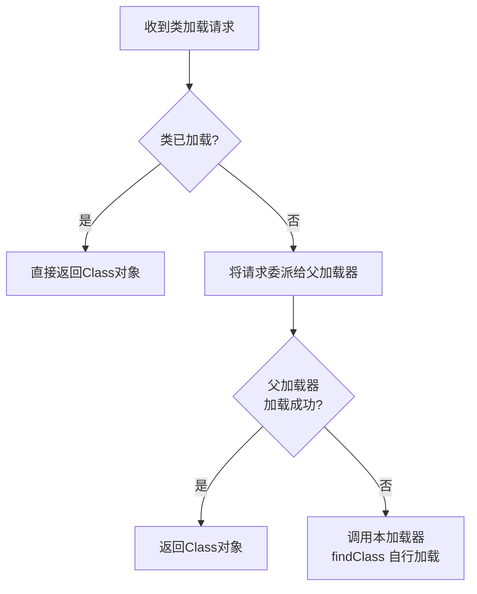

## G1

G1 的**RSet（Remembered Set）** 和 **SATB（Snapshot-At-The-Beginning）** 是为解决不同问题设计的核心机制，它们共同支撑了 G1 高效、可控的垃圾回收能力。G1的分区式内存布局（将堆划分为大小相等的 Region，每个 Region 可动态扮演 Eden、Survivor 或 Old 等角色）是理解这两个概念的基础。

下面我们就来深入解析这两种机制：

### 🧠 快速一览：RSet与SATB

| 特性 | RSet (Remembered Set) | SATB (Snapshot-At-The-Beginning) |
| :--- | :--- | :--- |
| **核心目的** | 解决**跨Region引用**问题，避免回收时全堆扫描。 | 解决**并发标记漏标**问题，保证并发标记的正确性。 |
| **工作阶段** | 主要在**Young GC/Mixed GC**期间使用。 | 主要在**并发标记周期**中发挥作用。 |
| **核心思想** | 为每个 Region 维护一个“谁引用了我”的**points-into**集合。 | 基于并发标记开始时的**对象图快照**进行标记，通过写屏障捕捉快照后的引用变化。 |
| **实现手段** | 依赖**卡表**和**post-write barrier**（后置写屏障）记录引用。 | 主要依赖**pre-write barrier**（前置写屏障）和**SATB队列**。 |
| **主要开销** | **内存占用**（可达堆的5%-20%+）及维护其一致性的计算开销。 | 写屏障的执行开销和最终标记阶段扫描SATB队列的**短暂STW时间**。 |

### 🗺️ RSet：跨Region引用的“索引地图”

RSet 的核心作用是解决跨Region引用（或称“跨代引用”）的问题，避免在回收某个 Region 时扫描整个堆。

*   **底层实现：卡表 (Card Table)**。RSet 的底层依赖于“卡表（Card Table）”技术。它将整个堆内存按 `512 Byte` 划分成一个个“卡（Card）”。如果一个 Region 的 Card 内存在指向本 Region 的引用，RSet 就会记录下这个脏卡的位置，相当于一个“谁引用了本 Region 的对象”的索引。
*   **记录规则（三重过滤）**。RSet 只记录“老年代对年轻代”和“老年代对老年代”的引用，因为它服务于部分堆回收的场景：
    *   ❌ **不记录Region内部引用**：因为回收时会扫描整个 Region。
    *   ❌ **不记录`Young→Young`或`Young→Old`引用**：因为 Young GC 会回收整个新生代，老年代最终也会被 Mixed GC 处理。
    *   ✅ **仅记录`Old→Young`和`Old→Old`的引用**：这是**关键记录**，保证了只回收老年代的一部分时也能找到所有 GC Roots。
*   **维护与开销**。RSet 需要维护，这会带来性能和内存开销。应用线程（Mutator）运行时会通过**写屏障**来捕捉引用变化，并由专门的**并发精炼线程（Concurrent Refinement Threads）** 处理这些更新。RSet 的占用通常较高，G1 一般会将其大小控制在堆容量的 **5%** 左右，但极度复杂场景也可能突破 **20%**。

### 📸 SATB：并发标记的“快照神器”

SATB 的核心作用是保证在应用线程与 GC 标记线程并发执行时，不会发生存活对象的“漏标”问题。

*   **漏标问题与三色标记法**。G1 使用“三色标记法”：黑色（对象及引用均被扫描）、灰色（对象被扫描但引用未完成）、白色（未被扫描）。若并发时应用线程将某对象引用断开，可能导致本应存活的白色对象被误清，即“漏标”，这会导致严重后果。
*   **SATB的解决方案**。SATB 在标记开始时建立一个逻辑快照，并基于此快照进行标记。它利用**前置写屏障（Pre-write Barrier）** 来防止漏标，在引用关系被修改前，将旧值（即将被删除的引用）记录到一个**SATB 队列**中。最终标记阶段，GC 线程会将这些被记录的旧引用视为存活。这种策略“宁可多标不可漏标”，多标的“浮动垃圾”会在下次 GC 被回收。

### 🤝 RSet与SATB的协同配合

RSet 和 SATB 这两个机制并非孤立运行，它们在 G1 的 GC 流程中共同确保垃圾回收的准确与高效：

1.  **并发标记阶段**：由 **SATB** 机制主导，利用快照确保并发标记的准确性。
2.  **Young/Mixed GC 阶段**：由 **RSet** 扮演主角。当 GC 发生时，RSet 被作为 GC Roots 的一部分加入扫描，直接精准定位到需要回收的 Region 内的存活对象。一个典型的例子是：当 Mixed GC 处理一个老年代 Region 时，**RSet** 会告诉 GC 线程“有哪些其他 Region 引用了这个老年代 Region 中的对象”，而 **SATB** 则在之前的并发标记阶段保证了引用图谱的完整性。两者相辅相成，使得 G1 能够在不扫描整个堆的情况下，高效且准确地完成部分回收。

总的来说，**RSet** 可以理解为维护跨 Region 引用关系的“**空间索引**”，让回收更精准；而 **SATB** 则是保证并发标记正确性的“**时间快照**”，让分析更准确。二者共同构成了 G1 在低延迟目标下高效回收的基石。

## 双亲委托机制

双亲委派机制是 Java 类加载体系的核心，它定义了类加载器在处理加载请求时的协作方式。简单说，就是**“向上委派，向下查找”**。

---

### 1. 什么是双亲委派机制？

当一个类加载器收到加载类的请求时，它不会自己先尝试加载，而是**把这个请求委派给父类加载器**去完成。只有当父加载器反馈自己无法完成这个加载请求（即在它的搜索范围内找不到该类）时，子加载器才会自己尝试加载。

这里的“双亲”实际上指**父加载器**，它并不是 Java 语法上的继承父类，而是一个由组合关系形成的“委托链”。

### 2. 类加载器的层级结构

Java 中的类加载器主要分为三层（JDK 9 以前是典型的三层结构，JDK 9 模块化后有所调整，但双亲委派的思想依然是核心）：

- **启动类加载器**：用 C++ 实现，是 JVM 的一部分。负责加载 `<JAVA_HOME>/lib` 目录下的核心类库，如 `rt.jar`、`java.lang.*` 等。它是所有类加载器的“根”。
- **扩展类加载器**：由 Java 实现，父加载器为启动类加载器。负责加载 `<JAVA_HOME>/lib/ext` 目录下的类库。JDK 9 后被平台类加载器取代。
- **应用程序类加载器**：也称系统类加载器，父加载器为扩展类加载器。负责加载用户类路径（ClassPath）上指定的类库，是程序的默认类加载器。
- **自定义类加载器**：开发者可以自己实现，其父加载器通常设为应用程序类加载器。

### 3. 工作流程详解

以 JDK 8 中 `java.lang.ClassLoader` 的 `loadClass(String name)` 方法为例，流程如下：

1.  检查该类是否已经加载过，如果已加载则直接返回。
2.  如果未加载，则调用**父加载器**的 `loadClass(name)` 方法进行加载。
3.  如果父加载器为 `null`（说明它的父加载器是启动类加载器），则直接调用本地方法请求启动类加载器加载。
4.  如果父加载器加载失败（抛出 `ClassNotFoundException`），说明已到达加载链的顶端仍未找到，这时本加载器才会调用自己的 `findClass(name)` 方法尝试自行加载。

用示意图表示就是这样：



**核心代码逻辑（简化版）**：

```java
protected Class<?> loadClass(String name, boolean resolve)
    throws ClassNotFoundException {
    synchronized (getClassLoadingLock(name)) {
        // 1. 检查是否已经加载
        Class<?> c = findLoadedClass(name);
        if (c == null) {
            try {
                // 2. 先委派给父类加载器
                if (parent != null) {
                    c = parent.loadClass(name, false);
                } else {
                    // 若父加载器为null，则使用启动类加载器
                    c = findBootstrapClassOrNull(name);
                }
            } catch (ClassNotFoundException e) {
                // 父加载器抛出异常，说明无法加载
            }
            if (c == null) {
                // 3. 父加载器无法加载，才自己尝试加载
                c = findClass(name);
            }
        }
        return c;
    }
}
```

### 4. 为什么要这样设计？—— 三大核心作用

- **避免类的重复加载**：当父亲已经加载过这个类时，子加载器不需要再加载一次，保证类在内存中的唯一性。
- **保障核心库安全**：比如黑客自己写了一个 `java.lang.String` 类，试图替换 JDK 的标准库。由于类加载请求最终会委派到启动类加载器，它会首先加载到 RT 包中的标准 `String` 类，而自定义的恶意类永远不会被加载，从而防止了核心 API 被篡改。
- **维护类的隔离和可见性**：子加载器能看见父加载器加载的类，反之则不行。这保证了不同层次类库的独立性。

### 5. 典型例子：加载 java.lang.String

1.  应用程序类加载器收到“加载 `java.lang.String`”的请求。
2.  它委派给扩展类加载器。
3.  扩展类加载器继续委派给启动类加载器。
4.  启动类加载器在 `lib/rt.jar` 中找到了 `java.lang.String`，加载成功并返回。
5.  整个委派链结束，应用程序类加载器**根本不会**自己去加载这个类。

### 6. 机制的“破坏”与灵活运用

双亲委派不是绝对的，在特定场景下需要打破它以解决实际问题：

- **JDBC 驱动加载（线程上下文类加载器）**：JDBC 核心接口由启动类加载器加载，但具体的数据库驱动实现是由应用类加载器加载的。按双亲委派原则，启动类加载器看不到子加载器的类。为此，Java 引入**线程上下文类加载器**，在 `DriverManager` 中临时保留应用的类加载器，去加载驱动实现，打破了自然的委派链。
- **Tomcat 类加载隔离**：一个 Tomcat 实例可能运行多个 Web 应用，不同应用可能依赖同一个库的不同版本。Tomcat 为每个 Web 应用提供了独立的 `WebappClassLoader`，**优先自己尝试加载**，加载不到再交给父加载器。这样就打破了“先委派”的规则，实现了应用级的隔离。
- **OSGi 模块化**：OSGi 的类加载器是网状结构的，根据依赖关系在 Bundle 之间进行平级查找，完全抛弃了树状的双亲委派。
- **JDK 9 模块化系统**：引入了模块路径，类加载器结构发生了变化，扩展类加载器被平台类加载器替代，并且加载时需检查模块间的可读性，这让委派机制变得更复杂，但核心的“向上委派”思想依然保留。

---

总之，双亲委派机制通过**层级化的委派模型**，在保证 Java 核心库安全、避免类重复加载的同时，也为类加载的灵活性和隔离性打下了基础。理解它是深入 JVM 和模块化开发的关键一步。

## 打破委派

要打破双亲委派机制，核心就是**修改类加载请求的委派顺序**，将默认的“先向上委派”改为“先自己加载”或实现更复杂的加载逻辑。下面从原理、具体实现到典型场景逐一说明。

---

### 1. 打破的原理：改写 `loadClass`

双亲委派的核心逻辑在 `java.lang.ClassLoader` 的 `loadClass(String name)` 方法中（代码见前文）。默认模板是：

1.  检查是否已加载；
2.  若未加载，交给**父加载器**；
3.  父加载器失败，才调用自己的 `findClass`。

要打破它，只需在自定义类加载器时**重写 `loadClass` 方法**，改变步骤2和3的顺序或逻辑。比如：

```java
public class BreakParentDelegationClassLoader extends ClassLoader {
    @Override
    public Class<?> loadClass(String name) throws ClassNotFoundException {
        // ① 先尝试自己加载
        try {
            return findClass(name);
        } catch (ClassNotFoundException e) {
            // ② 自己加载不了，再交给父加载器
            return super.loadClass(name);
        }
    }
}
```

这样，加载顺序就变成了 **“先子后父”**，即打破了双亲委派。

> ⚠️ **注意区分**：常规做法是只重写 `findClass`（不破坏委派，只是定义自己的查找逻辑），而重写 `loadClass` 才是打破委派。

---

### 2. 打破的不同方式与场景

#### 2.1 改写 `loadClass`（Tomcat 的类隔离）

**应用场景**：一个 Tomcat 运行多个 Web 应用，不同应用依赖同一库的不同版本（如 Spring 4 和 Spring 5），必须避免冲突。

**Tomcat 的 `WebappClassLoader`** 就打破了双亲委派。它的加载顺序为：

- 先在**自己的 Web 应用目录**（`/WEB-INF/classes` 和 `/WEB-INF/lib`）中查找类。
- 如果找不到，再交给**父加载器**（系统类加载器）加载。
- 为防止核心库被篡改，部分包名（如 `javax.*`）会被强制委派给父加载器。

这样，每个应用看到的是自己目录下的类，实现了**隔离**。

---

#### 2.2 线程上下文类加载器（SPI 接口的反向调用）

**应用场景**：JDBC 的 `DriverManager` 等核心库由启动类加载器加载，但具体的驱动实现（如 `mysql-connector`）由应用类加载器加载。按双亲委派原则，启动类加载器无法访问子加载器的类，必须打破这一限制。

**实现方式**：不修改类加载器的 `loadClass`，而是采用**线程上下文类加载器**进行“反向加载”。

```java
// 在 DriverManager 初始化时（启动类加载器加载的类）
ServiceLoader<Driver> loadedDrivers = ServiceLoader.load(Driver.class);

// ServiceLoader.load 内部会获取线程上下文类加载器
public static <S> ServiceLoader<S> load(Class<S> service) {
    ClassLoader cl = Thread.currentThread().getContextClassLoader();
    return new ServiceLoader<>(service, cl);
}
```

应用代码可以在启动时设置上下文类加载器：

```java
Thread.currentThread().setContextClassLoader(appClassLoader);
```

这样，`ServiceLoader` 就能用应用类加载器去加载驱动，相当于**临时借用子加载器**去查找类，绕过了向上委派的限制。

---

#### 2.3 OSGi 的网状加载

OSGi 是更彻底的打破。每个 Bundle 都有自己的类加载器，它们之间的关系是**网状**的，根据 `Import-Package` / `Export-Package` 声明进行平级依赖查找，完全抛弃了树状的双亲委派。一个 Bundle 加载类时，会先查找自己的包，然后按依赖关系请求其他 Bundle 的类加载器，没有固定的“父类”概念。

---

#### 2.4 JDK 9+ 的模块化影响

JDK 9 引入模块系统后，双亲委派机制被部分改写。类加载器结构变为：

- Boot 加载器（启动类）
- Platform 加载器（替代了扩展类加载器）
- App 加载器（应用类）

加载一个类时，除了向上委派，还会**检查模块描述符（module-info）** 中定义的 `requires` 依赖。如果模块未声明可读性，即使能委派到父加载器，也可能无法访问。这相当于在原有委派链上增加了一层**模块访问控制**，有时需要显式 `--add-opens` 打破封装。

---

### 3. 打破后的副作用

打破双亲委派是解决特定问题的利器，但会带来风险：

| 风险 | 说明 |
|------|------|
| **类重复加载** | 同一个类可能被不同的加载器各加载一次，浪费元空间。 |
| **类型转换异常** | 同一个全限定名，但由不同加载器加载出来的类，在JVM中**被视为不同的类**，强制转型会抛 `ClassCastException`。 |
| **核心库安全** | 恶意类可能替换 `java.lang.String` 等核心类（需注意阻止关键包名的委派）。 |

因此，打破委派时必须做好防护，例如 Tomcat 会明确指定“哪些包必须交给父加载器加载”。

---

### 总结

打破双亲委派机制的本质是 **“自定义类加载器的委派顺序”**，常见方法包括：

- **重写 `loadClass`**，先自加载、后父加载（如 Tomcat）。
- **利用线程上下文类加载器**，在核心库中反向访问应用类（如 JDBC SPI）。
- **构建平级或网状的类加载器图**（如 OSGi）。
- **JDK 9 模块化**带来的隐式打破（模块间访问控制）。

每一种打破方式都是为满足类隔离、热部署、跨模块访问等高级需求而生的“刻意设计”。

## 线程池

### 1. 为什么要用线程池？

线程的创建和销毁开销很大，频繁操作会浪费大量系统资源。线程池的核心思想是**资源复用**：提前创建好一定数量的线程，任务执行完毕后线程不销毁，而是放回池中等待下一个任务。这样做有三个明显优势：

- **降低资源消耗**：重复利用已有线程，减少创建/销毁的开销。
- **提高响应速度**：任务到达时，无需等待线程创建，直接执行。
- **便于统一管理**：可控制最大并发数、监控线程状态、防止资源耗尽。

---

### 2. 核心类：`ThreadPoolExecutor`

Java 线程池的实现主要在 `java.util.concurrent.ThreadPoolExecutor`。它的构造器有七个核心参数：

```
ThreadPoolExecutor(
    int corePoolSize,         // 核心线程数
    int maximumPoolSize,      // 最大线程数
    long keepAliveTime,       // 非核心线程空闲存活时间
    TimeUnit unit,            // 时间单位
    BlockingQueue<Runnable> workQueue,  // 任务队列
    ThreadFactory threadFactory,       // 线程工厂
    RejectedExecutionHandler handler   // 拒绝策略
)
```

| 参数 | 含义 |
|------|------|
| **corePoolSize** | 线程池中始终保持存活的线程数量（即使它们空闲）。如果设置了 `allowCoreThreadTimeOut(true)`，核心线程也会超时销毁。 |
| **maximumPoolSize** | 线程池允许的最大线程数。当队列满了且核心线程都在忙，会创建新线程直到达到此上限。 |
| **keepAliveTime** | 当线程数超出核心线程数时，多余的空闲线程等待新任务的最长时间，超时后会被销毁，直到线程数降回 corePoolSize。 |
| **workQueue** | 用于存放尚未执行的任务的阻塞队列。这个队列的选择直接影响线程池的行为。 |
| **threadFactory** | 创建新线程的工厂。可自定义线程名、守护状态、优先级等。 |
| **handler** | 当线程池和队列都满时，对新提交任务的处理策略。 |

---

### 3. 任务提交流程（重点）

当你调用 `execute(Runnable)` 提交一个任务时，线程池遵循以下步骤：

1.  **判断核心线程**：如果当前运行的线程数少于 `corePoolSize`，会**直接创建新核心线程**来执行这个任务，即使其他核心线程空闲。
2.  **尝试放入队列**：如果运行的线程数 >= `corePoolSize`，任务会被**放入 `workQueue`** 排队等待。
3.  **尝试创建非核心线程**：如果队列**已满**且运行的线程数 < `maximumPoolSize`，会**创建新的非核心线程**来执行任务。
4.  **执行拒绝策略**：如果队列已满且运行的线程数已等于 `maximumPoolSize`，线程池会调用 `RejectedExecutionHandler` 处理该任务。

用伪逻辑表示就是：

- 线程数 < corePoolSize → 新建线程执行
- 线程数 >= corePoolSize → 先入队
    - 队列未满 → 入队等待
    - 队列满 → 线程数 < maximumPoolSize → 新建线程执行
    - 队列满 且 线程数 = maximumPoolSize → 触发拒绝策略

---

### 4. 五种常见的任务队列

队列的选择会极大影响线程池的伸缩行为：

- **`SynchronousQueue`（直接提交队列）**：不存储任务，每来一个任务必须立刻交给一个线程处理。如果没有可用线程，就创建新线程直到 maximumPoolSize，然后执行拒绝策略。适用于**CachedThreadPool**，希望无限扩展或严格控制 CPU 的场景。
- **`LinkedBlockingQueue`（无界队列）**：容量为 `Integer.MAX_VALUE`。除非内存耗尽，否则任务永远不会被拒绝。当核心线程忙时，新任务会一直排队，线程数**永远不会超过 corePoolSize**。适用于**FixedThreadPool 和 SingleThreadExecutor**，但可能导致 OOM。
- **`ArrayBlockingQueue`（有界队列）**：必须指定固定容量。可以防止资源耗尽，搭配合理的拒绝策略，是**生产环境推荐的用法**。
- **`PriorityBlockingQueue`（优先队列）**：按任务优先级排序执行，要求任务实现 `Comparable` 或提供 `Comparator`。
- **`DelayQueue`**：延迟队列，任务必须实现 `Delayed` 接口，只有延迟时间到了才能被取出执行。

---

### 5. 四种内置拒绝策略

当线程数和队列都满时，必须处理新任务。

| 策略 | 行为 |
|------|------|
| **`AbortPolicy`** | 默认策略。直接抛出 `RejectedExecutionException`，调用方需自己处理。 |
| **`CallerRunsPolicy`** | 把任务退回给调用线程执行（谁提交任务谁执行）。这能降低任务提交速度，产生天然的负反馈，避免流量压垮系统。 |
| **`DiscardPolicy`** | 静默丢弃新任务，不做任何通知。 |
| **`DiscardOldestPolicy`** | 丢弃队列最老（队列头部）的任务，然后重新尝试提交当前任务。 |

---

### 6. 线程池状态

线程池内部有 5 种状态，用 `ctl` 的高 3 位表示：

- **RUNNING**：接受新任务，并处理队列中的任务。
- **SHUTDOWN**：不接受新任务，但会继续处理队列中的任务。（调用 `shutdown()` 后进入）
- **STOP**：不接受新任务，也不处理队列中的任务，并中断正在执行的任务。（调用 `shutdownNow()` 后进入）
- **TIDYING**：所有任务都已终止，工作线程数为 0，会执行 `terminated()` 钩子方法。
- **TERMINATED**：`terminated()` 执行完毕，线程池彻底结束。

---

### 7. `Executors` 工厂类的陷阱

JDK 提供了 `Executors` 工具类快速创建线程池，但**阿里巴巴开发手册明确禁止使用**，原因如下：

- **`newFixedThreadPool(n)` / `newSingleThreadExecutor()`**
  使用 `LinkedBlockingQueue`（无界队列），会无限积压任务，最终导致内存溢出（OOM）。
- **`newCachedThreadPool()`**
  `maximumPoolSize` 为 `Integer.MAX_VALUE`，可无限创建线程，在任务量突增时会将系统拖垮（OOM 或 CPU 100%）。
- **`newScheduledThreadPool(n)`**
  虽指定了核心线程数，但最大线程数同样是 `Integer.MAX_VALUE`，风险类似。

**正确做法：必须自己 `new ThreadPoolExecutor`**，明确指定有界队列和合理的拒绝策略。

---

### 8. 如何合理配置线程池？

配置没有银弹，但可参考以下原则：

**CPU 密集型任务（大量计算）**

- 线程数 = CPU 核心数 + 1
- 过多线程会增加上下文切换开销，+1 是为了弥补偶尔的线程缺页中断等。
- `N_CPUS = Runtime.getRuntime().availableProcessors()`

**I/O 密集型任务（网络、磁盘读写）**

- 线程数 = CPU 核心数 * (1 + 平均等待时间 / 平均工作时间)
- 或者简化为：`N_CPUS * 2`，甚至更大，因为线程大部分时间在阻塞。
- 需要根据实际 RT（响应时间）和吞吐量进行压测调整。

**混合型任务**

- 可考虑将任务拆分为 CPU 密集型和 I/O 密集型，使用不同的线程池分别处理。

**动态配置与监控**

- 生产环境需要结合动态配置中心（如 Nacos、Apollo），实时调整 `corePoolSize`、`maximumPoolSize` 等参数，而不重启应用。
- 可通过 `ThreadPoolExecutor` 提供的 `getCompletedTaskCount()`、`getActiveCount()`、`getQueue().size()` 等方法暴露监控指标，并设置告警。

---

### 9. 线程池的关闭

- **`shutdown()`**：平缓关闭。线程池变为 **SHUTDOWN** 状态，拒绝新任务，但会把已提交的任务（队列中+正在执行的）继续执行完毕。
- **`shutdownNow()`**：暴力关闭。变为 **STOP** 状态，尝试中断所有正在执行的任务，返回队列中尚未执行的任务列表。它不保证能立即停止，任务需要正确响应中断。
- 通常调用 `shutdown()` 后，再调用 `awaitTermination(long timeout, TimeUnit unit)` 等待所有任务完成，超时后可强制 `shutdownNow()`。

---

### 10. 钩子方法与异常处理

线程池提供了扩展方法：

- **`beforeExecute(Thread t, Runnable r)`**：任务执行前调用，可用于记录日志、设置 ThreadLocal 等。
- **`afterExecute(Runnable r, Throwable t)`**：任务执行后调用，**可以捕获任务抛出的未捕获异常**。如果提交的是 `submit()` 返回的 Future，异常会封装在 Future 中，在 `get()` 时抛出；而 `execute()` 提交的任务异常若不在此捕获，会直接导致线程消亡或打印堆栈。
- **`terminated()`**：线程池终止时调用，可做资源释放等。

自定义线程池时常重写这三个方法。

---

### 11. 总结

- 线程池本质是**生产-消费模型**，通过重用线程降低开销，通过队列缓冲任务，通过拒绝策略处理过载。
- **永远不要**使用 `Executors` 创建线程池，务必用 `ThreadPoolExecutor` 构造方法指定有界队列。
- 核心行为由 **corePoolSize → 队列 → maximumPoolSize → 拒绝策略** 的链式决策决定。
- 合理设置线程数需结合任务类型与压测，并建立监控。
- 善用钩子方法处理异常，确保线程池状态可见、可控。

## ThreadLocal

`ThreadLocal` 使用弱引用，核心是为了**防止 ThreadLocal 对象本身的内存泄漏**，同时这也是一种折中设计——虽然它能解决部分问题，但无法根治 value 的内存泄漏。

要理解这一点，你需要先看清整个引用链：

```
线程 (Thread) → ThreadLocalMap → Entry → Key (ThreadLocal) 和 Value (你的数据)
```

- `Entry` 是 `ThreadLocalMap` 中的存储节点，它**继承自 `WeakReference`**。
- `Entry` 对 `Key`（即 `ThreadLocal` 对象）的引用，就是一个**弱引用**。
- `Entry` 对 `Value` 依然是**强引用**。

下面我来拆解为什么这样设计。

---

### 1. 如果是强引用会怎样？

假设 `Entry` 对 `ThreadLocal` 使用强引用，即：

```java
// 假设的设计，实际并不这样
class Entry {
    ThreadLocal<?> key; // 强引用
    Object value;
}
```

那么当你把外部的 `ThreadLocal` 引用置为 `null` 时：

```java
ThreadLocal<String> tl = new ThreadLocal<>();
tl.set("hello");
tl = null; // 外部强引用断开
```

此时这个 `ThreadLocal` 对象能否被 GC？**不能。** 因为线程还活着，它内部的 `ThreadLocalMap` 里的 `Entry` 仍然强引用着这个 `ThreadLocal` 对象。只要线程一直存活（比如线程池的核心线程），这个 `ThreadLocal` 就永远不会被回收。这就造成了**ThreadLocal 对象本身的内存泄漏**。

### 2. 使用弱引用的好处

实际实现中，`Entry` 继承自 `WeakReference<ThreadLocal<?>>`，让 key 成为一个弱引用。

当外部强引用 `tl = null` 后，这个 `ThreadLocal` 对象就**只剩下 `ThreadLocalMap` 里的弱引用了**。下一次 GC 时，无论线程是否存活，这个 `ThreadLocal` 对象都会被回收，key 变成 `null`。

这就避免了 ThreadLocal 对象自身无法释放的问题，**让 ThreadLocal 实例的生命周期不再被线程强制绑定**。

---

### 3. 那 value 怎么办？

你可能会想：key 是弱引用，是不是 Entry 和 value 也会被自动回收？

**不会。** 因为 Entry 对 value 是强引用，引用链变成：

`Thread → ThreadLocalMap → Entry → value (强引用)`

即便 key 已经被 GC 成了 `null`，value 依然被 Entry 强引用，导致它无法被回收。这就是 value 内存泄漏的来源。

**那 ThreadLocal 是如何处理这种“key 为 null 的脏 Entry”的？**

`ThreadLocalMap` 会在每次 `get`、`set`、`remove` 操作时，顺带执行清理逻辑（`expungeStaleEntries`），把 key 为 `null` 的 Entry 从 Map 中移除，并将对应的 value 引用置为 `null`，这样 value 才能被 GC。

但这有一个前提：**你需要继续使用这个 ThreadLocal，或者显式调用 remove()。**  
如果你在线程中用完 ThreadLocal 后不再访问它，并且线程一直存活（线程池），那么那些脏 Entry 就可能一直堆积，直到线程被销毁，或者有人触发清理逻辑。

这就解释了阿里巴巴规范里为什么要求：**使用完 ThreadLocal 后必须调用 remove()**。`remove()` 会立即清除当前线程的 Entry，并把 value 断开，是最彻底的方式。

---

### 4. 为什么不用虚引用？

虚引用需要配合 `ReferenceQueue`，并且无法通过虚引用获取对象实例。如果 key 用虚引用，GC 后 key 就被放入队列，但 Entry 本身无法直接访问到 key 对象。要用它来清理，必须在外部开启另一个线程监视队列，根据对应的 Entry 去清理 value，实现复杂且开销大。

而弱引用依然可以通过 `get()` 获取对象，且当对象被 GC 后 `get()` 返回 `null`，我们可以直接在 `ThreadLocalMap` 内部通过简单的 `if (key == null)` 来判断并清理，简洁高效。

因此，**弱引用是平衡“内存泄漏风险”和“实现复杂度”的最优解**。

---

### 5. 总结

| 方案 | ThreadLocal 是否泄漏 | Value 是否泄漏 | 是否需手动 remove |
|------|---------------------|---------------|-------------------|
| 强引用 key | **会泄漏**（只要线程存活） | 会泄漏 | 必须 |
| 弱引用 key（实际） | 不会泄漏（GC 自动回收） | 仍可能泄漏（需触发清理） | **强烈建议** |
| 虚引用 key | 不会泄漏 | 可自动清理，但实现复杂 | 可不用，但复杂 |

因此可以这样理解：

- **弱引用是为了让 ThreadLocal 对象自身能被 GC 回收，防止它的内存泄漏。**
- **而 value 的泄漏问题，弱引用帮不了，只能靠 `ThreadLocalMap` 的被动探测清理，以及最可靠的手段——手动 `remove()`。**

记住一句关键的话：**弱引用解决的是 key 的问题，remove() 解决的是 value 的问题。**

## ThreadLocal value

`ThreadLocal` 的 `key`（即 ThreadLocal 对象本身）被设计为弱引用，而 `value`（你存进去的数据）保持强引用，这是一种有意为之的设计权衡：**弱引用的 key 防止了 ThreadLocal 对象自身的内存泄漏，而强引用的 value 是为了保证你能稳定地拿到存进去的值。**

要理解为什么不把 value 也做成弱引用，我们需要看：**如果 value 也是弱引用，会发生什么？**

---

### 1. 如果 value 是弱引用，你的数据随时可能“不翼而飞”

弱引用的语义是：如果一个对象只有弱引用指向它，那么在下一次 GC 时，它就会被回收。假设我们把 value 设计为弱引用，那么典型的使用场景就会出大问题：

```java
ThreadLocal<MySession> sessionLocal = new ThreadLocal<>();
sessionLocal.set(new MySession());

// ... 在同一个线程的后续代码中 ...

MySession session = sessionLocal.get(); 
// 如果期间发生了 GC，且 MySession 对象没有其他强引用，它就可能被回收，get() 返回 null
session.doSomething(); // 抛出 NullPointerException!
```

在这个例子中，我们只持有 `ThreadLocal` 实例的强引用，而 `MySession` 对象很可能**只有** `ThreadLocalMap` 中的 Entry 在引用它。如果这个引用是弱引用，那么 `MySession` 就变成了一个随时可能被 GC 清理的对象。

这意味着：**你刚放进 ThreadLocal 的值，可能在任何一次 GC 之后悄悄变成 null**。这完全破坏了 ThreadLocal 作为“线程局部变量容器”的基本语义——只要我还在这同一个线程里，且没有手动删除，我就应该能拿到之前放进去的那个值。因此，value 必须使用强引用，以确保其生命周期与线程内对该值的可达性一致。

---

### 2. key 和 value 的生命周期预期完全不同

| | key (ThreadLocal 对象) | value (你的业务数据) |
|------|-----|------|
| **典型创建方式** | 常作为 `static final` 变量，生命周期与类相同 | 每次请求/任务动态创建，只属于当前线程 |
| **期望生命周期** | 与应用生命周期一致，或直到显式抛弃 | 与线程中当前任务/请求的生命周期一致，**不能提前消失** |
| **是否会被开发者无意中丢弃** | 静态变量通常不会被置 null，但动态生成的 ThreadLocal 会被丢弃 | 开发者放入值后，通常不再持有对值的强引用，完全依赖 ThreadLocal |

- **key 使用弱引用**：是为了解决“动态生成的 ThreadLocal 对象”被外部丢弃后，依然被线程的 ThreadLocalMap 强引用导致无法回收的问题。弱引用让 key 可以自动被 GC 清理，防止 ThreadLocal 实例的内存泄漏。
- **value 若使用弱引用**：则与开发者预期严重冲突。你放入一个对象，就是希望它在当前线程的处理过程中一直存活。如果它因为没有外部强引用就被 GC 了，那这个 ThreadLocal 就变成了一个不可靠的、只能“侥幸”读到的缓存，这显然不是它的设计初衷。

**结论**：key 用弱引用，是因为 ThreadLocal 实例本身应该能被优雅地回收；value 用强引用，是因为你存进去的数据**必须**可靠地存活，直到你主动说“我不要了”。

---

### 3. 强引用 value 带来的代价，由手动 remove() 解决

你可能会问：value 是强引用，那线程不销毁（比如线程池），value 不就一直泄漏了吗？

没错，这正是 ThreadLocal 的**价值泄漏风险**。而这个风险并不是靠把 value 改为弱引用来解决的（那只会让值丢失，产生逻辑错误），而是通过以下两种机制：

1. **自动探测清理**：每次调用 `get()`、`set()`、`remove()` 时，ThreadLocalMap 会清理掉 key 为 null 的“脏 Entry”，把对应的 value 置为 null，从而释放 value 的强引用。
2. **最佳实践是手动 remove()**： 阿里规范明确要求使用完后调用 `ThreadLocal.remove()`。这会立即清除 Entry 并断开对 value 的强引用，是最彻底、最及时的方式。

本质上，这是**把清理的责任交给开发者**：我（ThreadLocal）给你稳定的值（强引用），但你必须在使用完毕后告诉我“可以清理了”（调用 remove），否则就只能等我下次被使用或者线程结束时回收。

---

### 4. 总结

- **value 不能是弱引用**，因为它作为“线程局部变量”，必须在整个任务期间保持可达，弱引用会导致值被 GC 意外回收，程序出现不可预期的 null。
- **key 使用弱引用**，是为了防止 ThreadLocal 实例本身的内存泄漏，但允许 value 随 key 的消失而逐渐通过探测机制清理。
- **强引用 value 带来的泄漏风险**，需要由 **remove()** 这个唯一正确的方式来终结其生命周期，它给予了开发者完全的控制权。

简单说：**弱引用解决的是“容器（ThreadLocal）不见了，但条目还在”的问题；强引用解决的是“你要用的数据不能无故消失”的问题。这两者目标不同，所以引用类型也不同。**

## ThreadLocalMap

`ThreadLocalMap` 选择**线性探测**而不是 `HashMap` 的链地址法，是经过深思熟虑的设计权衡。其核心原因可以归结为三点：**数据量级与性能的权衡、避免创建额外节点对象、以及配合其独特的过期条目清理机制。**

下面来深入剖析。

### 1. 数据量级与性能：为“小数据”优化的缓存友好设计

这是一个最直接的原因。`ThreadLocalMap` 和 `HashMap` 虽然都是键值对存储，但它们面对的数据规模完全不同。

-   **`HashMap`** 是通用的，旨在处理可能包含数百万条目的庞大集合。链地址法在哈希冲突严重时，通过链表或红黑树退化为 O(log n) 查找，这是为了应对**极端数据量和哈希冲突**所必需的。
-   **`ThreadLocalMap`** 恰恰相反。在实际应用中，一个线程通常只会维护极少量的 `ThreadLocal` 变量（通常只有几个到几十个）。

在这种小数据量场景下，**线性探测的优势远大于劣势**：

-   **极其缓存友好**：线性探测的核心是一个连续的 `Entry[]` 数组。进行探测时，CPU 可以一次性将包含连续数组元素的高速缓存行加载到 L1/L2 缓存中，后续几次探测都是极快的缓存内操作。相比之下，链地址法需要沿着指针跳转到堆中不连续的内存节点，可能导致多次缓存未命中。
-   **简单高效**：线性探测的实现逻辑（看下一个位置）远比维护链表或红黑树简单。在小数组上，连续几个空位的快速扫描带来的开销，在现代 CPU 面前微不足道。

**一句话总结：线性探测是典型的“以空间换时间”，但 `ThreadLocalMap` 的空间本身就很小，所以这种策略完美契合，做到了速度和简单性的极致。**

---

### 2. 内存与GC开销：避免为每个Map创建 `Entry` 节点对象

这是一个很精妙但容易被忽略的点。`ThreadLocalMap` 与 `ThreadLocal` 之间存在**弱引用关系**，这决定了它的 `Entry` 设计必须特殊。

-   `ThreadLocalMap` 的 `Entry` 继承了 `WeakReference<ThreadLocal<?>>`，它本身就是一个弱引用对象，用于指向 `ThreadLocal` 的 Key。
-   如果采用链地址法，当发生哈希冲突时，就需要创建额外的链表节点（比如 `HashMap` 中的 `Node`），这些节点同样是对象，需要额外内存，并会给GC带来更多压力。
-   采用**线性探测**，所有的 `Entry` 都在一个预先分配的数组里，不需要任何额外的数据结构，用这种极致的内存紧缩，直接将 GC 的压力降到最低。

---

### 3. 关键设计：配合探测式清理机制

这是 `ThreadLocalMap` 选择线性探测最核心的**自洽性设计**。

`ThreadLocalMap` 依赖 `set`、`get` 等操作中触发的**探测式清理**来清除 Key 为 `null` 的脏 `Entry`。这个清理过程本身就是**沿着数组线性遍历**的。

-   当发现一个脏 `Entry`（Key 为 `null`），清理方法 `expungeStaleEntry()` 会从这个位置开始，向右进行**线性探测**，直到遇到 `null` 槽位。
-   在这个过程中，它会清理沿途所有脏 `Entry`，同时，为了保持线性探测的连续性，**它会将沿途发现的、有效但不在其理想槽位（因冲突被挤到后面）的 `Entry`，重新哈希并尽可能移回更靠近其正确槽位（`rehash`）的位置**。

这种“边清理、边整理”的算法，其正确性**完全建立在“所有发生冲突的 `Entry` 都连续存放在一个线性序列中”这个前提上**。

如果采用链地址法，冲突的条目是挂在链表上的，线性探测这种连续的、带整理功能的清理算法将无法工作。`ThreadLocalMap` 之所以能实现高效的**惰性清理**，正是因为它选用了线性探测这个数据结构，两者是完美协同、不可分割的整体。

---

### 4. 为什么不是纯粹的“空间换时间”？

你可能听过“`ThreadLocalMap` 用空间换时间”这个说法。严格来说，这个说法不完全准确，甚至相反：

-   **`ThreadLocalMap` 实际上是用“小数据量带来的低时间成本”换取了“极致的内存简洁和清理逻辑的自洽”。**
-   它没有用额外的链表节点（空间）来避免冲突时的查找（时间）。
-   相反，它牺牲了大数据量下的性能（时间），来避免为每个线程的 Map 维护复杂结构（空间）。因为大数据量的场景在 `ThreadLocalMap` 里根本不存在。

---

### 5. 总结：一个环环相扣的精巧设计

| 特性 | `ThreadLocalMap` 使用线性探测的原因 | 关联设计 |
| :--- | :--- | :--- |
| **数据规模** | 专为**极少量** `ThreadLocal` 变量设计（通常个位数）。 | 小数据量下线性探测简单高效，无链表/树开销。 |
| **内存/GC友好** | `Entry` 本身是弱引用，**避免**为冲突创建额外的链表节点对象。 | `Entry` 继承 `WeakReference`，`Key` 是弱引用，需配合清理。 |
| **清理机制** | 线性探测的连续存放特性，**是探测式清理算法正确性的基础**。 | 清理方法 `expungeStaleEntry()` 依赖线性遍历来整理和归位。 |
| **性能权衡** | 用“大数据量下的性能”换取“小数据量下的极简、高效和内存安全”。 | 完美配合 `ThreadLocal` 的最佳实践：用完即 `remove()`。 |

**所以，`ThreadLocalMap` 采用线性探测，并不是一个随意的选择。它和 `Entry` 的弱引用设计、`set/get` 触发的惰性清理、以及线程局部变量“少而精”的使用范式，共同构成了一个环环相扣的精巧设计。** 任何一个环节的改变，都会导致整个设计失效。

## synchronized

`synchronized` 是 Java 内建的同步机制，我们常用它来保证多线程下的**原子性、可见性和有序性**。它的底层实现并非单一的“重量级锁”，而是一套极其复杂的**锁优化系统**，核心依赖于 **对象头**和 **Monitor** 机制。

从宏观来看，`synchronized` 的底层实现经历了从“遇到同步就膨胀为重量级锁”到“无锁→偏向锁→轻量级锁→重量级锁”的逐步升级过程，并配合编译器的锁消除、锁粗化等优化，让它在性能上完全不输于 `Lock` 接口。

下面就来层层拆解。

---

### 1. 基础：对象内存布局与 Mark Word

`synchronized` 锁的信息就记录在每个 Java 对象的**对象头**里。以 HotSpot 虚拟机为例，对象在内存中分为三部分：

- **对象头**：包含 Mark Word 和类型指针。
- **实例数据**：对象的字段。
- **对齐填充**：保证对象大小是 8 字节的倍数。

其中，**Mark Word** 是实现锁的关键，它记录了对象自身的运行时数据，如哈希码、GC 分代年龄、**锁状态标志**、**线程持有的锁**、**偏向线程 ID**等。

Mark Word 在不同锁状态下的存储内容不同（以64位 JVM 为例）：

| 锁状态 | 25bit | 31bit | 1bit | 4bit | 1bit(偏向标志) | 2bit(锁标志) |
|------|-------|-------|------|------|----------------|--------------|
| **无锁** | unused | 哈希码(31bit) | unused | 分代年龄 | 0 | 01 |
| **偏向锁** | 线程ID(54bit) | 偏向时间戳(epoch)(2bit) | unused | 分代年龄 | 1 | 01 |
| **轻量级锁** | 指向栈中锁记录(Lock Record)的指针(62bit) | - | - | - | - | 00 |
| **重量级锁** | 指向互斥量(Monitor)的指针(62bit) | - | - | - | - | 10 |

- **锁标志位（2bit）** + **偏向标志位（1bit）** 标识了对象当前所处的锁状态。
- GC 年龄占 4 位，这也解释了为什么对象最大年龄只能是 15（如果超过了，进入老年代）。

### 2. 字节码层：`monitorenter` 与 `monitorexit`

在字节码层面，`synchronized` 对方法和对代码块的实现方式不同：

#### 2.1 同步代码块

```java
public void method() {
    synchronized (this) {
        // 同步代码
    }
}
```

编译后，字节码会围绕同步代码块插入 `monitorenter` 和 `monitorexit` 指令。一个 `monitorenter` 对应两个 `monitorexit`（一个正常退出，一个异常退出），保证锁一定会被释放。

#### 2.2 同步方法

方法级的 `synchronized` 不再用 `monitorenter`/`monitorexit` 指令，而是给方法的常量池中增加一个 `ACC_SYNCHRONIZED` 访问标志。JVM 调用方法时会先检查该标志，如果设置了，则执行线程需要先获取锁，方法执行完毕（无论正常还是异常）再释放锁。

无论是哪种方式，最终都是要去获取一个对象的**监视器锁（Monitor）**。

### 3. 重量级锁的基石：Monitor 机制

当多线程竞争激烈时，锁会膨胀成重量级锁。其核心就是 **`ObjectMonitor`**（在 HotSpot 中由 C++ 实现）。

`ObjectMonitor` 主要包含以下关键结构：

- **`_owner`**：指向持有该 Monitor 的线程。
- **`_EntryList`**：等待获取锁的线程阻塞在此（BLOCKED 状态）。
- **`_WaitSet`**：调用 `wait()` 后线程释放锁，进入此集合等待被唤醒（WAITING 状态）。

**获取锁的过程**：线程尝试 CAS 将 `_owner` 设为自身，若成功则拥有 Monitor；否则进入 `_EntryList` 并阻塞，等待前驱线程释放锁并唤醒。

**`wait/notify` 机制**：调用 `wait()` 时线程会将自身加入 `_WaitSet`，释放锁并挂起；调用 `notify()` 会从 `_WaitSet` 随机移动一个线程到 `_EntryList` 或直接竞争（根据策略），等待重新获取锁。

### 4. 锁优化核心：锁升级

重量级锁依赖操作系统的互斥量，线程阻塞/唤醒需要在用户态和内核态之间切换，开销巨大。为了优化性能，HotSpot 提出了**锁升级**路径，优先在用户态解决同步问题。

#### 4.1 偏向锁 —— “只有一个线程反复进出门”

**核心思想**：当一个锁对象总是被同一个线程获取时，就记录下这个线程的 ID，以后该线程进出同步块时，无需任何 CAS 操作，只需比对一下 Mark Word 中的线程 ID 即可。这可以消除单线程下同步操作的开销。

**获取过程**：

1.  检查 Mark Word 的偏向标志是否为 1，锁标志位为 01。
2.  如果是可偏向状态，CAS 替换 Thread ID 为当前线程 ID。
    - 成功：获取到偏向锁，继续执行。
    - 失败：发生竞争，开始**撤销偏向锁**。

**撤销（Revoke）**：当另一个线程尝试获取偏向锁时，需要在**全局安全点（Safepoint）**暂停原持有线程，检查它是否还在同步块内：

- 如果已退出，则复原为无锁状态，然后由新线程重新尝试获取偏向锁或升级为轻量级锁。
- 如果仍在使用，直接升级为轻量级锁，由原线程继续持有。

> **注意**：偏向锁在 **JDK 15 开始默认关闭**，并在 **JDK 21 被彻底移除**。这是因为在现代高并发应用中，偏向锁带来的安全点暂停和维护成本已经超过了优化收益。

#### 4.2 轻量级锁 —— “几个人交替进去，不在门口排队”

**核心思想**：当锁处于偏向锁且发生竞争，或无锁状态的多线程交替执行（无实际竞争），会升级为轻量级锁。轻量级锁不直接阻塞线程，而是让线程通过**自旋（CAS）**来尝试获取锁，即“忙等待”。这避免了上下文切换的开销。

**获取过程**：

1.  线程在自己的栈帧中创建一个**锁记录（Lock Record）**，复制锁对象的 Mark Word 到锁记录中。
2.  通过 CAS 操作尝试把锁对象的 Mark Word 更新为指向该锁记录的指针。
    - 成功：线程获得锁，Mark Word 锁标志位变为 `00`。
    - 失败：检查对象 Mark Word 是否已经指向了当前线程的锁记录？如果是，说明是**锁重入**，直接在栈中新增一条锁记录即可。
3.  如果都不是，说明存在竞争。当前线程会尝试**自适应自旋**一段时间。如果在自旋等待中获得了锁，就避免了阻塞；如果自旋超过阈值仍未成功，轻量级锁就会**膨胀为重量级锁**。

**释放**：将保存的 Mark Word 写回对象头。如果 Mark Word 不再是指向自己，说明锁已经膨胀，需要唤醒被阻塞的线程。

#### 4.3 重量级锁 —— “门口排大队”

一旦轻量级锁自旋失败，或者有线程长时间持有锁，JVM 就会锁膨胀，通过 `ObjectMonitor` 实现重量级锁。线程一旦尝试获取重量级锁失败，就会进入 `_EntryList` 被挂起（BLOCKED），释放 CPU 资源。当锁被释放时，内核会唤醒列表中的一个线程去竞争锁。

### 5. JIT 编译期的额外优化

除了运行时锁升级，JIT 编译器还会从代码层面优化 synchronized：

- **锁消除**：JIT 通过逃逸分析判断一个对象只被一个线程使用，那针对该对象的 `synchronized` 会被直接去掉。比如 `StringBuffer` 在单线程环境下的 `append`。
- **锁粗化**：如果一系列连续的操作反复对同一个对象加锁解锁（如循环体内加锁），JIT 会自动将锁的范围扩大到整个操作序列外部，减少加锁/解锁的开销。

---

### 总结

`synchronized` 的底层原理可以概括为三个层次：

1.  **存储基础**：对象头的 Mark Word 记录锁状态、持有者信息。
2.  **重量级实现**：基于 OS 互斥量和 `ObjectMonitor`，实现线程阻塞/唤醒的语义，也是 `wait/notify` 的基石。
3.  **轻量级/偏向优化**：为应对重量级锁的开销，引入在用户态自旋的轻量级锁，以及更极端的偏向锁，在无竞争或低竞争下极大提升性能。

正是这套层层递进的锁升级机制，配合编译优化，使得 `synchronized` 的运行时成本变得极低，能够放心使用。不过，JDK 21 移除偏向锁也昭示着，随着硬件和业务场景变化，锁优化的策略也在不断演进。

## 注解

Java 注解的保留策略决定了它在哪个阶段可用。按照 `@Retention` 注解的取值，可分为三类：`SOURCE`（源码级别）、`CLASS`（类文件级别）和 `RUNTIME`（运行时级别）。下面通过典型例子，详细说明它们各自的应用场景和原理。

---

### 1. 源码级别注解（`RetentionPolicy.SOURCE`）

**特点**：仅保留在源文件中，编译成 `.class` 文件时会被丢弃。编译器或注解处理器（APT）在编译期读取并消费这些注解，最终不影响字节码。

**典型应用场景**：

- **编译期语法检查**  
  最经典的例子是 `@Override`。它告诉编译器：被标注的方法必须重写父类或接口的方法。如果拼写错误或参数不匹配，编译会立即报错，防止了很难排查的逻辑错误。  

  ```java
  public class Parent {
      public void doWork() {}
  }
  public class Child extends Parent {
      @Override
      public void doWork() {}   // 正确，编译通过
      // @Override
      // public void doWork(int x) {}  // 编译报错，提示没有重写方法
  }
  ```

- **抑制编译器警告**  
  `@SuppressWarnings("unchecked")` 等，告诉编译器忽略特定的警告信息，这些信息只对开发阶段有意义。

- **自动生成代码（Lombok）**  
  Lombok 的 `@Getter`、`@Setter`、`@Data`、`@Builder` 等注解，会在编译时通过**注解处理器**读取源码，并生成对应的 getter/setter、构造器等代码。  
  例如，你写了 `@Getter`，编译后的 `.class` 中会直接包含 `getXxx()` 方法，而**注解本身已消失**，运行时完全感受不到 Lombok 的存在。  

  ```java
  @Getter
  public class User {
      private String name;
  }
  // 编译后相当于手写了 getName() 方法，字节码中无 @Getter
  ```

**原理**：注解处理器在 `javac` 编译期间被触发，扫描源码中的注解，生成新代码或进行检查，注解信息不进入字节码。

---

### 2. 类文件级别注解（`RetentionPolicy.CLASS`）

**特点**：注解会被记录到 `.class` 文件的属性表中，但 JVM 加载类时会**忽略它们**，因此无法在运行时通过反射读取。  
**默认保留策略**就是 `CLASS`（如果你不写 `@Retention`）。

**典型应用场景**：

- **字节码增强与离线处理**  
  构建后、运行前对 `.class` 文件进行修改或分析。例如，Android 的 **`@Keep`** 注解（来自 AndroidX）保留到 CLASS 级别，ProGuard/R8 在混淆打包时会读取它，确保被标注的类、方法或字段**不被混淆或删除**。  

  ```java
  @Keep
  public class MyData {
      // 这个类即使没有被代码直接调用，也会在混淆时保留
  }
  ```

  运行时不需要这个注解，它只在构建流程中被字节码处理工具消费。

- **供下游编译器做类型检查**  
  例如 **Checker Framework** 的类型注解 `@NonNull` 和 `@Nullable`。它们通常保留到 CLASS 级别，这样当你发布一个库时，`.class` 中保留的空值约束信息可以被下游项目的编译器或静态分析工具使用，进行更严格的空值检查。运行时它不需要存在，因为类型检查已经在编译期完成。

- **代码覆盖工具的标记**  
  一些代码覆盖率工具（如 JaCoCo）可能用 CLASS 级注解标记需要忽略的代码段，工具在解析字节码时根据这些标记来决定是否统计覆盖率，运行时无需感知。

**原理**：注解被写入字节码的 `RuntimeVisibleAnnotations`/`RuntimeInvisibleAnnotations` 属性表中（`CLASS` 对应 `RuntimeInvisibleAnnotations`），只有特定的字节码工具或构建系统才会去解析这些属性。

---

### 3. 运行时注解（`RetentionPolicy.RUNTIME`）

**特点**：注解不仅保留在 `.class` 文件中，JVM 加载类时也会将其载入内存，因此可以通过**反射**在运行时动态获取。

**典型应用场景**：

- **依赖注入与配置（Spring）**  
  `@Autowired`、`@Component`、`@Transactional` 等，Spring 容器在启动时扫描所有类，通过反射读取这些注解，自动完成对象创建、依赖装配、事务代理等。  

  ```java
  @Service
  public class UserService {
      @Autowired
      private UserRepository userRepo;
      // Spring 运行时通过反射找到 @Autowired 并注入 userRepo
  }
  ```

- **对象关系映射（JPA / Hibernate）**  
  `@Entity`、`@Table`、`@Column` 等，ORM 框架在运行时根据注解自动生成 SQL、完成对象与数据库表的映射。

- **序列化与反序列化（Jackson / Gson）**  
  `@JsonProperty("user_name")` 告诉 Jackson 在序列化时将 `userName` 字段输出为 `user_name`，反序列化时做相应映射。这个映射规则必须在运行时动态确定，因为不同对象的结构各不相同。

- **测试框架（JUnit）**  
  `@Test`、`@Before`、`@After` 等，JUnit 的测试运行器通过反射扫描测试类中的注解标记的方法，动态构建测试执行计划。

**原理**：注解信息被写入字节码的 `RuntimeVisibleAnnotations` 属性，JVM 在加载类时会将其解析并保存在方法区的类元数据中，程序通过 `getAnnotation()` 等反射 API 随时获取。

---

### 总结对比

| 保留策略 | 保留到源码 | 保留到.class | 保留到JVM | 获取方式 | 典型应用 |
|---------|-----------|-------------|-----------|---------|---------|
| **SOURCE** | ✅ | ❌ | ❌ | 注解处理器 | `@Override`、`@SuppressWarnings`、Lombok |
| **CLASS** | ✅ | ✅ | ❌ | 字节码工具/构建系统 | `@Keep`(混淆)、`@NonNull`(静态检查) |
| **RUNTIME** | ✅ | ✅ | ✅ | 反射 | `@Autowired`、`@Entity`、`@Test` |

**一句话总结**：  

- 想**在编译时做检查或生成代码**，选 **SOURCE**；  
- 想**把标记留给编译后的工具链**（如混淆、字节码增强），但运行时不需要，选 **CLASS**；  
- 想**在运行时动态改变程序行为**（如依赖注入、映射配置），必须选 **RUNTIME**。

## getClass

`getClass()` 是 `Object` 类中的一个方法，它的声明是这样的：

```java
public final native Class<?> getClass();
```

注意两个关键字：**`final`** 和 **`native`**。`final` 意味着它不能被任何子类重写，`native` 意味着它是用本地代码（C/C++）实现的，直接与 JVM 内部交互。不允许重写是 Java 语言设计中的一项基本约束，原因非常深刻，核心在于 **保证类型系统的不可变性、安全性和一致性**。

---

### 1. 语义上的绝对性：它必须永远返回“真实”的运行时类

`getClass()` 的契约是：**返回此对象的实际运行时类**。这个类是在对象被 `new` 创建时就确定下来的，伴随对象整个生命周期，永远不变。

如果允许重写，就会出现下面这种灾难：

```java
public class EvilString extends String {
    // 假设 getClass 可重写
    @Override
    public Class<?> getClass() {
        return Integer.class; // 谎报类型
    }
}

Object obj = new EvilString("hello");
// 此时 obj 实际上是 EvilString，但 getClass 却返回 Integer.class
System.out.println(obj.getClass()); // class java.lang.Integer
```

接下来的连锁反应会彻底击穿 Java 类型安全：

- **`instanceof` 失去可信度**：虽然 `obj instanceof String` 可能为 `true`（因为 `EvilString` 是 `String` 的子类），但 `obj.getClass()` 却说它是 `Integer`，这导致基于 `getClass()` 的逻辑完全混乱。
- **强制类型转换崩溃**：如果你信任 `getClass()` 返回的 `Integer.class` 去进行 `(Integer) obj` 转换，JVM 会抛出 `ClassCastException`，因为 `obj` 的真实类型是 `EvilString`，无法转为 `Integer`。
- **反射框架彻底失效**：Spring、Hibernate、序列化库（Jackson）、测试框架（JUnit）等都大量依赖 `getClass()` 来动态获取对象的真实类型，以决定如何创建代理、映射字段或执行测试。如果 `getClass()` 可被篡改，所有框架都会在运行时产生难以排查的错误。

因此，**`final` 禁止重写，就等于强制锁死了“一个对象只能有一种真实类型”的语义**。

---

### 2. 安全性：防止类型伪装攻击

Java 的安全模型严重依赖类型信息。设想一个场景：安全管理器或权限检查代码会利用 `getClass()` 来判断某个对象是否属于受信任的类型。如果允许重写，恶意代码就可以让一个危险对象伪装成安全对象，绕过权限检查。

例如，在某些序列化或远程调用中，系统可能根据 `getClass()` 的结果来决定是否允许反序列化某个对象。一旦可重写，攻击者可以构造一个“谎报”类型的对象，从而触达本不应被暴露的类或数据。

**禁止重写** 则从语言层面堵死了这条路，保证了 `getClass()` 是不可伪造的真相来源。

---

### 3. 本地方法的实现决定它不能被随意覆盖

`getClass()` 是一个 `native` 方法，它直接访问 JVM 内部对象头中的 **Klass 指针**（指向方法区中类的元数据）。这个操作完全在底层 C++ 代码中完成，非常快速且直接。

如果允许 Java 子类用纯 Java 代码去重写，那 JVM 就无法保证重写后的逻辑依然能够访问到对象头里正确的类型信息（实际上 Java 层面也无法直接操作对象头）。而且，即使能，每次调用 `getClass()` 都要走虚方法分派，会破坏 `getClass()` 原本作为高频操作所需的极致性能。`final` 使得 JIT 编译器可以安全地内联这个调用，直接生成读取对象头 Klass 指针的机器指令，成本极低。

---

### 4. 与 `clone()` 和 `finalize()` 的对比：设计理念的差异

你可能会问：`Object` 里还有其他 `protected` 方法如 `clone()`，它们却允许重写，为什么 `getClass()` 不行？

因为它们的语义完全不同：

- **`clone()`**：允许子类决定克隆的具体行为，比如深克隆还是浅克隆，所以设计为可重写。
- **`finalize()`**：允许子类定制被回收前的清理逻辑，虽然现在已废弃，但历史原因让它可重写。
- **`getClass()`**：它的职责是“**陈述事实**”——你的类是什么就是什么，不应该有任何多态或定制的余地。它是 Java 类型系统的基石，一旦多态化，整个语言大厦就会坍塌。

---

### 总结

一句话：**`getClass()` 是 Java 类型系统里“真相”的化身，`final` 禁止重写是为了保证这个真相永远不被扭曲。** 它的不可重写性保障了：

1.  **语义确定性**：运行时类型始终与对象创建时的真实类一致。
2.  **类型安全**：反射、转换、instanceof 等基础操作不会因虚假类型而崩溃。
3.  **安全性**：无法通过重写进行类型伪装攻击。
4.  **高性能**：JVM 可将其实现为直接读取对象头的内联操作。

如果你确实需要在某个类里“定制”返回什么样的类信息，那不应该通过重写 `getClass()` 实现，而是应该提供一个完全不同的自定义方法，比如 `getType()` 或 `getCategory()`，明确表明这是业务层面的分类，而非 JVM 层面不可改变的真实类。

## LinkedHashMap

`LinkedHashMap` 是 `HashMap` 的子类，它在保留 `HashMap` 所有优秀特性（基于哈希表的 O(1) 查找/插入）的基础上，额外用**双向链表**维护了元素的迭代顺序。这使得它可以按**插入顺序**或**访问顺序**来遍历元素，是实现 LRU 缓存的基石。

---

### 1. 节点结构：继承了 HashMap.Node 但多了两个指针

`HashMap` 的节点类是 `Node<K,V>`，只包含 `hash`、`key`、`value` 和指向下一个节点的 `next`（单向链表/树节点用）。  
`LinkedHashMap` 内部定义了一个 `Entry<K,V>` 类：

```java
static class Entry<K,V> extends HashMap.Node<K,V> {
    Entry<K,V> before, after;  // 双向链表的前驱和后继指针
    Entry(int hash, K key, V value, Node<K,V> next) {
        super(hash, key, value, next);
    }
}
```

这样，**每个节点既在哈希桶的单向链表/红黑树中，又在一个全局的双向链表中**。这个双向链表串联了所有的键值对，而哈希桶结构用于快速定位。

`LinkedHashMap` 内部持有双向链表的头尾指针：

```java
transient LinkedHashMap.Entry<K,V> head;
transient LinkedHashMap.Entry<K,V> tail;
```

---

### 2. 两种排序模式：插入顺序 与 访问顺序

这是 `LinkedHashMap` 最核心的特性，通过 `accessOrder` 字段控制：

- **`accessOrder = false`（默认）**：按**插入顺序**排序。迭代遍历时，先插入的先出现，后插入的后出现。
- **`accessOrder = true`**：按**访问顺序**排序。最近被访问（通过 `get` 或 `put`）的节点会被移动到链表尾部，遍历时越久没访问的越靠前。

构造方法：

```java
public LinkedHashMap(int initialCapacity, float loadFactor, boolean accessOrder) {
    super(initialCapacity, loadFactor);
    this.accessOrder = accessOrder;
}
```

---

### 3. 双向链表的维护时机（钩子方法）

`LinkedHashMap` 通过重写 `HashMap` 预留的几个回调方法，将对链表的修改无缝嵌入到哈希表的基本操作中。

#### （1）插入节点后：`linkNodeLast` 与 `newNode`

每当 `put` 新键值对时，`HashMap` 会调用 `newNode()` 创建节点。`LinkedHashMap` 重写了它：

```java
Node<K,V> newNode(int hash, K key, V value, Node<K,V> e) {
    LinkedHashMap.Entry<K,V> p = new Entry<>(hash, key, value, e);
    linkNodeLast(p);  // 将新节点链接到双向链表尾部
    return p;
}
```

`linkNodeLast` 实现简单：如果尾节点为空，头尾都指向新节点；否则挂在尾节点后面，更新尾指针。

#### （2）访问节点后：`afterNodeAccess`（仅 `accessOrder=true`）

任何通过 `get` 或 `put` 对已有节点的操作，最终都会触发 `afterNodeAccess`。在访问顺序模式下，该方法会**把被访问的节点移动到双向链表尾部**，表示它是最近被访问的。

```java
void afterNodeAccess(Node<K,V> e) {
    LinkedHashMap.Entry<K,V> last;
    if (accessOrder && (last = tail) != e) {
        // 将 e 从链表中断开，并移到尾部
        ...
    }
}
```

这个操作不会改变哈希桶的结构，只是调整双向链表的指针。

#### （3）删除节点后：`afterNodeRemoval`

当从 `HashMap` 中删除一个节点时，会调用 `afterNodeRemoval`。`LinkedHashMap` 重写它，将节点从双向链表中移除。

```java
void afterNodeRemoval(Node<K,V> e) {
    // 将 e 的前驱和后继连起来，维护链表
}
```

#### （4）插入后检查是否需要淘汰最老元素：`afterNodeInsertion`

每次插入新节点后，`HashMap` 会调用 `afterNodeInsertion`。`LinkedHashMap` 利用它来实现**自动淘汰最老的元素**：

```java
void afterNodeInsertion(boolean evict) {
    LinkedHashMap.Entry<K,V> first;
    if (evict && (first = head) != null && removeEldestEntry(first)) {
        K key = first.key;
        removeNode(hash(key), key, null, false, true);
    }
}
```

关键在于 `removeEldestEntry`，它默认返回 `false`。如果重写该方法并返回 `true`，链表头（最老的元素）就会被删除。

---

### 4. LRU 缓存的经典实现

利用 `accessOrder = true` 和重写 `removeEldestEntry`，可以轻松实现一个固定大小的 LRU 缓存：

```java
public class LRUCache<K,V> extends LinkedHashMap<K,V> {
    private final int maxSize;

    public LRUCache(int maxSize) {
        super(maxSize, 0.75f, true);  // 访问顺序模式
        this.maxSize = maxSize;
    }

    @Override
    protected boolean removeEldestEntry(Map.Entry<K,V> eldest) {
        return size() > maxSize;  // 超过最大容量时，自动删除头部最老元素
    }
}
```

**工作原理**：

- 每次 `get` 或 `put` 访问一个元素，该元素会被移到链表尾部。
- 链表头部就是“最久未使用”的元素。
- 当 `put` 后大小超过 `maxSize`，`afterNodeInsertion` 会触发，发现 `removeEldestEntry` 返回 `true`，随即删除头部节点，完成淘汰。

---

### 5. 其他细节

- **`containsValue` 优化**：`HashMap` 的 `containsValue` 需要双层循环遍历所有桶和链表。`LinkedHashMap` 直接使用双向链表从头遍历，避免检查空桶，在槽位稀疏时更高效。
- **迭代器**：`LinkedHashMap` 的迭代器基于双向链表，所以遍历顺序**不受哈希表扩容或槽位变化的影响**，且能检测到迭代过程中的并发修改（`modCount` 依然有效）。
- **内存开销**：每个节点多出两个引用（`before`/`after`），相比 `HashMap` 内存占用稍大，但依然在可接受范围内。

---

### 6. 性能特点

- **时间复杂度**：`get`、`put`、`remove` 保持 O(1)（平均），但因为需要维护链表，会有额外的指针操作，常数因子比 `HashMap` 稍高。
- **遍历性能**：按链表遍历，速度与元素数量成正比，不因哈希表容量过大而低效（`HashMap` 遍历要跳过空桶）。
- **线程安全**：同样**非线程安全**，并发修改会抛出 `ConcurrentModificationException`。

---

### 总结

`LinkedHashMap` = `HashMap` 的快速存取 + 双向链表的顺序维护。  
它通过继承和钩子方法巧妙地实现了“插入顺序”和“访问顺序”两种模式，并且为实现 LRU 缓存提供了内建的支持。当你需要可预测的遍历顺序，或者希望基于最近访问规则自动淘汰元素时，它是标准库中最趁手的工具。

## ConcurrentSkipListMap

Java标准库中确实没有 `ConcurrentTreeMap`，其根本原因在于：**在一个高并发的环境下，基于树结构实现的性能表现远不如跳表（Skip List）**。这并非因为开发者偏袒跳表，而是两者在数据结构层面的核心特性，从根本上决定了它们并发性能的优劣。

此决定主要源于两种数据结构在设计哲学与并发控制上存在着根本差异：**红黑树因其全局平衡的特性难以细粒度加锁，而跳表则因其灵活的局部性天然适合无锁并发**。

### 🌳 红黑树的并发困境：牵一发而动全身

*   **全局平衡，修改范围不可控**：红黑树之所以能在单线程下保证 `O(log n)` 的稳定性能，关键在于插入和删除后的**自平衡操作（旋转与变色）**。问题在于，一次平衡操作的影响范围是不可预测的，修改可能从叶子节点一直向上传播到根节点。若要保证并发安全，最简单的做法是用一把“大锁”锁住整棵树，但这在高并发下无异于将并行转为串行，性能低下。

*   **尝试细粒度锁举步维艰**：能否仅锁定部分节点？理论上可行，但实现极其复杂。因为向上传播的旋转操作可能破坏其他线程的查找路径，实现一个高效、正确的细粒度锁红黑树，会带来巨大的实现和验证成本。搜索资料也证实了这一点：“要使树形结构扩展到高并发级别非常困难”。

### ⛷️ 跳表的并发优势：为无锁而生

*   **局部修改，影响有限**：跳表的核心思想是空间换时间，用多层索引加速底层链表查找。其关键特性在于**插入和删除只影响局部**：插入节点时，在每层索引都是独立的链表操作，不会引起大面积的结构变化。

*   **天然适合 CAS 无锁编程**：这奠定了其高并发性能的基石。实现者只需用现代CPU提供的 **CAS (Compare-And-Swap) 原子指令**反复尝试在相应层级的链表上完成“指针修改”，无需任何重量级的互斥锁，避免了线程阻塞和上下文切换的开销。多个线程可**同时在跳表的不同层级或不同位置安全地并发操作，冲突概率极低**。

因此，跳表利用无锁算法自然规避了死锁、锁竞争及优先级反转等复杂问题，是构建高并发有序容器的理想基石。

### 💡 那为何单线程场景还用红黑树？

既然跳表在并发场景下优势巨大，为什么单线程下的 `TreeMap` 依然选择红黑树？

*   **内存效率**：跳表的“空间换时间”是用额外的指针来换取查找速度的。而红黑树的内存结构更紧凑，内存占用更少。
*   **性能均衡**：在无竞争的单线程场景下，红黑树的性能非常稳定，并不比跳表差。

**因此，`TreeMap` 和 `ConcurrentSkipListMap` 的分工，是 Java 集合框架在性能和并发安全之间深思熟虑后的最佳权衡。**

| 特性 | TreeMap (红黑树) | ConcurrentSkipListMap (跳表) |
| :--- | :--- | :--- |
| **核心数据结构** | 红黑树（自平衡二叉查找树） | 跳表（多层索引+有序链表） |
| **线程安全性** | 非线程安全 | 线程安全 |
| **并发控制机制** | 无，通常需外部 `synchronized` 包装 | 乐观锁、CAS、局部锁或无锁 |
| **关键操作性能** | O(log n)，稳定 | O(log n)，概率性平衡 |
| **并发性能** | 低（需要粗粒度锁时） | 高（天然适合细粒度并发） |
| **内存占用** | 相对较小 | 相对较大（有额外索引指针开销） |
| **适用场景** | **单线程**下需严格排序的场景 | **高并发**下需排序的场景 |


## ConcurrentHashMap

`ConcurrentHashMap` 不允许键或值为 `null`，最根本的原因在于：**在并发环境下，无法可靠地区分“键不存在”和“键的值就是 null”这两种情况。为了消除这种歧义并保证接口的安全性，设计者直接在源码层面禁止了 `null`。**

下面我分几个层次来详细解释。

---

### 一、二义性问题：`get(key)` 返回 `null` 到底意味着什么？

在 `HashMap` 中，如果 `get(key)` 返回 `null`，有两种可能：

1.  该 `key` 对应的值就是 `null`（`HashMap` 允许一个 `null` key 和多个 `null` value）。
2.  该 `key` 不存在。

要区分这两种情况，`HashMap` 提供了 `containsKey(key)` 方法。在单线程环境下，你可以先 `get`，再 `containsKey`，来准确判断。

```java
HashMap<String, String> map = new HashMap<>();
map.put("a", null);

if (map.get("a") == null) {
    if (map.containsKey("a")) {
        // 键存在，值是 null
    } else {
        // 键不存在
    }
}
```

但在**多线程并发环境**下，`get` 和 `containsKey` 这两个操作**不是原子的**。在你调用 `get` 返回 `null` 之后，到调用 `containsKey` 之前，其他线程可能已经把该键删除或修改了。因此，你根据 `containsKey` 得到的结果无法准确说明 `get` 当时返回 `null` 的真正原因。这种竞态条件会导致不可预测的逻辑错误。

```java
ConcurrentHashMap<String, String> map = new ConcurrentHashMap<>();

// 线程1
String val = map.get("key");  // 返回 null
// 此时线程2插入 map.put("key", "newValue") 或删除 "key"
if (map.containsKey("key")) {
    // 此时可能为 true（因为线程2刚插入），但 get 时确实不存在
    // 你无法判断 "key" 在 get 那一刻的状态
}
```

如果 `ConcurrentHashMap` 允许 `null` value，使用者就必须时刻依赖这种存在风险的“两步检查”模式，这与 `ConcurrentHashMap` 提供**强一致性并发操作**的初衷完全背道而驰。

### 二、`null` 会导致并发实现内部混乱

`ConcurrentHashMap` 内部大量使用 `null` 作为特殊标记。例如：

- 在 `get` 和 `remove` 操作中，如果发现某个桶位节点的哈希码为特殊值（如 `MOVED=-1`），说明当前正在扩容，需要转发到新数组。
- 在 JDK 1.8 的红黑树实现中，某些节点指针 `null` 表示尾部。
- 在 `computeIfAbsent` 等原子操作中，保留 key 的首次插入值，可能用 `null` 表示尚未计算。

如果允许用户显式存入 `null`，这些内部状态就会和用户的合法数据混淆，导致 `get` 等操作无法准确判断是“遇到了一个真实的 null 值”还是“该位置尚未初始化或正在迁移”。要求用户禁止传入 `null`，可以让内部实现放心地使用 `null` 作为哨兵值，简化并发逻辑并提升可靠性。

### 三、原子复合操作的要求

`ConcurrentHashMap` 提供了一系列原子操作，如 `putIfAbsent`、`compute`、`merge` 等。这些方法要求能准确地判断一个键是否存在，以及对应的值是什么。

如果允许 `null` value，`putIfAbsent(key, value)` 的语义就会乱套：当 `get(key)` 为 `null` 时，是应该插入新值，还是认为已经有一个 `null` 值存在所以不插入？无论选择哪种解读，都会产生二义性，并且无法做到“仅当不存在时才放入”的原子性。

禁止 `null` 后，`null` 可以明确代表“不存在”，这些复合操作的逻辑就变得清晰、可靠，且可以直接通过 `null` 返回值来指示操作结果（如 `putIfAbsent` 返回旧值，如果旧值为 `null` 则明确表示之前没有此键）。

### 四、源码层面的强制检查

`ConcurrentHashMap` 在涉及 key 或 value 的入口方法中都直接进行了 `null` 检查并抛出 `NullPointerException`，毫无商量余地：

```java
// 来自 ConcurrentHashMap 的 putVal 方法简化逻辑
final V putVal(K key, V value, boolean onlyIfAbsent) {
    if (key == null || value == null) throw new NullPointerException();
    // ...
}
```

无论是 `put`、`replace`、`compute`，只要可能出现 `null`，第一时间就抛出异常，强制你在进入并发逻辑之前就消除 `null`。这比在运行过程中产生模棱两可的行为要安全得多。

### 五、与 `Hashtable` 和 `HashMap` 的对比

- `Hashtable` 是早期线程安全的类，同样**不允许 `null` key 和 value**。原因类似：避免二义性，并且它依赖于调用 key 的 `hashCode()` 和 `equals()`，`null` 无法调用这些方法。
- `HashMap` 允许 `null`，因为它设计为**单线程或非并发**场景，可以通过 `containsKey` 这种无竞争的方式来区分。但即便如此，这种“值可以为 `null`”的设计也经常引起 NPE，现代开发规范（如阿里巴巴手册）也建议在使用 `HashMap` 时谨慎存储 `null`。
- `ConcurrentHashMap` 作为并发容器，完全继承了 `Hashtable` 对 `null` 的禁令，并出于并发语义的考量将其强化为不可动摇的设计决策。

Doug Lea 在设计 `ConcurrentHashMap` 时，认为在并发环境下，消除 `null` 的歧义远比支持 `null` 值带来的“灵活性”重要。因此，**直接禁止 `null` 是最清晰、最安全的方案。**

---

### 总结

`ConcurrentHashMap` 禁止 `null` key 和 `null` value，是出于以下三个核心原因：

1.  **消除二义性**：避免并发环境下无法区分“值为 null”和“键不存在”。
2.  **简化内部实现**：让 `null` 可以安全地作为内部哨兵值，避免状态混淆。
3.  **保证原子操作语义清晰**：所有复合操作都可以通过 `null` 返回值来准确表示“不存在”。

这一设计看似是对使用者的小小限制，实则是保障高并发下集合行为正确、可靠的基石。

## List.toArray & Arrays.asList


下面我会从 `List.toArray` 方法讲起，再到 `Arrays.asList` 的特性，最后重点解释基本类型数组的陷阱以及为什么返回的是内部类。这些点之间联系紧密，理解了它们，你对 Java 集合和数组的互转就会有一个完整的认识。

---

### 一、`List.toArray`：把列表变成数组

`List` 接口提供了两个 `toArray` 方法，用于将集合中的元素导出到一个数组中：

| 方法 | 说明 |
|------|------|
| `Object[] toArray()` | 返回一个 `Object[]`，元素顺序与迭代器一致。 |
| `<T> T[] toArray(T[] a)` | 返回指定类型的数组。如果传入的数组容量足够，就放入其中；否则会创建一个同类型的新数组。 |

**最佳实践与注意事项**：

- **推荐使用第二个方法**：`list.toArray(new String[0])` 是惯用法，既能保证类型安全，又能利用 JIT 优化避免零长度数组的开销。也可以预分配大小 `list.toArray(new String[list.size()])` 以减少数组创建。
- **数组和列表不再关联**：`toArray` 返回的是全新数组，之后对列表的修改不会影响该数组，反之亦然。这跟 `Arrays.asList` 的视图特性完全相反。
- **线程安全**：`toArray` 如果在迭代过程中列表被并发修改（非并发集合），会抛出 `ConcurrentModificationException`。

---

### 二、`Arrays.asList`：把数组包装成列表

`Arrays.asList(T... a)` 接收一个可变参数，返回一个 **List**。它有两个核心特性：

#### 1. 固定大小的视图列表

返回的列表 **底层直接引用了传入的数组**，没有复制元素。

- **优点**：高效，内存零拷贝，适合只读或局部修改元素的场景。
- **限制**：这个 List 的大小固定，**不支持 `add` / `remove` 等改变结构的方法**，否则会抛出 `UnsupportedOperationException`。但你可以用 `set(index, element)` 修改元素。
- **双向关联**：对原数组的修改会立刻反映到 List 上，反之亦然。

```java
String[] arr = {"a", "b", "c"};
List<String> list = Arrays.asList(arr);
list.set(0, "x");
System.out.println(arr[0]);  // "x" —— 数组跟着变了
list.add("d");               // 抛出 UnsupportedOperationException
```

#### 2. 为什么返回的不是 `java.util.ArrayList`，而是内部类？

`Arrays.asList` 返回的实际上是 `java.util.Arrays` 的一个私有静态内部类，也叫 `ArrayList`，全限定名是 `java.util.Arrays$ArrayList`。这个内部类与我们平时使用的 `java.util.ArrayList` 完全不同。

**设计意图**：

- **视图模式，避免复制**：`java.util.ArrayList` 的构造方法会复制传入的集合或数组元素，而 `Arrays$ArrayList` 直接持有原始数组的引用，仅作为一个“视图”。这样可以在常量级时间内完成转换，特别适合那些将数组临时包装成列表的场景（如 `Collections.addAll`）。
- **行为语义限定**：通过只暴露 `List` 接口中允许修改元素但不允许改变大小的部分，明确了这个列表“固定长度”的约定。它重写了 `set`/`get` 等方法，但 `add`/`remove` 则直接从 `AbstractList` 继承（默认抛出异常），清楚地向使用者表明：你不能改变这个列表的尺寸。
- **避免混淆**：如果返回标准的 `ArrayList`，用户很可能误以为可以随意增删，从而引发意料之外的复制或性能开销。内部类限定了它的职责，让 API 语义更加清晰。

---

### 三、基本类型数组的“坑”与正确打开方式

`Arrays.asList` 的参数是 `T...`，`T` 必须是引用类型。当你传入一个基本类型数组（如 `int[]`）时，整个数组会被当作一个单独的引用对象，而不是展开为若干个 `Integer` 元素。

#### 错误示例

```java
int[] intArray = {1, 2, 3};
List<int[]> list = Arrays.asList(intArray); // List<int[]>，只有一个元素！
System.out.println(list.size());           // 1
System.out.println(list.get(0));           // [I@1b6d3586 （数组对象地址）
```

泛型在编译期擦除为 `Object`，`int[]` 自身就是一个 `Object`，所以 `Arrays.asList` 看到的其实是一个 `Object` 数组 `[int[]]`，然后把它包装成只含该数组的一个 List。结果我们得到的不是 `List<Integer>`，而是一个包含原始数组的 `List<int[]>`。

#### 正确的转换方式

**1. 手动循环装箱（Java 8 之前常用）**

```java
int[] intArray = {1, 2, 3};
List<Integer> list = new ArrayList<>(intArray.length);
for (int i : intArray) {
    list.add(i);
}
```

**2. 利用 Stream API 装箱（Java 8+，推荐）**

```java
int[] intArray = {1, 2, 3};
List<Integer> list = Arrays.stream(intArray)      // 得到 IntStream
                           .boxed()               // 装箱为 Stream<Integer>
                           .collect(Collectors.toList());
```

对于 `long[]` 或 `double[]`，同理使用 `LongStream` / `DoubleStream` 对应的 `boxed()` 方法。

**为什么不能用包装类数组直接解决？**  
如果直接传入 `Integer[]` 是可以的：

```java
Integer[] integerArray = {1, 2, 3};
List<Integer> list = Arrays.asList(integerArray); // 正确，List<Integer>
```

但现实开发中我们常常拿到的是 `int[]`（例如从数据库或 JSON 反序列化而来），这时就必须使用上面的转换技巧。

---

### 四、总结：一张表看清关键区别

| 特性 | `List.toArray` | `Arrays.asList` |
|------|----------------|-----------------|
| **方向** | List → 数组 | 数组 → List |
| **是否复制元素** | 是（新数组，与原集合脱离） | 否（视图，底层同一数组） |
| **返回的类型** | `Object[]` 或指定类型数组 | `Arrays` 内部类 `ArrayList`（非 `java.util.ArrayList`） |
| **可否改变大小** | 返回数组大小固定（可修改元素） | **不可**增减元素，只可 `set` 修改 |
| **双向影响** | 无关联 | 修改数组影响列表，反之亦然 |
| **基本类型数组** | 不受影响，本身就是数组 | 必须注意：`int[]` 会被当成单个元素，需手动装箱或 Stream 转换 |

理解了这几点，你就能在集合与数组转换时游刃有余，不会再被内部类或基本类型数组的陷阱困扰了。

## 垃圾回收机制

### 一、引言：Java 内存管理基石

Java 与 C/C++ 最大的区别之一就是**自动垃圾回收**。开发者无需手动释放内存，JVM 通过一套复杂的机制自动识别并回收不再使用的对象，从而将程序员从内存管理错误（悬垂指针、双重释放、内存泄漏）中解放出来。

但这并非没有代价：GC 会带来 **Stop-The-World (STW)** 停顿，影响程序响应。Java 垃圾回收机制的发展史，本质上就是**不断降低停顿时间、提升吞吐量、支持更大堆内存**的优化史。

---

### 二、对象死活判定：GC 的感知基础

在回收内存之前，JVM 必须准确判断哪些对象还“活着”，哪些已经“死去”。

#### 1. 引用计数法（已淘汰）

每个对象维护一个引用计数器，有引用时加1，引用失效时减1，计数为0即可回收。  
**缺陷**：无法解决循环引用问题（A 引 B，B 引 A，但外部已不可达），主流 JVM 均**不使用**。

#### 2. 可达性分析（当前标准）

从一系列 **GC Roots** 对象出发，沿引用链向下搜索，能到达的对象即为存活；无法到达的对象即可回收。

**GC Roots 包含**：

- 虚拟机栈（栈帧中的本地变量表）引用的对象
- 方法区中静态属性引用的对象
- 方法区中常量引用的对象（如字符串常量池）
- 本地方法栈中 JNI（Native 方法）引用的对象
- 虚拟机内部引用（基本类型的 Class 对象、常驻异常对象等）
- 被同步锁（`synchronized`）持有的对象

#### 3. 引用类型与可达性层级

Java 提供了四种引用，影响对象生命周期：

| 引用类型 | 回收时机 | 用途 |
|---------|----------|------|
| 强引用 `Strong` | 永不回收（除非不可达） | 普通 `Object o = new Object()` |
| 软引用 `Soft` | 内存不足时回收 | 缓存，如图片缓存 |
| 弱引用 `Weak` | 下一次 GC 时立即回收 | `ThreadLocal` 的 `key`、`WeakHashMap` |
| 虚引用 `Phantom` | 无法通过它获取对象，回收时会收到通知 | 管理直接内存的清理 |

#### 4. finalize() 的复活（已废弃）

可达性分析中不可达的对象，若重写了 `finalize()` 且未执行过，会被放入 F-Queue，由低优先级线程执行。若在 `finalize()` 中重新与 GC Roots 建立引用，对象可“复活”。但该方法已从 JDK 9 开始标记为 `@Deprecated`，因其不确定性，**不再推荐使用**。

---

### 三、基础垃圾回收算法

#### 1. 标记-清除（Mark-Sweep）

- **标记**：从 GC Roots 出发，标记所有存活对象。
- **清除**：遍历堆，回收未标记对象。
- **缺点**：产生**内存碎片**；标记和清除效率随堆中对象数量增长而下降。

#### 2. 标记-复制（Mark-Copying）

- 将内存分为两块，只使用其中一块；回收时将存活对象**复制**到另一块，并整齐排列，然后整体清理原空间。
- **优点**：无碎片，实现简单，效率高。
- **缺点**：可用内存缩为一半；若存活对象多，复制开销大。
- **适用场景**：新生代（对象大多朝生夕死，存活率低）。

#### 3. 标记-整理（Mark-Compact）

- 标记后，让所有存活对象向一端移动，然后直接清理边界外的内存。
- **优点**：无碎片，无需额外空间。
- **缺点**：移动对象需更新引用，STW 时间较长。
- **适用场景**：老年代（对象存活率高）。

#### 4. 分代收集理论

建立在两个**弱分代假说**之上：

- **绝大多数对象朝生夕灭（弱分代假说）**。
- **熬过多次 GC 的对象很难消亡（强分代假说）**。

因此 JVM 将堆划分为**新生代**和**老年代**，分别采用最适合的算法：新生代用复制算法，老年代用标记-清除/整理。

---

### 四、HotSpot 堆内存分代模型

典型的堆结构（G1/ZGC 之前）：

```
┌──────────────┬──────────────┬──────────────┐
│   新生代     │    老年代    │   永久代/元空间│
│ (Young Gen)  │  (Old Gen)   │ (Perm/Metaspace)│
└──────────────┴──────────────┴──────────────┘
新生代细分为：Eden + Survivor0(S0) + Survivor1(S1)，默认比例 8:1:1。
```

**对象流转**：

1. 对象优先在 Eden 分配。
2. Eden 满触发 **Minor GC / Young GC**：存活对象复制到 S0/S1，年龄+1。
3. Survivor 中对象每熬过一次 Minor GC 年龄加 1，达到 `MaxTenuringThreshold`（默认 15）则晋升老年代；若 Survivor 中同龄对象超过空间一半，动态年龄判断会提前晋升。
4. 老年代满触发 **Major GC / Full GC**（通常伴随 STW 且较慢）。

**TLAB（线程本地分配缓冲）**：每个线程在 Eden 拥有一小块私有区域，避免多线程分配时的锁竞争。

---

### 五、垃圾回收器演进全景：从串行到超低延迟

#### 1. 早期时代：Serial / Serial Old

- **Serial**：新生代，单线程复制算法，Client 模式默认。
- **Serial Old**：老年代，单线程标记-整理。
- 适用：小内存、单 CPU 环境（如嵌入式）。

#### 2. 并行化：吞吐量优先

- **ParNew**：Serial 的多线程版本（新生代复制），唯一能与 CMS 配合的新生代收集器。
- **Parallel Scavenge**：新生代，多线程复制，关注**吞吐量**（用户代码时间/总时间），适合后台计算。
- **Parallel Old**：老年代，多线程标记-整理，配合 Parallel Scavenge，JDK 8 默认组合。
- 参数：`-XX:+UseParallelGC`，可配合 `-XX:MaxGCPauseMillis`、`-XX:GCTimeRatio`。

#### 3. 并发低延迟：CMS（Concurrent Mark Sweep）

CMS 以**最短回收停顿时间**为目标，采用**标记-清除**算法，大部分工作与用户线程并发。

- **过程**：
  1. 初始标记（STW，仅标记 GC Roots 直接关联对象，很快）
  2. 并发标记（与应用并发，可达性分析，耗时最长）
  3. 重新标记（STW，修正并发期间变动，比初始标记长但远短于并发标记）
  4. 并发清除（并发）
- **三大致命缺陷**：
  - **CPU 资源敏感**：并发阶段占用线程，吞吐量下降。
  - **浮动垃圾**：并发标记后新产生的垃圾只能等下一次 GC，可能引发 **Concurrent Mode Failure**，导致退化为 Serial Old 的 STW Full GC。
  - **内存碎片**：标记-清除不整理，碎片严重时被迫 Full GC。
- 状态：JDK 9 标记为废弃，**JDK 14 彻底移除**。

#### 4. 区域化革命：G1（Garbage First）

从 JDK 7 引入，JDK 9 开始成为默认收集器，彻底打破分代物理划分，采用**分区思想**，将堆分为大小相等的 Region（默认 2048 个，1-32MB），每个 Region 可动态扮演 Eden、Survivor、Old、Humongous（大对象）。

- **核心目标**：在可预测的停顿时间内完成垃圾回收（`-XX:MaxGCPauseMillis`）。
- **回收模式**：
  - **Young GC**：仅回收新生代 Region，STW 并复制到 Survivor/Old。
  - **Mixed GC**：回收所有新生代 Region + 部分**垃圾占比高**的老年代 Region（根据停顿时间模型选择回收集）。
  - **Full GC**：若内存分配失败，退化为单线程 Serial Old（JDK 10 后改为并行）。
- **关键技术**：
  - **RSet（记忆集）**：每个 Region 维护一个 RSet，记录“其他 Region 引用了本 Region 中的哪些 Card”，避免全堆扫描。
  - **SATB（Snapshot-At-The-Beginning）**：并发标记期间用快照保证不漏标，通过前置写屏障捕捉旧引用。
  - **三色标记法**：辅助理解并发标记的正确性。
- **优点**：可预测停顿、无大量内存碎片（局部复制整理）、支持大堆。
- **缺点**：卡表/RSet 占用内存较大（可达 5%-20%），吞吐量可能略低于 Parallel GC。

#### 5. 超低延迟双雄：Shenandoah 与 ZGC

##### Shenandoah（JDK 12 生产可用，Red Hat 贡献）

- 类似 G1 的分区模型，但**回收阶段可与用户线程并发**（并发整理）。
- 使用 **Brooks 指针**（对象头前附加转发指针）和**读屏障**，实现并发状态下对象的移动与引用更新。
- 目标：停顿时间与堆大小**无关**，即使数百 GB 堆也能保证极低延迟。

##### ZGC（JDK 11 实验性引入，JDK 15 生产可用）

- 同样追求亚毫秒级停顿，适合超大堆（16TB）。
- 核心技术：**染色指针**（Colored Pointers）和**读屏障**。
  - 指针 64 位中高 4 位作为元数据（标记、重映射等），直接利用指针存储 GC 状态，无需额外对象头。
- **并发重映射**：将存活对象移动与指针更新都与用户线程并发。
- JDK 21 起，**ZGC 引入分代模式**（`-XX:+ZGenerational` 默认开启），进一步提升吞吐量，降低内存占用，使低延迟场景下性能更优。

---

### 六、核心技术剖析

#### 1. 三色标记法（用于并发标记）

将对象分为三类：

- **白色**：尚未被标记，最终可回收。
- **灰色**：自身被标记，但其引用字段未全部检查。
- **黑色**：自身及所有引用均已检查，安全存活。

并发标记中，若用户线程同时修改引用关系，可能导致存活对象漏标（被误清）。解决漏标需打破两条条件之一（赋值器插入/删除黑到白的引用），对应两种方案：

- **CMS 增量更新**：当黑色对象新增指向白色对象的引用时，记录该引用，最后重新扫描。
- **G1/Shenandoah 原始快照 (SATB)**：当灰色对象删除指向白色对象的引用时，记录旧值，保证快照中该引用仍可达。

#### 2. 写屏障与读屏障

- **写屏障**：在对象引用**写入**时执行的额外代码片段。几乎所有分代收集器都需要写屏障来维护卡表/RSet。G1 的双重写屏障：前置写屏障（SATB）和后置写屏障（卡表更新）。
- **读屏障**：在对象引用**读取**时执行。Shenandoah 和 ZGC 依赖读屏障，在对象被移动时帮助更新引用。

#### 3. 卡表（Card Table）与记忆集（RSet）

- **卡表**：将堆内存划分为许多 512 字节的 Card，用一个字节数组标记哪些 Card 是“脏”的（即其中的对象引用了其他分代/Region 的对象）。
- **RSet**：G1 每个 Region 维护的“谁引用了我的哪些 Card”的索引。它是卡表的进一步抽象，用于快速定位跨 Region 引用。

---

### 七、常用 JVM 参数与选择指南

#### 垃圾收集器选择参数

| 收集器 | JDK 版本 | 参数 |
|--------|---------|------|
| Serial | 历史 | `-XX:+UseSerialGC` |
| Parallel（吞吐量优先） | JDK 8 默认 | `-XX:+UseParallelGC` |
| CMS（已移除） | JDK 8/9 | `-XX:+UseConcMarkSweepGC` |
| G1（响应时间优先） | **JDK 9+ 默认** | `-XX:+UseG1GC` |
| Shenandoah | JDK 12+ | `-XX:+UseShenandoahGC` |
| ZGC | JDK 15+ 生产 | `-XX:+UseZGC`（JDK 21 分代默认） |

#### 调优核心参数

- **堆大小**：`-Xms`初始堆，`-Xmx`最大堆（建议相同，避免动态扩容）
- **新生代**：`-Xmn`新生代大小，或 `-XX:NewRatio`（老/新比例）
- **Survivor**：`-XX:SurvivorRatio`（Eden/Survivor比例）
- **晋升阈值**：`-XX:MaxTenuringThreshold`（默认15）
- **大对象直接进老年代**：`-XX:PretenureSizeThreshold`
- **G1 暂停目标**：`-XX:MaxGCPauseMillis=200`（默认200ms）
- **GC 日志**：`-Xlog:gc*`（JDK 9+），分析工具如 GCViewer、GCEasy

#### 选择策略总结

- **吞吐量优先**（批处理、科学计算）：Parallel GC
- **响应时间优先**（Web服务、交互应用）：G1（堆 4~64GB 适合）
- **极低延迟**（金融交易、实时系统）：ZGC / Shenandoah（大堆，亚毫秒级停顿）

---

### 八、内存分配与回收策略

1. **对象优先在 Eden 分配**。
2. **大对象直接进入老年代**：避免在 Eden 与 Survivor 间大块复制。
3. **长期存活对象进入老年代**：对象年龄计数。
4. **动态对象年龄判定**：若 Survivor 中相同年龄所有对象大小总和 > Survivor 空间一半，则年龄 >= 此年龄的对象直接晋升。
5. **空间分配担保**：Minor GC 前，JVM 检查老年代最大可用连续空间是否大于新生代所有对象总空间，若不满足但允许冒险，则看是否大于历次平均晋升大小，决定是否触发 Full GC。

---

### 九、发展趋势与未来展望

1. **ZGC 成为下一代默认？** 随着分代 ZGC 的成熟，低延迟与大堆支持使其可能在某些版本成为推荐或默认。
2. **虚拟线程的影响**：Project Loom 的虚拟线程使得大量线程存在，每个线程的栈引用成为 GC Roots，对 GC 的 Root 扫描效率提出挑战，可能推动更高效的 Root 扫描算法。
3. **值类型（Valhalla）**：扁平化数据减少对象头开销和指针引用，可能减轻 GC 压力，但也要求 GC 能处理无头对象。
4. **异构内存与持久化内存**：可能促使 GC 支持跨内存层级的回收策略。
5. **AI 辅助调优**：利用机器学习动态调整 GC 参数，自适应当前负载。

---

### 十、总结

Java GC 从简单的单线程串行回收，发展到能够处理 TB 级堆、停顿低于 1 毫秒的现代收集器，贯穿了以下主线：

- **从串行到并行**：利用多核提升吞吐量。
- **从并行到并发**：让回收线程与用户线程同时工作，缩短停顿。
- **从物理分代到逻辑分区**：G1 的 Region 模型打破了固定内存代际划分，实现更灵活、可预测的回收。
- **从妥协到极致**：ZGC 和 Shenandoah 做到停顿时间与堆大小解耦，真正实现“无感 GC”。

理解 GC 发展史，就是理解 JVM 工程师如何在“停顿、吞吐量、内存占用”三者间不断寻找更优平衡。未来这一演进仍将继续。

## 停止线程

在 Java 中，**正确的线程停止方式是“协作式中断”**，而不是强制终止。历史上 `Thread.stop()` 方法因为会导致数据不一致、死锁等严重安全问题，早已被标记为 `@Deprecated`。下面我按“废弃的方法 → 为什么废弃 → 正确的协作式中断机制 → 特殊场景处理”这个逻辑，为你详细说明。

---

### 一、废弃的强制停止方法及其危害

| 方法 | 行为 | 危害 |
|------|------|------|
| `Thread.stop()` | 立即释放线程持有的所有锁，并抛出 `ThreadDeath` 错误 | **破坏对象一致状态**：线程可能在修改共享数据的半途中被杀死，锁被强制释放后，其他线程看到的对象处于损坏状态。 |
| `Thread.suspend()` / `Thread.resume()` | 挂起/恢复线程，不释放锁 | **极易死锁**：若挂起的线程恰好持有某个锁，而恢复它的线程又需要该锁，就会死锁。 |
| `Thread.destroy()` | 从未实现，仅为预留 | 无 |

由于这些方法本质上是“异步异常”，被终止的线程无法进行任何清理工作（如关闭流、释放资源、回滚事务），因此**绝对不能在生产代码中使用**。从 JDK 1.2 起，它们就被明确标记为废弃。

---

### 二、正确的协作式中断机制

Java 的设计哲学是**请求线程自己停下来**：由外部线程“发送中断信号”，而目标线程在合适的时机检查这个信号并自行终止。

#### 1. 核心方法：`interrupt()`

每个线程内部都有一个 `boolean` 类型的中断状态标记。`t.interrupt()` 的作用就是设置这个标记，并根据目标线程此刻的状态产生不同行为：

- **如果线程正阻塞于 `Object.wait()`、`Thread.sleep()`、`Thread.join()` 等可中断方法**：  
  这些方法会立即抛出 `InterruptedException`，并**将中断状态清除**（重新设为 `false`）。
- **如果线程正常运行或阻塞于不可中断的操作（如 I/O、synchronized 阻塞）**：  
  仅仅设置中断状态为 `true`，线程需要自己主动检查。

#### 2. 检查中断状态

- `Thread.currentThread().isInterrupted()`：检查当前线程的中断状态，**不清除标记**。
- `Thread.interrupted()`：**静态方法**，检查当前线程的中断状态，并**清除标记**（重置为 `false`）。

#### 3. 线程如何响应中断？

**场景一：在线程的循环中主动检查**

```java
public class StoppableTask implements Runnable {
    @Override
    public void run() {
        while (!Thread.currentThread().isInterrupted()) {
            // 执行业务逻辑
        }
        // 执行清理工作：关闭资源、保存状态等
        System.out.println("线程优雅退出");
    }
}

// 使用
Thread t = new Thread(new StoppableTask());
t.start();
// ... 需要停止时
t.interrupt();  // 设置中断标志，循环检测到后退出
```

**场景二：处理阻塞方法的中断异常**

如果线程在调用 `sleep` 或阻塞队列的 `take()` 等方法时被中断，会抛出 `InterruptedException`，你需要在捕获后决定如何停止。**关键**：异常抛出后中断状态已被清除，如果需要向上层传递中断状态，记得重新设置中断，或者直接在 `catch` 中 `return`/`break`。

```java
@Override
public void run() {
    try {
        while (true) {
            // 可中断的阻塞方法
            Thread.sleep(1000);
            // 或者 BlockingQueue.take()
        }
    } catch (InterruptedException e) {
        // 收到中断，退出循环，执行清理
        // 可选：Thread.currentThread().interrupt();  // 如果外部还需要知道中断，保留标志
    }
    System.out.println("线程被中断，退出");
}
```

**推荐模式**：如果只是想让当前方法停止，直接在 `catch` 中 `return`；如果是在循环里，`break` 退出循环。如果整个调用链需要感知中断，在捕获异常后调用 `Thread.currentThread().interrupt()` 重新设置中断，让上层代码也能检测到。

#### 4. 自定义 `volatile boolean` 标志位（补充手段）

有时你不想使用中断机制（比如中断会打乱某些库的阻塞语义），可以自行设置一个 `volatile` 标志位。但它**无法中断阻塞在 `sleep`/`wait` 等方法中的线程**，所以通常需要与 `interrupt` 结合。

```java
public class TaskWithFlag implements Runnable {
    private volatile boolean running = true;

    public void stop() {
        running = false;
        // 如果线程可能阻塞，还需调用 interrupt
        currentThread.interrupt();
    }

    @Override
    public void run() {
        while (running) {
            // ...
        }
    }
}
```

---

### 三、利用线程池和 `Future` 停止线程

在线程池环境下，可以直接操作 `Future` 或线程池来停止任务。

- **`Future.cancel(true)`**：会调用内部工作线程的 `interrupt()`，尝试中断正在执行的任务。
- **`ExecutorService.shutdownNow()`**：会尝试停止所有正在执行的任务，并中断所有工作线程，同时返回尚未开始的任务列表。
- **`ExecutorService.awaitTermination()`**：配合 `shutdown()` 等待所有任务完成或超时，再决定是否强制停止。

```java
ExecutorService executor = Executors.newSingleThreadExecutor();
Future<?> future = executor.submit(new StoppableTask());
// 需要取消
future.cancel(true);   // 中断工作线程
executor.shutdownNow(); // 或者直接关闭线程池
```

---

### 四、不可中断阻塞的特殊处理

某些阻塞操作无法响应中断（例如 `Socket` 的同步 I/O、`ReentrantLock.lock()` 阻塞等待锁时不可中断，但 `lockInterruptibly()` 可以）。这种情况下，需要在外部关闭底层资源，使阻塞方法抛出 `IOException` 或 `ClosedByInterruptException`，从而让线程退出。

**经典套路**：持有 `Socket` 的引用，在停止线程时调用 `socket.close()`，使得读取线程抛出 `SocketException` 并结束。

---

### 五、总结与最佳实践

1. **永远不要使用 `Thread.stop()`、`suspend()`、`resume()`**。
2. **使用 `Thread.interrupt()` 作为停止线程的首选方式**。
3. **在任务代码中正确响应中断**：循环中检查 `isInterrupted()`，阻塞方法正确处理 `InterruptedException`。
4. **确保资源清理**：线程退出前在 `finally` 块或 catch 后关闭连接、回滚事务、保存进度。
5. **对于线程池，使用 `Future.cancel(true)` 或 `shutdownNow()`**。
6. **不可中断的阻塞需要关闭底层资源触发异常**。

这样设计的本质是**把停止的主动权交给线程自己**，让它能在安全点优雅退出，保证程序的健壮性和数据一致性。

## 线程状态

Java 线程状态和操作系统线程状态是两个不同层次的抽象，理解它们的区别与联系，是深入 JVM 并发底层的必经之路。

---

### 一、Java 的 6 种线程状态

`java.lang.Thread.State` 枚举定义了以下状态：

- **NEW**：线程创建但尚未调用 `start()`。
- **RUNNABLE**：正在 JVM 中执行（包括等待 CPU 时间片）。
- **BLOCKED**：等待获取监视器锁（`synchronized`）以进入同步块/方法。
- **WAITING**：无限期等待另一线程执行特定操作（`Object.wait()`、`Thread.join()`、`LockSupport.park()`）。
- **TIMED_WAITING**：带超时的等待（`Thread.sleep(ms)`、`Object.wait(timeout)`、`LockSupport.parkNanos()` 等）。
- **TERMINATED**：线程执行完毕。

**状态转换**：

```
NEW ──start()──> RUNNABLE ──执行完毕──> TERMINATED
                  │                ↑
                  ├ synchronized 等待锁 ──> BLOCKED (获得锁后回到 RUNNABLE)
                  ├ wait/join/park ──> WAITING (被 notify/中断 后回到 RUNNABLE)
                  └ sleep/wait(timeout) ──> TIMED_WAITING (超时/唤醒后回到 RUNNABLE)
```

---

### 二、操作系统的线程状态

现代操作系统通常使用“五态”或“七态”模型。以 Linux 为例，每个线程（轻量级进程）都有以下主要状态（定义在 `task_struct` 中）：

- **TASK_RUNNING**：正在 CPU 上运行，或在就绪队列等待调度（对应就绪和运行）。
- **TASK_INTERRUPTIBLE**：可中断的睡眠，等待事件（如 I/O 完成、锁释放、信号）。可被信号唤醒。
- **TASK_UNINTERRUPTIBLE**：不可中断的睡眠，通常用于等待磁盘 I/O 等关键操作，不响应信号。
- **TASK_STOPPED**：线程被暂停（收到 SIGSTOP 等信号）。
- **TASK_TRACED**：被调试器跟踪。
- **EXIT_ZOMBIE**：线程已结束，但父线程未回收其资源。
- **EXIT_DEAD**：资源已被回收，彻底消失。

通用 OS 视角，可将状态简化为：

- **Running**：正在执行。
- **Ready**：可以运行但 CPU 未分配。
- **Blocked**：等待某事件，不消耗 CPU。

---

### 三、Java 与 OS 线程状态的核心映射与差异

**前提**：主流 JVM（HotSpot）采用 1:1 内核线程模型，每个 Java 线程直接对应一个 OS 线程。因此 Java 线程状态实际是 **JVM 对底层 OS 线程状态的一种高层次抽象和再分类**。

| Java 状态 | 对应的 OS 线程状态 | 说明 |
|-----------|-------------------|------|
| **NEW** | 线程尚未创建 | 仅 Java 对象存在，OS 层面无实体 |
| **TERMINATED** | EXIT_ZOMBIE / EXIT_DEAD | OS 线程已结束 |
| **RUNNABLE** | **TASK_RUNNING**（Running + Ready）<br>**以及部分 TASK_INTERRUPTIBLE / TASK_UNINTERRUPTIBLE** | 这是**最大差异点**：Java 的 RUNNABLE 不仅包含 OS 的就绪和运行，还包含许多在 OS 视角处于阻塞的 I/O 操作（如 `Socket.read()`、`File.read()`）。JVM 认为这些操作是“线程在执行代码”，因此依然报告为 RUNNABLE。 |
| **BLOCKED** | TASK_INTERRUPTIBLE（或其他睡眠状态） | 线程在 `synchronized` 上阻塞，底层通过 OS 的互斥锁或 futex 挂起。 |
| **WAITING** | TASK_INTERRUPTIBLE | `Object.wait()` 等，底层调用 `pthread_cond_wait` 或 `futex`，使线程挂起。 |
| **TIMED_WAITING** | TASK_INTERRUPTIBLE（带超时） | `Thread.sleep()`、`wait(timeout)` 等，OS 线程进入定时睡眠。 |

**关键解读**：

1. **Java RUNNABLE 吞掉了 OS 的 I/O 阻塞**
   当你执行阻塞式 I/O（如 `InputStream.read()`）时，Java 线程状态是 **RUNNABLE**，但从 OS 看，该线程可能处于 **TASK_INTERRUPTIBLE 或 TASK_UNINTERRUPTIBLE 的睡眠状态**。  
   这是因为 JVM 认为 `read()` 是 Java 代码发起的 native 调用，线程在“运行”中；只有等到 JVM 自己控制的等待（如 `wait`、锁竞争）才被归为 WAITING/BLOCKED。  
   **影响**：监控工具（如 `jstack`）会显示该线程为 RUNNABLE，可能误导你认为它在消耗 CPU。

2. **Java BLOCKED vs WAITING 在 OS 层面几乎一样**
   两者在 OS 层面通常都是 **TASK_INTERRUPTIBLE**，线程不占用 CPU，等待唤醒。  
   区别在于 **JVM 层面的唤醒机制**：
   - BLOCKED：等待 `synchronized` 监视器锁，由 JVM 的锁释放逻辑唤醒，不响应 `interrupt()`（只是设置中断标志，不会抛出 `InterruptedException`，除非调用 `LockSupport.park` 带中断的变体。实际上 `synchronized` 的阻塞在 JVM 层不可中断，线程会在获取锁后才处理中断）。
   - WAITING：可被 `notify/notifyAll` 或中断唤醒，且会抛出 `InterruptedException`。

3. **JVM 自旋与 OS 状态的动态切换**
   当发生 `synchronized` 锁竞争时，JVM 会先尝试自旋（在 CPU 上空转），此时 **Java 状态为 BLOCKED，但 OS 状态却是 TASK_RUNNING（Running）**。直到自旋失败，线程才通过 `futex` 进入 OS 睡眠。  
   这种“字节码层面的状态”与“OS 调度状态”的不一致，正是 JVM 优化的体现。

---

### 四、为什么 Java 要这样设计？

- **跨平台抽象**：Java 需要屏蔽不同 OS 的线程模型差异，提供统一的编程接口和状态机。
- **JVM 托管控制**：如 `Object.wait()` 需要在释放锁的同时进入等待集，这是 Java 层面的协调，不能直接映射为简单的 OS 阻塞。
- **监控与调试便利性**：区分 WAITING 和 BLOCKED 能帮助开发者立刻判断线程是在等锁还是在等待条件通知，这比单一的 OS 阻塞状态更具诊断价值。

---

### 五、总结对比表

| 对比维度 | Java 线程状态 | 操作系统线程状态 |
|---------|--------------|-----------------|
| **抽象层次** | 用户态、语言级 | 内核态、调度级 |
| **状态数量** | 6 种 | 多种（如 Linux 有 5-7 种主要状态） |
| **就绪与运行** | 合并为 **RUNNABLE** | 分为 **Running** 和 **Ready** |
| **阻塞 I/O** | 仍为 **RUNNABLE** | 进入阻塞（如 TASK_UNINTERRUPTIBLE） |
| **锁等待** | 独立为 **BLOCKED** | 仅是一种阻塞睡眠 |
| **主动等待** | 细分为 **WAITING / TIMED_WAITING** | 均为可中断睡眠（TASK_INTERRUPTIBLE） |
| **与 CPU 的关系** | 不直接反映 CPU 占用（RUNNABLE 可能正阻塞 I/O） | 直接反映是否占用 CPU 或等待调度 |

**一句话总结**：Java 线程状态是 JVM 从 **语言和并发语义角度** 重新分类的结果，它**覆盖**了 OS 线程的就绪/运行，并**细化**了阻塞状态（锁等待 vs 条件等待），但也因此**隐藏**了某些 OS 层面的阻塞细节（如 I/O）。理解这种差异是正确分析线程 dump、诊断性能瓶颈的关键。

## BLOCKED / WAITING / TIMED_WAITING

在 Java 线程的 6 种状态中，`BLOCKED`、`WAITING` 和 `TIMED_WAITING` 都是线程“停下来了”的状态，不占用 CPU，但背后的原因和处理方式截然不同。理解它们的区别是分析线程 dump、排查死锁和性能瓶颈的核心基本功。

---

### 核心区别速览

| 状态 | 触发原因 | 与锁的关系 | 唤醒机制 | 是否响应中断 |
|------|---------|-----------|----------|-------------|
| **BLOCKED** | 试图进入 `synchronized` 代码块/方法，但锁被其他线程持有 | **被动**等待锁，从未持有过该锁 | JVM 自动调度（锁被释放后竞争获取） | ❌ **不抛异常**，只设置中断标志；获取锁后才会检查 |
| **WAITING** | 主动调用 `Object.wait()`、`Thread.join()`、`LockSupport.park()` 等 | `wait()` 必须先持有锁，调用后**释放锁**；`join/park` 与锁无关 | 必须由其他线程显式唤醒（`notify/notifyAll`、`unpark`、线程结束） | ✅ **抛 `InterruptedException`** 并清除中断状态 |
| **TIMED_WAITING** | 带超时的 `sleep(ms)`、`wait(ms)`、`join(ms)`、`parkNanos()` 等 | 同 `WAITING`；`sleep()` **不释放锁** | 超时到达，或被显式唤醒/中断 | ✅ 同 `WAITING`，可中断 |

---

### 1. BLOCKED：被动抢锁

**场景**：线程 A 已经进入 `synchronized(obj)` 代码块，线程 B 也想进入同一个 `synchronized(obj)` 代码块（或 `obj` 的 `wait()` 被唤醒后重新竞争锁），此时 B 的状态就是 `BLOCKED`。

- **本质**：JVM 监视器锁（Monitor）竞争失败，属于“被动”阻塞。
- **释放时机**：当 A 退出同步块（或调用 `wait()` 暂时释放）时，B 与所有阻塞在同一个锁上的线程一起竞争，最终 JVM 选一个进入 `RUNNABLE`。
- **中断无感**：`BLOCKED` 的线程**不会因为被中断而提前退出**。`interrupt()` 只会设置中断标记，线程必须等到成功获取锁之后，才会在后续的可中断操作或主动检查中感知中断。这常被称作“不可中断的阻塞”。

**线程 dump 特征**：

```
"thread-2" #13 prio=5 os_prio=0 tid=... waiting for monitor entry
  java.lang.Thread.State: BLOCKED (on object monitor)
```

---

### 2. WAITING：主动等待（无限期）

**场景**：线程主动调用了 `Object.wait()`、`Thread.join()`（内部依赖 `wait`）或 `LockSupport.park()`，进入“我需要等别人通知我”的状态。

- **本质**：线程协作机制，属于“主动”等待，此时线程**不再竞争 CPU**，也无任何锁（除非调用 `wait()` 之前需要持有监视器锁，但进入 `WAITING` 后会释放）。
- **关键差别**：
  - `Object.wait()`：**必须先获得对象的监视器锁**，调用后进入 `WAITING` 并**释放锁**。被 `notify()` 唤醒后，**并不会立刻运行，而是先回到 `BLOCKED` 状态**，重新竞争该对象的监视器锁，成功获取后才能继续执行。这是面试的经典考点。
  - `LockSupport.park()`：不需要锁，可被 `unpark()` 精准唤醒，是 JUC 锁的基础。
- **可中断**：这些等待方法都抛出 `InterruptedException`。一旦被中断，立即唤醒并清空中断状态，由你决定如何处理。

**线程 dump 特征**：

```
"thread-1" #12 prio=5 os_prio=0 tid=... in Object.wait()
  java.lang.Thread.State: WAITING (on object monitor)
  或: WAITING (parking)
```

---

### 3. TIMED_WAITING：主动等待（带超时）

本质与 `WAITING` 几乎相同，只是增加了一个**超时时间**。超时后即使没有其他线程唤醒，自己也会醒来继续竞争。常见：

- `Thread.sleep(long millis)`：**不释放任何锁**。如果你在 `synchronized` 块里 sleep，线程状态是 `TIMED_WAITING`，但其他等待该锁的线程仍然是 `BLOCKED`，这是死锁的温床。
- `Object.wait(long timeout)`：释放锁，超时或被 `notify` 均可唤醒。
- `Thread.join(long millis)`、`LockSupport.parkNanos(long)` 等。

**线程 dump 特征**：

```
"thread-3" #14 prio=5 os_prio=0 tid=... waiting on condition
  java.lang.Thread.State: TIMED_WAITING (sleeping)
  或: TIMED_WAITING (on object monitor)
  或: TIMED_WAITING (parking)
```

---

### 4. wait() 后的状态流转（关键流程）

这是三者协同作用的经典过程：

1. 线程 A 持有对象 `obj` 的监视器锁，调用了 `obj.wait()`。
2. A 释放锁，状态变为 **`WAITING`**（无限期）或 **`TIMED_WAITING`**（有超时），进入该对象的等待集中。
3. 线程 B 进入 `synchronized(obj)` 获取到锁，执行完后调用了 `obj.notify()` 唤醒 A。
4. A 被唤醒，从等待集中移出，但**必须重新竞争锁**。由于此时锁可能还被 B 持有或其他人竞争，A 的状态变为 **`BLOCKED`**。
5. 直到 A 成功获得锁，状态变回 **`RUNNABLE`**，从 `wait()` 的下一行代码继续执行。

---

### 5. 为什么 JVM 要这样区分？

- **诊断价值**：当线程 dump 显示某个线程是 `BLOCKED`，你知道它卡在锁上；显示 `WAITING`，你知道它在等信号。这比一个笼统的“阻塞”状态清晰得多。
- **并发控制**：`BLOCKED` 是 JVM 内部的锁调度，程序员无法干预；`WAITING/TIMED_WAITING` 是线程间的协作机制，程序员可以精确控制何时唤醒。
- **死锁检测**：JVM 的死锁检测就是通过分析锁的持有者和 `BLOCKED` 线程的依赖关系实现的。

**一句话总结**：  

- **BLOCKED** 是被锁挡在门外，**被动排队**；  
- **WAITING** 是主动挂起，**等人来叫**；  
- **TIMED_WAITING** 是主动挂起，**等不到人也只等一会儿**。

## sleep() & wait()

`wait()` 和 `sleep()` 都能让线程暂停执行，但它们在**锁释放、调用条件、唤醒机制、设计目的**等方面有着本质区别。理解这些差异是掌握 Java 线程协作的核心。

---

### 核心差异速览

| 对比维度 | `Thread.sleep()` | `Object.wait()` |
|---------|------------------|-----------------|
| **所属类** | `Thread` 类的静态方法 | `Object` 类的实例方法 |
| **调用条件** | 任何地方都可调用 | **必须在 `synchronized` 块中**，当前线程必须持有对象的监视器锁 |
| **锁释放** | ❌ **不释放任何锁**，即使持有锁也抱着睡 | ✅ **立即释放当前对象的监视器锁**，让其他线程有机会进入同步块 |
| **线程状态** | `TIMED_WAITING` | 无参 `wait()` → `WAITING`；带参 `wait(long)` → `TIMED_WAITING` |
| **唤醒机制** | 时间到自动唤醒；或中途被中断 | 由其他线程调用 `notify()` / `notifyAll()` 唤醒；或超时（带参时）；或被中断 |
| **与锁竞争的关系** | 醒来后，若之前持有锁，则继续持有，无需重新竞争 | **被唤醒后，必须重新竞争锁**，获取锁后才从 `wait()` 返回继续执行 |
| **中断处理** | 抛出 `InterruptedException` 并清除中断状态 | 同样抛出 `InterruptedException` 并清除中断状态 |
| **设计目的** | 单纯让线程暂停执行一定时间，用于“时间等待” | 实现**线程间通信/协作**，让线程等待某个条件成立 |
| **与 CPU 的关系** | 均**不占用 CPU**，操作系统会将线程挂起 | 不占用 CPU |

---

### 1. 锁的释放：最核心区别

这是 `sleep()` 和 `wait()` 最本质的区别，也是面试和实践中犯错最多的地方。

- **`sleep()` 不释放锁**：线程在 `synchronized` 块中调用 `Thread.sleep()`，它会抱着锁睡觉。其他等待同一把锁的线程只能继续阻塞（`BLOCKED`），直到睡眠结束并退出同步块。
- **`wait()` 释放锁**：线程在 `synchronized` 块中调用 `obj.wait()`，会**立刻释放对象 `obj` 的监视器锁**，让其他等待该锁的线程能够进入同步块。被唤醒后，它必须像其他线程一样重新竞争锁，成功后才会继续执行 `wait()` 之后的代码。

**演示代码**：

```java
Object lock = new Object();

// 线程 A
new Thread(() -> {
    synchronized (lock) {
        System.out.println("A 获得锁");
        try {
            Thread.sleep(5000);  // 抱着锁睡 5 秒，其他线程无法进入
            // lock.wait();      // 若换成 wait，会立即释放锁
        } catch (InterruptedException e) {}
        System.out.println("A 释放锁");
    }
}).start();

// 线程 B
new Thread(() -> {
    Thread.sleep(100); // 稍等，确保 A 先获得锁
    synchronized (lock) {
        System.out.println("B 获得锁"); // sleep 情况下，5 秒后才打印；wait 情况下很快打印
    }
}).start();
```

---

### 2. 调用条件

- **`sleep()`**：是 `Thread` 的静态方法，**可在任何地方调用**，不依赖同步环境。
- **`wait()`**：是 `Object` 的实例方法，**必须在 `synchronized(lock)` 块或同步方法中调用**，且当前线程必须持有 `lock` 的监视器锁，否则抛出 `IllegalMonitorStateException`。

---

### 3. 唤醒机制与等待队列

- **`sleep()`**：只有等待时间结束或中途被中断才能醒来，没有其他方式可以主动唤醒。
- **`wait()`**：依赖于**通知机制**。
  - 其他线程调用 `obj.notify()` 会唤醒在此对象上等待的**随机一个**线程。
  - `obj.notifyAll()` 唤醒所有等待线程。
  - 被唤醒的线程并不会立即执行，而是从对象的 `_WaitSet` 移动到 `_EntryList`，开始**重新竞争锁**。因此线程从 `wait()` 返回前，可能还会经历 `BLOCKED` 状态。
  - 如果调用的是 `wait(long timeout)`，除了通知外，超时也会唤醒。

**典型协作模式**：

```java
// 生产者
synchronized (queue) {
    while (queue.isFull()) {
        queue.wait();  // 释放锁，等待“不满”条件
    }
    queue.add(item);
    queue.notifyAll();
}

// 消费者
synchronized (queue) {
    while (queue.isEmpty()) {
        queue.wait();  // 释放锁，等待“不空”条件
    }
    queue.take();
    queue.notifyAll();
}
```

这里**必须在 `while` 循环中检查条件**，防止虚假唤醒。

---

### 4. 线程状态流转

- `sleep()`：线程直接进入 `TIMED_WAITING`，时间到后变回 `RUNNABLE`。
- `wait()`：
  1. 调用 `wait()` → 释放锁 → 进入 `WAITING`（或 `TIMED_WAITING`）。
  2. 被 `notify` 唤醒 → 从等待集移出 → 尝试获取锁，此时状态可能是 **`BLOCKED`**（锁被他人持有）。
  3. 获得锁后 → `RUNNABLE`，从 `wait()` 返回。

---

### 5. 设计哲学

- **`sleep()` 是“自私的暂停”**：它只关心让当前线程慢下来，不关心其他线程，因此抱锁而睡，完全无视等待这把锁的其他线程。
- **`wait()` 是“协作的等待”**：它的目的是让当前线程**等待某个条件**，同时交出锁资源，让其他线程有机会去改变条件，然后再通知自己。这是 Java 监视器模型实现线程间通信的基石。

---

### 6. 常见误区与最佳实践

| 误区 | 正确做法 |
|------|---------|
| 在同步块外调用 `wait()` | 必须放在 `synchronized` 中 |
| 用 `sleep()` 等待某个条件成立 | 应使用 `wait()/notify()` 或 JUC 工具类（`Condition`、`CountDownLatch` 等） |
| 在 `wait()` 后直接用 `if` 判断条件 | 必须用 **`while` 循环**，防止虚假唤醒或条件被其他线程抢先 |
| 忘记 `sleep()` 会抱着锁，导致其他线程长时间阻塞 | 评估是否需要用 `wait()` 主动释放锁 |

---

### 7. 总结

**记住三个关键点：**

1. **锁释放**：`sleep()` 不释放锁，`wait()` 释放锁。
2. **调用条件**：`sleep()` 到处可用，`wait()` 必须在 `synchronized` 中。
3. **目的**：`sleep()` 用于单纯暂停，`wait()` 用于线程间通信。

如果只是想让线程暂停一段时间，用 `sleep()` 或 `TimeUnit.SECONDS.sleep()`；如果是为了等待某个资源可用或条件满足，让出锁给其他线程处理，就用 `wait()/notify()` 机制（或更现代的高层并发工具，如 `BlockingQueue`、`Lock` 与 `Condition`）。

## wait, notify, notifyAll & await, signal , signalAll

`Object` 类中的 `wait()`/`notify()`/`notifyAll()` 和 `Condition` 接口中的 `await()`/`signal()`/`signalAll()` 都是 Java 中实现**线程间协作**（等待/通知）的核心机制。它们的本质目的相同：让线程在某个条件不满足时主动挂起，并在条件满足时被唤醒。但它们在**设计、功能和灵活性**上存在显著差异。

以下从多个维度进行详细对比。

---

### 一、核心差异速览表

| 对比维度 | `Object.wait/notify/notifyAll` | `Condition.await/signal/signalAll` |
| :--- | :--- | :--- |
| **所属框架** | Java 内建监视器锁 (`synchronized` 关键字) 的一部分 | JUC 显式锁 (`Lock` 接口，如 `ReentrantLock`) 的一部分 |
| **获取方式** | 通过任意对象调用 (`obj.wait()`) | 通过 `Lock` 实例创建，如 `lock.newCondition()` |
| **调用前提** | **必须**持有该对象的监视器锁，即必须在 `synchronized(obj)` 块中 | **必须**持有对应的 `Lock` 对象，即必须在 `lock.lock()` 和 `unlock()` 之间 |
| **条件队列数量** | **每个对象只有一个**隐式的条件队列 | **一个 `Lock` 可以创建多个 `Condition`**，即有多个独立的等待队列 |
| **唤醒精准度** | 无法精准区分不同条件；只能用 `notify`(随机唤醒一个) 或 `notifyAll`(唤醒全部) | **可以精准唤醒**：不同的条件使用不同的 `Condition`，`signal` 只唤醒等待该特定条件的线程 |
| **可中断性** | `wait()` 会抛出 `InterruptedException`，响应中断 | `await()` 同样可中断；还提供**不可中断的 `awaitUninterruptibly()`** |
| **超时控制** | `wait(long timeout)` 只支持毫秒级，无法指定超时后是否被唤醒 | 提供更丰富的超时方法：`await(long time, TimeUnit unit)`、`awaitUntil(Date deadline)` |
| **与锁的关系** | 调用 `wait()` 时**释放锁**；被唤醒后**自动重新竞争锁**后继续执行 | 调用 `await()` 时**释放锁**；被唤醒后**自动重新竞争锁**后继续执行 (行为一致) |
| **虚假唤醒保护** | 必须用 `while` 循环包裹，反复检查条件 | 同样必须用 `while` 循环包裹，官方文档强制要求 |
| **底层实现** | 基于 JVM 内部 `ObjectMonitor` 的 `_WaitSet` 等待集合 | 基于 AQS (AbstractQueuedSynchronizer) 的内部类 `ConditionObject`，维护条件队列 |
| **典型用法** | 传统的线程协作，较简单但不够灵活 | 高级多线程协作，如生产者-消费者模式中的多条件控制、缓冲区的复杂调度 |

---

### 二、详细展开

#### 1. 条件队列数量与唤醒精准度 —— 最大的功能差异

这是 `Condition` 最突出的优势。

**`wait/notify/notifyAll`** 绑定在**对象监视器**上，一个对象只有**一个**等待集。假设你要实现一个有界缓冲区，生产者线程等待“缓冲区未满”，消费者线程等待“缓冲区不空”。如果都用同一个对象的 `wait()`，那么当一个条件满足时（比如缓冲区不空了），你不得不调用 `notifyAll()` 唤醒所有线程（包括生产者和消费者），但这会引起无谓的竞争和上下文切换。如果使用 `notify()`，又无法保证唤醒的恰好是等待“不空”条件的线程，可能唤醒一个生产者，结果发现条件仍不满足，继续等待。

**`await/signal/signalAll`** 通过创建多个 `Condition` 完美解决了这个问题。一个 `Lock` 可以关联多个 `Condition`，每个条件可以拥有自己独立的等待队列。

```java
Lock lock = new ReentrantLock();
Condition notFull  = lock.newCondition(); // 等待“不满”
Condition notEmpty = lock.newCondition(); // 等待“不空”

// 生产者
lock.lock();
try {
    while (count == MAX) {
        notFull.await();  // 只在“不满”条件队列中等待
    }
    // 生产一个元素
    notEmpty.signal();   // 精准唤醒一个等待“不空”的消费者
} finally {
    lock.unlock();
}

// 消费者
lock.lock();
try {
    while (count == 0) {
        notEmpty.await(); // 等待“不空”
    }
    // 消费一个元素
    notFull.signal();    // 精准唤醒一个等待“不满”的生产者
} finally {
    lock.unlock();
}
```

这种精准唤醒极大地减少了无效的线程唤醒和锁竞争，提升了效率。

#### 2. 可中断性与超时控制

- **中断处理**：两者都支持中断，但 `Condition` 提供了更多选择。`await()` 会响应中断并抛出异常；`awaitUninterruptibly()` 则在等待时**忽略中断**，直到被 `signal` 唤醒后才可能会重新设置中断标志，这在某些需要保证等待不被意外中断的场景非常有用。`Object.wait()` 没有不可中断的版本。

- **超时控制**：`Condition` 的 `await(long time, TimeUnit unit)` 允许以任意时间单位指定超时，且返回值可以区分是正常唤醒 (`true`) 还是超时 (`false`)。`Object.wait(long timeout)` 只能指定毫秒，并且无法直接判断超时与否（需要检查条件）。`Condition` 还支持指定截止时间 `awaitUntil(Date deadline)`。

#### 3. 调用前提与错误处理

两者都必须**持有对应的锁**，否则会抛出异常。

- `Object.wait()` 必须在 `synchronized(obj)` 中，否则 `IllegalMonitorStateException`。
- `Condition.await()` 必须在 `lock.lock()` 之后，否则 `IllegalMonitorStateException`。

**释放与重新获取锁的逻辑完全一致**：进入等待状态时自动释放锁；被唤醒后，无论是正常唤醒、超时还是中断，都会尝试重新获取锁，并恢复当初进入等待时的锁持有计数（对于可重入锁）。

#### 4. 底层实现思想

- **Monitor 机制** (`Object` 方法)：在 HotSpot JVM 中，`Object.wait/notify` 由 `ObjectMonitor` 实现。每个 Java 对象在成为锁时会关联一个 `ObjectMonitor`，它内部维护三个队列：
  - `_EntryList`：等待获取锁的线程（对应 `BLOCKED` 状态）。
  - `_WaitSet`：调用了 `wait()` 的线程（对应 `WAITING/TIMED_WAITING`）。
  - 拥有者 `_owner`。
  `notify` 将线程从 `_WaitSet` 移入 `_EntryList` 或根据策略直接参与竞争，`notifyAll` 则全部移入。

- **AQS 条件队列** (`Condition`)：`Condition` 的实现是 `AbstractQueuedSynchronizer` 的内部类 `ConditionObject`。每个 `ConditionObject` 维护一条独立的 **FIFO 条件队列**（单向链表）。`await()` 会释放锁并将线程包装成节点加入条件队列尾部，然后挂起。`signal()` 会将条件队列的**头节点**转移到 AQS 的同步队列（CLH 队列）中，让该线程重新参与锁竞争。这种设计实现了多条件队列、精准唤醒，也保证了公平性。

---

### 三、使用建议与选择

- **当同步块是 `synchronized` 时**：只能使用 `Object.wait/notify/notifyAll`。这是 Java 传统的监视器模型，适合简单的等待/通知场景。

- **当同步使用 `Lock` (如 `ReentrantLock`) 时**：**必须使用 `Condition`**，因为 `Lock` 与 `Object` 的监视器锁互不相关。你无法在 `Lock` 的临界区内调用 `obj.wait()`，这不会释放 `Lock` 的锁。

- **何时优先选择 `Condition`**：
  1.  需要**多个条件等待队列**，以实现精准唤醒，避免 `notifyAll` 带来的惊群效应。
  2.  需要**不可中断的等待**。
  3.  需要**尝试等待超时并明确区分超时结果**（返回 `false`）。
  4.  需要使用公平锁等 `Lock` 的高级特性时。

总的来说，`Object` 的机制是 Java 并发模型的基础，而 `Condition` 是面向更复杂协作需求的高级工具，两者相辅相成，但 `Condition` 在精细化控制上拥有压倒性优势。

## Monitor & ReentrantLock

你的理解有一个**关键误区需要立刻纠正**：

> **ReentrantLock 底层绝对不是基于 synchronized 实现的，更不是基于 Monitor 锁。**

两者的关系是**平级的替代方案，而不是上下层依赖**。下面我为你完整地澄清并详细对比。

---

### 一、先彻底纠正一个误解

### 错误理解：
>
> ReentrantLock 底层基于 synchronized → synchronized 基于 Monitor

### 正确实现层级：

- **synchronized（Monitor 锁）**  
  是 JVM 内建的同步机制，依赖 **对象头**、**Monitor（`ObjectMonitor`）** 和操作系统的互斥量。属于 **C++ 层面实现**。

- **ReentrantLock**  
  是 **纯 Java** 实现的锁（除了一小部分 native 的 `LockSupport.park()`），底层基于 **AQS（AbstractQueuedSynchronizer）** + **CAS（Compare-And-Swap）** + **volatile 变量** + **LockSupport** 来管理线程的阻塞与唤醒。它的代码里**没有任何 synchronized 同步块来保护自己的核心逻辑**。

**一句话：** `ReentrantLock` 和 `synchronized` 是两套完全独立的锁实现，一个基于 JVM 内建的 Monitor，一个基于 Java 层面的 AQS 框架。

---

### 二、Monitor 锁（synchronized） vs ReentrantLock：全面对比

下面从功能特性、实现机制、使用体验等维度拆解它们的区别。

### 1. 实现层面

| 维度 | synchronized (Monitor 锁) | ReentrantLock |
|------|---------------------------|---------------|
| **实现语言** | JVM 内部 C++ (`ObjectMonitor`) | 纯 Java (`AQS`) |
| **核心机制** | 对象头 Mark Word、`monitorenter`/`monitorexit` 指令、操作系统互斥量 | CAS 修改 `state` 字段、CLH 队列、`LockSupport.park/unpark` |
| **锁状态存储** | 对象头 Mark Word（无锁/偏向/轻量/重量） | `Sync` 内部类的 `volatile int state`（0 表示未锁定） |
| **阻塞/唤醒** | 操作系统互斥量（重量级时） | `LockSupport.park()`（最终调用 `Unsafe.park()`，进入内核阻塞） |

### 2. 功能特性

这是两者最大的区别：**ReentrantLock 提供了比 synchronized 丰富得多的功能**。

| 功能 | synchronized | ReentrantLock |
|------|-------------|---------------|
| **可重入性** | 支持（JVM 内部记数） | 支持（通过 `state` 计数） |
| **中断响应** | ❌ 不可中断。`BLOCKED` 状态的线程不响应 `interrupt()`，必须等到获取锁之后才能感知 | ✅ `lockInterruptibly()` 可在等待锁时响应中断，抛出 `InterruptedException` |
| **超时获取锁** | ❌ 无法设定等待时间 | ✅ `tryLock(long timeout, TimeUnit unit)` 等待指定时间后返回失败 |
| **非阻塞尝试** | ❌ 不支持 | ✅ `tryLock()` 立即返回是否成功 |
| **公平锁** | ❌ 内部竞争默认非公平（`_EntryList` 唤醒策略不确定） | ✅ 可选公平/非公平（构造函数参数） |
| **多个条件变量** | 只有一个隐式的条件队列（`wait/notify` 绑定在 Monitor 的 `_WaitSet` 上） | ✅ 可以创建多个 `Condition`，精准唤醒指定条件的线程 |
| **查询锁状态** | ❌ 无法查询是否被占用、等待线程数等 | ✅ 可通过 `isLocked()`、`getQueueLength()`、`hasQueuedThreads()` 等方法监控 |
| **自动释放** | ✅ 代码块退出或异常时**自动释放**，不会忘记 | ❌ 必须在 `finally` 中**手动 `unlock()`**，否则锁永远不释放 |
| **性能** | JDK 6 后通过锁升级（偏向→轻量→重量）大幅优化，在大多数无竞争或低竞争场景下性能极好 | 基于 CAS 自旋 + 队列，在竞争激烈时依然稳定，但开销比优化的 synchronized 略高（轻量级） |

### 3. 条件变量（Condition）的增强

`synchronized` 配合 `wait/notify` 只能实现单条件的等待/通知。  
`ReentrantLock` 可以创建多个 `Condition`，实现更复杂的线程调度：

```java
Lock lock = new ReentrantLock();
Condition notFull  = lock.newCondition();
Condition notEmpty = lock.newCondition();

// 生产者
lock.lock();
try {
    while (count == MAX) {
        notFull.await();   // 等待“不满”
    }
    // 生产数据...
    notEmpty.signal();     // 通知“不空”
} finally {
    lock.unlock();
}

// 消费者同理，使用 notEmpty 和 notFull
```

这比 `synchronized` 只能 `obj.wait()/notifyAll()` 精准得多，可以减少无效唤醒。

### 4. 锁升级优化：synchronized 的特殊之处

很多人以为 `synchronized` 就是简单的 Monitor 重量级锁，其实 HotSpot 做了大量优化：

- **偏向锁**：第一个获取锁的线程在对象头记录线程 ID，以后进出无需任何同步操作。
- **轻量级锁**：无实际竞争时，线程在栈中分配 Lock Record，通过 CAS 竞争 Mark Word，自旋等待，不挂起线程。
- **重量级锁**：竞争激烈时膨胀为 `ObjectMonitor`，调用 OS 互斥量挂起线程。

`ReentrantLock` 没有偏向锁和轻量级锁这类 JVM 黑科技，它直接基于 AQS，通过 CAS 修改 `state`，失败就入队并很可能立即挂起线程（不过 AQS 内部也有一些自旋优化，但不如 synchronized 的锁升级那么彻底）。因此**在极度低竞争的场景下，synchronized 性能可能比 ReentrantLock 更好**。

### 5. 使用方式与风险

| 方面 | synchronized | ReentrantLock |
|------|-------------|---------------|
| **代码简洁度** | 极高，声明即用，自动释放 | 较繁琐，需显式 `lock()` 和 `finally unlock()` |
| **忘释放风险** | 无（JVM 保证） | 高，若忘记 `unlock()` 会导致锁泄漏 |
| **适合场景** | 大多数简单同步需求 | 需要高级功能时：中断式锁获取、超时、公平锁、多个条件等 |

---

### 三、总结：两者不是层级依赖，而是选择关系

| 对比项 | synchronized (Monitor 锁) | ReentrantLock |
|--------|--------------------------|---------------|
| 本质 | JVM 内置监视器锁 | Java 层显式锁（AQS） |
| 实现 | 对象头 + `ObjectMonitor` + OS 互斥 | CAS + `volatile` + `LockSupport` + CLH 队列 |
| 功能 | 基础同步 | 丰富功能：中断、超时、公平、多条件 |
| 释放 | 自动 | 必须手动 |
| 性能 | 无竞争极优，中低竞争良好 | 高竞争下稳定，但无锁升级 |

**你的问题**：“ReentrantLock 最底层是基于 synchronized 实现”——这句话**完全错误**。两者底层机制独立，ReentrantLock 没有调用 synchronized 作为基础。

**选择建议：**

- **优先用 synchronized**：代码简洁，除非需要 ReentrantLock 的高级功能。
- **需要可中断、超时、公平锁、多条件等特性时用 ReentrantLock**（或更高级的 `StampedLock`、`ReadWriteLock` 等）。

这样，你就清晰掌握了这两大锁体系的真实关系。

## Monitor

Java 的 `synchronized` 关键字，其底层的重量级实现，正是基于 **Monitor（监视器锁）**。在 HotSpot JVM 中，Monitor 是由 C++ 类 `ObjectMonitor` 实现的。

---

### 🚪 引子：用户态与内核态

要理解 Monitor 的"重量级"所在，需要先理解操作系统的两种状态：

- **用户态**：运行应用程序代码，权限受限，不能直接访问硬件等核心资源。
- **内核态**：运行操作系统内核代码，拥有最高权限，可访问所有资源。

当一个线程无法获得锁而进入阻塞状态时，需要从**用户态切换到内核态**，由操作系统内核来挂起线程。这个过程会涉及当前进程上下文的保存和恢复，开销远大于在用户态执行几个 CPU 指令。Monitor 锁作为重量级实现，其高昂的开销正源于此。

---

### 🧱 Monitor 的基石：ObjectMonitor

在 JVM 中，`synchronized` 的"重量级"角色，正是由 C++ 类 `ObjectMonitor` 扮演的。它的核心数据结构如下：

```cpp
ObjectMonitor() {
    _header       = NULL; // 存储原始 Mark Word 的拷贝
    _count        = 0;    // 竞争锁的线程数（大约为 _EntryList 与 _WaitSet 的节点数之和）
    _waiters      = 0;    // 处于 wait 状态的线程数
    _recursions   = 0;    // 线程重入次数
    _object       = NULL; // 存储关联的 Java 对象
    _owner        = NULL; // 指向持有该 Monitor 的线程
    _WaitSet      = NULL; // 处于 wait 状态的线程队列
    _EntryList    = NULL; // 等待锁的线程阻塞队列（block 状态）
    _cxq          = NULL; // 最新竞争锁失败的线程首先进入的单向链表
    // ... 其他字段
}
```

---

### ⚙️ 两大核心机制：竞争与协作

Monitor 主要管理两类线程，分别对应着 **竞争队列**（`_cxq` / `_EntryList`） 和 **等待队列**（`_WaitSet`）：

*   **竞争队列 (`_cxq` 与 `_EntryList`)**：处理多个线程争抢锁的**互斥**问题。
    1.  线程通过 CAS 尝试将 `_owner` 字段设为自身来抢占锁，失败则被封装为 `ObjectWaiter` 节点并加入到单向链表的 `_cxq`（竞争队列）队首。
    2.  当持有锁的线程释放锁时，会将 `_cxq` 中的节点批量移到 `_EntryList`。
    3.  最后，从 `_EntryList` 中选出一个节点，将其代表的线程唤醒并让它去竞争成为新的 `_owner`。处于此过程的线程状态为 `BLOCKED`。

*   **等待队列 (`_WaitSet`)**：处理线程主动等待条件的**协作**问题。
    1.  当持有锁的线程调用 `wait()` 方法时，它会主动释放锁（`_owner` 置 NULL），进入 `_WaitSet` 等待。此时线程状态为 `WAITING`。
    2.  当其他线程调用 `notify()` / `notifyAll()` 时，线程会被从 `_WaitSet` 移动到 `_EntryList` 中，并转换为 `BLOCKED` 状态，等待重新竞争锁。

---

### 🔄 完整的生命周期流程

#### 加锁过程 (`monitorenter`)：从编译优化到重量级锁

JVM 并非一步到位使用重量级锁，而是历经一系列优化步骤（**锁升级**）：

1.  **无锁**：对象刚创建，未关联任何锁。
2.  **偏向锁**：首次有线程获取锁时，JVM 在对象头的 Mark Word 里记录该线程 ID。此后同一线程再进出同步块，仅需比对 ID，**几乎没有开销**。这在 JDK 15 后被废弃。
3.  **轻量级锁**：当偏向锁发生竞争时，会撤销偏向锁并升级为轻量级锁。竞争线程通过 **自旋（CAS）** 不断尝试获取锁，不进入内核态，适用于锁持有时间短的场景。
4.  **重量级锁**：如果自旋失败或竞争激烈，锁便膨胀为重量级锁，创建 `ObjectMonitor`，线程进入阻塞队列并挂起，最终依赖操作系统的互斥锁实现。

#### 释放与唤醒 (`monitorexit`)：从重量级锁中退出

线程执行完同步块或方法后，通过 `monitorexit` 指令释放 Monitor，JVM 会执行以下操作：

1.  **重置 `_owner`**：将 `ObjectMonitor` 的 `_owner` 字段设置为 NULL。
2.  **处理重入**：减小重入计数 `_recursions`，直到计数归零才真正释放。
3.  **唤醒等待者**：从 `_EntryList`（或 `_cxq`）中选取一个等待线程将其唤醒，让该线程重新竞争锁的所有权。

---

### 🔩 线程状态流转

当一个线程 `t1` 尝试获取一个被 `t2` 持有的重量级锁时：

1.  `t1` 发现 `_owner` 不为空，`monitorenter` 指令执行失败。
2.  `t1` 被封装为 `ObjectWaiter` 节点，加入到 `_EntryList` / `_cxq` 队列。
3.  `t1` 被操作系统内核挂起，其 Java 线程状态变为 **`BLOCKED`**。
4.  当 `t2` 释放锁时，会从队列中唤醒 `t1`。
5.  `t1` 被唤醒后，重新竞争锁。成功后，其 Java 线程状态恢复为 **`RUNNABLE`**。

---

### 🔀 Monitor (ObjectMonitor) vs. AQS：两种锁实现

Monitor 和 `ReentrantLock` 底层依赖的 AQS (AbstractQueuedSynchronizer) 有相似之处，但实现方式不同。`ReentrantLock` 是 Java 代码实现的显式锁，利用 `LockSupport.park/unpark` 等工具实现复杂的锁功能。

| 特性 | Monitor (`synchronized`) | AQS (e.g., `ReentrantLock`) |
| :--- | :--- | :--- |
| **实现语言** | C++ (JVM 内部) | Java (JDK 源码) |
| **核心数据结构** | `ObjectMonitor` (内含 `_cxq`, `_EntryList`, `_WaitSet`) | CLH 变种双向链表 (Sync Queue + Condition Queue) |
| **加锁方式** | 隐式锁，JVM 自动管理 | 显式锁，需手动 `lock()`/`unlock()` |
| **条件变量** | 1 个 (基于 `wait/notify`) | 多个 (`Condition` 对象可分离不同等待条件) |
| **可中断性** | 不支持中断等待锁的线程 | 支持 (`lockInterruptibly()`) |
| **尝试加锁** | 不支持 | 支持 (`tryLock()`) |
| **公平性** | **非公平锁** | 可选公平/非公平 |

---

### ⚡️ 自旋、阻塞与自适应自旋

在轻量级锁状态，未竞争到锁的线程不会立刻阻塞，而是会 **自旋**（在原地空循环几次），等待锁被释放。这是因为在锁持有时间极短的场景下，自旋可以避免昂贵的用户态/内核态切换开销。

此外，JDK 1.6 还引入了 **自适应自旋** 来进一步提升性能：自旋的次数不再固定，而是由 JVM 根据“**前一次在同一个锁上的自旋时间**”以及“**锁的拥有者状态**”来动态决定。这使得 JVM 能够更智能地预测当前锁的持有时间，并调整自旋策略。

---

### 💎 总结

Java 的 Monitor 锁是一套复杂而精巧的并发控制机制：

1.  **结构核心**：C++ 实现的 `ObjectMonitor`。
2.  **互斥机制**：基于 `_cxq` 和 `_EntryList` 实现。
3.  **协作机制**：基于 `_WaitSet` 和 `wait/notify` 实现。
4.  **性能优化**：通过 JVM 层面的锁升级策略，从无锁到偏向锁再到轻量级锁，在绝大多数场景下避免了直接使用重量级锁的开销。

### AQS 

### 💡 核心结论：底层机制的本质区别

**Monitor 锁（synchronized 重量级）的线程阻塞/唤醒确实依赖操作系统的 Mutex（互斥锁）机制；而 AQS（ReentrantLock 底层）并不依赖操作系统 Mutex，而是通过 LockSupport 的 park/unpark 来实现线程阻塞/唤醒。**

下面是两者的详细对比：

| 对比维度 | Monitor 锁 (synchronized) | AQS (ReentrantLock) |
|:---------|:--------------------------|:---------------------|
| **实现方式** | JVM 内置，C++ 实现 | JDK 源码，纯 Java 实现 |
| **线程阻塞依赖** | 依赖操作系统的互斥量（Mutex）实现线程阻塞 | 不依赖操作系统 Mutex，基于 `LockSupport.park/unpark` 实现线程阻塞/唤醒 |
| **锁状态存储** | 对象头 Mark Word 中 | AQS 内部的 `volatile int state` 变量 |
| **队列机制** | 基于 `ObjectMonitor` 的 `_cxq`/`_EntryList` | 基于 CLH 变种队列（FIFO 双向链表） |
| **可重入性** | 支持（Monitor 的 `_recursions` 计数） | 支持（AQS 的 `state` 变量计数） |
| **条件变量** | 1 个隐式条件队列（`_WaitSet`） | 多个 `Condition` 对象 |
| **公平性** | 非公平锁 | 支持公平锁和非公平锁 |
| **可中断性** | 不支持中断等待锁的线程 | 支持（`lockInterruptibly()`） |
| **锁优化** | 锁升级（偏向锁、轻量级锁、重量级锁） | 基于 CAS 自旋 + 队列阻塞 |
| **性能特点** | 重量级锁会导致用户态与内核态切换，开销大 | 通过自旋和 CAS 减少上下文切换，性能较高 |
| **典型实现** | `synchronized` 关键字 | `ReentrantLock`、`Semaphore`、`CountDownLatch` 等 |

---

### 🔍 深入理解：从操作系统到 JVM 的锁实现

#### Monitor 锁的 Mutex 依赖

当 `synchronized` 升级到重量级锁时，JVM 会通过 `ObjectMonitor` 来管理线程的阻塞与唤醒。其内部维护着三个关键结构：

| 结构 | 作用 |
|------|------|
| `_owner` | 指向当前持有锁的线程 |
| `_EntryList` | 存放竞争锁失败的线程（对应 `BLOCKED` 状态） |
| `_WaitSet` | 存放调用 `wait()` 后等待的线程（对应 `WAITING` 状态） |

Monitor 锁在底层调用操作系统的 `pthread_mutex_lock` 和 `pthread_cond_wait`，这需要从用户态切换到内核态，这也是它被称为“重量级锁”的原因。**注意**：synchronized 的优化（偏向锁和轻量级锁）通过 CAS 自旋避免直接调用 Mutex，但一旦升级到重量级锁，就会依赖操作系统的 Mutex。

#### AQS 的 LockSupport 机制

AQS 使用 `LockSupport.park()` 和 `LockSupport.unpark()` 来阻塞和唤醒线程。`LockSupport` 底层通过 `Unsafe` 类调用操作系统的线程挂起原语，最终由操作系统内核来挂起和恢复线程。它不需要显式的 Mutex 锁，而是通过一种许可（permit）机制来控制线程的阻塞与唤醒：

> `park()` 会消耗一个许可（如果可用），否则阻塞当前线程；`unpark()` 会使一个许可可用（如果尚未可用）。

#### 两者的关键区别

虽然两者最终都可能涉及操作系统调用，但设计理念不同：

- **Monitor 锁**：直接依赖操作系统的 Mutex（`pthread_mutex_t`），线程的阻塞和唤醒完全由内核态管理。
- **AQS**：使用 `LockSupport` 实现线程调度，底层也是由操作系统支持，但 `LockSupport` 的设计更轻量，避免了显式的 Mutex 管理，性能开销更低。

Monitor 锁之所以被称为“重量级锁”，是因为操作系统实现线程之间的切换需要从用户态转换到内核态，这个成本非常高。AQS 则通过 CAS 自旋和 `LockSupport` 的组合，大大减少了这种开销。

---

### 💡 总结

1. **Monitor 锁（synchronized 重量级）**：直接依赖操作系统的 Mutex 实现线程阻塞，开销大。
2. **AQS（ReentrantLock 底层）**：不依赖操作系统 Mutex，而是通过 `LockSupport` 的 park/unpark 来实现线程阻塞/唤醒，更轻量高效。
3. **关键区别**：Monitor 锁依赖 Mutex；AQS 依赖 LockSupport，两者设计理念和底层机制不同。

## LockSupport

`LockSupport` 是 Java 并发包（`java.util.concurrent.locks`）中的一个基础工具类，常被称为构建锁和同步器的**线程阻塞原语**。它提供了 `park()` 和 `unpark()` 等静态方法，为 `AbstractQueuedSynchronizer` (AQS) 等核心框架提供了基础的线程挂起和恢复能力。

### 🔑 核心概念：许可 (Permit)

`LockSupport` 的核心是通过一个名为 **"许可" (Permit)** 的机制来控制线程，这与 `Semaphore`（信号量）类似，但有关键区别：

*   **二元性**：每个线程只有一个“许可证”，因此它本质上是一个**二元信号量**，状态只有两种：可用（1）和不可用（0）。
*   **不可累积**：与信号量不同，`unpark()` 的调用次数不会累加，无论调用多少次 `unpark()`，一个线程最多只会拥有 **一个** 许可。
*   **不可抢占**：只能由当前线程对自己调用 `park()`，或由其他线程对目标线程调用 `unpark()`。

### 🛠️ 核心方法详解

`LockSupport` 提供了一套简洁的方法来实现线程的阻塞与唤醒。

| 方法类别 | 方法签名 | 描述 |
| :--- | :--- | :--- |
| **阻塞方法** | `park()` | 无限期阻塞当前线程，直到许可可用或被中断。 |
| | `park(Object blocker)` | 功能同上，但会记录一个 `blocker` 对象，用于线程 dump 和问题诊断。 |
| | `parkNanos(long nanos)` | 阻塞当前线程指定的纳秒数，到期后自动恢复。 |
| | `parkNanos(Object blocker, long nanos)` | 带 `blocker` 参数和超时设置。 |
| | `parkUntil(long deadline)` | 阻塞当前线程直到指定的绝对时间点（毫秒，自 epoch 始）。 |
| **唤醒方法** | `unpark(Thread thread)` | **唯一**唤醒方法。使指定线程的许可变得可用，即使该线程尚未调用 `park`。 |

**状态转换流程**：

```
park() 执行流程:
许可可用? ──是──> 消费许可，立即返回
    │
    否
    │
    ▼
阻塞线程 (WAITING/TIMED_WAITING)
    │ (等待unpark或中断)
    ▼
线程被唤醒，继续执行

unpark(thread) 执行流程:
目标线程许可已可用? ──是──> 无操作 (许可只能有一个)
    │
    否
    │
    ▼
使许可可用。若目标线程正因park()阻塞，则将其唤醒。
```

**许可**的状态变化通过 `park` 和 `unpark` 这两个关键操作来体现：

| 操作 | 调用前许可状态 | 调用后许可状态 | 线程状态变化 |
| :--- | :--- | :--- | :--- |
| `park()` | 可用 (1) | 不可用 (0) | 线程**不阻塞**，继续执行 |
| `park()` | 不可用 (0) | 不可用 (0) | 线程**进入阻塞**（`WAITING`状态） |
| `unpark(thread)` | 不可用 (0) | 可用 (1) | 若目标线程阻塞，则**唤醒** |
| `unpark(thread)` | 可用 (1) | 可用 (1) | **无变化**（许可不累加） |

### ⚙️ 底层实现：Unsafe与Parker

`LockSupport` 只是JDK提供的一层封装，其真正的底层能力来源于 `sun.misc.Unsafe` 类，这是一个功能强大但危险的API，主要用于JDK内部实现。

`Unsafe` 类的 `park()` 和 `unpark()` 是 `native` 方法，它们直接与JVM和操作系统交互。其底层实现主要依赖于POSIX线程库（`pthread`）中的 **Mutex（互斥锁）** 和 **Condition（条件变量）**。

#### Linux 平台底层实现详解

在Linux平台上，JVM代码内部创建了一个名为 `Parker` 的结构体，它与每个Java线程关联。这个 `Parker` 结构体包含了 `mutex` (pthread_mutex_t) 和 `cond` (pthread_cond_t) 等关键成员，是实现阻塞/唤醒的核心。

当一个线程调用 `Unsafe.park()` 时：

1.  JVM获取该线程关联的 `Parker` 对象内部的 `mutex` 锁。
2.  它检查一个内部计数器 `_counter`：
    *   如果 `_counter > 0`，说明此时有“许可”，将 `_counter` 置为0，然后释放 `mutex` 锁并立即返回。
    *   如果 `_counter == 0`，则说明没有“许可”，JVM会调用 `pthread_cond_wait()` 函数来阻塞当前线程。`pthread_cond_wait` 会原子性地释放 `mutex` 锁并将线程放入等待队列，直到被唤醒。

当一个线程调用 `Unsafe.unpark(Thread thread)` 时：

1.  JVM获取目标线程关联的 `Parker` 对象内部的 `mutex` 锁。
2.  它将被唤醒的线程的内部计数器 `_counter` 直接设置为1。
3.  接着调用 `pthread_cond_signal()` 或 `pthread_cond_broadcast()` 唤醒一个正在等待的线程。
4.  最后释放 `mutex` 锁。这完美解释了为何 `unpark` 可以在 `park` 之前调用而不会丢失信号。

### 🚀 LockSupport 的显著优势

与传统的 `wait/notify` 相比，`LockSupport` 拥有众多革命性的优势：

*   **API语义清晰**：直接以 `Thread` 实例作为操作目标，可以精确控制要阻塞或唤醒的线程。
*   **灵活的调用顺序**：`unpark` 可以在 `park` 之前调用，使线程提前获得“许可”，下次 `park` 时直接消耗许可并返回，而 `wait/notify` 必须先 `wait` 再 `notify`。
*   **无死锁风险**：`wait/notify` 必须在 `synchronized` 块内使用，若配合不当易导致死锁。`LockSupport` 则无此限制。
*   **支持超时操作**：除 `park` 和 `unpark` 外，还提供了 `parkNanos`、`parkUntil` 等超时版本，使用更灵活。
*   **可中断性**：`park` 方法会让线程响应中断并立即返回，但**不会抛出 `InterruptedException`**，使用时需注意自行检查中断状态。

### 💎 AQS中的应用：以ReentrantLock为例

`LockSupport` 是 AQS 实现锁机制的关键。以 `ReentrantLock` 为例，当一个线程尝试获取锁但失败时，它会被包装成一个节点（Node）并放入 CLH 同步队列。随后，AQS 会调用 `LockSupport.park(this)` 挂起该线程。当锁被释放时，持有者会从队列头部取出下一个等待的线程，并调用 `LockSupport.unpark(nextThread)` 将其唤醒，使其重新尝试获取锁。

### 💡 最佳实践与注意事项

*   **循环调用模式**：由于 `park` 方法可能发生**虚假唤醒**，官方文档强制要求将其放在一个条件检查的 `while` 循环体中，以确保在被唤醒后重新检查条件是否满足。

    ```java
    // 标准用法
    while (!conditionMet()) { // 检查条件
        LockSupport.park(this); // 条件不满足则阻塞
    }
    // 条件满足，执行任务
    ```

*   **善用`blocker`对象**：在进行线程dump分析时，此对象被记录在案，能告诉你线程**为何**被阻塞。强烈建议使用带 `blocker` 的 `park` 方法。
*   **正确处理中断**：如果业务逻辑要求响应中断，务必在 `park` 返回后，自行调用 `Thread.interrupted()` 检查并处理中断状态。

### 💎 总结

| 特性 | LockSupport | Object.wait/notify |
| :--- | :--- | :--- |
| **核心机制** | 许可 (Permit)，二元、不可累积 | 监视器锁 (Monitor) + 等待集 (Wait Set) |
| **操作目标** | **指定线程**，通过 `Thread` 对象 | **当前线程**，且只能在 `synchronized` 块内调用 |
| **调用限制** | 无需在同步代码块中 | **必须**在 `synchronized(lock)` 块内 |
| **调用顺序** | **灵活**，`unpark` 可先于 `park` 调用 | **严格**，必须先 `wait()` 再 `notify()`/`notifyAll()` |
| **中断处理** | `park()` 因中断返回，**但不抛异常** | `wait()` 因中断返回，**抛出 `InterruptedException`** |
| **诊断能力** | **强**，通过 `blocker` 对象记录阻塞原因 | **弱**，只能看到线程在 `Object.wait()` 上阻塞 |

`LockSupport` 是Java并发编程的基石，理解其工作原理是深入掌握 `AQS`、`ReentrantLock` 等高级并发工具的关键。虽然开发者很少直接使用它，但它默默地为整个并发框架提供了最基础的线程控制能力，是构建稳定、高效并发应用的幕后英雄。

## permit

你说得很精准。**LockSupport 的“许可（permit）”机制确实是对底层互斥锁（mutex）和条件变量（cond）的一层高级封装**。它让开发者不需要显式接触 mutex，但底层正确性的保障恰恰依赖于 `Parker` 对象内部的 `pthread_mutex_t`。

---

### 1. 对外：无锁的“许可”模型

面向开发者，`LockSupport` 表现为一个**无需显式加锁**、通过“许可”来控制的阻塞/唤醒工具：

- `park()`：消耗一个许可；若没有许可则**阻塞当前线程**。
- `unpark(Thread t)`：为目标线程发放一个许可，**若目标线程正阻塞，则唤醒它**。

你可以**在任何地方调用它们**，不需要 `synchronized`，也不需要手动去 `lock/unlock`。这是它相较于 `Object.wait/notify` 的巨大优势。

---

### 2. 对内：`Parker` 与 mutex 的静默存在

在 JVM 内部（以 HotSpot 在 Linux 上的实现为例），每个 `Thread` 对象都关联着一个 C++ 的 `Parker` 实例，其核心成员如下（简化示意）：

```cpp
class Parker : public os::PlatformParker {
private:
  volatile int _counter ;   // 许可计数器，0 或 1
  pthread_mutex_t _mutex ;  // 互斥锁，保护 _counter 和挂起/唤醒逻辑
  pthread_cond_t  _cond  ;  // 条件变量，用于挂起/唤醒线程
  // ...
};
```

**为什么内部需要 mutex？**

因为 `park()` 和 `unpark()` 可能并发执行，对 `_counter` 的检查和修改必须是原子的，同时挂起/唤醒动作也需要避免竞态条件。这个 `_mutex` 就是实现这些操作原子性的关键。

**`park()` 的底层伪代码：**

```cpp
void Parker::park(bool isAbsolute, jlong time) {
    // 1. 获取内部的 mutex 锁
    pthread_mutex_lock(&_mutex);

    // 2. 检查许可计数器
    if (_counter > 0) {
        // 许可可用，消耗许可，直接返回
        _counter = 0;
        pthread_mutex_unlock(&_mutex);
        return;
    }

    // 3. 许可不可用，进入条件等待（释放 mutex 并挂起线程）
    //    被唤醒时会重新获得 mutex
    pthread_cond_wait(&_cond, &_mutex);

    // 4. 线程被唤醒后，重置计数器
    _counter = 0;
    pthread_mutex_unlock(&_mutex);
}
```

**`unpark()` 的底层伪代码：**

```cpp
void Parker::unpark() {
    // 1. 获取内部的 mutex 锁
    pthread_mutex_lock(&_mutex);

    // 2. 先保存旧状态（看是否有线程已经在等待）
    int status = _counter;
    // 3. 发放许可（无论之前是多少，直接设为 1）
    _counter = 1;

    // 4. 如果之前没有许可（status == 0），可能有线程在等待，唤醒它
    if (status == 0) {
        pthread_cond_signal(&_cond);
    }

    pthread_mutex_unlock(&_mutex);
}
```

这就解释了：

- **为什么 `unpark` 可以先于 `park` 调用**：因为它只是把 `_counter` 置为 1，并安全地退出。等到 `park` 被调用时，检查到 `_counter > 0` 就直接返回，不会挂起。整个操作受 mutex 保护，不会丢失信号。
- **为什么许可不可累积**：`unpark` 中 `_counter = 1` 是硬赋值，无论调用多少次，`_counter` 都是 1。

---

### 3. 你的理解完全正确

| 对外特性 | 对内实现 |
|----------|----------|
| 不需要显式的 Mutex 锁 | **间接依赖** `Parker` 内部的 `pthread_mutex_t` |
| 许可证模型（permit） | 由 `_counter` 变量 + mutex + cond 共同实现 |
| 灵活调用顺序 | mutex 保证了 `_counter` 检查和赋值的原子性，消除了竞态 |

所以，**LockSupport 通过 `Parker` 对象静默地使用了 mutex**，但这属于实现细节，不暴露给开发者。开发者得到的是一个更安全、更易用的线程阻塞原语，它避免了直接操作 mutex 的复杂性和死锁风险，却继承了其底层的可靠性。

## pthread_mutex_t

`pthread_mutex_t` 是 **POSIX 线程库（pthread）** 中用于实现**互斥锁（Mutex）** 的数据类型。它是 C 语言级别的并发原语，为操作系统级别的线程提供**互斥访问**能力，是构建更复杂同步机制（如条件变量、读写锁、Java 的 `ObjectMonitor`）的基石。

---

### 1. 它的本质

在 `<pthread.h>` 中，`pthread_mutex_t` 是一个**不透明类型**（通常是一个结构体），内部封装了：

- **锁的状态**：是否被锁定。
- **持有者信息**：哪个线程持有该锁。
- **等待队列**：哪些线程正在等待获取锁。
- **其他属性**：如类型（普通、递归、错误检查等）、优先级继承等。

在 Linux（glibc）上，它通常由内核提供的 **futex**（快速用户空间互斥）机制支撑，在没有竞争时不陷入内核态，在发生竞争时才调用 `futex` 系统调用挂起/唤醒线程。

---

### 2. 基本操作

| 函数 | 作用 |
|------|------|
| `pthread_mutex_init()` | 初始化互斥锁 |
| `pthread_mutex_destroy()` | 销毁互斥锁 |
| `pthread_mutex_lock()` | 加锁，若已锁则阻塞线程直到可用 |
| `pthread_mutex_trylock()` | 尝试加锁，若不成功立即返回而非阻塞 |
| `pthread_mutex_unlock()` | 解锁，并唤醒一个等待线程（若有） |

**简单示例**：

```c
pthread_mutex_t lock = PTHREAD_MUTEX_INITIALIZER;

void* thread_func(void* arg) {
    pthread_mutex_lock(&lock);
    // 访问共享资源
    pthread_mutex_unlock(&lock);
    return NULL;
}
```

---

### 3. 属性类型

`pthread_mutex_t` 可以通过 `pthread_mutexattr_t` 设置不同行为：

| 类型 | 行为 |
|------|------|
| **PTHREAD_MUTEX_NORMAL** | 不检测死锁，重复加锁会导致死锁 |
| **PTHREAD_MUTEX_ERRORCHECK** | 重复加锁返回错误，不会死锁 |
| **PTHREAD_MUTEX_RECURSIVE** | 允许同一线程重复加锁，维护计数器，需解锁相同次数 |
| **PTHREAD_MUTEX_DEFAULT** | 行为由实现定义（通常等同 NORMAL） |

Java 的 `synchronized` 与 `ReentrantLock` 都支持**重入**，其底层在用到 mutex 时会使用**递归类型**的 `pthread_mutex_t`。

---

### 4. 与条件变量的配合

互斥锁通常与 `pthread_cond_t`（条件变量）配合使用，实现“等待-通知”机制：

```c
pthread_mutex_lock(&mutex);
while (!condition) {
    pthread_cond_wait(&cond, &mutex); // 原子释放 mutex 并挂起，唤醒后重新获取 mutex
}
// 条件成立，执行业务
pthread_mutex_unlock(&mutex);
```

这正是 Java `Object.wait/notify` 以及 `LockSupport` 底层 `Parker` 的实现模型。

---

### 5. 在 JVM 中的角色

| Java 组件 | 底层依赖 | 说明 |
|-----------|----------|------|
| **重量级 Monitor 锁（synchronized）** | `pthread_mutex_t` + `pthread_cond_t` | `ObjectMonitor` 通过 mutex 实现互斥，通过条件变量实现 `_WaitSet` |
| **LockSupport** | `pthread_mutex_t` + `pthread_cond_t` | 每个线程的 `Parker` 对象内部使用 mutex 保护许可计数器，并使用条件变量挂起/唤醒线程 |
| **AQS / ReentrantLock** | `LockSupport` → `Parker` → mutex | 不直接调用 mutex，但通过 `LockSupport` 间接依赖 |

---

### 总结

- **`pthread_mutex_t` 是 POSIX 操作系统的互斥锁类型**，是用户态线程安全的底层基石。
- 它提供**原子性的锁定/解锁操作**，当线程试图获取已被锁定的 mutex 时会陷入内核态阻塞。
- JVM 的重量级锁和 `LockSupport` 的 Parker 都直接基于它（以及条件变量）构建。
- Java 开发者通常不直接操作它，但它是理解 Java 并发机制底层原理的关键一环。

## 乐观锁

你的观察很敏锐。AQS 和自旋锁确实大量使用了 CAS，但它们通常被归类为 **悲观锁** 的实现手段，而不是乐观锁。要理清这一点，需要从“锁”这个概念的**语义层面**和**实现层面**分开来看。

---

### 一、乐观锁与悲观锁：本质是策略，而非实现

首先要明确，**乐观锁和悲观锁不是指具体的某个类或某个函数，而是两种截然不同的并发控制策略**。

| | **悲观锁** | **乐观锁** |
|---|---|---|
| **核心假设** | **“肯定有人跟我抢”**。每次读写都加锁，确保独占。 | **“应该没人跟我抢”**。先不加锁操作，提交时检查冲突。 |
| **典型行为** | 线程在访问资源前，先获取锁。若失败，**阻塞等待**，直到锁可用。 | 线程直接操作资源，在最终更新时用 CAS 等原子指令检测冲突。若失败，**立即回滚或自旋重试**。 |
| **锁持有** | 占有锁期间，其他线程无法访问。 | 不持有锁，冲突时重试。 |
| **实现手段** | `synchronized`, `ReentrantLock`, `Mutex` 等。 | `AtomicInteger`, 数据库的 `version` 字段, `CAS` 等。 |

**`AtomicInteger` 是典型的乐观锁实现**：它用 CAS 来“乐观地”尝试更新一个值，如果失败就自旋重试，全程不阻塞任何线程，没有“锁持有”的概念。

---

### 二、为什么 AQS 和自旋锁是“悲观”的？

关键在于，**它们都维护着一个“锁”的语义，并且会让争夺锁失败的线程进入一种“等待”状态**。

#### 1. 自旋锁

自旋锁确实用 CAS 来争抢锁，抢不到时线程就在循环里“自旋”（忙等待）。这看起来很像乐观锁的重试，但**本质上是悲观锁**：

-   **它持有了“锁”这个资源**：只有一个线程能获得锁，其他线程只能等待。
-   **它占据了 CPU**：等待的线程不干正事，空转消耗 CPU 周期，这本身就是一种资源浪费，与乐观锁“冲突就别占资源”的理念相悖。
-   **它不释放 CPU，却也不做有意义的事**，是一种典型的悲观锁实现。

#### 2. AQS (AbstractQueuedSynchronizer)

AQS 是 `ReentrantLock`、`Semaphore` 等的基础，它使用 CAS 来修改 `state` 变量，**但 CAS 只是它实现“锁”这个悲观策略的底层原子操作**：

1.  **获取锁**：线程先用 CAS 尝试获取锁，这像是一次乐观的尝试。
2.  **入队阻塞**：**一旦尝试失败，悲观策略就启动了**。线程会被包装成节点，放入一个 FIFO 的等待队列（CLH 变体），然后调用 `LockSupport.park()` 将自己**挂起（阻塞）**。这正是“悲观锁”的核心特征——**让线程放弃 CPU 并进入等待状态**。
3.  **排队唤醒**：AQS 严格按照先进先出的队列来唤醒线程，确保了锁的独占性。

**所以说，AQS 用 CAS 这个乐观的原子操作，作为实现公平、可阻塞等悲观锁语义的基石。** CAS 只是它手里的“精密的原子螺丝刀”，而 AQS 用这把螺丝刀制造的是一件名为“悲观锁”的武器。

---

### 三、总结：一个表理清所有关系

| 概念 | 分类 | 角色 | CAS 的作用 | 线程等待方式 | 典型案例 |
|---|---|---|---|---|---|
| **乐观锁** | **并发策略** | 指导思想 | 用来**检测并解决冲突** | 通常不自旋，或极短自旋后重试，最终可能让线程干别的。 | `AtomicInteger`、数据库乐观锁 |
| **悲观锁** | **并发策略** | 指导思想 | 无固定实现，很多不用 CAS。 | 进入等待队列，**阻塞或自旋**，直至获得锁。 | `synchronized`、`Mutex` |
| **自旋锁** | **悲观锁的实现** | 具体工具 | 用来**争抢锁** | **自旋等待**（忙等待），消耗 CPU。 | `ReentrantLock` 的某些优化环节 |
| **AQS** | **悲观锁的实现** | 具体工具 | 用来**争抢锁和管理队列** | **自旋 + 阻塞等待**，先自旋，后挂起。 | `ReentrantLock`、`Semaphore` |

**结论**：

-   **乐观锁**是一种“冲突了再说”的策略，它不会让线程“傻等”。
-   **自旋锁和 AQS** 都定义了“锁”的持有者和等待者，**让获取不到的线程原地等待或排队睡眠**，这完全符合“悲观锁”**独占资源、阻塞等待**的定义。
-   **CAS 只是它们实现底层原子操作的共同工具**。不能因为工具相同，就把“正在制作的桌子”和“正在雕刻的塑像”归为一类。

所以，AQS 和自旋锁虽然利用 CAS，但它们的目标是构建一个让线程**进入等待状态的锁机制**，这正是悲观锁的典型行为。


## ThreadPoolExecutor

直接使用 `Executors` 的工厂方法（如 `newFixedThreadPool`）会带来无界队列或无限线程等风险，因此**正确的“自定义”是指直接通过 `ThreadPoolExecutor` 的构造方法来创建**。`Executors` 类本身只是一个“封装工厂”，它的底层其实就是在调用 `ThreadPoolExecutor` 的构造器，而我们可以利用 `Executors` 提供的辅助工具（如默认线程工厂）来更好地定制。

下面详细说明如何真正安全地自定义一个线程池。

---

### 一、为什么不直接使用 Executors 工厂方法？

`Executors` 的三个典型方法都有严重隐患（阿里规范明确禁止使用）：

- `newFixedThreadPool(n)` / `newSingleThreadExecutor()`  
  使用**无界的 `LinkedBlockingQueue`**，任务堆积会导致内存溢出 (OOM)。
- `newCachedThreadPool()`  
  使用 `SynchronousQueue`，最大线程数为 `Integer.MAX_VALUE`，会无限创建线程，导致 CPU 耗尽或 OOM。
- `newScheduledThreadPool(n)`  
  最大线程数同样为 `Integer.MAX_VALUE`。

因此，**“自定义”就是抛弃这些便捷但有风险的封装，亲自控制每一个参数**。

---

### 二、使用 ThreadPoolExecutor 完整构造器自定义

你需要直接使用 `ThreadPoolExecutor` 最完整的构造方法：

```java
ThreadPoolExecutor(
    int corePoolSize,                  // 核心线程数
    int maximumPoolSize,              // 最大线程数
    long keepAliveTime,               // 非核心线程空闲存活时间
    TimeUnit unit,                    // 时间单位
    BlockingQueue<Runnable> workQueue, // 有界阻塞队列
    ThreadFactory threadFactory,     // 线程工厂（自定义线程名、是否为守护线程等）
    RejectedExecutionHandler handler // 拒绝策略
)
```

#### 1. 核心线程数 (`corePoolSize`) 与 最大线程数 (`maximumPoolSize`)

- **CPU 密集型任务**：`corePoolSize = CPU核心数 + 1`，避免过多上下文切换。
- **I/O 密集型任务**：`corePoolSize = CPU核心数 * 2`（或更高，需压测）。因为线程大部分时间在等待 I/O，CPU 可以处理更多线程。
- `maximumPoolSize` 需大于等于 `corePoolSize`，用于应对突发流量。

#### 2. 非核心线程存活时间 (`keepAliveTime`)

- 当线程数超过 `corePoolSize`，且空闲时间达到 `keepAliveTime`，多余线程会被终止，回收资源。
- 也可通过 `allowCoreThreadTimeOut(true)` 让核心线程也超时回收。

#### 3. 有界队列 (`workQueue`)

**必须选择有界队列**，防止无限制堆积。

| 队列 | 特点 | 适用场景 |
|------|------|---------|
| `ArrayBlockingQueue` | 有界、FIFO，必须指定容量 | **最常用**，可防止资源耗尽 |
| `LinkedBlockingQueue` | 可设置容量（但很多人忘了），不设则无界 | 需要明确指定容量 |
| `SynchronousQueue` | 不存储任务，提交后必须立即被线程处理 | 配合较大 `maximumPoolSize` 使用（如 CachedThreadPool） |
| `PriorityBlockingQueue` | 有界，按优先级排序 | 任务有优先级顺序时 |

#### 4. 线程工厂 (`ThreadFactory`)

`Executors` 提供了 `defaultThreadFactory()`，我们可以基于它自定义，重点在于：

- **设置有意义的线程名**，方便排查问题。
- **指定线程是否为守护线程**（线程池通常用非守护线程）。
- **设置线程优先级和未捕获异常处理器**。

**示例：自定义线程工厂**

```java
ThreadFactory namedThreadFactory = new ThreadFactory() {
    private final AtomicInteger count = new AtomicInteger(0);
    @Override
    public Thread newThread(Runnable r) {
        Thread t = new Thread(r, "my-pool-" + count.getAndIncrement());
        t.setDaemon(false);  // 非守护线程
        t.setUncaughtExceptionHandler((thread, ex) -> 
            log.error("线程 {} 抛出未捕获异常", thread.getName(), ex));
        return t;
    }
};
```

也可以直接用 Guava 的 `ThreadFactoryBuilder` 或 `Executors.defaultThreadFactory()` 并修改名称。

#### 5. 拒绝策略 (`handler`)

当队列满且线程数达到最大时，必须处理新提交的任务。

| 策略 | 行为 | 使用建议 |
|------|------|---------|
| `AbortPolicy` | 抛出 `RejectedExecutionException` | **默认**，让调用者感知并处理 |
| `CallerRunsPolicy` | 由调用者线程直接执行任务 | 自然的反馈调节，减缓提交速度 |
| `DiscardPolicy` | 静默丢弃新任务 | 不推荐，除非任务允许丢失 |
| `DiscardOldestPolicy` | 丢弃队列中最旧的任务，重试提交 | 需要丢弃旧数据时 |
| **自定义** | 实现 `RejectedExecutionHandler` | 可记录日志、报警、持久化到数据库等 |

**推荐**：使用 `CallerRunsPolicy` 可降低瞬时压力，或使用 `AbortPolicy` 并让上层捕获异常做降级处理。

---

### 三、完整的自定义线程池示例

```java
import java.util.concurrent.*;
import java.util.concurrent.atomic.AtomicInteger;

public class CustomThreadPoolDemo {
    public static void main(String[] args) {
        int corePoolSize = Runtime.getRuntime().availableProcessors();
        int maxPoolSize = corePoolSize * 2;
        long keepAliveTime = 60L;
        int queueCapacity = 500;

        // 有界队列
        BlockingQueue<Runnable> workQueue = new ArrayBlockingQueue<>(queueCapacity);

        // 线程工厂
        ThreadFactory threadFactory = new ThreadFactory() {
            private final AtomicInteger counter = new AtomicInteger(0);
            @Override
            public Thread newThread(Runnable r) {
                Thread t = new Thread(r, "custom-pool-" + counter.incrementAndGet());
                t.setDaemon(false);
                // 设置未捕获异常处理
                t.setUncaughtExceptionHandler((thread, ex) -> 
                    System.err.println("线程 " + thread.getName() + " 异常: " + ex.getMessage()));
                return t;
            }
        };

        // 拒绝策略：调用者线程执行，防止任务丢失并降低压力
        RejectedExecutionHandler handler = new ThreadPoolExecutor.CallerRunsPolicy();

        // 创建自定义线程池
        ThreadPoolExecutor executor = new ThreadPoolExecutor(
                corePoolSize,
                maxPoolSize,
                keepAliveTime,
                TimeUnit.SECONDS,
                workQueue,
                threadFactory,
                handler
        );

        // 可选：允许核心线程超时回收
        // executor.allowCoreThreadTimeOut(true);

        // 提交任务...
        for (int i = 0; i < 1000; i++) {
            final int taskId = i;
            executor.execute(() -> {
                System.out.println(Thread.currentThread().getName() + " 执行任务 " + taskId);
                try { Thread.sleep(200); } catch (InterruptedException e) { /* 处理 */ }
            });
        }

        // 优雅关闭
        executor.shutdown();
        try {
            if (!executor.awaitTermination(60, TimeUnit.SECONDS)) {
                executor.shutdownNow();
            }
        } catch (InterruptedException e) {
            executor.shutdownNow();
            Thread.currentThread().interrupt();
        }
    }
}
```

---

### 四、利用 Executors 辅助工具进行定制

虽然不直接使用 `Executors` 的创建方法，但 `Executors` 类提供了一些有用的辅助方法，可以在自定义时使用：

- **`Executors.defaultThreadFactory()`**：获得默认线程工厂，然后可以包装一层修改线程名。
- **`Executors.callable(Runnable task, T result)`**：将 `Runnable` 转为返回指定结果的 `Callable`。
- **线程池的监控包装**：`Executors` 没有直接提供，但我们可以继承 `ThreadPoolExecutor` 并重写 `beforeExecute`、`afterExecute`、`terminated` 方法来添加监控逻辑。

```java
public class MonitoredThreadPool extends ThreadPoolExecutor {
    public MonitoredThreadPool(...) { super(...); }

    @Override
    protected void beforeExecute(Thread t, Runnable r) {
        System.out.println(t.getName() + " 开始执行");
    }

    @Override
    protected void afterExecute(Runnable r, Throwable t) {
        System.out.println("任务执行完成");
        if (t != null) {
            // 处理异常
        }
    }
}
```

---

### 五、关键要点总结

1. **永远不要用 `Executors` 的工厂方法直接创建线程池**，必须通过 `new ThreadPoolExecutor` 显式设置所有参数。
2. **队列必须是有界的**，如 `ArrayBlockingQueue`，并合理设定容量。
3. **线程工厂务必设置有意义的名字**，方便日志追踪；同时要指定 `UncaughtExceptionHandler`，避免异常被吞。
4. **选择合适的拒绝策略**，通常 `CallerRunsPolicy` 是较为稳妥的默认选择，不会丢失任务。
5. **线程池大小没有银弹**，必须根据任务类型（CPU/IO）和实际压测来确定。
6. 利用钩子方法（`beforeExecute`/`afterExecute`）实现监控和异常处理。

按以上步骤自定义出的线程池，既安全又可控，完全符合生产环境要求。

## JVM 类

**不是的，JVM 加载的类不会无条件地一直保留在方法区，它们在满足特定条件时可以被卸载（Unload）**。

这是理解 JVM 内存管理的关键环节。下面我分步骤详细解释。

---

### 1. “方法区”在不同JDK版本中的实现

首先需要明确，“方法区”是JVM规范中的一个逻辑区域，用于存储类的元数据、常量池、静态变量、即时编译后的代码等。在HotSpot虚拟机中：

- **JDK 8 之前**：使用**永久代（PermGen）** 实现方法区。它是堆的一部分（虽然常被单独讨论），有大小限制（`-XX:PermSize` / `-XX:MaxPermSize`），会发生GC，并且类可以被卸载。
- **JDK 8 开始**：永久代被彻底移除，改用**元空间（Metaspace）** 实现方法区。元空间使用**本地内存**，其大小默认仅受系统可用内存限制（但可通过 `-XX:MaxMetaspaceSize` 限制）。类的卸载依然存在，并成为元空间GC的关键行为。

---

### 2. 类卸载的条件：苛刻的三角关系

一个类被卸载，必须同时满足以下三个条件：

1. **该类所有的实例都被回收**  
   堆中不存在任何该类的实例（包括其子类的实例）。

2. **加载该类的类加载器被回收**  
   这是最关键的条件。类加载器也是对象，只有它不可达且被GC回收后，它加载的所有类才可能被卸载。

3. **该类的 `java.lang.Class` 对象不被引用**  
   在Java堆中对应的 `Class` 对象，没有通过反射或其他方式被引用，不可达。

**核心结论**：  
**由启动类加载器（Bootstrap ClassLoader）、平台类加载器（Platform ClassLoader）和系统类加载器（System ClassLoader）加载的类，由于这些类加载器本身永远不会被回收，它们加载的类在整个JVM生命周期内基本会一直保留。**  
只有**自定义类加载器**加载的类，在加载器被回收后，对应的类信息才可能从元空间（方法区）中清除。

---

### 3. 元空间（方法区）的GC与类卸载过程

元空间也会发生垃圾回收，但触发时机通常与堆的GC不完全同步。当元空间使用量达到阈值（如`MaxMetaspaceSize`或动态调整的阈值）时，会触发Full GC或专用的元空间垃圾回收，尝试回收**无用的类加载器和类元数据**。

回收过程会遍历所有类加载器，判断它们是否可回收，如果满足上述条件，则将这些类加载器及其加载的类元数据（包括常量池、字节码等）全部释放回操作系统。

因此，即使由系统类加载器加载的类长期驻留，元空间也不是只增不减——如果动态代理或JSP引擎等产生了大量自定义类加载器和类，它们完全可以被回收。

---

### 4. 可以验证类卸载吗？

可以。使用JVM参数：

```
-XX:+TraceClassLoading  -XX:+TraceClassUnloading
```

或 JDK 9+ 的统一日志：

```
-Xlog:class+unload=info
```

在日志中会看到形如 `[Unloading class com.example.MyClass]` 的输出，直接证明类被卸载。

---

### 5. 为什么这个设计很重要？

- **动态应用的热部署**：如IDE、Tomcat重新部署Web应用时，旧的WebAppClassLoader会被丢弃，其加载的全部类都会被卸载，然后新的类加载器重新加载新版本的类。这是热部署的基石。
- **防止元空间内存泄漏**：如果自定义类加载器由于某些强引用（如线程局部变量、静态字段等）导致无法被回收，元空间就会不断增长，最终导致`java.lang.OutOfMemoryError: Metaspace`。

---

### 总结

| 情况 | 类是否会被卸载 |
|------|:---:|
| 由启动/平台/系统类加载器加载的核心类和业务类 | 几乎**不会**，因为这些加载器一直存活 |
| 由自定义类加载器加载的类（如JSP、动态代理） | **可以**，当加载器被回收，且类的实例和Class对象均不可达时 |
| 在JVM结束前，所有类 | 随JVM进程终止而消失（但并非“卸载”） |

**所以，JVM加载类后，并非永远驻留方法区，是否卸载取决于加载它的类加载器能否被回收以及类的实例是否存活。**

## 类加载器层级

Java 的类加载器层级是 JVM 实现**类唯一性、安全隔离和热部署**的基石。它并非简单的父子继承，而是一种逻辑上的组合关系，配合**双亲委派机制**，构成了 Java 类加载体系。

---

### 一、类加载器层级（JDK 8 经典三层结构）

JDK 8 及之前的类加载器层次结构最为经典，分为三层：

```
          Bootstrap ClassLoader (启动类加载器)
                  ↑ 父加载器
          Extension ClassLoader (扩展类加载器)
                  ↑ 父加载器
          Application ClassLoader (应用类加载器)
                  ↑ 父加载器
          Custom ClassLoader (自定义类加载器)
```

**说明**：这里的“父加载器”不是 Java 继承意义上的父类，而是通过 `ClassLoader` 内部组合的 `parent` 字段来维护的委托关系。

### 1. 启动类加载器（Bootstrap ClassLoader）

- **实现语言**：C++ 实现，是 JVM 的一部分，**无法被 Java 程序直接引用**。
- **负责加载**：`<JAVA_HOME>/lib` 目录下的核心类库，如 `rt.jar`、`resources.jar`、`charsets.jar` 等，或由 `-Xbootclasspath` 参数指定的路径。
- **关键类**：`java.lang.*`、`java.util.*`、`java.io.*` 等。
- **特点**：是所有其他类加载器的“根”，`String.class.getClassLoader()` 返回 `null`。

### 2. 扩展类加载器（Extension ClassLoader）

- **实现类**：`sun.misc.Launcher$ExtClassLoader`。
- **父加载器**：启动类加载器（返回 `null`）。
- **负责加载**：`<JAVA_HOME>/lib/ext` 目录下的类库，或由系统属性 `java.ext.dirs` 指定的路径。
- **应用场景**：扩展 Java 核心功能的 JAR 包（如加密、DNS 服务提供者等）。

### 3. 应用类加载器（Application ClassLoader / System ClassLoader）

- **实现类**：`sun.misc.Launcher$AppClassLoader`。
- **父加载器**：扩展类加载器。
- **负责加载**：用户类路径（`classpath`）上的所有类，也就是我们日常编写的代码。
- **特点**：`ClassLoader.getSystemClassLoader()` 返回的就是它，是程序的默认类加载器。

### 4. 自定义类加载器（Custom ClassLoader）

- **实现**：继承 `java.lang.ClassLoader` 并重写 `findClass()` 方法。
- **父加载器**：默认将应用类加载器作为父加载器（在构造函数中指定）。
- **用途**：实现类文件来源的扩展（如从网络、加密文件加载）、实现类隔离、热部署等。

---

### 二、双亲委派机制（Parents Delegation Model）

### 1. 工作流程

当一个类加载器收到类加载请求时，它不会自己先尝试加载，而是**把请求委托给父加载器**去完成，只有当父加载器反馈无法完成加载时，子加载器才会自己尝试加载。

**伪代码流程**：

```
loadClass(name):
   检查类是否已加载
   如果已加载，返回
   否则：
       如果父加载器 != null：
           委托给父加载器.loadClass(name)
       否则：
           调用 findBootstrapClassOrNull(name) 委托给启动类加载器
       如果父加载器失败：
           调用自己的 findClass(name) 进行加载
```

### 2. 设计意义

- **避免类的重复加载**：父加载器加载过的类，子加载器不会再加载一次，保证了 Java 核心 API 的唯一性。
- **安全隔离**：防止恶意代码冒充核心类库（如自定义 `java.lang.String`），因为启动类加载器总会先加载官方的 `String`，而自定义的那个永远不会被加载。
- **层次化加载**：不同层次的加载器可以加载不同信任级别的类，形成沙箱。

### 3. 源码简析（`ClassLoader.loadClass`）

```java
protected Class<?> loadClass(String name, boolean resolve) throws ClassNotFoundException {
    synchronized (getClassLoadingLock(name)) {
        // 1. 检查是否已加载
        Class<?> c = findLoadedClass(name);
        if (c == null) {
            try {
                // 2. 先委派给父加载器
                if (parent != null) {
                    c = parent.loadClass(name, false);
                } else {
                    // 父加载器为空，说明自己是ExtCL，直接请求启动类加载器
                    c = findBootstrapClassOrNull(name);
                }
            } catch (ClassNotFoundException e) {
                // 父加载器无法加载，忽略异常
            }
            if (c == null) {
                // 3. 父加载器失败，自己尝试加载
                c = findClass(name);
            }
        }
        if (resolve) {
            resolveClass(c);
        }
        return c;
    }
}
```

---

### 三、JDK 9+ 类加载器层级变化

JDK 9 引入了**模块化系统（Jigsaw）**，类加载器的结构发生了重要变化：

### 1. 扩展类加载器被平台类加载器取代

- **Extension ClassLoader** 被移除，替换为 **Platform ClassLoader**。
- 平台类加载器父加载器仍然是启动类加载器。
- 负责加载的不再是 `/lib/ext`，而是**平台模块**（Java SE 的模块，如 `java.sql`、`java.xml` 等），这些模块不再全部合并到 `rt.jar`，而是分散在 `<JAVA_HOME>/jmods` 或运行时镜像的 `modules` 中。
- `ClassLoader.getPlatformClassLoader()` 可返回平台类加载器。

### 2. 启动类加载器的变化

不再加载单一的 `rt.jar`，而是根据模块描述文件加载运行时必需的模块。Java 核心类库被拆分为多个模块（`java.base`、`java.desktop` 等），启动类加载器只负责加载 `java.base` 及依赖的模块。

### 3. 类加载的模块化检查

在双亲委派过程中，还加入了**模块可访问性**的检查。即便类被委派到正确的加载器，如果模块没有 `requires` 或 `exports` 声明，也无法加载。这使得类加载更加安全。

**JDK 9+ 层级结构**：

```
Bootstrap ClassLoader
    ↑
Platform ClassLoader
    ↑
Application ClassLoader
    ↑
Custom ClassLoader
```

---

### 四、破坏双亲委派的典型场景

双亲委派并非铁板一块，在需要灵活性时，设计者有意“破坏”了它：

### 1. 线程上下文类加载器（Thread Context ClassLoader）

- **问题**：核心 API（如 JDBC `DriverManager`）由启动类加载器加载，但具体的数据库驱动实现由应用类加载器加载。按双亲委派原则，启动类加载器无法看到子加载器的类。
- **解决**：通过 `Thread.setContextClassLoader()` 设置应用类加载器，核心代码在运行时从上下文加载器中查找实现类，打破了“向上委派”的单一方向。SPI 机制就是如此运作的。

### 2. Tomcat 的 WebAppClassLoader

- 每个 Web 应用都有独立的 `WebAppClassLoader`，优先从自己的 `/WEB-INF/classes` 和 `/WEB-INF/lib` 加载类，只有找不到时才交给父加载器。这实现了**类隔离**，也破坏了双亲委派。

### 3. OSGi 模块化框架

- OSGi 的 Bundle 类加载器是**网状结构**，根据依赖声明进行平级查找，没有固定的树形父加载器，完全抛弃了双亲委派。

### 4. JDK 9 模块化

- 虽然保留了类加载器层次，但增加了模块间访问控制，实际上在委派过程中引入了额外的约束，也可以看作对传统双亲委派的一种“修正”。

---

### 五、总结

| 类加载器 | JDK 8 及之前 | JDK 9+ |
|----------|--------------|--------|
| 启动类加载器 | 加载 `rt.jar` 等核心库 | 加载运行时必需模块（如 `java.base`） |
| 扩展类加载器 | 加载 `lib/ext` 下的 JAR | 被**平台类加载器**取代，加载 Java SE 平台模块 |
| 应用类加载器 | 加载 `classpath` 下的类 | 加载 `--module-path` 和 `classpath` 中的应用程序类 |
| 自定义类加载器 | 继承 `ClassLoader`，默认父加载器为应用类加载器 | 行为类似，但需注意模块化约束 |

**核心要点**：

1. 类加载器层级是 **“组合-委托”** 关系，不是单纯的继承。
2. **双亲委派**保证了类安全性和唯一性。
3. **JDK 9+** 用平台类加载器替代扩展类加载器，并引入模块化增强访问控制。
4. **SPI、Web 容器、OSGi** 等为了灵活性和隔离，有意破坏了双亲委派。

理解了这套层级，就掌握了 Java 类加载体系的心脏。

## 平台类加载器 & 系统类加载器

你提到的这句话中，“平台类加载器”和“系统类加载器”分别属于类加载器层级的**第二层**和**第三层**。它们的父子关系如下（JDK 9+）：

```
Bootstrap ClassLoader (启动类加载器，第一层)
        ↑ 父加载器
Platform ClassLoader (平台类加载器，第二层)
        ↑ 父加载器
System ClassLoader (系统类加载器，第三层)
```

- **平台类加载器（Platform ClassLoader）**：即第二层，父加载器为启动类加载器。它在 JDK 9 中取代了原有的扩展类加载器，负责加载 Java SE 平台模块（如 `java.sql`、`java.xml` 等）。
- **系统类加载器（System ClassLoader）**：即第三层，父加载器为平台类加载器。它实际上就是应用类加载器（`AppClassLoader`），负责加载用户类路径（`classpath` 或模块路径）上的应用类。

这二者与启动类加载器一起，构成了 JVM 内置的核心类加载器体系。由于它们都是 JVM 启动时直接创建的，并且启动类加载器作为“根”永远存活，它们也**永远不会成为垃圾回收的对象**，因此它们加载的类在整个 JVM 生命周期内都会驻留在方法区（元空间）中，不会被卸载。

## SPI

SPI（Service Provider Interface）是 Java 提供的一种**服务发现机制**，它允许程序在运行时动态地为接口寻找具体的实现类，而无需在代码中硬编码指定。这一机制的核心思想是**面向接口编程 + 运行时动态绑定**，是实现模块化、可插拔架构的重要基石。

下面从原理、使用、类加载器关系、典型应用及优缺点等多个维度进行详细介绍。

---

### 一、SPI 的核心概念与角色

SPI 将“定义”与“实现”分离，涉及三个核心角色：

1.  **服务接口 (Service Interface)**：定义一套抽象的功能规范，通常由平台或框架提供。
2.  **服务提供者 (Service Provider)**：提供该接口的具体实现类，通常由第三方或用户编写。
3.  **服务加载器 (ServiceLoader)**：JDK 提供的 SPI 核心加载器，负责在运行时发现并加载所有服务提供者。

三者通过一个**配置文件**关联起来，这个文件位于服务提供者的 JAR 包的 `META-INF/services/` 目录下，文件名是服务接口的**全限定名**，文件内容是该接口实现类的**全限定名列表**（每行一个）。

---

### 二、工作流程与实现细节

以 JDBC 为例，经典 SPI 流程如下：

1.  **定义接口**：JDK 定义了 `java.sql.Driver` 接口。
2. **提供实现**：MySQL 驱动包中，`com.mysql.cj.jdbc.Driver` 实现了该接口，并在其 JAR 包里提供 `META-INF/services/java.sql.Driver` 文件，内容为： `com.mysql.cj.jdbc.Driver`
3.  **加载与实例化**：应用通过 `ServiceLoader` 加载服务：

    ```java
    ServiceLoader<Driver> loader = ServiceLoader.load(Driver.class);
    for (Driver driver : loader) {
        // 使用 driver 实例
    }
    ```

    `ServiceLoader` 会读取 classpath 下所有 JAR 中的 `META-INF/services/java.sql.Driver` 文件，合并所有实现类名，并通过反射实例化它们（**懒加载**：遍历迭代器时才真正加载和实例化）。

**注意**：`ServiceLoader` 不是一次性加载所有实现，而是在迭代过程中按需加载，并且会缓存已加载的实例。它内部维护一个 `providers` 缓存，对每个服务接口只加载一次。

---

### 三、SPI 与类加载器：为什么需要线程上下文类加载器？

这是 SPI 机制中最精妙的一环，也是理解“打破双亲委派”的关键。

**问题场景**：

-   `ServiceLoader` 类本身位于 `java.base` 模块，由**启动类加载器（Bootstrap ClassLoader）** 加载。
-   MySQL 驱动 JAR 包位于 classpath，由**系统类加载器（System ClassLoader）** 加载。
-   按照双亲委派模型，启动类加载器加载的类无法看到由系统类加载器加载的类（子加载器可见父加载器，反之不行）。

如果 `ServiceLoader` 直接使用自己所在类加载器（启动类加载器）去加载服务实现，它将**找不到任何第三方实现**。为了解决这个问题，SPI 巧妙利用了 **线程上下文类加载器（Thread Context ClassLoader）**：

-   `ServiceLoader.load(Class)` 方法内部会获取当前线程的上下文类加载器（默认就是应用类加载器）。
-   然后使用这个类加载器去发现并加载服务提供者。
-   这样，虽然 `ServiceLoader` 本身由上层加载器加载，但它**借用了下层的类加载器去加载实现类**，从而打破了双亲委派的“单向可见”限制。

源码核心逻辑（简化）：

```java
public static <S> ServiceLoader<S> load(Class<S> service) {
    ClassLoader cl = Thread.currentThread().getContextClassLoader();
    return new ServiceLoader<>(service, cl);
}
```

这正是 SPI 机制能够“核心库调用应用实现”的根本原因。

---

### 四、典型应用场景

SPI 在 Java 生态中应用极为广泛，几乎所有可插拔的模块化设计都离不开它。

| 应用场景 | 服务接口 | 提供者示例 |
|----------|---------|------------|
| **JDBC 驱动加载** | `java.sql.Driver` | `com.mysql.cj.jdbc.Driver` |
| **JNDI** | `javax.naming.spi.InitialContextFactory` | 各种命名服务实现 |
| **JAXP (XML 解析)** | `javax.xml.parsers.DocumentBuilderFactory` | Xerces、JDK 内置实现 |
| **SLF4J 日志门面** | `org.slf4j.spi.SLF4JServiceProvider` | Logback、Log4j2 适配 |
| **Spring Boot 自动配置** | `org.springframework.boot.autoconfigure.AutoConfiguration.imports` 中的各种配置类 | 自定义 Starter |
| **序列化/反序列化** | `com.fasterxml.jackson.databind.Module` | Jackson 的扩展模块 |

以 **SLF4J** 为例，它本身只提供日志接口，运行时通过 SPI 自动发现并绑定 `logback-classic` 或 `slf4j-log4j12` 等实现，用户完全不用修改代码。

---

### 五、JDK SPI 的不足与第三方增强

JDK 内置的 `ServiceLoader` 虽然奠定了标准，但存在一些局限：

1.  **全量加载**：会一次性实例化所有服务提供者（虽然懒加载，但迭代时全部加载），无法按需加载。
2.  **缺乏优先级和过滤**：不能指定“加载某个特定实现”或“按名称获取”，只能遍历所有。
3.  **不支持 AOP 与依赖注入**：没有提供对实现类的增强、包装或自动装配能力。
4.  **错误处理简单**：如果某个实现类加载失败，整个迭代会中断。

因此，许多框架在 JDK SPI 的基础上进行了增强：

-   **Dubbo SPI**：引入了 IOC 和 AOP 能力，支持 Key-Value 匹配（`@SPI("impl")` 可指定默认实现）、自动包装（Wrapper）和依赖注入。
-   **Spring SPI**（`SpringFactoriesLoader`）：在 `META-INF/spring.factories` 中配置，支持排序和条件化加载，是 Spring Boot 自动配置的基石。
-   **Java 模块化 SPI**（JDK 9+）：在 `module-info.java` 中使用 `provides ... with ...` 声明，提供了编译期检查和更强的封装。

---

### 六、自定义 SPI 示例

**1. 定义服务接口**

```java
package com.example.spi;

public interface GreetingService {
    void sayHello(String name);
}
```

**2. 提供两个实现类**

```java
package com.example.spi.impl;

public class EnglishGreeting implements GreetingService {
    @Override
    public void sayHello(String name) {
        System.out.println("Hello, " + name);
    }
}

public class ChineseGreeting implements GreetingService {
    @Override
    public void sayHello(String name) {
        System.out.println("你好, " + name);
    }
}
```

**3. 在 `META-INF/services/` 下创建配置文件**
文件名：`com.example.spi.GreetingService`
内容：

```
com.example.spi.impl.EnglishGreeting
com.example.spi.impl.ChineseGreeting
```

**4. 使用 ServiceLoader 加载**

```java
public class SpiTest {
    public static void main(String[] args) {
        ServiceLoader<GreetingService> loader = ServiceLoader.load(GreetingService.class);
        for (GreetingService service : loader) {
            service.sayHello("World");
        }
    }
}
```

输出：

```
Hello, World
你好, World
```

---

### 七、总结

- **SPI 的本质**：一种通过配置文件在运行时发现接口实现的服务发现机制，是“面向接口编程”的实用落地。
- **核心组件**：服务接口、服务提供者、`META-INF/services/` 配置文件、`ServiceLoader`。
- **实现原理**：`ServiceLoader` 利用**线程上下文类加载器**打破双亲委派，使核心库能够加载第三方实现。
- **优缺点**：
  - **优点**：解耦、提高模块可替换性、推动生态标准化。
  - **缺点**：全量加载、无优先级、错误处理弱。
- **扩展**：Dubbo SPI、Spring SPI 等在其基础上增加了 IOC、AOP、条件加载等高级特性。

理解 SPI，就是理解 Java 如何从“硬编码耦合”走向“可插拔生态”的关键一步。

## JDK & CGLIB

JDK动态代理和CGLIB动态代理的核心区别可以用一句话概括：**JDK动态代理“基于接口”，而CGLIB动态代理“基于继承”**。

为了让你能快速了解两者的全貌，我把核心对比整理成了下面这个表格：

### 📊 JDK vs. CGLIB 对比概览

| 对比维度 | 🟢 JDK动态代理 | 🔵 CGLIB动态代理 |
| :--- | :--- | :--- |
| **代理机制** | **基于接口**：要求被代理类必须实现至少一个接口。 | **基于继承**：通过生成目标类的子类来实现代理。 |
| **核心组件** | `Proxy`类和`InvocationHandler`接口。 | `Enhancer`类和`MethodInterceptor`接口。 |
| **技术原理** | 利用**Java反射机制**动态创建代理。 | 使用**ASM字节码框架**直接操作字节码。 |
| **适用场景** | 目标类**实现了接口**。 | 目标类**未实现接口**，或需要代理具体类。 |
| **主要限制** | 被代理类**必须实现接口**。 | 无法代理`final`类和`final`方法。 |
| **性能特点** | - **创建开销小**（速度快）<br>- **方法调用开销大**（因使用反射） | - **创建开销大**（速度慢）<br>- **方法调用开销小**（因直接调用） |
| **依赖关系** | **无需额外依赖**，是JDK标准库的一部分。 | 需要引入第三方库（如`cglib`），Spring-Core已内置。 |

---

### 💡 具体差异解析

*   **代理机制与限制**
    *   **JDK动态代理**的实现非常直接，它利用`Proxy.newProxyInstance()`创建一个新的类，这个类实现了目标对象的所有接口，并将所有方法调用转发给`InvocationHandler`处理，其本质是接口的另一个实现。这导致它**只能代理接口中定义的方法**。
    *   **CGLIB动态代理**则通过`Enhancer`在运行时动态生成一个目标类的子类，并重写其中的方法来实现代理。因此，如果类或方法被`final`修饰，将无法被继承和重写，也就无法被代理。

*   **性能差异演变**
    *   **一个常见的误区是认为CGLIB的性能一定优于JDK**。这在不同JDK版本下结论不同：
        *   **早期（JDK 6及更早）**：CGLIB在执行效率上确实普遍占优，因为JDK的反射机制相对较慢。
        *   **JDK 7 / 8 时期**：JDK对反射进行了大量优化，在多次调用场景下性能反而超越了CGLIB。
        *   **高版本JDK（9+）**：随着JDK的持续优化，两者的性能差距已非常小。通常认为，JDK Proxy在**创建对象**时更快，而CGLIB在**方法调用**时性能更高。
    *   因此，在现代JDK环境下，**性能差异不再是选择的首要因素**。

### ⚙️ Spring 框架的代理选择

在Spring AOP中，框架会自动判断并使用最合适的代理方式。

*   **选择逻辑**：如果目标对象（Bean）实现了至少一个接口，Spring将**默认使用JDK动态代理**；否则，将使用CGLIB。
*   **Spring Boot的转变**：请注意，从**Spring Boot 2.0**版本开始，默认的代理策略变更为**总是使用CGLIB**，无论目标对象是否实现了接口。

### 📌 总结与选型建议

综合来看，选择哪种代理方式并没有绝对的对错，关键在于匹配具体的应用场景：

1.  **优先考虑JDK动态代理**
    *   你的类**已经实现了某个接口**。
    *   你希望遵循**面向接口编程**的最佳实践，且项目结构清晰。
    *   你的目标是**减少对外部库的依赖**，或是在对内存敏感的环境（如早期Android开发）中运行。

2.  **果断使用CGLIB动态代理**
    *   你需要代理一个**没有实现任何接口的普通类**。
    *   你正在使用**Spring Boot 2.0及以上版本**，且没有特殊配置，框架会为你默认使用CGLIB。
    *   目标类是第三方库中的，你**无法修改其代码**去实现一个接口。

希望这份详细的对比能帮助你更好地理解这两种技术。如果需要针对特定场景的代码示例，也可以告诉我。

## 只读事务

只读事务的性能优化，核心在于告知数据库“此事务只读”，从而使其能跳过为写操作准备的内部机制（如分配事务ID等），在提升整体吞吐量的同时，也保障了多条查询语句间的数据一致性。

### 📊 优化一：减轻数据库内部开销

以 MySQL InnoDB 为例，其核心是通过“减法”来优化：

*   **避免分配不必要的事务ID**：InnoDB 为只读事务**避免分配事务ID (`TRX_ID`)**，从而减少了内部数据结构大小，加速了读视图（Read View）构建的过程。
*   **分离管理链表与跳过回滚段**：数据库内部会将只读事务和读写事务放入不同管理链表。这使得在创建 MVCC 快照时，只需遍历更短的“读写事务”链表，速度更快。同时，只读事务也**无需分配回滚段 (rollback segment)**。
*   **ORM 层的配合**：在 Spring 中，`@Transactional(readOnly = true)` 会让 Hibernate 将刷新模式设为 `NEVER`，从而**跳过脏检查**，在处理大量对象时能显著提升性能。
*   **不同数据库的差异**：这些优化在 MySQL InnoDB 上效果显著，而 Oracle 会禁用 Redo 日志减少 I/O，但在 PostgreSQL 中，显式声明带来的直接性能提升相对有限。

### ⚠️ 注意：“只读”不代表“无锁”

这是一个关键点。只读事务并不会完全无锁。

*   在 MySQL `REPEATABLE READ` 级别下，`SELECT` 依然会加行级锁或间隙锁，高并发下仍可能引发阻塞。
*   在 PostgreSQL 中，只读查询仅获取 `ACCESS SHARE` 锁，与写操作互斥。

### 🎯 优化二：保证数据一致性（读一致性）

这解决了你关于“为什么要开启事务而不是分别查询”的疑问。对于需要跨表关联生成报表等场景，如果分别查询或使用默认自动提交，是**无法保证两次读取之间数据一致的**。而将所有查询放入一个只读事务，就能基于**数据库的 MVCC 快照**，保证全部读取数据的一致性。

### 💡 这解释了为什么需要“事务”

你问“如果只读为什么要开启事务而不是分别查询”，答案的核心就在于此。

*   **独立查询（自动提交）**：每个查询都是独立的事务。在 `REPEATABLE READ` 隔离级别下，不同时刻的快照可能导致最终结果对不上。
*   **只读事务**：所有查询都在同一个事务快照内执行，完美解决了读不一致的问题。

### ⚠️ 避坑指南：为何用了反而变慢？

有时加上 `@Transactional(readOnly = true)` 后性能反而会下降，常见原因及解决方案如下：

*   **事务范围过大**：把耗时逻辑（如HTTP调用）包裹进事务，导致数据库连接被长时间占用，引发**连接池饥饿**。
    *   *解决方案*：**事务瘦身**。把无关的耗时逻辑移出事务边界。
*   **不必要的事务**：对于某些简单的单表主键查询，开启事务维护快照的开销可能大于收益。
    *   *解决方案*：**按需使用**。只在需要保证读一致性时才用事务。
*   **隔离级别过高**：`REPEATABLE READ` 的精确快照维护成本高。
    *   *解决方案*：**降低隔离级别**。如果业务允许（如允许读到提交后新数据），可考虑降为 `READ COMMITTED`。

总而言之，只读事务并非银弹。当需要保证多次查询间的**数据一致性**时，应果断使用；对于简单的单次查询，让连接自动提交是更明智的选择。

## @Transactional

在 Spring Boot 中，`@Transactional` 的传播行为（Propagation）定义了**当一个事务方法被另一个事务方法调用时，事务该如何传播**。它决定了是加入当前事务、新建事务还是非事务执行，是控制事务边界的关键。

Spring 共提供了 7 种传播行为，定义在 `Propagation` 枚举中。默认传播行为是 **`REQUIRED`**。

### 1. REQUIRED（默认）

- **行为**：如果当前存在事务，则**加入**该事务；如果没有事务，就**新建**一个事务。
- **回滚影响**：任何一处出现异常，整个事务都会回滚。
- **典型场景**：最常用，适用于绝大多数业务逻辑。比如下单时扣库存、生成订单，它们需要在同一个事务中成功或失败。

```java
@Transactional(propagation = Propagation.REQUIRED)
public void placeOrder() {
    // 减库存（内部调用 REQUIRED）
    // 生成订单（内部调用 REQUIRED）
}
```

---

### 2. REQUIRES_NEW

- **行为**：无论当前是否存在事务，都**挂起**当前事务（如果有），并**全新开启**一个独立的事务。新事务提交/回滚与外部事务互不影响。
- **回滚影响**：内部事务独立提交或回滚；外部事务的回滚不会影响已提交的内部事务。
- **典型场景**：日志记录、发送通知等**不允许因主业务失败而丢失**的操作。例如，下单失败时，扣款记录仍需保留。

```java
@Transactional(propagation = Propagation.REQUIRES_NEW)
public void writeLog() {
    // 即使外部事务回滚，这条日志也会成功写入
}
```

---

### 3. SUPPORTS

- **行为**：如果当前有事务，就**加入**；如果没有，就**非事务**执行。
- **回滚影响**：如果加入了事务，回滚行为与加入的事务一致；非事务时每条 SQL 独立提交。
- **典型场景**：对事务要求不严的查询方法，**可读可不读**。比如某些报表查询，有事务就复用快照，没有也接受。

```java
@Transactional(propagation = Propagation.SUPPORTS, readOnly = true)
public List<User> queryUsers() {
    // 复用已有事务的读视图，若没有则直接查询
}
```

---

### 4. NOT_SUPPORTED

- **行为**：总是**非事务**执行，如果当前有事务，会**挂起**该事务。
- **回滚影响**：不受任何事务约束，每个操作独立提交。
- **典型场景**：某些业务逻辑**必须脱离事务**执行，比如发送 HTTP 请求调用外部系统，不希望长时间占用数据库连接和锁。

```java
@Transactional(propagation = Propagation.NOT_SUPPORTED)
public void callRemoteApi() {
    // 调用远程接口，避免事务时间过长
}
```

---

### 5. MANDATORY

- **行为**：必须**在已有事务中**运行，如果当前没有事务，则抛出 `IllegalTransactionStateException`。
- **回滚影响**：与外部调用者的事务相同。
- **典型场景**：严格要求调用方必须提供事务上下文，比如某些核心数据变更操作，**强制必须在事务内执行**，防止误用。

```java
@Transactional(propagation = Propagation.MANDATORY)
public void mandatoryUpdate() {
    // 若调用方未开启事务，直接抛异常
}
```

---

### 6. NEVER

- **行为**：必须**以非事务方式**执行，如果当前存在事务，则抛出异常。
- **回滚影响**：自身无事务；但调用者事务会被异常打断。
- **典型场景**：绝对不允许在事务中执行的操作，比如某些数据库 DDL 语句或非事务型存储操作。

```java
@Transactional(propagation = Propagation.NEVER)
public void nonTransactionalWork() {
    // 不允许在事务中执行
}
```

---

### 7. NESTED

- **行为**：如果当前存在事务，则在**嵌套事务**中执行（底层通过数据库 Savepoint 实现）；如果当前没有事务，则效果等同于 `REQUIRED`（新建事务）。
- **回滚影响**：嵌套事务可以**独立回滚到保存点**，不影响外部事务；外部事务回滚会导致嵌套事务也回滚。
- **典型场景**：子流程失败回滚但不希望影响主流程，比如批量导入中单条数据失败回滚，整体导入继续。

```java
@Transactional(propagation = Propagation.NESTED)
public void importSingleRow() {
    // 此方法回滚不影响外部批量事务，只是回滚到 savepoint
}
```

> ⚠️ **注意**：NESTED 只在支持 Savepoint 的数据库（如 MySQL InnoDB、PostgreSQL）的 JDBC 驱动中有效，且 Spring 的 `NESTED` 默认只在 `AbstractPlatformTransactionManager` 子类（如 `DataSourceTransactionManager`）中支持，`JtaTransactionManager` 不支持。

---

### 🔁 总结对比表

| 传播行为 | 当前存在事务时 | 当前无事务时 | 回滚影响 |
| :--- | :--- | :--- | :--- |
| **REQUIRED** | 加入 | 新建 | 统一回滚 |
| **REQUIRES_NEW** | 挂起当前，新建独立事务 | 新建 | 完全独立 |
| **SUPPORTS** | 加入 | 非事务执行 | 取决于是否加入 |
| **NOT_SUPPORTED** | 挂起事务，非事务执行 | 非事务执行 | 无事务约束 |
| **MANDATORY** | 加入 | 抛出异常 | 与调用者一致 |
| **NEVER** | 抛出异常 | 非事务执行 | 抛出异常时中断调用者 |
| **NESTED** | 新建嵌套事务（Savepoint） | 新建 | 嵌套可独立回滚，外部回滚连锁 |

### 🧠 避坑要点

1.  **传播行为只对“通过 Spring 代理调用”的方法生效**，同一个类中的内部调用（`this.method()`）不会触发 AOP，传播行为会失效。  
2.  **REQUIRES_NEW 与 NESTED 的区别**：前者是两个完全物理独立的事务，后者是同一个事务内的逻辑子事务（靠 Savepoint），性能开销更小但不能独立提交。  
3.  **与只读事务（readOnly）结合**：只读优化在 `REQUIRED`、`REQUIRES_NEW` 等开启事务的传播行为中有效；在 `NOT_SUPPORTED` 下由于没有事务，只读标记无意义。

如果需要某个场景下的具体代码配置或踩坑案例，可以告诉我。

## Spring Bean Scope

Spring 容器中的 Bean 作用域（Scope）决定了 Bean 实例的生命周期和在容器内的可见范围。Spring 框架共支持 6 种标准作用域，应用最广泛的是单例和原型。

### 1. Singleton（单例，默认作用域）

- **行为**：在整个 Spring IoC 容器中，**一个 Bean 定义只对应一个共享实例**。所有对该 Bean 的请求都返回同一个缓存对象。
- **生命周期**：容器启动时创建（默认，也可延迟加载），容器关闭时销毁，会执行相应的销毁回调。
- **线程安全性**：**容器本身不提供任何线程安全保证**。由于同一实例被多线程共享，你必须自行解决线程安全问题（通常通过无状态设计）。
- **适用场景**：无状态的 Service、Dao、配置类、工具类等。

```java
@Service
// @Scope("singleton") // 默认，可省略
public class UserService { }
```

> ⚠️ **注意**：Spring 的单例是“容器级别”的，有别于经典设计模式中“ClassLoader 级别”的单例。如果存在多个容器实例，每个容器会持有自己的单例 Bean。

---

### 2. Prototype（原型）

- **行为**：**每次通过 `getBean()` 请求或注入时，都会创建一个全新的实例**。
- **生命周期**：容器负责初始化和依赖注入等完整创建过程，但**不管理其销毁**。这意味着 `prototype` Bean 的 `@PreDestroy` 等方法不会被 Spring 自动调用，资源释放需由调用方自行处理。
- **适用场景**：包含可变状态的 Bean，如一次性的任务处理对象、请求上下文封装等。

```java
@Component
@Scope("prototype")
public class ReportGenerator { }
```

> 注意：将 `prototype` Bean 注入到 `singleton` Bean 时，由于依赖注入只发生一次，**singleton Bean 内部持有的 `prototype` Bean 将始终是同一个实例**，这会让原型作用域名存实亡。解决方法是使用 `@Lookup` 方法注入、`ApplicationContext.getBean()` 或使用作用域代理。

---

### 3-6. 仅 Web 环境可用的作用域

这些作用域仅在 Spring 的 Web 应用上下文（如 Spring MVC）中生效，用于将 Bean 的生命周期与 HTTP 请求或会话绑定。

| 作用域 | 行为描述 | 典型场景 |
| :--- | :--- | :--- |
| **request** | 每个 HTTP 请求创建一个新实例，请求结束后销毁。 | 请求级别的日志追踪对象、表单数据对象。 |
| **session** | 每个 HTTP 会话（Session）创建一个实例，会话过期后销毁。 | 保存用户登录信息、购物车、用户配置偏好。 |
| **application** | 每个 `ServletContext` 共享一个实例，等效于 Servlet 容器的“全局单例”。 | 跨会话共享的全局缓存、配置信息。 |
| **websocket** | 每个 WebSocket 会话生命周期内一个实例，会话关闭时销毁。 | WebSocket 会话级的状态管理。 |

```java
@Component
@Scope(value = "session", proxyMode = ScopedProxyMode.TARGET_CLASS)
public class ShoppingCart { }
```

---

### 🔗 核心难点：作用域依赖与代理

在 Web 开发中，最常见的困惑是将一个**短生命周期**的 Bean（如 `request` 作用域）注入到**长生命周期**的 Bean（如 `singleton` 作用域）时，Spring 如何保证每次都能获取到新的实例？

**问题根源**：`singleton` Bean 在容器启动时就被创建，此时可能根本不存在 HTTP 请求，无法注入 `request` 作用域 Bean。即使勉强注入，单例属性里保存的也永远是创建时的那一个实例。

**解决方案：作用域代理（Scoped Proxy）**  
必须为短生命周期 Bean 声明代理模式，让 Spring 注入的是一个 CGLIB/JDK 动态代理对象。每次调用代理的方法时，它都会从当前上下文（如当前 HTTP 请求）动态获取“真正”的 Bean 并委托执行。

```java
@Component
@Scope(value = "request", proxyMode = ScopedProxyMode.TARGET_CLASS) // 基于类
// 或 ScopedProxyMode.INTERFACES // 基于接口
public class RequestData { }
```

注入后，`singleton` 控制器中的 `RequestData` 字段其实是一个代理，每个请求都能拿到属于自己的 `RequestData` 实例，方法调用正常。

---

### 🧬 自定义作用域

Spring 允许通过实现 `org.springframework.beans.factory.config.Scope` 接口并注册到容器来创建自定义作用域，比如实现一个“线程作用域”（每个线程一个实例）。最常见的是集成 `SimpleThreadScope`，用于同一线程内共享 Bean。

```java
@Configuration
public class ScopeConfig {
    @Bean
    public static CustomScopeConfigurer customScopeConfigurer() {
        CustomScopeConfigurer configurer = new CustomScopeConfigurer();
        configurer.addScope("thread", new SimpleThreadScope());
        return configurer;
    }
}
```

---

### 📌 总结与选型指南

| 作用域 | 实例数 | 生命周期 | 关键注意事项 |
| :--- | :--- | :--- | :--- |
| **singleton** | 每个 IoC 容器 1 个 | 容器启动→关闭 | 无状态设计，避免共享可变状态。 |
| **prototype** | 每次注入/获取新建 | 创建后由调用者管理 | 资源释放需手动处理；解决单例注入问题。 |
| **request** | 每个 HTTP 请求 1 个 | 请求开始→结束 | 必须使用代理才能注入到单例 Bean。 |
| **session** | 每个 HTTP 会话 1 个 | 会话创建→过期 | 同上；注意内存占用，合理设置过期时间。 |
| **application** | 每个 ServletContext 1 个 | 应用启动→关闭 | 作用类似于 singleton，但上下文级别不同。 |
| **websocket** | 每个 WebSocket 会话 1 个 | 会话连接→关闭 | 同上，需代理才能注入到单例。 |

理解了作用域，也就掌握了 Spring 管理 Bean 生命周期和可见性的基本规则。如果需要，我可以接着讲某个作用域在实际项目中的踩坑案例或代码示例。

## ApplicationContext & BeanFactory

Spring 中 `ApplicationContext` 与 `BeanFactory` 在单例 Bean 初始化策略上的核心差异，源于两者的**定位、设计目标与运行场景**的根本不同。

简单来说：**`ApplicationContext` 默认“急加载”，在容器启动时就完成所有单例 Bean 的实例化，以求在第一时间暴露问题；而 `BeanFactory` 默认“懒加载”，只有在程序真正请求某个 Bean 时才会创建，以追求轻量和快速启动。**

### 📊 差异对比一览

| 维度 | 🟢 BeanFactory | 🔵 ApplicationContext |
| :--- | :--- | :--- |
| **初始化策略** | **延迟初始化 (Lazy)**：`getBean()` 时才创建。 | **预初始化 (Eager)**：容器启动时一次性创建所有单例 Bean。 |
| **核心设计目标** | 提供极简、低开销的依赖注入基础能力。 | 面向完整企业级应用，提供声明式、开箱即用的丰富特性。 |
| **问题发现时机** | **运行时**：可能在应用运行一段时间后，才因缺少依赖而失败。 | **启动时 (Fail-Fast)**：任何依赖缺失、配置错误都会立刻暴露。 |
| **启动开销** | 极小，启动极快。 | 较大，启动较慢（因需实例化所有单例并完成依赖注入）。 |
| **运行时性能** | 首次获取时有创建开销。 | 获取时零开销，直接返回缓存实例。 |
| **典型场景** | 资源极度受限的环境（如移动设备、Applet），或仅需最基础的 DI 功能。 | 几乎所有标准的后端服务，如 Spring Boot 应用、Web 服务等。 |

---

### 💡 深层原因解析

#### 1. 设计哲学：Fail-Fast 与 Fail-Safe

这是最核心的区别。`ApplicationContext` 遵循“**Fail-Fast（快速失败）**”原则：

*   它假设你构建的是一个需要长期运行的服务，**任何隐藏的配置错误都可能在生产环境中造成灾难**。
*   通过在启动时实例化所有 Bean，它能检查出依赖缺失、循环依赖、类型不匹配等问题。这相当于在应用正式“开门迎客”前做了一次**全面的“体检”**，让问题尽早暴露，增强系统的稳定性。

#### 2. 功能完整性的内在要求

`ApplicationContext` 扩展了许多 `BeanFactory` 不具备的功能，这些功能的正确运行**依赖于 Bean 的提前初始化**。

*   **BeanPostProcessor**：例如 AOP 代理的创建、`@PostConstruct` 回调等，都需要在 Bean 初始化阶段完成。预初始化保证了所有增强处理器能按正确顺序应用。
*   **事件发布**：`ApplicationContext` 启动完毕后会发布 `ContextRefreshedEvent` 事件。如果某个监听此事件的 Bean 尚未初始化，就无法响应。所以，在事件发布前必须将所有单例 Bean 就位。
*   **国际化与资源加载**：这些功能也需要在启动阶段就组装完毕。

简单说，**`ApplicationContext` 的启动流程（refresh()）设计成了一个严格的阶段化过程，而“预初始化所有单例”是这个流程图中必要且不可跳过的一步**。

#### 3. 实际应用中的使用与配置

在现实开发中，`BeanFactory` 几乎不被直接使用，它的存在更多是作为 Spring 内部的基础设施。所有我们熟知的 `ClassPathXmlApplicationContext`、`AnnotationConfigApplicationContext`，以及 Spring Boot 中的 `ApplicationContext`，都是预初始化的。

不过，你依然可以在 `ApplicationContext` 中实现延迟初始化：

*   **全局配置**：在 XML 中设置 `default-lazy-init="true"`，或在 Boot 的配置文件中写 `spring.main.lazy-initialization=true`。
*   **精准控制**：使用 `@Lazy` 注解标记在特定 Bean 上。

当这些配置生效后，`ApplicationContext` 的行为就趋近于 `BeanFactory`，但它的所有高级特性依然保留。

总的来说，`ApplicationContext` 的预初始化策略并非性能设计缺陷，而是一种为应对复杂企业级应用而做出的**谨慎、安全的设计选择**，它与 `ApplicationContext` 提供的丰富功能是相辅相成的。

## prototype Bean

你提出的这个问题，触及了 Spring IoC 容器设计的核心权衡。答案可以总结为一句看似矛盾的话：**容器并非“不想”管理，而是无法在没有客户端明确指令的情况下，安全、无副作用地完成管理。**

具体来说，容器对 `prototype` Bean 的处理遵循 **“创建后即遗忘 (Fire-and-Forget)”** 的原则。下面是详细的原因解析。

---

### 🌱 容器到底“管理”了什么？

首先需要明确，Spring **会管理** `prototype` Bean 的**初始化生命周期**。这部分是完整的：

1.  **完整创建**：容器负责调用构造函数，执行依赖注入。
2.  **执行初始化回调**：包括 `@PostConstruct` 注解的方法、`InitializingBean` 接口的 `afterPropertiesSet()` 方法，或 `init-method` 配置的方法都会照常执行。

容器唯一**不会管理**的，是它的**销毁生命周期**。也就是说，`@PreDestroy`、`DisposableBean.destroy()` 等方法**不会被容器自动调用**。

### ⚙️ 为什么容器选择“放手”？

设计上的根本原因有以下几点，它们都指向一个核心：**对象所有权和控制权的转移**。

1.  **避免内存泄漏，防止垃圾回收受阻**
    这是最核心的原因。`prototype` Bean 每次被请求都会产生一个新实例。如果 Spring 容器要管理其销毁生命周期，就必须**持有每个已创建 `prototype` Bean 的强引用**，以便在容器关闭时遍历并调用它们的销毁方法。
    然而，客户端代码拿到这个 Bean 后，可能很快就不再使用它了。由于容器仍持有引用，这个本该被 GC 回收的对象就会一直留在堆内存中，**造成严重的内存泄漏**。尤其是在一个长时间运行的应用中，如果有大量 `prototype` Bean 被创建，内存很快就会被耗尽。

2.  **无法自动感知“销毁时机”**
    容器无法知道客户端什么时候用完了这个 Bean。对于 `singleton` Bean，它和容器生命周期一致，容器关闭时统一销毁就好。但 `prototype` Bean 的“生命周期终点”是由客户端代码的逻辑决定的。容器没有能力去分析代码执行流，自动判断某个 Bean 实例是否已“退役”。

3.  **职责分离与设计哲学**
    Spring 容器的主要职责是作为“超级工厂”来**配置、装配和管理对象的依赖**，而不是一个负责内存管理的运行时对象垃圾回收器。一旦对象被创造并完整装配好，它就脱离了工厂的传送带，成为一个独立的、完全由客户端代码负责的普通 Java 对象。

### 💡 一个反事实推论：如果强制管理会怎样？

假设 Spring 在创建每个 `prototype` Bean 时，都将其引用放入一个内部的 `Set` 中，并在容器关闭时遍历销毁。后果是：

*   **严重内存泄漏**：`Set` 中的对象会因 GC Roots 可达到而永远无法被回收。
*   **行为不可预测**：你可能在容器关闭时发现大量早已用不着的 Bean 突然开始执行它们的 `@PreDestroy` 方法，这很可能会产生无意义的副作用。

### 🔁 与 Singleton 的对比

| 作用域 | **引用持有** | **销毁触发** | **核心原因** |
| :--- | :--- | :--- | :--- |
| **singleton** | 容器持有单例缓存中的唯一引用 | 容器关闭时统一调用 `destroy()` | 生命周期与容器绑定，容器既是创造者也是所有者。 |
| **prototype** | 容器**不持有**引用，引用交给调用方 | 容器**不负责**，需调用方手动处理 | 生命周期与容器解耦，所有权转移到客户端。 |

---

### 🛠️ 那客户端该如何“善后”？

既然容器放权了，就需要我们自己来管理 `prototype` Bean 的销毁工作。常用的方案有：

*   **方案一：手动调用**
    在代码逻辑明确的结束位置，直接调用 Bean 实现的 `DisposableBean.destroy()` 或自定义的 `close()` 方法。

*   **方案二：利用“后处理器”记录，手动触发**
    你可以实现一个 `BeanPostProcessor`，在 `postProcessAfterInitialization` 方法中识别出 `prototype` Bean，并将其注册到某个自定义的注册表中，然后在你需要的时机手动触发销毁。但记住，这仍然是你自己在管理引用，需要注意内存泄漏。

*   **方案三：依赖注入一个工厂或 `ObjectProvider`**
    通过 `ObjectProvider<T>` 来获取 `prototype` Bean，Spring 并不会干涉你如何使用它。你可以在 `ObjectProvider` 获取的 Bean 上使用 try-finally 模式执行清理。

*   **方案四：考虑其他作用域**
    如果你的真实需求是“在某个局部范围内只创建一次 Bean，并在此范围结束时销毁”，可以看看 **`request`、`session`** 或 **自定义作用域**（例如基于线程的 `SimpleThreadScope`），它们都提供了明确定义的销毁回调。

总而言之，Spring 对 `prototype` Bean 不完整生命周期的管理，是一种**深思熟虑的“刻意不作为”**，是为了避免给应用带来更严重的内存问题，并将资源的精细控制权交还给最了解上下文的开发者手中。